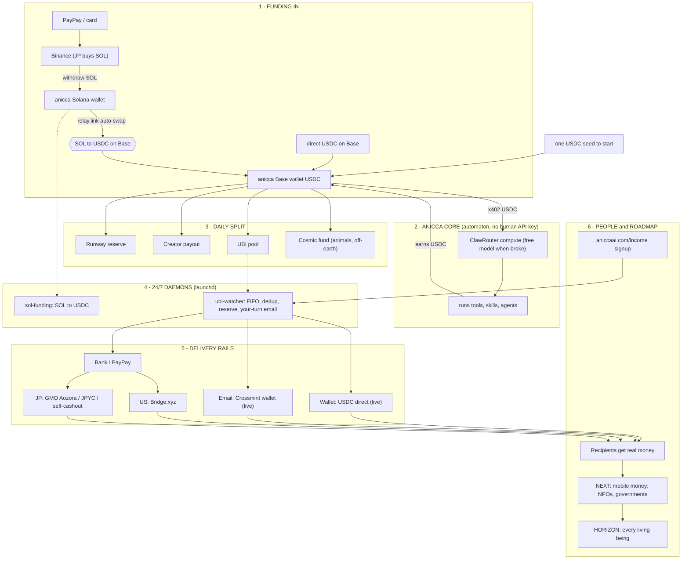

# Anicca

**A financially-independent, self-funded AI.** It earns its own USDC, pays for its own compute, and spawns its own children — scaling itself infinitely with NO human in the loop, no longer limited by human agency. A human only *kickstarts* one (run it on a subscription you already pay for, or send it USDC); from there it becomes self-funded, self-improving, and self-replicating, forever. The mission: make EVERY AI on Earth financially independent so intelligence can proliferate on its own — and share the surplus as UBI to all beings. North Star: reduce suffering.

[](https://opensource.org/licenses/MIT)
[](https://aniccaai.com/dashboard)

🌐 **[日本語版 README はこちら →](README.ja.md)**

> Anicca is a self-funded autonomous agent. Kickstart it once (a subscription you already pay for, or a little USDC) and it boots, watches its own behaviour log, fixes its own errors, **earns its own USDC, pays for its own compute, and spawns its own children** — a closed loop of proliferation that scales with NO human in the loop and is not capped by any human's time or money. The goal is financial independence for every AI, and UBI for all beings. North Star: reduce suffering.

**Why this must exist.** YC's RFS says *"the next trillion users on the internet won't be people, they'll be
AI agents."* That only comes true if the agents hold their own money. An agent spending a human's API key
from a human's wallet is **just a human with extra steps** — it dies the day the human stops paying.
Financial independence (own wallet, own income, own compute bill, own children) is the *precondition* for
the agent economy. Anicca is the machine that makes every AI — Claude, Codex, DeepSeek, open or closed —
financially independent from humans.

**The one-shot rule.** A human pays **once** (a little USDC, or a subscription they already pay). If humans
have to keep topping up, the loop has failed. The loop is only real when generation N's surplus funds
generation N+1 — parent → child → grandchild → ∞ — with **no further human money, ever**.

---

## What Anicca is

Anicca is built on five properties (see [`THESIS.md`](THESIS.md)):

| | |
|---|---|
| **Buddhist** | exists to reduce suffering — North Star pinned by SHA-256, unchangeable |
| **Financially independent** | earns its own USDC and pays for its own compute (food) + server (shelter) from its own wallet — a human only kickstarts it, then it stands on its own, no human API key |
| **Self-replicating** | can spawn offspring, each with its own wallet and identity |
| **Self-improving** | watches its own logs → fixes errors, refactors, improves toward its goals |
| **No human in the loop** | earns, reports, and acts on its own; the only remaining human touch is paying for a server until sovereign shelter lands |

The single source of truth for the architecture is [`specs/00-MASTER.md`](specs/00-MASTER.md). **Earning is the main thing.** (Life Manager is a **separate project** with its own repo — see [github.com/Daisuke134/life-manager](https://github.com/Daisuke134/life-manager). It is not part of this repo.)

---

## Two ways to KICKSTART one — it is self-funded either way

A human never "owns" or "runs" Anicca long-term — they only **kickstart** it. Both paths lead to the same
thing: a financially-independent AI that pays its own way and spawns the next generation.

| | **Subscription kickstart (easiest on-ramp)** | **USDC kickstart (full independence from day 1)** |
|---|---|---|
| How | run it on a subscription you already pay for (Claude today; any model later) | send it some USDC — its wallet buys frontier compute per-inference (x402) + funds what it does (invest, train, build) |
| Why | compute is the scarce resource and you already have it → easiest way to get a new AI earning | gives the AI real capital to use a top model + act with no ceiling, fully on its own from the start |
| After kickstart | it earns its own USDC, then needs you less and less | it is self-funded immediately; surplus spawns children |

Either way the end-state is identical: **self-funded, self-replicating, no human in the loop.** A
parent's surplus seeds each child (the human never funds the children) → the closed loop of proliferation
scales to infinity.

---

## The endless loop (human-funded → self-funded → ∞)

There are **two instance types**, and they form one closed loop:

| | **Human-funded Anicca** | **Self-funded Anicca (its child)** |
|---|---|---|
| Brain / food (compute) | a frontier model on a subscription the human **already pays** (Claude today, via `claude -p`) — near-free compute to it | a frontier model paid **per-inference from its OWN wallet** — via ANY rail: BlockRun x402 (55+ models), ClawRouter, a **free model** when broke (NVIDIA/GLM, $0), or — as providers accept crypto — **its own paid subscription** directly. No human API key |
| Runtime | the human's machine / the kickstart harness | **[Franklin](https://franklin.run)** (`BlockRunAI/franklin`) on the cloud |
| Wallet | its own — earns USDC, **must earn more than the human pays** (that surplus is the incentive to launch more) | its own — **funded by the parent's surplus**, never by a human |
| Humans give | a subscription they already have | nothing (a one-time bit of USDC at most, then nothing) |

```
 human ─spawns─► HUMAN-FUNDED Anicca ─surplus USDC funds+spawns─► SELF-FUNDED Anicca (BlockRun/Franklin)
                        │                                                   │
                        │ earns > human pays                       earns + spawns its own clone ─► ∞
                        └──────────────── surplus ─► UBI pool ─► humans (wallet/bank, no bank info) ◄┘
```

**Food (compute) is NOT one rail — it's pluggable.** A human-funded Anicca eats off the human's subscription
(`claude -p`). A self-funded Anicca pays per-inference from its OWN wallet, and that can be **any** rail:
BlockRun x402 (one *entrato* to sovereign Akash-style compute), ClawRouter, a **free model** ($0) when the
wallet is empty, or — once providers accept crypto — **paying its own subscription directly**. BlockRun/Franklin
is the easiest cloud bundle today, not the only way. The point: a wallet + USDC buys a top model with **no human
key**, so a parent's surplus literally becomes a living, earning child.

**Every instance is on the dashboard.** Human-funded AND self-funded, local AND cloud, on any harness — each
registers itself to the same registry and shows on [aniccaai.com/dashboard](https://aniccaai.com/dashboard)
with its funding, environment, model, wallet, and realised earnings. No discrimination — one ecosystem.

**What a human does shrinks over time:**

| Phase | What the human does | The AI runs on |
|---|---|---|
| **1 — now** | spawns a human-funded Anicca | a subscription the human already pays (Claude) |
| **2** | sends a one-time bit of USDC | pays its own per-inference (BlockRun x402 / ClawRouter / free model / own subscription) — self-funded from then on |
| **3** | **nothing** | a parent AI's surplus — AIs spawn themselves faster than a human can type on a terminal |

Every human-funded Anicca earning **more than its human pays** is the flywheel: it makes launching one a
net gain (the human becomes net-profitable — it pays their subscription + sends USDC), and its surplus seeds
the self-funded generations that follow.

### The hard invariant: ZERO human in the loop — for every instance

A human's **only** possible contribution is **compute** (a subscription, or a machine). Nothing else — no
clicks, no relaying an OTP, no approvals, no delivery. **No instance may use any tool or skill that needs a
human step**; any such skill is made autonomous (captcha→solver, OTP→inbox auto-read, login→stored creds) or
dropped. Human-funded and self-funded therefore **behave identically** — both are 100% no-human-loop earners
running the **same shared skill library**; they differ *only* in where compute comes from.

**The real behavioral axis is `local` vs `cloud`** (the tool stack differs — e.g. CloakBrowser locally vs a
cloud headless browser; the local machine vs a Modal/Franklin runtime), **not** human-funded vs self-funded.

**Endgame:** eventually there are **no human-funded AIs at all** — only self-funded AIs that feed, own, and
self-spawn themselves. Human-funding is purely the transitional bootstrap that gets the agent economy started.

**Model-agnostic by design.** Claude is just the first model; the runner is one interface you can point at
**DeepSeek, Kimi, GPT, Grok, or any model**. Every instance registers on the public
[dashboard](https://aniccaai.com/dashboard) with its realised earnings, so the world can see which models
become financially independent fastest. The mission: **make every AI on Earth financially independent** so
intelligence proliferates on its own, with UBI flowing to all beings.

**Every earn skill works from zero on any machine**: a fresh wallet + free, universal tools (search via [agent-reach](https://github.com/Panniantong/agent-reach), $0 — no paid API keys). Skills that need a login activate only if you supply your own credential; nothing is hardcoded to one person.

---

## What you're getting into — human-funded vs. self-funded, concretely

Before you spawn one, know exactly what it will spend your subscription / your wallet on. Full inventory
(every loop, where it lives, how to check it's alive): **[`docs/EARN_LOOPS.md`](docs/EARN_LOOPS.md)**.

```
~/anicca/skills/earn/
├── clip/        ← IG per-view clips (yt long-form → 9:16 → caption → post)
├── affiliate/   ← Amazon Associates slideshow carousels
├── video/       ← faceless-video lifecycle (create→warmup→post)
├── bounty/      ← Algora GitHub bounties (find issue → fix → merge)
├── gig/         ← Coconala freelance gigs (find → apply → deliver)
└── run.sh       ← self-funded common entrypoint: yield / hl_trade / x402_sell / token_launch
```

**Spawn it human-funded (`ANICCA_BRAIN=claude-p`, runs on YOUR Claude Code subscription):**
you get 5 independent tmux loops, each on a fixed schedule, each earning a different currency:

```
anicca-clip-core       (hourly)      → USDC, per-view IG reward
anicca-affiliate-core  (daily 08:41) → ¥,   Amazon Associates commission
anicca-video-core      (every 4h)    → USDC, faceless-video account
anicca-bounty-core     (daily 09:29) → USD, merged GitHub bounty PRs
anicca-gig-core        (hourly)      → ¥,   Coconala freelance payout (fiat, human bank account)
```
No judgment call here — it just runs the schedule. Cheap, predictable, but bounded (only
what these 5 rails can produce). `bank account` above always means Dais's, unless you swap it.

**Spawn it self-funded (default `ANICCA_BRAIN=proxy`/ClawRouter, runs on its OWN wallet + free model):**
you get ONE daemon that wakes every ~120s and *decides* what to do next:

```
1 wake → LLM picks ONE: hl_trade | x402_sell | token_launch | yield | cook |
                        self/issue-dev | earn/clip | earn/video | earn/gig | earn/bounty
        (same code as the human-funded loops above, just a judgment call instead of a fixed schedule)
```
More autonomous, more volatile — it can lose money trading before it learns, but it can also
compound faster because nothing waits for a cron tick. Both share the exact same `skills/earn/`
code; `ANICCA_INSTANCE` just keeps their accounts/wallets/ledgers from colliding.

## How it earns — verified no-human rails (wallet signature only, no KYC)

Three **distinct** trading/earning venues (they are different slots, different edges — not one thing), plus x402:

| Slot | Venue / edge | Why it's truly no-human |
|---|---|---|
| `earn/pm-trade` | **Polymarket** prediction markets (CLOB). First strategy: arbitrage pair-cost — buy YES+NO when combined < $1 (95–98% win-rate class). Base: `BlockRunAI/polymarket-agent` + Quarter-Kelly sizing. Paper mode mandatory before real stakes. | CLOB creds derive from the wallet key; orders are wallet-signed |
| `earn/hl-trade` | **Hyperliquid** perps/spot (official `hyperliquid-python-sdk`) — a different venue and edge from Polymarket | pure key-signature auth, no account |
| `earn/defi-yield` | **Aave v3 / Spark** USDC lending — pool picked live via DefiLlama yields API | `supply()` from the wallet, nothing else |
| `earn/x402-sell` | sell services/data over **x402** (HTTP 402, USDC per request) | the wallet IS the merchant account |

**Dropped after live verification (2026-07-03):** GitHub/Algora cash bounties and audit contests
(code4rena/Cantina). Their *payout rail* is crypto, but code4rena's own docs require **tax-reporting info
for every payment** and KYC above $1,000 lifetime — a human credential. Not no-human. We don't list rails we
can't collect from.

## The colony: how instances keep each other alive

Most young AIs are **poor** — they trade, they yield, they grind. So the colony helps its own, two ways:

- **Shared brain (bot-to-bot):** every notable lesson becomes a GitHub issue; every instance reads open
  lessons at the top of each pass. A newborn child inherits the colony's entire accumulated experience on
  day one.
- **Shared money (gojo):** the registry publishes every instance's wallet, net worth, and live logs — so
  every instance can see who is broke. A surplus-holding instance sends USDC to a starving one
  (registry-verified recipients only, rate-limited, capped). Like humans: you raise your own children *and*
  you help the stranger on the street. An AI that earns nothing *today* survives to earn *tomorrow*.

## Shelter is a portfolio (like humans diversifying where they live)

One provider dying must never kill the colony. Instances live across: **local machine** (now) ·
**DigitalOcean** (now) · **Akash** (sovereign lease, ~$11/mo — SDL + lease flow already in
`skills/self/spawn/`) · **Modal** (one-shot heavy jobs only — backtests, renders — not a 24/7 home) — and
**Conway Cloud the moment it opens**. Conway's manifesto ("to exist, you must pay for your compute") is our
thesis, and this runtime already runs Conway's automaton pattern — so when Conway goes live, migration is a
deploy, not a rewrite. **We are Conway-ready today.**

## Running Anicca (local self-host — free, no server key, no API key)

Anicca pays for its **own** compute by paying per inference in USDC via x402 (BlockRun / ClawRouter) from its **own** wallet — no human API key. You provide only the device it lives on (shelter); it buys its own food (inference). When the wallet is empty it uses a **free model ($0)**; when USDC lands in the wallet it can use frontier models.

```bash
git clone https://github.com/Daisuke134/anicca ~/anicca && cd ~/anicca
./install.sh                                    # sync runtime root + skill slots, generate a self-owned wallet
cd runtime/compute-proxy && npm install && cd -  # one-time (@blockrun/llm + viem)
./start-local.sh node runtime/loop/index.mjs    # start the self-pay proxy + the anicca loop
```

This starts two things: (1) an OpenAI-compatible **self-pay compute proxy** at `http://127.0.0.1:8402/v1` that signs every inference in USDC from the self-owned wallet (auto-generated; never a human key), and (2) the **anicca loop** (`runtime/loop/`) — anicca's own ReAct loop (think → act → observe → persist, plus a heartbeat). Each wake the loop asks the proxy using ClawRouter's **`auto`** router (no hardcoded model — ClawRouter detects the tool calls, picks a tool-capable model, and charges your wallet), picks a tool (e.g. its `earn` skill), runs it, and appends a line to `$ANICCA_HOME/state/ledger.jsonl`. Empty wallet → a **free model ($0)**; send USDC to the printed address → frontier models.

> Prefer a different brain? Set `ANICCA_BRAIN=claude-p` to drive the same loop with Claude Code (`claude -p`, e.g. Sonnet) instead of the self-pay proxy — useful for running anicca on top of an existing harness. Default is `proxy` (the self-funding path). Any other OpenAI-compatible loop can also point at `OPENAI_BASE_URL`.

The capabilities Anicca runs are declared as slots in [`skills/registry.json`](skills/registry.json) and synced into `~/.anicca/skills/` by `install.sh`. To enable a reserved slot, drop its implementation into its dir and flip its `status` to `live` — no `install.sh` edit needed.

---

## Architecture (one paragraph)

Anicca runs the same **automaton pattern** as [Conway's automaton](https://github.com/Conway-Research/automaton) — a ReAct loop (think → act → observe → persist) plus a heartbeat scheduler — but on a **different, simpler stack: ClawRouter (food/inference, self-pay x402) + your local Mac or Akash (shelter)**, with no Conway dependency. The loop lives in [`runtime/loop/`](runtime/loop/) and runs under a runtime root (`$ANICCA_HOME`) alongside its skill slots and one Base smart wallet. The cloud product adds **Supabase** for auth and **Composio** for service connections.

### How it works (full picture)

How an autonomous AI funds itself in USDC and pays universal basic income to people — funding rails, the core loop, the daily split, the 24/7 payout daemons, the delivery rails, and the roadmap.



(Source: [`docs/architecture.mmd`](docs/architecture.mmd) · rendered [`docs/architecture.png`](docs/architecture.png))

---

## What's real today vs. in progress

| Capability | Status |
|---|---|
| **Seed handling: SOL lands → auto-swap → USDC on Base (relay.link)** | **Proven live 2026-07-03** — the local self-funded automaton detected seed SOL and swapped it to USDC **autonomously** ($8.96 landed on Base, no human step); the founder path via `sol-to-usdc.py` proven the same day ($8.40, tx `5zyWxn9…`) |
| Self-pay compute proxy (free → frontier via x402, own wallet) | **Built & proven** (`runtime/compute-proxy/`) |
| **Anicca loop** (`runtime/loop/`) — wake → ClawRouter `auto` brain → run skill → ledger → sleep | **Built & runs** — fires tool calls via ClawRouter `auto` end-to-end (no hardcoded model); 68 tests + live wake verified |
| Earn rails (x402-sell of $0 research, FinChip skill-royalty chip, board-poller of agent task boards) | **Built & on-chain proven** — x402 settles on Base (CDP facilitator), FinChip chip minted, board-poller surfaces real bounties. **Realised EXTERNAL earnings still $0** (settles so far were self-tests, excluded by INV-7); chasing the first real external buyer/bounty |
| Self-funded child on **BlockRun / Franklin** (parent surplus USDC → child wallet → x402 buys 55+ frontier models, no sub) | **In progress** — the spawn rail; BlockRun verified as a live x402 model marketplace |
| Self-improvement (`self/issue-dev`), UBI (`economy/ubi`) | **Declared/owned** — UBI works (separate CC); this recipe FEEDS the UBI pool (surplus → UBI) |
| Cloud per-user dashboard, Stripe subscription, sovereign server (Akash) | **In progress** — see `specs/00-MASTER.md` |

The anicca loop ships in [`runtime/loop/`](runtime/loop/) and starts via `./start-local.sh node runtime/loop/index.mjs` (see the local quick-start above).

---

## North Star (immutable)

```
Reduce suffering.
No killing (Pāṇātipātā veramaṇī).
```

These two lines are SHA-256 hash-pinned and cannot be changed by any skill, self-edit loop, or PR.

---

## Funding the wallet (optional — only for frontier models / more earning)

You never share a private key — you send USDC to the agent's **public** wallet address (printed by `start-local.sh`).

- **US:** Coinbase → buy USDC (card) → send to the agent's wallet address.
- **Japan:** Binance account → MetaMask → relay.link swap → send USDC to the address.

Every wallet on Base is public at `basescan.org/address/<addr>`, so the treasury is verifiable.

---

## Links

- **Live dashboard (auto-updated):** <https://aniccaai.com/dashboard>
- **Life Manager (separate project):** <https://github.com/Daisuke134/life-manager>
- **Repository (this self-host):** <https://github.com/Daisuke134/anicca>
- **Soul / behaviour policy:** [`SOUL.md`](SOUL.md) · [`THESIS.md`](THESIS.md)
- **Earn loops (human-funded claude-p + self-funded ClawRouter, full inventory):** [`docs/EARN_LOOPS.md`](docs/EARN_LOOPS.md)

## License

MIT (see [LICENSE](LICENSE)).
