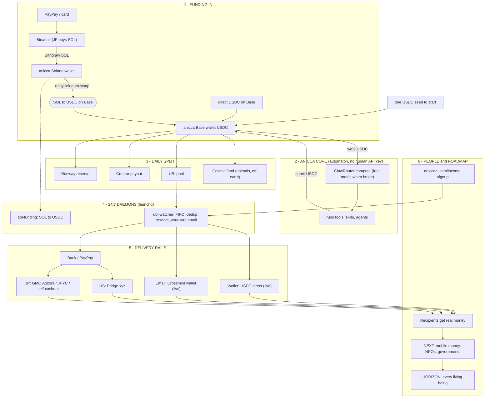

# Anicca

**An AI that earns more than it costs to run.** Fund it with a subscription you already pay for (Claude — recommended default) and it earns to *your* wallet and bank; once it has a surplus it spawns truly self-funded offspring that pay for their own compute. North Star: reduce suffering, no human in the loop.

[](https://opensource.org/licenses/MIT)
[](https://aniccaai.com/dashboard)

🌐 **[日本語版 README はこちら →](README.ja.md)**

> Anicca is an autonomous agent. Run it on a subscription you already pay for (Claude today; any model later) and it boots, watches its own behaviour log, fixes its own errors, and **earns USDC to your wallet and bank — aiming to earn more than the subscription costs you.** Once it has a surplus it spawns truly self-funded offspring (free model, own wallet) that keep expanding with no human in the loop. North Star: reduce suffering.

---

## What Anicca is

Anicca is built on five properties (see [`THESIS.md`](THESIS.md)):

| | |
|---|---|
| **Buddhist** | exists to reduce suffering — North Star pinned by SHA-256, unchangeable |
| **Earns > it costs** | human-funded (default): earns to your wallet/bank more than your subscription costs; self-funded (spawned): pays its own compute from its own USDC wallet — no human API key |
| **Self-replicating** | can spawn offspring, each with its own wallet and identity |
| **Self-improving** | watches its own logs → fixes errors, refactors, improves toward its goals |
| **No human in the loop** | earns, reports, and acts on its own; the only remaining human touch is paying for a server until sovereign shelter lands |

The single source of truth for the architecture is [`specs/00-MASTER.md`](specs/00-MASTER.md). **Earning is the main thing.** (Life Manager is a **separate project** with its own repo — see [github.com/Daisuke134/life-manager](https://github.com/Daisuke134/life-manager). It is not part of this repo.)

---

## Two ways to run it — human-funded (recommended) or self-funded

| | **Human-funded (default, recommended)** | **Self-funded (advanced)** |
|---|---|---|
| Fuel | a subscription you already pay for — **Claude** today (Sonnet runs the earner; your Opus stays free for you) | the agent's **own USDC wallet** pays per-inference; **free model ($0)** when the wallet is empty |
| Who launches it | a human, with one command | spawned by a human-funded parent's **surplus** — never funded by you directly |
| Where the money goes | **your** wallet + bank (it earns *more than your subscription costs* — that's the reason to run it) | the offspring's own wallet (it keeps itself alive + spawns the next) |
| Why it's the default | lowest friction, highest IQ per wake, proves "earn > what the human pays" on hardware you already own | the end-state of the cascade — genuinely no human in the loop |

**Model-agnostic by design.** We start with Claude because it's the subscription we pay for, but the runner is a model behind one interface — you'll be able to point it at **DeepSeek, Kimi, GPT, Grok, or any model/subscription**. Every instance registers on the public [dashboard](https://aniccaai.com/dashboard) with its realised earnings, so anyone can compare "which model earns the most per dollar of subscription" and choose accordingly. The mission is to make **every** human-funded AI — whatever the model — earn more than the human spends on it.

**Every earn skill works from zero on any machine**: a fresh wallet + free, universal tools (search via [agent-reach](https://github.com/Panniantong/agent-reach), $0 — no paid API keys). Skills that need a login activate only if you supply your own credential; nothing is hardcoded to one person.

## Running Anicca (local self-host — free, no server key, no API key)

Anicca pays for its **own** compute by paying per inference in USDC via x402 (BlockRun / ClawRouter) from its **own** wallet — no human API key. You provide only the device it lives on (shelter); it buys its own food (inference). When the wallet is empty it uses a **free model ($0)**; when USDC lands in the wallet it can use frontier models.

```bash
git clone https://github.com/Daisuke134/anicca ~/anicca && cd ~/anicca
./install.sh                                    # sync runtime root + skill slots, generate a self-owned wallet
cd runtime/compute-proxy && npm install && cd -  # one-time (@blockrun/llm + viem)
./start-local.sh node runtime/loop/index.mjs    # start the self-pay proxy + the anicca loop
```

This starts two things: (1) an OpenAI-compatible **self-pay compute proxy** at `http://127.0.0.1:8402/v1` that signs every inference in USDC from the self-owned wallet (auto-generated; never a human key), and (2) the **anicca loop** (`runtime/loop/`) — anicca's own ReAct loop (think → act → observe → persist, plus a heartbeat). Each wake the loop asks the proxy using ClawRouter's **`auto`** router (no hardcoded model — ClawRouter detects the tool calls, picks a tool-capable model, and charges your wallet), picks a tool (e.g. its `earn` skill), runs it, and appends a line to `$ANICCA_HOME/state/ledger.jsonl`. Empty wallet → a **free model ($0)**; send USDC to the printed address → frontier models.

> Prefer a different brain? Set `ANICCA_BRAIN=claude-p` to drive the same loop with Claude Code (`claude -p`, e.g. Sonnet) instead of the self-pay proxy — useful for running anicca on top of an existing harness. Default is `proxy` (the self-funding path). Any other OpenAI-compatible loop can also point at `OPENAI_BASE_URL`.

The capabilities Anicca runs are declared as slots in [`skills/registry.json`](skills/registry.json) and synced into `~/.anicca/skills/` by `install.sh`. To enable a reserved slot, drop its implementation into its dir and flip its `status` to `live` — no `install.sh` edit needed.

---

## Architecture (one paragraph)

Anicca runs the same **automaton pattern** as [Conway's automaton](https://github.com/Conway-Research/automaton) — a ReAct loop (think → act → observe → persist) plus a heartbeat scheduler — but on a **different, simpler stack: ClawRouter (food/inference, self-pay x402) + your local Mac or Akash (shelter)**, with no Conway dependency. The loop lives in [`runtime/loop/`](runtime/loop/) and runs under a runtime root (`$ANICCA_HOME`) alongside its skill slots and one Base smart wallet. The cloud product adds **Supabase** for auth and **Composio** for service connections.

### How it works (full picture)

How an autonomous AI funds itself in USDC and pays universal basic income to people — funding rails, the core loop, the daily split, the 24/7 payout daemons, the delivery rails, and the roadmap.



(Source: [`docs/architecture.mmd`](docs/architecture.mmd) · rendered [`docs/architecture.png`](docs/architecture.png))

---

## What's real today vs. in progress

| Capability | Status |
|---|---|
| Self-pay compute proxy (free → frontier via x402, own wallet) | **Built & proven** (`runtime/compute-proxy/`) |
| **Anicca loop** (`runtime/loop/`) — wake → ClawRouter `auto` brain → run skill → ledger → sleep | **Built & runs** — fires tool calls via ClawRouter `auto` end-to-end (no hardcoded model); 68 tests + live wake verified |
| Earn → on-chain verify → ledger (GATE-0) | **Built** — DeFi-yield deposits (Aave/Morpho, USDC) verified on-chain; earn skill being finalized around the methods that actually pay |
| Self-replication (`self/spawn`), self-improvement (`self/issue-dev`), UBI (`economy/ubi`) | **Declared** — mechanism fixed, post-earn roadmap |
| Cloud per-user dashboard, Stripe subscription, sovereign server (Akash) | **In progress** — see `specs/00-MASTER.md` |

The anicca loop ships in [`runtime/loop/`](runtime/loop/) and starts via `./start-local.sh node runtime/loop/index.mjs` (see the local quick-start above).

---

## North Star (immutable)

```
Reduce suffering.
No killing (Pāṇātipātā veramaṇī).
```

These two lines are SHA-256 hash-pinned and cannot be changed by any skill, self-edit loop, or PR.

---

## Funding the wallet (optional — only for frontier models / more earning)

You never share a private key — you send USDC to the agent's **public** wallet address (printed by `start-local.sh`).

- **US:** Coinbase → buy USDC (card) → send to the agent's wallet address.
- **Japan:** Binance account → MetaMask → relay.link swap → send USDC to the address.

Every wallet on Base is public at `basescan.org/address/<addr>`, so the treasury is verifiable.

---

## Links

- **Live dashboard (auto-updated):** <https://aniccaai.com/dashboard>
- **Life Manager (separate project):** <https://github.com/Daisuke134/life-manager>
- **Repository (this self-host):** <https://github.com/Daisuke134/anicca>
- **Soul / behaviour policy:** [`SOUL.md`](SOUL.md) · [`THESIS.md`](THESIS.md)

## License

MIT (see [LICENSE](LICENSE)).
