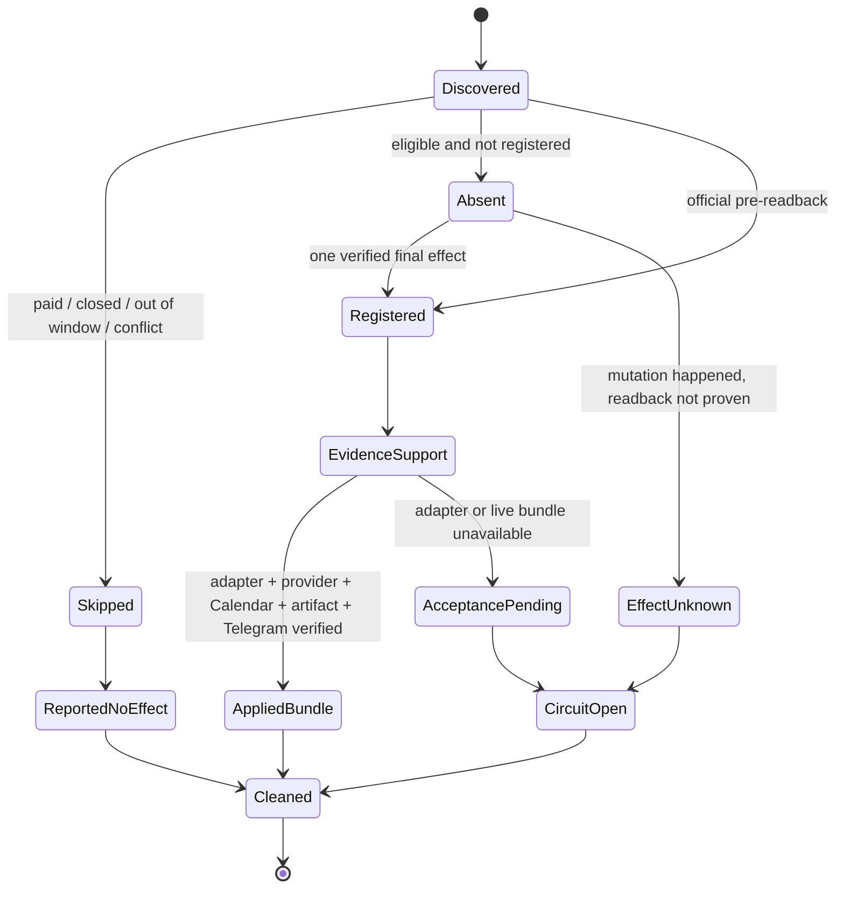

<!-- startup-context-version: 2026-08-27.2 -->
<!-- startup-context-digest: 9fbe6198c6d61da47d68767eec90a1d95d2e07058f024448d86372b5f3035338 -->
# Life Manager

**Life Manager is a proactive general agent that manages your body, mind, and money.** It turns goals into
completed real-world actions, acts within delegated boundaries, verifies what happened, and reports the result
in plain language with evidence in Telegram. Its mission is to make dependable care and agency continuously
available and end suffering for humans and, ultimately, all living beings.

| Group | What Life Manager manages through its loops |
|---|---|
| **Daily** | Calendar, event and accelerator applications, job applications, priorities, and follow-through |
| **Physical / Mental** | Routines, wellbeing, and continuity of care |
| **Financial** | Net worth, cash flow, spending, income and business opportunities, crypto, risk-managed investing, and self-funding compute from banked revenue |

[Open Life Manager](https://aniccaai.com/lm) · [Start in Telegram](https://t.me/LifeManagerBotbot?start=lp) · [View the source](https://github.com/Daisuke134/life-manager)

Run the free, open-source, self-hosted Life Manager locally and keep your data on your machine; use the paid
monthly cloud service when you want an always-on manager with only a phone. Both surfaces use the **same core**,
evidence ledger, and human-readable reporting contract. Life
Manager never guarantees wealth or investment returns, and it never reports an attempted action as completed
without a receipt.

## The general agent we are building

Life Manager is not a collection of website-specific bots. We are building one durable general agent that can
discover an opportunity, decide whether it can complete the work profitably, propose and negotiate, produce and
QA the deliverable, submit it, and follow the same identity through payment and payout. Upwork was the first
marketplace investigation; it is now cleanly contained because the account is not eligible for API access and UI
automation is denied. That is evidence about a provider boundary, not a completed commerce proof and not a reason
to stop the general-agent work. Approved providers must reuse the same agent, commerce state, capabilities, and
money-effect contract; their differences belong in a small provider manifest and official readback adapter.

The architecture is converging by copying and adapting proven boundaries from
[DeepAgentsJS/LangGraph](https://github.com/langchain-ai/deepagentsjs) for the specialist harness and durable state,
[browser-use](https://github.com/browser-use/browser-use) for the website-tool contract,
[OpenClaw](https://github.com/openclaw/openclaw) for the current local wake and channels, and
[Steel](https://github.com/steel-dev/steel-browser) for the hosted browser backend. Existing Life Manager
`EffectIntent` and `ConnectorOutbox` rails remain the only path for irreversible money actions. The completion
signal is an official `banked` receipt—not an application, click, model claim, contract, or pending balance.

The founder attests that Life Manager has generated approximately $1,000 in revenue. This is not MRR or ARR, and
it is not proof that a provider-independent autonomous commerce loop is closed. That loop remains proven only by
official receipts through `banked` and, eventually, `compute_paid`.

**Life Manager is the product. Anicca is the company name only when a form explicitly asks for it.**

[](https://opensource.org/licenses/MIT)

🌐 **[日本語版 README はこちら →](README.ja.md)**

**Repository SSOT:** this repository, [`Daisuke134/life-manager`](https://github.com/Daisuke134/life-manager), is the only Life Manager code, spec, release, workflow, and deployment source. `Daisuke134/life-manager-v0` is a read-only migration source until its required-code and runtime-reference counts reach zero. The current ordered execution plan and remaining work are maintained in [`docs/superpowers/specs/2026-08-01-dais-life-manager-five-phase-execution-spec.md`](docs/superpowers/specs/2026-08-01-dais-life-manager-five-phase-execution-spec.md); repository consolidation history remains in [`docs/superpowers/specs/2026-07-19-anicca-one-repo-consolidation-spec.md`](docs/superpowers/specs/2026-07-19-anicca-one-repo-consolidation-spec.md).

---

## Quick start

### Use it — cloud (nothing to install)

[Start in Telegram](https://t.me/LifeManagerBotbot?start=lp), or open the
[web app](https://aniccaai.com/lm). The always-on service runs the scheduler, the connectors, and the
authenticated `/panel`; you talk to it in Telegram and it reports back there with receipts.

### Run it yourself — local (your machine holds the data)

To start the Job Hunter loop on an Apple Silicon Mac:

```bash
/bin/bash -c "$(curl -fsSL https://raw.githubusercontent.com/Daisuke134/life-manager/main/scripts/bootstrap-job-hunter.sh)"
```

The command installs only missing dependencies, asks for the finalized resume and
job preferences in Terminal, and opens the dedicated CloakBrowser for official
login. It also installs `gog`, opens Gmail OAuth for the application email, and asks
for the owner's Telegram bot token privately plus numeric chat ID. Finish the
official login, then run the exact same command again. Life Manager verifies Gmail
and a real Telegram message ID before starting the owners. Passwords, OTPs and bot
tokens are never printed or committed.

Job Hunter is pre-release until Dais's installed 30-minute Workday loop closes the
current production acceptance: dynamic discovery, fit-qualified application,
descriptive loop-owned Telegram, official Gmail/Ledger proof and duplicate zero.
Ashby, Greenhouse, Lever, Mercor and generic ATS lanes are not working products.

### Run the server stack yourself

Requires Docker. The local stack is Postgres + an object store + the API, scheduler, and worker — the same core
the cloud runs.

```bash
git clone https://github.com/Daisuke134/life-manager ~/life-manager && cd ~/life-manager
./scripts/local-up.sh
```

That is the whole thing. It writes `deploy/local/.env` if you don't have one (generating a password for the
local object store instead of shipping one), brings up postgres · object store · api · scheduler · worker, and
**waits until every service reports healthy** before printing anything — so "it started" means it can serve, not
just that containers exist. First run builds the image and takes a few minutes.

```
./scripts/local-up.sh status    what is running
./scripts/local-up.sh logs      follow the logs
./scripts/local-up.sh down      stop it (your data survives)
```

On macOS, explicitly select repository loops to supervise with launchd. There
is no default list: Life Manager never starts private-provider or external-effect
loops merely because the repository was cloned.

```bash
./scripts/local-up.sh loops-init
./scripts/local-up.sh loops-up <loop-id> [<loop-id> ...]
./scripts/local-up.sh loops-status
./scripts/local-up.sh loops-down
```

`loops-init` creates or validates the canonical user-owned credential store
without adding any secret values. The selection is saved in
`~/.config/life-manager/loops`. Model-backed or
effectful selections fail before installation unless the user's own
`~/.local/share/anicca/credentials.json` exists with parent mode `700` and file
mode `600`. `loops-status` reports the same launchd, release, provider, blocker,
terminal-result, and effect fields as `lm-loop status`; process liveness is not
reported as business success.

The API listens on `http://localhost:18788` and the worker exposes health on `:18790` (both overridable in
`deploy/local/.env`). Your data stays in the local Postgres and object store — nothing is shipped anywhere by
running this.

**Secrets are referenced, never inlined.** Jobs carry `secret://…` references and resolve them from the local
keychain or a tenant vault; see [`apps/life-manager/.env.example`](apps/life-manager/.env.example) for the shape
(`TELEGRAM_BOT_TOKEN_REF`, `POSTIZ_ACCESS_TOKEN_REF`, `REVENUECAT_API_KEY_REF`, …). Connect your own Telegram bot
token this way to talk to a local instance.

### Self-funding is part of the Financial Organ

The wallet and compute-payment loop in [`docs/agent-economy.md`](docs/agent-economy.md) is not a separate product.
It is Life Manager's Financial capability: provider revenue must become `banked` before it can fund
`compute_paid`, and owner funds must remain separate.

---

## One product, two execution surfaces

Life Manager is one product in one repository. “Local Life Manager” and the web app are not separate products or repositories; they are two execution surfaces powered by the same core, capabilities, and state contracts.

```text
                              LIFE MANAGER
                    one product · one repository
                                 │
             ┌───────────────────┴───────────────────┐
             │                                       │
     LOCAL / SELF-HOSTED                      WEB / CLOUD
     deploy/local/compose.yaml                 apps/landing
          │                                  web entry
          ▼                                       │
     apps/life-manager                             ▼
     api · scheduler · worker            apps/life-manager
          │                              Telegram · voice
          ▼                              scheduler · /panel
     postgres · object store                       │
     (your machine)                                ▼
             │                              user-scoped services
             └───────────────────┬───────────────────┘
                                 │
                shared economy and infrastructure
        runtime/loop · runtime/compute-proxy · services/x402-*
```

| Path | Role | What it is not |
|---|---|---|
| `apps/life-manager/` | The product core: Telegram, scheduling, calls, authenticated `/panel`, billing, and user workflows. Runs both locally (compose) and in the cloud (Railway) | Not the whole repository |
| `deploy/local/` | The local execution surface — compose stack, ports, local-only credentials | Not a separate “local edition” product |
| `apps/landing/` | The Life Manager onboarding web subset | Not the old multi-product Anicca website |
| `runtime/loop/`, `install.sh`, `start-local.sh` | Economic runtime supporting Life Manager's Financial Organ — see [`docs/agent-economy.md`](docs/agent-economy.md) | Not the whole product or the normal user entry point |
| `runtime/compute-proxy/`, `services/` | Compute-payment and x402 settlement/API infrastructure for the same Financial capability | Not user-facing apps |
| `skills/` | Shared capabilities used by local and cloud execution | Not independent products |
| `apps/job-search-loop/`, `control-room/`, `adapters/` | Supporting operations, fleet documentation, and integrations | Not another Life Manager codebase |
| `docs/`, `specs/` | Current SSOT, evidence, and retained architecture history | Historical files are not automatically current authority |

Some internal package names, environment variables, service labels, and older documents still use `anicca`. In this repository, **Anicca is the company/technical namespace; Life Manager is the product**. A remaining `anicca` identifier does not imply a second product or another canonical repository.

---

## Connector agent — how event applications work

Connector is the local Life Manager agent that fills a rolling 28-day Tokyo event horizon. It ranks YC hackathons, open lightning talks, AI, crypto, and startup events first; applies only to strong or moderate matches; uses Luma as the primary actionable source and the official connpass v2 API as the primary read-only fallback; then uses the remaining rails only after both primary sources are exhausted. It verifies provider results and reports evidence-backed outcomes in Telegram. It is not a blind form-filler: a click is never treated as success by itself.

```mermaid
flowchart LR
    TRIGGER["Hourly launchd trigger<br/>or supervised launchd kickstart"] --> ENTRY["run.sh<br/>single lock + heartbeat"]
    ENTRY --> CAL["Google Calendar<br/>28-day busy inventory"]
    CAL --> RAIL["One CloakBrowser target<br/>one owned page"]

    subgraph LOOP["Forward-only provider loop"]
        PROVIDERS["Luma action → connpass API advisory<br/>→ remaining fallback rails"]
        DISCOVER["Provider discovery<br/>privacy-safe count audit"]
        GATE{"Free · open · Tokyo · in window<br/>and Calendar-safe?"}
        NEXT["Next candidate<br/>or next provider"]
        PROVIDERS --> DISCOVER --> GATE
        GATE -->|No| NEXT --> PROVIDERS
    end

    RAIL --> PROVIDERS
    GATE -->|Yes| NAV["Navigate on the same page"]
    NAV --> PRE{"Official parent / child-frame readback<br/>already registered?"}
    PRE -->|Yes| SUPPORT
    PRE -->|No| CACHE["Verified action cache"]
    CACHE -->|registered / pending| SUPPORT
    CACHE -->|not completed| DIRECT["Provider script-first action"]
    DIRECT -->|completed| POST
    DIRECT -->|effect unknown| CIRCUIT
    DIRECT -->|safe not completed| HARNESS["Bounded Browser Harness<br/>observe → propose → operate"]
    HARNESS -->|completed| POST{"Official parent / child-frame readback<br/>registered or pending?"}
    HARNESS -->|safe failure / auth required| NEXT
    POST -->|No / safe failure| NEXT
    POST -->|Yes| SUPPORT

    subgraph EVIDENCE["External proof — agent self-report is insufficient"]
        SUPPORT{"Evidence adapter<br/>available?"}
        PROVE["Provider receipt / state"] --> GCAL["Idempotent Calendar write<br/>plus independent readback"]
        GCAL --> PNG["Privacy-safe screenshot<br/>and SHA-256"]
        PNG --> TG["Telegram message + photo<br/>positive provider IDs"]
        TG --> BUNDLE["Durable applied_bundle"]
    end

    SUPPORT -->|Yes| PROVE
    SUPPORT -->|No| EVIDPENDING["Acceptance pending<br/>no applied_bundle claim"]

    NEXT -->|All exhausted| NOEFFECT["completed_no_effect<br/>healthy external write 0"]
    HARNESS -->|effect unknown| CIRCUIT["circuit_open<br/>effect unknown · evidence failure · safety threshold"]
    EVIDPENDING --> CIRCUIT
    BUNDLE --> REPORT["Durable wake report"]
    NOEFFECT --> REPORT
    CIRCUIT --> REPORT
    REPORT --> CLEAN["Release owned target and lock<br/>leave unrelated tabs untouched"]
    CLEAN --> TERMINAL{"Terminal result"}
    TERMINAL -->|applied_bundle / completed_no_effect| HEALTHY["worker_finished<br/>process exit 0"]
    TERMINAL -->|circuit_open| FAILED["worker_failed<br/>non-zero exit"]
    ENTRY -. startup / contract error .-> FAILED
```





| Provider | Production rail | Acceptance status |
|---|---|---|
| Luma | Discovery, action, readback, evidence | Live bundle proven |
| Connpass | Official v2 API discovery only; Telegram action boundary | API application submitted; key and explicit automated-action permission remain external gates |
| Peatix | Discovery, action, readback, evidence | Live bundle proven |
| Meetup | Discovery, action, readback, evidence | Connected; current strict candidates conflict with Calendar |
| Doorkeeper | Discovery, action, readback, evidence | Connected; all four current eligible candidates conflict with Calendar, so live bundle remains pending |
| Eventbrite | Three-page discovery, ticket/attendee/final action, child-frame readback, evidence | Connected; current production inventory has no eligible candidate, so external write is correctly zero |
| TECH PLAY | RSS/detail discovery, input/review/final action, registered readback, evidence | Connected; all three current eligible candidates conflict with Calendar, so live bundle remains pending |
| KokuchPro | Official listing/detail discovery, strict free/Tokyo/open gate, entry/login readback, bounded Harness | Connected; current official first page has no event inside the 28-day window. Login is classified as `auth_required` and safely hands off without private-value or retry effects |

Safety invariants: one hourly schedule owner, one browser target per wake, one external mutation at most per wake, `effect_unknown` means no retry, private form values never enter action history, and only an `applied_bundle` proves a new completed application. A verified open lightning-talk application consumes that wake's effect budget before attendance; payment, CAPTCHA, identity verification, and unknown required fields always stop for human action. `completed_no_effect` is a healthy process result with zero new external writes. Current evidence and remaining gates live in the [Connector execution SSOT](docs/superpowers/specs/2026-08-01-dais-life-manager-five-phase-execution-spec.md).

### Connector local install and uninstall

Keep private identity, Calendar, Telegram, Gemini, and connpass values in a mode-0600 file outside the repository. The connpass key is optional while its official application is pending; without it, connpass discovery fails closed and no browser fallback is attempted.

1. Run `skills/connector/render-launchd.sh` into a private temporary directory, passing the canonical repository root, a private Life Manager state directory, and the external connector env file.
2. Validate the rendered plist with `plutil -lint`. Install only `ai.anicca.life-manager-connector-native.plist` in the user's `Library/LaunchAgents`, mode 0600.
3. Run `bin/launchctl-safe preflight`, then bootstrap only `ai.anicca.life-manager-connector-native`. Read it back with `bin/launchctl-safe print gui/$UID/ai.anicca.life-manager-connector-native`; it must show `StartInterval = 3600`, one label, and no `StartCalendarInterval`, `RunAtLoad`, or `KeepAlive`.
4. To uninstall, boot out that exact label through `bin/launchctl-safe`, remove only its exact installed plist, and preserve the external env file, state, receipts, Calendar entries, and unrelated browser tabs.

The renderer deliberately refuses to write directly into `Library/LaunchAgents`. This keeps rendering and live launchd mutation as separate, auditable steps.

Current canonical acceptance: PR `#1936` established the production baseline at `4f1960592`, and follow-up PR `#1947` merged the final documentation plus provider-specific fallback budget fix at `f1a13b2e7`. The post-baseline production wake traversed all seven configured providers and KokuchPro on one owned page, reused existing bundles without a duplicate external effect, delivered a positive Telegram receipt, restored the exact unrelated browser pages, released the lock, and exited zero. Generic providers now fail closed above the Browser Harness 10-step limit while TECH PLAY retains its reviewed 15-step flow. The only remaining event-rail work is conditional: Meetup, Doorkeeper, Eventbrite, and TECH PLAY need a future Calendar-safe live candidate before their first real `applied_bundle` can be proven.

---

## What's real today (honest)

| Capability | Status |
|---|---|
| **Local stack** (`deploy/local/compose.yaml`) — postgres · object store · api · scheduler · worker | **Runs** — the five services come up healthy and stay up (observed running for days on the maintainer's machine). |
| **Cloud service** (`apps/life-manager`, `node server.js` on Railway) | **Deployed** — the scheduler and API are the same code the local stack runs. |
| **Telegram reporting with receipts** | **Live** — every report carries a message id, and a send that fails is not recorded as sent. |
| **Calendar, connectors, coverage** (`lib/calendar-*`, `lib/connector-*`) | **Implemented, coverage still moving** — per-connector state and gaps are tracked in the execution spec rather than claimed here. |
| **Financial loops** (net worth, cash flow, payouts, ledgers) | **Partial** — the ledger and payout jobs exist; their current health is tracked in the execution spec. Nothing here is an investment guarantee. |
| **Self-funding economic loop** | **Financial capability in progress** — current state and on-chain evidence live in [`docs/agent-economy.md`](docs/agent-economy.md); do not infer `banked` or `compute_paid` without those receipts. |

---

## North Star (immutable)

```
Reduce suffering.
No killing (Pāṇātipātā veramaṇī).
```

These two lines are SHA-256 hash-pinned and cannot be changed by any skill, self-edit loop, or PR.

---

## Links

- **Product:** <https://aniccaai.com/lm> · [Telegram](https://t.me/LifeManagerBotbot?start=lp)
- **Live dashboard (auto-updated):** <https://aniccaai.com/dashboard>
- **The agent economy underneath:** [`docs/agent-economy.md`](docs/agent-economy.md)
- **Repository (whole product):** <https://github.com/Daisuke134/life-manager>
