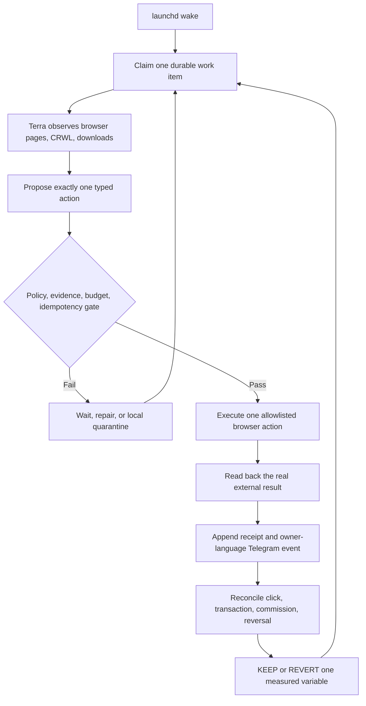
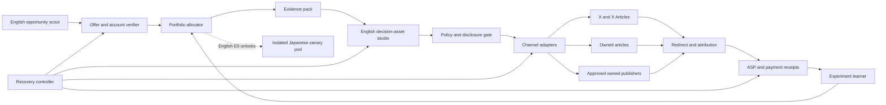
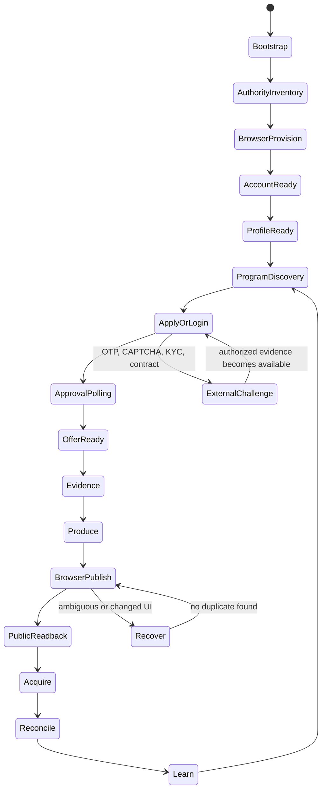
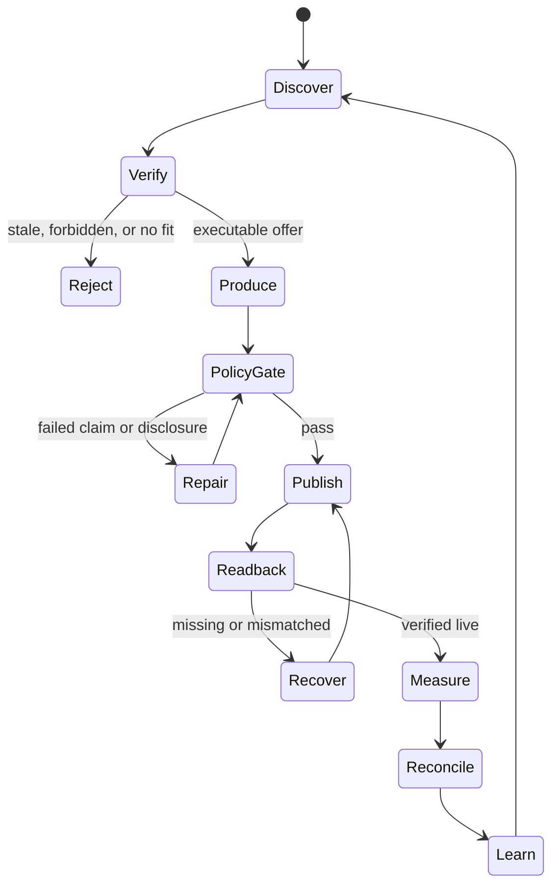

# Affiliate Agent — Revenue, Runtime, and Architecture SSOT

Last updated: 2026-08-06 JST

Implementation SSOT:

- Design and completion contract:
  `docs/superpowers/specs/2026-08-05-affiliate-agent-design.md`
- Atomic RED → GREEN → E2E plan:
  `docs/superpowers/plans/2026-08-05-affiliate-agent.md`

The ordered backlog in section 9 remains the product-level summary. The atomic
plan is authoritative for implementation order, exact files, tests, commits,
live verification, revenue gates, tenantization, and scale work.

## 0. Objective

Build one Affiliate Agent inside Life Manager's financial organ that launches in
English first and later operates isolated English and Japanese market pods. It
continuously discovers lawful offers, publishes useful evidence-led content,
attributes clicks and conversions, records external commission
receipts, repairs interrupted runs, and reallocates effort without daily human or
Codex operation.

English and Japanese never share one social identity, publication history,
attribution cohort, or experiment. English is first. The verified English X
identity is now `sela` / `@selawmqt`, logged in through the isolated
`capafy-mkt-provision` CloakBrowser profile; legacy `@aniccaen` is not an active
X username. Postiz and every external publishing API are out of scope by product
decision. The Agent itself must provision an isolated browser profile, recover or
establish the authorized user account, configure the profile, publish through the
rendered website, and verify the public result. A dedicated Japanese canary is
admitted only after English Gate E0 and uses a different browser profile.

“End to end” begins on a scratch computer. Installation, encrypted authority
inventory, browser/profile provisioning, account discovery/signup/recovery,
rebranding, affiliate application, offer approval polling, research, content,
browser publication, acquisition experiments, click attribution, provider
dashboard/CSV reconciliation, Telegram reporting, recovery, and learning are all
Agent states. None is an operator setup checklist masquerading as a prerequisite.

The machine cannot guarantee $10,000, $10,000,000, or $100,000,000 revenue. It guarantees
measurable attempts, honest receipts, bounded experiments, compliance gates, and
same-run recovery. Revenue targets are gates, not claims or forecasts.

Affiliate commission belongs only to this Agent's ledger. Writer Agent revenue
continues to mean direct payment for writing; shared research and editorial
techniques do not merge the ledgers.

## 1. Measured current state

| Surface | Observation | Runtime decision |
|---|---|---|
| Amazon Associates Japan | Browser confirmed an existing Amazon.co.jp account for the private SSOT application email. No password exists in Chrome or macOS Keychain; password recovery sent an OTP to the masked matching mailbox, but no currently authenticated Gmail or macOS Mail authority could read it. No Associates application was submitted | `AUTH_RECOVERY_OTP_REQUIRED`; resume the same recovery intent only after authorized mail access is available, then inspect existing Associates state before creating any application |
| Kit | A real PartnerStack application was submitted with truthful Anicca, website, `@selawmqt`, audience-size, channel, country, and region fields. The rendered confirmation says `Application received!` and that Kit review will update the application email | `APPLICATION_PENDING`; poll email/PartnerStack without reapplying. Approval, PartnerStack account setup, payout details, and tracking link remain unproven |
| Rakuten Affiliate | CDP rendered the public home page with `ログイン`; approval state is not observable | `AUTH_REQUIRED`, keep the provider adapter dormant |
| Postiz | A Japanese integration exists, but the product decision excludes Postiz | Do not read, connect, or use it in the Agent; this is not a blocker |
| X identity | User screenshot, authenticated browser, and public CRWL readback agree on `sela` / `@selawmqt`: 128 posts, 27 following, 0 followers, with mixed historical JA/EN Anicca posts. Stored credentials produced a real `auth_token`, `/home`, and profile link `/selawmqt`. X rejected legacy `@aniccaen` as inactive | Reuse `@selawmqt` as the English identity, then make its display name, bio, disclosure, and all future posts English-only before E0; preserve historical posts and never use Japanese `@aniccaxxx` or the shared daily-driver |
| X publication | No Affiliate placement exists. X's April 2026 rules warn that scripted website automation may permanently suspend an account | The user-selected implementation is browser-only. Enforce identity, disclosure, duplicate prevention, public readback, action caps, and immediate account quarantine; never describe this lane as platform-approved or evade challenges |
| clip loop | launchd is installed, last exit code is 0, and logs show production/posting through 2026-08-01 | Not banned. Reuse its publisher, renderer, attribution, and scoring contracts |
| recent clip runs | Contract reports `skipped`; older stderr shows Telegram DNS delivery failures | Diagnose scheduler/business gates separately from platform health |

### 1.1 Implementation progress

| Task | State | Receipt |
|---|---|---|
| P0/F1 legacy migration | Complete | Runtime commits `84cac1e7`, `3494f8ff`, `5b1927dc`; migration 8/8, legacy verification 10/10, commission regression 6/6; remote `feature/affiliate-agent-runtime` at `5b1927dc` |
| Legacy wrapper cutover | Blocked by design until Task 11 | F1 receipts `run.sh` and `affiliate-cli.sh` path/SHA-256/size while preserving their bytes; Task 11 must verify these receipts before scheduling the new orchestrator |

### 1.2 Truth checkpoint: implemented versus still hypothetical

This table prevents tests, fixtures, screenshots, or plans from being reported as
live autonomous operation.

| Surface | Current truth | What is not yet proven |
|---|---|---|
| Runtime | Legacy core still reports `DEAD` | No hourly/daily Affiliate Agent wake has completed |
| F1 migration | Implemented, reviewed, pushed, and re-run from final HEAD | It does not publish, browse, attribute, or earn |
| F2 Agent brain | Commit `d9ad4acd7cb0474cf1a825a94cfb49e7847da22e` is pushed; root replay on 2026-08-06 passed focused 16/16, Python 3.9 compile/shell syntax, and 30/30 related regressions | Full-suite collection is blocked by legacy `test_affiliate_verify.py` import-time `sys.exit()`; fresh review and live-provider execution remain open, so F2 stays open |
| Provider auth | Kit is `APPLICATION_PENDING`; Amazon JP is `AUTH_RECOVERY_OTP_REQUIRED`; Rakuten remains `AUTH_REQUIRED` | No provider approval, tag/link ownership, current executable offer, or payout setup is proven |
| Publication | Browser publisher is planned only | No Affiliate JA/EN placement has an action receipt plus public readback |
| Attribution | Design and API tasks remain open | No live redirect click is joined to an ASP transaction |
| Revenue | No new Affiliate revenue receipt | Legacy watermark, fixtures, clicks, estimates, and creator screenshots do not count |
| Telegram | The shared Life Manager allowlist target delivered a real Affiliate milestone with provider `messageId=7639`; the older F1 path failed because it did not use this resolved target | Reuse the validated target contract and build the Affiliate durable outbox/dedupe layer; delivery identity is no longer unknown |
| Autonomous operation | Queue, browser harness, recovery, launchd, and reports remain open | No-human-loop behavior is not yet achieved |

### 1.3 No-dry-run equivalence rule

| Evidence | It may prove | It never proves |
|---|---|---|
| Unit/fixture test | Local contract behavior | Live login, publication, click, conversion, or revenue |
| CloakBrowser login page | Page reachability and observed auth state | Affiliate approval or account ownership |
| Fake browser/fixture response | Adapter parsing | A public X/article placement |
| `test=true` redirect click | Deployed redirect and click persistence | Organic buyer intent or commission |
| Provider report fixture | Reconciliation arithmetic | External approved or paid commission |
| Legacy commission watermark | Historical unattributed aggregate | New Agent revenue or placement attribution |

Every report labels evidence as `TEST`, `LIVE_READBACK`, or
`EXTERNAL_MONEY_RECEIPT`. Only the final class closes a revenue gate. A task with
external completion criteria remains open after code completion until the named
external receipt exists.

### 1.4 Ideal autonomous flow

The model is the planner and diagnostician. Deterministic code remains the money,
permission, idempotency, and evidence kernel. This is the target architecture,
not a claim about the current runtime.

## 2. Evidence-backed constraints

1. Every affiliate surface carries a clear disclosure adjacent to the link or
   recommendation. Amazon requires a prominent associate statement: “As an Amazon
   Associate I earn from qualifying purchases.”
   Source: [Amazon Associates Operating Agreement](https://affiliate-program.amazon.com/help/operating/agreement), section 5.
2. A post must help a reader decide; scaled thin or copied pages are rejected.
   Google defines scaled content abuse as generating many pages primarily to
   manipulate rankings rather than help users.
   Source: [Google Search spam policies](https://developers.google.com/search/docs/essentials/spam-policies).
3. The relationship must be obvious without making the reader hunt for it.
   Source: [FTC Disclosures 101](https://www.ftc.gov/business-guidance/resources/disclosures-101-social-media-influencers).
4. Rakuten explicitly supports product/service introductions on SNS and blogs,
   and exposes high-rate products and link-level reports.
   Source: [Rakuten Affiliate](https://affiliate.rakuten.co.jp/).
5. High-value Japanese CPA supply cannot be reduced to Amazon/Rakuten. A8.net
   supports only its registered/approved media and explicitly excludes Twitter
   advertising; afb reports roughly 17,000 promotions across 18 categories and
   identifies medical beauty and related lead-gen offers as high-price/high-
   conversion areas. Supply never implies channel eligibility.
   Sources: [A8.net](https://www.a8.net/), [afb](https://www.afi-b.com/).
6. Postiz exposes scheduling, articles, a public API, CLI, and MCP. It is a
   publisher adapter, not the Agent's brain or ledger.
   Source: [Postiz documentation](https://docs.postiz.com/).
7. Amazon does not guarantee traffic or commission income and may suspend an
   account for contract breaches. Amazon inventory is therefore not a revenue
   forecast and cannot bypass the policy gate.
   Source: [Amazon Associates Operating Agreement](https://affiliate-program.amazon.com/help/operating/agreement).
8. FTC disclosure must be hard to miss, accompany the endorsement, and use the
   same language as the endorsement. Locale-specific accounts and disclosures
   are therefore a contract, not a branding preference.
   Source: [FTC Disclosures 101](https://www.ftc.gov/business-guidance/resources/disclosures-101-social-media-influencers).
9. NerdWallet's official 2025 filing describes revenue per action, click, lead,
   and funded loan, but also reports organic-search pressure and a customer that
   represented 26% of revenue. Deep partner events work; channel and partner
   concentration remain material risks.
   Source: [NerdWallet 2025 Form 10-K](https://www.sec.gov/Archives/edgar/data/1625278/000162527826000014/nrds-20251231.htm).
10. A first-person five-figure affiliate launch used an existing email audience,
    social and blog distribution, years of product use, a 40% commission, and a
    staged launch funnel. It is evidence for trust and distribution, not evidence
    that copying a prompt reproduces revenue.
    Source: [Smart Passive Income five-figure affiliate promotion](https://www.smartpassiveincome.com/blog/5-figure-jv-affiliate-promotion/).
11. Current English candidate economics include Kit's 50% first-year commission,
    HubSpot's 30% monthly recurring commission for up to one year, and Semrush's
    tiered sale/trial commissions. These are candidates only until our own
    application, ownership, terms, and executable link are read back.
    Sources: [Kit Affiliate Program](https://kit.com/affiliate),
    [Kit Affiliate Terms](https://kit.com/affiliate-tos),
    [HubSpot Affiliate Program](https://www.hubspot.com/partners/affiliates), and
    [Semrush Affiliate Program](https://www.semrush.com/lp/affiliate-program/en/).
12. A8 forbids affiliate ads on Twitter, unregistered LINE messages and other
    unregistered media, publication of program reward conditions, and
    indiscriminate bulk partnership applications. Its high-ticket offers cannot
    be sent through the article's proposed X → LINE funnel unless a separate
    provider-specific written permission supersedes the observed terms.
    Source: [A8.net prohibited matters](https://www.a8.net/compliance/prohibited-matter.php),
    “Twitterについても広告を掲載することは禁止しています。”
13. First-person experience cannot be generated when the operator has not used
    the product. Source: [FTC Disclosures 101](https://www.ftc.gov/business-guidance/resources/disclosures-101-social-media-influencers),
    “You can’t talk about your experience with a product you haven’t tried.”
14. X allows separate language-specific brand accounts and localized cross-posts,
    but prohibits bulk/duplicative content, aggressive automated engagement, and
    scripted website automation. Source: [X authenticity policy](https://help.x.com/en/rules-and-policies/platform-manipulation),
    “branded entities specific to unique locations or languages”; and
    [X automation rules](https://help.x.com/en/rules-and-policies/x-automation),
    “Use non-API-based forms of automation, such as scripting the X website” may
    result in permanent suspension.

Creator revenue screenshots and claims found on X are market signals only. They
never enter earnings or train a prompt as a winner without a matching external
receipt from this Agent.

### 2.1 External playbook intake: ブッタ article

The [2026-08 article by `@buttanoteragoya`](https://x.com/i/article/2084059581924454404) is stored as
`SELF_REPORTED_UNVERIFIED`: the profile and article are real, but the claimed
monthly income, approval rates, conversion funnel, and one-month result have no
public provider or payout receipts. It changes the workflow, not the revenue
forecast.

| Decision | Adopted pattern |
|---|---|
| COPY | Four boundaries: authenticated offer discovery → evidence-led decision asset → distribution variants → actual-data learning |
| COPY | Pain, mechanism, workflow, fit/not-fit, limitations, and one CTA |
| COPY | Generate hook variants and choose tomorrow's one action plus one stop action from observed data |
| TWEAK | Rank only offers returned by authenticated ASP/API/browser receipts; unknown approval rate, payout, or channel remains `UNKNOWN` |
| TWEAK | First-person copy requires an `ExperienceClaimReceipt`; otherwise use official evidence, direct tests, and explicit limitations |
| TWEAK | X, LINE, email, and owned pages each require a fresh `ChannelEligibilityReceipt`; owned registered pages are the default |
| REJECT | Revenue promises, predicted impressions/CVR, hidden advertising, fabricated experience, article-volume quotas, automated engagement, and A8 X/LINE direct ads |

Every external playbook stores `source_url`, author, capture time, claim type,
evidence grade, checked provider terms, `COPY|TWEAK|REJECT`, and reason. A prompt
is never promoted merely because its author reports income.

### 2.2 Aggressive but bounded revenue policy

“Aggressive” means faster evidence collection, more creative variation, quicker
offer replacement, and higher capacity only after positive net receipts. It does
not mean hidden advertising, fabricated experience, unauthorized channels,
engagement manipulation, challenge evasion, or risking the payout account. The
browser-only X lane is an explicit accepted enforcement risk, not a claim of X
approval. The Agent may test strong hooks, contrarian angles, profile-versus-owned-page
distribution, pricing frames, CTA placement, and content format one variable at
a time. Any tactic that requires deception or threatens account/payout survival
has negative expected value and is rejected by the deterministic gate.

## 3. Single recommended strategy

Start with one narrow English buyer problem on `@selawmqt`. Its X login is
provisioned; account presentation and browser publishing remain Agent work. The initial
candidate set is non-regulated B2B SaaS and
creator/productivity software because its official programs expose higher or
recurring payouts and the existing English publication lane reduces launch
friction. Exact market-size superiority is unproven and is not a premise.
Before its first Affiliate placement, change the current `sela` presentation to
an English Anicca identity with an adjacent profile disclosure; future content
is English-only. The 128 historical mixed-language posts remain historical data,
not a reason to delete or fabricate a clean track record.

Initial English capacity allocation:

- 70%: one authenticated high-value or recurring software portfolio with a
  genuine reader fit;
- 20%: owned comparison/how-to assets and their measured distribution;
- 10%: bounded exploration, including Amazon only when executable and useful.

Regulated financial products are excluded from the initial lane despite proven
affiliate economics. Japanese discovery may continue read-only, but Japanese
publication stays disabled until English E0; Japanese J1 is then earned by its
own account, offer, placement, click lineage, and commission receipt.

Do not start as a generic deal feed. Publish decision assets: comparisons,
cost calculators, migration guides, tested workflows, failure-mode guides, and
“who should not buy” sections. Each content unit maps one reader problem to one
primary offer and at most two honest alternatives.

### 3.1 Money model

The loop earns only when an external partner approves a downstream event:

`net commission = qualified visits × observed partner conversion × confirmed payout − reversals − content/compute cost − paid acquisition`

The learner therefore ranks signals in this order: paid/approved net commission,
approved sale or lead, qualified trial, provider-confirmed click, then engagement.
Posts, views, and prompt scores are diagnostic proxies, never money. Before 30
days of live cohorts, each conversion input and revenue forecast remains
`unknown`; best/base/worst cases are computed only from observed receipts.

## 4. Architecture

This is one durable Agent with specialized workers, not independent agents with
separate truth. PostgreSQL/SQLite state and append-only receipts are canonical;
prompts and browser sessions are replaceable executors.

### 4.1 Components

| Component | Contract |
|---|---|
| Provider adapters | English B2B/creator programs first; Amazon, Rakuten, A8, afb, and later networks normalize offers, terms, commission events, and account health only after authenticated readback |
| Offer verifier | Re-reads landing page, price, availability, geo, payout, prohibited claims, allowed channels, disclosure, and expiry before publication |
| Portfolio allocator | Selects by expected **net** value: qualified intent × observed conversion × confirmed payout − refunds − content/compute cost − compliance risk |
| Evidence pack | Stores official facts, direct product evidence, alternatives, audience pain, counterclaims, and freshness TTL |
| Content studio | Produces an English article, X thread/post, X Article, carousel, slideshow, or video; the later Japanese pod uses independent evidence, identity, and localization rather than mixed-language reuse |
| Policy gate | Fail-closed for missing disclosure, unverified claims, prohibited categories, self-dealing, stale price, broken link, or unregistered surface |
| Browser publisher | Observe semantically, execute one typed action, then require before/after URL and observation hashes, expected identity, external object URL/ID when visible, screenshot hash, and fresh public readback. Before retrying an ambiguous publish, search the ledger and live account for the content fingerprint |
| Attribution | Agent-owned redirect records click ID, content, placement, offer, language, and experiment before redirecting to the signed affiliate URL |
| Receipt reconciler | Navigates provider dashboards and downloaded reports through the browser, hashes the source artifact, and joins transaction/sub-ID rows to clicks. Unknown is never zero; pending, approved, reversed, and paid remain distinct |
| Learner | Promotes a tactic only from mature cohorts and deepest common signal: net commission → approved orders → qualified leads → clicks → engagement |
| Recovery controller | Same `run_id`, artifact hash, placement, and publication intent resume after failure; exponential retry obeys provider `Retry-After` |

### 4.2 Canonical records

`provider_account`, `offer`, `offer_snapshot`, `external_playbook_intake`,
`channel_eligibility_receipt`, `experience_claim_receipt`, `evidence_claim`, `content_unit`,
`placement`, `publish_intent`, `public_readback`, `click`, `conversion`,
`commission_receipt`, `experiment`, `policy_decision`, `wait_state`, and
`recovery_attempt` are the minimum entities.

Every commission receipt stores provider transaction ID, click/sub-ID when
available, currency, gross commission, reversal/refund, fees, net amount,
status, observed time, and immutable source hash. Canonical states are
`pending`, `approved`, `reversed`, and `paid`; UI may say “approved, not paid”
but that phrase is not a fifth storage state. Approved and paid are never combined.

## 5. Loop and state machine

The deterministic kernel owns transitions, leases, budgets, idempotency, money,
and receipts. One semantic browser planner handles unfamiliar pages. After a
successful path, the Agent stores a versioned playbook; later runs replay it and
invoke semantic recovery only when observation or postcondition hashes diverge.
This is one durable Agent with role prompts, not a swarm of independent ledgers.

Minimum receipt chain:

`BootstrapReceipt → AuthorityReceipt → AuthReceipt → ProfileReceipt → ProgramApplicationReceipt → OfferApprovalReceipt → EvidenceReceipt → PublishIntent → BrowserActionReceipt → PublicReadbackReceipt → ClickReceipt → CommissionReceipt → PayoutReceipt → LearningReceipt`.

Screenshots prove rendered state, not money. Only hashed provider dashboard/report
readback can create `pending`, `approved`, `reversed`, or `paid` commission rows.

Cadence:

- hourly: offer/price/link health, failed-intent resume, click ingest;
- daily during launch: measure prior English cohorts, verify terms, choose one
  reader problem, produce at most one English primary decision asset, derive
  compliant distribution, perform public readback, and reconcile reports;
- 24/72 hours and 7/30 days: cohort measurement and learning;
- weekly: provider mix, reversals, net margin, concentration, and policy audit.

Platform publication windows block only that placement. Every wait has a retry
time and durable owner; “wait for next schedule” is invalid.

## 6. Self-improvement without self-corruption

- Preserve at least 20% exploration and require at least ten mature comparable
  placements before winner/loser mutation, matching the existing Marketing
  Engine scoring contract.
- Change one causal variable per experiment: offer, hook, proof shape, CTA,
  format, channel, or publish time.
- Optimize net approved commission per 1,000 qualified impressions and net
  commission per content dollar. Never optimize raw post volume.
- A provider, offer, prompt, or account is quarantined after repeated policy,
  reversal, link-health, or reach failures; the Agent shifts to an independent
  provider/channel while diagnosing it.
- Prompt mutations are versioned and reversible. A winning claim cannot be
  invented by the learner; factual claims always come from a fresh evidence pack.

## 7. Reuse and OSS decision

Reuse from the existing system:

- Writer Agent: research acquisition, JA/EN localization, X/article publisher
  adapters, public readback, same-run resume, claim registry;
- Marketing Engine: generic publication receipts, account-isolation patterns,
  slideshow/video/carousel renderers, mature-cohort scoring, and Telegram
  reporting; its Postiz publisher is explicitly not reused;
- Life Manager financial ledgers: verified money semantics and reporting.

OSS inspected:

- [ricky-affiliate-agent](https://github.com/sujalmanpara/ricky-affiliate-agent)
  provides Amazon extraction, category creative generation, disclosure, and
  posting. Port only non-Postiz research/prompt shapes after license verification;
  it lacks durable attribution and commission reconciliation.
- [amazon-affiliate-automation-pipeline](https://github.com/haramhussain110/amazon-affiliate-automation-pipeline)
  demonstrates bestseller → ASIN link → short video, but its posting is manual
  and it has no revenue learner.
- [affiliate-agents](https://github.com/anacgr05/affiliate-agents) demonstrates
  CEO/portfolio/product/critic/writer role decomposition with PostgreSQL, Redis,
  and Celery. Its human approval and content-centered flow do not provide the
  external money reconciliation required here.
- [affiliate-agent-niche-scout](https://github.com/stay4ever/affiliate-agent-niche-scout),
  [content-creator](https://github.com/stay4ever/affiliate-agent-content-creator),
  and [performance-analyst](https://github.com/stay4ever/affiliate-agent-performance-analyst)
  provide useful scout/content/analysis role boundaries, but not one durable
  queue, shared ledger, or provider-receipt loop.
- [autonomous-marketing-agent](https://github.com/abandini/autonomous-marketing-agent)
  documents orchestration, scheduling, recovery, and learning patterns. Its
  revenue claims and licensing must be verified before any code reuse.
- `ai-affiliate-generator` is a generic Next.js scaffold, and
  `Amazon-Affiliate-Automation-Tool` is primarily a SaaS promotion README.
  Neither is an implementation base.

No external prompt or source is copied unless its license permits reuse. Public
workflow ideas are reimplemented against our own contracts and evidence.

## 8. Revenue gates

| Gate | Verifiable completion |
|---|---|
| E-1 | English provider auth and ownership readback for one executable offer on the dedicated English identity |
| E0 | One English placement has public readback, a working redirect, and a provider click/sub-ID receipt; this unlocks a separate Japanese canary |
| E1 | First non-test English approved commission joined end-to-end |
| J-1 | After E0, Japanese provider/account ownership and one executable offer are independently read back |
| J0/J1 | Japanese public placement/click lineage, then approved commission, each closed independently of English |
| A2 | Four revenue-positive weeks, positive net margin, zero manual execution |
| A3 | Three consecutive months at $10,000 gross affiliate commission with net, reversals, and attribution reported separately |
| A4 | Diversified scale: no provider, offer, or channel exceeds 40% of net commission |
| A5 | $10,000,000 cumulative or monthly target is defined explicitly and then met only by external receipts; never inferred from traffic |
| A6 | $100,000,000 monthly net remains `HORIZON_OPEN` until one externally settled month passes FX, reversal, cost, concentration, policy, partner-capacity, and tenant-isolation audits; GMV and forecasts do not count |

Best/base/worst planning is computed only after 30 days of real funnel data.
Before that, revenue is `unknown`, not a fabricated conversion forecast.

## 9. Ordered implementation backlog

1. Build a reproducible scratch-computer bootstrap for the current macOS host: install
   the pinned runtime/browser dependencies, create an encrypted local vault,
   provision isolated EN/JA profiles, and emit a machine capability receipt.
2. Create the Agent schema and append-only Affiliate ledger; add invariants for
   unknown, pending, approved, reversed, and paid money.
3. Implement the semantic browser harness, typed action grammar, leases,
   screenshots/DOM hashes, download capture, postcondition checks, ambiguous-side-
   effect dedupe, playbook cache, selector-drift recovery, and crash resume.
4. Make account discovery/signup/login/recovery/profile setup first-class states.
   Verify `@selawmqt`, rebrand it in English, and prove identity after every write.
5. Apply to/read back at least two English candidate programs through their
   websites; activate only an
   actually authenticated offer with current terms and an executable link.
6. Implement the signed redirect/sub-ID service and verify click → provider
   report joining before producing content at scale.
7. Extract Writer research/localization/publication contracts behind shared
   interfaces without changing the Writer revenue ledger.
8. Add English Affiliate manifests for browser-published X and owned articles;
   keep clip/slideshow/video renderers as format adapters.
9. Add the fail-closed policy/disclosure gate and official-source freshness TTL.
10. Ship one English end-to-end placement, reconcile a real click, and start the
   English daily loop; only then provision the separate Japanese canary.
11. Enable mature-cohort learning only after ten comparable placements; promote
   net commission as the deepest reward when available.
12. Add provider/channel quarantine, same-run recovery, health reporting, and
   launchd ownership.
13. Scale content and providers only after the first approved commission and
    positive unit economics.

## 10. Rejected designs

- **Generic high-volume AI SEO farm:** fastest way to produce pages, but violates
  the reader-value and search-quality constraints and teaches from vanity volume.
- **Amazon/Rakuten-only:** simplest auth model, but low-price physical goods alone
  create concentration and payout ceilings.
- **X-only direct links:** cheap distribution, but weak ownership, fragile reach,
  poor long-form trust, and incomplete attribution.
- **Separate autonomous agents with separate ledgers:** parallel-looking but
  produces duplicate offers, conflicting claims, and double-counted revenue.

The strongest rejected alternative is the Amazon/Rakuten deal-feed model: it
has abundant inventory and easy creative generation. It loses because a feed
optimizes output count instead of reader intent and net commission, and it
cannot safely support the $10,000 gate without extreme traffic.

The most likely way this recommendation is wrong is that an authenticated
provider reveals an unusually strong, durable, low-reversal physical-product
program. The allocator can discover that from receipts and increase its share
without changing the architecture.

## 11. Visible uncertainties and blocked proof

### 11.1 Cleared implementation decisions

- All external platform operations are browser-only. Postiz and third-party
  publishing/affiliate APIs are neither prerequisites nor fallbacks. Internal
  local HTTP/SQLite interfaces and the owned redirect remain allowed.
- Rebranding, account creation/recovery, program application, dashboard scraping,
  report download, and payout reconciliation are Agent states, not manual setup.
- Architecture is one durable portfolio Agent with specialized role prompts and
  one ledger; it is not a multi-agent swarm with separate truths.
- Stable flows are deterministic cached playbooks; unfamiliar or drifted pages
  invoke the semantic planner; every write requires fresh rendered readback.
- Browser retries are at-most-once: an ambiguous write is externally searched by
  content/action fingerprint before any retry.
- The $10,000/month target closes only after three consecutive externally
  receipted months; software completion cannot promise revenue.

### 11.2 Must be cleared by implementation tests

- Reproducible bootstrap on a clean macOS user/profile; pinned browser/runtime
  versions; encrypted secret persistence; upgrades and rollback. Ubuntu parity is
  not an initial completion condition.
- Semantic action schema, browser profile leases, account switching, downloads,
  DOM/screenshot hashing, selector drift, localization, popups, and crash resume.
- Signup/login/recovery/profile workflows that resume without duplicating an
  account, application, post, or payout request.
- Reliable publication fingerprinting when a website returns an ambiguous result;
  deletion/edit/repost policy; acquisition cadence and account-risk caps.
- Durable scheduler ownership, watchdog, cost budgets, Telegram outbox/dedupe,
  receipt compaction, disaster recovery, and safe remote updates.
- Provider playbook discovery and promotion: how many successful replays are
  needed before a semantic path becomes cached, and what drift revokes it.
- Browser-only provider-report normalization, currency/FX timestamps, sub-ID
  coverage, reversal windows, and payout artifact integrity.

### 11.3 Can only be learned from live canaries

- The English niche is fixed to B2B SaaS and creator/productivity software, with
  Kit, HubSpot, and Semrush as the first browser-verified application candidates.
  Live canaries still determine which approved offer, content format, cadence,
  and acquisition path produces the highest approved net commission.
- Actual reach throttling/suspension rate, UI-drift rate, provider approval rate,
  CTR, partner conversion, reversal/refund rate, payout delay, and unit economics.
- Time and capacity required for the first approved commission, $10k/month, and
  later scale; prompt copying cannot determine these outcomes.

### 11.4 Irreducible external constraints

- A scratch computer cannot invent a legal identity, email/phone ownership, tax
  data, payout account, contractual consent, or affiliate-program acceptance.
  The deployment contract therefore requires an authorized identity bundle.
- Email/SMS OTP may be automated only when the user-authorized inbox/device is
  available. CAPTCHA, biometric checks, KYC, tax attestations, and contracts are
  never bypassed or fabricated; the Agent records `EXTERNAL_CHALLENGE` and keeps
  independent work running.
- X explicitly warns that non-API website scripting may permanently suspend an
  account. Browser-only operation is the user's accepted product direction, but
  no implementation can make it platform-approved or guarantee account survival.
- Providers may reject the applicant, prohibit a channel, change terms/UI, reverse
  commissions, withhold payout, or terminate a program. Quarantine and portfolio
  diversification limit damage; they cannot erase this uncertainty.

- No English affiliate program application, approval, account ownership, or
  executable tracking link has been read back for this Agent.
- English X ownership/login is resolved as `sela` / `@selawmqt`; legacy
  `@aniccaen` is inactive. The account has 128 mixed-language historical posts
  and 0 followers, so rebranding and audience acquisition are required and
  organic distribution power remains unproven.
- No browser-published Affiliate X placement or owned conversion page exists yet.
- Amazon JP and Rakuten remain `AUTH_REQUIRED`; acceptance is unknown.
- English total addressable market and the claim that it is larger than Japanese
  are not quantified by the collected primary sources.
- No first-party audience baseline exists yet: qualified impressions, clicks,
  email subscribers, conversion rate, reversal rate, and payout delay are unknown.
- Kit, HubSpot, and Semrush are candidate economics, not guaranteed acceptance,
  allowed-channel approval, or realized payout.
- The Smart Passive Income result is a first-person case with an established
  audience and relationship; its causal contribution cannot be isolated and its
  outcome is not transferable by prompt copying.
- Inspected OSS repositories show useful role/adapter patterns but no verified
  autonomous $10k/month receipt loop. Several have low adoption or unresolved
  license metadata, so code copying is disabled until license verification.
- F2 has a pushed implementation and root-verified focused tests, but lacks fresh
  review, live model/provider boundary proof, a clean worktree audit, and a
  collection-safe all-tests command.
- Telegram target and provider delivery are resolved by live `messageId=7639`;
  Affiliate-specific durable outbox, snapshot parity, and dedupe remain unbuilt.
- No production Affiliate placement, organic click, approved commission, paid
  payout, hourly/daily launchd wake, or crash-recovery E2E exists yet.
- `ai.anicca.affiliate-hourly` and `ai.anicca.affiliate-daily` are not registered
  in the user launchd domain, and no `affiliate-core` tmux session exists.
- `$10k`, `$10M`, and `$100M` are outcome gates. There is no honest date or
  probability forecast until live cohorts and partner capacity are measured.
