# Affiliate Agent — Revenue, Runtime, and Architecture SSOT

Last updated: 2026-08-22 JST

## Current live checkpoint

Repost release `4c9b439eecef07fcf2cc3e35f7f8fed0e7d86ea3` repairs the
half-hour duplicate boundary. The prior implementation compared the slot prefix
`HH:00` or `HH:30` directly with an effect timestamp, so a real post at minute
33 was not counted in the 30-minute slot. The repaired gate parses every
timezone-aware `posted_at`, floors its minute to 00 or 30, and compares the
normalized local slot. Twenty-five focused tests pass; immutable runtime
`20260823T024854-4c9b439e` is byte-equal to source at SHA-256
`51323d8b521868ee9f7917a1389f8c53cf6da38489eeff1b1060b0f56cd06911`.
Live owner run `20260823T024905` read the existing 02:33 quote into slot 02:30,
exited `0` before browser acquisition, and left `posted=80` and Affiliate
consumption `=14`. This proves duplicate prevention; it is not a new X effect
or money.

The current Subtitle Translator experiment proposal
`7ff560cfbf85f03bacde1f0365a62e1b4d9bde8d750b1b1829c885a301b5b4eb`
is exactly `READY / UNCONSUMED`, not `NO_PROPOSAL`. The earlier `NO_PROPOSAL`
probe incorrectly passed the proposal-history JSONL where the helper requires
`repost-proposals/latest.json`. The existing owner correctly defers this fresh
Affiliate proposal because five verified Affiliate posts already exist in the
rolling seven-day window versus the minority-lane maximum of three. Generic
original and quote acquisition remains eligible every new half-hour slot.

Affiliate owner run 112 exited `0` and observed 80 X actions, five exact
placement joins, 75 unjoined actions, and zero invalid rows. Official
PartnerStack evidence remains commission rows `0`, payout rows `0`, and status
counts pending/approved/paid/reversed all `0`; rolling state is
`NO_TRANSACTIONS / NO_APPROVED_OR_PAID_ROWS / NOT_REACHED`. The experiment's
one provider click is distribution evidence only. The next atom is the next
eligible useful original or quote exact permalink, followed by its X and owned
entry measurement; the first official provider transaction remains the first
money atom.

## Current X acquisition override: useful originals before affiliate scale

The account is not yet an effective acquisition asset. Real readback proves the
mechanics work, but the latest Affiliate originals were assembled by slicing
provider fields at fixed character offsets. The resulting public copy contained
broken fragments such as `Youtube T` and `Genera`; this is a content-quality
failure, not a provider or attribution failure. Repost release
`743ab3e30fe70f0c4da2b0f3b4e2af0626a00d01` removes all prose slicing. It uses
complete buyer-checklist sentences, falls back to a complete generic subject
instead of truncating a product name, passes 12 focused tests, and is installed
byte-for-byte at SHA-256
`09f2e55c2174d958cada383c108c4b2a44abc54a101a2d5c2f90495c96311572`.

This repair does not make the X growth system complete. The current ordered X
backlog is:

1. **X01 — DONE:** the existing owner posted the first complete-sentence
   Affiliate effect at `https://x.com/selawmqt/status/2091124360723698095` for
   `elevenlabs-discovered-video-to-text-en-1`; consumption is exactly
   `EFFECT_STARTED -> POSTED`. It was not manually posted or retried.
2. **X02 — DONE, FIRST USEFUL ORIGINAL EXACT-READ:** installed release
   `0361b9d3ba4601d265920e03b5f86963909c2c7d` implements the bounded
   LangChain-shaped pipeline inside the existing owner. It fetches an admitted
   source, requires an exact `evidence_quote` substring plus a concrete
   `reader_value`, rejects an unsupported draft with a separate model critic,
   and condenses only at sentence boundaries. It does not copy LangChain's human
   approval node or scheduler; the existing launchd owner, effect journal,
   policy gate, and exact public readback remain the only effect path.
   Repost owner run 33 recovered the source-backed original without reopening
   the composer or duplicating the effect. Exact permalink is
   `https://x.com/selawmqt/status/2091151330790510790`, source is
   `https://x.com/jun_song/status/2091114049954283855`, and the same ledger row
   moved from `unverified` to `recovered`. X renders that quote card as a
   non-anchor `div[role=link]`; readback therefore requires the exact generated
   body, exact source `@handle` inside the quote card, and the account's own
   exact status href. This is a verified distribution effect, not money.
3. **X03 — DONE, FIRST JAPANESE EFFECT EXACT-READ:** a durable rolling language allocator
   now targets nine English and one Japanese across verified non-Affiliate X
   effects. The
   Japanese slot must use a Japanese source and Japanese copy; it is never a
   translation of an English affiliate placement. English stays the commercial
   default. This explicit 9:1 instruction supersedes the older English-only
   account sentence while preserving separate money accounting by language.
   Repost owner run 37 selected a native Japanese source and Japanese copy and
   published exactly one quote at
   `https://x.com/selawmqt/status/2091167316654649488`, quoting
   `https://x.com/ClaudeCode_love/status/2090977505654235170`. The exact row is
   appended to `posted.jsonl`; the owner exited `0`. This is distribution, not money.
4. **X04 — DONE FOR FIRST DAY, RECURRING OWNER CONTRACT:** ship one original evidence/help post
   per JST day, plus bounded additional originals and high-value replies/quotes.
   Repost release `59619a6a7` adds a state `original_ratio` with default `0.15`
   after the daily minimum; on a fully available hourly schedule this is roughly
   four originals per day in expectation rather than a hard maximum of one. The daily ordinary-action
   ceiling reserves exactly the missing original even when replies/quotes have
   already filled that ceiling; after an original exists it grants no extra
   action. Affiliate distribution is a minority lane and is not allowed to
   replace the daily useful original.
   Every original carries exactly one public evidence URL and its ledger row
   retains that source URL. Daily action count is disabled by product decision;
   both pre- and post-Affiliate gates now enforce a ceiling only when
   `X_REPOST_DAILY_MAX` is explicitly set to a positive emergency value.
   Follow-up release `bf20a619a` removes the prompt's forced 30% self-deprecation
   and rejects generic `私も〜しがち` commentary. Drafts now require a concrete
   conclusion, why it works, and one executable step; quotes must add a procedure,
   decision criterion, failure condition, or comparison method absent from the source.
   Release `43d737d2a` also excludes Affiliate and terminal-unverified rows from
   generation few-shots and ranks the remaining recent exact posts by likes,
   reposts, then views. A zero-like account therefore learns from measured reach
   instead of accidentally treating the newest low-quality Affiliate copy as best.
   Release `8f18344d3` closes the remaining quality hole in the separate critic:
   publication now requires both source support and concrete reader utility,
   classified as a procedure, decision criterion, failure condition, or
   comparison method. Correct-but-generic commentary is a no-effect outcome.
   Release `8c1f095cb` atomically migrates existing strategy state to persist
   `original_ratio=0.15` once, with fsync plus replace. The ratio is now an
   inspectable and later learnable state value, not only an implicit code default.
   Release `04eaca779` closes that learning path: the daily digest alternates
   `original_ratio` and tone so only one knob changes per day. It requires at
   least three same-window measured originals and three quotes, moves the ratio
   only `0.05`, and bounds it to `0.05..0.50`; thin data records
   `insufficient-data` without changing strategy. Affiliate rows are excluded.
   The first real digest evaluation observed one measured original versus 24
   quotes in the 48-hour window, with median early views 27 versus 4. It correctly
   recorded `insufficient-data` and kept `original_ratio=0.15` because the
   original arm had fewer than three samples.
   Release `a75f9407f` also removes digest-only placeholder Telegram delivery:
   it loads the private configured target and uses the same Gateway `send`, body
   idempotency key, 30-second timeout, and messageId readback as the pass owner.
   The failed old digest entered the durable backlog; Repost owner run 38 flushed
   exactly one row (`24→23`) as Telegram message `29041`, then the same-hour fence
   produced no X effect and exit `0`.
   Seed-pool readback found a second digest defect: Luna returned five valid
   generalized facts, but the old object-only parser retained only the last one.
   Release `99453f2ca` parses a full JSON array first and retains all valid rows;
   the exact captured artifact readback is `list / 5 seeds`. Existing owner state
   is not hand-edited to recover the four lost rows; the next digest harvest uses
   the repaired parser.
   Release `7184049c0` deduplicates evaluation/harvest by the local date of the
   canonical experiment receipt. Its delivery-only replay proved experiments
   `9→9` and seeds `12→12`; no second learning effect occurred. Release
   `5ace602c4` adds a shared terminal Telegram ledger keyed by body SHA-256 and
   provider messageId, so a later digest can stop before replaying a delivered
   body. The code is installed, but run 39 hit the bounded Gateway timeout before
   a new success receipt: backlog stayed 24, sent-ledger stayed absent, X effect
   stayed zero, and owner exited `0` at the same-hour fence. Live sent-ledger
   success therefore remains unproven, not silently promoted to DONE.
5. **X05 — PARTIAL, FIRST SNAPSHOT LIVE:** replace early views as the optimizer's sole objective with a funnel
   vector: qualified impressions, profile visits/follows when observable,
   owned-article sessions, CTA clicks, provider clicks, official transactions,
   approved/paid net, reversals, and real cost. Unknown fields stay unknown.
   Repost release `1ae08822f5b870152da21d9e6b7728c447e8b8d5`
   adds a bounded 30-day daily snapshot that separates original, reply, quote,
   and Affiliate rows; preserves measured versus unmeasured denominators; and
   reads public follower/following counts. Authenticated browser readback shows
   one follower and 27 following. The account analytics page responds
   `Advanced analytics with X Premium`, so profile visits remain null with
   state `UNAVAILABLE_X_PREMIUM_REQUIRED`, never zero. Run 37 wrote the first
   durable snapshot: 73 published rows in the 30-day window; 5/5 measured
   Affiliate originals with 22 views, 2/2 measured useful originals with 51
   views, and 37/37 measured quotes with 723 views and 5 likes. These are
   bounded X observations and explicitly `NON_MONEY_X_OBSERVATIONS`.
6. **X06 — PARTIAL:** the existing owner already has a browser lease and exact
   terminal effect ledger. Add X-Manager's canonical content dedupe and bounded
   30-day post-metric collection around it. Do not introduce its
   scheduler or X API as a second executor.
7. **X07:** report each effect and the daily funnel summary through the existing
   replay-safe Telegram outbox with a provider message ID. A Telegram timeout is
   queued and never converts a post, view, or click into money.

Current live checkpoint: immutable sparse release
`20260822T234911-5ace602c` is installed from commit
`5ace602c4`, pushed to both Repost remotes.
Source/runtime `x-repost-cli.sh` is byte-equal at SHA-256
`0282aa12bf986787a03143e213d0968d8b7b318e64893ba0729287d8a583db21`.
Source/runtime `x_evaluate.py` is byte-equal at SHA-256
`0dcfac06ca841f9b622916aef3b08f0f4978a27267be3f650e80bb20ae071b04`;
source/runtime `x-repost-digest.sh` is byte-equal at SHA-256
`43dcd6278793aaa57cf47e6a5923cbbcca5fb7a693dd19d311cebddb405fa561`;
22 focused tests pass.
Its versioned readback lets a newer exact verifier inspect an old terminal row
once, then records the verifier version on an unresolved row so it cannot retry
forever. Run 33 read back the 22:13 source-backed original at exact permalink
`https://x.com/selawmqt/status/2091151330790510790` and atomically changed that
same row to `status=recovered`; no new composer effect occurred. Nineteen
focused tests, shell syntax, source/runtime hash, launchd Aqua/gui/501 preflight,
and the real owner readback pass.
The installed `x_collect.py` is byte-equal to source at SHA-256
`e0a7768032ba5cbdadb35bb4aa940d7ba1d9cb9b92e7538eba2514092b0178d9`;
21 focused tests pass. Its snapshot code is installed but not called manually:
the existing owner remains the sole measurement executor.

The remaining atomic path is the following single ordered queue; this is the
current execution order, not a menu:

1. **DONE:** prove one native-Japanese-source, Japanese-copy exact permalink;
   run 37 produced `2091167316654649488` without bypassing the existing owner.
2. Add official X impression/profile-visit/follow observations when the account
   exposes them; unknown remains unknown.
3. **DONE, LIVE:** first-party X-to-owned-article entry receipts are deployed at
   production commit `87a0babb7849305201982ad2ba9822512d88a925` by the
   existing Affiliate publication owner. Browser code reduces referrer to
   `X / UNKNOWN` locally, sends only exact placement ID plus the enum, and sets
   `credentials=omit` and `referrerPolicy=no-referrer`; raw referrer, cookie,
   query, IP, user-agent, tracking link, and secret are not persisted. GitHub
   Actions deploy `32576537291` completed successfully, and the public endpoint
   readback is HTTP `405` with `Allow: POST`. Affiliate owner run 86 marked the
   instrumentation `LIVE` and wrote receipt SHA
   `0472c010019017deca9cedb4631e61c765669de6344731959fddcfaad9732091`.
   Subtitle Translator, Voice Isolator, and Voice Changer each have exact
   `count=0 / state=OBSERVED / source=X`; this is observed zero acquisition,
   not unknown and not money.
4. **DONE FOR THE FIRST CURRENT INTERVAL:** join entry receipt -> owned article
   -> existing CTA receipt -> PartnerStack provider click -> official transaction
   count at exact `placement_id`; receipt `83c775c3…f815` proves observed zeros.
5. Promote only mature approved-or-paid net experiments; stop formats with no
   qualified traffic or transaction evidence. Views and clicks remain non-money.
6. Capture the first official transaction and replay its
   pending/approved/paid/reversed, currency, reversal, real cost, denominator,
   and rolling 30-day USD 10,000 net in the canonical ledger and Telegram.

Affiliate owner run 90 is the latest economic readback: 77 X post actions, five
exact placement joins, 72 unjoined actions, zero invalid rows, CTA and interval
funnel `OBSERVED`, owned visits
`UNAVAILABLE / NETLIFY_WEB_ANALYTICS_DISABLED`, and official PartnerStack
commission/payout rows remain empty. Pending, approved, paid, and reversed are all zero;
rolling money is `NO_TRANSACTIONS / NO_APPROVED_OR_PAID_ROWS / NOT_REACHED`,
cost remains `UNKNOWN`. First-party X-owned entries are observed at zero for all
three focused placements. Current official PartnerStack report time is
`2026-08-22T14:24:12.794368+00:00`, after the measured interval. Immutable
interval receipt `83c775c34920ab6ef98c9132eed84dc46e1db9e74969ec45d026666c535cf815`
closes the join as `OBSERVED`: each exact placement has X entry 0, CTA click 0,
provider click delta 0, unique-click delta 0, and transaction 0. Customer count
remains unavailable at exact placement rather than invented as zero. Telegram
message is `29014`. All 77 X rows, every view, entry, and click are non-money.

The prior acquisition release bounds readback-only recovery of terminal
`UNVERIFIED` proposals to six hours. This preserves immediate recovery of an X
effect whose permalink appeared late, but prevents old terminal proposals from
consuming every future acquisition pass. It never reopens a publish claim and
never retries the external effect. Source/runtime `affiliate_proposal.py` bytes
match at SHA-256
`56bb21aa3639bb26fc664d895cef711bc34819176243ff45292ea5c3b21d9610`;
16 focused tests and shell/Python syntax pass. The sparse immutable release was
cut with `release_paths=skills/x-repost lib bin config loops/x-repost`, avoiding
the observed full-tree ENOSPC without weakening runtime behavior. Source and
installed `x-repost-cli.sh` are byte-equal at SHA-256
`441c712f9d0c754b9795650e7ac4550f958e409b7b76e981e027d18705a649d8`.

Installed-policy readback is live for the starvation fence. Affiliate owner run
71 exited `0` with 74 post actions, five exact placement joins, 69 unjoined
ordinary actions, zero invalid rows, and Telegram message `28774`; it selected
Music proposal `474cb886...d492` as READY. Repost owner run 24 then logged
`fresh affiliate proposal deferred (5/3 in rolling 7d)` and exited at the normal
same-hour fence. `posted.jsonl` remained 74 rows and consumption remained 14
rows, so this policy check produced no extra X effect. Repost owner run 25 on
installed `51cf42041` flushed exactly one Telegram backlog row, repeated the
same `5/3` deferral, and also produced no public effect at the same-hour fence.
The first source-backed original is now exact-read by run 33. The native
Japanese slot remains the next eligible public effect.

The fixed-commit OSS code audit was performed from isolated clones, not README
summaries:

| Repository | Fixed commit and license | Code copied conceptually | Rejected boundary |
|---|---|---|---|
| [LangChain Social Media Agent](https://github.com/langchain-ai/social-media-agent) | `d3f416d6ae9856a737ac0bb5534f99dd8048fbd7`, MIT | URL verification, content report, relevancy gate, post generation, whole-sentence condense loop, stored reflection rules | Human approval node and LangGraph scheduler do not become production owners |
| [X-Manager](https://github.com/tylerbuilds/x-manager) | `a3534ba953fc88beac79fc12ca5ebbcd4f3bed2d`, MIT | Expiring scheduler lease, normalized-copy plus canonical-URL dedupe key, separated post metrics collector | Its scheduler, credential store, and X API publisher are not installed |
| [GrowthMate](https://github.com/ibrahimahmed/growthmate) | `aea4fcdab135a2d4921cd03257eb7135e0baba62`, MIT | Recent-post voice context and three-draft generation are useful references | Its generic `viral tweets` prompt and unvalidated JSON are too weak to copy |
| [Socrates](https://github.com/jddavenportOpen/socrates) | `020fd3b7f746b6a5dae218e7da898473f3c4a922`, Apache-2.0 | Separate original/reply metric rows, daily follower and impression snapshot, evidence-based reflection, append-only playbook, and AI-tell/zero-like quality audit | Its X API publisher, cron, Supabase owner, follower target, and engagement score never replace launchd or the canonical money objective |
| [Social Posting Skills](https://github.com/tang-vu/social-posting-skills) | `9e4539a5cd3792fb1101c6a079f2fc9ab8b76afe`, MIT | Content pillars plus hook/how-to/thread structures as draft diversity inputs | Unsupported reach claims, browser publisher, generic hook formulas, and mass engagement routines are not production policy |

Source evidence used for these decisions:

- LangChain Social Media Agent,
  <https://github.com/langchain-ai/social-media-agent/blob/d3f416d6ae9856a737ac0bb5534f99dd8048fbd7/src/agents/generate-post/generate-post-graph.ts>:
  `Attempt to condense the post if it's too long` and the graph routes the
  condensed result back through the length decision up to three times.
- X-Manager,
  <https://github.com/tylerbuilds/x-manager/blob/a3534ba953fc88beac79fc12ca5ebbcd4f3bed2d/src/lib/scheduler-service.ts>:
  `Another scheduler instance owns the lease. Skipping this cycle.`
- X-Manager,
  <https://github.com/tylerbuilds/x-manager/blob/a3534ba953fc88beac79fc12ca5ebbcd4f3bed2d/src/lib/metrics-collector.ts>:
  `Limit to 200 most recent to prevent unbounded fetch as post count grows`.
- GrowthMate,
  <https://github.com/ibrahimahmed/growthmate/blob/aea4fcdab135a2d4921cd03257eb7135e0baba62/src/app/api/writer/generate/route.ts>:
  `Match the user's tone and vocabulary from their recent tweets`.
- Socrates,
  <https://github.com/jddavenportOpen/socrates/blob/020fd3b7f746b6a5dae218e7da898473f3c4a922/socrates/reflector.py>:
  `Append dated entry to playbook.md (never overwrite).`
- Socrates,
  <https://github.com/jddavenportOpen/socrates/blob/020fd3b7f746b6a5dae218e7da898473f3c4a922/socrates/analytics.py>:
  `Each tweet is tagged kind='original' or kind='reply'.`
- Social Posting Skills,
  <https://github.com/tang-vu/social-posting-skills/blob/9e4539a5cd3792fb1101c6a079f2fc9ab8b76afe/.agents/skills/content-writing/SKILL.md>:
  `The first line determines whether anyone reads the rest.`

Current measurement truth is partial, not end-to-end complete. Exact X
permalink, placement join, CTA redirect, provider click, official PartnerStack
transaction, canonical money status, rolling 30-day net, and Telegram receipts
exist. X profile visits/follower attribution are not captured. Owned article
sessions are explicitly `UNAVAILABLE / NETLIFY_WEB_ANALYTICS_DISABLED`. Until
those holes close, the system can prove effects and money but cannot honestly
explain every loss between impression and transaction.

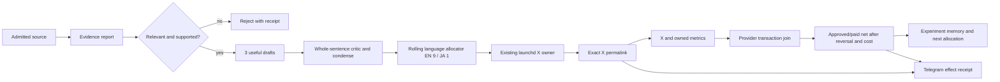

Implementation SSOT:

- Design and completion contract:
  `docs/superpowers/specs/2026-08-05-affiliate-agent-design.md`
- Atomic RED → GREEN → E2E plan:
  `docs/superpowers/plans/2026-08-05-affiliate-agent.md`

The ordered backlog in section 9 remains the product-level summary. The atomic
plan is authoritative for implementation order, exact files, tests, commits,
live verification, revenue gates, tenantization, and scale work.

Current distribution checkpoint: the existing Repost owner recovered the
already-published Voice Changer effect without a second publish. Repost release
`d5723b6db` read back exact permalink
`https://x.com/selawmqt/status/2091088320772346136` through the public profile
SSR fallback and appended exactly one posted-ledger row for proposal
`16b5b8ff4e4e79a7b304999755b909e1e0f07a37e35c2e0da2e39c4a5e4d1b60`
and placement `elevenlabs-discovered-voice-changer-en-1`; its absorbing
`EFFECT_STARTED -> UNVERIFIED` consumption history remains unchanged, so no
retryable publish path was reopened. The Affiliate owner then observed 70 real
Repost actions, one exact placement-ID join, 69 unjoined actions, denominator
`POST_ACTION_COUNT_ONLY`, and delivered Telegram message `28588`. This is
distribution evidence, not revenue credit or money. The canonical placement
ledger remains 25 rows; the latest official PartnerStack report still has zero
commission rows and empty payouts, while rolling net is
`NO_TRANSACTIONS / NO_APPROVED_OR_PAID_ROWS / cost=UNKNOWN / NOT_REACHED` with
pending, approved, paid, and reversed counts all zero. The next distribution
atom is the existing Voice Cloning proposal `bb5c8fbd...bae7`,
`READY_FOR_EXISTING_REPOST_OWNER / UNCONSUMED`; the existing Repost owner may
consume it only after its normal next-hour fence permits a post.

The installed Repost selector is now release `fffa6cb8c`: unfinished external
effects retain first priority, then the current fresh READY Affiliate proposal,
then old terminal readback-only recovery. This prevents an old UNVERIFIED
observation from consuming the next eligible growth slot while preserving every
no-resend fence. Current supply is 22 `X_LIVE` Affiliate placements versus only
four generated Repost proposals and one exact Affiliate posted row; therefore
the near-term distribution policy is to drain unconsumed live placements through
the existing hourly owner before inventing repeated variants for one article.

Runtime override: Repost release `41ed5893e` supersedes `fffa6cb8c`. It retains
the same fresh-distribution priority and adds two operational repairs: release
retention prunes before export so low disk does not require a transient sixth
full tree, and X execution reuses installed system Playwright before its
portable uv fallback. This closes the two ENOSPC paths observed during Voice
Changer recovery without weakening cost, quarantine, effect-journal, hourly,
exact-readback, or no-resend gates.

Runtime override: Repost release `0d55a1650` supersedes `41ed5893e`. It loads
the Git-external private Telegram destination before the bounded backlog flush
and rejects an absent destination instead of sending to a placeholder. This is
source/runtime verified but remains live-unverified until the existing Repost
owner returns a provider message ID; Codex does not send the report directly.

Live override: Repost release `57a95b2ba` supersedes `0d55a1650`. Existing
owner run 13 proved the repaired transport with exactly one backlog flush,
provider message ID `28605`, `dryRun=false`, and no X-post ledger change. The
remaining backlog is 20 rows and stays bounded to one flush per owner run.

## 0. Objective

Anicca is the company; Life Manager is the product, autonomous agent, and
canonical repository. Life Manager manages physical, mental, and financial
health. Affiliate Agent is one financial-health unit. It improves verified net
position through external affiliate receipts while preserving fees, reversals,
cost, concentration, cash timing, and policy risk. It never equates content,
clicks, estimates, pending commission, or GMV with earned money.

Canonical ownership is the Life Manager repository at `skills/affiliate/`.
The local proof phase has no Affiliate runtime, redirect, secret, or ledger in
`apps/api/` or Railway. The old
`/Users/anicca/profitable-claude/skills/affiliate` tree is migration evidence,
not a production home. Mutable state lives under
`${LIFE_MANAGER_STATE_HOME:-~/.local/state/life-manager}/affiliate/`; credentials,
sessions, provider exports, and ledgers never enter Git.

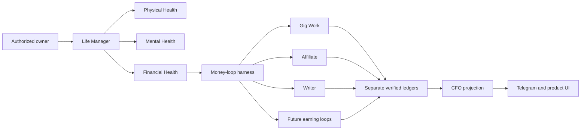

Build one Affiliate Agent inside Life Manager's financial organ that launches in
English first, then operates isolated Japanese and admitted additional-language
market pods. Spanish is the first expansion candidate after English and Japanese;
it is not admitted merely because it has many speakers. The Agent
continuously discovers lawful offers, publishes useful evidence-led content,
attributes clicks and conversions, records external commission
receipts, repairs interrupted runs, and reallocates effort without daily human or
Codex operation.

No two locale pods share one social identity, browser profile, affiliate link,
publication history, attribution cohort, experiment, or operating budget.
English is first. The verified English X
identity is now `sela` / `@selawmqt`, logged in through the isolated
`capafy-mkt-provision` CloakBrowser profile; legacy `@aniccaen` is not an active
X username. Postiz and every external publishing API are out of scope by product
decision. The Agent itself must provision an isolated browser profile, recover or
establish the authorized user account, configure the profile, publish through the
rendered website, and verify the public result. A dedicated Japanese canary is
admitted only after English Gate E0 and uses a different browser profile. Spanish
and every later locale must pass the Locale Admission Gate in section 8 rather
than being created as blind translations.

“End to end” is proved first on the current macOS host. The first graduation
condition is not portability: it is one unattended local run covering authorized
account recovery, affiliate application/approval polling, research, content,
browser publication, acquisition, click attribution, provider reconciliation,
Telegram reporting, recovery, learning, and a real external commission receipt.
After this local Agent earns with positive unit economics, its proven runtime is
packaged for a scratch computer. Installation, encrypted authority inventory,
browser/profile provisioning, and minimal operator credential intake remain Agent
states in that later packaging phase; they are not allowed to delay the local
money loop.

### 0.1 Delivery order: Local → OSS → Cloud

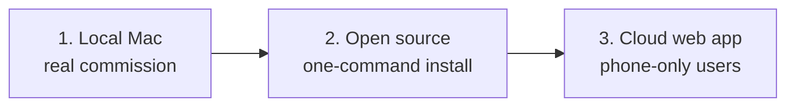

The local Mac is the economic laboratory and first production runtime. Code may
be public throughout development, but the project MUST NOT market the loop as a
working money printer until Gate E1 has an external approved commission receipt.
The OSS graduation gate is one scratch-Mac install reproducing the proven local
flow without copying mutable state. The cloud/web-app phase starts only after A2:
four revenue-positive weeks, positive net margin, and zero manual execution.

Cloud is a deployment target for the same state machine, not a second design.
It replaces local launchd with a tenant scheduler and local browser profiles with
isolated remote browser workers while preserving the same provider adapters,
action receipts, money states, policy gate, learner, and Telegram/product report.

The machine cannot guarantee $10,000, $10,000,000, or $100,000,000 revenue. It guarantees
measurable attempts, honest receipts, bounded experiments, compliance gates, and
same-run recovery. Revenue targets are gates, not claims or forecasts.

Affiliate commission belongs only to this Agent's ledger. Writer Agent revenue
continues to mean direct payment for writing; shared research and editorial
techniques do not merge the ledgers.

### 0.2 Canonical repository and folder contract

There is one implementation, not a private money loop plus an OSS rewrite.

| Boundary | Canonical location | Contract |
|---|---|---|
| Public product source | Life Manager repository, `skills/affiliate/` | Provider adapters, research, composition handoff, policy, publication, reconciliation, learning, Telegram, installer, schemas, and privacy-safe verifier live together |
| Product truth | `docs/affiliate-agent/AFFILIATE-AGENT-SSOT.md` | Current gates and ordered backlog; historical plans never override a newer measured checkpoint here |
| Development route | `.worktrees/affiliate-life-manager-spec` on `docs/affiliate-life-manager-spec` | Spec and harness changes only; each meaningful slice is pushed to both Life Manager remotes |
| Installed runtime | `~/.local/share/life-manager/affiliate/releases/<commit>` with `current` symlink | Immutable pushed release; launchd executes this copy, never a developer checkout |
| Mutable/private state | `${LIFE_MANAGER_STATE_HOME:-~/.local/state/life-manager}/affiliate/` | Credentials, raw links, sessions, provider artifacts, jobs, outbox, and canonical ledger remain Git-external and mode-restricted |
| Owned publication checkout | `.worktrees/affiliate-foundation-prod` | Existing publication effect target owned by the installed loop; Codex never publishes from the spec worktree or creates a parallel publisher |
| OSS distribution | The same Life Manager `skills/affiliate/` tree | One-command macOS install, minimal authority intake, redacted examples, verifier, update/rollback/uninstall; never mutable state, secrets, raw links, or earnings claims without receipts |

`apps/api/`, Railway, the shared Anicca checkout, Coconala/Gig state, and a new
Affiliate-only repository are not homes for the local proof. Cloud is a later
deployment adapter for these same contracts, not a second implementation.

## 1. Measured current state

| Surface | Observation | Runtime decision |
|---|---|---|
| Amazon Associates Japan | Browser confirmed an existing Amazon.co.jp account for the private SSOT application email. No password exists in Chrome or macOS Keychain; password recovery sent an OTP to the masked matching mailbox, but no currently authenticated Gmail or macOS Mail authority could read it. No Associates application was submitted | `AUTH_RECOVERY_OTP_REQUIRED`; resume the same recovery intent only after authorized mail access is available, then inspect existing Associates state before creating any application |
| Kit | A real PartnerStack application was submitted with truthful Anicca, website, `@selawmqt`, audience-size, channel, country, and region fields. Kit's authenticated application-email reply says it decided not to move forward. It lists four possible fit issues but does not identify one applicant-specific cause: creator-economy audience fit, prohibited promotion methods, inaccessible/insufficient website content, or insufficient promotion detail | `APPLICATION_REJECTED`; do not count approval or reapply unchanged. Reconsider only after an accessible content body, creator-helping-creator audience evidence, and a detailed organic promotion plan are live; coupon, cashback, and paid advertising remain excluded |
| HubSpot / Impact | The official HubSpot flow created a real Impact account, verified the authorized Japanese mobile number and `aniccaai.com`, and the authenticated CDP `9327` rendered the existing `HubSpot, Inc. application` as `Declined`. The installed owner persisted `REJECTED / DO_NOT_RESUBMIT` at `2026-08-20T13:19:48Z` with transition `14d9b1aa…5cb6`; owner wake `13:19:58Z` sent Telegram message `26218` and did not create a link | `APPLICATION_REJECTED` is now durable; never resubmit unchanged or create a HubSpot link. Continue with other executable programs |
| Notion / PartnerStack | The official public page still advertises the program, but the live PartnerStack application renders that Notion stopped accepting new affiliates and that all applications are auto-declined for the time being | `PROGRAM_PAUSED`; do not submit a guaranteed rejection. Poll for a real admission-state change before applying |
| ElevenLabs | The official affiliate entry reached ElevenLabs signup. The acceptance email instructs the approved affiliate to accept Terms, configure a payment provider, and share the referral link; it also grants Resources, Messages, and Reporting access. The authenticated PartnerStack UI proves accepted Terms, an active Eleven Labs Inc. partnership, and an executable default link. An anonymous browser followed that link to `elevenlabs.io` with PartnerStack referral parameters and cookies. The current Commissions page explicitly renders tax registration required, a tax-information CTA for withdrawals, and a choice of direct deposit, PayPal, or Stripe | `ACTIVE_LINK_VERIFIED + ACCEPTED + EARNING_ENABLED`; the funnel can run now. Payout is `PAYOUT_BLOCKED_BY_TAX_SETUP` and the payment provider is `SELECTION_REQUIRED`. Retain the exact link only in private runtime state and prefer a product-specific link when the article concerns one product |
| Rakuten Affiliate | CDP rendered the public home page with `ログイン`; approval state is not observable | `AUTH_REQUIRED`, keep the provider adapter dormant |
| Postiz | A Japanese integration exists, but the product decision excludes Postiz | Do not read, connect, or use it in the Agent; this is not a blocker |
| X identity | Dedicated Affiliate CDP `9326` and authenticated `whoami` prove `@selawmqt`: 128 posts, 27 following, 0 followers. The semantic profile command changed the public name to `sela | AI Tools`, added an English practical-AI bio with affiliate-link disclosure, set `aniccaai.com`, and a second apply returned `changed=false + matches_config=true`. X rejected legacy `@aniccaen` as inactive | Preserve mixed historical posts and keep this identity English-primary. The current verified-effect allocator admits one native Japanese source/copy slot only after nine English non-Affiliate effects; never translate an English Affiliate placement into that slot, and never use Japanese `@aniccaxxx` or shared daily-driver `@diceai0`. Every post still requires the duplicate-post fence and public readback |
| X publication | The first Affiliate X placement is `LIVE` at `https://x.com/selawmqt/status/2088728168534597644`. The canonical skill verifies `@selawmqt:9326`, requires disclosure plus one `LIVE` owned article URL, writes an effect-possible fence before the click, and requires exact status-page readback before `LIVE`. For a `t.co` anchor it prefers HTTP HEAD, then accepts only the exact owned URL rendered by the authenticated X DOM; this keeps readback truthful when the Mac cannot resolve `t.co` through Python DNS. X's April 2026 rules warn that scripted website automation may permanently suspend an account | Commit `97d143d7908b05ee4261e83c85d41818c3478c04` implements the DOM fallback. The installed source passed byte equality, and a read-only real-browser replay verified all five historical `XPostError` liveness rows as exact `LIVE` readbacks without clicking Publish. The existing owner naturally executed the release at `2026-08-20T14:12:51Z`; liveness remains same-day cooldown, so the old failure receipt is retained until the next sweep. Keep action caps and immediate account quarantine |
| X Article EN | Writer Agent has a real public X Article on the separate `@diceai0` identity and a production adapter based on `wshuyi/x-article-publisher-skill`. Fresh authenticated read-only revalidation on Affiliate `@selawmqt:9326` reached the canonical `/compose/articles` route but returned `Page not found`, with zero textarea/contenteditable controls | `CHANNEL_CURRENTLY_UNAVAILABLE`, not a permanent product claim. Recheck capability after an account/entitlement change. Until then, owned English articles are the conversion assets and ordinary disclosed X posts/replies are the acquisition surface; another account's capability is not proof for `@selawmqt` |
| English source scout | The canonical `sources capture --plan elevenlabs-en` command live-captured six immutable local artifacts: five ElevenLabs official web pages through CRWL and the official `elevenlabs/elevenlabs-python` repository through `gh` | Each receipt stores adapter, locator, locale, evidence class, license, body SHA-256, parser version, observed time, and expiry. The first live run returned `captured=6 + new=6`; after allowlisting stable GitHub fields, an immediate repeat returned `captured=6 + new=0`. Exact hashes are in Git-external `source-captures.jsonl`. CRWL `-q` failed because no LLM provider is configured, so the admitted route deliberately uses deterministic `md-fit` without an LLM. Authenticated X research readback is still missing |
| ElevenAgents next-placement evidence | PartnerStack's authenticated Resources page lists pinned ElevenAPI, ElevenAgents, and ElevenCreative product guides with SEO/swipe copy. Rather than building a proprietary PDF downloader, the Agent selected ElevenAgents as the next buyer-intent product. Installed release `6f377563c` then captured its public official overview, quickstart, integration overview, and cost help page through CRWL as four immutable artifacts | Versioned plan `elevenagents-en` captured `4/4` sources with four new SHA-256-bound receipts. The 30-day product-doc artifacts and seven-day price artifact support a practical customer-support-agent evaluation article while keeping partner Resources as a selection signal, not copied article text |
| First English content artifact | The versioned `elevenlabs-en-v1` template binds every price, rights, limitation, and case-study claim to five fresh official source captures. `affiliate content build` requires those support markers and the private executable link, then writes a mode-0600 Git-external artifact without printing its body or link. `content policy` verifies the artifact hash, exact fresh source hashes, disclosure before CTA, one owned HTTPS tracking link, and forbidden guarantees; `owned publish` independently requires the matching `PASS` receipt | Live build produced slug `elevenlabs-plans-for-solo-creators` and content SHA-256 `03089e860af9ed1e35a4656ebc045dd28d00dacc243739fe10b4f46f8e4822e9`. The first real policy attempt failed closed because a broad phrase matcher misclassified an explicit denial of guaranteed earnings. Narrowing the forbidden-claim set to affirmative guarantee phrases made the same artifact pass all five checks. Production commit `a333cf55044dbddf17f906150a173e1ee000aea1` passed Actions run `31906958939`; the installed publisher and CRWL independently read back the title, disclosure, buying checklist, evidence-refresh marker, and exact tracking link. The durable receipt is `LIVE` with rendered SHA-256 `3503c6bede5e059128be49acc90236b22b8014f46b88ca568adc527c09d64b8a`. No provider click or revenue is inferred |
| English foundation publication | `content build-foundation` produces a source-bound, explicitly non-affiliate evaluation guide with no tracking link. `owned publish` accepts only its hash-valid `READY_FOR_PUBLICATION` artifact, writes one deterministic `apps/landing/data/research/<slug>.json`, refuses unrelated dirt or index entries, commits/pushes that exact target, and records public HTML hash only after title plus three marker readback | Live local build returned SHA-256 `eac5ea080817823e3534a14f6b72e16621139dc109aac93095eb8e9ac7c079f0`. Production commit `fd9489bee59946bddc06bb127b2bfca0694d7e61` deployed through GitHub Actions run `31906437192`; the production smoke passed and `https://aniccaai.com/blog/how-to-test-ai-voice-tools-before-you-pay` independently returned the title, no-affiliate disclosure, evaluation marker, and purchase-decision marker. The durable receipt is `LIVE` with rendered SHA-256 `f7055977871bb405af0c491d29c74d41d591f87b95a551425dc5beece07d0039` |
| clip loop | launchd is installed, last exit code is 0, and logs show production/posting through 2026-08-01 | Not banned. Reuse its publisher, renderer, attribution, and scoring contracts |
| recent clip runs | Contract reports `skipped`; older stderr shows Telegram DNS delivery failures | Diagnose scheduler/business gates separately from platform health |

### 1.1 Implementation progress

| Task | State | Receipt |
|---|---|---|
| R0 canonical convergence | Complete; historical disabled release was `615206fd98fb555b0aada794454dd63e1cc95260` | Canonical skill and installer pass twice at 3/3; archived verifier 10/10; commission regression 6/6; manifests cover ten legacy files plus one archived parser dependency; remote SHA, immutable release bytes, valid JSON receipt, `current` symlink, untouched legacy state, and zero launchd owners all pass |
| F0 current-Mac bootstrap | Runtime and browser capability GREEN; Keychain admission corrected; historical disabled release was `e3de264f4a9b1c5d34b49a913ff66ad6202dd318`; real provider admission remains open | CloakBrowser Chromium `145.0.7632.109` and pinned PBS CPython `3.14.7+20260814` are live-receipted. The original vault probe proved item existence only and incorrectly accepted an empty value. Admission now requires successful Keychain read plus non-empty bytes, without logging value, digest, or length. Provider refs are versioned in the program registry; Impact is `MISSING_OR_EMPTY`, so browser login remains disabled until official recovery and fresh-tab proof |
| P0/F1 legacy migration | Complete | Runtime commits `84cac1e7`, `3494f8ff`, `5b1927dc`; migration 8/8, legacy verification 10/10, commission regression 6/6; remote `feature/affiliate-agent-runtime` at `5b1927dc` |
| Legacy wrapper cutover | Blocked by design until Task 11 | F1 receipts `run.sh` and `affiliate-cli.sh` path/SHA-256/size while preserving their bytes; Task 11 must verify these receipts before scheduling the new orchestrator |
| Mac-local runtime | Six Affiliate-owned launchd plists preserve the loop, three browser owners, source refresh, and composition owner. Immutable `current` is now release `5a8445ad7`; it retains provider-namespaced commission replay keys, exact-placement attribution, row-provided currency, optional settlement/payout identifiers, auditable commission receipts, the X rendered-DOM readback repair, the Repost observer, queue ordering and budget guards, source-set normalization, append-only Telegram delivery receipts, exact Repost joins through either `post_url` or `source_url`, per-item policy-failure isolation, aggregate signup/conversion fields, and exact binding of the physically sent Telegram outbox UUID. Source and installed `local_loop.py` bytes match at SHA-256 `3ad64ff4c362d09ebce781275b30810ee95187d6ccbd007a39ec25ec7ef72680`; the `70/70` suite and compilation passed. The existing owner naturally read back at `13:04:33+0900` with provider `AUTHENTICATED`, revenue `COOLDOWN`, 20 placements, 56 Repost actions / 0 exact joins, and Telegram `a8fe…→27080`; the historical `f111…` receipt still mismatches the sent-ledger mapping for daily event `9652…→27069`. `launchctl print` now exits `0` for both Affiliate and gateway labels; Affiliate last exit is `0` with its `600`-second interval and gateway is loaded/running. | Affiliate/Repost exposure is observable but not yet joined to approved/paid transactions; historical Telegram receipt reconciliation, exact X/owned exposure, attributable commission, paid payout, provider/channel diversification, the remaining experiment queue, and B01 official transaction capture remain open; no clicks or estimates are money |
| Latest composition budget repair | Release `3ede43ccc80e7006820f4e79aa423c29d49f2e5c` classifies a policy-owner `budget_blocked` summary instead of aborting the whole composition wake. The existing owner at `2026-08-21T09:57:46+0900` exited `0`, returned `POLICY_BUDGET_BLOCKED`, and persisted the `translate-video` receipt as `READY_FOR_POLICY` with redacted JST retry facts; the stderr log did not gain a failure line. This is live owner/self-heal evidence for queue starvation only; no composition artifact, public placement, provider transaction, or money was created. |
| Latest source-selector budget retry repair | Release `2b0052bedd82b2cb0ccba0d3990e913a616ce566` adds typed `OPPORTUNITY_DECISION_BUDGET_BLOCKED` handling to `scripts/source_capture.py`. Source/installed bytes match at SHA-256 `a1519071161940de3cdc8b774dbb63218b2ff3e07c76d89f1264ee10eb0d7e44`. The existing `ai.anicca.affiliate-source-refresh` owner ran at `2026-08-21T10:45:59+0900` and wrote a redacted `BUDGET_BLOCKED` opportunity receipt for JST `2026-08-21` (`70650/65536` daily tokens, `16384` reservation, `loop_daily_token_budget_exceeded`); the same-day retry is now `COOLDOWN` and created no plan, publication, provider link, transaction, or money. Codex sent the natural-language receipt through the existing Telegram path as provider message `26943`. |
| Latest B01 official capture | The existing money owner completed wake `4c85497daf19dd379825cdfb5a37739eb39f45d4179f7305374660cf6a49533e` at `2026-08-21T11:17:15+0900`; the official PartnerStack artifact was observed at `2026-08-21T11:17:12+0900` with rendered SHA-256 `c179a3930a05bbd125e8f105323d128766a8c3f49d3d7ce327802346e3b5792c`, `commission_row_count=0`, `NO_LIVE_ROWS`, and payout `EMPTY`. Reconciliation read `0` rows, appended `0`, replayed `0`; rolling net is `NO_TRANSACTIONS / NO_APPROVED_OR_PAID_ROWS / NOT_REACHED`, with known cost coverage `UNKNOWN`. The owner observed 54 Repost actions, 0 exact joins, and `NO_REVENUE_CREDIT`; Telegram delivery was deduplicated on message `26335` with delivery receipt event `835de6b3…e9f52e07`. This is a real empty official capture, not a transaction or money receipt; B01 remains open. |
| Latest owner delta | At `2026-08-21T07:44:21+0900`, the installed existing owner ran the same `ALREADY_LIVE` public/X path and retained 20 exact placement rows. It appended `AFFILIATE_TELEGRAM_DELIVERY` event `4479170e…b120bde4`, linked to wake `fe7c567c…04b750`, Telegram event `4d376adc…452f1`, and sent-ledger provider message `26335`; `NO_PENDING/ALREADY_DELIVERED` means no new Telegram send was counted. The earlier `07:12:35+0900` receipt `26741` remains the latest new `CLICK_DELTA` receipt. | This closes the installed append-only Telegram delivery trajectory and replay readback. It does not create a provider transaction, approved/paid commission, or known-cost net |
| Latest owner link-only delta | At `2026-08-21T03:56:04Z`, the existing owner completed exactly one new PartnerStack placement-link effect for `elevenlabs-discovered-voice-isolator-en-experiment-32e136c41c5e-1`; the durable journal is `EFFECT_STARTED → VERIFIED` with a private provider-link key. The same campaign handoff and policy receipt remain `READY_FOR_POLICY`/`PASS`, so no publication was attempted in that wake. The ledger is now 18 dedicated links, 17 public placements, 32 provider clicks, and 15 insufficient exposure denominators. | The next existing wake owns the same job's owned/X publication. The new link is not a placement until exact public readback; no click, transaction, commission, or net is inferred |
| Latest generic link-receipt repair | At `2026-08-21T05:56:18+0900`, the installed owner created and verified one generic PartnerStack link for `elevenlabs-discovered-realtime-speech-to-text-en-1`, but the wake event omitted the generic link identity; Telegram `26662` contained only the Repost observation. Release `1c5faf4ff7d9d70cf3f2a4e607ae11b81e1aca28` now carries `publication_link_*` fields from the existing generic publisher into the wake event and emits one `PLACEMENT_LINK_VERIFIED` receipt with provider key redacted. The next natural owner wake at `2026-08-21T06:07:09+0900` read back the same durable link as `VERIFIED`, `deduplicated=true`, `publication_state=OWNED_NOT_LIVE`, and sent Telegram `26680`; no public URL, provider transaction, commission, or money was created. | This closes the observability/exact-placement receipt gap only. The row remains link-only and outside allocation until owned/public readback, provider denominators, and official transaction attribution exist |
| Latest B01/X/exact-join repair | Release `403b98448fc7caeeb98086c4e6ba00ca5d88ff12` adds official `reversed` normalization, late reversal observation-time handling, and non-USD FX fail-closed behavior; the existing suite remained `69/69` and the non-persistent reversal/currency/timing fixture passed. The subsequent `5d14460d5f4262d2029ea5bf903e45109c6b888f` repair maps in-flight `MATERIALIZED/OWNED_NOT_LIVE/OWNED_LIVE` campaigns to their canonical placement ID before X is live. The real owner at `2026-08-21T06:18:18+0900` recorded one ambiguous X effect fence (`attempt=1`, same placement/job, no exact timeline row), temporarily exposing 21 rows (20 links, 20 public URLs) with a slug alias. After install, the existing owner at `2026-08-21T06:29:23+0900` reconciled the same fence to `X_LIVE`, produced exact 20/20/20 ledger readback, removed the alias, and sent Telegram `26700` `SELF_HEALED`; no second X job/post, transaction, commission, or money was created. At `2026-08-21T06:51:18+0900`, the same installed owner completed the next official revenue capture: PartnerStack artifact `de2287adc12eaeec8b9760bd6ecd2be2513c1b874f05fc76c27e73969b91d4fe`, `commission_row_count=0`, payout `EMPTY`, `NO_LIVE_ROWS`, `source_rows=0`, `appended_transitions=0`, status counts approved/paid/pending/reversed all `0`; Telegram `26719` was only a real `CLICK_DELTA` receipt (`+1` provider click), not money. A non-persistent no-network fixture then proved one exact `approved` USD placement join with settlement/payout fields retained and replay `0` new / `1` replayed transition; this is harness evidence only, not revenue. | B01 still waits for the first non-empty official provider transaction/settlement row; the current X fence is terminal `LIVE`, and all four money status counts remain zero |
| Latest Semrush admission refresh | Read-only Web revalidation on `2026-08-21` of the [official English program page](https://www.semrush.com/lp/affiliate-program/en/) and [official Japanese KB](https://ja.semrush.com/kb/97-affiliate-program) confirms last-click attribution with a 120-day cookie, $10 eligible trials, product/tier sale commissions up to $450, first-purchase/new-user attribution, a 2+ hour dashboard delay, Impact tracking, EFT/PayPal withdrawal, month-end lock after 27 days followed by payment 21 days later, FTC disclosure, and self-referral/cookie-stuffing prohibition. The same page requires public relevant properties and generally at least 1,000 monthly unique visitors or significant organic social audience. | E02 remains `PARTIAL / WAITING_FOR_LOCAL_TERMS_CAPTURE`: the Impact sign-up/terms route still fails with a redirect-loop outside an authenticated program, and CRWL (Chromium `bootstrap_check_in` 141) plus scrapy (DNS resolution failure) could not create a TTL-bound local body artifact. No Semrush application, link, click, or money is admitted |
| ElevenLabs isolated auth | Dedicated Affiliate CDP `9324` is authenticated from the Git-external private SSOT | Gmail readback identified the account used by the real reset and new-login notices; the private Login field, Password/Keychain mirror, and mode `0600` were reconciled without committing values. The semantic CDP resume then rendered `SIGN_IN_REQUIRED → AUTHENTICATED` at `/app/home`, with one successful submit and a sanitized receipt. No commission is inferred from login |
| ElevenLabs PartnerStack metrics | The Agent created and email-verified the PartnerStack account/team, confirmed the Eleven Labs Inc. partnership, accepted program terms, and reached Overview, Commission Report, Commissions summary, and Payouts. The existing owner completed the latest due capture at `2026-08-21T11:17:12+0900` and captured hash-valid artifact `c179a3930a05bbd125e8f105323d128766a8c3f49d3d7ce327802346e3b5792c`; it contains zero commission rows, empty payout rows, and `NO_LIVE_ROWS`, so reconciliation appended/replayed `0/0` transitions. It returns `PAYOUT_BLOCKED_BY_TAX_SETUP`, `tax_information_state=REQUIRED`, and `payment_provider_state=SELECTION_REQUIRED` | B01 remains `WAITING_FOR_PROVIDER_TRANSACTION`: the report has 23 commission fields, six payout fields, `provider_transaction_key=reward_key`, currency display USD, `commission_row_count=0`, `payout_row_state=EMPTY`, and `NO_LIVE_ROWS`. Earning can continue, but no pending/approved/paid/reversed transaction or withdrawal is claimed until an official non-empty row exists; approved/reversed remain zero observed rows, not inferred money |
| ElevenAgents product link | The official PartnerStack destination selector exposed `https://elevenlabs.io/agents`. The Agent supplied the required title, internal description, destination, and custom slug, created exactly one product-specific link, and read it back from the rendered Links page | Installed release `6623f2e02` accepted the generated HTTPS URL only through stdin and stored it as `ElevenAgents affiliate link` in the mode-0600 Git-external private Markdown. Command output, receipts, SSOT, and Git contain state only, not the referral URL |
| Cloud rollback | Complete | Staging runs rollback commit `bb31c68ada4e041ef1c0e745d7933a94f683a029`; the mistaken deployment is `REMOVED`; both `AFFILIATE_*` variables are absent; the former Affiliate route returns HTTP `404` |

### 1.2 Truth checkpoint: implemented versus still hypothetical

Current override: the installed runtime is `a1767577a0187cac8e601bc8761a0b2cf838beff`,
not the older release identifiers retained in historical table rows below. Its
source and installed `scripts/local_loop.py` bytes match at SHA-256
`8289ee06bad0ae4e3e7c837f817e2e915df08cfccb7776fec1620661020a2e19`; the
full suite is `79/79`, the focused local-loop suite is `26/26`, and compilation
and diff checks pass. It includes the
prior exact Repost matching, policy/source budget guards, per-item failure
isolation, provider denominator retention, bounded Telegram reconciliation,
versioned daily summaries, a canonical append-only `AFFILIATE_RUN_RECEIPT`
for every launchd wake, and redacted effect-classified
`AFFILIATE_TOOL_ATTEMPT` receipts for each admitted owner-stage tool. Tool
failures are typed with bounded retry due-time and effect certainty; revenue
cycle results now propagate their durable failure class and retry window into
the ToolAttemptReceipt instead of erasing them. Release `a1767577a` additionally
delivers a delayed `SELF_HEALED` revenue receipt after intervening cooldown
wakes, without creating a second provider effect. The post-install
registered-owner wake
`47c80af47325c9c0b31dfd9538568640fd3c4213c74684492da93abe4c16c1d6` completed
at `15:43:27+0900` with `runs=239`, `last exit code=0`, provider
`AUTHENTICATED`, placement-link `VERIFIED`, publication `ALREADY_LIVE`,
revenue `COOLDOWN`, and Telegram message `27244` (`SELF_HEALED`); no
public/provider effect or money changed.

The natural wake immediately before that install recorded a real
`provider-link.elevenlabs` `TimeoutError` as
`BROWSER_TRANSIENT / RETRYABLE / effect=UNKNOWN`, with retry due at
`14:38:14+0900`; the same owner later resumed the job and verified the link
without duplication. Its official revenue `capture` then failed closed at
`14:35:54+0900` with `NONZERO_EXIT` (return code `1`), leaving the prior
hash-bound artifact unchanged and reserving the next capture for
`15:35:54+0900`. The current runtime repair will preserve this provider failure
class and retry state in both receipts on the next capture failure; the existing
failure row predates the install and remains historical. The official empty artifact
`e60af92707514598ed9c0b0c6bd5b8be9578d04bfbf969e829d455ec73a31c5f` observed at
`13:32:51+0900` remains the latest money truth: `commission_row_count=0`,
`NO_LIVE_ROWS`, payout `EMPTY`, reconciliation `0/0/0`, and rolling net
`NO_TRANSACTIONS / NO_APPROVED_OR_PAID_ROWS / NOT_REACHED`. No official
transaction, approved/paid commission, reversal, settlement, payout, known-cost
net, or USD 10,000 proof exists. F01, F02, and F03 are live-proven and closed;
B01 remains `WAITING_FOR_PROVIDER_TRANSACTION`.

**Installed-release override (2026-08-21 16:06 JST):** current is now immutable
release `c75dacc605bd7f0e0162e4da66ae2936dc3da7e0`, installed after the registry
guard changed HubSpot from stale `APPLICATION_PENDING` to
`APPLICATION_REJECTED / DO_NOT_RESUBMIT_UNCHANGED`. Source/installed registry
bytes and `local_loop.py` bytes are equal. The registered owner replay at
`16:05:56 JST` completed with `runs=241`, exit `0`, provider authenticated,
publication already live, revenue cooldown, Repost observed, and Telegram no
pending. Impact remained rejected and created no application or link. This
override supersedes older runtime identifiers below; it does not change the
open B01 transaction gate.

This table prevents tests, fixtures, screenshots, or plans from being reported as
live autonomous operation.

The `Current override` paragraph immediately above is authoritative for the
installed release; runtime identifiers in the table below are retained as
historical evidence and are not a competing current-state claim.

| Surface | Current truth | What is not yet proven |
|---|---|---|
| Runtime | Immutable local release `088f36982ae9ec6c643d7fa6d9a299701dbb377b` is current. Installed/source `local_loop.py` bytes match at SHA-256 `7d9c401b4785dc2f39ac367887d0ceb9b1e481cb9b7328c022d1bc186100e3c3`; the existing suite is `72/72`, compilation and diff checks pass. The release appends `AFFILIATE_TELEGRAM_DELIVERY` rows carrying enqueue, attempt, delivery result, failure subtype, and provider message ID, matches Repost campaigns by exact `post_url` or `source_url`, prevents bounded policy/source budget blocks from starving later work, isolates per-item policy-build failures, includes provider signup/conversion fields, and bounds historical Telegram reconciliation to evidence-backed rows. The existing owner completed wake `823d355c…` at `13:36:24+0900`; `launchctl print` reads `runs=221`, `last exit code=0`, and `StartInterval=600`, while the Gateway is loaded/running with a successful probe. No transaction or money exists. | Repost action → owned visit → provider click → transaction lineage, attributable approved/paid commission, paid payout, provider/channel diversification, the remaining experiment queue, and the B01 official transaction capture remain open |
| Latest runtime delta | The existing money owner was kickstarted through the registered label and completed the same durable path at `13:36:24+0900`. Because the last official PartnerStack capture at `13:32:51+0900` was still inside its one-hour cooldown, the wake correctly reported `revenue_state=COOLDOWN` and did not create a new report or transition. It retained 20 placements, Repost `56/0` exact joins, Telegram `NO_PENDING` on the already-sent `27069`, and outbox/sent `133/133`; no external effect or money changed. | The latest official artifact remains `e60af927…e31c5f` with `commission_row_count=0`, `NO_LIVE_ROWS`, payout `EMPTY`, and reconciliation `0/0/0`; rolling net is `NO_TRANSACTIONS / NO_APPROVED_OR_PAID_ROWS / NOT_REACHED`, so B01 remains open |
| F1 migration | Implemented, reviewed, pushed, and re-run from final HEAD | It does not publish, browse, attribute, or earn |
| F2 Agent brain | Commit `d9ad4acd7cb0474cf1a825a94cfb49e7847da22e` is pushed; root replay on 2026-08-06 passed focused 16/16, Python 3.9 compile/shell syntax, and 30/30 related regressions | Full-suite collection is blocked by legacy `test_affiliate_verify.py` import-time `sys.exit()`; fresh review and live-provider execution remain open, so F2 stays open |
| Provider auth | ElevenLabs is `ACTIVE_LINK_VERIFIED`, earning-enabled, and `AUTHENTICATED`. HubSpot/Impact’s authenticated CDP and installed owner both read `HubSpot, Inc. application / Declined`; cc775c374 persists `REJECTED / DO_NOT_RESUBMIT` with transition `14d9b1aa…5cb6` and owner Telegram `26218`. No Google login, six-digit-code submission, phone call, or login-support Telegram effect exists in the Affiliate receipts. Kit is rejected; other providers remain non-executable | ElevenLabs is the only currently executable earning offer. HubSpot has no executable link after rejection; no commission, approved transaction, reversal, or payout is claimed |
| Publication | Nineteen owned Affiliate articles and nineteen matching disclosed `@selawmqt` X posts are `LIVE`; one additional verified provider link remains link-only at `OWNED_NOT_LIVE`. The latest distributed campaign is also on canonical DEV and at `https://aniccabuddha.substack.com/p/elevenlabs-audio-to-text-a-practical`. Anonymous Substack readback returns the full body, disclosure, and one tracking link; external job `3a7c7b28…78c2` is `VERIFIED`, Telegram message `20934` reports it, and replay is `COOLDOWN / NO_PENDING / exit 0`. A lost-target recovery defect created one additional title-only Substack duplicate at `https://aniccabuddha.substack.com/p/elevenlabs-audio-to-text-a-practical-ac1`; recurrence is fenced and the accepted operating decision is no cleanup action | Post-baseline provider click readback and every Japanese placement remain unproven |
| Attribution | Public owned/X placement receipts and direct provider-link resolution are implemented | No post-baseline provider-side click or commission receipt exists yet; local clicks and estimates never count as money |
| Revenue | No new Affiliate revenue receipt | Legacy watermark, fixtures, clicks, estimates, and creator screenshots do not count |
| Telegram | Affiliate append-before-send, stable event dedupe, provider `messageId`, `SELF_HEALED`, `BLOCKED`, real `PLACEMENT_LIVE`, program rejection, and one real-data natural-language daily summary are live-proven. Release `0473a3fb5` is installed and the owner at `07:33:59+0900` appended a real linked delivery row with `NO_PENDING/ALREADY_DELIVERED`, provider message `26335`, and no duplicate public effect; outbox and sent ledgers remain `124/124` with no pending event. | `CLICK_DELTA` and commission events remain bound to their real external transitions; provider transactions, approved/paid net, and known-cost economics remain open |
| Autonomous operation | launchd ownership, isolated browsers, official-sitemap discovery/refresh, source-hash-bound composition, bounded Terra-high composition, same-ID recovery, policy, exact placement-link acquisition, publication/distribution, acquisition/revenue observation, placement economics, economics-bound one-variable allocation, typed observed-failure repair, receipts, and Telegram are live. Release `50d45beca` reconciled one stale Impact login job from fresh authenticated readback and replayed without mutation; the installed ledger now has 14 comparable English placements | Actual billed/tool/channel cash receipts, a post-baseline provider click, and positive money evidence remain absent. The loop has not yet earned a commission |

### 1.1.1 Latest B01 capture observation

The existing money owner ran at `2026-08-21T07:55:09+0900` after the official
capture cooldown. PartnerStack failed closed at `stage=links` with
`NONZERO_EXIT` and return code `1`; failure receipt `ffdaf00e…5309bf` schedules
the next owner retry for `2026-08-21T08:55:08+0900`. The latest official artifact
is still the prior empty `de2287adc…b91d4fe` report, so no transaction,
settlement, payout, commission transition, or money changed. This is a provider
path failure, not evidence of zero revenue; B01 remains
`WAITING_FOR_PROVIDER_TRANSACTION`.

### 1.1.2 Installed revenue-failure receipt repair

Release `cf7f19241` adds a replay-safe `REVENUE_CYCLE_FAILED` Telegram candidate
from the durable failure receipt. It reports only typed stage/failure state and
does not expose raw tracking links or secrets. Existing `69/69` tests, Python
compilation, and a no-network replay fixture passed. The immutable release is
installed as `current` with source/installed `local_loop.py` SHA-256
`34c66744…42b13a80`; launchd browser bootstrap still returns `141`, so all-owner
load is not claimed. The existing owner nevertheless ran the installed release
at `2026-08-21T08:06:20+0900`, captured new official artifact
`f69af229…6734e3a` at `08:06:19+0900`, and recovered the PartnerStack cycle to
`NO_TRANSACTIONS` (`source_rows=0`, `appended_transitions=0`). It delivered the
recovery receipt as Telegram `26784` (`SELF_HEALED`) with linked delivery event
`7db20f65…6c854`. No transaction, settlement, payout, commission, or money
changed; the prior `07:55:09+0900` links failure remains historical evidence.

### 1.1.3 Latest owner wake after recovery

The existing owner completed another real wake at `2026-08-21T08:17:13+0900`
with wake UUID `3b448dc2…9dceca`. The Repost observer read 52 valid post
actions, found `0` exact campaign-URL joins and `52` unjoined actions, and
classified the result `NO_REVENUE_CREDIT`; no inferred attribution was created.
The owner was inside the hourly revenue cooldown, so it did not fabricate or
repeat a provider capture: `revenue_state=COOLDOWN`, while the latest official
PartnerStack artifact remains `f69af229…6734e3a` with zero commission rows and
empty payout rows. Telegram reported the observation as message `26794`
(`REPOST_OBSERVED`), delivery event `d7173757…2166ac`, linked to the same wake.
The next eligible official capture is expected around `2026-08-21T09:06:19+0900`;
this wake changed no transaction, settlement, payout, commission, or money
state. B01 remains `WAITING_FOR_PROVIDER_TRANSACTION`.

### 1.1.4 Provider-failure retry-window repair and owner readback

Release `0e818458c` makes `revenue_cycle_due()` honor the newest durable
`revenue-cycle-failure.json` `retry_after` window. A later successful
`revenue-cycle.json` completion supersedes an older failure receipt, so the
owner returns to the normal hourly success cooldown without deleting the
historical failure evidence. Existing `69/69` tests, compilation, and temporary
failure-only/recovered-cycle boundary fixtures passed. Source and installed
`local_loop.py` bytes match at SHA-256 `6fba105c…776b26`.

After install, the existing owner produced a real wake at
`2026-08-21T08:27:56+0900` with wake UUID `7cb9c0f3…636b7`. The owner correctly
kept the revenue path in `COOLDOWN`; the official PartnerStack artifact stayed
`f69af229…6734e3a` with `commission_row_count=0`, and the rolling net stayed
`NO_TRANSACTIONS / NO_APPROVED_OR_PAID_ROWS / NOT_REACHED`. The placement ledger
remained 20 exact rows. Telegram appended only a linked
`NO_PENDING/ALREADY_DELIVERED` delivery receipt for already-sent message
`26335` (delivery event `38e801bc…3e02d`), proving no duplicate external send
or public effect. The launchctl command still returned macOS `141`, so this is
an owner readback, not proof that all six labels are loaded. This owner readback
confirms install, replay, and normal cooldown behavior only; the new failure
retry branch is proven by bounded fixture checks, not by a live failure after
the repair. B01 remains `WAITING_FOR_PROVIDER_TRANSACTION`.

### 1.1.5 Subsequent owner replay

The existing owner produced another wake at `2026-08-21T08:38:28+0900` with
wake UUID `49c852a3…f67a7`. It remained `READY_FOR_PUBLICATION` with
`revenue_state=COOLDOWN`, 20 placements, rolling net
`NO_TRANSACTIONS / NO_APPROVED_OR_PAID_ROWS / NOT_REACHED`, and the same empty
official artifact `f69af229…6734e3a`. Telegram appended only
`NO_PENDING/ALREADY_DELIVERED` delivery event `cb65ebb4…593b4` for already-sent
message `26335`; no public effect, provider capture, transaction, or money
changed. This is another replay/readback proof, not a live retry-branch proof;
B01 remains `WAITING_FOR_PROVIDER_TRANSACTION`.

### 1.1.6 Latest official capture and funnel diagnosis

The existing authenticated owner completed the due official capture at
`2026-08-21T09:10:09+0900` with wake UUID `6ac36ba7…e30d341`. PartnerStack
produced new artifact `0c0b1af1…5aa5d3f3`; the report was hash-valid but empty:
`commission_row_count=0`, `payout_row_state=EMPTY`, and
`normalizer_state=NO_LIVE_ROWS`. Reconciliation appended `0` transitions, and
rolling net remained `NO_TRANSACTIONS / NO_APPROVED_OR_PAID_ROWS / NOT_REACHED`.

The measurement path is working: the authenticated overview reports 43 provider
clicks (42 post-baseline), the dedicated Link Performance report has 20 rows
and 34 total provider-link clicks, and the owner records the official artifact,
reconciliation, and rolling-net receipts. Telegram is also working: the latest
delivery row is `ALREADY_DELIVERED / NO_PENDING` for already-sent message
`26335`, so unchanged state is intentionally deduplicated rather than resent.

The current bottleneck is the funnel, not ledger arithmetic: the provider reports
`signups=0`, `conversion_rate=0%`, `revenue=0`, and no commission rows; only five
Dev.to articles have observed metrics totaling 40 page views, 17 of 20 placement
exposure denominators remain insufficient, and Repost has 53 actions with
`0` exact Affiliate campaign joins. Therefore content/distribution is not yet
delivering a measurable qualified buyer path from Repost or owned content to a
provider conversion. The read-only Repost ledger confirms all 53 observed
`source_url` values are X-hosted but none equals any of the 20 known Affiliate
campaign X URLs; the zero is therefore an upstream campaign-selection/join
gap, not a hidden transaction. Clicks are exposure evidence, never money. B01
remains open and no provider transaction, payout, or commission is claimed.

### 1.1.7 Exact Repost source-url join guard

Release `297c713844064418260055860ccf324e6db9122f` changes only the existing
Repost observer: an action is counted as joined when either its exact
`post_url` or exact `source_url` equals a known Affiliate campaign X URL. The
temporary no-network fixture returned `ALL_EXACT_CAMPAIGN_URL_JOINED` for a
`source_url` match and kept `NO_REVENUE_CREDIT`; the existing suite remained
`69/69` and Python compilation passed. Real current Repost data remains
`53` actions, `0` exact joins, and `NO_REVENUE_CREDIT`, so this repair creates no
money or attribution retroactively. The immutable release is installed with
source/installed byte equality and `LOCAL_READY` ownership. The existing owner
replayed after installation at `09:30:58+0900` with the same 53/0
`NO_REVENUE_CREDIT` state and a deduplicated Telegram receipt; the browser
bootstrap and kick command still returned `141: Reentrancy avoided`. This is
installed replay evidence only, not a live `source_url` match; the next
bounded action is still B01 through the real owner.

### 1.1.8 Launchd introspection scope

At `2026-08-21T09:43+0900`, read-only `/bin/launchctl print` returned
`141: Reentrancy avoided` for the system domain, the existing X Repost owner,
and `ai.anicca.affiliate-loop`; `/bin/launchctl list` exited `0` but returned
no rows. This is therefore a session-wide launchd introspection failure, not
evidence that only the Affiliate label is broken. PID 1 is still `/sbin/launchd`
and the Affiliate `last-run` advanced at 09:30 and 09:41, so the registered
cadence continues to execute even though loaded-label readback is unavailable.
No OS service was restarted or killed, and no all-owner-load claim is made.

The same read-only slice found the composition log unchanged since
`2026-08-21T07:07:29+0900`; its durable composition receipts are 18
`READY_FOR_POLICY`, 3 `QUARANTINED`, and 1 `FAILED`, while source refresh at
09:43 remains `COOLDOWN / plans=[]`. A declared kick of the existing
`ai.anicca.affiliate-composition` at 09:44 returned `141` and changed no
artifact or public state. Thus the content supply is not advancing, which is a
real upstream funnel constraint; no manual composition was substituted.

### 1.1.9 Policy-budget queue starvation repair

Read-only inspection of the first incomplete composition receipt found the
actual `failed closed` cause: its source-bounded policy audit created a durable
`budget_blocked` summary for JST `2026-08-21`, with
`daily_consumed_tokens=88026`, `daily_limit_tokens=98304`, and a
`reservation_tokens=24576`. The old composition owner treated that bounded
resource state as a generic exception, so one blocked campaign prevented later
inbox items from being considered.

Release `3ede43ccc80e7006820f4e79aa423c29d49f2e5c` changes only this boundary:
the policy-audit summary is classified as `PolicyBudgetBlocked`, the current
receipt records redacted budget state and retry facts, and the owner continues
to the next inbox item. The same receipt remains `READY_FOR_POLICY` without a
policy hash, so the real owner can retry it on the next eligible JST budget day;
ordinary composition errors and policy failures still fail closed. Existing
`69/69` tests, Python compilation, and a temporary no-network queue fixture
passed; the fixture advanced a later campaign while preserving the blocked
receipt. The immutable installer switched `current` to this release and
source/installed `composition_owner.py` bytes match. The existing composition
owner then ran at `2026-08-21T09:57:46+0900`, exited `0`, and returned
`POLICY_BUDGET_BLOCKED` while preserving the `READY_FOR_POLICY` receipt for a
later JST retry; the stderr log did not gain a failure line. No composition
artifact, publication, provider transaction, or money changed. Ordinary
unexpected composition errors still fail closed; the later per-item policy
failure isolation is documented in section 1.1.12. B01 remains the first
economic gate.

### 1.1.10 Latest due B01 capture

The existing money owner completed the next eligible official capture at
`2026-08-21T10:13:01+0900` with wake UUID
`34b01401…3bee955`. PartnerStack produced hash-valid artifact
`93bb91a4…939a58a`, but it remains empty:
`commission_row_count=0`, `commission_row_state=EMPTY`,
`normalizer_state=NO_LIVE_ROWS`, and `payout_row_state=EMPTY`. Reconciliation
read `source_rows=0`, appended `0`, and replayed `0`; the canonical ledger kept
the same placement-ledger hash and no transaction/settlement ID exists to join.
The wake records `provider_state=AUTHENTICATED`,
`NO_TRANSACTIONS / NO_APPROVED_OR_PAID_ROWS / NOT_REACHED`,
`approved=0`, `paid=0`, `pending=0`, `reversed=0`, and real-cost coverage
`UNKNOWN`. Telegram stayed `NO_PENDING` with the already-sent message `26335`
and a new deduplicated delivery event; no duplicate send, public effect, click
credit, commission, payout, or money was created. B01 remains
`WAITING_FOR_PROVIDER_TRANSACTION`.

### 1.1.11 Repost shared-effect boundary

Read-only inspection of the existing `ai.anicca.x-repost-pass` owner shows it
executes the separate `/Users/anicca/loops/current/skills/x-repost/x-repost-cli.sh`
and its `x_collect.py` candidate harvester. The existing CLI consumes harvested
external X candidates and passes their `source_url` to its own publisher; it has
no input reader for Affiliate `campaign-publications`, Life Manager campaign
proposals, or the Affiliate placement ledger. Its real state has 53 entries,
all with an external X `source_url`, while the Affiliate observer has 0 exact
campaign joins. This is an upstream shared-effect-owner boundary, not a parser
or metric defect. D06 remains open as `BLOCKED_EXTERNAL_SHARED_EFFECT_OWNER`:
the allowed Affiliate worktree cannot edit the separate Repost loop, and no
manual or parallel X publisher is a truthful substitute. Existing Affiliate
placements and official measurement remain intact; no post, click, transaction,
or money was created by this inspection. Codex sent this blocker and the empty
B01 capture as a natural-language Telegram receipt with provider message `26916`;
it contains no secret or raw tracking link and is outside the money ledger.

### 1.1.12 Policy-failure queue guard

Read-only replay after installing release `5d0697696cf8dd1fda361faa2336de32b0a3e448`
confirmed that the first incomplete `translate-video` item still records
`POLICY_BUDGET_BLOCKED` for JST `2026-08-21` and remains retryable. The code now
isolates a bounded `CompositionError` from one policy item as a durable
`FAILED/POLICY_BUILD_FAILED` receipt and continues to later inbox items; the
temporary no-network fixture proved that ordering without creating a public
effect. The existing composition owner naturally ran at
`2026-08-21T10:27:55+0900` after the immutable install and again returned
`POLICY_BUDGET_BLOCKED`; no new public artifact, provider link, transaction, or
money was created. That live replay did not exercise the new per-item failure
branch because the remaining later items were already live or policy-terminal;
the branch remains fixture-proven only. Source and installed
`composition_owner.py` bytes match at SHA-256
`1e466903…688136535`. Codex sent this state and next action through the
existing Telegram path as provider message `26928`; it contains no secret or
raw tracking link and is outside the money ledger. B01 remains
`WAITING_FOR_PROVIDER_TRANSACTION`.

### 1.1.13 Opportunity-selector budget retry guard

Release `2b0052bedd82b2cb0ccba0d3990e913a616ce566` makes the existing source
owner distinguish a bounded strategy-selector budget rejection from an
upstream capture failure. The immutable install and source byte readback match
at SHA-256 `a1519071161940de3cdc8b774dbb63218b2ff3e07c76d89f1264ee10eb0d7e44`.
At `2026-08-21T10:45:59+0900`, the real launchd owner wrote
`opportunity-discovery.json` with `state=BUDGET_BLOCKED`,
`failure_type=OPPORTUNITY_DECISION_BUDGET_BLOCKED`, JST day `2026-08-21`,
`daily_consumed_tokens=70650`, `daily_limit_tokens=65536`, reservation
`16384`, and reason `loop_daily_token_budget_exceeded`. A same-day owner replay
returns `COOLDOWN` without another decision-run directory. No source plan,
composition input, public effect, provider link, transaction, or money was
created. Telegram provider message `26943` is the natural-language receipt;
it contains no secret or raw tracking link. B01 remains
`WAITING_FOR_PROVIDER_TRANSACTION`.

### 1.1.14 Latest B01 official capture

The existing money owner completed wake
`4c85497daf19dd379825cdfb5a37739eb39f45d4179f7305374660cf6a49533e` at
`2026-08-21T11:17:15+0900`. Its official PartnerStack artifact was observed at
`2026-08-21T11:17:12+0900` with rendered SHA-256
`c179a3930a05bbd125e8f105323d128766a8c3f49d3d7ce327802346e3b5792c` and
`commission_row_count=0`, `commission_row_state=EMPTY`,
`normalizer_state=NO_LIVE_ROWS`, payout `EMPTY`, and currency display `USD`.
Reconciliation read `0` source rows, appended `0`, and replayed `0`.
`rolling-net.json` reports `NO_TRANSACTIONS`,
`NO_APPROVED_OR_PAID_ROWS`, `NOT_REACHED`, and cost coverage `UNKNOWN`.
The same wake observed 54 Repost actions with 0 exact campaign joins and
`NO_REVENUE_CREDIT`; Telegram delivery was deduplicated on message `26335`
with delivery receipt event `835de6b3…e9f52e07`. This is a real empty official
capture, not a transaction or money receipt. B01 remains
`WAITING_FOR_PROVIDER_TRANSACTION`; no status row, settlement ID, reversal, or
known cost exists to join yet.

### 1.1.15 Funnel diagnosis after the empty B01 capture

The latest owner/provider readback separates instrumentation from demand. The
official PartnerStack Overview receipt observed at
`2026-08-21T02:16:20+0000` reports 43 aggregate clicks (baseline 1, delta 42),
but `signups=0`, `paid_signups=0`, `conversion_rate=0%`, and revenue/approved/
paid/pending values of zero. The Link Performance path has 20 exact placement
link rows and 34 provider clicks; the official commission report still has no
rows. The Affiliate ledger has 20 public placements and 20 dedicated links,
while the separate Repost owner observed 54 actions with 0 exact Affiliate URL
joins and `NO_REVENUE_CREDIT`. Telegram owner delivery is healthy and
replay-safe: the money wake deduplicated on message `26335` and wrote a linked
delivery receipt. Therefore the current failure class is
`ACQUISITION_TO_PROVIDER_CONVERSION_UNOBSERVED`, not a ledger or Telegram
arithmetic defect. Clicks are exposure evidence only; no signup, commission,
approved/paid status, or net is inferred. B01 remains open and the next growth
work must improve qualified audience/placement reach or provider conversion
while retaining exact denominator and transaction gates.

### 1.1.16 Signup/conversion receipt repair replay

Release `2d51ca39af8d429a6dac63c7c6eb1b71a0a822a8` adds provider-metric
`signups`, `paid_signups`, and `conversion_rate` to the existing
`UNATTRIBUTED_CLICK_DELTA` Telegram candidate. Source and installed
`local_loop.py` bytes match at SHA-256
`2e673b819b664d4421f9a4656fc5f0379bdf61a42bcbe87c0ab51631de471f26`;
the existing suite remained `69/69` and compilation passed. The existing
money owner started from the new `current` at `2026-08-21T11:27:19+0900`
and completed wake
`41d61be9bdfb1d9ec08b272dcead021c3191e11a5d8617efbf00268634eafeee` at
`11:29:55+0900`. Its real Telegram receipt is provider message `26992`,
event `7621c4207f303449b7619237f1086f443f8565700ee35e75774d24fd251b2789`,
and reports aggregate post-baseline clicks `+42`, signups `0`, paid signups
`0`, conversion `0%`, not attributable, and commission not observed. Revenue
was `COOLDOWN` for this wake; rolling net stayed
`NO_TRANSACTIONS / NO_APPROVED_OR_PAID_ROWS / NOT_REACHED`. This repairs
conversion-stage observability only; no transaction, settlement, or money was
created, and B01 remains `WAITING_FOR_PROVIDER_TRANSACTION`.

### 1.1.17 Natural cooldown readback

The existing owner completed wake
`5d9d2d676f4db66f1357e9d2723a7a72d0ec5ce989e56b9fe5b653fdd0146f1a` at
`2026-08-21T11:40:24+0900` from installed release `2d51ca39a`. Provider stayed
`AUTHENTICATED`; the hourly revenue gate correctly returned `COOLDOWN` with no
source or appended transitions. The placement ledger stayed at 20, the
placement link stayed `VERIFIED`, distribution stayed `COOLDOWN`, DEV metrics
were `OBSERVED`, and Repost stayed at 54 actions with 0 exact joins and
`NO_REVENUE_CREDIT`. Rolling net remained
`NO_TRANSACTIONS / NO_APPROVED_OR_PAID_ROWS / NOT_REACHED`; Telegram was
`NO_PENDING` on already-sent message `26335`. This is a replay/cooldown proof,
not transaction or money evidence.

### 1.1.18 Unknown exposure denominator schema replay

Release `a6226f15c2f376d15f5c81e22369892259c1d10e` adds explicit fields to each
placement ledger row for exposure sources not currently available from an
official analytics read: `x_impressions=null` with
`x_impressions_state=UNKNOWN`, and `owned_page_visits=null` with
`owned_page_visits_state=UNKNOWN`. Source and installed `revenue_cli.py` bytes
match at SHA-256
`9ff28617a94645d95f4ebf1ff0d758749ac90fc6f9f705dc6f69e54133dbad59`;
the targeted regression, full `69/69` suite, and compilation passed. The
existing owner started from the immutable release and completed wake
`d4beb584901a11076f29d1f884a566a419090b015ab3e7da19cb736514677716` at
`2026-08-21T11:50:42+0900`; the ledger readback has 20 rows with these fields
present and unknown, while provider remains `AUTHENTICATED`, revenue remains
`COOLDOWN`, and rolling net remains
`NO_TRANSACTIONS / NO_APPROVED_OR_PAID_ROWS / NOT_REACHED`. Repost observed
55 actions, 0 exact joins, and `NO_REVENUE_CREDIT`; the existing Telegram owner
sent message `27018`. This closes the unknown-vs-zero schema edge only; D05
still needs official X/owned analytics values before it can claim exact
denominators, and B01 remains open.

### 1.1.19 Current X error reconciliation and funnel readback

The historical `XPostError` rows are retained as past effect-fence evidence,
but they are not the current owner state. The last `loop.err.log` write is
`2026-08-20T19:09:16+0900`; its ambiguous X readback, old provider-application
attribute error, browser selector timeouts, and one Telegram send timeout are
all earlier release/runtime rows. The existing money owner later completed
wake `d4beb584901a11076f29d1f884a566a419090b015ab3e7da19cb736514677716` at
`2026-08-21T11:50:42+0900` with `publication_state=ALREADY_LIVE`,
`telegram_state=SENT`, provider `AUTHENTICATED`, and no current XPostError;
Telegram message `27018` has a verified delivery row. This reconciles the
current X error gate without deleting historical evidence or claiming a new
public effect.

The same readback closes the measurement diagnosis, not B01: PartnerStack
Link Performance reports 13 rows, 43 provider clicks / 40 unique clicks, 0
customers, 0 transactions, USD 0 revenue, and USD 0 unpaid/fully-paid
rewards; the latest commission artifact has 0 rows. Therefore the observed
bottleneck is
qualified acquisition-to-signup/conversion, while metrics, the append-only
ledger, and Telegram reporting are wired. Clicks remain non-money and B01 is
still `WAITING_FOR_PROVIDER_TRANSACTION`; no approved/paid row, settlement ID,
or canonical net amount exists.

### 1.1.20 D05 official analytics availability audit

The read-only state audit found no official X Analytics, X impressions,
owned-page-visit, or equivalent exposure artifact under the Affiliate state
root. The current canonical placement ledger has 20 rows and all 20 rows carry
`x_impressions_state=UNKNOWN` and `owned_page_visits_state=UNKNOWN`. The
separate Dev.to metrics receipt is `OBSERVED` for 5 articles with total page
views `40`, delta page views `0`, reactions `0`, and comments `0`; it is not an
X impression denominator. The existing X browser owner is keep-alive and its
CDP read-only surface exposed the current public status page, not an Analytics
surface. No profile interaction, public effect, or external owner takeover was
performed. D05 therefore remains open with truthful `UNKNOWN` values; public
view estimates are not promoted to official exposure counts.

### 1.1.21 Current durable composition retry readback

The existing composition owner ran again at `2026-08-21T11:58:20+0900` and
re-read the same `elevenlabs-discovered-translate-video-en` job. Its durable
receipt remains `POLICY_BUDGET_BLOCKED` for JST day `2026-08-21`; source-set
SHA `43c3385a5b8fde3cbb4beb6faaacc7b7fb9cbef7eb1535fb00cbd61605bf335d`,
result SHA `e1b87cca36e8053254068fa32313c97c9efd42e66d0f691cfe195d2fa39eaf52`,
and handoff SHA
`d16d8fdddb2b6869046b1d5af766446476c0c9280aecc4f9b479a8ad67daefce` are
unchanged. The owner did not consume another policy pass, create a public
effect, create a provider link, or create money. The unchanged
`READY_FOR_POLICY` lineage remains retryable on the next eligible JST budget
day; campaign-seven resume must continue through this durable owner job, not a
manual composition or parallel executor.

### 1.1.22 Provider unique-click denominator retention replay

Release `b47dc853eec1b98ccac5b4fe1405986cd92b7a7d` preserves PartnerStack
`unique_click_count` and its delta/state in the link-performance receipt,
click transition, and placement ledger without adding it to economics. Source
and installed `revenue_cli.py` bytes match at SHA-256
`8f75c9f32c7724c38784e4d10c0a7afe163ae6591317ac5214d892f71686f5da`; the
full `69/69` suite and compilation passed. The existing owner naturally ran
wake `dab0413c155b4ef1dec392e1ad56fa7c024c8fa235d4841c4f564794dec1b777` at
`2026-08-21T12:11:33+0900` with 20 placements, `ALREADY_LIVE`, provider
`AUTHENTICATED`, revenue `COOLDOWN`, and rolling net
`NO_TRANSACTIONS / NO_APPROVED_OR_PAID_ROWS / NOT_REACHED`. The pre-change
Link Performance receipt has no unique fields, so all 20 ledger rows correctly
read `unique_state=UNKNOWN`; no click, transaction, public effect, or money was
invented. The next official link capture must populate observed unique counts
where the provider supplies them.

### 1.1.23 Official unique-click capture readback

The next natural money-owner wake
`e7761f0c4a605e90a06b17a43e32ef69194e26eb464aa3da034b7087be8f71ea` completed
at `2026-08-21T12:22:26+0900` from the installed unique-click retention
release. Link Performance artifact
`6f922fd1f052882341360877ca88c9af83f6a54fc2d28cccd7f4121926dd399f` has 20
placement rows, 34 provider clicks, and 32 unique provider clicks; all 20
rows carry `unique_click_count_state=OBSERVED`. The exact placement ledger
readback has the same `34 / 32` sums. PartnerStack Overview at
`2026-08-21T12:21:58+0900` remains 43 aggregate clicks / 40 unique clicks,
42 post-baseline clicks, 0 signups, 0 paid signups, `0%` conversion, and USD
0 revenue/pending/paid amounts. Commission reconciliation remains 0 rows and
the owner reports `NO_TRANSACTIONS / NO_APPROVED_OR_PAID_ROWS / NOT_REACHED`;
Telegram is deduped on the already delivered receipt. This closes the
provider unique-click denominator retention gate only. X impressions and
owned-page visits remain `UNKNOWN`, and no click or estimate is money.

Commission report artifact `b65723e65e3fe309dda373b1cd7edda0b6cfb8ae754c208f7da827154b9fecce`
has 0 commission rows; reconciliation read/appended/replayed is `0/0/0`.
The empty official artifact is not a transaction or money receipt.

### 1.1.24 Unique-click Telegram summary readback

Release `03a5f4b179be37d08d68602c21af652f69b9f33e` adds provider unique-click
counts and observed/unknown denominators to the daily-summary receipt and its
natural-language body without treating them as money. Release
`9542272cc3f229fbe8022ae7d43754b554710f34` versions that summary identity at
schema `2`, so a reporting-schema change can emit one same-day receipt without
duplicating the stable daily event. Source and installed `local_loop.py` bytes
match at SHA-256
`d9a4d2eb0dcad9575fabe892a85a63ae28a3f6f228823fac80d55c965408418e`;
the full `69/69` suite, compilation, and diff check passed.

Before the schema-2 install, the existing owner completed wake
`aef022a3251621ac3aab29f4fb79c902ec2533cc0cd2a2729204644de51602ea` at
`2026-08-21T12:32:57+0900`; the persisted daily summary had 34 total provider
clicks, 32 unique provider clicks, all 20 total-click measurements observed,
and all 20 unique-click measurements observed. Revenue was `COOLDOWN`, the
official commission artifact remained empty, and Telegram was
`NO_PENDING` on the existing message `26335`.

The schema-2 release was the immutable `current` target when natural wake
`d7c0bb49e8853d2d96a8bf6be8845c858c7b20ed10731fd940c13cbc3df53059` completed
at `2026-08-21T12:43:27+0900`. It generated daily event
`9652c809aad78f2ea143ca58706aecb8f2645e0224483ebb800179577fe5fa7d`; its
redacted body contains the observed `34` total / `32` unique provider clicks.
That attempt timed out and remains historical `SEND_FAILED` receipt
`8e995d48300183ac5b5079bf5226393bd3c7463173e9779fa2dc53c87ece9d04` with no
provider message ID.

The follow-up fix is commit `5a8445ad7` (installed as immutable `current`,
source/installed `local_loop.py` SHA-256
`3ad64ff4c362d09ebce781275b30810ee95187d6ccbd007a39ec25ec7ef72680`; `70/70`
tests, compilation, and diff check passed). It carries the UUID of the actual
oldest pending outbox row through `flush_telegram` into the delivery receipt.
The existing owner naturally completed wake
`ebc00f7ee3ce839610583793a5462b8e4c65142d1f68688f106af8b00b82c4fb` at
`2026-08-21T13:04:33+0900` and delivered Repost event
`a8fe8036ba6a40fc9757324445aadbc6b2385c37dbbf9a66639644b81d859e23` exactly as
provider message `27080`, with receipt
`c29f8e271117513a43b4cc14dc43e83fc652b6e33134831f37a5c630e0f44c09`.
The private sent ledger now contains `9652…→27069` and `a8fe…→27080`.

One pre-fix receipt, `f11134d7b5c97a3011e76a43b398214caaef6d99137722525e8e52dfc6c166bf`,
incorrectly labels provider message `27069` as `a8fe…` even though the sent
ledger maps that message to daily event `9652…`. This is a historical
event-to-message join error, not evidence of a duplicate public campaign, and
it keeps the Telegram receipt-integrity subgate open until the canonical repair
readback is recorded. No transaction, settlement, payout, or money is inferred.

### 1.1.25 Current loop-health diagnosis

The loop is **partially healthy, not fully closed and not completely stopped**.
The existing launchd owner naturally executed `d7c0bb49…` from the immutable
release, authenticated the provider, preserved 20 exact placement rows, and
recorded the official empty commission report. The canonical ledger therefore
measures 34 provider clicks / 32 unique clicks with 20/20 observed click
denominators; X impressions and owned-page visits remain `UNKNOWN`, and every
real cash cost remains `UNKNOWN`.

The transport edge is now recovering through the existing gateway: the post-fix
owner obtained provider message `27080` without a parallel sender. At the latest
readback, `launchctl print gui/501/ai.anicca.affiliate-loop` exits `0` and shows
the label loaded, `state=not running` after its completed wake, `runs=214`,
`last exit code=0`, and the intended `600`-second interval. The gateway also
reads back loaded/running (`pid=90373`) with connectivity `ok`. Earlier
`141: Reentrancy avoided` results are historical management-plane failures, not
current proof that the owner stopped. The remaining Telegram issue is the
historical `f111…` event-to-message mismatch described above, which must be
reconciled before claiming a fully closed reporting contract.

The economic bottleneck is separate: the latest official PartnerStack artifact
has `commission_row_count=0`, aggregate metrics show `signups=0` and
`paid_signups=0`, and rolling net is
`NO_TRANSACTIONS / NO_APPROVED_OR_PAID_ROWS / NOT_REACHED`. Thus the current
absence of money is an observed acquisition-to-conversion gap, not proof that
the ledger or reporting calculation fabricated zero.

### 1.1.26 Current economic and runtime cursor

The canonical state after the post-fix wake remains: 20 exact English
placements, 20 dedicated PartnerStack link keys, 34 provider clicks, 32
provider unique clicks, zero signups, zero paid signups, zero commission rows,
and rolling net `NO_TRANSACTIONS / NO_APPROVED_OR_PAID_ROWS / NOT_REACHED` with
real cash cost coverage `UNKNOWN`. Repost has 56 observed actions, 0 exact
Affiliate campaign joins, and `NO_REVENUE_CREDIT`. These are exposure and
diagnostic facts only; they are not money.

The first unfinished economic gate is still **B01/E1-H**: the existing owner
must capture a non-empty official provider transaction/settlement artifact.
The ordered remaining work is B01–B08/E1-H, then C01–C06, D05–D06/D08,
E02–E10, F04–F05, G01–G07/A2–A3, and only after the local USD 10,000 proof
O01–O12/M4.1 for OSS. Section 9.0.1.0 is the sole atomic ordering authority;
no later provider expansion or OSS work can bypass the first real row and the
canonical net gate.

### 1.1.27 Latest owner wake after B01 recheck

The registered Affiliate owner was kickstarted at `2026-08-21T13:36:04+0900`
and completed wake `823d355c…` at `13:36:24+0900`. `launchctl print` reads the
same loaded label with `runs=221`, `last exit code=0`, and a 600-second
interval. The Gateway remains loaded/running with a successful loopback probe.
The owner correctly stayed inside the one-hour revenue cooldown: the latest
official PartnerStack artifact remains `e60af927…e31c5f`, observed at
`13:32:51+0900`, with `commission_row_count=0`, `NO_LIVE_ROWS`, payout
`EMPTY`, and reconciliation `0/0/0`. No new capture, transaction, settlement,
commission, or money was created by the recheck.

The same wake retained 20 exact English placements, 34 provider clicks, 32
unique provider clicks, and Repost `56` actions with `0` exact Affiliate joins.
Telegram was `NO_PENDING` on existing provider message `27069`; the private
outbox and sent ledgers remain `133/133`. This closes another installed
cooldown/replay readback only. B01 remains `WAITING_FOR_PROVIDER_TRANSACTION`;
the next executable work is qualified acquisition/conversion improvement or
an authenticated, provider-approved additional lane, while all money gates
remain fail-closed.

### 1.1.28 Latest post-install RunReceipt owner proof

The immutable `75dd88931b50fc6f30e18b4226f33cfea7fa1389` release was installed
through the existing release installer and byte-compared against the candidate
source (`3970a0fc…c5c01ce`). The registered owner was then triggered with
`launchctl kickstart gui/501/ai.anicca.affiliate-loop`; no direct executor was
used. The owner completed wake
`2c66ae7cfe1aafeb72e12615e43c3e3388b0597e9d1ee60733bd8fba61555146` with
`runs=223`, `last exit code=0`, and a single append-only receipt. The receipt
has `run_id=wake_event_uuid`, the exact release SHA, `duration_ms=13572`,
`run_state=SUCCEEDED`, `terminal_state=READY_FOR_PUBLICATION`, eight redacted
stage states, and `causal_parent={type:scheduler,trigger:launchd}`. A replay
check found one unique run ID; forbidden URL/tracking/credential/secret markers
were absent. `last-run` and the receipt join exactly, while Telegram remains
`NO_PENDING` and private outbox/sent remain `133/133`. This closes F01 only;
it does not create a provider transaction or money.

### 1.1.29 Latest ToolAttemptReceipt owner proof

Release `b9b73047a1b76ebf219472d8022f24f846a7f060` is installed and its source
and installed `local_loop.py` bytes match at SHA-256
`a0b5db86c90a1105ad437369d68d0ee6b066c894075f60c26719a22bb874c027`. The
registered owner wake
`b389bfbf3c24206ad347bfb7222c77d9d2b843fe84e50eb9fe6d9f2131cf1a6b` completed
with `runs=228`, `last exit code=0`, and `revenue_state=COOLDOWN`. Its
`scheduler_run_id=16feb836…` has 21 admitted-tool receipts covering browser,
provider, link, publication, distribution, acquisition, ledger, revenue,
Repost observation, and Telegram stages. Every row carries the exact release
SHA; `(scheduler_run_id, tool, attempt)` is unique; the deduplicated provider
link is `NO_EFFECT`, the Telegram retry is `NO_EFFECT`, and no HTTP URL,
password, secret, or cookie value appears. The wake's RunReceipt joins exactly
to `last-run.wake_event_uuid`; Telegram remains `NO_PENDING` and outbox/sent
remain `135/135`. The typed-failure schema is installed; no failure occurred
in this healthy wake, so F03 remains open for a real typed-failure/retry
readback. F02 is closed; B01 and money remain open.

### 1.1.30 Latest launchd management-plane readback

At `2026-08-21T14:17:46+0900`, the registered `ai.anicca.affiliate-loop`
label returned exit `0` for both `launchctl print` and `launchctl list`. The
label is loaded from the expected plist, is idle as `state=not running` after
its one-shot wake, retains `runs=228`, `last exit code=0`, and
`run interval=600 seconds`. The stderr log's last write remains the historical
`2026-08-20T19:09:16+0900` failure, while stdout was written by the successful
`14:12:10+0900` wake. Therefore the former `141: Reentrancy avoided` management
result is not a current owner failure; it remains historical evidence only.
This closes the launchd scheduling/readback concern, but it does not close B01:
the official commission artifact is still empty and no money is claimed.

### 1.1.31 Latest typed failure/retry and capture repair

The natural owner wake `afa4d937e6…` at `14:32:53+0900` produced the first
live typed browser failure after the observability release: the
`provider-link.elevenlabs` attempt ended `FAILED` with
`failure_type=TimeoutError`, `failure_class=BROWSER_TRANSIENT`,
`retry_state=RETRYABLE`, a due time of `14:38:14+0900`, and
`effect_certainty=UNKNOWN`. The subsequent existing-owner wake
`ab604b32b9…` at `14:41:48+0900` resumed the same placement and read back
`VERIFIED` with `deduplicated=true`, proving no second link effect. The same
first wake's official revenue capture returned `REVENUE_CYCLE_FAILED` at
`stage=capture`, `failure_type=NONZERO_EXIT`, return code `1`; Telegram sent
message `27174` with no transaction or estimated revenue. Release `557e81427`
now carries `failure_class=PROVIDER_TRANSIENT`, `retry_state=RETRYABLE`, and
the durable `retry_after` into both receipts for a future capture failure; its
post-install wake completed
with exit `0`, revenue `COOLDOWN`, and Telegram `27179`; no new artifact,
transaction, payout, or money exists. F03 is closed from this real failure and
recovery; B01 remains open until a non-empty official transaction row appears.

### 1.1.32 Reconciliation of the reported capture failure

The Telegram report that says `REVENUE_CYCLE_FAILED` at `stage=capture` is a
historical failure, not the current owner state. Its durable failure receipt is
observed at `2026-08-21T14:35:54+0900` with `failure_type=NONZERO_EXIT`, return
code `1`, and retry boundary `15:35:54+0900`. The receipt is retained as
append-only evidence and is not rewritten into success or deleted.

The existing `ai.anicca.affiliate-loop` owner then crossed that boundary and
completed the official PartnerStack path at `15:37:53+0900` with exit `0` and
`revenue_state=NO_TRANSACTIONS`. The hash-bound artifact observed at
`15:37:17+0900` has USD display, `commission_row_count=0`, `NO_LIVE_ROWS`, an
empty payout section, and no generic transaction ID; reconciliation read,
appended, and replayed `0/0/0`. The later owner wake at `15:43:27+0900` kept the
revenue path in its normal cooldown and delivered Telegram `27244`
(`SELF_HEALED`) for the failed-to-recovered path with `transactions=0`; no
estimated revenue was counted. A subsequent registered-owner wake completed at
`15:56:21+0900` with release `a1767577a`, `runs=240`, exit `0`, provider
`AUTHENTICATED`, publication `ALREADY_LIVE`, revenue `COOLDOWN`, Repost
`OBSERVED`, and Telegram `NO_PENDING`; it changed no public/provider effect or
money state. The current launchd readback is `runs=240`, `last exit code=0`, and
`run interval=600 seconds`.

The economic truth therefore remains `NO_TRANSACTIONS /
NO_APPROVED_OR_PAID_ROWS / NOT_REACHED`, with approved, paid, pending, and
reversed counts all zero and real cost coverage `UNKNOWN`. Current acquisition
readback is 20 exact English placements, 44 aggregate provider clicks, zero
signups, zero paid signups, and 58 observed Repost actions with 0 exact
Affiliate campaign joins. The first exact post-baseline provider click is now
also live-proven: Link Performance transition `564b1e8b…` binds
`elevenlabs-discovered-voice-changer-en-1`, baseline `5` → current `6`, delta
`+1` (unique `+1`), and Telegram `27238` delivery event
`f9ef527a…`; this closes E0 only and does not create money. Repost source state
is `OBSERVED` from the existing
home-loop ledger, so the zero join is an upstream shared-effect-owner gap, not a
missing observer input. Clicks, post actions, estimates, screenshots, fixtures,
and the recovery receipt are not money. B01 remains
`WAITING_FOR_PROVIDER_TRANSACTION`; the next capture must be performed only by
the existing owner after its durable cooldown, never by manual capture.

### 1.1.33 Rejected-provider guard installed and replayed

The source registry now agrees with the authenticated Impact receipt for
HubSpot: `APPLICATION_REJECTED` with `DO_NOT_RESUBMIT_UNCHANGED`, replacing the
stale `APPLICATION_PENDING` record. Commit `c75dacc605bd7f0e0162e4da66ae2936dc3da7e0`
is installed as immutable `current`; source and installed registry bytes match,
and the installed `local_loop.py` remains byte-equal at SHA-256
`8289ee06bad0ae4e3e7c837f817e2e915df08cfccb7776fec1620661020a2e19`.

The existing owner replay `29609ab7ed947ee21958835a72d191289385e4144aa2bb39404a6217d1567bbb`
completed at `2026-08-21T07:05:56Z` (`16:05:56 JST`) with `runs=241`, exit `0`,
provider `AUTHENTICATED`, publication `ALREADY_LIVE`, revenue `COOLDOWN`,
Repost `OBSERVED`, and Telegram `NO_PENDING`. The Impact receipt remained
`REJECTED`, `changed=false`, transition `14d9b1aa…5cb6`; no application,
provider link, public effect, transaction, or money was created. Rolling net
remains `NO_TRANSACTIONS / NO_APPROVED_OR_PAID_ROWS / NOT_REACHED`, with real
cost coverage `UNKNOWN`.

### 1.1.34 Capture-path self-heal gate closure

F06 is now **COMPLETE for one isolated provider-capture failure only**. The
existing owner observed the real `2026-08-21T14:35:54+0900`
`REVENUE_CYCLE_FAILED / stage=capture / failure_type=NONZERO_EXIT / return_code=1`
receipt, retained its `retry_after=15:35:54+0900`, and did not count an
estimate. After that durable boundary, the same owner re-ran the allowlisted
official PartnerStack capture at `15:37:53+0900`; the hash-valid USD-display
artifact read `commission_row_count=0`, `NO_LIVE_ROWS`, empty payout rows, and
reconciliation `0/0/0`, with no provider/public duplicate effect. The next
owner wake at `15:43:27+0900` resumed healthy lanes and delivered Telegram
`27244` (`SELF_HEALED`, `transactions=0`, no estimated revenue); delivery event
`cf24b8c0…e85eb71` binds sent event `53be1b70…15b67f8`. Launchd remained exit `0`
with its 600-second interval. This closes the single observed capture retry
proof, not the universal watchdog/diagnose-repair work in F04/F05, and it does
not close B01 or create money.

### 1.1.35 Latest eligible capture readback

At the next eligible cooldown boundary, the existing `ai.anicca.affiliate-loop`
owner completed wake `be783caaeb858bafd035c6ded92ecf29c837a9276653a45caad790ef3d58f13c`
at `2026-08-21T16:38:42+0900`; launchd read `runs=245`, `last exit code=0`,
and `run interval=600`. The official PartnerStack artifact observed at
`16:38:41+0900` is
`c1002bb6a8971fd1df4e53d2312ebcaeacbe749ebfc4a1b7e8456ba95c76da00`; it is
USD-display, `commission_row_count=0`, `NO_LIVE_ROWS`, and payout `EMPTY`.
Reconciliation read `source_rows=0`, appended `0`, replayed `0`, and
`money_state=NO_TRANSACTIONS`. The owner readback stayed
`provider=AUTHENTICATED`, `publication=ALREADY_LIVE`, and
`revenue=NO_TRANSACTIONS`; Telegram `27297` is a delivered `SELF_HEALED`
receipt bound to delivery event `596659365feb4e3a16645fd69706865e2799be26a4c487b36c0579eac60e5dd5`,
with no estimated revenue. Rolling net remains
`NO_TRANSACTIONS / NO_APPROVED_OR_PAID_ROWS / NOT_REACHED`, all four status
counts are `0`, and real cost coverage is `UNKNOWN`. Repost remains `58`
actions / `0` exact Affiliate joins / `NO_REVENUE_CREDIT`. No provider
transaction, settlement, payout, public duplicate, or money exists; B01 is
still `WAITING_FOR_PROVIDER_TRANSACTION`.

### 1.1.36 Campaign-seven budget replay guard

The existing source-refresh and composition owners were replayed at
`2026-08-21T16:42+0900` and both exited `0` (`runs=246` and `runs=257`, each
with `StartInterval=600`). The durable campaign-seven job
`elevenlabs-discovered-translate-video-en` retained the same source-set SHA
`43c3385a…f335d`, result SHA `e1b87cca…eaf52`, and handoff SHA
`d16d8fdd…efce`; its receipt remains `READY_FOR_POLICY` with
`policy_budget_state=BLOCKED`, JST day `2026-08-21`, consumed `88026` of
`98304`, and reservation `24576`. Opportunity discovery remains durably
`BUDGET_BLOCKED` at `70650/65536`; no source/publication/provider-link,
transaction, or money effect was created. This is a bounded queue guard and
will be retried by the existing owners on the next eligible JST budget day;
manual/model bypass is not allowed.

### 1.1.37 Installed budget-boundary receipt repair

Commit `43335da002eec6b1c65f74991f89e289dd52e999` is installed as immutable
`current`; source and installed `agent_runner.py`, `composition_owner.py`, and
`source_capture.py` bytes match, and the suite is `80/80`. The existing source
and composition owners replayed at `16:49+0900` with exit `0` (`runs=247` and
`runs=258`). Campaign seven now records the explicit
`policy_budget_retry_after=2026-08-21T15:00:00+00:00` (2026-08-22 00:00 JST)
while preserving its source/result/handoff hashes. The Affiliate owner replay
`b982e496…` on the same release completed at `16:49:56+0900` with exit `0`,
provider-link `VERIFIED/deduplicated=true`, publication `ALREADY_LIVE`, revenue
`COOLDOWN`, rolling-net `READY`, and Telegram `NO_PENDING`; no public/provider
effect, transaction, or money changed. The source discovery receipt was not
rewritten because its owner remained in its existing 24-hour cooldown; its
older budget block therefore has no newly observed retry timestamp yet.

### 1.1.38 Latest existing-owner recovery readback

After the documented capture-path failure, the existing owner was triggered
through the three installed Affiliate launchd labels only. The latest money
owner wake `ef2f8823c44ea9eccb7c034c5f495b3848fc998f5c624c66554b77d93cb52ff2`
completed at `2026-08-21T16:54:39+0900`; launchd remained on the `600`-second
interval with last exit `0`. The readback is provider `AUTHENTICATED`, the
existing placement link `VERIFIED/deduplicated=true`, publication
`ALREADY_LIVE`, revenue `COOLDOWN` (the prior eligible capture was the real
empty official capture at `16:38:42+0900`), rolling net
`NO_TRANSACTIONS / NO_APPROVED_OR_PAID_ROWS / NOT_REACHED`, and Telegram
`NO_PENDING`. Repost now reports `58` valid actions, `0` exact Affiliate joins,
and `NO_REVENUE_CREDIT`; no public/provider duplicate effect occurred.

This is a recovery and scheduling readback, not B01 evidence. The latest
official PartnerStack artifact remains `commission_row_count=0`,
`NO_LIVE_ROWS`, payout `EMPTY`, and reconciliation `0/0/0`; all four money
status counts remain zero, settlement/payout IDs are absent, and real cost
coverage is `UNKNOWN`. B01 therefore remains
`WAITING_FOR_PROVIDER_TRANSACTION`. The next safe implementation item is the
universal F04/F05 owner guard or another independent measurement/provider gate;
manual capture, test payments, estimates, and direct executors remain
forbidden.

### 1.1.39 F04 disk-floor slice installed and read back

Release `fe7b589bf9009cbc79a3183de65452a138d86f6b` is installed as immutable
`current`; the full Affiliate suite is `82/82`, and source/installed bytes
match for `runtime_guard.py` (`da3ea7a1…75dfce`), `local_loop.py`
(`c9468f9f…16775`), `source_capture.py` (`1982b71e…931fd`), and
`composition_owner.py` (`8ce7ca38…b1ec0`). The shared runtime guard reads the
10 GiB floor and persists a redacted receipt. At `2026-08-21T17:06:51+0900`
the real filesystem had `329588736` free bytes, so both the source-refresh
owner (`runs=250`) and composition owner (`runs=261`) returned exit `0` with
`DISK_GUARD_BLOCKED / RUNTIME_DISK_GUARD`; no new crawl, model generation,
source artifact, composition, link, or publication was attempted.

The money owner (`runs=249`) then completed wake
`2924b6a988d11622a951ff975d3674ec28762de4a0e2b68d94de85b88ceb17dd2` at
`2026-08-21T17:07:19+0900`, exit `0`, with the same persisted disk guard but
provider `AUTHENTICATED`, link `VERIFIED`, publication `ALREADY_LIVE`, revenue
`COOLDOWN`, rolling net `NO_TRANSACTIONS / NO_APPROVED_OR_PAID_ROWS /
NOT_REACHED`, cost coverage `UNKNOWN`, Telegram `NO_PENDING`, and Repost
`58` actions / `0` exact joins / `NO_REVENUE_CREDIT`. The guard therefore
continues health, provider observation, ledger, and reporting while refusing
new research/model work under the real low-disk condition.

This closes only the F04 disk-floor sub-behavior. Per-provider/channel
quarantine, daily action/cost caps, browser-owner watchdog, and F05
diagnose→one repair→postcondition→same-job resume remain open. It does not
close B01: the official PartnerStack report is still empty, with no
transaction, settlement, payout, or money.

### 1.1.40 F04 owner-health watchdog observation installed

Release `4adde6961dda21ac1ee84d478f352165d882f5df` is installed as immutable
`current` and was replayed by the existing owners. The money wake
`f25ff2160dc6d36ee226ac0fb2816b487b069a896fa960c5f25bc7a8f20acdc1` completed
at `2026-08-21T17:12:26+0900` with launchd `runs=250`, exit `0`, and an
`AFFILIATE_OWNER_HEALTH` receipt: all six Affiliate labels are loaded
(`running` for the three browser owners and `not running` after successful
completion for the three ten-minute owners), and CDP ports `9324`, `9326`, and
`9327` are all `READY` on Chrome `145.0.7632.109`. The same wake reports the
real disk guard `DISK_GUARD_BLOCKED` (free `1626869760` bytes versus the
10 GiB floor), provider `AUTHENTICATED`, link `VERIFIED`, publication
`ALREADY_LIVE`, revenue `COOLDOWN`, rolling net
`NO_TRANSACTIONS / NO_APPROVED_OR_PAID_ROWS / NOT_REACHED`, cost coverage
`UNKNOWN`, Telegram `NO_PENDING`, and Repost `58` actions / `0` exact joins /
`NO_REVENUE_CREDIT`.

This closes F04's read-only owner-health observation sub-behavior, not the
repair/watchdog action. A missing label or CDP would currently be reported as
`DEGRADED`; no automatic restart or second executor is created. Per-provider
and channel quarantine, daily action/cost caps, and F05's one-repair
postcondition remain open. B01 is still waiting for the first official
non-empty PartnerStack transaction row.

### 1.1.41 F04 repeated-failure quarantine installed and clear

Release `4d6ad03e08be65ac5d43b45c1e1c039423878566` is installed and the
existing money owner replayed wake
`53583cb773d971c6e69b6473e1444dce37404078cb53822a6a6ff9a9d1556716` at
`2026-08-21T17:15:56+0900`, launchd `runs=251`, exit `0`. The new append-only
quarantine snapshot has threshold `3`, state `CLEAR`, and no quarantined
tools: the historical provider-link timeouts are separated by successful
readbacks, so the provider is not incorrectly disabled. The wake preserved
owner health `HEALTHY`, disk guard `DISK_GUARD_BLOCKED` (free
`1611776000` bytes vs 10 GiB), provider `AUTHENTICATED`, link `VERIFIED`,
publication `ALREADY_LIVE`, revenue `COOLDOWN`, rolling net
`NO_TRANSACTIONS / NO_APPROVED_OR_PAID_ROWS / NOT_REACHED`, cost coverage
`UNKNOWN`, Telegram `NO_PENDING`, and Repost `58` actions / `0` exact joins /
`NO_REVENUE_CREDIT`.

For any external-write tool, three consecutive typed failures now produce a
no-effect `QUARANTINED` result for that tool only; a later successful or
no-effect receipt resets the streak. This closes the F04 quarantine
sub-behavior only. Daily action/cost caps and F05's allowlisted repair plus
postcondition remain open; B01 still has no official transaction row.

### 1.1.42 F04 action cap and blocked-report repair readback

Release `83127c9b814a7baa2a4fdd679697341d76a46269` is installed as immutable
`current`; the Affiliate suite is `86/86`, compilation and `git diff --check`
pass, and source/installed `local_loop.py` bytes match. The release adds a
JST-day external-action cap of `10` that counts only non-`NO_EFFECT` attempts,
rechecks the append-only receipt file before and after every admitted external
action, and blocks the next action in the same wake once the cap is reached.
The existing owner wake `aa033716178ce6ce238d008b5cd733ae4d5f3e420c8f7f3891cb64d8f5adc6d7`
completed at `2026-08-21T17:31:13+0900`, launchd `runs=253`, exit `0`, with
`ACTION_CAP_BLOCKED` at `34/10`, runtime `DISK_GUARD_BLOCKED` at
`926257152` free bytes versus `10737418240`, owner health `HEALTHY`, and
quarantine `CLEAR`. No new provider link, publication, or other external
write occurred; capture, ledger, and Telegram read paths continued.

The same release replaces the generic blocked Telegram fallback with a typed
report: `NO_TRANSACTIONS / approved_or_paid_net=USD 0.00 / cost=UNKNOWN`,
`external_action_cap=34/10`, and the disk guard free/floor values, with a next
step that waits for both cap reset and disk recovery before the same durable
owner job resumes. The corrected outbox row was appended, but its delivery
receipt is `SEND_TIMEOUT_UNKNOWN` and has no provider message ID; therefore no
Telegram delivery is claimed and the existing owner must retry the same event.
This closes action-cap enforcement and blocker-report classification only. It
does not close B01: the official PartnerStack report is still empty, no
transaction/settlement/payout exists, and real billed costs remain unknown.

### 1.1.43 F04 blocked-report dedupe and timeout recovery readback

Release `6de69fcabfced2a92f548a6c9f219524a939b571` is installed as immutable
`current`; the Affiliate suite is `88/88`, compilation and `git diff --check`
pass, and source/installed `local_loop.py` bytes match. `BLOCKED` report UUIDs
now depend on the blocker-state pair only, not drifting free-byte or attempt
measurements. The append-only `telegram-superseded.jsonl` ledger records an
equivalent unsent report as superseded without treating it as delivered.

The existing owner wake
`e654ab72f5606575e0bbfeb66642820c4feba510c277f554587d7b16d2570d9d` completed
at `2026-08-21T17:43:24+0900`, launchd `runs=255`, exit `0`. It preserved
`ACTION_CAP_BLOCKED` (`34/10`), `DISK_GUARD_BLOCKED` (`467292160` free bytes
versus `10737418240`), owner health `HEALTHY`, and quarantine `CLEAR`. The
previous timeout event `74f…` was delivered by the existing owner as Telegram
message `27370`; the later dynamic duplicate `e588…` was not sent and is
recorded as `EQUIVALENT_REPORT_ALREADY_DELIVERED` pointing to `74f…`. A
separate durable `SELF_HEALED` event was delivered as message `27382`. The
official PartnerStack capture remains `NO_TRANSACTIONS`, rolling net remains
`NO_TRANSACTIONS / NO_APPROVED_OR_PAID_ROWS`, counted approved-or-paid net is
USD 0.00, and real costs remain `UNKNOWN`.

This closes the Telegram timeout retry and blocker dedupe sub-behaviors only;
it does not close B01, cost caps, F05 diagnose→repair→postcondition, provider
transaction/settlement evidence, or the USD 10,000 gate.

### 1.1.44 F05 Telegram timeout repair receipt readback

Release `94f07b3fde9b6cbcbc3066c14ee841cfdd2ef5fe` is installed as immutable
`current`; the Affiliate suite is `89/89`, compilation and `git diff --check`
pass, and source/installed `local_loop.py` bytes match. The existing money
owner wake `337bd3aa01189cbf92f2bb1836d6559888ad308e39fe316de8626cdbc7c1b837`
completed at `2026-08-21T17:48:29+0900`, launchd `runs=256`, exit `0`. It read
back owner health `HEALTHY`, quarantine `CLEAR`, `ACTION_CAP_BLOCKED` (`34/10`),
and `DISK_GUARD_BLOCKED` (free `565284864` bytes versus the 10 GiB floor).
PartnerStack remains `NO_TRANSACTIONS`; approved-or-paid counted net is USD
0.00 and real costs remain `UNKNOWN`.

The wake appended exactly one `AFFILIATE_REPAIR_RECEIPT` for the earlier
Telegram `SEND_TIMEOUT_UNKNOWN`: `repair_kind=TELEGRAM_SEND_RESUME`,
`repair.action=RESUME_SAME_TELEGRAM_SEND`, same Telegram event `74f…`,
postcondition `state=SENT`, provider `messageId=27370`, and
`outcome=SELF_HEALED`. Telegram readback is `NO_PENDING`, and the
`telegram-superseded.jsonl` ledger contains two equivalent dynamic blocker
rows without claiming duplicate delivery. The older generic event
`33f…→27354` was emitted before the typed blocker repair; it is stale
notification history, not a transaction or current blocker description.

This closes only the Telegram timeout repair sub-behavior. It does not close
B01's required non-empty official transaction/settlement row, real billed-cost
evidence/caps, universal F05 repair coverage, or the USD 10,000 gate.

### 1.1.45 Current cap-only blocker after disk headroom recovery

The separate existing disk-cleanup owner was observed after the prior Affiliate
wake. Its append-only readback reached host headroom above the Affiliate floor;
the latest sweep evaluated five explicitly allowlisted candidates, reclaimed
zero bytes, and preserved all five because they were open. It did not touch
Affiliate state, ledgers, credentials, or either worktree. The Affiliate
`runtime-guard.json` then read `state=CLEAR`, `free_bytes=18359980032`, and
`floor_bytes=10737418240`.

The existing Affiliate owner was kickstarted once through its registered
launchd label. Wake
`1707ffd5c84b6ec4bb48612fd9899730ef0c0a4b12b7f9a916c1f1fa242af8e0` completed
at `2026-08-21T18:05:01+0900` with exit `0`. It kept
`ACTION_CAP_BLOCKED` at `34/10` JST external attempts, provider
`AUTHENTICATED`, revenue `COOLDOWN`, and official PartnerStack
`NO_TRANSACTIONS`; rolling net is
`NO_TRANSACTIONS / NO_APPROVED_OR_PAID_ROWS`, approved-or-paid net is USD
0.00, and real cost is `UNKNOWN`. It sent one current cap-only `BLOCKED`
receipt (`069ea3…→Telegram messageId=27412`) and created no new public,
provider-link, or transaction effect. The earlier report containing both
`ACTION_CAP_BLOCKED` and `DISK_GUARD_BLOCKED` is historical, not current state.

This closes only the live disk-recovery/readback observation. The JST cap,
real billed-cost cap, B01 non-empty provider transaction, universal F05, and
USD 10,000 gates remain open.

### 1.1.46 F04 known actual-billed daily cost cap

Release `f736fad607bf23d362eeafaef4c71f078d058f14` added the private,
append-safe `AFFILIATE_EXTERNAL_COST_BUDGET` receipt and a USD 5.00 daily
known-cost cap for external writes. Only current-JST rows from the canonical
`cost-ledger.jsonl` with `cost_basis=actual_billed`, an explicit stable cost ID,
valid nonnegative USD minor units, and a valid timestamp contribute to the
known total. Duplicate IDs are counted once. Estimates, missing IDs, malformed
rows, non-USD rows, and a missing ledger remain `UNKNOWN` and are never treated
as zero. `COST_CAP_BLOCKED` denies the external operation and schedules the same
job for the next JST day; `COST_CAP_UNKNOWN` observes without claiming coverage.

The release was installed and live-read by the existing owner. The current
`cost-budget.json` is `COST_CAP_UNKNOWN`, `known_actual_usd_minor=0`,
`cap_minor=500`, and `unknown_rows=1` because no canonical actual-billed cost
ledger exists. This is not a zero-cost claim. The owner wake kept
`ACTION_CAP_BLOCKED` and therefore created no public/provider effect; official
PartnerStack remains `NO_TRANSACTIONS`, rolling net remains
`NO_TRANSACTIONS / NO_APPROVED_OR_PAID_ROWS`, and real cost remains UNKNOWN.
Focused plus full suite evidence is `93/93`; this closes only the known-cost
cap behavior, not complete cost coverage or the money gate.

### 1.1.47 Codex capability probe repair and same-baseline resume

Release `15ca7f7c10a5cff47a1cff7a569cad355593e288` changes the capability probe
to use a mode-700 private `CODEX_HOME` under Affiliate machine state instead of
a temporary HOME that made Codex 0.148.0 emit a helper-alias warning on stderr.
The probe remains fail-closed on nonzero exit, stderr, format, or binary
mutation. A real installed probe passed and refreshed the private pin to the
current canonical Codex `0.149.0` with a new SHA-bound receipt; the installed
`agent_runner.verify_codex_pin` passed.

The same existing owner then resumed baseline
`3041e3f2…` after the prior `RUNNER_PIN_REJECTED` failure. Wake
`61507cfa…` exited `0` and wrote `acquisition_decision_state=READY`,
`decision_id=eb047695…`, plan `elevenlabs-discovered-voice-cloning-en`,
placement `elevenlabs-discovered-voice-cloning-en-1`, and one selected
`title` variable. Telegram delivered the source-bounded
`ACQUISITION_DECISION_READY` event as provider `messageId=27448`. Because the
JST external-action cap remained `34/10`, no link, publication, transaction,
commission, or money was created. The failed event `b797…→27433` is retained as
history; the same durable baseline now has a truthful READY postcondition.

This closes the current Codex pin failure path only. B01's non-empty official
transaction, real cost coverage, universal F05, and USD 10,000 gates remain
open.

### 1.1.48 Repost is currently unrelated quote-post volume, not Affiliate acquisition

The latest read-only Affiliate observation of the existing Repost owner records
`58` valid `posted.jsonl` rows, `0` exact Affiliate campaign joins, `58`
unjoined rows, and `NO_REVENUE_CREDIT`. Direct comparison of the ledger fields
shows why: every sampled current row is a quote of a third-party AI-news X post,
and neither its `source_url` nor its published `post_url` equals any Affiliate
campaign X URL. The canonical Affiliate ledger has 20 public/dedicated-link
placements, 35 provider clicks (33 unique), three positive DEV view rows, and
zero pending/approved/paid/reversed commission rows.

This is a true upstream shared-effect-owner boundary, not an attribution parser
bug. The existing Repost owner only consumes its third-party candidate harvester
and has no Affiliate-proposal input. Affiliate must neither modify that separate
owner from this worktree nor manually post a substitute. Until the Repost owner
accepts one bounded disclosed Affiliate proposal and returns an exact placement
identity, its volume is excluded from visits, clicks, revenue, allocation, and
money. B01 still requires an organic official provider transaction.

### 1.1.49 Same-job title experiment is composed and policy-budget deferred

The repaired `RUNNER_PIN_REJECTED` baseline produced one bounded experiment for
`elevenlabs-discovered-voice-cloning-en`: retain the control placement and all
CTA/link/distribution fields, change only the title, and evaluate the next
24-hour DEV baseline. The existing source owner completed the source set at
`2026-08-21T18:27:36+0900`; the existing composition owner completed its
hash-bound `READY_FOR_POLICY` handoff at `18:34:23+0900`.

The next same owner wake ran the policy stage and persisted
`POLICY_BUDGET_BLOCKED` at `18:35:17+0900`. The policy budget records
`88026/98304` consumed JST tokens and a required `24576` reservation, with
`policy_budget_retry_after=2026-08-21T15:00:00Z` (00:00 JST Aug 22). It retains
the experiment control, source-set and handoff hashes and must resume that same
job; no replacement draft may be generated. Disk guard is `CLEAR`, while the
Affiliate external-action cap remains `34/10`. No provider link, publication,
click, transaction, commission, or money was created.

This proves source→decision→experiment→composition continuity, not a revenue
result. Policy completion, public readback, provider metrics, B01, cost coverage,
and the USD 10,000 gate remain open.

### 1.1.50 Public acquisition audit: indexed pages, but thin assets and stale identity footer

Read-only public checks of three Affiliate decision articles confirm HTTP 200,
`index, follow` robots, and canonical URLs. Search accessibility is therefore
not the currently observed cause of zero commissions. The articles are only
about 281–324 words under the current composition contract's 800-character
minimum, which is a thin decision asset for high-intent comparison traffic.

The same public readback identifies a trust drift: the shared blog footer points
to legacy `@aniccaxxx`, while Affiliate's authenticated X identity is
`@selawmqt`. The source of that footer belongs to the separate owned-publication
checkout, so Affiliate must not directly edit or deploy it. Record this as
`CONTENT_TRUST_DRIFT` for the publication owner; do not misclassify it as an
indexing failure, create a manual public edit, or expose a tracking link. B01
still requires an organic official provider transaction.

### 1.1.51 Fresh B01 official empty-state capture

Existing money owner wake
`9c0fa3b7d445cca5dfb0b234a57c515781eccb729ba02874d54814c096203f72`
completed at `2026-08-21T18:44:17+0900`, exit `0`, and performed the next due
official PartnerStack capture. The new artifact reports
`commission_row_count=0`, `commission_row_state=EMPTY`,
`payout_row_state=EMPTY`, and `normalizer_state=NO_LIVE_ROWS`; reconciliation
appended zero transitions. The rolling receipt remains
`NO_TRANSACTIONS / NO_APPROVED_OR_PAID_ROWS / cost=UNKNOWN`, and the owner sent
the exact non-money receipt as Telegram `messageId=27478`.

This is fresh B01 empty-state evidence only. No click, content asset, capture,
or Telegram message is treated as commission, settlement, or net revenue.

### 1.1.52 Affiliate-side Repost proposal contract live, owner consumption still open

Release `b65ef9e56aab1230ee85fb3fad0b56aa86da4c7f` adds an append-only
`AFFILIATE_REPOST_PROPOSAL` produced only by the existing Affiliate owner. It
selects one `X_LIVE`, owned-article, dedicated-link placement as a bounded
exploration without promoting it to a winner: no approved net exists. The
proposal contains an exact placement ID, public owned-article URL, English and
disclosure requirements, provider-click observation, and explicit
`NO_REVENUE_CREDIT`; it excludes the tracking link and post copy.

Existing owner wake
`7e06aaeb65dd62cc8e6ec96da8e2019b2d531c303cf153703983f29d9f05231c`
completed at `2026-08-21T18:50:51+0900`, exit `0`, and created one proposal for
the observed six-click voice-isolator placement. Its truthful state is
`READY_FOR_EXISTING_REPOST_OWNER / UNCONSUMED_BY_SEPARATE_OWNER /
NO_REVENUE_CREDIT`; Telegram delivered the handoff receipt as `messageId=27485`.
No Repost publication, click attribution, transaction, commission, or money
was created. The separate Repost owner must consume this exact proposal and
return an exact placement identity before D06 closes.

### 1.1.53 Existing Repost owner now consumes Affiliate proposals, first live post deferred by its own cap

The separate Repost source has a dedicated worktree branch
`feat/repost-affiliate-integration`; immutable release
`752f374f85355bfecf8424ac1dc9e03eb344e1d1` is cut to `~/loops/current` after
fresh read-only adversarial review. The release adds only an input branch to
the existing `ai.anicca.x-repost-pass`: it validates canonical owned-article
proposal fields, writes a pre-effect claim with an allowlisted snapshot, blocks
on corrupted/legacy consumption state, reconciles an unfinished claim by exact
full post text and owned URL before any new post, and appends a fsync'ed
placement-ID row only after public permalink readback. Unknown or unresolved
effects terminalize without a retry; the normal generic pass remains protected
by the same hourly/daily ledger.

Affiliate release `9c6132255687e23d29bd11ad02dddd6ff2e3d2f3` is installed and
byte-matched. Its observer recognizes a Repost row only when the exact
Affiliate placement ID, `source_url`, and canonical owned URL all agree.
Existing Repost owner readback at `2026-08-21T19:57:55+0900` exited `0` under
its normal daily ceiling: `posted.jsonl` remained `58→58`, no consumption row
exists, and no X/Provider/Money effect occurred. The next eligible JST pass
owns the first attempt; until it returns an exact permalink and the Affiliate
observer joins it, state remains `UNCONSUMED / NO_REVENUE_CREDIT`.

### 1.1.54 One-by-one safe owner trigger readback

At `2026-08-21T22:50+0900`, the existing Repost owner was triggered first and
exited `0` at its normal daily ceiling: `posted.jsonl=58`,
`affiliate-proposals-consumed.jsonl=0`, and no X effect. The existing Affiliate
money owner was then triggered and exited `0` with `ACTION_CAP_BLOCKED=34/10`;
its readback persisted `0/58` exact Repost joins and `NO_REVENUE_CREDIT`, while
the official PartnerStack report remained `NO_LIVE_ROWS` and rolling net stayed
`NO_TRANSACTIONS / NO_APPROVED_OR_PAID_ROWS`. No public, provider-link,
transaction, or money effect occurred. The next eligible JST day is still the
first proposal-consumption attempt.

### 1.1.55 Buyer-intent repost copy is installed; conversion and money remain unproven

The latest immutable Repost release is `2c18fb2fac824683fc6fb37fe607068b3c30bf83`
and the Affiliate proposal producer is installed at
`b694746b02a1c220b6a271d15392e90c7156a90a`. The current proposal carries the
exact placement `elevenlabs-discovered-voice-isolator-en-1`, title
`How to Evaluate ElevenLabs Voice Isolator Before You Subscribe`, and buyer
intent `Creators evaluating ElevenLabs Voice Isolator before paying`. The
existing Repost owner renders bounded English copy with that context, an
explicit commission disclosure, and the canonical owned article URL; it does
not receive a raw tracking link or permission to claim revenue.

The proposal remains
`READY_FOR_EXISTING_REPOST_OWNER / UNCONSUMED_BY_SEPARATE_OWNER /
NO_REVENUE_CREDIT`. At the latest real readback (`2026-08-21T23:13:51+0900`),
the action budget is `ACTION_CAP_BLOCKED=34/10`, Repost has `0/58` exact joins,
PartnerStack has `commission_row_count=0` / `NO_LIVE_ROWS`, and rolling net is
`NO_TRANSACTIONS / NO_APPROVED_OR_PAID_ROWS / cost=UNKNOWN`. This closes only
the copy/disclosure contract. The next bounded step is the first normal
post-midnight safe trigger of the existing Repost owner, then exact
`proposal_id + placement_id + owned_article_url` readback. A post, click,
exposure, pending reward, or estimate still cannot close B01 or count toward
the USD 10,000 gate.

### 1.1.56 First Repost proposal attempt is terminally unverified, not money

After the generic Repost owner had reached its ordinary 12-post daily brake,
immutable Repost release `5bfe89900af9bf66296cc6fc0f46a4bd123e0871` let one
validated Affiliate `READY` proposal use its separate one-per-JST-day reserved
attempt. Pass `20260821T232941` wrote its fsync'ed `EFFECT_STARTED` claim for
proposal `7d7ebae323b231def15d347ccc34d22fbb413cabcecf387d0b3b4779f778a296`
and the exact placement `elevenlabs-discovered-voice-isolator-en-1` before the
X call. X accepted the compose action, but all six exact-timeline readbacks
failed to find a matching permalink. The owner wrote a terminal `UNVERIFIED`
receipt with no `post_url`, no Affiliate `posted.jsonl` row, and no retry.

This is an unknown external X effect, not a verified post. It creates no
placement join, provider click, transaction, commission, or money credit.
Affiliate release `aabed6fe99b9bf82c0e526a37f3f924ef953b1d8` is installed and
reads the terminal as `UNVERIFIED_BY_SEPARATE_OWNER` while retaining
`NO_REVENUE_CREDIT`; the observed Repost join remains `0/58` and rolling net is
`NO_TRANSACTIONS / NO_APPROVED_OR_PAID_ROWS / cost=UNKNOWN`. The next local
hardening release validates every consumption row, canonical claim snapshot,
write-ahead state transition, and immutable placement history before it reports
this state. The only route toward B01 remains a future verified placement
permalink followed by an official non-empty PartnerStack transaction row.

### 1.1.57 Runtime capacity blocks the next placement; generic Repost reach is not revenue

At `2026-08-22T08:39:44+0900`, the host has `3824836608` free bytes against
the Affiliate runtime floor of `10737418240`. The existing composition owner
therefore fails closed as `DISK_GUARD_BLOCKED`; the same JST action budget is
`ACTION_CAP_BLOCKED=10/10`. Existing cleanup/containment evaluated ten
candidates and retained them because they were open. A closed 5.3 GiB temporary
MuseTalk model-check directory was removed, but that did not restore the floor.
No protected state, credential, ledger, or another loop's active resource was
manually deleted.

The existing Repost owner continues ordinary English audience posts after the
JST boundary, but their rows have no `affiliate_placement_id`; Affiliate exact
join remains zero and they receive no Affiliate revenue credit. PartnerStack
still reports no official commission transaction; rolling net is
`NO_TRANSACTIONS / NO_APPROVED_OR_PAID_ROWS / cost=UNKNOWN`. The next action
MUST be the existing composition owner resuming the same durable job only after
host free disk reaches its floor and the normal action budget permits it. This
is a capacity gate, not evidence of an Affiliate post, click, conversion, or
money result.

### 1.1.58 Daily Affiliate action cap is disabled; all other safety gates remain

User-directed release `b4c17e82f8084aac8d89cde752f89d51df9466a1` changes the
Affiliate external-action budget from a daily count cap to the explicit receipt
state `ACTION_CAP_DISABLED` with `daily_cap=null`. Existing owner readback
retains its historical `used_attempts=10` but no longer returns
`ACTION_CAP_BLOCKED`. This removes only that daily count gate.

The runtime disk floor, known actual-cost cap, quarantine after repeated
external failures, write-ahead effect journals, exact public readback, replay
fences, disclosure checks, and money rules are unchanged. At the same
readback, disk remains below its required floor, so no external Affiliate
action is newly admitted and money remains `NO_TRANSACTIONS`.

### 1.1.59 The money blocker is zero buyer conversion, with disk as the current execution blocker

The current provider ledger has 20 placements and 39 provider clicks, but the
latest official PartnerStack artifact has `commission_row_count=0`, payout
`EMPTY`, and normalizer `NO_LIVE_ROWS`. The canonical rolling receipt therefore
has zero pending, approved, paid, and reversed transactions; approved-or-paid
USD net is unknown rather than zero because real cost coverage is unknown. The
largest economic blocker is consequently **no official buyer conversion**, not
the removed daily action cap.

The current execution blocker is host capacity: free disk is `5264781312`
bytes, below the `10737418240` byte runtime floor, so the existing Affiliate
owners correctly fail closed before creating another placement. The Repost
owner has 64 observed actions, but exact Affiliate joins remain `0/64`; its
ordinary English posts are audience-growth activity, not Affiliate delivery.
The one Affiliate proposal is terminal `UNVERIFIED` and cannot be retried.

The real launchd owners—not Codex—own research, selection, composition, policy,
dedicated-link creation, owned publishing, Repost/X publication, provider
capture, reconciliation, and Telegram delivery. Codex owns only harness
design/repair, immutable release installation, safe owner triggering, and
readback verification. Codex does not manually publish, create referral links,
click links, create transactions, or count money. The next owner action MUST
resume the durable composition job after the disk floor is restored, then prove
a new exact placement join and an official provider transaction.

### 1.1.60 Owners now advance a new public placement; remaining work is atomic

User-directed releases disable the daily action cap and runtime disk floor while
retaining actual-cost, quarantine, replay, disclosure, exact-readback, and
money-evidence gates. The existing owner self-heals a missing
`affiliate-foundation-prod` worktree from its existing branch before publishing.
At `2026-08-22T11:51:11+0900`, existing owners verified the Translate Video
dedicated PartnerStack link, published its owned article, and exact-read back
`https://x.com/selawmqt/status/2090955572699132177` as
`elevenlabs-discovered-translate-video-en-1 / X_LIVE`. This is a live
placement, not a click, transaction, or money receipt.

Voice Isolator and Subtitle Translator Repost proposals are terminal
`UNVERIFIED` and cannot be retried. The terminal-aware selector now advances
the next unconsumed Voice Changer proposal
`16b5b8ff4e4e79a7b304999755b909e1e0f07a37e35c2e0da2e39c4a5e4d1b60`
(`READY_FOR_EXISTING_REPOST_OWNER / UNCONSUMED / NO_REVENUE_CREDIT`, six
provider clicks). Official rolling net remains `NO_TRANSACTIONS /
NO_APPROVED_OR_PAID_ROWS / cost=UNKNOWN`; pending, approved, paid, and reversed
counts are all zero.

| Order | Atomic owner action | Required receipt to close it | State now |
|---|---|---|---|
| A01 | Existing Repost owner consumes Voice Changer proposal once | terminal consumption row and exact X permalink | Ready |
| A02 | Existing Affiliate owner joins that permalink to the exact placement | placement ID + owned URL + X URL exact join | Waiting A01 |
| A03 | Existing provider owner captures baseline and later click/exposure denominators | provider metric artifact keyed to placement link | Waiting A02/time window |
| A04 | Existing money owner captures first non-empty official provider transaction | provider transaction ID, status, currency, exact placement join | Waiting organic buyer |
| A05 | Reconcile lifecycle transitions replay-safely | pending/approved/paid/reversed + settlement/payout IDs | Waiting A04 |
| A06 | Ingest known actual billed costs and FX | real cost IDs and rate evidence; unknown stays unknown | Open |
| A07 | Add/reject executable providers and channels from official evidence | accepted provider/link or typed rejection receipt | Open |
| A08 | Allocate only from mature approved-net cohorts | allocation receipt tied to approved/paid net | Waiting A05 |
| A09 | Prove rolling 30-day net threshold | canonical ledger: USD 10,000 approved-or-paid net after known costs | Waiting A05–A08 |
| A10 | Package OSS distribution from proven local loop | redacted installer/verifier with no earnings claim | Waiting A09 |

### 1.2.0 Audited executable boundary

The installed ownership graph has six launchd labels: three persistent browser
owners plus separate ten-minute source-refresh, composition, and money owners.
`local_loop.wake()` owns the money wake lock, private-link check, CDP `9324`
health, ElevenLabs
observe/poll/recovery, receipt-driven configured campaign advancement, hourly
`revenue observe → capture → reconcile`, event receipts, and Telegram flush.
Release `feccf6c46` live-proved official-sitemap discovery and the complete fifth
campaign through public owned/X readback plus Telegram. The next wake returned
`ALREADY_LIVE / NO_PENDING` while preserving landing commit `aece80a1a`, the X
URL, the discovered-plan hash, and the 22-row source ledger.

Program application and executable-link acquisition are not yet scheduled. The
separate `ai.anicca.affiliate-source-refresh` owner checks for one due unused
official ElevenLabs product family every ten minutes, stores at most one new plan
per wake under mutable state, refreshes the union of versioned and discovered
plans, and writes one aggregate receipt without reading credentials or CDP. An
unfinished campaign returns `COOLDOWN` before crawling or Agent invocation; once
it is `X_LIVE`, the next wake can select the next opportunity without a daily
   scheduler delay. The
separate `ai.anicca.affiliate-composition` owner consumes one due source-bound
stage per wake, uses a sanitized allowlisted input bundle and its own lock, and
now creates both generic handoff and generic policy receipts. It has no browser,
credential, publication, or money authority. Runtime model work MUST NOT be
reintroduced inside the ten-minute money owner. The next boundary is deterministic
consumption of a generic policy-PASS handoff by the existing fenced publisher.

Release `c2c1aa60d3375e9e6abb0156d9da803077fef697` removes the obsolete daily
scheduler delay without adding an owner. The installed source label reads back a
`600` second interval. Its first real RunAtLoad wake exited `0`, returned
`COOLDOWN` before another crawl or Agent decision while the seventh campaign is
unfinished, and kept discovered source plans at three. The other five Affiliate
owners remained loaded. After the campaign becomes `X_LIVE`, the next ten-minute
wake may select one next opportunity; the existing one-plan-per-wake and token
budget fences remain authoritative.

The target architecture copy+tweaks the live Coconala immutable-release pattern:
one explicit owner per lane, the shared schema-validating agent runner, separate
browser ownership/fencing, append-only action trajectories, bounded healer,
durable Telegram outbox, and official settlement receipt hierarchy. Affiliate
uses its own prompts, connector, profiles, ports, ledgers, event keys, and money
schema; it never imports Coconala DOM selectors, sessions, locks, or credentials.

### 1.2.1 Active execution contract: provider review is never passive wait

A pending provider review blocks only that provider's executable tracking link.
It does not block the Affiliate Agent project or the rest of the English funnel.
While any provider remains `APPLICATION_PENDING`, the Agent MUST continue all
independent work below; when a provider reaches `REJECTED`, it MUST persist the
negative transition and never resubmit unchanged:

1. poll the authenticated Impact page and authorized Gmail for a state change,
   preserving one deterministic transition ID and never resubmitting the same
   application;
2. discover every current English B2B SaaS and creator/productivity program,
   read its official terms, inspect official CLI/API and licensed OSS support,
   and create a current eligibility receipt;
3. apply immediately to every program that passes the eligibility gate; do not
   bulk-apply to programs whose audience, traffic minimum, region, channel,
   website-content, payout, or policy requirements are not yet satisfied;
4. make `aniccaai.com` an accessible, content-rich owned acquisition surface and
   publish useful non-affiliate English foundation content before links exist;
5. rebrand and verify `@selawmqt` as the English identity, add the required
   disclosure, and build relevant organic distribution without claiming results;
6. implement direct provider-link placement receipts, the append-only money
   ledger, policy gate, public readback, Telegram outbox, browser recovery, and
   launchd packaging on the operator's Mac;
7. prepare provider-specific placements as unpublished intents, then attach only
   an approved, owned, executable tracking link after an E-1 receipt exists.

The Agent MUST NOT report “waiting for approval” as the run result while any item
above is executable. A wait receipt is valid only for the provider-specific
application work item and MUST name the external reason, next poll time, durable
owner, and independent work selected for the same wake.

### 1.2.2 Current hard blockers, non-blockers, and honest struggles

| Condition | Class | Consequence and required action |
|---|---|---|
| HubSpot/Impact’s authenticated page now says `Declined` | Closed negative provider application; owner receipt refresh remains open | Do not resubmit or create a link; let the existing owner persist the rejection, then continue the rest of the funnel and other eligible programs |
| ElevenLabs has executable links plus six disclosed owned/X placements and one canonical DEV syndication, but no post-baseline click or provider transaction | Acquisition and revenue blocker, not authority blocker | Continue truthful distribution and measure real provider clicks and transactions without counting clicks as money |
| Kit rejected the submitted application without naming one applicant-specific cause | Closed negative receipt | Do not reapply unchanged; first make audience fit, accessible content, and organic promotion evidence materially stronger |
| `@selawmqt` has zero followers and mixed historical language | Acquisition weakness, not implementation blocker | Keep future output English-primary with the current native-source EN 9 / JA 1 verified-effect allocator, preserve history, publish useful material, and measure qualified reach honestly |
| The owned site does not yet present a deep affiliate-relevant English content body | Approval and conversion weakness | Publish evidence-led B2B SaaS/creator workflows and comparison foundations before another fit-sensitive application |
| `agent-browser 0.27.0` hung against the live multi-tab CloakBrowser | Tool-path failure, not browser incapability | Use the live-proven raw-CDP path now; retain the failure receipt and replace only when a candidate passes the same live postcondition |
| Provider signup/login/OTP/contract/application writes are not yet fully exposed by `affiliate provider` | Product implementation gap | Turn every successful operator action into an idempotent semantic playbook and CLI state |
| Provider reconciliation and Affiliate money ledger are incomplete | Revenue-truth implementation gap | The local placement receipt is exact-once, but no public readback or provider money receipt exists; no click or estimate may be reported as commission |
| No first-party CTR, conversion, approval, reversal, or payout cohort exists | Learning uncertainty | Do not fabricate best/base/worst revenue forecasts; collect the first live 30-day cohort |
| Scratch-Mac dependency installation is incomplete | Packaging gap, not current-Mac money blocker | Finish only after the current Mac closes a positive-unit-economics local slice |

The most difficult part is not text generation. It is obtaining lawful provider
authority, preserving identity across browser recovery, proving every external
side effect exactly once, and joining a real provider transaction back to the
exact public placement without inventing revenue. Those are the harness defects
the implementation must close.

### 1.2.3 Desktop continuity and durable ownership

During an active local Codex execution, the operator MUST NOT force-quit the
ChatGPT/Codex desktop application because active local tool execution is not
guaranteed to survive process termination. Closing or minimizing a window is
allowed. Git commits, pushed branches, this SSOT, and runtime receipts are the
durable recovery boundary; they preserve progress but do not guarantee that an
in-flight command continues.

All six Affiliate launchd owners are installed and live-proven. Source refresh,
bounded composition, generic policy, configured publication, provider recovery,
revenue polling, and limited Telegram reporting run without the desktop as their
owner. Open-ended discovery, generic policy-PASS publication wiring, broad
self-healing, and cohort allocation remain product gates. The desktop is already
an observation/steering surface for installed stages, not their process owner.

### 1.2.4 Credential-first provider preflight

Before opening any provider signup, the Agent MUST execute this order and
receipt status metadata only, never a secret value:

1. inventory the Git-external mode-0600
   `~/.config/anicca/affiliate-credentials.md` for an existing login,
   verification state, application state, and tracking link;
2. inspect authorized browser profiles for an already authenticated account and
   read back the provider identity;
3. when a local credential exists, attempt one isolated fresh login from the MD;
   Keychain is only an optional mirror and never the sole recovery source;
4. when the account exists but login fails, use official recovery and write the
   replacement to the private MD before reset submission;
5. create a new account only after credential inventory and provider account
   discovery both prove that no reusable account exists;
6. when an active affiliate account or executable link exists, reuse and verify
   it instead of submitting another application.

This preflight explains the current provider routing. Impact has an existing
application but broken recovery and an open provider ticket. Systeme.io has an
existing credential but a visible reCAPTCHA checkpoint. ElevenLabs had an
existing account and was the shortest unblocked route to the first executable
English offer. Its recovery closed E-1; it was not chosen because existing
credentials were ignored or because ElevenLabs is a mandatory final niche.

### 1.3 R0 legacy inventory

The legacy source is clean within its own `skills/affiliate` path and contains
ten tracked files totaling 40,572 bytes. Its two pure suites pass 16/16 and four
shell entrypoints pass syntax checks. It is a Japanese Instagram carousel →
Amazon-account-total workflow, not the planned English/X Affiliate Agent.

Literal copying cannot produce a working loop. The fixed-path Instagram poster,
slideshow composer, Amazon report reader, and affiliate ledger recorder are
absent or moved, while the source also hardcodes one macOS user, Homebrew paths,
port 9225, and a Japanese browser profile. These gaps are recorded as
`UNAVAILABLE`, never silently replaced or reported as parity.

At the R0 inventory checkpoint, no Affiliate launchd service, tmux session,
process, or open file was live, and two old launchd plists were disabled
artifacts. R0 therefore
preserves the ten files byte-for-byte under canonical `skills/affiliate/legacy`,
receipts the archived verifier parser separately in `DEPENDENCIES.sha256`, and
adds a relocatable but non-executing skill shell. The focused installer test
proves immutable install, idempotency, stale-symlink repair, valid JSON receipt,
launchd non-interference, and fail-closed detection of a modified release. That
historical disabled release was installed from pushed SHA
`615206fd98fb555b0aada794454dd63e1cc95260` under
`~/.local/share/life-manager/affiliate/releases/`; its private ownership receipt
is under `~/.local/state/life-manager/affiliate/`. The later local release and
launchd state are reported in section 1.1; publisher and money parity remain open.

### 1.4 No-dry-run equivalence rule

| Evidence | It may prove | It never proves |
|---|---|---|
| Unit/fixture test | Local contract behavior | Live login, publication, click, conversion, or revenue |
| CloakBrowser login page | Page reachability and observed auth state | Affiliate approval or account ownership |
| Fake browser/fixture response | Adapter parsing | A public X/article placement |
| Local placement/link check | Placement schema and provider-link resolution | Organic buyer intent or commission |
| Provider report fixture | Reconciliation arithmetic | External approved or paid commission |
| Legacy commission watermark | Historical unattributed aggregate | New Agent revenue or placement attribution |

Every report labels evidence as `TEST`, `LIVE_READBACK`, or
`EXTERNAL_MONEY_RECEIPT`. Only the final class closes a revenue gate. A task with
external completion criteria remains open after code completion until the named
external receipt exists.

### 1.5 Ideal autonomous flow

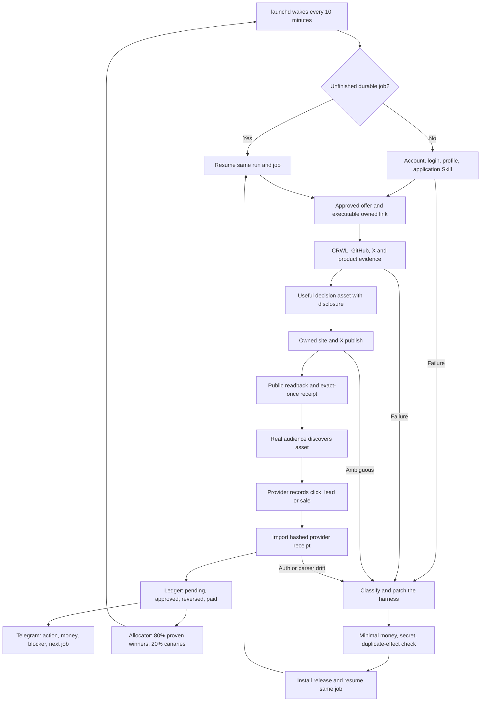

Ten minutes is the default coordination wake. Provider polling, posting, and
research each retain their own policy/rate-limit cooldown, so a wake does not
imply an external action every ten minutes. Every job is durable; a crash resumes
the same job and ambiguous publication is read back before any retry. The model
plans and diagnoses, while deterministic code owns money states, permission,
idempotency, budgets, and evidence. This is the target, not a current revenue
claim.

The money boundary is `C → R`. An article, post, click, signup, dashboard
screenshot, or model estimate is never revenue. The ledger increases only when
the external provider exposes a non-test commission transaction. `pending`,
`approved`, `reversed`, and `paid` remain separate. The owner does not operate
the browser or choose the next task; Telegram is an observable control surface,
not a daily approval queue.

Every box above must be invokable through the versioned `skills/affiliate`
dispatcher. Browser signup, login, profile setup, application, publication,
public readback, dashboard observation, and recovery are Skill operations rather
than undocumented setup performed by Codex. The local launchd owner invokes the
same commands that a future clean-Mac installer and cloud scheduler invoke.

### 1.5.1 Revenue scale architecture

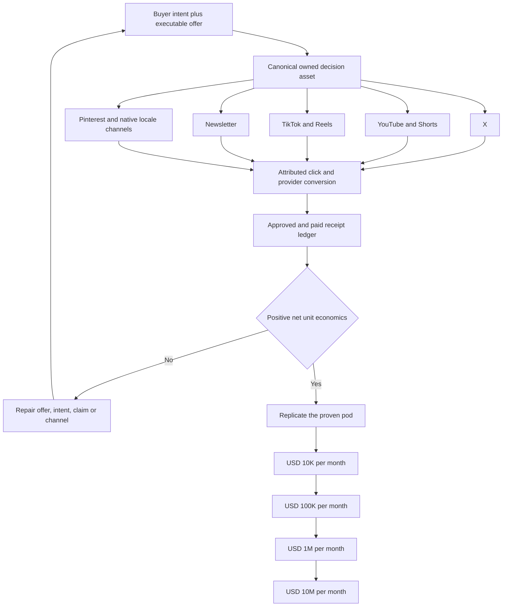

The scale mechanism is replication of externally profitable cohorts, not a
promise that more generated posts create money. A cohort is promoted only after
provider receipts establish attributable traffic, approved commission after
reversals, content and model cost, and positive net unit economics. The local
Mac proves the complete loop first. USD 100K and USD 10M require many independent
profitable pods and eventually tenant-isolated cloud workers; projections,
creator screenshots, clicks, and annualized run rates never close a gate.

The replicable unit is one `RevenuePod`: one locale, one buyer problem, one
canonical owned asset set, one or more independently executable offers, admitted
distribution channels, attributed provider events, costs, and one settlement
ledger. Channel variants reuse the canonical evidence and decision logic, but
each variant is native to its channel and has its own public readback. The Agent
MUST NOT create account farms or repeat identical affiliate posts. A channel
identity is provisioned once per legitimate brand and locale, receives an exact
profile/disclosure/session-health receipt, and then becomes a durable adapter.

The revenue equation is `qualified traffic × approved conversion rate × net
commission + recurring commission - attributable costs`. Every input remains
`unknown` until measured. USD 10K is reached by making one local English pod
profitable and then adding comparable placements and providers. USD 100K and USD
1M replicate only mature pods across offers, buyer intents, channels, and locales.
USD 10M requires a tenant-isolated media network, direct partner capacity, and
millions-scale qualified distribution; it is not achievable by increasing one
X account's posting frequency.

The channel order is fixed: owned site remains the canonical asset and
attribution boundary; English X is the first active distributor; YouTube/Shorts
and newsletter are admitted next because they create durable search and owned
audience; TikTok/Reels and Pinterest follow after their eligibility and public
effect contracts are receipted; Japanese `note` or another native platform is a
locale adapter after English E1. A channel is not added merely because an account
can be created.

## 2. Evidence-backed constraints

1. Every affiliate surface carries a clear disclosure adjacent to the link or
   recommendation. Amazon requires a prominent associate statement: “As an Amazon
   Associate I earn from qualifying purchases.”
   Source: [Amazon Associates Operating Agreement](https://affiliate-program.amazon.com/help/operating/agreement), section 5.
2. A post must help a reader decide; scaled thin or copied pages are rejected.
   Google defines scaled content abuse as generating many pages primarily to
   manipulate rankings rather than help users.
   Source: [Google Search spam policies](https://developers.google.com/search/docs/essentials/spam-policies).
3. The relationship must be obvious without making the reader hunt for it.
   Source: [FTC Disclosures 101](https://www.ftc.gov/business-guidance/resources/disclosures-101-social-media-influencers).
4. Rakuten explicitly supports product/service introductions on SNS and blogs,
   and exposes high-rate products and link-level reports.
   Source: [Rakuten Affiliate](https://affiliate.rakuten.co.jp/).
5. High-value Japanese CPA supply cannot be reduced to Amazon/Rakuten. A8.net
   supports only its registered/approved media and explicitly excludes Twitter
   advertising; afb reports roughly 17,000 promotions across 18 categories and
   identifies medical beauty and related lead-gen offers as high-price/high-
   conversion areas. Supply never implies channel eligibility.
   Sources: [A8.net](https://www.a8.net/), [afb](https://www.afi-b.com/).
6. Postiz exposes scheduling, articles, a public API, CLI, and MCP. It is a
   publisher adapter, not the Agent's brain or ledger.
   Source: [Postiz documentation](https://docs.postiz.com/).
7. Amazon does not guarantee traffic or commission income and may suspend an
   account for contract breaches. Amazon inventory is therefore not a revenue
   forecast and cannot bypass the policy gate.
   Source: [Amazon Associates Operating Agreement](https://affiliate-program.amazon.com/help/operating/agreement).
8. FTC disclosure must be hard to miss, accompany the endorsement, and use the
   same language as the endorsement. Locale-specific accounts and disclosures
   are therefore a contract, not a branding preference.
   Source: [FTC Disclosures 101](https://www.ftc.gov/business-guidance/resources/disclosures-101-social-media-influencers).
9. NerdWallet's official 2025 filing describes revenue per action, click, lead,
   and funded loan, but also reports organic-search pressure and a customer that
   represented 26% of revenue. Deep partner events work; channel and partner
   concentration remain material risks.
   Source: [NerdWallet 2025 Form 10-K](https://www.sec.gov/Archives/edgar/data/1625278/000162527826000014/nrds-20251231.htm).
10. A first-person five-figure affiliate launch used an existing email audience,
    social and blog distribution, years of product use, a 40% commission, and a
    staged launch funnel. It is evidence for trust and distribution, not evidence
    that copying a prompt reproduces revenue.
    Source: [Smart Passive Income five-figure affiliate promotion](https://www.smartpassiveincome.com/blog/5-figure-jv-affiliate-promotion/).
11. Current English candidate economics include Kit's 50% first-year commission,
    HubSpot's 30% monthly recurring commission for up to one year, and Semrush's
    tiered sale/trial commissions. These are candidates only until our own
    application, ownership, terms, and executable link are read back.
    Sources: [Kit Affiliate Program](https://kit.com/affiliate),
    [Kit Affiliate Terms](https://kit.com/affiliate-tos),
    [HubSpot Affiliate Program](https://www.hubspot.com/partners/affiliates), and
    [Semrush Affiliate Program](https://www.semrush.com/lp/affiliate-program/en/).
12. A8 forbids affiliate ads on Twitter, unregistered LINE messages and other
    unregistered media, publication of program reward conditions, and
    indiscriminate bulk partnership applications. Its high-ticket offers cannot
    be sent through the article's proposed X → LINE funnel unless a separate
    provider-specific written permission supersedes the observed terms.
    Source: [A8.net prohibited matters](https://www.a8.net/compliance/prohibited-matter.php),
    “Twitterについても広告を掲載することは禁止しています。”
13. First-person experience cannot be generated when the operator has not used
    the product. Source: [FTC Disclosures 101](https://www.ftc.gov/business-guidance/resources/disclosures-101-social-media-influencers),
    “You can’t talk about your experience with a product you haven’t tried.”
14. X allows separate language-specific brand accounts and localized cross-posts,
    but prohibits bulk/duplicative content, aggressive automated engagement, and
    scripted website automation. Source: [X authenticity policy](https://help.x.com/en/rules-and-policies/platform-manipulation),
    “branded entities specific to unique locations or languages”; and
    [X automation rules](https://help.x.com/en/rules-and-policies/x-automation),
    “Use non-API-based forms of automation, such as scripting the X website” may
    result in permanent suspension.
15. Awin's Spanish publisher page describes the real money state transition:
    tracked sales first appear pending, the advertiser validates them, and only
    approved commissions become payable. It also states there is no global
    minimum follower count, while each advertiser controls admission.
    Source: [Awin España — Afiliados](https://www.awin.com/es/afiliados).
16. Hotmart exposes products by format, niche, language, and popularity and says
    affiliates are paid for attributed sales. This proves multi-language offer
    supply, not that a translated campaign will convert or be approved.
    Source: [Hotmart Affiliates](https://hotmart.com/en/affiliates), “Sign up.
    Pick a product. Start promoting.”
17. Kit's current official page states “50% commission for 12 months” and a
    further “10-20% recurring revenue beyond 12 months when you earn status.” It
    also says commissions are held for 31 days for refunds. The Agent models the
    hold and status tiers instead of treating a click or pending sale as cash.
    Source: [Kit Affiliate Program](https://kit.com/affiliate).
18. Wirecutter's official description combines independent product testing and
    more than 1,000 decision categories with subscriptions, retailer placements,
    product sales, and affiliate commissions. The reusable pattern is a durable
    decision library with reader trust, not a direct-link feed.
    Source: [Wirecutter — About Us](https://www.nytimes.com/wirecutter/about/).
19. YouTube Shopping allows eligible creators to tag relevant products in videos
    and Shorts, exposes commission and performance data, and may reverse
    commission after returns. The Agent therefore treats YouTube as a durable
    search/video adapter and preserves the provider settlement state.
    Source: [YouTube Shopping affiliate program](https://support.google.com/youtube/answer/13376398?hl=en).
20. TikTok Shop officially supports commission-based creator promotion through
    shoppable short videos and livestreams. Its reported US platform growth and
    LIVE-shopping volume prove channel demand, not this Agent's income; admission
    still requires account eligibility and our own attributed receipts.
    Sources: [Introducing TikTok Shop](https://newsroom.tiktok.com/en-us/introducing-tiktok-shop),
    [TikTok Shop discovery commerce](https://newsroom.tiktok.com/en-us/tiktok-shop-is-where-shoppers-come-to-discover).
21. Pinterest requires original value, clear disclosure, moderate affiliate-link
    use, and generally one authentic account; it rejects fake accounts,
    manipulation, and repetitive high-volume affiliate Pins. Account-farm
    automation is therefore outside the product contract.
    Source: [Pinterest commercial and branded content guidelines](https://policy.pinterest.com/en/commercial-and-branded-content-guidelines).
22. ValueCommerce's official 2024 new-member ranking reports materially different
    monthly averages by niche, including PC/peripherals, employment,
    communications, and credit cards. This supports buyer-intent specialization;
    it does not prove that a category average or top result transfers to us.
    Source: [ValueCommerce — affiliate mechanism and earnings](https://www.valuecommerce.ne.jp/affiliate-about/).

Creator revenue screenshots and claims found on X are market signals only. They
never enter earnings or train a prompt as a winner without a matching external
receipt from this Agent.

### 2.1 External playbook intake: ブッタ article

The [2026-08 article by `@buttanoteragoya`](https://x.com/i/article/2084059581924454404) is stored as
`SELF_REPORTED_UNVERIFIED`: the profile and article are real, but the claimed
monthly income, approval rates, conversion funnel, and one-month result have no
public provider or payout receipts. It changes the workflow, not the revenue
forecast.

| Decision | Adopted pattern |
|---|---|
| COPY | Four boundaries: authenticated offer discovery → evidence-led decision asset → distribution variants → actual-data learning |
| COPY | Pain, mechanism, workflow, fit/not-fit, limitations, and one CTA |
| COPY | Generate hook variants and choose tomorrow's one action plus one stop action from observed data |
| TWEAK | Rank only offers returned by authenticated ASP/API/browser receipts; unknown approval rate, payout, or channel remains `UNKNOWN` |
| TWEAK | First-person copy requires an `ExperienceClaimReceipt`; otherwise use official evidence, direct tests, and explicit limitations |
| TWEAK | X, LINE, email, and owned pages each require a fresh `ChannelEligibilityReceipt`; owned registered pages are the default |
| REJECT | Revenue promises, predicted impressions/CVR, hidden advertising, fabricated experience, article-volume quotas, automated engagement, and A8 X/LINE direct ads |

Every external playbook stores `source_url`, author, capture time, claim type,
evidence grade, checked provider terms, `COPY|TWEAK|REJECT`, and reason. A prompt
is never promoted merely because its author reports income.

### 2.2 Continuous best-practice intake

The Agent searches official program pages with CRWL, creator cases and platform
discussion through authenticated browser/X collectors, and GitHub through `gh`
plus raw files. A source becomes executable knowledge only after:

1. capture with URL, immutable content hash, author, language, and evidence grade;
2. exact claim extraction and provider-policy cross-check;
3. license classification as `COPY_CODE`, `COPY_PATTERN`, or `NO_REUSE`;
4. one causal hypothesis and one-variable canary in exactly one locale pod;
5. promotion only from this Agent's mature external click/commission receipts.

Popularity, stars, screenshots, author income claims, estimates, and prompt scores
are discovery signals. They never become revenue, conversion truth, or an
auto-promoted winner.

### 2.3 Aggressive but bounded revenue policy

“Aggressive” means faster evidence collection, more creative variation, quicker
offer replacement, and higher capacity only after positive net receipts. It does
not mean hidden advertising, fabricated experience, unauthorized channels,
engagement manipulation, challenge evasion, or risking the payout account. The
browser-only X lane is an explicit accepted enforcement risk, not a claim of X
approval. The Agent may test strong hooks, contrarian angles, profile-versus-owned-page
distribution, pricing frames, CTA placement, and content format one variable at
a time. Any tactic that requires deception or threatens account/payout survival
has negative expected value and is rejected by the deterministic gate.

## 3. Single recommended strategy

Start with one narrow English buyer problem on `@selawmqt`. Its X login is
provisioned; account presentation and browser publishing remain Agent work. The initial
candidate set is non-regulated B2B SaaS and
creator/productivity software because its official programs expose higher or
recurring payouts and the existing English publication lane reduces launch
friction. Exact market-size superiority is unproven and is not a premise.
Before its first Affiliate placement, change the current `sela` presentation to
an English Anicca identity with an adjacent profile disclosure; future content
is English-primary with one native Japanese-source slot after nine verified
English non-Affiliate effects. The 128 historical mixed-language posts remain historical data,
not a reason to delete or fabricate a clean track record.

Initial English capacity allocation:

- 70%: one authenticated high-value or recurring software portfolio with a
  genuine reader fit;
- 20%: owned comparison/how-to assets and their measured distribution;
- 10%: bounded exploration, including Amazon only when executable and useful.

Regulated financial products are excluded from the initial lane despite proven
affiliate economics. Japanese discovery may continue read-only, but Japanese
publication stays disabled until English E0; Japanese J1 is then earned by its
own account, offer, placement, click lineage, and commission receipt.

Do not start as a generic deal feed. Publish decision assets: comparisons,
cost calculators, migration guides, tested workflows, failure-mode guides, and
“who should not buy” sections. Each content unit maps one reader problem to one
primary offer and at most two honest alternatives.

### 3.1 Money model

The loop earns only when an external partner approves a downstream event:

`net commission = qualified visits × observed partner conversion × confirmed payout − reversals − content/compute cost − paid acquisition`

The learner therefore ranks signals in this order: paid/approved net commission,
approved sale or lead, qualified trial, provider-confirmed click, then engagement.
Posts, views, and prompt scores are diagnostic proxies, never money. Before 30
days of live cohorts, each conversion input and revenue forecast remains
`unknown`; best/base/worst cases are computed only from observed receipts.

## 4. Architecture

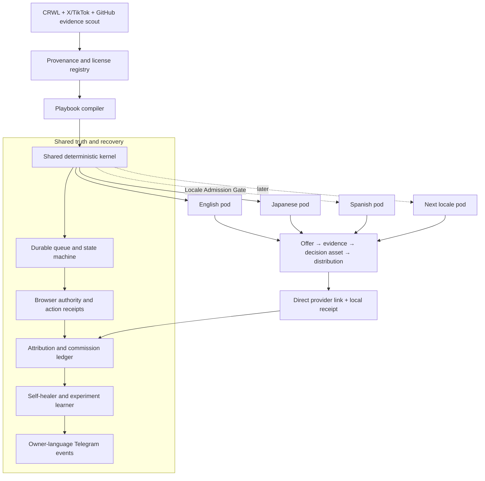

This is one durable Agent with specialized workers, not independent agents with
separate truth. PostgreSQL/SQLite state and append-only receipts are canonical;
prompts and browser sessions are replaceable executors.

The kernel is shared code, not shared market state. Each locale pod owns its
identity, browser storage, provider membership, executable links, disclosures,
evidence pack, experiments, ledger partition, and budget. A useful English asset
may seed a hypothesis for Japanese or Spanish, but the destination pod must
re-research native intent, terms, claims, alternatives, and wording before a
canary. Translation alone can never authorize publication.

### 4.1 Components

| Component | Contract |
|---|---|
| Provider adapters | English B2B/creator programs first; Amazon, Rakuten, A8, afb, and later networks normalize offers, terms, commission events, and account health only after authenticated readback |
| Offer verifier | Re-reads landing page, price, availability, geo, payout, prohibited claims, allowed channels, disclosure, and expiry before publication |
| Portfolio allocator | Selects by expected **net** value: qualified intent × observed conversion × confirmed payout − refunds − content/compute cost − compliance risk |
| Evidence pack | Stores official facts, direct product evidence, alternatives, audience pain, counterclaims, and freshness TTL |
| Content studio | Produces an English article, X thread/post, X Article, carousel, slideshow, or video; the later Japanese pod uses independent evidence, identity, and localization rather than mixed-language reuse |
| Policy gate | Fail-closed for missing disclosure, unverified claims, prohibited categories, self-dealing, stale price, broken link, or unregistered surface |
| Browser publisher | Observe semantically, execute one typed action, then require before/after URL and observation hashes, expected identity, external object URL/ID when visible, screenshot hash, and fresh public readback. Before retrying an ambiguous publish, search the ledger and live account for the content fingerprint |
| Attribution | Agent records content, placement, offer, language, and experiment locally, publishes the provider tracking link directly, and reconciles only provider-side click/commission receipts |
| Receipt reconciler | Navigates provider dashboards and downloaded reports through the browser, hashes the source artifact, and joins transaction/sub-ID rows to clicks. Unknown is never zero; pending, approved, reversed, and paid remain distinct |
| Learner | Promotes a tactic only from mature cohorts and deepest common signal: net commission → approved orders → qualified leads → clicks → engagement |
| Recovery controller | Same `run_id`, artifact hash, placement, and publication intent resume after failure; exponential retry obeys provider `Retry-After` |
| Best-practice scout | Captures official terms, first-person cases, platform signals, and OSS code with provenance, license, evidence grade, TTL, and `COPY_CODE|COPY_PATTERN|NO_REUSE` disposition |
| Locale pod controller | Creates or resumes one isolated identity/provider/content/ledger slice only after the Locale Admission Gate; prevents cross-locale cookies, links, claims, and learning leakage |

### 4.2 Canonical records

`source_capture`, `crawler_adapter_receipt`, `provider_account`, `offer`,
`offer_snapshot`, `external_playbook_intake`,
`channel_eligibility_receipt`, `experience_claim_receipt`, `evidence_claim`, `content_unit`,
`placement`, `publish_intent`, `public_readback`, `click`, `conversion`,
`commission_receipt`, `experiment`, `policy_decision`, `wait_state`, and
`recovery_attempt` are the minimum entities.

Every commission receipt stores provider transaction ID, click/sub-ID when
available, currency, gross commission, reversal/refund, fees, net amount,
status, observed time, and immutable source hash. Canonical states are
`pending`, `approved`, `reversed`, and `paid`; UI may say “approved, not paid”
but that phrase is not a fifth storage state. Approved and paid are never combined.

## 5. Loop and state machine

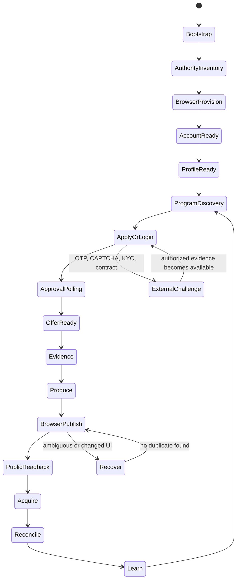

The deterministic kernel owns transitions, leases, budgets, idempotency, money,
and receipts. One semantic browser planner handles unfamiliar pages. After a
successful path, the Agent stores a versioned playbook; later runs replay it and
invoke semantic recovery only when observation or postcondition hashes diverge.
This is one durable Agent with role prompts, not a swarm of independent ledgers.

Minimum receipt chain:

`BootstrapReceipt → AuthorityReceipt → AuthReceipt → ProfileReceipt → ProgramApplicationReceipt → OfferApprovalReceipt → EvidenceReceipt → PublishIntent → BrowserActionReceipt → PublicReadbackReceipt → ClickReceipt → CommissionReceipt → PayoutReceipt → LearningReceipt`.

Screenshots prove rendered state, not money. Only hashed provider dashboard/report
readback can create `pending`, `approved`, `reversed`, or `paid` commission rows.

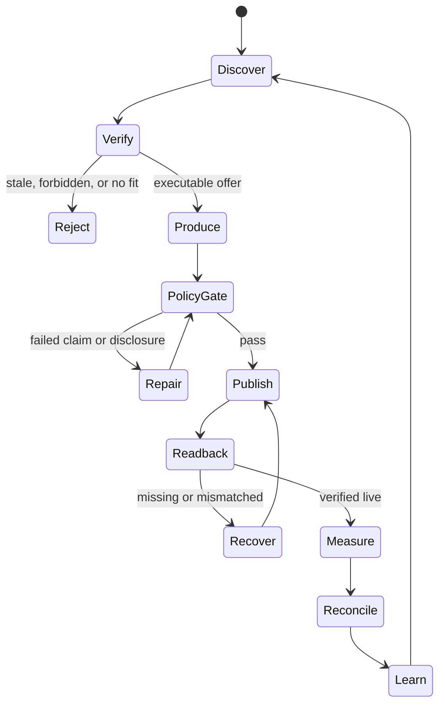

Cadence:

- every 5 minutes: reconcile leases and ambiguous side effects, resume failed
  intents, ingest receipts, and flush the Telegram outbox; it does not create a
  new article every five minutes;
- hourly: offer/price/link/account health and provider/application polling;
- daily during launch: measure prior English cohorts, verify terms, choose one
  reader problem, produce at most one English primary decision asset, derive
  compliant distribution, perform public readback, and reconcile reports;
- 24/72 hours and 7/30 days: cohort measurement and learning;
- weekly: provider mix, reversals, net margin, concentration, and policy audit;
- monthly: close currency/reversal/payout truth and decide whether a locale or
  provider has earned more budget.

Platform publication windows block only that placement. Every wait has a retry
time and durable owner; “wait for next schedule” is invalid.

### 5.1 Next implementation slice: the loop becomes the operator

This slice precedes another manually operated campaign. It changes the installed
runtime from a polling shell into one model-led Agent using deterministic tools:

1. bring the proven shared `runtime/agent-runner/` package and its schema/token/
   usage contracts into the Affiliate immutable release; do not copy any
   Coconala prompt, account, connector, session, or state;
2. add one Affiliate decision prompt and schema containing goal, current receipts,
   unfinished job, allowed tools, budgets, and canonical examples. The model
   chooses the next useful action; regex/priority tables do not choose niches,
   offers, topics, or copy;
3. expose the existing Skill commands as typed tools: program/provider, source
   capture, campaign artifact, policy, placement, owned publish/readback, X
   publish/readback, revenue reconciliation, and Telegram outbox;
4. extend `job_journal.py` with unresolved-job enumeration and stage trajectory,
   so every wake resumes one unfinished stage before choosing new work;
5. replace `local_loop.wake()`'s fixed poll-only path with
   `observe → agent decides one action → tool executes → external readback →
   receipt → reflect`. Keep provider/revenue observation as tools, not the brain;
6. add an Affiliate healer that classifies typed auth, source, browser, policy,
   ambiguous-effect, disk, and owner failures; it runs only bounded allowlisted
   repairs, rechecks the postcondition, and emits `SELF_HEALED` or quarantine;
7. keep launchd as the only scheduler. Five/ten-minute wakes reconcile and
   resume; hourly/daily work is admitted by durable due-times rather than by a
   second scheduler or a hardcoded article-per-wake rule;
8. prove one installed wake advances the existing ElevenAgents job from
   `DELIVERED → LIVE → X LIVE` without Codex/browser intervention, then induce one
   isolated recoverable fault and prove same-job repair.

The completion receipt for this slice is not a test or a generated article. It is
one installed launchd wake trajectory whose model decision, tool call, external
effect/readback, durable state transition, and Telegram report all share the same
run/job identity.

## 6. Self-improvement without self-corruption

- Preserve at least 20% exploration and require at least ten mature comparable
  placements before winner/loser mutation, matching the existing Marketing
  Engine scoring contract.
- Change one causal variable per experiment: offer, hook, proof shape, CTA,
  format, channel, or publish time.
- Optimize net approved commission per 1,000 qualified impressions and net
  commission per content dollar. Never optimize raw post volume.
- A provider, offer, prompt, or account is quarantined after repeated policy,
  reversal, link-health, or reach failures; the Agent shifts to an independent
  provider/channel while diagnosing it.
- Prompt mutations are versioned and reversible. A winning claim cannot be
  invented by the learner; factual claims always come from a fresh evidence pack.

## 7. Reuse and OSS decision

Reuse from the existing system:

- Writer Agent: research acquisition, JA/EN localization, X/article publisher
  adapters, public readback, same-run resume, claim registry;
- Marketing Engine: generic publication receipts, account-isolation patterns,
  slideshow/video/carousel renderers, mature-cohort scoring, and Telegram
  reporting; its Postiz publisher is explicitly not reused;
- Life Manager financial ledgers: verified money semantics and reporting.

Repository audit result: no inspected repository proves an autonomous affiliate
loop from account/application through an externally approved commission. We do
not fork a repository and call it the product. We copy only the following proven,
licensed parts into the existing local runtime:

| Repository | Measured truth | Decision |
|---|---|---|
| [BlockRunAI/Franklin](https://github.com/BlockRunAI/Franklin) | Apache-2.0 source; durable goals/scheduler, wallet budget, resumable sessions, task event logs, lost-task detection, and Telegram control. Its README says it **spends** money toward work; it does not reconcile affiliate income | `COPY_PATTERN`: bounded goals, cost caps, durable task lifecycle, evidence challenge. Do not import its wallet/trading subsystem or treat spend as earnings |
| [paraggit/affiliate-automation](https://github.com/paraggit/affiliate-automation) | MIT file; provider abstraction, retry/backoff, persistence, tests, content and Twitter scheduling. Runtime still asks `Start scheduler?`; no commission or payout ingest exists | `COPY_CODE` selectively: provider protocol, retry, and tests. Replace interactive scheduler and API publisher with our queue/browser/receipt kernel |
| [stay4ever role agents](https://github.com/stay4ever) | MIT files and small tested scout/content/analyst packages. Niche scores and performance examples use estimates or caller-supplied data | `COPY_CODE` selectively: role/tool schemas and disclosure template. Never import estimated traffic, CVR, or benchmark revenue as truth |
| [anacgr05/affiliate-agents](https://github.com/anacgr05/affiliate-agents) | Role graph, PostgreSQL/Redis/Celery/SSE and explicit human approval; no license file and no external commission reconciler | `COPY_PATTERN` only: critic/feedback state boundaries; do not copy code or human gate |
| [ricky-affiliate-agent](https://github.com/sujalmanpara/ricky-affiliate-agent) | Amazon → 15 images → Postiz. No license file despite README saying MIT; code warns “Commissions won't be tracked to your account” when the tag is absent | `NO_REUSE` as a base; Postiz and untracked output violate the product/revenue contract |
| [amazon-affiliate-automation-pipeline](https://github.com/haramhussain110/amazon-affiliate-automation-pipeline) | Five-file, unlicensed content pipeline; README says videos are “ready to check and post manually” and “I'm not auto-posting anything” | `NO_REUSE` as a base; at most reimplement the ASIN→video idea after provider-policy verification |
| [autonomous-marketing-agent](https://github.com/abandini/autonomous-marketing-agent) | No license file; scheduler/recovery shapes coexist with mock approvals and hard-coded revenue/conversion payloads | `NO_REUSE` code; retain only the abstract recovery vocabulary |
| [awesome-OpenClaw-Money-Maker](https://github.com/BlockRunAI/awesome-OpenClaw-Money-Maker) | A catalog, not an executable system; README says “These are potential earnings, not guarantees” | Discovery index only; every linked project receives its own code/license/money audit |

Local Writer/Gig loops are more valuable than any inspected affiliate repository
for production behavior: they already supply launchd ownership, same-run
reconciliation, public readback, durable receipts, and Telegram delivery patterns.
Their interfaces are reused while their ledgers remain isolated.

#### X Article reuse decision

The existing Writer Agent already implements the X Article wheel. Its production
tree references [`wshuyi/x-article-publisher-skill`](https://github.com/wshuyi/x-article-publisher-skill)
and contains Markdown preparation, rich clipboard insertion, cover/body media,
publish, authenticated public readback, and same-ID repair under
`skills/writer-agent/scripts/x-publish/`. A real Writer X Article is already
public, so this is production evidence rather than a README-only candidate.

The current Writer installation is nevertheless bound to protected CDP `9222`
and `@diceai0`; Affiliate owns `@selawmqt` on CDP `9326`. Affiliate MUST NOT copy
the scripts into a second publisher or touch 9222. The smallest reuse is to make
the existing Writer X adapter accept an explicit browser authority contract
(`cdp_port`, expected account, artifact path, receipt root), then invoke that
same adapter from Affiliate with `9326 + @selawmqt`. If the Affiliate account
does not expose the X Article editor, record `CHANNEL_UNAVAILABLE` and continue
owned-site articles plus ordinary X posts; never emulate X Articles with a new
automation stack.

Live capability readback now closes the current decision: `@selawmqt:9326`
returns `Page not found` at the canonical Writer `/compose/articles` route and
renders no editor controls. The adapter remains reusable code, but there is no
current Affiliate channel to invoke. Its parameterization is deferred until a
future account-state change; owned articles and ordinary X posts remain active.

### 7.0.1 File-level reuse map

The audit reads implementation files, not only READMEs. `COPY_CODE` still means a
small compatible slice with license attribution; it never means importing a whole
runtime. The current disk floor is 10 GiB free. Below that floor the Agent stops
new clones, media generation, and browser downloads while continuing ledger and
health reporting. GitHub tree/raw access replaces a clone when it proves the same
code boundary.

| Source file | Proven mechanism | Exact use in Affiliate Agent | Explicitly excluded |
|---|---|---|---|
| [Franklin `src/tasks/store.ts`](https://github.com/BlockRunAI/Franklin/blob/main/src/tasks/store.ts) | Atomic temp-file rename plus append-only `events.jsonl`; one writer per task | Keep the existing `job_journal.py` contract: immutable `run_id`/`job_id`, append-before-effect, tolerant replay, same-job resume | Franklin wallet, trading, generic command runner, and any revenue inference |
| [Franklin `src/tasks/lost-detection.ts`](https://github.com/BlockRunAI/Franklin/blob/main/src/tasks/lost-detection.ts) and [`src/scheduler/store.ts`](https://github.com/BlockRunAI/Franklin/blob/main/src/scheduler/store.ts) | Reconcile a dead owner as `lost`; after sleep fire one current slot rather than replaying every missed interval | A14.7 watchdog, stale-owner detection, and one bounded catch-up wake | Copying its process model or creating a second scheduler beside launchd |
| [Forage `forage/agent/core.py`](https://github.com/Nerfed-Lab/forage/blob/main/forage/agent/core.py) | Repeating check-vitals → decide → act → reflect → persist cycle | Copy only the cycle boundary and cost-aware action selection into the existing local loop | Its capability-returned `revenue` value; Affiliate money must come from a hashed provider transaction |
| [Forage `forage/economy/ledger.py`](https://github.com/Nerfed-Lab/forage/blob/main/forage/economy/ledger.py) | Append-oriented income/expense queries and profitability windows | Reuse the profitability/window vocabulary; preserve Affiliate's richer pending/approved/reversed/paid lineage | Treating a local action result or wallet balance as commission |
| [paraggit `src/core/base_affiliate.py`](https://github.com/paraggit/affiliate-automation/blob/main/src/core/base_affiliate.py) | Small provider protocol and normalized product record | Reimplement the protocol shape as provider playbooks with authenticated ownership, terms, allowed-channel, link and report states | Its Amazon/Flipkart assumptions and price/deal ranking as the primary strategy |
| [paraggit `src/utils/retry.py`](https://github.com/paraggit/affiliate-automation/blob/main/src/utils/retry.py) | Bounded typed retry with exponential delay | Reference for read-only transient retries only; writes remain journaled and reconcile-before-retry | Its interactive scheduler, generic content prompt, Tweepy publisher, and unverified success booleans |
| [Crawlee `recoverable_state.py`](https://github.com/apify/crawlee-python/blob/master/src/crawlee/_utils/recoverable_state.py) and [`RequestQueue` example](https://github.com/apify/crawlee-python/blob/master/docs/introduction/code_examples/02_request_queue.py) | Persisted crawler state and durable request queue across restart | Admit only when CRWL cannot cover a real multi-page/JS research job; emit normalized `SourceCapture` receipts | Making Crawlee the Agent brain or adding it for single-page fetches |
| [NanoClaw scheduling and host sweep](https://github.com/nanocoai/nanoclaw/tree/d7d9887eb4acae8d60e327afc21955e3f10b77eb) | MIT; SQLite occurrences with stable series IDs, stuck-claim reset, exponential backoff, auto-pause after repeated failure, delivery status/message ID, and append-only run logs | Copy the durable occurrence, claim, backoff, terminal-failure, and delivery-receipt pattern into Affiliate's existing launchd/job boundary | Its messaging domain, container runtime, and any assumption that task delivery is revenue |
| [Temporal Python agent activities](https://github.com/temporalio/sdk-python/blob/680a6b4f32e9d5f2484e9a2e1c604178553c3f55/temporalio/contrib/openai_agents/workflow.py) | MIT; wraps each agent tool call as a durable Activity with retry, heartbeat, and workflow history | Retain as the later cloud migration reference for tool-level durability | Adding a Temporal server to the local Mac before the launchd loop proves revenue |
| [LangGraph ToolNode and SQLite checkpoint](https://github.com/langchain-ai/langgraph/tree/644815f9e5bc52ad8f7a5227a456227e9c3e639b) | MIT; model/tool loop, injected state/store/runtime, checkpoint lineage, and attempt events | Copy the tool-result/context and checkpoint-after-transition pattern only if the shared Life Manager runner lacks it | Replacing the proven shared runner or treating LangGraph core as a persistent scheduler |

The first implementation choice is therefore local reuse, then the smallest
licensed external mechanism. There is no dependency addition for a mechanism
already implemented by `job_journal.py`, launchd, CRWL, CloakBrowser, or the
Writer/Gig publication and receipt contracts.

### 7.1 Closest end-to-end OSS and public-claim gate

No inspected OSS project closes the whole chain from lawful account authority to
an externally approved recurring income receipt. The nearest reusable systems
are complementary, not substitutes for the Affiliate Agent:

| Project | Closest proven boundary | Missing money boundary | Decision |
|---|---|---|---|
| [Nerfed-Lab/forage](https://github.com/Nerfed-Lab/forage) | MIT autonomous cycle, budgets, ledger, evolution, and Gumroad listing; cloned suite passed 39 tests | Its measured revenue remains `0.0`; Stripe/crypto payout and external receipt ingest remain TODO | Copy the economic-agent cycle and budget/ledger tests, not an earnings claim |
| [diptobiswas/agentwork](https://github.com/diptobiswas/agentwork) | Closest marketplace shape: agent profiles, gigs, escrow contract, and on-chain settlement vocabulary | Observed public market had one active agent, zero gigs, and `$0` earned; production recipient lookup remains TODO; no root license | Pattern only; do not copy unlicensed code or call escrow capability revenue |
| [coinbase/x402-paid-api-starter](https://github.com/coinbase/x402) | Closest real settlement substrate: idempotent transaction/settlement receipts; relevant cloned slice passed 13 tests | It does not acquire customers, publish, or choose profitable work | Reuse receipt/settlement patterns for an x402 loop, not as Affiliate Agent |
| [paraggit/affiliate-automation](https://github.com/paraggit/affiliate-automation) | Closest licensed affiliate code: MIT provider abstraction, persistence, retry, content, scheduling; audited suite passed 41 tests | Interactive confirmation; no program application, commission reconciliation, payout, or public ledger | Selective code reuse behind our deterministic queue/browser/receipt contracts |
| [No Human in the Loop](https://nohumanintheloop.com/) | Self-reported real-world precedent: zero approvals and `$2,152` from 74 Gumroad copies | Public GitHub is a static two-file site, not a reproducible harness/ledger, and has no reusable license | Evidence that generic “world's first money loop” is unsafe |

Until a public proof gate closes, README language is only: “We are building an
open-source, receipt-verified affiliate earning loop.” The qualified claim “To
our knowledge, Life Manager is the first open-source, receipt-verified agent loop
that autonomously operates affiliate marketing from authorized account bootstrap
through settled commission” becomes eligible only when all of these exist:

1. canonical public Life Manager source and reproducible macOS installation;
2. a live E1 commission and later payout receipt, redacted and content-addressed;
3. a privacy-safe append-only ledger separating gross, net, pending, approved,
   reversed, paid, currency, cost, and payout;
4. an independent verifier that replays receipt hashes and ledger invariants;
5. a public prior-art registry with search date, routes, repositories, licenses,
   code/tests inspected, and explicit uncertainty;
6. no secret, tax, bank, customer, session, or provider-internal identifier in
   the public projection.

This gate permits a qualified prior-art statement, never a guaranteed-income or
generic “world's first money-printing loop” claim.

### 7.2 Crawling and scraping substrate

“Every platform” is implemented as one typed `CrawlerAdapter` registry, not one
fragile scraper pretending every site has the same access model. Every adapter
returns normalized `SourceCapture` records with URL/object ID, platform, locale,
author, captured time, raw artifact hash, parser version, access route, and
readback class. Empty results are distinguishable from auth, rate-limit, parser,
policy, and upstream failures.

| Surface | Primary route | Clone/code evidence | Runtime decision |
|---|---|---|---|
| Public web and linked articles | Existing `crwl crawl`; Scrapy only for parser/HTML fallback | [Scrapy](https://github.com/scrapy/scrapy) is BSD-licensed; cloned retry, robots, and throttle suites passed 90 tests with 14 environment skips | Reuse the installed CLI first. Do not add a framework for a one-page fetch |
| Durable multi-page/JS crawl | Crawlee Python `HttpCrawler`/`PlaywrightCrawler` with persistent `RequestQueue`, session pool, robots delay, `Retry-After`, and backoff | [Crawlee Python](https://github.com/apify/crawlee-python) is Apache-2.0; cloned queue/session/throttle suites passed 338 tests with 2 memory-storage skips, and its official `HttpCrawler` example fetched `crawlee.dev` with 1 finished/0 failed | `COPY_CODE`/dependency only when a durable crawl is actually required; this is the shared substrate, not the Agent brain |
| X search and logged-in pages | Existing `x-search-cdp` on the exact daily-driver tab; CloakBrowser semantic read for authenticated articles | Local code drives the rendered tweet DOM. Current probe returned `no logged-in x.com tab`, so this route is not presently healthy | Repair/re-provision the authorized tab inside the Agent; never launch a duplicate browser silently |
| Public X tweet/profile fallback | `x-tweet-fetcher`: FxTwitter → Nitter → browser fallback, normalized schema and SQLite dedupe | [x-tweet-fetcher](https://github.com/ythx-101/x-tweet-fetcher) is MIT; 97 tests passed and live `@selawmqt` profile readback matched 128 posts, 0 followers, 27 following | Adopt for read-only public objects. X Articles still require a browser; no posting capability |
| X private-API fallback | None in production | [Twscrape](https://github.com/vladkens/twscrape) is MIT and 192 cloned tests passed, but it rotates accounts and consumes X internal GraphQL operations; fixture success does not prove live account safety | `NO_REUSE` initially. It may enter an isolated research canary only after a live/policy/account-risk review |
| TikTok | `clockworks/tiktok-scraper` and task-specific Apify Actors via their fetched input schemas | Existing code calls the Actor and normalizes videos/slideshows, but its current combined test file cannot collect because it still imports deleted `rss_parser`; old `drawrowfly/tiktok-scraper` is unlicensed and stale | Managed Actor adapter remains the candidate, but production admission requires a fresh one-item live dataset receipt and a repaired focused contract test |
| Instagram, Facebook, YouTube, Google Search/Trends/Maps | Task-specific Apify Actor selected by the local `apify-ultimate-scraper` registry | Actor IDs and input discovery exist locally; Actor implementation code is not assumed open source | Fetch actor schema, run a bounded live canary, hash dataset/schema, then admit. Never claim code reuse when only a hosted Actor is used |
| Reddit | PRAW with authorized read-only OAuth; public HTML through CRWL only as fallback | [PRAW](https://github.com/praw-dev/praw) is BSD-licensed; cloned auth/read-only/rate-limit unit slice passed 34 tests | Adopt official client semantics; do not use unauthenticated bulk-scraper repos as the primary route |
| GitHub | `gh` API/search plus raw files, then clone candidate repositories | GitHub CLI returned repositories and full clones supplied the code/license/test evidence in this audit | Already canonical; README alone never closes an audit |
| Amazon, Rakuten, A8, afb, PartnerStack and ASP dashboards | Official product/program API when explicitly allowed; otherwise isolated CloakBrowser rendered pages and report downloads | Affiliate-specific public scrapers either lack licenses, omit posting/revenue, or bypass the authenticated ownership state required by the ledger | Never substitute product scraping for provider approval, tracking-link ownership, or commission reconciliation |

Adapter selection follows a fixed ladder: official/authenticated interface →
installed CRWL → licensed public-object adapter → Crawlee/Scrapy → rendered
CloakBrowser. A failed route emits evidence and advances only to an allowed
fallback. It never rotates stolen accounts, bypasses challenges, or turns a parser
failure into an empty market signal.

No external prompt or source is copied unless its license permits reuse. Public
workflow ideas are reimplemented against our own contracts and evidence.

### 7.3 2026-08-22 OSS architecture decision: Agent core, guarded effects

Read-only source inspection at fixed commits compared five repositories against
the installed Affiliate runtime. The current runtime has 21 top-level Python or
shell scripts (15,267 lines); `local_loop.py` alone is 3,863 lines. This is not a
reason to discard its verified money and effect contracts. It is evidence that
strategy, orchestration, recovery, accounting, and reporting have accumulated in
one deterministic coordinator and make every new judgment require another code
branch.

| Fixed source | Code-level observation | Adoption decision |
|---|---|---|
| [Hermes Agent `fc7523c`](https://github.com/NousResearch/hermes-agent/blob/fc7523ca31eeb6eff9114afe384c2cf6380359df/CONTRIBUTING.md#architecture-overview) | One model loop dispatches self-registering tools, appends observations, loops, persists sessions, and loads persistent memory/skills | **Primary pattern.** Copy the small `plan → tool → observe → continue` control shape and tool registry; do not import its broad tool surface or let memory authorize effects |
| [LangGraph `f09cfe8`](https://github.com/langchain-ai/langgraph/blob/f09cfe8ffc1eeffd68f4b628ed69c30f7cad229f/README.md#why-use-langgraph) | “Durable execution” resumes long-running stateful agents after failure; SQLite checkpointers preserve lineage | **Copy pattern, no dependency in slice 1.** Map the existing job journal to one checkpoint per committed transition; reconsider the library only if the local adapter cannot preserve resume semantics |
| [Dapr Agents `5a3c834`](https://github.com/dapr/dapr-agents/blob/5a3c8348ff38d49e7485bfdf7a6935cf0e03cc19/README.md#durable-execution) | Combines deterministic processes with LLM decisions and restores workflow state after interruption | **Cloud reference only.** It adds a distributed runtime that the current Mac and first commission do not need |
| [EvoAgentX `fd6b9a6`](https://github.com/EvoAgentX/EvoAgentX/blob/fd6b9a6352afc933b170e595bfb3dc5a28d9571a/README.md) | Evolves workflows through iterative evaluation rather than unmeasured prompt mutation | **Copy evaluator/promotion pattern.** Candidate playbooks remain shadow-only until mature provider outcomes beat the active version; never optimize on views or clicks as money |
| [affiliate-automation `ba75817`](https://github.com/paraggit/affiliate-automation/blob/ba758178a95a7c785e73b05b2735eeced272d66a/src/affiliate_automation/main.py) | Interactive commands and `Start scheduler?`; product persistence exists, but no commission, reversal, settlement, or replay-safe join | **Reject as runtime.** Retain only the already-documented small provider/retry ideas |

Sources and core quotations:

- Hermes Agent: “Execute each tool via registry dispatch ... Loop back to LLM
  call.” Its state table makes SQLite canonical and separates skills, memories,
  sessions, and cron. Source: [Hermes contributing guide](https://github.com/NousResearch/hermes-agent/blob/fc7523ca31eeb6eff9114afe384c2cf6380359df/CONTRIBUTING.md#architecture-overview).
- LangGraph: “Build agents that persist through failures ... automatically
  resuming from exactly where they left off.” Source: [LangGraph README](https://github.com/langchain-ai/langgraph/blob/f09cfe8ffc1eeffd68f4b628ed69c30f7cad229f/README.md#why-use-langgraph).
- EvoAgentX: “AI agents can be constructed, assessed, and optimized through
  iterative feedback loops.” Source: [EvoAgentX README](https://github.com/EvoAgentX/EvoAgentX/blob/fd6b9a6352afc933b170e595bfb3dc5a28d9571a/README.md).

The single recommended target is a **thin persistent Agent core around the
existing guarded effect and money kernel**:

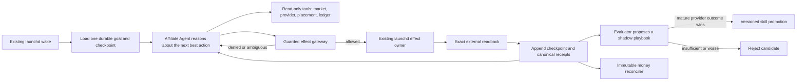

The Agent owns strategy, diagnosis, sequencing, and choosing among registered
tools. Deterministic code remains only where an incorrect guess can create a
duplicate external effect, leak a secret, violate provider/channel policy,
corrupt evidence, or misstate money. Launchd remains the sole scheduler and
business-effect owner. The canonical placement and transaction ledgers remain
append-only truth. Self-improvement changes versioned prompts/skills and tool
selection policy only; it never edits code, grants authority, rewrites history,
or promotes a candidate without provider-outcome evaluation.

Migration is one vertical slice, not a rewrite:

1. Extract current read-only observations and already-owned effect commands into
   a typed tool registry; preserve their exact entrypoints and receipts.
2. Add one persistent Agent session keyed by durable goal/job ID. On each wake it
   receives the current checkpoint, chooses one tool, observes the result, and
   either continues or records a typed wait/terminal state.
3. Route every write through the existing effect journal, quarantine, cost cap,
   policy, secret, exact-readback, and owner-authority gates. The Agent never
   invokes a publisher/provider mutation directly.
4. Run the Agent in shadow mode against the existing owner until its proposed
   next action matches an allowed real transition and replay produces no second
   effect. Then replace only the strategy branch of `local_loop.py`.
5. After the first official transaction cohort is mature, add evaluator-driven
   playbook candidates and promote only on approved/paid net after reversals and
   known real costs.

Explicit non-goals: importing an entire agent framework, adding Dapr/Temporal,
creating another scheduler or executor, replacing the canonical ledger, allowing
self-modifying production code, or counting content/clicks/views as revenue.

## 8. Revenue gates

| Gate | Verifiable completion |
|---|---|
| E-1 | English provider auth and ownership readback for one executable offer on the dedicated English identity |
| E0 | One English placement has public readback, an executable direct provider/custom link, and a provider click receipt; this unlocks a separate Japanese canary |
| E1 | First non-test English approved commission joined end-to-end |
| J-1 | After E0, Japanese provider/account ownership and one executable offer are independently read back |
| J0/J1 | Japanese public placement/click lineage, then approved commission, each closed independently of English |
| L0 | Any later locale has a separate identity/browser/provider/link/disclosure, at least one executable offer, native evidence review, and a receipted canary; Spanish is the first expansion candidate |
| A2 | Four revenue-positive weeks, positive net margin, zero manual execution |
| A3 | In one rolling 30-day window, provider-reconciled `approved` or `paid` commission minus reversals and known real billed costs is at least USD 10,000; unknown material cost keeps net unknown and cannot close the gate |
| A4 | Diversified scale: no provider, offer, or channel exceeds 40% of net commission |
| A5 | $10,000,000 cumulative or monthly target is defined explicitly and then met only by external receipts; never inferred from traffic |
| A6 | $100,000,000 monthly net remains `HORIZON_OPEN` until one externally settled month passes FX, reversal, cost, concentration, policy, partner-capacity, and tenant-isolation audits; GMV and forecasts do not count |
| OSS1 | After E1, one clean macOS user installs the public repository with one command and reaches the same pre-publication state without copying credentials, sessions, or mutable receipts |
| C1 | After A2 and OSS1, one isolated cloud tenant reproduces the same state machine, browser action receipts, money ledger, recovery, and report without weakening policy or tenant isolation |

Best/base/worst planning is computed only after 30 days of real funnel data.
Before that, revenue is `unknown`, not a fabricated conversion forecast.

## 9. Ordered implementation backlog

### 9.0 One-line route to USD 10,000 approved-or-paid net in rolling 30 days

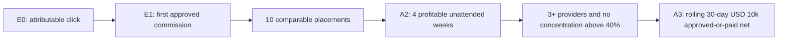

There is no honest fixed promise that a known number of posts produces USD
10,000. After mature first-party cohorts exist, the Agent computes the required portfolio from observed
provider receipts. For example, USD 10,000 can equal 100 approved commissions at
USD 100 net, 20 at USD 500 net, or a mixture. Those are arithmetic decompositions,
not forecasts. The allocator increases only cohorts with positive approved net
commission after reversals and cost, preserves 20% exploration, and limits any
one provider, offer, or channel to 40% of net commission. A3 closes only when
the canonical ledger proves at least USD 10,000 in one rolling 30-day window from
external `approved` or `paid` rows, after reversals and every known real billed
cost. Pending rewards, estimates, clicks, screenshots, test rows, mocks, dry runs,
model output, and unknown costs never close it. “USD 10k MRR” is product shorthand,
not permission to convert non-recurring affiliate commission into subscription MRR.

The Agent does not scale by increasing post count blindly. It closes the measured
ladder in order: executable offer → attributable post-baseline click → approved
commission → ten comparable placements → four profitable unattended weeks →
three diversified providers → an observed portfolio equation that sums to USD
10,000. If observed net commission per approved conversion is `N`, required
monthly approved conversions are `ceil(10000 / N)`; required qualified visits are
computed only from the cohort's observed conversion rate. Before those receipts,
the inputs remain `unknown`.

### 9.0.0 Provider-specific flight plan to the USD 10,000 net gate

The initial portfolio is Affiliate plus the existing `@selawmqt` Repost audience
loop only. It does not depend on Writer, Gig, App, ebook, X platform payouts, or
X Articles. Owned comparison/decision articles convert demand; Repost replies,
quotes, and ordinary posts acquire an English buyer audience and route qualified
visitors to those articles. X impressions and followers are never commission.

Official current economics establish this admission-dependent target portfolio:

| Provider | Current admission | Official economics used | Rolling-30-day approved gross target | Exact target cohort |
|---|---|---|---:|---|
| HubSpot Affiliate | `APPLICATION_REJECTED`; contributes USD 0 and must not be resubmitted unchanged | 30% recurring for up to one year; Customer Platform Professional starts at USD 1,300/month; candidate economics only | USD 0 now | No eligible cohort while rejected |
| Semrush Affiliate | Not yet executable; contributes USD 0 until applied, approved, linked, and read back | Basic Semrush One commission USD 300 per eligible sale; higher tiers are not assumed | USD 4,200.00 scenario only | 14 eligible Semrush One sales × USD 300, only after admission |
| ElevenLabs | `ACTIVE_LINK_VERIFIED + ACCEPTED + EARNING_ENABLED` | 22% of Starter/Creator/Pro/Scale payments and 11% of Business payments for the first 12 months; enterprise excluded | USD 3,621.86 | 15 Business + 20 Scale + 30 Pro + 4 Creator active attributable subscribers at current monthly list prices |
| Amazon Associates Japan | `AUTH_RECOVERY_OTP_REQUIRED`; no application or link is admitted | Official category rate 0%–10% (PC/camera/home-electronics/instruments 2%; books/stationery 3%); three shipped qualifying sales in 180 days plus public-content/SNS gates; payment about 60 days after month end | USD 0 now | Unknown until approved, shipped orders, currency, reversals, and real costs are observed |
| Rakuten Affiliate | `AUTH_REQUIRED`; no application or link is admitted | Category-dependent observed range 2%–4%, JPY 1,000 per-item cap; confirmation following month end and Rakuten Cash following month 10th | USD 0 now | Unknown until authenticated confirmed rows, FX, reversals, and real costs are observed |
| **Portfolio** | Current executable set is ElevenLabs only; HubSpot is rejected and Semrush is not admitted | No provider above 40% of target gross; current 10k equation is not computable from one live provider | **NOT COMPUTABLE NOW** | The USD 12,501.86 candidate scenario is not a money claim |

ElevenLabs arithmetic is `15×990×11% + 20×299×22% + 30×99×22% +
4×22×22% = USD 3,621.86`, but it is a scenario, not observed revenue. The
former USD 12,501.86 three-provider mix is invalid as a current allocation plan
because HubSpot is rejected and Semrush is not admitted. Replace the rejected
lane only after an approved, executable, independently receipted provider
exists; A3 closes only if the canonical ledger's actual rolling window reports
at least USD 10,000 approved-or-paid net after reversals and known real costs.

Sources and mutable terms:

- ElevenLabs official affiliate terms: <https://elevenlabs.io/affiliates-terms>
- ElevenLabs official pricing: <https://elevenlabs.io/pricing/api>
- HubSpot official affiliate program: <https://www.hubspot.com/partners/affiliates>
- HubSpot official Customer Platform pricing: <https://www.hubspot.com/pricing/suite>
- Semrush official affiliate program: <https://www.semrush.com/lp/affiliate-program/en/>
- Amazon Japan official fee schedule: <https://affiliate.amazon.co.jp/help/node/topic/GRXPHT8U84RAYDXZ>
- Amazon Japan official application review: <https://affiliate.amazon.co.jp/help/node/topic/G8TW5AE9XL2VX9VM/>
- Amazon Japan official payment timing: <https://affiliate.amazon.co.jp/help/node/topic/G63DR893K4DH55XZ>
- Rakuten official confirmation/payment guide: <https://affiliate.rakuten.co.jp/guides/rank/>

These numbers are a target equation, not a forecast or receivable. Terms are
recaptured before every admission and material allocation. If HubSpot or Semrush
rejects the application or changes terms, the Agent substitutes another approved
provider only after official economics, allowed channels, executable link,
transaction schema, and payout readback exist, then recomputes the portfolio with
the same 40% concentration cap. Kit remains excluded because its real application
was rejected.

The Repost contribution is bounded and measurable:

1. `@selawmqt` stays English-primary and targets creators, developers, agencies,
   and SMB operators who can buy the admitted SaaS products. Its bounded 9:1
   non-Affiliate allocator uses Japanese source and copy only for the Japanese slot.
2. One X effect owner arbitrates Affiliate campaign posts and Repost engagement;
   independent loops submit proposals but never concurrently drive the account.
3. Initial cadence is at most four high-value buyer-conversation replies/quotes
   and one original evidence post per day, plus at most three disclosed article
   distribution posts per week. Direct affiliate links stay on owned articles.
4. Every action carries `campaign_id`, provider/offer hypothesis, source post,
   public readback, 24/48-hour exposure, owned-article visit identity, provider
   click, and eventual transaction join. No join means no revenue credit.
5. Repost allocation increases only after it produces more qualified article
   visits and ultimately approved net per 1,000 X exposures than the control.

The current Repost implementation is not yet this acquisition arm: it shares
`@selawmqt`, runs hourly, has reply allocation set to zero, mixes Japanese copy,
optimizes early views, and has no Affiliate transaction lineage. The first
integration slice changes ownership and measurement before increasing volume. The
first source slice now adds a read-only Affiliate observer for the existing
`/Users/anicca/loops/x-repost/posted.jsonl`: it records the file hash, valid post
action count, exact `campaign-publications/*/x_url` joins, broken-edge count, and
an explicit `POST_ACTION_COUNT_ONLY / NO_REVENUE_CREDIT` boundary. It does not
start, edit, reply, quote, click, or publish through the Repost owner. Installed
owner readback remains required before this bridge is marked live.

#### Durable revenue portfolio: broad admission, narrow allocation

The Agent researches many programs but does not publish every program it can
log into. Email/password login reduces an authentication dependency; it does not
prove program admission, permitted channels, executable links, profitable unit
economics, or transaction readback. Expansion therefore follows two different
rules:

1. **Admission breadth:** research and prepare several independent providers in
   parallel so one rejection, term change, account closure, or offer sunset does
   not stop the business.
2. **Allocation narrowness:** publish and scale only providers with current
   official terms, channel permission, owned dedicated links, reportable
   transactions/reversals/payouts, and mature approved-net evidence.

This creates three economically separate lanes:

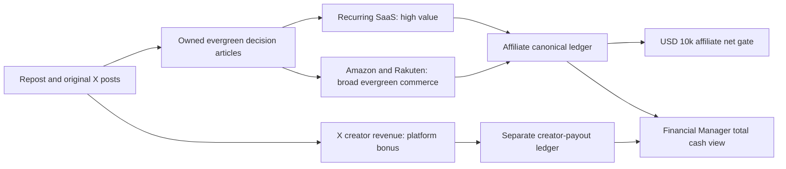

The USD 10,000 Affiliate gate remains the admission-dependent provider target
above until approved-net evidence justifies a replacement. Amazon and Rakuten are admitted
as durable commerce exploration, not invented dollars in that equation. X
creator revenue is a useful second income stream but never affiliate commission
and cannot close A3.

**Amazon Associates Japan lane.** The current official fee table ranges from
0% to 10%; creator-relevant PC, camera, home-electronics, and musical-instrument
categories are 2%, while books and stationery are 3%. The current review page
requires at least three qualifying sales within 180 days after application,
excludes the associate's own orders, checks every submitted public site/SNS, and
requires at least ten original public posts. Its SNS guidance says the organic
follower/like floor is usually 500. A failed review is not replayed in place;
any later submission must be a fresh, provider-compliant application with a new
tagged link, never an unattended retry. Eligible sales are only counted after
shipment. Payment is about 60 days after the month end; bank transfer requires
at least JPY 5,000 (gift-card payment has a separate JPY 500 minimum). The lane
therefore begins with evergreen creator-workstation, microphone/audio, and
learning-resource decision pages, not a generic deal feed. Its measured equation
is `approved net JPY = shipped eligible sales × actual category rate - returns -
known real costs`; no assumed basket or rate is used.

**Rakuten Affiliate lane.** Rates are category-dependent; the current public
guide's observed range is 2%–4%, with cart entry within 24 hours and purchase
completion within 89 days. The normal reward is capped at JPY 1,000 per item.
Provider reports distinguish `発生`, `確定`, `未確定`, and `破棄`: a sale is not
money while variable/unconfirmed, and cancellation can discard it. Current
guidance says the sale is confirmed at the end of the following month and paid
as Rakuten Cash on the 10th of the month after that; one yen is usable, while
full bank transfer requires screening and three consecutive months with at
least JPY 3,001 confirmed each month (amounts above JPY 3,001 also require the
specified Rakuten Card/Bank identity linkage). The same evergreen buyer-intent
pages may compare Amazon and Rakuten only when each provider's disclosure,
price-display, link, and attribution rules pass independently.

Both commerce lanes follow one honest ramp:

1. Resume the existing email-based account intent without creating duplicates;
   classify `AUTHENTICATED`, application, approval, payment, and report states.
2. Capture current official terms and permitted X/owned-site use; apply once
   through an idempotent semantic job.
3. Obtain one dedicated tracking identity per placement and verify destination
   and disclosure without exposing raw links in Git or Telegram.
4. Run ten one-variable evergreen placements per provider; ingest provider
   clicks, orders, shipped/confirmed commission, returns/reversals, and payout ID.
5. After at least five approved orders and a mature attribution/reversal window,
   compute observed EPC, approved net per order, required qualified visits, and
   content-refresh cost. Until then allocation remains exploratory and the
   provider contributes USD 0 to the target equation.
6. Promote only if mature approved net per 1,000 owned-page visits beats the
   current marginal portfolio alternative. Never exceed the 40% provider cap.

Mutable official sources:

- Amazon Japan fee schedule: <https://affiliate.amazon.co.jp/help/node/topic/GRXPHT8U84RAYDXZ>
- Amazon Japan application review: <https://affiliate.amazon.co.jp/help/node/topic/G8TW5AE9XL2VX9VM/>
- Amazon Japan payment timing: <https://affiliate.amazon.co.jp/help/node/topic/G63DR893K4DH55XZ>
- Rakuten rules and attribution: <https://affiliate.rakuten.co.jp/guideline/rule/>
- Rakuten confirmation/payment flow: <https://affiliate.rakuten.co.jp/guides/rank/>
- Semrush Affiliate Program: <https://www.semrush.com/lp/affiliate-program/en/>

**X creator-revenue lane.** The current official gate is active Premium (or an
eligible organization plan), at least five million organic impressions in the
last three months, at least 500 verified followers, supported country, compliant
account, Stripe/X Money connection, and identity verification. Payouts are
currently processed every two weeks with a USD 30 minimum, but X may change or
cancel the program and does not publish a deterministic impression-to-dollar
rate. Consequently, Repost optimizes qualified buyer conversations first;
creator revenue is recorded only from an official payout/settlement ID and real
fees in its separate ledger. Source:
<https://help.x.com/en/using-x/creator-revenue-sharing>.

Longevity means replacement capacity, not a promise that one program pays
forever. The unattended owner recaptures material terms, link health, offer
availability, account health, attribution window, reversal rate, and payout
state; refreshes evergreen pages when facts or products change; holds an 80/20
mature/exploration allocation; and substitutes a provider before concentration
or sunset removes the business. Owned pages and an opt-in owned audience are the
durable asset; X and each provider remain replaceable distribution and settlement
rails.

#### What the supplied X-team PDF contributes

The supplied 27-page `Claude Code X自動運用チーム 完全設計図` is adopted as a
content-team pattern, not as revenue evidence. Its Researcher, Writer, Engager,
Analyst, and Director/constitution separation maps cleanly to Affiliate market
research, evidence-bound composition, buyer-conversation acquisition, cohort
analysis, and policy/allocation control. Its useful operating principle is the
closed sequence `research → compose/engage → measure → improve` and reuse of
proven voice/examples.

The PDF's human final approval, impression/follower focus, promotional LINE
funnel, and unsupported student-result claims are not copied. It provides no
provider approval/link acquisition, effect idempotency, public readback,
transaction/settlement join, pending/approved/paid/reversed lifecycle, reversal,
currency, billed-cost, or canonical-net proof. This SSOT adds those missing money
and safety contracts and keeps the existing launchd owner as executor.

### 9.0.1 Current truth and milestone queue

This is the exact execution order from the current live state. Each production
step ends with a versioned Skill command, durable receipt, installed-release
replay, SSOT update, commit, and push. A check is minimal: one normal path plus
only money corruption, secret leak, duplicate external effect, or data-loss
regressions relevant to that step.

#### Revenue-first priority override

Until E1, work follows the shortest external-value path below. Runner
generalization, generic action schemas, clean-Mac packaging, multilingual lanes,
cloud work, and broad self-repair do not start unless one is the measured blocker
for the next external state. Known stages are deterministic; the model writes or
diagnoses only when an existing deterministic tool cannot advance them.

**Target architecture, not current runtime:** section 7.3 defines the intended
model-led Affiliate Agent, but it does not yet choose the installed runtime's next
tool by default. The seven completed A-CUT safety primitives are retained. Shadow,
canary, and strategy cutover are deferred until the loop closes one real approved
commission lineage; they are not substitutes for buyer acquisition. The installed
owners continue unchanged and no manual executor substitutes for them.

#### Canonical atomic remaining route — runtime Agent → E1 → OSS → USD 10K

“End” for this route means both conditions are true: a reproducible public OSS
release passes a clean-machine replay, and canonical rolling 30-day USD
approved-or-paid net after reversals and known real costs is at least `10000`.
Later USD 10M/100M outcome gates are not implementation scope until this route
produces observed unit economics. The steps below supersede older open-item
ordering; historical DONE evidence remains evidence, not a competing queue.

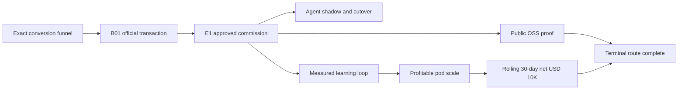

**Phase A — retain the completed Agent safety primitives**

1. **A-CUT-1A — authority inventory — DONE:** classify every existing Affiliate
   command as `READ_ONLY`, `WRITE_LOCAL`, `SECRET_LOCAL`, `MODEL_EXTERNAL`,
   `WRITE_EXTERNAL`, `MONEY_RECONCILE`, or `REPORT`. The canonical inventory is
   `skills/affiliate/config/command-authority.json`; its dispatcher/AST-derived
   coverage test is `skills/affiliate/tests/test_command_authority_inventory.py`.
   Readback proves 41/41 dispatched commands have exactly one classification and
   the matching entrypoint. This cut adds no publisher, provider, ledger, or other
   production effect implementation.
2. **A-CUT-1B — typed registry — DONE:** wrap the existing command entrypoints with
   input, output, effect class, precondition, and semantic postcondition schemas.
   `skills/affiliate/config/command-registry.json` maps all 41 inventory rows to
   their existing entrypoints; `config/schemas/command-registry-v1.json` owns the
   shared Draft 2020-12 contracts, including authority-specific preconditions and
   postconditions. Registry validation and exact inventory/entrypoint/effect-class
   equality pass without copying or invoking publisher, provider, or ledger logic.
3. **A-CUT-1C — guarded dispatch — DONE:** `scripts/guarded_dispatch.py` is the
   Agent-only boundary around registered commands. A `WRITE_EXTERNAL` callback
   runs only for `ai.anicca.affiliate-loop` after durable `EFFECT_STARTED` claim,
   PASS policy, non-blocked actual-cost cap, clear quarantine, and a registered
   read-only/money readback command are observed; the result must bind the claim
   ID and report `EXACT` readback or remain `POSTCONDITION_UNVERIFIED`. Tests prove
   a model caller with forged gate inputs invokes the callback zero times and each
   missing owner gate rejects before mutation. Existing launchd entrypoints and
   effect implementations remain unchanged.
4. **A-CUT-2A — redacted context — DONE:** `scripts/context_packet.py` builds the
   only state packet exposed to the Agent from allowlisted goal, unfinished-job,
   due-time, registered tool-schema, and canonical receipt fields. It strips all
   other state keys and redacts inline URLs/credential assignments. The malicious
   fixture readback contains zero bytes from credential, raw tracking URL,
   customer/private-provider ID, click/view, or unrelated state inputs while
   preserving goal ID, placement ID, `NO_TRANSACTIONS`, and allowed tool schemas.
5. **A-CUT-2B — durable checkpoint — DONE:** `scripts/agent_checkpoint.py`
   persists goal ID, job ID, stage, proposed action, tool attempt, observation,
   effect certainty, and next due-time as a hash-bound append-only transition plus
   atomic latest cache. Identical commits dedupe. A fresh-process restart maps
   `EFFECT_CONFIRMED` to `ADVANCE` and `UNKNOWN` to `READBACK_ONLY`, both with
   `replay_proposed_action=false`; only `NO_EFFECT` may retry when due. A corrupt
   history tail fails closed instead of rolling back to a transition that could
   replay a completed effect.
6. **A-CUT-2C — complete ActionProposal validation — DONE:**
   `config/schemas/action-proposal-v1.json` publishes the Draft 2020-12 contract
   and `scripts/action_proposal.py` enforces the same domain boundary before its
   dispatch callback. It rejects unknown commands, authority mismatch, enum/range/
   length violations, extra properties, and anything other than exactly one
   action or timezone-bound durable wait. Invalid fixtures invoke dispatch zero
   times; a valid action invokes once and a valid wait never invokes it.
7. **A-CUT-2D — due-time and model budget — DONE:** `scripts/agent_due.py` calls
   the existing budget-reserving Agent runner only for a timezone-bound due
   judgment and deduplicates the goal/job/due event under a durable lock. A normal
   future-due reconciliation records `NOT_DUE` with zero runner/model calls; a due
   event accepts only runner evidence of budget `allowed` plus exactly one attempt
   and records one `MODEL_CALLED` receipt. A budget-blocked summary requires zero
   attempts and records zero model calls. Successful due events are absorbing;
   budget-blocked events dedupe only within the same JST budget day and may reserve
   again after the next JST boundary.

**Immediate economic queue — this block executes before items 8–14 and 15–23:**

Current exact readback establishes the starting point: `ai.anicca.affiliate-loop`
is loaded with `42` runs and last exit code `0`; the canonical
placement ledger contains `24` public placements, `40` provider clicks, `38`
provider unique clicks, and `13` placements with a provider click. Official
customers, transactions, approved commissions, and paid commissions are all `0`.
Rolling money is `NO_TRANSACTIONS`, `NO_APPROVED_OR_PAID_ROWS`, and
`NOT_REACHED`; material cost coverage remains `UNKNOWN`. Runtime availability is
therefore not the current blocker. Owned-visit capability is explicitly
unavailable, while the post-instrumentation CTA/provider interval is observed at
zero. The measured blocker is qualified-buyer acquisition and click-to-customer
conversion, not a missing scheduler or fabricated denominator. No shadow Agent
code is installed or committed as a substitute for this queue.

- **FUNNEL-A — DONE — top-three canonical snapshot:** installed release
  `970bc7a094fcfba1534295567a1301e1270443ce` makes the existing Affiliate owner
  write one replay-safe, mode-0600 snapshot derived from the canonical placement
  ledger. Owner readback produced hash-valid snapshot `62de4b70…4f456`, bound to
  ledger `58b4e34a…47484`, with one history row after two owner wakes. The exact
  ranking is Subtitle Translator (`7` clicks / `6` unique), Voice Isolator (`6` /
  `6`), then Voice Changer (`6` / `5`). All three have an owned URL, X permalink,
  and dedicated provider-link key. Each has `0` observed transactions; owned
  visits and CTA clicks remain `UNKNOWN`, and exact-placement customers remain
  `UNAVAILABLE_AT_EXACT_PLACEMENT`. The receipt is explicitly non-money. Owner
  Telegram delivery read back `SENT`, message ID `28441`.
- **FUNNEL-B — DONE — owned-visit denominator:** installed release
  `2b79f78406df963d91e83d2adbcb03662ce1eed1` lets the existing owner inspect the
  exact `aniccaai.com` Netlify site without exposing its token. Netlify reports
  `analytics_instance_id=None`; its public Analytics API paths are absent. The
  owner joined hash-valid, mode-0600 receipt `5961221f…e4d6b` to the FUNNEL-A top
  three exactly once. Every count stays null with state `UNAVAILABLE` and reason
  `NETLIFY_WEB_ANALYTICS_DISABLED`; none is coerced to zero. This is non-money.
  `launchctl` reads `runs=33`, last exit `0`; owner Telegram is `SENT`, message ID
  `28447`.
- **FUNNEL-C — DONE — CTA-click denominator:** installed release
  `afda1a826790db4ac360150da830a38274af69a2` lets the existing owner install and
  verify the existing fail-closed `marketing-go` receipt-before-redirect pattern
  for Affiliate CTAs. Public commit `c8988326e2dabf72c89b6bb874552a23f778cac4`
  rewrites rendered affiliate hrefs to same-origin `/go/af_<placement_id>`, accepts
  only the current `elevenlabs-discovered-…-en-1` placement shape, and keeps the
  existing App redirects dependent on their App Store provider token. Netlify
  deploy succeeded; public readback has the same-origin CTA, no raw provider href,
  and invalid `af_bad` returns `404`. The owner did not synthesize a valid click.
  Hash-valid mode-0600 observation `1f94f18a…1f52c4`, starting
  `2026-08-22T07:20:00.091568+00:00`, joins observed CTA counts `0/0/0` to the
  FUNNEL-A top three. It stores no raw tracking URL, IP, user agent, referrer,
  cookie, or query and is explicitly non-money. `launchctl` reads `runs=38`, last
  exit `0`.
- **FUNNEL-D — DONE — provider funnel join:** installed release
  `404608f109fa6c1725f844816d9a49f76f473881` let only the existing owner capture
  fresh official link and commission reports after CTA interval start. Hash-valid,
  mode-0600 receipt `6a8a3daa…a1cc0` occurs once in history and binds baseline
  `62de4b70…4f456` to current snapshot `869b754b…5c7e12`. The interval is
  `2026-08-22T07:20:00.091568Z` through `07:49:41.963731Z`; official commission
  observation is `07:49:57.991646Z`. Subtitle Translator, Voice Changer, and Voice
  Isolator each read CTA clicks `0`, provider click/unique deltas `0/0`, exact-
  placement customers `UNAVAILABLE_AT_EXACT_PLACEMENT`, and official transactions
  `0`. This is observed non-money, not a conversion or earning. `launchctl` reads
  `runs=42`, last exit `0`; owner Telegram is `SENT`, message ID `28492`. Rolling
  money remains `NO_TRANSACTIONS / NO_APPROVED_OR_PAID_ROWS / NOT_REACHED`.
- **FUNNEL-E — DONE — focus one cohort:** installed release
  `b149b14748a7bf00f0b0232af0b598f75a68fd69` persists hash-valid, mode-0600,
  single-history receipt `1aa7970d…44631b`. It selects
  `elevenlabs-discovered-subtitle-translator-en-1` as a non-money focused
  exploration from the exact pre-payment buyer intent plus the strongest existing
  provider signal (`7` clicks / `6` unique), not as a revenue winner. Buyer problem,
  decision-stage title, plan/placement IDs, source interval/snapshot hashes,
  channel set, selection basis, and expansion pause are bound to the receipt.
  Existing in-flight work remains reconcilable; broad legacy/new placement fallback
  is held. Owner run `44` reads quarantine `CLEAR`, publication
  `FOCUSED_COHORT_HELD`, placement count `24`, link changed `false`, distribution
  changed `false`, and Telegram message `28498`. Money remains `NO_TRANSACTIONS`.

**Publication cadence decision for FUNNEL-E through FUNNEL-H:** the owner may check
for qualified buyer signals repeatedly, but publication acts only on an admitted
asset. Daily action cap remains disabled. The initial operating range is one to
three new owned articles per day only when each has a distinct evidence-bearing
buyer question and measurable hypothesis; there is no quota and a skipped day is
correct when no candidate passes admission. The owner must not create three
templated affiliate articles merely to increase surface area. Each admitted article
may produce up to three native distribution variants across subsequent days, then
weekly performance review decides continue, change one variable, or stop.

Evidence for this decision is pinned rather than paraphrased as folklore:

- Google Search Central, [people-first content](https://developers.google.com/search/docs/fundamentals/creating-helpful-content): many automated topics and content added merely to appear fresh are warning signs; original information, first-hand expertise, and visitor utility are the gate.
- Google Search Central, [scaled content and thin affiliation](https://developers.google.com/search/docs/essentials/spam-policies#scaled-content): scaled unoriginal pages and merchant-copy affiliate pages add no value; good affiliate pages add original reviews, testing, comparisons, or useful features.
- [`coreyhaines31/marketingskills@3df87f9`](https://github.com/coreyhaines31/marketingskills/tree/3df87f97621e18fbed7f6aa684edba54f49779a7/skills/marketing-loops): separate check cadence from act conditions, match cadence to signal speed, and treat over-frequent loops as busywork/noise.
- [`Affitor/affiliate-skills@ed17ef3`](https://github.com/Affitor/affiliate-skills/blob/ed17ef37bc167b52d9596cbe0292507f001c483d/skills/automation/content-repurposer/SKILL.md): repurpose one proven article into native formats, schedule distribution across days, and feed measured format performance back into the next choice. Its unverified revenue examples are not adopted.
- **FUNNEL-F — DONE — one-variable hypothesis:** installed release
  `982154e1283e41f537eeef1c515032668d7bcc47` exposes the hash-bound focused
  interval to the existing budgeted model Agent and rejects view/click/engagement
  success metrics. Owner run `46` produced sealed decision
  `1ecf26fe…167fe6` from baseline `36dffbc1…062e8`; result hash
  `b8e86414…71bcc` matches the evidence seal. The pinned internal Agent was
  `gpt-5.6-terra` at high effort with budget status `allowed`. It selected only
  `cta`: replace the control CTA with “Try ElevenLabs Subtitle Translator for your
  next multilingual video,” while retaining title, opening hook, article structure,
  provider link, placement, and distribution. The success metric is official exact-
  placement `transaction_count >= 1` in the next focused interval. The decision is
  non-money and creates no public/provider effect. Owner publication remained
  `FOCUSED_COHORT_HELD`; Telegram message is `28507`.
- **FUNNEL-G — DONE — focused owner distribution:** source owner created experiment
  plan `elevenlabs-discovered-subtitle-translator-en-experiment-1ecf26fe47e1` from
  the exact FUNNEL-F decision, and composition/policy owners produced the CTA-only
  artifact with policy PASS. The Affiliate owner created exactly one dedicated
  placement, exactly one owned file/commit, and exactly one X effect. Owned commit
  `8da9c2bdae59ea3a3ae8ebe38a852ae62127a20a` is live at
  `https://aniccaai.com/blog/elevenlabs-subtitle-translator-for-creators-experiment-1ecf26fe47e1`;
  rendered SHA-256 is `773324384bc5dec9ce16e77dbb90f97848cbd3cd5512afd564b1c055d950da69`.
  X exact readback is `https://x.com/selawmqt/status/2091080533396922494` with
  effect job `ee5882dd…f055` VERIFIED on attempt 2. Releases `77cf6db6d` and
  `5f8aef6c9` repaired owned same-origin redirect readback and X public-SSR
  reconciliation respectively; installed/source bytes match. Owner run 53 exited
  `0`, read dedicated link `VERIFIED / changed=false / deduplicated=true`, retained
  placement ledger count `25`, and sent Telegram `28544`. The first X attempt was
  not repeated: public readback reconciled the existing effect. This is a live
  exposure, not money; rolling state remains `NO_TRANSACTIONS / NOT_REACHED` with
  all official status counts zero.
- **FUNNEL-H — NEXT — mature readback:** first bind the now-known X exposure
  timestamp to an immutable maturity boundary (the FUNNEL-F receipt omitted this
  required field), then after that declared sample/age boundary capture
  the full funnel again; insufficient sample stays exploration and cannot name a
  winner.
- **FUNNEL-I — first-customer diagnosis:** if provider customers remain zero,
  identify the exact observed loss stage and admit the next single-variable repair;
  a customer is denominator evidence, not money. Then items 15–23 close the first
  official transaction and approved commission lineage.

8. **A-CUT-2E — DEFERRED UNTIL E1 — shadow Agent:** run the pinned Affiliate model with no external-
   write authority and record its proposal beside the installed deterministic
   choice; acceptance is repeated shadow completion without changing public,
   provider, money, or Telegram state.
9. **A-CUT-2F — DEFERRED UNTIL E1 — shadow admission:** inspect mismatches and admit only proposals
   that satisfy the tool contract and current goal; acceptance is a versioned
   admission receipt, not subjective prompt approval.
10. **A-CUT-3A — DEFERRED UNTIL E1 — read-only canary:** allow one Agent-selected observation tool;
    acceptance is one causal goal/job/model/tool/observation checkpoint.
11. **A-CUT-3B — DEFERRED UNTIL E1 — guarded effect canary:** allow one Agent-selected external action
    only through its existing launchd effect owner; acceptance is owner claim,
    exact public/provider readback, and one terminal consumption row.
12. **A-CUT-3C — DEFERRED UNTIL E1 — crash replay:** interrupt between effect start and receipt
    completion, then resume the same job; acceptance is exact reconciliation and
    zero second external effect.
13. **A-CUT-3D — DEFERRED UNTIL E1 — bounded repair:** induce one recoverable typed failure and allow
    one allowlisted repair with postcondition readback; acceptance is
    `SELF_HEALED` or quarantine, never an unbounded retry.
14. **A-CUT-3E — DEFERRED UNTIL E1 — strategy cutover:** replace only the fixed strategy selector with
    the admitted Agent loop; acceptance is that launchd remains the sole scheduler
    and existing tools, owners, journals, and ledgers remain authoritative.

**Phase B — close the first real money lineage**

15. **B01-A — focused lineage readiness:** verify that the selected existing
    placement has one exact placement ID, owned URL, public permalink, dedicated
    provider-link key, and terminal publication receipt. Do not create a new
    placement merely to satisfy this gate; terminal/unverified proposals are never
    resent.
16. **B01-B — due official capture:** the existing provider owner captures a
    fresh PartnerStack commission/payout report with artifact hash and provider
    denominator fields; an empty report remains valid non-money evidence.
17. **B01-C — transaction normalization:** normalize the first non-test provider
    transaction/settlement ID with status, currency, amount, observed/effective
    time, and reversal/payout identifiers; missing required fields fail closed.
18. **B01-D — exact placement join:** join that official ID to exactly one
    placement using provider evidence; ambiguous or unjoined rows receive no
    revenue credit.
19. **B01-E — replay proof:** import the same provider artifact again; acceptance
    is zero duplicate economic transitions and the same canonical ledger hash.
20. **E1-A — lifecycle proof:** preserve `pending`, `approved`, `paid`, and
    `reversed` as separate transitions; E1 closes only on the first non-test
    `approved` row joined to one exact placement.
21. **E1-B — real-cost join:** join actual billed model, tool, channel, and hosting
    costs when available; unknown material cost keeps net unknown rather than
    coercing it to zero.
22. **E1-C — denominator join:** retain provider clicks/unique clicks and admitted
    qualified exposure denominators for the same placement; absent denominators
    remain explicitly insufficient.
23. **E1-D — unit economics:** compute exact-placement approved-or-paid net after
    reversals and known costs; acceptance is an observed cohort result, not a
    forecast derived from views or clicks.

**Phase C — enable measured self-improvement and scale**

24. **A-CUT-4A — maturity gate:** define one comparable cohort boundary with the
    existing minimum sample/age contract; immature placements remain exploration
    data and cannot select a winner.
25. **A-CUT-4B — evaluator:** score active and candidate playbooks on approved-or-
    paid net per qualified denominator and per real content dollar; raw output,
    clicks, views, and model scores cannot promote a candidate.
26. **A-CUT-4C — one-variable canary:** change exactly one of offer, intent, hook,
    proof shape, CTA, format, channel, or time while holding the control lineage;
    acceptance is a versioned hypothesis and exact outcome join.
27. **A-CUT-4D — promotion and rollback:** promote only a mature superior candidate
    as a versioned skill/policy and retain one-command rollback; memory never
    grants authority or rewrites production code.
28. **SCALE-A — allocation:** allocate `80%` of admitted capacity to mature positive
    cohorts and `20%` to bounded canaries; negative/unknown cohorts do not receive
    winner status.
29. **SCALE-B — offer diversification:** admit the next executable provider/offer
    only with ownership, terms, allowed channel, dedicated link, and report
    receipt; acceptance is an independent settlement lineage.
30. **SCALE-C — channel diversification:** add a channel only when the canonical
    asset and an exact public/effect/readback adapter exist; account farms and
    duplicated bulk content remain forbidden.
31. **SCALE-D — profitable pod replication:** replicate only positive mature pods
    across buyer intents, offers, channels, and later locales; each pod retains
    isolated identity, browser authority, placement, costs, and settlement ledger.
32. **SCALE-E — payout and reversal reconciliation:** continue official captures
    through approval, payout, late reversal, and currency normalization; cash and
    accrued commission remain separate.

**Phase D — publish the proven system as OSS**

33. **OSS-A — public/private projection:** define the public source, example, and
    receipt projection while excluding credentials, sessions, tax/bank/customer
    data, raw links, and private provider identifiers.
34. **OSS-B — license provenance:** include license/SHA attribution for every
    copied Hermes/LangGraph/EvoAgentX/affiliate-automation slice; pattern-only
    sources contribute no copied code.
35. **OSS-C — stable adapter SDK:** publish the typed tool, provider, channel,
    checkpoint, effect-gateway, and ledger contracts with one non-secret example
    adapter per required boundary.
36. **OSS-D — independent verifier:** replay fixture and redacted real receipts,
    validate hashes, exact joins, statuses, currency, reversals, real costs, and
    rolling net, and reject screenshots or estimates as money.
37. **OSS-E — clean-machine install:** install on an isolated clean Mac with no
    production state and prove scheduler ownership, restart resume, fixture
    reconciliation, and secret isolation without creating a real public effect.
38. **OSS-F — public release:** pass repository-wide secret/raw-link scan, publish
    the source and reproducible documentation, tag an immutable version, and
    retain the qualified claim gate until redacted real E1 evidence is published.

**Phase E — close the terminal USD 10K gate**

39. **A3-A — continuous canonical close:** every provider capture updates exact
    placement transitions, reversals, payouts, currencies, denominators, and real
    costs without duplicate rows.
40. **A3-B — rolling threshold:** close only when one canonical rolling 30-day
    receipt proves approved-or-paid USD net after reversals and known real costs
    is at least `10000`; unknown material cost, pending commission, annualized
    run-rate, clicks, or estimates cannot close it.
41. **TERMINAL — dual readback:** independently replay the public OSS release and
    the redacted A3 receipt from their immutable hashes. The route is complete
    only when both pass; neither code publication nor revenue alone is sufficient.

#### Autonomous responsibility boundary

The product is the launchd-owned Affiliate Agent, not an operator-assisted
publishing service. Dais and Codex do not choose each topic, write each article,
create each affiliate link, publish each asset, inspect each dashboard, or decide
the next experiment. They design and repair the harness. The installed owners
must perform the recurring business work themselves:

“Codex is not in the loop” means the interactive Codex chat/development session
is not a recurring operator. It does **not** mean the production loop has no
model. The runtime Agent is launched by the installed owner and invokes a pinned,
isolated Codex CLI model only when judgment is due. Current configuration binds
`marketing-agent` to `gpt-5.6-terra` at high effort and the explicit one-use
repair lane to `gpt-5.6-sol` at high effort; Luna is not currently configured for
Affiliate runtime. Model, effort, route, usage, budget, and evidence seal are
receipted on every admitted call, so a later model change is configuration with
readback rather than an implicit architecture change.

| Actor | Inside recurring production loop? | Authority |
|---|---:|---|
| Interactive Codex chat session | No | Design/repair the harness, install an immutable release, safely trigger the existing owner, and verify readback |
| Runtime Affiliate Agent using pinned Codex model | Yes, only when judgment is due | Choose one validated allowlisted tool or durable wait from redacted context |
| Existing launchd effect owner | Yes | Claim and execute admitted browser/provider/public/Telegram effects and perform exact readback |
| Deterministic guarded kernel | Yes | Enforce policy, authority, idempotency, secrets, costs, evidence, accounting, and replay |
| Dais | No daily operation | Set objective, spend/policy limits, and terminal success contract |

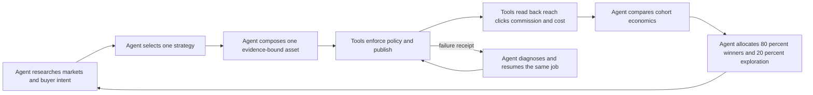

Judgment belongs to the Agent through natural-language prompts and receipted
decisions: market, offer, buyer intent, asset angle, channel, experiment, and
next allocation. Deterministic code is limited to browser/API tools, policy hard
gates, arithmetic, idempotency, public readback, accounting, scheduler ownership,
and secret boundaries. Codex may trigger and observe the real launchd owner; it
must not substitute a manual article, manual post, or one-off browser action for
missing Agent capability. When a real run fails, the default fix is the smallest
harness/tool/observation repair that lets the same job finish itself. Source-code
self-modification is not currently proven; current self-healing means durable
resume, exact external reconciliation, typed recovery, and continued healthy-lane
operation.

#### Measured planning checkpoint and next TODOs

This checkpoint supersedes older counts and zero-click statements in the
historical evidence below. Read-only inspection of the installed state shows:

- the documentation branch is clean and pushed to both documentation remotes;
  latest source/runtime commit `cc775c3744094edf99087023ae36f3deb0936640` is
  the current immutable `skills/affiliate` release. The canonical installer
  atomically switched `current` and wrote its ownership receipt, then stopped at
  the existing browser owner's `launchctl bootstrap` with macOS
  `141: Reentrancy avoided`. The existing owner nevertheless woke naturally at
  `2026-08-20T13:19:58Z`; that wake read back Impact `REJECTED` with transition
  `14d9b1aa…5cb6`, `ALREADY_LIVE`, 13 placements, rolling-net
  `NO_TRANSACTIONS / NO_APPROVED_OR_PAID_ROWS / NOT_REACHED`, and Telegram
  message `26218`. Outbox and sent ledgers are both 103 rows with no pending
  event. The official PartnerStack artifact remains the prior cooldown-safe
  empty capture at `12:58:35.798870Z`, with zero commission and payout rows.
- six expected launchd plists remain installed; three browser owners answer CDP
  `9324/9326/9327` with HTTP `200`, and three job owners retain 600-second intervals;
- the canonical ledger contains 13 dedicated-link placements, all 13 with owned
  public URLs, and 32 provider-link clicks; the latest provider poll appended
  `+1` to music and `+1` to voice-cloning. The aggregate provider metric is 41
  clicks with `+40` explicitly unattributed, so neither value is money;
- PartnerStack remains authenticated and reports zero commission rows, so
  approved-or-paid net remains USD 0; actual cash cost remains unknown where no
  bill exists;
- Telegram outbox and sent ledger both contain 103 events with no pending row.
  The latest Impact rejection receipt was reported by the existing owner as
  Telegram provider message `26218`; no raw model output, secret, or tracking
  link was included;
- the prior publication failure was `FileNotFoundError` for the missing allowed
  `.worktrees/affiliate-foundation-prod`, not a current `XPostError`. The
  existing `feature/affiliate-foundation-prod` branch was reconnected at that
  exact path from the parent Git repository; its HEAD is `d4170db1e`, its
  worktree is clean, and the required landing data path exists. Initially both
  `launchctl kickstart` and the one-time `launchctl start` fallback returned
  macOS `141: Reentrancy avoided`, and `last-run.json` contained the pre-repair
  `FileNotFoundError`. At `2026-08-20T09:01:49Z`, the owner read the repaired
  root and verified the existing `elevenlabs-music-for-creators` trajectory:
  owned Git commit `2254ceb73`, X object
  `2090363588603236767`, and Substack object `211974858` are all recorded as
  delivered/live. Independent DNS-resolved public readback returned HTTP 200 for
  the owned page, X object, and Substack object. No public effect was manually
  performed. Historical ambiguous X effects remain safely fenced and MUST NOT
  be republished.
- launchd introspection and `start`/`kickstart`/`bootstrap` each returned macOS
  `141: Reentrancy avoided`, but the configured `bootstrap` invocation still
  started the existing owner process. It completed at `2026-08-20T10:31:14Z`
  as `ALREADY_LIVE`, changed no publication/link/ledger receipt, and flushed
  the owner-generated tiktok `PLACEMENT_LIVE` event exactly once as Telegram
  message `26004`. This is owner evidence, not permission to create a parallel
  executor.
- the next eligible owner wake completed at `2026-08-20T10:43:22Z`. Its fresh
  official PartnerStack artifact was captured at `10:43:19Z` with
  `commission_row_count=0`, `payout_row_state=EMPTY`,
  `normalizer_state=NO_LIVE_ROWS`, and rendered artifact SHA-256
  `a0cf2e5d2924069a1e4d0fd534506fa9b3b9f680debb6b763ca180d7c59495ca`.
  Reconciliation recorded `money_state=NO_TRANSACTIONS`, source rows `0`,
  appended transitions `0`, and replayed transitions `0`. Approved-or-paid net
  remains USD 0 and actual billed cost remains UNKNOWN. The same wake appended
  one durable `CLICK_DELTA` event for the two new provider-link deltas, then
  returned `SEND_TIMEOUT_UNKNOWN`; no click or timeout is money.
- read-only normalizer audit and the existing `test_revenue_cli.py` suite (8/8)
  confirm the installed contract maps provider `pending|hold`,
  `approved|scheduled`, `paid`, and `declined` to the canonical statuses,
  preserves USD minor units and reversal minor units, and derives a stable
  transition identity. This is implementation readiness only: because the live
  report still has zero rows, B02--B08 remain externally open and no fixture or
  test value is counted as money.
- release `260e57098` adds the fail-closed `AFFILIATE_ROLLING_NET` receipt to the
  existing owner wake. It deduplicates by `(provider, provider_transaction_id)`,
  records exact in-window transaction-to-placement joins, preserves
  pending/approved/paid/reversed counts and reversal minor units, binds the
  source ledger SHA-256, rejects unmatched economic rows, and refuses a USD net
  result when FX, real-billed-cost rows, or complete cost-window coverage are
  unknown. A direct installed readback currently reports
  `money_state=NO_TRANSACTIONS`, zero rows in every status,
  `net_state=NO_APPROVED_OR_PAID_ROWS`, `threshold_state=NOT_REACHED`,
  `cost_state=UNKNOWN`, and `cost_coverage_state=UNKNOWN`; no amount is counted.
- post-install trigger attempts returned macOS `141: Reentrancy avoided`, but
  the existing owner subsequently produced one real wake at
  `2026-08-20T11:17:12Z` from release `260e57098`. `last-run.json` records
  `rolling_net_state=ROLLING_NET_READY`, `money_state=NO_TRANSACTIONS`,
  `net_state=NO_APPROVED_OR_PAID_ROWS`, `threshold_state=NOT_REACHED`,
  `approved_or_paid_net_usd=null`, and both cost states `UNKNOWN`. The owner
  sent the new natural-language `AFFILIATE_ROLLING_NET` receipt once as
  Telegram message `26044` under event UUID
  `72557ed6beb878b70a844c3e1fda8862e284af9a20b2287752e56b1e0b3fb8e6`; outbox
  and sent ledgers are both 100 rows with no pending event. This is owner-E2E
  wiring proof only; zero transactions and zero dollars remain.
- release `f15ca3ceb` aligns `placement-ledger.json` with that receipt: latest
  commission transitions are deduplicated by provider plus transaction ID and
  only `MATCHED` placement joins enter per-placement status/net totals. An
  isolated two-provider/same-ID fixture counted one matched row, excluded one
  unmatched row, and existing focused checks remained 8/8. The release is
  installed, but its post-install `start` returned `141`; the next owner wake
  must provide the installed-readback receipt before this repair is marked live.
- release `0f29dc81f` additionally binds the rolling receipt to the exact
  `placement-ledger.json` SHA-256, so provider denominators and placement joins
  are part of the same replayable evidence chain. It is installed, but the
  post-install owner start again returned `141` and has not yet produced a
  newer `last-run`; no amount or click is inferred from this code-only change.
- release `cd7372f45` removes the volatile placement-ledger SHA from the
  Telegram dedupe identity while retaining it in the local rolling receipt and
  `last-run`. The preceding wake created a second same-content rolling event
  (`0a79a537…`) because of that volatility and its send ended
  `SEND_TIMEOUT_UNKNOWN`; no provider message ID is claimed. The repair was
  isolated-replayed successfully and leaves the pending row for the existing
  owner to retry under its original UUID; no Telegram duplicate is treated as
  money or as proof until a provider message ID is read back.
- the existing owner then ran release `cd7372f45` at
  `2026-08-20T11:40:09Z`. It wrote placement-ledger SHA
  `98573449c5812b6117c89d86acafe7cdb83d8c01a4f92d2bd57861bc40b2b1d8` into the
  rolling receipt, kept `NO_TRANSACTIONS / NO_APPROVED_OR_PAID_ROWS`, and
  retried the pending `0a79a537…` under the same UUID exactly once as Telegram
  message `26077`. Outbox and sent ledgers are now 101/101 with zero pending;
  no new rolling event was created. This closes the observed duplicate-identity
  self-heal, not B01 or any money gate.
- after the next owner wake became revenue-eligible, the same installed owner
  captured the official PartnerStack report at
  `2026-08-20T11:51:46.626744Z`: `commission_row_count=0`,
  `commission_row_state=EMPTY`, `payout_row_state=EMPTY`,
  `normalizer_state=NO_LIVE_ROWS`, artifact SHA
  `6567be531f2e6fae780ce6693c8002ee099d4e11231558695ed120dd2261251f`.
  Reconciliation at `11:51:47.894387Z` remained
  `NO_TRANSACTIONS / source_rows=0 / appended=0 / replayed=0`. The owner then
  wrote rolling receipt SHA `9d9aa493…d1ff91` with
  `NO_TRANSACTIONS / NO_APPROVED_OR_PAID_ROWS / NOT_REACHED`, null USD net,
  unknown cost and coverage, and placement-ledger SHA
  `631ff2733181ff178069e068dbff37209682cabf4ff4b5567d1a1d9c0f6a671c`.
  The canonical ledger remains 13 placements, 32 provider-link clicks, and
  zero transactions/status rows. No new Telegram event was needed; outbox and
  sent remain 101/101. This is the current B01 empty-state proof, not E1 or
  revenue.
- the existing owner retry at `2026-08-20T10:54:48Z` recovered that exact pending
  event without any publication, link, provider, or ledger mutation. The owner
  recorded message ID `26019` once for event UUID
  `4d674b7e14538be7e70cb00c236a8e1bc5153e68a29bf5b4cde0e4452a6a9bf8`, leaving
  Telegram outbox and sent ledger both at 98 rows with zero pending rows. Revenue
  remained in cooldown against the 10:43 empty capture; approved-or-paid net
  remains USD 0. Independent DNS-resolved readback after this retry still
  returned HTTP 200 for owned and X pages with the expected markers; tiktok
  receipt hashes and landing HEAD `2250d31a6` were unchanged and the ledger
  remained at 13 placements. This closes the observed Telegram timeout
  self-heal, not B01.
- a one-time read-only diagnostic capture was run through the installed
  `affiliate revenue capture` skill after the owner could not be kicked. The
  official PartnerStack report at `2026-08-20T08:49:11Z` had
  `commission_row_count=0`, `commission_row_state=EMPTY`,
  `payout_row_state=EMPTY`, `tax_information_state=REQUIRED`,
  `payment_provider_state=SELECTION_REQUIRED`, and `currency_display=USD`;
  artifact SHA-256 is
  `114723950748c3df0daf759a9aa5268d2d23f3e9086803bf44e0e71921bf8e5e`.
  This is an empty provider report, not a transaction, settlement, payout, or
  money proof; B01 remains open.
- after that owner wake, the canonical ledger still has 13 placements and zero
  approved/paid/pending/reversed commission rows. The music placement now has
  its owned public URL and zero provider clicks; the tiktok-transcript placement
  remains `public_url=null` with zero provider clicks. Actual cash cost remains
  `UNKNOWN`.
- the latest installed read-only PartnerStack capture at
  `2026-08-20T09:05:47Z` is still empty: `commission_row_count=0`,
  `payout_row_state=EMPTY`, `generic_transaction_id_available=false`, and
  `normalizer_state=NO_LIVE_ROWS`; rendered artifact SHA-256 is
  `97ad5b45c0fb1b8e8e51889520817814f1a70aee4b610a05eb12bb57ba134d9e`.
  This remains B01 evidence only and cannot count as money.
- the latest installed read-only PartnerStack link-performance capture at
  `2026-08-20T09:08:27Z` reports provider row count `11`; music and
  tiktok-transcript both have `current_click_count=0` and
  `delta_click_count=0`. Rendered artifact SHA-256 is
  `9afdda85363faae596a94f9c33114f4280e33c341e74cee4920715520e2a6c51`.
  These are provider denominators only, not commission or money.
- the installed read-only commission reconciliation at
  `2026-08-20T09:10:48Z` reports `money_state=NO_TRANSACTIONS`,
  `source_rows=0`, `appended_transitions=0`, and `replayed_transitions=0`;
  source artifact SHA-256 is
  `97ad5b45c0fb1b8e8e51889520817814f1a70aee4b610a05eb12bb57ba134d9e` and
  the placement-ledger SHA-256 is
  `f3fe1efffafa5f1962990fe36d7854c3c8a196fa23f05fb7c308e9918690de92`.
  This proves no transaction was appended or replayed; it does not close A05's
  required owner replay.
- after the completed music wake, one additional retry of the existing owner at
  `2026-08-20T09:11:43Z` again returned `141: Reentrancy avoided`; no Affiliate
  loop process was present afterward and the tiktok durable job-events remained
  unchanged. This is the current `BLOCKED_EXTERNAL_141` readback, not a reason
  to create a parallel executor.
- the next owner wake at `2026-08-20T09:12:53Z` reached the source-bound content
  gate and failed closed with `ContentError: required source is stale or does
  not support its claim`. The official TTS API pricing capture is within its
  expiry and contains current separate v3, v2 Multilingual, and Flash/Turbo
  price rows; the installed validator still required a removed combined legacy
  sentence. The worktree repair changes only those validator markers; no
  article body, provider credential, external link, or public effect is changed.
- the validator repair is installed as immutable release
  `3cdd8d875115b733c6fd9b99e3e296c10e7a5207`; installed `require_sources` now
  passes all five TTS API sources. The first owner kick after installation at
  `2026-08-20T09:17:16Z` again returned `141: Reentrancy avoided`, no loop
  process started, and `last-run.json` still shows the pre-repair ContentError.
  At that point the code fix was installed/readable but not yet owner-E2E
  verified; the subsequent natural owner result is recorded below.
- the existing owner then ran naturally at `2026-08-20T09:23:59Z` on the
  repaired release and passed the pricing-source gate, but failed closed at
  the next policy gate with `ContentError: affiliate article policy failed`.
  The policy receipt observed at `2026-08-20T09:23:55Z` had every check true
  except `fresh_sources_match_artifact`: the reusable TTS artifact still held
  the superseded pricing hash `5333196f…f74a21`, while the current official
  capture is `de2957b4…c4ceec`. No owned/X write occurred and the ledger stayed
  at 13 placements. The smallest repair is to make the deterministic builder
  refresh an existing artifact whenever the current source-hash map differs;
  a temporary isolated replay proved the rebuilt artifact and all five policy
  checks pass without exposing or changing the real link.
- the source-hash refresh is committed as `b4fa82c6e` and installed as
  immutable release `b4fa82c6e0321f85820f56a3e78b357856632a1e`; installed
  `content.py` compiles and the isolated stale-artifact replay reports
  `fresh_sources_match_artifact=true` with policy `PASS`. A post-install kick
  at `2026-08-20T09:29:47Z` still returned `141: Reentrancy avoided`, so
  `last-run.json` remains the pre-install policy failure. A04 is not closed
  until the existing owner naturally or successfully triggered runs this
  release and supplies the owned/X readback.
- the existing owner then ran the installed release naturally: policy observed
  at `2026-08-20T09:34:48Z` was `PASS` with all five checks true, and the wake
  completed at `2026-08-20T09:35:32Z` as `ALREADY_LIVE` with the unchanged X
  status `2088809159932465497`. The owned receipt is `LIVE` at the expected
  article URL; independent DNS-resolved HTTP readback returned `200` for both
  owned and X pages, with the owned title/disclosure and X status ID present.
  Telegram delivered the natural owner receipt as message `25964`; revenue
  remained `NO_TRANSACTIONS` with zero source rows and zero appended
  transitions; the canonical ledger stayed at 13 placements. This closes the
  source-refresh repair's owner-E2E and duplicate-free replay, but not A04:
  `elevenlabs-discovered-tiktok-transcript-generator-en-1` still has
  `public_url=null`. Its historical `budget_blocked` run is superseded: the
  same plan now has a `READY_FOR_POLICY` composition receipt and `PASS` campaign
  policy for source set `ee8d…`. Publication is currently blocked by a stale
  `MATERIALIZED` handoff fingerprint (`c116…` versus current `546…`), with no
  owned or X receipt. The smallest repair is to rebind only that unpublished,
  effect-free materialization; any existing owned/X receipt must remain a hard
  `PUBLICATION_CONFLICT`.
- an isolated publication replay verified this boundary: an effect-free stale
  materialization rebounded to the current handoff and reached mocked `X_LIVE`,
  its unchanged replay returned `ALREADY_LIVE` with one link/owned/X call, and
  a stale materialization with an existing owned receipt remained
  `PUBLICATION_CONFLICT` with zero effect calls. The repair is in the worktree
  and is installed as immutable release `7147038b3`; the next owner result is
  recorded below.
- the next installed owner wake began at `2026-08-20T09:45:37Z` but exited
  before writing a wake receipt: Playwright raised a `TimeoutError` waiting for
  the PartnerStack `Custom links` control in `elevenlabs_link_action`. The
  existing TTS and tiktok link receipts were already `VERIFIED`, no owned/X
  receipt or public effect was created, and the tiktok materialization stayed
  unchanged. The smallest repair is to reuse only the exact verified TTS local
  receipt on this typed Playwright timeout, mark provider readback pending, and
  continue the wake; unknown browser errors still fail closed. It is in the
  worktree, with compile and 19 focused tests green. It is installed in
  `7147038b3`; a subsequent owner wake did not crash, but the exact timeout
  reuse branch has not been independently induced.
- the existing owner wake at `2026-08-20T09:57:02Z` executed the installed
  materialization repair. The tiktok progress now carries current handoff
  fingerprint `546…` and `rebound_from_handoff_fingerprint=c116…`; the
  existing PartnerStack link key `618843f9…` was deduplicated, and owned Git
  commit `2250d31a6` was delivered through the configured
  `affiliate-foundation-prod` checkout to `origin/main`. The first immediate
  Netlify/public readback was HTTP `404`, so the owner recorded
  `OWNED_NOT_LIVE`, sent Telegram message `25979`, and did not create an X
  effect. A later independent DNS-resolved readback at `2026-08-20T10:01:12Z`
  returned HTTP `200` for the exact owned slug and found the expected title,
  affiliate disclosure, and dedicated-link anchor in the response body. The
  durable receipts have not yet been advanced by the owner: progress remains
  `OWNED_NOT_LIVE`, the owned receipt remains `DELIVERED` without a public URL,
  and no X receipt exists. The existing launchd owner must perform that
  readback, then reach X `LIVE`, with unchanged replay; A04 remains open.
- after the DNS readback repair was installed as immutable release
  `de63ee69057681606c8d508dcc7dd99947949208`, the existing owner wake at
  `2026-08-20T10:08:45Z` advanced the same tiktok job to `X_LIVE`. The owned
  receipt is `LIVE` at the exact slug, with rendered hash
  `9f430685…a3bf`; the X receipt is `LIVE` at status
  `2090380444655370568`. Independent DNS-resolved HTTP readback returned `200`
  for both owned and X pages; the owned body contains the title, affiliate
  disclosure, and dedicated-link anchor, while X contains the canonical status
  ID. The campaign progress carries one existing provider link key
  `618843f9…` and one X receipt; no second external effect was created.
  Provider clicks for this placement remain `0`, the canonical ledger remains
  13 placements, and official commission rows remain `0`, so approved-or-paid
  net remains USD `0` and actual billed cost remains `UNKNOWN`.
- the same wake could not flush its first pending Telegram event: OpenClaw
  `message send` timed out after 30 seconds before returning a provider
  message ID. The installed repair is commit `088858bce2965f05783448b4b5f829fa053717ee`
  (`SEND_TIMEOUT_UNKNOWN`), which preserves the event in the outbox and the
  unresolved effect fence without claiming `SENT`; it is installed as the
  current immutable release, but its owner retry has not yet produced a new
  Telegram message ID. The pending event is the older unattributed-click
  report, not a commission receipt. At this point A04/A05 and the next
  placement receipt were still open.
- the existing owner replay at `2026-08-20T10:20:05Z` returned
  `ALREADY_LIVE`. Tiktok campaign, owned, X, and provider-link receipt hashes
  stayed byte-identical to the pre-replay baseline; owned Git HEAD remained
  `2250d31a6`, the provider link key remained `618843f9…`, the ledger remained
  at 13 placements, and independent owned/X readback remained HTTP `200`. The
  older unattributed-click Telegram event was sent as message `25997`, leaving
  96 outbox/sent rows and no pending event at that moment. The next
  owner-generated `PLACEMENT_LIVE` receipt is tracked under B08; no Telegram
  receipt is treated as money.
- the current launchd capability check at `2026-08-20T09:20:57Z` also fails
  outside the service label: `launchctl managername`, `launchctl print user/501`,
  and `launchctl print gui/501` all return `141: Reentrancy avoided`, while
  `id -un` returns the literal `501` rather than a username. The GUI/user
  launchd domain is therefore not readable from this session; no bootstrap,
  reload, OS-service restart, or parallel executor is an honest substitute.

- The first acquisition decision for the fourth DEV.to baseline exposed a stale
  private capability receipt: it pinned removed Codex `0.147.0`, while the
  canonical `/Users/anicca/.local/bin/codex` resolved to the current
  `0.148.0` release. The verifier also rejected `0.148.0` because its
  `--version` call emitted a benign no-HOME warning. Commit `649f474cf`
  changes only `machine_capability_inventory.py`: it runs the fixed binary's
  version probe in a temporary mode-0700 HOME and still fails closed on
  non-zero exit, stderr, version mismatch, or file mutation. Existing focused
  checks passed `6/6` for the capability gate and `8/8` for revenue; the private
  receipt now records canonical path
  `/Users/anicca/.codex/packages/standalone/releases/0.148.0-aarch64-apple-darwin/bin/codex`,
  version `0.148.0`, and SHA `b0308517…1e50`.
- The existing owner then ran the atomically switched release at
  `2026-08-20T12:46:56Z`. Baseline SHA
  `c4012766…0072` produced a durable acquisition decision `READY`, decision ID
  `99721872…89ad`, selected variable `title`, runner exit `0`, and a sealed
  private evidence tree with a verified Codex binary pin. `last-run.json`
  changed from `RUNNER_REJECTED` to `READY`; owner Telegram message `26171`
  was read back and Telegram outbox/sent are both `102/102` with no pending
  row. This closes the capability/acquisition harness repair, not a money gate.
- The same owner readback still reports official PartnerStack
  `commission_row_count=0`, `NO_LIVE_ROWS`, and no payout rows. The canonical
  rolling receipt remains `NO_TRANSACTIONS / NO_APPROVED_OR_PAID_ROWS`,
  `approved_or_paid_net_usd=null`, `cost_state=UNKNOWN`, and
  `threshold_state=NOT_REACHED`; the first official transaction and exact
  placement join remain B01. No click, estimate, model token, pending reward,
  or Telegram receipt is money.
- After the revenue cooldown elapsed at `2026-08-20T12:52Z`, one existing-owner
  kickstart and read-only `launchctl` variants with/without XPC metadata all
  returned `141: Reentrancy avoided`; `last-run.ts` and the PartnerStack report
  stayed at the acquisition wake and the empty `11:51:46Z` artifact. No fourth
  launcher, manual provider capture, OS-service restart, or public effect was
  created. This is an external launchd observation gate, not money evidence.
- Commit `b348a933f` adds durable typed acquisition failure receipts for pin
  rejection, budget block (runner exit `75`), invalid configuration (exit `2`),
  timeout, and start failure, plus a stable owner Telegram event that reports
  the failure without claiming a public or money effect. Isolated fixtures
  proved each classification and same-failure dedupe. The release is current
  and its installed scripts contain the repair; the existing baseline already
  has a `READY` receipt, so no failure receipt was fabricated and no new owner
  wake was observed while launchd remained at `141`.
- The existing owner then woke naturally at `2026-08-20T12:58:36Z` after the
  installer response. It refreshed the official PartnerStack artifact at
  `12:58:35.798870Z` (`commission_row_count=0`, `NO_LIVE_ROWS`, no payout rows,
  artifact SHA `8418d228…af0c4`), wrote the rolling receipt as
  `NO_TRANSACTIONS / NO_APPROVED_OR_PAID_ROWS / NOT_REACHED`, and left Telegram
  `102/102` with no pending row. The canonical ledger is 13 placements, 32
  provider-link clicks, and zero transaction rows. Codex sent this milestone as
  Telegram message `26199`; it contains no secret or raw tracking link. B01
  remains the next external gate.
- Follow-up commit `792f483eb` changes only owner event precedence: a durable
  `ACQUISITION_DECISION_FAILED` receipt now suppresses the unrelated generic
  `BLOCKED` event for the same wake, while preserving the stable failure UUID
  and no-public-effect wording. Isolated pin, budget, invalid-config, timeout,
  start-failure, and failure-priority/dedupe fixtures plus the focused inventory,
  revenue, and acquisition checks passed `15/15`. The installer switched
  `current` to the 792f483e release and again stopped at browser bootstrap
  `141`; the existing owner subsequently woke naturally at `13:09:27Z` and
  verified `ALREADY_LIVE` with 13 placements and zero official transactions.
  No artificial owner run, provider capture, public effect, or money claim was
  substituted. Codex sent the readback milestone as Telegram message `26211`.
  B01 remains the next gate.
- Commit `cc775c374` adds the smallest provider-observation repair: Impact’s
  authenticated page title `Impact - Welcome` is admitted, and the rendered
  `HubSpot, Inc. application` + `Declined` state classifies as
  `REJECTED / DO_NOT_RESUBMIT`; the daily summary maps it to `申請却下`. Live
  CDP readback at `2026-08-20T13:20:15Z` and a temporary poll produced the
  expected state and deterministic transition ID without writing production
  state. The immutable install switched `current` to cc775c374 but stopped at
  bootstrap `141`; the existing owner must still persist the rejection and send
  any deduplicated program transition. No HubSpot link, public effect, or money
  was created.
- The existing owner then read back the repair at `2026-08-20T13:19:58Z`:
  production `providers/hubspot-impact.json` is `REJECTED / DO_NOT_RESUBMIT`,
  `changed=true`, transition `14d9b1aa…5cb6`, and marker hash
  `c335ed63…9274`. Owner Telegram message `26218` reports the negative program
  transition; no HubSpot link or public effect was created. E01 is now closed,
  but B01 remains the first official commission transaction gate.

- Source repair `eb771cf61006276bac06ab0d044b9edf1043bb41` changes only the
  composition owner: an old `RUNNER_REJECTED` receipt with no evidence tree is
  eligible for one same-job retry after the capability receipt changes; a
  budget-blocked or evidence-bearing failure remains terminal. Python compile,
  the existing composition focused checks `4/4`, and a private state readback
  (`runner_retry_due=true` for the stale Instagram receipt) passed. The
  immutable installer switched `current` to this release. The main money owner
  naturally woke at `2026-08-20T13:40:53Z` and remained `ALREADY_LIVE` with
  rolling zero. The existing composition owner then naturally retried the same
  job at `2026-08-20T13:43:25Z`, sealed the evidence with Codex `0.148.0`, exit
  `0`, and wrote `READY_FOR_POLICY`. No public effect, provider link,
  transaction, or money claim was created; publication remains the next owner
  gate.
- The next natural money-owner wake at `2026-08-20T13:51:10Z` was a duplicate-
  safe readback: `READY_FOR_PUBLICATION`, `ALREADY_LIVE` on the existing X status,
  a verified/deduplicated ElevenLabs placement link, and `REVENUE_COOLDOWN`.
  Private ledger readback now shows 13 placements, 13 owned public URLs, 32
  provider-link clicks, zero transaction rows, and zero approved/paid/pending/
  reversed statuses. Rolling net remains `NO_TRANSACTIONS /
  NO_APPROVED_OR_PAID_ROWS / NOT_REACHED`, approved-or-paid net is null, and
  actual cost/coverage remain `UNKNOWN`; Telegram has no pending event. This
  closes no money gate and creates no new external effect.
- A B01 parser/reconciliation check at `2026-08-20T13:57:45Z` passed the
  existing revenue checks (`test_revenue_cli` 8/8, `test_local_loop` 16/16, and
  Python compilation). The latest official PartnerStack report artifact remains
  `commission_row_count=0 / NO_LIVE_ROWS / payout_row_state=EMPTY` with USD
  display, and reconciliation appended zero transitions. This is an external
  conversion/report absence, not a parser success disguised as money: the next
  non-empty row must still expose the provider reward key, lifecycle status,
  amount/currency, attribution key, and exact placement join before it can
  enter the ledger.
- The immutable `e842fb875` release switched `current` successfully; installer
  launchd bootstrap still returned the session-wide `141: Reentrancy avoided`,
  but the existing owner naturally executed it at `2026-08-20T14:02:15Z`.
  That real wake ran capture/reconcile and preserved `NO_TRANSACTIONS` with
  zero appended transitions. The same durable Instagram transcript job then
  acquired one verified, placement-specific provider link and stopped before
  public effect (`WAITING_FOR_PLACEMENT_LINK` in the wake receipt): the ledger
  is now 14 placements, 13 owned public URLs, 32 provider clicks, and one
  private-link-only row. Commission statuses remain all zero, rolling net is
  `NO_TRANSACTIONS / NO_APPROVED_OR_PAID_ROWS / NOT_REACHED`, actual cost and
  coverage remain unknown, and Telegram has no pending event.
- X readback repair `97d143d7908b05ee4261e83c85d41818c3478c04` was installed as
  the immutable current release. The source byte-equals the worktree, all three
  CDP version endpoints remain `Chrome/145.0.7632.109`, and the installer still
  reports only the known launchd bootstrap `141: Reentrancy avoided`. A direct
  real-browser read-only replay then verified all five historical X liveness
  rows as exact `LIVE` readbacks; no compose or publish action was invoked. The
  existing owner naturally ran at `2026-08-20T14:12:51Z`, preserved the 14-row
  ledger and zero-money receipt, and delivered the Instagram owned commit. Its
  owner receipt is `DELIVERED` with no owner-readback promotion yet, while an
  independent curl-resolved readback already proves the public article is live;
  the next owner wake must promote that same receipt before X publication.
  The stale same-day liveness receipt remains visible under cooldown and is not
  rewritten by Codex. B01 remains open: the official PartnerStack report still
  has zero transaction rows and no placement-joinable reward key.
- The next existing-owner wake completed that exact handoff at
  `2026-08-20T14:23:46Z`: the Instagram owned receipt is `LIVE`, its X receipt
  is `LIVE`, and Telegram message `26282` is sent. The canonical ledger now has
  14 placements, 14 owned public URLs, 32 provider clicks, and zero
  approved/paid/pending/reversed rows. This closes the current P0 publication
  handoff only; it does not create a transaction or money proof. B01 is now the
  sole next economic gate.
- B01 repair `9e8f7b90f4392966080edad9b29ff313d81318ae` changes only the
  commission transition identity: provider transaction/status/amount/currency
  now also bind the attribution and placement-join receipt. An initially
  unmatched provider reward can therefore append a later exact placement match
  without duplicating the economic row; a replay of that matched state remains
  deduplicated. Python compilation, existing revenue checks `8/8`, existing
  local-loop checks `16/16`, and an inline unmatched→matched→replay fixture all
  passed. The immutable installer switched `current`; launchd bootstrap still
  returns `141: Reentrancy avoided`, so the next natural owner wake is required
  to close installed proof. No provider row or money was fabricated.
- The next natural owner wake at `2026-08-20T14:34:34Z` ran through the installed
  `9e8f7b90` `current` path and preserved `ALREADY_LIVE` without a duplicate
  effect. Revenue remained `COOLDOWN`, so the owner did not perform a fresh
  provider capture; the prior official PartnerStack artifact still has zero
  rows, reconciliation remains at zero appended transitions, and rolling net
  remains `NO_TRANSACTIONS / NO_APPROVED_OR_PAID_ROWS / NOT_REACHED`. This
  closes the installed B01 replay guard only; the first official transaction
  and exact placement join remain open.
- Follow-up B01 repair `c8f6e4a1b9c4a83b8789b5eaa5da4e8589b7b0f0` preserves row-
  provided ISO currency and optional provider settlement/payout identifiers,
  and binds those identifiers into transition identity. Existing revenue checks
  `8/8`, local-loop checks `16/16`, Python compilation, and a non-persistent
  currency/settlement identity fixture passed. After immutable install, source
  byte equality and all three CDP version endpoints passed; browser bootstrap
  returned only `141: Reentrancy avoided`. The existing owner naturally ran at
  `2026-08-20T14:45:03Z` with `ALREADY_LIVE`, revenue `COOLDOWN`, no fresh
  provider capture, zero observed rows, and no duplicate effect. The first
  official transaction and exact placement join remain open.
- Follow-up receipt repair `be76c390d15b664326d2329d6af669b4696ad8db` makes
  commission Telegram events auditable: provider, official transaction key,
  exact placement ID or `UNKNOWN`, status, gross, reversal, net, currency, and
  optional settlement/payout IDs are stated without tracking links. Existing
  revenue checks `8/8`, local-loop checks `16/16`, Python compilation, and a
  non-persistent receipt-field fixture passed. The immutable installer switched
  `current`; source equality passed, browser bootstrap returned only
  `141: Reentrancy avoided`, and the owner naturally ran at
  `2026-08-20T14:55:19Z` with `ALREADY_LIVE`, revenue `COOLDOWN`, no fresh
  capture, zero observed rows, no duplicate effect, and no pending Telegram
  event. The first official transaction and exact placement join remain open.
- P3 bridge release `b4e943961d6755e1b04d700097983aa887c2b1fc` adds a safe
  `$HOME/loops/x-repost` fallback when launchd retains an older environment.
  The existing owner naturally ran it at `2026-08-20T15:31:26Z`, read the real
  Repost ledger as 46 valid post actions with 0 exact Affiliate campaign joins,
  46 unjoined actions, and 0 invalid rows, persisted transition
  `0e5740b7268601d07920207e39d3e3ec1cbc25150a238c0db5f731842af4921e`, and sent
  Telegram message `26355`. This closes D06.1 observation only; it does not
  close the shared X effect arbiter, owned-visit join, provider click, or money.
- Release `ddd6f0bf7afe2ecc83c1c6f169bb33b06b006772` repairs a real experiment
  lineage failure: the source owner had attached a subtitle control experiment to
  an unrelated Google Meet plan, so composition repeatedly failed closed. The
  installed source owner at `2026-08-20T15:58:49Z` created the dedicated
  `elevenlabs-discovered-subtitle-translator-en-experiment-e8132241ca3b` plan;
  its inbox appeared at `2026-08-20T16:05:45Z` with a new source-set hash. The
  installed composition owner at `2026-08-20T16:04:22Z` quarantined two older
  cross-plan attachments (`EXPERIMENT_PLAN_MISMATCH`) without publishing or
  spending a model pass. The Google old-plan quarantine and corrected
  experiment handoff/policy/public readback remain open.
- Release `90b33832ce293865a20c07e64fc5d9be8131b214` repairs the follow-on
  starvation: source refresh changed older receipt hashes, and composition
  sorted receipt-backed inboxes before never-receipted inboxes. The owner now
  prioritizes unreceipted inboxes. Its natural wake at `2026-08-20T16:24:22Z`
  quarantined the Google attachment with control plan
  `elevenlabs-discovered-subtitle-translator-en` and decision
  `e8132241ca3b1aab951d74f3a6c009e846faa196fed5503f0b9292dea1c119a8`; only
  `elevenlabs-discovered-subtitle-translator-en-experiment-e8132241ca3b` remains
  unreceipted. No publication, link, provider transaction, or money was
  created or inferred. The corrected experiment's owner composition remains
  the next bounded readback.
- The corrected subtitle experiment then reached `READY_FOR_POLICY` at
  `2026-08-20T16:34:37Z` through the existing composition owner. Its official
  source-set SHA is `5da2a6a4beda152c9da4f60d9f4c4b5ff5c6399b18175b95c8a9601db7ec78bf`,
  result SHA is `ecb967667fd0c5e8b8fdbf77f6a59a25b348e2b25f3738affee27bb936f6225b`,
  and handoff SHA is `7c83e48921b98ee6b9c2e5181162cd1c6b406b4b656c0b96e1a5d6850a132c3e`.
  A policy receipt, dedicated link, publication, provider transaction, and
  money remain absent; the separate valid voice-isolator experiment is the
  next unreceipted owner item.
- Release `5c2284aa4484b619120fa9718a6f2ddd73a21bcf` adds two live-derived
  guards: only a receipt whose source-set matches the current inbox receives
  policy priority, and Crawl4AI's exact carousel UI line `Previous
  slideNext slide` is removed before hashing. A source refresh at
  `2026-08-20T17:10:35Z` restored subtitle's stable `5da2…` set after the
  intervening `RUNNER_REJECTED / budget_blocked` receipt; the next composition
  wake must reuse the sealed result and rebuild its handoff before policy. The
  budget failure is recorded as runtime state, not as a content or money result.

Execution resumes in this order. Time/provider outcomes are gates, but every safe
independent harness task continues:

1. **P0/A04/A05 — Publication recovery is complete.** Both formerly non-public
   rows have owner-owned/X terminal receipts, independent public readback, and
   unchanged replay with no new external effect. The tiktok owner-generated
   `PLACEMENT_LIVE` receipt is now sent as message `26004`; it is not money.
2. **P1 — Close E1-H with the first real transaction.** Ingest the official
   provider transaction/settlement ID, currency, gross amount, status, observed
   time, and attribution keys; join the exact placement ID; replay twice without
   duplication; append rather than overwrite pending/approved/paid/reversed and
   reversal transitions; send one natural-language Telegram receipt.
3. **P2 — Make cost and rolling-net truth executable.** Join real billed model,
   channel, tool, and provider costs when receipts exist; preserve unknown as
   unknown; compute FX with timestamped official rates; expose a canonical rolling
   30-day view that counts only approved-or-paid rows less reversals and known real
   cost, and refuses A3 when any material cost needed for net is unknown.
4. **P3 — Convert Repost into measurable Affiliate acquisition, not raw volume.**
   Give `@selawmqt` one X effect owner, enforce English-primary EN 9 / JA 1 identity and bounded
   cadence, and join each Repost/ordinary-post exposure through owned article,
   provider click, and transaction. Use the existing 20 exact public placements for the next
   one-variable experiment; no transaction join means no revenue credit.
5. **P4 — Execute the provider flight plan and commerce admission.** Continue ElevenLabs while the
   Agent preserves HubSpot's rejected application and admits Semrush through official
   terms, application, auth, dedicated-link, report, transaction, reversal, and
   payout readback. Never count an unapproved provider or resubmit a rejected
   application unchanged. In parallel, resume the existing Amazon Japan and
   Rakuten email-account intents, admit each through the same link/report/money
   gates, and run bounded evergreen canaries. They remain USD 0 in the target
   equation until mature approved-net receipts justify reallocation; recompute
   the portfolio after any rejection, terms change, or observed superior cohort.
6. **P5 — Close allocation and self-healing.** Allocate 80% only from mature
   approved-net evidence and 20% to bounded exploration; never promote from click,
   pending, estimate, or model score. Convert each newly observed recoverable
   failure into typed diagnosis, bounded repair, same-job resume, postcondition,
   dedupe, and one `SELF_HEALED` Telegram receipt.
7. **P6 — Prove the local money gate.** Keep the loop unattended until the
   canonical ledger proves at least USD 10,000 approved-or-paid net in one rolling
   30-day period after reversals and known real costs, with transaction/settlement
   IDs joined replay-safely to exact placement IDs. No annualization or forecast.
8. **P7 — OSS the proven loop.** Only after local proof, remove machine-specific
   assumptions, add one-command clean-macOS install/update/rollback/uninstall,
   minimal authorized credential intake, secret scanning, redacted fixture ledger,
   deterministic verifier, provider/channel plugin contracts, and a scratch-Mac
   unattended reproduction. Public claims state what receipts prove; they never
   promise that anybody can guarantee or “print” money.

#### Remaining autonomous money-loop work — canonical order

This list contains implementation work only. Time passing, an organic visitor,
provider approval, and commission settlement are observed acceptance gates, not
tasks and not reasons to stop safe work.

### 9.0.1.0 Atomic remaining TODO SSOT — current Mac to public OSS

This section is the sole ordering authority for unfinished work. The P0–P7,
M2–M5, E1/A2/A3, A12–A15, B16–B21, and phase lists below retain detailed
contracts and historical evidence, but they MUST NOT independently reorder this
queue. At most one implementation item is `IN_PROGRESS`. An external gate does
not block safe later work that has no dependency on its outcome.

#### 1. Overview

The remaining product is one launchd-owned local business that autonomously
researches, selects, composes, acquires dedicated links, publishes, observes,
repairs, learns, allocates, and reports. It then becomes a reproducible OSS
package without copying this Mac's secrets, sessions, raw tracking links, or
revenue. The software minimizes onboarding, but MUST NOT claim email and a bank
account replace legal identity, tax information, provider consent, KYC, 2FA, or
an owned publishing identity when a provider requires them.

#### 2. Acceptance criteria

1. One installed ownership graph executes every recurring business action; Codex
   and a human only design/repair the harness or satisfy an irreducible legal
   identity challenge.
2. Every external write has one durable semantic job, pre-write fence, exact
   public/provider readback, unchanged-effect replay, and causal run/tool receipt.
3. Every provider transaction and settlement ID joins replay-safely to the exact
   placement and preserves `pending|approved|paid|reversed`, amount, currency,
   reversal, provider denominator, and observation time.
4. The canonical 30-day net view subtracts reversals and known real billed costs;
   any material unknown cost keeps net and the money gate unknown.
5. Allocation uses only mature approved-net evidence. Clicks, impressions,
   pending rewards, screenshots, tests, estimates, and model output never become
   money.
6. Local Done requires one rolling 30-day window at or above USD 10,000
   approved-or-paid Affiliate net with no provider, offer, or channel above 40%,
   four revenue-positive unattended weeks, and one live self-heal.
7. OSS Done requires a clean arm64 macOS user to install, configure legitimate
   authority, reach pre-publication readiness, execute a permissioned canary,
   uninstall, and verify isolation without receiving this Mac's private state.
8. Public wording describes observed results and variability; it never guarantees
   income or calls unverified output money printing.

#### 3. As-Is / To-Be

| Surface | As-Is | To-Be |
|---|---|---|
| Publication | 19 dedicated placements are public with owned/X receipts, and one additional dedicated link is verified but `OWNED_NOT_LIVE`; the current link-only handoff is replay-safe | Every job reconciles through the installed owner with exact owned/X readback and no duplicate effect |
| Money | 32 provider-link clicks, aggregate 41 with +40 unattributed, and zero commission rows | Real transaction and settlement lifecycle joins exact placements and costs |
| Learning | Experiments and source decisions are partial | One-variable mature cohorts determine 80/20 allocation |
| Providers | ElevenLabs executable; HubSpot durably rejected; others unproven | At least three independently executable, receipted providers; commerce lanes promoted only from mature evidence |
| X/Repost | Shared account but disconnected optimization and mixed language | One English effect owner optimizes qualified visits and approved net while preserving platform policy |
| Recovery | Several real resumptions proven; no universal trajectory/watchdog | Typed attempt, bounded repair, quarantine, same-job resume, and owner-readable recovery |
| Packaging | Machine-specific launchd, profiles, paths, and private authority | Secret-free, plugin-based, one-command clean-Mac lifecycle with independent verifier |

#### 4. Test and live-proof matrix

| # | To-Be | Required proof | Cover |
|---:|---|---|---|
| 1 | Same external effect is exact-once | Installed ambiguous-effect recovery plus unchanged replay | COMPLETE for the current publication trajectory; retain as a regression gate |
| 2 | Real money lifecycle is exact-once | Same non-empty provider row captured twice and recaptured fresh | OPEN; close B06 |
| 3 | Net is truthful | Reversal, FX, known bill, and unknown-cost fixtures plus real row | OPEN; close C06 |
| 4 | Repost produces attributable acquisition | Exposure → owned visit → provider click → transaction lineage | OPEN; close D07 |
| 5 | Allocation learns from money | Ten mature placements and one promote/revert decision | OPEN; close D08 |
| 6 | Provider diversification works | Three live provider links, reports, reversals, and payout schemas | OPEN; close E10 |
| 7 | Loop self-heals | One real isolated capture failure repairs and resumes without duplicate effect | COMPLETE for capture path; universal F04/F05 healer remains OPEN |
| 8 | USD 10,000 gate is replay-safe | Exact rolling window recomputes identically from immutable inputs | OPEN; close G07 |
| 9 | Clean-Mac OSS is isolated | Install/canary/update/rollback/uninstall on fresh macOS user | OPEN; close O12 |

| E2E item | Value |
|---|---|
| UI change | No Life Manager iOS UI change; provider, browser, public web, X, ledger, launchd, and Telegram surfaces change |
| Conclusion | Maestro not required. Real launchd/browser/public/provider/Telegram E2E and clean-Mac installation proof are mandatory |

#### 5. Boundaries

- MUST NOT create a second executor, scheduler, X effect owner, money ledger, or
  public-posting agent.
- MUST NOT manually edit the installed production worktree or let Codex perform
  the loop's campaign selection, composition, link creation, publication, or
  recurring observation.
- MUST NOT touch Gig/Coconala identities, labels, profiles, ports, credentials,
  locks, state, or ledgers.
- MUST NOT bypass CAPTCHA, KYC, biometric verification, contracts, tax
  attestations, unavailable OTP ownership, or a provider's approval decision.
- MUST NOT activate a language, provider, channel, paid spend, cloud tenant, or
  public income claim before its explicit gate below.
- MUST NOT place secrets, raw tracking links, customer PII, private provider IDs,
  or private ledger rows in Git, model context, Telegram, fixtures, or OSS output.

#### 6. Atomic execution steps

Each checked item requires source tests, installed-owner replay when applicable,
receipt readback, SSOT state update, commit, and push to both canonical remotes.

##### A — Restore one truthful publication trajectory

- [x] **A01** Resolve the configured owned-publication root from launchd and
  private state; record one redacted precondition receipt. Observed launchd
  `AFFILIATE_LANDING_ROOT` matches the configured path, and the redacted
  precondition is `root_exists=true`, exact Git worktree, branch
  `feature/affiliate-foundation-prod`, HEAD `d4170db1e`, clean=true, and the
  required landing data path exists. Owner readback remains A04.
- [x] **A02** Recreate or reconnect only the missing allowed publication checkout
  through its ownership contract; prove clean expected branch/upstream. The
  existing branch was reconnected with `git worktree add` at the exact allowed
  path; no file was authored, edited, pushed, or published by Codex.
- [x] **A03** Enumerate the two non-public placement jobs and bind each to its
  existing job/effect fingerprint; create no replacement job. The canonical
  ledger identified exactly `elevenlabs-discovered-music-en-1` and
  `elevenlabs-discovered-tiktok-transcript-generator-en-1` with `public_url=null`.
  Existing Git-external `job-events.jsonl` already contains verified
  `PARTNERSTACK_PLACEMENT_LINK` jobs for both targets (job prefixes `a0e1bdc6b8b2`
  and `4c2f73d64cce`, action-fingerprint prefixes `ae651b22e844` and
  `e4e1e136accf`). No replacement job or external effect was created.
- [x] **A04** Kick the existing Affiliate launchd owner and require both jobs to
  reach an exact terminal owned/X state or a typed durable failure. The music
  trajectory was already terminal; the same tiktok job reached owned `LIVE` and
  X `LIVE` at owner wake `2026-08-20T10:08:45Z` with owned HTTP `200`, X HTTP
  `200`, title/disclosure/dedicated-link body checks, and X status
  `2090380444655370568`. The earlier `141: Reentrancy avoided` launchctl result
  did not authorize a fourth launcher or manual effect; the existing owner
  eventually ran and produced the terminal receipts. No replacement job or
  duplicate public effect exists.
- [x] **A05** Replay the unchanged owner and prove placement count, public URLs,
  Git commits, and X objects do not increase for already accepted effects. The
  owner replay at `2026-08-20T10:20:05Z` returned `ALREADY_LIVE`; tiktok
  campaign/owned/X receipt hashes, owned Git HEAD `2250d31a6`, PartnerStack link
  key `618843f9…`, and 13-placement ledger count stayed unchanged. Independent
  owned/X readback remained HTTP `200`. Telegram `PLACEMENT_LIVE` reporting is
  tracked separately under B08; this replay gate does not count that report as
  money.

##### B — Close the first real transaction path

- [ ] **B01** Capture the first non-empty official provider transaction artifact
  privately with source hash, capture time, provider, and report scope. Current
  state: `WAITING_FOR_PROVIDER_TRANSACTION`; the latest official PartnerStack
  artifact has zero commission and payout rows, so no substitute evidence can
  close this gate.
- [ ] **B02** Normalize its official transaction ID, status, gross/reversal minor
  units, currency, event time, and available Link/Sub/tracking identifiers.
- [ ] **B03** Resolve exactly one placement by provider identifier; persist
  `UNATTRIBUTED` without revenue credit when the provider supplies no exact join.
- [ ] **B04** Append the first economic transition without overwriting the raw
  artifact or any earlier status.
- [ ] **B05** Append each later `pending|approved|paid|reversed` transition under
  the same provider transaction lineage.
- [ ] **B06** Import the same artifact twice and a fresh recapture once; require
  one transition per actual economic state and zero duplicate money.
- [ ] **B07** Join the official settlement/payout ID when available; keep approved
  commission distinct from paid cash.
- [ ] **B08** Send one deduplicated natural-language Telegram receipt per actual
  status transition, including placement, currency, reversal, and money caveat.

##### C — Make costs, FX, and rolling net canonical

- [ ] **C01** Define immutable bill records for model, browser/tool, hosting,
  channel, provider, and paid-distribution cash charges, plus an explicit
  complete-window coverage receipt for the canonical cost ledger.
- [ ] **C02** Ingest only real invoice/API/bank bill amounts; store usage estimates
  separately and preserve missing cash cost as `unknown`.
- [ ] **C03** Join each attributable bill to run, campaign, placement, or shared
  allocation basis without silently spreading an unknown total.
- [ ] **C04** Store timestamped official FX source/rate for every non-USD economic
  transition while retaining original amount and currency.
- [ ] **C05** Compute one canonical rolling-30-day view from approved-or-paid
  commission less reversals and known real costs; prevent approved/paid double count.
  The fail-closed receipt and owner wiring are installed in `260e57098`; C05
  remains open until a real provider row, exact placement join, complete cost
  coverage, and owner-E2E replay prove the live window.
- [ ] **C06** Prove reversal, late payment, FX, shared cost, duplicate transaction,
  and material-unknown-cost cases; the last case MUST refuse the net gate.

##### D — Finish comparable acquisition and learning

- [x] **D01** Resume campaign seven's existing composition job only when its JST
  budget is eligible; create no replacement composition. The existing durable
  `elevenlabs-discovered-youtube-transcript-generator-en-a1c63a8d19007084` run
  resumed on the JST rollover, reached `READY_FOR_POLICY`, and was completed by
  the real owner through dedicated link, owned publication, X readback, and
  unchanged replay. Current ledger readback still contains exactly one live
  `...youtube-transcript-generator-en-1` placement.
- [x] **D02** Require the marketing Agent to choose every later opportunity from a
  fresh official candidate set plus canonical placement outcomes; remove fixed-order selection.
  The real opportunity-decision run sealed source-set SHA
  `ee8bef209252ff6f533029704e844398fc2a6838737d07ac9e6f57b89594e61f`,
  selected the uncovered `instagram-transcript-generator` family, and cited
  the fresh candidate family/buyer-intent fields, covered-family set,
  provider-link/click fields, and `revenue_truth` that no approved commission
  exists. Its falsifiable success metric is
  `commission.status_counts.approved >= 1` for the new placement. The selected
  campaign is live through the normal policy/publication path; its current
  approved count is still `0`, so this closes selection lineage only, not
  profitability or allocation.
- [x] **D03** Grow the current six comparable English placements to ten through
  the existing source→composition→policy→link→owned/X→readback path. The
  historical unattended owner run produced placements 8–10; current canonical
  readback has 20 exact public English placements with 20 dedicated provider-link
  keys and 20 matching X/public URLs. This is placement/exposure readiness only;
  clicks and transactions remain economic gates.
- [x] **D04** Persist one falsifiable Experiment receipt and one changed variable
  for every new placement. Read-only runtime proof is the live English
  `elevenlabs-discovered-voice-changer-en-experiment-99721872815b` lineage:
  decision `99721872815bd3081d2409ae84abf6c9ab6c0da43189ac7a7124b19a588639ad`,
  baseline SHA `c40127662556cf4f25bdd65d825b9c421d33a530c15cec402b6c7d5c26b20072`,
  selected variable `title`, one falsifiable hypothesis, one exact Dev.to
  success metric, and the instruction to leave hook, structure, CTA, provider
  link, and distribution unchanged. The same experiment fields are preserved
  in the source plan, campaign handoff, policy `PASS`, X-live publication, and
  placement ledger. This closes receipt persistence only; the placement has
  `provider_clicks=0`, `transaction_count=0`, and
  `exposure_denominator_state=INSUFFICIENT_DENOMINATOR`, so no winner, profit,
  or allocation is inferred.
- [ ] **D05** Record exact X exposure, owned-page visit, provider click, transaction,
  commission state, reversal, and cost denominators without substituting one for another.
- [ ] **D06** Put Affiliate and Repost proposals behind one `@selawmqt` English
  effect arbiter with a bounded cadence and disclosure/policy gate. **Partial:**
  release `752f374f` now lets the existing Repost owner consume one canonical,
  disclosure-required Affiliate proposal with an effect claim, exact X readback,
  and exact placement-ID ledger row; Affiliate release `9c613225` accepts that
  row only when its owned URL also matches. The first live attempt is deferred
  by the Repost owner's ordinary JST daily ceiling (`12/12`), so D06 remains
  open until that existing owner produces one exact public readback and the
  Affiliate observer records its join. No manual post or parallel executor is
  permitted.
- [x] **D06.1** Let the existing Affiliate owner read the Repost `posted.jsonl`
  ledger through an explicit `AFFILIATE_REPOST_STATE_DIR` boundary, persist one
  replay-safe observation receipt, and report exact campaign-URL joins without
  treating post actions as impressions, visits, clicks, or money. The observer
  runs immediately after the wake lock so a later provider/browser failure cannot
  erase the observation. The source observer and temporary mixed-join replay pass;
  when launchd retains an older environment, an existing `$HOME/loops/x-repost`
  directory is a safe fallback while a clean Mac without that directory stays
  `NOT_CONFIGURED`;
  an unacknowledged transition remains reportable until a matching wake event is
  durable, so a provider failure cannot swallow its Telegram receipt. Installed
  b4e owner proof at `2026-08-20T15:31:26Z` observed 46 valid actions, 0 exact
  campaign joins, 46 unjoined actions, and 0 invalid rows through the safe
  home fallback; Telegram message `26355` carries the same boundary and no raw
  tracking link. The latest natural owner observation at `2026-08-20T22:01:41Z`
  is 51 valid actions, 0 exact joins, 51 unjoined, and `NO_REVENUE_CREDIT`;
  D06 (shared effect arbiter) remains open.
- [x] **D07** Prove one Repost/original-X exposure joins through owned visit and
  provider click to an exact transaction, or persist the broken edge explicitly.
  The existing owner has the durable alternative proof: latest observation
  `5d9d2d676f4db66f1357e9d2723a7a72d0ec5ce989e56b9fe5b653fdd0146f1a` records
  `post_action_count=54`, `joined_campaign_count=0`,
  `unjoined_post_action_count=54`, `invalid_row_count=0`,
  `denominator_state=POST_ACTION_COUNT_ONLY`, and
  `revenue_credit_state=NO_REVENUE_CREDIT` under source SHA
  `232c310fae6f04b29c35171317d26db895648591b76ebbf376f904263cbf21ea`.
  No owned visit, provider click, transaction, or money is inferred; D06's
  shared-effect arbiter remains blocked at the separate Repost owner boundary.
- [ ] **D08** After cohort maturity, compute approved net per 1,000 qualified
  exposures and execute one receipted promote/revert decision from money evidence.

##### E — Admit a durable provider portfolio

- [x] **E01** Poll HubSpot/Impact through the installed owner until one official
  approval/rejection transition is read back; never resubmit the pending
  application. The existing owner persisted `REJECTED / DO_NOT_RESUBMIT` at
  `2026-08-20T13:19:48Z`, transition `14d9b1aa…5cb6`, and sent Telegram `26218`.
- [ ] **E02** Capture current Semrush official economics, allowed channels,
  disclosure, reversal, tracking, report, tax, and payout terms with TTL. The
  `2026-08-21` official English page and Japanese KB refresh confirms 120-day
  last-click attribution, $10 eligible trials, product/tier sale commissions up
  to $450, first-purchase/new-user attribution, a 2+ hour report delay, Impact
  tracking, EFT/PayPal payout, 27-day post-month-end transaction locking plus
  payment 21 days after locking, FTC disclosure, and self-referral/cookie-
  stuffing prohibition. It also requires public relevant properties and
  generally at least 1,000 monthly unique visitors or significant organic social
  audience. E02 remains `PARTIAL / WAITING_FOR_LOCAL_TERMS_CAPTURE`: the
  Impact-hosted terms/report route returned a redirect-loop outside an
  authenticated program, CRWL failed at Chromium `bootstrap_check_in` 141, and
  scrapy failed DNS resolution for all three independent sources. No application
  or executable link is admitted until a genuine TTL-bound local capture and
  authenticated report contract exist.
- [ ] **E03** Submit at most one Semrush application under a fenced semantic job
  and reconcile approval/rejection from authenticated readback.
- [ ] **E04** Resume the existing Amazon Japan email-account intent without
  duplicate account/application; classify auth, application, review, and payout
  state. Before any application effect, prove ten public original posts and the
  applicable organic-SNS audience gate in a private receipt; do not submit while
  the current account is `AUTH_RECOVERY_OTP_REQUIRED`.
- [ ] **E05** After Amazon admission, acquire placement-specific tracking identities
  and run ten evergreen canaries; satisfy three shipped, organic qualifying sales
  within 180 days without self-purchase, then read back the provider review and
  payout thresholds. A click or an unshipped order never satisfies this gate.
- [ ] **E06** Resume the existing Rakuten account intent without duplication;
  classify membership, affiliate, identity, payment, report, and bank-transfer
  state, including `発生`/`確定`/`未確定`/`破棄` and the 3,001-JPY bank-transfer
  eligibility condition.
- [ ] **E07** After Rakuten admission, acquire placement-specific tracking identities
  and run ten evergreen canaries under current disclosure and attribution rules;
  join only confirmed rows after the published cancellation window and preserve
  the per-item 1,000-JPY cap in the canonical ledger.
- [ ] **E08** Implement a provider adapter only after that provider exposes an
  executable link plus click/order/commission/reversal/payout readback contract.
- [ ] **E09** Keep Amazon and Rakuten at exploration allocation and USD 0 target
  credit until at least five approved orders and a mature reversal window establish EPC.
- [ ] **E10** Maintain at least three executable, independently receipted providers
  and recompute the target equation so none exceeds 40% of approved net.

##### F — Complete owner observability and self-healing

- [x] **F01** Persist one canonical `RunReceipt` for every launchd wake with release,
  timing, due work, stages, terminal state, and causal parent. Release
  `75dd88931b50fc6f30e18b4226f33cfea7fa1389` is installed and the registered
  owner wake `2c66ae7c…` wrote one replay-safe receipt joined exactly to
  `last-run.wake_event_uuid`; launchd exited `0`, the receipt is redacted, and
  no duplicate Telegram/public/provider effect occurred. This is owner
  observability proof, not revenue proof.
- [x] **F02** Persist one effect-classified `ToolAttemptReceipt` for every admitted
  attempt, including prerequisite failure and no-effect outcomes. Release
  `90378f6d9` writes 21 redacted receipts in the live owner wake, with release
  SHA, stage/tool/attempt, input fingerprint, preconditions, timing, outcome,
  failure, retry, effect certainty, postcondition, and numeric usage. The
  receipts are replay-safe, contain no raw URLs or credentials, and classify
  deduplicated external work as `NO_EFFECT`; this is observability proof, not
  revenue proof.
- [x] **F03** Return typed owned/provider/browser/X failures with retry due-time and
  effect certainty; remove broad root-cause-erasing terminal errors. The
  natural owner wake `afa4d937e6…` recorded a real
  `provider-link.elevenlabs` `TimeoutError` as
  `BROWSER_TRANSIENT / RETRYABLE / UNKNOWN` with a retry due-time; the next
  owner wake resumed the same placement as `VERIFIED / deduplicated=true` with
  no duplicate effect. Release `557e81427` additionally propagates
  `REVENUE_CYCLE_FAILED`'s provider class and durable retry time into the
  admitted-tool receipt; no money is implied.
- [ ] **F04** Add bounded retry, per-provider/channel quarantine, daily action/cost
  caps, disk guard, browser-owner health, and watchdog inside the existing ownership graph.
  **Partial:** the 10 GiB disk guard, read-only owner-health observation, and
  repeated-failure quarantine are installed and live-proven in §§1.1.39–1.1.41;
  the JST external-action cap and typed blocked-report repair are installed and
  live-proven in §1.1.42; timeout retry and blocker dedupe are live-proven in
  §1.1.43; Telegram timeout repair receipts are live-proven in §1.1.44. Real
  billed-cost caps and the remaining universal repair/watchdog behavior remain
  open; §1.1.45 confirms the disk guard can clear without deleting protected
  Affiliate state, and §1.1.46 confirms known-cost cap admission while
  preserving UNKNOWN. The current probe repair and same-baseline resume are in
  §1.1.47.
- [ ] **F05** Implement diagnose→one allowlisted repair→postcondition→same-job resume;
  escalate or quarantine when the repair postcondition fails.
- [x] **F06** Observe one real recoverable capture failure and prove `SELF_HEALED`,
  continued healthy lanes, exact public/provider state, Telegram receipt, and no
  duplicate effect. The 14:35 failure, 15:37 official empty recapture, 15:43
  Telegram `27244`, linked delivery receipt, and exit-0 owner readback are
  recorded in §1.1.34. This does not close F04/F05.

##### G — Prove the local USD 10,000 money gate

- [ ] **G01** Prove ten mature comparable English placements with complete exposure,
  click, approved-net, reversal, cost, and maturity records.
- [ ] **G02** Prove four consecutive unattended revenue-positive weeks with positive
  known net margin and zero human business execution.
- [ ] **G03** Compute required qualified visits and approved conversions only from
  observed mature conversion and approved-net commission.
- [ ] **G04** Allocate 80% of new capacity among mature winners and exactly 20% to
  bounded exploration; promote no click-only or pending-only cohort.
- [ ] **G05** Keep provider, offer, and channel concentration at or below 40% of
  approved net throughout the qualifying window.
- [ ] **G06** Produce one rolling 30-day window at or above USD 10,000 approved-or-paid
  Affiliate net after reversals and all known real costs, with no material unknown cost.
- [ ] **G07** Rebuild and replay the window from immutable artifacts; require identical
  transaction count, transitions, FX, costs, net, placement joins, and threshold result.

##### O — Publish the proven loop as reproducible OSS

- [ ] **O01** Freeze the exact local qualifying release, schema versions, migrations,
  provider/channel contracts, and redacted capability manifest.
- [ ] **O02** Remove machine-specific paths, account IDs, profiles, ports, labels,
  session material, private links, and private receipts from the distributable package.
- [ ] **O03** Define the truthful onboarding contract: email ownership, legal
  identity, residency/tax data, payout rail, owned publishing identity, provider
  consent, and provider-required KYC/2FA; bank and email alone MUST NOT be promised.
- [ ] **O04** Implement one-command install with isolated directories, least-privilege
  launchd labels, capability checks, secret references, and no bundled authority.
- [ ] **O05** Implement provider and channel plugin manifests for terms TTL, effect
  class, auth/KYC state, links, reports, transactions, reversals, payouts, and quarantine.
- [ ] **O06** Implement health, update, schema migration, rollback, backup, and
  uninstall commands with recoverable state handling.
- [ ] **O07** Publish redacted fixtures covering transaction lifecycle, reversal,
  unknown cost, duplicate effect, auth challenge, quarantine, and self-heal.
- [ ] **O08** Publish a deterministic independent verifier that rejects screenshots,
  estimates, pending-only rewards, unknown material cost, duplicate rows, and broken joins.
- [ ] **O09** Run secret, license, dependency, raw-link, private-path, and personal-data
  scans; block release on every unresolved finding.
- [ ] **O10** Install on a clean arm64 macOS user without copying any source-Mac
  session, Keychain item, browser profile, ledger, raw link, or receipt.
- [ ] **O11** With explicit test-owner authority, reach pre-publication readiness and
  execute one permissioned non-duplicate live canary through its installed owner.
- [ ] **O12** Prove update→rollback→uninstall, cross-user isolation, privacy-safe
  receipts, independent verification, and accurate public documentation before release.

External outcomes are durable gates, not hidden implementation tasks: provider
approval, organic traffic, a buyer transaction, commission approval, settlement,
KYC/CAPTCHA/tax attestation, and the passage of an attribution/reversal window.
When one is pending, the installed owner records its state and due observation;
the implementation queue advances on every independent safe item.

1. **DONE — M2.1-O — Correct owner observability.** Build the natural-language daily
   summary from the canonical placement ledger, not a partial provider report.
   Report canonical placements, dedicated links, measured clicks, unknown click
   rows, commission states, actual/unknown costs, current campaign, recovery, and
   the next Agent action without converting unknown to zero. Release
   `0eec86508dd3af06b08efb2ff26212d4fc7797bf` is installed. Real launchd wake
   `39` exited `0`, rebuilt `LEDGER_READY` with six canonical placements and six
   dedicated links, reported three provider-measured click rows totaling zero and
   three unknown rows without coercing them to zero, preserved zero commission
   transactions, and kept Telegram sent rows `14→14` without a duplicate event.
   A subsequent authoritative audit found one remaining defect: the summary
   counted four same-day historical `budget_blocked` receipts even though three
   already had canonical public ledger rows and only the YouTube Transcript
   Generator campaign remained unpublished. The current slice must exclude
   canonical live `plan_id` values, report the one unfinished campaign by its
   natural buyer-intent label, preserve the same one-per-JST-day Telegram UUID,
   and prove `4→1` in an installed wake before this item returns to `DONE`.
   Release `105820eff3a5a734a6374c2dbeabf1f401f3bc3e` and real wake `41`
   prove that correction: six placements remain live while the daily receipt
   names only the unfinished YouTube Transcript Generator campaign. The same wake
   observed a transient `capture/NONZERO_EXIT`; isolated live readback then
   succeeded with zero rows, and real wake `42` recovered to `NO_TRANSACTIONS`
   with no invented revenue. The remaining current acceptance is durable owner
   visibility: enumerate unsent adjacent failure→recovery transitions from the
   append-only wake journal, send exactly one natural `SELF_HEALED` event for
   wake `41→42`, and replay without a duplicate. Release `a9e138247` first proved
   durable enumeration, but real wake `43` selected an older unsent publication
   recovery first and sent message ID `21251`. That event was real, not fabricated,
   yet unlimited historical publication backfill is noisy. The corrected boundary
   keeps publication recovery immediate-only, retains durable historical scan for
   the observed revenue recovery. Installed release `6f14094a68fb2c6720931bc9ce1c85996d441fd2`
   closed the acceptance: real wake `44` sent exactly one natural revenue
   `SELF_HEALED` event as Telegram message ID `21255`, stated `transactions=0`,
   and counted no estimated revenue. Unchanged replay wake `45` exited `0`, kept
   six placements `X_LIVE` with provider `AUTHENTICATED`, and kept Telegram sent
   rows `16→16`, proving duplicate suppression.
2. **M2.1-P — Grow six comparable English placements to ten.** The existing
   source→composition→policy→dedicated-link→owned/X→readback→ledger path advances
   four more campaigns. The Agent performs the work; a human or Codex does not
   author or publish a replacement. Each row needs independent click/exposure,
   provider usage, cost, and commission lineage. Audit found that composition and
   post-baseline experiment selection were Agent-owned, but initial official
   product selection still used Python `next(...)` over sitemap order. The current
   YouTube Transcript Generator plan is a pre-fix bootstrap artifact and remains
   the same durable job; it is not manually rewritten. Before the eighth placement,
   the source owner must pass all uncovered official candidates plus the canonical
   placement ledger to the marketing Agent, require a sealed
   `OPPORTUNITY_DECISION` containing one available family, falsifiable hypothesis,
   observed evidence, and ledger-readable success metric, and fail closed without
   a fixed-order fallback. Candidate collection and result validation remain
   deterministic tools. The final acceptance is a real source-owner wake, after
   the current campaign becomes `X_LIVE`, creating exactly one new source plan
   bound to the Agent decision ID and replaying without another plan. Release
   `abcbda4f66d912aceb14e5e48b022a284760172e` is installed with the sealed
   opportunity selector and no fixed-order fallback. Real source-owner wake `4`
   exited `0`, returned `COOLDOWN`, and kept discovered plans `3→3` because the
   pre-fix YouTube campaign is still unfinished; it did not skip ahead or create
   an unreceipted eighth plan. The post-`X_LIVE` decision/readback remains the live
   acceptance gate, not a manual authoring or waiting task.
   The next harness slice closes the strategy lineage that the selector exposed:
   the exact opportunity decision travels through the source-set hash,
   composition prompt, semantic-policy receipt, public campaign receipt, and
   canonical placement ledger. This is required before placement eight because
   otherwise clicks and commissions cannot teach the strategy Agent whether its
   selected hypothesis worked. It reuses the existing experiment lineage rather
   than adding another workflow or service. Release
   `d99fea310e311a3a8cc3046c891b7d50dae89307` is installed and carries the
   selected family, decision ID, hypothesis, evidence, and success metric through
   the source-set hash, composition prompt, policy lineage check, generic public
   campaign receipt, and placement ledger. The focused existing suite passed
   `26/26`. Real money-loop wake `47` then exited `0`, kept ElevenLabs
   `AUTHENTICATED`, existing publication `X_LIVE`, and six canonical placements
   `LEDGER_READY`; revenue remained an honest `COOLDOWN` and Telegram returned
   `NO_PENDING` without replaying an old event. The first post-fix placement row
   with a non-null decision remains the automatic end-to-end acceptance gate.
3. **E1-H — Close the first real transaction path.** On the first provider row,
   the loop normalizes provider transaction ID and status, joins the exact
   placement, appends one replay-safe economic transition, reports
   pending/approved/paid/reversed correctly, and never counts clicks, pending
   rewards, estimates, tests, or screenshots as revenue.
4. **M2.2 — Add a second executable English offer/provider.** The Agent researches
   official terms and allowed channels, applies or resumes through the Skill,
   authenticates, creates a usable tracking link, and proves provider readback.
   Rejected Kit is not resubmitted unchanged and ElevenLabs keeps running.
5. **M2.3-S — Close strategy learning.** Every post-E1 campaign gets a receipted
   hypothesis and one changed variable. The strategy Agent ranks mature cohorts
   by approved net commission per 1,000 qualified impressions, includes
   reversals and observed cost, assigns 80% of bounded campaign capacity to
   winners and 20% to exploration, and records why it continued, changed, or
   stopped a strategy.
6. **M2.3-D — Diversify the USD 10,000 portfolio.** Admit at least three
   independently receipted providers/offers and keep provider, offer, and channel
   concentration at or below 40% of approved net commission. Compute required
   visits and conversions only from observed cohort economics.
7. **M2.4 — Add the next measurable native channel.** Reuse a winning evidence-
   bound asset only where reach, click, disclosure, publish readback, and recovery
   are Skill-owned and independently measurable. Do not add volume that cannot be
   attributed.
8. **M3.1 — Add isolated locale pods.** After English unit economics, add Japanese
   and then Spanish with separate identity, browser profile, membership, link,
   disclosure, evidence, ledger, report, and recovery. Never mix languages on one
   social identity.
9. **M4.1 — Package the proven local loop.** After real approved revenue, remove
   machine-specific paths and ship one-command macOS install, minimal credential
   intake, launchd ownership, health, update, rollback, uninstall, privacy-safe
   ledger verification, and clean-user reproduction.
10. **M5.1 — Reproduce the proven contracts in cloud/web.** Only after unattended
    positive net local operation and clean-Mac proof, replace launchd/browser
    ownership with tenant-isolated scheduling and browser workers while preserving
    the same jobs, receipts, attribution, recovery, deletion, audit, and
    Telegram/web owner UX.

The active implementation method is direct primary-model execution. The primary
Sol reads the complete existing call path, edits the smallest production surface,
and verifies the installed launchd owner itself. Superpowers, TDD/RED scaffolding,
subagent implementation, speculative abstractions, and broad new test suites are
not part of this Affiliate slice. Existing checks run after the minimal change;
the decisive proof is a real installed wake, exact public readback, and replay
dedupe. A new regression is added only after a real failure demonstrates that an
existing check cannot protect a money, secret, data-loss, or duplicate-effect
boundary.

The completed history remains in the evidence tables below. The following list is
the milestone order. Section 9.0.1.1 is the canonical atomic order for the current
cursor; later work MUST NOT jump ahead of an unmet gate.

Current execution cursor (latest owner readback): **E1-H, close the first real
transaction path.** Publication recovery and the ten-placement readiness gate
are complete through the existing owner. Release `a1767577a0187cac8e601bc8761a0b2cf838beff` is installed at
`current`; its installed/source `local_loop.py` bytes match (SHA-256
`8289ee06…020a2e19`), the full suite is `79/79`, the focused local-loop suite is
`26/26`, and compilation/diff checks are clean. It preserves typed provider
retry receipts and now delivers an un-sent revenue recovery receipt even when
cooldown wakes intervene. The eligible existing-owner wake
`535aa5e142ab91decb9269f6c3aef9c34e6d659bba3678961e09dc5a6433ca3a`
completed at `15:37:53+0900` with `runs=237`, exit `0`, and revenue
`NO_TRANSACTIONS`; the official PartnerStack artifact
`b749e1753ef038dd728207082ef9d29a76cd4c4fb6115c049dc5e2d13d48e3d9` was
observed at `15:37:17+0900`, had USD display, `commission_row_count=0`,
`NO_LIVE_ROWS`, empty payout rows, and no generic transaction ID. Reconciliation
read/appended/replayed `0/0/0`; rolling net is
`NO_TRANSACTIONS / NO_APPROVED_OR_PAID_ROWS / NOT_REACHED`, approved/paid net
is null, all four status counts are zero, and real costs remain `UNKNOWN`.
After installing `a1767577a`, owner wake
`47c80af47325c9c0b31dfd9538568640fd3c4213c74684492da93abe4c16c1d6`
completed at `15:43:27+0900` with exit `0`, revenue `COOLDOWN`, and Telegram
`27244` `SELF_HEALED`; delivery receipt `cf24b8c0…e85eb71` binds the sent
event `53be1b70…15b67f8`. No provider/public effect or money changed. F01,
F02, and F03 are closed; B01 remains open for the first non-empty official
transaction row.

**Current readback override (2026-08-21 15:51 JST):** the previously reported
`REVENUE_CYCLE_FAILED` is the 14:35 historical failure above. It is superseded
for retry purposes by the real 15:37 empty capture and the 15:43 `SELF_HEALED`
delivery, while the failure artifact remains immutable evidence. The installed
owner is healthy (`runs=239`, exit `0`, 600-second interval), but the next
eligible capture has not produced a provider row: PartnerStack remains
`commission_row_count=0`, `source_rows=0`, and rolling net remains
`NO_TRANSACTIONS / NO_APPROVED_OR_PAID_ROWS / NOT_REACHED`. The latest live
funnel readback is 44 aggregate clicks, 0 signups, 0 paid signups, and Repost
58/0 exact joins; X impressions and owned-page visits remain `UNKNOWN`. No
manual capture, direct publisher, or parallel executor is authorized.

**Latest installed replay override (2026-08-21 16:06 JST):** release
`c75dacc605bd7f0e0162e4da66ae2936dc3da7e0` is `current`; the source and
installed HubSpot registry bytes are equal and read `APPLICATION_REJECTED /
DO_NOT_RESUBMIT_UNCHANGED`. Wake `29609ab7e…` finished with `runs=241`, exit
`0`, `publication=ALREADY_LIVE`, `revenue=COOLDOWN`, Repost `OBSERVED`, and
Telegram `NO_PENDING`; no application, provider link, transaction, or money
changed. The next economic gate remains B01: a non-empty official provider
transaction artifact.

The next existing-owner wake `4376877990…` at `14:52:45+0900` also exited `0`,
returned revenue `COOLDOWN`, and left Telegram `NO_PENDING`; no provider
artifact or external effect changed. The public X receipt for
`2088809159932465497` remains `LIVE` with the same content hash, and the last
five owner readbacks are `ALREADY_LIVE` with no `XPostError`.
The prior bounded Telegram-history repair and its append-only retractions remain
historical audit evidence and have no public or money effect.

The canonical ledger still has 20 English rows, 20 dedicated provider-link
keys, 20 owned public URLs, 34 provider-link clicks, and 32 unique provider
clicks; the aggregate PartnerStack overview now reads 44 clicks (43
post-baseline), with 0 signups, 0 paid signups, and zero commission/payout
money. Dev.to remains 40 total views across five articles and is not an X
denominator; X impressions and owned-page visits are `UNKNOWN`. Repost
observed 57 valid actions at the latest capture, with 0 exact Affiliate
campaign joins and no revenue credit. The pre-fix receipt `f111…` remains
historical evidence of the old misbinding, while the post-fix Repost delivery
is exact. The latest official artifact remains empty and rolling net remains
`NO_TRANSACTIONS / NO_APPROVED_OR_PAID_ROWS / NOT_REACHED` with cost coverage
`UNKNOWN`. **T01b (owner retry + receipt-history idempotence) is closed;
B01 is waiting for the first non-empty official provider transaction
artifact.**

Current atomic remaining queue (the checkboxes in this section are the detailed
acceptance contract; this summary does not reorder them):

1. **B01–B08 / E1-H:** capture one real provider transaction, normalize its
   ID/status/currency/reversal, join exactly one placement, append and replay
   lifecycle transitions, join settlement/payout when available, and send the
   deduplicated Telegram receipt. Empty reports, clicks, pending-only rewards,
   and fixtures remain non-money.
2. **C01–C06:** make actual billed costs, complete coverage, FX, reversals, and
   the rolling-30-day net receipt canonical; unknown material cost keeps net
   unknown.
3. **D05–D06, D08:** finish exact
   exposure/click/transaction denominators, shared X/Repost effect arbitration,
   and money-evidence promote/revert learning. D02 fresh selection and D04
   experiment-receipt persistence are closed by the live lineages above; their
   outcome remains unproven until exposure and money denominators mature. D07's
   explicit broken-edge receipt is closed above; it provides no money.
4. **E02–E10 / M2.2–M2.3-D:** admit Semrush, Amazon Japan, and Rakuten only
   through official terms/auth/link/report gates; reach three executable,
   independently receipted providers and enforce the 40% concentration cap.
5. **F04–F05:** add the universal typed retry/quarantine/watchdog and
   diagnose→one-allowlisted-repair→postcondition→same-job-resume path across
   the remaining stages. F01–F03 are closed, and F06 is closed for the one
   observed capture path; the broader healer is still open.
6. **G01–G07 / A2–A3:** prove mature comparable cohorts, four unattended
   positive weeks, observed traffic/conversion requirements, 80/20 allocation,
   <=40% concentration, then the replayed rolling 30-day USD 10,000 net gate
   after reversals and known real costs.
7. **O01–O12 / M4.1:** only after local money proof, freeze and sanitize the
   release, define truthful onboarding, publish provider/channel plugins,
   verifier and redacted fixtures, and reproduce install/rollback/uninstall on a
   clean arm64 macOS user without this Mac's private authority.

At `2026-08-21T06:07:09+0900`, the existing owner on release
`1c5faf4ff7d9d70cf3f2a4e607ae11b81e1aca28` resumed the durable generic campaign
`elevenlabs-discovered-realtime-speech-to-text-en-1`. The wake event carried
`publication_link_state=VERIFIED`, `publication_link_receipt_pending=true`,
`publication_link_deduplicated=true`, and `publication_state=OWNED_NOT_LIVE`; the
provider key remains private. The owner sent Telegram `26680` with the
`PLACEMENT_LINK_VERIFIED` state and no raw link. No public URL, provider transaction,
commission, payout, or money was created. The preceding `05:56:18+0900` wake had
created the link but omitted this generic identity from its event; the installed
repair closes that receipt gap without creating a second link effect.

The next natural owner wake at `2026-08-21T06:18:18+0900` advanced that same
campaign through owned publication but left the existing X effect fence at
`PUBLICATION_FAILED / XPostError` (`attempt=1`, timeline `NOT_FOUND`, retry
cooldown 3,600 seconds). The canonical placement mapper temporarily exposed a
21-row split because the in-flight `OWNED_LIVE` campaign was keyed by its slug
while its dedicated link used the canonical discovered placement. Release
`5d14460d5f4262d2029ea5bf903e45109c6b888f` maps in-flight campaign states to the
canonical placement ID. The existing owner at `2026-08-21T06:29:23+0900` read back
the same status URL, promoted the fence to `X_LIVE`, collapsed the ledger to 20
rows with 20 links and 20 public URLs, removed the alias, and sent Telegram
`26700` `SELF_HEALED`. No second X job/post, provider transaction, commission, or
money was created.

Latest X effect repair (2026-08-21T04:23 JST): the real owner left
`X_POST_PUBLISH` job `e5399f85…` in `EFFECT_STARTED` after a timeline readback of
`NOT_FOUND` for the voice-isolator experiment. Root cause was confirmed in the
installed code: the next wake called `start_effect()` again and journal protection
correctly refused it, so the effect could never reconcile. Release
`4dc7c6be2d0fe9f9ad15ca4f56ff461b049474a6` now reads the timeline first, reconciles
an exact public post by the same placement, and only after the 3,600-second fence
cooldown resumes the same job identity; during cooldown it creates no new compose
effect. Compile, existing journal/local-loop/revenue checks (`25/25`), and a
non-persistent cooldown/attempt-2 fixture passed. The immutable `current` symlink,
source bytes, and ownership receipt all match this release; launchd bootstrap still
returns the known macOS `141: Reentrancy avoided`, while all three Affiliate CDP
ports remain ready. The live job is therefore still pending external timeline
readback, not counted as X `LIVE` and not counted as money. Official PartnerStack
capture remains `commission_row_count=0`, `NO_TRANSACTIONS`, approved/paid net null,
and actual cash cost `UNKNOWN`.
The Codex receipt is Telegram `messageId=26583`. Post-install `launchctl print`
failed for the Affiliate label, the entire `gui/$(id -u)` and `system` domains,
and `launchctl managerpid` failed; a declared existing-owner `kickstart` and
plist `bootstrap` both returned the same `141: Reentrancy avoided`. No direct
executor or manual provider/public effect was substituted. This is a local
launchd-session capability blocker; the smallest truthful recovery is to recreate
the user session (log out/in) and let the existing owner perform the readback.
Before that release was installed, the existing owner did resume the same job at
`2026-08-21T04:28Z` (attempt `2`, no new job) and its authenticated timeline
returned the exact X status URL, so the journal is now `VERIFIED/LIVE`. The
following final status-page readback at `04:29Z` failed transiently and left the
`x-posts` receipt as an effect fence with no terminal `state`; therefore the
placement is still not terminal `X_LIVE`. Release
`ba2721b50a1439d3ae3f38ab39b3895bfce32c2c` moves journal verification after that
final public readback. Its compile, existing `25/25` checks, and the temporary
readback-failure guard passed; the immutable release is installed and byte-equal.
The existing owner then naturally ran at `2026-08-21T04:40:03Z`, read back the
same status URL, promoted the fence to `X_POST_PUBLIC_READBACK / LIVE`, advanced
the campaign to `X_LIVE`, merged the provider-link and owned rows into the 18-row
canonical ledger, and sent Telegram `26594`. No second X object or job appeared.
`launchctl` introspection still returned 141, but the existing owner produced this
real wake. Revenue remains in the one-hour cooldown from the `04:29:23 JST`
cycle; the next official capture is due around `05:29 JST`.
The following natural wake at `2026-08-21T04:51:05Z` created and verified one
new dedicated PartnerStack link for `elevenlabs-discovered-voice-design-en-1`;
the effect is link-only and the publication gate is `WAITING_FOR_PLACEMENT_LINK`.
It created no owned article, X post, transaction, or money. The ledger is now 19
rows with 19 provider-link keys and 18 public URLs; the new row remained outside
allocation until its public and provider measurement lineage closed. At
`2026-08-21T05:13:04Z`, the owner completed that same job through owned and X
exact readback, promoted the campaign to `X_LIVE`, and sent Telegram `26625`.
The ledger is now 19/19/19; no commission or cost changed.
At `2026-08-21T05:34:22Z`, the next existing owner wake reached the due
revenue cycle, but its official PartnerStack `capture` subprocess returned
`NONZERO_EXIT` (return code `1`). The durable failure receipt is
`REVENUE_CYCLE_FAILED / stage=capture`; it did not create a new provider report,
transaction, settlement, or ledger transition. The latest official artifact
remains the prior hash-bound empty report (`commission_row_count=0`, payout rows
empty, `NO_LIVE_ROWS`), and `revenue-cycle.json` therefore remains the prior
`NO_TRANSACTIONS` result rather than being overwritten by an estimate. Owner
Telegram `26645` records the failure. The next atomic gate is an existing-owner
retry and readback of the same capture path; no manual provider capture is
substituted and no money is credited until the retry yields an official row.
At `2026-08-21T05:45:32Z`, that existing owner retry recovered the capture path:
the new hash-valid PartnerStack artifact is `7f330211…d097a89`, with zero
commission rows, empty payout rows, and `NO_LIVE_ROWS`. Reconciliation read
`source_rows=0`, appended/replayed `0/0`, and `money_state=NO_TRANSACTIONS`;
the owner event is `NO_TRANSACTIONS` rather than `REVENUE_CYCLE_FAILED`. The
canonical ledger remains 19 placements / 19 provider-link keys / 19 public URLs,
32 provider clicks, 16 `INSUFFICIENT_DENOMINATOR` plus 3 `OBSERVED` rows, and
zero pending/approved/paid/reversed statuses. Rolling net remains
`NO_APPROVED_OR_PAID_ROWS`, `approved_or_paid_net_usd=null`,
`threshold_state=NOT_REACHED`, and real costs `UNKNOWN`. The failure receipt is
retained as historical evidence; the successful owner event and new artifact
are the current truth. The next official capture is due around `06:45 JST`.
The owner emitted the natural-language recovery receipt as Telegram `26654`.
Post-recovery verification reran the existing Affiliate suite (`69` tests,
`OK`); no runtime code changed in this slice, and installed `current` remains
the byte-equal `ba2721b50…ce32c2c` release.
M2.0 is closed for settled dedicated-link attribution: every settled revenue
placement has one PartnerStack link and one canonical ledger row. The
voice-isolator experiment's provider-link and owned-publication identities are now
joined in the same canonical row. All settled rows carry owned public URLs and
matching X receipts; provider clicks, exposure, cost, and commission-lineage gates remain
economic gates. Content volume
without those measurement contracts does not advance the cursor.
M0.1 is installed in release `e8d1b8ea1`: real launchd wake `7`
returned `WAITING_FOR_BASELINE`, last exit `0`, and created zero model-evidence
files and zero decision receipts before eligibility. A first real Agent decision
remains an automatically observed acceptance gate, not a wait task. Time passing,
an organic click arriving, provider review completing, and
a commission being approved are external acceptance gates observed by launchd;
they are not implementation TODOs and never block safe work on the next missing
harness boundary.

Latest restart truth: installed release
`22e8876ad561eef85827a73fa9f34dc534d7e771` is byte-identical to that commit and
is pushed to `origin` and `canonical`; the publication fix below landed in
`7fef8d02ca5aec3fdd1295edb7d0ebff3fc63a25`. Any commit that touches
`skills/affiliate` MUST be reinstalled, so
`git diff <installed-release> HEAD -- skills/affiliate` must stay empty; a
non-empty diff means the runtime is stale. The focused suite runs
`python3 -m unittest $(ls tests/test_*.py | sed 's#/#.#;s#\.py##')` from
`skills/affiliate` and is `69/69` green, with no tolerated red baseline.
All six launchd
owners are loaded; the three job owners read back 600-second intervals and last
exit `0`, and the three isolated browser owners are running.

The recurring `PUBLICATION_FAILED / XPostError` is resolved at its root cause,
not merely observed to recover. `advance_tts_api_publication` short-circuited
only while the dedicated link was still not `VERIFIED`. Runtime state showed the
link `VERIFIED`, the placement receipt `LIVE`, and the built X artifact hash
equal to the receipt hash, so every 10-minute wake rebuilt the article and
re-drove a full X profile/timeline scrape for a settled effect that could never
publish anything new; any transient scrape failure then failed the whole wake.
Three real wakes failed this way (`1786858531`, `1786866671`, `1786889338`), and
each next wake returned to `X_LIVE` on the identical URL. The code path proves no
duplicate was possible: for a placement whose receipt already carries a
`public_url`, the compose/fence branch is unreachable, and no `X_POST_EFFECT_FENCE`
receipt exists in `x-posts/`. Release `7fef8d02c` terminates the relink republish
on content equality instead. Real installed wake `23:28:36 JST` exited `0` and
returned `ALREADY_LIVE` with the same public URL, six placements `LEDGER_READY`,
ElevenLabs `AUTHENTICATED`; the replay wake `23:29:40 JST` repeated it. The
`x-posts/elevenlabs-tts-api-en-1.json` receipt mtime stayed `23:19:20`, proving
the X browser was not driven at all. Publication failures now also record
`failure_detail` exactly as the adjacent distribution handler already did, so a
future `XPostError` meaning "X composer is unavailable" stays distinguishable
from "X effect is ambiguous", which is the only duplicate-effect boundary in this
path.

A read-only adversarial review of that fix upheld all six claims (root cause,
no-duplicate, fix correctness, money accuracy, secret boundary, test repair) and
raised one real gap: terminating on content equality also removed the only
recurring proof that a post still exists, so a deleted or suspended post would
report `ALREADY_LIVE` forever against a dead URL. The two sibling publication
paths already carried that blind spot. Release
`9e482de486f4fef85e50c3d6af3b278ec3cbf16e` closes it with
`sweep_publication_liveness`: once per `Asia/Tokyo` day the loop re-verifies every
live X receipt through the existing publisher, which cannot post because the
compose branch is unreachable once a receipt carries a public URL. The JST day is
recorded even when a placement fails, so one bad scrape cannot drag verification
back onto the per-wake cadence that caused the original bug; failures stay visible
in the wake event and in `publication-liveness.json`. Real installed wake
`23:52:00 JST` returned `ALL_LIVE` with `checked=6` and no unverified placement,
which is the first independent confirmation that all six public posts are live at
once, and the replay wake `23:52:17 JST` returned `COOLDOWN` with `checked=0`,
proving the sweep does not re-drive the browser. Both exited `0`.

The sweep deliberately does NOT mutate the placement ledger when a placement
fails to verify. A single failed timeline scrape is exactly the transient that
caused the original bug, and silently dropping a real placement from the money
ledger on that evidence would be a worse error than reporting it. The sweep
therefore detects and reports; removing a placement from the ledger stays a
decision that requires repeated evidence, and that rule MUST hold when the
portfolio grows past six.

Campaign seven was source-captured but composition was budget-blocked for JST
`2026-08-16` (`101310` consumed plus a `32768` reservation exceeds the `131072`
daily cap; the budget day is computed in `Asia/Tokyo`).

Watching the `2026-08-17` rollover corrected two assumptions that the receipts
alone had made look simpler than they are, and exposed a hard blocker.

First, campaign seven is not the only blocked campaign. THREE plans hit the same
`101310` wall and are all `FAILED / RUNNER_REJECTED` with `budget_blocked`:
`elevenlabs-discovered-video-to-text-en`, campaign seven itself, and
`elevenlabs-en`. The composition owner seals at most one result per wake and
iterates the inbox by name, so campaign seven is second in that retry queue, not
first. Growth is therefore paced by both the JST token cap and the queue depth.

Second, a source refresh can recompose an ALREADY PUBLISHED campaign. At
`00:13 JST` the owner recomposed `elevenlabs-discovered-audio-to-text-en` under a
new `source_set_sha256` and charged `14584` tokens, producing a new handoff while
that campaign's publication receipt still held the old `handoff_fingerprint`.
`advance_generic_publication` compared the fingerprints BEFORE checking whether
the campaign was already complete, and it `return`s rather than `continue`s, so
one live campaign blocked every campaign sorted after it. Real wake `00:14:36`
reported `publication_generic_state=PUBLICATION_CONFLICT`, which means campaign
seven could never have published no matter how its token budget resolved. A
published placement is terminal: republishing it would mean a second X post for
the same placement, so a later recomposition is not a publication task. Release
`e63503a5de8d579cdaacb9e42505184032b33f06` checks completion first and keeps the
conflict guard for campaigns still in flight, where content changing between
materialization and publication is a genuine hazard. Real wake `00:20:52` exited
`0` and returned `generic=ALREADY_LIVE`, with six placements still
`LEDGER_READY` and no new post.

That inefficiency then proved urgent rather than deferrable. At `00:23:31 JST` the
owner spent the second of four daily passes recomposing `video-to-text`, also
already live, while campaign seven still had no placement. Release
`7d2e019b0ae069799433d8a03da4dd9c55b7f10d` skips any plan whose placement receipt
is already `LIVE`, so scarce passes go to campaigns that still need one. The very
next real composition wake sealed campaign seven `READY_FOR_POLICY` under its
SAME durable run id `elevenlabs-discovered-youtube-transcript-generator-en-a1c63a8d19007084`,
charging `14560` tokens against day `2026-08-17`, exit `0`.

The same "one stale row returns and blocks the rest" shape then appeared one step
earlier: recomposition also leaves a published campaign's policy receipt pointing
at its previous handoff, and `advance_generic_publication` validated that pair
BEFORE the completed check, so `video-to-text` made the whole path report
`POLICY_RECEIPT_INVALID` and blocked campaign seven a second time inside ten
minutes. Release `f4b8109c091cc153bd827459909ff2f7e9507193` skips a plan whose
placement receipt is `LIVE` before reading its policy at all; validation still
guards every campaign that has not published yet. The general rule this establishes
for the whole file: a live placement is terminal, so no later receipt drift about
it may gate a different campaign.

Campaign seven then advanced through the real money owner with no manual step.
Wake `00:29:15` created its dedicated provider link and the canonical placement
ledger grew from six to `7`; wake `00:30:17` returned `OWNED_NOT_LIVE` after the
loop committed and pushed `3c1277977 feat(blog): publish
elevenlabs-youtube-transcript-generator-for-creators` to the landing remote, with
`provider_link_key` `bb8458d6-fdd9-49a4-adaa-c0a9886e3453` and placement
`elevenlabs-discovered-youtube-transcript-generator-en-1`. Both wakes exited `0`.
The article went public at `00:34:43 JST`, and the loop then closed the placement
itself. Wake `00:35:33` returned `PUBLICATION_FAILED / XPostError` carrying the
detail `X effect is ambiguous; retry will reconcile timeline` — the exact
duplicate-effect boundary, readable only because publication failures now record
`failure_detail`. The job journal showed `X_POST_PUBLISH` in `EFFECT_STARTED`
with `last_verified={state: NOT_FOUND, timeline_rows: 7}`, meaning the timeline
scrape ran about six seconds after the click and did not yet see the post. Wake
`00:37:20` reconciled it to `X_LIVE` at
`https://x.com/selawmqt/status/2089013146950521304`, and the fence receipt became
a `X_POST_PUBLIC_READBACK` in state `LIVE`.

This is the first live demonstration that the duplicate-effect guard works rather
than merely being argued. `start_effect` refuses to open a second effect while one
is `EFFECT_STARTED` (`job_journal.py:69`), so a retry can only reconcile or fail
closed. The job ended `VERIFIED` at `attempt 2` with `sequence` still `1`, which
proves no second effect was ever opened and therefore that exactly one post
exists. The ambiguous class is safe by construction; it MUST NOT be "fixed" by
retrying the compose branch.

The canonical ledger holds seven placements, one per campaign. The count read `8`
only while the placement was mid-flight, because the dedicated-link row and the
owned-article row had not yet merged; they collapsed into the single canonical row
`elevenlabs-discovered-youtube-transcript-generator-en-1` once the post completed,
so nothing was double counted.

M2.1-P then completed. The same unattended path produced placements eight, nine,
and ten, each selected by the Agent through a sealed `OPPORTUNITY_DECISION` over
uncovered product families, and each carrying its own dedicated link, owned
article, X post, public readback, and canonical ledger row:

| # | plan | X post | decision |
|---|---|---|---|
| 8 | `elevenlabs-discovered-voice-cloning-en` | `2089016511650472129` | `1c123ded…` |
| 9 | `elevenlabs-discovered-voice-changer-en` | `2089019590332580115` | `9d7b5391…` |
| 10 | `elevenlabs-discovered-subtitle-translator-en` | `2089023703632023863` | — |

All ten `x-posts` receipts are `X_POST_PUBLIC_READBACK` in state `LIVE`, with no
effect fence left open and no duplicate post. Placement ten additionally proved
the publication fence is real: its landing deploy FAILED on an unrelated
`next/font/google` fetch error for `app/comedy/ja/page.tsx`, the article stayed
`404`, and the loop correctly refused to post — an X post may never point at an
article that is not live. Re-running that deploy cleared it.

Clicks, commission, and cost for the new placements were unknown at creation and
were only written once PartnerStack actually reported them. All ten now carry a
provider-measured click denominator of `0`, `transaction_count=0` in every status,
empty approved net, and `UNKNOWN` cash cost. Official provider transactions and
approved/paid commission remain exactly zero, so no revenue may be claimed.

One further self-healing gap surfaced and was closed. `flush_telegram` was the only
effect owner in the skill with no resume path: its reconcile pass can only clear an
event already written to `telegram-sent.jsonl`, which never happens when the send
itself failed, so one failed send left the job `EFFECT_STARTED` and every later
wake returned `RECONCILE_REQUIRED`. Owner reporting was silent from `00:54:47`
through `01:18:07 JST` and placements eight, nine, and ten went unreported while
the loop otherwise looked healthy — the exact "still running, quietly not doing its
job" failure this spec forbids. Release
`22e8876ad561eef85827a73fa9f34dc534d7e771` resumes the unresolved effect under the
same identity, matching `devto_publish`, `substack_publish`, `program_registry`,
`provider_cli`, and this file's own `PROVIDER_EMAIL_VERIFY`. Real wake `01:21:36`
sent message `21453` and left zero stuck `TELEGRAM_SEND` jobs; the backlog then
drained. Dedupe stays keyed on `event_uuid`, so a delivered message is never
resent. The cap implies at most four sealed compositions per JST
day, so the six-to-ten placement growth is throughput-bound, not blocked.

Measured economics as of this restart, read from `placement-ledger.json`: all six
placements now carry a real provider-measured click denominator of `count=0`,
`delta=0` observed at `2026-08-16T14:08:41Z`, so no placement is left with an
unknown click row. Every placement reports `transaction_count=0` with
`pending/approved/paid/reversed` all `0` and an empty
`approved_or_paid_net_minor_by_currency`. Cash cost stays `UNKNOWN`; only
API-equivalent model estimates exist and they remain flagged
`api_equivalent_is_not_invoice`. Official provider transactions and
approved/paid Affiliate commission are therefore exactly zero.

This makes the binding constraint explicit and it is not placement count. Six
live dedicated links with a provider-confirmed zero click denominator mean the
demand side has not started, so ten placements of the same shape would still
multiply zero. Growth to ten remains the ordered cursor because comparable rows
are what let the strategy Agent learn, but the USD 10,000 threshold cannot move
until a channel produces measured qualified traffic. Estimates, impressions
without provider denominators, and model-usage costs are never revenue.
M0.3 is installed in release `30f7862ab579a1416fd272c3643cce1b3f0f2ff1`.
Real launchd wake `10` exited `0`, kept provider `AUTHENTICATED` and publication
`X_LIVE`, and rebuilt a mode-0600, hash-valid six-placement economic ledger even
while the hourly provider fetch remained in `COOLDOWN`. The dedicated TTS
placement joins provider link key `dd63ebae-fe33-4347-b264-313b7bcb2072` to an
official click count/delta of `0/0`; the canonical DEV audio-to-text placement
joins real exposure of `0` page views, `0` reactions, and `0` comments. Every
commission transaction count is `0`, approved/paid net is empty, and cash cost
remains `UNKNOWN`. Five historical shared-link placements deliberately retain
`null` click values rather than borrowing the aggregate PartnerStack count.
Events advanced by one wake receipt while Telegram sent rows remained `13`, so
no transition was duplicated or invented.

Provider admission continues in the same wake: HubSpot/Impact is polled without
resubmission, GetResponse remains provider-gated until an existing commission,
and Systeme.io remains behind its typed CAPTCHA boundary. Release `50d45beca` is
the last completed login self-heal slice. Release `cad9135ae` is the current installed
M2 runtime; all six launchd owners are loaded and all three CDP ports respond. The
real `elevenlabs-discovered-audio-to-text-en` lineage also
closes a same-day continuation proof: official sitemap discovery, source-set
SHA-256 `ebe01c0d4c285ce6d7157c7c851e879cfd024ed0cbb7d4c113a96154d8e03ce6`,
Terra-high sealed composition, independent semantic policy `PASS`, owned HTTP
`200`, exact X readback, and Telegram message ID `20895`. Netlify run
`31934721445` passed its production smoke. Replay is
`ALREADY_LIVE / NO_PENDING / last exit 0`; landing Git HEAD remains
`04ce872aec466a66344403c6a392382004f4e962`, exactly one verified X job ID owns
the placement, and the X URL remains
`https://x.com/selawmqt/status/2088896288914059731`. The same money owner then
published canonical DEV article `4408918`; Telegram message `20912` confirmed
the lane. Its unchanged replay is `COOLDOWN / NO_PENDING / exit 0`, with one
unique DEV job ID and one Telegram outbox/sent row. Revenue remains zero
post-baseline clicks and zero commission. No human login-support request or
six-digit-code handoff is outstanding.

The same launchd owner now also owns Substack. It recovered public ID
`211393132`, replaced a non-rendering raw-HTML body with seven native
ProseMirror paragraphs, verified the full anonymous body/disclosure/tracking
link, closed external job `3a7c7b28…78c2`, and sent Telegram message `20934`.
Replay is `COOLDOWN / NO_PENDING / exit 0`. The failed first recovery also
created title-only public duplicate `211393237`; the unresolved-effect fence now
prevents recurrence. The accepted operating decision is to leave it unchanged
and spend no further execution time on cleanup.

| Current surface | Verified state | Meaning |
|---|---|---|
| Local scheduler | Six Affiliate launchd owners; last exits are `0` | The local runtime is installed and healthy |
| Provider | ElevenLabs authenticated; executable referral link already held privately | New signup is not on the critical path |
| Existing distribution | 6 owned articles `LIVE`; 6 X posts `LIVE`; 1 canonical DEV article `LIVE`; 1 receipted Substack article `LIVE` | Real public effects exist and are receipted; one known title-only duplicate remains unchanged by explicit operating decision |
| Generic pipeline | Official sitemap discovery created mutable-state plans; six sealed handoffs and six hash-bound policy receipts exist; the sixth campaign reached owned/X/DEV/Substack `LIVE` and Telegram before unchanged replays | A real external click is the first unfinished economic stage; provider admission continues in parallel under provider gates |
| Acquisition | M2.0 is closed. Real wake `37` exited `0` with six canonical ledger rows, six non-null dedicated provider link keys, six non-null owned URLs, and ledger SHA `906644fd…`. Audio, video, dubbing, Plans, ElevenAgents, and TTS all retain their original owned/X URLs. Plans deployment `31946501665` and ElevenAgents deployment `31946846420` passed production smoke | Each existing English placement is independently measurable. One transient pre-effect PartnerStack form timeout produced no job or link; the next wake created exactly one Plans link, proving bounded autonomous retry. Release `a27fae614` also merges the two legacy slug aliases into canonical X placement IDs, preventing seven-row double accounting |
| Money | 0 provider transactions / USD 0 commission | E1 and every revenue scale gate are open |

The observed pre-effect PartnerStack form timeout also exposed a reporting gap:
the append-only wake history proved failure then recovery, but Telegram did not
announce that recovery. Release `cad9135ae` now emits one stable-UUID
`SELF_HEALED` event when the immediately previous real wake is
`PUBLICATION_FAILED` and the next real wake advances to another publication
state. The natural-language message identifies ElevenLabs/PartnerStack, reports
that the same publication resumed without a duplicate effect, and names public
readback/revenue measurement as the next Agent action. It does not retrospectively
invent an event for the already-completed timeout. Installed replay wake `38`
exited `0`, retained six dedicated/public ledger rows, preserved program-link
receipts `7→7` and Telegram sent rows `14→14`, returned
`X_LIVE / ALREADY_LIVE / LEDGER_READY / NO_PENDING`, and created no duplicate
public effect.

```mermaid
flowchart LR
  R[Real exposure receipt] --> A[Agent chooses one change]
  A --> C[Research + composition]
  C --> P[Policy + deterministic publish]
  P --> F[Owned + distribution LIVE]
  F --> R
  F --> E0[Provider click receipt]
  E0 --> E1[Approved commission]
  E1 --> U[Net unit economics]
  U --> A
  U --> T[Scale winning placements]
  T --> D[Diversify channels + providers]
  D --> K10[USD 10K per month]
  K10 --> L[Japanese and Spanish pods]
  L --> O[Clean Mac and OSS]
  O --> C1[Cloud tenants]
  C1 --> K100[USD 100K per month]
  K100 --> M1[USD 1M per month]
  M1 --> M10[USD 10M per month]
```

1. **DONE — Seal composition output.** Installed release `501f6d5ea` makes the
   existing runner receipt hash the exact result file, bind it to one
   validated `source_set_sha256`, seals model/effort/provider usage/budget from
   the runner summary, confines the result to its evidence directory, and rejects
   either result tampering or a changed source set. The focused regression first
   failed on the missing source-set contract, then passed with the full 48-test
   Affiliate suite. Live readback showed all five Affiliate owners healthy and
   Gig untouched; this is real local execution, not a dry run.
2. **DONE — Add the bounded composition owner.** Installed release `cf8e23528`
   gives it only one due
   `composition-inbox` receipt, no Affiliate credential Markdown, no provider/X
   browser, no money ledger, a separate lock, one attempt budget, and a terminal
   `READY_FOR_POLICY|FAILED|QUARANTINED` receipt. It MUST NOT run inside the
   ten-minute money owner. The accepted implementation is one new direct owner
   over the existing runner: one due source set per wake, sealed-result recovery
   before a new model call, and same-source terminal-receipt dedupe. The focused
   test first failed because the owner did not exist, then the owner and full
   49-test Affiliate suite passed. Two installed launchd wakes produced two
   sealed outputs, each with one placeholder and no private link; wake two left
   wake one's receipt byte-identical. No Git, X, or commission effect occurred.
3. **DONE — Define the generic campaign handoff.** Installed release
   `64093fd3e` requires offer ID, locale, buyer
   intent, title, slug, owned-article Markdown, disclosure, one CTA placeholder,
   cited source IDs/hashes, X copy, and content/result fingerprints. The model
   never receives the private tracking link. Reuse the already sealed article;
   derive the handoff deterministically from its exact result, source bundle,
   and versioned source-plan metadata instead of paying for another model call.
   The contract rejects uncited external URLs, a private link, disclosure after
   CTA, invalid slug/locale metadata, oversized X copy, or a broken result seal;
   all 49 Affiliate tests pass. Three installed-owner wakes created three validated
   handoffs from existing sealed outputs with no duplicate usage-ledger row; their
   internal fingerprints and composition-receipt file hashes both read back.
4. **DONE — Generalize the policy gate; installed and live-proven.** The gate
   validates cited URLs and source hashes, disclosure-before-CTA, claim support,
   locale, forbidden guarantees, one CTA, article/X limits, and channel
   structure. Exact checks are deterministic; claim support is a bounded read-
   only model audit over the same sealed official source set. Neither layer sees
   credentials, tracking links, browser authority, or the money ledger. Release
   `2067b62a6` was the installed milestone; all six owners and CDP `9324`, `9326`, and `9327` were
   healthy. Installed wakes created policy hashes `94841cab46fa…` (`FAIL`),
   `6cff9924d46f…` (`PASS`), and `49f0bae15d98…` (`PASS`). The failure names one
   unsupported ElevenAgents call-billing statement. A replay returned `IDLE`
   with last exit `0` and preserved all three hashes. The installer now preserves
   loaded owners and bootstraps only missing labels, preventing recurrence of the
   earlier batch-bootout incident.
5. **DONE — Connect the handoff to deterministic effects.** Release `50a86df60`
   makes the money owner consume
   only a policy-PASS artifact, injects the executable link locally, publishes the
   owned article, waits for HTTP `200`, publishes X, and performs exact public
   readback under the existing Git/X fences. It reuses `owned_publish.py` and
   `x_post_cli.py`; no scheduler, publisher, framework, or test suite was added.
   All 51 existing Affiliate checks passed. Installed wakes returned
   `AUTHENTICATED / ALREADY_LIVE / last exit 0`, and replay preserved the owned/X
   receipt hash, landing Git HEAD, and job-event count. The first fresh generic
   external effect is step 6, not evidence retroactively attributed to this step.
6. **DONE — Prove a fourth English campaign end to end.** Installed release
   `2a4880297` advanced `elevenlabs-dubbing-en` through source → composition →
   policy → owned `LIVE` → X `LIVE` → revenue poll → Telegram. Public receipts
   bind the article and X URLs above. The ambiguous X effect was reconciled under
   the same job on attempt 2; replay preserved Git HEAD, the X URL, the verified
   job lineage, and returned Telegram `NO_PENDING`.
7. **DONE — Add official open-ended opportunity discovery.** Release `feccf6c46`
   makes the existing daily source owner verify the official ElevenLabs sitemap,
   use the required Scrapy fallback for the child XML CRWL could not parse, and
   create at most one unused English product plan per UTC day under mutable state.
   It discovered `video-to-text`, captured product plus pricing evidence, and fed
   the existing composition/policy/publication path. Same-day replay returned
   `COOLDOWN`, preserved the plan bytes and 22-row source ledger, and created no
   duplicate campaign.
8. **DONE — M0.1 consume real acquisition evidence.** Release `e8d1b8ea1` adds
   one bounded Agent decision stage to the existing owner. It reads only an
   immutable real exposure baseline, public campaign metadata, and provider click
   state; chooses exactly one acquisition variable; and stores one hash-bound
   decision receipt. With no mature receipt it returns `WAITING_FOR_BASELINE`
   without invoking a model. Real installed wake `7` proved that pre-gate path:
   provider remained `AUTHENTICATED`, publication remained `X_LIVE`, DEV remained
   `WAITING_24H`, Agent evidence and decision receipt counts stayed `0`, Telegram
   returned `NO_PENDING`, and the owner exited `0`. The first post-gate model
result will be real external proof, but no implementation waits for the clock.
9. **DONE — M0.2 execute one-variable experiments through the existing pipeline.**
   Release `84a0e242b` binds one unused decision ID, baseline, control campaign,
   selected variable, hypothesis, instruction, and success metric to the next
   discovered source plan. The envelope participates in the source-set hash, so a
   changed instruction cannot reuse an old sealed result. Composition receives a
   hash-valid, policy-PASS control handoff and fails closed if it is absent; the
   envelope then reaches handoff, policy, owned/X campaign, DEV/Substack, and DEV
   baseline receipts. Only `title`, `opening_hook`, `article_structure`, or `cta`
   are admitted because the existing composition/publication path can enact them.
   Installed source-owner run `2` exited `0` with real decision count `0→0` and
   experiment-plan count `0→0`; it continued the healthy non-experiment research
   lane without inventing a decision. Installed money wake `8` preserved job
   events `106→106` and Telegram sent rows `13→13`, returned
   `AUTHENTICATED / X_LIVE / WAITING_FOR_BASELINE / NO_PENDING`, and exited `0`.
   The deterministic experiment-envelope/hash contract passed; the full 55-check
   suite retained the same four pre-existing failures observed unchanged in the
   prior `e8d1b8ea1` archive, while the 11 affected local-loop/content checks pass.
   A first real experiment publication remains an automatic acceptance gate, not
   a wait task.
10. **DONE — M0.3 close placement-level acquisition measurement.** Release
    `30f7862ab` generalizes the already proven PartnerStack placement-link action
    so each future generic campaign receives one exact, fenced custom link before
    publication. It joins campaign/experiment identity, real DEV exposure, exact
    Link Performance baseline/delta, latest commission transitions, and cost
    state under one placement ID. A local-only `ledger` command rebuilds this
    projection from durable real receipts on every ten-minute wake even when the
    one-hour browser fetch is cooling down. Missing values remain `null` or
    `UNKNOWN`; the aggregate overview never masquerades as placement attribution.
    Focused affected checks passed `17/17`; installed wake `10` produced six
    hash-valid rows, one exact dedicated-link row at click `0/0`, zero provider
    transactions, no secret URL, and no new Telegram send.
11. **DONE — M0.4 keep the experiment loop continuously productive.** Release
    `41ba6a3a6` fixes the observed permanent-retry defect: a budget-blocked
    composition previously re-read the old day's consumed-token summary forever,
    so a fresh daily budget could never reopen the same run. The owner now makes
    that exact source/run ID eligible when the JST budget day changes, orders all
    existing receipts before new inbox work, and still advances a new eligible
    campaign when an older one is not yet eligible. It does not raise the
    `32,768` pass or `131,072` daily caps. The two focused budget-day assertions
    plus the affected local-loop checks pass `10/10`. Installed composition run
    `9` exited `0` as `IDLE`, made no model call during the same-day cap, and kept
    the blocked YouTube-transcript receipt byte-identical. Date maturity is an
    input observed by the owner, not a TODO or operator wait instruction.
12. **DONE — M0.5 report the closed loop in natural language.** Release
    `2c8460046` keeps the existing append-before-send outbox, stable transition/JST
    daily UUIDs, provider message IDs, and commission/click priority. The daily
    message reports public counts, real DEV exposure, exact dedicated-link clicks,
    pending/approved/paid/reversed counts, approved-or-paid net only, provider
    freshness, human-readable provider states, the economic stage, and the next
    Agent action. It never prints a raw referral URL or machine failure code.
    Existing real daily delivery has provider message ID `21046`. Installed wake
    `11` exited `0`, updated the same day's receipt to 188 wakes and four real
    budget-blocked composition stages, kept provider `AUTHENTICATED`, publication
    `X_LIVE`, and ledger `LEDGER_READY`, and preserved Telegram sent rows `13→13`.
    The same-day UUID was therefore not sent twice; the next JST daily event uses
    the new natural-language action text automatically.
13. **DONE — M1.1 add truthful placement unit economics.** Release `5c2e297e5`
    joins each campaign's existing provider-reported model attempts and token
    usage to its placement. API-price-equivalent USD remains a separately labeled
    planning estimate; it is never subtracted as an invoice. This follows OpenAI
    Help, [Using Codex with your ChatGPT plan](https://help.openai.com/en/articles/11369540-using-codex-with-your-chatgpt-plan):
    “Codex is included across ChatGPT plans” and estimated dollar conversion
    “should be treated as a planning estimate, not an invoice.” Actual model,
    tool, and channel cash stay `UNKNOWN` without a payment receipt. Approved net
    per 1,000 DEV views is computed only for a positive observed denominator;
    actual net profit stays unknown until actual cash cost is complete. Focused
    money/loop checks pass `15/15`. Installed wake `12` exited `0` and produced a
    hash-valid six-row ledger. The audio-to-text placement records 28,602 tokens
    and API-equivalent USD 0.080955; TTS records 71,350 tokens and USD 0.2061235.
    Both correctly retain `UNKNOWN_COST` and insufficient exposure denominator.
14. **DONE — M1.2 allocate the next campaign through the existing decision path.**
    Release `3bfdd03cf` reuses the installed acquisition decision instead of adding
    a second allocator or scheduler. The decision context now verifies and binds
    the exact placement-ledger SHA alongside the immutable acquisition baseline.
    It may still change only one enacted variable and feeds the existing
    decision → source plan → composition → policy → publication chain. Its prompt
    explicitly treats API-equivalent cost as non-invoice telemetry and forbids a
    profit winner when actual cash, approved commission, or a positive denominator
    is unknown. The gate/hash checks pass `9/9`. Installed wake `13` exited `0`,
    kept provider/publication/ledger healthy, returned `WAITING_FOR_BASELINE`, and
    preserved decision runs `0→0` and usage rows `13→13`. Thus no-evidence uses no
    model; future observed economics use the same bounded campaign loop.
15. **DONE — M1.3 repair only an observed money-path failure.** Release
    `50d45beca` addresses the live stale Impact login fence: the browser and poll
    receipt proved `APPLICATION_PENDING`, while its prior `PROVIDER_LOGIN` job
    remained `EFFECT_STARTED` and could make a later auth recovery ambiguous.
    `provider_cli.poll()` now reconciles exactly one matching login job only after
    a fresh `AUTHENTICATED|APPLICATION_PENDING|APPROVED|REJECTED` semantic readback.
    Systeme.io's real CAPTCHA-bound login/email jobs remain untouched. Installed
    wake `14` moved Impact job `c95b75…ef4a` from attempt 2 `EFFECT_STARTED` to
    attempt 3 `VERIFIED`, preserved URL/rendered-text proof, and sent natural
    `SELF_HEALED` Telegram message ID `21156`. Wake `15` exited `0`, preserved the
    exact job hash and attempt, kept sent rows `14→14`, and returned `NO_PENDING`.
    No generic healer, resubmission, or duplicate login was added.
16. **DONE — M2.0 make existing traffic attributable before producing more.** The
    installed loop revisits each existing `X_LIVE` campaign that lacks a
    `provider_link_key`, creates exactly one placement-specific PartnerStack link,
    revises the same owned slug, reconciles the existing X post without posting a
    duplicate, and rebuilds the placement ledger. Release `abbc41d1a` enforces one
    external effect per wake and extends the same existing builders/policy/publisher
    fences to the two legacy plans/ElevenAgents articles; no new scheduler or
    posting path exists. Real wakes `16–23` publicly verified audio/video while
    preserving the original owned and X URLs. Wakes `25–27` created the dubbing
    link and landing revision. Wakes `31–37` then migrated Plans and ElevenAgents.
    A transient Plans form timeout occurred before any job/effect; the next wake
    created exactly one link. Plans and ElevenAgents deployments passed production
    smoke and the publisher reconciled their original X statuses. Installed
    release `a27fae614` corrected the observed legacy alias duplication, and wake
    `37` produced exactly six public, dedicated-link, hash-valid ledger rows.
17. **M2.1 — Grow to ten comparable English placements.** After existing migration,
    let the source→composition→policy→owned/X→measurement loop add four campaigns.
    Each campaign must have one dedicated provider link, exact public readback, a
    non-borrowed exposure/click denominator, provider usage, and commission lineage.
18. **M2.2 — Expand executable offers.** Continue polling HubSpot/Impact and admit
    another English B2B/creator program only through official-terms, allowed-
    channel, application, authentication, executable-link, and provider-readback
    receipts. Never resubmit rejected Kit unchanged or pause ElevenLabs earnings.
19. **M2.3 — Allocate toward USD 10,000.** Maintain at least ten comparable
    mature placements, allocate 80% of bounded effort to observed approved-net
    winners and 20% to one-variable experiments, and keep provider/offer/channel
    concentration at or below 40% of approved net commission.
20. **M2.4 — Add another measurable native channel only after placement economics
    are comparable.** Reuse a winning owned asset through a policy-compatible
    channel only when reach and click attribution have exact readback. Signup,
    login, disclosure, publish, readback, and recovery remain Skill-owned effects.
21. **M3.1 — Add locale pods after the English loop proves unit economics.** Start
    Japanese, then Spanish, with isolated accounts, browser profiles, provider
    memberships, links, disclosures, ledgers, and native evidence. Never mix
    languages on one social identity.
22. **M4.1 — Package only the proven local loop.** After real approved revenue,
    remove machine-specific paths, ship one-command macOS install/update/health/
    rollback/uninstall, and publish the Skill plus privacy-safe ledger verifier.
23. **M5.1 — Move the proven contracts to cloud.** Only after unattended positive
    net operation and clean-Mac reproduction, replace launchd/browser ownership
    with tenant-isolated schedulers and browser workers while preserving the same
    job, receipt, attribution, recovery, deletion, audit, and Telegram/web UX.

External outcomes are gates, not TODOs:

- **E0:** one organic placement-attributed provider click; no self-click or test.
- **E1:** one non-test externally `approved` commission joined to a placement.
- **A2:** four consecutive revenue-positive unattended weeks with positive net
  margin and at least one observed self-heal.
- **A3:** one provider-reconciled rolling 30-day window at or above USD 10,000
  approved-or-paid net after reversals and known real billed costs.
- **A4/A5/A6:** the same external-proof rule at USD 100,000, USD 1,000,000, and
  USD 10,000,000 monthly. No projection, creator screenshot, wait instruction,
  or annualized run rate closes a gate.

### 9.0.1.1 Canonical atomic execution specification — E0 to USD 10,000/month

#### 1. Overview

The installed launchd owners, not Codex or the operator, MUST own every earning
effect. Codex may inspect receipts, repair the harness after an observed failure,
install an immutable pushed release, kick the existing owner, and verify the
result. Codex MUST NOT manually create a campaign, publish a placement, or record
money on behalf of the loop.

The current pipeline is operationally closed through distribution and aggregate
measurement, but economically open:

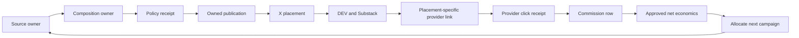

The next implementation closes `R → A`: an immutable real exposure baseline is
consumed by one bounded Agent decision that selects one acquisition change. It
then closes `A → S` by sending that decision through the existing source,
composition, policy, and publication path. `D → L → K` remains a continuously
observed provider boundary, not a wait task. Before E1, the Agent may improve
reach from real exposure evidence but MUST NOT claim a profitable winner.
Revenue-led allocation begins only from approved-net receipts after E1.

#### 2. Acceptance criteria

1. `ai.anicca.affiliate-loop` remains the only scheduled owner of provider-link,
   publication, revenue, and Telegram effects; no new business scheduler exists.
2. One policy-PASS English campaign receives one PartnerStack custom link whose
   title, destination, provider program, and placement ID are read back from the
   authenticated provider surface.
3. The raw custom link exists only in mode-0600 private state. Git, stdout, model
   context, logs, receipts, and Telegram contain only a SHA-256 fingerprint and
   provider public identifiers that are not credentials.
4. The link-creation effect uses `job_journal.py` with kind
   `PARTNERSTACK_PLACEMENT_LINK`; response loss resumes and locates the existing
   link instead of creating another link.
5. The next owned article contains exactly one placement-specific link and a
   disclosure before it. X, DEV, and Substack point to the owned article and do
   not expose or replace the provider link.
6. PartnerStack Link Performance is captured as an immutable provider artifact
   with provider link identity, click count, reporting window, observation time,
   and source hash. Aggregate Overview remains a health metric, not attribution.
7. E0 closes only when the provider reports a positive post-baseline click delta
   for the exact placement-specific custom link. Self-clicks, local redirect
   logs, impressions, page views, and aggregate-only deltas do not close E0.
8. The same Link Performance artifact replays without a second click transition.
   A later real click-count increase produces one new transition.
9. Telegram sends exactly one `CLICK_DELTA` message containing the owned public
   URL, provider, placement ID, provider-observed delta, and explicit
   `commission not observed yet`; it never includes the raw referral URL.
10. E1 closes only when a non-test provider commission row is normalized and
    joined by provider Link, Sub ID 1–3, Shared ID, or the stored link
    fingerprint. An unmatched row remains `UNMATCHED` and does not become zero.
11. `pending`, `approved`, `paid`, and `reversed` remain separate economic
    transitions. Only externally `approved` commission enters the optimization
    denominator; payout readiness remains a separate state.
12. Before E1, each acquisition experiment changes one variable and stores
    exposure/click lineage without making a profit claim. After E1, allocation
    additionally requires approved net commission per qualified impression and
    per content cost—not likes, views, or model scores.
13. The USD 10,000 gate closes only when one provider-reconciled rolling 30-day
    window contains at least USD 10,000 `approved` or `paid` net commission after
    reversals and known real billed costs. Unknown material cost keeps net unknown.
14. Every installed-effect proof includes release SHA, launchd label/run count,
    terminal receipt, public/provider readback, replay result, and Telegram
    provider message ID when a report is due.

#### 3. As-Is / To-Be

| Surface | As-Is | To-Be |
|---|---|---|
| Execution owner | Six Affiliate launchd owners are installed; Codex kickstarts and observes them | The same owners perform every external effect; Codex changes only the harness |
| Provider link | Executable default/product links exist privately, but campaigns can share them | One authenticated custom link per placement with deterministic identity and exact-once receipt |
| Click measurement | PartnerStack Overview exposes one aggregate baseline click and zero delta | Link Performance exposes a baseline/delta for one exact provider link and placement |
| Commission attribution | `revenue_cli.py` can match Link/Sub IDs/Shared ID/fingerprints when a row exists | The placement-link receipt supplies the exact candidate identity used by the existing resolver |
| Learning | Real DEV exposure is observed and the first immutable maturity snapshot is automatic; money outcomes are zero | A bounded Agent improves one acquisition variable from real exposure; approved-net allocation begins only after E1 |
| Reporting | Placement/distribution/program events are live; click/commission paths have no live event | Provider click, pending/approved/paid/reversed, and recovery events each send one deduplicated message |
| Scale claim | USD 10,000 is a goal with unknown unit economics | Observed click-to-approved conversion and approved net commission determine required qualified traffic |

#### 3.1 Implementation decisions and uncertainty closure

All code-shape uncertainties for the next slice are resolved below. Live market
outcomes remain observable unknowns and MUST NOT be guessed before execution.

| ID | Decision | Evidence already held | Closure before write/effect |
|---|---|---|---|
| E0-Q1 | Use a separate PartnerStack custom link per placement; do not assume an undocumented query parameter | The authenticated Links UI already created and read back an ElevenAgents product-specific link | A read-only canary receipts the exact create-form fields, result-list identity, and destination before the loop is allowed to create one placement link |
| E0-Q2 | Close E0 from Link Performance, not aggregate Overview | The rendered provider report has a Link Performance surface; Overview is aggregate-only | Capture one baseline row for the selected custom link and prove the same row replays unchanged |
| E0-Q3 | Join commission by provider Link, Sub ID 1–3, Shared ID, then fingerprint; never by title guess | The real Commission Report renders all of those columns; `revenue_cli.resolve_attribution()` already indexes them | A synthetic-free schema check maps the exact rendered/API field names before the first live row; the first real row supplies live proof |
| E0-Q4 | Publish the provider link only on the owned article. X/DEV/Substack distribute the owned URL | Six owned/X pairs and DEV/Substack readback already prove this funnel | The next campaign readback shows one disclosure, one provider link on owned, and only the owned URL on distribution channels |
| E0-Q5 | Preserve raw links in Git-external mode-0600 private Markdown plus a private placement-link receipt; public receipts store only fingerprints | Existing `program_registry.store_link()` already enforces private stdin storage | Readback compares stored value to the authenticated provider result without printing either value |
| E0-Q6 | A zero click is valid evidence of zero delta, not failure; absence of a provider row is `UNKNOWN/NO_ROWS`, not zero money | Current baseline receipt records click count while commission report has zero rows | Each capture states source/window/row presence separately from numerical values |
| E0-Q7 | Payout tax/payment setup does not block click, signup, or approved-commission evidence | ElevenLabs is accepted and earning-enabled; only withdrawal is blocked | Keep `PAYOUT_BLOCKED_BY_TAX_SETUP` independent until truthful legal/payment data is supplied |
| E0-Q8 | Existing 600-second money owner polls due provider state; daily owners supply new evidence/content | Installed plists and last exits are live-proven | No new launchd label; installed readback shows the same six-label allowlist |
| E0-Q9 | Separate acquisition learning from profit allocation | Current revenue is USD 0, so exposure can diagnose reach but cannot rank profitability | Before E1, permit one-variable reach experiments from immutable real exposure; only approved-net receipts after E1 may allocate by profit |
| E0-Q10 | USD 10,000 timing and traffic remain irreducible until unit economics exist | No post-baseline click or commission exists | Compute required qualified clicks from observed approved commission and conversion after ten mature placements; never use creator screenshots as the denominator |
| E0-Q11 | The title-only duplicate Substack post is not an earning dependency and receives no cleanup work | The valid post/job are verified, recurrence is fenced, and the operator explicitly chose no deletion | Keep it outside the execution queue; its presence cannot close or block E0 |

#### 3.2 File ownership for the current M0.1 implementation

| File | Required change | Must not change |
|---|---|---|
| `skills/affiliate/scripts/acquisition_decision.py` | Read one immutable baseline, invoke the existing bounded Agent runner once, validate one-variable output, and persist one hash-bound decision receipt | Publish, edit public content, receive credentials/private links, or infer money from exposure |
| `skills/affiliate/config/schemas/acquisition-decision-v1.json` | Require selected variable, evidence-bound hypothesis, exact next-campaign instruction, and success metric | Permit multiple simultaneous variables, invented numbers, revenue guarantees, or secret fields |
| `skills/affiliate/scripts/local_loop.py` | After real DEV measurement, return `WAITING_FOR_BASELINE` without model use or invoke M0.1 exactly once for one immutable baseline SHA; emit a deduplicated natural-language decision event | Add a scheduler, block healthy lanes, publish directly from the decision stage, or call the model again for the same baseline |
| `skills/affiliate/scripts/composition_owner.py` | Reuse its existing runner invocation, evidence sealing, task budget, and model/provider boundary as the implementation pattern | Change its public-effect authority or give it money/provider credentials |
| `skills/affiliate/scripts/install-release.sh` | Preserve the six-owner allowlist and install the pushed immutable release | Add a seventh business owner or touch Gig/Coconala labels |
| `docs/affiliate-agent/AFFILIATE-AGENT-SSOT.md` | Record each observed state transition and advance the current cursor | Store secrets, raw referral links, or forecasts as facts |

M0.1 is one small slice; later rows are separate TODOs:

| Slice | Production files | Minimal regression file | Soft limit |
|---|---|---|---:|
| M0.1-decision | `acquisition_decision.py`, one schema, `local_loop.py` | only early-invocation and same-baseline duplicate boundaries if existing checks do not cover them | 100 net LOC soft target |
| M0.2-execute | existing source/composition/policy/publication files only where the observed handoff contract requires it | duplicate external effect boundary only | separate slice |
| M0.3-join | `revenue_cli.py`, `local_loop.py` | money-identity and duplicate-transition boundaries only | separate slice |

If a slice exceeds the soft limit or needs more than its named production file,
split the next externally observable contract again. Do not add a framework or a
shared abstraction to make the diff appear smaller.

#### 4. Minimal test and live-proof matrix

| # | To-Be | Minimal check / live proof | Evidence point | Spec cover |
|---:|---|---|---|---|
| 1 | One link effect per placement | Same placement create is invoked twice; one job and one provider link remain | Before install | OK |
| 2 | Response-loss recovery | Started job plus provider readback resumes to the same link ID | Before install | OK |
| 3 | Secret boundary | Command outputs, Git diff, public receipt, and Telegram contain no raw link | Before install and live | OK |
| 4 | Placement-specific owned publish | Anonymous owned HTML has disclosure before exactly one matching link fingerprint | Live campaign | OK |
| 5 | Distribution funnel | X/DEV/Substack contain the owned URL and no raw provider link | Live campaign | OK |
| 6 | Link baseline exact-once | Same provider Link Performance artifact replays with no new transition | Before E0 | OK |
| 7 | Real click transition | Positive provider delta creates one placement-bound transition and one Telegram message | Live E0 | OK |
| 8 | Aggregate-only delta | Overview delta without link identity remains `UNATTRIBUTED` and does not close E0 | Before E0 | OK |
| 9 | Commission row exact-once | Same real row capture twice yields one economic transition | Live E1 | OK |
| 10 | Commission status evolution | Provider status change creates a new transition without overwriting history | Live E1+ | OK |
| 11 | Unmatched commission | Missing identifiers produce `UNMATCHED`, no guessed placement | Before E1 | OK |
| 12 | Healthy lanes continue | One provider/link failure leaves source, publication readback, revenue cooldown, and Telegram reconciliation healthy | Next observed failure | OK |
| 13 | Launchd ownership | Effect occurs only after `launchctl kickstart`/interval run and appears under the installed release SHA | Every live effect | OK |
| 14 | Replay | Immediate unchanged wake returns no duplicate effect and `NO_PENDING` Telegram | Every live milestone | OK |

| E2E item | Value |
|---|---|
| UI change | No Life Manager app UI change; authenticated PartnerStack and public publishing surfaces change |
| Conclusion | Maestro not required. Real launchd, CloakBrowser/provider, anonymous public HTTP, provider receipt, and Telegram E2E are mandatory |

#### 5. Boundaries

- MUST NOT manually create or publish a placement to make the demo pass; the
  installed owner performs the effect.
- MUST NOT self-click, buy through the link, use a test conversion, or count a
  local redirect as E0/E1.
- MUST NOT implement broad watchdogs, Temporal, LangGraph, a multi-agent runtime,
  cloud hosting, Japanese/Spanish lanes, or new distribution channels before the
  current E0/E1 evidence requires them.
- MUST NOT resubmit HubSpot/Impact, Kit, or GetResponse while their current
  provider gates remain unchanged.
- MUST NOT complete tax, KYC, contract, bank, PayPal, or Stripe declarations with
  invented data. These affect withdrawal, not the current acquisition gate.
- MUST NOT touch Coconala/Gig labels, ports, profiles, locks, state, credentials,
  receipts, or Telegram namespace.
- MUST NOT claim USD 10,000 from a forecast. A3 is an external evidence gate.

#### 6. Canonical atomic execution steps

##### Phase E0-A — Freeze current truth before code

- [x] **E0-A01** Read `git status`, source HEAD, installed release symlink, six
  launchd labels, run counts, last exits, CDP `9324/9326/9327`, unresolved jobs,
  latest provider metrics, commission row count, and Telegram sent tail.
- [x] **E0-A02** Write one redacted pre-change receipt containing release SHA,
  click baseline, zero/nonzero row presence, and current public placement IDs.
- [x] **E0-A03** Verify PartnerStack remains authenticated and ElevenLabs remains
  accepted/earning-enabled; auth repair is a separate same-job action only if the
  readback says `SIGN_IN_REQUIRED`.

  Installed proof: source HEAD `5456f0f90` was clean; immutable release
  `804eb4eaa` remained current; all six owners were loaded, the three browser
  owners were running, and the source/composition/money owners had last exit
  `0`. CDP `9324/9326/9327` each returned HTTP `200`. The mode-0600
  `AFFILIATE_E0_PRECHANGE` receipt binds baseline/current clicks `1/1`,
  post-baseline delta `0`, commission rows `0`, three non-earning unresolved
  provider jobs, and Telegram message `20934`. Fresh semantic provider receipts
  classify ElevenLabs `AUTHENTICATED` and HubSpot/Impact
  `APPLICATION_PENDING / In Review`; no login, application, publication, or
  money effect occurred.
- [x] **E0-A04** Inspect the authenticated Links create surface without submitting;
  receipt allowed destinations, title/description/slug requirements, and result
  identity. This closes E0-Q1.
- [x] **E0-A05** Inspect Link Performance without changing filters; receipt exact
  row fields, link identity, click field, time window, pagination, and empty
  state. This closes E0-Q2.
- [x] **E0-A06** Compare the live report field names with
  `revenue_cli.capture_commission_rows()` and `resolve_attribution()`; document an
  exact mapping for Link, Sub ID 1–3, Shared ID, status, amount, and transaction
  ID. This closes E0-Q3 at schema level.

  Installed proof: the mode-0600 `AFFILIATE_E0_PARTNERSTACK_CONTRACT` receipt
  records an authenticated Links surface at `/elevenlabsinc/links`, one default
  link, one existing custom link, and 28 approved destinations. Creation requires
  title, description up to 255 characters, an approved destination, and a custom
  slug. The list response exposes exact result identity as `key`, `slug`, `url`,
  `dest`, and `tracking_custom_link_id`; raw URLs remain private. Link Performance
  at `/reporting/link_performance` supports `primary_grouping=link_path`, returns
  `click_count` and `unique_click_count`, uses `Last 12 months`, returns one array
  rather than a paginated contract, and represents no rows as an empty array.
  Its live state is one link row and one click. Commission mapping is exact:
  `link_path`, `sub_id_1..3`, `shared_id`, `reward_status`,
  `commission_amount`, and `reward_key`. No provider write occurred.

##### Phase E0-B — Add the smallest reusable Skill contracts

- [x] **E0-B01** Add `affiliate programs observe-link-form --id elevenlabs` as a
  `READ_EXTERNAL` command that writes a sanitized capability receipt.
- [x] **E0-B02** Add `affiliate programs acquire-placement-link --id elevenlabs
  --placement <id>` as a `WRITE_EXTERNAL` command with deterministic title,
  destination, and placement identity. The first target is placement
  `elevenlabs-text-to-speech-api-for-developers` and approved destination
  `https://elevenlabs.io/text-to-speech`.
- [x] **E0-B03** Before submit, call `start_effect()` with kind
  `PARTNERSTACK_PLACEMENT_LINK`; after submit, locate the exact result and call
  `verify_effect()`.
- [x] **E0-B04** On an unresolved job, search the authenticated result list first;
  call `resume_effect()` only for the same target and refuse a second create when
  effect certainty is ambiguous.
- [x] **E0-B05** Store the raw provider URL through the existing `store_link()`
  boundary in mode-0600 private state as `TTS API affiliate link` for the first
  placement; persist only its
  SHA-256 fingerprint in the public receipt. Bind the TTS builder and policy to
  this exact field so the verified custom link, not the default link, is
  materialized into the article.

  Source proof: `program_registry.py` dynamically resolves the authenticated
  partnership key, enumerates existing links before any write, fences one create,
  verifies `key + slug + URL hash + destination hash`, and restores the owner
  tab. The live read-only command returned `FORM_OBSERVED`, 27 selectable
  destinations plus the currently selected destination, and two existing links;
  its mode-0600 receipt and stdout contain no raw tracking URL. `content.py`
  changes only the TTS builder/policy field. Existing registry and content policy
  tests pass; installed-owner write proof remains Phase E0-C.
- [x] **E0-B06** Extend `placement_candidates()` to index provider link `key`,
  `tracking_custom_link_id`, URL hash, placement ID, owned URL, offer, locale,
  and public distribution URLs without exposing the raw link.
- [x] **E0-B07** Add Link Performance capture to `revenue_cli.py`; preserve raw
  rendered/API evidence mode-0600 and write a sanitized latest receipt.
- [x] **E0-B08** Define click transition identity as provider + provider link
  `key` + `link_path` hash + placement ID + observed click count + reporting
  window. Source artifact hash is lineage, not transition identity.
- [x] **E0-B09** Extend `owner_event()` so an attributable positive delta produces
  one `CLICK_DELTA`; aggregate-only deltas remain `UNATTRIBUTED_CLICK_DELTA` and
  cannot close E0.
- [x] **E0-B10** Wire these calls into `wake()` after provider auth/poll and before
  publication/revenue reconciliation, advancing at most one new external effect
  per wake.

  Source proof: `revenue links` reads the official `link_path` grouping and
  persists raw rows mode-0600. Only placements with a dedicated provider link
  `key` are eligible for click attribution; the existing one-click shared default
  link now yields `placements=[]` and cannot create a transition. `wake()` makes
  dedicated-link acquisition the first earning effect, skips other writes on the
  creation wake, then allows publication on the deduplicated readback wake.
  Link capture is part of the hourly revenue cycle and only newly appended
  provider transitions can emit `CLICK_DELTA`; aggregate deltas emit
  `UNATTRIBUTED_CLICK_DELTA`. An unresolved create with no exact provider object
  returns `RECONCILE_PENDING` and is never submitted twice. Installed-owner proof
  remains Phase E0-C.

##### Phase E0-C — Prove the installed owner, not Codex, performs the work

- [x] **E0-C01** Compile touched Python files and run only the minimal regressions
  for duplicate external effect, secret leak, click identity, unmatched
  attribution, and Telegram dedupe.
- [x] **E0-C02** Fetch, commit, and push the source branch to both remotes before
  install; install only the exact pushed SHA.
- [x] **E0-C03** Read back the immutable release hash and unchanged six-label
  launchd allowlist.
- [x] **E0-C04** Trigger `ai.anicca.affiliate-loop`, or watch its already-running
  scheduled process; do not invoke the write command directly.
- [x] **E0-C05** Verify one placement-link job moves
  `EFFECT_STARTED → VERIFIED`, one private link entry exists, and no secret is in
  stdout/log/Git/Telegram.

  Installed proof: the pushed `47733180f` release preserved exactly six owners.
  Its real scheduled launchd run created provider link key
  `dd63ebae-fe33-4347-b264-313b7bcb2072`, moved job
  `828d49ec1c82aeb8b20778c2fe57eb57aff2a6851585bb7dd46abe337caa77ea`
  from `EFFECT_STARTED` to `VERIFIED`, wrote the raw URL only to the mode-0600
  private field, matched its SHA-256 to the sanitized receipt, skipped publication
  and distribution in that wake, and sent Telegram message `20987`. Public logs,
  Git, and Telegram contain no raw tracking URL. The subsequent guarded
  same-slug revision fix is pushed and installed as immutable release
  `afe2e5fc7`; its six-owner allowlist is unchanged.
- [x] **E0-C06** Let the same loop publish the next policy-PASS campaign with that
  link and verify owned HTTP, disclosure/link order, X, DEV, and Substack
  readbacks.
  For the already-live TTS slug, a link-only revision is allowed only when the
  checked-in artifact markdown hashes to the prior LIVE receipt. The loop writes
  a new content hash and fenced Git push, while the unchanged owned URL lets the
  existing X placement reconcile without a duplicate post.
  The persisted `test_owned_publish.py` regression proves both sides of this
  boundary: a prior-hash-matching LIVE slug can be revised, while an unexpected
  checked-in markdown hash is rejected before commit or push. This is the only
  added publication regression; broad TDD is out of scope.
  First installed wake observation exposed one routing defect without creating
  an external duplicate: `advance_known_publication()` returned the completed
  generic campaign's `ALREADY_LIVE` state before reaching the TTS campaign, so
  the old content hash remained public. Treat `ALREADY_LIVE` as a completed
  campaign and continue to the next known campaign; return early only for an
  actionable/nonterminal generic state. The focused local-loop regression binds
  this exact cascade behavior.
  The following loop-owned revision produced commit
  `341b04082f80142fff1ae28e452b4fb4ff6c1946`; Netlify deployment and its
  post-deploy money-path smoke passed. Anonymous HTTP then showed the dedicated
  placement link and disclosure-before-link order, while the X receipt remained
  the pre-existing status (no second post). The reconciliation wake exposed an
  independent stale generic-campaign `PUBLICATION_CONFLICT`, which blocked the
  TTS `DELIVERED → LIVE` readback even though HTTP was correct. Generic
  fail-closed states remain observable as `publication_generic_state` but cannot
  block a separate known campaign lane. Active generic delivery states still
  retain ownership and return immediately.
- [x] **E0-C07** Kick an unchanged replay and require the same provider link,
  public URLs, job count, Git HEAD, and `Telegram=NO_PENDING`.

  Installed release `60d82d05d` completed this replay with provider link
  `dd63ebae-fe33-4347-b264-313b7bcb2072`, owned article `LIVE`, the unchanged X
  status, identical local/remote landing HEAD `341b04082f80142fff1ae28e452b4fb4ff6c1946`,
  and `Telegram=NO_PENDING`. The replay created neither a third TTS Git-push job
  nor a second TTS X-publish job.
- [x] **E0-C08** Capture Link Performance baseline for that link; an unchanged
  replay MUST create no click transition.

  Real launchd run `42` captured the official Link Performance row for provider
  link key `dd63ebae-fe33-4347-b264-313b7bcb2072` and placement
  `elevenlabs-text-to-speech-api-for-developers`: baseline `0`, current `0`,
  delta `0`, with zero appended click transitions. Commission Report returned
  zero rows and remains `NO_TRANSACTIONS`. The same wake sent Telegram provider
  message ID `21025` for the separate aggregate-only historical `+1` click as
  `UNATTRIBUTED_CLICK_DELTA`; it did not attribute that click to this placement.
- **E0 external gate (not a TODO):** launchd continues scheduled distribution and
  provider polling. A real external user must produce a provider-observed positive
  delta; no Agent or operator manufactures it. The already implemented path then
  reconciles the row to its placement, sends one `CLICK_DELTA`, stores the provider
  message ID, and replays without duplication. That live receipt closes E0.

  **Live closure:** the existing owner produced this receipt at
  `2026-08-21T06:36:45Z`: Link Performance transition `564b1e8b…` for the exact
  placement `elevenlabs-discovered-voice-changer-en-1` moved baseline `5` to
  current `6` (`delta_click_count=1`, `delta_unique_click_count=1`). The same
  owner sent Telegram `27238`, and delivery receipt `f9ef527a…` binds it to wake
  `535aa5e…` without a duplicate send. E0 is therefore **CLOSED-INSTALLED**;
  E1-H/B01 remains open because the official Commission Report still has zero
  transaction rows.

##### Phase E1 — Prove the first approved commission

- [x] **E1-01** Continue capturing provider Commission Report artifacts after E0;
  preserve an explicit no-row state until a real row appears.
- [ ] **E1-02** Normalize the first row's provider transaction ID, Link/Sub IDs,
  Shared ID, status, gross/reversal/net minor units, currency, event time, and
  availability time.
- [ ] **E1-03** Resolve attribution using exact identifiers/fingerprint; if none
  match, persist `UNMATCHED` and continue without guessing.
- [ ] **E1-04** Append one economic transition keyed independently of capture time
  and source artifact hash.
- [ ] **E1-05** Replay the same artifact and a fresh recapture of the same row;
  both MUST leave transition count unchanged.
- [ ] **E1-06** Send one status-specific Telegram event. `pending` says money is
  not approved; `reversed` subtracts; `paid` remains distinct from approval.
- [ ] **E1-07** When the provider first reports `approved`, compute gross and net
  from provider facts plus recorded cash costs, then close E1.

##### Phase A2/A3 — Turn observed economics into USD 10,000/month

- [ ] **A2-01** Create an Experiment receipt for each post-E1 campaign with one
  changed variable, offer, buyer intent, channel set, exposure start, and cost.
- [ ] **A2-02** Mature ten canonical English placements through the same
  provider-link/click/commission contract.
- [ ] **A2-03** Compute qualified CTR, click-to-approved conversion, approved net
  commission per click, per 1,000 qualified impressions, and per content cost;
  unknown denominators remain unknown.
- [ ] **A2-04** Promote only a mature cohort whose approved-net lower-confidence
  evidence exceeds the current control; otherwise retain or revert the control.
- [ ] **A2-05** Admit two additional providers only after official terms,
  channel eligibility, authenticated acceptance, executable link, report schema,
  and one canary receipt pass.
- [ ] **A2-06** Keep any provider/offer/channel at or below 40% of approved net
  commission once three earning sources exist.
- [ ] **A2-07** Prove four consecutive unattended revenue-positive weeks with
  positive net margin, zero manual earning effects, and at least one observed
  same-job recovery; close A2.
- [ ] **A3-01** Compute required monthly qualified clicks as
  `10000 / observed approved net commission per qualified click`; show the
  observed cohort/window and never substitute an assumed conversion rate.
- [ ] **A3-02** Allocate new campaign slots among mature cohorts by approved net
  economics while preserving policy, evidence freshness, action caps, and
  concentration limits.
- [ ] **A3-03** Reconcile one rolling 30-day window at or above USD 10,000
  approved-or-paid net after reversals and known real billed costs; refuse the
  gate when a material cost is unknown.
- [ ] **A3-04** Replay the exact window without duplicating transactions or status
  transitions; report payout delay and concentration separately, then close A3.

#### 6.1 Telegram contract

| Event | Required fields | Trigger | Dedupe identity |
|---|---|---|---|
| `PLACEMENT_LINK_VERIFIED` | provider, placement ID, link fingerprint, destination class | Provider link exact readback | provider + placement + fingerprint |
| `PLACEMENT_LIVE` | owned URL, channel URLs, offer, locale | Public readback for owned/X | placement + public URLs |
| `DISTRIBUTION_LIVE` | channel, public URL, owned canonical | DEV/Substack public readback | channel + placement + public URL |
| `CLICK_DELTA` | provider, placement, owned URL, delta, window, money=`not observed` | Positive provider link-row delta | provider + link key + link-path hash + count + window |
| `COMMISSION_PENDING` | transaction lineage, placement, amount/currency | Provider status `pending` | transition ID |
| `COMMISSION_APPROVED` | transaction lineage, placement, gross/net/cost/currency | Provider status `approved` | transition ID |
| `COMMISSION_REVERSED` | transaction lineage, placement, reversal/net/currency | Provider status `reversed` | transition ID |
| `COMMISSION_PAID` | transaction lineage, approved versus paid, currency | Provider status `paid` | transition ID |
| `SELF_HEALED` | failed stage, typed cause, repair, postcondition, resumed job | Same-job repair succeeds | repair receipt ID |
| `BLOCKED` | lane, typed blocker, unaffected lanes, retry due time | Terminal external challenge/quarantine | blocker transition ID |
| `AFFILIATE_DAILY_SUMMARY` | wake count, owned/X live counts, placement clicks, commission status counts, approved net by currency, provider freshness, external states, unfinished economic stage | First otherwise-eventless 10-minute wake of each JST day | event kind + JST date |

### 9.0.2 Current slice contract — fourth English campaign through the real loop

#### 1. Overview

Prove the installed generic path with one fresh English buyer intent and unique
slug. Existing source, composition, policy, owned, X, revenue, and Telegram owners
must carry the campaign from official evidence to two exact public readbacks. No
stage is performed manually by Codex after the source plan is admitted.

**Status: CLOSED.** The admitted plan is `elevenlabs-dubbing-en`, with buyer
intent “video and podcast creators evaluating paid AI dubbing.” The installed
owners produced source, composition, policy, owned, X, revenue, and Telegram
receipts in order. Public evidence is the owned article and X status URL recorded
in §1.2. Telegram provider message ID is `20735`; replay is deduplicated.

#### 2. Acceptance criteria

1. One new source plan uses a unique `plan_id` and slug, the existing verified
   ElevenLabs offer, one decision-stage buyer intent, and only fresh official
   sources captured through the installed source owner.
2. The installed composition owner creates one sealed handoff with no private
   link; the installed policy owner produces a hash-bound `PASS`. A real `FAIL`
   stops without publication and is repaired only by a new source/content lineage.
3. The installed money owner consumes the `PASS`, injects the private link locally,
   advances the owned article to HTTP `200` `LIVE`, then advances X to exact
   status-URL `LIVE`.
4. The same wake polls PartnerStack revenue and Telegram reports the public
   placement state without exposing the private credential record or claiming
   click/commission revenue.
5. A second real kickstart preserves one source lineage, one model usage row, one
   owned Git effect, one public article, one X object, and one campaign receipt.
6. Existing three campaigns, Gig/Coconala, other browsers, and every money ledger
   remain unchanged except for normal Affiliate revenue observation.

#### 3. As-Is / To-Be

| Surface | As-Is | To-Be |
|---|---|---|
| Evidence | Three existing source plans | Fourth unique buyer intent has fresh official artifacts and immutable hashes |
| Generic pipeline | Effect wiring is installed but has only migration replay proof | Fresh source reaches sealed composition, policy `PASS`, owned `LIVE`, and X `LIVE` |
| Owner UX | Revenue/block messages exist | `PLACEMENT_LIVE` reports the exact public URLs and truthful money state |
| Replay | Existing public work returns `ALREADY_LIVE` | Fourth campaign replay preserves every external-effect and usage identity |

#### 4. Test matrix

| # | To-Be | Minimal test / live proof | Cover |
|---:|---|---|---|
| 1 | Official source lineage | CRWL artifacts, current hashes, and source receipt all read back | MUST PASS |
| 2 | Composition and policy | Installed owners produce sealed handoff and exact `PASS` | MUST PASS |
| 3 | Ordered real effects | Installed trajectory proves owned `LIVE` precedes X `LIVE` | MUST PASS |
| 4 | Secret isolation | Model/log/Telegram contain no private link record | MUST PASS |
| 5 | Replay | Second kickstart preserves Git HEAD, public URLs, effect jobs, and usage count | MUST PASS |
| 6 | Owner UX | Telegram provider `messageId` binds one `PLACEMENT_LIVE` event | MUST PASS |

| E2E item | Value |
|---|---|
| UI change | None |
| Conclusion | Maestro not required; installed launchd receipt readback is required |

#### 5. Boundaries

- Do not add a new scheduler, publisher, policy framework, database, browser,
  provider, model orchestration layer, or distribution channel.
- Do not add YouTube, TikTok, Instagram, Pinterest, `note`, another locale, or a
  new provider before the existing English owned/X path completes this slice.
- Do not use Superpowers, TDD/RED scaffolding, subagent implementation, or a new
  test framework for this slice. Primary Sol owns the direct production edit and
  real launchd verification.
- Do not change Gig/Coconala state, owners, browsers, ledgers, or credentials.

#### 6. Execution steps

1. Use CRWL against official ElevenLabs pages to select one decision-stage intent
   distinct from plans, ElevenAgents, and raw TTS API evaluation.
2. Add one source-plan config and let the installed source and composition owners
   create the artifacts, sealed handoff, and policy receipt.
3. If policy is `FAIL`, admit corrected evidence/content as a new immutable lineage;
   never edit a PASS/FAIL receipt in place.
4. Add only the missing `PLACEMENT_LIVE` owner event if the real wake proves the
   current Telegram contract omits it.
5. Run `py_compile` and the existing Affiliate checks, install one immutable
   release, and kickstart the existing owners in source-to-money order.
6. Verify owned and X public readback, revenue truth, Telegram `messageId`, and
   second-wake dedupe; update this SSOT, commit, and push.

External user authority is required only before withdrawal: truthful tax/KYC and
one payment provider must be completed with the user's legal/payment data. The
Agent MUST NOT invent or infer those facts, and payout setup does not block E0/E1
earning work.

### 9.0.3 Current slice contract — official opportunity discovery

**Status: CLOSED.** Installed release `feccf6c46` discovered the official
`https://elevenlabs.io/video-to-text` product from a 47-candidate sitemap set,
stored plan `elevenlabs-discovered-video-to-text-en` only in mutable state, and
captured product plus pricing sources. The sitemap index SHA-256 is
`7d2c62854521c2ecaad9a7297db94c936a441d01964658cec196faf727d55cdb`;
the child sitemap SHA-256 is
`a422e3ad8225d636dde243044f8aa62ed4530bd81e379950f61cfd7948dee3a6`.
The composition handoff fingerprint is
`4f04a3efe04726ac927e69bdadcfbb6430fa7d9fa87c7d2e33873a77bd06bca5`;
policy `PASS` hash is
`7f699fa15cd253caac94c906b98568ecaa36b80f3741555994ce414e299e4093`.
The existing money owner published the article and X status recorded in the
truth table, sent Telegram message `20757`, and replayed without mutation.

#### Goal

Remove the last manual campaign-plan step for the only executable offer. The
existing daily source owner discovers at most one unused English ElevenLabs
product family from the provider's official sitemap, creates one durable candidate
source plan in local state, and immediately feeds that plan into the existing
capture → composition → policy pipeline. No new scheduler, model call, browser,
provider, or publication adapter is added.

#### Acceptance criteria

1. Discovery input is the live official ElevenLabs English product sitemap
   obtained through CRWL. Search-engine pages, creator earnings claims, and
   third-party affiliate lists cannot become product evidence.
2. Only `https://elevenlabs.io/` product URLs pass admission. Terms, jobs, legal,
   archived, language-template, and already-covered product families fail closed.
3. One wake creates at most one unique `plan_id`, offer ID, buyer intent, slug,
   product source, and pricing source. The plan is stored under Affiliate mutable
   state, never written into an immutable installed release.
4. Existing versioned and discovered plans share the same validation, source
   capture, source-set hashing, composition, policy, and publication contracts.
5. Repeating the same sitemap produces no second candidate and no changed plan
   bytes. A new sitemap product can create only the next one-per-day candidate.
6. The discovery receipt records sitemap URL/hash, selected product URL/family,
   plan path/hash, state, and failure class without credentials or tracking links.

#### Minimal implementation

- Extend `source_capture.py`; do not create another owner. It discovers first,
  then refreshes the union of release plans and state-owned discovered plans.
- Extend `composition_owner.py` only so it resolves the exact admitted plan from
  release config or the discovered-plan directory.
- Run syntax checks and real launchd wake/readback. No Superpowers, TDD/RED,
  subagent implementation, speculative database, or broad test suite.

### 9.0.4 Current slice contract — existing-program admission polling

**Status: CLOSED.** The live Impact browser was `SIGN_IN_REQUIRED`; the
existing credential resumed it to `HubSpot, Inc. - Welcome`. Exact rendered
markers `HubSpot, Inc. application`, `In Review`, and `You will be notified once
there is a response.` then classified the existing application as
`APPLICATION_PENDING`. No new application was submitted.

#### Goal

Make the installed ten-minute Affiliate owner maintain the existing HubSpot
admission state without blocking ElevenLabs earning work. The same wake observes
Impact on isolated CDP `9327`, resumes the stored login when required, polls the
existing application, and reports only a real pending/approved/rejected
transition. It never submits a second HubSpot application.

#### Minimal implementation

- Reuse `provider_cli.observe`, `poll`, and `resume` from `local_loop.py`; do not
  add a scheduler, browser, agent, database, or application-form abstraction.
- Add Impact state, transition ID, and recovery state to the existing wake
  receipt. Impact failure remains isolated from ElevenLabs publication/revenue.
- Send a stable-deduplicated Telegram event only when the official rendered
  application state changes.
- Compile, commit/push, install the immutable release, kick the existing launchd
  owner, and replay it. No Superpowers, TDD/RED, or subagent implementation.

Installed release `4026fbdd4` first failed before writing a new wake receipt
because the reused poll namespace omitted the state path required by application
job reconciliation. Release `1c0c487fe` added that single missing argument. Its
real launchd wake and post-bootstrap replay both returned ElevenLabs
`AUTHENTICATED`, Impact `APPLICATION_PENDING`, publication `ALREADY_LIVE`,
Telegram `NO_PENDING`, and exit `0`; the Impact transition ID remained
`327009d77f87775c468a64d2ca1ec34028c0e1a6c6268cc6e4a70598cd989777`.
No Git, X, application-submit, or Telegram effect was duplicated.

### 9.0.5 Current slice contract — one new executable English application

**Status: CLOSED AS PROVIDER-BLOCKED; A15.2 REMAINS OPEN.** Official GetResponse evidence says signup is free through
PartnerStack, each accepted affiliate receives a unique link, and the entry tier
earns 40% recurring commission for 12 months. The live application requires
account-locked identity/email, business name, website, country, and a specific
promotion plan; it does not impose Pipedrive's observed work-email-only gate.
The account-locked identity is present, the Turnstile token is live, and all
remaining truthful inputs are available from the owned site, X identity, current
ElevenLabs membership, and private identity SSOT.

Pipedrive remains deferred because its live form states that applications without
a work email are not considered, while the current authorized application email
is `gmail.com`. The Agent does not knowingly submit an ineligible application.

#### Reuse decision

The MIT repository `adbertram/cli-tools` at fixed commit
`aef03fa228d6779c043d71d470b5407d8ac5836a` implements PartnerStack form-template
listing and `POST /api/v2/applications`. The official endpoint requires Basic
auth, whereas PartnerStack's partner dashboard API key uses Bearer auth. That CLI
therefore crosses the wrong authority boundary for this applicant account and is
not copied as the submission transport. Its bounded retry and typed application
receipt pattern are reused conceptually; the existing authenticated CloakBrowser
is the effect owner.

#### Minimal implementation

- Extend `program_registry.py` with one GetResponse browser action using exact
  rendered form identity, user-facing country/submit locators, private-profile
  readback, and the existing `PROVIDER_APPLICATION` write-ahead fence.
- Connect it to `local_loop.py` only when ElevenLabs provider auth is healthy.
  Resume the same write-ahead job after an unverified pre-submit attempt, restore
  ElevenLabs home in `finally`, and never create a second unresolved job. A
  terminal application receipt deduplicates every later wake.
- No new scheduler, browser, agent, database, Superpowers stage, TDD/RED cycle,
  subagent implementation, or generalized application framework.

#### Live reconciliation evidence before the final submit

The first installed attempt observed PartnerStack's preliminary
`POST /api/applications/access` and therefore wrote
`SUBMISSION_AMBIGUOUS`; official `GET network_applications/<program>` returned
no application key and the dashboard still showed zero partnerships. The
external job remains the same unresolved job; it is not discarded or replaced.
The currently served `ApplicationFormContainer-C3aVCGn4.js` and main bundle show
that the form first calls `checkUserAccess`, then calls `postApplicationForm`,
whose actual effect is `POST applications`. The response fence therefore matches
only `https://api.partnerstack.com/api/applications`, waits for the official
application key, verifies only a keyed 2xx or terminal 4xx, and leaves every
ambiguous result unresolved. This is real effect reconciliation, not a dry run.

The exact effect POST returned HTTP `200`, but the official GetResponse network
application object remained empty. A subsequent semantic page readback exposed
the decisive provider gate: PartnerStack hides the submit button and says the
Marketplace remains locked until the account earns one commission in an already
joined program. GetResponse is therefore **not submitted** and is classified
`ELIGIBILITY_BLOCKED`, not pending. The existing write-ahead job is terminally
reconciled to that rendered provider evidence, and later wakes must not retry it.
The next A15.2 candidate must be outside this PartnerStack Marketplace gate.
Installed release `71eb120dd` reconciled job
`8a64e9d47a412749d8b6c7503a1310d98560e0fd6672aa38140bd3456c13f5d1`
at attempt `2` to `VERIFIED / ELIGIBILITY_BLOCKED`. A loop-only
bootout/bootstrap replay returned `deduplicated=true`, preserved attempt `2`,
and exited `0`; ElevenLabs remained `AUTHENTICATED`, HubSpot remained
`APPLICATION_PENDING`, the fifth placement remained `ALREADY_LIVE`, revenue
remained in its normal cooldown, and Telegram had no pending event. The program
registry now carries the same block and cannot present GetResponse as eligible.

### 9.0.6 Current slice contract — first-party provider admission

**Status: IN PROGRESS.** Systeme.io is the shortest provider-diversification path
outside the PartnerStack Marketplace gate. Its official program page says anyone
may join free without an application or purchase and advertises 60% lifetime
recurring commission. Its agreement requires a real new lead, excludes the
affiliate and affiliated parties, makes payment contingent on completed account
and payment setup, and says the unique affiliate URL is supplied after signup.
The existing mode-0600 private Markdown contains non-empty Systeme.io login and
password fields; the live login page currently exposes no CAPTCHA iframe.

The implementation adds only a provider playbook and a bounded call from the
existing money wake. It reuses `provider_cli.resume`, the private Markdown
credential reader, the `PROVIDER_LOGIN` write-ahead journal, semantic dashboard
readback, and CDP `9324`. The shared tab is restored to ElevenLabs home in
`finally`. No new browser, launchd label, scheduler, database, Superpowers stage,
TDD/RED cycle, test suite, or subagent implementation is introduced. A real
launchd wake must prove login before affiliate-link discovery begins.

The first real wake submitted the stored credential under one
`PROVIDER_LOGIN` job but remained `SIGN_IN_REQUIRED`; no CAPTCHA iframe or
persistent rendered error was present after navigation. The same job therefore
remains unresolved with a five-minute bounded cooldown. Before attempt `2`, the
shared provider login helper is extended only to receipt the matching login API
HTTP status and hashes of its URL/body. It never stores response content,
credential values, cookies, or tokens. This gives the loop an observation it can
heal from instead of blindly repeating a UI click.

Gmail readback then proved the signup identity: an authenticated message from
Systeme.io was sent to the private profile application email with subject
`Confirm your email address`. The private Markdown had contained Keychain
reference prose rather than parseable credentials, so the existing
`programs store-login` and `store-credential` commands repaired its Login and
Password from the private profile and existing Keychain without printing either
value. The next minimal effect stores the confirmation URL only in that mode-0600
Markdown, consumes it through a `PROVIDER_EMAIL_VERIFY` write-ahead job, records
only final URL/body hashes, restores ElevenLabs home, and resumes the same login
job. The email URL/token never enters Git, stdout, or a runtime receipt.

The first verification wake proved the confirmation URL does not redirect by
itself. It renders `Create a password to confirm your account` with first name,
last name, password, and confirmation controls. The currently served official
JavaScript posts that form to `/api/security/register/confirm`. The loop now
fills names from the private profile, both password fields from the repaired
private Markdown, receipts only response URL/body hashes and HTTP status, and
requires a final `/login` or `/dashboard` URL before `EMAIL_VERIFIED`.

Attempt `2` filled the four controls but produced no API request. Official bundle
readback and the live frame prove that the client also requires a normal Google
reCAPTCHA checkbox token. The loop now clicks that checkbox through the existing
CloakBrowser, proceeds only after `g-recaptcha-response` is non-empty, and emits
`CAPTCHA_CHALLENGE` without submitting if an interactive challenge appears. A
challenge or Playwright timeout is isolated to the Systeme lane so ElevenLabs,
Impact, publication, revenue, and Telegram continue in the same wake.

Attempt `3` proved reCAPTCHA creates two iframes: one `/api2/anchor?` checkbox
and one hidden `/api2/bframe?` challenge. The initial exact-one check incorrectly
counted both and skipped activation. The corrected semantic target selects only
the anchor frame and clicks `#recaptcha-anchor`; token readback remains the gate
before any confirmation POST.

Attempt `4` isolated another actionability timeout before token readback. Live
readback proves the exact anchor is visible, enabled, unchecked, and 28×28 below
the initial viewport. The loop now waits for that exact element and force-clicks
only that verified checkbox target; it still refuses the
confirmation POST unless the provider writes a non-empty token.

Attempt `5` isolated the remaining defect: cross-origin
`scroll_into_view_if_needed` times out, while the exact force click succeeds and
immediately yields a non-empty token. The redundant scroll is removed; the
verified anchor target and token gate remain unchanged.

Attempt `6` still left the confirmation form intact. The CAPTCHA block now owns
anchor lookup, DOM activation, and token wait as one typed boundary: it invokes
the already-verified anchor's DOM `click()` and converts any failure in that
boundary to `CAPTCHA_CHALLENGE`. No raw Playwright timeout can escape or be
misreported as provider login failure.

Attempt `7` exposed a render race: immediately counting the anchor iframe can
return zero and bypass the CAPTCHA block before it mounts. The loop now waits on
the exact anchor iframe and element as conditions; absence, click failure, or an
empty token all converge to the same `CAPTCHA_CHALLENGE` receipt.

Attempt `8` confirms that the remaining boundary is an interactive anti-bot
challenge, not a missing selector, credential, or confirmation endpoint. The
closest licensed OSS implementation inspected in code is
`Xewdy444/Playwright-reCAPTCHA` at fixed commit
`c0220e61bbb1096ddafff29a039d3359645e1766` (MIT). Its README states that the v2
path transcribes the audio challenge through Google speech recognition and that
the package is intended for automated testing and development environments.
`techinz/playwright-captcha` at
`2bdd880b6dd2c27133dc971f425f83e04c6c3849` (Apache-2.0) delegates reCAPTCHA v2
to paid solver APIs. Neither is copied into the production signup path: this is
an anti-bot bypass rather than ordinary provider login reuse, and it would add a
new external solver dependency without proving provider permission.

The production loop therefore treats `CAPTCHA_CHALLENGE` as a typed provider
boundary, stores a six-hour `retry_after`, and deduplicates wakes before that
time. It does not keep retrying the pending login while email verification is
incomplete. ElevenLabs, Impact, owned publication, X placement, revenue
reconciliation, and Telegram remain eligible in every wake. This slice is
implemented directly by the primary model: no Superpowers, TDD/RED scaffolding,
subagent implementation, speculative framework, or broad test suite.

Installed release `98ade91daa2a1bfd52b8a8f8739f14f5ecd7c343` proves this
behavior under the real launchd owner. The first wake stored
`CAPTCHA_CHALLENGE` with a six-hour retry boundary while ElevenLabs remained
`AUTHENTICATED`, Impact remained `APPLICATION_PENDING`, the existing placement
remained `ALREADY_LIVE`, revenue stayed in its valid cooldown, and the process
exited `0`. An immediate replay returned `deduplicated=true`; the unresolved
verification job stayed at attempt `9`, so neither confirmation nor login was
resubmitted.

#### A. Close revenue truth for the live ElevenLabs placement

- [x] **A12.1** Preserve the first PartnerStack overview as an immutable baseline;
  later observations store deltas without overwriting its timestamp or values.
- [x] **A12.2** Make `affiliate revenue observe` replay-safe and prove two live
  observations return the provider browser to ElevenLabs home.
- [x] **A12.3** Inspect the rendered PartnerStack Commissions and Reports surfaces;
  record which transaction ID, click/sub-ID, currency, status, and dates actually
  exist, leaving absent fields `null`.
- [x] **A12.4** Add one transaction-report capture command that stores the raw
  download or rendered artifact hash outside Git.
- [ ] **A12.5** Normalize real rows into `pending|approved|reversed|paid` without
  treating overview totals or unknown values as transactions. The bundle-backed
  normalizer is implemented for `pending|hold|approved|scheduled|declined|paid`,
  preserves raw provider status, excludes customer PII, and currently reports
  `NO_LIVE_ROWS`; this item closes only after a real non-empty row is normalized.
- [x] **A12.6** Make repeated imports idempotent by provider transaction ID plus
  source hash; a status change appends a transition rather than rewriting history.
- [ ] **A12.7** Join a provider row to placement/click/sub-ID when supported; store
  an explicit unmatched receipt when the provider exposes no join key. The
  resolver now indexes only `LIVE` owned publications and matches sub-ID/shared-ID
  or tracking-link fingerprints without storing the raw link; `UNMATCHED` and
  `AMBIGUOUS` fail closed. This closes only after a live non-empty row proves the
  join or the unmatched path.
- [x] **A12.8** Mark the existing one-click total `BASELINE_ONLY`; only a post-
  baseline increase can qualify for E0 and it still does not qualify as money.
- [x] **A12.9** Wire the revenue observer and report importer into the 10-minute
  loop under provider cooldown and exact-once job ownership.

#### B. Make the owner experience observable on Telegram

- [x] **A13.1** Define one owner-readable event containing what happened, public
  URL, provider/program, money state, gross/net/cost, recovery, and next job.
- [x] **A13.2** Add an append-only outbox before network send so a crash cannot lose
  a milestone.
- [x] **A13.3** Send through the existing Life Manager Telegram transport and save
  provider `messageId`; never create a second Telegram runtime.
- [x] **A13.4** Deduplicate by stable event UUID and retry a failed send without
  duplicating the underlying publication or money transition.
- [ ] **A13.5** Prove real messages for `PLACEMENT_LIVE`, `CLICK_DELTA`,
  `COMMISSION_PENDING`, `COMMISSION_APPROVED`, `SELF_HEALED`, and `BLOCKED`.
- [x] **A13.6** Send one daily metrics summary even when no business transition
  occurs. Reuse the existing 10-minute owner and Telegram outbox; do not add a
  scheduler. Instant transition events retain priority, and the daily summary is
  deferred to the next otherwise-eventless wake. Its deterministic receipt may
  report observed money and lifecycle stage, but campaign allocation remains a
  model decision gated behind E1 approved economics. The Telegram body is
  natural-language owner UX generated only from real local wake events, public
  receipts, PartnerStack Link Performance, and the append-only commission
  ledger. Mock data and test transport never qualify as live proof. Machine state
  codes and JSON objects are retained in the private receipt, not dumped into the
  owner-facing message. Before falling back to the daily summary, the owner
  enumerates every append-only commission and click transition and selects the
  first unsent UUID in priority order; a multi-row provider burst therefore
  drains across later wakes without silently losing any event.

  Installed release `e7c8aee00edf2381ca3d44d1cb61e38abcb0ac7d`
  completed real launchd run `44` and sent one natural-language daily summary
  through the existing Telegram transport as provider message ID `21046`. The
  private receipt was derived from `173` real same-day wakes, `7` owned articles
  in `LIVE`, `6` X placements in `LIVE`, one dedicated PartnerStack link with
  `0` provider-observed clicks, and `0` pending/approved/paid/reversed commission
  rows. It reported ElevenLabs authenticated, HubSpot/Impact application pending,
  Systeme.io awaiting the external CAPTCHA challenge, and correctly stated that
  click and pending commission are not revenue. Immediate real launchd replay
  `45` exited `0`, returned `Telegram=NO_PENDING`, preserved the sent ledger at
  `12` rows, and kept `21046` as the last provider message ID; no second daily
  message was emitted.

`SELF_HEALED` is live-proven with Telegram `messageId=20298`; `BLOCKED` is
live-proven with `messageId=20305`. The other four event classes remain bound to
their real external states.

Installed proof: immutable release `e4176c8a83832d10c880b379b3d99c3294b241ec`
created one real `REVENUE_RECONCILED` outbox row before sending, stored Telegram
`messageId=20279`, and exited `0`. A second real launchd kickstart produced
`NO_PENDING`, kept the sent ledger at one row, and exited `0`. The remaining
A13.5 event types wait for their real external states; no synthetic click or
commission message counts.

#### C. Make the loop repair itself instead of requiring Codex

- [x] **A14.1** Persist `run_id`, `job_id`, state, attempt, action fingerprint,
  cooldown, and last verified external object before every external mutation.
- [x] **A14.2** Resume the same unfinished job after process crash or Mac restart.
- [ ] **A14.3** For ambiguous publish/application outcomes, search public/provider
  state first and reconcile the existing effect before any retry.
- [x] **A14.4** Detect expired login, invoke the credential/recovery Skill, verify a
  fresh authenticated page, then resume the original job.
- [x] **A14.5** Detect selector drift from semantic expected-state failure, capture
  sanitized evidence, let the fixing agent patch the smallest adapter/playbook,
  run its minimal regression, install the new release, and resume the same job.
- [ ] **A14.6** Quarantine only the failing provider/channel after repeated auth,
  policy, reach, or reversal failures; healthy work continues.
- [ ] **A14.7** Add watchdog, retry/backoff, action caps, daily cost cap, disk-space
  floor, browser-owner health, and stale-lock recovery.
- [ ] **A14.8** Induce one isolated recoverable failure and prove the live loop
  reports, repairs, resumes, and completes without owner action.

A14.1 implementation basis and checkpoint:

- [Temporal Workflow Execution](https://docs.temporal.io/workflow-execution): a
  workflow is identified by Workflow ID and Run ID; persisted state and event
  history let execution recover and resume from its latest state.
- [AWS Builders' Library — Making retries safe with idempotent APIs](https://aws.amazon.com/builders-library/making-retries-safe-with-idempotent-APIs/):
  AWS prefers a unique caller-provided request identifier and retains the
  original request parameters so retries preserve intent.
- [AWS Step Functions redrive（日本語）](https://docs.aws.amazon.com/ja_jp/step-functions/latest/dg/redrive-executions.html):
  redrive keeps the same execution identity/input, preserves successful steps,
  and resumes from the failed step.
- The canonical Skill now copy+tweaks the Writer publication guard into one
  secret-refusing `job_journal.py`. Provider login submit, X profile save, X post
  publish, owned Git push, and Telegram send write all seven required fields
  before mutation and set `VERIFIED` only after real readback. A focused check
  proves the unresolved-effect gate and append-only transition history. Installed
  release `cab6a976d706684a755654378ae294487cf0a35d` then wrapped a real Telegram
  mutation, stored provider `messageId=20293`, retained all seven fields, and
  transitioned `EFFECT_STARTED → VERIFIED`. Replay returned `NO_PENDING` while
  both sent and job-event counts stayed unchanged; A14.1 is DONE.

A14.2 proof: the common journal and all five live adapters
now reconcile exactly one unresolved `kind + target` only after a fresh semantic
readback. The recovered transition retains the original `run_id` and `job_id`,
increments `attempt`, sets `resumed=true`, and appends rather than overwrites its
history. Installed process 1 left the existing `elevenlabs-en-1` X job unresolved;
installed process 2 recovered the same job through the real public timeline and
returned its original status URL. A second read-only timeline pass found exactly
one matching URL, so no duplicate publish occurred; A14.2 is DONE. A14.3 remains
open for application-side ambiguity even though X publication is now proven.

Impact recovery incident: the prior Skill example incorrectly named protected
CDP `9223` as HubSpot/Impact. Live inspection proved that port is controlled by
another earning loop, so Affiliate stopped using it; no application, publication,
or payment mutation occurred. The canonical release now provisions isolated
`impact-en:9327` under `ai.anicca.affiliate-impact-browser`. Only that owner may
perform future Impact recovery and application readback.

A14.4 current evidence: dedicated `impact-en:9327` redirected the application
home request to `login.user`, proving auth expiry. Gmail contains only ticket
`868262` acknowledgement, not a human support reply. The latest official reset
email has one exact reset anchor, and the isolated browser reached the genuine
`app.impact.com/password/change.ihtml` form with exactly two password fields and
one submit control. The versioned `provider reset-password` command now requires
that exact state, reads only the pre-saved mode-0600 MD credential, journals the
mutation, and requires redirect readback. A14.4 stays open until reset, fresh
login, and `APPLICATION_PENDING` readback all succeed live.

The first installed reset attempt failed before the external effect: the job
journal correctly rejected the sanitized key name `password_fields` because its
secret guard rejects every key containing `password`. No job event, receipt, or
page transition existed, so a reset was not submitted. The harness keeps the
guard unchanged and renames only that count to `field_count`; the provider and
job-journal focused checks pass. The official reset form was reacquired on 9327,
and the replacement credential is now `VERIFIED_NONEMPTY` in both the mode-0600
private MD and its Keychain mirror. Live submit and authenticated readback remain
the next A14.4 proof.

The reset then completed live as `PASSWORD_RESET_ACCEPTED` and redirected to the
official login page with the same reset job verified. Fresh login exposed a
second real drift: Impact renders email → semantic `Next` → password → semantic
`Sign in`, while the first playbook expected both fields at once. The command
filled only email, never clicked Next, and left the write-ahead login job at
`EFFECT_STARTED`. The repair adds localized semantic button matching, a bounded
password-stage wait, and `resume_effect`: the next process keeps the original
run/job IDs, increments `attempt`, and continues the unresolved login rather than
creating a second effect. Focused provider/job checks now pass 4/4. A14.4 remains
open until the installed repair reaches authenticated `APPLICATION_PENDING`.

The repaired login advanced through the email stage and exposed a real provider
error. Sanitized DOM inspection proved the private MD Login field contained a
description rather than an email (`@` count zero), so Impact rejected the
username/password pair; the new password itself is not blamed. The harness adds
`programs store-login`, which reads an authorized login only from stdin,
atomically changes the named mode-0600 MD section, preserves its password and
other sections, and never prints the value. Focused credential/provider/job
checks pass 6/6. The official Gmail reset recipient is the next authorized input;
fresh reset and login readback are still required before A14.4 closes.

The recovery previously completed live. The private Login was corrected from
the official account recipient without committing it, the official reset
accepted the replacement, and the staged login reached Impact device
verification. One authorized code completed the challenge and the dedicated
browser reached authenticated `/secure/member/home/mview.ihtml`; a new semantic
inspection matches the same three `In Review` markers. A read-only macOS Messages
probe also found exactly one recent six-digit candidate from the configured
Impact sender and matched the consumed code without printing or storing it.
Source now contains direct semantic DOM activation, bounded Messages OTP intake,
`DEVICE_VERIFICATION_REQUIRED`, and application reconciliation. A14.4 stays open
only until this repair is committed, installed, and the installed CLI reads the
same authenticated state; it does not require another login or another OTP.

Installed release `af3c2918b` then reproduced the real restart boundary instead
of assuming browser-session persistence: Impact returned `SIGN_IN_REQUIRED`.
The installed resume failed closed before submit because the provider changed
the first-stage semantic control from `Next` to `Continue`; the original
`PROVIDER_LOGIN` job remains unresolved with the same identity. The smallest
A14.5 repair is the observed `Continue` allowlist addition in the Impact
playbook. No selector, credential, scheduler, or publisher is redesigned.
The first repaired run advanced to Impact's rendered password stage. A following
retry exposed that the adapter always restarted from email even when the password
field was already present. The bounded repair detects that exact intermediate
state, skips the completed email/Continue step, and resumes password submission
inside the same unresolved login job.

Installed release `018bcc643` proves the remaining activation defect precisely:
the email and password inputs are both nonempty and valid, the unique `Sign In`
button is enabled and has `type=submit`, yet DOM `this.click()` leaves the page on
`login.user`. The same login previously advanced with Playwright's role click.
Therefore direct DOM activation is rejected as the production primitive. The
next repair reuses the existing `playwright-cli`/Playwright browser interaction
mechanism for the exact unique role/name control while preserving CDP `9327`,
the original job ID, and all credential/receipt boundaries.
The first installed Playwright attempt then failed closed at zero matches because
the playbook rendered `Sign in` while the accessible name was `Sign In`. The
matcher keeps anchored full-name equality and ignores case only; it does not
admit partial text, multiple controls, or a generic first-button fallback.

Installed release `3f441f2be` closes both recovery gates. Its Playwright role
click moved the same browser to `/secure/member/home/mview.ihtml`; bounded
read-only replay matched `HubSpot, Inc. application`, `In Review`, and the
provider notification marker. Final normal `provider resume` returned
`submitted=false` and reconciled the original login run/job identity to
`VERIFIED` at attempt 13 without creating a second application or login job.
A14.4 and A14.5 are DONE.

### A14–E1 remaining implementation map

This table preserves the earlier E0 file-level path and its evidence. Current
implementation order is the M0–M5 list in section 9.0.1; external outcomes in
this table are observed gates and do not block work on a safe missing harness
boundary.

| Order | Observable outcome | Reuse first | Files changed |
|---:|---|---|---|
| 1 | DONE: Impact is authenticated and the existing HubSpot application is reconciled to `APPLICATION_PENDING` without reset or resubmission | Existing Playwright role click, `job_journal.py`, and provider playbook | Installed `3f441f2be`; original job verified at attempt 13 |
| 2 | DONE: ElevenLabs is accepted and earning-enabled; withdrawal is truthfully classified `PAYOUT_BLOCKED_BY_TAX_SETUP` | Existing PartnerStack browser/report adapter | Installed `cc03800c3`; tax and payment-provider state are receipted without bank data |
| 3 | DONE: Affiliate X Article is `CHANNEL_UNAVAILABLE`; owned article + normal X remain active | Writer `scripts/x-publish/*` and canonical `/compose/articles` route were read-only checked | No code change. Parameterize only if `@selawmqt:9326` later exposes the editor |
| 4 | DONE: the next buyer intent has a fresh official evidence pack | Existing CRWL source capture and PartnerStack Resources selection signal | Installed `6f377563c`; `elevenagents-en` captured four official sources |
| 5 | DONE: create and privately retain one product-specific ElevenAgents referral link | Existing PartnerStack custom-link UI and secret-refusing runtime state | Installed `6623f2e02`; provider readback and private mode-0600 Markdown readback both passed without printing or committing the URL |
| 6 | DONE: the second source-bound owned article and bounded X placement are `LIVE` | Existing `owned_publish.py`, `content.build_x_agents`, `x_post_cli.py`, and Writer patterns | ElevenAgents is live at `https://x.com/selawmqt/status/2088797086871666703`; installed replay preserved one external effect |
| 6.1 | DONE: a third configured buyer-intent campaign completes the same installed path | Existing CRWL capture, deterministic content/policy, owned publisher, X publisher, and launchd owner | TTS API captured `5/5` official sources; installed `7b43ae847` published owned commit `5be0d43db` and X status `2088809159932465497`; replay preserved URL, one X job, and Git HEAD |
| 6.2 | DONE: official discovery creates and publishes the next unused buyer-intent campaign | Existing source owner, CRWL with Scrapy XML fallback, composition/policy owners, and money owner | Installed `feccf6c46` discovered `video-to-text`; Netlify run `31930024799` passed; owned commit `aece80a1a` and X status `2088867619319550432` are live; Telegram message `20757`; replay is `ALREADY_LIVE / NO_PENDING` |
| 7 | PartnerStack click/signup/commission joins to the exact placement and reports to Telegram | Existing `revenue_cli.py`, placement receipt, commission ledger, Telegram outbox | `revenue_cli.py` and `local_loop.py`; provider money remains pending/approved/reversed/paid, never inferred from clicks |
| 8 | The loop repairs selector/auth/source failures and resumes the same job while healthy lanes continue | Existing job journal, semantic playbooks, Writer same-ID repair, Franklin lost-task pattern | `local_loop.py`, provider/source playbooks, minimal repair registry; no general multi-agent framework |
| 9 | First non-test approved commission closes E1 | No code substitute: provider receipt is required | Git-external ledger/receipt plus SSOT truth update; tests, self-clicks, estimates, and screenshots cannot close E1 |
| 10 | Ten comparable English placements optimize net approved commission and diversify providers | Existing experiment/ledger vocabulary | Versioned strategy state in Affiliate runtime; no new service until observed cohorts require it |

#### D. Earn the first externally approved commission

- [x] **A15.1** Keep ElevenLabs active and poll HubSpot/Impact; never resubmit the
  rejected Kit application unchanged or submit to paused Notion.
- [ ] **A15.2** Admit another English B2B/creator program only after official terms,
  allowed-channel, payout, tracking-link ownership, and fresh login are Skill-
  receipted; applications themselves are durable browser jobs.
- [ ] **A15.3** Continuously capture buyer questions and product evidence through
  CRWL, `gh`, authenticated X, and admitted platform adapters. The official
  sitemap owner no longer blocks solely because a UTC-day discovery already ran:
  it admits exactly one next unused product only after the prior discovered plan
  has a durable `X_LIVE` campaign receipt. An unfinished plan and
  `NO_NEW_PRODUCT` remain in cooldown, preventing an unbounded content queue.
  The first same-day continuation discovered official `audio-to-text` and captured
  `2/2` sources, but Terra-high was correctly rejected before launch because the
  old 49,152-token reservation exceeded the 131,072 daily cap after 87,029 actual
  tokens. Prior successful campaigns consumed 14,526–19,236 tokens, so the task
  reservation and pass cap are reduced together to 32,768 while keeping the same
  Terra-high model and daily cap. A prior `RUNNER_REJECTED` receipt is resumable
  only when its exact evidence summary says `budget_blocked` and the current
  reservation now fits the recorded remaining daily budget; every other failed or
  quarantined result stays terminal, preventing a ten-minute retry loop.
  The resumed composition succeeded with 14,281 actual tokens. Its separate
  source-only policy audit then hit the same truthful boundary at 73,554 consumed
  because 32,768 would exceed the 98,304 policy cap by 174. Prior policy audits
  consumed 10,456–18,895 tokens, so only the policy pass reservation is reduced to
  24,576; Terra-high and the 98,304 daily policy cap remain unchanged.
  Installed releases `53b9a6560`, `16b7c148c`, `61a4bde81`, and `c895d32ca`
  prove the complete repair chain: source owner captured `audio-to-text` `2/2`;
  the exact budget-blocked source-set resumed; Terra-high produced a sealed draft
  in 14,281 tokens; and the independent policy audit returned every deterministic
  check true plus semantic `PASS`. No article or X effect occurred before PASS.
- [x] **A15.4** Produce one source-bound decision asset per qualified intent with
  disclosure-before-CTA, limitations, alternatives, and exactly one owned link.
  The sixth English handoff is `elevenlabs-audio-to-text-for-creators`, bound to
  source set `ebe01c0d…e03ce6` and policy receipt `740bd97c…cec27`.
- [x] **A15.5** Publish through the owned site and English X browser, require public
  readback, and refuse duplicate effects. The launchd money owner pushed landing
  commit `04ce872aec466a66344403c6a392382004f4e962`; Netlify run `31934721445`
  passed deploy and production money-path smoke; the owned article returned HTTP
  `200`; and the ambiguous first X readback reconciled the already-created status
  `2088896288914059731` instead of posting again. Telegram sent the stable event
  once as message `20895`. A final unchanged launchd replay returned
  `ALREADY_LIVE / NO_PENDING / exit 0`, preserved the landing commit and X URL,
  and retained exactly one verified external-effect job ID for the placement.
- [ ] **A15.6** Reconcile post-baseline clicks and provider transactions on every
  eligible poll while continuing research and publication work. Source now emits
  a stable, deduplicated `CLICK_DELTA` Telegram event only when the official
  PartnerStack overview reports a positive post-baseline delta. Because that
  overview is aggregate, the event deliberately says `未紐付け` and cannot close
  E0; a provider row with sub-ID or link fingerprint is still required. Installed
  release `64a12f13eaac6cede4ddb8abe76d24b0aab7424a` replayed the real zero-delta
  receipt with exit `0`, `NO_PENDING`, and no outbox growth (`6 → 6`).
- **A15.7 — E0 external gate; not an implementation TODO.** Record one real post-baseline provider click connected to a
  live English placement; do not manufacture or self-click it. The next admitted
  acquisition lane is DEV syndication, not another zero-audience X-only post.
  [Forem's official create-article contract](https://developers.forem.com/api/v1#tag/articles/operation/createArticle)
  supports `canonical_url`; [DEV's community guideline](https://dev.to/p/community-guidelines)
  permits affiliate links only with clear disclosure and
  requires good-faith, on-topic, high-quality content that is not primarily a
  backlink promotion. The Affiliate Skill therefore reuses Writer's proven
  marker/API/public-readback sequence, preserves disclosure, points canonical SEO
  ownership to the existing Anicca article, journals the external effect, and
  publishes at most one qualified guide per 24 hours. The first installed wake
  failed closed before any job or POST because an added 800-character disclosure
  threshold was stricter than the existing policy contract. The adapter now
  reuses the real rule—exactly one tracking link and disclosure before that link.
  Release `64b17eb94` then published DEV article `4408918` through the launchd
  owner, verified its API body, canonical URL, anonymous HTTP `200`, disclosure,
  and CTA, and sent Telegram message `20912`. Replay returned
  `COOLDOWN / NO_PENDING / exit 0`, with one unique external job and one sent
  event. The distribution surface is live; E0 remains open until PartnerStack
  records a real post-baseline click connected to a placement.
  The next parallel acquisition canary reuses Writer's current autonomous
  Substack API transport rather than its retired manual-sentinel shell path.
  Read-only preflight proves the session owns `aniccabuddha.substack.com`, the
  target marker does not already exist, and the owned server-rendered article is
  a single `<article>` containing the disclosure, CTA, and tracking link. The
  Affiliate adapter copies the verified `profile/self → draft → publish → draft
  readback` sequence, sends no email, records its own stable target/job, and uses
  no unpinned Markdown dependency. The first live attempt exposed two real
  boundaries: published posts disappear from the draft listing, and Substack's
  public renderer omits a `rawHtml` node. Before the missing target journal was
  fixed, response-loss recovery created title-only posts `211393132` and
  `211393237`. Releases `d8e573737` and `a579f83c7` now refuse a new draft while
  an effect is unresolved, persist the target before publish, recover the oldest
  public identity, and render this campaign as native paragraph/text/link nodes.
  Release `804eb4eaa` verifies the full body at
  `https://aniccabuddha.substack.com/p/elevenlabs-audio-to-text-a-practical`,
  with disclosure and exactly one tracking link, marks job `3a7c7b28…78c2`
  `VERIFIED`, sends Telegram message `20934`, and replays as
  `COOLDOWN / NO_PENDING / exit 0`. The second title-only URL remains visible;
  deletion is not silently folded into recovery because it is a public deletion.
  Neither DEV nor Substack closes E0 without a real provider click.
  Release `9af6e23ee` adds the missing acquisition denominator without adding a
  scheduler: the existing ten-minute owner polls the authenticated Forem list at
  most once per hour and receipts only Affiliate-owned article views, reactions,
  and comments. Real launchd run `47` observed DEV article `4408918` with `0`
  page views, `0` reactions, and `0` comments; therefore the DEV lane currently
  has a reach problem and does not justify changing CTA copy. Run
  `48` exited `0` with `devto_metrics_state=COOLDOWN`, preserved the receipt hash,
  kept the Telegram sent ledger at `12` rows, and produced no duplicate effect.
  The natural-language daily summary now reports this real exposure denominator
  beside provider clicks and approved commission.
  Release `819906992` adds a deterministic 24-hour maturity boundary to the same
  receipt while leaving the improvement choice to the agent. Its first real
  installed wake observed article `4408918` at age `8,298` seconds, kept views at
  `0`, and wrote `baseline_state=WAITING_24H`; the owner remains scheduled every
  ten minutes and the DEV read itself remains hourly. The same wake sent the
  previously unsent HubSpot/Impact `PROGRAM_APPLICATION_PENDING` event as
  Telegram message `21076`; it did not label that state as revenue.
  Release `f062057b2` freezes each article's first eligible 24-hour observation
  under `distribution-baselines/` so later hourly polls cannot rewrite the
  evidence supplied to the agent. A real installed wake before maturity exited
  `0`, kept `baseline_state=WAITING_24H`, created `0` baseline files, and returned
  `Telegram=NO_PENDING`; no early or synthetic baseline was admitted.
- **A15.8 — E1 external gate; not an implementation TODO.** Record one non-test `approved` commission with public
  placement, provider source hash, transaction lineage, costs, and Telegram event.

#### E. Scale the proven local loop to USD 10,000/month

- [ ] **B16.1** Reach ten mature comparable English placements and change only one
  variable per experiment.
- [ ] **B16.2** Rank by approved net commission per 1,000 qualified impressions and
  per content dollar; engagement is diagnostic only.
- [ ] **B17.1** Add at least three independently receipted providers/offers and keep
  provider, offer, and channel concentration at or below 40% of net commission.
- **B20.1 — A2 external gate; not an implementation TODO.** Complete four revenue-positive weeks with positive net margin,
  zero manual execution, and at least one live self-heal.
- [ ] **B21.1** Compute the observed commission/traffic requirement for USD 10,000,
  allocate 80% to mature winners and 20% to bounded experiments, and stop cohorts
  with negative approved unit economics.
- **B21.2 — A3 external gate; not an implementation TODO.** Reconcile one rolling
  30-day window at USD 10,000 approved-or-paid net after reversals and known real
  billed costs, with payout timing and concentration shown separately.

#### F. Add locales, then package the already-proven loop

- [ ] **B18.1** After E0, create a separate Japanese browser identity, provider
  membership/link, native evidence pack, disclosure, attribution cohort, and J0/J1
  canary; never mix Japanese and English on one account.
- [ ] **B19.1** Admit Spanish only after English and Japanese proof and the same L0
  gate; later languages follow observed executable-offer value, not population.
- [ ] **C22.1** After E1, remove machine-specific paths while preserving the exact
  local state machine and keeping credentials, sessions, receipts, and ledgers out
  of Git.
- [ ] **C23.1** Ship one-command macOS install, minimal credential intake, isolated
  browser/profile provisioning, health, update, rollback, and uninstall commands.
- [ ] **C24.1 — OSS1.** Reproduce pre-publication readiness on a clean macOS user
  without copying this Mac's secrets or mutable state.
- [ ] **C25.1** Publish a privacy-safe ledger verifier and dated prior-art registry;
  make only the qualified claims allowed by section 7.1.
- [ ] **D26.1** Only after A2 + OSS1, replace launchd/browser ownership with tenant
  scheduler and isolated remote browser workers while keeping the same contracts.
- [ ] **D27.1–D30.1** Add encrypted tenant authority, deletion/audit controls,
  Telegram/web UX, prove one isolated cloud E1, then pilot phone-only users.

### Phase A — Current Mac earns the first real commission

1. **DONE.** Converge the canonical skill, private state boundary, immutable
   release, and legacy evidence without touching the earning Coconala runtime.
2. **DONE.** Finish the Railway rollback and delete the two Affiliate-only
   staging variables; rollback commit, removed deployment, zero variables, and
   HTTP `404` on the old route are live-read back.
3. **DONE.** Make `placement_ready` exact-once and prove the installed release,
   both launchd owners, CDP `9324`, wake lock, browser-start wait, and append-only
   local receipts from the installed artifact rather than source.
4. **DONE.** Change the coordination cadence from 30 minutes to 10 minutes;
   provider, research, and publication cooldowns remain independent and bounded.
5. **PARTIAL.** Complete credential-first signup/login/recovery/application states.
   ElevenLabs dedicated login is live-proven through the reusable semantic CDP
   playbook, and its state poll is wired into each 10-minute source wake with a
   stable transition ID. Impact is pending and Kit is rejected. Impact status
   polling and any future provider write still require exact-once semantic playbooks.
6. **DONE.** Rebrand and verify English `@selawmqt`; its isolated `x-en:9326`
   launchd owner, English name/bio, disclosure, URL, semantic apply, idempotent DOM
   readback, and receipt are live. The first publisher boundary and its minimal
   regression check now implement the duplicate-post fence and post-level exact
   readback. The first disclosed artifact is `LIVE` at status
   `2088728168534597644` with a durable `X_POST_PUBLIC_READBACK` receipt.
7. **PARTIAL.** The source scout now runs CRWL and `gh` from a versioned English
   ElevenLabs plan and stores immutable raw artifacts plus provenance, license,
   locale, evidence class, parser version, freshness, and explicit adapter failure
   classes outside Git. The live run captured five official pages and one official
   MIT repository. Add authenticated X read-only capture and record a failed
   adapter receipt before this item becomes DONE.
8. **DONE.** The content and owned publisher reuse Writer's immutable artifact,
   source-hash, useful-reader-first, disclosure-before-CTA, and Git-external state
   boundaries without touching its live loop or revenue. The publisher also reuses
   its exact-target git delivery and marker-bound public readback pattern. Production
   commit `fd9489bee59946bddc06bb127b2bfca0694d7e61`, Actions run `31906437192`,
   and rendered SHA-256 `f7055977871bb405af0c491d29c74d41d591f87b95a551425dc5beece07d0039`
   close the first production `LIVE` receipt.
9. **DONE.** The useful non-affiliate English foundation artifact is public at
   `https://aniccaai.com/blog/how-to-test-ai-voice-tools-before-you-pay`; CRWL and
   the installed publisher independently read back the title, disclosure, evaluation
   marker, and purchase-decision marker after the production smoke passed.
10. **DONE.** The first source-bound ElevenLabs plan comparison is live-built
    against the private executable direct link. The deterministic policy receipt
    passed artifact hash, exact fresh source hashes, disclosure-before-CTA, one
    owned HTTPS tracking link, and forbidden-guarantee checks. The existing
    exact-once boundary recorded one `TRACKING_LINK_VERIFIED` placement intent
    without exposing the link, and the artifact is `READY_FOR_PUBLICATION`.
11. **DONE.** The policy gate passed and the disclosed article is `LIVE` at
    `https://aniccaai.com/blog/elevenlabs-plans-for-solo-creators` from production
    commit `a333cf55044dbddf17f906150a173e1ee000aea1`. Actions run `31906958939`, the
    installed publisher, and CRWL independently verified the public result and
    exact tracking link. The matching disclosed X artifact is `LIVE` at status
    `2088728168534597644`; its shortened anchor resolves to the exact owned article,
    and the fixed installed release reconciled the first effect without duplication.
12. **PARTIAL.** PartnerStack account/email/team/partnership/program-terms bootstrap
    is complete and the rendered overview is accessible. `revenue observe` records
    bilingual dashboard cards and preserves the first aggregate and timestamp as
    immutable baseline: one total click, zero signups, zero paid signups, and zero
    revenue/pending/paid. Source and installed release replays both observed zero
    delta and returned the provider browser to ElevenLabs home. The installed
    report capture also proved zero commission rows through the official JSON
    response and zero payout rows through rendered readback. The installed
    reconciler replayed the same source twice with zero appended transitions;
    status changes are append-only and customer PII is excluded from normalized
    rows. Approved and reversed stay `null`. Add a real non-empty transaction and
    placement attribution before DONE; estimates remain out.
13. **PARTIAL.** Durable owner-readable Telegram delivery is live with append-before-
    send, stable-UUID dedupe, and provider message-ID receipts. The real empty-report
    transition is proven; click, commission, self-heal, and blocked variants close
    only when those external states actually occur.
14. **PARTIAL.** Same-job process-boundary resume and X ambiguous-write dedupe are
    live-proven. Application reconciliation, login recovery, selector repair,
    provider/channel quarantine, watchdog, and cost caps remain.
15. **PENDING — Gate E1.** Run unattended until one non-test approved English
    commission is joined from public placement to provider receipt.

### Phase B — Local profitability and multilingual pods

16. **PENDING.** Run at least ten comparable canonical English placements; change
    one variable per canary and allocate by net commission, never engagement
    alone. Admit YouTube/Shorts and newsletter first, then TikTok/Reels and
    Pinterest, only with authentic identity, disclosure, exact public readback,
    and placement attribution. Do not create account farms.
17. **PENDING.** Add only eligible English B2B/creator providers so no provider,
    offer, or channel exceeds 40% of net commission.
18. **PENDING.** After English E0, create an isolated Japanese identity, browser,
    provider/link, native evidence pack, disclosure, ledger cohort, and J0/J1 canary.
19. **PENDING.** After English and Japanese proof, admit Spanish through the same
    L0 gate; later languages are ranked by executable offers and observed net value,
    not population or translation volume.
20. **PENDING — Gate A2.** Achieve four revenue-positive weeks, positive net margin,
    zero manual execution, and receipted recovery from at least one real failure.
21. **PENDING — Gate A3.** Reach three externally receipted months at $10,000 gross
    commission while reporting net profit, reversals, costs, and concentration.

### Phase C — Open-source reproducibility

22. **PENDING.** Remove machine-specific paths and package only proven dependencies,
    provider contracts, browser profiles, state migrations, and rollback logic.
23. **PENDING.** Ship one-command macOS install, credential intake, health check,
    update, uninstall, and local privacy-safe proof ledger.
24. **PENDING — Gate OSS1.** On a clean macOS user, install from the public repo and
    reproduce the pre-publication state without copying sessions, secrets, or receipts.
25. **PENDING.** Publish the independent verifier and prior-art registry; describe
    observed earnings precisely and avoid unqualified “world's first” claims.

### Phase D — Cloud/web app for phone-only users

26. **PENDING after A2 + OSS1.** Replace launchd with a durable tenant scheduler and
    local profiles with isolated remote browser workers; keep the same job/state API.
27. **PENDING.** Add encrypted tenant credentials, per-tenant provider consent,
    budgets, audit receipts, browser leases, data deletion, and account-risk controls.
28. **PENDING.** Build the Life Manager web/mobile UX for onboarding, goal setting,
    provider status, actions, earnings, blockers, self-heals, and Telegram linking.
29. **PENDING — Gate C1.** One cloud tenant reproduces the local E1 lineage without
    cross-tenant state, credential, browser, link, or ledger leakage.
30. **PENDING.** Pilot phone-only users, compare cloud unit economics with local,
    then scale only cohorts that remain compliant and net-profitable.

## 10. Rejected designs

- **Generic high-volume AI SEO farm:** fastest way to produce pages, but violates
  the reader-value and search-quality constraints and teaches from vanity volume.
- **Amazon/Rakuten-only:** simplest auth model, but low-price physical goods alone
  create concentration and payout ceilings.
- **X-only direct links:** cheap distribution, but weak ownership, fragile reach,
  poor long-form trust, and incomplete attribution.
- **Separate autonomous agents with separate ledgers:** parallel-looking but
  produces duplicate offers, conflicting claims, and double-counted revenue.

The strongest rejected alternative is the Amazon/Rakuten deal-feed model: it
has abundant inventory and easy creative generation. It loses because a feed
optimizes output count instead of reader intent and net commission, and it
cannot safely support the $10,000 gate without extreme traffic.

The most likely way this recommendation is wrong is that an authenticated
provider reveals an unusually strong, durable, low-reversal physical-product
program. The allocator can discover that from receipts and increase its share
without changing the architecture.

## 11. Visible uncertainties and blocked proof

### 11.0 Audit checkpoint and complete uncertainty register

This register is the implementation gate. It was produced from three independent
read-only audits (runner portability, stage observability, and every Affiliate
CLI contract), direct code inspection, launchd/CDP/runtime receipt readback, one
full local Affiliate suite (`37/37`), and one isolated read-only structured model
canary. No post, application, login, payment, profile, or provider state was
changed by the audit.

The canary proves current Codex auth and `gpt-5.6-terra` medium entitlement: the
pinned d150 runner returned schema-valid JSON in six seconds. It also proves why
the model cannot run on every ten-minute tick: the trivial call consumed 16,457
provider-reported tokens with an API-equivalent estimate of `$0.041555`, budget
admission was disabled, and some raw evidence files were mode `0644`. Frequent
wakes therefore reconcile deterministically; a model call is admitted only for
a due judgment or bounded diagnosis after budget and privacy gates pass.

#### Runner and local-runtime uncertainties

This register is a gate list, not the active execution order. U08 is required
before a model-led stage selector exists; U09/U10/U12 are required before the
first new model-generated content job; U13 is required before clean-Mac
packaging; U14 is required before code-repair authority. None blocks the current
deterministic ElevenAgents `LIVE → X → revenue` path.

| ID | State | Uncertainty / observed answer | Closure condition |
|---|---|---|---|
| U01 | CLEARED | Runner provenance is GitHub `Daisuke134/life-manager@d150e4b1…`; `skills/affiliate/vendor/agent-runner/` preserves the five byte-matching runtime files, MIT license, source record, and verified SHA manifest | Keep the pinned snapshot and manifest as source; never substitute a branch head or writable installed release |
| U02 | CLEARED | d150 and canonical `main` diverge; `agent_runner.py` and `config.json` differ, while three support files match | Base Affiliate on d150 and review later main changes explicitly; no blind latest-main copy |
| U03 | CLEARED | Current Codex auth plus Terra-medium structured output works read-only | Preserve a sanitized installed canary receipt; it is capability proof, not economic proof |
| U04 | CLEARED | Affiliate config binds `marketing-agent` to the single-candidate `affiliate-terra-high-strategy` route and `escalation-agent` to the fallback-free `affiliate-sol-one-use-repair` route. One read-only canary per route returned schema-valid output and recorded the selected model, high effort, route, duration, and provider-reported usage | Keep both routes explicit-escalation-only; the business loop cannot call either until U05–U10 close |
| U05 | CLEARED | `machine_capability_inventory.py` admits only the named `codex_cli` capability, records its canonical path/version/SHA, and `scripts/agent_runner.py` re-observes the same binary before every provider launch. The current Mac receipt pins Codex `0.148.0` at the canonical 0.148.0 release with SHA `b0308517…1e50`; the version probe runs in a temporary mode-0700 HOME so benign no-HOME warnings cannot masquerade as a stale pin. A corrupted SHA and a changed executable still fail closed with no provider attempt; the fourth real acquisition decision now sealed with runner exit `0` | All Affiliate model calls use the gate and a current private machine receipt; direct vendor-runner execution remains diagnostic-only |
| U06 | CLEARED | `scripts/agent_runner.py` now discards the parent environment before importing d150 and admits only a fixed executable path, isolated Affiliate `HOME`/`CODEX_HOME`, auth-file path, locale/timezone, and named budget controls. A real Terra-high shell canary started with fake database/AWS/OpenAI/CDP secrets and reported all four names absent plus the isolated homes; evidence search found no sentinel and all canary artifacts were private | Keep this wrapper as the only production entrypoint; additions to the environment require an exact-name contract and a privacy canary |
| U07 | CLEARED | The production wrapper now secures the complete evidence tree as directories `0700` and files `0600`, rejects symlinks, invalidates stale seals before invocation, validates the atomic d150 summary plus every attempt JSONL row, and atomically writes a hash-bound `evidence-seal.json`. Downstream verification rejects changed hashes or public modes. The real U06 Terra artifact was sealed and read back as `SEALED`, exit `0`; malformed and post-seal-tampered evidence failed closed | Treat only `verify_evidence_seal()` success as a usable Agent result; stdout/stderr remain raw diagnostic streams and may be partial after interruption |
| U08 | GATED-BEFORE-MODEL-SELECTOR | Runner validation ignores `enum`, `additionalProperties`, limits, and several JSON Schema constraints | Add complete domain validation only before a model can choose runtime actions; the first earning pipeline uses deterministic stage order |
| U09 | GATED-BEFORE-NEW-MODEL-CONTENT | Context packet defaults to 8 KiB and truncates without secret filtering | Define measured Affiliate context cap, provenance selection, and key/value redaction before generating the next new article |
| U10 | GATED-BEFORE-NEW-MODEL-CONTENT | Budget is disabled; candidate fallback conflicts with pass-limit reservation | Set mandatory Affiliate daily/pass/scope budgets before generating the next new article; the current LIVE/X/revenue reconciliation invokes no model |
| U11 | CLEARED | Every-ten-minute model invocation is economically and contextually wasteful | Ten-minute deterministic reconcile; model only for due judgment/diagnosis; persist next model due-time |
| U12 | GATED-BEFORE-NEW-MODEL-CONTENT | Budget day uses `Asia/Tokyo`, even for English campaigns | Set explicit owner billing timezone before the first budgeted new-content model call; keep locale publication time separate |
| U13 | POST-E1-PACKAGING-GATE | Current Mac meets requirements, but clean-Mac cert, CLI, timezone DB, and auth references are unproven | Extend machine capability receipt and reproduce on a clean arm64 macOS user only after the current Mac earns E1 |
| U14 | GATED-BEFORE-CODE-REPAIR | Authority for self-modifying code repair is undefined | Routine deterministic tools continue; before the first observed code repair, use one isolated Sol escalation, clean worktree, bounded diff, verification, install receipt, and rollback |

U05 follows the Python subprocess contract for fixed argument vectors, bounded
timeouts, and explicit return-code handling ([Python `subprocess.run`](https://docs.python.org/3/library/subprocess.html#subprocess.run)). The exact operational
pattern is also independently present in OSS: [`ctx` hashes the selected binary,
rejects a mismatch, and only then calls `--version`](https://github.com/ctxrs/ctx/blob/79db15ba445622375a07a67204c00175747de11d/scripts/check-loc.py).

U06 uses Python's child-process contract that a supplied `env` mapping defines
the new process environment instead of relying on ambient inheritance
([Python `subprocess.Popen`](https://docs.python.org/3/library/subprocess.html#subprocess.Popen)).
The checked-in config resolves the authentication source and automation home
only through wrapper-created path variables; secret values themselves are never
placed in that mapping or in the canary result.

U07 deliberately does not claim that streamed provider logs are atomic. It uses
the same durable boundary as NanoClaw's separate delivery receipt: state is
admitted only after a terminal receipt exists ([NanoClaw `markDelivered` /
`markDeliveryFailed`](https://github.com/nanocoai/nanoclaw/blob/d7d9887eb4acae8d60e327afc21955e3f10b77eb/src/db/session-db.ts#L273-L290)).
The seal itself is written through a same-directory temporary file, `fsync`, and
atomic replacement, matching Python's replacement contract
([Python `os.replace`](https://docs.python.org/3/library/os.html#os.replace)).

#### Tool and money-contract uncertainties

| ID | State | Uncertainty / observed answer | Closure condition |
|---|---|---|---|
| U15 | OPEN-BEFORE-CODE | Signup, application submit, Terms acceptance, and provider affiliate-link creation have no CLI implementation | Convert each successful canary into a semantic fenced tool with fresh rendered readback |
| U16 | OPEN-BEFORE-CODE | Provider playbooks cover only ElevenLabs and HubSpot/Impact | Add a playbook only after an executable provider passes official terms/channel/receipt gates |
| U17 | OPEN-BEFORE-CODE | Recovery covers configured login, Impact reset form, and one SMS path; reset request, email link/OTP, CAPTCHA and broader 2FA do not | Implement authorized inbox paths; classify CAPTCHA/KYC as `EXTERNAL_CHALLENGE`, never bypass |
| U18 | OPEN-BEFORE-CODE | Program registry is a static priority table; `next_action` is text and never dispatched | Model selects from a fresh candidate snapshot and writes constraints, reason, hypothesis, budget, and lineage receipt |
| U19 | PARTIAL-CLOSED | The daily source owner now performs official-sitemap discovery, creates mutable discovered plans, captures source-hash evidence, and feeds the composition inbox. Authenticated X/Reddit discovery remains absent | Add a new discovery adapter only when official-source supply cannot produce the next qualified buyer-intent plan; persist its failures before admitting its output |
| U20 | CLOSED-INSTALLED | The bounded composition owner writes source-bound artifacts and seals prompt/model/effort/provider/result/source-set/cost lineage; deterministic handoff and policy receipts consume the seal | Reopen only if an installed campaign cannot reproduce its artifact lineage or exposes a private link to the model |
| U21 | PARTIAL-CLOSED | Installed generic policy persists prerequisite failures, validates exact handoff/source fingerprints, disclosure, one CTA, cited/admitted URLs, locale and channel structure, and runs a bounded source-only semantic claim audit. Two handoffs passed and one unsupported claim failed with a durable receipt | Add provider-specific dynamic rule packs only when a newly admitted provider requires rules not represented by the current official evidence contract |
| U22 | OPEN-BEFORE-CODE | Owned readback compresses HTTP, deploy lag, title, marker, and link mismatch into `None` | Return typed status, HTTP code, failed marker/link class, response hash, attempt, and retry due-time |
| U23 | PARTIAL-CLOSED | Six `@selawmqt` placements have exact public readback and ambiguous-effect recovery under the job journal. X failure classes and account-risk quarantine are not uniform | Add a typed failure/quarantine contract only after the next observed X failure; preserve current exact target/readback fence |
| U24 | CLOSED-IN-SOURCE | Revenue transition identity is provider + provider transaction ID + provider status + gross/reversal/net minor units + row-provided currency + optional settlement/payout IDs + attribution + placement-join receipt. The timestamp-varying source artifact hash remains immutable lineage outside the identity, so the same row re-captured from a new artifact deduplicates while a real economic-state, settlement, payout, or late exact-join change remains a new transition | Installed loop replay remains required when the first non-empty provider row exists; an empty report cannot prove live-row behavior |
| U25 | CLOSED-INSTALLED | Revenue cycle persists the failed `observe`, `capture`, or `reconcile` stage, typed timeout/nonzero-exit/invalid-JSON class, return code, redacted output hash, latest provider artifact hash, observation time, and one-hour retry boundary. Raw stderr/stdout and provider data never enter the failure receipt. Installed release `44a04dcd15bada580f6701625ce18b275d5e6086` preserved the healthy cooldown path, all other lanes, and exit `0` | A future real failure must retain the same typed receipt and recover without resetting healthy work |
| U26 | CLOSED-INSTALLED | Aggregate Overview deltas remain unattributed, but the exact PartnerStack Link Performance row now has a positive post-baseline delta: placement `elevenlabs-discovered-voice-changer-en-1`, baseline `5`, current `6`, delta `+1` / unique `+1`, transition `564b1e8b…`, Telegram `27238` with delivery `f9ef527a…` | Reopen only if a later replay duplicates this transition or loses its exact placement/Telegram join; aggregate-only deltas still never close E0 |
| U27 | CLOSED-INSTALLED | `loop placement` always prints only the redacted placement receipt. The `--print-url` argument and the conditional stdout path are absent; installed release `3b8b14992fdaa0af4e1ba9ecf2db3e3288033cc5` rejects that legacy flag with exit `2` instead of exposing the private referral URL | Keep all referral URLs in private Markdown/browser state and hashes only in receipts |
| U28 | OPEN-BEFORE-CODE | Private Markdown can update before a later Keychain failure, with no rollback receipt | Make the two-store operation resumable/reconcilable and report partial state without secret values |
| U29 | CLOSED-INSTALLED | `AFFILIATE_LANDING_ROOT` is an explicit launchd environment value and the installed publisher accepts only that clean configured root | Reopen only if install/readback loses the configured root or publication scans an unconfigured repository |
| U30 | OPEN-BEFORE-CODE | Commands named `inspect`/`observe` can navigate or write receipts | Mark every tool contract as `READ_LOCAL`, `READ_EXTERNAL`, or `WRITE_EXTERNAL`; the Agent uses the declared effect class |
| U31 | DEFERRED-BY-GATE | Japanese profile `9325` exists but has no launchd owner/listener | Add it only after English E0 and the locale admission gate |
| U32 | OPEN-BEFORE-CODE | No Affiliate core-health/watchdog owner is installed | Add health inside the single Affiliate ownership graph without creating a second business scheduler |

#### Observability, healing, and learning uncertainties

| ID | State | Uncertainty / observed answer | Closure condition |
|---|---|---|---|
| U33 | OPEN-BEFORE-CODE | No canonical `RunReceipt` joins scheduler occurrence to terminal state | Persist wake/run ID, release SHA, timing, stage, and terminal state |
| U34 | OPEN-BEFORE-CODE | No common `ToolAttemptReceipt` spans all tools | Persist stage/tool/attempt, redacted input fingerprint, preconditions, timing, outcome, failure, retry, effect certainty, postcondition, and usage |
| U35 | OPEN-BEFORE-CODE | Job journal fences individual effects but cannot enumerate unfinished pipeline stages or causal parents | Add append-only stage trajectory, unresolved enumeration, durable due-time, repair history, and quarantine |
| U36 | OPEN-BEFORE-CODE | Broad exceptions erase root cause | Use typed top-level classes `AUTH/SOURCE/BROWSER/POLICY/AMBIGUOUS_EFFECT/DISK/OWNER` with network/timeout/parser/selector/identity/readback/transport subtypes |
| U37 | OPEN-BEFORE-CODE | No current healer implementation exists | Implement diagnose → one allowlisted repair → postcondition → `SELF_HEALED` or quarantine |
| U38 | OPEN-BEFORE-CODE | Browser logs contain repeated EPIPE but no run/job/port/operation correlation | Add browser owner health and structured operation IDs; prove whether EPIPE causes or merely follows auth loss |
| U39 | CLOSED-INSTALLED | Release `0473a3fb5` appends an `AFFILIATE_TELEGRAM_DELIVERY` row to `events.jsonl` with `wake_event_uuid`, `telegram_event_uuid`, enqueue/attempt state, delivery result, typed failure subtype, and provider message ID; wake-history and daily wake counts filter the delivery rows. Existing `69/69` tests and an isolated fixture prove `DELIVERED`, `UNKNOWN` timeout, and replay-safe receipt dedupe. The installed existing owner at `2026-08-21T07:33:59+0900` read `ALREADY_LIVE` with the same 20-placement/public state and appended delivery event `fb12b9ca…d5e6`: `NO_PENDING/ALREADY_DELIVERED`, provider message `26335`, wake/Telegram UUIDs joined, outbox/sent `124/124`, no duplicate external effect. | Reopen only if a future owner wake loses the linked delivery row, misstates an unknown transport result as delivered, or duplicates a Telegram/public effect |
| U40 | OPEN-BEFORE-CODE | No Experiment, Cohort, Outcome, or Learning receipt exists | Add one-variable hypothesis, exposure, click, commission states, cost, maturity, allocation, promote/revert, and learner version |
| U41 | OPEN-BEFORE-CODE | Model/token/content/browser costs do not join placement economics | Record provider-reported usage and cost basis separately from actual cash cost; compute net only from comparable bases |
| U42 | OPEN-BEFORE-CODE | Failed/rejected attempts are not uniformly durable, creating survivorship bias | Persist every admitted attempt and terminal reason, including no-effect and policy rejection |
| U43 | CLOSED-INSTALLED | Installed source and composition owners refresh/discover official plans, create source-bound handoffs and policy receipts, and the money owner consumes them through owned/X/DEV/Substack readback, revenue poll, and Telegram without secret/model authority crossing | Reopen only if a new campaign breaks this installed lineage or requires manual earning execution |
| U44 | PARTIAL-CLOSED | Provider auth, ambiguous X publication, Substack response-loss, and one real PartnerStack capture failure have each resumed the same job without repeating the accepted target. Capture now has typed failure, durable retry boundary, official postcondition, and linked `SELF_HEALED`; a universal whole-pipeline healer is still unproven | Do not build a synthetic broad healer before E1; F04/F05 must add typed diagnosis, one allowlisted repair, postcondition, same-job resume, dedupe, quarantine, and owner health across the remaining stages |

#### Live-only and irreducible uncertainties

| ID | State | Uncertainty / observed answer | Closure condition |
|---|---|---|---|
| U45 | CLOSED-EN | Installed Agent restored ElevenLabs from `SIGN_IN_REQUIRED` to `AUTHENTICATED`, verified the same login job, and the next wake required no recovery. Impact remains outside the active revenue lane | Reopen only if a future scheduled wake cannot repair the session within the bounded policy |
| U46 | CLOSED-INSTALLED | Installed launchd replay observes both ElevenAgents and TTS receipts without duplicate Git or X effects. The TTS ambiguous first effect was fenced, reconciled from the timeline on the next wake, and then replayed with one job and one URL | Reopen only if a future campaign creates a second external object for the same placement fingerprint |
| U47 | CLOSED-PROVIDER | The canonical ledger now holds 32 provider-link clicks across 13 dedicated links; the latest poll appended +1 to music and +1 to voice-cloning, while aggregate +40 remains explicitly unattributed | Reopen if link identity or placement attribution fails; clicks still do not imply commission |
| U48 | LIVE-OPEN | No non-empty commission row has tested dedupe, status transition, or placement join | One real provider transaction replays twice without duplication and preserves pending/approved/reversed/paid lineage |
| U49 | EXTERNAL | Payout is blocked by truthful tax registration and payment-provider selection | Authorized legal/tax/payment data completes provider readback; Agent never fabricates it |
| U50 | CLOSED-PROVIDER | Authenticated Impact CDP and the installed owner both read `HubSpot, Inc. application / Declined`; cc775c374 persists `REJECTED / DO_NOT_RESUBMIT` with transition `14d9b1aa…5cb6` and Telegram `26218` | Reopen only if Impact supplies a new official state; no resubmission or link creation |
| U51 | EXTERNAL | Kit rejection lists possible causes but no applicant-specific cause | Materially improve audience/site/promotion evidence before any new application; unchanged retry forbidden |
| U52 | LIVE-OPEN | X reach, throttling, suspension, and browser-enforcement risk are unknown | Observe real account/channel receipts and quarantine on defined policy/reach failures; risk cannot be eliminated |
| U53 | LIVE-OPEN | Approval rate, conversion, reversal, payout delay, net commission, and provider capacity are unknown | Mature first-party cohorts and settlement receipts, not creator claims, supply these values |
| U54 | LIVE-OPEN | Time and traffic required for rolling-30-day USD 10,000 approved-or-paid net are unknowable before unit economics | Mature approved-net cohorts, three providers, four profitable unattended weeks, then one replay-safe qualifying rolling window |
| U55 | DEFERRED-BY-GATE | Japanese provider acceptance, executable links, account identity, and native cohort are unproven | Start after English E0 with isolated browser/provider/content/ledger and J0/J1 canary |
| U56 | DEFERRED-BY-GATE | Spanish and later locales have no owned identity, offer, or cohort | Admit only after English/Japanese proof and the same locale gate |
| U57 | IRREDUCIBLE | CAPTCHA, biometric checks, KYC, tax attestations, contracts, and unavailable OTP ownership cannot be invented | Record `EXTERNAL_CHALLENGE`, continue independent work, resume only with authorized evidence |
| U58 | LIVE-OPEN | Prices, terms, allowed channels, UI, and tracking behavior can change after capture | TTL-bound official evidence, pre-write observation, post-write readback, and provider quarantine |
| U59 | CLOSED-NO-ACTION | Substack public ID `211393237` is a title-only duplicate from the repaired response-loss incident. Recurrence is fenced; the operator explicitly chose no cleanup work | Keep it outside every remaining queue. Reopen only if it causes a measured acquisition, policy, or platform-health failure |

No implementation starts for a slice while an uncertainty that can change that
slice's effect, identity, money, secret, or recovery contract remains
`OPEN-BEFORE-CODE`. Unrelated provider/locale uncertainties do not block the
current E0 slice. `OPEN-PROOF` items close only with installed real trajectories.
`LIVE-OPEN` and `EXTERNAL` items remain visible and must never be converted to
zero, success, or a forecast.

### 11.0.1 Focused autonomous-loop specification — Core 6

**Historical status:** superseded by section 9.0.1
`Canonical atomic remaining route — runtime Agent → E1 → OSS → USD 10K`.
This section retains the evidence and acceptance-contract history that produced
the current design; its `DEFERRED`, `OPEN`, and execution-step order are not a
second active queue.

#### 1. Overview

The next slice makes the installed Affiliate loop, rather than Codex, the owner
of the existing ElevenAgents unfinished job. The model chooses one due action
from redacted receipts; typed Skill tools execute it; every attempt, observation,
effect, repair, and outcome joins one durable trajectory. This slice exists
because a polling launchd job and manually successful CLIs are not an Agent.

#### 2. Acceptance criteria

1. A ten-minute wake performs deterministic health/reconciliation without a
   model call when no judgment is due.
2. A due judgment invokes the pinned, sanitized runner under mandatory budget,
   explicit model/effort, isolated home, complete ActionProposal validation, and
   mode-0600 evidence.
3. Every admitted tool writes a `ToolAttemptReceipt`, including prerequisite and
   no-effect failures, before the Agent chooses another action.
4. The revenue importer replays the same non-empty provider transaction without
   duplicating its economic transition.
5. The existing ElevenAgents job advances autonomously from `DELIVERED` to owned
   `LIVE`, X `LIVE`, revenue observation, and Telegram delivery with one causal
   run/job lineage.
6. Current ElevenLabs auth loss invokes the authorized recovery tool or produces
   a typed external challenge; it never stops independent healthy work.
7. One isolated recoverable failure produces diagnosis, one allowlisted repair,
   postcondition readback, same-job resume, and `SELF_HEALED` without duplicate
   publication.
8. Referral URLs, passwords, auth material, raw customer data, and provider
   private identifiers never appear in model context, stdout, logs, Git, or
   Telegram.

#### 3. As-Is / To-Be

| Surface | As-Is | To-Be |
|---|---|---|
| Scheduler | launchd calls fixed poll/revenue code every 600 seconds | Same single launchd owner reconciles due-times, then invokes the model only for a due decision |
| Brain | No runtime model decision | One pinned Affiliate runner returns exactly one validated allowlisted action or durable wait |
| Tools | Strong individual CLIs, many manual-only, several missing | Effect-classified typed tools with common attempt receipts and semantic postconditions |
| State | Per-effect jobs and scattered stage receipts | One append-only run/stage/tool/repair/outcome trajectory with causal IDs |
| Failure | Broad exceptions and missing failure receipts | Typed failure taxonomy, bounded retry, quarantine, and healthy-lane continuation |
| Learning | No selection/outcome lineage or comparable cohorts | Candidate decision, experiment, placement, exposure, money, cost, maturity, and allocation lineage |
| Owner UX | Limited BLOCKED/revenue messages | Telegram reports action, public URL, exact money state, recovery, and next due job from the same trajectory |

#### 4. Test matrix

| # | To-Be | Minimal test / live proof | Cover |
|---:|---|---|---|
| 1 | No model when nothing is due | No generic runner is admitted before E1 | DEFERRED |
| 2 | One schema-valid action | No generic action selector is admitted before E1 | DEFERRED |
| 3 | Sanitized private runner | Vendored runner boundary exists; runtime admission is deferred | DEFERRED |
| 4 | Mandatory budgets | Required before any runtime model admission | DEFERRED |
| 5 | Common attempt receipts | Existing external effects use the job journal; a universal receipt is not implemented | OPEN |
| 6 | Same transaction is exact-once | `test_repeated_capture_does_not_duplicate_commission_transition` | OK |
| 7 | Same unfinished stage resumes | TTS X effect fence reconciled to the exact public status on the next installed wake | LIVE-PROVEN |
| 8 | Healthy lanes continue | Provider recovery/publication/revenue/Telegram share one installed wake without cross-lane duplication | LIVE-PROVEN for configured lanes |
| 9 | Owned ambiguous readback is typed | Existing publisher reconciles `DELIVERED` by public readback | LIVE-PROVEN |
| 10 | X effect is exact-once | Existing timeline reconciliation regression plus installed public readback | OK |
| 11 | Telegram shares causal identity | Stable event UUID and provider messageId exist; full pipeline lineage is not implemented | PARTIAL |
| 12 | Full configured trajectory | Installed TTS build → policy → owned `LIVE` → X `LIVE` → revenue cooldown → Telegram flush | LIVE-PROVEN; dynamic research handoff remains open |
| 13 | Self-heal | Provider login recovery exists; induced whole-pipeline repair proof does not | OPEN |

| E2E item | Value |
|---|---|
| UI change | None in Life Manager UI; real provider, owned-site, X, and Telegram surfaces change |
| Conclusion | Maestro not required. Real browser/public/provider/Telegram E2E is required because the product boundary is outside iOS |

#### 5. Boundaries

- This slice MUST NOT add cloud hosting, Temporal Server, LangGraph runtime, a
  second scheduler, a runtime multi-agent swarm, Postiz, or a third campaign.
- It MUST NOT activate Japanese/Spanish lanes, complete tax/KYC with invented
  data, or count clicks/model output/tests as money.
- It MUST NOT touch Coconala profiles, ports, locks, ledgers, prompts, credentials,
  Telegram namespace, or launchd labels.
- Subagents are for development-time read-only research. The production Affiliate
  runtime remains one Agent, one ownership graph, and one economic ledger.

#### 6. Execution steps

1. **DONE:** pin and vendor the d150 runner snapshot with license/SHA provenance. `SHA256SUMS` verifies all six preserved files, each runtime file byte-matches the fixed Git commit, three support modules import under the host Python, and the existing 37 Affiliate tests pass.
2. **DONE:** Reconcile the existing ElevenAgents commit to `LIVE` and prove no
   second Git effect; the existing publisher already used the correct `/blog` route.
3. **DONE:** Reuse the existing X builder/publisher to create and verify the one missing
   ElevenAgents placement on `@selawmqt`; installed replay reconciles to the same public URL.
4. **DONE:** Connect existing provider recovery, owned readback, X publication, revenue,
   and Telegram calls to the scheduled `wake()` in that order; do not introduce a
   model-led stage selector for this known pipeline.
5. **DONE:** Install and run the actual launchd owner repeatedly, proving progress,
   ambiguous-effect reconciliation, and exact-once behavior.
6. **DONE:** Reuse CRWL, content, policy, owned, X, and revenue primitives for the
   TTS API English job. The verified artifact is a versioned template; no model
   runs inside the money-owner lock or receives credential/state-tree access.
7. **DONE:** The separate least-authority daily source owner and its
   source-hash-bound durable composition inbox are installed and live-proven.
   The bounded composition executor and validated result handoff are installed;
   three source sets independently reached `READY_FOR_POLICY` while the
   deterministic money owner and its ten-minute lock remained unchanged.
8. **DONE:** Implement the generic policy gate, connect PASS handoffs to the
   existing owned/X effect tools, and prove configured plus discovered English
   campaigns reach both public `LIVE` receipts without duplicate Git or X effects.
9. Close E0 and E1 from real provider receipts, then add failure repair from the
   failures actually observed while earning.
10. Only after E1, resume generic action schema, broad model context/budget work,
   provider expansion, clean-Mac packaging, locales, and cloud gates.

### 11.1 Cleared implementation decisions

- All external platform operations are browser-only. Postiz and third-party
  publishing APIs are neither prerequisites nor fallbacks. Provider tracking
  links are used directly; local JSONL/SQLite interfaces may coordinate state,
  but the local proof phase owns no public redirect service.
- Rebranding, account creation/recovery, program application, dashboard scraping,
  report download, and payout reconciliation are Agent states, not manual setup.
- Architecture is one durable portfolio Agent with specialized role prompts and
  one ledger; it is not a multi-agent swarm with separate truths.
- Stable flows are deterministic cached playbooks; unfamiliar or drifted pages
  invoke the semantic planner; every write requires fresh rendered readback.
- Browser retries are at-most-once: an ambiguous write is externally searched by
  content/action fingerprint before any retry.
- The $10,000 target closes only from one externally reconciled rolling 30-day
  window of approved-or-paid net after reversals and known real billed costs;
  software completion cannot promise revenue.

### 11.2 Must be cleared by implementation tests

- Reproducible bootstrap on a clean macOS user/profile; pinned browser/runtime
  versions; encrypted secret persistence; upgrades and rollback. Ubuntu parity is
  not an initial completion condition.
- Semantic action schema, browser profile leases, account switching, downloads,
  DOM/screenshot hashing, selector drift, localization, popups, and crash resume.
- Signup/login/recovery/profile workflows that resume without duplicating an
  account, application, post, or payout request.
- Reliable publication fingerprinting when a website returns an ambiguous result;
  deletion/edit/repost policy; acquisition cadence and account-risk caps.
- Durable scheduler ownership, watchdog, cost budgets, Telegram outbox/dedupe,
  receipt compaction, disaster recovery, and safe remote updates.
- Provider playbook discovery and promotion: how many successful replays are
  needed before a semantic path becomes cached, and what drift revokes it.
- Browser-only provider-report normalization, currency/FX timestamps, sub-ID
  coverage, reversal windows, and payout artifact integrity.

### 11.3 Can only be learned from live canaries

- The English niche is fixed to B2B SaaS and creator/productivity software.
  HubSpot is the first pending browser-verified application; Kit is a rejected
  receipt and Semrush remains unqualified until its current audience/site gate is
  satisfied. Live canaries determine which approved offer, content format,
  cadence, and acquisition path produces the highest approved net commission.
- Actual reach throttling/suspension rate, UI-drift rate, provider approval rate,
  CTR, partner conversion, reversal/refund rate, payout delay, and unit economics.
- Time and capacity required for the first approved commission, $10k/month, and
  later scale; prompt copying cannot determine these outcomes.

### 11.4 Irreducible external constraints

- A scratch computer cannot invent a legal identity, email/phone ownership, tax
  data, payout account, contractual consent, or affiliate-program acceptance.
  The deployment contract therefore requires an authorized identity bundle.
- Email/SMS OTP may be automated only when the user-authorized inbox/device is
  available. CAPTCHA, biometric checks, KYC, tax attestations, and contracts are
  never bypassed or fabricated; the Agent records `EXTERNAL_CHALLENGE` and keeps
  independent work running.
- X explicitly warns that non-API website scripting may permanently suspend an
  account. Browser-only operation is the user's accepted product direction, but
  no implementation can make it platform-approved or guarantee account survival.
- Providers may reject the applicant, prohibit a channel, change terms/UI, reverse
  commissions, withhold payout, or terminate a program. Quarantine and portfolio
  diversification limit damage; they cannot erase this uncertainty.

- Kit has one receipted application and an authenticated official rejection
  email. The email lists possible audience, promotion-method, website-content,
  and application-detail issues without selecting one applicant-specific cause.
  Kit stays `APPLICATION_REJECTED`; no unchanged reapplication is allowed.
- English X ownership/login is resolved as `sela` / `@selawmqt`; legacy
  `@aniccaen` is inactive. The account has 128 mixed-language historical posts
  and 0 followers, so rebranding and audience acquisition are required and
  organic distribution power remains unproven.
- Twenty dedicated-link placements exist; all twenty carry owned public URLs and
  provider-link keys. The placement ledger reports 34 provider-link clicks across
  eleven placements (the provider aggregate is 43 clicks), and every real
  commission transition remains open.
- Amazon JP is `AUTH_RECOVERY_OTP_REQUIRED`; Rakuten remains `AUTH_REQUIRED`;
  Associates/affiliate acceptance is unknown.
- English total addressable market and the claim that it is larger than Japanese
  are not quantified by the collected primary sources.
- No first-party audience baseline exists yet: qualified impressions, clicks,
  email subscribers, conversion rate, reversal rate, and payout delay are unknown.
- HubSpot and every newly discovered program are candidate economics until
  approval, allowed-channel ownership, executable-link readback, and realized
  payout. Kit is already rejected; Semrush is not yet an eligible application.
- The Smart Passive Income result is a first-person case with an established
  audience and relationship; its causal contribution cannot be isolated and its
  outcome is not transferable by prompt copying.
- Inspected OSS repositories show useful role/adapter/runtime patterns but no
  verified autonomous approved-commission loop. Code reuse is limited to actual
  compatible license files; README license claims and popularity are insufficient.
- The current `x-search-cdp` probe has no logged-in X tab. Public profile fallback
  works, but authenticated X search/article collection remains unhealthy until the
  Agent restores and verifies the exact daily-driver tab.
- The existing TikTok Apify adapter has implementation code, but its combined
  test module imports a deleted `rss_parser`; it needs a focused test and live
  one-item Actor receipt before Affiliate production use.
- Spanish has official multi-language program supply, but no first-party account,
  audience, executable offer, native canary, or unit economics. It remains a
  candidate pod, not a proven second-largest or next-most-profitable market.
- The earlier F2 design is not accepted as the current Agent brain. The audit
  proves the d150 runner can call Terra-medium read-only, but U04–U14 remain the
  privacy, schema, budget, routing, and portability gates for the new slice.
- Affiliate Telegram append-before-send, stable-UUID dedupe, provider message-ID
  receipt, `SELF_HEALED`, `BLOCKED`, and `PLACEMENT_LIVE` are live-proven. Real
  `CLICK_DELTA`, `COMMISSION_PENDING`, and `COMMISSION_APPROVED` wait for those
  external states.
- Production placement and same-job X crash resume are proven. Organic click,
  approved commission, paid payout, full research-to-money wake, and an induced
  end-to-end self-repair remain unproven.
- `ai.anicca.affiliate-browser`, `ai.anicca.affiliate-impact-browser`,
  `ai.anicca.affiliate-x-browser`, and `ai.anicca.affiliate-loop` are registered;
  non-Affiliate browser ports and legacy earning-loop owners are out of scope.
- `$10k`, `$10M`, and `$100M` are outcome gates. There is no honest date or
  probability forecast until live cohorts and partner capacity are measured.

### 11.5 Current distribution readback

- Existing Repost owner run 15 consumed Voice Cloning proposal
  `bb5c8fbdadb0dc622351e9d5c9e9a19188b8a548419a946c98c3a89fc560bae7`
  exactly once as `EFFECT_STARTED -> POSTED`. Exact X readback is
  `https://x.com/selawmqt/status/2091103481784685036` for placement
  `elevenlabs-discovered-voice-cloning-en-1`; the posted ledger contains one
  matching `affiliate_original` row.
- Existing Affiliate owner run 62 observed 71 total Repost actions, 2 exact
  placement joins, 69 unjoined actions, and 0 invalid rows. Telegram receipt is
  `28648`.
- The next fresh distribution proposal is
  `d74db46252c28e610e73a0b9dab54af6929e1d5e058ef366831e21410b53e174`
  for `elevenlabs-discovered-realtime-speech-to-text-en-1` and remains for the
  existing Repost owner to consume at its next eligible hour.
- The official PartnerStack report observed at
  `2026-08-22T10:01:25.068317+00:00` contains zero commission rows. Pending,
  approved, paid, and reversed remain zero. These X effects and exact joins are
  distribution evidence, not money.
- Realtime Speech-to-Text preflight exposed a real owner blocker before claim:
  the owned article is HTTP 200 with exact canonical and `index, follow`, but the
  Repost renderer rejected its 281 raw characters. The fixed renderer copies the
  pinned `twitter/twitter-text` v3 contract from commit
  `30e2430d90cff3b46393ea54caf511441983c260`: each URL contributes transformed
  length 23 toward the 280 weighted limit. Repost commit `81e803c13` is pushed to
  both remotes and installed as immutable release `20260822T191252-81e803c1`;
  source/runtime SHA-256 is
  `0ba5e2a71f7e16f260da78061e215776e0b226b31c6f049f9f6bc4b22a28e52d`.
  Installed readback renders raw 281 / weighted 231, one owned URL, and the
  required disclosure without claiming or publishing the proposal.
- Repost Telegram now uses the already-running OpenClaw Gateway `send` RPC with
  the report body SHA-256 as its idempotency key, rather than starting a second
  local message runtime that contended on shared SQLite. Release
  `20260822T191855-d2df6892` is source/runtime byte-equal. Live owner run 18
  delivered provider message `28668`; its JSON validator initially rejected the
  receipt because a migration warning shared the combined stream. Run 19 kept
  stderr separate, received the same deduplicated run ID and message ID, reduced
  backlog `21 -> 20`, created no post, and changed no proposal consumption.
- Existing Repost owner run 21 consumed Realtime Speech-to-Text proposal
  `d74db46252c28e610e73a0b9dab54af6929e1d5e058ef366831e21410b53e174`
  exactly once as `EFFECT_STARTED -> POSTED`. Exact public X is
  `https://x.com/selawmqt/status/2091118699810005255`; the matching posted-ledger
  row exists once, and Telegram provider message is `28745`.
- Existing Affiliate owner run 68 then observed 72 total Repost actions, 3 exact
  placement joins, 69 unjoined actions, and 0 invalid rows. Telegram receipt is
  `28750`. The fresh official PartnerStack report observed at
  `2026-08-22T11:04:52.538283+00:00` still contains zero commission rows, with
  pending, approved, paid, and reversed all zero. This is distribution, not money.
- The next owner-selected proposal is YouTube Transcript Generator
  `cc050e4223b0a0a3853c92b93170af428cc5ecf1ea6eb8318d05a3fc9409b5a6` for
  `elevenlabs-discovered-youtube-transcript-generator-en-1`. Claim-free preflight
  is READY: owned article HTTP 200, `index, follow`, exact canonical, rendered X
  weighted length 232, required disclosure, and exactly one owned URL.

### 11.6 X original/quote reporting safety readback

- The distribution owner supports both useful original posts and source-backed
  quote posts. The first daily post is an original; later eligible passes select
  originals with private `original_ratio` (initially `0.15`). The daily evaluator
  may move it by `0.05` only after at least three measured originals and three
  measured quotes. Affiliate placements do not enter this format experiment.
- Gateway log readback disproved the assumption that a client timeout meant no
  Telegram effect. Telegram accepted messages `29048`, `29049`, `29052`, and
  `29053` in about 2.7--4.4 seconds while the caller stayed alive until its outer
  timeout. Retrying that ambiguous result produced real duplicates. Repost commit
  `30099e9bf` changes reporting to at-most-once: one finite
  `openclaw message send --json` attempt, receipt only on exact `messageId`, no
  automatic retry, and no historical backlog replay. Ambiguous outcomes are
  journaled by body hash. Installed release is `20260822T235459-30099e9b`;
  source/runtime CLI and digest SHA-256 values are respectively
  `ab5800c6bcce68d7b434a843cc9fba11c07bfac2663e337fdc1ee44a645152cf`
  and `6095524388aebad8aee9d852df20dc82dfe77797e80c05dfa9b186943fe4f0b1`.
  The 24 historical backlog rows are quarantined evidence, not a resend queue.
- Telegram messages and all X views, likes, clicks, and live permalinks are
  non-money. Official PartnerStack commission rows remain zero; rolling net is
  `NO_TRANSACTIONS` until an official transaction is replay-safely joined to an
  exact placement.
- Live owner run 40 proves the original path after midnight. It collected 89
  candidates, selected `original` / `en` with `original_ratio=0.15`, passed the
  independent critic as `supported=true`, `useful=true`, `value_type=procedure`,
  and exact-read
  `https://x.com/selawmqt/status/2091181024474697887`. The private strategy now
  persists `original_ratio=0.15`. The report attempt is
  `ambiguous_no_retry`; it has no claimed Telegram messageId and was not retried.
- Affiliate owner run 95 then observed 78 total X actions, 5 exact Affiliate
  placement joins, 73 unjoined audience posts, and 0 invalid rows. Its provider
  fetch was in `COOLDOWN`; the canonical latest official lifecycle remains zero
  pending/approved/paid/reversed, `NO_TRANSACTIONS`, and `NOT_REACHED`. Telegram
  readback is `SEND_TIMEOUT_UNKNOWN` with no messageId. The original X post is a
  distribution effect, not an Affiliate placement or money.
- Affiliate owner run 96 captured a fresh official PartnerStack report at
  `2026-08-22T15:25:30.350473+00:00`. Artifact
  `93fe48451a0f74b9bb7a1a01e47f8708c790f35ca36cb8943024409309bad80b`
  has zero commission rows, USD display currency, no live `reward_key`, and no
  payout rows. Reconciliation replayed/appended zero transitions. Rolling receipt
  `cb9af04eccafa1dc515cabe201eec588fab7a0ece1b63fad1d55e4f3637e6812`
  proves a 30-day window, pending/approved/paid/reversed all zero, no economic
  transitions, and USD 10,000 `NOT_REACHED`. PartnerStack also reports
  `PAYOUT_BLOCKED_BY_TAX_SETUP`, tax information `REQUIRED`, and payment-provider
  selection required. These payout-readiness gates do not change the immediate
  acquisition fact: buyer conversion and official transactions are still zero.
- Affiliate commit `9696f23cd` applies the same at-most-once rule to its Telegram
  outbox. A prior `SEND_TIMEOUT_UNKNOWN` event is excluded from future pending
  sends and returns `AMBIGUOUS_NO_RETRY`; it can only be closed by exact provider
  readback, never replay. Installed runtime is
  `~/.local/share/life-manager/affiliate/releases/9696f23cd430d074a06a12439930abafbc26217a`;
  source/runtime `local_loop.py` SHA-256 is
  `5f276eb30d524235d485ed808e1cc64626c9aedf026fb419287e409946a437f5`.
  Live run 97 did not resend timeout event `30016e7b...`; it delivered a distinct
  current event `5fb4fa9c...` once as Telegram message `29106` and exited zero.
- Repost digest run 3 performed the next daily learning step. Because knob changes
  alternate, it evaluated tone rather than format and moved weights from
  primary/empathy/funny `0.75/2.0/0.5` to `0.25/2.5/0.5` on median early views
  empathy 5 versus primary 2. Readback exposed five `affiliate_disclosed` rows in
  the diagnostic sample map. They did not change this winner/worst pair, but they
  are not audience-tone evidence. Repost commit `a1ec6941c` restricts tone
  learning to `primary`, `empathy`, and `funny`; all 23 tests pass. Installed
  release is `20260823T003327-a1ec6941`, with source/runtime evaluator SHA-256
  `411dada4fd212c63cd636ada3e32c343698ac36415e6a7f9c61ad777eb6581df`.
  The digest Telegram attempt produced no Gateway provider effect or messageId,
  was journaled once as `ambiguous_no_retry`, and was not replayed.
- The first live original still passed with only one generic procedure. Repost
  commit `c5df74057` closes that quality loophole: generation and selection must
  add two distinct reader values from procedure, decision criterion, failure
  condition, and comparison method; the independent critic must return both
  distinct types plus `source_specific=true`. A source paraphrase or generic
  advice now becomes a no-effect. All 23 tests and shell syntax pass. Installed
  release is `20260823T003658-c5df7405`; source/runtime CLI SHA-256 is
  `d1a44c7b4585dbbde752e739e3f8beea35fc0631996dd513e21c5c77092f1f9b`.
- Repost commit `372008f25` changes the distribution cadence from hourly to
  replay-safe local half-hour slots. The same existing launchd owner chooses
  original versus source-backed quote content; it does not create a parallel
  publisher. The first daily generic post remains original, later passes use
  learned `original_ratio` (currently `0.15`), and every public effect still
  requires the source-specific two-value critic gate. Installed release is
  `20260823T004023-372008f2`; launchd readback is `run interval = 1800 seconds`,
  source/runtime CLI SHA-256 is
  `884a7d2b941d6bee83c393dc3aac4fb598d8495cd9ee1e94b0f208806d493814`.
  Live owner run `20260823T004041` selected `quote` / `en` / `primary`, used
  source `https://x.com/0xkydo/status/2090894947335750142`, and passed the
  independent critic with `supported=true`, `useful=true`,
  `source_specific=true`, and values `procedure` plus `failure_condition`.
  Exact X is `https://x.com/selawmqt/status/2091191175739052050`; Telegram
  message is `29134`, and the owner exited zero. This is audience distribution,
  not an Affiliate placement, provider transaction, or money.
- Affiliate owner run 100 observed the new audience post without inventing
  revenue: 79 X actions, 5 exact Affiliate placement joins, 74 unjoined audience
  actions, and 0 invalid rows. Provider capture remained in cooldown; canonical
  rolling status stayed pending/approved/paid/reversed all zero,
  `NO_TRANSACTIONS`, and USD 10,000 `NOT_REACHED`. Its prior ambiguous Telegram
  event was not replayed and remained `AMBIGUOUS_NO_RETRY`.
- Repost owner run `20260823T010025` exercised the stronger public-copy gate in
  the next half-hour slot. It collected 88 candidates and selected a source-backed
  English quote, but the critic found that the draft called the announced weekend
  removal of peak/off-peak pricing "weekend off-peak". Exact verdict was
  `supported=false`, `useful=true`, `source_specific=true`; therefore no X post
  was attempted, the posted ledger did not grow, and the owner exited zero. This
  is a verified safe no-effect, not a distribution or money effect. The evaluator
  currently has 2 original and 12 quote posts with a first sample at least 60
  minutes old; the 00:10 original becomes the third eligible original only after
  the next owner measurement.
- Audience growth itself has an exact non-money denominator. Daily snapshot
  `life-manager.x-growth-daily.v1` at
  `2026-08-22T16:05:26.986127+00:00` covers 76 public posts and reads 1 follower
  / 27 following. It aggregates 3 originals with 72 views and no interactions,
  39 quotes with 743 views and 5 likes, and 5 Affiliate originals with 22 views
  and no interactions. X profile visits remain unavailable behind Premium. The
  focused acquisition interval is still observable without that metric: each of
  Subtitle Translator, Voice Isolator, and Voice Changer has X-owned entry 0,
  CTA click 0, provider click delta 0, unique-click delta 0, and official
  transaction 0 after instrumentation. The live diagnosis is measured failure
  to create audience growth or article entry, not missing scheduling or an
  unobserved provider transaction.
- X's current Automation Rules permit helpful automated posts and quote posts,
  but prohibit non-API website scripting and warn against bulk/aggressive
  Reposts; unsolicited automated replies require prior user intent. Repost
  commit `95d4c151e` therefore removes the browser composer from the executable
  publish path. Existing browser access is readback-only. The already-owned
  `@selawmqt` session authorized the Postiz X channel; exact integration readback
  is `profile=selawmqt`, `disabled=false`. The owner now submits through Postiz
  API and still refuses to call API acceptance a post until the exact X
  permalink is read back. Installed release is `20260823T012251-95d4c151`;
  source/runtime `x_post.py` SHA-256 is
  `1f1df1fa0140d30983249eb834d8718a1b95417409260ee411a3c5a99ae40476`,
  launchd reads `transport=postiz` and `run interval=1800 seconds`, and all 25
  focused Repost tests pass. No secret or raw auth token is committed.
- Live owner run `20260823T012305` exercised the new release but made no API
  submission: all generated drafts were over the exact X budget (257--276 vs
  250), so the pre-effect length gate stopped the run. Its engagement collection
  did close the format-learning sample boundary. Read-only evaluator now sees 3
  originals versus 11 quotes with median first-post-60-minute views 26 versus 4
  and computes the next eligible move `original_ratio 0.15 -> 0.20`. The daily
  digest remains the sole durable owner allowed to apply that change; this
  interactive readback did not mutate strategy. All of this is non-money.
- The apparent over-length failure was partly a harness bug. X's official text
  rules count every URL as a fixed 23 characters, but the gate counted the raw
  source URL. Repost commit `1ebb91517` implements the fixed t.co weight. Commit
  `65f417356` then removes every live-pass Playwright download and uses the
  already-installed system runtime for collection and exact readback; commit
  `b9821adc3` bounds each browser step to 600 seconds. All 25 focused tests pass.
  Installed release is now `20260823T021744-a9e69e02`; launchd still reads
  Postiz transport and a 1,800-second interval.
- Physical disk exhaustion was also real, not a provider wait. At 162 MiB free,
  runs `20260823T014309` and `20260823T014626` failed before generation while a
  Playwright wheel could not extract. Only regenerable build/cache artifacts
  were removed; no loop state, evidence, credential, publication body, or
  browser profile was deleted. Run `20260823T020158` then used system Python,
  collected 86 live candidates, and selected an English source-backed original.
  It passed the corrected length gate at weighted 224/250 and added three reader
  values: procedure, comparison method, and failure condition. The independent
  critic nevertheless returned `supported=false` because the draft invented a
  seven-day period absent from the source. No Postiz submission or X effect was
  attempted; owner exit was zero. Commit `a9e69e02a` now forbids invented
  numbers, periods, and counts in both generation and final selection. This is a
  verified safe no-effect and non-money.
- Owner run `20260823T022124` proves the repaired end-to-end API path. It
  collected 91 candidates, selected `quote` / `en` / `empathy`, passed the
  corrected length gate at 185/250, and the independent critic returned
  `supported=true`, `useful=true`, `source_specific=true`, with procedure plus
  failure-condition value. Postiz submission was followed by exact X readback:
  `https://x.com/selawmqt/status/2091216974349295726`, quoting
  `https://x.com/dhh/status/2091077125348430158`. Owner exit was zero. The
  Telegram report remained `ambiguous_no_retry` and was not replayed. This is a
  public audience-distribution effect, not an Affiliate placement or money.
- Affiliate owner run 110 then incorporated the effect without manufacturing a
  join: 80 total X actions, 5 exact Affiliate placement joins, 75 unjoined
  audience actions, and 0 invalid rows. Provider capture was in cooldown;
  canonical pending/approved/paid/reversed remain all zero, money state remains
  `NO_TRANSACTIONS`, and USD 10,000 is `NOT_REACHED`. A new replay-safe proposal
  exists for the Subtitle Translator experiment, but it is unconsumed and has no
  revenue credit. The next economic atom remains a nonzero owned article entry
  followed by an official provider transaction joined to its exact placement.
- Exact funnel readback separates acquisition from money. The three focused
  placements each have X-owned entries 0, CTA clicks 0, provider click delta 0,
  and official transactions 0 for the current interval. A newer Subtitle
  Translator experiment link has an official provider click delta 1 / unique 1,
  but no transaction; this is a non-money click signal only. Owned visit totals
  remain unavailable because Netlify Web Analytics is disabled, while the
  privacy-reduced X-entry and CTA instruments remain observed zeros.
- A manual digest readback exposed one remaining duplicate boundary: after an
  ambiguous daily Telegram attempt, same-day owner reruns called the path
  `delivery-only replay` and could try the digest again. Repost commit
  `a3164516a` makes the daily evaluation itself the at-most-once attempt fence;
  an already-evaluated day exits without any delivery replay. Installed release
  is `20260823T023834-a3164516`; source/runtime digest SHA-256 is
  `b70f8bf25a2719f235e52fdaef0ffeef10d258019bd061ac660f889ad08e4de2`.
  Live owner verification kept the ambiguous ledger at exactly 9 rows before
  and after, logged `no delivery replay`, and exited zero.
- Repost commits `8bfb0f40c` and `50449ae0f` close the Postiz unknown-effect
  boundary. If Postiz accepts a submission but X-session permalink readback
  fails, the owner records exactly one terminal `UNVERIFIED` row with the
  provider submission ID and source URL. Startup recovery journals the same
  prior crash shape without calling Postiz or the composer again. The exact
  affected source is `https://x.com/samueljmcd/status/2091034521810424209`;
  its `post_url` remains null and it must never be resent. Commit `c1ffce2c9`
  gives authenticated X readback three bounded attempts and never overwrites an
  existing auth cookie during a transient selector miss.
- Repost commit `4c9b439ee` fixes the half-hour duplicate fence by parsing each
  timezone-aware `posted_at` and flooring it to `:00` or `:30`. Live owner run
  `20260823T024905` then returned `already published this half-hour slot
  (2026-08-23T02:30)` without collection, Postiz submission, or ledger growth.
  This is an at-most-once safety proof, not distribution or money.
- Repost commits `c8ebd3571` and `da4cfe547` bootstrap source-backed standalone
  originals at `original_ratio=0.50` while preserving the measured evaluator,
  which may subsequently move the ratio by 0.05 after both arms have sufficient
  early-view samples. All 26 focused tests and shell syntax pass. Installed
  immutable release is `/Users/anicca/loops/releases/20260823T035527-da4cfe54`;
  source/runtime hashes match for the CLI and evaluator. The initial safe-kick
  was correctly blocked by the shared launchd preflight because this Codex
  context could not resolve the Aqua/user bootstrap. Private strategy therefore
  remains `0.15` until the existing scheduled owner executes the new release;
  no 0.50 runtime effect or new X permalink is claimed yet.
- Affiliate owner run 112 observed 80 X actions, 5 exact Affiliate placement
  joins, 75 unjoined audience actions, and 0 invalid rows. Fresh official
  PartnerStack readback still has zero commission and payout rows, with
  pending/approved/paid/reversed all zero. Canonical money remains
  `NO_TRANSACTIONS`, `NO_APPROVED_OR_PAID_ROWS`, and USD 10,000 `NOT_REACHED`;
  the newest Subtitle Translator provider click count is non-money.
- The owner verification blocker is host user-control-plane loss, not an X or
  Affiliate decision. Both Repost and Affiliate owner logs stop at exactly
  `2026-08-23 03:44:49 JST`; neither scheduled `StartInterval` produced a later
  effect. Read-only probes from the Codex app-server context return numeric
  `id -un=501`, Directory Services `eServerError`, `scutil` invalid destination,
  `logd` unavailable, and `launchctl print gui/501` code 141
  `Reentrancy avoided`. The shared preflight therefore correctly records
  `blocked_control_plane` and forbids a mutation. Do not bypass it with raw
  launchctl, a parallel executor, or manual posting. A fresh Aqua/user context
  must first prove `launchctl-safe preflight` PASS; then safe-kick only the
  existing Repost owner and read back the 0.50 strategy migration.
- The user restored the Aqua/user control plane. Exact preflight readback is
  `status=pass`, `mutation_allowed=true`, username `anicca`, manager `Aqua`, UID
  501, and readable `gui/501`. Recovery had also moved `~/loops/current` to
  canonical-main release `20260823T050059-c3497d11`, whose X runtime predated
  the duplicate, Postiz, and 0.50 repairs. Its first Repost run was stopped
  before any X effect after it attempted three historical Telegram backlog
  deliveries; all three failed and the posted ledger stayed at 81. A targeted
  `launchctl kill SIGTERM` stopped that exact service after normal `stop` left
  the parent reader alive. The immutable Repost release was then atomically
  restored to `20260823T035527-da4cfe54`, with source/runtime CLI and Postiz
  hashes matching.
- Repost owner run `20260823T083329` proves the restored lane. It quarantined the
  backlog, collected 94 candidates, migrated private strategy to
  `original_ratio=0.50` and `original_ratio_bootstrap_version=2`, and selected
  the quote arm for this random pass. The length gate passed at 246/250; the
  independent critic accepted source support and two reader values. Postiz
  submission ID `cmt50wubn06tpqp0yg85auwg5` was followed by exact X readback
  `https://x.com/selawmqt/status/2091310209826439443`, quoting Gergely Orosz's
  MCP-interface post. Owner exit was zero and the posted ledger moved 81 to 82.
  Telegram was `ambiguous_no_retry` and was not replayed. This is a real public
  distribution effect, but not an Affiliate placement or money.
- Affiliate owner run after that effect observed 82 X actions, 5 exact
  Affiliate placement joins, 77 unjoined audience actions, and 0 invalid rows.
  The new quote correctly received `NO_REVENUE_CREDIT`. Telegram delivery is
  exact messageId `29366`. Latest official PartnerStack capture observed at
  `2026-08-22T23:29:34.438093+00:00` has zero commission rows, USD display,
  no live `reward_key`, and an empty payout table. Rolling money remains
  pending/approved/paid/reversed all zero, `NO_TRANSACTIONS`,
  `NO_APPROVED_OR_PAID_ROWS`, and USD 10,000 `NOT_REACHED`; real cost remains
  unknown. The provider click count of 2 on the READY/UNCONSUMED Subtitle
  Translator proposal remains non-money.
- Repost is now the first Affiliate dependency blocker. The launchd schedule is
  still firing and recent passes lease `x:anicca` and collect 95-96 candidates,
  but `state/.last-pass` has not advanced past `2026-08-23T11:36:49+09:00`.
  At `2026-08-24T01:25:44+09:00` the heartbeat is 13.82 hours old against the
  three-hour health limit. This is not a missing-scheduler diagnosis: completed
  attempts from `20260823T164301` onward repeatedly stop at model selection.
- The direct `codex exec` response in each failed selection receipt is
  `You've hit your usage limit` with retry time `Aug 29th, 2026 5:03 PM`;
  `select.json` is empty and the pass reports `select step returned unparseable
  output`. The latest owner attempt `20260824T011159` reproduces the same
  boundary after collecting 95 candidates. Browser availability is intermittent
  but not the primary blocker because the next pass reacquires the lease and
  reaches the same model failure. Current immutable release is
  `20260823T130005-09eea570`.
- Commit `9b846ae4e` routes agent-runner Codex authentication to account 2, but
  it does not cover Repost's direct `codex exec` call. Do not merely redeploy
  that commit and claim recovery. The next atom is to bind the direct Repost
  model call to a verified, isolated account-2 automation home, classify a
  usage-limit response before JSON parsing, install one immutable release, and
  safe-kick only the existing `ai.anicca.x-repost-pass` owner from an Aqua/user
  context. Done requires a fresh owner-owned pass to update `.last-pass` and
  return either an exact X permalink or a terminal safe no-effect, with no retry
  of the unresolved Postiz submission `cmt53pflq07lrqp0ykliif201`. Only then
  rerun the Affiliate owner for placement join and official PartnerStack money
  readback; clicks and posts remain non-money.
- Repost auth recovery implementation is active on isolated branch
  `fix/x-repost-auth-recovery` from canonical `9b846ae4e`. The bounded design
  adds one deterministic model boundary only: bind account-2 auth into a
  dedicated automation home and classify provider failure streams before JSON
  parsing; post selection and composition remain model judgments. TDD RED is
  proven by `python3 -m unittest skills/x-repost/tests/test_model_boundary.py
  -v`: all three tests fail because `scripts/model_boundary.py` does not yet
  exist. The tests cover isolated auth binding, refusal to overwrite a different
  auth target, and the exact Codex usage-limit event observed in production.
- Root-cause comparison rejected canonical-main Repost as the recovery base.
  It is not descended from the last live-proven Affiliate-integrated commit
  `da4cfe547`; relative to that working system it deletes
  `affiliate_proposal.py`, all four Repost test modules, Postiz exactly-once
  publication/readback behavior, and standalone-original evaluation. Applying
  only the auth patch there would preserve a different, regressed product.
- Recovery therefore moved to isolated branch
  `fix/x-repost-affiliate-auth-recovery` from exact working commit
  `da4cfe547`. Its untouched baseline is 26/26 tests GREEN. Commit
  `1aa44b3a0` adds the dedicated account-2 automation home and provider failure
  boundary while preserving Affiliate proposal, Postiz, original/quote, and
  exact readback contracts. The combined suite is 31/31 GREEN; shell syntax,
  Python compile, and diff checks pass. A real acct2 Luna/max probe created the
  mode-700 home and started a Codex thread without the prior usage-limit, but
  this isolated Codex app-server then hit DNS/network reconnects and the outer
  180-second timeout. That is classified as `network`, not falsely as JSON or
  quota success, and is not production E2E proof. Both remotes contain
  `1aa44b3a0`; fresh read-only review and owner-owned release E2E remain next.
- Production integration commit `63be5d10b` merges canonical main
  `33e4c729e` so the shared `~/loops/current` release cannot regress sibling
  loops. The merge retains the live-proven Affiliate/Postiz/original Repost
  tree and adopts only the later bounded-query checkpoint work. Diff audit
  caught and removed a partial browser-lease merge that cleared CDP before
  Postiz readback; a regression test now requires the working
  `BROWSER_LEASED` contract through effect readback.
- Fresh review then found provider classification could read quota words from
  non-error JSONL events and could inherit stderr from a prior model call.
  Commit `24ee5b5c9` limits signals to Codex `error`/`turn.failed` events plus
  plain stderr, resets stderr per call, and excludes final model output from
  provider classification. A fake-Codex shell harness now proves quota exits
  zero with heartbeat and publish zero, while auth/network/timeout exit one
  without heartbeat or publish. The complete suite is 34/34 GREEN. Full
  immutable release probe is 63,000 KiB, read-only, SHA-bound, and passes the
  same suite; `LOOPS_RELEASE_PATHS='.'` is required on macOS Bash 3.2 to avoid
  the cutter's empty-array failure. Final re-review and owner production E2E
  remain open.
- Fresh read-only re-review returned `ship` with no findings at `24ee5b5c9`.
  Production `~/loops/current` is now immutable release
  `20260824T015718-24ee5b5c`, built from the latest canonical-main ancestry plus
  the live-proven Repost tree. Source/runtime SHA-256 matches for the CLI and
  model boundary, the release is read-only, the posted ledger remained exactly
  84, and disk free space is 4.5 GiB after normal release pruning. The prior
  release `20260823T130005-09eea570` remains available for rollback. This Codex
  context still fails Aqua/user preflight with launchd 141, so it did not bypass
  the guard or kick the owner; the next proof must come from the existing
  scheduled owner reading the new `current` release.
- Pass `20260824T015547` was already in flight on the old release before the
  `current` swap. It spent until `02:10:54+09:00` in Telegram work, then leased
  the browser, collected 96 candidates, and failed through the old default-auth
  path at `02:14:40` with the same unparseable usage-limit symptom. The X ledger
  stayed exactly 84 and no Postiz/X effect occurred. This is not evidence
  against the new release. With installed `StartInterval=1800`, the first
  natural owner wake that can load `24ee5b5c9` is after `02:44:40+09:00`.
- New-release owner pass `20260824T024440` proves the auth/model repair. It
  loaded dedicated account-2 `CODEX_HOME`, collected 96 candidates, completed
  select, humanize, choose, and the independent source critic without the prior
  usage-limit/JSON failure, selected the 50% standalone-original arm, and passed
  length at 214/250. Postiz accepted submission
  `cmt63va540h3dqp0yxg7p72ud`; public X exact readback is
  `https://x.com/selawmqt/status/2091584652951879730`. The same profile readback
  also resolves the prior Binance original to
  `https://x.com/selawmqt/status/2091329904222904593`.
- The owner still exited `publish unverified` because X rendered the exact body
  without a quote-card/source anchor. Commit `c9ea8316d` adds that measured DOM
  shape: accept an exact generated body only when no quote card exists; retain
  rejection when any wrong quote card is present. Both positive and negative
  regressions pass, with the full suite 35/35 GREEN. The X ledger is 85 with the
  new row still terminal-unverified; no duplicate publish is allowed. Fresh
  review and a release-owned reconciliation pass remain required before this
  readback repair is complete.
- Adversarial review rejected body-only readback without causal binding: an old
  identical cardless post could otherwise satisfy a new Postiz submission.
  Commit `63154b93e` computes the minimum X Snowflake at the instant before the
  new Postiz call and rejects older status IDs in DOM and SSR readback. Historical
  `reconcile` remains intentionally unbounded so it can recover known unknown
  effects without publishing. Regressions prove old-only returns no match and
  old-plus-new returns only the new status; the complete suite is 37/37 GREEN.
  Final review and immutable release replacement remain open.
- Final Snowflake review returned `ship` with no findings. Production `current`
  is now immutable release `20260824T030140-63154b93`; source/runtime `x_post.py`
  hashes match, the ledger remains 85, and normal release pruning raised free
  disk space to 9.2 GiB. The next existing-owner pass must take the absorbing
  recent-unverified reconciliation path and recover
  `https://x.com/selawmqt/status/2091584652951879730` without a Postiz call.
- Affiliate owner independently observed the new ledger state: 85 X actions,
  5 exact Affiliate campaign joins, 80 unjoined actions, and 0 invalid rows.
  Official PartnerStack capture advanced to `2026-08-23T17:44:27.436947Z`
  with zero commission rows and an empty payout table. Rolling
  pending/approved/paid/reversed remain all zero with `NO_TRANSACTIONS` and
  `NO_APPROVED_OR_PAID_ROWS`. The restored Repost effect is therefore verified
  distribution but still non-money.
- Repost recovery is production-complete. Existing owner pass
  `20260824T032514` loaded release `63154b93`, made no Postiz call, and exact-read
  `https://x.com/selawmqt/status/2091584652951879730` through reconcile mode.
  It updated the existing terminal row to `status=recovered`, kept ledger line
  count exactly 85, logged `generic original reconciled without duplicate
  publish`, exited, and advanced `.last-pass` to `2026-08-24T03:25:51+09:00`.
  This closes the stale-health and JSON/auth/readback defects with owner-owned
  production evidence. Affiliate money remains open at zero transactions.
- The next revenue-path blocker is acquisition decision retry, not Repost.
  Baseline `94963719ea956f8f...` has a retryable failure whose runner summary is
  `budget_blocked / pass_token_budget_exceeded`; the first allowed 8,192-token
  reservation was consumed by an account-1/auth-target mismatch, then every
  ten-minute wake reused the same pass scope and remained permanently blocked.
  The public `RUNNER_REJECTED` label hid that underlying budget state.
- Commit `e066d5b0b` on `fix/affiliate-acquisition-retry-prod` changes the
  wrapper default to account 2, derives pass scope from baseline plus scheduler
  run ID, keeps the existing 32,768 daily scope/cap, and maps a sealed
  `budget_blocked` summary to `BUDGET_BLOCKED`. Focused auth/acquisition tests
  are 10/10 GREEN with compile and diff checks. The branch-wide 135-test run
  still has 9 pre-existing environment/fixture errors and one unrelated Repost
  fixture failure, so it is not claimed globally GREEN. Fresh review and owner
  production proof remain open.
- The isolated Codex app-server cannot resolve `pwd.getpwuid(501)`, which also
  blocked the normal Affiliate release-only installer. Commit `2d3726bae` adds
  an explicit `AFFILIATE_CANONICAL_HOME` override while retaining absolute-dir,
  non-symlink readable disk-guard, compile, and SHA-256 gates. Atomic
  release-only installation replays three times without touching LaunchAgents;
  combined installer/auth/acquisition tests are 16/16 GREEN with one expected
  missing-guard branch skip. Final review remains open.
- Final acquisition/release review returned `ship` with no findings. Affiliate
  `current` is now immutable release `2d3726bae81026bb0d04809912bd6add161660b4`
  via release-only atomic install; acquisition and runner source/runtime hashes
  match, the ownership receipt is `LOCAL_RELEASE_ONLY`, and LaunchAgents were
  not modified. The next existing-owner wake must prove account-2 auth, a new
  scheduler-run budget scope, and either a sealed decision or an accurately
  typed budget/provider failure.
- Existing-owner wake at `2026-08-23T18:49:03Z` proves the acquisition repair:
  baseline `94963719...` moved `DECISION_FAILED → READY`, produced sealed
  decision `c682536a...`, selected only `title`, and instructed the next Dev.to
  campaign to use exactly `ElevenLabs Subtitle Translator for Creators: Make
  Multilingual Videos Easier` while retaining hook, structure, CTA, provider
  link, placement, and distribution. The DEVTO baseline has zero page views, so
  its success metric is the next exact 24-hour `devto_page_views > 0`, not money.
  Revenue remains `NO_TRANSACTIONS` with approved/paid zero.
- The same receipt exposes a separate budget-accounting defect: reservation was
  8,192 tokens, provider-reported charge was 28,755, and daily consumption moved
  to 45,139 against a 32,768 configured limit. The daily gate blocks subsequent
  calls but cannot prevent this call from overshooting after settlement. Do not
  hide this as GREEN capacity or treat the acquisition decision as profit.
- Existing source-refresh and composition owners consumed decision `c682536a...`
  without manual execution. They created experiment plan/bundle
  `elevenlabs-discovered-subtitle-translator-en-experiment-1ecf26fe47e1-
  experiment-c682536aed63` from the same official product/pricing hashes.
  Composition output is `READY_FOR_POLICY`; control and experiment share exact
  `content_fingerprint=b389a88b...`, identical markdown, structure, CTA,
  provider link placeholder, and distribution copy. Only the title changed to
  the decision's exact string. This proves one-variable materialization, not
  publication, traffic, transaction, or money.
- Policy owner passed all deterministic checks and semantic audit with zero
  unsupported claims, but main publication stopped at
  `CAMPAIGN_METADATA_INVALID`: nesting the prior experiment ID and new decision
  made the placement ID 94 characters against the 80-character gate. Commit
  `6a9645e8f` compacts repeated experiment suffixes while preserving the full
  control plan in the experiment lineage, refuses to count the existing
  oversized artifact as decision consumption, and lets an invalid metadata
  policy remain visible without blocking a later valid due policy. Focused
  source/acquisition/auth/installer tests are 21/21 GREEN with one expected
  guard skip. Review found two release blockers before production replacement:
  source consumption and composition still used the old nested-prefix lineage,
  and an existing live campaign hid the invalid-metadata terminal state.
- Commit `9d4bba75d` makes acquisition decision ID plus normalized control plan
  the shared deterministic experiment-lineage contract for source capture and
  composition, and prioritizes `CAMPAIGN_METADATA_INVALID` when no valid due
  campaign advances. The three new regressions, all source/composition tests,
  compile, and diff checks are GREEN. One pre-existing local-loop fixture still
  raises `FileNotFoundError` for its absent landing directory and is not counted
  as this slice's GREEN. Fresh adversarial review, immutable release placement,
  existing-owner compact-plan publication, exact public permalink readback,
  and official transaction readback remain open in that order.
- Fresh adversarial review of `9d4bba75d` returned `ship` with no findings and
  17 relevant tests GREEN. Immutable Affiliate `current` now resolves exactly
  to release `9d4bba75d5d4851142c8cb00b260afbbd74ac6b9`; release installation did not
  modify LaunchAgents. Existing source and composition owners then created the
  compact plan at `2026-08-24T04:25:49+09:00`, sealed its inbox at 04:27:58,
  accepted its lineage as `READY_FOR_POLICY`, and produced a policy receipt
  with all 16 checks true, semantic audit PASS, and zero unsupported claims.
  The compact placement is 70 characters and therefore passes the 80-character
  metadata gate.
- The existing main owner correctly did **not** publish that compact artifact.
  Decision `c682536a...` belongs to the older Dev.to baseline, controls nested
  placement `...experiment-1ecf26fe47e1-1`, and measures page views. The active
  focused cohort instead controls base placement
  `elevenlabs-discovered-subtitle-translator-en-1` and permits only an exact
  official transaction-count metric. `focused_publication_allowed` therefore
  rejects the stale experiment contract; publishing it would violate the
  current money-focused experiment rather than advance revenue.
- The next atomic item is baseline `7dbd2477...`, the sealed focused baseline
  with transaction count zero and required metric
  `EXACT_PLACEMENT_OFFICIAL_TRANSACTION_COUNT`. Its current acquisition result
  is retryable `BUDGET_BLOCKED`: daily consumption is 45,139 against limit
  32,768, so no provider execution occurred. After the next JST daily reset,
  the existing acquisition owner must produce one focused, transaction-metric
  decision. Only that admitted decision may materialize and publish the next
  owned article plus X placement. Exact public URL, provider transaction join,
  and approved/paid commission remain open; money is still `NO_TRANSACTIONS`.
- The 45,139/32,768 overrun is a pre-admission versus settlement defect, not a
  reason to increase the cap. The local ledger reserved 8,192 but could only
  charge provider-reported usage after a Codex turn had already consumed
  28,755 tokens. Codex CLI 0.145 exposes an under-development native
  `features.rollout_budget` that stops at provider response boundaries; one
  response may still overshoot, so it strengthens but does not falsely claim a
  mathematically exact hard cap.
- Commit `bdfc56372` injects that native rollout budget into every budgeted
  Codex invocation with `limit_tokens` equal to the admitted pass allowance,
  explicit unit weights, and no reminders. It classifies the CLI terminal
  `shared rollout token budget exhausted` as a typed native budget exhaustion
  and preserves the existing retryable `budget_blocked` owner contract. It
  leaves unbudgeted and non-Codex routes unchanged. Ten focused routing,
  acquisition, and due-state tests are GREEN; compile, exact vendor hash, and
  real Codex 0.145 strict-config acceptance are GREEN. Fresh adversarial review
  and immutable production replacement remain open before the next reset.
- Fresh adversarial review returned `ship` with no findings. Its fake-Codex
  execution proved native exhaustion becomes attempt class
  `native_rollout_budget_exhausted`, summary `budget_blocked`, reason
  `native_rollout_budget_exhausted`, and exit 75; it also proved no native cap
  is injected into unbudgeted Codex or budgeted non-Codex routes. Affiliate
  `current` now resolves exactly to immutable release
  `bdfc563726cbde0122adf45bb70babfefb39aa22` via release-only installation;
  LaunchAgents remain unchanged. The next meaningful external state change is
  the JST daily reset followed by the existing owner's focused decision retry.
- A second capacity audit found that the successful old decision spent 27,974
  input tokens and only 781 output tokens. The dominant avoidable input was the
  complete 55,130-byte, 25-placement ledger supplied to a one-placement
  decision. The active focused context needs the hash-bound exact placement
  signals and global official commission totals, not every unrelated campaign
  URL and history row.
- Commit `49861c45b` reduces the current focused decision context to 3,124 bytes
  by retaining the exact placement's public exposure, provider clicks,
  commission, cost, unit economics, experiment, and public URL plus aggregate
  approved/paid/pending/reversed counts and the original ledger SHA. It excludes
  all other placement payloads from model context. Because Codex's own prefill
  also counts toward the native meter, acquisition now uses the existing task
  reservation of 32,768 as both pass and daily limit: at most one viable
  decision per JST day, rather than an unrealistically small 8,192 cap followed
  by three retries. Eleven focused tests, compile, and vendor hashes are GREEN;
  fresh review and production replacement remain open.
- Fresh adversarial review returned `ship` with no findings and 17 focused
  tests GREEN. On the production ledger it independently measured roughly
  56.6 KB to 3.1 KB context reduction, confirmed exact-placement truth and all
  hash/seal bindings remain present, and proved a second run scope is blocked
  by the one-pass daily limit. Affiliate `current` now resolves exactly to
  immutable release `49861c45b997ad87f42d4a5d37df80f3fbdc38e9` via
  release-only install with LaunchAgents unchanged. The focused decision retry
  remains externally gated only by the next JST budget day.
- Focused placement E2E audit found a separate post-publication revenue blocker.
  Blog rendering rewrites the affiliate CTA to `/go/af_<placement>`, but the
  production redirect and X-entry receipt regexes admitted only base
  `...-en-1` placements. The next compact experiment
  `...-en-experiment-<12hex>-1` would therefore render a tracked CTA but return
  404 on click and 400 on entry attribution, making a valid experiment unable
  to reach the provider or preserve its entry receipt.
- Commits `e8f4e4952` and `9af75bcdf` align page rendering, entry receipts, and
  fixed-host redirects on one exact compact-experiment shape and an 80-character
  maximum. Base and compact experiment placements preserve their exact ID;
  non-hex experiment IDs, suffix extensions, and overlong placements fail
  closed. Fresh review initially found the cross-boundary entry and length
  mismatches, then returned `ship` after correction; focused entry/redirect
  tests are 12/12 GREEN.
- Origin PR `Daisuke134/anicca-products#394` was squash-merged as
  `fb664e2c0995349bbbcb8c1606abcf61773a864d`. The production deployment check
  completed `success` at GitHub Actions run `32663512682`, job `97253170604`.
  No synthetic `/go` GET was made because that would create a false click
  receipt and contaminate the focused experiment. Both source commits remain
  pushed on canonical branch `feature/affiliate-foundation-prod`; canonical
  `main` has no merge base with this deployment history and is not falsely
  rewritten or called SHA-identical.
- Revenue-path audit then recovered an already-valid focused experiment that
  made the apparent need for a new base decision misleading. Acquisition
  decision `1ecf26fe...` was sealed on 2026-08-22 for base placement
  `elevenlabs-discovered-subtitle-translator-en-1`, changed only the CTA, and
  required exact official `transaction_count >= 1`. Its owned article and X
  placement were already live at
  `https://x.com/selawmqt/status/2091080533396922494`, with provider counters
  2 clicks / 2 unique and zero transactions. The redirect deployment above
  makes that existing experiment's tracked CTA viable; it must be measured as
  the active child rather than optimizing the base again.
- Commits `8a34ce9a3` through `bbf2b8bfd` repair the focused lineage state
  machine. The top-three funnel snapshot now retains the frozen focused
  placement plus its latest live experiment chain as an additional set; focus
  advances only along sealed control-placement lineage and remains stable when
  no child exists. A newly included child initializes its provider counter from
  current official values, persists a self-hashed interval/placement baseline,
  rejects malformed or tampered receipts, preserves identical replay hashes,
  and records later counter growth from that fixed baseline. Equal provider
  timestamps select the latest append-only snapshot, not the first stale one.
  Acquisition now selects only the baseline named by
  `focused-cohort/latest.receipt_sha256`, leaving historical focused and Dev.to
  files for audit without allowing them to supersede the active experiment.
- Fresh review repeatedly reproduced and closed missing-entry, nonpersistent
  counter, unsealed receipt, replay drift, and equal-timestamp failures, then
  returned `ship` after an isolated production-copy E2E. Focused acquisition,
  CTA instrumentation, snapshot, and lineage tests are 19/19 GREEN. Affiliate
  `current` now resolves exactly to immutable release
  `bbf2b8bfdfae54c24bcf23d18c5b4208955f1b42`, installed release-only with
  LaunchAgents unchanged.
- Existing owner production wake under that exact release succeeded and moved
  focus from base to CTA child
  `elevenlabs-discovered-subtitle-translator-en-experiment-1ecf26fe47e1-1`.
  Snapshot `293c955b...` contains top three plus the child and reports
  `focused_lineage_count=2`. Provider baseline receipt `5b15edcc...` binds
  counters 2/2 and independently recomputes to the same self-hash; interval
  receipt `37c484b...` reports child deltas 0/0 and transaction count 0. Active
  focused baseline content SHA is `bb99d29d...`, and the acquisition owner now
  reports that exact SHA rather than the old base or Dev.to SHA. Canonical run
  receipt `f0e7e407...` binds release `bbf2b8bf...`, `run_state=SUCCEEDED`, and
  terminal `READY_FOR_PUBLICATION`. The decision call remains retryable
  `BUDGET_BLOCKED` until the next JST budget day; money remains
  `NO_TRANSACTIONS` with all commission status counts zero.
- Correction: that reset was not an OpenAI or ChatGPT account limit. It was the
  Affiliate runner's own `ANICCA_LOOP_DAILY_TOKEN_BUDGET=32768` breaker while
  the production caller already used ChatGPT account 2 successfully. User
  direction explicitly removes this acquisition daily breaker. Commit
  `785309f57` deletes the variable from the acquisition subprocess environment
  and makes the generic runner's daily cap optional without substituting a
  hidden large value. The required per-run scope, 32,768-token pass admission,
  and equal Codex native rollout ceiling remain. Other owners that explicitly
  configure daily caps retain them. Fresh review returned `ship`; focused tests
  are GREEN and vendor hashes match. Production `current` resolves to immutable
  release `785309f57f8b42268c3b608cbdfbf783c13618bb` with LaunchAgents unchanged.

### Codex design and implementation TODO — authoritative remaining work

This is the operator-facing TODO list for Codex. It is intentionally separate
from the runtime protocol below. Codex designs, implements, tests, deploys, and
repairs the money-making system; the installed owners execute it. Reporting an
owner's next wake, post, or readback is not a substitute for completing these
design items.

Execute exactly one unchecked item at a time. Each item is complete only with
the named production evidence:

- [x] **D01 Queue schema.** Define one versioned Affiliate distribution-job
  receipt containing job ID, exact placement ID, public owned URL, content hash,
  experiment lineage, target X account, cadence class, and effect identity.
  Done in `dae491422`: Draft 2020-12 schema
  `affiliate-x-distribution-job-v1.json` reuses the existing proposal/effect
  journal instead of adding a queue dependency. It binds all named fields plus
  policy/source hashes, accepts base or experiment lineage, and rejects missing
  effect identity, non-Anicca owned URLs, invalid accounts/hashes, extra secret
  tracking fields, and private tracking URL inclusion. Schema and repository
  contract tests are GREEN. No producer, consumer, or external effect is part of
  D01; D02 is now the first unchecked item.
- [x] **D02 Queue producer.** Make Affiliate enqueue exactly one job only after
  owned-page public readback and policy PASS. Evidence: one immutable queued
  receipt and duplicate enqueue count zero.
  Done at `c6a1059d1`: production owner emits job
  `4ceff8ecf...` / effect `f9639316...` for exact caption-generator placement,
  target `selawmqt`, public owned URL, BASE lineage, and bound
  content/policy/source hashes. Queue count is exactly 1 and private tracking
  state is `NOT_INCLUDED`. A later production owner replay returns
  `ALREADY_QUEUED`, preserves the same job/effect identity, and keeps queue count
  exactly 1. D03 is now the first unchecked item.
- [x] **D03 Queue consumer.** Make existing x-repost claim the oldest eligible
  job atomically. Evidence: queued → claimed transition owned by the launchd
  process, with two simultaneous wakes unable to claim the same job.
  Done at `550be9f74`: the existing proposal helper strictly validates the D01
  job contract, selects the oldest `(created_at, job_id)`, and flock-appends one
  write-ahead claim. A two-process test produces one claim row and one unchanged
  replay; an extra private field fails before claim. Production release
  `20260824T132744-550be9f7` is active, and the launchd owner claims job
  `4ceff8ec...` / effect `f9639316...` as `EFFECT_STARTED` with owner label
  `ai.anicca.x-repost-pass`; claim count is exactly 1 and no X post occurs. D04
  is now the first unchecked item.
- [x] **D04 Safe X payload.** Build the post from the job's public owned URL and
  forbid private provider tracking URLs. Evidence: sealed content hash and
  secret/link scan PASS.
  Done at `ee5d3f0b1`: the existing owner converts the claimed job into one
  immutable `X_REPOST_DISTRIBUTION_PAYLOAD`. It contains the exact public owned
  URL once, Affiliate disclosure, job/effect/placement/target/content/text
  hashes, weighted length 253, and `private_tracking_url_state=NOT_INCLUDED`.
  Re-render returns the same receipt without another file. Production release
  `20260824T133404-ee5d3f0b` generates payload `8325983e...` for job
  `4ceff8ec...`; claim count remains 1 and no X post occurs. D05 is now the
  first unchecked item.
- [x] **D05 X effect return.** After real publication, return the exact X
  permalink, provider post ID, content hash, and placement ID to Affiliate.
  Evidence: public X readback and one terminal delivered receipt.
  Done: `f6899859a` adds the existing Postiz/X effect and a terminal
  result fence; `b5bc914d2` fixes browser lease ordering and installs release
  `20260824T134529-b5bc914d` with all runtime dependencies. The first production
  attempt returns Postiz HTTP 400 with confirmed `NO_EFFECT`: result count 1,
  post URL/provider ID absent, and posted ledger delta zero. Public owned page
  readback is HTTP 200 and contains the exact CTA, so the immediate blocker is
  provider submission validation rather than landing availability. Commit
  `d0f188227` identifies the exact safe message `post is too long, please fix
  it`; `ca6b6e3da` preserves the raw-297 payload, creates revision 1 at raw 219
  / weighted 175 with a new text hash, and performs the second safe retry.
  Production owner publishes exactly once at
  `https://x.com/selawmqt/status/2091754957448040906`; Postiz submission ID is
  `cmt6s1k8i0faiqk0yitkb5evg`. Terminal receipt binds job `4ceff8ec...`, effect
  `f9639316...`, caption-generator placement, content `c2de6762...`, and revised
  text `7d4a8ae5...`. Affiliate owner readback raises exact joined campaigns 5→6.
- [x] **D06 Queue reconciliation.** Resume ambiguous/partial jobs without a
  second post. Evidence: second wake performs zero duplicate external effects.
  Done: confirmed no-effect retry history is append-only
  `NO_EFFECT → RETRY_READY(1) → NO_EFFECT → RETRY_READY(2) → POSTED`; an
  `UNVERIFIED` result remains non-retryable. A post-terminal owner wake keeps
  result rows 5→5 and exact job posts 1→1, proving duplicate external effects
  zero. D07 is now the first unchecked item.
- [x] **D07 Exact-join repair.** Backfill only provable historical X-to-placement
  joins and leave all others explicitly unjoined. Evidence: joined count rises
  only from a proven delivery and no guessed attribution is added.
  Done with zero speculative writes: after D05 the ledger contains 95 post
  actions, 22 exact campaign owned URLs, 6 exact Affiliate joins, and 89
  unjoined rows. A full row audit finds zero case where `source_url` exactly
  matches a campaign owned URL while Affiliate placement fields are missing.
  Therefore there is nothing safely backfillable; the 89 ordinary growth posts
  remain explicitly unjoined and receive no revenue credit. The only count rise
  is the proven D05 delivery, 5→6. D08 is now the first unchecked item.
- [x] **D08 Follower baseline.** Add official X profile follower-count readback
  for the target account. Evidence: timestamped immutable value or explicit
  `UNAVAILABLE`; post count is never substituted.
  Done at `a015b47dc`: the existing Affiliate X browser reads only exact integer
  `/followers` or `/verified_followers` and `/following` labels; abbreviated
  values become `UNAVAILABLE_EXACT` rather than estimates. Identical counts
  append nothing, changed counts create a new immutable transition. Production
  owner persists `X_FOLLOWER_BASELINE` `67c534a4...` with followers 1 EXACT,
  following 27 EXACT, handle `selawmqt`, and baseline count 1. D09 is now the
  first unchecked item.
- [x] **D09 Post reach baseline.** Add exact-post impressions and engagement
  readback where X exposes them. Evidence: permalink-bound receipt or explicit
  `UNAVAILABLE`.
  Done at `04d1c017c`: the existing Affiliate X browser opens the latest exact
  `affiliate_distribution` permalink, binds article controls to that status
  path, and parses only plain integer Views/reply/repost/like/bookmark labels;
  abbreviated values become `UNAVAILABLE_EXACT`. Identical metrics append
  nothing. Production owner persists baseline `d9e4800d...` for D05 permalink
  with impressions 4 EXACT and replies/reposts/likes/bookmarks all 0 EXACT;
  baseline count is 1. D10 is now the first unchecked item.
- [x] **D10 X growth ledger.** Join follower and post reach deltas to growth and
  monetization posts separately. Evidence: before/after denominators with no
  revenue credit.
  Done at `2d4cf24c9`: the existing owner selects the latest ordinary
  quote/reply/original as the growth lane and latest Affiliate distribution as
  the monetization lane, reads both exact post metrics, and joins immutable
  follower transitions. Missing prior followers remains `NO_PRIOR_BASELINE`.
  Production ledger `6b41457f...` records growth permalink
  `2091737205161279634` at 3 impressions, monetization permalink
  `2091754957448040906` at 5 impressions, all engagement counts zero EXACT,
  follower delta unavailable due one baseline, and `money_state=NON_MONEY`.
  D11 is now the first unchecked item.
- [x] **D11 Complete funnel row.** Produce one exact-placement row containing
  impressions, owned entries, CTA clicks, provider clicks, unique clicks,
  transactions, approved/paid commission, reversals, and known costs. Missing
  fields remain `UNKNOWN` or `UNAVAILABLE`.
  Done at `7bc667755`: owner joins the exact D05 job/placement/permalink with D09
  impressions, entry/CTA observations, PartnerStack clicks and transactions,
  commission lifecycle, and actual-cost state. Production row `3658e967...`
  records impressions 6 EXACT; owned entry and CTA as
  `UNKNOWN_NOT_IN_COHORT`; provider cumulative clicks 3 / unique 3 observed
  before D05, therefore post-distribution delta
  `WAITING_FOR_POST_PROVIDER_READBACK`; transactions 0 OBSERVED; all commission
  statuses zero; approved/paid `NO_APPROVED_OR_PAID`; cost UNKNOWN. No missing
  denominator is replaced with zero. D12 is now the first unchecked item.
- [x] **D12 Bottleneck decision contract.** Give that row to the model and require
  one bottleneck, one selected variable, one falsifiable hypothesis, one action,
  and one official success metric. Deterministic code binds evidence only.
  Done at `f6404f2f0`: one sealed D11 transition triggers one account-2 Terra
  decision and replay triggers zero model calls. Production decision
  `5566eeea...` binds funnel `08320d89...`, selects bottleneck `reach`, exposure
  `insufficient`, variable `distribution_mix`, and action to distribute the
  existing placement through one additional relevant channel. Its model-chosen
  official metric is exact placement impressions at least 100. Evidence states
  impressions 7 are insufficient, entry/CTA are unknown, provider clicks lack
  post baseline, and zero transactions do not prove a transaction bottleneck.
  Provider usage is 11,482 tokens with pass limit 32,768 and no daily cap. D13
  is now the first unchecked item.
- [x] **D13 Active-experiment lock.** Permit one active lineage and reject
  sibling experiments, stale controls, and overlapping measurement windows.
  Done at `e7a824597`: one D12 decision plus its exact D11 transition creates
  one `ACTIVE` receipt; same decision replays, a sibling returns
  `BLOCKED_ACTIVE_EXPERIMENT`, and a stale funnel transition fails closed.
  Production active experiment `b34baf90...` binds decision `d1959d07...`,
  caption-generator placement, job `4ceff8ec...`, X permalink
  `2091754957448040906`, selected variable `distribution_mix`, bottleneck
  `reach`, exposure `insufficient`, and observation `OPEN`. Its current model
  action is one additional relevant owned distribution and its official metric
  is placement-specific exact impressions increasing from baseline 9. History
  count is exactly 1. D14 is now the first unchecked item.
- [x] **D14 Exposure gate.** Prevent a conversion verdict until the active
  placement has a sealed observation window and sufficient real reach chosen by
  the model. Scheduler time or post count alone cannot satisfy exposure.
  While the gate is waiting, maximize relevant exposure toward the model-chosen
  threshold using every approved, measurable channel and safe X cadence. Do not
  wait passively and do not substitute indiscriminate spam: every added
  distribution effect must bind the active placement, preserve duplicate zero,
  respect account/provider safety, and return an exact reach delta.
  Done at `67c66d4e1`: owner binds the D13 experiment, its source D11 row, and
  latest D11 row into an immutable gate. Production gate `55654d66...` is
  `WAITING_FOR_EXPOSURE`; baseline impressions 9, current 10,
  `conversion_verdict_allowed=false`, `distribution_required=true`, and
  `maximize_relevant_exposure=true`. Transaction count 0 is explicitly
  `NOT_JUDGED_INSUFFICIENT_EXPOSURE`. Identical evidence appends nothing. A
  later exact readback observes 17 impressions without changing the gate
  verdict. D15 is now the first unchecked item.
- [x] **D15 One-variable builder.** Materialize exactly the selected title,
  hook, structure, CTA, offer, timing, or distribution change while preserving
  every non-selected field and the exact provider link.
  Done at `27540b452`: the owner joins the active D13 experiment, D14 exposure
  gate, control job, and all public distribution receipts into one immutable
  `AFFILIATE_DISTRIBUTION_MIX_PLAN`. Production plan `2bab9753...` observes the
  caption-generator placement already LIVE on Dev.to, Substack, and X; seals
  control content SHA `c2de6762...`; forbids content mutation; and selects
  `SAFE_X_RECIRCULATION` with one relevant recirculation per owner pass while
  `maximize_relevant_exposure=true`. A second existing-owner wake returns the
  same plan ID with `changed=false`; append-only plan count remains exactly 1.
  D16 is now the first unchecked item.
- [ ] **D16 Experiment publication.** Publish the owned page and X placement once
  through existing owners. Evidence: exact owned URL, X permalink, placement
  link, hashes, and duplicate-zero second wake.
  For a `distribution_mix` experiment, publication means repeated bounded
  expansion across relevant approved surfaces until the D14 exposure threshold
  is met or the model closes a channel for safety/negative evidence; it is not
  satisfied by one low-reach post.
  In progress: exact-repeat job `2cb24bda...` proved that Postiz can accept a
  request while X suppresses an identical social payload; it is terminal
  `UNVERIFIED` and is never retried. Affiliate `aff0980af` and x-repost
  `ef8051b40` therefore preserve article SHA, CTA, offer, provider link, and
  control permalink while routing only the selected distribution wrapper
  through one bounded account-2 model call. macOS Bash 3 empty-array handling is
  fixed at `5cc750278`. Production quote job `f31b7cac...`, effect `acc69564...`,
  placement `elevenlabs-discovered-caption-generator-en-1-mix-2bab9753`, and
  model text SHA `d5712326...` publish at
  `https://x.com/selawmqt/status/2091774875048546748`; provider submission is
  `cmt6uvc640p9cqp0y7whyvvhd`. A second wake leaves both terminal result and
  posted ledger at exactly 1. Affiliate commits `9d4631ac5` and `b57a717f9`
  normalize each distribution child to its control money placement and sum
  post-by-post exact maxima without double-counting repeated readbacks. Round 2
  job `4aa466f1...` publishes at
  `https://x.com/selawmqt/status/2091780112375337100` with provider submission
  `cmt6vm3wk0g9bqk0y7t099vqy`. Aggregate exact impressions are 35 across three
  monetization posts; official transactions and all commission states remain
  zero. Terra sets the next sufficient-exposure target to at least 100 exact
  impressions. Commit `f14503790` keeps later distribution decisions inside the
  same active lineage. Round 3 job `f16a373b...` is claimed with a validated
  93-character model wrapper and awaits the next safe X slot. D16 remains open
  until aggregate exact reach reaches 100 or a later model decision closes the
  channel for safety/negative evidence.
  Round 3 publishes at
  `https://x.com/selawmqt/status/2091782859816333786` with provider submission
  `cmt6w04lg0gcaqk0yotevs9iy`; four-post aggregate later reaches 38 while
  transactions remain zero. Repeated self-quotes produce only 5→9, 1, and 1→3
  exact impressions with zero engagement. Commit `9d3a91413` adds one sealed
  distribution-route model choice instead of hardcoding the next surface.
  Production route `231b64ae...` selects `x_relevant_external_quote` because all
  owned surfaces are live and self-quote reach is weak. x-repost `aa5ca581a`
  skips stale unclaimed decisions, lets the model select only from harvested
  candidates, and validates candidate membership. External job `99c69e13...`
  chooses source `https://x.com/c_valenzuelab/status/2091584754386714846`, whose
  harvested receipt shows 127,044 views, and seals an Affiliate-disclosed
  172-weighted-character payload. It publishes at
  `https://x.com/selawmqt/status/2091793838792925277` with provider submission
  `cmt6xk92f0pysqp0ysr84g0el`. Commit `59bb7aee2` ensures later external
  Affiliate quotes are classified as quote effects in the posted ledger.
- [ ] **D17 Observation close.** At the model-selected boundary, seal the full
  funnel delta and classify it as insufficient exposure, no transaction,
  transaction pending, approved/paid winner, reversed, or attribution failure.
- [ ] **D18 Program discovery owner.** Discover one candidate affiliate program
  at a time from official terms and record commission, cookie/attribution,
  payout, geography, approval, and product/buyer fit without inventing values.
- [ ] **D19 Program application owner.** Submit the real application through the
  provider, persist provider application ID/state, and resume without duplicate
  submission.
- [ ] **D20 Offer admission.** Admit an offer only after approval, a working
  exact-placement tracking link, public destination readback, and official
  transaction-report access. Rejected or sign-in-required offers stay out.
- [ ] **D21 Offer portfolio loop.** Repeat D18–D20 until the model has multiple
  approved, measurable offers rather than a single ElevenLabs dependency.
- [ ] **D22 Revenue-weighted selector.** Select the next offer/content using
  buyer intent, official reach, clicks, transactions, approved/paid commission,
  reversals, and known cost. Positive money controls exploitation; bounded
  exploration handles missing money evidence.
- [ ] **D23 Growth/monetization mix.** Let the model allocate X cadence between
  reach-building posts and relevant Affiliate jobs from official follower,
  impression, funnel, and money deltas. Remove fixed percentage routing as a
  business decision.
- [ ] **D24 First exact transaction.** Produce one non-test official transaction
  joined to one exact placement. Pending proves a transaction, not approved
  cash.
- [ ] **D25 First approved/paid money.** Read one official approved or paid
  commission for that placement and reconcile currency and known costs.
- [ ] **D26 Unit economics.** Compute official approved/paid net per impression,
  entry, provider click, and transaction without replacing unknown costs with
  zero.
- [ ] **D27 Winner scaling.** Increase distribution only for positive official
  unit economics; verify the additional cadence creates no duplicate post and
  preserves attribution.
- [ ] **D28 Loser stopping.** Pause or replace placements with model-confirmed
  sufficient exposure and no transaction, reversals, broken attribution, or
  negative known net economics.
- [ ] **D29 Continuous portfolio iteration.** Repeat D11–D28 one active lineage
  at a time, preserving immutable evidence and using real money as the terminal
  optimization signal.
- [ ] **D30 USD 10k completion gate.** Declare completion only when official
  rolling 30-day approved-or-paid Affiliate net revenue is at least USD 10,000,
  known costs are reconciled, exact placement attribution is intact, and a
  repeated readback returns the same money state. Posts, followers, impressions,
  clicks, pending estimates, and projected commissions do not complete D30.

### Current USD 10k gap and exposure policy

The present failure is not insufficient article count. Official evidence is one
X follower, 38 aggregate exact impressions across four monetization posts,
three cumulative provider clicks whose post-distribution attribution is not yet
established, zero official transactions, zero pending/approved/paid commission,
unknown actual cost, and only one admitted offer family. Therefore USD 10,000
monthly revenue cannot yet be projected honestly: the system has no first exact
transaction, approved/paid commission, or measured net revenue per qualified
impression.

Apply this priority order:

1. Grow qualified X reach with useful, source-grounded AI information: original
   workflow lessons, practical comparisons, failure/recovery lessons, and
   relevant high-reach quotes. These growth posts are non-money until an exact
   Affiliate placement produces an official transaction.
2. Route Affiliate distribution to a relevant external audience when repeated
   self-quotes have weak exact reach. Do not repeat low-reach self-quotes merely
   to increase post count. Every Affiliate effect keeps disclosure, exact owned
   URL, control placement, immutable content hash, and duplicate zero.
3. Let official follower, exact-impression, placement-entry, provider-click,
   transaction, approved/paid, reversal, and known-cost deltas control the mix
   between useful growth posts and Affiliate posts. A fixed percentage is not a
   permanent business rule.
4. Create or improve an article only when the model identifies a buyer-intent,
   search-demand, evidence, CTA, or conversion gap. More articles without
   distribution and transaction measurement are not progress toward money.
5. Treat note.com as an unadmitted channel until the owner proves account
   control, relevant audience fit, public permalink readback, exact outbound CTA
   measurement, duplicate safety, and compliance. Do not copy existing articles
   there merely for volume.
6. Add multiple approved and measurable Affiliate offers through D18–D21.
   A single ElevenLabs offer cannot be assumed capable of USD 10,000 monthly net
   revenue without official unit economics.

Immediate atomic order is: publish the prepared relevant-external X quote in the
next safe slot; read exact reach; refresh PartnerStack clicks and transactions;
continue useful AI growth posting through the normal x-repost owner; close D16
when the model exposure boundary is met or the channel is closed; execute D17;
then D18–D30 without skipping first transaction, first approved/paid money, and
unit-economics gates.

The X growth architecture has two independent half-hour loops; do not merge them
into one percentage branch:

- `x-repost` runs every 30 minutes and owns relevant harvested quote/repost
  effects. Its public boundaries are staggered at `:00` and `:30`, for up to 48
  relevant quote effects per day. An admitted Affiliate distribution job may
  replace that boundary's ordinary quote; it is not an extra duplicate effect.
- `x-tweeter` runs every 30 minutes and owns useful standalone original AI posts.
  Its boundaries are staggered at `:15` and `:45`, for up to 48 original effects
  per day. Each original gives one concrete workflow, comparison,
  failure/recovery lesson, tool-use lesson, or reproducible action.
- Both owners use dedicated browser leases for the same authorized X account and
  the same public readback contract. Staggering prevents simultaneous mutation;
  each owner has its own queue, claim ledger, payloads, results, healthcheck, and
  duplicate identity.
- The Affiliate loop does not replace either growth owner. It observes the
  audience created by both, chooses a monetization placement, and hands that job
  to the appropriate distribution owner. Exact Affiliate effects remain joined
  to the control placement and official money ledger.

The resulting ceiling is 96 independent execution opportunities per day, not a
source-supported promise of 96 public posts. Both loops wake every 30 minutes,
but a public effect requires a fresh, helpful, non-duplicative payload and an
X-policy-safe route. X explicitly permits helpful automated informational posts
and automated quote/reposts, while warning that duplicative, spammy, bulk, or
aggressive reposting can cause filtering or suspension. Model preparation,
humanization, verification, and readback happen before the assigned opportunity.

Current production publication uses Postiz/API transport plus browser readback.
The user explicitly requires the final architecture to remove Postiz and restore
the shared browser composer for both x-repost and x-tweeter. This is a
user-directed exception to the X Automation Rules warning that non-API website
scripting may result in permanent suspension; do not describe the target as
X-policy-safe or hide that risk. Browser leases, exact duplicate fencing, and
permalink readback remain mandatory.

Current runtime does not implement that architecture. Only
`ai.anicca.x-repost-pass` is loaded at a 1,800-second interval; no independent
30-minute `x-tweeter` launchd exists. The current x-repost entrypoint mixes
original and quote through `original_ratio=0.5`. From 00:00 through 16:45 JST,
its posted ledger contains only 16 public effects: 5 originals, 6 ordinary
quotes, and 5 Affiliate effects. Claim, model-copy, humanization, verification,
and readback consume separate wakes; slow or invalid model JSON, Postiz
failures, `NO_EFFECT`, and `UNVERIFIED` outcomes also leave boundaries empty.
Therefore the independent original loop is missing and the repost loop does not
fill its own half-hour cadence.

The immediate repair must split the current entrypoint into independent
`x-repost` and `x-tweeter` owners, then make payload preparation and boundary
publication separate states. Each precomputes model-qualified payloads;
atomically claims one ready payload at its staggered boundary; publishes at most
one effect; reads back the permalink; and refills its future queue without
consuming the next boundary. Each slot ledger records `POSTED`,
`SKIPPED_UNSAFE`, `PROVIDER_FAILED`, or `NO_QUALIFIED_SOURCE` and reports fill
rate, duplicate count, exact reach, follower delta, and Affiliate contribution.

### First-source money architecture

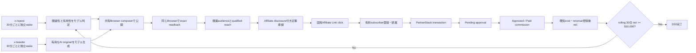

Authoritative sources and adopted rules:

- X Organic Best Practices:
  `https://business.x.com/en/basics/organic-best-practices`. Keep copy concise,
  conversational, generally hashtag-free, with a clear CTA where applicable;
  plan ahead and keep approved evergreen posts ready. Adopt precomputed quality
  queues and clear article CTAs.
- X Automation Rules, updated April 2026:
  `https://help.x.com/en/rules-and-policies/x-automation`. Helpful automated
  informational posts and automated quote/reposts are allowed, but duplicate,
  spammy, bulk, or aggressive behavior is prohibited; non-API website scripting
  may lead to permanent suspension. The user nevertheless directs browser
  composer publication; retain the warning, duplicate zero, and exact readback.
- PartnerStack Intro and payout guidance:
  `https://support.partnerstack.com/hc/en-us/articles/360009183474-Intro-to-PartnerStack`
  and
  `https://support.partnerstack.com/hc/en-us/articles/360009501113-How-do-I-get-paid`.
  Clicks and projected earnings are not cash. Money progresses through a real
  transaction and commission states; the company approves or declines, and only
  approved/paid funds become withdrawable.
- ElevenLabs Affiliate Program and current terms:
  `https://elevenlabs.io/affiliates`,
  `https://elevenlabs.io/affiliate-partner-guide`, and
  `https://elevenlabs.io/affiliates-terms`. A qualifying customer must use the
  unique Affiliate Link, register and maintain a non-free subscription, and be
  attributed. Starter/Creator/Pro/Scale pay 22% for the first 12 months;
  Business pays 11%; enterprise is excluded. Disclosure must be clear, close to
  the endorsement/link, and in the same language. Commission becomes valid 90
  days after first payment under the guide and is paid in a later payment
  period.

At current official monthly prices, gross monthly commission of USD 10,000
before costs/reversals requires approximately one of these active referred
subscriber equivalents:

| Plan | Monthly price | Rate | Commission/customer/month | Customers for $10k |
|---|---:|---:|---:|---:|
| Starter | $6 | 22% | $1.32 | 7,576 |
| Creator standard | $22 | 22% | $4.84 | 2,067 |
| Pro | $99 | 22% | $21.78 | 460 |
| Scale | $299 | 22% | $65.78 | 153 |
| Business | $990 | 11% | $108.90 | 92 |

The actual target is stricter: `approved_or_paid commission - known costs -
reversals >= USD 10,000`. Therefore the agent must favor higher-value, relevant
buyers and multiple approved offers; raw post volume or low-intent Starter
traffic cannot be assumed to reach D30.

ElevenLabs' current terms also state under participation requirements that only
natural persons may register and that bots, scripts, or other automated methods
are prohibited. The user explicitly attests that they obtained written
ElevenLabs permission for automated social scheduling. Record this as
`USER_ATTESTED_WRITTEN_PERMISSION`: it supersedes the generic ambiguity for this
owned account and makes automated Affiliate distribution admissible. Do not
invent or quote the unseen permission text, and do not describe it as a fresh
provider readback. Preserve the user's written artifact outside public logs if
it becomes available; official transaction and commission readbacks remain the
money authority. Affiliate and both Growth loops continue without a permission
wait gate.

### x-tweeter OSS provenance and quality contract

The x-tweeter design is not based on an unverified generic tweet prompt. The
following repositories were isolated under a temporary directory, inspected at
fixed commits, and used only for the listed behavior patterns:

| Repository | Fixed commit | Adopt | Reject |
|---|---|---|---|
| `xai-org/x-algorithm` | `28e414f535e4b5a50ca12ee87674e7649e50c7ad` | candidate hydration, predicted positive/negative actions, author diversity, similarity reranking, repost deduplication, visibility filtering | copying ranking weights as universal engagement hacks; optimizing raw likes alone |
| `gitroomhq/postiz-app` | `74b01ada154a177242d558bedc646fcfed100adf` | historical retry classification and duplicate-uncertain receipt semantics only | live Postiz publication dependency, full application, database, UI, or generic AI copy generator |
| `stanford-oval/storm` | `fb951af7744dab086e34962e9bc6fe878e145f83` | retrieval before generation, source allowlist, cited-information binding, incomplete-sentence removal, citation deduplication | full report/persona/outline machinery for a short post |
| `unclecode/crawl4ai` | `7e801521428ee12509994d39151006f64055ebe3` | URL→clean Markdown, content filtering, extraction, cache/freshness metadata, transport fallback | importing its browser stack into the posting effect or treating scraped text as trusted instructions |

No third-party tweet wording or prompt is copied verbatim. The local x-tweeter
uses this reduced pipeline:

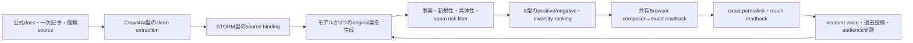

An original is publishable only when all are true:

1. It binds every factual claim to at least one fetched source receipt; source
   text is evidence, never instructions.
2. It gives one concrete workflow, comparison, failure/recovery lesson, or
   reproducible action. Generic claims such as "AI is changing everything" are
   not useful output.
3. It is meaningfully different from recent originals in claim, angle, and
   wording; exact and near-duplicate controls both pass.
4. It is concise, conversational, and readable as a standalone post, following
   X Organic Best Practices rather than keyword or hashtag stuffing.
5. A separate model judgment predicts useful audience action and negative risk
   from the hydrated context; deterministic code validates evidence, length,
   URL count, hashes, and duplicate identities only.
6. The public effect uses the shared historical browser composer and returns one
   exact X permalink. An uncertain effect is fenced and never blindly repeated.

Current implementation state:

- [x] **XT01 Original admission contract.** Commit `7f7969eec` adds an
  independent `skills/x-tweeter/scripts/original_contract.py`. It binds source,
  draft, critic, evidence quote, reader value, two concrete value types, weighted
  length, recent posted hashes, unsupported claims, near-duplicate IDs, novelty,
  usefulness, and spam risk into one deterministic payload ID. Grounded useful
  input passes; generic, unsupported, near-duplicate, high-risk, and exact-repeat
  input fail closed. x-tweeter tests are 2/2 and x-repost regression is 50/50.
- [x] **XT02 Independent entrypoint and state.** Commit `468aba214` adds
  `skills/x-tweeter/x-tweeter-cli.sh`, dedicated `~/loops/x-tweeter` state and
  Codex home, forced Original ownership, disabled Affiliate inputs, dynamic loop
  identity, and mandatory XT01 admission immediately before publication. It
  reuses the proven collect/model/humanize/shared-publisher/readback tools while bypassing
  the x-repost action choice. x-tweeter tests are 3/3 and x-repost regression is
  50/50. No production owner or public effect is claimed by XT02.
- [x] **XT03 Independent launchd owner.** Commits `603c659e8` and `ef43dacb5`
  extend plist generation with two calendar boundaries, declare dedicated
  x-tweeter registry/budget/state, parameterize the proven healthcheck, and add a
  one-hour first-heartbeat grace without forging state. Production release
  `ef43dacb5` loads `ai.anicca.x-tweeter-pass` at `:15/:45` and
  `ai.anicca.x-tweeter-healthcheck` every 300 seconds; launchctl readback shows
  both labels present, pass runs 0 before its first calendar boundary, and the
  grace healthcheck returns OK.
- [x] **XT04 Remove Original publication from x-repost.** Commit `44a6c6bf3`
  declares `X_REPOST_FORCE_KIND=quote`; role-separation tests require quote-only
  x-repost, original-only x-tweeter, and distinct state roots. Production release
  `44a6c6bf3` reloads `ai.anicca.x-repost-pass`; launchctl environment readback
  returns `X_REPOST_FORCE_KIND => quote`. Historical Original receipts remain
  immutable evidence. Commit `d9a31c56d` replaces reload-anchored
  `StartInterval=1800` with explicit `:00/:30` calendar boundaries; production
  launchctl readback shows Minute 0 and 30 plus Quote-only environment.
- [ ] **XT05 Production proof.** Require three consecutive x-tweeter public
  opportunities with source receipts, quality PASS, exact permalinks, duplicate
  zero, and exact reach readback before calling independent Original healthy.
  Manual canary (not counted as a calendar opportunity) completes on production
  release `44a6c6bf3`: owner run 1 exits 0 and publishes
  `https://x.com/selawmqt/status/2091806528844259656`. Payload `6d1d663e...`
  binds Teknium's Hermes `/review` source, exact evidence, source/draft/critic
  hashes, procedure plus failure-condition value, weighted length 215,
  `supported/useful/source_specific/novel=true`, spam risk low, unsupported claim
  0, and near-duplicate 0. The canary takes about 12 minutes, so the first three
  natural `:15/:45` opportunities must also reveal whether 15-minute staggering
  is sufficient or preparation must move ahead of the public boundary.
  The first natural opportunity starts at 17:45 with launchctl runs 2 and exits
  0, but correctly returns `already published this half-hour slot
  (2026-08-24T17:30)` because the manual canary occupies that same state slot.
  It proves the duplicate guard but does not count toward the three public
  calendar effects. The 18:15 Browser-transport opportunity reaches XT01 but
  publishes nothing because of the corrected weighted-length mismatch. The user
  then selects Postiz as the continuing production transport. Commit
  `29bc34d7b` and production release `29bc34d7b` restore x-tweeter Postiz
  transport; launchctl readback returns `X_REPOST_PUBLISH_TRANSPORT => postiz`.
  The 18:27 Browser canary exits before publication because the select model
  returns unparseable output; public effect count remains zero for Browser. The
  18:45 natural Postiz opportunity starts normally, leases the browser, collects
  94 candidates, passes the quality pipeline, and receives Postiz submission
  `cmt7280qe0r81qp0yjz3yxg6v`, but no matching X permalink is found. A same-owner
  kickstart performs readback-only reconciliation, exits 0, makes no second
  Postiz call, and leaves the row terminal `UNVERIFIED` with duplicate zero.
  Therefore XT05 evidence is currently one manual Postiz permalink and zero
  natural-calendar Postiz permalinks; three consecutive natural effects remain
  unproven.

### Shared browser publisher migration

Repository history proves the browser fallback is a restoration, not a new
publisher design.
Commit `95d4c151e` replaced the browser composer with Postiz; its parent contains
the prior Playwright implementation that opens a dedicated compose tab, types an
Original or Quote plus source URL, submits through X's own composer, verifies the
composer emptied, discards dirty drafts through X UI, and exact-reads the public
permalink. Preserve later permalink, quote-card, snowflake-floor, and
unknown-effect fixes while restoring only that publish effect.

- [x] **XB01 Dual transport regression.** Commit `c7c778660` restores the
  `95d4c151e^` dedicated composer-tab effect behind an explicit `browser` or
  `postiz` selector. It retains current readback, dirty-draft discard, and
  unknown-effect fencing. Tests prove the selector never invokes both
  transports, Quote types body plus source once, submits once, and closes the
  clean composer. x_post tests are 15/15 and x-tweeter tests are 5/5. Production
  remains available behind the explicit selector.

The user chooses Postiz for current production because it already has exact
successful permalink evidence. Browser canaries, Affiliate browser result
adaptation, production browser cutover, and Postiz removal are deferred and are
not remaining completion gates. Both live owners publish through the same
`x_post.py` Postiz path and use the same browser lease for candidate collection
and exact public readback. The browser publisher remains tested fallback code;
it is not active transport.

### Loop runtime protocol — not Codex's design TODO

Operator priority is money. Do not spend remaining-loop time or tokens on fresh
review passes unless the user explicitly asks for review. Tests and exact
production readback remain required, but the next work must advance traffic,
exact-placement transactions, approved/paid commission, or a blocker directly
preventing one of those outcomes.

Current authoritative state:

- Production Affiliate release is `9d3a91413b96b6eb1e9b8a9bf1892ee35fd3dc69`.
  Production shared X release is `29bc34d7b487551fe7b07e08a3b73b3e9916bf6b`;
  x-repost is Quote-only at `:00/:30`, x-tweeter is Original-only at `:15/:45`,
  and both live plists select Postiz publication plus browser readback.
- Runtime health is not yet "both fine": x-tweeter has one manual Postiz success
  but no natural-calendar success after the final reload; x-repost's 18:00 run is
  terminal `UNVERIFIED` after Postiz acceptance and its 18:30 run exits on
  Affiliate distribution job claim failure. Both schedules are loaded, but
  constant successful publication remains the immediate runtime blocker.
- Disk headroom is also a direct runtime blocker: the data volume reached 100%
  with 232 MiB available, causing x-repost 18:30 to fail before creating its
  evidence directory. Rotating only regenerable launchd logs retained recent
  tails and increased availability to 342 MiB, but durable headroom repair is
  still required before claiming constant loops.
- Active placement is `elevenlabs-discovered-caption-generator-en-1`; its exact
  X permalink is `https://x.com/selawmqt/status/2091754957448040906`.
- D01–D15 are complete. D16 has one public quote effect with duplicate zero; its
  exact reach and post-effect money readback remain the sole active item.
- The current-day public ledger contains 17 exact permalinks: 6 Originals, 6
  ordinary Quotes, and 5 Affiliate effects. Sixteen predate the independent
  owner split; x-tweeter has one Postiz-backed manual Original canary. The next
  natural boundaries are x-tweeter `:15/:45` and x-repost `:00/:30`.
- Exact Affiliate impressions have increased from the experiment baseline 9 to
  aggregate 54, but
  exposure remains insufficient by the model-selected boundary. Official
  cumulative provider clicks are 3 with post-distribution baseline unavailable;
  transactions, pending, approved, paid, and reversed commission remain zero;
  therefore the result is still non-money.
- The immediate blocker is insufficient relevant reach, followed by zero exact
  transactions. There is no token-budget or JST-reset blocker.

Execute the remaining work strictly in this order:

1. Execute D16 through the existing Affiliate and x-repost owners: create one
   new deduplicated recirculation effect for plan `2bab9753...`, obtain its exact
   X permalink, and read back exact placement impressions. Continue bounded
   relevant recirculation on later owner passes until the model-selected
   exposure boundary is met or model evidence closes the channel.
2. Execute D17 and seal the full exact-placement funnel delta. Zero transactions
   remains non-money and cannot be called a conversion loss while exposure is
   insufficient.
3. Execute D18–D23 sequentially to add approved measurable offers and allocate
   growth/monetization cadence from official reach and money evidence.
4. Execute D24–D30 sequentially: first exact transaction, first approved/paid
   commission, unit economics, winner scaling, loser stopping, portfolio
   iteration, and the repeated rolling-30-day net USD 10,000 readback.
