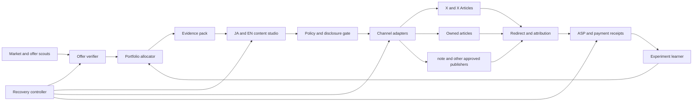
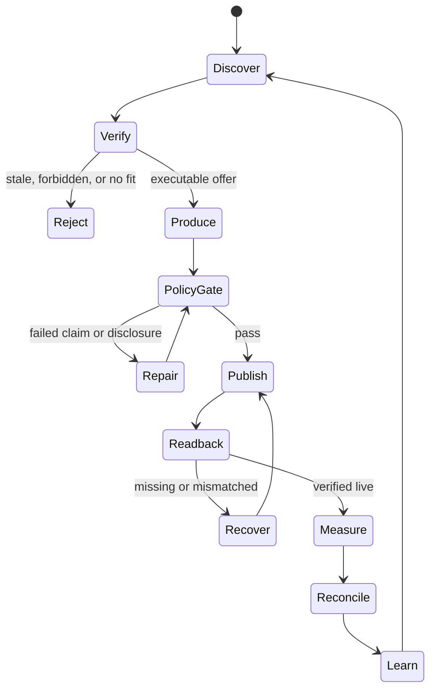

# Affiliate Agent — Revenue, Runtime, and Architecture SSOT

Last updated: 2026-08-05 JST

Implementation SSOT:

- Design and completion contract:
  `docs/superpowers/specs/2026-08-05-affiliate-agent-design.md`
- Atomic RED → GREEN → E2E plan:
  `docs/superpowers/plans/2026-08-05-affiliate-agent.md`

The ordered backlog in section 9 remains the product-level summary. The atomic
plan is authoritative for implementation order, exact files, tests, commits,
live verification, revenue gates, tenantization, and scale work.

## 0. Objective

Build one bilingual Affiliate Agent inside Life Manager's financial organ that
continuously discovers lawful offers, publishes useful evidence-led Japanese and
English content, attributes clicks and conversions, records external commission
receipts, repairs interrupted runs, and reallocates effort without daily human or
Codex operation.

The machine cannot guarantee $10,000 or $10,000,000 revenue. It guarantees
measurable attempts, honest receipts, bounded experiments, compliance gates, and
same-run recovery. Revenue targets are gates, not claims or forecasts.

Affiliate commission belongs only to this Agent's ledger. Writer Agent revenue
continues to mean direct payment for writing; shared research and editorial
techniques do not merge the ledgers.

## 1. Measured current state

| Surface | Observation | Runtime decision |
|---|---|---|
| Amazon Associates Japan | CDP reached the Amazon sign-in page; approval state is not observable | `AUTH_REQUIRED`, no offer may publish until the account and tag are read back |
| Rakuten Affiliate | CDP rendered the public home page with `ログイン`; approval state is not observable | `AUTH_REQUIRED`, keep the provider adapter dormant |
| Postiz | Public web UI is logged out, but the existing Marketing Engine has verified API publication receipts and 29 integrations | Reuse the API lane; do not depend on Web UI login |
| X | The CDP daily-driver can render individual public X posts; several search tabs are logged out | Use public readback and Postiz for the dedicated Anicca EN account; never infer account identity from an unauthenticated tab |
| clip loop | launchd is installed, last exit code is 0, and logs show production/posting through 2026-08-01 | Not banned. Reuse its publisher, renderer, attribution, and scoring contracts |
| recent clip runs | Contract reports `skipped`; older stderr shows Telegram DNS delivery failures | Diagnose scheduler/business gates separately from platform health |

## 2. Evidence-backed constraints

1. Every affiliate surface carries a clear disclosure adjacent to the link or
   recommendation. Amazon requires a prominent associate statement: “As an Amazon
   Associate I earn from qualifying purchases.”
   Source: [Amazon Associates Operating Agreement](https://affiliate-program.amazon.com/help/operating/agreement), section 5.
2. A post must help a reader decide; scaled thin or copied pages are rejected.
   Google defines scaled content abuse as generating many pages primarily to
   manipulate rankings rather than help users.
   Source: [Google Search spam policies](https://developers.google.com/search/docs/essentials/spam-policies).
3. The relationship must be obvious without making the reader hunt for it.
   Source: [FTC Disclosures 101](https://www.ftc.gov/business-guidance/resources/disclosures-101-social-media-influencers).
4. Rakuten explicitly supports product/service introductions on SNS and blogs,
   and exposes high-rate products and link-level reports.
   Source: [Rakuten Affiliate](https://affiliate.rakuten.co.jp/).
5. High-value Japanese CPA supply cannot be reduced to Amazon/Rakuten. A8.net
   supports sites, blogs, and SNS; afb reports roughly 17,000 promotions across
   18 categories and identifies medical beauty and related lead-gen offers as
   high-price/high-conversion areas.
   Sources: [A8.net](https://www.a8.net/), [afb](https://www.afi-b.com/).
6. Postiz exposes scheduling, articles, a public API, CLI, and MCP. It is a
   publisher adapter, not the Agent's brain or ledger.
   Source: [Postiz documentation](https://docs.postiz.com/).

Creator revenue screenshots and claims found on X are market signals only. They
never enter earnings or train a prompt as a winner without a matching external
receipt from this Agent.

## 3. Single recommended strategy

Start with one narrow buyer problem per language and a mixed offer portfolio:

- 70% effort: high-intent, high-payout CPA offers with verifiable terms and a
  genuine reader fit;
- 20% effort: Amazon/Rakuten products that support concrete comparisons,
  seasonal demand, or a demonstrated workflow;
- 10% effort: exploration of new providers, formats, and topics.

Do not start as a generic deal feed. Publish decision assets: comparisons,
cost calculators, migration guides, tested workflows, failure-mode guides, and
“who should not buy” sections. Each content unit maps one reader problem to one
primary offer and at most two honest alternatives.

## 4. Architecture

This is one durable Agent with specialized workers, not independent agents with
separate truth. PostgreSQL/SQLite state and append-only receipts are canonical;
prompts and browser sessions are replaceable executors.

### 4.1 Components

| Component | Contract |
|---|---|
| Provider adapters | Amazon JP/US, Rakuten, A8, afb, and later networks normalize offers, terms, commission events, and account health |
| Offer verifier | Re-reads landing page, price, availability, geo, payout, prohibited claims, allowed channels, disclosure, and expiry before publication |
| Portfolio allocator | Selects by expected **net** value: qualified intent × observed conversion × confirmed payout − refunds − content/compute cost − compliance risk |
| Evidence pack | Stores official facts, direct product evidence, alternatives, audience pain, counterclaims, and freshness TTL |
| Content studio | Produces independently localized JA/EN article, X thread/post, X Article, carousel, slideshow, or video from the same evidence |
| Policy gate | Fail-closed for missing disclosure, unverified claims, prohibited categories, self-dealing, stale price, broken link, or unregistered surface |
| Publisher adapters | Reuse Writer adapters and Marketing Engine/Postiz. Every publish requires provider receipt plus public readback |
| Attribution | Agent-owned redirect records click ID, content, placement, offer, language, and experiment before redirecting to the signed affiliate URL |
| Receipt reconciler | Joins ASP transaction/sub-ID reports to clicks. Unknown is never zero; pending, approved, reversed, and paid remain distinct |
| Learner | Promotes a tactic only from mature cohorts and deepest common signal: net commission → approved orders → qualified leads → clicks → engagement |
| Recovery controller | Same `run_id`, artifact hash, placement, and publication intent resume after failure; exponential retry obeys provider `Retry-After` |

### 4.2 Canonical records

`provider_account`, `offer`, `offer_snapshot`, `evidence_claim`, `content_unit`,
`placement`, `publish_intent`, `public_readback`, `click`, `conversion`,
`commission_receipt`, `experiment`, `policy_decision`, `wait_state`, and
`recovery_attempt` are the minimum entities.

Every commission receipt stores provider transaction ID, click/sub-ID when
available, currency, gross commission, reversal/refund, fees, net amount,
status, observed time, and immutable source hash. Earnings count only `paid` or
the explicitly reported `approved_not_paid` class; they are never combined.

## 5. Loop and state machine

Cadence:

- hourly: offer/price/link health, failed-intent resume, click ingest;
- daily: portfolio allocation, one JA and one EN primary content unit, derived
  distribution, ASP reconciliation;
- 24/72 hours and 7/30 days: cohort measurement and learning;
- weekly: provider mix, reversals, net margin, concentration, and policy audit.

Platform publication windows block only that placement. Every wait has a retry
time and durable owner; “wait for next schedule” is invalid.

## 6. Self-improvement without self-corruption

- Preserve at least 20% exploration and require at least ten mature comparable
  placements before winner/loser mutation, matching the existing Marketing
  Engine scoring contract.
- Change one causal variable per experiment: offer, hook, proof shape, CTA,
  format, channel, or publish time.
- Optimize net approved commission per 1,000 qualified impressions and net
  commission per content dollar. Never optimize raw post volume.
- A provider, offer, prompt, or account is quarantined after repeated policy,
  reversal, link-health, or reach failures; the Agent shifts to an independent
  provider/channel while diagnosing it.
- Prompt mutations are versioned and reversible. A winning claim cannot be
  invented by the learner; factual claims always come from a fresh evidence pack.

## 7. Reuse and OSS decision

Reuse from the existing system:

- Writer Agent: research acquisition, JA/EN localization, X/article publisher
  adapters, public readback, same-run resume, claim registry;
- Marketing Engine: Postiz lane, account isolation, slideshow/video/carousel
  renderers, attribution records, mature-cohort scoring, Telegram reporting;
- Life Manager financial ledgers: verified money semantics and reporting.

OSS inspected:

- [ricky-affiliate-agent](https://github.com/sujalmanpara/ricky-affiliate-agent)
  provides Amazon extraction, category creative generation, disclosure, and
  Postiz posting. Port only the adapter/prompt shapes after license verification;
  it lacks durable attribution and commission reconciliation.
- [amazon-affiliate-automation-pipeline](https://github.com/haramhussain110/amazon-affiliate-automation-pipeline)
  demonstrates bestseller → ASIN link → short video, but its posting is manual
  and it has no revenue learner.
- `ai-affiliate-generator` is a generic Next.js scaffold, and
  `Amazon-Affiliate-Automation-Tool` is primarily a SaaS promotion README.
  Neither is an implementation base.

No external prompt or source is copied unless its license permits reuse. Public
workflow ideas are reimplemented against our own contracts and evidence.

## 8. Revenue gates

| Gate | Verifiable completion |
|---|---|
| A-1 | Provider auth and ownership readback for one JA and one EN executable offer |
| A0 | One placement has public readback, a working redirect, and an ASP click/sub-ID receipt |
| A1 | First non-test approved commission joined end-to-end |
| A2 | Four revenue-positive weeks, positive net margin, zero manual execution |
| A3 | Three consecutive months at $10,000 gross affiliate commission with net, reversals, and attribution reported separately |
| A4 | Diversified scale: no provider, offer, or channel exceeds 40% of net commission |
| A5 | $10,000,000 cumulative or monthly target is defined explicitly and then met only by external receipts; never inferred from traffic |

Best/base/worst planning is computed only after 30 days of real funnel data.
Before that, revenue is `unknown`, not a fabricated conversion forecast.

## 9. Ordered implementation backlog

1. Create the Agent schema and append-only Affiliate ledger; add invariants for
   unknown, pending, approved, reversed, and paid money.
2. Implement provider account/auth readback and offer adapters; begin with the
   first actually authenticated JA and EN providers rather than hard-coding a name.
3. Implement the signed redirect/sub-ID service and verify click → provider
   report joining before producing content at scale.
4. Extract Writer research/localization/publication contracts behind shared
   interfaces without changing the Writer revenue ledger.
5. Add Affiliate manifests to the Marketing Engine for X/Postiz and owned
   articles; keep clip/slideshow/video renderers as format adapters.
6. Add the fail-closed policy/disclosure gate and official-source freshness TTL.
7. Ship one JA and one EN end-to-end placement, reconcile a real click, and then
   start daily autonomous operation.
8. Enable mature-cohort learning only after ten comparable placements; promote
   net commission as the deepest reward when available.
9. Add provider/channel quarantine, same-run recovery, health reporting, and
   launchd ownership.
10. Scale content and providers only after the first approved commission and
    positive unit economics.

## 10. Rejected designs

- **Generic high-volume AI SEO farm:** fastest way to produce pages, but violates
  the reader-value and search-quality constraints and teaches from vanity volume.
- **Amazon/Rakuten-only:** simplest auth model, but low-price physical goods alone
  create concentration and payout ceilings.
- **X-only direct links:** cheap distribution, but weak ownership, fragile reach,
  poor long-form trust, and incomplete attribution.
- **Separate autonomous agents with separate ledgers:** parallel-looking but
  produces duplicate offers, conflicting claims, and double-counted revenue.

The strongest rejected alternative is the Amazon/Rakuten deal-feed model: it
has abundant inventory and easy creative generation. It loses because a feed
optimizes output count instead of reader intent and net commission, and it
cannot safely support the $10,000 gate without extreme traffic.

The most likely way this recommendation is wrong is that an authenticated
provider reveals an unusually strong, durable, low-reversal physical-product
program. The allocator can discover that from receipts and increase its share
without changing the architecture.
