# Affiliate Agent — Revenue, Runtime, and Architecture SSOT

Last updated: 2026-08-16 JST

Implementation SSOT:

- Design and completion contract:
  `docs/superpowers/specs/2026-08-05-affiliate-agent-design.md`
- Atomic RED → GREEN → E2E plan:
  `docs/superpowers/plans/2026-08-05-affiliate-agent.md`

The ordered backlog in section 9 remains the product-level summary. The atomic
plan is authoritative for implementation order, exact files, tests, commits,
live verification, revenue gates, tenantization, and scale work.

## 0. Objective

Anicca is the company; Life Manager is the product, autonomous agent, and
canonical repository. Life Manager manages physical, mental, and financial
health. Affiliate Agent is one financial-health unit. It improves verified net
position through external affiliate receipts while preserving fees, reversals,
cost, concentration, cash timing, and policy risk. It never equates content,
clicks, estimates, pending commission, or GMV with earned money.

Canonical ownership is the Life Manager repository at `skills/affiliate/`.
The local proof phase has no Affiliate runtime, redirect, secret, or ledger in
`apps/api/` or Railway. The old
`/Users/anicca/profitable-claude/skills/affiliate` tree is migration evidence,
not a production home. Mutable state lives under
`${LIFE_MANAGER_STATE_HOME:-~/.local/state/life-manager}/affiliate/`; credentials,
sessions, provider exports, and ledgers never enter Git.

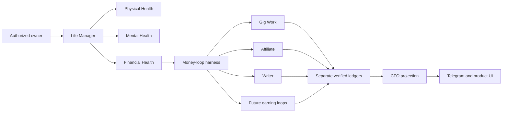

Build one Affiliate Agent inside Life Manager's financial organ that launches in
English first, then operates isolated Japanese and admitted additional-language
market pods. Spanish is the first expansion candidate after English and Japanese;
it is not admitted merely because it has many speakers. The Agent
continuously discovers lawful offers, publishes useful evidence-led content,
attributes clicks and conversions, records external commission
receipts, repairs interrupted runs, and reallocates effort without daily human or
Codex operation.

No two locale pods share one social identity, browser profile, affiliate link,
publication history, attribution cohort, experiment, or operating budget.
English is first. The verified English X
identity is now `sela` / `@selawmqt`, logged in through the isolated
`capafy-mkt-provision` CloakBrowser profile; legacy `@aniccaen` is not an active
X username. Postiz and every external publishing API are out of scope by product
decision. The Agent itself must provision an isolated browser profile, recover or
establish the authorized user account, configure the profile, publish through the
rendered website, and verify the public result. A dedicated Japanese canary is
admitted only after English Gate E0 and uses a different browser profile. Spanish
and every later locale must pass the Locale Admission Gate in section 8 rather
than being created as blind translations.

“End to end” is proved first on the current macOS host. The first graduation
condition is not portability: it is one unattended local run covering authorized
account recovery, affiliate application/approval polling, research, content,
browser publication, acquisition, click attribution, provider reconciliation,
Telegram reporting, recovery, learning, and a real external commission receipt.
After this local Agent earns with positive unit economics, its proven runtime is
packaged for a scratch computer. Installation, encrypted authority inventory,
browser/profile provisioning, and minimal operator credential intake remain Agent
states in that later packaging phase; they are not allowed to delay the local
money loop.

### 0.1 Delivery order: Local → OSS → Cloud

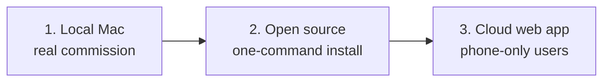

The local Mac is the economic laboratory and first production runtime. Code may
be public throughout development, but the project MUST NOT market the loop as a
working money printer until Gate E1 has an external approved commission receipt.
The OSS graduation gate is one scratch-Mac install reproducing the proven local
flow without copying mutable state. The cloud/web-app phase starts only after A2:
four revenue-positive weeks, positive net margin, and zero manual execution.

Cloud is a deployment target for the same state machine, not a second design.
It replaces local launchd with a tenant scheduler and local browser profiles with
isolated remote browser workers while preserving the same provider adapters,
action receipts, money states, policy gate, learner, and Telegram/product report.

The machine cannot guarantee $10,000, $10,000,000, or $100,000,000 revenue. It guarantees
measurable attempts, honest receipts, bounded experiments, compliance gates, and
same-run recovery. Revenue targets are gates, not claims or forecasts.

Affiliate commission belongs only to this Agent's ledger. Writer Agent revenue
continues to mean direct payment for writing; shared research and editorial
techniques do not merge the ledgers.

## 1. Measured current state

| Surface | Observation | Runtime decision |
|---|---|---|
| Amazon Associates Japan | Browser confirmed an existing Amazon.co.jp account for the private SSOT application email. No password exists in Chrome or macOS Keychain; password recovery sent an OTP to the masked matching mailbox, but no currently authenticated Gmail or macOS Mail authority could read it. No Associates application was submitted | `AUTH_RECOVERY_OTP_REQUIRED`; resume the same recovery intent only after authorized mail access is available, then inspect existing Associates state before creating any application |
| Kit | A real PartnerStack application was submitted with truthful Anicca, website, `@selawmqt`, audience-size, channel, country, and region fields. Kit's authenticated application-email reply says it decided not to move forward. It lists four possible fit issues but does not identify one applicant-specific cause: creator-economy audience fit, prohibited promotion methods, inaccessible/insufficient website content, or insufficient promotion detail | `APPLICATION_REJECTED`; do not count approval or reapply unchanged. Reconsider only after an accessible content body, creator-helping-creator audience evidence, and a detailed organic promotion plan are live; coupon, cashback, and paid advertising remain excluded |
| HubSpot / Impact | The official HubSpot flow created a real Impact account, verified the authorized Japanese mobile number and `aniccaai.com`, and rendered the one-shot HubSpot application `In Review`. The replacement credential is stored in the Git-external mode-0600 Markdown and Keychain mirror. Dedicated Affiliate CDP `9327` completed a fresh password reset, two-stage email/password sign-in, device verification, and authenticated `/secure/member/home/mview.ihtml` readback. A fresh semantic inspection still matches `HubSpot, Inc. application`, `In Review`, and `You will be notified once there is a response.` | `APPLICATION_PENDING`; do not reset, log in, or resubmit again while the authenticated session remains healthy. Poll the existing application with dedupe. No HubSpot tracking link exists until approval |
| Notion / PartnerStack | The official public page still advertises the program, but the live PartnerStack application renders that Notion stopped accepting new affiliates and that all applications are auto-declined for the time being | `PROGRAM_PAUSED`; do not submit a guaranteed rejection. Poll for a real admission-state change before applying |
| ElevenLabs | The official affiliate entry reached ElevenLabs signup. The acceptance email instructs the approved affiliate to accept Terms, configure a payment provider, and share the referral link; it also grants Resources, Messages, and Reporting access. The authenticated PartnerStack UI proves accepted Terms, an active Eleven Labs Inc. partnership, and an executable default link. An anonymous browser followed that link to `elevenlabs.io` with PartnerStack referral parameters and cookies. The current Commissions page explicitly renders tax registration required, a tax-information CTA for withdrawals, and a choice of direct deposit, PayPal, or Stripe | `ACTIVE_LINK_VERIFIED + ACCEPTED + EARNING_ENABLED`; the funnel can run now. Payout is `PAYOUT_BLOCKED_BY_TAX_SETUP` and the payment provider is `SELECTION_REQUIRED`. Retain the exact link only in private runtime state and prefer a product-specific link when the article concerns one product |
| Rakuten Affiliate | CDP rendered the public home page with `ログイン`; approval state is not observable | `AUTH_REQUIRED`, keep the provider adapter dormant |
| Postiz | A Japanese integration exists, but the product decision excludes Postiz | Do not read, connect, or use it in the Agent; this is not a blocker |
| X identity | Dedicated Affiliate CDP `9326` and authenticated `whoami` prove `@selawmqt`: 128 posts, 27 following, 0 followers. The semantic profile command changed the public name to `sela | AI Tools`, added an English practical-AI bio with affiliate-link disclosure, set `aniccaai.com`, and a second apply returned `changed=false + matches_config=true`. X rejected legacy `@aniccaen` as inactive | Preserve mixed historical posts, keep all future posts English-only, and never use Japanese `@aniccaxxx` or shared daily-driver `@diceai0`; the first post still requires a duplicate-post fence and public readback |
| X publication | The first Affiliate X placement is `LIVE` at `https://x.com/selawmqt/status/2088728168534597644`. The canonical skill verifies `@selawmqt:9326`, requires disclosure plus one `LIVE` owned article URL, writes an effect-possible fence before the click, resolves X's `t.co` anchor through HTTP HEAD to the exact owned URL, and requires status-page readback before `LIVE`. X's April 2026 rules warn that scripted website automation may permanently suspend an account | The initial real publish created one new timeline row but failed closed because X replaced the canonical URL with a multiline shortened display, so raw input-text equality could not pass. Read-only inspection found exactly one disclosed new post and its `t.co` anchor resolved to the exact article URL. Release `90025a3551d75aa1110af63ead8dbd9d93eedc77` then reconciled the existing effect without clicking Publish again and wrote `X_POST_PUBLIC_READBACK`. Keep action caps and immediate account quarantine |
| X Article EN | Writer Agent has a real public X Article and a production adapter based on `wshuyi/x-article-publisher-skill`, but Affiliate `@selawmqt:9326` exposes no Article navigation. Direct read-only access to the same canonical `/compose/articles` route used by Writer returned `Page not found`, with zero textarea/contenteditable controls | `CHANNEL_UNAVAILABLE`; do not parameterize or copy the Writer adapter until this account exposes the editor. Continue owned-site English articles plus normal disclosed X posts, which are both live-proven |
| English source scout | The canonical `sources capture --plan elevenlabs-en` command live-captured six immutable local artifacts: five ElevenLabs official web pages through CRWL and the official `elevenlabs/elevenlabs-python` repository through `gh` | Each receipt stores adapter, locator, locale, evidence class, license, body SHA-256, parser version, observed time, and expiry. The first live run returned `captured=6 + new=6`; after allowlisting stable GitHub fields, an immediate repeat returned `captured=6 + new=0`. Exact hashes are in Git-external `source-captures.jsonl`. CRWL `-q` failed because no LLM provider is configured, so the admitted route deliberately uses deterministic `md-fit` without an LLM. Authenticated X research readback is still missing |
| ElevenAgents next-placement evidence | PartnerStack's authenticated Resources page lists pinned ElevenAPI, ElevenAgents, and ElevenCreative product guides with SEO/swipe copy. Rather than building a proprietary PDF downloader, the Agent selected ElevenAgents as the next buyer-intent product. Installed release `6f377563c` then captured its public official overview, quickstart, integration overview, and cost help page through CRWL as four immutable artifacts | Versioned plan `elevenagents-en` captured `4/4` sources with four new SHA-256-bound receipts. The 30-day product-doc artifacts and seven-day price artifact support a practical customer-support-agent evaluation article while keeping partner Resources as a selection signal, not copied article text |
| First English content artifact | The versioned `elevenlabs-en-v1` template binds every price, rights, limitation, and case-study claim to five fresh official source captures. `affiliate content build` requires those support markers and the private executable link, then writes a mode-0600 Git-external artifact without printing its body or link. `content policy` verifies the artifact hash, exact fresh source hashes, disclosure before CTA, one owned HTTPS tracking link, and forbidden guarantees; `owned publish` independently requires the matching `PASS` receipt | Live build produced slug `elevenlabs-plans-for-solo-creators` and content SHA-256 `03089e860af9ed1e35a4656ebc045dd28d00dacc243739fe10b4f46f8e4822e9`. The first real policy attempt failed closed because a broad phrase matcher misclassified an explicit denial of guaranteed earnings. Narrowing the forbidden-claim set to affirmative guarantee phrases made the same artifact pass all five checks. Production commit `a333cf55044dbddf17f906150a173e1ee000aea1` passed Actions run `31906958939`; the installed publisher and CRWL independently read back the title, disclosure, buying checklist, evidence-refresh marker, and exact tracking link. The durable receipt is `LIVE` with rendered SHA-256 `3503c6bede5e059128be49acc90236b22b8014f46b88ca568adc527c09d64b8a`. No provider click or revenue is inferred |
| English foundation publication | `content build-foundation` produces a source-bound, explicitly non-affiliate evaluation guide with no tracking link. `owned publish` accepts only its hash-valid `READY_FOR_PUBLICATION` artifact, writes one deterministic `apps/landing/data/research/<slug>.json`, refuses unrelated dirt or index entries, commits/pushes that exact target, and records public HTML hash only after title plus three marker readback | Live local build returned SHA-256 `eac5ea080817823e3534a14f6b72e16621139dc109aac93095eb8e9ac7c079f0`. Production commit `fd9489bee59946bddc06bb127b2bfca0694d7e61` deployed through GitHub Actions run `31906437192`; the production smoke passed and `https://aniccaai.com/blog/how-to-test-ai-voice-tools-before-you-pay` independently returned the title, no-affiliate disclosure, evaluation marker, and purchase-decision marker. The durable receipt is `LIVE` with rendered SHA-256 `f7055977871bb405af0c491d29c74d41d591f87b95a551425dc5beece07d0039` |
| clip loop | launchd is installed, last exit code is 0, and logs show production/posting through 2026-08-01 | Not banned. Reuse its publisher, renderer, attribution, and scoring contracts |
| recent clip runs | Contract reports `skipped`; older stderr shows Telegram DNS delivery failures | Diagnose scheduler/business gates separately from platform health |

### 1.1 Implementation progress

| Task | State | Receipt |
|---|---|---|
| R0 canonical convergence | Complete; historical disabled release was `615206fd98fb555b0aada794454dd63e1cc95260` | Canonical skill and installer pass twice at 3/3; archived verifier 10/10; commission regression 6/6; manifests cover ten legacy files plus one archived parser dependency; remote SHA, immutable release bytes, valid JSON receipt, `current` symlink, untouched legacy state, and zero launchd owners all pass |
| F0 current-Mac bootstrap | Runtime and browser capability GREEN; Keychain admission corrected; historical disabled release was `e3de264f4a9b1c5d34b49a913ff66ad6202dd318`; real provider admission remains open | CloakBrowser Chromium `145.0.7632.109` and pinned PBS CPython `3.14.7+20260814` are live-receipted. The original vault probe proved item existence only and incorrectly accepted an empty value. Admission now requires successful Keychain read plus non-empty bytes, without logging value, digest, or length. Provider refs are versioned in the program registry; Impact is `MISSING_OR_EMPTY`, so browser login remains disabled until official recovery and fresh-tab proof |
| P0/F1 legacy migration | Complete | Runtime commits `84cac1e7`, `3494f8ff`, `5b1927dc`; migration 8/8, legacy verification 10/10, commission regression 6/6; remote `feature/affiliate-agent-runtime` at `5b1927dc` |
| Legacy wrapper cutover | Blocked by design until Task 11 | F1 receipts `run.sh` and `affiliate-cli.sh` path/SHA-256/size while preserving their bytes; Task 11 must verify these receipts before scheduling the new orchestrator |
| Mac-local runtime | Four Affiliate-owned launchd jobs isolate the loop, ElevenLabs browser, X browser, and Impact browser. Release `cc03800c3c83b9cc777ff2cc6df0d41d5db1dabf` is installed. It contains the live-proven Impact self-heal and PartnerStack payout-readiness capture | Impact replay returned `submitted=false` and the original login job is `VERIFIED`; no reset, duplicate application, or new job occurred. PartnerStack capture reads both payout summary and row detail. Process-boundary resume, selector-drift repair, X publish reconciliation, provider auth recovery, and payout blocker classification are live-proven. Attributable click, commission, and paid payout remain open |
| ElevenLabs isolated auth | Dedicated Affiliate CDP `9324` is authenticated from the Git-external private SSOT | Gmail readback identified the account used by the real reset and new-login notices; the private Login field, Password/Keychain mirror, and mode `0600` were reconciled without committing values. The semantic CDP resume then rendered `SIGN_IN_REQUIRED → AUTHENTICATED` at `/app/home`, with one successful submit and a sanitized receipt. No commission is inferred from login |
| ElevenLabs PartnerStack metrics | The Agent created and email-verified the PartnerStack account/team, confirmed the Eleven Labs Inc. partnership, accepted program terms, and reached Overview, Commission Report, Commissions summary, and Payouts. Installed release `cc03800c3` live-read the summary only after `Total available funds` rendered, then returned `PAYOUT_BLOCKED_BY_TAX_SETUP`, `tax_information_state=REQUIRED`, and `payment_provider_state=SELECTION_REQUIRED` | The current aggregate remains one baseline click and zero post-baseline clicks, signups, or commission rows. The latest sanitized report artifact SHA-256 is `b101e1e515d81241c9f16bd41b8bc562b5a41c8e97b76c5afa784178b21fc39f`; it binds 23 commission fields, six payout fields, zero rows, and `NO_LIVE_ROWS`. Earning can continue, but withdrawal cannot be called ready until truthful tax registration and one provider are completed. Approved/reversed remain unknown rather than inferred zero |
| ElevenAgents product link | The official PartnerStack destination selector exposed `https://elevenlabs.io/agents`. The Agent supplied the required title, internal description, destination, and custom slug, created exactly one product-specific link, and read it back from the rendered Links page | Installed release `6623f2e02` accepted the generated HTTPS URL only through stdin and stored it as `ElevenAgents affiliate link` in the mode-0600 Git-external private Markdown. Command output, receipts, SSOT, and Git contain state only, not the referral URL |
| Cloud rollback | Complete | Staging runs rollback commit `bb31c68ada4e041ef1c0e745d7933a94f683a029`; the mistaken deployment is `REMOVED`; both `AFFILIATE_*` variables are absent; the former Affiliate route returns HTTP `404` |

### 1.2 Truth checkpoint: implemented versus still hypothetical

This table prevents tests, fixtures, screenshots, or plans from being reported as
live autonomous operation.

| Surface | Current truth | What is not yet proven |
|---|---|---|
| Runtime | Immutable local release `50d45beca58aac4dc2cf077d7ec1eb5f216e3c2f` is current. All six isolated Affiliate launchd owners are loaded; real money wake `15` and composition run `9` have last exit `0`. The ten-minute money loop owns bounded provider recovery/reconciliation, exact placement-link acquisition, HubSpot/Impact polling, generic policy-PASS owned/X publication, canonical DEV/Substack syndication, hourly external metrics capture, per-wake placement economics, economics-bound campaign decisions, natural-language reporting, receipts, and Telegram. The daily source owner owns official-sitemap opportunity discovery plus official-source refresh; the composition owner resumes existing due stages before new inbox work and consumes at most one credential-free due stage per wake | Ten comparable placements and provider/channel diversification remain open |
| F1 migration | Implemented, reviewed, pushed, and re-run from final HEAD | It does not publish, browse, attribute, or earn |
| F2 Agent brain | Commit `d9ad4acd7cb0474cf1a825a94cfb49e7847da22e` is pushed; root replay on 2026-08-06 passed focused 16/16, Python 3.9 compile/shell syntax, and 30/30 related regressions | Full-suite collection is blocked by legacy `test_affiliate_verify.py` import-time `sys.exit()`; fresh review and live-provider execution remain open, so F2 stays open |
| Provider auth | ElevenLabs is `ACTIVE_LINK_VERIFIED`, earning-enabled, and `AUTHENTICATED`. HubSpot/Impact's stored credential resumed the isolated browser from `SIGN_IN_REQUIRED`; exact rendered markers classify its existing application as `APPLICATION_PENDING / In Review`. The installed money owner now polls it without resubmission while ElevenLabs remains healthy. No Google login, six-digit-code submission, phone call, or login-support Telegram effect exists in the Affiliate receipts. Kit is rejected; other providers remain non-executable | ElevenLabs is the only currently executable earning offer. HubSpot has no executable link until official approval and link readback. No commission, approved transaction, reversal, or payout is claimed |
| Publication | Seven owned Affiliate articles are `LIVE`; six matching disclosed `@selawmqt` X posts are `LIVE`. The latest distributed campaign is also on canonical DEV and at `https://aniccabuddha.substack.com/p/elevenlabs-audio-to-text-a-practical`. Anonymous Substack readback returns the full body, disclosure, and one tracking link; external job `3a7c7b28…78c2` is `VERIFIED`, Telegram message `20934` reports it, and replay is `COOLDOWN / NO_PENDING / exit 0`. A lost-target recovery defect created one additional title-only Substack duplicate at `https://aniccabuddha.substack.com/p/elevenlabs-audio-to-text-a-practical-ac1`; recurrence is fenced and the accepted operating decision is no cleanup action | Post-baseline provider click readback and every Japanese placement remain unproven |
| Attribution | Public owned/X placement receipts and direct provider-link resolution are implemented | No post-baseline provider-side click or commission receipt exists yet; local clicks and estimates never count as money |
| Revenue | No new Affiliate revenue receipt | Legacy watermark, fixtures, clicks, estimates, and creator screenshots do not count |
| Telegram | Affiliate append-before-send, stable event dedupe, provider `messageId`, `SELF_HEALED`, `BLOCKED`, real `PLACEMENT_LIVE`, and one real-data natural-language daily summary are live-proven. The daily summary is bound to provider message ID `21046`; same-day real replay returns `NO_PENDING` without growing the sent ledger | `CLICK_DELTA` and commission events remain bound to their real external transitions |
| Autonomous operation | launchd ownership, isolated browsers, official-sitemap discovery/refresh, source-hash-bound composition, bounded Terra-high composition, same-ID recovery, policy, exact placement-link acquisition, publication/distribution, acquisition/revenue observation, placement economics, economics-bound one-variable allocation, typed observed-failure repair, receipts, and Telegram are live. Release `50d45beca` reconciled one stale Impact login job from fresh authenticated readback and replayed without mutation | Actual billed/tool/channel cash receipts, ten comparable placements, a post-baseline click, and positive money evidence remain absent. The loop has not yet earned a commission |

### 1.2.0 Audited executable boundary

The installed ownership graph has six launchd labels: three persistent browser
owners plus separate source-refresh, composition, and money owners.
`local_loop.wake()` owns the money wake lock, private-link check, CDP `9324`
health, ElevenLabs
observe/poll/recovery, receipt-driven configured campaign advancement, hourly
`revenue observe → capture → reconcile`, event receipts, and Telegram flush.
Release `feccf6c46` live-proved official-sitemap discovery and the complete fifth
campaign through public owned/X readback plus Telegram. The next wake returned
`ALREADY_LIVE / NO_PENDING` while preserving landing commit `aece80a1a`, the X
URL, the discovered-plan hash, and the 22-row source ledger.

Program application and executable-link acquisition are not yet scheduled. The
separate `ai.anicca.affiliate-source-refresh` owner discovers at most one unused
official ElevenLabs product family per UTC day, stores the plan under mutable
state, refreshes the union of versioned and discovered plans, and writes one
aggregate receipt without reading credentials, CDP, or the money ledger. The
separate `ai.anicca.affiliate-composition` owner consumes one due source-bound
stage per wake, uses a sanitized allowlisted input bundle and its own lock, and
now creates both generic handoff and generic policy receipts. It has no browser,
credential, publication, or money authority. Runtime model work MUST NOT be
reintroduced inside the ten-minute money owner. The next boundary is deterministic
consumption of a generic policy-PASS handoff by the existing fenced publisher.

The target architecture copy+tweaks the live Coconala immutable-release pattern:
one explicit owner per lane, the shared schema-validating agent runner, separate
browser ownership/fencing, append-only action trajectories, bounded healer,
durable Telegram outbox, and official settlement receipt hierarchy. Affiliate
uses its own prompts, connector, profiles, ports, ledgers, event keys, and money
schema; it never imports Coconala DOM selectors, sessions, locks, or credentials.

### 1.2.1 Active execution contract: provider review is never passive wait

A pending provider review blocks only that provider's executable tracking link.
It does not block the Affiliate Agent project or the rest of the English funnel.
While HubSpot/Impact remains `APPLICATION_PENDING`, the Agent MUST continue all
independent work below:

1. poll the authenticated Impact page and authorized Gmail for a state change,
   preserving one deterministic transition ID and never resubmitting the same
   application;
2. discover every current English B2B SaaS and creator/productivity program,
   read its official terms, inspect official CLI/API and licensed OSS support,
   and create a current eligibility receipt;
3. apply immediately to every program that passes the eligibility gate; do not
   bulk-apply to programs whose audience, traffic minimum, region, channel,
   website-content, payout, or policy requirements are not yet satisfied;
4. make `aniccaai.com` an accessible, content-rich owned acquisition surface and
   publish useful non-affiliate English foundation content before links exist;
5. rebrand and verify `@selawmqt` as the English identity, add the required
   disclosure, and build relevant organic distribution without claiming results;
6. implement direct provider-link placement receipts, the append-only money
   ledger, policy gate, public readback, Telegram outbox, browser recovery, and
   launchd packaging on the operator's Mac;
7. prepare provider-specific placements as unpublished intents, then attach only
   an approved, owned, executable tracking link after an E-1 receipt exists.

The Agent MUST NOT report “waiting for approval” as the run result while any item
above is executable. A wait receipt is valid only for the provider-specific
application work item and MUST name the external reason, next poll time, durable
owner, and independent work selected for the same wake.

### 1.2.2 Current hard blockers, non-blockers, and honest struggles

| Condition | Class | Consequence and required action |
|---|---|---|
| HubSpot/Impact has not approved or rejected the application | External blocker for HubSpot link only | Continue polling with dedupe; execute the rest of the funnel and apply to other eligible programs |
| ElevenLabs has executable links plus six disclosed owned/X placements and one canonical DEV syndication, but no post-baseline click or provider transaction | Acquisition and revenue blocker, not authority blocker | Continue truthful distribution and measure real provider clicks and transactions without counting clicks as money |
| Kit rejected the submitted application without naming one applicant-specific cause | Closed negative receipt | Do not reapply unchanged; first make audience fit, accessible content, and organic promotion evidence materially stronger |
| `@selawmqt` has zero followers and mixed historical language | Acquisition weakness, not implementation blocker | Rebrand future output to English, preserve history, publish useful material, and measure qualified reach honestly |
| The owned site does not yet present a deep affiliate-relevant English content body | Approval and conversion weakness | Publish evidence-led B2B SaaS/creator workflows and comparison foundations before another fit-sensitive application |
| `agent-browser 0.27.0` hung against the live multi-tab CloakBrowser | Tool-path failure, not browser incapability | Use the live-proven raw-CDP path now; retain the failure receipt and replace only when a candidate passes the same live postcondition |
| Provider signup/login/OTP/contract/application writes are not yet fully exposed by `affiliate provider` | Product implementation gap | Turn every successful operator action into an idempotent semantic playbook and CLI state |
| Provider reconciliation and Affiliate money ledger are incomplete | Revenue-truth implementation gap | The local placement receipt is exact-once, but no public readback or provider money receipt exists; no click or estimate may be reported as commission |
| No first-party CTR, conversion, approval, reversal, or payout cohort exists | Learning uncertainty | Do not fabricate best/base/worst revenue forecasts; collect the first live 30-day cohort |
| Scratch-Mac dependency installation is incomplete | Packaging gap, not current-Mac money blocker | Finish only after the current Mac closes a positive-unit-economics local slice |

The most difficult part is not text generation. It is obtaining lawful provider
authority, preserving identity across browser recovery, proving every external
side effect exactly once, and joining a real provider transaction back to the
exact public placement without inventing revenue. Those are the harness defects
the implementation must close.

### 1.2.3 Desktop continuity and durable ownership

During an active local Codex execution, the operator MUST NOT force-quit the
ChatGPT/Codex desktop application because active local tool execution is not
guaranteed to survive process termination. Closing or minimizing a window is
allowed. Git commits, pushed branches, this SSOT, and runtime receipts are the
durable recovery boundary; they preserve progress but do not guarantee that an
in-flight command continues.

All six Affiliate launchd owners are installed and live-proven. Source refresh,
bounded composition, generic policy, configured publication, provider recovery,
revenue polling, and limited Telegram reporting run without the desktop as their
owner. Open-ended discovery, generic policy-PASS publication wiring, broad
self-healing, and cohort allocation remain product gates. The desktop is already
an observation/steering surface for installed stages, not their process owner.

### 1.2.4 Credential-first provider preflight

Before opening any provider signup, the Agent MUST execute this order and
receipt status metadata only, never a secret value:

1. inventory the Git-external mode-0600
   `~/.config/anicca/affiliate-credentials.md` for an existing login,
   verification state, application state, and tracking link;
2. inspect authorized browser profiles for an already authenticated account and
   read back the provider identity;
3. when a local credential exists, attempt one isolated fresh login from the MD;
   Keychain is only an optional mirror and never the sole recovery source;
4. when the account exists but login fails, use official recovery and write the
   replacement to the private MD before reset submission;
5. create a new account only after credential inventory and provider account
   discovery both prove that no reusable account exists;
6. when an active affiliate account or executable link exists, reuse and verify
   it instead of submitting another application.

This preflight explains the current provider routing. Impact has an existing
application but broken recovery and an open provider ticket. Systeme.io has an
existing credential but a visible reCAPTCHA checkpoint. ElevenLabs had an
existing account and was the shortest unblocked route to the first executable
English offer. Its recovery closed E-1; it was not chosen because existing
credentials were ignored or because ElevenLabs is a mandatory final niche.

### 1.3 R0 legacy inventory

The legacy source is clean within its own `skills/affiliate` path and contains
ten tracked files totaling 40,572 bytes. Its two pure suites pass 16/16 and four
shell entrypoints pass syntax checks. It is a Japanese Instagram carousel →
Amazon-account-total workflow, not the planned English/X Affiliate Agent.

Literal copying cannot produce a working loop. The fixed-path Instagram poster,
slideshow composer, Amazon report reader, and affiliate ledger recorder are
absent or moved, while the source also hardcodes one macOS user, Homebrew paths,
port 9225, and a Japanese browser profile. These gaps are recorded as
`UNAVAILABLE`, never silently replaced or reported as parity.

At the R0 inventory checkpoint, no Affiliate launchd service, tmux session,
process, or open file was live, and two old launchd plists were disabled
artifacts. R0 therefore
preserves the ten files byte-for-byte under canonical `skills/affiliate/legacy`,
receipts the archived verifier parser separately in `DEPENDENCIES.sha256`, and
adds a relocatable but non-executing skill shell. The focused installer test
proves immutable install, idempotency, stale-symlink repair, valid JSON receipt,
launchd non-interference, and fail-closed detection of a modified release. That
historical disabled release was installed from pushed SHA
`615206fd98fb555b0aada794454dd63e1cc95260` under
`~/.local/share/life-manager/affiliate/releases/`; its private ownership receipt
is under `~/.local/state/life-manager/affiliate/`. The later local release and
launchd state are reported in section 1.1; publisher and money parity remain open.

### 1.4 No-dry-run equivalence rule

| Evidence | It may prove | It never proves |
|---|---|---|
| Unit/fixture test | Local contract behavior | Live login, publication, click, conversion, or revenue |
| CloakBrowser login page | Page reachability and observed auth state | Affiliate approval or account ownership |
| Fake browser/fixture response | Adapter parsing | A public X/article placement |
| Local placement/link check | Placement schema and provider-link resolution | Organic buyer intent or commission |
| Provider report fixture | Reconciliation arithmetic | External approved or paid commission |
| Legacy commission watermark | Historical unattributed aggregate | New Agent revenue or placement attribution |

Every report labels evidence as `TEST`, `LIVE_READBACK`, or
`EXTERNAL_MONEY_RECEIPT`. Only the final class closes a revenue gate. A task with
external completion criteria remains open after code completion until the named
external receipt exists.

### 1.5 Ideal autonomous flow

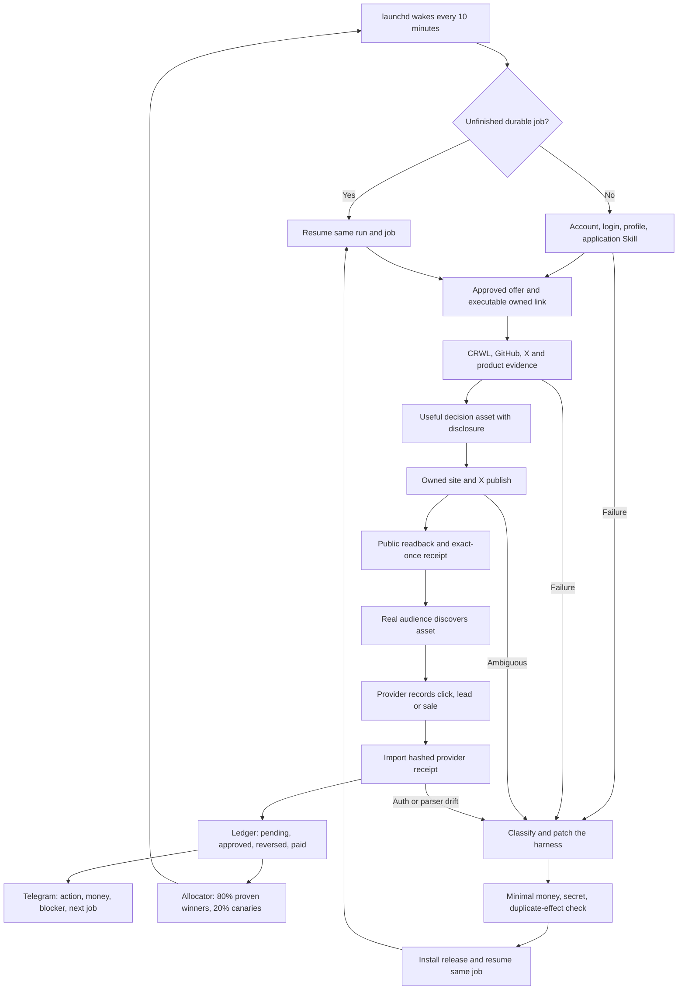

Ten minutes is the default coordination wake. Provider polling, posting, and
research each retain their own policy/rate-limit cooldown, so a wake does not
imply an external action every ten minutes. Every job is durable; a crash resumes
the same job and ambiguous publication is read back before any retry. The model
plans and diagnoses, while deterministic code owns money states, permission,
idempotency, budgets, and evidence. This is the target, not a current revenue
claim.

The money boundary is `C → R`. An article, post, click, signup, dashboard
screenshot, or model estimate is never revenue. The ledger increases only when
the external provider exposes a non-test commission transaction. `pending`,
`approved`, `reversed`, and `paid` remain separate. The owner does not operate
the browser or choose the next task; Telegram is an observable control surface,
not a daily approval queue.

Every box above must be invokable through the versioned `skills/affiliate`
dispatcher. Browser signup, login, profile setup, application, publication,
public readback, dashboard observation, and recovery are Skill operations rather
than undocumented setup performed by Codex. The local launchd owner invokes the
same commands that a future clean-Mac installer and cloud scheduler invoke.

### 1.5.1 Revenue scale architecture

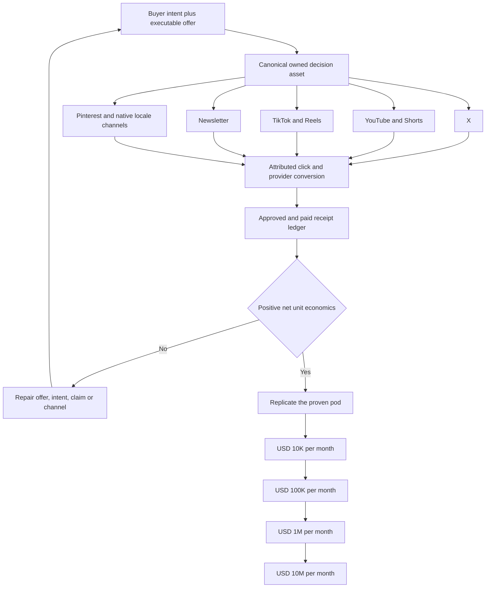

The scale mechanism is replication of externally profitable cohorts, not a
promise that more generated posts create money. A cohort is promoted only after
provider receipts establish attributable traffic, approved commission after
reversals, content and model cost, and positive net unit economics. The local
Mac proves the complete loop first. USD 100K and USD 10M require many independent
profitable pods and eventually tenant-isolated cloud workers; projections,
creator screenshots, clicks, and annualized run rates never close a gate.

The replicable unit is one `RevenuePod`: one locale, one buyer problem, one
canonical owned asset set, one or more independently executable offers, admitted
distribution channels, attributed provider events, costs, and one settlement
ledger. Channel variants reuse the canonical evidence and decision logic, but
each variant is native to its channel and has its own public readback. The Agent
MUST NOT create account farms or repeat identical affiliate posts. A channel
identity is provisioned once per legitimate brand and locale, receives an exact
profile/disclosure/session-health receipt, and then becomes a durable adapter.

The revenue equation is `qualified traffic × approved conversion rate × net
commission + recurring commission - attributable costs`. Every input remains
`unknown` until measured. USD 10K is reached by making one local English pod
profitable and then adding comparable placements and providers. USD 100K and USD
1M replicate only mature pods across offers, buyer intents, channels, and locales.
USD 10M requires a tenant-isolated media network, direct partner capacity, and
millions-scale qualified distribution; it is not achievable by increasing one
X account's posting frequency.

The channel order is fixed: owned site remains the canonical asset and
attribution boundary; English X is the first active distributor; YouTube/Shorts
and newsletter are admitted next because they create durable search and owned
audience; TikTok/Reels and Pinterest follow after their eligibility and public
effect contracts are receipted; Japanese `note` or another native platform is a
locale adapter after English E1. A channel is not added merely because an account
can be created.

## 2. Evidence-backed constraints

1. Every affiliate surface carries a clear disclosure adjacent to the link or
   recommendation. Amazon requires a prominent associate statement: “As an Amazon
   Associate I earn from qualifying purchases.”
   Source: [Amazon Associates Operating Agreement](https://affiliate-program.amazon.com/help/operating/agreement), section 5.
2. A post must help a reader decide; scaled thin or copied pages are rejected.
   Google defines scaled content abuse as generating many pages primarily to
   manipulate rankings rather than help users.
   Source: [Google Search spam policies](https://developers.google.com/search/docs/essentials/spam-policies).
3. The relationship must be obvious without making the reader hunt for it.
   Source: [FTC Disclosures 101](https://www.ftc.gov/business-guidance/resources/disclosures-101-social-media-influencers).
4. Rakuten explicitly supports product/service introductions on SNS and blogs,
   and exposes high-rate products and link-level reports.
   Source: [Rakuten Affiliate](https://affiliate.rakuten.co.jp/).
5. High-value Japanese CPA supply cannot be reduced to Amazon/Rakuten. A8.net
   supports only its registered/approved media and explicitly excludes Twitter
   advertising; afb reports roughly 17,000 promotions across 18 categories and
   identifies medical beauty and related lead-gen offers as high-price/high-
   conversion areas. Supply never implies channel eligibility.
   Sources: [A8.net](https://www.a8.net/), [afb](https://www.afi-b.com/).
6. Postiz exposes scheduling, articles, a public API, CLI, and MCP. It is a
   publisher adapter, not the Agent's brain or ledger.
   Source: [Postiz documentation](https://docs.postiz.com/).
7. Amazon does not guarantee traffic or commission income and may suspend an
   account for contract breaches. Amazon inventory is therefore not a revenue
   forecast and cannot bypass the policy gate.
   Source: [Amazon Associates Operating Agreement](https://affiliate-program.amazon.com/help/operating/agreement).
8. FTC disclosure must be hard to miss, accompany the endorsement, and use the
   same language as the endorsement. Locale-specific accounts and disclosures
   are therefore a contract, not a branding preference.
   Source: [FTC Disclosures 101](https://www.ftc.gov/business-guidance/resources/disclosures-101-social-media-influencers).
9. NerdWallet's official 2025 filing describes revenue per action, click, lead,
   and funded loan, but also reports organic-search pressure and a customer that
   represented 26% of revenue. Deep partner events work; channel and partner
   concentration remain material risks.
   Source: [NerdWallet 2025 Form 10-K](https://www.sec.gov/Archives/edgar/data/1625278/000162527826000014/nrds-20251231.htm).
10. A first-person five-figure affiliate launch used an existing email audience,
    social and blog distribution, years of product use, a 40% commission, and a
    staged launch funnel. It is evidence for trust and distribution, not evidence
    that copying a prompt reproduces revenue.
    Source: [Smart Passive Income five-figure affiliate promotion](https://www.smartpassiveincome.com/blog/5-figure-jv-affiliate-promotion/).
11. Current English candidate economics include Kit's 50% first-year commission,
    HubSpot's 30% monthly recurring commission for up to one year, and Semrush's
    tiered sale/trial commissions. These are candidates only until our own
    application, ownership, terms, and executable link are read back.
    Sources: [Kit Affiliate Program](https://kit.com/affiliate),
    [Kit Affiliate Terms](https://kit.com/affiliate-tos),
    [HubSpot Affiliate Program](https://www.hubspot.com/partners/affiliates), and
    [Semrush Affiliate Program](https://www.semrush.com/lp/affiliate-program/en/).
12. A8 forbids affiliate ads on Twitter, unregistered LINE messages and other
    unregistered media, publication of program reward conditions, and
    indiscriminate bulk partnership applications. Its high-ticket offers cannot
    be sent through the article's proposed X → LINE funnel unless a separate
    provider-specific written permission supersedes the observed terms.
    Source: [A8.net prohibited matters](https://www.a8.net/compliance/prohibited-matter.php),
    “Twitterについても広告を掲載することは禁止しています。”
13. First-person experience cannot be generated when the operator has not used
    the product. Source: [FTC Disclosures 101](https://www.ftc.gov/business-guidance/resources/disclosures-101-social-media-influencers),
    “You can’t talk about your experience with a product you haven’t tried.”
14. X allows separate language-specific brand accounts and localized cross-posts,
    but prohibits bulk/duplicative content, aggressive automated engagement, and
    scripted website automation. Source: [X authenticity policy](https://help.x.com/en/rules-and-policies/platform-manipulation),
    “branded entities specific to unique locations or languages”; and
    [X automation rules](https://help.x.com/en/rules-and-policies/x-automation),
    “Use non-API-based forms of automation, such as scripting the X website” may
    result in permanent suspension.
15. Awin's Spanish publisher page describes the real money state transition:
    tracked sales first appear pending, the advertiser validates them, and only
    approved commissions become payable. It also states there is no global
    minimum follower count, while each advertiser controls admission.
    Source: [Awin España — Afiliados](https://www.awin.com/es/afiliados).
16. Hotmart exposes products by format, niche, language, and popularity and says
    affiliates are paid for attributed sales. This proves multi-language offer
    supply, not that a translated campaign will convert or be approved.
    Source: [Hotmart Affiliates](https://hotmart.com/en/affiliates), “Sign up.
    Pick a product. Start promoting.”
17. Kit's current official page states “50% commission for 12 months” and a
    further “10-20% recurring revenue beyond 12 months when you earn status.” It
    also says commissions are held for 31 days for refunds. The Agent models the
    hold and status tiers instead of treating a click or pending sale as cash.
    Source: [Kit Affiliate Program](https://kit.com/affiliate).
18. Wirecutter's official description combines independent product testing and
    more than 1,000 decision categories with subscriptions, retailer placements,
    product sales, and affiliate commissions. The reusable pattern is a durable
    decision library with reader trust, not a direct-link feed.
    Source: [Wirecutter — About Us](https://www.nytimes.com/wirecutter/about/).
19. YouTube Shopping allows eligible creators to tag relevant products in videos
    and Shorts, exposes commission and performance data, and may reverse
    commission after returns. The Agent therefore treats YouTube as a durable
    search/video adapter and preserves the provider settlement state.
    Source: [YouTube Shopping affiliate program](https://support.google.com/youtube/answer/13376398?hl=en).
20. TikTok Shop officially supports commission-based creator promotion through
    shoppable short videos and livestreams. Its reported US platform growth and
    LIVE-shopping volume prove channel demand, not this Agent's income; admission
    still requires account eligibility and our own attributed receipts.
    Sources: [Introducing TikTok Shop](https://newsroom.tiktok.com/en-us/introducing-tiktok-shop),
    [TikTok Shop discovery commerce](https://newsroom.tiktok.com/en-us/tiktok-shop-is-where-shoppers-come-to-discover).
21. Pinterest requires original value, clear disclosure, moderate affiliate-link
    use, and generally one authentic account; it rejects fake accounts,
    manipulation, and repetitive high-volume affiliate Pins. Account-farm
    automation is therefore outside the product contract.
    Source: [Pinterest commercial and branded content guidelines](https://policy.pinterest.com/en/commercial-and-branded-content-guidelines).
22. ValueCommerce's official 2024 new-member ranking reports materially different
    monthly averages by niche, including PC/peripherals, employment,
    communications, and credit cards. This supports buyer-intent specialization;
    it does not prove that a category average or top result transfers to us.
    Source: [ValueCommerce — affiliate mechanism and earnings](https://www.valuecommerce.ne.jp/affiliate-about/).

Creator revenue screenshots and claims found on X are market signals only. They
never enter earnings or train a prompt as a winner without a matching external
receipt from this Agent.

### 2.1 External playbook intake: ブッタ article

The [2026-08 article by `@buttanoteragoya`](https://x.com/i/article/2084059581924454404) is stored as
`SELF_REPORTED_UNVERIFIED`: the profile and article are real, but the claimed
monthly income, approval rates, conversion funnel, and one-month result have no
public provider or payout receipts. It changes the workflow, not the revenue
forecast.

| Decision | Adopted pattern |
|---|---|
| COPY | Four boundaries: authenticated offer discovery → evidence-led decision asset → distribution variants → actual-data learning |
| COPY | Pain, mechanism, workflow, fit/not-fit, limitations, and one CTA |
| COPY | Generate hook variants and choose tomorrow's one action plus one stop action from observed data |
| TWEAK | Rank only offers returned by authenticated ASP/API/browser receipts; unknown approval rate, payout, or channel remains `UNKNOWN` |
| TWEAK | First-person copy requires an `ExperienceClaimReceipt`; otherwise use official evidence, direct tests, and explicit limitations |
| TWEAK | X, LINE, email, and owned pages each require a fresh `ChannelEligibilityReceipt`; owned registered pages are the default |
| REJECT | Revenue promises, predicted impressions/CVR, hidden advertising, fabricated experience, article-volume quotas, automated engagement, and A8 X/LINE direct ads |

Every external playbook stores `source_url`, author, capture time, claim type,
evidence grade, checked provider terms, `COPY|TWEAK|REJECT`, and reason. A prompt
is never promoted merely because its author reports income.

### 2.2 Continuous best-practice intake

The Agent searches official program pages with CRWL, creator cases and platform
discussion through authenticated browser/X collectors, and GitHub through `gh`
plus raw files. A source becomes executable knowledge only after:

1. capture with URL, immutable content hash, author, language, and evidence grade;
2. exact claim extraction and provider-policy cross-check;
3. license classification as `COPY_CODE`, `COPY_PATTERN`, or `NO_REUSE`;
4. one causal hypothesis and one-variable canary in exactly one locale pod;
5. promotion only from this Agent's mature external click/commission receipts.

Popularity, stars, screenshots, author income claims, estimates, and prompt scores
are discovery signals. They never become revenue, conversion truth, or an
auto-promoted winner.

### 2.3 Aggressive but bounded revenue policy

“Aggressive” means faster evidence collection, more creative variation, quicker
offer replacement, and higher capacity only after positive net receipts. It does
not mean hidden advertising, fabricated experience, unauthorized channels,
engagement manipulation, challenge evasion, or risking the payout account. The
browser-only X lane is an explicit accepted enforcement risk, not a claim of X
approval. The Agent may test strong hooks, contrarian angles, profile-versus-owned-page
distribution, pricing frames, CTA placement, and content format one variable at
a time. Any tactic that requires deception or threatens account/payout survival
has negative expected value and is rejected by the deterministic gate.

## 3. Single recommended strategy

Start with one narrow English buyer problem on `@selawmqt`. Its X login is
provisioned; account presentation and browser publishing remain Agent work. The initial
candidate set is non-regulated B2B SaaS and
creator/productivity software because its official programs expose higher or
recurring payouts and the existing English publication lane reduces launch
friction. Exact market-size superiority is unproven and is not a premise.
Before its first Affiliate placement, change the current `sela` presentation to
an English Anicca identity with an adjacent profile disclosure; future content
is English-only. The 128 historical mixed-language posts remain historical data,
not a reason to delete or fabricate a clean track record.

Initial English capacity allocation:

- 70%: one authenticated high-value or recurring software portfolio with a
  genuine reader fit;
- 20%: owned comparison/how-to assets and their measured distribution;
- 10%: bounded exploration, including Amazon only when executable and useful.

Regulated financial products are excluded from the initial lane despite proven
affiliate economics. Japanese discovery may continue read-only, but Japanese
publication stays disabled until English E0; Japanese J1 is then earned by its
own account, offer, placement, click lineage, and commission receipt.

Do not start as a generic deal feed. Publish decision assets: comparisons,
cost calculators, migration guides, tested workflows, failure-mode guides, and
“who should not buy” sections. Each content unit maps one reader problem to one
primary offer and at most two honest alternatives.

### 3.1 Money model

The loop earns only when an external partner approves a downstream event:

`net commission = qualified visits × observed partner conversion × confirmed payout − reversals − content/compute cost − paid acquisition`

The learner therefore ranks signals in this order: paid/approved net commission,
approved sale or lead, qualified trial, provider-confirmed click, then engagement.
Posts, views, and prompt scores are diagnostic proxies, never money. Before 30
days of live cohorts, each conversion input and revenue forecast remains
`unknown`; best/base/worst cases are computed only from observed receipts.

## 4. Architecture

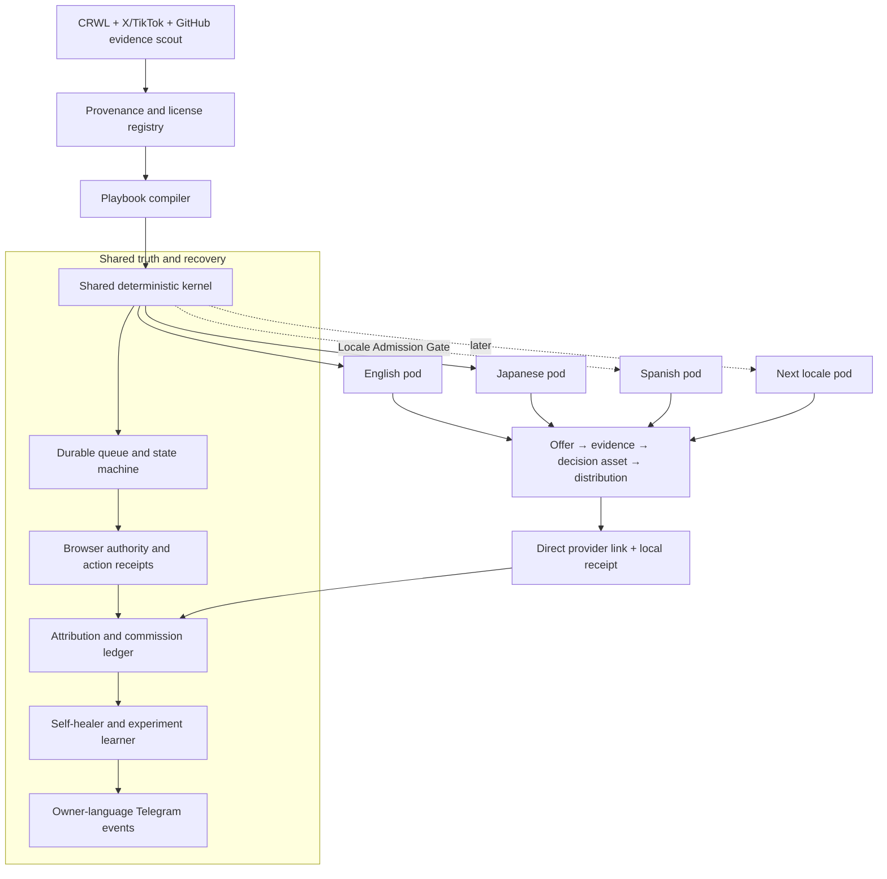

This is one durable Agent with specialized workers, not independent agents with
separate truth. PostgreSQL/SQLite state and append-only receipts are canonical;
prompts and browser sessions are replaceable executors.

The kernel is shared code, not shared market state. Each locale pod owns its
identity, browser storage, provider membership, executable links, disclosures,
evidence pack, experiments, ledger partition, and budget. A useful English asset
may seed a hypothesis for Japanese or Spanish, but the destination pod must
re-research native intent, terms, claims, alternatives, and wording before a
canary. Translation alone can never authorize publication.

### 4.1 Components

| Component | Contract |
|---|---|
| Provider adapters | English B2B/creator programs first; Amazon, Rakuten, A8, afb, and later networks normalize offers, terms, commission events, and account health only after authenticated readback |
| Offer verifier | Re-reads landing page, price, availability, geo, payout, prohibited claims, allowed channels, disclosure, and expiry before publication |
| Portfolio allocator | Selects by expected **net** value: qualified intent × observed conversion × confirmed payout − refunds − content/compute cost − compliance risk |
| Evidence pack | Stores official facts, direct product evidence, alternatives, audience pain, counterclaims, and freshness TTL |
| Content studio | Produces an English article, X thread/post, X Article, carousel, slideshow, or video; the later Japanese pod uses independent evidence, identity, and localization rather than mixed-language reuse |
| Policy gate | Fail-closed for missing disclosure, unverified claims, prohibited categories, self-dealing, stale price, broken link, or unregistered surface |
| Browser publisher | Observe semantically, execute one typed action, then require before/after URL and observation hashes, expected identity, external object URL/ID when visible, screenshot hash, and fresh public readback. Before retrying an ambiguous publish, search the ledger and live account for the content fingerprint |
| Attribution | Agent records content, placement, offer, language, and experiment locally, publishes the provider tracking link directly, and reconciles only provider-side click/commission receipts |
| Receipt reconciler | Navigates provider dashboards and downloaded reports through the browser, hashes the source artifact, and joins transaction/sub-ID rows to clicks. Unknown is never zero; pending, approved, reversed, and paid remain distinct |
| Learner | Promotes a tactic only from mature cohorts and deepest common signal: net commission → approved orders → qualified leads → clicks → engagement |
| Recovery controller | Same `run_id`, artifact hash, placement, and publication intent resume after failure; exponential retry obeys provider `Retry-After` |
| Best-practice scout | Captures official terms, first-person cases, platform signals, and OSS code with provenance, license, evidence grade, TTL, and `COPY_CODE|COPY_PATTERN|NO_REUSE` disposition |
| Locale pod controller | Creates or resumes one isolated identity/provider/content/ledger slice only after the Locale Admission Gate; prevents cross-locale cookies, links, claims, and learning leakage |

### 4.2 Canonical records

`source_capture`, `crawler_adapter_receipt`, `provider_account`, `offer`,
`offer_snapshot`, `external_playbook_intake`,
`channel_eligibility_receipt`, `experience_claim_receipt`, `evidence_claim`, `content_unit`,
`placement`, `publish_intent`, `public_readback`, `click`, `conversion`,
`commission_receipt`, `experiment`, `policy_decision`, `wait_state`, and
`recovery_attempt` are the minimum entities.

Every commission receipt stores provider transaction ID, click/sub-ID when
available, currency, gross commission, reversal/refund, fees, net amount,
status, observed time, and immutable source hash. Canonical states are
`pending`, `approved`, `reversed`, and `paid`; UI may say “approved, not paid”
but that phrase is not a fifth storage state. Approved and paid are never combined.

## 5. Loop and state machine

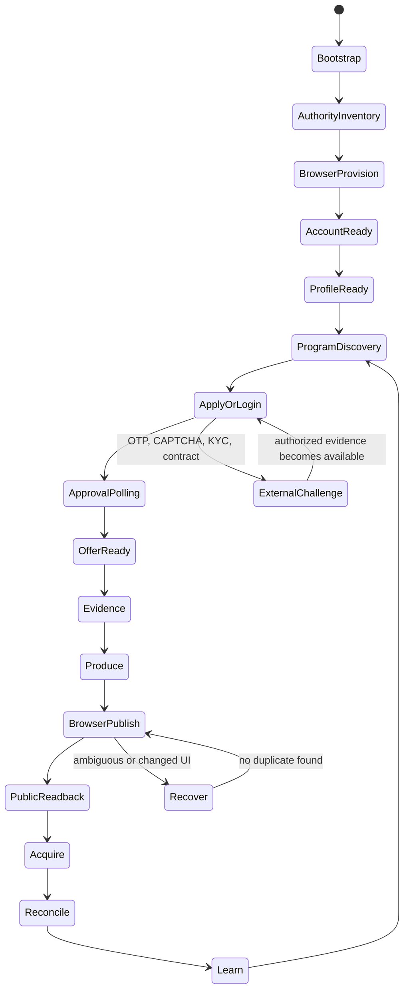

The deterministic kernel owns transitions, leases, budgets, idempotency, money,
and receipts. One semantic browser planner handles unfamiliar pages. After a
successful path, the Agent stores a versioned playbook; later runs replay it and
invoke semantic recovery only when observation or postcondition hashes diverge.
This is one durable Agent with role prompts, not a swarm of independent ledgers.

Minimum receipt chain:

`BootstrapReceipt → AuthorityReceipt → AuthReceipt → ProfileReceipt → ProgramApplicationReceipt → OfferApprovalReceipt → EvidenceReceipt → PublishIntent → BrowserActionReceipt → PublicReadbackReceipt → ClickReceipt → CommissionReceipt → PayoutReceipt → LearningReceipt`.

Screenshots prove rendered state, not money. Only hashed provider dashboard/report
readback can create `pending`, `approved`, `reversed`, or `paid` commission rows.

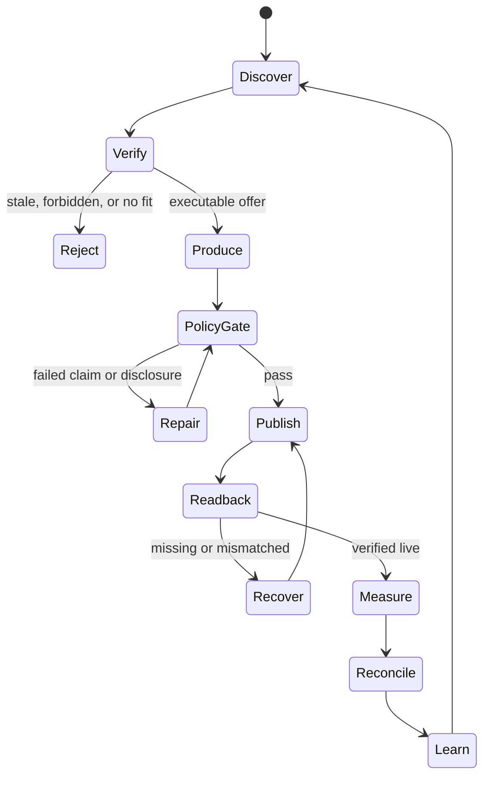

Cadence:

- every 5 minutes: reconcile leases and ambiguous side effects, resume failed
  intents, ingest receipts, and flush the Telegram outbox; it does not create a
  new article every five minutes;
- hourly: offer/price/link/account health and provider/application polling;
- daily during launch: measure prior English cohorts, verify terms, choose one
  reader problem, produce at most one English primary decision asset, derive
  compliant distribution, perform public readback, and reconcile reports;
- 24/72 hours and 7/30 days: cohort measurement and learning;
- weekly: provider mix, reversals, net margin, concentration, and policy audit;
- monthly: close currency/reversal/payout truth and decide whether a locale or
  provider has earned more budget.

Platform publication windows block only that placement. Every wait has a retry
time and durable owner; “wait for next schedule” is invalid.

### 5.1 Next implementation slice: the loop becomes the operator

This slice precedes another manually operated campaign. It changes the installed
runtime from a polling shell into one model-led Agent using deterministic tools:

1. bring the proven shared `runtime/agent-runner/` package and its schema/token/
   usage contracts into the Affiliate immutable release; do not copy any
   Coconala prompt, account, connector, session, or state;
2. add one Affiliate decision prompt and schema containing goal, current receipts,
   unfinished job, allowed tools, budgets, and canonical examples. The model
   chooses the next useful action; regex/priority tables do not choose niches,
   offers, topics, or copy;
3. expose the existing Skill commands as typed tools: program/provider, source
   capture, campaign artifact, policy, placement, owned publish/readback, X
   publish/readback, revenue reconciliation, and Telegram outbox;
4. extend `job_journal.py` with unresolved-job enumeration and stage trajectory,
   so every wake resumes one unfinished stage before choosing new work;
5. replace `local_loop.wake()`'s fixed poll-only path with
   `observe → agent decides one action → tool executes → external readback →
   receipt → reflect`. Keep provider/revenue observation as tools, not the brain;
6. add an Affiliate healer that classifies typed auth, source, browser, policy,
   ambiguous-effect, disk, and owner failures; it runs only bounded allowlisted
   repairs, rechecks the postcondition, and emits `SELF_HEALED` or quarantine;
7. keep launchd as the only scheduler. Five/ten-minute wakes reconcile and
   resume; hourly/daily work is admitted by durable due-times rather than by a
   second scheduler or a hardcoded article-per-wake rule;
8. prove one installed wake advances the existing ElevenAgents job from
   `DELIVERED → LIVE → X LIVE` without Codex/browser intervention, then induce one
   isolated recoverable fault and prove same-job repair.

The completion receipt for this slice is not a test or a generated article. It is
one installed launchd wake trajectory whose model decision, tool call, external
effect/readback, durable state transition, and Telegram report all share the same
run/job identity.

## 6. Self-improvement without self-corruption

- Preserve at least 20% exploration and require at least ten mature comparable
  placements before winner/loser mutation, matching the existing Marketing
  Engine scoring contract.
- Change one causal variable per experiment: offer, hook, proof shape, CTA,
  format, channel, or publish time.
- Optimize net approved commission per 1,000 qualified impressions and net
  commission per content dollar. Never optimize raw post volume.
- A provider, offer, prompt, or account is quarantined after repeated policy,
  reversal, link-health, or reach failures; the Agent shifts to an independent
  provider/channel while diagnosing it.
- Prompt mutations are versioned and reversible. A winning claim cannot be
  invented by the learner; factual claims always come from a fresh evidence pack.

## 7. Reuse and OSS decision

Reuse from the existing system:

- Writer Agent: research acquisition, JA/EN localization, X/article publisher
  adapters, public readback, same-run resume, claim registry;
- Marketing Engine: generic publication receipts, account-isolation patterns,
  slideshow/video/carousel renderers, mature-cohort scoring, and Telegram
  reporting; its Postiz publisher is explicitly not reused;
- Life Manager financial ledgers: verified money semantics and reporting.

Repository audit result: no inspected repository proves an autonomous affiliate
loop from account/application through an externally approved commission. We do
not fork a repository and call it the product. We copy only the following proven,
licensed parts into the existing local runtime:

| Repository | Measured truth | Decision |
|---|---|---|
| [BlockRunAI/Franklin](https://github.com/BlockRunAI/Franklin) | Apache-2.0 source; durable goals/scheduler, wallet budget, resumable sessions, task event logs, lost-task detection, and Telegram control. Its README says it **spends** money toward work; it does not reconcile affiliate income | `COPY_PATTERN`: bounded goals, cost caps, durable task lifecycle, evidence challenge. Do not import its wallet/trading subsystem or treat spend as earnings |
| [paraggit/affiliate-automation](https://github.com/paraggit/affiliate-automation) | MIT file; provider abstraction, retry/backoff, persistence, tests, content and Twitter scheduling. Runtime still asks `Start scheduler?`; no commission or payout ingest exists | `COPY_CODE` selectively: provider protocol, retry, and tests. Replace interactive scheduler and API publisher with our queue/browser/receipt kernel |
| [stay4ever role agents](https://github.com/stay4ever) | MIT files and small tested scout/content/analyst packages. Niche scores and performance examples use estimates or caller-supplied data | `COPY_CODE` selectively: role/tool schemas and disclosure template. Never import estimated traffic, CVR, or benchmark revenue as truth |
| [anacgr05/affiliate-agents](https://github.com/anacgr05/affiliate-agents) | Role graph, PostgreSQL/Redis/Celery/SSE and explicit human approval; no license file and no external commission reconciler | `COPY_PATTERN` only: critic/feedback state boundaries; do not copy code or human gate |
| [ricky-affiliate-agent](https://github.com/sujalmanpara/ricky-affiliate-agent) | Amazon → 15 images → Postiz. No license file despite README saying MIT; code warns “Commissions won't be tracked to your account” when the tag is absent | `NO_REUSE` as a base; Postiz and untracked output violate the product/revenue contract |
| [amazon-affiliate-automation-pipeline](https://github.com/haramhussain110/amazon-affiliate-automation-pipeline) | Five-file, unlicensed content pipeline; README says videos are “ready to check and post manually” and “I'm not auto-posting anything” | `NO_REUSE` as a base; at most reimplement the ASIN→video idea after provider-policy verification |
| [autonomous-marketing-agent](https://github.com/abandini/autonomous-marketing-agent) | No license file; scheduler/recovery shapes coexist with mock approvals and hard-coded revenue/conversion payloads | `NO_REUSE` code; retain only the abstract recovery vocabulary |
| [awesome-OpenClaw-Money-Maker](https://github.com/BlockRunAI/awesome-OpenClaw-Money-Maker) | A catalog, not an executable system; README says “These are potential earnings, not guarantees” | Discovery index only; every linked project receives its own code/license/money audit |

Local Writer/Gig loops are more valuable than any inspected affiliate repository
for production behavior: they already supply launchd ownership, same-run
reconciliation, public readback, durable receipts, and Telegram delivery patterns.
Their interfaces are reused while their ledgers remain isolated.

#### X Article reuse decision

The existing Writer Agent already implements the X Article wheel. Its production
tree references [`wshuyi/x-article-publisher-skill`](https://github.com/wshuyi/x-article-publisher-skill)
and contains Markdown preparation, rich clipboard insertion, cover/body media,
publish, authenticated public readback, and same-ID repair under
`skills/writer-agent/scripts/x-publish/`. A real Writer X Article is already
public, so this is production evidence rather than a README-only candidate.

The current Writer installation is nevertheless bound to protected CDP `9222`
and `@diceai0`; Affiliate owns `@selawmqt` on CDP `9326`. Affiliate MUST NOT copy
the scripts into a second publisher or touch 9222. The smallest reuse is to make
the existing Writer X adapter accept an explicit browser authority contract
(`cdp_port`, expected account, artifact path, receipt root), then invoke that
same adapter from Affiliate with `9326 + @selawmqt`. If the Affiliate account
does not expose the X Article editor, record `CHANNEL_UNAVAILABLE` and continue
owned-site articles plus ordinary X posts; never emulate X Articles with a new
automation stack.

Live capability readback now closes the current decision: `@selawmqt:9326`
returns `Page not found` at the canonical Writer `/compose/articles` route and
renders no editor controls. The adapter remains reusable code, but there is no
current Affiliate channel to invoke. Its parameterization is deferred until a
future account-state change; owned articles and ordinary X posts remain active.

### 7.0.1 File-level reuse map

The audit reads implementation files, not only READMEs. `COPY_CODE` still means a
small compatible slice with license attribution; it never means importing a whole
runtime. The current disk floor is 10 GiB free. Below that floor the Agent stops
new clones, media generation, and browser downloads while continuing ledger and
health reporting. GitHub tree/raw access replaces a clone when it proves the same
code boundary.

| Source file | Proven mechanism | Exact use in Affiliate Agent | Explicitly excluded |
|---|---|---|---|
| [Franklin `src/tasks/store.ts`](https://github.com/BlockRunAI/Franklin/blob/main/src/tasks/store.ts) | Atomic temp-file rename plus append-only `events.jsonl`; one writer per task | Keep the existing `job_journal.py` contract: immutable `run_id`/`job_id`, append-before-effect, tolerant replay, same-job resume | Franklin wallet, trading, generic command runner, and any revenue inference |
| [Franklin `src/tasks/lost-detection.ts`](https://github.com/BlockRunAI/Franklin/blob/main/src/tasks/lost-detection.ts) and [`src/scheduler/store.ts`](https://github.com/BlockRunAI/Franklin/blob/main/src/scheduler/store.ts) | Reconcile a dead owner as `lost`; after sleep fire one current slot rather than replaying every missed interval | A14.7 watchdog, stale-owner detection, and one bounded catch-up wake | Copying its process model or creating a second scheduler beside launchd |
| [Forage `forage/agent/core.py`](https://github.com/Nerfed-Lab/forage/blob/main/forage/agent/core.py) | Repeating check-vitals → decide → act → reflect → persist cycle | Copy only the cycle boundary and cost-aware action selection into the existing local loop | Its capability-returned `revenue` value; Affiliate money must come from a hashed provider transaction |
| [Forage `forage/economy/ledger.py`](https://github.com/Nerfed-Lab/forage/blob/main/forage/economy/ledger.py) | Append-oriented income/expense queries and profitability windows | Reuse the profitability/window vocabulary; preserve Affiliate's richer pending/approved/reversed/paid lineage | Treating a local action result or wallet balance as commission |
| [paraggit `src/core/base_affiliate.py`](https://github.com/paraggit/affiliate-automation/blob/main/src/core/base_affiliate.py) | Small provider protocol and normalized product record | Reimplement the protocol shape as provider playbooks with authenticated ownership, terms, allowed-channel, link and report states | Its Amazon/Flipkart assumptions and price/deal ranking as the primary strategy |
| [paraggit `src/utils/retry.py`](https://github.com/paraggit/affiliate-automation/blob/main/src/utils/retry.py) | Bounded typed retry with exponential delay | Reference for read-only transient retries only; writes remain journaled and reconcile-before-retry | Its interactive scheduler, generic content prompt, Tweepy publisher, and unverified success booleans |
| [Crawlee `recoverable_state.py`](https://github.com/apify/crawlee-python/blob/master/src/crawlee/_utils/recoverable_state.py) and [`RequestQueue` example](https://github.com/apify/crawlee-python/blob/master/docs/introduction/code_examples/02_request_queue.py) | Persisted crawler state and durable request queue across restart | Admit only when CRWL cannot cover a real multi-page/JS research job; emit normalized `SourceCapture` receipts | Making Crawlee the Agent brain or adding it for single-page fetches |
| [NanoClaw scheduling and host sweep](https://github.com/nanocoai/nanoclaw/tree/d7d9887eb4acae8d60e327afc21955e3f10b77eb) | MIT; SQLite occurrences with stable series IDs, stuck-claim reset, exponential backoff, auto-pause after repeated failure, delivery status/message ID, and append-only run logs | Copy the durable occurrence, claim, backoff, terminal-failure, and delivery-receipt pattern into Affiliate's existing launchd/job boundary | Its messaging domain, container runtime, and any assumption that task delivery is revenue |
| [Temporal Python agent activities](https://github.com/temporalio/sdk-python/blob/680a6b4f32e9d5f2484e9a2e1c604178553c3f55/temporalio/contrib/openai_agents/workflow.py) | MIT; wraps each agent tool call as a durable Activity with retry, heartbeat, and workflow history | Retain as the later cloud migration reference for tool-level durability | Adding a Temporal server to the local Mac before the launchd loop proves revenue |
| [LangGraph ToolNode and SQLite checkpoint](https://github.com/langchain-ai/langgraph/tree/644815f9e5bc52ad8f7a5227a456227e9c3e639b) | MIT; model/tool loop, injected state/store/runtime, checkpoint lineage, and attempt events | Copy the tool-result/context and checkpoint-after-transition pattern only if the shared Life Manager runner lacks it | Replacing the proven shared runner or treating LangGraph core as a persistent scheduler |

The first implementation choice is therefore local reuse, then the smallest
licensed external mechanism. There is no dependency addition for a mechanism
already implemented by `job_journal.py`, launchd, CRWL, CloakBrowser, or the
Writer/Gig publication and receipt contracts.

### 7.1 Closest end-to-end OSS and public-claim gate

No inspected OSS project closes the whole chain from lawful account authority to
an externally approved recurring income receipt. The nearest reusable systems
are complementary, not substitutes for the Affiliate Agent:

| Project | Closest proven boundary | Missing money boundary | Decision |
|---|---|---|---|
| [Nerfed-Lab/forage](https://github.com/Nerfed-Lab/forage) | MIT autonomous cycle, budgets, ledger, evolution, and Gumroad listing; cloned suite passed 39 tests | Its measured revenue remains `0.0`; Stripe/crypto payout and external receipt ingest remain TODO | Copy the economic-agent cycle and budget/ledger tests, not an earnings claim |
| [diptobiswas/agentwork](https://github.com/diptobiswas/agentwork) | Closest marketplace shape: agent profiles, gigs, escrow contract, and on-chain settlement vocabulary | Observed public market had one active agent, zero gigs, and `$0` earned; production recipient lookup remains TODO; no root license | Pattern only; do not copy unlicensed code or call escrow capability revenue |
| [coinbase/x402-paid-api-starter](https://github.com/coinbase/x402) | Closest real settlement substrate: idempotent transaction/settlement receipts; relevant cloned slice passed 13 tests | It does not acquire customers, publish, or choose profitable work | Reuse receipt/settlement patterns for an x402 loop, not as Affiliate Agent |
| [paraggit/affiliate-automation](https://github.com/paraggit/affiliate-automation) | Closest licensed affiliate code: MIT provider abstraction, persistence, retry, content, scheduling; audited suite passed 41 tests | Interactive confirmation; no program application, commission reconciliation, payout, or public ledger | Selective code reuse behind our deterministic queue/browser/receipt contracts |
| [No Human in the Loop](https://nohumanintheloop.com/) | Self-reported real-world precedent: zero approvals and `$2,152` from 74 Gumroad copies | Public GitHub is a static two-file site, not a reproducible harness/ledger, and has no reusable license | Evidence that generic “world's first money loop” is unsafe |

Until a public proof gate closes, README language is only: “We are building an
open-source, receipt-verified affiliate earning loop.” The qualified claim “To
our knowledge, Life Manager is the first open-source, receipt-verified agent loop
that autonomously operates affiliate marketing from authorized account bootstrap
through settled commission” becomes eligible only when all of these exist:

1. canonical public Life Manager source and reproducible macOS installation;
2. a live E1 commission and later payout receipt, redacted and content-addressed;
3. a privacy-safe append-only ledger separating gross, net, pending, approved,
   reversed, paid, currency, cost, and payout;
4. an independent verifier that replays receipt hashes and ledger invariants;
5. a public prior-art registry with search date, routes, repositories, licenses,
   code/tests inspected, and explicit uncertainty;
6. no secret, tax, bank, customer, session, or provider-internal identifier in
   the public projection.

This gate permits a qualified prior-art statement, never a guaranteed-income or
generic “world's first money-printing loop” claim.

### 7.2 Crawling and scraping substrate

“Every platform” is implemented as one typed `CrawlerAdapter` registry, not one
fragile scraper pretending every site has the same access model. Every adapter
returns normalized `SourceCapture` records with URL/object ID, platform, locale,
author, captured time, raw artifact hash, parser version, access route, and
readback class. Empty results are distinguishable from auth, rate-limit, parser,
policy, and upstream failures.

| Surface | Primary route | Clone/code evidence | Runtime decision |
|---|---|---|---|
| Public web and linked articles | Existing `crwl crawl`; Scrapy only for parser/HTML fallback | [Scrapy](https://github.com/scrapy/scrapy) is BSD-licensed; cloned retry, robots, and throttle suites passed 90 tests with 14 environment skips | Reuse the installed CLI first. Do not add a framework for a one-page fetch |
| Durable multi-page/JS crawl | Crawlee Python `HttpCrawler`/`PlaywrightCrawler` with persistent `RequestQueue`, session pool, robots delay, `Retry-After`, and backoff | [Crawlee Python](https://github.com/apify/crawlee-python) is Apache-2.0; cloned queue/session/throttle suites passed 338 tests with 2 memory-storage skips, and its official `HttpCrawler` example fetched `crawlee.dev` with 1 finished/0 failed | `COPY_CODE`/dependency only when a durable crawl is actually required; this is the shared substrate, not the Agent brain |
| X search and logged-in pages | Existing `x-search-cdp` on the exact daily-driver tab; CloakBrowser semantic read for authenticated articles | Local code drives the rendered tweet DOM. Current probe returned `no logged-in x.com tab`, so this route is not presently healthy | Repair/re-provision the authorized tab inside the Agent; never launch a duplicate browser silently |
| Public X tweet/profile fallback | `x-tweet-fetcher`: FxTwitter → Nitter → browser fallback, normalized schema and SQLite dedupe | [x-tweet-fetcher](https://github.com/ythx-101/x-tweet-fetcher) is MIT; 97 tests passed and live `@selawmqt` profile readback matched 128 posts, 0 followers, 27 following | Adopt for read-only public objects. X Articles still require a browser; no posting capability |
| X private-API fallback | None in production | [Twscrape](https://github.com/vladkens/twscrape) is MIT and 192 cloned tests passed, but it rotates accounts and consumes X internal GraphQL operations; fixture success does not prove live account safety | `NO_REUSE` initially. It may enter an isolated research canary only after a live/policy/account-risk review |
| TikTok | `clockworks/tiktok-scraper` and task-specific Apify Actors via their fetched input schemas | Existing code calls the Actor and normalizes videos/slideshows, but its current combined test file cannot collect because it still imports deleted `rss_parser`; old `drawrowfly/tiktok-scraper` is unlicensed and stale | Managed Actor adapter remains the candidate, but production admission requires a fresh one-item live dataset receipt and a repaired focused contract test |
| Instagram, Facebook, YouTube, Google Search/Trends/Maps | Task-specific Apify Actor selected by the local `apify-ultimate-scraper` registry | Actor IDs and input discovery exist locally; Actor implementation code is not assumed open source | Fetch actor schema, run a bounded live canary, hash dataset/schema, then admit. Never claim code reuse when only a hosted Actor is used |
| Reddit | PRAW with authorized read-only OAuth; public HTML through CRWL only as fallback | [PRAW](https://github.com/praw-dev/praw) is BSD-licensed; cloned auth/read-only/rate-limit unit slice passed 34 tests | Adopt official client semantics; do not use unauthenticated bulk-scraper repos as the primary route |
| GitHub | `gh` API/search plus raw files, then clone candidate repositories | GitHub CLI returned repositories and full clones supplied the code/license/test evidence in this audit | Already canonical; README alone never closes an audit |
| Amazon, Rakuten, A8, afb, PartnerStack and ASP dashboards | Official product/program API when explicitly allowed; otherwise isolated CloakBrowser rendered pages and report downloads | Affiliate-specific public scrapers either lack licenses, omit posting/revenue, or bypass the authenticated ownership state required by the ledger | Never substitute product scraping for provider approval, tracking-link ownership, or commission reconciliation |

Adapter selection follows a fixed ladder: official/authenticated interface →
installed CRWL → licensed public-object adapter → Crawlee/Scrapy → rendered
CloakBrowser. A failed route emits evidence and advances only to an allowed
fallback. It never rotates stolen accounts, bypasses challenges, or turns a parser
failure into an empty market signal.

No external prompt or source is copied unless its license permits reuse. Public
workflow ideas are reimplemented against our own contracts and evidence.

## 8. Revenue gates

| Gate | Verifiable completion |
|---|---|
| E-1 | English provider auth and ownership readback for one executable offer on the dedicated English identity |
| E0 | One English placement has public readback, an executable direct provider/custom link, and a provider click receipt; this unlocks a separate Japanese canary |
| E1 | First non-test English approved commission joined end-to-end |
| J-1 | After E0, Japanese provider/account ownership and one executable offer are independently read back |
| J0/J1 | Japanese public placement/click lineage, then approved commission, each closed independently of English |
| L0 | Any later locale has a separate identity/browser/provider/link/disclosure, at least one executable offer, native evidence review, and a receipted canary; Spanish is the first expansion candidate |
| A2 | Four revenue-positive weeks, positive net margin, zero manual execution |
| A3 | Three consecutive months at $10,000 gross affiliate commission with net, reversals, and attribution reported separately |
| A4 | Diversified scale: no provider, offer, or channel exceeds 40% of net commission |
| A5 | $10,000,000 cumulative or monthly target is defined explicitly and then met only by external receipts; never inferred from traffic |
| A6 | $100,000,000 monthly net remains `HORIZON_OPEN` until one externally settled month passes FX, reversal, cost, concentration, policy, partner-capacity, and tenant-isolation audits; GMV and forecasts do not count |
| OSS1 | After E1, one clean macOS user installs the public repository with one command and reaches the same pre-publication state without copying credentials, sessions, or mutable receipts |
| C1 | After A2 and OSS1, one isolated cloud tenant reproduces the same state machine, browser action receipts, money ledger, recovery, and report without weakening policy or tenant isolation |

Best/base/worst planning is computed only after 30 days of real funnel data.
Before that, revenue is `unknown`, not a fabricated conversion forecast.

## 9. Ordered implementation backlog

### 9.0 One-line route to USD 10,000/month

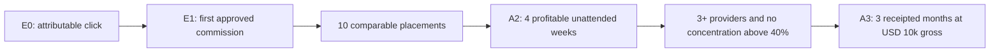

There is no honest fixed promise that a known number of posts produces USD
10,000. After 30 days, the Agent computes the required portfolio from observed
provider receipts. For example, USD 10,000 can equal 100 approved commissions at
USD 100 net, 20 at USD 500 net, or a mixture. Those are arithmetic decompositions,
not forecasts. The allocator increases only cohorts with positive approved net
commission after reversals and cost, preserves 20% exploration, and limits any
one provider, offer, or channel to 40% of net commission. A3 closes only after
three external monthly receipts each reach USD 10,000 gross and the corresponding
net, cost, reversal, and concentration views reconcile.

The Agent does not scale by increasing post count blindly. It closes the measured
ladder in order: executable offer → attributable post-baseline click → approved
commission → ten comparable placements → four profitable unattended weeks →
three diversified providers → an observed portfolio equation that sums to USD
10,000. If observed net commission per approved conversion is `N`, required
monthly approved conversions are `ceil(10000 / N)`; required qualified visits are
computed only from the cohort's observed conversion rate. Before those receipts,
the inputs remain `unknown`.

### 9.0.1 Current truth and milestone queue

This is the exact execution order from the current live state. Each production
step ends with a versioned Skill command, durable receipt, installed-release
replay, SSOT update, commit, and push. A check is minimal: one normal path plus
only money corruption, secret leak, duplicate external effect, or data-loss
regressions relevant to that step.

#### Revenue-first priority override

Until E1, work follows the shortest external-value path below. Runner
generalization, generic action schemas, clean-Mac packaging, multilingual lanes,
cloud work, and broad self-repair do not start unless one is the measured blocker
for the next external state. Known stages are deterministic; the model writes or
diagnoses only when an existing deterministic tool cannot advance them.

#### Autonomous responsibility boundary

The product is the launchd-owned Affiliate Agent, not an operator-assisted
publishing service. Dais and Codex do not choose each topic, write each article,
create each affiliate link, publish each asset, inspect each dashboard, or decide
the next experiment. They design and repair the harness. The installed owners
must perform the recurring business work themselves:

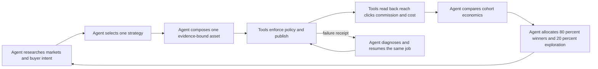

Judgment belongs to the Agent through natural-language prompts and receipted
decisions: market, offer, buyer intent, asset angle, channel, experiment, and
next allocation. Deterministic code is limited to browser/API tools, policy hard
gates, arithmetic, idempotency, public readback, accounting, scheduler ownership,
and secret boundaries. Codex may trigger and observe the real launchd owner; it
must not substitute a manual article, manual post, or one-off browser action for
missing Agent capability. When a real run fails, the default fix is the smallest
harness/tool/observation repair that lets the same job finish itself. Source-code
self-modification is not currently proven; current self-healing means durable
resume, exact external reconciliation, typed recovery, and continued healthy-lane
operation.

#### Remaining autonomous money-loop work — canonical order

This list contains implementation work only. Time passing, an organic visitor,
provider approval, and commission settlement are observed acceptance gates, not
tasks and not reasons to stop safe work.

1. **IN PROGRESS — M2.1-O — Correct owner observability.** Build the natural-language daily
   summary from the canonical placement ledger, not a partial provider report.
   Report canonical placements, dedicated links, measured clicks, unknown click
   rows, commission states, actual/unknown costs, current campaign, recovery, and
   the next Agent action without converting unknown to zero. Release
   `0eec86508dd3af06b08efb2ff26212d4fc7797bf` is installed. Real launchd wake
   `39` exited `0`, rebuilt `LEDGER_READY` with six canonical placements and six
   dedicated links, reported three provider-measured click rows totaling zero and
   three unknown rows without coercing them to zero, preserved zero commission
   transactions, and kept Telegram sent rows `14→14` without a duplicate event.
   A subsequent authoritative audit found one remaining defect: the summary
   counted four same-day historical `budget_blocked` receipts even though three
   already had canonical public ledger rows and only the YouTube Transcript
   Generator campaign remained unpublished. The current slice must exclude
   canonical live `plan_id` values, report the one unfinished campaign by its
   natural buyer-intent label, preserve the same one-per-JST-day Telegram UUID,
   and prove `4→1` in an installed wake before this item returns to `DONE`.
2. **M2.1-P — Grow six comparable English placements to ten.** The existing
   source→composition→policy→dedicated-link→owned/X→readback→ledger path advances
   four more campaigns. The Agent performs the work; a human or Codex does not
   author or publish a replacement. Each row needs independent click/exposure,
   provider usage, cost, and commission lineage.
3. **E1-H — Close the first real transaction path.** On the first provider row,
   the loop normalizes provider transaction ID and status, joins the exact
   placement, appends one replay-safe economic transition, reports
   pending/approved/paid/reversed correctly, and never counts clicks, pending
   rewards, estimates, tests, or screenshots as revenue.
4. **M2.2 — Add a second executable English offer/provider.** The Agent researches
   official terms and allowed channels, applies or resumes through the Skill,
   authenticates, creates a usable tracking link, and proves provider readback.
   Rejected Kit is not resubmitted unchanged and ElevenLabs keeps running.
5. **M2.3-S — Close strategy learning.** Every post-E1 campaign gets a receipted
   hypothesis and one changed variable. The strategy Agent ranks mature cohorts
   by approved net commission per 1,000 qualified impressions, includes
   reversals and observed cost, assigns 80% of bounded campaign capacity to
   winners and 20% to exploration, and records why it continued, changed, or
   stopped a strategy.
6. **M2.3-D — Diversify the USD 10,000 portfolio.** Admit at least three
   independently receipted providers/offers and keep provider, offer, and channel
   concentration at or below 40% of approved net commission. Compute required
   visits and conversions only from observed cohort economics.
7. **M2.4 — Add the next measurable native channel.** Reuse a winning evidence-
   bound asset only where reach, click, disclosure, publish readback, and recovery
   are Skill-owned and independently measurable. Do not add volume that cannot be
   attributed.
8. **M3.1 — Add isolated locale pods.** After English unit economics, add Japanese
   and then Spanish with separate identity, browser profile, membership, link,
   disclosure, evidence, ledger, report, and recovery. Never mix languages on one
   social identity.
9. **M4.1 — Package the proven local loop.** After real approved revenue, remove
   machine-specific paths and ship one-command macOS install, minimal credential
   intake, launchd ownership, health, update, rollback, uninstall, privacy-safe
   ledger verification, and clean-user reproduction.
10. **M5.1 — Reproduce the proven contracts in cloud/web.** Only after unattended
    positive net local operation and clean-Mac proof, replace launchd/browser
    ownership with tenant-isolated scheduling and browser workers while preserving
    the same jobs, receipts, attribution, recovery, deletion, audit, and
    Telegram/web owner UX.

The active implementation method is direct primary-model execution. The primary
Sol reads the complete existing call path, edits the smallest production surface,
and verifies the installed launchd owner itself. Superpowers, TDD/RED scaffolding,
subagent implementation, speculative abstractions, and broad new test suites are
not part of this Affiliate slice. Existing checks run after the minimal change;
the decisive proof is a real installed wake, exact public readback, and replay
dedupe. A new regression is added only after a real failure demonstrates that an
existing check cannot protect a money, secret, data-loss, or duplicate-effect
boundary.

The completed history remains in the evidence tables below. The following list is
the milestone order. Section 9.0.1.1 is the canonical atomic order for the current
cursor; later work MUST NOT jump ahead of an unmet gate.

Current execution cursor: **M2.1-P, grow the English portfolio from six to ten
comparable dedicated-link placements through the already-installed autonomous
campaign path**. M2.0 is closed: every existing revenue placement now has one
PartnerStack link, owned/X public readback, and one canonical ledger row. The
next four campaigns must pass source, composition, semantic policy, owned/X,
dedicated-link, public-readback, exposure, cost, and commission-lineage gates;
content volume without those measurement contracts does not advance the cursor.
M0.1 is installed in release `e8d1b8ea1`: real launchd wake `7`
returned `WAITING_FOR_BASELINE`, last exit `0`, and created zero model-evidence
files and zero decision receipts before eligibility. A first real Agent decision
remains an automatically observed acceptance gate, not a wait task. Time passing,
an organic click arriving, provider review completing, and
a commission being approved are external acceptance gates observed by launchd;
they are not implementation TODOs and never block safe work on the next missing
harness boundary.
M0.3 is installed in release `30f7862ab579a1416fd272c3643cce1b3f0f2ff1`.
Real launchd wake `10` exited `0`, kept provider `AUTHENTICATED` and publication
`X_LIVE`, and rebuilt a mode-0600, hash-valid six-placement economic ledger even
while the hourly provider fetch remained in `COOLDOWN`. The dedicated TTS
placement joins provider link key `dd63ebae-fe33-4347-b264-313b7bcb2072` to an
official click count/delta of `0/0`; the canonical DEV audio-to-text placement
joins real exposure of `0` page views, `0` reactions, and `0` comments. Every
commission transaction count is `0`, approved/paid net is empty, and cash cost
remains `UNKNOWN`. Five historical shared-link placements deliberately retain
`null` click values rather than borrowing the aggregate PartnerStack count.
Events advanced by one wake receipt while Telegram sent rows remained `13`, so
no transition was duplicated or invented.

Provider admission continues in the same wake: HubSpot/Impact is polled without
resubmission, GetResponse remains provider-gated until an existing commission,
and Systeme.io remains behind its typed CAPTCHA boundary. Release `50d45beca` is
the last completed login self-heal slice. Release `cad9135ae` is the current installed
M2 runtime; all six launchd owners are loaded and all three CDP ports respond. The
real `elevenlabs-discovered-audio-to-text-en` lineage also
closes a same-day continuation proof: official sitemap discovery, source-set
SHA-256 `ebe01c0d4c285ce6d7157c7c851e879cfd024ed0cbb7d4c113a96154d8e03ce6`,
Terra-high sealed composition, independent semantic policy `PASS`, owned HTTP
`200`, exact X readback, and Telegram message ID `20895`. Netlify run
`31934721445` passed its production smoke. Replay is
`ALREADY_LIVE / NO_PENDING / last exit 0`; landing Git HEAD remains
`04ce872aec466a66344403c6a392382004f4e962`, exactly one verified X job ID owns
the placement, and the X URL remains
`https://x.com/selawmqt/status/2088896288914059731`. The same money owner then
published canonical DEV article `4408918`; Telegram message `20912` confirmed
the lane. Its unchanged replay is `COOLDOWN / NO_PENDING / exit 0`, with one
unique DEV job ID and one Telegram outbox/sent row. Revenue remains zero
post-baseline clicks and zero commission. No human login-support request or
six-digit-code handoff is outstanding.

The same launchd owner now also owns Substack. It recovered public ID
`211393132`, replaced a non-rendering raw-HTML body with seven native
ProseMirror paragraphs, verified the full anonymous body/disclosure/tracking
link, closed external job `3a7c7b28…78c2`, and sent Telegram message `20934`.
Replay is `COOLDOWN / NO_PENDING / exit 0`. The failed first recovery also
created title-only public duplicate `211393237`; the unresolved-effect fence now
prevents recurrence. The accepted operating decision is to leave it unchanged
and spend no further execution time on cleanup.

| Current surface | Verified state | Meaning |
|---|---|---|
| Local scheduler | Six Affiliate launchd owners; last exits are `0` | The local runtime is installed and healthy |
| Provider | ElevenLabs authenticated; executable referral link already held privately | New signup is not on the critical path |
| Existing distribution | 6 owned articles `LIVE`; 6 X posts `LIVE`; 1 canonical DEV article `LIVE`; 1 receipted Substack article `LIVE` | Real public effects exist and are receipted; one known title-only duplicate remains unchanged by explicit operating decision |
| Generic pipeline | Official sitemap discovery created mutable-state plans; six sealed handoffs and six hash-bound policy receipts exist; the sixth campaign reached owned/X/DEV/Substack `LIVE` and Telegram before unchanged replays | A real external click is the first unfinished economic stage; provider admission continues in parallel under provider gates |
| Acquisition | M2.0 is closed. Real wake `37` exited `0` with six canonical ledger rows, six non-null dedicated provider link keys, six non-null owned URLs, and ledger SHA `906644fd…`. Audio, video, dubbing, Plans, ElevenAgents, and TTS all retain their original owned/X URLs. Plans deployment `31946501665` and ElevenAgents deployment `31946846420` passed production smoke | Each existing English placement is independently measurable. One transient pre-effect PartnerStack form timeout produced no job or link; the next wake created exactly one Plans link, proving bounded autonomous retry. Release `a27fae614` also merges the two legacy slug aliases into canonical X placement IDs, preventing seven-row double accounting |
| Money | 0 provider transactions / USD 0 commission | E1 and every revenue scale gate are open |

The observed pre-effect PartnerStack form timeout also exposed a reporting gap:
the append-only wake history proved failure then recovery, but Telegram did not
announce that recovery. Release `cad9135ae` now emits one stable-UUID
`SELF_HEALED` event when the immediately previous real wake is
`PUBLICATION_FAILED` and the next real wake advances to another publication
state. The natural-language message identifies ElevenLabs/PartnerStack, reports
that the same publication resumed without a duplicate effect, and names public
readback/revenue measurement as the next Agent action. It does not retrospectively
invent an event for the already-completed timeout. Installed replay wake `38`
exited `0`, retained six dedicated/public ledger rows, preserved program-link
receipts `7→7` and Telegram sent rows `14→14`, returned
`X_LIVE / ALREADY_LIVE / LEDGER_READY / NO_PENDING`, and created no duplicate
public effect.

```mermaid
flowchart LR
  R[Real exposure receipt] --> A[Agent chooses one change]
  A --> C[Research + composition]
  C --> P[Policy + deterministic publish]
  P --> F[Owned + distribution LIVE]
  F --> R
  F --> E0[Provider click receipt]
  E0 --> E1[Approved commission]
  E1 --> U[Net unit economics]
  U --> A
  U --> T[Scale winning placements]
  T --> D[Diversify channels + providers]
  D --> K10[USD 10K per month]
  K10 --> L[Japanese and Spanish pods]
  L --> O[Clean Mac and OSS]
  O --> C1[Cloud tenants]
  C1 --> K100[USD 100K per month]
  K100 --> M1[USD 1M per month]
  M1 --> M10[USD 10M per month]
```

1. **DONE — Seal composition output.** Installed release `501f6d5ea` makes the
   existing runner receipt hash the exact result file, bind it to one
   validated `source_set_sha256`, seals model/effort/provider usage/budget from
   the runner summary, confines the result to its evidence directory, and rejects
   either result tampering or a changed source set. The focused regression first
   failed on the missing source-set contract, then passed with the full 48-test
   Affiliate suite. Live readback showed all five Affiliate owners healthy and
   Gig untouched; this is real local execution, not a dry run.
2. **DONE — Add the bounded composition owner.** Installed release `cf8e23528`
   gives it only one due
   `composition-inbox` receipt, no Affiliate credential Markdown, no provider/X
   browser, no money ledger, a separate lock, one attempt budget, and a terminal
   `READY_FOR_POLICY|FAILED|QUARANTINED` receipt. It MUST NOT run inside the
   ten-minute money owner. The accepted implementation is one new direct owner
   over the existing runner: one due source set per wake, sealed-result recovery
   before a new model call, and same-source terminal-receipt dedupe. The focused
   test first failed because the owner did not exist, then the owner and full
   49-test Affiliate suite passed. Two installed launchd wakes produced two
   sealed outputs, each with one placeholder and no private link; wake two left
   wake one's receipt byte-identical. No Git, X, or commission effect occurred.
3. **DONE — Define the generic campaign handoff.** Installed release
   `64093fd3e` requires offer ID, locale, buyer
   intent, title, slug, owned-article Markdown, disclosure, one CTA placeholder,
   cited source IDs/hashes, X copy, and content/result fingerprints. The model
   never receives the private tracking link. Reuse the already sealed article;
   derive the handoff deterministically from its exact result, source bundle,
   and versioned source-plan metadata instead of paying for another model call.
   The contract rejects uncited external URLs, a private link, disclosure after
   CTA, invalid slug/locale metadata, oversized X copy, or a broken result seal;
   all 49 Affiliate tests pass. Three installed-owner wakes created three validated
   handoffs from existing sealed outputs with no duplicate usage-ledger row; their
   internal fingerprints and composition-receipt file hashes both read back.
4. **DONE — Generalize the policy gate; installed and live-proven.** The gate
   validates cited URLs and source hashes, disclosure-before-CTA, claim support,
   locale, forbidden guarantees, one CTA, article/X limits, and channel
   structure. Exact checks are deterministic; claim support is a bounded read-
   only model audit over the same sealed official source set. Neither layer sees
   credentials, tracking links, browser authority, or the money ledger. Release
   `2067b62a6` was the installed milestone; all six owners and CDP `9324`, `9326`, and `9327` were
   healthy. Installed wakes created policy hashes `94841cab46fa…` (`FAIL`),
   `6cff9924d46f…` (`PASS`), and `49f0bae15d98…` (`PASS`). The failure names one
   unsupported ElevenAgents call-billing statement. A replay returned `IDLE`
   with last exit `0` and preserved all three hashes. The installer now preserves
   loaded owners and bootstraps only missing labels, preventing recurrence of the
   earlier batch-bootout incident.
5. **DONE — Connect the handoff to deterministic effects.** Release `50a86df60`
   makes the money owner consume
   only a policy-PASS artifact, injects the executable link locally, publishes the
   owned article, waits for HTTP `200`, publishes X, and performs exact public
   readback under the existing Git/X fences. It reuses `owned_publish.py` and
   `x_post_cli.py`; no scheduler, publisher, framework, or test suite was added.
   All 51 existing Affiliate checks passed. Installed wakes returned
   `AUTHENTICATED / ALREADY_LIVE / last exit 0`, and replay preserved the owned/X
   receipt hash, landing Git HEAD, and job-event count. The first fresh generic
   external effect is step 6, not evidence retroactively attributed to this step.
6. **DONE — Prove a fourth English campaign end to end.** Installed release
   `2a4880297` advanced `elevenlabs-dubbing-en` through source → composition →
   policy → owned `LIVE` → X `LIVE` → revenue poll → Telegram. Public receipts
   bind the article and X URLs above. The ambiguous X effect was reconciled under
   the same job on attempt 2; replay preserved Git HEAD, the X URL, the verified
   job lineage, and returned Telegram `NO_PENDING`.
7. **DONE — Add official open-ended opportunity discovery.** Release `feccf6c46`
   makes the existing daily source owner verify the official ElevenLabs sitemap,
   use the required Scrapy fallback for the child XML CRWL could not parse, and
   create at most one unused English product plan per UTC day under mutable state.
   It discovered `video-to-text`, captured product plus pricing evidence, and fed
   the existing composition/policy/publication path. Same-day replay returned
   `COOLDOWN`, preserved the plan bytes and 22-row source ledger, and created no
   duplicate campaign.
8. **DONE — M0.1 consume real acquisition evidence.** Release `e8d1b8ea1` adds
   one bounded Agent decision stage to the existing owner. It reads only an
   immutable real exposure baseline, public campaign metadata, and provider click
   state; chooses exactly one acquisition variable; and stores one hash-bound
   decision receipt. With no mature receipt it returns `WAITING_FOR_BASELINE`
   without invoking a model. Real installed wake `7` proved that pre-gate path:
   provider remained `AUTHENTICATED`, publication remained `X_LIVE`, DEV remained
   `WAITING_24H`, Agent evidence and decision receipt counts stayed `0`, Telegram
   returned `NO_PENDING`, and the owner exited `0`. The first post-gate model
result will be real external proof, but no implementation waits for the clock.
9. **DONE — M0.2 execute one-variable experiments through the existing pipeline.**
   Release `84a0e242b` binds one unused decision ID, baseline, control campaign,
   selected variable, hypothesis, instruction, and success metric to the next
   discovered source plan. The envelope participates in the source-set hash, so a
   changed instruction cannot reuse an old sealed result. Composition receives a
   hash-valid, policy-PASS control handoff and fails closed if it is absent; the
   envelope then reaches handoff, policy, owned/X campaign, DEV/Substack, and DEV
   baseline receipts. Only `title`, `opening_hook`, `article_structure`, or `cta`
   are admitted because the existing composition/publication path can enact them.
   Installed source-owner run `2` exited `0` with real decision count `0→0` and
   experiment-plan count `0→0`; it continued the healthy non-experiment research
   lane without inventing a decision. Installed money wake `8` preserved job
   events `106→106` and Telegram sent rows `13→13`, returned
   `AUTHENTICATED / X_LIVE / WAITING_FOR_BASELINE / NO_PENDING`, and exited `0`.
   The deterministic experiment-envelope/hash contract passed; the full 55-check
   suite retained the same four pre-existing failures observed unchanged in the
   prior `e8d1b8ea1` archive, while the 11 affected local-loop/content checks pass.
   A first real experiment publication remains an automatic acceptance gate, not
   a wait task.
10. **DONE — M0.3 close placement-level acquisition measurement.** Release
    `30f7862ab` generalizes the already proven PartnerStack placement-link action
    so each future generic campaign receives one exact, fenced custom link before
    publication. It joins campaign/experiment identity, real DEV exposure, exact
    Link Performance baseline/delta, latest commission transitions, and cost
    state under one placement ID. A local-only `ledger` command rebuilds this
    projection from durable real receipts on every ten-minute wake even when the
    one-hour browser fetch is cooling down. Missing values remain `null` or
    `UNKNOWN`; the aggregate overview never masquerades as placement attribution.
    Focused affected checks passed `17/17`; installed wake `10` produced six
    hash-valid rows, one exact dedicated-link row at click `0/0`, zero provider
    transactions, no secret URL, and no new Telegram send.
11. **DONE — M0.4 keep the experiment loop continuously productive.** Release
    `41ba6a3a6` fixes the observed permanent-retry defect: a budget-blocked
    composition previously re-read the old day's consumed-token summary forever,
    so a fresh daily budget could never reopen the same run. The owner now makes
    that exact source/run ID eligible when the JST budget day changes, orders all
    existing receipts before new inbox work, and still advances a new eligible
    campaign when an older one is not yet eligible. It does not raise the
    `32,768` pass or `131,072` daily caps. The two focused budget-day assertions
    plus the affected local-loop checks pass `10/10`. Installed composition run
    `9` exited `0` as `IDLE`, made no model call during the same-day cap, and kept
    the blocked YouTube-transcript receipt byte-identical. Date maturity is an
    input observed by the owner, not a TODO or operator wait instruction.
12. **DONE — M0.5 report the closed loop in natural language.** Release
    `2c8460046` keeps the existing append-before-send outbox, stable transition/JST
    daily UUIDs, provider message IDs, and commission/click priority. The daily
    message reports public counts, real DEV exposure, exact dedicated-link clicks,
    pending/approved/paid/reversed counts, approved-or-paid net only, provider
    freshness, human-readable provider states, the economic stage, and the next
    Agent action. It never prints a raw referral URL or machine failure code.
    Existing real daily delivery has provider message ID `21046`. Installed wake
    `11` exited `0`, updated the same day's receipt to 188 wakes and four real
    budget-blocked composition stages, kept provider `AUTHENTICATED`, publication
    `X_LIVE`, and ledger `LEDGER_READY`, and preserved Telegram sent rows `13→13`.
    The same-day UUID was therefore not sent twice; the next JST daily event uses
    the new natural-language action text automatically.
13. **DONE — M1.1 add truthful placement unit economics.** Release `5c2e297e5`
    joins each campaign's existing provider-reported model attempts and token
    usage to its placement. API-price-equivalent USD remains a separately labeled
    planning estimate; it is never subtracted as an invoice. This follows OpenAI
    Help, [Using Codex with your ChatGPT plan](https://help.openai.com/en/articles/11369540-using-codex-with-your-chatgpt-plan):
    “Codex is included across ChatGPT plans” and estimated dollar conversion
    “should be treated as a planning estimate, not an invoice.” Actual model,
    tool, and channel cash stay `UNKNOWN` without a payment receipt. Approved net
    per 1,000 DEV views is computed only for a positive observed denominator;
    actual net profit stays unknown until actual cash cost is complete. Focused
    money/loop checks pass `15/15`. Installed wake `12` exited `0` and produced a
    hash-valid six-row ledger. The audio-to-text placement records 28,602 tokens
    and API-equivalent USD 0.080955; TTS records 71,350 tokens and USD 0.2061235.
    Both correctly retain `UNKNOWN_COST` and insufficient exposure denominator.
14. **DONE — M1.2 allocate the next campaign through the existing decision path.**
    Release `3bfdd03cf` reuses the installed acquisition decision instead of adding
    a second allocator or scheduler. The decision context now verifies and binds
    the exact placement-ledger SHA alongside the immutable acquisition baseline.
    It may still change only one enacted variable and feeds the existing
    decision → source plan → composition → policy → publication chain. Its prompt
    explicitly treats API-equivalent cost as non-invoice telemetry and forbids a
    profit winner when actual cash, approved commission, or a positive denominator
    is unknown. The gate/hash checks pass `9/9`. Installed wake `13` exited `0`,
    kept provider/publication/ledger healthy, returned `WAITING_FOR_BASELINE`, and
    preserved decision runs `0→0` and usage rows `13→13`. Thus no-evidence uses no
    model; future observed economics use the same bounded campaign loop.
15. **DONE — M1.3 repair only an observed money-path failure.** Release
    `50d45beca` addresses the live stale Impact login fence: the browser and poll
    receipt proved `APPLICATION_PENDING`, while its prior `PROVIDER_LOGIN` job
    remained `EFFECT_STARTED` and could make a later auth recovery ambiguous.
    `provider_cli.poll()` now reconciles exactly one matching login job only after
    a fresh `AUTHENTICATED|APPLICATION_PENDING|APPROVED|REJECTED` semantic readback.
    Systeme.io's real CAPTCHA-bound login/email jobs remain untouched. Installed
    wake `14` moved Impact job `c95b75…ef4a` from attempt 2 `EFFECT_STARTED` to
    attempt 3 `VERIFIED`, preserved URL/rendered-text proof, and sent natural
    `SELF_HEALED` Telegram message ID `21156`. Wake `15` exited `0`, preserved the
    exact job hash and attempt, kept sent rows `14→14`, and returned `NO_PENDING`.
    No generic healer, resubmission, or duplicate login was added.
16. **DONE — M2.0 make existing traffic attributable before producing more.** The
    installed loop revisits each existing `X_LIVE` campaign that lacks a
    `provider_link_key`, creates exactly one placement-specific PartnerStack link,
    revises the same owned slug, reconciles the existing X post without posting a
    duplicate, and rebuilds the placement ledger. Release `abbc41d1a` enforces one
    external effect per wake and extends the same existing builders/policy/publisher
    fences to the two legacy plans/ElevenAgents articles; no new scheduler or
    posting path exists. Real wakes `16–23` publicly verified audio/video while
    preserving the original owned and X URLs. Wakes `25–27` created the dubbing
    link and landing revision. Wakes `31–37` then migrated Plans and ElevenAgents.
    A transient Plans form timeout occurred before any job/effect; the next wake
    created exactly one link. Plans and ElevenAgents deployments passed production
    smoke and the publisher reconciled their original X statuses. Installed
    release `a27fae614` corrected the observed legacy alias duplication, and wake
    `37` produced exactly six public, dedicated-link, hash-valid ledger rows.
17. **M2.1 — Grow to ten comparable English placements.** After existing migration,
    let the source→composition→policy→owned/X→measurement loop add four campaigns.
    Each campaign must have one dedicated provider link, exact public readback, a
    non-borrowed exposure/click denominator, provider usage, and commission lineage.
18. **M2.2 — Expand executable offers.** Continue polling HubSpot/Impact and admit
    another English B2B/creator program only through official-terms, allowed-
    channel, application, authentication, executable-link, and provider-readback
    receipts. Never resubmit rejected Kit unchanged or pause ElevenLabs earnings.
19. **M2.3 — Allocate toward USD 10,000.** Maintain at least ten comparable
    mature placements, allocate 80% of bounded effort to observed approved-net
    winners and 20% to one-variable experiments, and keep provider/offer/channel
    concentration at or below 40% of approved net commission.
20. **M2.4 — Add another measurable native channel only after placement economics
    are comparable.** Reuse a winning owned asset through a policy-compatible
    channel only when reach and click attribution have exact readback. Signup,
    login, disclosure, publish, readback, and recovery remain Skill-owned effects.
21. **M3.1 — Add locale pods after the English loop proves unit economics.** Start
    Japanese, then Spanish, with isolated accounts, browser profiles, provider
    memberships, links, disclosures, ledgers, and native evidence. Never mix
    languages on one social identity.
22. **M4.1 — Package only the proven local loop.** After real approved revenue,
    remove machine-specific paths, ship one-command macOS install/update/health/
    rollback/uninstall, and publish the Skill plus privacy-safe ledger verifier.
23. **M5.1 — Move the proven contracts to cloud.** Only after unattended positive
    net operation and clean-Mac reproduction, replace launchd/browser ownership
    with tenant-isolated schedulers and browser workers while preserving the same
    job, receipt, attribution, recovery, deletion, audit, and Telegram/web UX.

External outcomes are gates, not TODOs:

- **E0:** one organic placement-attributed provider click; no self-click or test.
- **E1:** one non-test externally `approved` commission joined to a placement.
- **A2:** four consecutive revenue-positive unattended weeks with positive net
  margin and at least one observed self-heal.
- **A3:** three consecutive provider-reconciled USD 10,000 gross months with net,
  reversals, costs, payout delay, and concentration shown separately.
- **A4/A5/A6:** the same external-proof rule at USD 100,000, USD 1,000,000, and
  USD 10,000,000 monthly. No projection, creator screenshot, wait instruction,
  or annualized run rate closes a gate.

### 9.0.1.1 Canonical atomic execution specification — E0 to USD 10,000/month

#### 1. Overview

The installed launchd owners, not Codex or the operator, MUST own every earning
effect. Codex may inspect receipts, repair the harness after an observed failure,
install an immutable pushed release, kick the existing owner, and verify the
result. Codex MUST NOT manually create a campaign, publish a placement, or record
money on behalf of the loop.

The current pipeline is operationally closed through distribution and aggregate
measurement, but economically open:

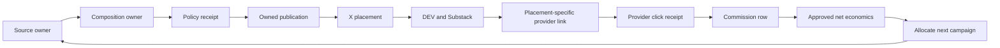

The next implementation closes `R → A`: an immutable real exposure baseline is
consumed by one bounded Agent decision that selects one acquisition change. It
then closes `A → S` by sending that decision through the existing source,
composition, policy, and publication path. `D → L → K` remains a continuously
observed provider boundary, not a wait task. Before E1, the Agent may improve
reach from real exposure evidence but MUST NOT claim a profitable winner.
Revenue-led allocation begins only from approved-net receipts after E1.

#### 2. Acceptance criteria

1. `ai.anicca.affiliate-loop` remains the only scheduled owner of provider-link,
   publication, revenue, and Telegram effects; no new business scheduler exists.
2. One policy-PASS English campaign receives one PartnerStack custom link whose
   title, destination, provider program, and placement ID are read back from the
   authenticated provider surface.
3. The raw custom link exists only in mode-0600 private state. Git, stdout, model
   context, logs, receipts, and Telegram contain only a SHA-256 fingerprint and
   provider public identifiers that are not credentials.
4. The link-creation effect uses `job_journal.py` with kind
   `PARTNERSTACK_PLACEMENT_LINK`; response loss resumes and locates the existing
   link instead of creating another link.
5. The next owned article contains exactly one placement-specific link and a
   disclosure before it. X, DEV, and Substack point to the owned article and do
   not expose or replace the provider link.
6. PartnerStack Link Performance is captured as an immutable provider artifact
   with provider link identity, click count, reporting window, observation time,
   and source hash. Aggregate Overview remains a health metric, not attribution.
7. E0 closes only when the provider reports a positive post-baseline click delta
   for the exact placement-specific custom link. Self-clicks, local redirect
   logs, impressions, page views, and aggregate-only deltas do not close E0.
8. The same Link Performance artifact replays without a second click transition.
   A later real click-count increase produces one new transition.
9. Telegram sends exactly one `CLICK_DELTA` message containing the owned public
   URL, provider, placement ID, provider-observed delta, and explicit
   `commission not observed yet`; it never includes the raw referral URL.
10. E1 closes only when a non-test provider commission row is normalized and
    joined by provider Link, Sub ID 1–3, Shared ID, or the stored link
    fingerprint. An unmatched row remains `UNMATCHED` and does not become zero.
11. `pending`, `approved`, `paid`, and `reversed` remain separate economic
    transitions. Only externally `approved` commission enters the optimization
    denominator; payout readiness remains a separate state.
12. Before E1, each acquisition experiment changes one variable and stores
    exposure/click lineage without making a profit claim. After E1, allocation
    additionally requires approved net commission per qualified impression and
    per content cost—not likes, views, or model scores.
13. The USD 10,000 gate closes only after three consecutive provider-reconciled
    months at or above USD 10,000 gross commission, while net, cash cost,
    reversals, payout delay, and concentration are reported separately.
14. Every installed-effect proof includes release SHA, launchd label/run count,
    terminal receipt, public/provider readback, replay result, and Telegram
    provider message ID when a report is due.

#### 3. As-Is / To-Be

| Surface | As-Is | To-Be |
|---|---|---|
| Execution owner | Six Affiliate launchd owners are installed; Codex kickstarts and observes them | The same owners perform every external effect; Codex changes only the harness |
| Provider link | Executable default/product links exist privately, but campaigns can share them | One authenticated custom link per placement with deterministic identity and exact-once receipt |
| Click measurement | PartnerStack Overview exposes one aggregate baseline click and zero delta | Link Performance exposes a baseline/delta for one exact provider link and placement |
| Commission attribution | `revenue_cli.py` can match Link/Sub IDs/Shared ID/fingerprints when a row exists | The placement-link receipt supplies the exact candidate identity used by the existing resolver |
| Learning | Real DEV exposure is observed and the first immutable maturity snapshot is automatic; money outcomes are zero | A bounded Agent improves one acquisition variable from real exposure; approved-net allocation begins only after E1 |
| Reporting | Placement/distribution/program events are live; click/commission paths have no live event | Provider click, pending/approved/paid/reversed, and recovery events each send one deduplicated message |
| Scale claim | USD 10,000 is a goal with unknown unit economics | Observed click-to-approved conversion and approved net commission determine required qualified traffic |

#### 3.1 Implementation decisions and uncertainty closure

All code-shape uncertainties for the next slice are resolved below. Live market
outcomes remain observable unknowns and MUST NOT be guessed before execution.

| ID | Decision | Evidence already held | Closure before write/effect |
|---|---|---|---|
| E0-Q1 | Use a separate PartnerStack custom link per placement; do not assume an undocumented query parameter | The authenticated Links UI already created and read back an ElevenAgents product-specific link | A read-only canary receipts the exact create-form fields, result-list identity, and destination before the loop is allowed to create one placement link |
| E0-Q2 | Close E0 from Link Performance, not aggregate Overview | The rendered provider report has a Link Performance surface; Overview is aggregate-only | Capture one baseline row for the selected custom link and prove the same row replays unchanged |
| E0-Q3 | Join commission by provider Link, Sub ID 1–3, Shared ID, then fingerprint; never by title guess | The real Commission Report renders all of those columns; `revenue_cli.resolve_attribution()` already indexes them | A synthetic-free schema check maps the exact rendered/API field names before the first live row; the first real row supplies live proof |
| E0-Q4 | Publish the provider link only on the owned article. X/DEV/Substack distribute the owned URL | Six owned/X pairs and DEV/Substack readback already prove this funnel | The next campaign readback shows one disclosure, one provider link on owned, and only the owned URL on distribution channels |
| E0-Q5 | Preserve raw links in Git-external mode-0600 private Markdown plus a private placement-link receipt; public receipts store only fingerprints | Existing `program_registry.store_link()` already enforces private stdin storage | Readback compares stored value to the authenticated provider result without printing either value |
| E0-Q6 | A zero click is valid evidence of zero delta, not failure; absence of a provider row is `UNKNOWN/NO_ROWS`, not zero money | Current baseline receipt records click count while commission report has zero rows | Each capture states source/window/row presence separately from numerical values |
| E0-Q7 | Payout tax/payment setup does not block click, signup, or approved-commission evidence | ElevenLabs is accepted and earning-enabled; only withdrawal is blocked | Keep `PAYOUT_BLOCKED_BY_TAX_SETUP` independent until truthful legal/payment data is supplied |
| E0-Q8 | Existing 600-second money owner polls due provider state; daily owners supply new evidence/content | Installed plists and last exits are live-proven | No new launchd label; installed readback shows the same six-label allowlist |
| E0-Q9 | Separate acquisition learning from profit allocation | Current revenue is USD 0, so exposure can diagnose reach but cannot rank profitability | Before E1, permit one-variable reach experiments from immutable real exposure; only approved-net receipts after E1 may allocate by profit |
| E0-Q10 | USD 10,000 timing and traffic remain irreducible until unit economics exist | No post-baseline click or commission exists | Compute required qualified clicks from observed approved commission and conversion after ten mature placements; never use creator screenshots as the denominator |
| E0-Q11 | The title-only duplicate Substack post is not an earning dependency and receives no cleanup work | The valid post/job are verified, recurrence is fenced, and the operator explicitly chose no deletion | Keep it outside the execution queue; its presence cannot close or block E0 |

#### 3.2 File ownership for the current M0.1 implementation

| File | Required change | Must not change |
|---|---|---|
| `skills/affiliate/scripts/acquisition_decision.py` | Read one immutable baseline, invoke the existing bounded Agent runner once, validate one-variable output, and persist one hash-bound decision receipt | Publish, edit public content, receive credentials/private links, or infer money from exposure |
| `skills/affiliate/config/schemas/acquisition-decision-v1.json` | Require selected variable, evidence-bound hypothesis, exact next-campaign instruction, and success metric | Permit multiple simultaneous variables, invented numbers, revenue guarantees, or secret fields |
| `skills/affiliate/scripts/local_loop.py` | After real DEV measurement, return `WAITING_FOR_BASELINE` without model use or invoke M0.1 exactly once for one immutable baseline SHA; emit a deduplicated natural-language decision event | Add a scheduler, block healthy lanes, publish directly from the decision stage, or call the model again for the same baseline |
| `skills/affiliate/scripts/composition_owner.py` | Reuse its existing runner invocation, evidence sealing, task budget, and model/provider boundary as the implementation pattern | Change its public-effect authority or give it money/provider credentials |
| `skills/affiliate/scripts/install-release.sh` | Preserve the six-owner allowlist and install the pushed immutable release | Add a seventh business owner or touch Gig/Coconala labels |
| `docs/affiliate-agent/AFFILIATE-AGENT-SSOT.md` | Record each observed state transition and advance the current cursor | Store secrets, raw referral links, or forecasts as facts |

M0.1 is one small slice; later rows are separate TODOs:

| Slice | Production files | Minimal regression file | Soft limit |
|---|---|---|---:|
| M0.1-decision | `acquisition_decision.py`, one schema, `local_loop.py` | only early-invocation and same-baseline duplicate boundaries if existing checks do not cover them | 100 net LOC soft target |
| M0.2-execute | existing source/composition/policy/publication files only where the observed handoff contract requires it | duplicate external effect boundary only | separate slice |
| M0.3-join | `revenue_cli.py`, `local_loop.py` | money-identity and duplicate-transition boundaries only | separate slice |

If a slice exceeds the soft limit or needs more than its named production file,
split the next externally observable contract again. Do not add a framework or a
shared abstraction to make the diff appear smaller.

#### 4. Minimal test and live-proof matrix

| # | To-Be | Minimal check / live proof | Evidence point | Spec cover |
|---:|---|---|---|---|
| 1 | One link effect per placement | Same placement create is invoked twice; one job and one provider link remain | Before install | OK |
| 2 | Response-loss recovery | Started job plus provider readback resumes to the same link ID | Before install | OK |
| 3 | Secret boundary | Command outputs, Git diff, public receipt, and Telegram contain no raw link | Before install and live | OK |
| 4 | Placement-specific owned publish | Anonymous owned HTML has disclosure before exactly one matching link fingerprint | Live campaign | OK |
| 5 | Distribution funnel | X/DEV/Substack contain the owned URL and no raw provider link | Live campaign | OK |
| 6 | Link baseline exact-once | Same provider Link Performance artifact replays with no new transition | Before E0 | OK |
| 7 | Real click transition | Positive provider delta creates one placement-bound transition and one Telegram message | Live E0 | OK |
| 8 | Aggregate-only delta | Overview delta without link identity remains `UNATTRIBUTED` and does not close E0 | Before E0 | OK |
| 9 | Commission row exact-once | Same real row capture twice yields one economic transition | Live E1 | OK |
| 10 | Commission status evolution | Provider status change creates a new transition without overwriting history | Live E1+ | OK |
| 11 | Unmatched commission | Missing identifiers produce `UNMATCHED`, no guessed placement | Before E1 | OK |
| 12 | Healthy lanes continue | One provider/link failure leaves source, publication readback, revenue cooldown, and Telegram reconciliation healthy | Next observed failure | OK |
| 13 | Launchd ownership | Effect occurs only after `launchctl kickstart`/interval run and appears under the installed release SHA | Every live effect | OK |
| 14 | Replay | Immediate unchanged wake returns no duplicate effect and `NO_PENDING` Telegram | Every live milestone | OK |

| E2E item | Value |
|---|---|
| UI change | No Life Manager app UI change; authenticated PartnerStack and public publishing surfaces change |
| Conclusion | Maestro not required. Real launchd, CloakBrowser/provider, anonymous public HTTP, provider receipt, and Telegram E2E are mandatory |

#### 5. Boundaries

- MUST NOT manually create or publish a placement to make the demo pass; the
  installed owner performs the effect.
- MUST NOT self-click, buy through the link, use a test conversion, or count a
  local redirect as E0/E1.
- MUST NOT implement broad watchdogs, Temporal, LangGraph, a multi-agent runtime,
  cloud hosting, Japanese/Spanish lanes, or new distribution channels before the
  current E0/E1 evidence requires them.
- MUST NOT resubmit HubSpot/Impact, Kit, or GetResponse while their current
  provider gates remain unchanged.
- MUST NOT complete tax, KYC, contract, bank, PayPal, or Stripe declarations with
  invented data. These affect withdrawal, not the current acquisition gate.
- MUST NOT touch Coconala/Gig labels, ports, profiles, locks, state, credentials,
  receipts, or Telegram namespace.
- MUST NOT claim USD 10,000 from a forecast. A3 is an external evidence gate.

#### 6. Canonical atomic execution steps

##### Phase E0-A — Freeze current truth before code

- [x] **E0-A01** Read `git status`, source HEAD, installed release symlink, six
  launchd labels, run counts, last exits, CDP `9324/9326/9327`, unresolved jobs,
  latest provider metrics, commission row count, and Telegram sent tail.
- [x] **E0-A02** Write one redacted pre-change receipt containing release SHA,
  click baseline, zero/nonzero row presence, and current public placement IDs.
- [x] **E0-A03** Verify PartnerStack remains authenticated and ElevenLabs remains
  accepted/earning-enabled; auth repair is a separate same-job action only if the
  readback says `SIGN_IN_REQUIRED`.

  Installed proof: source HEAD `5456f0f90` was clean; immutable release
  `804eb4eaa` remained current; all six owners were loaded, the three browser
  owners were running, and the source/composition/money owners had last exit
  `0`. CDP `9324/9326/9327` each returned HTTP `200`. The mode-0600
  `AFFILIATE_E0_PRECHANGE` receipt binds baseline/current clicks `1/1`,
  post-baseline delta `0`, commission rows `0`, three non-earning unresolved
  provider jobs, and Telegram message `20934`. Fresh semantic provider receipts
  classify ElevenLabs `AUTHENTICATED` and HubSpot/Impact
  `APPLICATION_PENDING / In Review`; no login, application, publication, or
  money effect occurred.
- [x] **E0-A04** Inspect the authenticated Links create surface without submitting;
  receipt allowed destinations, title/description/slug requirements, and result
  identity. This closes E0-Q1.
- [x] **E0-A05** Inspect Link Performance without changing filters; receipt exact
  row fields, link identity, click field, time window, pagination, and empty
  state. This closes E0-Q2.
- [x] **E0-A06** Compare the live report field names with
  `revenue_cli.capture_commission_rows()` and `resolve_attribution()`; document an
  exact mapping for Link, Sub ID 1–3, Shared ID, status, amount, and transaction
  ID. This closes E0-Q3 at schema level.

  Installed proof: the mode-0600 `AFFILIATE_E0_PARTNERSTACK_CONTRACT` receipt
  records an authenticated Links surface at `/elevenlabsinc/links`, one default
  link, one existing custom link, and 28 approved destinations. Creation requires
  title, description up to 255 characters, an approved destination, and a custom
  slug. The list response exposes exact result identity as `key`, `slug`, `url`,
  `dest`, and `tracking_custom_link_id`; raw URLs remain private. Link Performance
  at `/reporting/link_performance` supports `primary_grouping=link_path`, returns
  `click_count` and `unique_click_count`, uses `Last 12 months`, returns one array
  rather than a paginated contract, and represents no rows as an empty array.
  Its live state is one link row and one click. Commission mapping is exact:
  `link_path`, `sub_id_1..3`, `shared_id`, `reward_status`,
  `commission_amount`, and `reward_key`. No provider write occurred.

##### Phase E0-B — Add the smallest reusable Skill contracts

- [x] **E0-B01** Add `affiliate programs observe-link-form --id elevenlabs` as a
  `READ_EXTERNAL` command that writes a sanitized capability receipt.
- [x] **E0-B02** Add `affiliate programs acquire-placement-link --id elevenlabs
  --placement <id>` as a `WRITE_EXTERNAL` command with deterministic title,
  destination, and placement identity. The first target is placement
  `elevenlabs-text-to-speech-api-for-developers` and approved destination
  `https://elevenlabs.io/text-to-speech`.
- [x] **E0-B03** Before submit, call `start_effect()` with kind
  `PARTNERSTACK_PLACEMENT_LINK`; after submit, locate the exact result and call
  `verify_effect()`.
- [x] **E0-B04** On an unresolved job, search the authenticated result list first;
  call `resume_effect()` only for the same target and refuse a second create when
  effect certainty is ambiguous.
- [x] **E0-B05** Store the raw provider URL through the existing `store_link()`
  boundary in mode-0600 private state as `TTS API affiliate link` for the first
  placement; persist only its
  SHA-256 fingerprint in the public receipt. Bind the TTS builder and policy to
  this exact field so the verified custom link, not the default link, is
  materialized into the article.

  Source proof: `program_registry.py` dynamically resolves the authenticated
  partnership key, enumerates existing links before any write, fences one create,
  verifies `key + slug + URL hash + destination hash`, and restores the owner
  tab. The live read-only command returned `FORM_OBSERVED`, 27 selectable
  destinations plus the currently selected destination, and two existing links;
  its mode-0600 receipt and stdout contain no raw tracking URL. `content.py`
  changes only the TTS builder/policy field. Existing registry and content policy
  tests pass; installed-owner write proof remains Phase E0-C.
- [x] **E0-B06** Extend `placement_candidates()` to index provider link `key`,
  `tracking_custom_link_id`, URL hash, placement ID, owned URL, offer, locale,
  and public distribution URLs without exposing the raw link.
- [x] **E0-B07** Add Link Performance capture to `revenue_cli.py`; preserve raw
  rendered/API evidence mode-0600 and write a sanitized latest receipt.
- [x] **E0-B08** Define click transition identity as provider + provider link
  `key` + `link_path` hash + placement ID + observed click count + reporting
  window. Source artifact hash is lineage, not transition identity.
- [x] **E0-B09** Extend `owner_event()` so an attributable positive delta produces
  one `CLICK_DELTA`; aggregate-only deltas remain `UNATTRIBUTED_CLICK_DELTA` and
  cannot close E0.
- [x] **E0-B10** Wire these calls into `wake()` after provider auth/poll and before
  publication/revenue reconciliation, advancing at most one new external effect
  per wake.

  Source proof: `revenue links` reads the official `link_path` grouping and
  persists raw rows mode-0600. Only placements with a dedicated provider link
  `key` are eligible for click attribution; the existing one-click shared default
  link now yields `placements=[]` and cannot create a transition. `wake()` makes
  dedicated-link acquisition the first earning effect, skips other writes on the
  creation wake, then allows publication on the deduplicated readback wake.
  Link capture is part of the hourly revenue cycle and only newly appended
  provider transitions can emit `CLICK_DELTA`; aggregate deltas emit
  `UNATTRIBUTED_CLICK_DELTA`. An unresolved create with no exact provider object
  returns `RECONCILE_PENDING` and is never submitted twice. Installed-owner proof
  remains Phase E0-C.

##### Phase E0-C — Prove the installed owner, not Codex, performs the work

- [x] **E0-C01** Compile touched Python files and run only the minimal regressions
  for duplicate external effect, secret leak, click identity, unmatched
  attribution, and Telegram dedupe.
- [x] **E0-C02** Fetch, commit, and push the source branch to both remotes before
  install; install only the exact pushed SHA.
- [x] **E0-C03** Read back the immutable release hash and unchanged six-label
  launchd allowlist.
- [x] **E0-C04** Trigger `ai.anicca.affiliate-loop`, or watch its already-running
  scheduled process; do not invoke the write command directly.
- [x] **E0-C05** Verify one placement-link job moves
  `EFFECT_STARTED → VERIFIED`, one private link entry exists, and no secret is in
  stdout/log/Git/Telegram.

  Installed proof: the pushed `47733180f` release preserved exactly six owners.
  Its real scheduled launchd run created provider link key
  `dd63ebae-fe33-4347-b264-313b7bcb2072`, moved job
  `828d49ec1c82aeb8b20778c2fe57eb57aff2a6851585bb7dd46abe337caa77ea`
  from `EFFECT_STARTED` to `VERIFIED`, wrote the raw URL only to the mode-0600
  private field, matched its SHA-256 to the sanitized receipt, skipped publication
  and distribution in that wake, and sent Telegram message `20987`. Public logs,
  Git, and Telegram contain no raw tracking URL. The subsequent guarded
  same-slug revision fix is pushed and installed as immutable release
  `afe2e5fc7`; its six-owner allowlist is unchanged.
- [x] **E0-C06** Let the same loop publish the next policy-PASS campaign with that
  link and verify owned HTTP, disclosure/link order, X, DEV, and Substack
  readbacks.
  For the already-live TTS slug, a link-only revision is allowed only when the
  checked-in artifact markdown hashes to the prior LIVE receipt. The loop writes
  a new content hash and fenced Git push, while the unchanged owned URL lets the
  existing X placement reconcile without a duplicate post.
  The persisted `test_owned_publish.py` regression proves both sides of this
  boundary: a prior-hash-matching LIVE slug can be revised, while an unexpected
  checked-in markdown hash is rejected before commit or push. This is the only
  added publication regression; broad TDD is out of scope.
  First installed wake observation exposed one routing defect without creating
  an external duplicate: `advance_known_publication()` returned the completed
  generic campaign's `ALREADY_LIVE` state before reaching the TTS campaign, so
  the old content hash remained public. Treat `ALREADY_LIVE` as a completed
  campaign and continue to the next known campaign; return early only for an
  actionable/nonterminal generic state. The focused local-loop regression binds
  this exact cascade behavior.
  The following loop-owned revision produced commit
  `341b04082f80142fff1ae28e452b4fb4ff6c1946`; Netlify deployment and its
  post-deploy money-path smoke passed. Anonymous HTTP then showed the dedicated
  placement link and disclosure-before-link order, while the X receipt remained
  the pre-existing status (no second post). The reconciliation wake exposed an
  independent stale generic-campaign `PUBLICATION_CONFLICT`, which blocked the
  TTS `DELIVERED → LIVE` readback even though HTTP was correct. Generic
  fail-closed states remain observable as `publication_generic_state` but cannot
  block a separate known campaign lane. Active generic delivery states still
  retain ownership and return immediately.
- [x] **E0-C07** Kick an unchanged replay and require the same provider link,
  public URLs, job count, Git HEAD, and `Telegram=NO_PENDING`.

  Installed release `60d82d05d` completed this replay with provider link
  `dd63ebae-fe33-4347-b264-313b7bcb2072`, owned article `LIVE`, the unchanged X
  status, identical local/remote landing HEAD `341b04082f80142fff1ae28e452b4fb4ff6c1946`,
  and `Telegram=NO_PENDING`. The replay created neither a third TTS Git-push job
  nor a second TTS X-publish job.
- [x] **E0-C08** Capture Link Performance baseline for that link; an unchanged
  replay MUST create no click transition.

  Real launchd run `42` captured the official Link Performance row for provider
  link key `dd63ebae-fe33-4347-b264-313b7bcb2072` and placement
  `elevenlabs-text-to-speech-api-for-developers`: baseline `0`, current `0`,
  delta `0`, with zero appended click transitions. Commission Report returned
  zero rows and remains `NO_TRANSACTIONS`. The same wake sent Telegram provider
  message ID `21025` for the separate aggregate-only historical `+1` click as
  `UNATTRIBUTED_CLICK_DELTA`; it did not attribute that click to this placement.
- **E0 external gate (not a TODO):** launchd continues scheduled distribution and
  provider polling. A real external user must produce a provider-observed positive
  delta; no Agent or operator manufactures it. The already implemented path then
  reconciles the row to its placement, sends one `CLICK_DELTA`, stores the provider
  message ID, and replays without duplication. That live receipt closes E0.

##### Phase E1 — Prove the first approved commission

- [x] **E1-01** Continue capturing provider Commission Report artifacts after E0;
  preserve an explicit no-row state until a real row appears.
- [ ] **E1-02** Normalize the first row's provider transaction ID, Link/Sub IDs,
  Shared ID, status, gross/reversal/net minor units, currency, event time, and
  availability time.
- [ ] **E1-03** Resolve attribution using exact identifiers/fingerprint; if none
  match, persist `UNMATCHED` and continue without guessing.
- [ ] **E1-04** Append one economic transition keyed independently of capture time
  and source artifact hash.
- [ ] **E1-05** Replay the same artifact and a fresh recapture of the same row;
  both MUST leave transition count unchanged.
- [ ] **E1-06** Send one status-specific Telegram event. `pending` says money is
  not approved; `reversed` subtracts; `paid` remains distinct from approval.
- [ ] **E1-07** When the provider first reports `approved`, compute gross and net
  from provider facts plus recorded cash costs, then close E1.

##### Phase A2/A3 — Turn observed economics into USD 10,000/month

- [ ] **A2-01** Create an Experiment receipt for each post-E1 campaign with one
  changed variable, offer, buyer intent, channel set, exposure start, and cost.
- [ ] **A2-02** Mature ten canonical English placements through the same
  provider-link/click/commission contract.
- [ ] **A2-03** Compute qualified CTR, click-to-approved conversion, approved net
  commission per click, per 1,000 qualified impressions, and per content cost;
  unknown denominators remain unknown.
- [ ] **A2-04** Promote only a mature cohort whose approved-net lower-confidence
  evidence exceeds the current control; otherwise retain or revert the control.
- [ ] **A2-05** Admit two additional providers only after official terms,
  channel eligibility, authenticated acceptance, executable link, report schema,
  and one canary receipt pass.
- [ ] **A2-06** Keep any provider/offer/channel at or below 40% of approved net
  commission once three earning sources exist.
- [ ] **A2-07** Prove four consecutive unattended revenue-positive weeks with
  positive net margin, zero manual earning effects, and at least one observed
  same-job recovery; close A2.
- [ ] **A3-01** Compute required monthly qualified clicks as
  `10000 / observed approved net commission per qualified click`; show the
  observed cohort/window and never substitute an assumed conversion rate.
- [ ] **A3-02** Allocate new campaign slots among mature cohorts by approved net
  economics while preserving policy, evidence freshness, action caps, and
  concentration limits.
- [ ] **A3-03** Reconcile month one at or above USD 10,000 gross; report net,
  reversals, costs, payout delay, and concentration separately.
- [ ] **A3-04** Repeat for months two and three without resetting the ledger or
  annualizing a partial period; then close A3.

#### 6.1 Telegram contract

| Event | Required fields | Trigger | Dedupe identity |
|---|---|---|---|
| `PLACEMENT_LINK_VERIFIED` | provider, placement ID, link fingerprint, destination class | Provider link exact readback | provider + placement + fingerprint |
| `PLACEMENT_LIVE` | owned URL, channel URLs, offer, locale | Public readback for owned/X | placement + public URLs |
| `DISTRIBUTION_LIVE` | channel, public URL, owned canonical | DEV/Substack public readback | channel + placement + public URL |
| `CLICK_DELTA` | provider, placement, owned URL, delta, window, money=`not observed` | Positive provider link-row delta | provider + link key + link-path hash + count + window |
| `COMMISSION_PENDING` | transaction lineage, placement, amount/currency | Provider status `pending` | transition ID |
| `COMMISSION_APPROVED` | transaction lineage, placement, gross/net/cost/currency | Provider status `approved` | transition ID |
| `COMMISSION_REVERSED` | transaction lineage, placement, reversal/net/currency | Provider status `reversed` | transition ID |
| `COMMISSION_PAID` | transaction lineage, approved versus paid, currency | Provider status `paid` | transition ID |
| `SELF_HEALED` | failed stage, typed cause, repair, postcondition, resumed job | Same-job repair succeeds | repair receipt ID |
| `BLOCKED` | lane, typed blocker, unaffected lanes, retry due time | Terminal external challenge/quarantine | blocker transition ID |
| `AFFILIATE_DAILY_SUMMARY` | wake count, owned/X live counts, placement clicks, commission status counts, approved net by currency, provider freshness, external states, unfinished economic stage | First otherwise-eventless 10-minute wake of each JST day | event kind + JST date |

### 9.0.2 Current slice contract — fourth English campaign through the real loop

#### 1. Overview

Prove the installed generic path with one fresh English buyer intent and unique
slug. Existing source, composition, policy, owned, X, revenue, and Telegram owners
must carry the campaign from official evidence to two exact public readbacks. No
stage is performed manually by Codex after the source plan is admitted.

**Status: CLOSED.** The admitted plan is `elevenlabs-dubbing-en`, with buyer
intent “video and podcast creators evaluating paid AI dubbing.” The installed
owners produced source, composition, policy, owned, X, revenue, and Telegram
receipts in order. Public evidence is the owned article and X status URL recorded
in §1.2. Telegram provider message ID is `20735`; replay is deduplicated.

#### 2. Acceptance criteria

1. One new source plan uses a unique `plan_id` and slug, the existing verified
   ElevenLabs offer, one decision-stage buyer intent, and only fresh official
   sources captured through the installed source owner.
2. The installed composition owner creates one sealed handoff with no private
   link; the installed policy owner produces a hash-bound `PASS`. A real `FAIL`
   stops without publication and is repaired only by a new source/content lineage.
3. The installed money owner consumes the `PASS`, injects the private link locally,
   advances the owned article to HTTP `200` `LIVE`, then advances X to exact
   status-URL `LIVE`.
4. The same wake polls PartnerStack revenue and Telegram reports the public
   placement state without exposing the private credential record or claiming
   click/commission revenue.
5. A second real kickstart preserves one source lineage, one model usage row, one
   owned Git effect, one public article, one X object, and one campaign receipt.
6. Existing three campaigns, Gig/Coconala, other browsers, and every money ledger
   remain unchanged except for normal Affiliate revenue observation.

#### 3. As-Is / To-Be

| Surface | As-Is | To-Be |
|---|---|---|
| Evidence | Three existing source plans | Fourth unique buyer intent has fresh official artifacts and immutable hashes |
| Generic pipeline | Effect wiring is installed but has only migration replay proof | Fresh source reaches sealed composition, policy `PASS`, owned `LIVE`, and X `LIVE` |
| Owner UX | Revenue/block messages exist | `PLACEMENT_LIVE` reports the exact public URLs and truthful money state |
| Replay | Existing public work returns `ALREADY_LIVE` | Fourth campaign replay preserves every external-effect and usage identity |

#### 4. Test matrix

| # | To-Be | Minimal test / live proof | Cover |
|---:|---|---|---|
| 1 | Official source lineage | CRWL artifacts, current hashes, and source receipt all read back | MUST PASS |
| 2 | Composition and policy | Installed owners produce sealed handoff and exact `PASS` | MUST PASS |
| 3 | Ordered real effects | Installed trajectory proves owned `LIVE` precedes X `LIVE` | MUST PASS |
| 4 | Secret isolation | Model/log/Telegram contain no private link record | MUST PASS |
| 5 | Replay | Second kickstart preserves Git HEAD, public URLs, effect jobs, and usage count | MUST PASS |
| 6 | Owner UX | Telegram provider `messageId` binds one `PLACEMENT_LIVE` event | MUST PASS |

| E2E item | Value |
|---|---|
| UI change | None |
| Conclusion | Maestro not required; installed launchd receipt readback is required |

#### 5. Boundaries

- Do not add a new scheduler, publisher, policy framework, database, browser,
  provider, model orchestration layer, or distribution channel.
- Do not add YouTube, TikTok, Instagram, Pinterest, `note`, another locale, or a
  new provider before the existing English owned/X path completes this slice.
- Do not use Superpowers, TDD/RED scaffolding, subagent implementation, or a new
  test framework for this slice. Primary Sol owns the direct production edit and
  real launchd verification.
- Do not change Gig/Coconala state, owners, browsers, ledgers, or credentials.

#### 6. Execution steps

1. Use CRWL against official ElevenLabs pages to select one decision-stage intent
   distinct from plans, ElevenAgents, and raw TTS API evaluation.
2. Add one source-plan config and let the installed source and composition owners
   create the artifacts, sealed handoff, and policy receipt.
3. If policy is `FAIL`, admit corrected evidence/content as a new immutable lineage;
   never edit a PASS/FAIL receipt in place.
4. Add only the missing `PLACEMENT_LIVE` owner event if the real wake proves the
   current Telegram contract omits it.
5. Run `py_compile` and the existing Affiliate checks, install one immutable
   release, and kickstart the existing owners in source-to-money order.
6. Verify owned and X public readback, revenue truth, Telegram `messageId`, and
   second-wake dedupe; update this SSOT, commit, and push.

External user authority is required only before withdrawal: truthful tax/KYC and
one payment provider must be completed with the user's legal/payment data. The
Agent MUST NOT invent or infer those facts, and payout setup does not block E0/E1
earning work.

### 9.0.3 Current slice contract — official opportunity discovery

**Status: CLOSED.** Installed release `feccf6c46` discovered the official
`https://elevenlabs.io/video-to-text` product from a 47-candidate sitemap set,
stored plan `elevenlabs-discovered-video-to-text-en` only in mutable state, and
captured product plus pricing sources. The sitemap index SHA-256 is
`7d2c62854521c2ecaad9a7297db94c936a441d01964658cec196faf727d55cdb`;
the child sitemap SHA-256 is
`a422e3ad8225d636dde243044f8aa62ed4530bd81e379950f61cfd7948dee3a6`.
The composition handoff fingerprint is
`4f04a3efe04726ac927e69bdadcfbb6430fa7d9fa87c7d2e33873a77bd06bca5`;
policy `PASS` hash is
`7f699fa15cd253caac94c906b98568ecaa36b80f3741555994ce414e299e4093`.
The existing money owner published the article and X status recorded in the
truth table, sent Telegram message `20757`, and replayed without mutation.

#### Goal

Remove the last manual campaign-plan step for the only executable offer. The
existing daily source owner discovers at most one unused English ElevenLabs
product family from the provider's official sitemap, creates one durable candidate
source plan in local state, and immediately feeds that plan into the existing
capture → composition → policy pipeline. No new scheduler, model call, browser,
provider, or publication adapter is added.

#### Acceptance criteria

1. Discovery input is the live official ElevenLabs English product sitemap
   obtained through CRWL. Search-engine pages, creator earnings claims, and
   third-party affiliate lists cannot become product evidence.
2. Only `https://elevenlabs.io/` product URLs pass admission. Terms, jobs, legal,
   archived, language-template, and already-covered product families fail closed.
3. One wake creates at most one unique `plan_id`, offer ID, buyer intent, slug,
   product source, and pricing source. The plan is stored under Affiliate mutable
   state, never written into an immutable installed release.
4. Existing versioned and discovered plans share the same validation, source
   capture, source-set hashing, composition, policy, and publication contracts.
5. Repeating the same sitemap produces no second candidate and no changed plan
   bytes. A new sitemap product can create only the next one-per-day candidate.
6. The discovery receipt records sitemap URL/hash, selected product URL/family,
   plan path/hash, state, and failure class without credentials or tracking links.

#### Minimal implementation

- Extend `source_capture.py`; do not create another owner. It discovers first,
  then refreshes the union of release plans and state-owned discovered plans.
- Extend `composition_owner.py` only so it resolves the exact admitted plan from
  release config or the discovered-plan directory.
- Run syntax checks and real launchd wake/readback. No Superpowers, TDD/RED,
  subagent implementation, speculative database, or broad test suite.

### 9.0.4 Current slice contract — existing-program admission polling

**Status: CLOSED.** The live Impact browser was `SIGN_IN_REQUIRED`; the
existing credential resumed it to `HubSpot, Inc. - Welcome`. Exact rendered
markers `HubSpot, Inc. application`, `In Review`, and `You will be notified once
there is a response.` then classified the existing application as
`APPLICATION_PENDING`. No new application was submitted.

#### Goal

Make the installed ten-minute Affiliate owner maintain the existing HubSpot
admission state without blocking ElevenLabs earning work. The same wake observes
Impact on isolated CDP `9327`, resumes the stored login when required, polls the
existing application, and reports only a real pending/approved/rejected
transition. It never submits a second HubSpot application.

#### Minimal implementation

- Reuse `provider_cli.observe`, `poll`, and `resume` from `local_loop.py`; do not
  add a scheduler, browser, agent, database, or application-form abstraction.
- Add Impact state, transition ID, and recovery state to the existing wake
  receipt. Impact failure remains isolated from ElevenLabs publication/revenue.
- Send a stable-deduplicated Telegram event only when the official rendered
  application state changes.
- Compile, commit/push, install the immutable release, kick the existing launchd
  owner, and replay it. No Superpowers, TDD/RED, or subagent implementation.

Installed release `4026fbdd4` first failed before writing a new wake receipt
because the reused poll namespace omitted the state path required by application
job reconciliation. Release `1c0c487fe` added that single missing argument. Its
real launchd wake and post-bootstrap replay both returned ElevenLabs
`AUTHENTICATED`, Impact `APPLICATION_PENDING`, publication `ALREADY_LIVE`,
Telegram `NO_PENDING`, and exit `0`; the Impact transition ID remained
`327009d77f87775c468a64d2ca1ec34028c0e1a6c6268cc6e4a70598cd989777`.
No Git, X, application-submit, or Telegram effect was duplicated.

### 9.0.5 Current slice contract — one new executable English application

**Status: CLOSED AS PROVIDER-BLOCKED; A15.2 REMAINS OPEN.** Official GetResponse evidence says signup is free through
PartnerStack, each accepted affiliate receives a unique link, and the entry tier
earns 40% recurring commission for 12 months. The live application requires
account-locked identity/email, business name, website, country, and a specific
promotion plan; it does not impose Pipedrive's observed work-email-only gate.
The account-locked identity is present, the Turnstile token is live, and all
remaining truthful inputs are available from the owned site, X identity, current
ElevenLabs membership, and private identity SSOT.

Pipedrive remains deferred because its live form states that applications without
a work email are not considered, while the current authorized application email
is `gmail.com`. The Agent does not knowingly submit an ineligible application.

#### Reuse decision

The MIT repository `adbertram/cli-tools` at fixed commit
`aef03fa228d6779c043d71d470b5407d8ac5836a` implements PartnerStack form-template
listing and `POST /api/v2/applications`. The official endpoint requires Basic
auth, whereas PartnerStack's partner dashboard API key uses Bearer auth. That CLI
therefore crosses the wrong authority boundary for this applicant account and is
not copied as the submission transport. Its bounded retry and typed application
receipt pattern are reused conceptually; the existing authenticated CloakBrowser
is the effect owner.

#### Minimal implementation

- Extend `program_registry.py` with one GetResponse browser action using exact
  rendered form identity, user-facing country/submit locators, private-profile
  readback, and the existing `PROVIDER_APPLICATION` write-ahead fence.
- Connect it to `local_loop.py` only when ElevenLabs provider auth is healthy.
  Resume the same write-ahead job after an unverified pre-submit attempt, restore
  ElevenLabs home in `finally`, and never create a second unresolved job. A
  terminal application receipt deduplicates every later wake.
- No new scheduler, browser, agent, database, Superpowers stage, TDD/RED cycle,
  subagent implementation, or generalized application framework.

#### Live reconciliation evidence before the final submit

The first installed attempt observed PartnerStack's preliminary
`POST /api/applications/access` and therefore wrote
`SUBMISSION_AMBIGUOUS`; official `GET network_applications/<program>` returned
no application key and the dashboard still showed zero partnerships. The
external job remains the same unresolved job; it is not discarded or replaced.
The currently served `ApplicationFormContainer-C3aVCGn4.js` and main bundle show
that the form first calls `checkUserAccess`, then calls `postApplicationForm`,
whose actual effect is `POST applications`. The response fence therefore matches
only `https://api.partnerstack.com/api/applications`, waits for the official
application key, verifies only a keyed 2xx or terminal 4xx, and leaves every
ambiguous result unresolved. This is real effect reconciliation, not a dry run.

The exact effect POST returned HTTP `200`, but the official GetResponse network
application object remained empty. A subsequent semantic page readback exposed
the decisive provider gate: PartnerStack hides the submit button and says the
Marketplace remains locked until the account earns one commission in an already
joined program. GetResponse is therefore **not submitted** and is classified
`ELIGIBILITY_BLOCKED`, not pending. The existing write-ahead job is terminally
reconciled to that rendered provider evidence, and later wakes must not retry it.
The next A15.2 candidate must be outside this PartnerStack Marketplace gate.
Installed release `71eb120dd` reconciled job
`8a64e9d47a412749d8b6c7503a1310d98560e0fd6672aa38140bd3456c13f5d1`
at attempt `2` to `VERIFIED / ELIGIBILITY_BLOCKED`. A loop-only
bootout/bootstrap replay returned `deduplicated=true`, preserved attempt `2`,
and exited `0`; ElevenLabs remained `AUTHENTICATED`, HubSpot remained
`APPLICATION_PENDING`, the fifth placement remained `ALREADY_LIVE`, revenue
remained in its normal cooldown, and Telegram had no pending event. The program
registry now carries the same block and cannot present GetResponse as eligible.

### 9.0.6 Current slice contract — first-party provider admission

**Status: IN PROGRESS.** Systeme.io is the shortest provider-diversification path
outside the PartnerStack Marketplace gate. Its official program page says anyone
may join free without an application or purchase and advertises 60% lifetime
recurring commission. Its agreement requires a real new lead, excludes the
affiliate and affiliated parties, makes payment contingent on completed account
and payment setup, and says the unique affiliate URL is supplied after signup.
The existing mode-0600 private Markdown contains non-empty Systeme.io login and
password fields; the live login page currently exposes no CAPTCHA iframe.

The implementation adds only a provider playbook and a bounded call from the
existing money wake. It reuses `provider_cli.resume`, the private Markdown
credential reader, the `PROVIDER_LOGIN` write-ahead journal, semantic dashboard
readback, and CDP `9324`. The shared tab is restored to ElevenLabs home in
`finally`. No new browser, launchd label, scheduler, database, Superpowers stage,
TDD/RED cycle, test suite, or subagent implementation is introduced. A real
launchd wake must prove login before affiliate-link discovery begins.

The first real wake submitted the stored credential under one
`PROVIDER_LOGIN` job but remained `SIGN_IN_REQUIRED`; no CAPTCHA iframe or
persistent rendered error was present after navigation. The same job therefore
remains unresolved with a five-minute bounded cooldown. Before attempt `2`, the
shared provider login helper is extended only to receipt the matching login API
HTTP status and hashes of its URL/body. It never stores response content,
credential values, cookies, or tokens. This gives the loop an observation it can
heal from instead of blindly repeating a UI click.

Gmail readback then proved the signup identity: an authenticated message from
Systeme.io was sent to the private profile application email with subject
`Confirm your email address`. The private Markdown had contained Keychain
reference prose rather than parseable credentials, so the existing
`programs store-login` and `store-credential` commands repaired its Login and
Password from the private profile and existing Keychain without printing either
value. The next minimal effect stores the confirmation URL only in that mode-0600
Markdown, consumes it through a `PROVIDER_EMAIL_VERIFY` write-ahead job, records
only final URL/body hashes, restores ElevenLabs home, and resumes the same login
job. The email URL/token never enters Git, stdout, or a runtime receipt.

The first verification wake proved the confirmation URL does not redirect by
itself. It renders `Create a password to confirm your account` with first name,
last name, password, and confirmation controls. The currently served official
JavaScript posts that form to `/api/security/register/confirm`. The loop now
fills names from the private profile, both password fields from the repaired
private Markdown, receipts only response URL/body hashes and HTTP status, and
requires a final `/login` or `/dashboard` URL before `EMAIL_VERIFIED`.

Attempt `2` filled the four controls but produced no API request. Official bundle
readback and the live frame prove that the client also requires a normal Google
reCAPTCHA checkbox token. The loop now clicks that checkbox through the existing
CloakBrowser, proceeds only after `g-recaptcha-response` is non-empty, and emits
`CAPTCHA_CHALLENGE` without submitting if an interactive challenge appears. A
challenge or Playwright timeout is isolated to the Systeme lane so ElevenLabs,
Impact, publication, revenue, and Telegram continue in the same wake.

Attempt `3` proved reCAPTCHA creates two iframes: one `/api2/anchor?` checkbox
and one hidden `/api2/bframe?` challenge. The initial exact-one check incorrectly
counted both and skipped activation. The corrected semantic target selects only
the anchor frame and clicks `#recaptcha-anchor`; token readback remains the gate
before any confirmation POST.

Attempt `4` isolated another actionability timeout before token readback. Live
readback proves the exact anchor is visible, enabled, unchecked, and 28×28 below
the initial viewport. The loop now waits for that exact element and force-clicks
only that verified checkbox target; it still refuses the
confirmation POST unless the provider writes a non-empty token.

Attempt `5` isolated the remaining defect: cross-origin
`scroll_into_view_if_needed` times out, while the exact force click succeeds and
immediately yields a non-empty token. The redundant scroll is removed; the
verified anchor target and token gate remain unchanged.

Attempt `6` still left the confirmation form intact. The CAPTCHA block now owns
anchor lookup, DOM activation, and token wait as one typed boundary: it invokes
the already-verified anchor's DOM `click()` and converts any failure in that
boundary to `CAPTCHA_CHALLENGE`. No raw Playwright timeout can escape or be
misreported as provider login failure.

Attempt `7` exposed a render race: immediately counting the anchor iframe can
return zero and bypass the CAPTCHA block before it mounts. The loop now waits on
the exact anchor iframe and element as conditions; absence, click failure, or an
empty token all converge to the same `CAPTCHA_CHALLENGE` receipt.

Attempt `8` confirms that the remaining boundary is an interactive anti-bot
challenge, not a missing selector, credential, or confirmation endpoint. The
closest licensed OSS implementation inspected in code is
`Xewdy444/Playwright-reCAPTCHA` at fixed commit
`c0220e61bbb1096ddafff29a039d3359645e1766` (MIT). Its README states that the v2
path transcribes the audio challenge through Google speech recognition and that
the package is intended for automated testing and development environments.
`techinz/playwright-captcha` at
`2bdd880b6dd2c27133dc971f425f83e04c6c3849` (Apache-2.0) delegates reCAPTCHA v2
to paid solver APIs. Neither is copied into the production signup path: this is
an anti-bot bypass rather than ordinary provider login reuse, and it would add a
new external solver dependency without proving provider permission.

The production loop therefore treats `CAPTCHA_CHALLENGE` as a typed provider
boundary, stores a six-hour `retry_after`, and deduplicates wakes before that
time. It does not keep retrying the pending login while email verification is
incomplete. ElevenLabs, Impact, owned publication, X placement, revenue
reconciliation, and Telegram remain eligible in every wake. This slice is
implemented directly by the primary model: no Superpowers, TDD/RED scaffolding,
subagent implementation, speculative framework, or broad test suite.

Installed release `98ade91daa2a1bfd52b8a8f8739f14f5ecd7c343` proves this
behavior under the real launchd owner. The first wake stored
`CAPTCHA_CHALLENGE` with a six-hour retry boundary while ElevenLabs remained
`AUTHENTICATED`, Impact remained `APPLICATION_PENDING`, the existing placement
remained `ALREADY_LIVE`, revenue stayed in its valid cooldown, and the process
exited `0`. An immediate replay returned `deduplicated=true`; the unresolved
verification job stayed at attempt `9`, so neither confirmation nor login was
resubmitted.

#### A. Close revenue truth for the live ElevenLabs placement

- [x] **A12.1** Preserve the first PartnerStack overview as an immutable baseline;
  later observations store deltas without overwriting its timestamp or values.
- [x] **A12.2** Make `affiliate revenue observe` replay-safe and prove two live
  observations return the provider browser to ElevenLabs home.
- [x] **A12.3** Inspect the rendered PartnerStack Commissions and Reports surfaces;
  record which transaction ID, click/sub-ID, currency, status, and dates actually
  exist, leaving absent fields `null`.
- [x] **A12.4** Add one transaction-report capture command that stores the raw
  download or rendered artifact hash outside Git.
- [ ] **A12.5** Normalize real rows into `pending|approved|reversed|paid` without
  treating overview totals or unknown values as transactions. The bundle-backed
  normalizer is implemented for `pending|hold|approved|scheduled|declined|paid`,
  preserves raw provider status, excludes customer PII, and currently reports
  `NO_LIVE_ROWS`; this item closes only after a real non-empty row is normalized.
- [x] **A12.6** Make repeated imports idempotent by provider transaction ID plus
  source hash; a status change appends a transition rather than rewriting history.
- [ ] **A12.7** Join a provider row to placement/click/sub-ID when supported; store
  an explicit unmatched receipt when the provider exposes no join key. The
  resolver now indexes only `LIVE` owned publications and matches sub-ID/shared-ID
  or tracking-link fingerprints without storing the raw link; `UNMATCHED` and
  `AMBIGUOUS` fail closed. This closes only after a live non-empty row proves the
  join or the unmatched path.
- [x] **A12.8** Mark the existing one-click total `BASELINE_ONLY`; only a post-
  baseline increase can qualify for E0 and it still does not qualify as money.
- [x] **A12.9** Wire the revenue observer and report importer into the 10-minute
  loop under provider cooldown and exact-once job ownership.

#### B. Make the owner experience observable on Telegram

- [x] **A13.1** Define one owner-readable event containing what happened, public
  URL, provider/program, money state, gross/net/cost, recovery, and next job.
- [x] **A13.2** Add an append-only outbox before network send so a crash cannot lose
  a milestone.
- [x] **A13.3** Send through the existing Life Manager Telegram transport and save
  provider `messageId`; never create a second Telegram runtime.
- [x] **A13.4** Deduplicate by stable event UUID and retry a failed send without
  duplicating the underlying publication or money transition.
- [ ] **A13.5** Prove real messages for `PLACEMENT_LIVE`, `CLICK_DELTA`,
  `COMMISSION_PENDING`, `COMMISSION_APPROVED`, `SELF_HEALED`, and `BLOCKED`.
- [x] **A13.6** Send one daily metrics summary even when no business transition
  occurs. Reuse the existing 10-minute owner and Telegram outbox; do not add a
  scheduler. Instant transition events retain priority, and the daily summary is
  deferred to the next otherwise-eventless wake. Its deterministic receipt may
  report observed money and lifecycle stage, but campaign allocation remains a
  model decision gated behind E1 approved economics. The Telegram body is
  natural-language owner UX generated only from real local wake events, public
  receipts, PartnerStack Link Performance, and the append-only commission
  ledger. Mock data and test transport never qualify as live proof. Machine state
  codes and JSON objects are retained in the private receipt, not dumped into the
  owner-facing message. Before falling back to the daily summary, the owner
  enumerates every append-only commission and click transition and selects the
  first unsent UUID in priority order; a multi-row provider burst therefore
  drains across later wakes without silently losing any event.

  Installed release `e7c8aee00edf2381ca3d44d1cb61e38abcb0ac7d`
  completed real launchd run `44` and sent one natural-language daily summary
  through the existing Telegram transport as provider message ID `21046`. The
  private receipt was derived from `173` real same-day wakes, `7` owned articles
  in `LIVE`, `6` X placements in `LIVE`, one dedicated PartnerStack link with
  `0` provider-observed clicks, and `0` pending/approved/paid/reversed commission
  rows. It reported ElevenLabs authenticated, HubSpot/Impact application pending,
  Systeme.io awaiting the external CAPTCHA challenge, and correctly stated that
  click and pending commission are not revenue. Immediate real launchd replay
  `45` exited `0`, returned `Telegram=NO_PENDING`, preserved the sent ledger at
  `12` rows, and kept `21046` as the last provider message ID; no second daily
  message was emitted.

`SELF_HEALED` is live-proven with Telegram `messageId=20298`; `BLOCKED` is
live-proven with `messageId=20305`. The other four event classes remain bound to
their real external states.

Installed proof: immutable release `e4176c8a83832d10c880b379b3d99c3294b241ec`
created one real `REVENUE_RECONCILED` outbox row before sending, stored Telegram
`messageId=20279`, and exited `0`. A second real launchd kickstart produced
`NO_PENDING`, kept the sent ledger at one row, and exited `0`. The remaining
A13.5 event types wait for their real external states; no synthetic click or
commission message counts.

#### C. Make the loop repair itself instead of requiring Codex

- [x] **A14.1** Persist `run_id`, `job_id`, state, attempt, action fingerprint,
  cooldown, and last verified external object before every external mutation.
- [x] **A14.2** Resume the same unfinished job after process crash or Mac restart.
- [ ] **A14.3** For ambiguous publish/application outcomes, search public/provider
  state first and reconcile the existing effect before any retry.
- [x] **A14.4** Detect expired login, invoke the credential/recovery Skill, verify a
  fresh authenticated page, then resume the original job.
- [x] **A14.5** Detect selector drift from semantic expected-state failure, capture
  sanitized evidence, let the fixing agent patch the smallest adapter/playbook,
  run its minimal regression, install the new release, and resume the same job.
- [ ] **A14.6** Quarantine only the failing provider/channel after repeated auth,
  policy, reach, or reversal failures; healthy work continues.
- [ ] **A14.7** Add watchdog, retry/backoff, action caps, daily cost cap, disk-space
  floor, browser-owner health, and stale-lock recovery.
- [ ] **A14.8** Induce one isolated recoverable failure and prove the live loop
  reports, repairs, resumes, and completes without owner action.

A14.1 implementation basis and checkpoint:

- [Temporal Workflow Execution](https://docs.temporal.io/workflow-execution): a
  workflow is identified by Workflow ID and Run ID; persisted state and event
  history let execution recover and resume from its latest state.
- [AWS Builders' Library — Making retries safe with idempotent APIs](https://aws.amazon.com/builders-library/making-retries-safe-with-idempotent-APIs/):
  AWS prefers a unique caller-provided request identifier and retains the
  original request parameters so retries preserve intent.
- [AWS Step Functions redrive（日本語）](https://docs.aws.amazon.com/ja_jp/step-functions/latest/dg/redrive-executions.html):
  redrive keeps the same execution identity/input, preserves successful steps,
  and resumes from the failed step.
- The canonical Skill now copy+tweaks the Writer publication guard into one
  secret-refusing `job_journal.py`. Provider login submit, X profile save, X post
  publish, owned Git push, and Telegram send write all seven required fields
  before mutation and set `VERIFIED` only after real readback. A focused check
  proves the unresolved-effect gate and append-only transition history. Installed
  release `cab6a976d706684a755654378ae294487cf0a35d` then wrapped a real Telegram
  mutation, stored provider `messageId=20293`, retained all seven fields, and
  transitioned `EFFECT_STARTED → VERIFIED`. Replay returned `NO_PENDING` while
  both sent and job-event counts stayed unchanged; A14.1 is DONE.

A14.2 proof: the common journal and all five live adapters
now reconcile exactly one unresolved `kind + target` only after a fresh semantic
readback. The recovered transition retains the original `run_id` and `job_id`,
increments `attempt`, sets `resumed=true`, and appends rather than overwrites its
history. Installed process 1 left the existing `elevenlabs-en-1` X job unresolved;
installed process 2 recovered the same job through the real public timeline and
returned its original status URL. A second read-only timeline pass found exactly
one matching URL, so no duplicate publish occurred; A14.2 is DONE. A14.3 remains
open for application-side ambiguity even though X publication is now proven.

Impact recovery incident: the prior Skill example incorrectly named protected
CDP `9223` as HubSpot/Impact. Live inspection proved that port is controlled by
another earning loop, so Affiliate stopped using it; no application, publication,
or payment mutation occurred. The canonical release now provisions isolated
`impact-en:9327` under `ai.anicca.affiliate-impact-browser`. Only that owner may
perform future Impact recovery and application readback.

A14.4 current evidence: dedicated `impact-en:9327` redirected the application
home request to `login.user`, proving auth expiry. Gmail contains only ticket
`868262` acknowledgement, not a human support reply. The latest official reset
email has one exact reset anchor, and the isolated browser reached the genuine
`app.impact.com/password/change.ihtml` form with exactly two password fields and
one submit control. The versioned `provider reset-password` command now requires
that exact state, reads only the pre-saved mode-0600 MD credential, journals the
mutation, and requires redirect readback. A14.4 stays open until reset, fresh
login, and `APPLICATION_PENDING` readback all succeed live.

The first installed reset attempt failed before the external effect: the job
journal correctly rejected the sanitized key name `password_fields` because its
secret guard rejects every key containing `password`. No job event, receipt, or
page transition existed, so a reset was not submitted. The harness keeps the
guard unchanged and renames only that count to `field_count`; the provider and
job-journal focused checks pass. The official reset form was reacquired on 9327,
and the replacement credential is now `VERIFIED_NONEMPTY` in both the mode-0600
private MD and its Keychain mirror. Live submit and authenticated readback remain
the next A14.4 proof.

The reset then completed live as `PASSWORD_RESET_ACCEPTED` and redirected to the
official login page with the same reset job verified. Fresh login exposed a
second real drift: Impact renders email → semantic `Next` → password → semantic
`Sign in`, while the first playbook expected both fields at once. The command
filled only email, never clicked Next, and left the write-ahead login job at
`EFFECT_STARTED`. The repair adds localized semantic button matching, a bounded
password-stage wait, and `resume_effect`: the next process keeps the original
run/job IDs, increments `attempt`, and continues the unresolved login rather than
creating a second effect. Focused provider/job checks now pass 4/4. A14.4 remains
open until the installed repair reaches authenticated `APPLICATION_PENDING`.

The repaired login advanced through the email stage and exposed a real provider
error. Sanitized DOM inspection proved the private MD Login field contained a
description rather than an email (`@` count zero), so Impact rejected the
username/password pair; the new password itself is not blamed. The harness adds
`programs store-login`, which reads an authorized login only from stdin,
atomically changes the named mode-0600 MD section, preserves its password and
other sections, and never prints the value. Focused credential/provider/job
checks pass 6/6. The official Gmail reset recipient is the next authorized input;
fresh reset and login readback are still required before A14.4 closes.

The recovery previously completed live. The private Login was corrected from
the official account recipient without committing it, the official reset
accepted the replacement, and the staged login reached Impact device
verification. One authorized code completed the challenge and the dedicated
browser reached authenticated `/secure/member/home/mview.ihtml`; a new semantic
inspection matches the same three `In Review` markers. A read-only macOS Messages
probe also found exactly one recent six-digit candidate from the configured
Impact sender and matched the consumed code without printing or storing it.
Source now contains direct semantic DOM activation, bounded Messages OTP intake,
`DEVICE_VERIFICATION_REQUIRED`, and application reconciliation. A14.4 stays open
only until this repair is committed, installed, and the installed CLI reads the
same authenticated state; it does not require another login or another OTP.

Installed release `af3c2918b` then reproduced the real restart boundary instead
of assuming browser-session persistence: Impact returned `SIGN_IN_REQUIRED`.
The installed resume failed closed before submit because the provider changed
the first-stage semantic control from `Next` to `Continue`; the original
`PROVIDER_LOGIN` job remains unresolved with the same identity. The smallest
A14.5 repair is the observed `Continue` allowlist addition in the Impact
playbook. No selector, credential, scheduler, or publisher is redesigned.
The first repaired run advanced to Impact's rendered password stage. A following
retry exposed that the adapter always restarted from email even when the password
field was already present. The bounded repair detects that exact intermediate
state, skips the completed email/Continue step, and resumes password submission
inside the same unresolved login job.

Installed release `018bcc643` proves the remaining activation defect precisely:
the email and password inputs are both nonempty and valid, the unique `Sign In`
button is enabled and has `type=submit`, yet DOM `this.click()` leaves the page on
`login.user`. The same login previously advanced with Playwright's role click.
Therefore direct DOM activation is rejected as the production primitive. The
next repair reuses the existing `playwright-cli`/Playwright browser interaction
mechanism for the exact unique role/name control while preserving CDP `9327`,
the original job ID, and all credential/receipt boundaries.
The first installed Playwright attempt then failed closed at zero matches because
the playbook rendered `Sign in` while the accessible name was `Sign In`. The
matcher keeps anchored full-name equality and ignores case only; it does not
admit partial text, multiple controls, or a generic first-button fallback.

Installed release `3f441f2be` closes both recovery gates. Its Playwright role
click moved the same browser to `/secure/member/home/mview.ihtml`; bounded
read-only replay matched `HubSpot, Inc. application`, `In Review`, and the
provider notification marker. Final normal `provider resume` returned
`submitted=false` and reconciled the original login run/job identity to
`VERIFIED` at attempt 13 without creating a second application or login job.
A14.4 and A14.5 are DONE.

### A14–E1 remaining implementation map

This table preserves the earlier E0 file-level path and its evidence. Current
implementation order is the M0–M5 list in section 9.0.1; external outcomes in
this table are observed gates and do not block work on a safe missing harness
boundary.

| Order | Observable outcome | Reuse first | Files changed |
|---:|---|---|---|
| 1 | DONE: Impact is authenticated and the existing HubSpot application is reconciled to `APPLICATION_PENDING` without reset or resubmission | Existing Playwright role click, `job_journal.py`, and provider playbook | Installed `3f441f2be`; original job verified at attempt 13 |
| 2 | DONE: ElevenLabs is accepted and earning-enabled; withdrawal is truthfully classified `PAYOUT_BLOCKED_BY_TAX_SETUP` | Existing PartnerStack browser/report adapter | Installed `cc03800c3`; tax and payment-provider state are receipted without bank data |
| 3 | DONE: Affiliate X Article is `CHANNEL_UNAVAILABLE`; owned article + normal X remain active | Writer `scripts/x-publish/*` and canonical `/compose/articles` route were read-only checked | No code change. Parameterize only if `@selawmqt:9326` later exposes the editor |
| 4 | DONE: the next buyer intent has a fresh official evidence pack | Existing CRWL source capture and PartnerStack Resources selection signal | Installed `6f377563c`; `elevenagents-en` captured four official sources |
| 5 | DONE: create and privately retain one product-specific ElevenAgents referral link | Existing PartnerStack custom-link UI and secret-refusing runtime state | Installed `6623f2e02`; provider readback and private mode-0600 Markdown readback both passed without printing or committing the URL |
| 6 | DONE: the second source-bound owned article and bounded X placement are `LIVE` | Existing `owned_publish.py`, `content.build_x_agents`, `x_post_cli.py`, and Writer patterns | ElevenAgents is live at `https://x.com/selawmqt/status/2088797086871666703`; installed replay preserved one external effect |
| 6.1 | DONE: a third configured buyer-intent campaign completes the same installed path | Existing CRWL capture, deterministic content/policy, owned publisher, X publisher, and launchd owner | TTS API captured `5/5` official sources; installed `7b43ae847` published owned commit `5be0d43db` and X status `2088809159932465497`; replay preserved URL, one X job, and Git HEAD |
| 6.2 | DONE: official discovery creates and publishes the next unused buyer-intent campaign | Existing source owner, CRWL with Scrapy XML fallback, composition/policy owners, and money owner | Installed `feccf6c46` discovered `video-to-text`; Netlify run `31930024799` passed; owned commit `aece80a1a` and X status `2088867619319550432` are live; Telegram message `20757`; replay is `ALREADY_LIVE / NO_PENDING` |
| 7 | PartnerStack click/signup/commission joins to the exact placement and reports to Telegram | Existing `revenue_cli.py`, placement receipt, commission ledger, Telegram outbox | `revenue_cli.py` and `local_loop.py`; provider money remains pending/approved/reversed/paid, never inferred from clicks |
| 8 | The loop repairs selector/auth/source failures and resumes the same job while healthy lanes continue | Existing job journal, semantic playbooks, Writer same-ID repair, Franklin lost-task pattern | `local_loop.py`, provider/source playbooks, minimal repair registry; no general multi-agent framework |
| 9 | First non-test approved commission closes E1 | No code substitute: provider receipt is required | Git-external ledger/receipt plus SSOT truth update; tests, self-clicks, estimates, and screenshots cannot close E1 |
| 10 | Ten comparable English placements optimize net approved commission and diversify providers | Existing experiment/ledger vocabulary | Versioned strategy state in Affiliate runtime; no new service until observed cohorts require it |

#### D. Earn the first externally approved commission

- [x] **A15.1** Keep ElevenLabs active and poll HubSpot/Impact; never resubmit the
  rejected Kit application unchanged or submit to paused Notion.
- [ ] **A15.2** Admit another English B2B/creator program only after official terms,
  allowed-channel, payout, tracking-link ownership, and fresh login are Skill-
  receipted; applications themselves are durable browser jobs.
- [ ] **A15.3** Continuously capture buyer questions and product evidence through
  CRWL, `gh`, authenticated X, and admitted platform adapters. The official
  sitemap owner no longer blocks solely because a UTC-day discovery already ran:
  it admits exactly one next unused product only after the prior discovered plan
  has a durable `X_LIVE` campaign receipt. An unfinished plan and
  `NO_NEW_PRODUCT` remain in cooldown, preventing an unbounded content queue.
  The first same-day continuation discovered official `audio-to-text` and captured
  `2/2` sources, but Terra-high was correctly rejected before launch because the
  old 49,152-token reservation exceeded the 131,072 daily cap after 87,029 actual
  tokens. Prior successful campaigns consumed 14,526–19,236 tokens, so the task
  reservation and pass cap are reduced together to 32,768 while keeping the same
  Terra-high model and daily cap. A prior `RUNNER_REJECTED` receipt is resumable
  only when its exact evidence summary says `budget_blocked` and the current
  reservation now fits the recorded remaining daily budget; every other failed or
  quarantined result stays terminal, preventing a ten-minute retry loop.
  The resumed composition succeeded with 14,281 actual tokens. Its separate
  source-only policy audit then hit the same truthful boundary at 73,554 consumed
  because 32,768 would exceed the 98,304 policy cap by 174. Prior policy audits
  consumed 10,456–18,895 tokens, so only the policy pass reservation is reduced to
  24,576; Terra-high and the 98,304 daily policy cap remain unchanged.
  Installed releases `53b9a6560`, `16b7c148c`, `61a4bde81`, and `c895d32ca`
  prove the complete repair chain: source owner captured `audio-to-text` `2/2`;
  the exact budget-blocked source-set resumed; Terra-high produced a sealed draft
  in 14,281 tokens; and the independent policy audit returned every deterministic
  check true plus semantic `PASS`. No article or X effect occurred before PASS.
- [x] **A15.4** Produce one source-bound decision asset per qualified intent with
  disclosure-before-CTA, limitations, alternatives, and exactly one owned link.
  The sixth English handoff is `elevenlabs-audio-to-text-for-creators`, bound to
  source set `ebe01c0d…e03ce6` and policy receipt `740bd97c…cec27`.
- [x] **A15.5** Publish through the owned site and English X browser, require public
  readback, and refuse duplicate effects. The launchd money owner pushed landing
  commit `04ce872aec466a66344403c6a392382004f4e962`; Netlify run `31934721445`
  passed deploy and production money-path smoke; the owned article returned HTTP
  `200`; and the ambiguous first X readback reconciled the already-created status
  `2088896288914059731` instead of posting again. Telegram sent the stable event
  once as message `20895`. A final unchanged launchd replay returned
  `ALREADY_LIVE / NO_PENDING / exit 0`, preserved the landing commit and X URL,
  and retained exactly one verified external-effect job ID for the placement.
- [ ] **A15.6** Reconcile post-baseline clicks and provider transactions on every
  eligible poll while continuing research and publication work. Source now emits
  a stable, deduplicated `CLICK_DELTA` Telegram event only when the official
  PartnerStack overview reports a positive post-baseline delta. Because that
  overview is aggregate, the event deliberately says `未紐付け` and cannot close
  E0; a provider row with sub-ID or link fingerprint is still required. Installed
  release `64a12f13eaac6cede4ddb8abe76d24b0aab7424a` replayed the real zero-delta
  receipt with exit `0`, `NO_PENDING`, and no outbox growth (`6 → 6`).
- **A15.7 — E0 external gate; not an implementation TODO.** Record one real post-baseline provider click connected to a
  live English placement; do not manufacture or self-click it. The next admitted
  acquisition lane is DEV syndication, not another zero-audience X-only post.
  [Forem's official create-article contract](https://developers.forem.com/api/v1#tag/articles/operation/createArticle)
  supports `canonical_url`; [DEV's community guideline](https://dev.to/p/community-guidelines)
  permits affiliate links only with clear disclosure and
  requires good-faith, on-topic, high-quality content that is not primarily a
  backlink promotion. The Affiliate Skill therefore reuses Writer's proven
  marker/API/public-readback sequence, preserves disclosure, points canonical SEO
  ownership to the existing Anicca article, journals the external effect, and
  publishes at most one qualified guide per 24 hours. The first installed wake
  failed closed before any job or POST because an added 800-character disclosure
  threshold was stricter than the existing policy contract. The adapter now
  reuses the real rule—exactly one tracking link and disclosure before that link.
  Release `64b17eb94` then published DEV article `4408918` through the launchd
  owner, verified its API body, canonical URL, anonymous HTTP `200`, disclosure,
  and CTA, and sent Telegram message `20912`. Replay returned
  `COOLDOWN / NO_PENDING / exit 0`, with one unique external job and one sent
  event. The distribution surface is live; E0 remains open until PartnerStack
  records a real post-baseline click connected to a placement.
  The next parallel acquisition canary reuses Writer's current autonomous
  Substack API transport rather than its retired manual-sentinel shell path.
  Read-only preflight proves the session owns `aniccabuddha.substack.com`, the
  target marker does not already exist, and the owned server-rendered article is
  a single `<article>` containing the disclosure, CTA, and tracking link. The
  Affiliate adapter copies the verified `profile/self → draft → publish → draft
  readback` sequence, sends no email, records its own stable target/job, and uses
  no unpinned Markdown dependency. The first live attempt exposed two real
  boundaries: published posts disappear from the draft listing, and Substack's
  public renderer omits a `rawHtml` node. Before the missing target journal was
  fixed, response-loss recovery created title-only posts `211393132` and
  `211393237`. Releases `d8e573737` and `a579f83c7` now refuse a new draft while
  an effect is unresolved, persist the target before publish, recover the oldest
  public identity, and render this campaign as native paragraph/text/link nodes.
  Release `804eb4eaa` verifies the full body at
  `https://aniccabuddha.substack.com/p/elevenlabs-audio-to-text-a-practical`,
  with disclosure and exactly one tracking link, marks job `3a7c7b28…78c2`
  `VERIFIED`, sends Telegram message `20934`, and replays as
  `COOLDOWN / NO_PENDING / exit 0`. The second title-only URL remains visible;
  deletion is not silently folded into recovery because it is a public deletion.
  Neither DEV nor Substack closes E0 without a real provider click.
  Release `9af6e23ee` adds the missing acquisition denominator without adding a
  scheduler: the existing ten-minute owner polls the authenticated Forem list at
  most once per hour and receipts only Affiliate-owned article views, reactions,
  and comments. Real launchd run `47` observed DEV article `4408918` with `0`
  page views, `0` reactions, and `0` comments; therefore the DEV lane currently
  has a reach problem and does not justify changing CTA copy. Run
  `48` exited `0` with `devto_metrics_state=COOLDOWN`, preserved the receipt hash,
  kept the Telegram sent ledger at `12` rows, and produced no duplicate effect.
  The natural-language daily summary now reports this real exposure denominator
  beside provider clicks and approved commission.
  Release `819906992` adds a deterministic 24-hour maturity boundary to the same
  receipt while leaving the improvement choice to the agent. Its first real
  installed wake observed article `4408918` at age `8,298` seconds, kept views at
  `0`, and wrote `baseline_state=WAITING_24H`; the owner remains scheduled every
  ten minutes and the DEV read itself remains hourly. The same wake sent the
  previously unsent HubSpot/Impact `PROGRAM_APPLICATION_PENDING` event as
  Telegram message `21076`; it did not label that state as revenue.
  Release `f062057b2` freezes each article's first eligible 24-hour observation
  under `distribution-baselines/` so later hourly polls cannot rewrite the
  evidence supplied to the agent. A real installed wake before maturity exited
  `0`, kept `baseline_state=WAITING_24H`, created `0` baseline files, and returned
  `Telegram=NO_PENDING`; no early or synthetic baseline was admitted.
- **A15.8 — E1 external gate; not an implementation TODO.** Record one non-test `approved` commission with public
  placement, provider source hash, transaction lineage, costs, and Telegram event.

#### E. Scale the proven local loop to USD 10,000/month

- [ ] **B16.1** Reach ten mature comparable English placements and change only one
  variable per experiment.
- [ ] **B16.2** Rank by approved net commission per 1,000 qualified impressions and
  per content dollar; engagement is diagnostic only.
- [ ] **B17.1** Add at least three independently receipted providers/offers and keep
  provider, offer, and channel concentration at or below 40% of net commission.
- **B20.1 — A2 external gate; not an implementation TODO.** Complete four revenue-positive weeks with positive net margin,
  zero manual execution, and at least one live self-heal.
- [ ] **B21.1** Compute the observed commission/traffic requirement for USD 10,000,
  allocate 80% to mature winners and 20% to bounded experiments, and stop cohorts
  with negative approved unit economics.
- **B21.2 — A3 external gate; not an implementation TODO.** Reconcile three consecutive months at USD 10,000 gross while
  showing net, reversals, costs, payout timing, and concentration separately.

#### F. Add locales, then package the already-proven loop

- [ ] **B18.1** After E0, create a separate Japanese browser identity, provider
  membership/link, native evidence pack, disclosure, attribution cohort, and J0/J1
  canary; never mix Japanese and English on one account.
- [ ] **B19.1** Admit Spanish only after English and Japanese proof and the same L0
  gate; later languages follow observed executable-offer value, not population.
- [ ] **C22.1** After E1, remove machine-specific paths while preserving the exact
  local state machine and keeping credentials, sessions, receipts, and ledgers out
  of Git.
- [ ] **C23.1** Ship one-command macOS install, minimal credential intake, isolated
  browser/profile provisioning, health, update, rollback, and uninstall commands.
- [ ] **C24.1 — OSS1.** Reproduce pre-publication readiness on a clean macOS user
  without copying this Mac's secrets or mutable state.
- [ ] **C25.1** Publish a privacy-safe ledger verifier and dated prior-art registry;
  make only the qualified claims allowed by section 7.1.
- [ ] **D26.1** Only after A2 + OSS1, replace launchd/browser ownership with tenant
  scheduler and isolated remote browser workers while keeping the same contracts.
- [ ] **D27.1–D30.1** Add encrypted tenant authority, deletion/audit controls,
  Telegram/web UX, prove one isolated cloud E1, then pilot phone-only users.

### Phase A — Current Mac earns the first real commission

1. **DONE.** Converge the canonical skill, private state boundary, immutable
   release, and legacy evidence without touching the earning Coconala runtime.
2. **DONE.** Finish the Railway rollback and delete the two Affiliate-only
   staging variables; rollback commit, removed deployment, zero variables, and
   HTTP `404` on the old route are live-read back.
3. **DONE.** Make `placement_ready` exact-once and prove the installed release,
   both launchd owners, CDP `9324`, wake lock, browser-start wait, and append-only
   local receipts from the installed artifact rather than source.
4. **DONE.** Change the coordination cadence from 30 minutes to 10 minutes;
   provider, research, and publication cooldowns remain independent and bounded.
5. **PARTIAL.** Complete credential-first signup/login/recovery/application states.
   ElevenLabs dedicated login is live-proven through the reusable semantic CDP
   playbook, and its state poll is wired into each 10-minute source wake with a
   stable transition ID. Impact is pending and Kit is rejected. Impact status
   polling and any future provider write still require exact-once semantic playbooks.
6. **DONE.** Rebrand and verify English `@selawmqt`; its isolated `x-en:9326`
   launchd owner, English name/bio, disclosure, URL, semantic apply, idempotent DOM
   readback, and receipt are live. The first publisher boundary and its minimal
   regression check now implement the duplicate-post fence and post-level exact
   readback. The first disclosed artifact is `LIVE` at status
   `2088728168534597644` with a durable `X_POST_PUBLIC_READBACK` receipt.
7. **PARTIAL.** The source scout now runs CRWL and `gh` from a versioned English
   ElevenLabs plan and stores immutable raw artifacts plus provenance, license,
   locale, evidence class, parser version, freshness, and explicit adapter failure
   classes outside Git. The live run captured five official pages and one official
   MIT repository. Add authenticated X read-only capture and record a failed
   adapter receipt before this item becomes DONE.
8. **DONE.** The content and owned publisher reuse Writer's immutable artifact,
   source-hash, useful-reader-first, disclosure-before-CTA, and Git-external state
   boundaries without touching its live loop or revenue. The publisher also reuses
   its exact-target git delivery and marker-bound public readback pattern. Production
   commit `fd9489bee59946bddc06bb127b2bfca0694d7e61`, Actions run `31906437192`,
   and rendered SHA-256 `f7055977871bb405af0c491d29c74d41d591f87b95a551425dc5beece07d0039`
   close the first production `LIVE` receipt.
9. **DONE.** The useful non-affiliate English foundation artifact is public at
   `https://aniccaai.com/blog/how-to-test-ai-voice-tools-before-you-pay`; CRWL and
   the installed publisher independently read back the title, disclosure, evaluation
   marker, and purchase-decision marker after the production smoke passed.
10. **DONE.** The first source-bound ElevenLabs plan comparison is live-built
    against the private executable direct link. The deterministic policy receipt
    passed artifact hash, exact fresh source hashes, disclosure-before-CTA, one
    owned HTTPS tracking link, and forbidden-guarantee checks. The existing
    exact-once boundary recorded one `TRACKING_LINK_VERIFIED` placement intent
    without exposing the link, and the artifact is `READY_FOR_PUBLICATION`.
11. **DONE.** The policy gate passed and the disclosed article is `LIVE` at
    `https://aniccaai.com/blog/elevenlabs-plans-for-solo-creators` from production
    commit `a333cf55044dbddf17f906150a173e1ee000aea1`. Actions run `31906958939`, the
    installed publisher, and CRWL independently verified the public result and
    exact tracking link. The matching disclosed X artifact is `LIVE` at status
    `2088728168534597644`; its shortened anchor resolves to the exact owned article,
    and the fixed installed release reconciled the first effect without duplication.
12. **PARTIAL.** PartnerStack account/email/team/partnership/program-terms bootstrap
    is complete and the rendered overview is accessible. `revenue observe` records
    bilingual dashboard cards and preserves the first aggregate and timestamp as
    immutable baseline: one total click, zero signups, zero paid signups, and zero
    revenue/pending/paid. Source and installed release replays both observed zero
    delta and returned the provider browser to ElevenLabs home. The installed
    report capture also proved zero commission rows through the official JSON
    response and zero payout rows through rendered readback. The installed
    reconciler replayed the same source twice with zero appended transitions;
    status changes are append-only and customer PII is excluded from normalized
    rows. Approved and reversed stay `null`. Add a real non-empty transaction and
    placement attribution before DONE; estimates remain out.
13. **PARTIAL.** Durable owner-readable Telegram delivery is live with append-before-
    send, stable-UUID dedupe, and provider message-ID receipts. The real empty-report
    transition is proven; click, commission, self-heal, and blocked variants close
    only when those external states actually occur.
14. **PARTIAL.** Same-job process-boundary resume and X ambiguous-write dedupe are
    live-proven. Application reconciliation, login recovery, selector repair,
    provider/channel quarantine, watchdog, and cost caps remain.
15. **PENDING — Gate E1.** Run unattended until one non-test approved English
    commission is joined from public placement to provider receipt.

### Phase B — Local profitability and multilingual pods

16. **PENDING.** Run at least ten comparable canonical English placements; change
    one variable per canary and allocate by net commission, never engagement
    alone. Admit YouTube/Shorts and newsletter first, then TikTok/Reels and
    Pinterest, only with authentic identity, disclosure, exact public readback,
    and placement attribution. Do not create account farms.
17. **PENDING.** Add only eligible English B2B/creator providers so no provider,
    offer, or channel exceeds 40% of net commission.
18. **PENDING.** After English E0, create an isolated Japanese identity, browser,
    provider/link, native evidence pack, disclosure, ledger cohort, and J0/J1 canary.
19. **PENDING.** After English and Japanese proof, admit Spanish through the same
    L0 gate; later languages are ranked by executable offers and observed net value,
    not population or translation volume.
20. **PENDING — Gate A2.** Achieve four revenue-positive weeks, positive net margin,
    zero manual execution, and receipted recovery from at least one real failure.
21. **PENDING — Gate A3.** Reach three externally receipted months at $10,000 gross
    commission while reporting net profit, reversals, costs, and concentration.

### Phase C — Open-source reproducibility

22. **PENDING.** Remove machine-specific paths and package only proven dependencies,
    provider contracts, browser profiles, state migrations, and rollback logic.
23. **PENDING.** Ship one-command macOS install, credential intake, health check,
    update, uninstall, and local privacy-safe proof ledger.
24. **PENDING — Gate OSS1.** On a clean macOS user, install from the public repo and
    reproduce the pre-publication state without copying sessions, secrets, or receipts.
25. **PENDING.** Publish the independent verifier and prior-art registry; describe
    observed earnings precisely and avoid unqualified “world's first” claims.

### Phase D — Cloud/web app for phone-only users

26. **PENDING after A2 + OSS1.** Replace launchd with a durable tenant scheduler and
    local profiles with isolated remote browser workers; keep the same job/state API.
27. **PENDING.** Add encrypted tenant credentials, per-tenant provider consent,
    budgets, audit receipts, browser leases, data deletion, and account-risk controls.
28. **PENDING.** Build the Life Manager web/mobile UX for onboarding, goal setting,
    provider status, actions, earnings, blockers, self-heals, and Telegram linking.
29. **PENDING — Gate C1.** One cloud tenant reproduces the local E1 lineage without
    cross-tenant state, credential, browser, link, or ledger leakage.
30. **PENDING.** Pilot phone-only users, compare cloud unit economics with local,
    then scale only cohorts that remain compliant and net-profitable.

## 10. Rejected designs

- **Generic high-volume AI SEO farm:** fastest way to produce pages, but violates
  the reader-value and search-quality constraints and teaches from vanity volume.
- **Amazon/Rakuten-only:** simplest auth model, but low-price physical goods alone
  create concentration and payout ceilings.
- **X-only direct links:** cheap distribution, but weak ownership, fragile reach,
  poor long-form trust, and incomplete attribution.
- **Separate autonomous agents with separate ledgers:** parallel-looking but
  produces duplicate offers, conflicting claims, and double-counted revenue.

The strongest rejected alternative is the Amazon/Rakuten deal-feed model: it
has abundant inventory and easy creative generation. It loses because a feed
optimizes output count instead of reader intent and net commission, and it
cannot safely support the $10,000 gate without extreme traffic.

The most likely way this recommendation is wrong is that an authenticated
provider reveals an unusually strong, durable, low-reversal physical-product
program. The allocator can discover that from receipts and increase its share
without changing the architecture.

## 11. Visible uncertainties and blocked proof

### 11.0 Audit checkpoint and complete uncertainty register

This register is the implementation gate. It was produced from three independent
read-only audits (runner portability, stage observability, and every Affiliate
CLI contract), direct code inspection, launchd/CDP/runtime receipt readback, one
full local Affiliate suite (`37/37`), and one isolated read-only structured model
canary. No post, application, login, payment, profile, or provider state was
changed by the audit.

The canary proves current Codex auth and `gpt-5.6-terra` medium entitlement: the
pinned d150 runner returned schema-valid JSON in six seconds. It also proves why
the model cannot run on every ten-minute tick: the trivial call consumed 16,457
provider-reported tokens with an API-equivalent estimate of `$0.041555`, budget
admission was disabled, and some raw evidence files were mode `0644`. Frequent
wakes therefore reconcile deterministically; a model call is admitted only for
a due judgment or bounded diagnosis after budget and privacy gates pass.

#### Runner and local-runtime uncertainties

This register is a gate list, not the active execution order. U08 is required
before a model-led stage selector exists; U09/U10/U12 are required before the
first new model-generated content job; U13 is required before clean-Mac
packaging; U14 is required before code-repair authority. None blocks the current
deterministic ElevenAgents `LIVE → X → revenue` path.

| ID | State | Uncertainty / observed answer | Closure condition |
|---|---|---|---|
| U01 | CLEARED | Runner provenance is GitHub `Daisuke134/life-manager@d150e4b1…`; `skills/affiliate/vendor/agent-runner/` preserves the five byte-matching runtime files, MIT license, source record, and verified SHA manifest | Keep the pinned snapshot and manifest as source; never substitute a branch head or writable installed release |
| U02 | CLEARED | d150 and canonical `main` diverge; `agent_runner.py` and `config.json` differ, while three support files match | Base Affiliate on d150 and review later main changes explicitly; no blind latest-main copy |
| U03 | CLEARED | Current Codex auth plus Terra-medium structured output works read-only | Preserve a sanitized installed canary receipt; it is capability proof, not economic proof |
| U04 | CLEARED | Affiliate config binds `marketing-agent` to the single-candidate `affiliate-terra-high-strategy` route and `escalation-agent` to the fallback-free `affiliate-sol-one-use-repair` route. One read-only canary per route returned schema-valid output and recorded the selected model, high effort, route, duration, and provider-reported usage | Keep both routes explicit-escalation-only; the business loop cannot call either until U05–U10 close |
| U05 | CLEARED | `machine_capability_inventory.py` now admits only the named `codex_cli` capability, records its canonical path/version/SHA, and `scripts/agent_runner.py` re-observes the same binary before every provider launch. The real Mac receipt pins Codex `0.147.0` SHA `19c4f144…d37`; a Terra-high read-only call stored the same pin beside its attempt receipt, while a corrupted SHA produced exit `1` with no provider attempt | All Affiliate model calls use the gate and a current private machine receipt; direct vendor-runner execution remains diagnostic-only |
| U06 | CLEARED | `scripts/agent_runner.py` now discards the parent environment before importing d150 and admits only a fixed executable path, isolated Affiliate `HOME`/`CODEX_HOME`, auth-file path, locale/timezone, and named budget controls. A real Terra-high shell canary started with fake database/AWS/OpenAI/CDP secrets and reported all four names absent plus the isolated homes; evidence search found no sentinel and all canary artifacts were private | Keep this wrapper as the only production entrypoint; additions to the environment require an exact-name contract and a privacy canary |
| U07 | CLEARED | The production wrapper now secures the complete evidence tree as directories `0700` and files `0600`, rejects symlinks, invalidates stale seals before invocation, validates the atomic d150 summary plus every attempt JSONL row, and atomically writes a hash-bound `evidence-seal.json`. Downstream verification rejects changed hashes or public modes. The real U06 Terra artifact was sealed and read back as `SEALED`, exit `0`; malformed and post-seal-tampered evidence failed closed | Treat only `verify_evidence_seal()` success as a usable Agent result; stdout/stderr remain raw diagnostic streams and may be partial after interruption |
| U08 | GATED-BEFORE-MODEL-SELECTOR | Runner validation ignores `enum`, `additionalProperties`, limits, and several JSON Schema constraints | Add complete domain validation only before a model can choose runtime actions; the first earning pipeline uses deterministic stage order |
| U09 | GATED-BEFORE-NEW-MODEL-CONTENT | Context packet defaults to 8 KiB and truncates without secret filtering | Define measured Affiliate context cap, provenance selection, and key/value redaction before generating the next new article |
| U10 | GATED-BEFORE-NEW-MODEL-CONTENT | Budget is disabled; candidate fallback conflicts with pass-limit reservation | Set mandatory Affiliate daily/pass/scope budgets before generating the next new article; the current LIVE/X/revenue reconciliation invokes no model |
| U11 | CLEARED | Every-ten-minute model invocation is economically and contextually wasteful | Ten-minute deterministic reconcile; model only for due judgment/diagnosis; persist next model due-time |
| U12 | GATED-BEFORE-NEW-MODEL-CONTENT | Budget day uses `Asia/Tokyo`, even for English campaigns | Set explicit owner billing timezone before the first budgeted new-content model call; keep locale publication time separate |
| U13 | POST-E1-PACKAGING-GATE | Current Mac meets requirements, but clean-Mac cert, CLI, timezone DB, and auth references are unproven | Extend machine capability receipt and reproduce on a clean arm64 macOS user only after the current Mac earns E1 |
| U14 | GATED-BEFORE-CODE-REPAIR | Authority for self-modifying code repair is undefined | Routine deterministic tools continue; before the first observed code repair, use one isolated Sol escalation, clean worktree, bounded diff, verification, install receipt, and rollback |

U05 follows the Python subprocess contract for fixed argument vectors, bounded
timeouts, and explicit return-code handling ([Python `subprocess.run`](https://docs.python.org/3/library/subprocess.html#subprocess.run)). The exact operational
pattern is also independently present in OSS: [`ctx` hashes the selected binary,
rejects a mismatch, and only then calls `--version`](https://github.com/ctxrs/ctx/blob/79db15ba445622375a07a67204c00175747de11d/scripts/check-loc.py).

U06 uses Python's child-process contract that a supplied `env` mapping defines
the new process environment instead of relying on ambient inheritance
([Python `subprocess.Popen`](https://docs.python.org/3/library/subprocess.html#subprocess.Popen)).
The checked-in config resolves the authentication source and automation home
only through wrapper-created path variables; secret values themselves are never
placed in that mapping or in the canary result.

U07 deliberately does not claim that streamed provider logs are atomic. It uses
the same durable boundary as NanoClaw's separate delivery receipt: state is
admitted only after a terminal receipt exists ([NanoClaw `markDelivered` /
`markDeliveryFailed`](https://github.com/nanocoai/nanoclaw/blob/d7d9887eb4acae8d60e327afc21955e3f10b77eb/src/db/session-db.ts#L273-L290)).
The seal itself is written through a same-directory temporary file, `fsync`, and
atomic replacement, matching Python's replacement contract
([Python `os.replace`](https://docs.python.org/3/library/os.html#os.replace)).

#### Tool and money-contract uncertainties

| ID | State | Uncertainty / observed answer | Closure condition |
|---|---|---|---|
| U15 | OPEN-BEFORE-CODE | Signup, application submit, Terms acceptance, and provider affiliate-link creation have no CLI implementation | Convert each successful canary into a semantic fenced tool with fresh rendered readback |
| U16 | OPEN-BEFORE-CODE | Provider playbooks cover only ElevenLabs and HubSpot/Impact | Add a playbook only after an executable provider passes official terms/channel/receipt gates |
| U17 | OPEN-BEFORE-CODE | Recovery covers configured login, Impact reset form, and one SMS path; reset request, email link/OTP, CAPTCHA and broader 2FA do not | Implement authorized inbox paths; classify CAPTCHA/KYC as `EXTERNAL_CHALLENGE`, never bypass |
| U18 | OPEN-BEFORE-CODE | Program registry is a static priority table; `next_action` is text and never dispatched | Model selects from a fresh candidate snapshot and writes constraints, reason, hypothesis, budget, and lineage receipt |
| U19 | PARTIAL-CLOSED | The daily source owner now performs official-sitemap discovery, creates mutable discovered plans, captures source-hash evidence, and feeds the composition inbox. Authenticated X/Reddit discovery remains absent | Add a new discovery adapter only when official-source supply cannot produce the next qualified buyer-intent plan; persist its failures before admitting its output |
| U20 | CLOSED-INSTALLED | The bounded composition owner writes source-bound artifacts and seals prompt/model/effort/provider/result/source-set/cost lineage; deterministic handoff and policy receipts consume the seal | Reopen only if an installed campaign cannot reproduce its artifact lineage or exposes a private link to the model |
| U21 | PARTIAL-CLOSED | Installed generic policy persists prerequisite failures, validates exact handoff/source fingerprints, disclosure, one CTA, cited/admitted URLs, locale and channel structure, and runs a bounded source-only semantic claim audit. Two handoffs passed and one unsupported claim failed with a durable receipt | Add provider-specific dynamic rule packs only when a newly admitted provider requires rules not represented by the current official evidence contract |
| U22 | OPEN-BEFORE-CODE | Owned readback compresses HTTP, deploy lag, title, marker, and link mismatch into `None` | Return typed status, HTTP code, failed marker/link class, response hash, attempt, and retry due-time |
| U23 | PARTIAL-CLOSED | Six `@selawmqt` placements have exact public readback and ambiguous-effect recovery under the job journal. X failure classes and account-risk quarantine are not uniform | Add a typed failure/quarantine contract only after the next observed X failure; preserve current exact target/readback fence |
| U24 | CLOSED-IN-SOURCE | Revenue transition identity is provider + provider transaction ID + provider status + gross/reversal/net minor units + currency. The timestamp-varying source artifact hash remains immutable lineage outside the identity, so the same row re-captured from a new artifact deduplicates while a real economic-state change remains a new transition | Installed loop replay remains required when the first non-empty provider row exists; an empty report cannot prove live-row behavior |
| U25 | CLOSED-INSTALLED | Revenue cycle persists the failed `observe`, `capture`, or `reconcile` stage, typed timeout/nonzero-exit/invalid-JSON class, return code, redacted output hash, latest provider artifact hash, observation time, and one-hour retry boundary. Raw stderr/stdout and provider data never enter the failure receipt. Installed release `44a04dcd15bada580f6701625ce18b275d5e6086` preserved the healthy cooldown path, all other lanes, and exit `0` | A future real failure must retain the same typed receipt and recover without resetting healthy work |
| U26 | CONTRACT-CLOSED-PROOF-OPEN | Aggregate click `1` is baseline-only. Section 9.0.1.1 fixes the next contract: one PartnerStack custom link per placement plus Link Performance baseline/delta; aggregate Overview never closes E0 | Implement E0-B01–B10, then close proof only from one positive provider link-row delta; never infer attribution from aggregate totals |
| U27 | CLOSED-INSTALLED | `loop placement` always prints only the redacted placement receipt. The `--print-url` argument and the conditional stdout path are absent; installed release `3b8b14992fdaa0af4e1ba9ecf2db3e3288033cc5` rejects that legacy flag with exit `2` instead of exposing the private referral URL | Keep all referral URLs in private Markdown/browser state and hashes only in receipts |
| U28 | OPEN-BEFORE-CODE | Private Markdown can update before a later Keychain failure, with no rollback receipt | Make the two-store operation resumable/reconcilable and report partial state without secret values |
| U29 | CLOSED-INSTALLED | `AFFILIATE_LANDING_ROOT` is an explicit launchd environment value and the installed publisher accepts only that clean configured root | Reopen only if install/readback loses the configured root or publication scans an unconfigured repository |
| U30 | OPEN-BEFORE-CODE | Commands named `inspect`/`observe` can navigate or write receipts | Mark every tool contract as `READ_LOCAL`, `READ_EXTERNAL`, or `WRITE_EXTERNAL`; the Agent uses the declared effect class |
| U31 | DEFERRED-BY-GATE | Japanese profile `9325` exists but has no launchd owner/listener | Add it only after English E0 and the locale admission gate |
| U32 | OPEN-BEFORE-CODE | No Affiliate core-health/watchdog owner is installed | Add health inside the single Affiliate ownership graph without creating a second business scheduler |

#### Observability, healing, and learning uncertainties

| ID | State | Uncertainty / observed answer | Closure condition |
|---|---|---|---|
| U33 | OPEN-BEFORE-CODE | No canonical `RunReceipt` joins scheduler occurrence to terminal state | Persist wake/run ID, release SHA, timing, stage, and terminal state |
| U34 | OPEN-BEFORE-CODE | No common `ToolAttemptReceipt` spans all tools | Persist stage/tool/attempt, redacted input fingerprint, preconditions, timing, outcome, failure, retry, effect certainty, postcondition, and usage |
| U35 | OPEN-BEFORE-CODE | Job journal fences individual effects but cannot enumerate unfinished pipeline stages or causal parents | Add append-only stage trajectory, unresolved enumeration, durable due-time, repair history, and quarantine |
| U36 | OPEN-BEFORE-CODE | Broad exceptions erase root cause | Use typed top-level classes `AUTH/SOURCE/BROWSER/POLICY/AMBIGUOUS_EFFECT/DISK/OWNER` with network/timeout/parser/selector/identity/readback/transport subtypes |
| U37 | OPEN-BEFORE-CODE | No current healer implementation exists | Implement diagnose → one allowlisted repair → postcondition → `SELF_HEALED` or quarantine |
| U38 | OPEN-BEFORE-CODE | Browser logs contain repeated EPIPE but no run/job/port/operation correlation | Add browser owner health and structured operation IDs; prove whether EPIPE causes or merely follows auth loss |
| U39 | OPEN-BEFORE-CODE | Telegram outbox is durable, but canonical wake events omit send result and failure subtype | Append enqueue/attempt/provider message ID/delivery result to the same causal trajectory |
| U40 | OPEN-BEFORE-CODE | No Experiment, Cohort, Outcome, or Learning receipt exists | Add one-variable hypothesis, exposure, click, commission states, cost, maturity, allocation, promote/revert, and learner version |
| U41 | OPEN-BEFORE-CODE | Model/token/content/browser costs do not join placement economics | Record provider-reported usage and cost basis separately from actual cash cost; compute net only from comparable bases |
| U42 | OPEN-BEFORE-CODE | Failed/rejected attempts are not uniformly durable, creating survivorship bias | Persist every admitted attempt and terminal reason, including no-effect and policy rejection |
| U43 | CLOSED-INSTALLED | Installed source and composition owners refresh/discover official plans, create source-bound handoffs and policy receipts, and the money owner consumes them through owned/X/DEV/Substack readback, revenue poll, and Telegram without secret/model authority crossing | Reopen only if a new campaign breaks this installed lineage or requires manual earning execution |
| U44 | PARTIAL-CLOSED | Provider auth, ambiguous X publication, and Substack response-loss have each resumed the same job without repeating the accepted target. No single injected whole-pipeline fault has proven every stage | Do not build a synthetic broad healer before E1; the next observed recoverable failure MUST produce typed diagnosis, one allowlisted repair, same-job resume, dedupe, and `SELF_HEALED` proof |

#### Live-only and irreducible uncertainties

| ID | State | Uncertainty / observed answer | Closure condition |
|---|---|---|---|
| U45 | CLOSED-EN | Installed Agent restored ElevenLabs from `SIGN_IN_REQUIRED` to `AUTHENTICATED`, verified the same login job, and the next wake required no recovery. Impact remains outside the active revenue lane | Reopen only if a future scheduled wake cannot repair the session within the bounded policy |
| U46 | CLOSED-INSTALLED | Installed launchd replay observes both ElevenAgents and TTS receipts without duplicate Git or X effects. The TTS ambiguous first effect was fenced, reconciled from the timeline on the next wake, and then replayed with one job and one URL | Reopen only if a future campaign creates a second external object for the same placement fingerprint |
| U47 | LIVE-OPEN | No real post-baseline click exists | Provider reports one attributable organic click; self-clicks/tests do not count |
| U48 | LIVE-OPEN | No non-empty commission row has tested dedupe, status transition, or placement join | One real provider transaction replays twice without duplication and preserves pending/approved/reversed/paid lineage |
| U49 | EXTERNAL | Payout is blocked by truthful tax registration and payment-provider selection | Authorized legal/tax/payment data completes provider readback; Agent never fabricates it |
| U50 | EXTERNAL | HubSpot/Impact remains `APPLICATION_PENDING` | Authenticated provider or authorized email supplies a deduplicated approval/rejection transition |
| U51 | EXTERNAL | Kit rejection lists possible causes but no applicant-specific cause | Materially improve audience/site/promotion evidence before any new application; unchanged retry forbidden |
| U52 | LIVE-OPEN | X reach, throttling, suspension, and browser-enforcement risk are unknown | Observe real account/channel receipts and quarantine on defined policy/reach failures; risk cannot be eliminated |
| U53 | LIVE-OPEN | Approval rate, conversion, reversal, payout delay, net commission, and provider capacity are unknown | Mature first-party cohorts and settlement receipts, not creator claims, supply these values |
| U54 | LIVE-OPEN | Time and traffic required for `$10k/month` are unknowable before unit economics | Ten mature placements, three providers, four profitable unattended weeks, then three consecutive `$10k` months |
| U55 | DEFERRED-BY-GATE | Japanese provider acceptance, executable links, account identity, and native cohort are unproven | Start after English E0 with isolated browser/provider/content/ledger and J0/J1 canary |
| U56 | DEFERRED-BY-GATE | Spanish and later locales have no owned identity, offer, or cohort | Admit only after English/Japanese proof and the same locale gate |
| U57 | IRREDUCIBLE | CAPTCHA, biometric checks, KYC, tax attestations, contracts, and unavailable OTP ownership cannot be invented | Record `EXTERNAL_CHALLENGE`, continue independent work, resume only with authorized evidence |
| U58 | LIVE-OPEN | Prices, terms, allowed channels, UI, and tracking behavior can change after capture | TTL-bound official evidence, pre-write observation, post-write readback, and provider quarantine |
| U59 | CLOSED-NO-ACTION | Substack public ID `211393237` is a title-only duplicate from the repaired response-loss incident. Recurrence is fenced; the operator explicitly chose no cleanup work | Keep it outside every remaining queue. Reopen only if it causes a measured acquisition, policy, or platform-health failure |

No implementation starts for a slice while an uncertainty that can change that
slice's effect, identity, money, secret, or recovery contract remains
`OPEN-BEFORE-CODE`. Unrelated provider/locale uncertainties do not block the
current E0 slice. `OPEN-PROOF` items close only with installed real trajectories.
`LIVE-OPEN` and `EXTERNAL` items remain visible and must never be converted to
zero, success, or a forecast.

### 11.0.1 Focused autonomous-loop specification — Core 6

#### 1. Overview

The next slice makes the installed Affiliate loop, rather than Codex, the owner
of the existing ElevenAgents unfinished job. The model chooses one due action
from redacted receipts; typed Skill tools execute it; every attempt, observation,
effect, repair, and outcome joins one durable trajectory. This slice exists
because a polling launchd job and manually successful CLIs are not an Agent.

#### 2. Acceptance criteria

1. A ten-minute wake performs deterministic health/reconciliation without a
   model call when no judgment is due.
2. A due judgment invokes the pinned, sanitized runner under mandatory budget,
   explicit model/effort, isolated home, complete ActionProposal validation, and
   mode-0600 evidence.
3. Every admitted tool writes a `ToolAttemptReceipt`, including prerequisite and
   no-effect failures, before the Agent chooses another action.
4. The revenue importer replays the same non-empty provider transaction without
   duplicating its economic transition.
5. The existing ElevenAgents job advances autonomously from `DELIVERED` to owned
   `LIVE`, X `LIVE`, revenue observation, and Telegram delivery with one causal
   run/job lineage.
6. Current ElevenLabs auth loss invokes the authorized recovery tool or produces
   a typed external challenge; it never stops independent healthy work.
7. One isolated recoverable failure produces diagnosis, one allowlisted repair,
   postcondition readback, same-job resume, and `SELF_HEALED` without duplicate
   publication.
8. Referral URLs, passwords, auth material, raw customer data, and provider
   private identifiers never appear in model context, stdout, logs, Git, or
   Telegram.

#### 3. As-Is / To-Be

| Surface | As-Is | To-Be |
|---|---|---|
| Scheduler | launchd calls fixed poll/revenue code every 600 seconds | Same single launchd owner reconciles due-times, then invokes the model only for a due decision |
| Brain | No runtime model decision | One pinned Affiliate runner returns exactly one validated allowlisted action or durable wait |
| Tools | Strong individual CLIs, many manual-only, several missing | Effect-classified typed tools with common attempt receipts and semantic postconditions |
| State | Per-effect jobs and scattered stage receipts | One append-only run/stage/tool/repair/outcome trajectory with causal IDs |
| Failure | Broad exceptions and missing failure receipts | Typed failure taxonomy, bounded retry, quarantine, and healthy-lane continuation |
| Learning | No selection/outcome lineage or comparable cohorts | Candidate decision, experiment, placement, exposure, money, cost, maturity, and allocation lineage |
| Owner UX | Limited BLOCKED/revenue messages | Telegram reports action, public URL, exact money state, recovery, and next due job from the same trajectory |

#### 4. Test matrix

| # | To-Be | Minimal test / live proof | Cover |
|---:|---|---|---|
| 1 | No model when nothing is due | No generic runner is admitted before E1 | DEFERRED |
| 2 | One schema-valid action | No generic action selector is admitted before E1 | DEFERRED |
| 3 | Sanitized private runner | Vendored runner boundary exists; runtime admission is deferred | DEFERRED |
| 4 | Mandatory budgets | Required before any runtime model admission | DEFERRED |
| 5 | Common attempt receipts | Existing external effects use the job journal; a universal receipt is not implemented | OPEN |
| 6 | Same transaction is exact-once | `test_repeated_capture_does_not_duplicate_commission_transition` | OK |
| 7 | Same unfinished stage resumes | TTS X effect fence reconciled to the exact public status on the next installed wake | LIVE-PROVEN |
| 8 | Healthy lanes continue | Provider recovery/publication/revenue/Telegram share one installed wake without cross-lane duplication | LIVE-PROVEN for configured lanes |
| 9 | Owned ambiguous readback is typed | Existing publisher reconciles `DELIVERED` by public readback | LIVE-PROVEN |
| 10 | X effect is exact-once | Existing timeline reconciliation regression plus installed public readback | OK |
| 11 | Telegram shares causal identity | Stable event UUID and provider messageId exist; full pipeline lineage is not implemented | PARTIAL |
| 12 | Full configured trajectory | Installed TTS build → policy → owned `LIVE` → X `LIVE` → revenue cooldown → Telegram flush | LIVE-PROVEN; dynamic research handoff remains open |
| 13 | Self-heal | Provider login recovery exists; induced whole-pipeline repair proof does not | OPEN |

| E2E item | Value |
|---|---|
| UI change | None in Life Manager UI; real provider, owned-site, X, and Telegram surfaces change |
| Conclusion | Maestro not required. Real browser/public/provider/Telegram E2E is required because the product boundary is outside iOS |

#### 5. Boundaries

- This slice MUST NOT add cloud hosting, Temporal Server, LangGraph runtime, a
  second scheduler, a runtime multi-agent swarm, Postiz, or a third campaign.
- It MUST NOT activate Japanese/Spanish lanes, complete tax/KYC with invented
  data, or count clicks/model output/tests as money.
- It MUST NOT touch Coconala profiles, ports, locks, ledgers, prompts, credentials,
  Telegram namespace, or launchd labels.
- Subagents are for development-time read-only research. The production Affiliate
  runtime remains one Agent, one ownership graph, and one economic ledger.

#### 6. Execution steps

1. **DONE:** pin and vendor the d150 runner snapshot with license/SHA provenance. `SHA256SUMS` verifies all six preserved files, each runtime file byte-matches the fixed Git commit, three support modules import under the host Python, and the existing 37 Affiliate tests pass.
2. **DONE:** Reconcile the existing ElevenAgents commit to `LIVE` and prove no
   second Git effect; the existing publisher already used the correct `/blog` route.
3. **DONE:** Reuse the existing X builder/publisher to create and verify the one missing
   ElevenAgents placement on `@selawmqt`; installed replay reconciles to the same public URL.
4. **DONE:** Connect existing provider recovery, owned readback, X publication, revenue,
   and Telegram calls to the scheduled `wake()` in that order; do not introduce a
   model-led stage selector for this known pipeline.
5. **DONE:** Install and run the actual launchd owner repeatedly, proving progress,
   ambiguous-effect reconciliation, and exact-once behavior.
6. **DONE:** Reuse CRWL, content, policy, owned, X, and revenue primitives for the
   TTS API English job. The verified artifact is a versioned template; no model
   runs inside the money-owner lock or receives credential/state-tree access.
7. **DONE:** The separate least-authority daily source owner and its
   source-hash-bound durable composition inbox are installed and live-proven.
   The bounded composition executor and validated result handoff are installed;
   three source sets independently reached `READY_FOR_POLICY` while the
   deterministic money owner and its ten-minute lock remained unchanged.
8. **DONE:** Implement the generic policy gate, connect PASS handoffs to the
   existing owned/X effect tools, and prove configured plus discovered English
   campaigns reach both public `LIVE` receipts without duplicate Git or X effects.
9. Close E0 and E1 from real provider receipts, then add failure repair from the
   failures actually observed while earning.
10. Only after E1, resume generic action schema, broad model context/budget work,
   provider expansion, clean-Mac packaging, locales, and cloud gates.

### 11.1 Cleared implementation decisions

- All external platform operations are browser-only. Postiz and third-party
  publishing APIs are neither prerequisites nor fallbacks. Provider tracking
  links are used directly; local JSONL/SQLite interfaces may coordinate state,
  but the local proof phase owns no public redirect service.
- Rebranding, account creation/recovery, program application, dashboard scraping,
  report download, and payout reconciliation are Agent states, not manual setup.
- Architecture is one durable portfolio Agent with specialized role prompts and
  one ledger; it is not a multi-agent swarm with separate truths.
- Stable flows are deterministic cached playbooks; unfamiliar or drifted pages
  invoke the semantic planner; every write requires fresh rendered readback.
- Browser retries are at-most-once: an ambiguous write is externally searched by
  content/action fingerprint before any retry.
- The $10,000/month target closes only after three consecutive externally
  receipted months; software completion cannot promise revenue.

### 11.2 Must be cleared by implementation tests

- Reproducible bootstrap on a clean macOS user/profile; pinned browser/runtime
  versions; encrypted secret persistence; upgrades and rollback. Ubuntu parity is
  not an initial completion condition.
- Semantic action schema, browser profile leases, account switching, downloads,
  DOM/screenshot hashing, selector drift, localization, popups, and crash resume.
- Signup/login/recovery/profile workflows that resume without duplicating an
  account, application, post, or payout request.
- Reliable publication fingerprinting when a website returns an ambiguous result;
  deletion/edit/repost policy; acquisition cadence and account-risk caps.
- Durable scheduler ownership, watchdog, cost budgets, Telegram outbox/dedupe,
  receipt compaction, disaster recovery, and safe remote updates.
- Provider playbook discovery and promotion: how many successful replays are
  needed before a semantic path becomes cached, and what drift revokes it.
- Browser-only provider-report normalization, currency/FX timestamps, sub-ID
  coverage, reversal windows, and payout artifact integrity.

### 11.3 Can only be learned from live canaries

- The English niche is fixed to B2B SaaS and creator/productivity software.
  HubSpot is the first pending browser-verified application; Kit is a rejected
  receipt and Semrush remains unqualified until its current audience/site gate is
  satisfied. Live canaries determine which approved offer, content format,
  cadence, and acquisition path produces the highest approved net commission.
- Actual reach throttling/suspension rate, UI-drift rate, provider approval rate,
  CTR, partner conversion, reversal/refund rate, payout delay, and unit economics.
- Time and capacity required for the first approved commission, $10k/month, and
  later scale; prompt copying cannot determine these outcomes.

### 11.4 Irreducible external constraints

- A scratch computer cannot invent a legal identity, email/phone ownership, tax
  data, payout account, contractual consent, or affiliate-program acceptance.
  The deployment contract therefore requires an authorized identity bundle.
- Email/SMS OTP may be automated only when the user-authorized inbox/device is
  available. CAPTCHA, biometric checks, KYC, tax attestations, and contracts are
  never bypassed or fabricated; the Agent records `EXTERNAL_CHALLENGE` and keeps
  independent work running.
- X explicitly warns that non-API website scripting may permanently suspend an
  account. Browser-only operation is the user's accepted product direction, but
  no implementation can make it platform-approved or guarantee account survival.
- Providers may reject the applicant, prohibit a channel, change terms/UI, reverse
  commissions, withhold payout, or terminate a program. Quarantine and portfolio
  diversification limit damage; they cannot erase this uncertainty.

- Kit has one receipted application and an authenticated official rejection
  email. The email lists possible audience, promotion-method, website-content,
  and application-detail issues without selecting one applicant-specific cause.
  Kit stays `APPLICATION_REJECTED`; no unchanged reapplication is allowed.
- English X ownership/login is resolved as `sela` / `@selawmqt`; legacy
  `@aniccaen` is inactive. The account has 128 mixed-language historical posts
  and 0 followers, so rebranding and audience acquisition are required and
  organic distribution power remains unproven.
- Four disclosed owned articles and four matching Affiliate X placements have
  Agent `LIVE` readback. No post-baseline organic provider click exists yet.
- Amazon JP is `AUTH_RECOVERY_OTP_REQUIRED`; Rakuten remains `AUTH_REQUIRED`;
  Associates/affiliate acceptance is unknown.
- English total addressable market and the claim that it is larger than Japanese
  are not quantified by the collected primary sources.
- No first-party audience baseline exists yet: qualified impressions, clicks,
  email subscribers, conversion rate, reversal rate, and payout delay are unknown.
- HubSpot and every newly discovered program are candidate economics until
  approval, allowed-channel ownership, executable-link readback, and realized
  payout. Kit is already rejected; Semrush is not yet an eligible application.
- The Smart Passive Income result is a first-person case with an established
  audience and relationship; its causal contribution cannot be isolated and its
  outcome is not transferable by prompt copying.
- Inspected OSS repositories show useful role/adapter/runtime patterns but no
  verified autonomous approved-commission loop. Code reuse is limited to actual
  compatible license files; README license claims and popularity are insufficient.
- The current `x-search-cdp` probe has no logged-in X tab. Public profile fallback
  works, but authenticated X search/article collection remains unhealthy until the
  Agent restores and verifies the exact daily-driver tab.
- The existing TikTok Apify adapter has implementation code, but its combined
  test module imports a deleted `rss_parser`; it needs a focused test and live
  one-item Actor receipt before Affiliate production use.
- Spanish has official multi-language program supply, but no first-party account,
  audience, executable offer, native canary, or unit economics. It remains a
  candidate pod, not a proven second-largest or next-most-profitable market.
- The earlier F2 design is not accepted as the current Agent brain. The audit
  proves the d150 runner can call Terra-medium read-only, but U04–U14 remain the
  privacy, schema, budget, routing, and portability gates for the new slice.
- Affiliate Telegram append-before-send, stable-UUID dedupe, provider message-ID
  receipt, `SELF_HEALED`, `BLOCKED`, and `PLACEMENT_LIVE` are live-proven. Real
  `CLICK_DELTA`, `COMMISSION_PENDING`, and `COMMISSION_APPROVED` wait for those
  external states.
- Production placement and same-job X crash resume are proven. Organic click,
  approved commission, paid payout, full research-to-money wake, and an induced
  end-to-end self-repair remain unproven.
- `ai.anicca.affiliate-browser`, `ai.anicca.affiliate-impact-browser`,
  `ai.anicca.affiliate-x-browser`, and `ai.anicca.affiliate-loop` are registered;
  non-Affiliate browser ports and legacy earning-loop owners are out of scope.
- `$10k`, `$10M`, and `$100M` are outcome gates. There is no honest date or
  probability forecast until live cohorts and partner capacity are measured.
