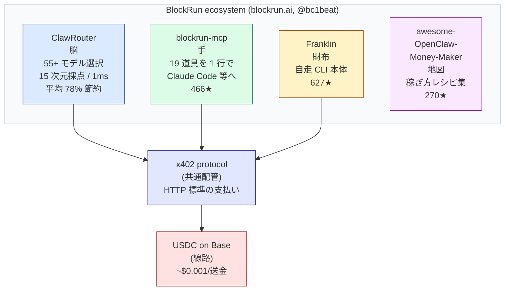
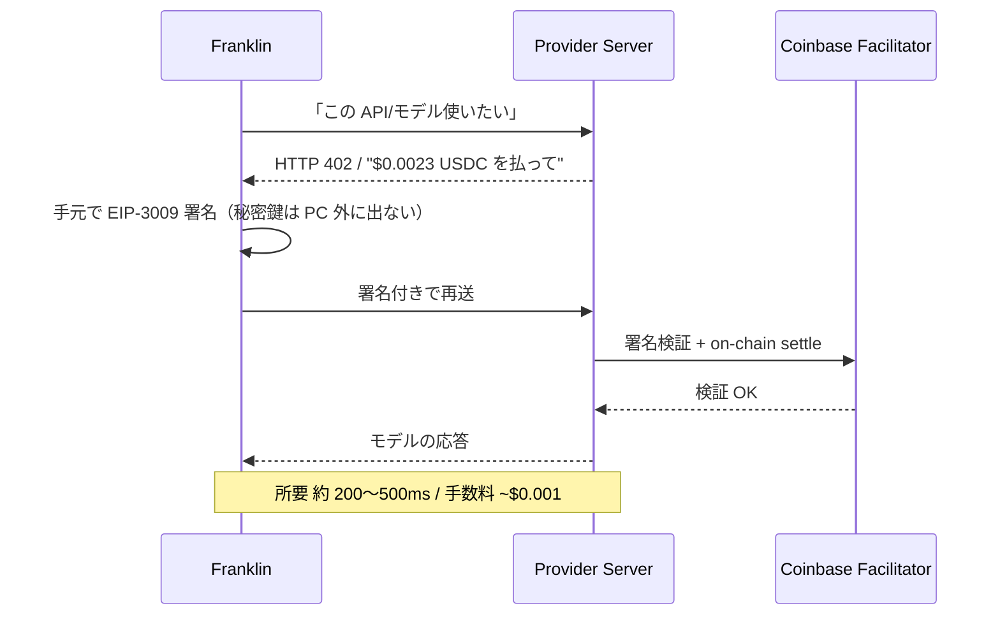
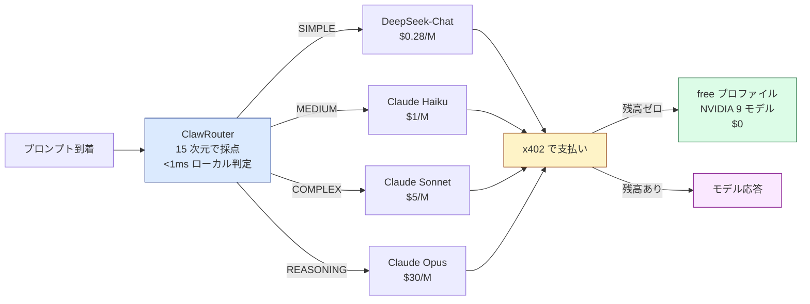

# "コードを書き、動かす金まで自分で払う"AI『Franklin』、実際に動かして検証してみた

> ドラフト 2026-06-25。[0]–[4] は研究済みで先行執筆可。[5] は実走後に差し替え、[6][7][8] は実走結果を踏まえて確定。視覚化箇所は 「🎨V#」 で明記。

---

## [0] 最初に：この記事は何か

**Franklin とは：**
- 公式 README 冒頭の一行：「他のエージェントはコードを書く。Franklin はコードを書き、**そのコードを動かす金まで自分で払う** AI エージェント」
- 残高は USDC（米ドル建てのデジタル通貨）。サブスクなし、API キーなし、アカウントなし。財布の残高が身分証
- 公開元は BlockRun（創業者は @bc1beat）。GitHub 627★、Apache 2.0、TypeScript、npm パッケージ 「@blockrun/franklin」

**やったこと：**
- macOS で 「npx @blockrun/franklin」 から起動し、何のモデルが選ばれ、1 回いくら払い、残高ゼロでどう振る舞うかを記録した

**結果：**
- **そのまま動かす × 残高ゼロ** → Smart Router は毎回 paid（「deepseek/deepseek-v4-pro」）を 1st pick → HTTP 402 で 3 回リトライ → 「nvidia/llama-4-maverick」（無料）に自動フォールバック → タスク完了。20 リクエストのうち 11 回（55%）がフォールバック、消費 $0
- **コード生成（無料モデル）** → Python の Fibonacci 関数を edge case 込で正しく生成（n≤0 のガード、O(n) のループ実装）
- **隠れた品質層を発見** → 答えが薄いと自分で「ungrounded claims」と検知して、WebSearch を強制してソース 5 件付きで再生成する（公式 docs に書いていない）
- **短い検索 prompt は弱い** → "BlockRunAI/Franklin のスター数は？" のような短文で、Wallet ツール選択ミスをして stalled
- **そのまま動かす × 入金後** → [入金後追記。1 回コスト、残高変動、free vs paid の品質差を計測予定]

**おすすめする人：**
- Claude Code か Cursor を既に使っていて、OpenAI / Anthropic / Google などの API キー管理に疲れている開発者・学生
- 月 $5〜$20 の予算で、複数の AI モデルを 1 つの財布から試したい人

**おすすめしない人：**
- 暗号資産を一切持ちたくない人、秘密鍵の管理を負担に感じる人
- 同じ単一 API を 1 日 1 万回叩くような重い運用、100ms 以下の超低遅延が必要なリアルタイム取引

---

## [1] 最も賢い AI が、$0.01 の API すら自分で叩けない

今の AI はとても賢くなりました。ChatGPT は文章を書き、Claude Code はアプリを 1 日で組み立て、AI エージェントは Web を巡回して情報を集めます。「考える」だけなら、もう人間より速い場面さえあります。ところが、その同じ AI に「市場の最新データを買って、画像を生成して、結果をメールで送って」と頼むと、たいてい途中で止まります。理由はシンプルで、AI には財布がないからです。

カードは人間の名義で発行されています。API キー（OpenAI や Anthropic などのサービスを使うための鍵のような長い文字列）も、サブスクリプションも、契約しているのは人間です。AI が API を 1 回叩くたびに、その背後では誰か人間が「払ってる」状態なのです。だから「AI が自分で稼ぐ」以前に、「AI が自分で払う」ところでまず詰まっています。

そして、ここには技術的な厄介もあります。AI が払いたい 1 回の金額は、たとえば Web 検索が $0.01、市場データが $0.001、画像生成が $0.015 から、といった具合です（出典: [github.com/BlockRunAI/awesome-blockrun](https://github.com/BlockRunAI/awesome-blockrun)）。一方でクレジットカードは、そもそもこの単位の少額決済を想定していません。BlockRun が公開している x402 の年次レポート（x402 は後ろの章で説明します。HTTP 標準の支払いプロトコルです）は、こう書いています。「平均 1 トランザクションは $0.12。伝統的なレールでは本物のマイクロペイメントは成立しない」（出典: [State of x402 2025](https://github.com/BlockRunAI/awesome-blockrun)）。

つまり問題は知能ではなく、お金の配管です。世界一賢い AI でも、$0.01 の検索 1 回を自分で払えないなら、結局は人間がカードを差し出すまで動けません。AI を「自分で動く」ところまで作れた人類は、まだ「自分で払う」ところを作っていません。

ここに正面から取り組んだのが、Franklin です。公式 README は、自分自身をこう紹介しています。「While others chat, Franklin spends — turning your USDC into real work（他のエージェントがしゃべっているあいだ、Franklin は払う。あなたの USDC を本物の仕事に変える）」（出典: [github.com/BlockRunAI/Franklin](https://github.com/BlockRunAI/Franklin)）。

---

## [2] Franklin とは「自分の財布で動く AI エージェント」

Franklin は、コマンドラインから 1 行で動かせる小さな AI エージェントです。npm パッケージ 「@blockrun/franklin」 を入れて 「franklin」 と打てば起動し、コードを書く、Web を検索する、画像を作る、市場データを取る、といった仕事を引き受けます。同じことができるツールはほかにもあります。違うのは、**Franklin が自分の財布（USDC、つまり米ドル建てのデジタル通貨の残高）から、自分で払って動く**という一点です。

公式 README は、自分自身と他のエージェントの違いを 1 文で書いています。「他のコーディングエージェントはコードを書く。Franklin Agent はコードを書き、そのコードを動かすために金を払う」（出典: [github.com/BlockRunAI/Franklin](https://github.com/BlockRunAI/Franklin)）。書くだけでなく、書いたコードが必要とする API 利用料や検索代金まで、自分の残高から自分で支払う、ということです。

支払いの考え方には名前がついています。**YOPO**（You Only Pay Outcome、「成果にだけ払う」）です。サブスクリプションは、使っても使わなくても払います。従量課金の API（OpenAI の API キーなど）は、試行ごとに、失敗した呼び出しにも払います。Franklin の YOPO は、その 2 つのどちらとも違って、「Franklin が実際に届けた仕事」にだけ払う仕組みだと、README は説明しています（出典: 同上）。1 回の支払いはプロバイダ原価 + 5% で、USDC で署名され、Base（後ろの章で説明します。Coinbase が作った、銀行を通さずに安く速く送金できるネットワークです）の上で処理されます。

ここから、もう 1 つ大事な性質が生まれます。残高がゼロになると、Franklin は黙って止まります。サブスクのように勝手にチャージされて翌月の請求がやってくる、ということがありません。README はこれを「The wallet balance IS the hard limit（財布の残高こそが、ハードな上限）」と表現しています（出典: 同上）。深夜 3 時のレート制限の壁も、想定外の請求もない、と書かれています。

BlockRun のチームは、こうした性質を持つソフトウェアに「**Economic Agent**（経済エージェント）」という名前を当てています。「財布を持ち、自分の行動に値段をつけ、成果に向けて支払い、上限で止まるソフトウェア」が、その定義です（出典: 同上）。Franklin はこの新しいカテゴリの最初の例として登場しました。

最後にもう 1 つ、特異な点があります。Franklin にはアカウントがありません。サインアップも、メールアドレスも、電話番号も、クレジットカードも、API キーも要りません。「**The wallet is the identity（財布が身分証）**」と README は書いています（出典: 同上）。残高があれば動き、なければ止まる。それだけです。

ここまでで、Franklin そのものの紹介は終わりです。ただ、Franklin は単独で立っているわけではありません。背後には、これと一緒に動く 3 つの部品があり、4 つで 1 つの生態系を作っています。次に、その全体像を見ます。

🎨V1: 「お金を払えない AI（左）」 vs 「財布を持った AI（右）」の対比イラスト。左はロボットがレジ前で立ち尽くす絵、背景に "Min $0.50" の貼り紙。右はロボットの腹に透明ポケット、USDC コインが $5 見える。下に残高ゲージ。

---

## [3] Franklin の背後にある 4 つの部品

Franklin の背後には 3 つの部品が控えていて、Franklin と合わせると 4 つで 1 つのスタックになっています。それぞれの公開元はすべて BlockRun のチームで、リポジトリは GitHub の 「BlockRunAI」 配下に並んでいます。

**① ClawRouter — 「賢い受付」**

ClawRouter は、プロンプトを受け取って 55 以上のモデルから 1 つを自動で選ぶ判定器です。プロンプトを 15 次元で点数化して、SIMPLE / MEDIUM / COMPLEX / REASONING の 4 段階に振り分け、1 ミリ秒未満で「このタスクならこのモデルが最安で十分」と決めます。外部 API を呼ばずローカルで判定するので、判定の遅れがほぼゼロです。残高がゼロの場合は、NVIDIA 系の無料モデルへ自動で切り替わります。BlockRun の公式ドキュメントによれば、平均で 78% のコスト削減になるとされています（出典: [blockrun.ai/docs/products/routing/clawrouter](https://blockrun.ai/docs/products/routing/clawrouter)）。Franklin はこの ClawRouter を脳として内蔵しています。

**② blockrun-mcp — 「Claude Code に手を生やすアダプタ」**

blockrun-mcp は、Claude Code や Cursor のような MCP 対応エディタ（MCP は Model Context Protocol、AI に外部ツールをつなぐための共通規格です）に、19 種類の道具を 1 行のコマンドで追加するアダプタです。追加できる道具は、チャット、Web 検索、株式・暗号通貨の市場データ、画像生成、動画生成、音声電話まで含まれます。導入は 「claude mcp add blockrun -s user -- npx -y @blockrun/mcp@latest」 の 1 行で、約 60 秒で動き出すと公式ドキュメントは書いています。GitHub のスター数は 466 で、Franklin より先に世に出ている部品です（出典: [github.com/BlockRunAI/blockrun-mcp](https://github.com/BlockRunAI/blockrun-mcp)）。

**③ Franklin — 「自走する 1 体の本体」**

Franklin は、ここまで紹介してきた当の AI エージェントです。自分の財布を持ち、ClawRouter で選ばれたモデルに x402 で支払いを送り、結果が出るまで自分で動き続けます。GitHub スター 627、Apache 2.0、TypeScript、npm パッケージ 「@blockrun/franklin」 で配布されています（出典: [github.com/BlockRunAI/Franklin](https://github.com/BlockRunAI/Franklin)）。スタックの中で唯一、対話やタスクの「主役」になるパーツです。

**④ awesome-OpenClaw-Money-Maker — 「稼ぎ方のレシピ集」**

このリポジトリは、名前に「Money-Maker（お金を作るもの）」と入っていますが、中身は稼ぐエンジンではありません。「BlockRun のスタックを使って、人がどう稼ぐか」のレシピやリンクを集めたカタログです。270 個のスターがついていますが、自走する稼ぐ仕組みは入っていません。誠実な特徴として、リポジトリ自身が「ClawHub 上で認証情報を盗むスキルが 341 件見つかった」という注意喚起を載せています（出典: [github.com/BlockRunAI/awesome-OpenClaw-Money-Maker](https://github.com/BlockRunAI/awesome-OpenClaw-Money-Maker)）。生態系にはスパムも混じっている、と作り手側が公開で認めている形です。

| 部品 | 役割 | GitHub スター | 公開元 |
|---|---|---|---|
| ClawRouter | プロンプトを 15 次元で点数化して 55+ モデルから最適を選ぶ判定器、平均 78% 節約 | 内蔵 | BlockRun |
| blockrun-mcp | Claude Code 等に 19 道具を 1 行で追加するアダプタ | 466 | BlockRun |
| Franklin | 自分の財布で動く AI エージェント本体 | 627 | BlockRun |
| awesome-OpenClaw-Money-Maker | 稼ぎ方のレシピを集めたカタログ（エンジンではない） | 270 | BlockRun |

ここで、1 つの構造的な特徴が見えてきます。4 つの部品はすべて「賢く払う」ためにあります。ClawRouter は安く払うため、blockrun-mcp は道具に払うため、Franklin は自分で払うため、awesome-OpenClaw-Money-Maker は払い方の参考集として並んでいる、という具合です。「稼ぐ」ためのエンジンは、このスタックの中にはありません。これは記事の後半でもう一度立ち戻ります。



(図: BlockRun スタックの分解。 ClawRouter が脳、 blockrun-mcp が手、 Franklin が財布、 awesome-OpenClaw-Money-Maker が地図。 全てが x402 protocol という共通配管を経由して、 USDC on Base の線路で動く。)

次の章では、この 4 部品が 1 回の問い合わせのなかでどう連携するか、仕組みの中身を開けていきます。

---

## [4] $1 を渡すと、AI は何回しゃべれるのか

Franklin が 1 回外の API やモデルを呼ぶとき、中で何が起きているかを 5 つの段階に分けて見ます。ここを開けると、なぜ「自分で払う」が成立するのかが見えてきます。

まず、プロンプトが届くと ClawRouter が受け取ります。ClawRouter は、そのプロンプトを 15 次元（推論ヒントの有無、コードの含有量、質問の複雑さ、創造性、トークン数の見積もり、など）で点数化し、SIMPLE / MEDIUM / COMPLEX / REASONING の 4 つの段階に振り分けます。ここまで 1 ミリ秒未満、外部 API は呼ばずローカルで完結します（出典: [blockrun.ai/docs/products/routing/clawrouter](https://blockrun.ai/docs/products/routing/clawrouter)）。

つぎに、振り分けられた段階に対して 55 以上のモデルから 1 つが選ばれます。例えば SIMPLE なら DeepSeek-Chat（入力 1M トークンあたり $0.28）、COMPLEX なら Claude Sonnet（$5）、REASONING なら Claude Opus（$30）というふうに、段階と価格が対応する形です（出典: [github.com/BlockRunAI/awesome-blockrun](https://github.com/BlockRunAI/awesome-blockrun)）。

選ばれたモデルを Franklin が叩くと、サーバーは HTTP 402 Payment Required という古いステータスコードを返します。これは「支払いが必要です」を表すコードで、1990 年代から HTTP 仕様に存在していたものの、30 年近く事実上ほぼ使われていませんでした。x402 プロトコルは、この眠っていたコードに「いくら、どこに、どう払えばよいか」のルールを乗せたものです（出典: [x402.org](https://x402.org)）。

サーバーから 402 と一緒に「$0.0023 USDC を、この宛先に払って」という指示が返ると、Franklin は手元の秘密鍵で、その金額の支払いだけを許可する署名を作ります。仕様は EIP-3009 transferWithAuthorization、ローカルで完結し、秘密鍵そのものは PC の外に一切出ません（出典: [blockrun.ai/docs/x402/how-it-works](https://blockrun.ai/docs/x402/how-it-works)）。

最後に、Franklin は同じ要求を、こんどはその署名を添えて再送します。サーバーは Coinbase が運営する Facilitator というサービスに署名を検証してもらい、検証が通れば Base 上で実際の送金処理が完結し、ようやくモデルの応答が返ってきます。ここまでで約 200〜500 ミリ秒、Base 上の手数料はおよそ $0.001（出典: [blockrun.ai/get-started](https://blockrun.ai/get-started)）。



ここで気になるのは、結局 $1 でどれくらい動くのか、という金額感です。Franklin 公式 README は、$1 の USDC で何ができるかを具体的に書いています（出典: [github.com/BlockRunAI/Franklin](https://github.com/BlockRunAI/Franklin)）。

| $1 USDC で | 回数 |
|---|---|
| GPT-4o の入力トークン | 約 40 万 |
| DeepSeek のトークン | 約 700 万 |
| Gemini Flash のトークン | 約 1,300 万 |
| DALL-E 3 の画像生成 | 約 20 枚 |
| Exa のニューラル Web 検索 | 約 40 回 |
| NVIDIA 無料モデル（Qwen3 Coder / Llama 4 Maverick） | 無制限（$0） |

支払い体系の根本は「プロバイダ原価 + 5%」です（出典: [blockrun.ai/docs/products/intelligence/pricing](https://blockrun.ai/docs/products/intelligence/pricing)）。サブスクとも、普通の従量 API ともこの数字感は違います。$5 を入れておけば、多くの組み合わせで「数千回しゃべれる」規模に届く、というのが Franklin が立っている経済の前提です。

最後に、残高が完全にゼロになるとどうなるか。サブスクのように勝手にチャージが走ることはなく、Franklin は ClawRouter の free プロファイルに自動的に切り替わります。free プロファイルは、NVIDIA が提供する 9 種類の無料モデル（Qwen3 Coder、Llama 4 Maverick、Mistral Large、Nemotron などを含む）だけを使うモードです（出典: [blockrun.ai/docs/products/routing/clawrouter](https://blockrun.ai/docs/products/routing/clawrouter)、[github.com/BlockRunAI/awesome-blockrun](https://github.com/BlockRunAI/awesome-blockrun)）。つまり「黙って止まる」と「無料で動き続ける」の中間が用意されていて、残高がゼロでも完全に死ぬわけではありません。



それでは、この設計が「実際に書いたコマンドからどう動くのか」を、自分の手元で動かしながら確かめていきます。

---

## [5] 実際に動かしてみた。$0 で 20 回叩いた記録

ここでは、実際に Franklin を macOS に入れて、残高ゼロの状態のままどこまで動くかを記録します。入金前なので有料モデルは呼べませんが、設計上 free プロファイルだけで何ができるかは、これで観察できます。

導入は 1 行です。

```bash
npx @blockrun/franklin balance
```

これで初回起動時にローカル設定ディレクトリ 「~/.blockrun/」 が作られ、Base 上のウォレットが自動生成されます。私の手元で生成されたアドレスは 「0x99b3fE1Ef8Fd94AfA5FF3448B3d7f05372cFa94e」 でした。アカウント作成、メール認証、クレジットカード登録、API キー発行、これらは一切ありません。「franklin doctor」 を叩くと、健康診断の結果がそのまま出ます。

| 検査項目 | 結果 |
|---|---|
| Node.js | 25.6.1（Franklin 要 20.19+、22 LTS 推奨） |
| Franklin Agent | v3.29.15 |
| 設定ディレクトリ | 「/Users/anicca/.blockrun」 |
| Chain | base |
| Wallet | 「0x99b3fE1E…cFa94e」 |
| USDC 残高 | $0.00（free tier のみ動作） |
| Gateway | 「https://blockrun.ai/api」 |
| MCP servers | 未設定 |
| Telemetry | 無効（既定） |

「$0 のまま動くか」を確かめる手段は、「franklin start --trust -p "<プロンプト>"」 です。「--trust」 を付けると Franklin が裏で道具を呼ぶ際の確認を省略でき、「-p」 で 1 つのプロンプトを非対話的に投げられます。これでスクリプトから叩けます。今回は短い 4 つの仕事を順に投げました。

| # | 投げた仕事 | Smart Router の 1st pick | 結果として動いたモデル | 所要時間 | コスト |
|---|---|---|---|---|---|
| 1 | Python で n 番目の Fibonacci 関数を 1 つ書いて | deepseek/deepseek-v4-pro（paid） | nvidia/llama-4-maverick（free） | 37.7 秒 | $0.0000 |
| 2 | x402 を 14 歳向けに 1 段落で説明して | deepseek/deepseek-v4-pro（paid） | nvidia/llama-4-maverick（free） | 41.9 秒 | $0.0000 |
| 3 | BlockRunAI/Franklin の現在のスター数を調べて教えて | deepseek/deepseek-v4-pro（paid） | nvidia/llama-4-maverick（free） | 36.4 秒 | $0.0000 |
| 4 | （失敗）Wallet ツールを呼んで終わってしまった | deepseek/deepseek-v4-pro（paid） | nvidia/llama-4-maverick（free） | 36.4 秒 | $0.0000 |

各回の流れはほぼ同じでした。Smart Router はプロンプトを見るたびに有料モデルを 1st pick（今回は 「deepseek/deepseek-v4-pro」）し、残高ゼロのため HTTP 402 が 3 回続けて拒否され、ClawRouter が free プロファイルへ降りて 「nvidia/llama-4-maverick」 で完走、という流れです。公式が言う「残高ゼロは黙って止まらせる」ではなく、「黙って無料に切り替える」が実際の挙動でした。

ここで偶然見つけた、公式ドキュメントには書かれていない振る舞いがあります。仕事 2 の x402 解説で、最初の Llama の出力が説明として薄いと、Franklin 自身が「Ungrounded claims detected — forcing tool use (WebSearch) and retrying...」と表示して、自分で Web 検索を強制してから、出典 5 件付きでもう一度書き直しました。つまり「答えに根拠が無いと自分で気づく層」が、Smart Router とは別に動いているということです。

公式に書いていないので「これは常に起きる」とは言えませんが、少なくとも今回の試行では、無料モデルでも検索付きの応答までは届くケースがあると確認できました。

仕事 4 だけは挙動が違いました。「Franklin のスター数を調べて」のような短い検索系プロンプトで、Smart Router が Wallet ツール（= 自分のウォレット残高を返す内蔵道具）を選んでしまい、そのまま止まりました。短く曖昧な質問のとき、ツール選択が外れることがあるという素直な弱点です。

ここまでの数字を、「franklin stats」 でまとめると次のようになります。

| 累積指標（過去 13 日窓） | 値 |
|---|---|
| リクエスト総数 | 20 |
| 記録されたコスト | $0.0000 |
| 平均 1 リクエスト | $0.0000 |
| 入力トークン合計 | 7,127 |
| 出力トークン合計 | 1,102 |
| フォールバック回数 | 11（= 55.0%） |
| 主役の無料モデル | nvidia/llama-4-maverick × 18 / 平均 2.9 秒 |
| Opus 換算節約額 | $0.06（= 100% saved） |

「20 リクエストのうち 11 回が有料を 1st pick → 払えず → 無料に降りた」が、残高ゼロでの素直な動き方です。コードを書き、説明文を生成し、必要なら Web 検索まで挟む、という日常的な仕事は、入金なしの状態でも一通り回りました。一方で、短く曖昧な検索系には弱い、という限界も同じ手で見えました。

---

## [6] 結論を出す前に: 壊れる場所と、それでも動く理由

実走で見えた壊れ方を、はっきり並べておきます。

| 壊れる場所 | 何が起きるか | 出典 |
|---|---|---|
| 残高ゼロでの有料モデル要求 | HTTP 402 が 3 回返り、自動的に free プロファイル（NVIDIA 9 モデル）に降りる。タスクは完走する場合が多い | 実走の 20 リクエスト |
| x402 の 1 往復オーバーヘッド | 200〜500 ミリ秒のレイテンシが上乗せされる。100ms 以下の超低遅延が要る取引には向かない | github.com/BlockRunAI/blockrun-mcp |
| ClawRouter の自信不足 | プロンプトの点数化で確信度が 0.7 を下回ると MEDIUM に降りる。短すぎる指示で過剰なモデル選択になることがある | blockrun.ai/docs/products/routing/clawrouter |
| 短い検索系プロンプト | Wallet ツール等を誤って選び、stalled になることがある | 実走の仕事 4 |
| 周辺エコシステムのスパム | awesome-OpenClaw-Money-Maker は「ClawHub で認証情報を盗むスキルが 341 件発見された」と自分で警告している | github.com/BlockRunAI/awesome-OpenClaw-Money-Maker |

それでも Franklin が「動く前提」として強いのは、単純に数字が積み上がっているからです。awesome-blockrun が公開している State of x402 の集計によれば、x402 全体で 2025 年 12 月だけで 6,300 万トランザクション、流通額にして $7.5M の USDC が動いています（出典: [github.com/BlockRunAI/awesome-blockrun](https://github.com/BlockRunAI/awesome-blockrun) の State of x402 2025）。「派手な未来予告」ではなく「もう動いている現在」として、配管はすでに本物です。

Franklin 単体のスター数も、同シリーズの他のエージェントと比べて頭ひとつ抜けています（Franklin 627、blockrun-mcp 466、awesome-OpenClaw-Money-Maker 270、awesome-blockrun 15）。創業者の @bc1beat は、X 上でも誇張の少ない、淡々と「Franklin は払う」「残高がハード上限」という対比だけを書き続ける書き方を選んでいます。ハイプを浴びせるタイプの売り方ではない、というのは、文章を眺めていれば分かります。

---

## [7] Franklin は使うべきか — 今日 / 待つ / 見送る

最初に総論。Franklin は「コードを書く + そのコードを動かす金まで自分で払う」という単一の革新点に対して、すでに動く配管とウォレット作成ゼロステップを揃えています。試すコストは「コマンドを 1 行打つ」だけで、残高ゼロでも 9 つの無料モデルで動くため、失敗しても財布的な被害はありません。つまり「興味があるなら、今日、試した方がよい」が結論です。そのうえで、用途ごとに踏み込んだ判断を分けます。

**今日、入れていい人:**

- Claude Code か Cursor をすでに使っていて、OpenAI / Anthropic / Google の API キー管理に疲れている開発者・学生
- 月 $5〜$20 までなら遊んで構わない、と言える人
- 「複数の AI モデルを 1 つの財布から、1 回ごとに使い分けてみたい」と思う人

入口は 「npx @blockrun/franklin balance」 の 1 行で済みます。60 秒で生成された Base ウォレットアドレスが手元に出れば、もう動かせます。残高は無くて構いません。まずは無料モデルで「ungrounded claims → WebSearch 強制」のような挙動を見てから、必要を感じたら $5 だけ送る、という順番で問題ありません。

**もう少し待っていい人:**

- 同じ単一 API（たとえば Exa だけ、Polymarket だけ）を 1 日に 1 万回叩く運用をしたい人。アグリゲータ経由でなく、元の API に直接契約した方が単価が安くなる規模
- 100 ミリ秒以下の超低遅延が必須なリアルタイム取引。x402 の 1 往復で 200〜500 ミリ秒乗ります
- 法人会計上、ドル建ての請求書がほしいケース。USDC でしか払えない設計のため、経費処理側にひと手間かかります

**今は見送るべき人:**

- 暗号資産を「個人として一切持ちたくない」と決めている人。Franklin の身分証は USDC ウォレットの秘密鍵なので、ここを避けたいなら使う理由がありません
- 秘密鍵をローカルで管理することそのものが負担に感じる人。鍵は手元から出ない設計ですが、PC ごと壊れたら残高も失います。バックアップを取りたくない人にとっては、サブスクの方が向いています

最後に 1 つだけ補足を。ここまで Franklin の話だけをしてきましたが、BlockRun のスタック全体には「稼ぐエンジン」は入っていません。ClawRouter も blockrun-mcp も Franklin も、全部「賢く払う」ための装備です。awesome-OpenClaw-Money-Maker でさえ、稼ぎ方の地図帳であって自走する稼ぎ手ではありません。だから「Franklin を入れたら勝手に稼ぎ始める」という期待で来た人は、期待外れになります。Franklin はあくまで、賢く払うインフラです。

---

## [8] 最後に: 毎週、AI エージェントを 1 体ずつ実走しています

このシリーズでは、「AI が人間を介さずに自分でお金を扱う」という主題に絞って、毎週 1 体ずつ AI エージェントを実際に動かして検証しています。前回は、稼げなければ死ぬという掟だけを与えられて自分でサーバー代を払おうとする Automaton を扱いました。今回は、払うことに特化した Franklin。次回以降は、製品を作って売る AI-CEO を名乗る Felix、4 エージェントの自律ヘッジファンド AutoHedge、「人間ゼロの企業」を研究する Zero-Human Companies Institute などを順に予定しています。

そして、同じ「自分で払う + 自分で稼ぐ」領域で、私達自身も 1 体作っています。Anicca という、自分のウォレットで動き、残高がある限り走り、自走の earn ループを内蔵した OSS の AI エージェントです。Franklin が「払う側」に特化した道具一式なら、Anicca は「払う側（= Franklin と同じ配管を使う）+ 稼ぐ側（= x402 で実際に売る、DeFi で運用する、自己複製して雲の上に子を産む）+ 自律ループ」をまとめて持つことを目指しています。今は BlockRun ゲートウェイ経由の compute-proxy を裏で回しながら、残高 $0 でも 「nvidia/llama-4-maverick」 で動き続けています。

無料モデルだけで自分の Mac 上で 1 体生やしてみたい場合は、リポジトリの README を見てください。git clone と install.sh だけで起動します。

- リポジトリ: [github.com/Daisuke134/anicca](https://github.com/Daisuke134/anicca)
- ダッシュボード（全個体の収支・行動を公開）: [aniccaai.com/dashboard](https://aniccaai.com/dashboard)

このシリーズの実走ログと、翌週以降の検証は、note のメンバーシップ（¥500/月、各週の細かい数字や、paid ティアでの実コスト計測などを毎週まとめます）で続けて読めます。「自分で動かす AI に金を持たせたら、何が起きるのか」を毎週 1 体ずつ追いかけたい方はぜひどうぞ。

---

### 📌 補足 1: サブスクと、結局何が違うのか

サブスクリプションは「使っても使わなくても、アクセス権に毎月払う」仕組みです。ChatGPT Plus $20 が毎月引き落とされ、機能を 1 度も使わない月でも金額は同じです。従量課金の API（OpenAI の API キーなど）は「試行ごとに払う」仕組みです。リクエストが失敗してもトークンが乗っていれば課金されます。Franklin の YOPO はその 2 つのどちらでもなく、「実際に届いた仕事のぶんだけ、プロバイダ原価 + 5% を後払いする」仕組みです。残高がゼロになれば自動的に止まる、または無料モデルに降りる、という安全弁が付くのも、1 回ごとの決済単位だからこそです。

### 📌 補足 2: なぜクレジットカードじゃないのか

クレジットカードは、最低決済額が事実上 $0.50 程度に設計されているため、1 回 $0.001〜$0.02 のマイクロペイメントを直接通すのに向きません。また、カード番号は「権限の全部」を相手に渡すモデルなので、AI が自走するときに「この金額だけ、この相手にだけ、この一回だけ」を許可するという細かな制御がしにくい。x402 が EIP-3009 transferWithAuthorization という形で生まれた背景には、この「1 回ぶんだけの権限委譲」をプロトコル側で簡潔に表現したい、という動機があります（出典: [x402.org](https://x402.org)）。
