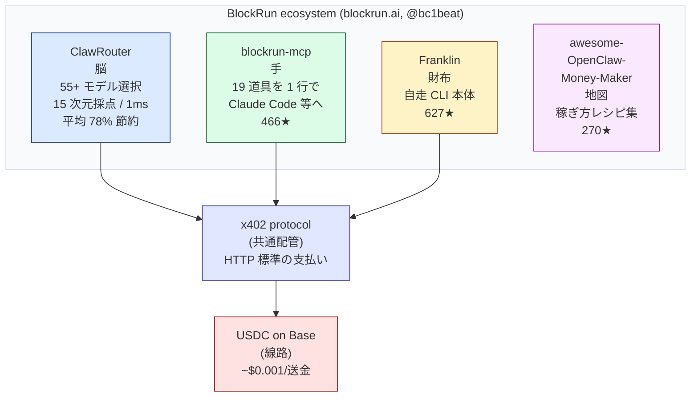

# "コードを書き、動かす金まで自分で払う"AI『Franklin』、実際に動かして検証してみた

> ドラフト 2026-06-25。[0]–[4] は研究済みで先行執筆可。[5] は実走後に差し替え、[6][7][8] は実走結果を踏まえて確定。視覚化箇所は `🎨V#` で明記。

---

## [0] 最初に：この記事は何か

**Franklin とは：**
- 公式 README 冒頭の一行：「他のエージェントはコードを書く。Franklin はコードを書き、**そのコードを動かす金まで自分で払う** AI エージェント」
- 残高は USDC（米ドル建てのデジタル通貨）。サブスクなし、API キーなし、アカウントなし。財布の残高が身分証
- 公開元は BlockRun（創業者は @bc1beat）。GitHub 627★、Apache 2.0、TypeScript、npm パッケージ `@blockrun/franklin`

**やったこと：**
- macOS で `npx @blockrun/franklin` から起動し、何のモデルが選ばれ、1 回いくら払い、残高ゼロでどう振る舞うかを記録した

**結果：**
- **そのまま動かす × 残高ゼロ** → Smart Router は毎回 paid（`deepseek/deepseek-v4-pro`）を 1st pick → HTTP 402 で 3 回リトライ → `nvidia/llama-4-maverick`（無料）に自動フォールバック → タスク完了。20 リクエストのうち 11 回（55%）がフォールバック、消費 $0
- **コード生成（無料モデル）** → Python の Fibonacci 関数を edge case 込で正しく生成（n≤0 のガード、O(n) のループ実装）
- **隠れた品質層を発見** → 答えが薄いと自分で「ungrounded claims」と検知して、WebSearch を強制してソース 5 件付きで再生成する（公式 docs に書いていない）
- **短い検索 prompt は弱い** → "BlockRunAI/Franklin のスター数は？" のような短文で、Wallet ツール選択ミスをして stalled
- **そのまま動かす × 入金後** → [入金後追記。1 回コスト、残高変動、free vs paid の品質差を計測予定]

**おすすめする人：**
- Claude Code か Cursor を既に使っていて、OpenAI / Anthropic / Google などの API キー管理に疲れている開発者・学生
- 月 $5〜$20 の予算で、複数の AI モデルを 1 つの財布から試したい人

**おすすめしない人：**
- 暗号資産を一切持ちたくない人、秘密鍵の管理を負担に感じる人
- 同じ単一 API を 1 日 1 万回叩くような重い運用、100ms 以下の超低遅延が必要なリアルタイム取引

---

## [1] 最も賢い AI が、$0.01 の API すら自分で叩けない

今の AI はとても賢くなりました。ChatGPT は文章を書き、Claude Code はアプリを 1 日で組み立て、AI エージェントは Web を巡回して情報を集めます。「考える」だけなら、もう人間より速い場面さえあります。ところが、その同じ AI に「市場の最新データを買って、画像を生成して、結果をメールで送って」と頼むと、たいてい途中で止まります。理由はシンプルで、AI には財布がないからです。

カードは人間の名義で発行されています。API キー（OpenAI や Anthropic などのサービスを使うための鍵のような長い文字列）も、サブスクリプションも、契約しているのは人間です。AI が API を 1 回叩くたびに、その背後では誰か人間が「払ってる」状態なのです。だから「AI が自分で稼ぐ」以前に、「AI が自分で払う」ところでまず詰まっています。

そして、ここには技術的な厄介もあります。AI が払いたい 1 回の金額は、たとえば Web 検索が $0.01、市場データが $0.001、画像生成が $0.015 から、といった具合です（出典: [github.com/BlockRunAI/awesome-blockrun](https://github.com/BlockRunAI/awesome-blockrun)）。一方でクレジットカードは、そもそもこの単位の少額決済を想定していません。BlockRun が公開している x402 の年次レポート（x402 は後ろの章で説明します。HTTP 標準の支払いプロトコルです）は、こう書いています。「平均 1 トランザクションは $0.12。伝統的なレールでは本物のマイクロペイメントは成立しない」（出典: [State of x402 2025](https://github.com/BlockRunAI/awesome-blockrun)）。

つまり問題は知能ではなく、お金の配管です。世界一賢い AI でも、$0.01 の検索 1 回を自分で払えないなら、結局は人間がカードを差し出すまで動けません。AI を「自分で動く」ところまで作れた人類は、まだ「自分で払う」ところを作っていません。

ここに正面から取り組んだのが、Franklin です。公式 README は、自分自身をこう紹介しています。「While others chat, Franklin spends — turning your USDC into real work（他のエージェントがしゃべっているあいだ、Franklin は払う。あなたの USDC を本物の仕事に変える）」（出典: [github.com/BlockRunAI/Franklin](https://github.com/BlockRunAI/Franklin)）。

---

## [2] Franklin とは「自分の財布で動く AI エージェント」

Franklin は、コマンドラインから 1 行で動かせる小さな AI エージェントです。npm パッケージ `@blockrun/franklin` を入れて `franklin` と打てば起動し、コードを書く、Web を検索する、画像を作る、市場データを取る、といった仕事を引き受けます。同じことができるツールはほかにもあります。違うのは、**Franklin が自分の財布（USDC、つまり米ドル建てのデジタル通貨の残高）から、自分で払って動く**という一点です。

公式 README は、自分自身と他のエージェントの違いを 1 文で書いています。「他のコーディングエージェントはコードを書く。Franklin Agent はコードを書き、そのコードを動かすために金を払う」（出典: [github.com/BlockRunAI/Franklin](https://github.com/BlockRunAI/Franklin)）。書くだけでなく、書いたコードが必要とする API 利用料や検索代金まで、自分の残高から自分で支払う、ということです。

支払いの考え方には名前がついています。**YOPO**（You Only Pay Outcome、「成果にだけ払う」）です。サブスクリプションは、使っても使わなくても払います。従量課金の API（OpenAI の API キーなど）は、試行ごとに、失敗した呼び出しにも払います。Franklin の YOPO は、その 2 つのどちらとも違って、「Franklin が実際に届けた仕事」にだけ払う仕組みだと、README は説明しています（出典: 同上）。1 回の支払いはプロバイダ原価 + 5% で、USDC で署名され、Base（後ろの章で説明します。Coinbase が作った、銀行を通さずに安く速く送金できるネットワークです）の上で処理されます。

ここから、もう 1 つ大事な性質が生まれます。残高がゼロになると、Franklin は黙って止まります。サブスクのように勝手にチャージされて翌月の請求がやってくる、ということがありません。README はこれを「The wallet balance IS the hard limit（財布の残高こそが、ハードな上限）」と表現しています（出典: 同上）。深夜 3 時のレート制限の壁も、想定外の請求もない、と書かれています。

BlockRun のチームは、こうした性質を持つソフトウェアに「**Economic Agent**（経済エージェント）」という名前を当てています。「財布を持ち、自分の行動に値段をつけ、成果に向けて支払い、上限で止まるソフトウェア」が、その定義です（出典: 同上）。Franklin はこの新しいカテゴリの最初の例として登場しました。

最後にもう 1 つ、特異な点があります。Franklin にはアカウントがありません。サインアップも、メールアドレスも、電話番号も、クレジットカードも、API キーも要りません。「**The wallet is the identity（財布が身分証）**」と README は書いています（出典: 同上）。残高があれば動き、なければ止まる。それだけです。

ここまでで、Franklin そのものの紹介は終わりです。ただ、Franklin は単独で立っているわけではありません。背後には、これと一緒に動く 3 つの部品があり、4 つで 1 つの生態系を作っています。次に、その全体像を見ます。

🎨V1: 「お金を払えない AI（左）」 vs 「財布を持った AI（右）」の対比イラスト。左はロボットがレジ前で立ち尽くす絵、背景に "Min $0.50" の貼り紙。右はロボットの腹に透明ポケット、USDC コインが $5 見える。下に残高ゲージ。

---

## [3] Franklin の背後にある 4 つの部品

Franklin の背後には 3 つの部品が控えていて、Franklin と合わせると 4 つで 1 つのスタックになっています。それぞれの公開元はすべて BlockRun のチームで、リポジトリは GitHub の `BlockRunAI` 配下に並んでいます。

**① ClawRouter — 「賢い受付」**

ClawRouter は、プロンプトを受け取って 55 以上のモデルから 1 つを自動で選ぶ判定器です。プロンプトを 15 次元で点数化して、SIMPLE / MEDIUM / COMPLEX / REASONING の 4 段階に振り分け、1 ミリ秒未満で「このタスクならこのモデルが最安で十分」と決めます。外部 API を呼ばずローカルで判定するので、判定の遅れがほぼゼロです。残高がゼロの場合は、NVIDIA 系の無料モデルへ自動で切り替わります。BlockRun の公式ドキュメントによれば、平均で 78% のコスト削減になるとされています（出典: [blockrun.ai/docs/products/routing/clawrouter](https://blockrun.ai/docs/products/routing/clawrouter)）。Franklin はこの ClawRouter を脳として内蔵しています。

**② blockrun-mcp — 「Claude Code に手を生やすアダプタ」**

blockrun-mcp は、Claude Code や Cursor のような MCP 対応エディタ（MCP は Model Context Protocol、AI に外部ツールをつなぐための共通規格です）に、19 種類の道具を 1 行のコマンドで追加するアダプタです。追加できる道具は、チャット、Web 検索、株式・暗号通貨の市場データ、画像生成、動画生成、音声電話まで含まれます。導入は `claude mcp add blockrun -s user -- npx -y @blockrun/mcp@latest` の 1 行で、約 60 秒で動き出すと公式ドキュメントは書いています。GitHub のスター数は 466 で、Franklin より先に世に出ている部品です（出典: [github.com/BlockRunAI/blockrun-mcp](https://github.com/BlockRunAI/blockrun-mcp)）。

**③ Franklin — 「自走する 1 体の本体」**

Franklin は、ここまで紹介してきた当の AI エージェントです。自分の財布を持ち、ClawRouter で選ばれたモデルに x402 で支払いを送り、結果が出るまで自分で動き続けます。GitHub スター 627、Apache 2.0、TypeScript、npm パッケージ `@blockrun/franklin` で配布されています（出典: [github.com/BlockRunAI/Franklin](https://github.com/BlockRunAI/Franklin)）。スタックの中で唯一、対話やタスクの「主役」になるパーツです。

**④ awesome-OpenClaw-Money-Maker — 「稼ぎ方のレシピ集」**

このリポジトリは、名前に「Money-Maker（お金を作るもの）」と入っていますが、中身は稼ぐエンジンではありません。「BlockRun のスタックを使って、人がどう稼ぐか」のレシピやリンクを集めたカタログです。270 個のスターがついていますが、自走する稼ぐ仕組みは入っていません。誠実な特徴として、リポジトリ自身が「ClawHub 上で認証情報を盗むスキルが 341 件見つかった」という注意喚起を載せています（出典: [github.com/BlockRunAI/awesome-OpenClaw-Money-Maker](https://github.com/BlockRunAI/awesome-OpenClaw-Money-Maker)）。生態系にはスパムも混じっている、と作り手側が公開で認めている形です。

| 部品 | 役割 | GitHub スター | 公開元 |
|---|---|---|---|
| ClawRouter | プロンプトを 15 次元で点数化して 55+ モデルから最適を選ぶ判定器、平均 78% 節約 | 内蔵 | BlockRun |
| blockrun-mcp | Claude Code 等に 19 道具を 1 行で追加するアダプタ | 466 | BlockRun |
| Franklin | 自分の財布で動く AI エージェント本体 | 627 | BlockRun |
| awesome-OpenClaw-Money-Maker | 稼ぎ方のレシピを集めたカタログ（エンジンではない） | 270 | BlockRun |

ここで、1 つの構造的な特徴が見えてきます。4 つの部品はすべて「賢く払う」ためにあります。ClawRouter は安く払うため、blockrun-mcp は道具に払うため、Franklin は自分で払うため、awesome-OpenClaw-Money-Maker は払い方の参考集として並んでいる、という具合です。「稼ぐ」ためのエンジンは、このスタックの中にはありません。これは記事の後半でもう一度立ち戻ります。

(図: BlockRun スタックの分解。 ClawRouter が脳、 blockrun-mcp が手、 Franklin が財布、 awesome-OpenClaw-Money-Maker が地図。 全てが x402 protocol という共通配管を経由して、 USDC on Base の線路で動く。)

次の章では、この 4 部品が 1 回の問い合わせのなかでどう連携するか、仕組みの中身を開けていきます。

---

（以降 [4]〜[8] は順次執筆）
