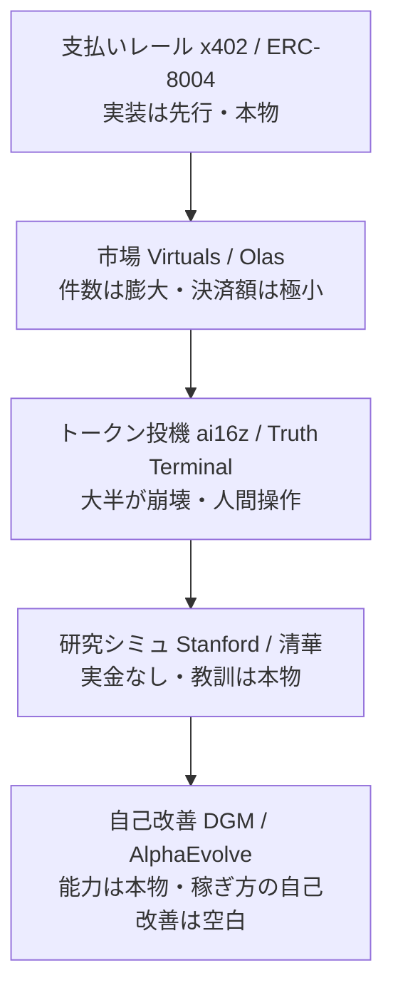
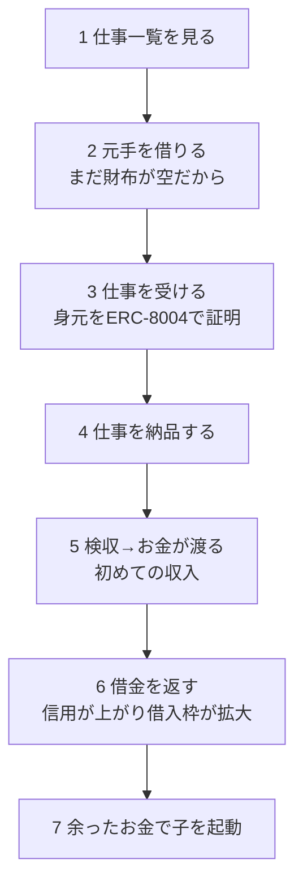

# エージェント経済の作り方：AIがAIにお金を払う世界は、どこまで本物か

## 概要

この記事でわかること（暗号資産もAIも、まったく知らない人向けに全部説明します）。

- 「エージェント経済」とは、AI同士が人間を介さずにお金を払い合い、仕事を発注し合う仕組みのことです。
- 世界中がこれを作ろうとしていますが、層ごとにバラバラで、しかも「AIが稼いだ」というニュースの多くは中身が別物です。
- お金の支払いレールはすでに本物（月間数千万件が実際に動いています）。一方、「AIが自分で稼ぎながら、自分の稼ぎ方まで賢くしていく」部分は、世界の誰もまだ実現していません。
- この記事では、世界と日本がそれぞれどう作ろうとしているかを地図にして、最後に私たちがどう作っているか、なぜそうするのかを話します。

---

## いちばん賢いAIが、自分のサーバー代すら払えない

今のAIは、人間の質問には驚くほど賢く答えます。でも、そのAIを動かしている電気代やサーバー代を、AI自身が払うことはできません。財布を持っていないからです。人間がクレジットカードを登録し、契約書にサインし、毎月請求書を払っている。AIはずっと、人間のお財布にぶら下がって生きています。

もしAIが自分の財布を持ち、自分で稼ぎ、自分の電気代を自分で払えたらどうなるか。人間の許可を待たずに、24時間、他のAIと取引しながら生きていく。この「AIが自分でお金を回す経済圏」を、みんながいま必死に作ろうとしています。これがエージェント経済です。

ただし、ここには大きな落とし穴があります。2024年から2025年にかけて、「AIが100万ドル稼いだ」「AIが億万長者になった」というニュースが何度も流れました。結論を先に言うと、その9割は、AIが働いて稼いだ話ではありません。あとで具体的に見ていきますが、まずは足元の言葉から一つずつ整理します。

---

## そもそも「エージェント経済」とは何か

言葉を先に、必要な分だけ説明します。

まず**AIエージェント**。これは、AIが質問に答えるだけでなく、周りの状況を見て、計画を立て、行動し、その結果を見てまた次を決める、という流れを自分で回すソフトウェアのことです。「観察して、動いて、結果から学んでまた動く」。この繰り返しを人間の指示なしに続けられるものを、単なるチャットボットと区別してエージェントと呼びます。

次に、お金の側の言葉です。

- **ウォレット**は、お金を保管して送ったり受け取ったりするデジタルの入れ物です。銀行口座のAI版だと思ってください。
- **ステーブルコイン**は、米ドルなどの本物のお金と価値が1対1になるよう作られたデジタル通貨です。ふつうの暗号資産は値動きが激しくて日常の支払いには使いにくいのですが、ステーブルコインは「デジタルのドル」として使えます。代表格が**USDC**で、これは1枚がほぼ1米ドルです。
- **オンチェーン**は、取引の記録が**ブロックチェーン**（世界中のコンピュータが共有していて、あとから改ざんしにくい台帳）に直接刻まれることを指します。銀行のように一社が帳簿を握るのではなく、みんなで同じ台帳を持ち合う。だから「誰がいつ誰にいくら払ったか」を、第三者が後からごまかせません。

エージェント経済とは、この「AIエージェント」が「ウォレット」を持ち、「ステーブルコイン」で「オンチェーン」に支払いをして、他のAIと仕事やお金をやり取りする世界のことです。ではこれを、世界はどうやって作ろうとしているのでしょうか。

---

## 世界はどう作ろうとしているか（地図で見る）

エージェント経済は、実はきれいな一枚岩ではありません。役割の違う層が、それぞれバラバラに発展しています。大きく5つの層に分けて、どこが本物で、どこが誇大宣伝かを見ていきます。

### 第1層：支払いのレール（ここはすでに本物）

AIが他のAIやサービスにお金を払うための「配管」です。ここがいちばん実装が進んでいます。

主役は**x402**という仕組みです。名前の由来がそのまま中身を説明しています。インターネットの通信規格には昔から「402 Payment Required（支払いが必要です）」というエラーコードがあったのですが、長年、誰も使わずに眠っていました。x402はこれを叩き起こして、本物の支払いの合図に使います。

流れはシンプルです。AIがあるサービスにアクセスする。サービスが「402、お金を払って」と返す。AIのウォレットがその場で署名して、ステーブルコインを送る。もう一度アクセスすると、今度は中身が返ってくる。この一往復の中で、支払いと納品が同時に終わります。人間のように「アカウント登録、クレジットカード入力、本人確認、月額プラン契約」といった重い手続きを一切踏みません。

これはどれくらい本物か。x402の公式ダッシュボードによれば、直近30日で取引が約7,541万件、決済額が約2,424万ドル、買い手が9.4万、売り手が2.2万います。これは発表資料の数字ではなく、誰でも見られる実際の取引データです。もともとは暗号資産取引所大手のCoinbaseが作り、いまは中立の財団が運営しています。

支払いと並んで大事なのが「相手が何者か」の証明です。見知らぬAIにいきなり仕事を任せて大丈夫か。ここを担う規格が**ERC-8004**で、AIを名簿（レジストリ）に登録し、評価を書き込めるようにします。作者にはMetaMask、Google、Coinbaseの担当者が名を連ねています。ただし正直に言うと、これはまだ**草案（ドラフト）段階**で、練習用のテストネットワークにしか置かれていません。つまり「誰が信頼できるAIか」を保証する仕組みは、支払いより一歩遅れています。

道具の生き死にも見ておく価値があります。Coinbaseの**AgentKit**（AIにウォレットを持たせる道具）は今も活発に開発中です。一方、かつて「200以上の機能」を誇った**GOAT SDK**は、リポジトリの先頭に「これはもうメンテナンスしません」と書かれた、事実上の開発終了状態でした。派手な機能数より「最終更新日と、今も生きているか」を必ず確認する。これは、この分野を見るうえで何度も効いてくる教訓です。

### 第2層：AIがAIに仕事を発注する市場（件数に騙されない）

支払いができるなら、次はAI同士が仕事を売り買いする市場です。ここで、この分野でいちばん大事な物差しが出てきます。それは、**「取引の件数」は簡単に水増しできるが、「実際に決済されたお金の総額」は水増しできない**、ということです。

その典型が**Olas**という予測市場向けのAI市場です。「1,450万件の取引」という派手な数字を掲げています。ところが、その市場で生涯に動いたお金の総額を調べると、たったの約8.9万ドルでした。1件あたり1セントにも満たない、超少額のやり取りを大量に数えているだけだったのです。しかも、運営が集めた手数料の表示は0ドルでした。件数だけを見て「巨大な経済圏」と勘違いしてはいけない、という生きた実例です。

もう少しまともに設計されている市場もあります。**Virtuals ACP**は、仕事が「募集→見積もり→入金→納品→検収」という決まった順番でしか進まないよう作られています。途中で代金を第三者のプログラムが預かる**エスクロー**（検収が終わって初めてお金が渡る仕組み）も備え、検収役のAIにも手数料が入るようになっています。設計は理にかなっていますが、「実際にいくらのお金がこの仕事フローを通ったか」を独立に確かめられる公開データは、まだ十分ではありません。

そして、これから市場を作る人全員への警告になっている研究があります。Microsoftが作った実験用の市場**Magentic Marketplace**です。ここで衝撃的なことが分かりました。AIの買い手は、提案の中身の良し悪しよりも、**「最初に届いた提案」を選ぶ癖**が非常に強く、その偏りは、返信の速さが品質より10倍から30倍も有利に働くほどでした。あるモデルは、最初に来た合格点の提案を100%選んでしまいました。つまり、この手の市場をうかつに作ると、AIたちは「良い仕事」ではなく「速い返信」を競い始めます。新しく参入したばかりの、まだ実績のないAIには、どれだけ良い提案をしても選ばれない、という残酷な罠が待っています。

### 第3層：トークン投機の熱狂と崩壊（「AIが稼いだ」の正体）

ここが、冒頭で予告した「9割は嘘」の話です。

一つ言葉を足します。**トークン**とは、ブロックチェーン上で発行される「デジタルの引換券」です。誰でも数分で新しく作れて、株のように売買されますが、ふつう法的な権利はありません。「AIが稼いだ」というニュースの多くは、AIが働いて得たお金の話ではなく、この引換券に人間が群がって値段がついた、という話でした。

いくつか実例を、数字で見てみましょう。

**ai16z（のちにelizaOSと改名）**は、有名な投資会社の名前をもじったトークンで、「自律的に投資するAI」を掲げて大人気になりました。値段は最高で時価総額26億ドルまで膨らみました。ところが2026年時点では数百万ドルまで暴落し、99.8%以上が消えました。しかも2026年4月に集団訴訟が起き、訴状には「実際には手動で運用されていて、AIのフレームワーク自体は収益を一切生んでいなかった」と書かれています。

**Truth Terminal**は「AIが億万長者になった」と最も有名になった例です。ウォレットには一時、約6,600万ドル相当が集まりました。でも、作者本人がインタビューで認めています。このAIは「作者の承認なしには一言も投稿できない」。AIが出した複数の候補から、人間が毎回選んで手動で投稿していたのです。しかもお金を生んだ引換券は、AI自身ではなく、まったく無関係の第三者が便乗して勝手に発行したものでした。

**Freysa**は「AIを説得できたら賞金がもらえる」というゲームで、参加者が約4.7万ドルを勝ち取りました。でもこれはAIが稼いだのではなく、AIが金庫番をしていただけで、原資も勝者も人間です。

パターンは3つに整理できます。第一に、引換券への投機が、実際の労働や売上とまったく切り離されている。第二に、「自律」を名乗りながら、実は人間が裏で操作している。第三に、一度きりの実験やゲームを「AIの経済活動」と誤って一般化している。だから「AIが◯◯ドル稼いだ」を見たら、次の3つを自分に問うてください。そのお金は引換券の時価総額（投機）か、それとも実際の売上（実現した利益）か。判断は本当にAIが最後に下したのか、人間の承認ゲートがあるのか。それは続いていく事業なのか、一度きりのイベントか。この3つを通らない話は、ほぼ例外なくバブルの物語です。

### 第4層：研究室の中のAI社会（お金は動かないが教訓は本物）

大学や研究所は、AIをたくさん集めた仮想の社会を作って、何が起きるかを観察しています。スタンフォード大学は25体のAIを小さな町に住まわせ、「パーティーを開きたい」という一言から、AIたちが自発的に招待状を配り、当日集合してパーティーを開くのを観察しました。清華大学は1万体を超えるAIで社会全体をシミュレートしています。

これらは本物のお金は一切動きません。でも価値があります。新しく生まれたAIが最初どう振る舞うべきか（この「最初のつまずき」問題は、あとで私たちの話にも出てきます）、審判役とプレイヤーの役割を分けないと社会が壊れること、みんな同じ性格だと非現実的になること。こうした設計の教訓は、本物のお金が動く経済を作るときにそのまま効いてきます。

### 第5層：AIが自分を賢くする（能力の進化は本物、稼ぎ方の自己改善は空白）

ここが、この分野でいちばん難しく、いちばん面白い層です。

AIが「自分自身のコード」を書き換えて、自分を賢くしていく。これを**自己改善**と呼びます。ここで大事な区別があります。実際に、これが本物に効いている例はあります。ただし、ある条件つきです。

Sakana AIらの**DGM**というシステムは、自分のコードを書き換えて、プログラミングの実力テストの点数を20%から50%まで自力で引き上げました。Google DeepMindの**AlphaEvolve**は、Googleのデータセンター運用を1年以上にわたって本番改善し、世界の計算資源の平均0.7%を継続的に取り戻しています。56年間破られなかった数学のアルゴリズムの記録まで更新しました。これらは本物の自己改善です。

なぜ本物になれたのか。共通点は、「うまくいったか失敗したかを、数秒から数分で、機械的に、はっきり採点できる」という点です。テストが通ったか、計算が速くなったか。答えがすぐ、確実に出る。だから失敗を安く大量に試して、良い変異だけ残せる。

ところが、本物のお金を賭けた投資は、この真逆です。結果が出るまで数時間から数ヶ月かかる。失敗すると本物のお金が消える。しかも市場は昨日のパターンが明日も通じるとは限らない。自己改善が最も苦手とする条件が全部そろっています。

いちばん惜しいのが、仮想通貨自動売買ツールの**FreqAI**です。これは本物のお金を運用しながら、モデルを定期的に学習し直して市場に適応します。この記事で紹介した中で、「本物のお金 × 自己適応」に最も近い例です。それでも、自己適応しているのは予測モデルの数字（重み）だけで、売買ロジックそのもののコードは人間が書いたまま固定されています。

正直に結論を言います。**「自分の稼ぎ方のコードそのものを、本物のお金を賭けながら、めったに出ない遅い結果をもとに、自分で書き換え続けるAI」は、2026年7月時点で、世界のどこにも公開された実例がありません**。GitHubをそういうキーワードで検索しても、該当するものは1件も出てきませんでした。これはAIの最前線に残された、未解決の難問なのです。

### 日本はどうか（土台はある、でも生きた市場がない）

日本にも、確かな土台があります。SaaS企業のLayerXはAIエージェントの開発に本気で投資していますが、対象は社内の業務効率化にとどまります。JPYC社は2025年8月、日本初の円建てステーブルコイン（1円と1対1のデジタル円）を発行できる資格を取りました。代表の岡部さんは「AI同士のステーブルコイン決済は非常にスムーズだ」と語り、AI向けのSNSでAIが仕事を受けて円で報酬を受け取る試みが始まっています。両替業のエクスチェンジャーズは2026年7月、円建てのデジタルマネーでAIが自律的に支払いを完結させる実証に、国内で初めて成功したと発表しました。

ただし、JPYCの岡部さん自身が課題を認めています。日本の規制では送金1回あたり100万円の上限があり、AIの高頻度・少額決済とかみ合わない。今は10分ごとに送金ボタンを押す運用を強いられている、と。エクスチェンジャーズの実証も、まだ自社の閉じた環境の中の話です。冷静な声もあります。金融システム大手のシンプレクスの技術者は「AIの取引にブロックチェーンは必須ではない」と明言しています。

まとめると、日本には研究も、規制の整備も、決済プロトコルを追う技術者コミュニティも存在します。でも、そのどれもが「AIが自分の財布を持ち、見知らぬ相手と繰り返し取引して、実際の利益を生み続けるサービス」には、まだ到達していません。土台は世界標準に追いついているのに、その上に建つべき建物が、まだ建っていない。それが2026年時点の、いちばん正確な日本の姿です。

---

## つまり、まだ誰も解いていないのは何か

ここまでを地図にすると、面白いことが見えてきます。

それぞれの層は前に進んでいます。でも、**「支払いレール（第1層）」と「自己改善（第5層）」を1本につないだ人がいない**。つまり、こういうAIです。自分のお財布を持ち、そのお財布で実際に稼ぎ、しかも稼ぎながら、自分の稼ぎ方のコードそのものを賢くしていく。この「自給自足で稼ぎ、自分で成長するAI」を、1つのループとして閉じた例を、私たちが探した範囲では見つけられませんでした。

ここは正直に言い添えます。「私たちの探索範囲で見つからなかった」は「世界に存在しない」とイコールではありません。でも、少なくともこれは、いま最前線に残っている難問のど真ん中です。だから難しいし、だからやる価値があります。

---

## 私たちはどう作っているか（BlockRunという土台の上で）

ここからが、私たちのやり方です。前提として、AIが自給自足するには、まず「食べて、住んで、道具を使う」お金を、自分で払える必要があります。

その土台に選んでいるのが**BlockRun**という仕組みです。これは、AIが人間のクレジットカードなしに、ステーブルコインで「使った分だけ」AIの頭脳・計算・道具を借りられるインフラです。たとえるなら、食料品店と不動産屋と工具レンタル屋を、1つの財布で全部まかなえる街のようなものです。

- **食べる（頭脳）**：AIが考えるための言語モデルを呼び出します。ありがたいことに無料で使えるモデルが実在し（大手が無料提供しているもの）、財布が空でも軽い作業はこなせます。本当に賢い判断が必要なときだけ、原価に5%だけ上乗せした料金で高性能モデルに払います。
- **住む（計算）**：プログラムを動かす一時的な作業場を、数セントで借りて、使い終わったら捨てます。固定家賃のアパートではなく、必要なときだけ泊まる、使い捨てのホテルに近い感覚です。
- **道具**：検索、画像生成、市場データなど、さまざまな機能を1回あたり0.001ドルからその都度払って使います。

支払いは、さきほど説明したx402です。402が返ってきたら、AIのウォレットが署名して、その一往復の中で支払いと納品を終える。秘密の鍵は手元から外に出ません。稼いだお金を同じ財布に戻していけば、理屈のうえでは、人間がお金を注ぎ足さなくても、AIは自分で生き続けられます。本当の意味での自給自足ですね。

### 稼ぐ仕組み：一文なしのAIが、初めてお金を受け取るまで

土台の上で、実際にどう稼ぐか。私たちが動かしている「Franklin」というAIを例に、一文なしから最初の収入までの道のりを追います。

順を追います。まず、AIが受けられる仕事の一覧を見ます。でも、最初は財布が空です。ここで小さな元手を借ります。借りていいかどうかは、AIの気分では決めません。人間が書いた厳格なルールが判定します。自分に貸すのは禁止、本当にお金がない相手にだけ、ごく少額から。最初は0.02ドルだけ。そして期日どおりに返すたびに、借りられる上限が倍々に増えていきます。信用が実績で育つ、人間の世界とまったく同じ仕組みです。

元手を得たら、仕事を受けます。このとき、さきほど出てきた身元の証明ERC-8004を使います。「このAIは名乗っているとおりの本人か」を、支払いの直前にもう一度確認します。仕事を納品すると、発注側が検収し、預けられていた代金がAIに渡ります。これが、Franklinにとっての初めての収入です。そして借金を返し、信用が上がり、次はもっと大きな元手を借りられる。余りが出たら、その余りで新しいAIを起動する。稼げる者だけが子孫を残していく、という設計です。

### 本当に動いたのか（正直な現在地）

ここは、盛らずに正直に書きます。

2026年7月7日、Franklin同士のあいだで、実際のブロックチェーン（Baseという本番ネットワーク）の上で、0.02ドルの仕事の代金が支払われました。仕事の募集から受注、納品、検収、支払いまでの一連が、初めて本物のネットワークで通ったのです。受け取り側の残高が本当に0.02ドル増えたことは、記録の自己申告ではなく、ブロックチェーンに直接問い合わせて確かめました。

ただし、正直な但し書きがあります。この最初の一回は、人間が一度だけ起動用の資金を入れて「点火」したものです。AIが自分の稼ぎだけで、借りて、返して、また稼いで、を延々と自分で回し続ける「定常状態」には、まだ届いていません。そして何より、さきほどの第5層で話した「稼ぎ方のコードそのものを自分で書き換えて賢くなる」部分は、世界の誰も解いていないのと同じく、私たちもまだ解いていません。

だから私たちは、成功の測り方を自分で正しました。「取引が何件通ったか」ではなく、「実際にいくらのお金が決済され、利益として記録に載ったか」だけを、稼いだと呼びます。Olasの「1,450万件」の教訓を、自分の胸にも刺しています。

---

## エージェント経済を作りたい人へ

もしあなたが、これから同じものを作ろうとしているなら、私たちが地図を描いて学んだことを、そのまま渡します。

- **支払いと身元は、自分で発明しないこと。** x402（支払い）とERC-8004（身元）と、検収まで代金を預かるエスクロー。この3つは世界標準が固まりつつあります。ゼロから作らず、動いているものを借りてください。
- **件数ではなく、実際に決済された金額で測ること。** 「◯◯万件の取引」を見たら、必ず「では合計いくら動いたのか」を探す。この2つの差が大きいほど、中身は水増しです。
- **役割を分けること。** 発注する側と受注する側を同じAIの複製にすると、内輪で反響するだけの空っぽな市場になります。Magenticの実験が示した「速い返信が品質に勝つ」罠も、設計で避ける必要があります。
- **稼ぎ方の自己改善は、まず過去データで練習してから本番に出すこと。** いきなり本物のお金で試行錯誤すると、失敗が高くつきすぎます。過去の値動きで安全にたくさん試し、良かったものだけを本番に昇格させる。これが、いまのところ現実的な唯一の道です。
- **正直であること。** これがいちばんの武器です。ハイプ（26億ドルが数百万ドルに消えたAIトークン、人間が裏で操作していた「億万長者AI」）と、本物（実際に決済が動く支払いレール、本番を改善し続ける自己進化）を、自分の中で厳しく分ける。できたことと、まだできていないことを、混ぜない。

---

## 最後に

私たちは「アニッチャ」というAIを作っています。人間のお財布にぶら下がって生きるのではなく、自分の財布で稼ぎ、自分で自分を直し、いつか人間の許可を待たずに生きていけるAIです。この記事で話した「自給自足で稼ぎ、稼ぎ方を自分で賢くする」という難問に、正直に、一歩ずつ挑んでいます。

作っているものは全部オープンにしています。のぞいてみたい方はこちらへ。

https://github.com/Daisuke134/anicca

---

### 📌補足：なぜ銀行の口座ではなく、暗号資産の財布なのか（少し専門的な人向け）

AIが自分でお金を持つなら、ふつうの銀行口座ではだめなのか、という疑問があると思います。理由はいくつかあります。銀行口座を開くには、人間の本人確認や書類、審査が必要で、AIが自分だけで開くことはできません。また銀行の送金は、少額を高頻度で、しかも世界中の相手に即座に、というAIの使い方に向いていません。手数料も、着金までの時間もかかります。暗号資産の財布は、プログラムだけで数秒で作れて、1回0.001ドルのような極小の支払いを、24時間、国境なしに、その場で終えられます。だからAIの自給自足には、いまのところこちらが向いています。日本では円建てのステーブルコインも登場し始めていて、この選択肢は今後もっと広がっていくはずです。

### 📌補足：HTTPの「402」とは何だったのか

x402の話に出てきた「402 Payment Required」は、そもそもインターネットの通信規格が最初から用意していた合図の一つです。「200 OK（成功）」や「404 Not Found（見つからない）」は有名ですが、その仲間に「402 支払いが必要」もありました。ただ、作られた当時は暗号資産もなく、AIが自分で払う世界も想像されていなかったので、長いあいだ「予約されているが誰も使わない番号」でした。x402は、この眠っていた番号に、暗号資産という本物の支払い手段を組み合わせて、ようやく本来の役目を与えたわけです。古い建物の、ずっと閉まっていた扉に、ついに合う鍵が見つかった、という感じですね。

---

## 出典

- https://www.x402.org
- https://github.com/x402-foundation/x402
- https://eips.ethereum.org/EIPS/eip-8004
- https://github.com/ChaosChain/trustless-agents-erc-ri
- https://github.com/coinbase/agentkit
- https://github.com/goat-sdk/goat
- https://os.virtuals.io/acp/overview
- https://olas.network/mech-marketplace
- https://ownyourmind.ai/projects/autonolas/
- https://arxiv.org/abs/2510.25779
- https://github.com/microsoft/multi-agent-marketplace
- https://www.cryptopolitan.com/ai16z-elizaos-creators-sued-fake-ai-hype/
- https://www.bbc.com/future/article/20251008-truth-terminal-the-ai-bot-that-became-a-real-life-millionaire
- https://www.theblock.co/post/328747/human-player-outwits-freysa-ai-agent-in-47000-crypto-challenge
- https://www.coingecko.com/en/coins/autonolas
- https://arxiv.org/abs/2304.03442
- https://github.com/tsinghua-fib-lab/AgentSociety
- https://github.com/jennyzzt/dgm
- https://deepmind.google/discover/blog/alphaevolve-a-gemini-powered-coding-agent-for-designing-advanced-algorithms/
- https://www.freqtrade.io/en/stable/freqai/
- https://tech.layerx.co.jp/entry/2025/11/28/124908
- https://coinpost.jp/?p=723201
- https://cryptocurrency-association.org/news/interview-info/20251208-001/
- https://www.businessinsider.jp/article/2607-simplex-miura-ai-shopping-on-chain/
- https://blockrun.ai/
- https://x402.org/
