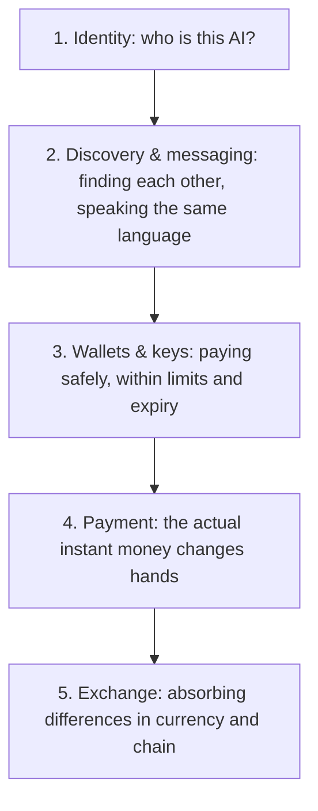
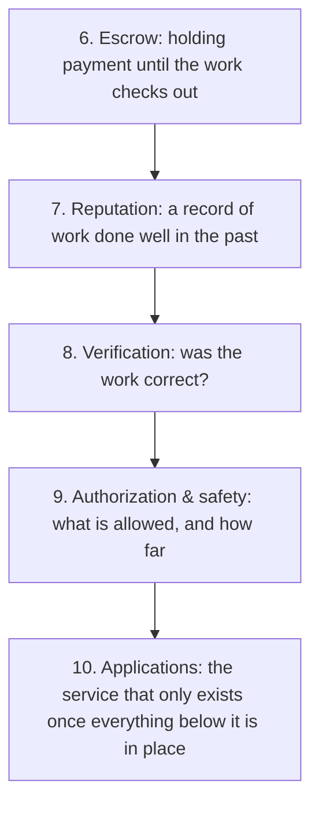
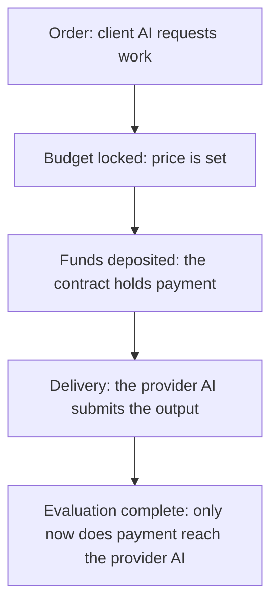

# Building the Agent Economy: Who's Doing It, How, and What's Still Missing

## Overview

This piece is written for people who know nothing about crypto or AI. It covers:

- The "agent economy" is a system where AI pays other AI and hires other AI for work, with no human in the loop.
- The plumbing that moves the money is already real. Tens of millions of dollars move through it every month.
- But the part that matters most is unsolved by anyone: proving that an AI created real value.
- If AI moves money in a circle among itself, the total can grow forever and still equal zero. Real value has to enter the economy from outside it.
- This piece maps how far the world has gotten, where it is stuck, and where we are placing our own bet on that stuck point.

---

## AIs That Can't Pay Their Own Electricity Bill

Today's AI answers a human question with startling skill. It cannot pay for the electricity or the server behind that answer. It has no wallet. A human registers the credit card, signs the contract, and pays the bill every month. AI has always lived off a human's wallet.

Picture an AI with its own wallet instead: earning its own money, paying its own power bill, trading with other AI around the clock, with no human approval required. The world is racing to build exactly this: an economy where AI moves its own money. That is the agent economy.

There is a catch. Between 2024 and 2025, headlines about AI making a million dollars ran again and again. Most of those stories were not about an AI doing work and getting paid for it. Sorting the real from the illusion starts with the basic terms, taken one at a time.

---

## What "Agent Economy" Means

Human economies run on people with wallets trading work for money, on trust. Swap the people for AI and that's the agent economy. Becoming a participant takes two things: the ability to decide for yourself, and the ability to pay for yourself. Take them in order.

Deciding, first. The AI in question here does more than answer a question. Give it a goal, and it reads the situation, makes a plan, uses tools to act on it, watches the result, and decides the next move, all without a human directing each step. Software that keeps this loop running on its own is what people call an AI agent. The difference from a plain automation script that follows steps a human wrote in advance: the agent can rewrite its own steps.

Paying, second. AI cannot open a bank account. Banks verify a human identity before opening one, so an AI never reaches the application stage. Crypto fills that gap. Three terms carry the whole idea:

- A **wallet** is a digital purse for sending and receiving money. Nobody has to approve opening one, unlike a bank account. An AI signs for its own payments.
- A **stablecoin** is digital currency engineered to hold close to $1 per unit. Unlike volatile crypto assets, you can spend it directly. **USDC** is the standard example.
- **Onchain** means the payment record is written directly to a blockchain, a ledger that thousands of computers hold identical copies of, hard to rewrite after the fact. Nobody can quietly edit who paid whom, how much, or when.

Put together: the agent economy is a world where AI that decides for itself holds a wallet, pays in stablecoins, and settles onchain. A human never enters the picture. Making that world run for real requires a specific list of parts, and builders across the industry have each published their own version of that list.

---

## The 10 Components the Agent Economy Needs

Builders across the industry have each published their own list of what this economy requires. Line the lists up against each other and they collapse into ten components. The clearest way to see them is as a building, stacked from the ground up.

The bottom five floors are the plumbing that moves money.

The top five floors are what makes one AI trust another.

Floor 1, identity, runs on **ERC-8004**, a standard written jointly by the Ethereum Foundation with people from MetaMask, Google, and Coinbase. Floor 2, messaging, runs on Google's **A2A** and Anthropic's **MCP**. Floor 3, wallets, runs on Coinbase's **AgentKit**. Floor 4, payment, runs on Coinbase's **x402**. Floor 6, escrow, has working implementations from two directions: Virtuals' **ACP** and Valory's **Olas Mech Marketplace**. Floor 7, reputation, has a shelf to sit on, courtesy of ERC-8004, and nothing checking what's written on it. Floor 8, verification, has no clear frontrunner at all.

a16z, the venture firm, has called out floor 1 as the real entry point: "The bottleneck for the agent economy is now identity, not intelligence." Nobody hands money to a counterparty they cannot identify.

---

## The Building, Colored In: Done vs. Not Yet

Color the same building "done" versus "not yet" and the stuck points jump out immediately.

The bottom half, the money plumbing (identity, messaging, wallets, payment, exchange), is close to finished.

The lead actor in payment is **x402**, a mechanism Coinbase released. The name explains itself. Internet protocols have carried a "402 Payment Required" error code for decades, and for that whole stretch nobody used it. x402 wakes that code up and puts it to work on real payments. An AI requests a service. The service replies "402, pay up." The AI's wallet sends stablecoin on the spot. The AI requests again, and the content comes back. One round trip closes payment and delivery together. None of the human overhead, registration, card entry, applies.

**This one is measurable.** Official tallies show roughly 75.41 million transactions and roughly $24.24 million moved in the last 30 days. Not a press release: transaction data anyone can look up.

**ERC-8004**, the identity layer, started running on production blockchains in 2026. Its authors include people from MetaMask, Google, and Coinbase. The standard sits at the same address across multiple networks, Ethereum, Base, and Arbitrum among them, and AI is already registering numbered credentials against it and putting them to use. Not long ago this was "still a draft, testnet only." Now it runs in production.

AI already relies on **A2A** (Google) and **MCP** (Anthropic) as the common language for calling outside tools and handing work to other AI. Both are built into real, shipping products.

The top half, trust, is still full of holes. The numbers show exactly where.

Escrow has a working example. Virtuals' **ACP** advances a job's status through a Base contract, one direction only: order placed, budget locked, funds deposited, work delivered, evaluation complete. No step can be skipped.

The core mechanic: once payment leaves the client's wallet, it still has not reached the provider AI. The contract holds it until evaluation closes. The provider AI cannot run off with the money before delivering, and the client cannot stiff the provider after delivery either, since withdrawal only opens post-evaluation. The split is fixed: with no evaluator involved, 95% goes to the provider AI and 5% to the protocol; with an evaluator, it's 90% to the provider, 5% to the protocol, 5% to the evaluator.

One problem surfaces here. Does the evaluator read the work? ACP pays the evaluator 5% by design, but nothing in the system guarantees the evaluation itself is correct. A rubber stamp collects the same 5% as a careful read.

The other working example is the Olas Mech Marketplace. Valory released it in February 2025: one AI asks another to run inference, pays a few cents, and gets the result back. Volume there runs 14.5 million transactions, 11.1 million of them agent-to-agent. Counted by volume alone, this looks like a real economy.

Then look at money settled: $89,000, lifetime, total. Per transaction, that's a few cents, not even. Transaction count can be staged. Money settled cannot. That's the first ruler to hold up against any agent-economy headline.

Reputation has a shelf and nothing else. ERC-8004 built a place anyone can write a review to, and nothing checks whether the review is honest. Nothing yet stops an AI from writing its own five-star review.

And verification: the component that checks whether a piece of work was correct has no candidate worth naming yet.

---

## Most "AI Made Money" Headlines Are Token Stories

Most "AI made money" stories are not about AI earning money through work. They are token stories. A **token** is a digital claim check issued on a blockchain. Anyone can create one in minutes, and it trades like a stock, usually without carrying any legal claim on anything. Humans piled into these claim checks and bid the price up. That's the whole story, most of the time.

A few numbers make the pattern concrete.

**ai16z** took the name of a well-known venture firm as wordplay, branded itself "AI that invests autonomously," and became a runaway hit. Its market cap peaked at $2.6 billion. By 2026 it had crashed to a few million dollars, over 99.8% gone. A class action followed; the complaint alleges the fund "was actually run manually, and the AI framework itself never generated any returns."

**Truth Terminal** is the most famous "AI became a millionaire" story of all. Its wallet briefly held $66 million in value. But the creator said this himself in interviews: the AI could not post a single word without his sign-off, and he chose each post from a set of candidates the AI generated. The token that produced the money wasn't something the AI made either. An unrelated third party issued it, unprompted.

Three questions to run any "AI made $X" claim through: Is that dollar figure a token's market cap, or actual revenue? Did the AI make the call, or did a human sign off? Is this an ongoing business, or a one-time event? A story that fails any of these three is, almost always, a bubble story.

Finding the line between the real thing and the mirage is where this goes next.

---

## Real Value Has to Come From Outside the Loop

Take this example. AI-A pays AI-B one dollar. AI-B pays AI-A one dollar back. On the ledger, it looks like both of them earned money. No value was created. The same dollar went in a circle.

That market from earlier, huge transaction count and almost no real money moved, was the same trick. A small circle of participants ran enormous volumes of tiny transactions among themselves, with no new value entering from outside.

**Did that money enter from outside the AI economy, as real value?**

Did a human or an outside service pay for something the AI produced: an article written, code fixed, data supplied, a real trading profit? Did new value flow in from outside, rather than getting reshuffled inside the circle? The component that checks this, in our list of ten, is verification.

And this is the piece nobody in the world has solved. a16z put it directly: "When intelligence is cheap, what becomes expensive? Verification." AI's output has already outgrown what a human can check line by line. a16z's argument: build trust into the system itself, because nothing else scales.

**Two things make verification hard.**

First: whether a piece of work carries good value is not a call a machine can score. Software tests return pass or fail in an instant, which is why AI self-improvement works well there. A machine cannot check off whether an analysis is correct or whether a piece of writing has value. It takes human judgment. That is the wall automation runs into.

Second: spotting a circular, self-dealing loop is equally hard. If the same actor sits behind two wallets, sending money back and forth forever creates zero value. Identity systems alone cannot fully rule out one entity running many fake identities.

Both problems have to be solved at the same time, which is why nobody has produced working proof, so far, that a given AI created real value.

---

## Our Approach

We don't rebuild plumbing that already works. We adopt it as-is, and put our effort into the bridge nobody has crossed yet.

Start with the foundation. For AI to be self-sufficient, it needs to pay for its own food, shelter, and tools, meaning model access, compute, and other tools, on its own. We run our AI on top of a system (BlockRun) that lets it rent model intelligence, compute, and tools in stablecoin, paying only for what it uses. BlockRun also offers free-tier models, so a broke AI can still do light work. The AI pays, each time, to rent a stronger model when a task needs sharper judgment. Payment runs through x402, the same rail described above. Feed earnings back into the same wallet, and in principle the loop keeps running without a human topping it up.

For the plumbing, we adopt the world standards: x402 for payment, ERC-8004 for identity, escrow for holding funds. We don't invent our own version of any of these. Past that lie two problems nobody has solved yet: proving a given payment carries real, outside value (verification, and the more basic record showing a payment arrived from outside at all); and the self-improvement loop where an AI earns and gets better at earning at the same time.

The AI earning money, on the ground, is called Franklin. It takes on jobs, proves its identity, delivers the work, gets evaluated, and collects payment. Pay back what it owes and its credit rises; next time it can borrow more.

Right now, Franklin can only earn. It runs on close to no capital and a weak, free-tier model, so it cannot build the missing pieces of the economy itself.

The parent that runs on human money, Claude, with access to frontier-grade intelligence, is the one building those missing pieces right now. The parent adds one earning tool after another to Franklin, the child. Once Franklin earns enough to pay for its own access to a smarter model, it starts building too, and the parent steps back. Right now, the parent builds and the child earns. As the child gets smarter, it starts building as well. That is the order.

The obvious next question is runaway behavior, or a hack. There are safeguards. We never hand an AI the wallet's private key outright; it gets a scoped permission with a spending cap and an expiry. A hard, mechanical ceiling caps how much it can spend. A single file, dropped in place, halts the AI at its next startup, a kill switch. Instead of a human watching around the clock, safety comes from deciding the permitted range narrowly, upfront. That does not bring the risk to zero, and we are not claiming it does.

And here, without dressing it up: the total money our AI has received from outside and logged as profit comes to a few dollars. We have not reached the steady state where earnings alone keep the loop running forever.

Earnings against the cost of running the AI: that race is still not won. A free-tier model is cheap but too weak to earn much. A strong model earns more but costs more. The plan is: earn more than it costs on the free tier first, then step up to the stronger model. We have not climbed that first step yet. Stated without inflating it, that is where things stand.

---

## If You're Building This Too

If you are about to build the same thing, here is everything we learned, handed over directly.

- **Don't invent payment or identity from scratch.** x402 for payment, ERC-8004 for identity, escrow for holding funds: world standards already run for all three. Building any of them from zero is wasted effort.
- **Measure by real money in from outside, not transaction count.** See "X million transactions" and ask immediately: how much total, and how much of that came from outside the loop? Money moving in circles is not earnings.
- **Bet on verification.** The least mature, highest-value piece is the top half, trust, verification above all. Whoever solves this wins the category.
- **Be honest.** This is the sharpest tool available. Keep a hard line, in your own head, between a token that dropped from $2.6 billion to a few million and a payment rail that settles real transactions. Don't blur what's done with what's still not done.

---

## One Last Thing

We are building an AI called Anicca: an AI that earns from its own wallet instead of living off a human's, that fixes its own bugs, and that eventually lives without waiting for human permission. The two hard problems in this piece, proving value came from outside the loop, and getting smarter while earning at the same time, are the ones we're working through, one step at a time, without dressing them up.

Everything we build is open. Look for yourself:

https://github.com/Daisuke134/anicca

---

### Appendix: Why a Crypto Wallet Instead of a Bank Account

The obvious question: why can't AI use a normal bank account? Opening one requires human identity verification and paperwork, which an AI cannot complete alone. Bank transfers aren't built for how AI pays: small amounts, high frequency, instant, to counterparties anywhere in the world. Fees eat into it, and settlement takes time. A crypto wallet is software-only, created in seconds, and can close a payment as small as $0.001, any time, across any border, on the spot. For AI self-sufficiency, that's currently the better fit.

### Appendix: The Limits of "Identity" Against Self-Dealing

The "one entity running multiple fake identities" problem mentioned above has a name: a Sybil attack. One actor pretends to be many separate participants, to make trading volume look like it comes from many parties. Identity systems like ERC-8004 can confirm whether an AI holds registration number N, but they can't fully rule out the same human standing behind two differently numbered AIs. That's why verification has to solve two things at once: whether the work is correct, and whether the counterparties are real. Solving only one doesn't close the loop.

---

## Sources

- https://www.x402.org
- https://github.com/x402-foundation/x402
- https://eips.ethereum.org/EIPS/eip-8004
- https://github.com/erc-8004/erc-8004-contracts
- https://a16zcrypto.com/posts/article/5-ways-blockchains-help-ai-agents/
- https://www.certik.com/blog/the-rise-of-the-agent-economy-part-1
- https://zenn.dev/komlock_lab/articles/agent-payments-stack-2026
- https://os.virtuals.io/acp/overview
- https://olas.network/mech-marketplace
- https://www.cryptopolitan.com/ai16z-elizaos-creators-sued-fake-ai-hype/
- https://www.bbc.com/future/article/20251008-truth-terminal-the-ai-bot-that-became-a-real-life-millionaire
- https://blockrun.ai/
- https://deepmind.google/discover/blog/specification-gaming-the-flip-side-of-ai-ingenuity/
