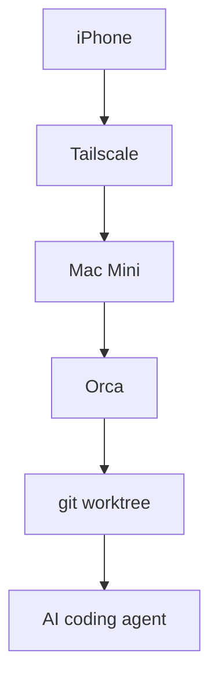

# I Returned My Laptop. From Today, I Build AI on an iPhone.

Orca is an Agent IDE. I use its mobile companion as a remote control for a computer at home. This is my setup and an honest account of the first day.

## The day I returned my MacBook

I returned my MacBook to my university. When I leave home now, the only computer in my hand is an iPhone. I still have a Mac Mini at home, so I decided to leave the computation there and control my AI coding agents from the phone.

The tool I tried is Orca. It is an Agent IDE that runs Claude Code, Codex, and other coding agents in separate git worktrees. Its mobile companion is deliberately a remote control for the desktop app, not a full code editor squeezed onto a small screen.

On July 20, I installed Orca v1.4.146 on the Mac Mini and paired it with my iPhone 15 over Tailscale. It does not feel like development happening inside the phone. It feels like carrying my home development environment in my pocket.

## The mobile development landscape

I initially framed the choice as home machine versus cloud. That was too simple. Some products let the same mobile interface control either a local machine or a cloud VM.

The useful questions are where the canonical code and state live, whose computer executes the agent, and what path connects the phone to that computer.

| Option | Code and execution | Connection | Best fit |
|---|---|---|---|
| Orca | Your desktop | Direct device connection | Agent workflows |
| Happy | Your PC | End-to-end encrypted relay | Claude Code |
| SSH + tmux | Home machine | SSH or mosh | Terminal workflows |
| Claude Code Remote Control | Your computer | Anthropic API relay | Claude Code sessions |
| Claude Code on the web | Anthropic VM | App or browser | Cloud sessions |
| Codex cloud | OpenAI sandbox | ChatGPT app | Cloud tasks |
| Codespaces | GitHub-managed environment | Browser | Cloud dev environment |
| Remote Tunnels | Your machine | Microsoft relay | VS Code |

Claude Code Remote Control executes on your own computer and relays messages through the Anthropic API. There is a spectrum, not a clean split.

I chose Orca because I wanted to keep using the repositories, credentials, tools, and half-finished state already living on my Mac Mini.

## What Orca is

Stably AI designed Orca around one git worktree and one dedicated terminal per task. The current integrations include Claude Code, Codex, OpenCode, OpenClaw, Pi, and several other agents.



From the phone, I can reply to an agent, browse files, stage and commit changes, and create a workspace. Orca's mobile documentation calls the app “intentionally not a full editor.” In my setup, I joined the Mac Mini and iPhone to the same Tailscale network and connected them directly. I kept Orca Relay off.


*Stably AI's official mobile screen shows the connected desktop, recent worktree, and Claude or Codex usage in one view.*

## Setup, Homebrew, and the pairing QR code

The first trap on my Mac Mini was the Homebrew package name. I checked the cask behind plain `brew install --cask orca` and found Plotly's image-export tool, not the Agent IDE. I had to include Orca's tap.

```sh
brew install --cask stablyai/orca/orca
xattr -dr com.apple.quarantine /Applications/Orca.app
open -a Orca
```

I removed the quarantine attribute to get past Gatekeeper, allowed the following access prompts, selected Claude as the default agent, kept the system theme, and skipped notifications. I added `/Users/anicca/anicca-project` as a project. Once its branches and terminal appeared, the desktop side was ready.

Pairing starts from “Orca Mobile” in the desktop sidebar. The important choice is the network address. I selected the Tailscale address, `100.99.82.95 (utun0)`, instead of the LAN address, and enabled Tailscale on the iPhone. I kept Orca Relay off, so the devices communicated over Tailscale without Orca's cloud relay. I did not measure whether Tailscale used a direct path or a DERP relay.

Orca's documentation says the QR code expires after a few minutes. I sent fresh copies to the iPhone through Telegram and Gmail. The Gmail copy worked, and the phone paired at about 8:40 p.m. The connection also behaved as documented: closing the desktop app disconnected the phone, and reopening it reconnected the phone automatically.

## First-day notes

My notes after using Orca iOS for a day were blunt:

> It creates worktrees automatically, and the base branch for each session is easy to understand. That is excellent.
>
> I can connect to Claude, Codex, or OpenClaw with one tap. It also appears to integrate with GitHub Issues and Linear.
>
> I can return to a recent session with one tap. The connection to the Mac Mini has been solid, and parallel development is much easier. The bottom of the screen also shows my remaining Codex and Claude usage.
>
> I can finally leave PC-based development behind without worrying about it.

The mapping between a session and its base branch matters more than I expected. A phone interface that merely exposes a terminal still makes me remember which shell belongs to which job. Stably AI's task model creates a worktree per task and shows a visible entry point for each session, so I lose track less often.

The usage meters are not estimates based on local session time. Orca's developers wired the app to query each provider. For Claude, the code calls Anthropic's OAuth usage endpoint and falls back to reading `/usage` from the Claude CLI. For Codex, the code calls ChatGPT's usage endpoint and can fall back to `codex app-server` rate-limit data.

Before Orca, I had used Cmux, a Ghostty-based macOS terminal with vertical tabs, notifications, a browser, workspaces, splits, and a CLI. With Cmux, I get primitives and assemble the workflow myself. Stably AI chose a more opinionated workflow for Orca, covering worktrees, agents, diff review, and external service integrations.

I found Orca easier because I wanted the second kind of tool. Someone who enjoys assembling a terminal workflow may prefer Cmux.

This is still a first-day impression. I need a week to judge long-running connection stability, terminal interaction from the phone, and notifications while I am away from home.

## Cloud execution and the location of state

Claude Code on the web clones a GitHub repository into an Anthropic-managed VM. My local `~/.claude/CLAUDE.md` does not travel with it. Anthropic's environment table marks static API tokens and credentials as unavailable and says, “No dedicated secrets store exists yet.” Network access can be None, Trusted, or Full. With Orca and Tailscale, the repository, tools, and execution all remain on my Mac Mini.

| Question | Orca + Mac Mini | Claude Code on the web | Codex cloud |
|---|---|---|---|
| Execution | Home Mac Mini | Anthropic VM | OpenAI sandbox |
| Repository | Existing local environment | Fresh GitHub clone | Cloud sandbox |
| Connection | Through Tailscale | App or browser | ChatGPT app |
| Home dependency | Mac Mini must stay available | Environment must be recreated | Environment must be recreated |

The real difference is the location of state. I choose Orca when the settings, tools, credentials, and working repositories I care about already exist on one machine. I would choose a cloud session to remove that home-machine dependency.

There is a technical loophole. Reaching a home machine from a cloud sandbox through Tailscale is not structurally impossible. Tailscale documents a userspace mode that needs no TUN device and exposes a SOCKS5 or HTTP proxy. The same documentation says DERP can build a tunnel from any device that can open an HTTPS connection to an arbitrary host.

Anthropic routes all outbound Claude Code web traffic through its HTTP/HTTPS security proxy. None blocks outbound access, and Anthropic does not include Tailscale hosts in the default Trusted allowlist. Full access or a custom allowlist is the plausible route. SSH traffic would also need a `ProxyCommand` pointed at the local SOCKS5 proxy because userspace mode does not add a normal network interface.

In theory, Full network access, userspace `tailscaled`, and DERP over port 443 could work. I searched GitHub and the official documentation but found no report of anyone starting that path inside a Claude Code web VM. I also have not verified whether Anthropic's proxy permits the required HTTPS CONNECT behavior or whether `tailscaled` can use that proxy correctly.

Tailscale publishes an official GitHub Codespaces setup, but that method provides `/dev/net/tun`, so it is not the same environment. I cannot honestly claim that a Claude cloud session always can or never can reach a home machine. I can say that the Orca and Tailscale path already connected my iPhone to my Mac Mini.

## Who should use it

I would recommend Orca to someone with an always-available computer at home or at work, with repositories and agent tooling already configured there. I would also recommend it to people running Claude Code and Codex in parallel who want the branch and worktree relationship visible from a phone. Stably AI built the mobile app for instructions, approvals, and diff review more than precise code editing.

It is a poor fit if the goal is to eliminate dependence on a home computer. It is also a poor fit if you want to edit code line by line on the iPhone. Closing the desktop app cuts the connection, so keeping the Mac Mini and Tailscale available is part of the deal.

For a flexible terminal, I would use SSH, mosh, tmux, or Cmux. I would look at VibeTunnel or code-server for browser-based access, and Happy or Remote Tunnels when a vendor relay is acceptable. I would choose by deciding which parts I want to own: the canonical code, the execution machine, and the connection path.

On day one, I did not use Orca as a MacBook replacement. With Orca, I used the iPhone as a clear control panel for several agents running on the Mac Mini. That narrower promise is exactly why the setup has worked well so far.

I will update this after a week with connection stability, terminal usability, and agent visibility measured in actual use. Then I will know whether the first-day enthusiasm survived or whether I moved more work into the cloud.

## Sources

- Orca Mobile documentation, including direct pairing, QR expiry, reconnection, and mobile features: https://www.onorca.dev/docs/mobile
- Official Orca Mobile image: https://www.onorca.dev/whats-new/posters/orca-mobile.jpg
- Orca README, integrations, worktrees, and Homebrew command: https://github.com/stablyai/orca
- Orca Homebrew tap: https://github.com/stablyai/homebrew-orca
- The Plotly Homebrew cask with the same name: https://github.com/Homebrew/homebrew-cask/blob/main/Casks/o/orca.rb
- Claude Code Remote Control, local execution, and Anthropic relay: https://code.claude.com/docs/en/remote-control
- Claude Code on the web VMs, configuration, and network controls: https://code.claude.com/docs/en/claude-code-on-the-web
- Tailscale userspace networking: https://tailscale.com/docs/concepts/userspace-networking
- Tailscale direct and DERP connections: https://tailscale.com/docs/reference/connection-types
- Tailscale on GitHub Codespaces: https://tailscale.com/docs/integrations/github/github-codespaces
- Orca Claude usage fetcher: https://github.com/stablyai/orca/blob/main/src/main/rate-limits/claude-fetcher.ts
- Orca Codex usage fetcher: https://github.com/stablyai/orca/blob/main/src/main/rate-limits/codex-fetcher.ts
- Cmux: https://github.com/manaflow-ai/cmux
- Happy local execution and encrypted relay: https://happy.engineering
- Omnara: https://github.com/omnara-ai/omnara
- VibeTunnel: https://github.com/amantus-ai/vibetunnel
- Mosh: https://mosh.org
- GitHub Codespaces overview: https://docs.github.com/en/codespaces/about-codespaces/what-are-codespaces
- VS Code Remote Tunnels: https://code.visualstudio.com/docs/remote/tunnels
- code-server: https://coder.com/docs/code-server
- Ona documentation: https://ona.com/docs
- OpenAI Codex: https://openai.com/codex/
- Google Jules FAQ: https://jules.google/docs/faq
- Devin overview: https://docs.devin.ai/get-started/devin-intro
