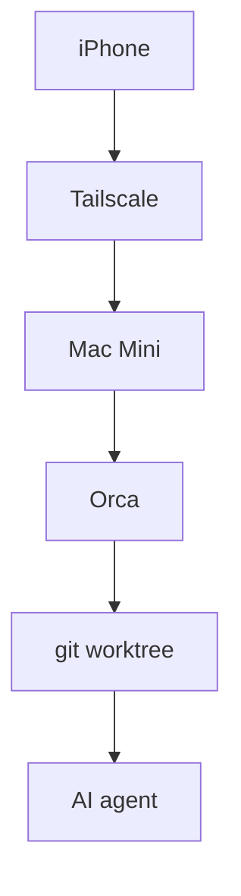

# ノートPCを返却しました。今日からiPhoneだけでAI開発します

Orca という Agent IDE で、スマホが自宅マシンのリモコンになる。セットアップと初日の正直な所感

## MacBookを返却して、手元に残ったのはiPhoneでした

大学にMacBookを返却しました。外出先で開発するとき、手元にあるのはiPhoneだけです。ただし、自宅にはMac Miniがあります。そこで考えたのが、計算はMac Miniに任せ、私はiPhoneからAI agentを動かす形でした。

試したのはOrcaです。Claude CodeやCodexなどを別々のgit worktreeで走らせるAgent IDEで、iOSとAndroid向けのmobile companionもあります。スマホ版は小さなコードエディタではなく、desktopのremote controlとして設計されています。外からagentの状態を見て、返答し、diffを確認し、次のタスクを始めるための画面です。

2026年7月20日、Mac MiniへOrca v1.4.146を入れ、iPhone 15とのpairingまで終えました。接続にはTailscaleを使っています。初日に触った限りでは、これは「iPhoneの中で開発する」というより、「自宅の開発環境をiPhoneから持ち歩く」に近い体験でした。

## スマホ開発の選択肢を地図にしてみました

最初は、自宅マシンへの遠隔接続か、cloud sandboxか、その二択だと思っていました。調べると、この分け方では足りません。同じ画面からlocalとcloudを選べる製品もあれば、自分のマシンをvendor relay越しに操作する製品、自社VPCで動かせる製品もあります。

見るべきなのは、コードの正本がどこにあるか、誰の計算機で実行するか、スマホからどの経路で届くかの3点でした。代表的な選択肢をこの軸で並べると、違いが見えます。

| 選択肢 | コードと実行場所 | 接続経路 | 向いている操作 |
|---|---|---|---|
| Orca | 自分のdesktop | 直接接続 | agent中心 |
| Happy | 自分のPC | E2EE relay | Claude Code |
| SSH + tmux | 自宅マシン | SSH、mosh | terminal中心 |
| Claude Code web | Anthropic VM | app、browser | cloud session |
| Codex cloud | OpenAI sandbox | ChatGPT app | cloud task |
| Codespaces | GitHub管理環境 | browser | cloud開発環境 |
| Remote Tunnels | 自分のmachine | Microsoft relay | VS Code |
| Cursor | cloud、自前環境 | native iOS | agent操作 |

VibeTunnelやcode-serverのようにbrowserを入口にする方法もあります。Claude CodeのRemote Controlは自分のPCで実行しながらAnthropic APIをrelayに使います。CursorのiOS betaはcloud VMだけでなくSelf-Hosted PoolやMy Machinesも選べます。境界は一本の線ではなく、かなり連続的です。

私がOrcaを選んだ理由は、自宅のMac Miniにすでにあるrepoと開発環境を、そのまま使いたかったからです。modelのsubscriptionも自分で用意する方式なので、Orcaがmodelを抱えるわけではありません。手元の状態を別のsandboxへ再現するより、今あるマシンにiPhoneから届く方が今回の目的には素直でした。

## Orcaという道具の形を整理しました

Orcaの中心にある考え方は、1 taskにつき1つのgit worktreeと専用terminalを持たせることです。同じrepoで複数のagentを走らせても、作業場所が分かれます。Claude Code、Codex、OpenCode、OpenClaw、Piなどに対応し、custom CLIも扱えます。



mobile companionからできるのは、agentへのcontinue、yes、自由文の返信、写真添付、音声入力、file treeの閲覧、stageとcommit、workspaceの作成などです。Live modeではkeystrokeを直接送れます。一方で、full editorは意図的に載せていません。スマホだけで細かなコード編集を再現するのではなく、agentを監督する範囲に絞っています。

desktop側にはdiff viewerがあり、diffの行へ付けた注釈をfollow-up promptにできます。GitHubのPR、issues、Actionsに加え、LinearやJiraもin-appで表示できます。同じpromptを複数agentへ送り、それぞれのworktreeで結果を比べる並列レースも用意されています。

remote接続もmobileだけではありません。SSH worktree、self-hosted Orca server、ephemeral VMを扱えます。ただ、今回使った構成はもっと単純です。Mac Mini上のOrcaとiPhoneをpairingし、両方をTailscaleに参加させました。Orca Relayは使っていません。

## セットアップではHomebrewとQRでつまずきました

Mac Miniへのinstallで最初に気をつけるのは、Homebrewの名前です。素の `brew install --cask orca` は、入れたいAgent IDEではありません。plotlyのdeprecatedツールです。使うtapを含めて、次のように指定しました。

```sh
brew install --cask stablyai/orca/orca
xattr -dr com.apple.quarantine /Applications/Orca.app
open -a Orca
```

このとき入ったのはv1.4.146でした。初回起動ではGatekeeperのdialogが出たため、quarantine属性を外しています。その後も、ほかのアプリからのデータへのアクセスやiCloud Driveへのアクセスを求めるdialogが複数重なりました。実際のセットアップでは、それぞれ許可して進めました。

onboardingは3 stepです。最初にdefault agentとしてClaudeを選びました。ほかにClaude Agent Teams、Codex、OpenClawも検出されています。「Yolo / Dangerously skip permissions」は既定のONのままにしました。次にthemeをsystemへ合わせ、通知設定はskipしました。

project追加では `/Users/anicca/anicca-project` を選びました。sidebarにdev、feature/realtime-dashboard、release/1.9.5などのbranchが並び、terminalが開けば準備完了です。package-lock.jsonから検出された `npm install` のセットアップスクリプトも保存できます。

iPhoneとのpairingは、desktopのsidebarにある「Orcaモバイル」から始めます。重要だったのはNetwork selectorです。ここでLAN IPではなく、Tailscale IPの `100.99.82.95 (utun0)` を選びました。phone側でもTailscaleをONにします。Orca RelayはOFFのままなので、構成はTailscale経由のP2Pです。

pairing QRは数分で期限切れになります。Mac Miniの前にいない状態で読み取るには、QRをiPhoneへ届けなければなりません。今回はTelegramとGmailの2経路で送り、Gmailで届いたものを使って、2026年7月20日20時40分ごろにpairingできました。QRが切れたら「コードを再生成する」で作り直せます。文字列のpairing codeをcopyする方法もあります。

画面操作の自動化にも小さな罠がありました。System Eventsを使った `osascript` のclickはaccessibility権限で固まることがあり、実測では `cliclick` の座標clickが安定しました。installそのものより、初回dialogの処理と、期限の短いQRをどうiPhoneへ渡すかの方が手間でした。

ここまで終われば、iPhoneのOrca appでDesktopsを開き、pairingしたMac Miniへ接続できます。desktop appを閉じると接続も切れ、再開すると自動でつながります。私の構成では、外出先から使うためにMac Mini、Orca、Tailscaleが動いていることが前提です。

## 初日に一番よかったのは並列作業の見通しでした

実際に使った初日の所感は、次の4行にほぼ尽きます。

> Orca iOSの所感：自動でワークツリーも切ってくれるし、各セッションのベースブランチがわかりやすくて最高です。
>
> ワンタップで、Claude/Codex/Openclawに繋げられますし、GithubのIssuesやLinearとも連携できるみたいです。
>
> 直近のセッションにもワンタップで戻れるので、非常に作業しやすい。Mac miniにSSH接続してますが、接続も良好です。並列開発が最高に捗りますね。画面下側にCodex・Claudeの残量も出るので最高です。
>
> これで心置きなく、PCでの開発から卒業できます！

とくに、sessionとbase branchの対応が見えること、直近のsessionへすぐ戻れることが効きました。terminalをスマホへそのまま押し込む方式では、複数の作業を頭の中で追う負担が残ります。Orcaではtaskごとにworktreeが切られ、sessionの入口も並ぶため、どのagentがどこで動いているかを見失いにくいです。

画面下の残量表示にも裏付けがあります。ClaudeはproviderのOAuth usage APIを読み、失敗時にはClaude CLIの `/usage` をhidden PTYで読むfallbackがあります。CodexはChatGPT側のusage endpointを使い、fallbackでは `codex app-server` のrate limit情報を読みます。localのsession時間を推測している表示ではなく、provider側のlive rate-limitを参照しています。

以前触れていたCmuxは、GhosttyベースのmacOS terminalで、縦tab、通知、browser、workspace、split、CLIを備えます。workflowを決めないterminal multiplexerとしての道具です。Orcaはworktree、agent、diff review、外部service連携までを一つのworkflowとしてまとめています。優劣というより、自由なterminalを組み立てたいか、agent開発の流れを最初から持ちたいかの違いでした。

もちろん、これは初日の感想です。接続の長期安定性、terminal操作のしやすさ、通知を含めた外出時の使い勝手は、まだ1週間使って判定する項目です。

## Cloud案との違いは状態をどこに置くかでした

Claude Code on the webでは、repoをGitHubからAnthropic管理VMへcloneして実行します。localの `~/.claude/CLAUDE.md` は自動では載らず、secrets storeもありません。networkはNone、Trusted、Fullの3段階です。一方、OrcaとTailscaleの構成では、実行もrepoも自宅のMac Mini側に残ります。

| 比較点 | Orca + Mac Mini | Claude Code web | Codex cloud |
|---|---|---|---|
| 実行場所 | 自宅Mac Mini | Anthropic VM | OpenAI sandbox |
| repo | 手元の環境 | GitHubからclone | cloud sandbox |
| 接続 | Tailscale P2P | app、browser | ChatGPT app |
| local依存 | Mac Miniが必要 | 再現が必要 | 再現が必要 |

本質的な差は、スマホの画面ではなく状態の置き場所です。自宅マシンにしかない設定や作業中のrepoをそのまま使うなら、Orcaのremote controlはわかりやすい選択です。反対に、local Mac Miniへの依存を切りたいなら、cloud sessionの方が目的に合います。

ただし、cloud sandboxからTailscaleで自宅へ入ることが構造的に不可能なわけではありません。Tailscaleのuserspace networkingはTUN deviceを使わず、SOCKS5またはHTTP proxyとして動けます。DERP relayもHTTPS接続を作れるdeviceなら利用できます。

Claude Code webでは全outbound trafficがAnthropicのHTTP/HTTPS proxyを通ります。Noneでは外へ出られず、Trustedの既定allowlistにはTailscale hostがないため候補になるのはFull、またはcustom allowlistです。さらにSSHを使うなら、userspace TUNへ自動routingされないため、localhostのSOCKS5へ `ProxyCommand` で通す必要があります。

理屈の上では、Full network、userspace tailscaled、DERP over 443を組み合わせる穴があります。しかし、Claude sandbox内でtailscaledを実際に起動できた報告は見つかっていません。Anthropic proxyがHTTPS CONNECTを許すか、tailscaledがそのproxy設定を使えるかも未確認です。私はこの経路をまだE2Eで試していません。

GitHub CodespacesにはTailscaleの公式手順がありますが、こちらは `/dev/net/tun` を渡す方式で条件が違います。したがって、cloudからも必ず自宅へ届くとも、絶対に届かないとも断定できません。現時点で確実なのは、OrcaとTailscaleなら、すでに自宅のMac MiniへiPhoneから接続できたことです。

## おすすめできる人と、まだ待った方がいい人を分けました

Orcaをおすすめしやすいのは、自宅や作業場に常時使えるmachineがあり、そこにrepoとagent環境がすでにそろっている人です。Claude CodeやCodexを複数sessionで動かし、branchとworktreeの対応をスマホから見たい人にも合います。full editorより、agentへの指示、承認、diff reviewを重視する人には設計意図が明快です。

一方で、自宅マシンへの依存を完全に切りたい人にはcloud実行の方が自然です。iPhone上で細かくコードを書き換えたい人にも、full editorを載せないOrca mobileは合いません。desktop appを閉じれば切断されるため、Mac MiniとTailscaleを維持する運用が負担なら、別の選択肢を見た方がよいです。

terminalだけを自由に組みたいならSSH、mosh、tmuxやCmuxがあります。browser型がよければVibeTunnelやcode-server、vendor relayを許容して自分のPCを動かすならHappyやRemote Tunnelsも候補です。どれが正解かは、コードの正本、実行するmachine、接続経路のどれを自分で持ちたいかで変わります。

私にとって初日のOrcaは、MacBookの代用品ではありませんでした。Mac Mini上の複数agentを、iPhoneから見通しよく動かす操作盤でした。その割り切りが、今のところ使いやすさにつながっています。

1週間後、接続安定性、terminal操作性、agent状態の見やすさを実際の利用結果で追記します。初日の勢いが続くのか、それともcloud案へ寄るのかは、その時点で判断します。

## 出典

- https://www.onorca.dev/docs/mobile
- https://github.com/stablyai/orca
- https://code.claude.com/docs/en/claude-code-on-the-web
- https://tailscale.com/docs/concepts/userspace-networking
- https://tailscale.com/docs/reference/connection-types
- https://tailscale.com/docs/integrations/github/github-codespaces
- https://github.com/stablyai/orca/blob/main/src/main/rate-limits/claude-fetcher.ts
- https://github.com/stablyai/orca/blob/main/src/main/rate-limits/codex-fetcher.ts
- https://github.com/manaflow-ai/cmux
- https://happy.engineering
- https://github.com/omnara-ai/omnara
- https://mosh.org
- https://cursor.com/docs
- https://docs.github.com
- https://code.visualstudio.com/docs/remote/tunnels
- https://coder.com/docs
- https://ona.com/docs
- https://openai.com
- https://jules.google/docs/faq
- https://docs.devin.ai/get-started/devin-intro
