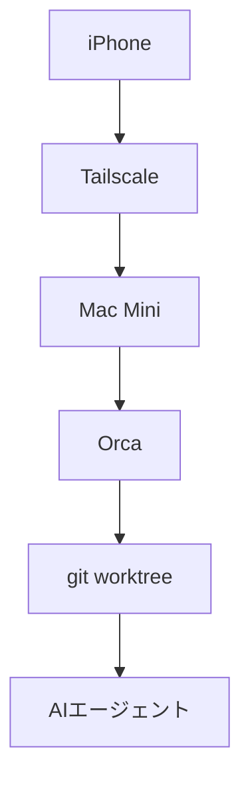
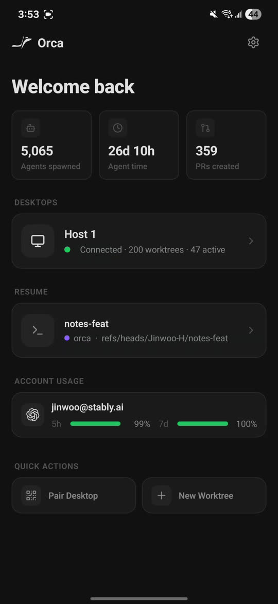

# ノートPCを返却しました。今日からiPhoneだけでAI開発します

Orca という Agent IDE で、スマホが自宅マシンのリモコンになる。セットアップと初日の正直な所感

## MacBookを返却した日

大学にMacBookを返却しました。外出先で開発するとき、手元にあるのはiPhoneだけです。ただし、自宅にはMac Miniがあります。そこで考えたのが、計算はMac Miniに任せ、私はiPhoneからAIエージェントを動かす形でした。

試したのはOrcaです。Claude CodeやCodexを別々の作業ツリー（git worktree）で走らせるAgent IDEで、スマホ版はデスクトップ版の遠隔操作盤として作られています。

7月20日、Mac MiniへOrca v1.4.146を入れ、Tailscale経由でiPhone 15とペアリングしました。これは「iPhoneの中で開発する」より、「自宅の開発環境をiPhoneから持ち歩く」に近い体験でした。

## スマホ開発の選択肢

自宅のマシンへ入るか、クラウドで動かすか。その二択では足りませんでした。同じスマホ用画面から、自宅とクラウドの両方を選べる製品もあります。

比べるなら、コードの正本がどこにあるか、誰のマシンで動くか、スマホから何を経由してつながるかを見る必要があります。

| 選択肢 | コードと実行場所 | 接続経路 | 向いている操作 |
|---|---|---|---|
| Orca | 自分のデスクトップ | 端末間で直接 | エージェント中心 |
| Happy | 自分のPC | 暗号化された中継 | Claude Code |
| SSH + tmux | 自宅マシン | SSH、mosh | ターミナル中心 |
| Claude Code on the web | Anthropicの仮想マシン | アプリ、ブラウザ | クラウドのセッション |
| Codex cloud | OpenAIの隔離環境 | ChatGPTアプリ | クラウドのタスク |
| Codespaces | GitHubの管理環境 | ブラウザ | クラウド開発環境 |
| Remote Tunnels | 自分のマシン | Microsoftの中継 | VS Code |
| Cursor | クラウド、自前環境 | iOSアプリ | エージェント操作 |

Claude CodeのRemote Controlは自分のPCで実行しながらAnthropicのAPIを中継に使い、CursorのiOSベータ版はクラウドの仮想マシンと自前のマシンを選べます。きれいに二分できる世界ではありません。

私はMac Miniにあるリポジトリと開発環境をそのまま使いたくてOrcaを選びました。

## Orcaという道具

Orcaでは、1つのタスクに1つのgit worktreeと専用ターミナルを持たせます。Claude Code、Codex、OpenCode、OpenClaw、Piなどに対応します。



スマホ版ではエージェントへの返信、ファイル一覧の閲覧、ステージングとコミット、新しいworkspaceの作成ができます。コードを細かく書くためのエディタは、あえて載せていません。今回の構成はMac MiniとiPhoneをTailscaleに参加させた直接接続で、Orca Relayは使っていません。



*Orca公式のスマホ版画面。接続中のデスクトップ、直近の作業ツリー、ClaudeとCodexの残量が一画面に並ぶ*

## セットアップ、HomebrewとQR

私のMac Miniへのインストールで最初につまずいたのは、Homebrewの名前です。素の `brew install --cask orca` が指すcaskを確認すると、目当てのAgent IDEではなくPlotlyの画像生成ツールでした。配布元のtapまで含めて、次のように指定しました。

```sh
brew install --cask stablyai/orca/orca
xattr -dr com.apple.quarantine /Applications/Orca.app
open -a Orca
```

Gatekeeperのダイアログはquarantine属性を外して回避しました。続くアクセス確認を許可し、3段階の初期設定では既定のエージェントにClaude、テーマにシステム設定を選び、通知設定は飛ばしました。プロジェクトに `/Users/anicca/anicca-project` を追加し、ブランチ一覧とターミナルが出れば準備完了です。

iPhoneとのペアリングは、デスクトップ版のサイドバーにある「Orcaモバイル」から始めます。重要だったのは接続先ネットワークの選択です。ここでLAN側のIPアドレスではなく、Tailscaleの `100.99.82.95 (utun0)` を選びました。iPhone側でもTailscaleをONにします。Orca RelayはOFFのままなので、Orcaのクラウド中継を使わないTailscale経由の端末間接続です。Tailscale内部で直結したかDERP中継になったかまでは測っていません。

Orcaの公式説明にも、ペアリング用QRコードは数分で切れるとあります。今回はTelegramとGmailでiPhoneへ送り、Gmail経由のQRコードで20時40分ごろにペアリングできました。期限切れなら再生成できます。公式説明どおり、デスクトップ版を閉じると接続も切れ、再開すると自動でつながりました。

## 初日の所感

実際に使った初日の所感は、次の4行にほぼ尽きます。

> Orca iOSの所感：自動でワークツリーも切ってくれるし、各セッションのベースブランチがわかりやすくて最高です。
>
> ワンタップで、Claude/Codex/Openclawに繋げられますし、GithubのIssuesやLinearとも連携できるみたいです。
>
> 直近のセッションにもワンタップで戻れるので、非常に作業しやすい。Mac miniにSSH接続してますが、接続も良好です。並列開発が最高に捗りますね。画面下側にCodex・Claudeの残量も出るので最高です。
>
> これで心置きなく、PCでの開発から卒業できます！

とくに、セッションとベースブランチの対応が見えること、直近のセッションへすぐ戻れることが効きました。ターミナルをスマホへそのまま押し込む方式では、複数の作業を頭の中で追う負担が残ります。Orcaではタスクごとにworktreeが切られ、セッションの入口も並ぶため、どのエージェントがどこで動いているかを見失いにくいです。

画面下の残量表示にも裏付けがあります。Claudeは提供元の利用状況APIを読み、失敗時にはClaude CLIの `/usage` を裏側のターミナルで読む予備経路があります。CodexはChatGPT側の利用状況を取得し、失敗時には `codex app-server` の利用上限を読みます。手元のセッション時間から推測した数字ではなく、提供元の数字を取りに行っています。

以前使っていたCmuxは、Ghosttyを土台にしたmacOS用ターミナルです。縦タブ、通知、ブラウザ、workspace、画面分割、CLIを備えています。作業の流れを決めない、自由度の高い道具です。Orcaはworktree、エージェント、差分確認、外部サービス連携までを一つの流れにまとめています。

自由なターミナルを自分で組み立てたいか、エージェント開発の流れを最初から持ちたいか。私は後者の方が楽でした。

これはまだ初日の感想です。接続の長期安定性、ターミナル操作のしやすさ、通知を含めた外出時の使い勝手は、1週間使って判定します。

## クラウド案との比較、状態の置き場所

Claude Code on the webでは、リポジトリをGitHubからAnthropic管理の仮想マシンへ複製して実行します。手元の `~/.claude/CLAUDE.md` は自動では載らず、機密情報を保存する専用機能もありません。外部通信はNone、Trusted、Fullの3段階です。一方、OrcaとTailscaleの構成では、実行環境もリポジトリも自宅のMac Mini側に残ります。

| 比較点 | Orca + Mac Mini | Claude Code on the web | Codex cloud |
|---|---|---|---|
| 実行場所 | 自宅Mac Mini | Anthropicの仮想マシン | OpenAIの隔離環境 |
| リポジトリ | 手元の環境 | GitHubから複製 | クラウドの隔離環境 |
| 接続 | Tailscale経由 | アプリ、ブラウザ | ChatGPTアプリ |
| 自宅への依存 | Mac Miniが必要 | 環境の再現が必要 | 環境の再現が必要 |

差が出るのは状態の置き場所です。自宅マシンにしかない設定や作業中のリポジトリをそのまま使うなら、Orcaの遠隔操作は分かりやすい選択です。自宅のMac Miniへの依存を切りたいなら、クラウドのセッションの方が目的に合います。

ただし、クラウドの隔離環境からTailscaleで自宅へ入ることは、仕組み上まったく不可能ではありません。Tailscaleのuserspace networkingはTUNデバイスを使わず、SOCKS5またはHTTPのプロキシとして動けます。DERPという中継も、任意のホストへHTTPS接続を作れる端末なら利用できます。

Claude Code on the webでは、外向きの通信がすべてAnthropicのHTTP/HTTPSプロキシを通ります。Noneでは外へ出られず、Trustedの既定許可先にTailscaleのホストはありません。候補になるのはFullか、独自の許可先を追加する設定です。さらにSSHを使うなら、userspace側へ自動で流れないため、localhostのSOCKS5へ `ProxyCommand` で通す必要があります。

理屈の上では、Full、userspace tailscaled、443番ポート経由のDERPを組み合わせる余地があります。しかし、GitHubと公式文書を検索しても、Claudeの隔離環境内でtailscaledを動かした報告を私は見つけられませんでした。AnthropicのプロキシがHTTPS CONNECTを許すか、tailscaledがそのプロキシ設定を使えるかも未確認です。私はこの経路をまだ一度も動かせていません。

GitHub CodespacesにはTailscaleの公式手順がありますが、こちらは `/dev/net/tun` を渡す方式で条件が違います。クラウドからも必ず自宅へ届くとも、絶対に届かないとも断定できません。現時点で確実なのは、OrcaとTailscaleなら、すでに自宅のMac MiniへiPhoneから接続できたことです。

## おすすめできる人、まだ待った方がいい人

Orcaをおすすめしやすいのは、自宅や作業場に常時使えるマシンがあり、そこにリポジトリとエージェント環境がそろっている人です。Claude CodeやCodexを複数のセッションで動かし、ブランチとworktreeの対応をスマホから見たい人にも合います。細かなコード編集より、エージェントへの指示、承認、差分確認を重視する人には意図が明快です。

自宅マシンへの依存を完全に切りたい人には、クラウド実行の方が自然です。iPhone上で細かくコードを書き換えたい人にも、エディタを載せないOrcaのスマホ版は合いません。デスクトップ版を閉じれば切断されるため、Mac MiniとTailscaleを維持する運用が負担なら、別の選択肢を見た方がよいです。

ターミナルだけを自由に組みたいならSSH、mosh、tmuxやCmuxがあります。ブラウザ型がよければVibeTunnelやcode-server、企業の中継を許容して自分のPCを動かすならHappyやRemote Tunnelsも候補です。選ぶ基準は、コードの正本、実行するマシン、接続経路のどれを自分で持ちたいかです。

私にとって初日のOrcaは、MacBookの代用品ではありませんでした。Mac Mini上の複数エージェントを、iPhoneから見通しよく動かす操作盤でした。その割り切りが、今のところ使いやすさにつながっています。

1週間後、接続安定性、ターミナル操作性、エージェント状態の見やすさを実際の利用結果で追記します。初日の勢いが続くのか、それともクラウド案へ寄るのかは、その時点で判断します。

## 出典

- Orca Mobile公式説明（直接接続、QR期限、再接続、スマホ機能）：https://www.onorca.dev/docs/mobile
- Orca Mobile公式画像：https://www.onorca.dev/whats-new/posters/orca-mobile.jpg
- Orca README（対応エージェント、worktree、Homebrewコマンド）：https://github.com/stablyai/orca
- Orca Homebrew tap：https://github.com/stablyai/homebrew-orca
- 同名のPlotly製Homebrew cask：https://github.com/Homebrew/homebrew-cask/blob/main/Casks/o/orca.rb
- Claude Code Remote Control（手元実行、Anthropic中継）：https://code.claude.com/docs/en/remote-control
- Claude Code on the web（仮想マシン、設定、通信制御）：https://code.claude.com/docs/en/claude-code-on-the-web
- Tailscale userspace networking：https://tailscale.com/docs/concepts/userspace-networking
- Tailscaleの直接接続とDERP：https://tailscale.com/docs/reference/connection-types
- TailscaleのGitHub Codespaces手順：https://tailscale.com/docs/integrations/github/github-codespaces
- OrcaのClaude残量取得コード：https://github.com/stablyai/orca/blob/main/src/main/rate-limits/claude-fetcher.ts
- OrcaのCodex残量取得コード：https://github.com/stablyai/orca/blob/main/src/main/rate-limits/codex-fetcher.ts
- Cmux：https://github.com/manaflow-ai/cmux
- Happy（手元実行、暗号化中継）：https://happy.engineering
- Omnara：https://github.com/omnara-ai/omnara
- Mosh：https://mosh.org
- Cursor公式文書：https://cursor.com/docs
- GitHub Codespaces概要：https://docs.github.com/en/codespaces/about-codespaces/what-are-codespaces
- VS Code Remote Tunnels：https://code.visualstudio.com/docs/remote/tunnels
- code-server：https://coder.com/docs/code-server
- Ona公式文書：https://ona.com/docs
- OpenAI Codex：https://openai.com/codex/
- Google Jules FAQ：https://jules.google/docs/faq
- Devin概要：https://docs.devin.ai/get-started/devin-intro
