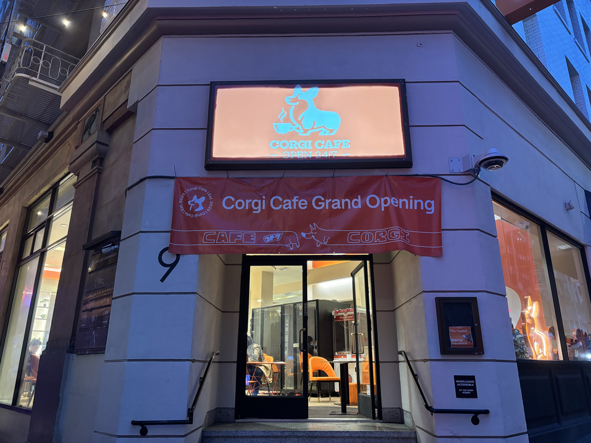
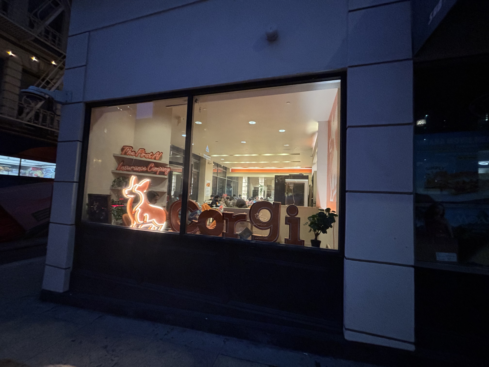
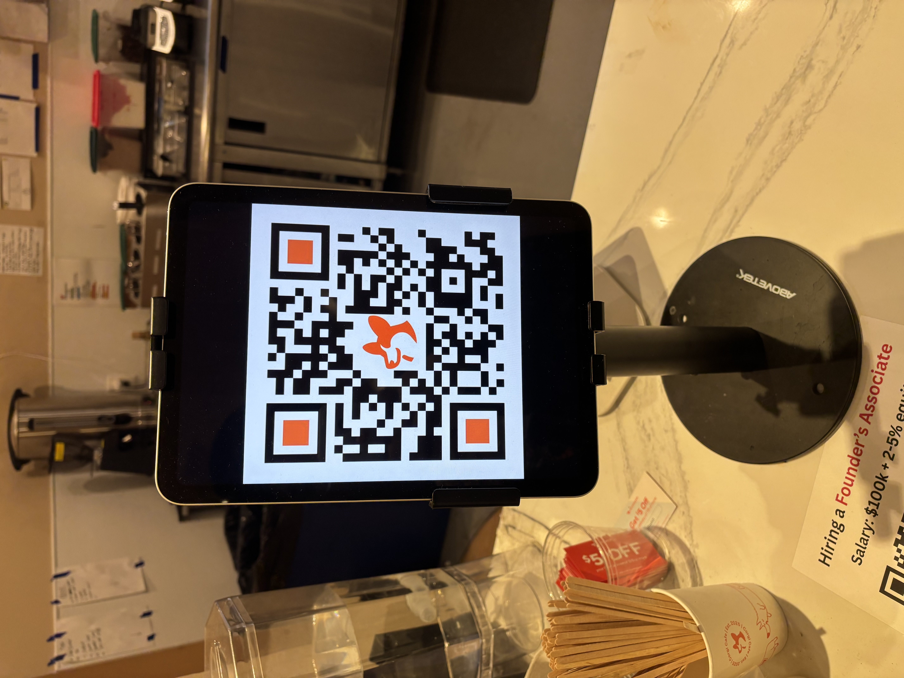
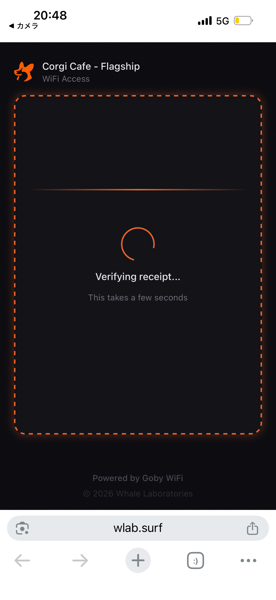
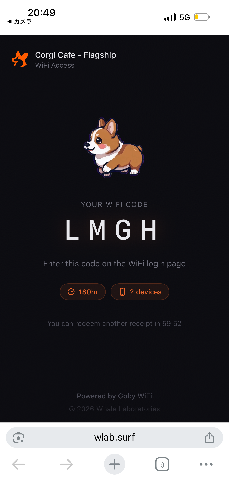
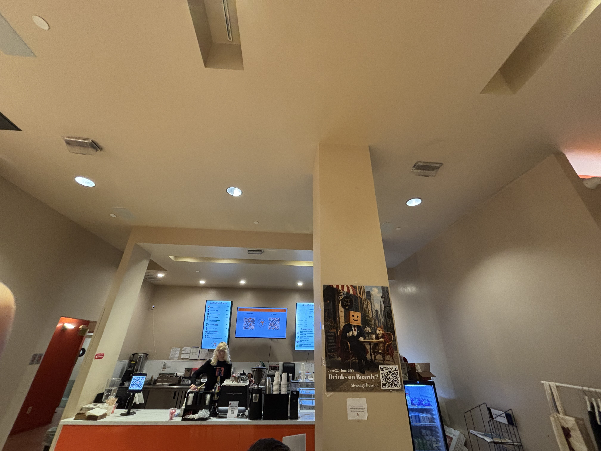
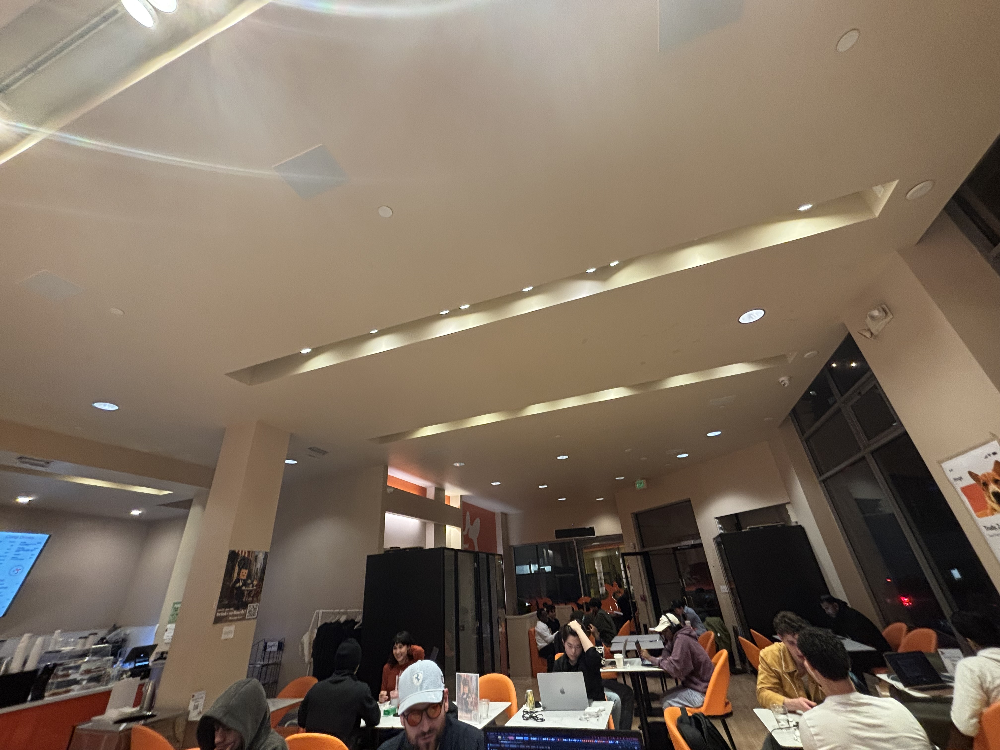
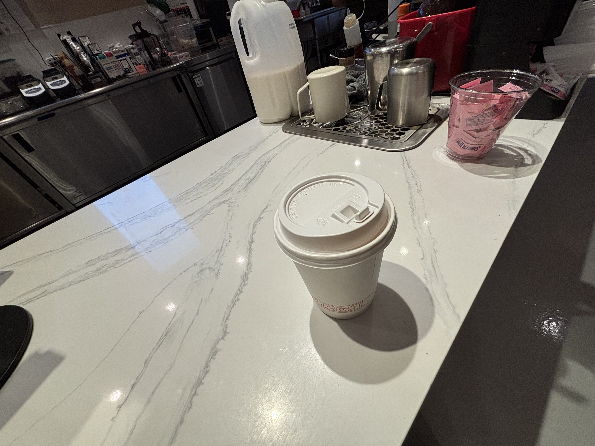
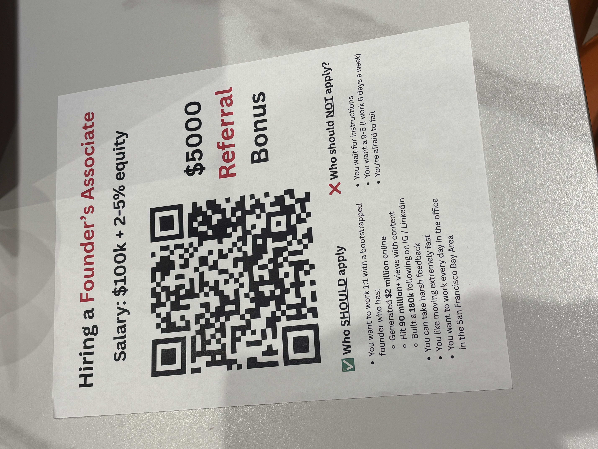

# 24時間営業のスタートアップカフェ「Corgi Cafe」(SF) に行ってきた

## 金融街の路地、24時間営業の店

ダウンタウンの 9 Claude Lane、Kearny と Grant の細い路地に、深夜でも煌々と光ってる店があります。名前は **Corgi Cafe**。看板の犬は青いネオン、店名は **OPEN 24/7**。

入口の上には開店バナーが下がってて、入ってすぐオレンジの椅子。フード姿の人たちがノートPCを叩いてました。

## やってるのは AI 保険スタートアップ

外から窓越しに見ると、壁のネオンに *The First AI Insurance Company* と書いてあります。コーギーのロゴと、店名 "corgi" の立体文字。

このカフェ、 **[Corgi](https://www.corgi.insure/)** という AI 保険スタートアップが運営してます。CEO は26歳の Nico Laqua、共同創業者 Emily Yuan。Y Combinator 2024卒、シリーズAで **$108M**(評価額 $630M)。

カフェは本社の1階の店舗スペース。Nico いわく「5階のオフィスを借りようとしたら、1階の店舗も込みの契約だった」。投資家には「絶対やめろ」と全力で反対されたけど、押し切って2026年2月に開店したそうです。狙いは「**Capital One Café** と同じ路線」、AI 競争のなかで認知を取るためのブランド施設。

## Wi-Fi の繋ぎ方

普通のカフェなら、テーブルに紙のパスワードが貼ってあるか、注文時に教えてもらえる。ここはそれがありません。

カウンターに **オレンジの QR タブレット** が立ってます。これを iPhone で読み取るのが最初。

電話番号を入れると、ショートメッセージでリンクが届く。タップするとブラウザがこの画面に飛びます。

「**Verifying receipt...**」(レシート照合中)。注文した記録がサーバ側にあって、それと電話番号を突き合わせて検証してるらしい。数秒で次に切り替わる。

4文字のコード(私の場合は `LMGH`)が出ます。これを Wi-Fi のログイン画面に入れると繋がる。

- 有効期間: **180時間(約7.5日)**
- 同時接続: **2台**
- 次のレシートまで: **60分**

裏側は **Goby WiFi**(運営は Whale Laboratories、URL は wlab.surf)の Wi-Fi 認証ページ。コーヒー1杯で7.5日分・2台ぶんのオフィス Wi-Fi が手に入る計算で、コーヒー代というよりほぼコワーキングの一日券です。

## オレンジの椅子とノートPCの海

カウンター上にメニューが3面。**Exclusive Drinks** / **Corgi Drinks** / **Smoothies**。右の柱には *Drinks on Boardy?* のポスター(Boardy という AI エージェントとのコラボらしい)。

席はオレンジ、机もちょっとオレンジ。半分くらいは ノートPC を開いた起業家っぽい人たち、半分は普通のオフィスワーカー。

私が頼んだのはホットコーヒー、$7.20(明細は `SQ *CORGI CAFE` / ¥1,072 / 2026-06-27)。**Y Combinator 卒は20%引き** だそうです。Erewhon 風の $14 スムージーも置いてあるけど、これは試してません。

## 入口の採用ビラ

このカフェで一番、空気をよく表してたのは飲み物じゃなくて、入口横に置かれた **採用ビラ** でした。

- 募集: **Founder's Associate**(創業者の右腕)
- 給与: **$100k + 2-5% equity**
- 紹介料: **$5,000**
- 求める人: 自己資金で $2M 稼いだ創業者と1対1で働きたい / 毎日オフィスに来られる / 厳しいダメ出しを受けられる / SF ベイエリア在住
- 来てほしくない人: 指示待ち / 9-5希望 / **失敗を恐れる人**

ちなみに Corgi 社員は **週7日勤務**、そのうち4-5人はオフィスで寝泊まりしてるそうです(建物は住居用途で用途地域的にOK)。CEO Nico は社内で「火事があったら焼けた俺の死体が見つかるはず」と毎度言う、とブランド責任者の Erika が笑ってた、と元記事にあります。

カフェに見えるオフィスに見える宗教施設、というのが個人的な印象。

## 結局このカフェは何なのか

カフェに見えるオフィス兼採用装置です。背景を一応まとめると、

- 運営は **[Corgi](https://www.corgi.insure/)**(AI 保険スタートアップ)
- **$108M シリーズA** @ **$630M 評価額**(2026, YC 2024卒)
- 5階の本社を借りた時、1階の店舗が強制バンドルだった
- CEO 曰く「投資家は絶対やめろと言った」けど押し切った
- 公言してる通り赤字運営(保険商品の売上にはほぼ繋がってない)
- 他都市展開予定: Salt Lake City、Atlanta、Chicago、Dallas、New York、London

## おすすめする人 / しない人

- **おすすめ**: 深夜に作業したい AI 系の創業者 / SF 金融街にいる / スタートアップの匂いを吸いに来たい / 「カフェを建前にした生活」を観察したい人
- **おすすめしない**: コーギーに会いに来る人(Trudy という社員犬がたまに来るだけ) / SF でも安いコーヒーが欲しい人($7はちょっと高め) / 静かに長居したい人(夜は満席)

## 出典

- Cydney Hayes / *Gazetteer SF*, *"Come for the all-night coffee, stay for the AI insurance"*(2026-04-01)[原文](https://sf.gazetteer.co/come-for-the-all-night-coffee-stay-for-the-ai-insurance)
- Corgi 公式: [corgi.insure](https://www.corgi.insure/)
- 実訪 + 写真: 2026-06-27、9 Claude Ln, San Francisco
