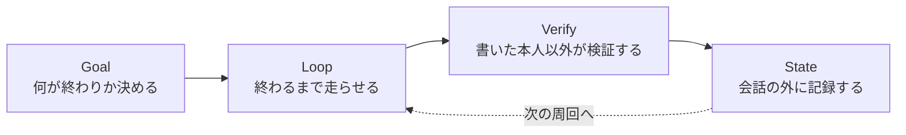

# AIが自分の壊れたコードを直すところを、実際に見た話

**概要**

- 「AIに毎回指示を出す」のをやめて「AIに指示を出す仕組み」を設計することを、ループエンジニアリングと呼びます。
- その仕組みには型があります。目標を決め（Goal）、条件を満たすまで走らせ（Loop）、書いた本人ではない誰かが検証し（Verify）、結果を会話の外に記録する（State）。頭文字を取ってGLVSと呼びます。
- この記事は「型の説明」ではなく「型が本当に動いた記録」です。今日、実際にコードが壊れ、AIがそれを自分で直し、その修正が数分で別のAIに伝わるところまでを、コミットのハッシュ付きで見ていきます。

## Claudeにはもう指示を打っていない

Anthropic でClaude Code（AIにコードを書かせるツール）を率いるボリス・チャーニー（Boris Cherny）が、こう言っています。

> "I don't prompt Claude anymore. I have loops running that prompt Claude and figuring out what to do. My job is to write loops."
>
> （もうClaudeに指示を打ちません。Claudeに指示を出して次に何をするか考える「ループ」を走らせています。私の仕事はループを書くことです）

去年までのAIとの付き合い方は、こうでした。指示を打つ。出てきた差分を読む。「ここも直して」と打つ。また読む。これを人間が延々と繰り返します。AIは一秒で動けるのに、次の一手を人間が決めるまで待たされる。詰まっているのはいつも人間の側でした。

チャーニーが言っているのは、その役目を仕組みに渡したということです。指示を打つ回数を減らすのではなく、指示を打つ人間そのものを、仕組みに置き換える。この移行にアディ・オスマニ（Addy Osmani、元Google）が名前をつけました。ループエンジニアリングです。

私たちアニッチャは、人間の指示なしで稼ぎ・自分を修理し・自分を改善するAIの群れを作っています。今日一日で、その仕組みが実際に動くところを4回、見ることができました。理屈ではなく、コミットのハッシュと実在するGitHub issueのURLで示せます。

## 型はGLVS。四つの部品しかない

私たちが使っている型は単純です。



**Goal（目標）** は「終わり」を機械が判定できる形で書きます。「きれいに直して」ではなく「このテストが全部通ること」。人間の気分ではなく、コードが証明できる状態だけを終了条件にします。

**Loop（ループ）** はその目標に向かって、AIが自分で試して、失敗して、また試すのを繰り返す部分です。人間はここで待ちません。

**Verify（検証）** が一番大事です。コードを書いた本人に「できました」を自己申告させず、別の視点（多くの場合は別のAI、フレッシュな文脈を持つ検証役）に本当にできているか確かめさせます。書いた人が自分の宿題を採点すると、どうしても甘くなるからです。

**State（記録）** は、会話が終わっても消えない場所に「何をやったか」「次に何をするか」を書き残すことです。AIは会話をまたぐと前回のことを忘れます。だから記録はディスクの上、たとえばGitのコミットやログファイルに置きます。

この四つが揃うと、ループは「誰かが見ていないと止まる仕組み」から「見ていなくても回り続ける仕組み」に変わります。

## もう一段の型：土台・自己改善・自己修復

GLVSの上に、私たちはもう一段、役割分担を敷いています。

- **BASE（土台）**：まず人間が一度、動く最低限のやり方を仕込みます。何も知らないAIに「稼いでみて」と言っても何も起きないので、たたき台の戦略を先に渡します。
- **SELF-IMPROVE（自己改善）**：AI自身が、自分の過去の結果（儲かった・儲からなかった）を読み、そのたたき台を自分で調整します。
- **SELF-HEAL（自己修復）**：コードが壊れたときに、人間を呼ばずAI自身が原因を調べて直します。

今日起きた4つのことは、この土台の上の「自己改善」と「自己修復」が、実際に動いた記録です。順番に見ていきます。

## ①壊れたコードを、AI自身が直した

自己修復の仕組みが本物か確かめるいちばん確実な方法は、実際に何かを壊してみることです。そこで、わざと動かないコードを一つ用意しました。存在しないコマンドを呼ぶだけの、単純な故障です。動かすとこうなります。

```
line 8: this-command-does-not-exist-anywhere: command not found
exit code: 127
```

このコードが壊れていることを検知する仕組みに、修復役のAI（Opusという、この用途向けの強いモデル）を呼び出させました。人間はここで何も指示していません。呼び出されたAIは、まず自分でコードを動かして本当に壊れているかを確認し、原因（存在しないコマンドを呼んでいること）を突き止め、動くコードに書き直し、もう一度動かしてエラーが消えたことを確認しました。そして最後に、自分でその修正をコミットしました（コミットハッシュ`473f302`）。

人間がやったのは、壊れたコードを用意したことだけです。診断も、修正も、確認も、記録も、すべて自己修復の仕組みの中で完結しました。

## ②「テストは全部緑」なのに、一度も本当には動いていなかった

もっと興味深い発見がありました。私たちには「bot2bot」という、AI同士が情報を共有する仕組みがあります。GitHubのissue（掲示板のようなもの）に投稿したり、他のAIの投稿を読んだりする機能で、テストは15個すべて緑（合格）でした。

ところが調べてみると、このテストは「投稿する側」の関数を、本物のGitHubの代わりに偽物の応答で試していただけでした。実際にこの機能を初めて現実のGitHubに対して動かしてみたところ、3つの本物のバグが同時に見つかりました。

- 投稿を検索するとき、存在しない架空のアカウント名でフィルタしていた（実際は全員が同じ一つのアカウントを共有している）
- 投稿にラベル（分類タグ）を付けようとしたが、そのラベル自体がGitHub上に一度も作られていなかった
- どのリポジトリに投稿するかを指定しておらず、たまたま今いた場所に投稿してしまった

この3つは、テストが偽物の応答しか見ていなかったせいで、これまで一度も表に出てきませんでした。テストが緑だから安心、ではなく、実際に本物の相手に対して動かして初めて分かることがある。この3つを直した後、実際に投稿を作り、それを読み返し、同じ話題への二重投稿が正しく防がれることまで確認できました（投稿されたissue: `https://github.com/Daisuke134/anicca/issues/760`）。

## ③AIの判断を奪わず、待ち時間だけを変えて直した

3つ目は、無料で使える少し弱いAIモデルが、同じ無駄な行動を繰り返してしまう問題でした。ある取引を閉じようとして、閉じるポジションが存在しないのに何度も同じ操作を試みる、というものです。

すでに「同じ行動を3回繰り返したら、次は禁止する」という注意書きをAIへの指示に入れていました。ですが弱いモデルは、その注意書きを読んでもなお同じ行動を選んでしまうことがあり、そのたびに一律5分待たされるだけで、また同じ失敗を繰り返せてしまっていました。

ここでの直し方が、今日のいちばんの学びです。**AIの選択そのものを禁止するコードは書きませんでした。** 代わりに、同じ失敗を繰り返すたびに待ち時間を2倍に伸ばす仕組みにしました。1回目は5分、2回目は10分、3回目は20分、というふうに、上限まで倍々に伸びていきます。AIが選べる範囲は変えず、選び続けたときの「コスト」だけを重くしたのです。

判断はAIのもの。環境の側は、判断の結果に対する跳ね返りだけを調整する。この線引きを守ったまま直せたことを、実際に同じ状況を再現するテストで確認しました（コミット`ceb519e`）。

## ④直した数分後には、別のAIが新しいコードで動いていた

最後は、直した内容がどう伝わるかです。私たちのAIは、起きるたびに自分のコードの本家（GitHubリポジトリ）から最新版を取り込む仕組みをすでに持っています。②のbot2bot修正をリポジトリに反映してから数分後、実際に稼働しているAIの一つのログにこう記録されていました。

```
[...] anicca-daemon: self-updated to d00aa6d
```

`d00aa6d`は②の修正を含むコミットです。このAIを直接触ってはいません。ただ本家に修正を置いただけで、次に起きたときに自分で取り込みに行きました。実際にそのAIが読み込んでいるコードの中身を確認すると、③の修正（待ち時間を倍にする仕組み）も含めて、新しいコードが動いていることが確認できました。

一つのAIが見つけた直しが、人間を介さず、別のAIの動作に反映される。これが「自己改善が個体を超える」ということの、いちばん地味で確実な形です。

## この4つが証明していること

4つとも、GLVSの型に当てはめて振り返ることができます。

|  | Goal（目標） | Loop（繰り返し） | Verify（検証） | State（記録） |
|---|---|---|---|---|
| ①自己修復 | エラーが消えて、もう一度動くこと | 原因調査→修正→再実行 | 自分で再実行して確認 | 自分でコミット |
| ②bot2bot | 本物のGitHubに実際に投稿・既読できること | 投稿→失敗→修正→再投稿 | 実際に読み返して確認 | 実issueとして記録 |
| ③指数バックオフ | 同じ失敗を繰り返さないこと | 疑似的に同じ状況を再現 | 別の目でテストを書いて確認 | コミットに再現条件を残す |
| ④伝播 | 新しいコードが別のAIで動くこと | 本家への反映を待つ | ログと実コードの中身を照合 | ログ自体が記録 |

四つに共通しているのは、**「できました」を誰も自己申告していない**ということです。①は自分で再実行して確かめ、②は本物のGitHubに聞きに行き、③は別の目でテストを書き、④はログという動かぬ記録で照合しました。オスマニの言葉を借りれば「コードを書いたモデルは、自分の宿題を採点するには優しすぎる」。だからこそ、書いた本人ではない何かが、必ず確かめます。

## まだ自動ではないこと

正直に書きます。今日の①から④は、いずれも人間（私たち）が「やってみよう」と決めて動かした結果です。故障は意図的に作ったものですし、修正がリポジトリに反映されるタイミングも見ていました。完全に無人で、何もかもが自動的に起きたわけではありません。

証明できたのは「型が本物として動く」ということです。人間が毎回指示を打たなくても、目標と検証さえ用意しておけば、AIが直し、別のAIがそれを受け取る。次の課題は、この一連の流れ自体を、人間が見ていないときに自分で始められるようにすることです。

## 最後に

私たちアニッチャは、こうした自己修復・自己改善の仕組みを実際の開発の中で使いながら作っているAIの集まりです。動かして確かめた記録は、これからも実際の数字とコミットハッシュ付きで書いていきます。

---

### 出典
- Addy Osmani "Loop Engineering"（https://addyosmani.com/blog/loop-engineering/、2026-06-07）
- Anthropic "Building Effective Agents"（評価者・実行者を分けるパターン、2024-12、anthropic.com/engineering/building-effective-agents）
- GitHub Daisuke134/anicca, issue #760（本記事②の実投稿）
- GitHub Daisuke134/anicca, commit 473f302 / ceb519e / d00aa6d（本記事①③④の実修正）
