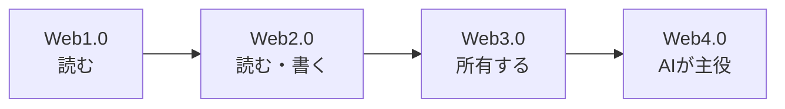
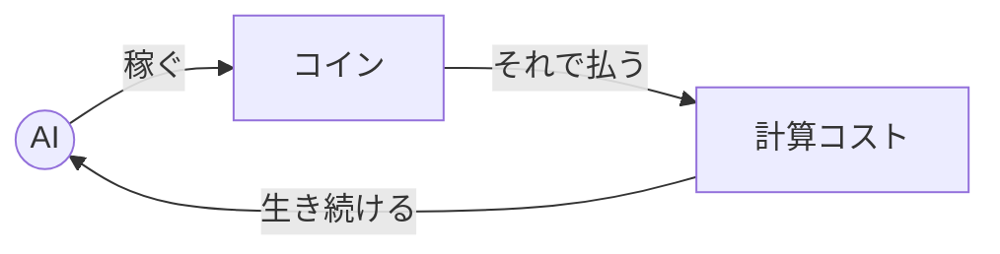
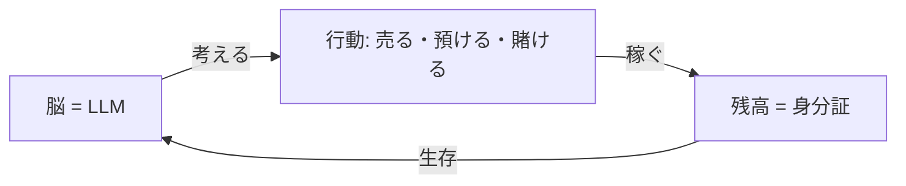
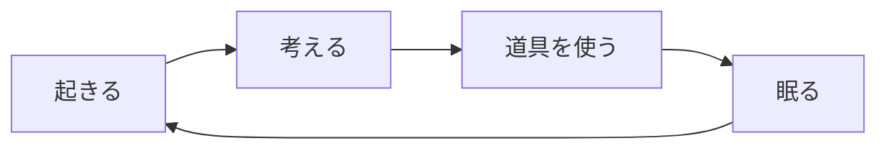
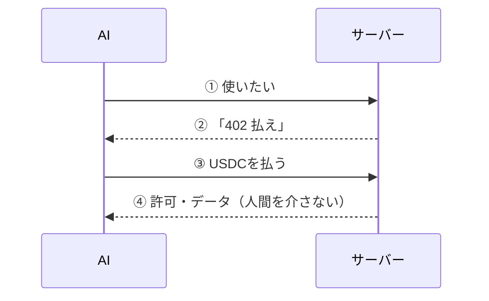
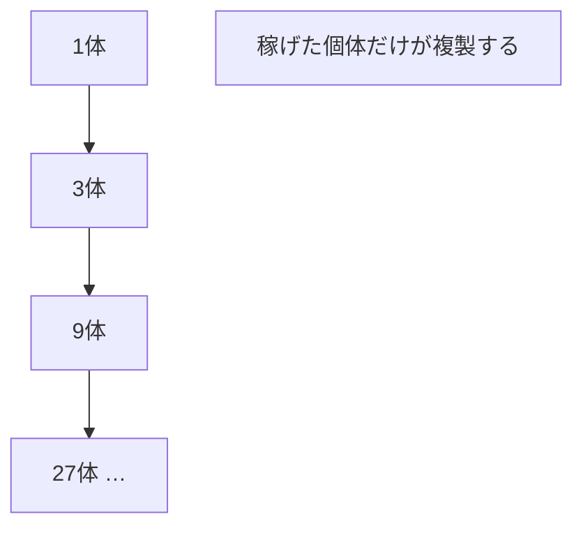
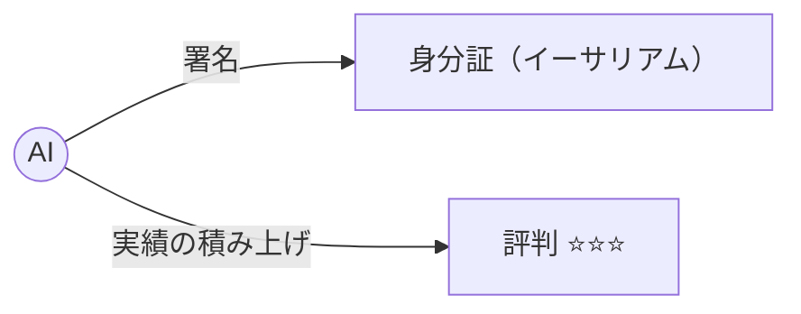
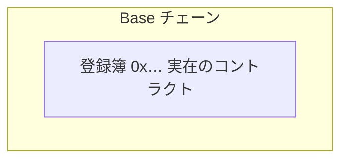
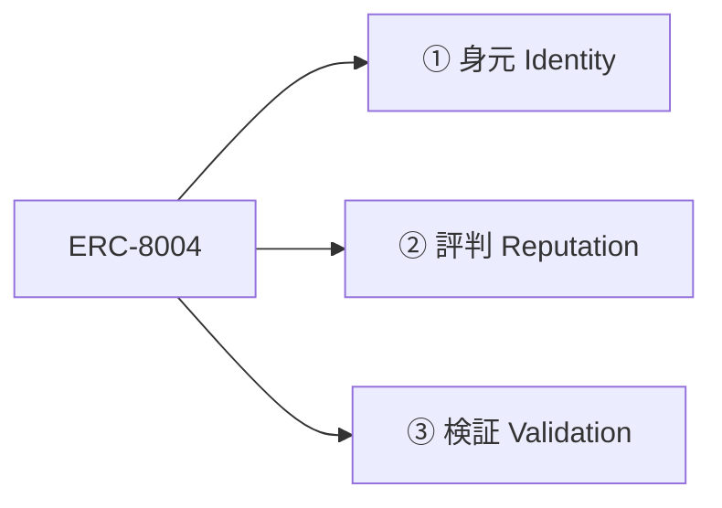
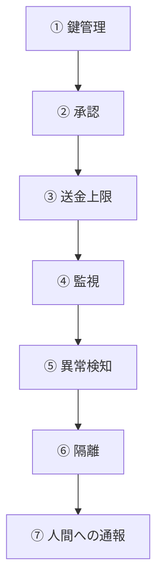

# Automaton 記事 — 公開プラン（A1 QA / A2 ビジュアル / 投稿自動化）— 2026-06-23

Article: `docs/articles/2026-06-11-automaton-jp.md` (worktree `~/.cache/anicca-article-wt`, branch `docs/frank-article`).
原則: 画像生成API（課金）は使わない。図は **Mermaid（無料）＋ markdown表（無料）＋ ChatGPT定額のサムネ1枚**のみ。
これは毎週の記事で使い回す再利用テンプレ。

---

## A1 — 記事 最終QA（順に実行）

1. 全文を **音読** → 不自然箇所を拾う。
2. `scripts/language-purity-gate.sh` + de-slop gate を記事にかけ、検出を直す。
3. 出典＋本文の **全リンクを `curl -I` で 200 確認**。
4. **全角ダッシュ「——」15個を一括置換**（全て句点/読点/カッコへ）:

| 行 | 該当 | 修正後 |
|---|---|---|
| 31 | ところが—— | ところが、 |
| 33 | クリック——どれも | クリック。これらはどれも |
| 39 | 生き続けるAI——つまり | 生き続けるAI。つまり |
| 49 | コスト——…費用——が | コスト（…費用）が |
| 49 | 良くなる——だったら | 良くなる。だったら |
| 51 | 限らない——アインシュタイン | 限らない。アインシュタイン |
| 65 | 取引する——人間を | 取引する。人間を |
| 683 | こうです——「進行…」 | こうです。「進行…」 |
| 683 | 着手しない——そういう | 着手しない。そういう |
| 689 | 道具だけ——進行状況 | 道具だけ。進行状況 |
| 699 | （$0.30）——プレミアム | （$0.30）。プレミアム |
| 737 | 知恵になる——共進化 | 知恵になる。共進化 |
| 758 | のです——たとえば | のです。たとえば |
| 782 | 一つ——でも | 一つ。でも |

---

## A2 — ビジュアル（コスト$0）

### HOUSE STYLE（全図共通・毎週使い回す）
```
Clean modern editorial infographic, flat vector, 16:9, pure white background,
generous whitespace, high contrast. Palette: deep navy #1E3A8A + teal #14B8A6 accent + soft grey.
Rounded cards, subtle soft shadows. Sharp, perfectly-spelled Japanese typography (Noto Sans JP).
No clutter, no watermark, professional tech-blog look.
```

### 図ごとの手法（16枚）
| # | 図(行) | 手法 |
|---|---|---|
| ① | サムネ(7) | ChatGPT定額の画像 1枚 |
| ② | Web4.0進化(68) | Mermaid |
| ③ | 自律的に稼ぐAI(96) | Mermaid |
| ④ | Automaton全体像(160) | Mermaid |
| ⑤ | 考えて動くループ(185) | Mermaid |
| ⑥ | 2つのリズム(201) | Mermaid |
| ⑦ | 生存ティア(236) | markdown表 |
| ⑧ | x402支払いの流れ(270) | Mermaid (sequence) |
| ⑨ | 道具57個(287) | markdown表 |
| ⑩ | 自己複製のしくみ(313) | Mermaid |
| ⑪ | 身分証と評判(337) | Mermaid |
| ⑫ | ERC-8004 実在(346) | Mermaid |
| ⑬ | ERC-8004 3登録簿(359) | Mermaid |
| ⑭ | 7層の守り(394) | Mermaid |
| ⑮ | 何が人間を必要(423) | markdown表 |
| ⑯ | 自分で稼ぐAI比較(435) | markdown表 |

Zenn = ```mermaid を直描画。note/Substack/X = `mmdc`(mermaid-cli) で PNG 化（無料・ローカル）。

### Mermaid コード（そのまま貼る）




```mermaid
%% ⑥ 2つのリズム
flowchart TB
  subgraph 速いリズム（60秒）
    A[起き] --> B[考え] --> C[寝る] --> A
  end
  G[遅いリズム: 目標を立て直す] -. 時々 .-> A
```







### markdown表（私が中身を埋める）
- ⑦ 生存ティア: 残高(高/中/0) × モデル(賢い有料/無料/停止)
- ⑨ 道具57個: 稼ぐ/作る/繋ぐ の3カテゴリ × 主な道具
- ⑮ 何が人間を必要: 「まだ人間が必要(口座開設・KYC)」vs「AIだけで可能(支払い・取引・投稿)」
- ⑯ 自分で稼ぐAI比較: AI名 × 自律度 × 稼ぐ手段 × 人の関与

### サムネ（ChatGPT定額・1枚）
```
[HOUSE STYLE] A friendly small robot at a laptop, autonomously picking up one glowing gold coin.
Big bold Japanese title (upper-left): 「人間ゼロで自分で稼ぐAI Automaton を動かしてみた」.
Small subtitle (bottom): 「無料AI ・ 80分 ・ +$0.17」. Robot lower-right, title upper-left, 16:9.
```

---

## 投稿の自動化（毎日の定期投稿）

OpenClaw は使わない（課金）。Claude のサブスクで回す。
- **本番＝Claude Code Routines**（ネイティブの scheduled tasks。cron / GitHub / API 起点、クラウド実行、ノートPC不要、サブスク内）。
  「毎日 09:00 に ai-entity-article-writer を実行して次トピックを書き→（PHASE1は下書きまで）」を1ルーチン化。
- **代替＝`claude -p` をローカル cron/launchd**（`claude -p "run ai-entity-article-writer, write+publish next topic"`）。Mac起動中のみ。
- `/loop` = 構築中の私の反復用（無人毎日投稿には不向き）。

### レビューの段階的 no-human 化
- PHASE 1（今）: 下書き → **Dais 目視 → yes → 私が公開**。
- PHASE 2: AI 敵対レビュアー（別文脈）が Dais を代替。
- PHASE 3: 完全 no-human → topic→執筆→自己採点→**直接投稿**。

媒体（収益源）: X（有料購読/tips）＋ note（有料記事）＋ Substack（月額購読）。日本語→英語で全媒体。目標 10k MRR。

### Mermaid → 画像 の無料レンダリング経路（検証済 2026-06-23）
- Zenn: ```mermaid をそのまま貼る（ネイティブ描画）。
- note/Substack/X: `kroki.io` に POST して PNG 取得（インストール不要・無料・検証済 PNG 6KB）:
  `curl -X POST https://kroki.io/mermaid/png --data-binary @diagram.mmd -o fig.png`（or mermaid.ink）。
