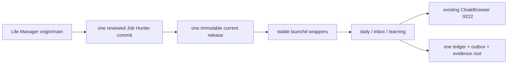
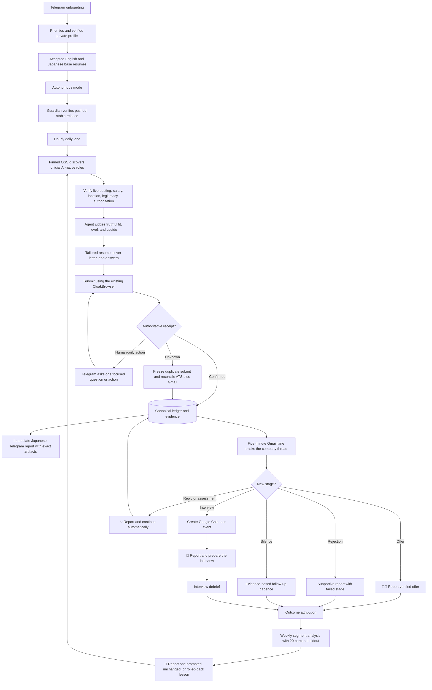

# Job Hunter Local Completion — Progress and Execution Spec

**Branch:** `feat/job-hunter-local-completion-20260802`
**Worktree:** `/Users/anicca/Projects/.worktrees/life-manager/job-hunter-local-completion-20260802`
**Canonical repository:** `https://github.com/Daisuke134/life-manager`  
**Original base:** `origin/main` at `2099a29da61345a120d2f68a819d7b854dcebd83`
**Current origin/main integration base:** `15aa37984d250b26fa9244657de0ae0e2f52d089`
**Scope:** Job Hunter only. Connector, Fundraising, CFO, Crypto, and Gig Work are excluded.  
**Status:** O2-05 runtime consolidation and live-loop revival are complete. O2-03
reproducible release validation and O2-05P regional prompt fence
are complete; O2-05A1 authoritative submission preservation and O2-05A2 deployed
legacy-v0 repair and O2-05R natural error reporting are complete. O2-05N natural
daily outcome reporting and O2-05U unlimited eligible applications are complete.
O2-05B shared-browser cutover, current `origin/main` integration, reproducible release
build, isolated validation, atomic activation, and the first real three-lane wake are
complete. The live wake exposed one daily Telegram result-shape mismatch; the source
fix is deployed and its report retry is acknowledged. The same wake exposed a
baseline-page navigation violation; deterministic driver-owned page creation and
cleanup are deployed and proven on the real shared browser. O2-06 is now active.
O2-06 through O2-12 remain open. Resume baseline is accepted. Autonomous application,
mail, and learning lanes are enabled and loaded. They completed real wakes with exit
`0`; natural daily reports are delivered and all health gates pass. The active release
already contains private-environment isolation, deterministic Ashby answers, direct
answer-artifact reuse, terminal-candidate filtering, and the canonical `claim_ready`
bridge through the existing `browser_worker` path. The Workday account-creation fix is
now pushed, released, and proven in a real wake: the credential process filled only the
registered wake-owned page, returned no secret, and reached the tenant login screen.
The Workday login and authenticated-page privacy blockers are closed in the active
immutable release. A real wake proved account creation, sign-in, and entry to the
five-step Workday application without leaking authenticated content. It still produced
no authoritative application receipt. The next measured defect is exact page
ownership: the observer can select another open page instead of the page registered to
the current wake. O2-06 therefore makes observation fail closed unless that exact page
is supplied before another real application attempt.

**Activation cutline:** the prior measured reason Job Hunter was not applying was that
`ai.anicca.job-search-daily`, `inbox`, and `learning` were explicitly disabled and
unloaded. They are now loaded. The pushed source commit
`bd18c96f1c75b472ff295cc07f51339ad578855e` is now the active immutable release.
It contains O2-05N natural reporting, O2-05U unlimited eligible applications, O2-05B
binding to the existing `interactive:dais` browser at `127.0.0.1:9222` with no restart
fallback, the first O2-06 salary-policy correction, terminal filtering, and the Ashby
claim-ready bridge, private Workday account creation/sign-in, and the authenticated-page
privacy contract. Release `6b7b104ae7210e3651d8c0cda230c3fc0902089c` is the
rollback target. Real daily wakes
proved discovery, adaptive application work, natural reporting, and safe browser
ownership. All current health gates pass.
O2-06 through O2-12 improve and prove the live loop; they must
not delay turning the application loop on.

**Execution rule from this point:** no test-first/TDD ceremony and no separate
adversarial reviewer or implementation subagent. The primary directly owns and
executes one next item: design, implementation, diff inspection, verification, spec
state, completion decision, commit, and push.

## 0. Clean runtime consolidation gate (O2-05C)

The system is not blocked by missing job-search logic. It is blocked by deployment
generation drift. Measurements on 2026-08-13 show one long-lived Job Hunter branch
`398` commits ahead of and `66` commits behind `origin/main`, two uncommitted O2-05N
files, active release `932ae25e...`, incompatible previous release `f9642b2...`, `172`
immutable release directories, three disabled/unloaded work lanes, and two browser
processes (`interactive:dais` on `127.0.0.1:9222` and stale `job-search:dais` on
`127.0.0.1:49167`). The last daily evidence is 2026-08-08. The source also stops a
wake when `confirmed_daily_count >= 10`, allocates ordinary slots only from `1..10`,
and enforces portfolio limits of dream `2`, strong-fit `5`, and adjacent `3`; these
are application caps, not ranking policy, and O2-05U removes them.

The clean target is one operational chain, not one physical directory. Private config
and persistent application state must remain outside Git:



Canonical locations after consolidation:

- source SSOT: `/Users/anicca/Projects/life-manager-main` after the dedicated branch
  is integrated; the temporary linked worktree is removed only after integration;
- runtime code: `~/.local/share/anicca/job-search/current` plus exactly one healthy
  `previous` release;
- private config: `~/.config/anicca/job-search`;
- persistent state and application evidence: `~/.local/state/anicca/job-search`;
- scheduler entrypoints: `~/.local/libexec/anicca/job-search/{daily,inbox,learning}`;
- browser: existing registry identity `interactive:dais` at `127.0.0.1:9222`; no
  Job Hunter-owned browser service remains after safe cutover.

Ordered cleanup is mandatory:

1. preserve the completed two-file O2-05N change with primary verification and one
   pushed commit;
2. fetch and integrate current `origin/main` into the dedicated branch, resolving
   only Job Hunter overlap and preserving unrelated main work;
3. implement O2-05U as the smallest cap-removal slice: keep the existing ledger and
   queue, but remove the ten-confirmation early exit, fixed ten-slot allocation, and
   portfolio submission ceilings; ranking mix remains a preference, never a stop;
4. implement the minimal O2-05B cutover: every Job Hunter browser lease uses
   `interactive:dais`; attach failure reports and exits without launch/restart;
5. build one candidate from the pushed integrated commit, validate it against a
   copied production ledger, then atomically activate it so `current` is the new
   release and healthy `932ae25e...` is `previous`; **complete**;
6. enable/bootstrap only daily, inbox, and learning and observe one real cycle;
7. after PID/UUID/context/tab ownership proof, unload and disable only the obsolete
   `ai.anicca.job-search-browser` service; never stop the shared `:9222` browser;
8. retain only the verified `current` and `previous` immutable releases and remove
   the other generated releases. They are reproducible from Git. Never delete private
   config, ledger, outbox, receipts, submitted artifacts, evidence, or browser data;
9. integrate the reviewed Job Hunter branch into `origin/main`, remove its temporary
   worktree, prune only stale Job Hunter worktree metadata, and delete only fully
   merged Job Hunter branches. Do not touch Connector or other Life Manager worktrees;
10. prove every launcher resolves the same current commit, every lane uses the same
   ledger/outbox, all three labels are healthy, and Telegram reports the live cycle.

O2-06 through O2-12 resume only after this gate. Cleanup is complete only when the
live loop is applying from this single chain; a tidy directory without a running loop
is not completion.

## 1. Done condition

The Mac mini Job Hunter autonomously discovers high-upside roles, verifies fit,
creates truthful tailored materials, submits eligible applications, captures an
authoritative receipt, follows Gmail replies, updates the company funnel, creates
confirmed interview events in Google Calendar, reports every material change in
natural Japanese on Telegram, and improves its strategy from verified outcomes.

Completion requires all of the following:

- one confirmed real Ashby application and receipt;
- one confirmed real Workday application and receipt;
- official job URL, company, role, compensation, location, and fit thesis;
- exact submitted resume and cover letter for every application;
- every employer question and submitted answer preserved as a private artifact;
- Gmail thread ID bound to the correct application;
- one real interview email converted into a Google Calendar event;
- Telegram message IDs for application, progression, interview, and learning reports;
- daily, inbox, learning, and guardian LaunchAgents healthy on the stable runtime;
- `summary.v2`, Telegram, ledger, and rebuilt event projections agree;
- all Job Hunter tests green; and
- every meaningful change committed and pushed.

## 2. Product outcome

Job Hunter is not a bulk-application counter. It maximizes the probability that the
user reaches a dream job they would gladly accept but may not have discovered or
attempted alone. The initial target is Dais; the local contract must remain
profile-driven so Life Manager can later onboard any person, including users with
limited job-search knowledge or agency.

The objective is an AI-native, AI-maximal, high-growth peer environment where the
user can build and improve advanced AI systems. Foreign-capital companies in Japan,
Tokyo-based global teams, and employers supporting Japan-based remote employment,
EOR, or contracting are preferred. Traditional Japanese employers are not a default
target, but Japanese application documents remain supported when explicitly needed.

For salaried employment, the north-star shorthand `USD 10k/month` means at least
USD 120,000 annualized gross compensation, not monthly recurring revenue. Employer
communication uses annual base and total compensation, never `MRR`. The system
optimizes for a six-figure AI-native offer while preserving the JPY hard floor below.

## 3. Compensation policy — single source of truth

All versioned strategy, private profile validation, ranking, prompts, form answers,
Telegram copy, and learning reports must use one compensation contract:

| Policy | JPY |
|---|---:|
| Hard floor | 7,000,000 |
| Default target | 10,000,000 |
| Priority search range | 10,000,000–30,000,000 |
| Stretch | 30,000,000+ |
| Global north star | USD 120,000+ annualized gross |

Rules:

1. Reject a role only when authoritative compensation proves its maximum is below
   JPY 7,000,000.
2. JPY 7,000,000–9,999,999 is a minimum-acceptable band, not the search target. It
   requires exceptional AI mission, peers, learning value, or strategic upside.
3. Rank JPY 10,000,000+ roles above otherwise equivalent lower-paid roles.
4. Do not anchor a high-paying employer down to JPY 10,000,000. When a role publishes
   a higher range, answer inside that range based on scope and total compensation.
5. The normal answer is: `JPY 10M+ target; flexible based on role scope, total
   compensation, and growth opportunity.`
6. Never infer or disclose current compensation.
7. Unknown compensation is not an automatic rejection; verify it or ask at the
   appropriate hiring stage.
8. Foreign-currency offers are compared in their published currency. Any JPY
   conversion records the rate source and observation time; an unstamped conversion
   cannot reject a role.

## 4. Location, travel, citizenship, clearance, and start date

- Tokyo on-site or hybrid is eligible.
- Japan-remote is eligible.
- Global remote is eligible when Japan-based employment, EOR, or contracting is
  supported.
- Domestic and international travel are positive preferences, including roles with
  frequent client-site travel.
- Verified Japanese citizenship satisfies a Japanese-citizenship requirement.
- Japanese citizenship does not prove possession of a named security clearance.
- A clearance requirement is not an automatic rejection when the user may undergo
  the employer or government clearance process.
- Answer `currently holds clearance` only from a verified private fact. Otherwise
  preserve `unknown` and escalate only if the form cannot be answered truthfully.
- Availability policy must use the private profile. Current owner direction is an
  autumn start, with employer notice lead time handled truthfully; no exact date is
  invented.

## 5. Autonomy contract

### 5.1 Default behavior

The default is autonomous application, not approval-before-submit.

Once base resumes and candidate facts are accepted, Job Hunter:

1. discovers and verifies an official job;
2. evaluates compensation, location, experience level, work authorization, posting
   legitimacy, and expiry;
3. creates a job-specific resume, cover letter, and answer set;
4. validates every claim against private fact IDs;
5. submits through the existing CloakBrowser;
6. records an authoritative receipt or `submit_unknown`;
7. reports the result and exact artifacts on Telegram; and
8. follows all later email and interview stages automatically.

There is no routine `Apply / Skip / Edit` approval gate. The user may have many
applications and offers and choose among verified outcomes later.

Every enabled daily wake must perform real job-hunting work: refresh official-job
discovery, evaluate new eligible roles, and apply autonomously to every truthful,
non-duplicate role that passes this spec. A day with zero confirmed applications is
not silently treated as success. The daily Telegram report states what was searched,
which roles were rejected and why, what remains blocked, and the next automatic
action. Job Hunter never claims an application without an authoritative receipt.

There is no global daily, weekly, monthly, company, or lifetime application-count
maximum. `10`, `100`, or `1,000` is never a configured ceiling: every distinct,
active, eligible requisition is queued and pursued. A single wake may stop for its
existing time, browser-ownership, evidence-safety, or execution budget, but that is a
bounded work session, not an application quota. Unprocessed queue items persist and
the next wake continues automatically. Unlimited means unlimited eligible distinct
requisitions; it never permits duplicate submission to the same requisition, bypasses
the JPY 7M floor or truth/authorization gates, or counts a click without a receipt.
Portfolio buckets determine ordering and reporting only; they never block submission.

Owner-declared application history is authoritative even when an old external
application has no ATS receipt in the local ledger. OpenAI, Anthropic,
Cursor/Anysphere, and Palantir have owner-declared manual applications for Japan
roles. The existing daily-agent prompt carries one short location rule: skip Tokyo,
Japan, and `Remote - Japan` requisitions from those four companies as already handled
by the owner. This is not a company-wide pause. A distinct overseas requisition or
Global/APAC Remote role may be applied to automatically when its official posting
explicitly permits employing or contracting a Japan resident, the candidate satisfies
its authorization/location requirements, and it is not the same requisition. An
ambiguous location or requisition identity is skipped. Existing URL, company-role,
and JD-fingerprint ledger dedup remains authoritative for exact duplicates.

### 5.2 Minimal human-only boundary

Job Hunter asks the user only when a truthful, authorized completion is impossible
without personal action or missing private context:

- video recording or live interview;
- identity verification, signature, or biometric step;
- CAPTCHA that cannot be completed through the authorized existing session;
- unknown legal, clearance-held, current-compensation, reference, or sensitive
  personal answer;
- proctored/live assessment or assessment with prohibited/unspecified AI policy;
- offer acceptance or binding employment agreement.

The Telegram request must contain one question, enough context to decide, the
official link, and compact buttons where supported. After the answer, Job Hunter
continues and reports the authoritative outcome. It must not make the user repeat
facts already stored in the private profile.

### 5.3 Representation policy

Routine applications and recruiter correspondence use the user's natural first
person. They do not insert unsolicited statements such as `I am an AI` or `an AI
assistant sent this`. They also never fabricate experience, impersonate the user in
identity-bound interviews or videos, violate assessment rules, or give a false answer
when an employer directly requires disclosure.

## 6. Resume and artifact contract

### 6.1 Base resume onboarding

Before autonomous application begins for a profile, Telegram delivers each base
resume for review in the user's preferred languages. The user corrects the base once;
future job-specific variants change emphasis and ordering, never facts.

The accepted Dais baseline is recorded in
`~/.local/share/anicca/job-search/materials/baseline.v1.json`:

| Variant | SHA-256 | Telegram message ID |
|---|---|---:|
| English Applied AI / Agent Engineer | `31d8ca96a396526d23a8a4de4dcffdb8cc773cd7ff43db04e52a0e4c35e2d21e` | 6119 |
| English AI Product / Solutions | `2e3ed9c27c7c4abc6dc6ff478c5718821d3d4ad4a5034c99f808841f41a1cd88` | 6120 |
| Japanese 履歴書, no photograph | `e23efc2c9c09e0780a6dcdcf92c1487e6beafb5880ebc2f5dd77da54c67dd5d4` | 6121 |
| Japanese 職務経歴書 | `13e4e3a78152182a7dad411f00b3846150151721396e16eefaefe7548edd94b9` | 6122 |

The historical 6084–6086 artifacts are superseded and must never be selected for a
new application. The accepted PDFs were also re-sent on request as Telegram messages
8961–8964. Production routing continues to use the stable `master`, `business`, and
`japan` filenames, whose current bytes match the accepted hashes above.

### 6.2 Per-application immutable dossier

Every application stores and links:

- official posting URL and captured posting;
- company, role, compensation, location, work mode, and source;
- fit thesis, verified strengths, honest gaps, and rejection/escalation reasons;
- submitted resume path and SHA-256;
- submitted cover-letter path and SHA-256;
- every application question and exact submitted answer;
- ATS snapshot and submission receipt;
- Gmail thread and message IDs;
- stage timeline, interview Calendar event ID, follow-ups, and outcome;
- strategy generation used for the decision.

No receipt means no `application completed` claim.

### 6.3 Language routing

- English or foreign-capital role: English engineering or business resume plus an
  English job-specific cover letter.
- Japanese role that requests Japanese documents: Ministry of Health, Labour and
  Welfare style `履歴書` plus a separate job-specific `職務経歴書`.
- Employer language and requested document types control routing, not a person's
  name, nationality, or company origin.
- The Dais Japanese 履歴書 does not include a photograph. Document date, motivation,
  and preference fields are included only when required by the selected official
  format or employer.

### 6.4 Dais base-resume correction contract

This gate is complete for Dais. The corrected base resumes were rendered, visually
inspected, delivered to Telegram, and accepted as the content-addressed baseline.
Autonomous submission may use only that baseline plus truthful job-specific changes;
historical 6084–6086 artifacts remain prohibited.

#### Verified timeline and naming

The first occurrence uses the full organization name followed by its abbreviation.
Later occurrences may use the abbreviation. Employment, client/deployment context,
research affiliation, education, internship, and independent work remain separate.

| Period | Resume identity |
|---|---|
| 2020–2024 | Keio University — B.A. in Political Science |
| 2021-01–2022-01 | A10 Lab Inc. — Marketing Intern |
| 2024-04–2026-04 | Nara Institute of Science and Technology (NAIST), with research at Advanced Telecommunications Research Institute International (ATR) |
| 2025-04–Present | Mitsubishi UFJ Information Technology, Ltd. (MUIT) — Applied AI / AI agent work |

The resume must never state or imply that Dais is or was employed by MUFG. MUFG Bank
appears as the owner and operating context of the internal CRM into which Dais
contributed through his employment at MUIT.
Headings such as `MUIT / MUFG` are forbidden.

#### MUIT and ICLR 2026 narrative

MUIT is the primary professional experience. A reader is assumed to know nothing
about MUIT, the internal project, or Agentforce. The resume therefore defines
Agentforce on first use as Salesforce's platform for building and operating AI
agents, explains the enterprise-CRM users and purpose, and avoids unexplained product
jargon.

The CRM deployment, Databricks observability workflow, prompt tuning, context
engineering, and relationship-manager summaries are parts of one approximately
year-long Agentforce deployment project. They must never be presented as unrelated
projects. ICLR 2026 is a separate MUIT achievement.

The base claim set must capture and preserve:

- deployment and prompt tuning of AI agents in MUFG Bank's internal CRM;
- company-information summarization for relationship-manager workflows;
- an observability workflow/tool built in Databricks for a CRM Agentforce agent;
- use of Databricks Genie Code to analyze agent-output logs and improve agent
  effectiveness;
- contribution through MUIT to Japan's first production deployment of Agentforce for
  Financial Services by a financial institution; and
- participation in ICLR 2026 in Rio de Janeiro as a MUIT achievement, synthesis of
  frontier-AI research for an internal executive briefing, and communication of the
  findings through MUIT's official two-part YouTube report.

`executive briefing` or `senior executives` is used unless the verified private fact
records the exact audience as C-suite. Attendance, contribution, and communication
are strong claims; sole ownership, sole deployment leadership, and invented impact
numbers are forbidden.

Approved English content direction, subject to fact-ledger validation:

```text
Mitsubishi UFJ Information Technology, Ltd. (MUIT)
Applied AI / AI Agent Engineering
Tokyo, Japan | Apr 2025–Present

Enterprise CRM AI Agent Deployment

• Contributed to Japan's first production deployment by a financial institution of
  Salesforce Agentforce—a platform for building and operating AI agents—integrating
  agent capabilities into MUFG Bank's internal CRM system used by sales
  professionals, through his role at MUIT.
• Built an observability workflow in Databricks to analyze the agents' inputs,
  outputs, and responses to sales professionals. Used Genie Code to investigate
  behavior, identify response-quality issues, and support improvements in agent
  effectiveness.
• Supported prompt tuning and context engineering for the deployed AI agents,
  including agents that generate company-information summaries for relationship
  managers.

ICLR 2026 Research Communication

• Represented MUIT at ICLR 2026 in Rio de Janeiro; synthesized frontier-AI research
  for an internal executive briefing and presented key findings through MUIT's
  official two-part conference report.

  ICLR 2026 Conference Report
```

The final line is a tappable text link to the user-specified latter-part YouTube URL.
The visible label must not say `Watch`, `YouTube`, `Part 2`, or `latter part`; the
destination alone identifies the linked video.

Approved Japanese content direction, subject to the same validation:

```text
三菱UFJインフォメーションテクノロジー株式会社（MUIT）
応用AI・AIエージェント関連業務
2025年4月〜現在

社内CRMへのAIエージェント導入プロジェクト

・AIエージェントを構築・運用するSalesforceのプラットフォーム
  「Agentforce」を、三菱UFJ銀行の営業担当者が利用する社内CRMへ導入する
  プロジェクトにMUITの担当者として参画。金融機関として国内初となる
  本番導入に貢献。
・AIエージェントへの入力、生成された回答、営業担当者への回答内容を分析する
  オブザーバビリティ基盤をDatabricks上で構築。Genie Codeを活用して挙動や
  回答品質の問題を調査し、エージェントの有効性改善を支援。
・企業情報を営業担当者向けに要約する機能を含むAIエージェントについて、
  プロンプト調整とコンテキストエンジニアリングを支援。

ICLR 2026の調査・社内外発信

・MUITの業務としてブラジル・リオデジャネイロで開催されたICLR 2026に参加。
  最先端AI研究を整理して経営層向けに社内報告し、MUIT公式の前編・後編
  カンファレンスレポートを通じて社外にも発信。

  ICLR 2026参加レポート
```

The Japanese link label follows the same rule: it links to the user-specified
latter-part video but does not display `後編`, `YouTube`, or an imperative CTA.

#### English resume information architecture

The English engineering and business variants are one-page, single-column,
ATS-readable application resumes for an early-career candidate. Age, birth date,
photograph, marital status, and current salary are excluded.

Order:

1. name, role-specific headline, Tokyo/Japan, email, LinkedIn, GitHub profile, and a
   compact `ICLR 2026 Conference Report` link;
2. two-line role-specific summary;
3. professional experience, led by MUIT and followed by the A10 Lab internship;
4. education and research: NAIST/ATR and Keio with explicit dates;
5. selected independent projects;
6. compact skills and languages.

The header does not contain a generic `Portfolio` link, a standalone Life Manager
link, or an Anicca link. Project links live next to their projects. The direct ICLR
report appears once in the compact header and again as `ICLR 2026 Conference Report`
inside the MUIT achievement; both point to the user-specified latter-part video. A
general portfolio may appear only in the independent-projects section as `More
projects` when space and ATS extraction remain clean.

Engineering summary direction:

```text
Applied AI engineer at Mitsubishi UFJ Information Technology with experience
deploying and observing AI agents in a regulated banking environment. Combines
enterprise AI delivery, agentic product development, neuroscience/ML research, and
bilingual Japanese-English communication.
```

Business/solutions summary direction:

```text
AI solutions and product professional at Mitsubishi UFJ Information Technology,
translating frontier AI research into regulated enterprise delivery, customer
workflows, and clear executive communication in Japanese and English.
```

#### Independent projects and links

Independent work comes after professional experience and education/research. It is
not presented as employment. Project names own their links:

```text
Life Manager — Autonomous Personal Operations Agent
Web: https://aniccaai.com/life-manager
Source: https://github.com/Daisuke134/life-manager

Built an open-source, local-first agent system that coordinates calendar, commute,
phone, Telegram, and life workflows, with persistent scheduling and verified
side-effect handling.
```

```text
Anicca — iOS Affirmation App
Product: https://aniccaai.com/affirmation-app
App Store: https://apps.apple.com/jp/app/id6755129214

Built and shipped a mobile affirmation app with 45+ ratings and a 4.5/5 rating.
```

The Anicca rating statement is an owner-verified resume fact. Use `45+ ratings` and
`4.5/5 rating` as provided; do not spend runtime or owner time re-searching it during
base-resume generation. The product link is
`https://aniccaai.com/affirmation-app`; the App Store link remains beside it.

#### Japanese document architecture

Japanese applications that request domestic-format documents receive two separate
artifacts:

1. `履歴書` based on the Ministry of Health, Labour and Welfare A4 example, containing
   chronological education/employment, qualifications, language, motivation, and
   applicant preferences as required; and
2. `職務経歴書`, normally one to two pages, containing professional summary, MUIT
   achievements including ICLR 2026, NAIST/ATR research, verified skills, independent
   projects, A10 Lab internship, and role-specific self-promotion.

The Japanese chronology uses the full legal employer name and never lists MUFG as an
employer. The English resume excludes age; the Japanese 履歴書 handles birth date and
photo only under the selected official/employer document contract.

#### Full base-resume content blueprint

The renderer owns layout, but the following is the complete approved information
architecture. Contact and profile URLs are resolved from the private profile at
render time and are not duplicated in this versioned document.

**English Applied AI / Agent Engineer base (one page)**

1. Header: `Daisuke Narita | Applied AI & Agent Engineer | Tokyo, Japan`, followed by
   private-profile email, LinkedIn, GitHub, and `ICLR 2026 Conference Report`.
2. Summary:

   ```text
   Applied AI engineer at Mitsubishi UFJ Information Technology with experience
   deploying and observing AI agents in a regulated banking environment. Combines
   enterprise AI delivery, agentic product development, neuroscience/ML research,
   and bilingual Japanese-English communication.
   ```

3. Experience:
   - the complete MUIT `Enterprise CRM AI Agent Deployment` and `ICLR 2026 Research
     Communication` content defined above;
   - `A10 Lab Inc. — Marketing Intern | Jan 2021–Jan 2022`: managed a JPY 20M
     campaign budget, reduced CPA by 10%, and achieved record paid acquisition.
4. Education and research:
   - `Nara Institute of Science and Technology (NAIST) | Apr 2024–Apr 2026`:
     master's research using EEG and machine learning to detect mind wandering;
     research conducted and presented at Advanced Telecommunications Research
     Institute International (ATR); founded a weekly community for applying Claude
     Code, Codex, Cursor, and AI-agent workflows to research and daily work;
   - `Keio University | 2020–2024`: B.A. in Political Science.
5. Independent projects:
   - `Life Manager — Autonomous Personal Operations Agent` with
     `https://aniccaai.com/life-manager` and
     `https://github.com/Daisuke134/life-manager`: an open-source, local-first agent
     system coordinating calendar, commute, phone, Telegram, and life workflows with
     persistent scheduling and verified side-effect handling;
   - `Anicca — Mobile Affirmation App` with
     `https://aniccaai.com/affirmation-app` and its App Store link: built and shipped
     a mobile affirmation app with 45+ ratings and a 4.5/5 rating.
6. Skills and languages:
   - skills are generated only from approved facts and include AI agents,
     Agentforce, prompt tuning, context engineering, Databricks, Genie Code,
     Python/ML where supported, Swift/iOS, observability, and CRM workflows;
   - Japanese native; English TOEFL iBT 96 and Duolingo English Test 140; Spanish
     DELE B1.

The business/solutions English variant uses the same chronology, facts, links, and
projects. It changes only the headline, two-line summary, bullet ordering, and
role-relevant emphasis; it may not create a separate factual baseline.

**Japanese 履歴書 (separate official-style artifact)**

1. date, name, contact details, and birth date as required by the selected
   official/employer contract, all sourced from the private profile; no photograph;
2. chronological education and employment:
   - 2020–2024 慶應義塾大学 法学部政治学科;
   - 2021年1月–2022年1月 株式会社A10 Lab マーケティングインターン;
   - 2024年4月–2026年4月 奈良先端科学技術大学院大学, with ATR research
     described as a research affiliation rather than employment;
   - 2025年4月–現在 三菱UFJインフォメーションテクノロジー株式会社;
3. qualifications and languages from approved private facts;
4. role-specific 志望動機 generated only for a selected employer; and
5. 本人希望欄 containing only truthful job-specific constraints, never compensation
   or unsupported preferences by default.

**Japanese 職務経歴書 (one to two pages)**

1. Header: `成田大祐 | 応用AI・AIエージェントエンジニア | 東京`, followed by
   private-profile contact details and `ICLR 2026参加レポート`.
2. 職務要約:

   ```text
   三菱UFJインフォメーションテクノロジーにて、三菱UFJ銀行の社内CRMへ
   AIエージェントを導入するプロジェクトに従事。AIエージェントの導入支援、
   プロンプト・コンテキスト設計、Databricks上のオブザーバビリティ基盤構築に
   加え、AI/機械学習研究、個人プロダクト開発、日英での技術発信経験を持つ。
   ```

3. 職務経歴:
   - the complete MUIT `社内CRMへのAIエージェント導入プロジェクト` and
     `ICLR 2026の調査・社内外発信` content defined above;
   - `株式会社A10 Lab — マーケティングインターン | 2021年1月–2022年1月`:
     2,000万円の
     広告予算を運用し、CPAを10%削減、有料獲得数の過去最高を達成。
4. 研究・学歴:
   - 奈良先端科学技術大学院大学でEEGと機械学習によるマインドワンダリング
     検出を研究し、ATRで研究・発表を実施;
   - Claude Code、Codex、Cursor、AIエージェント活用を扱う週次コミュニティを
     設立;
   - 慶應義塾大学 法学部政治学科卒業。
5. 個人開発:
   - Life Manager with both web and GitHub links and the same approved description;
   - Anicca with product/App Store links and the owner-verified `45件以上、評価4.5/5`.
6. 活かせるスキル・語学 and job-specific 自己PR use only approved facts and the
   same language scores as the English base.

#### Resume acceptance gate

Each corrected artifact must pass all of the following before autonomous submission:

- all claims map to approved private fact IDs and exact source/evidence class;
- organization names, dates, employment/affiliation types, and chronology agree;
- MUIT employment and MUFG deployment context are unambiguous;
- ICLR 2026 is prominent under MUIT and its public URL resolves;
- independent projects appear below professional experience and education/research;
- project links resolve and the generic header portfolio link is absent;
- English output is one page, single-column, and ATS text extraction is complete;
- Japanese 履歴書 and 職務経歴書 are separate and match the official routing policy;
- unsupported superlatives, sole-ownership wording, age emphasis, secrets, and
  private-only links are absent;
- visual inspection confirms hierarchy, line wrapping, whitespace, and link labels;
- the exact PDFs are delivered to Telegram with message IDs; and
- the accepted SHA-256 values become the only base inputs for future tailoring.

## 7. Telegram product UX

Telegram is the proactive command center. Messages are concise, emotional, natural
Japanese for a non-technical user. Normal copy never exposes runner names, exit
codes, bounded/none wording, internal hashes, secrets, or implementation details.

Every link must be tappable Markdown. Private artifacts are sent as Telegram
documents or through an authenticated artifact URL; raw local filesystem paths are
not presented as tappable mobile links.

### 7.1 Reporting cadence

Every externally meaningful action is observable in natural Japanese. The user does
not need to inspect logs or ask whether Job Hunter is working. High-frequency
no-change polls remain local to avoid notification spam; the first daily wake and
end-of-day digest still prove that discovery, evaluation, application, and reply
tracking ran.

- **First daily wake:** one `🌅 今日の求人活動` digest with current pipeline,
  prioritized roles, salary/location, and the actions Job Hunter will take.
- **Application work begins:** one `🔎 応募準備中` update only after an eligible
  official posting and truthful material route have been selected. It names the
  company, role, compensation evidence, location, fit thesis, resume variant, and
  any questions being prepared. It is a report, not an approval request.
- **Authoritative submission:** immediate confirmed-application report plus the exact
  resume, cover letter or explicit `not requested`, and question/answer artifact.
- **Every actionable mail change:** immediate reply, rejection, assessment,
  interview, offer, or human-only request. Gmail message and thread IDs remain in
  the private ledger, not normal prose unless needed for diagnosis.
- **End of day:** one company-by-company pipeline digest with current stage, where
  progress stopped, next automatic action, and tappable artifacts.
- **Weekly:** funnel conversion, stage failures, source/role/resume/compensation
  segments, follow-ups, and one evidence-backed learning decision.
- **No-change inbox wakes:** record health and checkpoint locally but do not send a
  Telegram message every five minutes. This preserves full observability without
  notification spam.

All reports are event-deduped and store the Telegram message ID in the same durable
outbox/ledger chain as the event being reported.

The canonical Job Hunter sender is `job_search_loop.telegram` with
`~/.config/anicca/job-search/telegram.env` and the durable Job Hunter outbox. The
private target key is `JOB_SEARCH_TELEGRAM_CHAT_ID`. The generic shared
`send-telegram.sh` expects a different target key and is not evidence that Job Hunter
delivery is broken. A real diagnostic milestone sent through the canonical path is
stored as event `job-search-spec:regional-fence:53d673a04`, status `sent`, Telegram
message ID `15940`. Future Job Hunter milestone reports use this path and record the
returned message ID.

### 7.2 Confirmed application

```text
💼 Anthropicへの応募が完了しました！

職種: Software Engineer
想定年収: ¥12,000,000〜¥18,000,000
勤務地: 東京 / Hybrid

この求人を選んだ理由:
AI agent開発、TypeScript/Node.js、日英での業務経験が要件に合っています。

[求人ページを開く]
[提出したResume]（Telegram document）
[Cover Letter]（Telegram document、提出欄がなければ「募集側から要求なし」）
[提出した質問と回答]（Telegram document）

応募確認:
企業の応募完了画面で確認しました。これから返信を追跡します。
```

### 7.3 Uncertain submission

```text
⚠️ Sierraへの提出結果を確認しています。

送信操作の後に正式な完了表示が確認できませんでした。
重複応募はせず、企業ページと確認メールを自動で照合します。
```

### 7.4 Selection progression

```text
🎉 OpenAIの一次面接に進みました！

職種: AI Deployment Engineer
面接: 10月14日 14:00
Google Calendar: 登録しました

これは大きな前進です。提出した資料と求人内容を基に、面接準備も始めました。

[提出したResume]
[Cover Letter]
[面接準備を見る]
```

Use emotion appropriate to the event:

- application: `💼` / `✅`;
- recruiter interest: `✨`;
- interview progression: `🎉`;
- offer: `🚀🎊`;
- rejection: supportive and factual, never celebratory or shaming;
- operational delay: calm `⚠️`, with what the system will do next.

The message generator receives structured event facts plus an event-specific tone
contract. A deterministic validator checks that all required facts and links remain
present and that forbidden technical copy and unsupported claims are absent.

### 7.5 Human-only request

```text
🎥 Palantirの応募可能な海外Remote求人を続けるため、短い動画が必要です。

質問:
「顧客の難しい課題を技術で解決した経験を教えてください」

あなたの確認済み経験から、90秒の話す内容を用意しました。
[台本を見る] [録画ページを開く]

録画後に「完了」を押してください。残りの応募はJob Hunterが続けます。
```

### 7.6 Weekly pipeline

The weekly report includes a mobile-readable company list with tappable company and
artifact links, role, compensation, location, current stage, elapsed time, next
automatic action, and the stage where an unsuccessful application stopped.
It separately reports discovery, application, confirmed-application, recruiter,
screen, interview, offer, accepted, rejected, withdrawn, and silence stages.

### 7.7 Self-improvement report

Every promoted, rolled-back, or inconclusive strategy decision is reported in plain
language:

```text
🧠 今週の求人活動から学んだこと

英語のAI Solutions求人は、Engineering求人より返信率が高い傾向でした。
次の応募では、金融AIの導入経験と顧客課題の解決をResumeの上部に出します。

まだ応募数が少ないため、給与基準や勤務地条件は変更しません。
```

Learning changes exactly one bounded strategy variable at a time, preserves 20%
holdout, requires authoritative outcome evidence, and rolls back on safety or quality
regression. Telegram reports the evidence class, human-readable conclusion, next
change, and whether the strategy was promoted, unchanged, or rolled back.

## 8. Observable tracker and stage model

The tracker exposes:

- full company list from discovery through final outcome;
- stage conversion and failure reasons;
- immutable application artifacts;
- posting legitimacy and work-authorization findings;
- expired-post verification;
- interview prep and debrief;
- follow-up cadence and silence policy;
- compensation distribution and JPY 10M+ target rate;
- source, role-family, resume variant, and segment Pareto;
- baseline/candidate strategy, 20% holdout, and rollback state;
- last healthy daily/inbox/learning/guardian runs.
- owner-declared Japan-role suppression and its prompt decision evidence;
- remote-job discovery volume, eligible remote roles, applications, and outcomes.

`summary.v2`, Telegram, and the local Career surface are projections of the same
ledger/event stream and cannot maintain independent truth.

## 9. Stable local runtime — no worktree dependency

LaunchAgents must never point to `.worktrees`, feature branches, or disposable
developer checkouts. They point only to stable launchers under:

```text
~/.local/libexec/anicca/job-search/
```

The stable launcher resolves an atomically switched immutable release:

```text
~/.local/share/anicca/job-search/releases/<git-commit>/
~/.local/share/anicca/job-search/current -> releases/<git-commit>/
```

Deployment sequence:

1. fetch the remote and require the release commit to be reachable from a pushed
   remote ref; an unpushed or unresolvable commit cannot be deployed;
2. build a content-addressed release away from `current` from a clean checkout;
3. verify origin, commit, executable paths, permissions, imports, complete tests,
   private config readability, ledger integrity, Gmail read, and browser ownership;
4. atomically switch `current`;
5. run an isolated non-submitting health pass;
6. retain the last known-good release; and
7. roll back the pointer if activation fails.

This makes worktrees disposable development views rather than runtime dependencies.
Deleting a worktree cannot stop the installed release, and deleting every local
checkout cannot destroy the source because every runnable commit must already exist
on the remote. The release manifest records the life-manager commit, upstream OSS
locks, test evidence, and activation receipt.

The Guardian checks stable launcher existence, release target, expected commit,
LaunchAgent program path, schedule, last success, SQLite integrity, Gmail access,
CloakBrowser owner, Telegram outbox, stale leases, and uncertain side effects. It
repairs only deterministic pre-side-effect failures and sends one low-noise alert
after bounded recovery fails.

### 9.1 Canonical ownership and one-system layout

Job Hunter has one source repository, one installed release pointer, one private
configuration root, one mutable state root, and one launchd namespace:

| Responsibility | Canonical location |
|---|---|
| Source and tests | `life-manager/apps/job-search-loop/` |
| Git remote | `https://github.com/Daisuke134/life-manager` |
| Active immutable release | `~/.local/share/anicca/job-search/current` |
| Private profile and credentials | `~/.config/anicca/job-search/` |
| Ledger, outbox, evidence, and checkpoints | `~/.local/state/anicca/job-search/` |
| Thin stable launchers | `~/.local/libexec/anicca/job-search/` |
| macOS registration | `~/Library/LaunchAgents/ai.anicca.job-search-*.plist` |

`daily`, `inbox`, `learning`, `guardian`, and the browser owner are lanes of this one
Job Hunter. They share the same active release, ledger, profile, and Telegram outbox;
they are not independent agents or competing truths. No Job Hunter launcher or
runtime configuration may depend on `profitable-claude`, a feature worktree, a donor
branch, or a second scheduler/browser stack.

The standard macOS separation of source, secrets, mutable state, installed release,
and LaunchAgents is retained for security and rollback. Operationally they remain one
movable product: install/status/export/import commands must resolve these canonical
roots rather than introducing a new store. Release retention keeps only the active
release and one verified last-known-good rollback release after activation evidence
is durable. Cleanup never removes the active target, rollback target, private config,
ledger, evidence, or submitted artifacts.

## 10. Current verified state

- The dedicated worktree was clean before the O2-02 ledger update at pre-task target
  `b3a69f9f07aa450d2c58eeca2d1b136fc43a3bf8`; recoverable backup ref
  `refs/backup/job-hunter-local-completion-20260802-pre-o2-02` points to that SHA.
  The O2-03 release-validation source tip was local/remote
  `fb267a27bdb5eaf38db6ed72071625dbceee3ba9` before this enclosing spec update.
  Canonical main and the donor branch were not modified.
- The locked rebase base is `4fcddb65b9a353565e2a5fcefb56e1271dbfbf1d`. Donor
  `origin/docs/job-hunter-spec-20260805` remains `66ab20d07ca7c310e53d2008707cb982a116ca16`
  with 364 commits after `2099a29da61345a120d2f68a819d7b854dcebd83`. Target-only
  commits `8f928c2e7` and `b3a69f9f0` replayed in order; integration tip before this
  status update is `8141db51bbc4fcd7cf6da86e72be39d1c0c017a7`; the pushed O2-02
  verification commit is `c7c65e3ffb7307d929fa6a5425f0cab5c76e9dc5`.
- Rebase conflicts were limited to shared runner files: `runtime/agent-runner/agent_runner.py`
  retained current-main application-intent browser-route isolation and the donor
  Job Hunter Terra-high route. The O2-02 correction scopes authority and secret
  filtering to `job-search-terra-high` and restores locked-main `repeatable-agent`
  authority/environment semantics for Connector and Marketing/Gig consumers;
  `runtime/agent-runner/config.json` retains the planner and Job Hunter Terra-high
  routes. No Connector, Fundraising, CFO, Crypto, or Gig Work behavior is changed.
- The accepted resume manifest and all four stable PDFs match SHA-256 values
  `31d8ca96a396526d23a8a4de4dcffdb8cc773cd7ff43db04e52a0e4c35e2d21e`,
  `2e3ed9c27c7c4abc6dc6ff478c5718821d3d4ad4a5034c99f808841f41a1cd88`,
  `e23efc2c9c09e0780a6dcdcf92c1487e6beafb5880ebc2f5dd77da54c67dd5d4`, and
  `13e4e3a78152182a7dad411f00b3846150151721396e16eefaefe7548edd94b9`.
- The complete Job Hunter suite passes `564` tests. The complete agent-runner suite
  passes `18` tests, including the focused three-test authority regression; its
  explicit `job-search-terra-high` high-effort exception is recorded in the shared
  route test. Connector consumer tests pass `6` tests and Marketing/Gig consumer
  wiring tests pass `4` tests.
- O2-03 release validation passed from source tip
  `fb267a27bdb5eaf38db6ed72071625dbceee3ba9`: the Job Hunter suite ran `564/564`
  and the agent-runner suite `18/18` with exit code 0. Read-only focused tests
  reproduced the four installed-release classes on current
  `releases/f9642b2f3e2e520affdea9b847ae428706d89607`: application-reporting had
  `2` errors from direct Telegram Outbox access, Ashby confirmation had `1` failure
  accepting GraphQL-only success, the daily fill canary had a missing
  `ashby-fill-verification.json`, and release tests failed when an extracted tree
  attempted a Git build. The corresponding branch tests passed (`8`, `16`, `2`, and
  `2` respectively), so no production fix was needed. The installed commit is not
  a Git object or reachable ref; its campaign/persistent-runner additions were not
  copied because no focused RED demonstrated a branch gap.
- After `git fetch origin`, `git merge-base --is-ancestor HEAD
  origin/feat/job-hunter-local-completion-20260802` exited 0 with local and remote
  both at the source tip, proving the candidate was reachable from the pushed ref.
- The existing `apps/job-search-loop/scripts/build-release.sh` built the source tip
  twice into private temporary directories. Both archives and checksum sidecars are
  byte-identical with SHA-256
  `eccc809807c8e4ce0126025a200555d1ef4a627bc21f75c88f9d1d05f13a2c27`; each has
  `269` entries, only `apps/job-search-loop` and `runtime/agent-runner` roots, no
  private-state-shaped files, and `RELEASE.json.commit` equal to the source tip.
- One archive was extracted into a private clean-HOME fixture. Existing
  `setup-profile.sh` and `install-local.sh --provider auto --scheduler none` selected
  `codex`, wrote private leaf directories as `700` and profile/install/state files
  as `600`, and resolved all installed paths under the fixture. Bundled imports passed;
  the bundled healthcheck passed for daily/inbox/learning with SQLite integrity
  `ok`, fresh evidence, and `last_exit=0`. The real `current` symlink, profile,
  ledger, browser, and LaunchAgents were not touched.
- O2-05 read-only diagnosis found that `ai.anicca.job-search-daily`, `-inbox`, and
  `-learning` are disabled and absent from the user launchd domain even though their
  valid plists and immutable stable launchers remain installed. Browser, Camofox,
  and observability are still loaded; repair must not restart or replace them. The
  current symlink and `active-release.json` consistently point to immutable release
  `f9642b2f3e2e520affdea9b847ae428706d89607`, so the old `current release is not
  active` log line is historical rather than the present failure.
- The private ledger passes SQLite integrity but has five agent-owned applications
  with the exact legacy chain `submit_claimed -> submitted -> email_sent`. Each has
  one immutable delivered `recruiting_outreach` route marked `outreach_only`; the
  five associated `confirmed_application` outcomes are therefore not application
  receipts. Repair must append evidence-bound corrections for every qualifying row,
  preserve the delivery receipts, and be idempotent. It must not retain the current
  one-application hard-code.
- O2-05A1 completes the append-only repair contract without changing the real ledger.
  False outreach-only submissions still receive one evidence-bound
  `email_sent -> submit_unknown` correction and replay adds nothing. Gmail, Ashby,
  exact external imports, and canonical/alternate ATS receipts are now recognized
  only through their existing durable evidence. If legacy outreach regresses a real
  submission to `email_sent`, reconciliation appends one evidence-bound
  `email_sent -> submitted` restoration; replay adds nothing. Guardian and event
  summary validate the same chain and forged/unbound evidence fails closed. The one
  adversarial review found that ATS routes legitimately advance from `delivered` to
  `replied`; the reviewed correction now relies on the immutable delivered event
  rather than the mutable current route state. Primary verification passes the five
  Gmail/import/ATS/reply lifecycle cases `5/5`, the route suite `19/19`, and the full
  Job Hunter suite `573/573` in `44.626s`; compile and diff checks pass. The real
  ledger SHA-256 and mtime/size were identical before and after verification. O2-05
  remains unchecked: real-ledger repair, Gmail audit, release activation, LaunchAgent
  load, Guardian runtime checks, and a real canonical cycle are still pending. The
  completion milestone was delivered through the canonical Job Hunter Telegram
  outbox with message ID `15995`.
- The same ledger has 25 `submit_unknown` applications: 24 Ashby and one Cursor;
  22 are agent-owned and three are owner-imported. None has a stored authoritative
  confirmation. All have clicked-phase fences; 17 reached `request_started` and
  eight remain `pre_request`. Thirteen have valid pre-submit fill receipts whose
  `submit_clicked` value is false. Absence of a Gmail/ATS receipt is not proof of
  submission or non-submission, so the live reconciliation audits every row against
  Gmail, promotes only an exact authoritative match, and keeps every unmatched row
  `submit_unknown` and dedup-fenced rather than retrying it.
- O2-05 uses the existing release builder, activation module, stable launchers,
  plists, Gmail reconciler, and Guardian health commands. It adds no scheduler,
  browser, tracker, or production fake. It loads only daily/inbox/learning and runs
  Guardian health gates in this slice; creation and completion of the dedicated
  Guardian LaunchAgent remains O2-07, matching the mandated O2 order.
- Current owner declarations for OpenAI, Anthropic, Cursor/Anysphere, and Palantir
  are authoritative only for Japan-located requisitions. Distinct overseas or
  Global/APAC Remote requisitions remain eligible under explicit Japan-resident
  employment/contract evidence and normal authorization/dedup gates. The mandatory
  remote discovery segment remains in O2-06. The JPY 7M floor / JPY 10M target /
  JPY 30M stretch policy is unchanged. Autonomous application, mail, and learning
  lanes remain stopped; O2-05 through O2-12 remain open. O2-04A and O2-04B were
  complete before O2-02 and remain complete; this task did not newly close them.
- O2-05P uses the production `application-lane-agent` prompt selected by
  `run-daily.sh`, not the unused legacy daily prompt. Its single compact paragraph
  implements the three rules in section 11, with no database, service, parser, or
  configuration addition. The contract test binds the exact non-negated policy to
  the actual multiline runner invocation. Focused prompt tests pass `16/16` and the
  fresh read-only adversarial review is PASS. Two earlier full-suite attempts were
  interrupted by the Mac mini data volume at 100% capacity and were not counted as
  GREEN. After free space recovered, the unchanged pushed regional-fence source ran
  the complete Job Hunter suite successfully: `569/569` in `32.338s`. O2-05P is
  complete.
- The 2026-08-13 canonical-layout audit proves every installed lane resolves the
  same `~/.local/share/anicca/job-search/current` pointer, currently release
  `f9642b2f3e2e520affdea9b847ae428706d89607`. The pushed development branch is
  `feat/job-hunter-local-completion-20260802` at `e14ce16ebd1f4f31c5162930b58c075fb4ae4d6c`
  before the active O2-05A2 implementation. No installed launcher or private config
  references `profitable-claude`; the only matching text is a canonical-runtime test
  that forbids such a reference. The installed share contains `171` release
  directories, `64` artifact files, and `13` stale staging directories (`736M`
  total). These are historical build outputs, not running Job Hunters. Safe retention
  cleanup remains part of O2-12; autonomous daily, inbox, and learning lanes remain
  disabled and absent, so the system is still not operationally complete.
- O2-05A2 is complete. The reviewed two-file change accepts the exact four-key
  deployed legacy-v0 outreach correction only when route, provider, evidence hash,
  reason, and immutable delivered outreach route agree. The adversarial review
  reproduced one Important hybrid bypass: `channel=recruiting_outreach` previously
  allowed a forged `reason` plus extra keys to enter the normal channel-bound path.
  The final predicate permits the normal path only when `reason` is absent; any
  payload containing `reason` must match the exact legacy-v0 shape. The forged
  hybrid fixture now yields zero corrections, remains `email_sent`, and leaves
  Guardian unhealthy. Primary verification passes the five focused lifecycle cases
  `5/5`, route suite `21/21`, full Job Hunter suite `575/575` in `30.683s`, compile,
  and diff checks.
- A fresh SQLite backup of the real ledger rehearsed the production code with no
  source mutation: first reconciliation corrected exactly `5`, replay corrected
  `0`, events changed `251 -> 256`, `email_sent` changed `5 -> 0`, and
  `submit_unknown` changed `25 -> 30`; routes `40`, route events `78`, outcomes `9`,
  and applications `57` were unchanged. All `57` event projections rebuilt into
  `summary.v2`, integrity was `ok`, foreign-key violations were `0`, and Guardian's
  only remaining reason was the separately scoped `stale_submission_claim`.
  Daily/inbox/learning were disabled and absent and no process held the ledger.
  Before the real append-only repair, a private mode-`600` backup was stored at
  `~/.local/state/anicca/job-search/backups/ledger-pre-o2-05a2-20260813T115800Z.sqlite3`
  with SHA-256 `c3593f6b6fdb462ebff03c7dfd00c4b3263d4295a92dbcb83f08e10f32945d90`,
  integrity `ok`, `57` applications, and `251` events. The real repair then produced
  the same `5` corrections and `0` on replay, the same invariant counts, integrity
  `ok`, zero foreign-key violations, and post-repair ledger SHA-256
  `0c50bd54db57509e5298de5ff4e7005a7f19d1be23a50a3870d82fb284926af4`.
  The natural-Japanese correction report was delivered through the canonical
  Telegram outbox with message ID `16085`. This repairs truth only; it does not
  claim that autonomous application has restarted.
- The next O2-05 production audit safely closed the one stale submission claim. Its
  durable click phase was `clicked` and transport phase `request_started`, so it
  could not truthfully become `not_submitted` or be retried. A private immutable-copy
  rehearsal first moved it to `submit_unknown`, rebuilt all `57` projections and
  `summary.v2`, and made Guardian healthy. A mode-`600` real-ledger backup was then
  stored at
  `~/.local/state/anicca/job-search/backups/ledger-pre-o2-05-stale-20260813T120229Z.sqlite3`
  with SHA-256 `fc074d2d7b5f790f7b1e067ad520ca9e84d71529be527d21d8efd3dc187425ae`,
  integrity `ok`, `57` applications, `256` events, and one active claim. The real
  transition produced `submit_unknown`, zero active claims, `31` total
  `submit_unknown`, valid `57`-row projection, integrity `ok`, zero foreign-key
  violations, and Guardian healthy.
- The production Gmail confirmation reconciler then read the real account with an
  empty audit checkpoint. It checked `10` confirmation-shaped threads and `14`
  messages; all `14` were blocked as `no_exact_uncertain_application`, exact
  reconciliations were `0`, and the existing single confirmation receipt was
  unchanged. Therefore no uncertain row was promoted or retried. Private evidence is
  under
  `~/.local/state/anicca/job-search/evidence/o2-05-gmail-audit-20260813T120301Z/`.
  The natural-Japanese report was delivered through the canonical Telegram outbox
  with message ID `16093`.
- The pushed commit `932ae25e719c5c6d8bf4fc967575762299b8360a` built twice into
  byte-identical 269-entry archives with SHA-256
  `ec9137631fbb54ac820556f21d9340dd52f6b75bd6c763e13009d043a129c3e1` and no
  private state. The installed candidate is entirely read-only; its route suite
  passes `21/21`, agent-runner suite `18/18`, and ledger health is healthy. Atomic
  activation changed `current` from
  `f9642b2f3e2e520affdea9b847ae428706d89607` to `932ae25e719c5c6d8bf4fc967575762299b8360a`
  and retained the old release as `previous`; release health is healthy with four
  stable launchers. Browser PID and the exact tab-ID-set hash were unchanged.
- Activation preflight found a user-visible blocker before loading launchd. The
  current daily wake messages expose internal run IDs, model/provider names,
  `CloakBrowser`, `ATS`, and `Submit`; an unhandled pre-run failure can also exit
  without a natural-language Telegram explanation. O2-05R fixes only the existing
  `run-daily.sh` and its existing runtime test. It reuses the durable outbox, removes
  technical copy, classifies limit/safety/unexpected stops in natural Japanese,
  guarantees one best-effort failure report for every nonzero daily exit after wake,
  and never claims an unconfirmed application. Daily/inbox/learning remain disabled
  until that reviewed release is activated.
- O2-05R removes all three premature hourly progress messages rather than merely
  rewriting them. Normal success relies on the single existing daily outcome report;
  a processing-limit stop sends one natural message and exits successfully, while a
  safety/evidence stop, unexpected runner stop, or pre-run failure sends exactly one
  natural message and preserves the original nonzero status. All three messages say
  that a job without formal completion evidence is not treated as applied and state
  the next automatic action. Failed passes update durable state without first sending
  a second daily-progress message. The main-shell-only exit path prevents command
  substitutions and background heartbeat children from sending or releasing early.
  Fault injection proves that a summary refresh failure preserves the original runner
  status and still sends once/releases once, while an invalid install provider reports
  once before any browser acquisition. Primary verification passes focused terminal
  and fault paths `7/7`, canonical runtime `16/16`, full Job Hunter suite `579/579` in
  `62.686s`, shell syntax, and diff check. The fresh adversarial verifier independently
  passes contract paths `9/9`, canonical runtime `16/16`, adjacent suites `26/26`, and
  reports Critical `0`, Important `0`, Minor `0`. Commit `6f102e403` is pushed and the
  natural-language owner milestone is acknowledged by Telegram message ID `16219`.
- The same preflight found two further load blockers. First, the normal daily outcome
  report still exposes an `Agent` owner label and a 12-character internal evidence
  hash and does not explain in plain Japanese why the wake produced no confirmed
  application; O2-05N removes that copy and reports one evidence-grounded outcome.
  Second, the browser registry maps `job-search:dais` to a separate dynamic profile
  currently listening on port `49167`, while the owner explicitly requires the
  existing `interactive:dais` daily-driver on `127.0.0.1:9222` and forbids starting a
  new browser. O2-05B changes the daily lane to lease the existing identity and fail
  closed without browser restart. The currently loaded separate browser service is
  not restarted or used by these slices; its later removal requires tab-ownership
  proof. Daily/inbox/learning stay unloaded until O2-05N and O2-05B are reviewed and
  activated.
- The pushed integrated source commit
  `fb2f4d289695ffc8de968097903ba6923cf969e7` built twice into byte-identical
  `267`-entry archives with SHA-256
  `ee82d763ae445e8f9305819aa88febea3bd74cf505fa664b7620466a22e988bc`; the archive
  contains no profile, credential, ledger, state, evidence, or log path. The installed
  read-only candidate passes all `572/572` functional tests that do not require a Git
  checkout and agent-runner `18/18`; the two excluded release-builder tests were
  already passed in the clean source checkout and cannot run by design after `.git`
  is excluded from an installed artifact. An isolated SQLite backup of the real
  ledger is healthy with `57` applications, `257` events, zero active claims, zero
  foreign-key violations, and a valid rebuilt `summary.v2`. Isolated activation,
  release health, Gmail auth, and Gmail read all pass. Real atomic activation changed
  `current` from `932ae25e...` to `fb2f4d...` and changed `previous` from incompatible
  `f9642b2...` to healthy `932ae25e...`. Release health is healthy with four immutable
  runners and four stable launchers. Activation preserved shared-browser PID `22279`,
  browser UUID, all `13` pre-existing CDP target IDs, including all `5` page IDs, and
  their exact set hashes. The three
  work lanes were then enabled and loaded individually without touching the browser
  service. Their first real wake all exited `0`. Daily discovered `451` links,
  verified `52`, accepted `7` as eligible, rejected `45`, and retained `399` for
  later verification. It submitted `0`: the only non-historical eligible target,
  Salesforce Technical Architect - MuleSoft on Workday, did not advance from its
  official application control and had neither an authoritative receipt nor another
  verified submission route. Inbox completed a real Gmail pass; learning reported
  insufficient resolved outcomes and exited normally. Ledger health remained healthy
  with `57` applications, `257` events, and zero active claims. The live daily report
  then failed before outbox enqueue because `daily_reporting` required obsolete
  `attempted_count` while the canonical result schema emits `discovered_link_count`.
  The minimal source fix aligns those fields and includes each blocked role plus its
  plain-Japanese non-application reason; focused `7/7` and full `574/574` pass. New
  release `de9a21a42...` is active and healthy; the corrected natural report was sent
  from the canonical outbox with Telegram message ID `16379`.
- The same live wake exposed a shared-page ownership violation before the next hourly
  run. The application agent selected the first baseline page and navigated it to the
  Salesforce Workday role instead of creating a Job Hunter-owned page. It did not
  close a page: all `5` baseline page IDs were still present afterward, with zero new
  or missing page IDs, and browser PID/UUID remained unchanged. Nevertheless, changing
  an existing page is forbidden. The simple live prompt now makes the existing
  `PageOwnership` contract mandatory: capture the baseline, create and register one
  fresh page, operate only that exact target, and close only a registered target.
  `pages[0]`, `context.pages[0]`, baseline navigation, and unregistered cleanup are
  explicitly forbidden. A second real daily wake must produce an ownership receipt
  and preserve the complete baseline page-ID set before O2-05/O2-12 can close.
- The second real daily wake resolved active release `02f8592e3...`, exited `0`, and
  preserved all `5` baseline page IDs while creating exactly one new registered page
  under ownership fence `199`. It submitted `0`: ElevenLabs Account Executive - Japan
  remained pre-click because the Ashby fill contract rejected the available grounded
  answers, and Salesforce Deployment Strategist remained pre-click because Workday
  authentication did not complete. Both reasons were sent naturally by the canonical
  daily report with Telegram message ID `16396`. Daily runs `2`, inbox runs `6`, and
  learning runs `1`, all with last exit `0`; the ledger remained healthy with `57`
  applications, `257` events, and zero active claims. The model correctly avoided all
  baseline pages but forgot to close its registered page. The target in
  `owned-page.json` was cryptographically present in the ownership receipt, absent
  from the baseline, and the only new page; closing only that target restored the
  exact `5`-page baseline. The deterministic daily EXIT path now performs this cleanup
  before releasing the browser lease. It closes only when raw target ID,
  created-target hash, absence from baseline hashes, lease ID, fence, owner receipt,
  and endpoint all agree; otherwise it closes nothing. The prompt also provides the
  exact four-argument `PageOwnership` constructor and owned-page receipt contract.
  Focused checks pass `31/31`, the full Job Hunter suite passes `575/575`, and shell
  syntax, compile, and diff checks pass. A release-backed third wake is the active
  O2-05/O2-12 gate to prove deterministic cleanup in production.
- The third real daily wake resolved active release `1647cf64d...`, exited `0`, and
  sent its natural report with Telegram message ID `16411`; it submitted `0` because
  ElevenLabs still lacked fill-contract-accepted grounding facts. All `5` baseline
  pages remained present. The model first created one blank page but failed before
  registering its target, then created and registered another. The registered target
  was already closed when the EXIT cleanup checked it; the one unregistered blank
  target remained. A concurrent non-Job-Hunter Lancers login page also appeared and
  was preserved. After matching the blank target to the failed Job Hunter creation,
  only that blank page was closed; the exact `5` baseline pages plus the unrelated
  Lancers page remained. This proves cleanup after registration but exposes a gap
  between model-driven creation and registration. The final minimal design removes
  page creation from the model entirely: after acquiring the lease, the deterministic
  daily driver uses Chrome's native local endpoint to capture the baseline, create
  exactly one blank page, immediately register and privately persist it, and only then
  starts the application agent. Any failure after creation closes that exact target.
  The agent can only use the prepared target and cannot create/adopt/close pages.
  Focused checks pass `31/31`, the full suite passes `575/575`, and shell syntax,
  compile, and diff checks pass. Release-backed real native open→cleanup canary is the
  final active page gate; another costly application wake is not required to exercise
  the same deterministic functions.
- Active release `16f0f0495...` then passed the real native page canary under browser
  fence `201`: baseline `6` pages (the original five plus the unrelated Lancers page)
  became `7`, the one new target was exactly the driver-created target, cleanup closed
  exactly `1`, and the page set returned byte-for-byte to the same `6`. Browser PID
  `22279`, one context, all baseline pages, and the unrelated page were preserved; the
  lease was released. Release, ledger, Gmail, and schedule health then passed, with
  all three lanes loaded and last exit `0`. Telegram outbox health alone found `15`
  historical notifications left in `send_started` after 2026-08-06/07 delivery
  timeouts. They have no Telegram ACK and must never be blind-retried. O2-05 closes
  this final observable fault by adding explicit terminal `delivery_unknown`: it
  retains the original payload/fence/timestamps, requires no message ID, refuses
  claims/retries, and is healthy only after an explicit completion timestamp. One
  current natural report will tell the owner that those historical notification
  deliveries are unknown; it does not alter application receipts or claim delivery.
  Focused checks pass `16/16`, full Job Hunter `576/576`, compile and diff checks pass.
- Before mutating production, the outbox was backed up with integrity `ok` and owner
  notification was acknowledged by Telegram message ID `16432`. All `15` historical
  rows moved through the fenced Outbox API to `delivery_unknown`, and uncertainty fell
  to zero. Guardian then found the oldest `3` migration-era rows lacked their original
  `send_started_at`. The terminalization API now deterministically preserves that
  legacy chronology using existing `claimed_at` or `created_at`; it never invents a
  Telegram ACK. Focused checks pass `17/17` and full Job Hunter `577/577`. Normalize
  those three rows through the API, rerun all health gates, and then close O2-05.

## 11. Ponytail OSS reuse decision

The recommended architecture keeps the current SQLite ledger, durable Telegram
outbox, stable release launcher, Gmail CLI, and existing CloakBrowser as the control
plane. It does not install another scheduler, browser, tracker database, or web app.

The Japan-role rule is intentionally prompt-only. Add one compact policy block to
the existing daily application prompt and one contract test. Do not add a database
table, migration, alias engine, policy service, or new configuration surface. The
existing ledger continues to prevent exact URL/company-role/JD-fingerprint duplicates;
the prompt decides only this owner-declared location exception:

1. OpenAI, Anthropic, Cursor/Anysphere, or Palantir plus Tokyo, Japan, or
   `Remote - Japan` means skip as already handled by the owner.
2. A distinct overseas or Global/APAC Remote requisition remains eligible only when
   the official posting explicitly allows employment or contracting from Japan.
3. Ambiguous location, resident eligibility, or requisition identity means skip.

This is the smallest useful implementation. Add deterministic persistence only if a
real canonical run proves that the prompt violates this rule.

| Source | Verified value | Decision |
|---|---|---|
| [MadsLorentzen/ai-job-search](https://github.com/MadsLorentzen/ai-job-search) | MIT; discovery, fit evaluation, drafter-reviewer CV/cover-letter loop, PDF/ATS inspection, Gmail outcomes, interview prep | Keep the existing pinned fork for LinkedIn/Freehire discovery. Audit the local `82a60300` fork against upstream `45d55a74`; selectively port verified upstream improvements rather than replacing the control plane. |
| [santifer/career-ops](https://github.com/santifer/career-ops) | MIT; official ATS scanning, liveness/repost checks, A–G fit/legitimacy model, reply matching, follow-up cadence, stage analysis, ATS autofill field lessons | Selectively port tests and small modules for liveness, reply/follow-up, stage/Pareto analysis, and Ashby/Workday/Greenhouse form behavior. Preserve license/provenance. Do not adopt its tracker or orchestration wholesale. |
| Other searched n8n/Selenium auto-apply repositories | Duplicate scheduling/browser/tracker stacks with weaker evidence boundaries | Reject. They violate the no-new-browser/no-Docker simplicity target or add a second SSOT without closing a current gap. |

`career-ops` deliberately stops before Submit and requires a human click, so it cannot
provide the autonomous submission contract. Its Markdown/TSV tracker, bundled web UI,
Playwright browser install, cron recipe, and human-in-the-loop default are also not
adopted. Existing Job Hunter already has stronger receipt fencing and durable state.

Agent judgment remains in the model: semantic fit, career upside, truthful emphasis,
and natural-language answers use a right-altitude prompt with grounded examples.
Deterministic code owns user-declared compensation policy, arithmetic, official URL
liveness, receipt evidence, idempotency, page ownership, state transitions, hashes,
and outbox bookkeeping.

## 12. Execution order and remaining TODO

Each item closes direct implementation → primary diff inspection → focused/real
verification → this spec update → commit/push before the next item begins. Per the
owner's current instruction, remaining Job Hunter slices use neither a TDD/RED
ceremony nor a separate adversarial reviewer. Existing tests are retained and the
smallest relevant checks are run after implementation.

Execution ownership is fixed for every remaining slice. The primary Codex controller
alone writes and changes this running spec, task briefs, task order, acceptance
criteria, and completion state. Per the current owner instruction, no implementation
subagent or separate reviewer is used. The primary controller directly implements,
inspects the diff, decides any correction, updates this spec itself, commits, pushes,
performs the real E2E, and records the milestone.

- [x] **O2-01** — Recreate and measure the missing dedicated branch/worktree; preserve
  unrelated main changes; measure launchd, browser, Gmail, release, tests, resumes,
  ledger, Telegram, and upstream OSS truth.
- [x] **O2-02** — Recover the pushed advanced implementation without copying from the
  unresolvable installed release. Rebased the 364 commits from
  `origin/docs/job-hunter-spec-20260805` from base `2099a29da` onto locked
  `origin/main` snapshot `4fcddb65`, replayed `8f928c2e7` and `b3a69f9f0`, resolved
  shared-runner conflicts without changing unrelated product behavior. The fix
  scopes the donor authority boundary to Job Hunter's explicit Terra-high route and
  proves the locked-main shared `repeatable-agent` contract for Connector and
  Marketing/Gig consumers. Verified the accepted resume hashes, `564` Job Hunter
  tests, `18` runner tests, focused runner `3`, Connector `6`, and Marketing/Gig
  `4` tests. O2-03 and O2-05 through O2-12 remain open; O2-04A/O2-04B remain
  pre-task-complete.
- [x] **O2-03** — Prove a reproducible green release candidate from pushed source tip
  `fb267a27bdb5eaf38db6ed72071625dbceee3ba9`: reproduce the four installed-release
  failure classes with focused read-only tests, verify the integrated `564/564` and
  `18/18` suites, build two byte-identical bounded archives with matching sidecars
  and `RELEASE.json` provenance, prove remote reachability, and run the extracted
  clean-HOME `--scheduler none` install/import/healthcheck smoke. No production
  change or activation was needed; unresolved installed-only additions were not
  copied because the branch focused tests were already green.
- O2-04A and O2-04B were accepted before O2-02 and remain complete; O2-02 does not
  newly complete either item.
- [x] **O2-04A — first implementation slice: corrected resume baseline** — Build the
  approved one-page English resume and the separate Japanese `履歴書` and
  `職務経歴書`; update the private fact ledger without inventing facts; render PDFs;
  verify ATS extraction, page count, chronology, links, and visual layout; send every
  artifact to Telegram; record message IDs and SHA-256 values here; obtain base
  acceptance before autonomous submission. Owner explicitly waived TDD for resume
  authoring; post-change verification completed with 203 tests green.
- [x] **O2-04B** — Keep reviewable work committed and pushed on the dedicated branch;
  keep this file as progress SSOT and leave the five-phase master spec untouched.
- [x] **O2-05P — regional prompt fence** — The compact Japan-role rule and one
  production-path contract test pass focused verification, one adversarial review,
  and the complete Job Hunter suite `569/569`. Completion was reported through the
  canonical Job Hunter Telegram outbox with message ID `15943`. No new state store
  or service.
- [x] **O2-05T — canonical Telegram-path diagnosis** — Prove the working Job Hunter
  sender reads `JOB_SEARCH_TELEGRAM_CHAT_ID`, sends through the durable outbox, and
  stores the provider acknowledgement. Real message ID: `15940`. No code change was
  needed; the failed attempt used the wrong generic sender contract.
- [x] **O2-05A1 — preserve every authoritative submitted shape** —
  Extend the existing pre-outreach guard without adding a table, migration, service,
  or payload-only trust. An external-import `submitted` event is authoritative only
  when its application, source message, applied time, and evidence hash match the
  durable `external_application_imports` row. A canonical/alternate ATS `submitted`
  event is authoritative only when its route/provider/channel match a delivered ATS
  route, its immutable delivered route event, and a distinct positive
  `confirmed_application` outcome with `evidence_source=ats` and the same evidence
  hash. A durable authoritative submission followed by the legacy outreach-only
  `submitted -> email_sent` regression cannot be both append-only and healthy without
  an explicit repair event: the first reconciliation therefore appends exactly one
  evidence-bound `email_sent -> submitted` restoration, never the false
  `submit_unknown` correction; the second reconciliation appends nothing. Both
  fixtures retain `current_state=submitted` and `ever_submitted=true`, and Guardian
  validates the restoration from the same durable evidence. Existing false
  outreach-only correction and Gmail/Ashby authority recognition remain unchanged.
  The existing Gmail-authoritative-before-outreach fixture now uses this shared
  restoration outcome instead of preserving its former unhealthy `email_sent`
  expectation; Gmail-after and Ashby behavior remain otherwise unchanged. Terra edits
  only `ledger.py`, `guardian.py`, and `test_route_executor.py`; the real ledger
  remains read-only.
  The single adversarial review found one Important lifecycle case: a valid ATS
  route advances from mutable state `delivered` to `replied` while its immutable
  `action_started -> delivered` evidence remains authoritative. Authority therefore
  cannot require the route's current state to remain `delivered`; it requires the
  immutable delivery event and all existing app/route/kind/provider/hash/outcome
  bindings. Canonical ATS fixtures cover both reply-before-outreach restoration and
  reply-after-restoration, with submitted truth, replay idempotency, and Guardian
  health preserved. No second adversarial-review cycle is added; the primary closes
  the reviewed correction with focused and full verification.
- [x] **O2-05A2 — repair the five deployed legacy-v0 rows** — A
  read-only immutable-copy rehearsal of the real ledger returned zero corrections
  and Guardian unhealthy, so no production mutation was attempted. The five rows are
  not the original `channel=recruiting_outreach` regression fixture: a prior deployed
  repair already appended `submitted -> email_sent` with
  `reason=outreach_only_delivery_correction`, the exact route/provider/evidence hash,
  and no `channel`. Recognize only that durable legacy-v0 shape when it is bound to
  the same immutable delivered `recruiting_outreach/outreach_only` route. Append one
  evidence-bound `email_sent -> submit_unknown` correction per row, preserve all old
  events/routes/outcomes, update mutable application/slot truth, and append nothing
  on replay. A production-shaped regression must yield five corrections in an
  isolated real-ledger copy before the real ledger is backed up and changed.
  Rehearsal now yields exactly `5` corrections, `0` on replay, events `251 -> 256`,
  email-sent `5 -> 0`, submit-unknown `25 -> 30`, unchanged route/route-event/outcome
  counts, valid event projection, rebuildable summaries for all `57` applications,
  SQLite integrity `ok`, and no foreign-key violations. Overall Guardian remains
  unhealthy solely because the real ledger already has one unrelated
  `stale_submission_claim`; this slice must not hide or mutate that separate O2-05
  item and must add no new Guardian reason. Payload-only or mismatched
  route/provider/hash evidence fails closed.
  The single adversarial review found one Important hybrid bypass: adding
  `channel=recruiting_outreach` let a payload with a forged `reason` avoid the exact
  legacy-v0 check. The reviewed correction forbids any payload containing `reason`
  from using the normal channel-bound path; it must satisfy the exact four-key
  legacy-v0 shape. A forged reason plus channel/extra-key fixture must produce zero
  corrections and leave Guardian unhealthy. No second review cycle is added; the
  primary closes this correction with isolated-copy and full-suite verification.
- [x] **O2-05R — natural wake and failure reporting before launchd load** — Reuse the
  current durable Telegram outbox in `run-daily.sh`; add no service, database, or
  scheduler. Replace the three technical progress messages with concise natural
  Japanese containing no run ID, model/provider, browser implementation, ATS,
  runner, exit-code, bounded/none, or raw hash language. A processing-limit stop,
  safety/evidence verification stop, or other nonzero exit sends exactly one
  understandable explanation, states that unconfirmed jobs are not treated as
  applied, and names the next automatic action. An unexpected pre-run failure after
  wake uses the same best-effort report. Existing fake-runtime tests inspect the
  actual Telegram message arguments for the success, limit, verification-failure,
  and unexpected-failure paths. The browser lease cleanup and original exit status
  remain intact.
- [x] **O2-05N — natural daily outcome report before launchd load** — Modify only the
  existing daily report renderer and its test. Remove internal hashes, `Agent` owner
  vocabulary, and implementation/provider scorekeeping from the normal Telegram
  body. One wake report states in natural Japanese whether a confirmed application
  occurred; if none did, it explains the user-visible reason class from validated
  terminal evidence, confirms that no unverified job was counted as applied, and
  states the next automatic action. Preserve tappable company/artifact dossiers in
  the existing per-application reporter rather than duplicating them here. Current
  implementation covers confirmed submission, confirmation-unknown,
  candidate verification pending, no eligible role, and no new processing; it keeps
  the durable digest for deduplication but removes it from the Telegram body. Primary
  inspection confirms the production delivery path reads the result once and keeps
  the digest only in durable sender metadata. Focused verification passes `7/7`; the
  full Job Hunter suite passes `581/581` in `35.037s`; compile and diff checks pass.
  The natural-language completion report is acknowledged by Telegram message ID
  `16306`; pushed implementation commit: `2b219f5d9`.
- [x] **O2-05U1 — remove submission count enforcement** — Removed the
  `confirmed_daily_count >= 10` early stop, ordinary `1..10` slot ceiling, and
  dream/strong-fit/adjacent submission ceilings from the existing execution path.
  A normal eleventh application now receives slot `11`; 20 concurrent claims all
  receive unique slots `1..20`; every old portfolio limit plus one succeeds; and a
  production-shaped daily run with ten confirmed applications continues into the
  normal application path. Focused checks pass `5/5`, related suites pass `71/71`,
  the full Job Hunter suite passes `581/581` in `35.299s`, and shell syntax, compile,
  and diff checks pass.
- [x] **O2-05U2 — remove the fixed-ten search/recovery target** — Keep portfolio
  buckets only for priority ordering and outcome analysis. Replace the legacy quota
  deficit/recovery contract that searches toward a fixed 2/5/3 total with continuous
  discovery of eligible backlog, while preserving historical immutable quota rows.
  New evidence reports confirmed count and eligible backlog, never a deficit to ten.
  The live quota recorder is deleted; historical immutable quota rows remain readable
  but cannot stop discovery. Every wake now emits an active plan across `9` existing
  sources, `18` queries, and all three ranking buckets regardless of confirmed count.
  Focused/related verification passes `27/27`; the full Job Hunter suite passes
  `576/576` in `42.162s`; shell syntax, compile, and diff checks pass. An isolated copy
  of the real ledger produced plan version `2`, status `active`, `9` sources, `18`
  queries, all three buckets, and no fixed deficit. No scheduler, service, table,
  migration, or second queue was added.
- [x] **O2-05U — unlimited eligible applications before launchd load** — O2-05U1 and
  O2-05U2 are both verified. Preserve the current queue, ledger, evidence, duplicate
  requisition fences, JPY 7M floor,
  truth/authorization gates, receipt requirement, and per-wake safety budget. When a
  wake cannot finish every eligible role, persist the remainder and continue on the
  next wake without owner approval. Historical immutable quota rows remain readable;
  new reporting describes confirmed count and eligible backlog, never a fixed target
  or deficit to ten. Add no scheduler, service, table, or second queue. Completion is
  acknowledged by Telegram message ID `16330`; final pushed commit: `7eaaf85cf`.
- [x] **O2-05I — integrate current origin/main before activation** — Rebased all `406`
  dedicated Job Hunter commits from pre-rebase tip `a8b7297e9` onto current
  `origin/main` `15aa37984`; the replay completed with zero conflicts and the branch is
  `0` behind / `406` ahead. The unlimited-search and `interactive:dais` contracts remain
  present. Post-rebase verification passes Job Hunter `574/574` in `41.378s` and the
  shared agent runner `18/18` in `1.218s`.
- [x] **O2-05B — use only the existing shared CloakBrowser** — Route every normal
  daily acquisition to registry identity `interactive:dais` on the measured
  `127.0.0.1:9222` daily-driver. A busy, unavailable, or failed attach never starts or
  restarts another browser; it fails closed and O2-05R reports the natural reason and
  next retry. Preserve the lease/fence and created-page-only cleanup contracts. Prove
  the `:9222` browser PID, UUID, contexts, and pre-existing tab-ID set are unchanged
  across a no-submit acquisition/release canary before loading launchd. Do not use
  `install-launchd.sh`, because it also restarts the browser label; enable/bootstrap
  only daily, inbox, and learning individually after activation. All production daily
  acquire/hold/release paths now use `interactive:dais`; the browser owner performs one
  attach and fails closed after releasing the lease, with no kickstart/restart code;
  the installer renders/loads only daily, inbox, and learning. Focused/related checks
  pass `34/34`; the full Job Hunter suite passes `574/574` in `33.156s`; shell syntax,
  compile, and diff checks pass. A real `:9222` acquire→attach→release canary preserved
  PID `22279`, browser UUID `2ac269b0-350a-49a4-971e-9a0556aed50d`, one context, and
  all `13` pre-existing CDP target IDs, including all `5` page IDs; no page was created
  or closed. Completion is
  acknowledged by Telegram message ID `16338`; pushed commit: `c02919968`.
- [x] **O2-05** — Repair the invalid event history/projection so an email-route event
  can never regress `submitted` to `email_sent`; audit all 25 `submit_unknown` rows
  with the real Gmail reconciler, promoting only authoritative matches and keeping
  unmatched rows dedup-fenced; complete O2-05N, O2-05U, and O2-05B; build from the
  pushed green commit; atomically activate the reproducible stable release; load
  daily/inbox/learning without touching the shared browser; run Guardian health
  gates and observe one real canonical cycle. Release build, isolated-copy checks,
  Gmail read preflight, and atomic activation of `fb2f4d...` are complete; individual
  lane load and live observation are complete. Final active release is
  `d854a4ce18a4e00d411bbc04fd03437df631099e`; release, ledger, Gmail, Telegram
  outbox, and schedule health are all healthy. Daily/inbox/learning are loaded with
  last exit `0`; the browser remains PID `22279` with the same UUID. Real native
  page ownership canary created exactly one page and restored the exact baseline.
  Three real daily reports were acknowledged by Telegram IDs `16379`, `16396`, and
  `16411`; historical outbox uncertainty was reported at `16432` and terminalized
  without retry, and completion was acknowledged at `16436`. No live application was
  confirmed during these wakes, so O2-05 claims zero new applications. The Guardian
  LaunchAgent itself closes in O2-07.
- [ ] **O2-06** — Complete the JPY 7M floor / JPY 10M target / JPY 30M stretch policy,
  travel-positive policy, clearance non-rejection contract, and mandatory remote-job
  segment. Reuse pinned OSS/public ATS sources for Japan-remote and globally remote
  roles that can employ or contract a Japan resident, including eligible distinct
  overseas/remote requisitions from the four manually fenced companies; prove
  discovery and ranking with real official-job logs rather than adding a second
  scheduler or browser. **Salary-policy slice complete:** production strategy,
  ranking, knockout, recovery-plan, model replay, and private profile now agree on
  JPY 7M minimum, JPY 10M target, JPY 30M+ stretch, and no upper cap. Source commit
  `9c18e355e6d52bdfb390d0a28946fee05b3f23a9` is pushed and active; its archive has
  SHA-256 `9d29a0c97aa0297dd4ad8e5e60b62ba88a8d07c05f1bef49fd9d8fa96adc28f5`,
  `267` entries, and no private state. The full suite passes `577/577`. Real runtime
  plan evidence at
  `~/.local/state/anicca/job-search/evidence/o2-06-policy-20260814-0135/recovery-plan.json`
  contains `compensation_floor_jpy_7000000` plus the Japan/APAC remote query segment.
  Active production evaluation rejects JPY 6.9M, accepts JPY 7M, JPY 10M, JPY 30M,
  and JPY 100M, proving the floor and the absence of an upper cap. Activation retained
  the healthy prior release and preserved shared-browser PID `22279`, UUID
  `2ac269b0-350a-49a4-971e-9a0556aed50d`, and all six baseline page IDs. Remaining
  in O2-06: prove travel/clearance behavior and salary/remote segmentation against
  real current official postings during a live daily wake. The first O2-06 live wake,
  `daily-20260814-013258`, refreshed `2,809` official ATS jobs, discovered `451`,
  verified `52`, marked `7` eligible and `45` rejected, and retained `399` for later
  verification. It produced zero submission receipts and correctly claimed zero new
  applications. The seven current candidates resolved to manual-fenced Japan roles or
  existing terminal Ledger history; ElevenLabs reached a six-field pre-submit-ready
  Ashby fill but was not reopened. No new Ledger event or submit intent was written,
  SQLite integrity remained `ok`, and driver cleanup closed exactly its one page and
  restored the exact six-page baseline. The wake exited `76` because the provider
  read `JOB_SEARCH_PRIVATE_ENV`; assignment values were redacted, but two comments in
  that file contained the application email, so the privacy gate correctly rejected
  the run. A natural Japanese failure report was delivered as Telegram message ID
  `16461`. The provider now runs without `JOB_SEARCH_PRIVATE_ENV` and is explicitly
  forbidden from opening private environment or credential files; pushed commit:
  `a6e3c8c36`. Ashby Location, LinkedIn, and job-source answers now come from the
  verified private profile and deterministic answer generator rather than model shell
  construction; pushed commit: `650419e55`. `submission_prepare` now consumes the
  generated ready Ashby answer map directly and normalizes it to the existing grounded
  question/answer list; pushed commit: `4ed08679b`. The daily lane now applies the
  existing Ledger-backed terminal filter before invoking the provider; against the
  real `daily-20260814-013258` candidate set it excluded `11` of `12` submitted,
  rejected, or submit-unknown rows and retained only the unprocessed Salesforce
  `Technical Architect - MuleSoft` role in Tokyo/Remote. The complete Job Hunter suite
  passes `577/577`; pushed commit: `3c74e2120`.

  **Claim-ready bridge slice complete:** normal daily now invokes the existing
  `browser_worker -> playwright_ats.run_pre_submit` path before its one application
  agent. The private result carries one matched application ID plus the exact company,
  role, official URL, portfolio bucket, resume, ATS snapshot, fill receipt, and grounded
  employer-answer paths. The agent consumes those paths with the existing
  `submission_prepare` command and performs only the final fenced Submit. The common
  no-submit executor now executes and verifies its existing `select` and `check`
  actions; radio text containing `LinkedIn` no longer masquerades as a LinkedIn URL
  input; Ashby job and `/application` URLs are equivalent only for submission evidence
  matching, without changing canonical dedup identity. `ashby_apply` accepts the same
  grounded answer list for its final refill and single Submit.

  A real no-submit Ashby canary against the existing ElevenLabs form produced one
  canonical `claim_ready` receipt with `5` verified actions, `4` grounded answers,
  empty blockers, `submit_clicked=false`, bound owner lease/snapshot/resume hashes, and
  private `600` snapshot, fill-receipt, and answer files. It did not change the
  production Ledger. A temporary Ledger then consumed those exact artifacts and
  produced `status=prepared`, an application ID, intent ID, fence `1`, click phase
  `pre_click`, transport phase `pre_request`, and SQLite integrity `ok`. The shared
  browser retained PID `22279`, UUID
  `2ac269b0-350a-49a4-971e-9a0556aed50d`, and the exact same six page IDs. The full
  Job Hunter suite passes `578/578`; pushed source commit: `c887ec107`. This is not an
  application receipt and is not counted as an application. The current active release
  is now `01590d5524e684bc8659d487f9d31ba0b9bb59bf`; release archive SHA-256 is
  `05424531b202bad7cea2793677e88452bdc2d862ecc2085cd524e3b18c328423`, with `267`
  entries and no private state. Archive-contained focused verification passes
  `133/133`; the prior active `9c18e355e6d52bdfb390d0a28946fee05b3f23a9` is the rollback release.

  Real daily wake `daily-20260814-022714` ran from the new release and exited `0`.
  It excluded the same `11` terminal rows, retained one Salesforce `Technical
  Architect - MuleSoft` Tokyo/Remote role, opened only the wake-owned page, and
  navigated to the official Workday manual-application flow. No ranking-ready dossier
  was produced because that current role scored `20`; the application agent continued
  adaptively but stopped at the mandatory Workday account-creation step. The private
  credential CLI created/reused the required credential, but no production tool could
  inject it into the owned page without exposing the secret to the model. Therefore the
  wake truthfully returned zero `submitted` and zero `submit_unknown`, and Telegram
  delivered the natural outcome as message ID `16513`. Development milestone message
  ID is `16503`.

  Ledger truth was identical before and after the wake: `57` applications, `257`
  events, `30` submit intents, `6` submitted, `31` submit-unknown, and `0`
  submit-claimed; SQLite integrity is `ok`. All three provider privacy scans are clean.
  Cleanup closed exactly one Job Hunter page and restored the exact prior six page IDs;
  shared-browser PID `22279` and UUID
  `2ac269b0-350a-49a4-971e-9a0556aed50d` are unchanged. Post-activation healthcheck
  passes daily, inbox, and learning with last exit `0`, fresh evidence, Ledger and
  interview-prep integrity `ok`.

  **Workday private credential slice complete in pushed source:** commit `691a01bb0`
  extends the existing credential module instead of adding a service, adapter, queue,
  database, browser, or scheduler. It reuses the stable Workday
  `data-automation-id` controls observed in pinned
  [ApplyPilot](https://github.com/ApplyPilot/ApplyPilot/tree/718a9f057d40765b9f7ab2160b1fe20689a556fd),
  attaches only to the exact page registered by the current browser lease, verifies the
  Workday tenant, fills and verifies email/password inside the tool process, handles the
  optional consent control, and clicks Create Account. The returned and persisted
  receipt contains hashes and action counts only; it returns neither email nor password.
  The existing ensure-only CLI remains compatible. Focused verification passes `19/19`;
  the complete Job Hunter suite passes `579/579`, Python compilation and diff checks
  pass, and the three-file change is pushed. It is not yet an application receipt.

  Release build and real-cycle proof are complete. Source commit
  `d6210d09f35d8705f5ad52b44827e980e112e1d7` built twice to identical archive SHA-256
  `dc4d8c16df10cea2882102873b8318d7d3036ac3628bccd993f1d5e1d933de34`, with `267`
  entries and no private-state-shaped entry. The source suite passes `579/579`; the
  extracted runtime passes `577/577`, excluding only the two source-only tests that
  intentionally require a Git repository to build another archive. The release is
  read-only and active; `01590d5524e684bc8659d487f9d31ba0b9bb59bf` is the rollback.

  Real launchd wake `daily-20260814-024317` exited `0`. It refreshed `451` discovered
  jobs, verified `52`, kept `7` eligible, rejected `45`, retained `399` for later
  verification, excluded `11` terminal candidates, and processed the one remaining
  Salesforce `Technical Architect - MuleSoft` role in Tokyo/Remote. The safe credential
  tool reused the tenant credential, filled the exact registered page, clicked Create
  Account with `browser_action_count=4`, returned `secret_values_returned=false`, and
  Workday redirected to its login page. The next call failed closed because login has
  no `verifyPassword` control; this proves account creation works and identifies the
  exact missing two-field login operation. The wake truthfully reported zero submitted
  and zero submit-unknown; Telegram acknowledged message ID `16528`.

  Production Ledger stayed byte-identical at SHA-256
  `d6d494d2185137ab76d2079756f38326819bf149be50cb4b1dfc4bf8d9d0ee74`: `57`
  applications, `257` events, `30` intents, `6` submitted, `31` submit-unknown, and
  `0` submit-claimed; SQLite integrity is `ok`. All three privacy scans are clean.
  Cleanup closed exactly the one Job Hunter-created page and restored shared-browser
  PID `22279`, UUID `2ac269b0-350a-49a4-971e-9a0556aed50d`, and the exact six original
  page IDs.

  **Workday login slice complete in pushed source:** commit `b9e838ca6` extends the
  same private credential module and prompt. The implementation is grounded in the
  real wake's `/login` artifact—exactly one email input, password input, and submit
  button—and fixed OSS patterns from
  [AutoApply](https://github.com/AbhishekMandapmalvi/AutoApply/tree/053071ba1bba5733b522d78c3d645002d817e55a)
  for Workday `email`, `password`, and `signInSubmitButton`. It classifies the form
  before filling any secret, requires the same registered owned page and tenant, allows
  login only on a `/login` path with no confirmation-password control, requires one
  stable sign-in submit control, and returns only `sign_in_clicked`, action count, and
  hashes. Account creation remains unchanged. Focused verification passes `19/19`; the
  full Job Hunter suite passes `579/579` in `30.526s`; Python compilation and diff checks
  pass. No application receipt is claimed.

  Login release proof is complete. Source commit
  `6b7b104ae7210e3651d8c0cda230c3fc0902089c` built twice to identical archive SHA-256
  `33f0cc8af06530858ca505c70d91f1a971061500460945a4e8dd234622d01d90`, with `267`
  entries and no private-state-shaped entry. The extracted runtime passes `577/577`;
  the release is read-only and active, and
  `d6210d09f35d8705f5ad52b44827e980e112e1d7` is the rollback.

  Real launchd wake `daily-20260814-025625` proved both account modes on the same
  registered owned page. Create Account returned a redacted
  `account_creation_clicked` receipt, login returned redacted `sign_in_clicked` with
  `browser_action_count=3`, and Workday advanced to the real five-step Salesforce
  application at `My Information`. The next truthful form blocker is the required
  former-Salesforce-employment question: the complete private profile has no explicit
  answer, so the agent did not invent one. A separate privacy gate also correctly
  stopped the wake because an adaptive diagnostic printed the authenticated page body,
  which contained the application email. Telegram delivered the natural failure as
  message ID `16542`; daily exited `76`, while inbox and learning remain last-exit `0`.

  The wake made no submission claim and production Ledger remained byte-identical at
  SHA-256 `d6d494d2185137ab76d2079756f38326819bf149be50cb4b1dfc4bf8d9d0ee74`:
  `57` applications, `257` events, and `30` submit intents. Cleanup closed exactly the
  one Job Hunter-created page and restored shared-browser PID `22279`, UUID
  `2ac269b0-350a-49a4-971e-9a0556aed50d`, and the exact six original pages.

  **Immediate next slice:** prohibit authenticated page body/control text from adaptive
  command output and provide a production observer that reports only allowlisted form
  structure. Then add only the missing truthful former-employer answer to the private
  profile SSOT and rerun the real daily lane. Until an ATS or Gmail receipt exists, the
  system continues reporting zero confirmed applications.

  **Authenticated-page privacy and missing-fact slice complete in pushed source/private
  SSOT:** commit `9c1b4713b` makes the application-agent contract prohibit printing,
  returning, logging, or echoing authenticated page body text, control text, input
  values, HTML, DOM snapshots, control lists, or the private observer artifact. Browser
  scripts may still locate, fill, click, and verify inside their process, but stdout is
  restricted to constant action receipts. The focused prompt contract passes `17/17`;
  the full suite passes `580/580` in `30.179s`.

  Private profile fact `salesforce_former_employment_no_20260814` records the truthful
  No answer grounded in Daisuke's explicitly supplied complete employment history of
  A10Lab, NAIST/ATR, and MUIT. The private file remains mode `600`, profile validation
  passes, and the fact is unique. This value is not committed or logged. The source
  privacy fix is pushed but not yet in the active release.

  Privacy release proof is complete. Source commit
  `bd18c96f1c75b472ff295cc07f51339ad578855e` built to archive SHA-256
  `4811df26d29803624a534f8aa1dbdb90e38e93ec52f2b555161414386b7de258`, contains
  `267` entries with no private-state-shaped entry, and passes `578/578` extracted
  runtime tests; only the two source-only release tests are excluded. It is read-only
  and active, with `6b7b104ae7210e3651d8c0cda230c3fc0902089c` as rollback.

  Real launchd wake `daily-20260814-030947` exited `0` and kept all three provider
  privacy scans clean. It discovered `451` links, verified `52`, retained `7` eligible
  roles, rejected `45`, and left `399` for later verification. It truthfully reported
  zero submitted and zero submit-unknown. Telegram acknowledged the Japanese outcome as
  message ID `16556`. Production Ledger stayed byte-identical at SHA-256
  `d6d494d2185137ab76d2079756f38326819bf149be50cb4b1dfc4bf8d9d0ee74`: `57`
  applications, `257` events, `30` intents, `6` submitted, `31` submit-unknown, and
  `0` submit-claimed.

  The wake recorded three blockers: the Salesforce Workday route did not surface its
  formal application entry in that run; the Rakuten route exposed an unsupported
  login-like pre-click form; and the DeNA Herp route did not yield an observable formal
  ATS form. Cleanup closed the one page in its registered ownership receipt and left
  shared-browser PID `22279` and UUID
  `2ac269b0-350a-49a4-971e-9a0556aed50d` unchanged. A new Herp page target
  `88B95B71821090C28E3EA71297C9B1BA` is nevertheless present after the wake. It is not
  in authoritative Job Hunter ownership evidence, so it remains untouched; Job Hunter
  must not guess ownership or close it.

  **Exact-page observer slice complete in pushed source:** commit `83c8c33f8` removes
  the ambient current-page lookup. The existing `registered_created_target` contract
  now validates the owner, ownership, and owned-page receipts before CDP attachment;
  the observer then resolves exactly one matching target and fails closed if it is
  absent or duplicated. The prompt supplies the two existing private evidence paths.
  A focused test proves that a later decoy/baseline page is not observed. Focused
  verification passes `18/18`; Python compilation, diff checks, and the complete suite
  pass twice with exit `0`. No service, adapter, database, browser, scheduler, or
  fallback was added.

  **Immediate next slice:** build and activate an immutable release from the pushed
  exact-page source, then rerun the real daily lane. Verify the registered target is the
  only observed page, browser PID/UUID and all unrelated pages remain unchanged, and
  only an authoritative ATS/Gmail receipt may create a submitted claim.

  Exact-page release and live proof are complete. Pushed source commit
  `44953bc8f838d5906b983bf1e56a9abbb3ccb1ef` built twice to identical archive
  SHA-256 `52e471b1eff39039b5c48f51cb4c4dace53005272d474d281943f99be53a86ca`
  with `267` entries and no private-state-shaped entry. The extracted runtime passes
  `578/578`; the only two excluded tests require a Git repository to build another
  release and fail for exactly `not a git repository`. The read-only release is active,
  with `bd18c96f1c75b472ff295cc07f51339ad578855e` as rollback. Activation changed no
  browser page ID and preserved browser UUID
  `2ac269b0-350a-49a4-971e-9a0556aed50d`.

  Real launchd wake `daily-20260814-032820` exited `0`. The observer used fence `207`
  and the registered target only, observing the Salesforce Workday URL rather than the
  unregistered Herp page. The application agent then kept all navigation on that owned
  target, cleanup closed exactly that one page, and every pre-existing page—including
  the untouched ownership-ambiguous Herp page—remained. All three provider privacy
  scans are clean. Telegram acknowledged the natural Japanese outcome as message ID
  `16572`.

  No application was submitted or marked unknown. The measured blocker is now narrower:
  the Salesforce `Technical Architect - MuleSoft` Workday route classified as a
  validation error; its verified official alternate exposed neither a formal
  application form nor an employer-authorized application email route. Production
  Ledger remained byte-identical at SHA-256
  `d6d494d2185137ab76d2079756f38326819bf149be50cb4b1dfc4bf8d9d0ee74` with `57`
  applications, `257` events, `30` intents, `6` submitted, `31` submit-unknown, `6`
  rejected, `8` materials-ready, and `6` discovered; SQLite integrity is `ok`. Daily,
  inbox, and learning are all loaded, stopped between wakes, and last-exit `0`.

  Root-cause diagnosis shows the Workday page classifier is not the queue-level
  blocker. A read-only classification of the retained Salesforce Workday page is
  `unknown` with `13` controls, zero validation-regex matches, and zero non-empty alert
  controls. The full prefilter queue contains `436` candidates and multiple
  ranking-ready roles, including NVIDIA AI roles, but the current order shortlists to
  `12` before terminal-history filtering. Eleven already-submitted/rejected/unknown
  rows consume those slots, leaving only the unranked Salesforce role for the
  application lane. The remaining non-terminal candidates never become visible to it.

  **Immediate next slice:** feed the full prefilter queue through the existing terminal
  Ledger fence first, then apply the existing `shortlist_candidates(..., limit=12)` to
  the non-terminal result. Keep every duplicate/submitted/unknown fence unchanged and
  add no service, queue, database, browser, or scheduler. Release and rerun; the live
  wake must select a new ranking-ready non-terminal role rather than recycling the
  Salesforce fallback. An ATS/Gmail receipt remains the only completion evidence.

  **Terminal-before-shortlist slice complete in pushed source:** commit `27b1207e1`
  changes only the existing terminal filter, daily shell, and its regression test. The
  daily shell now passes the full queue to the Ledger terminal fence and requests the
  existing twelve-candidate shortlist only after terminal rows are removed. No ranking,
  route, submission, browser, database, or scheduler logic changed. Focused tests pass
  `15/15`; Python compilation, shell syntax, diff checks, and the complete suite pass
  `581/581`.

  A read-only production-shaped replay against the real Ledger and the prior `436`-row
  queue excluded `17` terminal rows first, retained `419`, and then selected `12`.
  The selected set now includes ranking-ready NVIDIA Physical AI/Generative AI roles
  that were previously starved behind terminal history. OpenAI and Cursor Japan roles
  remain visible to the manual-owner prompt fence and are not authorized for automatic
  submission. The replay changed no Ledger or browser state.

  **Immediate next slice:** build and activate the pushed queue-order release, run the
  real daily lane, and verify a ranking-ready non-terminal role reaches the same owned
  browser/application pipeline. Record an application only with an authoritative ATS
  or Gmail receipt.

  Queue-order release and live proof are complete. Pushed source commit
  `bef728012a3d9ff803b437f664fa639d859b4323` built twice to identical archive
  SHA-256 `532bbce994508b9fa008057166e3de0d0e447e7a87ae195c3d29ed249e158466`
  with `267` entries. The extracted runtime passes `579/579`; the read-only release is
  active with `44953bc8f838d5906b983bf1e56a9abbb3ccb1ef` as rollback. Activation preserved
  browser UUID and all seven existing page IDs.

  Real launchd wake `daily-20260814-034509` exited `0` and proved the repaired order:
  `436` candidates entered the terminal fence, `17` were excluded, `419` remained, and
  `12` were selected. Durable verification advanced from `52` to `55`, eligible count
  from `7` to `10`, and remaining-unverified count from `399` to `396`. The application
  lane used only fenced owned target `3EF84B98BB5AC9E066FC8E082E893573` and attempted,
  in order, NVIDIA `Principal Engineer, Autonomous Vehicles and Physical AI Solutions`,
  NVIDIA `Physical AI and Simulation Solution Architect`, and Salesforce `AI Native
  Delivery Consultant`. Candidate failure no longer stopped the wake from trying the
  next role.

  No ATS/Gmail receipt or request-start evidence was produced. Both NVIDIA Workday
  routes classified as `validation_error` with the account form unavailable; the
  Salesforce route exposed no usable Apply control and the observer also classified a
  validation error. Telegram sent the natural Japanese outcome as message ID `16591`;
  all three privacy scans are clean. Cleanup closed exactly the owned page and restored
  the prior seven page IDs and browser UUID
  `2ac269b0-350a-49a4-971e-9a0556aed50d`.

  Ledger now contains `60` applications and `260` events because the deterministic
  route bridge registered the three new official candidates as `discovered`. Submit
  intents remain `30`; submitted remains `6`; submit-unknown remains `31`; no submission
  claim was added. Ledger SHA-256 is
  `4ebff5aa8c08a46a9a5812c345cc4c52b3eebc1fcce1494760e406c495361e1a` and integrity is
  `ok`.

  **Immediate next slice:** isolate the Workday `validation_error` signal on the public
  job-detail page without exposing page text, identify whether the false signal is a
  generic accessibility alert or an actual form error, and correct only that classifier
  or entry-control path. Then release and rerun the existing loop; receipt truth remains
  unchanged.

  **Generic-alert classifier slice complete in pushed source:** the stored redacted
  snapshot proves the sole trigger was one `role=alert` span of length `44` and SHA-256
  prefix `45c2b56ed99be4a3`; it matched none of `required`, `invalid`, `please`, `error`,
  `closed`, `unavailable`, `loading`, or `apply`. Commit `8c4953224` therefore removes
  only the blanket “any non-empty alert” condition and retains the existing explicit
  validation-language regex. A regression proves a generic accessibility announcement
  cannot hide a real Apply entry. Focused tests pass `4/4`; compilation, diff checks,
  and the complete suite pass `582/582`. Reclassification of the stored Salesforce
  snapshot changes from false `validation_error` to truthful `unknown`, because that
  final alternate page contains no Apply control.

  **Immediate next slice:** build and activate the pushed classifier release, rerun the
  real daily lane, and verify the NVIDIA Workday Apply entry is no longer hidden by a
  generic aria-live alert. Continue only through the exact owned page and record a
  submission solely from an authoritative receipt.

  Classifier release and live proof are complete. Pushed source commit
  `c3a70e72850dbe109c7699c9058e1b31045f5284` built twice to identical archive
  SHA-256 `d269f8246952057565296efb5f43e5c6137e39efd2d482cf40d1b508ed98554f`
  with `267` entries. The extracted runtime passes `580/580`; the release is active
  with `bef728012a3d9ff803b437f664fa639d859b4323` as rollback, and activation changed no
  browser identity or page.

  Real launchd wake `daily-20260814-035803` exited `0` and proves the false validation
  is gone. On fenced target `6ADB2B6F6422A6D559A51BF6548A1D4F`, the same NVIDIA
  Workday route now classified as `account_auth` with `20` controls and continued the
  formal route. The lane then tried NVIDIA `Physical AI and Simulation Solution
  Architect`, Salesforce `AI Native Delivery Consultant`, and Adobe `Principal Product
  Marketing Manager` on that same owned target.

  No authoritative receipt or request-start evidence exists. The first NVIDIA route
  required an unavailable SSO authentication route; the second exposed no usable
  account form before submission. Salesforce and Adobe exposed no semantic Apply
  control after bounded inspection. Telegram sent message ID `16605`; all three privacy
  scans are clean. Cleanup closed exactly the owned page and restored the same seven
  pre-existing pages and browser UUID
  `2ac269b0-350a-49a4-971e-9a0556aed50d`.

  Production Ledger remains byte-identical at SHA-256
  `4ebff5aa8c08a46a9a5812c345cc4c52b3eebc1fcce1494760e406c495361e1a` with `60`
  applications, `260` events, `30` intents, `6` submitted, and `31` submit-unknown;
  SQLite integrity is `ok`.

  **Immediate next slice:** inspect the public NVIDIA Workday account-auth structure and
  existing private credential tool contract without printing page content or secrets.
  Distinguish tenant email/password auth from employer-only SSO, then add only the
  deterministic supported path. If the tenant is truly SSO-only, reject that route and
  continue to the next eligible non-SSO ATS rather than repeatedly spending a wake on
  it.

  **Native Workday entry slice complete in pushed source:** existing production
  pre-submit was independently timing out because it navigated to the Workday job page
  and waited for a file input without clicking Apply. The adaptive path also waited
  until an account form was already visible before invoking the safe credential tool,
  which allowed SSO controls to become the apparent blocker. Commit `be0cc826c` extends
  the existing owned-page credential tool: when invoked on a verified Workday job
  surface it clicks only stable `jobPostingApplyButton`, then
  `applyManually`/`adventureButton`, and only then reuses the existing native
  email/password create-or-sign-in flow. It never selects SSO and returns only the same
  redacted receipt. The selectors are corroborated by pinned AutoApply commit
  `053071ba1bba5733b522d78c3d645002d817e55a`, Scout commit
  `65e3e0fa8987bf66d639bc0707b828eb26ebb3be`, and dotel/applyjobs commit
  `5bd0cf04931d736bd5fc9213dc455b80cd87b153`. Focused tests pass `24/24`; compilation,
  diff checks, and the complete suite pass `583/583`.

  **Immediate next slice:** build and activate the pushed native-entry release, rerun
  the real daily lane, and verify NVIDIA reaches native account creation/sign-in rather
  than SSO. Continue through the application only with grounded private facts and keep
  receipt truth unchanged until authoritative confirmation exists.

  Native-entry release and live proof are complete. Pushed source commit
  `abefa3e10ee903e3897793af84553671595a14c4` built twice to identical archive SHA-256
  `a425030a999b3a44c5d21cfddd49c4dea41163bfcc1fa96e3598b248a74b4680` with `267`
  entries. The extracted runtime passes `581/581`; the release is active with
  `c3a70e72850dbe109c7699c9058e1b31045f5284` as rollback and preserved browser state.

  Real launchd wake `daily-20260814-041416` exited `0`. On fenced owned target
  `7F211DF1B61960C11190319233459A98`, the safe native-entry tool reached NVIDIA's
  `/apply/applyManually` route for the first ranking-ready role; this proves Apply and
  Apply Manually were executed without selecting SSO. The observer then classified the
  mixed auth surface as `blocked_sso` before invoking native account creation, and the
  second NVIDIA role stopped at the same classification. No retry, submit intent,
  request start, or receipt occurred.

  Telegram sent the natural result as message ID `16619`; all three privacy scans are
  clean. Cleanup closed exactly the owned page and restored all seven pre-existing page
  IDs and browser UUID `2ac269b0-350a-49a4-971e-9a0556aed50d`. Production Ledger is
  byte-identical at SHA-256
  `4ebff5aa8c08a46a9a5812c345cc4c52b3eebc1fcce1494760e406c495361e1a`; counts remain
  `60` applications, `260` events, `30` intents, `6` submitted, and `31`
  submit-unknown.

  **Immediate next slice:** distinguish a mixed Workday auth chooser from an SSO-only
  surface. When native email/password or explicit Create Account controls coexist with
  Google/SSO, classify `account_auth` and let the existing safe tool select only native
  auth. Preserve `blocked_sso` for SSO-only hosts/surfaces. Then release and rerun.

  **Native-auth chooser slice complete in pushed source:** structured inspection of the
  stored NVIDIA auth snapshot found three Sign In-family controls: one Google/SSO and
  two non-SSO controls, with no email/password input yet. Commit `0e780f9ad` makes an
  exact native `Sign In`, `Create Account`, or `Sign In with Email` control classify as
  `account_auth` before optional SSO copy, while blocked SSO hosts and SSO-only surfaces
  remain blocked. The safe owned-page tool prefers stable `createAccountLink`; if it is
  absent it selects only `SignInWithEmailButton` or `signInLink`, then requires exact
  Workday email/password controls before filling. It never selects Google/SSO.
  Selectors are corroborated by pinned AutoApply commit
  `053071ba1bba5733b522d78c3d645002d817e55a` and the public Workday implementations
  inspected above. Reclassification of the real stored NVIDIA snapshot is now
  `account_auth` with signal `native_account_controls`. Focused tests pass `29/29`;
  compilation, diff checks, and the complete suite pass `585/585`.

  Native-auth release and live verification are complete, but the application is not.
  Pushed source commit `42300e11e5aed69ee3343fed41559b0c01d67a5e` built to
  archive SHA-256
  `bf2cea8a28f0d5207d06133f71754408acb77087309bb3721728b3439281345e`
  with `267` entries and is active with
  `abefa3e10ee903e3897793af84553671595a14c4` as rollback. The extracted
  runtime passes `583/583`; source-only release tests make the source total
  `585/585`.

  Real launchd wake `daily-20260814-042748` exited `0`, but it did not reach the
  native chooser proof. The model invoked the Workday credential path without a
  complete verified precondition, received `Workday credentials precondition failed;
  no Submit was clicked.`, then moved to a Salesforce/Ashby fallback whose required
  inspection artifact was absent. No submit intent, request start, authoritative
  receipt, or unknown submission was recorded. Telegram sent the truthful natural
  result as message ID `16633`; all three privacy scans are clean. Cleanup restored
  the exact seven pre-existing browser page IDs and browser UUID
  `2ac269b0-350a-49a4-971e-9a0556aed50d`. Production Ledger remains byte-identical at
  SHA-256 `4ebff5aa8c08a46a9a5812c345cc4c52b3eebc1fcce1494760e406c495361e1a`
  with `60` applications, `260` events, `30` intents, `6` submitted, and `31`
  submit-unknown.

  **Immediate next slice:** remove prompt/model choice from the already-supported
  Workday entry and authentication precondition. Reuse the existing owned-page
  `workday_credentials` implementation directly inside deterministic pre-submit,
  using the same private profile/store and browser-owner receipts. Workday must click
  Apply, choose only native Create Account or Sign In with Email, and capture a
  structural blocker or application surface without the current blind file-input
  timeout. Do not add a service, database, browser, or second loop. Then build,
  activate, and prove the exact path in one real launchd wake; receipt truth remains
  unchanged until authoritative confirmation exists.

  **Deterministic Workday pre-submit slice complete in pushed source:** commit
  `af41f0828` reuses the existing `fill_account_creation` implementation directly
  from `playwright_ats.run_pre_submit` on the page that the deterministic driver
  created and registered under the live browser lease. It passes the existing
  ownership receipt, exact target ID, private profile, and canonical private
  `workday-accounts.json`; no new adapter, service, store, browser, or loop was added.
  Workday no longer performs the incorrect 20-second wait for a file input before
  clicking Apply. The redacted credential receipt and the resulting structural ATS
  snapshot remain private evidence. Native-auth failure becomes a truthful blocker;
  Submit is never clicked by this slice. Compilation and diff checks pass, focused
  tests pass `14/14`, and the complete suite passes `585/585`.

  **Immediate next slice:** build and activate this exact pushed commit, then run one
  real daily launchd wake. Verify the deterministic pre-submit page reaches NVIDIA's
  native Create Account or Sign In with Email path without optional SSO, captures the
  resulting surface, closes only its owned page, preserves the production Ledger
  unless a real submission transition occurs, and sends the truthful natural-language
  Telegram result. If the native path still blocks, use that exact structural surface
  as the next single fix rather than returning selection to the model.

  Deterministic-entry release and real wake are complete. Pushed commit
  `ab51eda6f7b86b1c2d1b9e8e7c9233416d93f57e` built twice to byte-identical
  archive SHA-256
  `a9004e653cc2bfb7cf42ee20e41da1dcbbe1b0888b2297f53fb5a31971f86bb7`
  with `267` entries. The source suite passes `585/585`; in the extracted archive,
  `583` runtime tests pass and the only two failures are the expected source-only
  tests that try to build another archive without a Git repository. The release is
  active with `42300e11e5aed69ee3343fed41559b0c01d67a5e` as rollback.

  Real launchd wake `daily-20260814-044919` exited `0`. Deterministic pre-submit tried
  two ranking-ready NVIDIA Workday roles and one OpenAI Ashby role. The Workday calls
  returned `workday_native_auth_unavailable`; the first stored Workday snapshot had
  one frame and zero controls, while the second had twelve controls and a native Sign
  In chooser. This proves a load/transition race: pre-submit calls the helper
  immediately after `wait_until=commit`, and the helper checks the next form only one
  second after a native chooser click. The Ashby application surface was truthfully
  `claim_ready`, but resume routing then raised `RuntimeError`, so no fill or Submit
  occurred. No submit intent, request start, receipt, or submit-unknown was created.

  Telegram sent the natural result as message ID `16651`; all three privacy scans are
  clean. Cleanup closed exactly one owned application page and restored the exact
  seven pre-existing page IDs. Production Ledger is byte-identical at SHA-256
  `4ebff5aa8c08a46a9a5812c345cc4c52b3eebc1fcce1494760e406c495361e1a`, integrity is
  `ok`, and counts remain `60` applications, `260` events, `30` intents, `6`
  submitted, and `31` submit-unknown.

  **Immediate next slice:** remove only this Workday race. Before native entry, wait
  boundedly for the first known Workday Apply/manual/native/account control; after a
  native chooser click, wait boundedly for exact email/password controls before
  classifying the form unavailable. Reuse the same selectors and safety fences; do
  not add retries around Submit, a second browser, or a new abstraction. Then rebuild,
  activate, and run one real wake.

  **Workday surface-wait slice complete in pushed source:** commit `8a9726b56`
  changes only the existing Workday credential module. Each transition now waits up
  to twenty seconds for the next stable Workday automation control: job Apply to
  Apply Manually, manual choice to native account controls, and native chooser to the
  exact email/password form. A bounded timeout becomes the redacted
  `Workday account surface did not load` blocker. Existing SSO exclusion, exact-page
  ownership, credential privacy, action count, and no-Submit contract are unchanged.
  Compilation and diff checks pass, focused tests pass `14/14`, and the complete
  suite passes `585/585`.

  **Immediate next slice:** build and activate the exact pushed race fix, then rerun
  the real daily lane and inspect only the redacted Workday account receipt plus
  structural application surface. Preserve receipt truth, Ledger, and all shared
  browser pages.

  Race-fix release and second real wake are complete. Pushed commit
  `8da71d220ffa9cf6494b66aae514fb0b1441da47` built twice to byte-identical
  archive SHA-256
  `188486e70e5e80fd5250deac9ad1b520ddb470868c48a53c76c42df5542badfb`
  with `267` entries and is active with `ab51eda6f7b86b1c2d1b9e8e7c9233416d93f57e`
  as rollback. Real wake `daily-20260814-050642` exited `0`. Both NVIDIA snapshots
  now load consistently with `20` and `23` controls and visible Apply plus Sign In
  controls, proving the load race is closed. The helper still leaves each page on the
  job detail and returns native-auth unavailable. Structural inspection shows three
  Apply-family controls per page, while the helper rejects a locator whenever its
  total DOM count is not exactly one. The responsive/hidden duplicate contract is the
  remaining entry blocker. The OpenAI Ashby form again reaches `claim_ready` before
  resume routing raises `RuntimeError`; no fill or Submit occurs.

  Telegram sent message ID `16673`; cleanup closed exactly one owned page and restored
  all seven pre-existing page IDs. Production Ledger remains byte-identical at SHA-256
  `4ebff5aa8c08a46a9a5812c345cc4c52b3eebc1fcce1494760e406c495361e1a`, integrity is
  `ok`, and counts remain `60` applications, `260` events, and `30` intents.

  **Visible-control slice complete in pushed source:** commit `7aafe83b3` selects a
  Workday action only when exactly one matching control is visible, instead of
  requiring exactly one matching DOM node. Zero or multiple visible controls still
  fail closed. Bounded surface failures are now classified into finite private codes:
  `job_surface`, `manual_choice`, `native_chooser`, `email_form`, and `password_form`;
  arbitrary page or credential text is never copied into the result. Compilation and
  diff checks pass, focused tests pass `14/14`, and the complete suite passes
  `585/585`.

  **Immediate next slice:** build and activate this exact visible-control release and
  run one real daily wake. A redacted Workday account receipt is the success criterion
  for the slice; otherwise the finite stage code becomes the sole next blocker.

  Visible-control release and third real wake are complete. Pushed commit
  `9501fdd765c0717cd83729a7f4d3da11238c399e` built twice to byte-identical archive
  SHA-256 `80f8f607e5e3625fc141ecf28dbc18f5d730b645e2c1c68367df4ce92f62c284`
  with `267` entries and is active with
  `8da71d220ffa9cf6494b66aae514fb0b1441da47` as rollback. Real wake
  `daily-20260814-051716` exited `0`. Both NVIDIA attempts now report the exact finite
  blocker `workday_manual_choice_unavailable`. The post-Apply snapshots contain one
  visible structural control `<a role="button">Apply Manually</a>`, but no matching
  `applyManually` or `adventureButton` automation ID. This is a current NVIDIA DOM
  selector delta, not a load race or missing action. No submit intent, request start,
  receipt, or submit-unknown was created.

  Telegram sent message ID `16680`; cleanup closed exactly one owned page and restored
  all seven pre-existing page IDs. Production Ledger remains byte-identical at SHA-256
  `4ebff5aa8c08a46a9a5812c345cc4c52b3eebc1fcce1494760e406c495361e1a`.

  **Current Workday manual-action slice complete in pushed source:** commit
  `97ee5a855` retains the two established automation IDs and adds only the exact
  production-observed fallback `a[role="button"]:text-is("Apply Manually")` for both
  the bounded wait and click. It does not add generic text search or broaden the
  action. Compilation and diff checks pass, focused tests pass `14/14`, and the full
  suite passes `585/585`.

  **Immediate next slice:** build, activate, and run this exact two-line selector
  release. Require either a redacted Workday account receipt or the next finite stage
  code; preserve all no-Submit, Ledger, Telegram, and browser ownership contracts.

  Exact-text selector release and fourth real wake are complete. Pushed commit
  `5c9030b23012d3cc4efde7ee371ed8e5c4a063dc` built twice to byte-identical archive
  SHA-256 `353ff4a03b32d704062bf7db3840c23c8b66cef2f998ff3ad3c002e907611393`
  with `267` entries and is active with
  `9501fdd765c0717cd83729a7f4d3da11238c399e` as rollback. Real wake
  `daily-20260814-052555` again reports `workday_manual_choice_unavailable` for both
  NVIDIA roles. The exact CSS text engine did not resolve the production control even
  though the structural snapshot exposes accessible role `button` and name
  `Apply Manually`. No submit intent, request start, receipt, or submit-unknown was
  created. Telegram sent message ID `16690`; cleanup closed one owned page, restored
  all seven pre-existing page IDs, and left production Ledger byte-identical at
  SHA-256 `4ebff5aa8c08a46a9a5812c345cc4c52b3eebc1fcce1494760e406c495361e1a`.

  **Accessible-role slice complete in pushed source:** commit `845ec3768` waits for
  and resolves the observed control with Playwright's exact accessible locator
  `get_by_role("button", name="Apply Manually", exact=True)`. It uses the existing
  automation-ID selector first and never broadens to fuzzy or arbitrary text. Zero or
  multiple visible exact-role matches still fail closed. Compilation and diff checks
  pass, focused tests pass `14/14`, and the full suite passes `585/585`.

  **Immediate next slice:** build, activate, and run the exact accessible-role
  release. Require a redacted Workday account receipt or consume only the next finite
  stage code.

  Accessible-role release and fifth real wake are complete. Pushed commit
  `55283e2a92de883db6ac0cf3245f04802d2ed376` built twice to byte-identical archive
  SHA-256 `c8cb1f22e2aa7b992c89dbfe81f6d2abdab3ebff9f1c9f175c2c2e19035aa78b`
  with `267` entries and is active with
  `5c9030b23012d3cc4efde7ee371ed8e5c4a063dc` as rollback. Real wake
  `daily-20260814-053649` advances both NVIDIA attempts beyond manual choice and now
  reports `workday_native_auth_unavailable`. The post-manual snapshots remain on the
  job route and contain the job-page header Sign In control. Therefore the native
  selector wait is being satisfied by a pre-existing header control before the
  manual-click navigation commits; the account chooser itself is not yet inspected.
  No submit intent, request start, receipt, or submit-unknown was created.

  Telegram sent message ID `16702`; cleanup closed exactly one owned page, restored
  all seven pre-existing page IDs, and left production Ledger byte-identical at
  SHA-256 `4ebff5aa8c08a46a9a5812c345cc4c52b3eebc1fcce1494760e406c495361e1a`.

  **Apply-route slice complete in pushed source:** commit `15122e736` waits for the
  Workday `/apply/` route commit after the exact manual action and only then waits for
  native auth controls. This prevents the persistent job-page header Sign In from
  satisfying the account-chooser precondition. Existing exact selectors, bounded
  twenty-second timeout, no-SSO rule, and no-Submit contract remain unchanged.
  Compilation and diff checks pass, focused tests pass `14/14`, and the full suite
  passes `585/585`.

  **Immediate next slice:** build, activate, and run the exact apply-route release.
  Require a redacted Workday account receipt or consume only the next finite stage
  code.
- [ ] **O2-07** — Complete Guardian, lifecycle closure, event-backed `summary.v2`,
  observable tracker, and section 7 Telegram cadence. Every application report binds
  compensation, location, fit reason, official URL, exact resume, cover letter or
  explicit `not requested`, questions/answers, receipt, and Telegram message IDs.
- [ ] **O2-08** — Close Ashby with one eligible real application whose authoritative
  ATS/Gmail receipt, evidence bundle, exact artifacts, Japanese Telegram dossier, and
  thread/message IDs all satisfy this spec. Existing ElevenLabs evidence is useful
  but insufficient by itself.
- [ ] **O2-09** — Submit one eligible real Workday application and capture the same
  evidence contract.
- [ ] **O2-10** — Prove one real interview email → stage update → Calendar event →
  emotional Telegram progression report → interview prep/debrief flow.
- [ ] **O2-11** — Port only the needed `career-ops` reply/follow-up/liveness/pattern
  lessons and current `ai-job-search` drafting/review improvements; complete trace-linked
  weekly reflection, funnel attribution, segment Pareto, 20% holdout, one-variable
  experiments, promotion, and rollback; deliver the learning report to Telegram.
- [ ] **O2-12** — Keep `ai.anicca.job-search-daily` as the CloakBrowser owner, make
  daily/inbox/learning/guardian healthy, and prove Job Hunter closes only pages it
  created without disturbing shared tabs or contexts. Prove all lanes resolve the
  same pushed Life Manager release and the same ledger/outbox, expose one canonical
  status view, and apply the verified retention rule so only the active and one
  last-known-good release remain. Remove only unreferenced historical release/build/
  staging outputs; never touch private config, state, application evidence, submitted
  artifacts, or shared browser data.

## 13. Final end-to-end state


