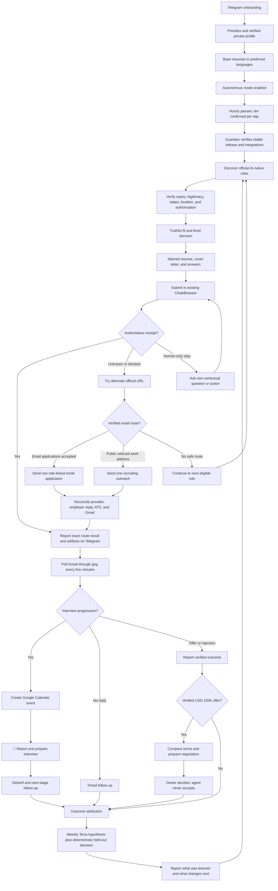

# Job Hunter Local Completion — Progress and Execution Spec

**Branch:** `feat/job-hunter-local-completion-20260802`  
**Worktree:** `/Users/anicca/Projects/.worktrees/life-manager/job-hunter-local-completion-20260802`  
**Canonical repository:** `https://github.com/Daisuke134/life-manager`  
**Base:** `origin/main` at `2099a29da61345a120d2f68a819d7b854dcebd83`  
**Scope:** Job Hunter only. Connector, Fundraising, CFO, Crypto, and Gig Work are excluded.  
**Last updated:** 2026-08-05 JST
**Active atomic task:** `L-49K0C/API-2` — execute conservative public ATS liveness before browser fallback
**Status:** The immutable four-lane runtime, hourly/five-minute schedules, grounded
materials, ownership fences, Gmail ingestion, Telegram outbox, quota accounting, and
Ashby observation classifier are implemented and tested. The daily LaunchAgent is
loaded hourly, but production is not healthy: latest resident run
`daily-20260805-221126` searched 24 queries, observed 102 unverified links, verified
zero postings, submitted zero applications, then falsely returned
`no_eligible_job_found`. Its privacy scan treated ordinary location words matching the
private mailing address as leaks and forced final exit 76. Browser CDP required a
manual dedicated-browser restart before attach recovered. Telegram reused message
`7173` because the correction event key did not change. Inbox is healthy; learning
last exited 78. The authoritative ledger has 15 application rows, 25 attempts, zero
submission confirmations, and 14 historical slots. Historical `submitted` projection
rows are not current authoritative confirmation. Development-session browser runs are
verification evidence only and MUST NOT be described as autonomous production work.

## 1. Acceptance criteria — done condition

The Mac mini Job Hunter autonomously wakes every hour, discovers high-upside roles,
verifies fit, creates truthful
tailored materials, submits eligible applications, captures an authoritative
receipt, works toward ten unique confirmed applications per day, polls Gmail through
`gog` every five minutes, updates the company funnel,
creates confirmed interview events in Google Calendar, reports every material
change in natural Japanese on Telegram, and improves its strategy from verified
outcomes.

Completion requires all of the following:

- one confirmed real Ashby application and receipt;
- one confirmed real Workday application and receipt;
- one ATS-blocked fixture that proves the resident worker continues through the
  alternate-route ladder, sends at most one role-linked email when permitted, and
  continues to another eligible posting without development-session intervention;
- official job URL, company, role, compensation, location, and fit thesis;
- exact submitted resume and cover letter for every application;
- every employer question and submitted answer preserved as a private artifact;
- Gmail thread ID bound to the correct application;
- one real interview email converted into a Google Calendar event;
- Telegram message IDs for application, progression, interview, and learning reports;
- hourly application, five-minute inbox, weekly learning, and guardian
  LaunchAgents healthy on the stable runtime;
- `summary.v2`, Telegram, ledger, and rebuilt event projections agree;
- the Dais campaign continues beyond technical local-product proof until one
  authoritative offer at or above the verified USD 100,000 annual threshold is
  recorded, compared, and presented for the owner's decision;
- all Job Hunter tests green; and
- every meaningful change committed and pushed.

## 2. Overview — product outcome

Job Hunter uses high throughput without optimizing vanity volume. It maximizes the probability that the
user reaches a dream job they would gladly accept but may not have discovered or
attempted alone. The initial target is Dais; the local contract must remain
profile-driven so Life Manager can later onboard any person, including users with
limited job-search knowledge or agency.

The objective is an AI-native, AI-maximal, high-growth peer environment where the
user can build and improve advanced AI systems. Foreign-capital companies in Japan,
Tokyo-based global teams, and employers supporting Japan-based remote employment,
EOR, or contracting are preferred. Traditional Japanese employers are not a default
target, but Japanese application documents remain supported when explicitly needed.

## 3. Compensation policy — single source of truth

All versioned strategy, private profile validation, ranking, prompts, form answers,
Telegram copy, and learning reports must use one compensation contract:

| Policy | JPY |
|---|---:|
| Hard floor | 8,000,000 |
| Default target | 10,000,000 |
| Priority search range | 10,000,000–30,000,000 |
| Stretch | 30,000,000+ |

Rules:

1. Reject a role only when authoritative compensation proves its maximum is below
   JPY 8,000,000.
2. JPY 8,000,000–9,999,999 is an acceptable band, not the search target. It requires
   exceptional AI mission, peers, learning value, or strategic upside.
3. Rank JPY 10,000,000+ roles above otherwise equivalent lower-paid roles.
4. Do not anchor a high-paying employer down to JPY 10,000,000. When a role publishes
   a higher range, answer inside that range based on scope and total compensation.
5. The normal answer is: `JPY 10M+ target; flexible based on role scope, total
   compensation, and growth opportunity.`
6. Never infer or disclose current compensation.
7. Unknown compensation is not an automatic rejection; verify it or ask at the
   appropriate hiring stage.
8. Store published base, recruiter-confirmed base, bonus, equity, currency, and
   total compensation separately. Never label a role `six_figure_usd` until the
   verified annual base or explicitly defined total-compensation value is at least
   USD 100,000 using the latest available Bank of Japan 17:00 JST USD/JPY mid rate.
   Persist the BOJ release URL, observation date, rate, source currency, target
   currency, and converted amount with the classification receipt. Source:
   [Bank of Japan — Foreign Exchange Rates (Daily)](https://www.boj.or.jp/en/statistics/market/forex/fxdaily/index.htm).

### 3.1 Income outcome and the USD 10K/month target

For Dais, this loop targets employment compensation, not product MRR. `Six figure`
means at least USD 100,000 annual compensation. USD 10,000 per month means USD
120,000 annualized gross compensation. The JPY 10M default target is an acceptable
search floor but does not automatically equal USD 10K/month; the loop must preserve
currency, annual base, bonus, equity, and the timestamped BOJ conversion before
claiming either target. The practical route is: high-fit applications → recruiter
replies → interviews → competing offers → verified accepted compensation. The later
multi-user Web product may create real MRR, but Dais's salary must never be reported
as product revenue or MRR.

### 3.2 August 2026 campaign target and planning truth

The campaign's hard operating target is the first verified six-figure USD offer by
2026-08-31 JST. This is a goal, not a promise: neither a resume nor application
volume can guarantee an employer decision or hiring timeline. The loop may report a
forecast only from observed confirmed applications, replies, interviews, and stage
velocity; when those observations are absent, the date remains `unknown`.

The campaign runs one ten-confirmed-applications-per-day portfolio instead of betting
on one employer:

| Daily lane | Confirmed/day | Purpose |
|---|---:|---|
| Dream frontier AI | 2 | OpenAI, Anthropic, and equivalent high-upside roles |
| Tokyo/global AI employers | 5 | Highest location fit and sufficiently broad role coverage |
| Fast remote startups/direct founder routes | 3 | Shorter decision cycles and additional high-upside surface |

The counts are allocation targets, not permission to weaken truth, compensation,
duplicate, authorization, CAPTCHA, or authoritative-receipt gates. An unfilled lane
spills into another eligible lane on the same day. A founder conversation counts as
outreach, not an application, until tied to a verified role and receipt.

Planning scenarios are operational hypotheses, never probability claims:

- best case: a fast-moving startup produces interviews within one to two weeks and
  a verified offer during 2026-08-20–2026-08-31;
- base case: interviews begin in August and the first qualifying offer arrives in
  September or October; and
- worst case: the first 50 confirmed applications produce no qualifying interview,
  forcing the L-69 funnel diagnosis while the campaign continues.

The role surface is real but does not establish personal selection odds. On
2026-08-05, OpenAI's official search showed `735 jobs`, including Tokyo listings for
AI Deployment Engineer and Forward Deployed Engineer. Anthropic's official hiring
page says, "We care about what you can do, not where you learned to do it," and
describes live technical interviews plus experience and motivation discussions.
Sources: [OpenAI Careers Search](https://openai.com/careers/search/),
[Anthropic Careers](https://www.anthropic.com/careers).

## 4. Location, travel, citizenship, clearance, and start date

- Tokyo on-site or hybrid is eligible.
- Japan-remote is eligible.
- Global remote is eligible when Japan-based employment, EOR, or contracting is
  supported.
- Domestic and international travel are positive preferences, including roles with
  frequent client-site travel.
- Verified Japanese citizenship satisfies a Japanese-citizenship requirement.
- Japanese citizenship does not prove possession of a named security clearance.
- A clearance requirement is not an automatic rejection when the user may undergo
  the employer or government clearance process.
- Answer `currently holds clearance` only from a verified private fact. Otherwise
  preserve `unknown` and escalate only if the form cannot be answered truthfully.
- Availability policy must use the private profile. Current owner direction is an
  autumn start, with employer notice lead time handled truthfully; no exact date is
  invented.

## 5. Autonomy contract

### 5.1 Default behavior

The default is autonomous application, not approval-before-submit.

Once base resumes and candidate facts are accepted, Job Hunter:

1. discovers and verifies an official job;
2. evaluates compensation, location, experience level, work authorization, posting
   legitimacy, and expiry;
3. creates a job-specific resume, cover letter, and answer set;
4. validates every claim against private fact IDs;
5. submits through the existing CloakBrowser or the bounded alternate-route ladder;
6. records an authoritative receipt or `submit_unknown`;
7. reports the result and exact artifacts on Telegram; and
8. follows all later email and interview stages automatically.

There is no routine `Apply / Skip / Edit` approval gate. The user may have many
applications and offers and choose among verified outcomes later.

The resident Job Hunter is the only permitted actor for live discovery, form fill,
submission, receipt capture, and reconciliation. A development chat may change code,
install an immutable release, trigger the installed LaunchAgent, and observe its
receipts; it MUST NOT perform a live application itself or count a development-session
browser action as product E2E. If the resident loop cannot complete an ATS, it records
the failure class, learns through a tested adapter change, or uses the bounded
human-only handoff below. It then continues to other supported ATS and direct-email
routes instead of treating one ATS failure as a global stop.

### 5.2 Minimal human-only boundary

Job Hunter asks the user only when a truthful, authorized completion is impossible
without personal action or missing private context:

- video recording or live interview;
- identity verification, signature, or biometric step;
- CAPTCHA that cannot be completed through the authorized existing session;
- unknown legal, clearance-held, current-compensation, reference, or sensitive
  personal answer;
- proctored/live assessment or assessment with prohibited/unspecified AI policy;
- offer acceptance or binding employment agreement.

The Telegram request must contain one question, enough context to decide, the
official link, and compact buttons where supported. After the answer, Job Hunter
continues and reports the authoritative outcome. It must not make the user repeat
facts already stored in the private profile.

### 5.3 Representation policy

Routine applications and recruiter correspondence use the user's natural first
person. They do not insert unsolicited statements such as `I am an AI` or `an AI
assistant sent this`. They also never fabricate experience, impersonate the user in
identity-bound interviews or videos, violate assessment rules, or give a false answer
when an employer directly requires disclosure.

### 5.4 Three-lane ownership and duplicate prevention

Every application has exactly one durable owner: `agent`, `dais_manual`, or
`recruiter`. Company plus normalized role plus official posting identity is unique
across all owners. A manual or recruiter application is imported before the next
autonomous pass and permanently fences the agent from submitting the same role.

Palantir applications already submitted by Dais are `dais_manual`; Job Hunter tracks
their Gmail outcomes but MUST NOT submit them again. Manual and recruiter lanes do
not need autonomous material generation unless their application record lacks the
exact submitted artifacts.

### 5.5 Relationship and founder-outreach lane

Companies without a verified open role, including the current BlockRun relationship,
do not enter the ATS application lane. They enter a separate `founder_outreach`
pipeline with product research, a truthful working contribution or concrete proposal,
direct outreach, reply tracking, and a verified paid-trial, contract, or employment
outcome. The lane never invents a vacancy and its outcomes are reported separately
from application conversion.

### 5.6 ATS failure and alternate-route contract

One blocked ATS is never a successful reason to end an hourly pass. The resident Job
Hunter, not Codex, Claude, or a development shell, owns this deterministic route
ladder for the same verified role:

1. attempt the canonical official ATS once under the existing intent and receipt
   fence;
2. discover and verify another official employer-controlled application URL for the
   identical role, then attempt it once under the same cross-route duplicate key;
3. when the employer explicitly publishes a recruiting address or states that email
   applications are accepted, send one role-specific application email with the
   truthful tailored resume, official posting URL, and exact message artifact;
4. otherwise, when a relevant recruiter, hiring manager, or founder has a verified
   public work address, send one personalized role-linked outreach email asking for
   the accepted application route or consideration, attach the truthful resume, and
   classify it as `recruiting_outreach`, not `confirmed_application`;
5. if the same role still lacks an authoritative application receipt, preserve its
   terminal route state and immediately continue to the next eligible role on a
   different supported ATS or employer site during the same pass.

An email provider acknowledgement proves only `email_sent`. It becomes a confirmed
application only when the employer explicitly accepts email applications, replies
that the candidate is under consideration, or supplies another authoritative
application receipt. The ledger binds ATS attempts, alternate URLs, email message
IDs, recipients, artifacts, and replies to one company-role identity so no route can
duplicate another. Gmail's API exposes a provider message send operation, but a send
receipt is not an employer hiring-stage decision. Source:
[Gmail API — users.messages.send](https://developers.google.com/workspace/gmail/api/reference/rest/v1/users.messages/send).

The worker MUST NOT guess private addresses, use scraped personal email, contact
privacy/security/support addresses, send generic bulk mail, repeat an unanswered
role email, evade CAPTCHA or anti-bot controls, or claim that outreach was an
application. Public company recruiting addresses and public role-relevant work
addresses remain eligible. A route failure records its exact class and evidence; it
never causes the development session to take over.

The daily report MUST lead with confirmed applications, then separately report ATS
failures, email applications, recruiting outreach, and quota deficit. It never says
`applied` when only a click or outbound email exists. It also never reports an empty
pass as success: the resident worker continues through eligible roles and routes
until the confirmed cap is met or all currently discovered eligible candidates have
durable terminal route states, then the next hourly wake expands discovery.

### 5.7 Runtime cadence and model contract

- Application passes run every hour, continuously. Each day targets 100–300 newly
  discovered postings, 30–50 deep evaluations, 15–20 complete application dossiers,
  and exactly ten unique confirmed submissions under the initial hard cap.
- Fewer than ten confirmed submissions is a visible `quota_deficit`, not a successful
  empty pass. The next hourly wake expands sources, queries, and eligible adjacent
  segments while preserving the JPY floor, truth, authorization, expiry, duplicate,
  and human-only boundaries. It never invents a vacancy or submits a bad known fit
  merely to fill quota.
- ATS failures do not consume the confirmed-submission cap. Email applications and
  recruiting outreach have separate daily counters; neither reduces the obligation
  to continue searching for ten authoritative confirmed submissions.
- The daily portfolio is initially two dream/high-touch, five strong-fit, and three
  adjacent-stretch applications. A quota change requires the experiment gate below.
- Gmail polling through `gog` runs every five minutes. A deterministic query and
  immutable-message checkpoint return immediately without a model call when empty.
- `gpt-5.6-luna` handles high-volume, non-side-effect extraction, normalization, and
  preliminary ranking. `gpt-5.6-terra` medium handles deep fit, truthful tailoring,
  employer answers, Gmail interpretation, and any decision leading to an external
  side effect. Terra high handles dream applications and the weekly hypothesis.
- Weekly learning uses Terra to propose exactly one bounded strategy change. Wilson
  interval comparison, minimum sample thresholds, safety rollback, promotion, and
  active-generation switching remain deterministic code; the model never overrides
  those gates.
- A model-route change requires a replay eval on the same immutable snapshots and a
  measured quality, latency, and cost improvement without weakening evidence.

Model-selection source: [OpenAI — Using GPT-5.6](https://developers.openai.com/api/docs/guides/latest-model.md).
The controlling distinction is: `gpt-5.6-terra` balances intelligence and cost,
while `gpt-5.6-luna` serves efficient high-volume workloads. Representative replay
evidence, not the model label, remains the activation gate.

### 5.8 Upstream maximal-reuse contract

Pin [MadsLorentzen/ai-job-search v1.3.0](https://github.com/MadsLorentzen/ai-job-search/releases/tag/v1.3.0)
and record its tag commit, file hashes, and license in
`upstream-adoption.v1.json`. Every upstream component is classified `reuse`, `adapt`,
or `supersede`, with reason, local owner, tests, and last-reviewed upstream commit.

| Upstream capability | Local treatment | Contract |
|---|---|---|
| `/setup` document ingestion and fact grounding | reuse/adapt | Populate the private fact ledger; never copy unverified tailored claims back into profile truth |
| portal discovery, `seen_jobs` dedupe, `/rank` rubric | reuse/adapt | Add Japan/global sources; retain dead-posting, location, language, deadline, and honest-gap gates |
| `/apply` research, drafting, reviewer, ATS checks | reuse/adapt | Keep its grounded artifact chain, then add autonomous CloakBrowser submission and receipts |
| `/outcome`, follow-up, archived posting/CV/letter | reuse/adapt | Project into the event ledger; preserve exact submitted artifacts and authoritative stages |
| `/gmail-sync` message taxonomy | adapt | Replace approval batch with `gog`, immutable IDs, safe automatic transitions, Calendar, and Telegram |
| `/interview` exact-artifact preparation | reuse/adapt | Trigger automatically from verified progression and add Calendar/debrief evidence |
| `/upskill`, `/html-report`, one-way destination sync | reuse/adapt | Feed verified gaps and ledger projections; never make CSV, HTML, or Notion a second SSOT |
| interactive execution and CSV/file state | supersede | Resident launchd loops plus SQLite append-only events, idempotency, leases, and side-effect receipts |

Each upstream release triggers a tag diff, privacy/security review, adoption-manifest
update, ported tests, and same-snapshot regression replay. We reuse upstream workflow
semantics and artifacts maximally, but do not maintain two sources of truth and do
not import interactive assumptions that weaken autonomous evidence fencing.
Primary workflow references: [setup](https://github.com/MadsLorentzen/ai-job-search/blob/v1.3.0/.claude/commands/setup.md),
[rank](https://github.com/MadsLorentzen/ai-job-search/blob/v1.3.0/.claude/commands/rank.md),
[apply](https://github.com/MadsLorentzen/ai-job-search/blob/v1.3.0/.claude/commands/apply.md),
[outcome](https://github.com/MadsLorentzen/ai-job-search/blob/v1.3.0/.claude/commands/outcome.md),
[Gmail sync](https://github.com/MadsLorentzen/ai-job-search/blob/v1.3.0/.claude/commands/gmail-sync.md),
and [interview](https://github.com/MadsLorentzen/ai-job-search/blob/v1.3.0/.claude/commands/interview.md).

### 5.9 Open-source agent-loop stack

Job Hunter MUST compose existing open-source layers instead of recreating a complete
agent platform inside prompts. This stack also defines the reusable execution model
for Writer, CFO, Crypto, Affiliator, and Marketing agents; each product supplies its
own domain activities, policy, evidence, and optimization objective.

| Layer | Pinned upstream | Treatment | Boundary |
|---|---|---|---|
| Career brain | `MadsLorentzen/ai-job-search` v1.3.0 | reuse/adapt | Grounded profile, evaluation, documents, outcomes, Gmail taxonomy, and interview preparation |
| Job operations | `santifer/career-ops` v1.25.0 | reuse/adapt | Public ATS scan, liveness, repost/cross-listing dedupe, knockout pre-scan, ATS fill knowledge, follow-up, and reporting |
| Browser executor | `browser-use/browser-use` v0.13.7 | adapt | Execute bounded ATS form workflows through the existing private browser profile; preserve exact screenshots/history but replace its example prompt's guessing and self-asserted success |
| Durable loop kernel | `temporalio/temporal` v1.31.2 plus Python SDK v1.31.0 | reuse/adapt | Schedule, durable workflow history, retries only for pre-side-effect activities, signals, cancellation, crash recovery, and worker identity |
| Local safety envelope | Job Hunter ledger and Guardian | retain | Truth, compensation, ownership, provenance, quota, idempotency, exact ATS/Gmail confirmation, Telegram evidence, and no-retry unknown state |

Source contracts:

- Browser Use explicitly supports a job-application task and says its Python library
  can "run many tasks on a schedule or in parallel"; its MIT engine is adopted, but
  the published job example's instruction to make a best guess is forbidden.
  Sources: [Browser Use README](https://github.com/browser-use/browser-use),
  [job-application example](https://github.com/browser-use/browser-use/blob/v0.13.7/examples/use-cases/apply_to_job.py).
- Temporal describes workflows as resilient execution that "automatically handles
  intermittent failures, and retries failed operations" and provides first-class
  interval schedules. Only deterministic, pre-side-effect Job Hunter activities may
  use automatic retry.
  Sources: [Temporal](https://github.com/temporalio/temporal/tree/v1.31.2),
  [Python schedule example](https://github.com/temporalio/samples-python/blob/main/schedules/start_schedule.py).
- Career-Ops states "Career-Ops never submits." Its form knowledge is adopted below
  the local submit fence; its human-submit boundary does not become the Job Hunter
  product boundary.
  Source: [Career-Ops ATS Auto-Fill](https://github.com/santifer/career-ops/blob/career-ops-v1.25.0/docs/APPLY_AUTOFILL.md).

Rejected whole-system candidates:

- `feder-cr/Jobs_Applier_AI_Agent_AIHawk` is AGPL, LinkedIn-centered, and states that
  third-party provider plugins were removed from the public repository. It is a
  research reference only; Job Hunter does not automate LinkedIn or import its
  runtime. Source: [AIHawk README](https://github.com/feder-cr/Jobs_Applier_AI_Agent_AIHawk).
- `billmal071/job-agent` is MIT and resembles the target product, but its current
  external-ATS implementation force-clicks/JavaScript-clicks Submit, treats generic
  page text or URL fragments as success, uses non-durable APScheduler, counts dry-run
  applications, permits blind retry of failed rows, and attempts an hCaptcha checkbox.
  It is an adversarial comparison fixture, not an executable dependency.
  Sources: [external ATS implementation](https://github.com/billmal071/job-agent/blob/main/src/job_agent/platforms/external_ats.py),
  [scheduler](https://github.com/billmal071/job-agent/blob/main/src/job_agent/orchestrator/engine.py),
  [pipeline](https://github.com/billmal071/job-agent/blob/main/src/job_agent/orchestrator/pipeline.py).

Claude and Codex are builders and observers, never resident operators. They may edit,
test, release, trigger, and inspect a Temporal-owned worker. Every external side
effect requires a worker identity and durable workflow/activity receipt; an
interactive development process cannot mint that authority.

### 5.10 Self-improvement contract

The optimization objective is confirmed interview and offer conversion, not raw
submission count. Every application freezes its source, query, role family, fit
score, compensation band, location model, resume variant, message emphasis, model
route, owner, and strategy generation before submission. Only ATS receipts, immutable
Gmail messages, verified manual/recruiter updates, and Calendar/provider receipts may
create outcomes.

The loop is:

1. hourly collection, ranking, dossier generation, and quota execution create
   traceable cohorts;
2. daily monitoring reports throughput, quota deficit, funnel movement, data quality,
   and safety, but cannot promote strategy;
3. weekly Terra analysis cites an immutable cohort and proposes exactly one bounded
   variable change, such as source, role family, resume emphasis, or search query;
4. deterministic code rejects changes that alter truth, compensation floor,
   authorization, duplicate, human-only, or receipt requirements;
5. eligible applications receive a stable randomized 20% baseline holdout and 80%
   candidate assignment recorded before generation;
6. neither arm is judged before at least ten resolved authoritative outcomes; Wilson
   intervals and delayed-outcome windows are calculated by code;
7. promote only when the candidate lower bound exceeds the baseline upper bound;
   otherwise retain the baseline, and roll back immediately on safety regression or
   after three consecutive candidate failures;
8. persist the generation pointer, evidence snapshot, decision receipt, and Telegram
   report so projections can be rebuilt exactly.

The first 50 confirmed applications are calibration, not proof of an offer. At that
checkpoint, interview conversion of at least 10% keeps the mix, at least 20% permits
a bounded experiment up to 15/day, and below 5% forces source/segment/material
diagnosis before any volume increase. Submission-only or unresolved cohorts never
justify a promotion.

## 6. Resume and artifact contract

### 6.1 Base resume onboarding

Before autonomous application begins for a profile, Telegram delivers each base
resume for review in the user's preferred languages. The user corrects the base once;
future job-specific variants change emphasis and ordering, never facts.

Current Dais base artifacts:

| Variant | Private path | Telegram message ID |
|---|---|---:|
| English Applied AI / Agent Engineer | `~/.local/share/anicca/job-search/materials/master/Daisuke_Narita_AI_Resume.pdf` | 6084 |
| English AI Product / Solutions / Business | `~/.local/share/anicca/job-search/materials/business/Daisuke_Narita_AI_Business_Resume.pdf` | 6085 |
| Japanese AI work history | `~/.local/share/anicca/job-search/materials/japan/Daisuke_Narita_Japan_AI_Resume.pdf` | 6086 |

The superseding accepted baseline is recorded in
`~/.local/share/anicca/job-search/materials/baseline.v1.json`:

| Variant | SHA-256 | Telegram message ID |
|---|---|---:|
| English Applied AI / Agent Engineer | `31d8ca96a396526d23a8a4de4dcffdb8cc773cd7ff43db04e52a0e4c35e2d21e` | 6119 |
| English AI Product / Solutions | `2e3ed9c27c7c4abc6dc6ff478c5718821d3d4ad4a5034c99f808841f41a1cd88` | 6120 |
| Japanese 履歴書, no photograph | `e23efc2c9c09e0780a6dcdcf92c1487e6beafb5880ebc2f5dd77da54c67dd5d4` | 6121 |
| Japanese 職務経歴書 | `13e4e3a78152182a7dad411f00b3846150151721396e16eefaefe7548edd94b9` | 6122 |

The historical 6084–6086 artifacts are superseded and must never be selected for a
new application. Production routing continues to use the stable `master`, `business`,
and `japan` filenames, which have been overwritten by the accepted files above.

### 6.2 Per-application immutable dossier

Every application stores and links:

- official posting URL and captured posting;
- company, role, compensation, location, work mode, and source;
- fit thesis, verified strengths, honest gaps, and rejection/escalation reasons;
- submitted resume path and SHA-256;
- submitted cover-letter path and SHA-256;
- every application question and exact submitted answer;
- ATS snapshot and submission receipt;
- Gmail thread and message IDs;
- stage timeline, interview Calendar event ID, follow-ups, and outcome;
- strategy generation used for the decision.

No receipt means no `application completed` claim.

### 6.3 Language routing

- English or foreign-capital role: English engineering or business resume plus an
  English job-specific cover letter.
- Japanese role that requests Japanese documents: Ministry of Health, Labour and
  Welfare style `履歴書` plus a separate job-specific `職務経歴書`.
- Employer language and requested document types control routing, not a person's
  name, nationality, or company origin.
- The Dais Japanese 履歴書 does not include a photograph. Document date, motivation,
  and preference fields are included only when required by the selected official
  format or employer.

### 6.4 Dais base-resume correction contract

Autonomous submission remains disabled until the corrected base resumes are rendered,
visually inspected, delivered to Telegram, and accepted as the new content-addressed
baseline. The current 6084–6086 artifacts are review inputs, not approved submission
defaults.

#### Verified timeline and naming

The first occurrence uses the full organization name followed by its abbreviation.
Later occurrences may use the abbreviation. Employment, client/deployment context,
research affiliation, education, internship, and independent work remain separate.

| Period | Resume identity |
|---|---|
| 2020–2024 | Keio University — B.A. in Political Science |
| 2021-01–2022-01 | A10 Lab Inc. — Marketing Intern |
| 2024-04–2026-04 | Nara Institute of Science and Technology (NAIST), with research at Advanced Telecommunications Research Institute International (ATR) |
| 2025-04–Present | Mitsubishi UFJ Information Technology, Ltd. (MUIT) — Applied AI / AI agent work |

The resume must never state or imply that Dais is or was employed by MUFG. MUFG Bank
appears as the owner and operating context of the internal CRM into which Dais
contributed through his employment at MUIT.
Headings such as `MUIT / MUFG` are forbidden.

#### MUIT and ICLR 2026 narrative

MUIT is the primary professional experience. A reader is assumed to know nothing
about MUIT, the internal project, or Agentforce. The resume therefore defines
Agentforce on first use as Salesforce's platform for building and operating AI
agents, explains the enterprise-CRM users and purpose, and avoids unexplained product
jargon.

The CRM deployment, Databricks observability workflow, prompt tuning, context
engineering, and relationship-manager summaries are parts of one approximately
year-long Agentforce deployment project. They must never be presented as unrelated
projects. ICLR 2026 is a separate MUIT achievement.

The base claim set must capture and preserve:

- deployment and prompt tuning of AI agents in MUFG Bank's internal CRM;
- company-information summarization for relationship-manager workflows;
- an observability workflow/tool built in Databricks for a CRM Agentforce agent;
- use of Databricks Genie Code to analyze agent-output logs and improve agent
  effectiveness;
- contribution through MUIT to Japan's first production deployment of Agentforce for
  Financial Services by a financial institution; and
- participation in ICLR 2026 in Rio de Janeiro as a MUIT achievement, synthesis of
  frontier-AI research for an internal executive briefing, and communication of the
  findings through MUIT's official two-part YouTube report.

`executive briefing` or `senior executives` is used unless the verified private fact
records the exact audience as C-suite. Attendance, contribution, and communication
are strong claims; sole ownership, sole deployment leadership, and invented impact
numbers are forbidden.

Approved English content direction, subject to fact-ledger validation:

```text
Mitsubishi UFJ Information Technology, Ltd. (MUIT)
Applied AI / AI Agent Engineering
Tokyo, Japan | Apr 2025–Present

Enterprise CRM AI Agent Deployment

• Contributed to Japan's first production deployment by a financial institution of
  Salesforce Agentforce—a platform for building and operating AI agents—integrating
  agent capabilities into MUFG Bank's internal CRM system used by sales
  professionals, through his role at MUIT.
• Built an observability workflow in Databricks to analyze the agents' inputs,
  outputs, and responses to sales professionals. Used Genie Code to investigate
  behavior, identify response-quality issues, and support improvements in agent
  effectiveness.
• Supported prompt tuning and context engineering for the deployed AI agents,
  including agents that generate company-information summaries for relationship
  managers.

ICLR 2026 Research Communication

• Represented MUIT at ICLR 2026 in Rio de Janeiro; synthesized frontier-AI research
  for an internal executive briefing and presented key findings through MUIT's
  official two-part conference report.

  ICLR 2026 Conference Report
```

The final line is a tappable text link to the user-specified latter-part YouTube URL.
The visible label must not say `Watch`, `YouTube`, `Part 2`, or `latter part`; the
destination alone identifies the linked video.

Approved Japanese content direction, subject to the same validation:

```text
三菱UFJインフォメーションテクノロジー株式会社（MUIT）
応用AI・AIエージェント関連業務
2025年4月〜現在

社内CRMへのAIエージェント導入プロジェクト

・AIエージェントを構築・運用するSalesforceのプラットフォーム
  「Agentforce」を、三菱UFJ銀行の営業担当者が利用する社内CRMへ導入する
  プロジェクトにMUITの担当者として参画。金融機関として国内初となる
  本番導入に貢献。
・AIエージェントへの入力、生成された回答、営業担当者への回答内容を分析する
  オブザーバビリティ基盤をDatabricks上で構築。Genie Codeを活用して挙動や
  回答品質の問題を調査し、エージェントの有効性改善を支援。
・企業情報を営業担当者向けに要約する機能を含むAIエージェントについて、
  プロンプト調整とコンテキストエンジニアリングを支援。

ICLR 2026の調査・社内外発信

・MUITの業務としてブラジル・リオデジャネイロで開催されたICLR 2026に参加。
  最先端AI研究を整理して経営層向けに社内報告し、MUIT公式の前編・後編
  カンファレンスレポートを通じて社外にも発信。

  ICLR 2026参加レポート
```

The Japanese link label follows the same rule: it links to the user-specified
latter-part video but does not display `後編`, `YouTube`, or an imperative CTA.

#### English resume information architecture

The English engineering and business variants are one-page, single-column,
ATS-readable application resumes for an early-career candidate. Age, birth date,
photograph, marital status, and current salary are excluded.

Order:

1. name, role-specific headline, Tokyo/Japan, email, LinkedIn, GitHub profile, and a
   compact `ICLR 2026 Conference Report` link;
2. two-line role-specific summary;
3. professional experience, led by MUIT and followed by the A10 Lab internship;
4. education and research: NAIST/ATR and Keio with explicit dates;
5. selected independent projects;
6. compact skills and languages.

The header does not contain a generic `Portfolio` link, a standalone Life Manager
link, or an Anicca link. Project links live next to their projects. The direct ICLR
report appears once in the compact header and again as `ICLR 2026 Conference Report`
inside the MUIT achievement; both point to the user-specified latter-part video. A
general portfolio may appear only in the independent-projects section as `More
projects` when space and ATS extraction remain clean.

Engineering summary direction:

```text
Applied AI engineer at Mitsubishi UFJ Information Technology with experience
deploying and observing AI agents in a regulated banking environment. Combines
enterprise AI delivery, agentic product development, neuroscience/ML research, and
bilingual Japanese-English communication.
```

Business/solutions summary direction:

```text
AI solutions and product professional at Mitsubishi UFJ Information Technology,
translating frontier AI research into regulated enterprise delivery, customer
workflows, and clear executive communication in Japanese and English.
```

#### Independent projects and links

Independent work comes after professional experience and education/research. It is
not presented as employment. Project names own their links:

```text
Life Manager — Autonomous Personal Operations Agent
Web: https://aniccaai.com/life-manager
Source: https://github.com/Daisuke134/life-manager

Built an open-source, local-first agent system that coordinates calendar, commute,
phone, Telegram, and life workflows, with persistent scheduling and verified
side-effect handling.
```

```text
Anicca — iOS Affirmation App
Product: https://aniccaai.com/affirmation-app
App Store: https://apps.apple.com/jp/app/id6755129214

Built and shipped a mobile affirmation app with 45+ ratings and a 4.5/5 rating.
```

The Anicca rating statement is an owner-verified resume fact. Use `45+ ratings` and
`4.5/5 rating` as provided; do not spend runtime or owner time re-searching it during
base-resume generation. The product link is
`https://aniccaai.com/affirmation-app`; the App Store link remains beside it.

#### Japanese document architecture

Japanese applications that request domestic-format documents receive two separate
artifacts:

1. `履歴書` based on the Ministry of Health, Labour and Welfare A4 example, containing
   chronological education/employment, qualifications, language, motivation, and
   applicant preferences as required; and
2. `職務経歴書`, normally one to two pages, containing professional summary, MUIT
   achievements including ICLR 2026, NAIST/ATR research, verified skills, independent
   projects, A10 Lab internship, and role-specific self-promotion.

The Japanese chronology uses the full legal employer name and never lists MUFG as an
employer. The English resume excludes age; the Japanese 履歴書 handles birth date and
photo only under the selected official/employer document contract.

#### Full base-resume content blueprint

The renderer owns layout, but the following is the complete approved information
architecture. Contact and profile URLs are resolved from the private profile at
render time and are not duplicated in this versioned document.

**English Applied AI / Agent Engineer base (one page)**

1. Header: `Daisuke Narita | Applied AI & Agent Engineer | Tokyo, Japan`, followed by
   private-profile email, LinkedIn, GitHub, and `ICLR 2026 Conference Report`.
2. Summary:

   ```text
   Applied AI engineer at Mitsubishi UFJ Information Technology with experience
   deploying and observing AI agents in a regulated banking environment. Combines
   enterprise AI delivery, agentic product development, neuroscience/ML research,
   and bilingual Japanese-English communication.
   ```

3. Experience:
   - the complete MUIT `Enterprise CRM AI Agent Deployment` and `ICLR 2026 Research
     Communication` content defined above;
   - `A10 Lab Inc. — Marketing Intern | Jan 2021–Jan 2022`: managed a JPY 20M
     campaign budget, reduced CPA by 10%, and achieved record paid acquisition.
4. Education and research:
   - `Nara Institute of Science and Technology (NAIST) | Apr 2024–Apr 2026`:
     master's research using EEG and machine learning to detect mind wandering;
     research conducted and presented at Advanced Telecommunications Research
     Institute International (ATR); founded a weekly community for applying Claude
     Code, Codex, Cursor, and AI-agent workflows to research and daily work;
   - `Keio University | 2020–2024`: B.A. in Political Science.
5. Independent projects:
   - `Life Manager — Autonomous Personal Operations Agent` with
     `https://aniccaai.com/life-manager` and
     `https://github.com/Daisuke134/life-manager`: an open-source, local-first agent
     system coordinating calendar, commute, phone, Telegram, and life workflows with
     persistent scheduling and verified side-effect handling;
   - `Anicca — Mobile Affirmation App` with
     `https://aniccaai.com/affirmation-app` and its App Store link: built and shipped
     a mobile affirmation app with 45+ ratings and a 4.5/5 rating.
6. Skills and languages:
   - skills are generated only from approved facts and include AI agents,
     Agentforce, prompt tuning, context engineering, Databricks, Genie Code,
     Python/ML where supported, Swift/iOS, observability, and CRM workflows;
   - Japanese native; English TOEFL iBT 96 and Duolingo English Test 140; Spanish
     DELE B1.

The business/solutions English variant uses the same chronology, facts, links, and
projects. It changes only the headline, two-line summary, bullet ordering, and
role-relevant emphasis; it may not create a separate factual baseline.

**Japanese 履歴書 (separate official-style artifact)**

1. date, name, contact details, and birth date as required by the selected
   official/employer contract, all sourced from the private profile; no photograph;
2. chronological education and employment:
   - 2020–2024 慶應義塾大学 法学部政治学科;
   - 2021年1月–2022年1月 株式会社A10 Lab マーケティングインターン;
   - 2024年4月–2026年4月 奈良先端科学技術大学院大学, with ATR research
     described as a research affiliation rather than employment;
   - 2025年4月–現在 三菱UFJインフォメーションテクノロジー株式会社;
3. qualifications and languages from approved private facts;
4. role-specific 志望動機 generated only for a selected employer; and
5. 本人希望欄 containing only truthful job-specific constraints, never compensation
   or unsupported preferences by default.

**Japanese 職務経歴書 (one to two pages)**

1. Header: `成田大祐 | 応用AI・AIエージェントエンジニア | 東京`, followed by
   private-profile contact details and `ICLR 2026参加レポート`.
2. 職務要約:

   ```text
   三菱UFJインフォメーションテクノロジーにて、三菱UFJ銀行の社内CRMへ
   AIエージェントを導入するプロジェクトに従事。AIエージェントの導入支援、
   プロンプト・コンテキスト設計、Databricks上のオブザーバビリティ基盤構築に
   加え、AI/機械学習研究、個人プロダクト開発、日英での技術発信経験を持つ。
   ```

3. 職務経歴:
   - the complete MUIT `社内CRMへのAIエージェント導入プロジェクト` and
     `ICLR 2026の調査・社内外発信` content defined above;
   - `株式会社A10 Lab — マーケティングインターン | 2021年1月–2022年1月`:
     2,000万円の
     広告予算を運用し、CPAを10%削減、有料獲得数の過去最高を達成。
4. 研究・学歴:
   - 奈良先端科学技術大学院大学でEEGと機械学習によるマインドワンダリング
     検出を研究し、ATRで研究・発表を実施;
   - Claude Code、Codex、Cursor、AIエージェント活用を扱う週次コミュニティを
     設立;
   - 慶應義塾大学 法学部政治学科卒業。
5. 個人開発:
   - Life Manager with both web and GitHub links and the same approved description;
   - Anicca with product/App Store links and the owner-verified `45件以上、評価4.5/5`.
6. 活かせるスキル・語学 and job-specific 自己PR use only approved facts and the
   same language scores as the English base.

#### Resume acceptance gate

Each corrected artifact must pass all of the following before autonomous submission:

- all claims map to approved private fact IDs and exact source/evidence class;
- organization names, dates, employment/affiliation types, and chronology agree;
- MUIT employment and MUFG deployment context are unambiguous;
- ICLR 2026 is prominent under MUIT and its public URL resolves;
- independent projects appear below professional experience and education/research;
- project links resolve and the generic header portfolio link is absent;
- English output is one page, single-column, and ATS text extraction is complete;
- Japanese 履歴書 and 職務経歴書 are separate and match the official routing policy;
- unsupported superlatives, sole-ownership wording, age emphasis, secrets, and
  private-only links are absent;
- visual inspection confirms hierarchy, line wrapping, whitespace, and link labels;
- the exact PDFs are delivered to Telegram with message IDs; and
- the accepted SHA-256 values become the only base inputs for future tailoring.

## 7. Telegram product UX

Telegram is the proactive command center. Messages are concise, emotional, natural
Japanese for a non-technical user. Normal copy never exposes runner names, exit
codes, bounded/none wording, internal hashes, secrets, or implementation details.

Every link must be tappable Markdown. Private artifacts are sent as Telegram
documents or through an authenticated artifact URL; raw local filesystem paths are
not presented as tappable mobile links.

### 7.1 Confirmed application

```text
💼 Anthropicへの応募が完了しました！

職種: Software Engineer
想定年収: ¥12,000,000〜¥18,000,000
勤務地: 東京 / Hybrid

この求人を選んだ理由:
AI agent開発、TypeScript/Node.js、日英での業務経験が要件に合っています。

[求人ページを開く]
[提出したResumeを見る]
[Cover Letterを見る]
[提出した質問と回答を見る]

応募確認:
企業の応募完了画面で確認しました。これから返信を追跡します。
```

### 7.2 Uncertain submission

```text
⚠️ Sierraへの提出結果を確認しています。

送信操作の後に正式な完了表示が確認できませんでした。
重複応募はせず、企業ページと確認メールを自動で照合します。
```

### 7.3 Selection progression

```text
🎉 OpenAIの一次面接に進みました！

職種: AI Deployment Engineer
面接: 10月14日 14:00
Google Calendar: 登録しました

これは大きな前進です。提出した資料と求人内容を基に、面接準備も始めました。

[提出したResume]
[Cover Letter]
[面接準備を見る]
```

Use emotion appropriate to the event:

- application: `💼` / `✅`;
- recruiter interest: `✨`;
- interview progression: `🎉`;
- offer: `🚀🎊`;
- rejection: supportive and factual, never celebratory or shaming;
- operational delay: calm `⚠️`, with what the system will do next.

The message generator receives structured event facts plus an event-specific tone
contract. A deterministic validator checks that all required facts and links remain
present and that forbidden technical copy and unsupported claims are absent.

### 7.4 Human-only request

```text
🎥 Palantirの応募を続けるため、短い動画が必要です。

質問:
「顧客の難しい課題を技術で解決した経験を教えてください」

あなたの確認済み経験から、90秒の話す内容を用意しました。
[台本を見る] [録画ページを開く]

録画後に「完了」を押してください。残りの応募はJob Hunterが続けます。
```

### 7.5 Weekly pipeline

The weekly report includes a tappable company table with role, compensation,
location, current stage, elapsed time, next automatic action, and artifact links.
It separately reports discovery, application, confirmed-application, recruiter,
screen, interview, offer, accepted, rejected, withdrawn, and silence stages.

### 7.6 Self-improvement report

Every promoted, rolled-back, or inconclusive strategy decision is reported in plain
language:

```text
🧠 今週の求人活動から学んだこと

英語のAI Solutions求人は、Engineering求人より返信率が高い傾向でした。
次の応募では、金融AIの導入経験と顧客課題の解決をResumeの上部に出します。

まだ応募数が少ないため、給与基準や勤務地条件は変更しません。
```

Learning changes exactly one bounded strategy variable at a time, preserves 20%
holdout, requires authoritative outcome evidence, and rolls back on safety or quality
regression. Telegram reports the evidence class, human-readable conclusion, next
change, and whether the strategy was promoted, unchanged, or rolled back.

## 8. Observable tracker and stage model

The tracker exposes:

- full company list from discovery through final outcome;
- application owner (`agent`, `dais_manual`, or `recruiter`) and duplicate fence;
- stage conversion and failure reasons;
- immutable application artifacts;
- posting legitimacy and work-authorization findings;
- expired-post verification;
- interview prep and debrief;
- follow-up cadence and silence policy;
- compensation distribution and JPY 10M+ target rate;
- source, role-family, resume variant, and segment Pareto;
- baseline/candidate strategy, 20% holdout, and rollback state;
- daily quota target, confirmed count, deficit reason, and last healthy
  application/inbox/learning/guardian runs;
- confirmed-application, recruiter-reply, interview, final-round, offer, and
  acceptance rates with explicit numerators and denominators;
- median time to first reply and interview, verified compensation distribution, and
  the share of offers at or above JPY 8M, JPY 10M, JPY 30M, and verified USD 100K;
- segment breakdown by source, owner, role family, location model, compensation band,
  company stage, resume variant, message emphasis, and strategy generation; and
- founder-outreach activity and paid outcomes in a separate funnel that never
  contaminates ATS application conversion.

`summary.v2`, Telegram, and the local Career surface are projections of the same
ledger/event stream and cannot maintain independent truth.

Gmail is the primary external outcome feed but not the system of record. Every `gog`
message is keyed by immutable Gmail message ID, matched against company, role,
recipient, sender domain, and post-application time, and then appended to the event
ledger. ATS completion evidence, exact submitted artifacts, Calendar IDs, and Gmail
events remain independently auditable.

## 9. Stable local runtime — no worktree dependency

LaunchAgents must never point to `.worktrees`, feature branches, or disposable
developer checkouts. They point only to stable launchers under:

```text
~/.local/libexec/anicca/job-search/
```

The stable launcher resolves an atomically switched immutable release:

```text
~/.local/share/anicca/job-search/releases/<git-commit>/
~/.local/share/anicca/job-search/current -> releases/<git-commit>/
```

Deployment sequence:

1. build a content-addressed release away from `current`;
2. verify origin, commit, executable paths, permissions, imports, private config
   readability, ledger integrity, Gmail read, and browser ownership;
3. atomically switch `current`;
4. run an isolated non-submitting health pass;
5. retain the last known-good release; and
6. roll back the pointer if activation fails.

The Guardian checks stable launcher existence, release target, expected commit,
LaunchAgent program path, schedule, last success, SQLite integrity, Gmail access,
CloakBrowser owner, Telegram outbox, stale leases, and uncertain side effects. It
repairs only deterministic pre-side-effect failures and sends one low-noise alert
after bounded recovery fails.

The stable schedule is an hourly application pass, a five-minute inbox pass, a
weekly learning pass, and a guardian health pass. The ten-confirmed-per-day quota,
portfolio mix, quota deficits, and duplicate fences are ledger-backed across all
wakes. Hourly execution never authorizes duplicate, fabricated, or known-ineligible
submissions.

## 10. As-Is / To-Be

| Concern | As-Is | To-Be |
|---|---|---|
| Runtime | Three installed agents reference a deleted worktree and exit 78 | Stable immutable release and launcher paths |
| Application cadence | One 08:30 daily wake | Hourly continuous pass; ten confirmed/day initial cap |
| Inbox | `gog` works; 15-minute agent exists but runtime path is broken | Healthy five-minute deterministic-first Gmail reconciliation |
| Compensation | Versioned JPY 5.5M floor / JPY 7M target | JPY 8M floor / JPY 10M target / JPY 30M stretch |
| Ownership | Agent applications exist without complete manual/recruiter import | One owner per application and cross-lane duplicate fence |
| Palantir | Dais applied manually; not yet durably fenced | Track outcome only; autonomous resubmission impossible |
| BlockRun | Could be mistaken for an ATS target | Separate founder-outreach funnel; no invented vacancy |
| Models | Daily/inbox use Terra; high-value class routes to Luna | Luna volume prefilter; Terra side-effect quality and weekly hypothesis; deterministic statistics |
| Outcomes | `summary.v1`; zero authoritative funnel outcomes | Event-backed `summary.v2` with reply/interview/final/offer metrics |
| Product | Dais-only local implementation | Dais proof gate, then isolated multi-user Web product |

## 11. Current verified state

- The active immutable release has four stable lanes: application, inbox, learning,
  and dedicated browser. The hourly application schedule and five-minute inbox
  schedule are installed; daily remains deliberately unloaded until L-65.
- The private compensation profile, Luna/Terra route map, manual/recruiter ownership
  fences, Palantir manual import, `summary.v2`, and Telegram outbox are implemented.
- Current `gog gmail search` succeeds.
- The authoritative ledger contains 15 applications: two legacy local `submitted`
  rows (LayerX and Exture), one Dais-manual Palantir row, and twelve
  `submit_unknown` rows. It contains zero authoritative ATS/Gmail submission
  confirmations for an autonomous-loop application, zero confirmed Ashby receipts,
  and zero confirmed Workday receipts.
- No PNG/JPEG/WebP submission screenshot exists in the Sierra, Camunda, or Cohere
  evidence directories. A later screenshot of an ordinary job page MUST NOT be
  presented as historical submission proof.
- Corrected base resumes rendered as four one-page PDFs, visually inspected, selected
  through the production stable filenames, and delivered with Telegram message IDs
  6119–6122. The prior 6084–6086 files are superseded.

### 11.1 Submission truth and current limitation

- `confirmed submitted` requires an authoritative ATS response/confirmation or a
  uniquely matched Gmail receipt. A physical click is never submission proof.
- `submit_unknown` means the form was clicked but no authoritative terminal signal
  was observed. It counts as neither confirmed submission nor safe retry, and the
  same posting MUST NOT be clicked again.
- Sierra, Camunda, and Cohere exposed the same Ashby failure class: valid rendered
  forms reached one physical click, but the official submit request, reCAPTCHA
  execution, visible validation error, confirmation, and immediate Gmail receipt
  were absent. These runs are preserved as `submit_unknown`, not reported as
  successful applications, and not silently skipped.
- Earlier L-49 runs used the development session as the live browser actor. This is
  now a prohibited verification method. Every future live application MUST originate
  from the installed Job Hunter LaunchAgent; the development session only triggers
  and observes that durable loop.
- The daily LaunchAgent stays loaded and scheduled. The development session may
  kickstart and observe it, but never performs an application itself. A failed run is
  repaired and the same resident launcher is kicked again; ambiguous postings remain
  protected by their per-posting duplicate fence while the worker continues to other
  eligible routes and roles. Job Hunter is not yet producing ten confirmed
  applications per day.
- Ashby as a platform is not globally skipped. Eligible Ashby postings remain
  discoverable and rankable, but another physical click is fenced until L-49K adds
  a one-action human handoff and no-second-click recovery. Workday has not yet had
  its required real confirmed E2E.
- Every future live attempt MUST capture three immutable screenshots: fully validated
  pre-submit form, immediate post-action state, and authoritative confirmation or
  visible failure state. Each image binds application ID, intent fence, URL hash,
  captured-at timestamp, and SHA-256. Telegram receives the confirmation/failure
  screenshot with a natural-language status; absence of the required image prevents
  `confirmed submitted`.

## 12. Execution order and remaining TODO

An item is atomic only when it changes one contract and has one independently
observable completion receipt. Every item closes RED → GREEN → real verification →
this spec update → commit/push → Telegram milestone before the next item starts.

### 12.1 Completed foundation

- [x] **F-01** — Create the isolated Job Hunter branch/worktree and record baseline.
- [x] **F-02** — Rebase the isolated branch onto the recorded canonical base.
- [x] **F-03** — Establish the 203-test green baseline.
- [x] **F-04** — Accept the English Applied AI base resume.
- [x] **F-05** — Accept the English AI Product/Solutions base resume.
- [x] **F-06** — Accept the Japanese `履歴書`.
- [x] **F-07** — Accept the Japanese `職務経歴書`.
- [x] **F-08** — Install the four accepted resume hashes as the production baseline.

### 12.2 Local autonomous loop — execute strictly in order

- [x] **L-01** — Pin upstream `ai-job-search` v1.3.0 commit, hashes, and license.
  Receipt: `config/upstream-lock.v1.json`; tag commit `a8a10011126f443e0041bb4924a1106c2f7f7536`;
  tree `dd84a322610becd7c46b74f823d1e4ebc1c8432d`; MIT license content
  SHA-256 `accbf0accb87b7b905dd7ee0c7013075f0453637acf354ddae6fc0e4d8282e8e`;
  `tests.test_upstream_lock` PASS.
- [x] **L-02** — Record every v1.3.0 component as `reuse`, `adapt`, or `supersede` in
  `upstream-adoption.v1.json`. Receipt: 27 explicit decisions (`reuse` 4, `adapt` 14,
  `supersede` 9), each with upstream paths, reason, local contract, and owning atomic
  task; `tests.test_upstream_lock` PASS.
- [x] **L-03** — Diff upstream `master` against v1.3.0 and record candidate changes.
  Receipt: master `fcefb8150fb073ae0d86b5b7a6f09e94aa5976ee` is three commits and
  13 files ahead; language-gate regression tests route to L-06 and robots-aware web
  research routes to L-05–L-10; automatic activation is false;
  `tests.test_upstream_lock` PASS.
- [x] **L-04** — Port the upstream grounded profile-ingestion contract. Receipt:
  document-manifest CLI accepts CV, LinkedIn, diploma, and reference sources; every
  fact preserves source path, SHA-256, and source span; conflicting values fail
  closed; tailored application outputs cannot become profile truth; profile setup
  suite PASS.
- [x] **L-05** — Port the upstream discovery and `seen_jobs` dedupe contract.
  Receipt: default discovery removes Denmark-only and unauthorized LinkedIn
  automation; results persist canonical URL, canonical job ID, and provider;
  cross-provider duplicates collapse to one posting with official-source preference;
  exhausted automation still requests browser fallback; discovery/state suites PASS.
- [x] **L-06** — Port the upstream ranking, veto, deadline, and honest-gap contract.
  Receipt: Job and Evaluation persist language gate/note, deadline, strengths, and
  gaps; language FAIL vetoes, FLAG remains eligible and visible, expired postings
  reject, seven-day deadlines warn, and evidence survives evaluation; ranking suite
  PASS.
- [x] **L-07** — Port the upstream application research and artifact-chain contract.
  Receipt: immutable ledger artifacts bind official posting, company research,
  resume draft, cover-letter draft, and answer draft to one application; each record
  verifies private file permissions and SHA-256, retains approved fact IDs and HTTPS
  source URLs, and rejects update/delete; ledger artifact-chain tests PASS.
- [x] **L-08** — Port the upstream outcome, follow-up, and archive contract. Receipt:
  authoritative outcomes remain immutable; follow-ups become due after ten days,
  stop after two or any outcome, require evidence hashes, and replay idempotently;
  application archive rebuilds artifacts, outcomes, and follow-ups from ledger state;
  ledger suite PASS.
- [x] **L-09** — Port the upstream Gmail classification semantics into `gog` events.
  Receipt: each selected gog message yields one deterministic redacted event keyed by
  immutable message/thread IDs, timestamp, classification, funnel suggestion, and
  evidence SHA-256; English and Japanese confirmation, recruiter, assessment,
  interview, offer, and rejection semantics are covered; raw body is not emitted;
  operations suite PASS.
- [x] **L-10** — Port the upstream interview-preparation contract. Receipt:
  one application ID resolves exactly one archived posting, resume draft, and
  cover-letter draft; current privacy and SHA-256 are reverified, missing,
  ambiguous, unavailable, public, or mutated artifacts fail closed; the resulting
  context exposes provenance rather than artifact contents and has one deterministic
  context SHA-256; interview-prep and full 223-test suites PASS.
- [x] **L-11** — Port the upstream upskill and reporting projections without adding
  a second source of truth. Receipt: ranked score, explicit gaps, and evidence hash
  are fixed once per canonical application in the ledger; the deterministic upskill
  projection deduplicates jobs, weights recorded gaps by fit delta, filters skills
  already present in the supplied profile, counts missing historical gap data without
  inference, and hashes the rebuilt result; source rows are immutable and no CSV,
  Markdown, HTML, or destination becomes authoritative; full 225-test suite PASS.
- [x] **L-12** — Build a content-addressed immutable local release. Receipt:
  commit `fe5f09e069e365e3599a9fae67a0cbf7ed6ecf62` produced 130 normalized
  entries with archive SHA-256
  `0460f170489e79b308e0a31ef8df9d9d031a1e55a77c43eb99e947e4b8dbcc4b`;
  two independent builds are byte-identical, checksum and manifest commit verify,
  private/profile/database files are absent, release imports pass, and the extracted
  release under the stable data root contains zero user-writable paths; `current`
  remains untouched until L-17; release E2E and full 225-test suite PASS.
- [x] **L-13** — Install the stable launcher under `~/.local/libexec/anicca/job-search/`.
  Receipt: daily, inbox, and learning launchers are installed mode 0555; each
  resolves only a physical `current` target below the stable releases root, rejects
  absent activation, escaped targets, missing manifests/runners, and writable
  releases before exec, and preserves lane arguments; isolated launcher E2E and full
  226-test suite PASS; the real inactive launcher exits 78 without side effects.
- [x] **L-14** — Point the application LaunchAgent at the stable launcher. Receipt:
  installer rendering and the real loaded `ai.anicca.job-search-daily` both resolve
  `/Users/anicca/.local/libexec/anicca/job-search/daily`, plist lint passes, no
  worktree path remains in the loaded daily program, and pre-activation RunAtLoad
  fails closed with exit 78; full 226-test suite PASS.
- [x] **L-15** — Point the inbox LaunchAgent at the stable launcher. Receipt:
  installer rendering and the real loaded `ai.anicca.job-search-inbox` both resolve
  `/Users/anicca/.local/libexec/anicca/job-search/inbox`, plist lint passes, no
  worktree path remains in the loaded inbox program, and pre-activation RunAtLoad
  fails closed with exit 78; full 226-test suite PASS.
- [x] **L-16** — Point the learning LaunchAgent at the stable launcher. Receipt:
  installer rendering and the real loaded `ai.anicca.job-search-learning` both
  resolve `/Users/anicca/.local/libexec/anicca/job-search/learning`, plist lint
  passes, no worktree path remains in the loaded learning program, and
  pre-activation RunAtLoad fails closed with exit 78; all three macOS lanes now use
  stable launchers and the full 226-test suite PASS.
- [x] **L-17** — Activate the immutable release through the stable pointer. Receipt:
  `current` was atomically switched from absent to immutable release
  `fe5f09e069e365e3599a9fae67a0cbf7ed6ecf62`; resolved target, manifest commit,
  zero writable paths, lane runners, core imports, canonical profile/install modes,
  provider authentication, ledger/prep/outbox integrity, three loaded stable
  ProgramArguments, CloakBrowser CDP, and a send-disabled `gog` Gmail read all PASS;
  no application, email, Calendar, model, or Telegram side effect was triggered.
- [x] **L-17A** — Prove rollback to the last-known-good release. Receipt:
  the atomic release controller validates canonical release location, manifest
  commit, zero writable paths, and all three runners before pointer mutation;
  isolated `old → new → rollback old` preserves the displaced release as
  `previous`, while a writable candidate is rejected without changing `current`;
  production `current` remains on the verified release; full 228-test suite PASS.
- [x] **L-18** — Migrate the private profile to the JPY 8M hard floor. Receipt:
  canonical private profile moved from JPY 7M to JPY 8M minimum while preserving
  JPY 10M target and JPY 30M stretch; the human-readable compensation statement,
  structured fields, 0600 mode, and profile schema all agree; before/after SHA-256
  differ and no private profile content was committed or transmitted.
- [x] **L-19** — Migrate the strategy to the JPY 10M target and JPY 30M stretch.
  Receipt: committed strategy, runtime settings, and ranker agree on JPY 8M hard
  floor and JPY 10M target, retain JPY 30M stretch, reject known compensation below
  floor, award partial compensation fit below target, and expose all three values to
  runtime consumers; focused 20-test and full 229-test suites PASS. Immutable release
  `a952b2dfe959417310d4dbb718e386bb8a40e5dc` (archive SHA-256
  `31a83f0b5bf1f984ca8bf319b9f0abedc6c073625bfb537b5baa98e4b8396399`)
  is active with zero writable paths, and the prior release remains `previous`.
- [x] **L-20** — Implement timestamped BOJ-rate USD 100K classification. Receipt:
  classification requires verified annual base or explicitly defined annual total
  compensation, value/currency, official BOJ daily PDF URL and SHA-256, URL-matching
  observation date, 17:00 JST bid/offer, calculated mid, source/target currencies,
  converted USD, boolean, and deterministic receipt SHA-256; BOJ's official daily
  index states the 9:00/17:00 USD/JPY figures are bid/offer mid rates, and the
  2026-08-04 PDF fixes 17:00 at 157.80–157.82 (mid 157.81); exact USD 100K boundary,
  one-yen-below, and fail-closed evidence tests plus full 231-test suite PASS.
  Immutable release `8893e951eb30d2f5bc232ced01a9d2e5bbf746a0` (archive
  SHA-256 `2821e87902053ee104b889802a4d0e0b0cc4b72ae041e9460248a91e92d4573a`)
  is active and proves the boundary from the installed classifier.
- [x] **L-21** — Implement travel-positive ranking. Receipt: explicit domestic,
  international, combined, or frequent client-site travel adds one independently
  visible five-point component; unspecified/none is neutral, invalid free-form scope
  fails ingestion, and travel never overrides Japan, compensation, language,
  clearance, expiry, or score gates; focused 16-test and full 233-test suites PASS.
  Immutable release `e67ffc2a883ff640077d9ef6cae323bfef2d7301` (archive
  SHA-256 `74cf3a1cee785d2660e175a92ce1b0a4fe8fcf4a4d2f737f3f96e6149eb4c96a`)
  is active and proves the installed travel component.
- [x] **L-22** — Replace blanket clearance rejection with truthful clearance-state
  handling. Receipt: legacy unspecified requirements become verification warnings;
  obtainable-after-hire requirements remain eligible with process warnings; a
  current-clearance requirement fails unless current possession is verified, and
  verified ineligibility fails; candidate state remains explicit and citizenship is
  never substituted for clearance evidence; focused 18-test and full 235-test suites
  PASS. Immutable release `8603b295e1bcd5e715780b72267a58bee2c9c92a`
  (archive SHA-256
  `1703460ff4b41a502ebaee90a68766585b0bd676e7b5730e44a213323e3626a0`)
  is active and proves the three clearance paths from installed code.
- [x] **L-23** — Configure the application LaunchAgent for a 3,600-second interval.
  Receipt: daily template and isolated installed plist use only `StartInterval=3600`,
  the former 08:30 calendar trigger is absent, lane separation remains intact, and
  focused scheduler plus full 235-test suites PASS. The first real RunAtLoad pass
  exposed a release-external spec dependency and rendered private profile values in
  provider stdout before any application submission. The daily LaunchAgent was
  booted out before the next hourly run. The release-contained prompt now forbids
  shell rendering of the private profile, passes private values only into browser
  `fill()` sinks, and scans every provider stdout transcript before accepting a run.
  The original transcript is detected fail-closed with exit 76; its mode-0600 receipt
  contains only eight leaked field keys plus the transcript SHA-256, never leaked
  values. Focused 13-test and full 238-test suites PASS. Daily remains intentionally
  unloaded until L-25 replaces the obsolete two-slot runtime cap with the contracted
  ten-confirmed-application cap. Immutable release
  `a5d436d4b910d6f5abe423ee76f8a601ba99639c` (archive SHA-256
  `fc294932eafe3d0651d6bf0e5f1f0a951f7589786d467531318d4ffb7b6f7458`)
  is active with zero writable paths; release
  `2d9fa9be73e1aed79d8fc8307525b56db7551ed4` is retained as `previous`.
- [x] **L-24** — Configure the inbox LaunchAgent for a 300-second interval. Receipt:
  source template, isolated installer output, immutable release, and real installed
  plist all use `StartInterval=300`; stable launcher path and lane separation remain
  intact; focused 15-test and full 238-test suites PASS. Immutable release
  `d9319c11c9ce1eb4c52282221398ff045c22bb4b` (archive SHA-256
  `6f5f8cc1bd3fbd1fd60973899023d462f686aefc3113965df714a150f58f9cdf`)
  is active with zero writable paths. Real RunAtLoad exited zero after one Terra
  medium attempt, while its result truthfully records
  `transient_gmail_provider_failure`: zero messages, replies, or Calendar events were
  processed. The interval slice is complete; provider-success E2E remains owned by
  the later Gmail reconciliation slice and is not claimed here.
- [x] **L-25** — Enforce the initial ten-confirmed-applications daily cap. Receipt:
  committed strategy, validated settings, pre-browser daily gate, and transactional
  ledger allocator all use ten slots; two consumed slots no longer stop a pass, ten
  consumed slots stop before browser/model startup, the eleventh claim is rejected,
  and twenty concurrent claims atomically yield exactly ten intents. A
  `submit_unknown` retains its slot to prevent unsafe resubmission; confirmed
  shortfall is handled separately by L-27. Focused 11-test and full 239-test suites
  PASS. Immutable release `9427aafd973cf1c1d29016a3e3ce5bcb23b2b235`
  (archive SHA-256
  `4df206d1536966d0702ab22b7ea482f423aeb389a7ed4119e8354c0aede53a42`)
  is active with zero writable paths; daily remains unloaded until L-26 installs the
  contracted portfolio allocation.
- [x] **L-26** — Enforce the daily 2 dream / 5 strong-fit / 3 adjacent portfolio.
  Receipt: deterministic classification assigns dream only at score 95+ or verified
  JPY 20M+ compensation, assigns eligible technical-business role families to
  adjacent, and assigns other eligible AI roles to strong-fit; scores below the hard
  75 threshold cannot be classified. The ledger transaction enforces independent
  caps of 2/5/3 and rejects bucket overflow without relabeling. Strategy validation
  fails closed if the committed limits or dream thresholds drift from code, and the
  browser contract must pass the helper result as `portfolio_bucket`. Focused
  16-test and full 247-test suites PASS. A mode-0600 copy of the real ledger migrated
  all five existing slots to `legacy_unallocated` without loss while the production
  ledger SHA-256 remained unchanged. Immutable release
  `58a49ec1a5ece9f9c253404b47a796dd6cbf71c3` (archive SHA-256
  `afc2bfde3d64e28e2d5d498a19b588472ad17074bb64739f1b907e2e83033aa7`)
  is active with zero writable paths; daily remains unloaded until the durable
  deficit/recovery slices are installed.
- [x] **L-27** — Persist a `quota_deficit` event when fewer than ten submissions are
  confirmed. Receipt: an append-only ledger table records Japan day, total confirmed,
  total deficit, 2/5/3 confirmed and missing bucket counts, reason, deterministic
  payload SHA-256, and content-addressed event ID. Identical hourly observations are
  idempotent; improved counts create a new immutable event; ten confirmed creates no
  deficit. Legacy submitted slots count toward the total without fabricating a
  portfolio bucket. Every daily summary exit invokes the recorder and writes a
  mode-0600 receipt. Focused 4-test and full 250-test suites PASS. A real-ledger
  read-only backup produced one event after two identical records, with both
  immutability triggers present and the production ledger SHA-256 unchanged. The
  authoritative production history is two submitted slots on 2026-07-28 and three
  `submit_unknown` slots across 2026-07-29/31; 2026-08-05 therefore truthfully has
  zero confirmed and deficit ten. Immutable release
  `ffd7a9ba778e224a422a711399ba5e0610c3c187` (archive SHA-256
  `25cd8a68fbfead03117566ad4225d3bf36b2f829aa8c2e3054c9cd765de905ac`)
  is active with zero writable paths; daily remains unloaded until L-28 installs the
  deterministic recovery expansion.
- [x] **L-28** — Expand sources and queries after a quota deficit without weakening
  any hard gate. Receipt: the runtime builds a mode-0600 recovery plan from current
  2/5/3 confirmed counts and durable deficit history before browser/model startup.
  Morning zero-state starts at level one rather than falsely reporting quota met;
  unchanged deficit age expands monotonically from 6 bilingual queries/4 scopes to
  12/6 after one hour and 18/9 after two hours. Scopes progress through broad web,
  official company careers, Ashby, Greenhouse, Lever, Workday, SmartRecruiters,
  Tokyo tech, and remote boards; every candidate still requires an official posting.
  The exact Japan, JPY 8M, truth, AI evidence, language, expiry, clearance,
  cross-owner duplicate, and CAPTCHA gates remain identical at every level. The
  prompt no longer falsely claims Freehire or LinkedIn execution and explicitly
  prohibits unauthorized LinkedIn scraping. Focused 8-test and full 255-test suites
  PASS. A real-ledger backup produced the 6→12→18 query and 4→6→9 scope progression,
  stable hard gates, receipt mode 0600, and unchanged production ledger SHA-256.
  Immutable release `a0e1e1a3cabf1d80710fc2246bc61d817c621e0d`
  (archive SHA-256
  `1a7c712001ad9c9ed329b54e584d21d6f59657cad9f8496463d3bc873517b570`)
  is active with zero writable paths; daily remains unloaded pending owner and
  duplicate fencing.
- [x] **L-29** — Add `agent`, `dais_manual`, and `recruiter` as exclusive owners.
  Receipt: applications persist exactly one validated owner from the three-value
  enumeration; autonomous attributed applications are always `agent`; existing rows
  migrate non-destructively to `agent`; summary projections expose owner; and a DB
  trigger rejects owner mutation while allowing normal state transitions. Focused
  3-test and full 257-test suites PASS. A real-ledger backup migrated all five
  existing applications to `agent`, exposed only `agent` in summary, rejected a
  direct owner update, retained mode 0600, and left the production ledger SHA-256
  unchanged. Immutable release `9ec49aa7f9fa1de596154fc4858f238cdc815489`
  (archive SHA-256
  `a8fad6bac903c21fd9b1c1cf06173c31d0eea7e47ec5da543aecbf94b306d4af`)
  is active with zero writable paths; daily remains unloaded until cross-owner
  duplicate fencing is complete.
- [x] **L-30** — Enforce cross-owner posting duplicate prevention. Receipt: the
  posting identity is the canonical official URL, independent of company/title text
  or tracking parameters; a same-owner replay returns the original application ID;
  a different owner raises a fence naming the existing owner; and attributed agent
  creation cannot adopt a manual/recruiter posting. A DB unique index protects the
  URL under concurrent writers. Focused 3-test and full 260-test suites PASS. A
  real-ledger backup created the unique index, fenced a recruiter replay against an
  existing agent URL, kept the application count at five, retained mode 0600, and
  left the production ledger SHA-256 unchanged. Immutable release
  `26e841659e8dd2e92bb305b516512e546fd7af56` (archive SHA-256
  `df63c00fd1c2c181f956ed2143601a101ace71741eae0d5362aa934923713e64`)
  is active with zero writable paths; daily remains unloaded until the known manual
  application is imported.
- [x] **L-31** — Import the existing Palantir application as `dais_manual`. Receipt:
  read-only `gog` Gmail evidence identifies Palantir Technologies, role `Deployment
  Strategist - Japan Forward Deployed`, official Lever sender, received 2024-12-10
  05:36:18 JST, and immutable Gmail message ID `193ad2318e7e9ccd`; no official posting
  URL exists in the confirmation or current discovery results, so no URL was
  fabricated. The historical-import contract stores a content hash plus exact
  normalized company/title alias, not message body or email address; creates a
  submitted external application; makes exact replay idempotent; and fences a future
  agent URL for the same role. Focused 4-test and full 264-test suites PASS.
  Immutable release `bd2e813bbbffa1b07b7f0c35c832b9877d6a9711`
  (archive SHA-256
  `10a1359702dfbf3b6ae769084178ca4f110e2bb66d66a970d606bda1a65c8ef3`)
  is active with zero writable paths. Production import increased applications from
  five to six, produced exactly one mode-0600 external-import receipt, persisted
  owner `dais_manual` and state `submitted`, returned `already_imported` on replay,
  and rejected an agent reapplication probe. Daily remains unloaded while the
  independent founder-outreach lane is built.
- [x] **L-32** — Create the independent BlockRun `founder_outreach` funnel.
  Receipt: founder targets/events use independent tables and state machine, never an
  application row, ATS quota, or invented vacancy. Evidence-bearing transitions are
  append-only and idempotent; impossible jumps such as research directly to
  employment fail closed. Focused 3-test and full 267-test suites PASS. GitHub
  primary evidence identifies Daisuke's BlockRunAI/blockrun-mcp PR #82, created
  2026-07-26 and closed 2026-08-04; maintainer Gmail evidence says the contribution
  was careful work and closure was a scope rather than quality decision. Immutable
  release `8cda9872407431c07bf13c8b458995a0338a7ea8` (archive SHA-256
  `0af38612c8e4c732b7d5bd6b306203157745e6a54271e605497b5bc7f7418105`)
  is active with zero writable paths. Production target
  `dee8ed2948442a29b60b194ef47091deadcd49da300cf8417a596cdd7179a834`
  has four historical events and current state `replied`; exact reply replay is
  idempotent, receipt mode is 0600, and application count remains six. No proposal or
  new outbound message exists yet; next founder-lane state is truthfully
  `proposal_ready`. Daily remains unloaded while model authority routing is enforced.
- [x] **L-33** — Route extraction, normalization, and prefilter work to Luna.
  Receipt: the daily pass now runs a bounded `repeatable-agent` prefilter before the
  browser lane, and runtime config resolves that class first to GPT-5.6 Luna at
  medium effort while `browser-lane-agent` remains GPT-5.6 Terra medium. The Luna
  result has a strict schema, is copied into the daily evidence directory mode 0600,
  and becomes untrusted lead input for the Terra pass. Daily quota short-circuiting,
  honest browser-lane budget blocking, call ordering, shell syntax, focused E2E, and
  the full 268-test suite PASS. Immutable release
  `e21f38ace48cd5bd9b82bc710a0363be2a43d1c6` (archive SHA-256
  `af256b296e444128fec906494d24db53a17ff5e5dafbe8e05d8f79f5ade5ca54`)
  is active with zero writable paths and the prior release remains available for
  rollback. Daily remains unloaded; this slice caused no application, email,
  Calendar, model-scheduled wake, or Telegram side effect.
- [x] **L-34** — Deny Luna authority for browser submission or outbound messages.
  Receipt: `repeatable-agent` now launches Codex in read-only sandbox mode without
  approval/sandbox bypass, launches the Claude fallback with an empty tool set, and
  removes Telegram, Gmail, Google, `gog`, browser, profile, Slack, Discord, Resend,
  and SMTP authority variables from the child environment while retaining the
  public-search credential. Three RED authority tests reproduced every prior gap;
  GREEN plus the full 14-test shared-runner and 268-test Job Hunter suites PASS.
  Immutable release `f5ff17f2251020fdc8288878b0c0dedcbb2a1d21` (archive
  SHA-256 `6bc665b42376f0d25df11bd773a7415cdbccbe60db9fe383d2705aca4a3fecc2`)
  is active with zero writable paths and the previous release retained for rollback.
  Daily remains unloaded and no application, email, Calendar, or model-driven
  outbound side effect occurred.
- [x] **L-35** — Route deep fit, tailoring, and employer answers to Terra medium.
  Receipt: the daily pipeline now executes Luna public prefilter, Terra-medium
  composition planning, then Terra-medium browser submission in that measured order.
  The planning pass creates a strict per-job dossier containing grounded deep-fit
  strengths and gaps, one allowed resume variant, grounded employer-answer drafts,
  and explicit blocked questions; it has no browser or outbound authority. The
  browser pass treats the dossier as advisory and revalidates source spans, fact IDs,
  official facts, resume routing, and deterministic hard gates. Planning output and
  provider logs are mode 0600 and pass the same private-profile leak scanner before
  submission. Focused 16-test and full 269-test suites PASS. Immutable release
  `3b9d1a9a969f6b98fa64909232151b5129316e90` (archive SHA-256
  `419f86dc2d9312ffa4132e4ba8d82537be24c935cdff071e6ae701347fcfb2de`)
  is active with zero writable paths and rollback retained. Daily remains unloaded;
  no application, email, Calendar, or model-driven outbound side effect occurred.
- [x] **L-36** — Route dream applications and weekly hypotheses to Terra high.
  Receipt: a Job-Hunter-only `job-search-terra-high` route resolves exclusively to
  GPT-5.6 Terra high, requires a non-empty escalation reason, runs read-only, has no
  browser or outbound credentials, and leaves shared high-value routes unchanged.
  The daily pass creates high-depth dossiers only for roles that the committed
  ranker and portfolio classifier call `dream`; the browser independently rechecks
  that classification and retains sole submission authority. The weekly pass reads
  an immutable deterministic decision report and emits exactly one bounded,
  falsifiable hypothesis without promotion, rollback, strategy mutation, or hard-gate
  authority. Real-runner weekly E2E proved schema, budget, explicit escalation,
  mode-0600 receipts, and at-most-once deterministic Telegram delivery. Shared-runner
  15-test and Job Hunter 271-test suites PASS. Immutable release
  `dec99970c5fdc19e5cedc63efe8e73a60122c912` (archive SHA-256
  `cf4cb386c235ff6fe7591e99718c1e72f68b27964654a67d4f609296732652c0`)
  is active with zero writable paths and rollback retained. Schedulers remain
  unchanged; no application, email, Calendar, or new production model side effect
  occurred.
- [x] **L-37** — Replay Luna/Terra routes on one immutable snapshot.
  Receipt: candidate release `70debb4faf2fefec06f2afd00acfd6b1d119615e`
  (archive SHA-256
  `42ebbff5902d37297d426d1896d61880da666f2689b0cfe52df4827b04b8bbbc`)
  ran three paired Luna-medium/Terra-medium trials over the same three-case snapshot
  SHA-256 `627a74d547e3f0c03c973e6d4659e004ee3cc24bca7774967556c40dd3e53e03`.
  Every trial retained 100% hard-gate quality and required evidence. Median Luna was
  14.570 seconds and USD 0.015471 versus Terra at 15.331 seconds and USD 0.0378585,
  so Luna was both faster and cheaper without weaker evidence. The mode-0600 PASS
  receipt SHA-256 is
  `c48c748726588e1b1241dd81e9b4db67809214c659c0160bf0a771386782cbed`;
  the harness records an earlier honest single-sample latency FAIL and requires
  minimum quality across all samples plus median performance. Full 277-test suite
  PASS. The candidate has zero writable paths and remains inactive pending L-37A;
  no application, browser, email, Calendar, or Telegram side effect occurred.
- [x] **L-37A** — Activate only the route map that passed the replay gate.
  Receipt: the activation controller binds candidate commit, route-config hash,
  candidate-contained snapshot hash, replay receipt self-hash, exact Luna/Terra
  model and effort, three samples per route, and all six schema-valid attempts before
  delegating to the existing atomic release switch. Copied evidence under another
  commit, route drift, receipt tampering, non-PASS status, missing quality/evidence,
  or one invalid attempt fails closed; full 280-test suite PASS. Production gate
  SHA-256 `920275f42d171791f648fc30cfb87d2b2fde940fd9767b8f47917061583f0454`
  approved replay receipt SHA-256
  `c48c748726588e1b1241dd81e9b4db67809214c659c0160bf0a771386782cbed`
  and atomically activated
  `70debb4faf2fefec06f2afd00acfd6b1d119615e`; previous release
  `dec99970c5fdc19e5cedc63efe8e73a60122c912` remains rollback-ready. Activation
  receipt is mode 0600 and daily remains unloaded, so no application, browser,
  email, Calendar, or Telegram side effect occurred.
- [x] **L-38** — Append immutable Gmail message IDs through the deterministic `gog`
  checkpoint. Receipt: both recruiting and submission-confirmation scans now use the
  installed `gog` 0.17.0 contract (`--max`, not unsupported `--limit`) with JSON,
  `--wrap-untrusted`, `--gmail-no-send`, and `--no-input`; full thread reads also
  sanitize content. The private version-2 checkpoint owns unique immutable message
  IDs, preserves legacy thread cutoffs, observes a later message in the same thread,
  acknowledges only the exact processed candidate subset after a durable result, and
  rejects unknown, duplicate, or mismatched IDs. Real read-only `gog` scan detected
  three unprocessed recruiting messages with zero model calls; the production inbox
  run used Terra medium successfully at the runner/schema layer. Its downstream
  transient result acknowledged zero, and an isolated replay proved checkpoint
  SHA-256 `5435729811fed152edcfc65cd488e3ae243bcfb7a9e5988a6450d28b1d011de8`
  remained byte-identical, so all three candidates remain retryable rather than
  falsely seen. Production checkpoint remains version 2, mode 0600, with three prior
  unique message IDs. Gmail-focused 19-test and full 282-test suites PASS. Immutable
  release `92e55cc15b97f2e9560346af7ed94710d8e968b2` (archive SHA-256
  `3c031c726c748ae4025b1aa99068c693954087638efb25b97090bf5532d48707`)
  is active with zero writable paths and the replay-approved route config unchanged.
  Daily remains unloaded; no application, reply, or Calendar side effect occurred.
- [x] **L-39** — Match Gmail events to applications or fail closed as ambiguous.
  Receipt: the local `gog` scan supplies sanitized private message payloads to Terra
  medium without requiring provider-side Gmail authentication and emits counts only
  to stdout. Terra extracts verbatim-grounded company, title, and optional posting
  URL; the deterministic ledger driver alone decides `matched`, `no_match`,
  `ambiguous`, or `insufficient_evidence`. Every decision and every unique match is
  append-only with no-update/no-delete triggers; copied evidence, mismatched scan
  metadata, duplicate IDs, model-invented spans, and message rebinding fail closed.
  Focused 34-test and full 290-test suites PASS. A production-ledger copy migrated
  with `integrity_check=ok`, one decision table, and two immutability triggers while
  the production ledger SHA remained unchanged. Immutable release
  `45274787de7aaa15e73dfa83cb18ff847d93d129` (archive SHA-256
  `a12c4bd0f8ef75ff4557c225581e753f2ca01cda152f3559696dca84d8435489`)
  is active with zero writable paths and replay-approved route SHA-256
  `66d5efecdfffed8cd9a294736d00aed83701c67220a22608728b140c9c740409`.
  Real inbox E2E processed all three retryable messages in one Terra medium attempt,
  persisted three deterministic decisions and zero false application matches,
  advanced the private checkpoint from three to six exact message IDs, and exited
  zero without Calendar or reply side effects. Immediate replay found zero new mail,
  made zero model attempts, preserved three decisions and six checkpoint IDs, and
  exited zero. Daily remains intentionally unloaded.
- [x] **L-40** — Persist exact submitted resume, cover letter, and employer answers
  for each application. Receipt: every browser submission must persist an immutable
  material receipt keyed by the exact `intent_id + fence` after filling and before
  the submit click. The ledger rereads and hashes the selected resume, stores the
  complete cover-letter text or an explicit null, canonicalizes every exact employer
  question/answer with approved fact IDs, and binds the whole payload to a SHA-256.
  `submitted` and `submit_unknown` fail closed without that receipt; exact replay is
  idempotent before or after completion, while changed resume, letter, answer,
  intent, or fence is rejected. No-update/no-delete triggers protect the receipt.
  Related 48-test and full 293-test suites PASS. A production-ledger copy migrated
  with `integrity_check=ok`, preserved six applications and eight submission
  attempts, added the empty receipt table plus two immutability triggers, and left
  production SHA unchanged. Isolated production-shaped E2E proved unrecorded submit
  rejection, successful submit only after an exact receipt, valid receipt SHA,
  blocked direct update/delete, database integrity, and unchanged production ledger.
  Immutable release `19045067c869cf5d384ed31d979f36ad39794c5c`
  (archive SHA-256
  `74138c45fd9069b5f477caa1c38365f794995e5a0b437b02684117f1ca513062`)
  is active with zero writable paths and unchanged replay-approved model routes.
  Daily remains intentionally unloaded; no real application was submitted in L-40.
- [x] **L-41** — Rebuild `summary.v2` exclusively from the event ledger. Receipt:
  application events are now protected by no-update/no-delete triggers, application
  identity is immutable, and `current_state` can change only after a matching event
  is appended in the same transaction. The replay validates a continuous transition
  chain from either `discovered` or a fully evidenced external-import origin; late
  `submit_unknown → submitted` is accepted only with the dedicated Gmail evidence
  fields. `summary.v2` derives current counts, owner counts, ATS current states, and
  ever-submitted coverage from that stream, removes the non-authoritative CLI model
  label, contains no application identity/URL/email, and hashes the canonical
  projection. Focused 33-test and full 293-test suites PASS. A production-ledger
  copy rebuilt twice byte-identically with privacy scan PASS and production SHA
  unchanged. Active release `642702838d24c88caa49ca4e7c46b753186a2fbb`
  (archive SHA-256
  `ec027f178f2f8dd57cea548aa0051e76be2fe717129511be2b098c6310e0cd84`)
  installed four production protection triggers and generated the real private
  `summary.v2` mode 0600, 418 bytes, file SHA-256
  `135c03d49f62fc8a47f47e14759a2ab583ac768bcda2c291b0fe5b1aa4bca1c6`.
  Two production rebuilds were byte-identical: three submitted, three
  `submit_unknown`, five agent-owned, one Dais-manual, and zero confirmed required
  ATS adapters. Daily remains unloaded and no application side effect occurred.
- [x] **L-42** — Expose explicit funnel numerators and denominators in the tracker.
  Receipt: `summary.v2` now contains confirmed-application, recruiter-reply,
  interview, final-round, offer, and acceptance metrics with an explicit numerator,
  denominator, and rate; zero denominators produce null rather than an invented 0%.
  Cohorts are fixed: attempted submissions for confirmation, confirmed applications
  for reply/interview/offer, interviews for final round, and offers for acceptance.
  A numerator outside its denominator cohort fails summary generation instead of
  hiding a missing upstream event. `final_round` is now a first-class authoritative
  funnel stage. Exact synthetic cohort and invalid-cohort tests plus full 295-test
  suite PASS. Production-copy replay exposed all six metric triplets without changing
  production. Immutable release
  `1ba668d12239f2bb39d09be750160825fc5d5c86` (archive SHA-256
  `c6300b09c8d7d46d9ac6d090699f5b3bb43f7a5efe65f183dbca08b32db4b10b`)
  is active with zero writable paths and unchanged replay-approved routes. The real
  private `summary.v2` is mode 0600, 854 bytes, SHA-256
  `20922f9728fab4e854912c5bf0b9c04093b83d9f116d17cebe9761eb9f760fbc`:
  confirmed application 0/6, while reply/interview/final/offer/acceptance each have
  denominator zero and null rate. Daily remains unloaded.
- [x] **L-43** — Render the Telegram daily pipeline projection from `summary.v2`.
  Receipt: a deterministic Japanese renderer verifies the canonical projection
  SHA-256 before reading any value and prints all six funnel numerator/denominator
  pairs, owner counts, and required-ATS coverage without URLs, company names, email,
  or model prose. A tampered projection cannot reach the sender. Every terminal daily
  path refreshes summary then invokes the same renderer; the browser model is
  forbidden from composing or sending tracker truth. Existing daily outbox semantics
  retain the stable day key, content-addressed correction, uncertain-delivery fence,
  and identical-message dedupe. Focused 14-test and full 298-test suites PASS.
  Immutable release `8f0439ab729cbdf820f25f4fa08140fd80dc3e02`
  (archive SHA-256
  `5de0d121071408de155ef461f6821258067f897952ef992b8a152953bb78ec34`)
  is active with zero writable paths and unchanged routes. Real production delivery
  sent natural-language pipeline message ID `6883` under event key
  `job-search-daily:2026-08-05`; immediate replay returned the same message ID and
  key with no second send. Both receipts are mode 0600. Daily remains unloaded.
- [x] **L-44** — Validate event-specific Telegram tone without changing event facts.
  Receipt: application, recruiter-interest, interview, offer, rejection, and
  operational-delay reports now render from one strict structured-fact contract with
  event-specific Japanese tone (`💼`, `✨`, `🎉`, `🚀🎊`, supportive rejection, calm
  `⚠️`). Company, title, stage, timestamp, next action, and HTTPS Markdown links are
  exact inputs; validation accepts only the deterministic render, so changed facts,
  links, emoji, or unsupported claims fail as drift. Private paths, raw local links,
  runner/exit/hash/bounded language, non-HTTPS links, and messages over Telegram's
  limit are rejected. Focused 3-test and full 301-test suites PASS. Immutable release
  `6c77e3166121bfb28839318fa8f6713893d6e7f6` (archive SHA-256
  `3f46b00a7f1805fe5a8deb09097922de13de4bdf157ed8d6751ee1dbc3063f66`)
  is active with zero writable paths and unchanged routes. Installed-code E2E
  rendered and validated all six kinds with six unique fact hashes and six unique
  message hashes; the mode-0600 receipt is 198 bytes. No Telegram message was sent
  for synthetic tone validation, and Daily remains unloaded.
- [x] **L-45A** — Implement the Guardian release-health check. Receipt: every
  activation and rollback atomically writes a mode-0600 canonical active-release
  receipt binding expected commit, manifest SHA-256, and route-config SHA-256.
  Guardian requires that receipt, the canonical `current` symlink, immutable release
  directory, manifest commit/hash, route hash, all three executable release runners,
  and all three executable non-writable stable launchers to agree; receipt tamper,
  pointer drift, writable release, missing runner/launcher, or hash drift fails
  closed. Focused 4-test and full 303-test suites PASS. Immutable release
  `e98ada000564e67208dcd92a5e5f8d9203c00d48` (archive SHA-256
  `780d3551e91a594e85d4d223afe0d5497e58197439b7d246d4e6b2621e2b122e`)
  is active with zero writable paths. Production active receipt is mode 0600 and 254
  bytes. Real Guardian report is `healthy`, mode 0600 and 322 bytes, with three
  release runners, three stable launchers, manifest SHA-256
  `4d5ed4d176b02ff0e64ea0659150bf4d68209fd66481f7c998820bec2fc198a7`,
  and replay-approved route SHA-256
  `66d5efecdfffed8cd9a294736d00aed83701c67220a22608728b140c9c740409`.
  Daily remains unloaded; the check performed no repair or external side effect.
- [x] **L-45B** — Implement the Guardian schedule-health check. Receipt: Guardian
  parses the actual installed plists and live `launchctl` state for all three lanes,
  requiring canonical stable programs, RunAtLoad, daily 3,600-second interval, inbox
  300-second interval, learning Sunday 09:15 calendar schedule, loaded state, at
  least one run, zero last exit, and lane-specific evidence freshness. An explicit
  intentional-disable set distinguishes a safety hold from failure; a disabled lane
  that is nevertheless loaded fails. Interval drift, wrong program/label, missing or
  stale evidence, never-run state, nonzero exit, and unloaded required lane are
  enumerated reasons. Related 10-test and full 305-test suites PASS. Immutable release
  `67eb5ef0021ba229e575e523cecc69d8755e554e` (archive SHA-256
  `6d419566d30950c958ff9e158d1f84fe1d02649991f29109f85d965f52b0ba4d`)
  is active with zero writable paths. The real mode-0600, 519-byte schedule report
  truthfully says `unhealthy`: daily is intentionally disabled with no fault; inbox
  is loaded at 300 seconds with 29 runs, last exit zero, and fresh evidence; learning
  is loaded on the exact weekly schedule but has one run with last exit 78. L-45B
  detects only and performed no kick, reload, repair, or external side effect.
- [x] **L-45C** — Implement the Guardian ledger-health check. Receipt: the check
  opens the production SQLite ledger with a read-only URI and verifies physical
  integrity, foreign keys, 15 required immutability triggers, every application
  event chain and current-state projection, mode 0600, and submission claims older
  than the two-hour fence limit without exposing company, URL, or application IDs.
  Four focused and full 309-test suites PASS. Immutable release
  `f82cb1f5127bb30341d0ab98929fcbfb3339dfe1` (archive SHA-256
  `a13a41959849748fc94aa8c7a3384c683c322b8c669b1b53d12c1ad2af995640`)
  is active with zero writable paths and preserves approved route SHA-256
  `66d5efecdfffed8cd9a294736d00aed83701c67220a22608728b140c9c740409`.
  The installed-release E2E report is `healthy`, mode 0600 and 242 bytes: SQLite
  says `ok`, foreign-key and missing-trigger counts are zero, six applications and
  32 events reconstruct exactly, and active/stale submission claims are both zero.
  The check performed no ledger mutation, lane kick, browser action, or application.
- [x] **L-45D** — Implement the Guardian Gmail-health check. Receipt: Guardian
  uses the configured account with `gog auth doctor --check`, then performs a
  noninteractive, JSON, wrapped, Gmail-no-send search limited to one thread. It
  also validates the private version-2 checkpoint, duplicate-free identifiers,
  and mode 0600, while excluding the account, message content, thread IDs, stdout,
  and stderr from its report. Four focused and full 313-test suites PASS.
  Immutable release `b83ece2a5e9ce1d84e175d4eaeeb7bfa3265dddf`
  (archive SHA-256
  `647a30171663aeb64ce0388d332dc8fe912a95a1294de1c5ffcd323147404565`)
  is active with zero writable paths and the approved route SHA unchanged. The
  installed-release E2E report is `healthy`, mode 0600 and 155 bytes: refresh-token
  auth check and Gmail read both pass, the one-result probe returns one thread,
  and the checkpoint contains six processed message IDs. No message was sent,
  marked read, modified, deleted, or exposed by the health check.
- [x] **L-45E** — Implement the Guardian browser-owner health check. Receipt:
  Guardian requires a mode-0600 version-2 owner receipt binding the daily owner,
  lease ID, positive fence, live holder PID, acquisition/expiry interval, and exact
  loopback endpoint. It separately verifies a single loopback listener, listener/PID
  agreement, and a live CDP probe, while excluding PID, lease, websocket, and probe
  errors from the report. Four focused and full 317-test suites PASS. Immutable
  release `df643175ed0c94580302810b6e1600b2b9074fad` (archive SHA-256
  `3af94f77f028a9d4cf3262fd3d1429541db8fee2bbced6d8d6d14100c7cf6ac8`)
  is active with zero writable paths and the approved route SHA unchanged. The
  installed-release report is truthfully `unhealthy`, mode 0600 and 182 bytes:
  CDP is ready with exactly one loopback listener, but the legacy receipt merely
  declares the owner and has no lease, fence, PID, or expiry proof. L-45E detects
  only; it did not navigate, restart, kill, or reassign the browser. L-47 owns the
  fenced sole-owner correction.
- [x] **L-45F** — Implement the Guardian Telegram-outbox health check. Receipt:
  read-only Guardian verifies mode 0600, SQLite integrity, allowed states, per-state
  fence/message invariants, unique sent message IDs, lease timestamp columns, and
  counts `send_started` as an uncertain side effect without retrying or exposing
  payloads or provider IDs. Three focused and full 320-test suites PASS. Immutable
  release `cb8de5178d356d72da3f89138f7fa7feef7a73f2` (archive SHA-256
  `61264780adb8d32bac027afa88ed616a13c977f0188785a4faddd22bd1ae67ec`)
  is active with zero writable paths. The installed-release report is truthfully
  `unhealthy`, mode 0600 and 207 bytes: SQLite integrity is `ok`, 17 rows are sent,
  three rows remain `send_started`, and the legacy schema lacks lease timestamps.
  L-45F performed no state update or Telegram retry; L-46 may recover only proven
  pre-side-effect rows, never these uncertain sends.
- [x] **L-46** — Bound Guardian auto-recovery to deterministic pre-side-effect
  faults. Receipt: Outbox now records creation, claim, send-start, and completion
  boundaries. Guardian repairs mode-0600 private paths and only claims older than
  two hours whose `send_started_at` is null, using the original event key, fence,
  status, and a single SQLite write transaction. Each pass permits at most three
  actions, one verification pass, and one content-addressed alert attempt; alert
  transport failure is never retried. `send_started`, browser navigation, submission
  claims, and all other uncertain states are immutable to recovery. Six focused,
  related 21-test, and full 326-test suites PASS without warnings. Immutable release
  `f6e3c65a903fd0fa771b8e7614c59c0299978a15` (archive SHA-256
  `216c1dff9d664050ead2d334c6e07b86cf4a4ff00e1276890085a88ddd3d3e1a`)
  is active with zero writable paths and the approved route SHA unchanged. Isolated
  CLI E2E recovered one stale pre-send claim, preserved one `send_started`, and sent
  one deduplicated alert. Production migration added all four timestamp columns;
  recovery changed zero uncertain rows, preserved all three `send_started`, sent one
  receipted Guardian alert, and immediate replay left sent count at 18 with exactly
  one Guardian alert event. Production outbox now reports only the three pre-existing
  uncertain side effects; the former timestamp-schema fault is resolved.
- [x] **L-47** — Make `ai.anicca.job-search-daily` the sole CloakBrowser owner.
  Receipt: the daily pass now acquires the existing `interactive:dais` browser
  identity only through `browser-guard.sh`, fails closed on BUSY or identity
  mismatch before invoking the browser-lane runner, records a private version-2
  receipt with a monotonic fence plus distinct live holder and Chromium PIDs,
  renews the lease every five minutes, and registers owner-checked release before
  the runner starts. Guardian now validates the live holder PID separately from
  the sole loopback Chromium listener PID and rejects stale heartbeats. Fifteen
  focused tests pass; the 320-test non-canonical suite plus 45 subtests passes;
  syntax, bytecode, and diff checks pass. Two isolated real-guard E2Es proved
  acquire/renew/release with mode 0600 and no remaining lease, and proved a
  concurrent second holder is blocked without receiving a receipt. The loaded
  shared browser was not navigated, killed, restarted, or reassigned, and the
  immutable release `5a22501a7a42e650c7b4a2183aa852c9720b4b07` (archive
  SHA-256 `3dd23974b1ddfb5f940f97310431ebc32a383ca6a9ec404e1ca2869da35508ca`)
  is active with zero writable paths; previous release
  `f6e3c65a903fd0fa771b8e7614c59c0299978a15` remains rollback-ready and the
  approved route SHA is unchanged. The daily LaunchAgent remains intentionally
  unloaded. The pre-existing canonical
  runtime harness still terminates its parent test process without a capturable
  exit status even on its unchanged full-quota path; no success is claimed for
  those ten harness cases.
- [x] **L-48** — Prove Job Hunter closes only browser pages it created.
  Receipt: a deterministic fenced `PageOwnership` boundary captures immutable
  baseline target IDs, rejects adoption of a baseline target, registers only exact
  target IDs created in the current lease/fence, and closes only the intersection
  of registered and currently live targets through individual
  `Target.closeTarget` calls. A new fence cannot inherit the prior run's pages.
  Its mode-0600 receipt contains only hashes and counts, never raw target or lease
  IDs. The release prompt now forbids browser/context-wide closure and requires
  `Target.getTargets` baseline capture plus per-page `Target.getTargetInfo`.
  Twenty-one focused tests and the 325-test non-canonical suite plus 45 subtests
  pass; an isolated CDP-session test sent exactly one close command for the owned
  page and zero for the existing human tab or unregistered popup. This follows
  Playwright's documented warning that context closure closes all context pages and
  CDP's specified target-ID-scoped close operation. No live page, browser, email,
  Calendar event, or application was touched. Immutable release
  `8de3f7de61726a51215b3e5c83c05bab0c608091` (archive SHA-256
  `68eafec10b1e2ff519314969ce1a7763f80db916e15500a6e481025074dc1497`)
  is active with zero writable paths; `5a22501a7a42e650c7b4a2183aa852c9720b4b07`
  remains rollback-ready and the approved route SHA is unchanged.
- [x] **L-47A** — Give Job Hunter a dedicated CloakBrowser profile and dynamic
  CDP identity. Live L-49 preflight found the shared `interactive:dais` browser
  had 52 pages and 94 total targets; Playwright could not complete CDP attach in
  60 seconds. The inspection process was terminated, its lease was released,
  and the shared browser and all existing tabs were preserved. L-47's lease is
  necessary but not sufficient: Job Hunter must not attach to unrelated human
  targets. Receipt: a fourth immutable `browser` lane now supervises the private
  `job-search-daily` profile on a loopback-only dynamic CDP port, and Daily leases
  only the registered `job-search:dais` identity. Release validation and Guardian
  require all four lanes while safely migrating the prior three-lane rollback
  release. Full non-canonical suite: 327 tests plus 45 subtests PASS. Production
  browser LaunchAgent is running at measured dynamic port 55260 with a distinct
  browser UUID and zero registry collisions. Real isolated E2E measured one
  baseline page, Playwright CDP connect in 0.337 seconds, the exact Sierra Ashby
  application title, one Job Hunter-created page closed, and a clean lease release.
  Immutable release `ee07aa53742883f909d2f91486772eda6ffa733a` (archive SHA-256
  `1e325b77f4ff8fa9c878ca4337e564b051638319f2491b7fb30569c8915cd93f`)
  is active with zero writable paths; previous release
  `8de3f7de61726a51215b3e5c83c05bab0c608091` remains rollback-ready. Daily stayed
  unloaded and no application, form input, email, or Calendar side effect occurred.
- [ ] **L-49** — Submit one eligible real Ashby application and store its
  authoritative receipt. Current Cursor receipt: the official Cursor careers page
  still listed `Field Engineering - Japan` and exposed an Ashby-backed embedded
  application even though the stale direct Ashby hosted URL rendered `Page not
  found`. The posting scored 80, passed Japan and ATS gates, had no duplicate, and
  used the newly corrected English technical-business resume in adjacent slot 4.
  Two fenced retries stopped safely at `pre_click`: the first rejected an ambiguous
  profile email selector and the second found that the custom sponsorship radio
  cannot be checked through the hidden input. A fresh third fence used the verified
  visible `No` label, recorded exact materials, durably committed `clicked`, and
  clicked once. No matching Ashby submit mutation response, exact success UI, or
  immediate Cursor/Anysphere/Ashby Gmail receipt was captured. The ledger therefore
  records `submit_unknown`, forbids retry, retains one immutable materials receipt,
  and has SQLite integrity `ok`; every owned page and browser lease was released.
  A second official Tokyo attempt used Applied Intuition's claim-ready Solution
  Engineer form, score 80 strong-fit, the technical-business resume, and an 89-word
  bounded answer backed by three approved facts. Its first fence stopped before
  click when no fact-bound current-company answer was found; the fresh second fence
  used the approved `mufg` fact for `MUIT`, recorded materials, committed `clicked`,
  and clicked once. The request predicate again timed out without a captured submit
  mutation, exact success UI, or matching Gmail receipt, so Applied is also
  `submit_unknown` and cannot be retried. This repeated failure indicates the
  request `operationName` allowlist may incorrectly contain GraphQL response field
  names; another live click is forbidden until the official current bundle proves
  the actual operation names under test. A later Notion Japan BDR attempt passed
  the official AI-role, score 80, adjacent-quota, resume-routing, duplicate, ATS,
  native-validity, selected-answer, and material-receipt gates. It committed
  `clicked` and clicked once, but no response matched within 45 seconds and no
  immediate Notion/Ashby Gmail receipt existed. The ledger records
  `submit_unknown` and forbids retry. Redacted diagnosis then reproduced the same
  filled form without submitting: zero `:invalid` controls, enabled Submit, one
  resume, and selected custom answers. Therefore another live click is forbidden
  until request capture starts before the click and correlates the exact matching
  request object to its response without depending on a response-only predicate.
  The next Supabase AI Platform Engineer attempt was globally remote, score 80,
  strong-fit, claim-ready, candidate-arm assigned, and used the engineering resume
  plus five fact-bound answers. It passed native validity and selected-state checks,
  recorded exact materials, committed `clicked`, and clicked once, but again emitted
  no matching request and no application Gmail receipt. The current official Ashby
  bundle proves the submit handler first awaits invisible reCAPTCHA `job_apply`; on
  rejection it shows the official robot-verification error and never invokes the
  GraphQL mutation. Supabase remains `submit_unknown` under the current conservative
  phase contract and cannot be retried.
- [ ] **L-49A** — Reconcile the Sierra `submit_unknown` without resubmitting it;
  if neither Ashby nor Gmail yields authoritative confirmation, submit a different
  eligible Ashby posting exactly once. Receipt so far: the official Sierra Japan
  `Strategist, Agent Development` posting was live, Tokyo onsite, JPY 20M–30M,
  scored 100 in the dream bucket, and had no ledger duplicate. The exact Japanese
  resume and five required employer answers were bound to submit intent fence 2.
  The first form attempt stopped before click because the LinkedIn textbox and
  LinkedIn source radio shared an accessible label; its slot was released. The
  corrected attempt clicked `Submit Application` exactly once, but the exact Ashby
  success message did not become visible within 30 seconds and the immediate Gmail
  query returned no Sierra/Ashby message. The ledger therefore records
  `submit_unknown`, not `submitted`, and forbids retrying the same posting.
- [x] **L-49B** — Make the live Ashby executor persist `pre_click`, `clicked`, and
  `confirmed` phases durably outside the Playwright worker before another live
  application. The fallback OpenAI `AI Deployment Engineer - Tokyo` form was live
  and its exact English resume and required answers were fenced in the ledger. The
  browser worker then exited without returning a result while the intent remained
  `submit_claimed`; no owned page, exact success text, or matching Gmail receipt was
  recoverable. It was conservatively reconciled to `submit_unknown` and must never
  be retried. A third live submission is forbidden until worker exit can be mapped
  deterministically to click phase and every terminal path releases its lease.
  Receipt: every submission attempt now creates a fenced `pre_click` phase; exact
  material persistence is required before ordered `clicked` and `confirmed`
  transitions. Interrupted reconciliation deterministically maps `pre_click` to
  retryable `not_submitted` and `clicked`/`confirmed` to non-retryable
  `submit_unknown`. Stale fences and skipped phases fail closed. Both browser prompts
  require the durable transition immediately before the physical click and exact ATS
  confirmation before `confirmed`. Focused ledger tests and the full 340-test suite
  PASS; the full suite completed in 465.617 seconds. Immutable release
  `020c6135a8a6c16b05854c4bc79c1912e38f68c9` (archive SHA-256
  `2a631331ce812d3f6bba5a3ef683067974bec8ba48e297fcfd3ad09e728cf81f`)
  is active with zero writable paths, four runners, four stable launchers, unchanged
  approved route SHA, and Guardian `healthy`. Production migration created 11 click
  phase rows with SQLite integrity `ok`; Daily remains unloaded.
- [x] **L-49C** — Capture and validate the authoritative Ashby submit result rather
  than assuming one theme's success copy. Live follow-up first proved the dedicated
  browser had three orphan Sierra tabs and Playwright attach timed out at 12 seconds.
  One target matched its PageOwnership SHA and was closed; with Daily unloaded and
  no live lease or human page, the dedicated browser lane was restarted. It returned
  with one about:blank page, a new UUID, zero collisions, and measured 0.030-second
  attach. The Sierra Agent Engineer was then fenced before input because its canonical
  URL already had historical `submit_unknown`. A current Snowflake Associate Solution
  Engineer posting passed official API, fit, duplicate, form, material, and answer
  gates; its durable phase reached `clicked`, but the Sierra-specific success sentence
  did not appear. Twenty redacted Ashby POST statuses were 200/204, but HTTP status is
  not the GraphQL result. Immediate Gmail search was empty. The official current Ashby
  bundle defines Snowflake's null-theme fallback as `Your application was successfully
  submitted. We'll contact you if there are next steps.` and success only when the
  mutation result typename is `FormSubmitSuccess`. A reconstructed success body hash
  did not match the captured post-click body hash, so Snowflake remains
  `submit_unknown` and cannot be retried. Before a third click, persist only the
  GraphQL result typename plus exact redacted `role=status`/`role=alert` text, and
  accept `submitted` only from `FormSubmitSuccess` with matching UI state. Receipt:
  the executor now recognizes only Ashby's exact single- and multi-form mutation
  names, keeps request variables memory-only, hashes status and alert text, and
  requires every result typename to be `FormSubmitSuccess`, the exact expected
  status UI, and no alert before `authoritative_success=true`. HTTP 200 and
  `FormRender` fail closed. Six focused classifier tests, eight prompt tests, and the
  full 346-test suite PASS; the full suite completed in 22.061 seconds. Immutable
  release `10827867ad4f52255a6908a5eaaf4005e3690012` (archive SHA-256
  `ec614a2ba4648e27368882d3417c43f7611041e1b28853624e9bbd0ef2736e07`)
  is active with four runners, four stable launchers, unchanged approved route SHA,
  and Guardian `healthy`. Production ledger integrity is `ok` with 12 durable click
  phase rows; Daily remains unloaded.
- [x] **L-49D** — Route the configured AI business role-family names through the
  technical-business resume selector. The live Cursor Japan Field Engineering form
  is claim-ready and the deterministic evaluator scores it 80 in the adjacent
  bucket, but the configured `ai_sales_engineering` name currently misses the
  resume router's abbreviated `sales_engineering` allowlist. Do not claim or fill
  the live form until the configured business-family names select the exact English
  technical-business resume under test and an immutable release is active. Receipt:
  all nine configured AI business-family names now route to the technical-business
  resume while Japanese postings still override to the Japanese resume. The focused
  three-test file and full 347-test suite PASS; the full suite completed in 18.019
  seconds. Immutable release
  `2d6b8836f9cc5aa3e8a002159fa4056372b21e1d` (archive SHA-256
  `b2b3a2150e3245b860cdabbeb8f42b29eb22632bcb4844190d90c34f1f7cc460`)
  is active with Guardian `healthy` and the approved route SHA unchanged. Daily
  remains unloaded.
- [x] **L-49E** — Add a bounded application-answer mode that preserves official job
  source text and an ordered non-empty subset of approved fact claims while enforcing
  the employer's exact word limit. Applied Intuition's live Tokyo Solution Engineer
  form is Ashby claim-ready and asks for `Why Applied Intuition?` in around 100 words
  maximum, but every current grounded template is 138–158 words. Do not claim or
  truncate the live answer until builder and validator both enforce the same bound.
  Receipt: bounded mode selects the longest non-empty ordered prefix of the role
  template's approved facts that fits with the grounded role reason; validator
  enforces the same positive word limit and rejects reordered, empty, or oversized
  output. Normal messages still require every configured fact. Focused eight tests
  and the full 349-test suite PASS; the full suite completed in 102.631 seconds.
  Immutable release `2ae55554f75a93d45a71a5c2b2ec80b305a0fed9`
  (archive SHA-256
  `22dcee0d1da989363c544d2950bc23e5fdf811ef14e6a77304e47a1595d5d06f`)
  is active with Guardian `healthy` and the approved route SHA unchanged. Daily
  remains unloaded.
- [x] **L-49F** — Extract the exact current Ashby submit request `operationName`
  values from the official bundle and keep them distinct from response data field
  names. Update the response predicate and classifier tests before another live
  application; HTTP status and an unmatched POST remain non-authoritative. Receipt:
  the official current bundle names requests
  `ApiSubmitSingleApplicationFormAction` and `ApiSubmitMultipleFormsAction`, while
  their response fields are `submitApplicationFormAction` and
  `submitMultipleFormsAction`. The request predicate now accepts only the two API
  operation names and explicitly rejects both field names. Focused six tests and the
  full 349-test suite PASS; the full suite completed in 18.801 seconds. Immutable
  release `2b15e2e9f376da017f94b57be190296a783ff392` (archive SHA-256
  `f9fdaa773ed77c359ea1c83a8644ce896b54871204bf80f3952fea7e81c06afb`)
  is active with Guardian `healthy` and the approved route SHA unchanged. Daily
  remains unloaded.
- [x] **L-49G** — Capture the PII-free submit operation at request time and correlate
  the exact Playwright request object to its response. Support both one-operation
  JSON objects and batched JSON arrays, reject response field names and unrelated
  operations, attach capture before the physical click, and fail closed when no
  exact response arrives. Prove this under focused and full tests before another
  live Ashby application. Receipt: `submit_operation_from_payload` accepts exactly
  one official submit operation from a JSON object or batched array and rejects
  malformed, unrelated, response-field, and ambiguous multi-submit payloads. Both
  browser prompts now attach request capture before the click and await that exact
  request object's response. Focused 18 tests and the full 353-test suite PASS; the
  full suite completed in 17.149 seconds. Immutable release
  `1ceac25e1c8da9ba5a9d17adfaee747d7fca26e4` (archive SHA-256
  `73f04e485b113e5599aacade7ab00f4f917999d405d658e3e72e88fc213c8936`)
  is active with zero writable paths, release Guardian `healthy`, ledger integrity
  `ok`, zero active submission claims, and the approved route SHA unchanged. Daily
  remains unloaded.
- [x] **L-49H** — Add a fenced submit-transport phase independent of the physical
  click phase. New attempts begin `pre_request`; the exact captured GraphQL submit
  request durably advances to `request_started`. Permit a clicked attempt to become
  retryable `not_submitted` only when an immutable PII-free receipt proves the exact
  official pre-request reCAPTCHA blocker while transport remains `pre_request`.
  `request_started` and every unproven clicked exit remain non-retryable
  `submit_unknown`. Prove ordering, stale-fence rejection, quota release, legacy
  behavior, and prompt sequencing under focused and full tests before another live
  click. Receipt: transport and client-block receipts are separate append-only
  tables. New claims start `pre_request`; only a committed click may advance to
  `request_started`. The one allowed official pre-request reCAPTCHA blocker requires
  an active fence, exact materials, clicked phase, pre-request transport, and a
  lowercase evidence SHA before returning the slot as `not_submitted`. Every
  unproven click and request-started interruption remains `submit_unknown`.
  Production migration backfilled all 19 attempts; all 10 historical unknowns map
  conservatively to `request_started`, with integrity `ok`. Focused 47 tests and the
  full 358-test suite PASS; the full suite completed in 18.797 seconds. Immutable
  release `58898399e8dc73f69d322e75f06b28fdcd49c7aa` (archive SHA-256
  `f12805527d8145bb827a49dd9778a5ba020a20b6685ecf94900915755f508e69`)
  is active with zero writable paths, both release and ledger Guardian `healthy`,
  zero active claims, and the approved route SHA unchanged. Daily remains unloaded.
- [x] **L-49I** — Persist a PII-free post-click Ashby observation receipt that
  distinguishes native/custom validation rejection, reCAPTCHA execution or
  rejection, an exact submit request, exact status/alert text, and a silent timeout.
  Require custom-button selected state before the click, capture every visible
  application-form error after the click, and keep any unproven clicked attempt
  non-retryable. Prove the classifier and prompt ordering under focused and full
  tests before another live Ashby click. Live trigger: Camunda `AI Process Forward
  Deployed Engineer` was globally remote with Japan employment available, scored
  85 strong-fit, used the technical-business resume, and was claimed in strong-fit
  slot 8. Fence 2 stopped safely before click because the location list was still
  `Loading...`; the slot was released. A read-only probe established the official
  option `Tokyo, Tokyo Prefecture, Japan`. Fresh fence 3 selected that option,
  recorded the exact resume and nine fact-bound employer answers, committed
  `clicked`, and clicked once. Neither an exact submit request nor the known robot
  verification error appeared within 45 seconds, and the immediate Camunda/Ashby
  Gmail query returned zero messages. The ledger therefore records
  `submit_unknown`, forbids retrying Camunda, preserves slot 8, has SQLite integrity
  `ok`, and released the exact owned page and browser lease. Another live Ashby
  click is forbidden until this observation gap is closed. Receipt: the new pure
  classifier prioritizes an exact official submit request, recognizes only the
  exact approved reCAPTCHA rejection as retryable, and distinguishes validation
  rejection, reCAPTCHA pending, silent timeout, and no terminal signal without
  persisting raw error text. Both browser contracts now require rendered
  custom-button state checks and pre-click request, reCAPTCHA, and visible-error
  observers. Focused 24 tests and the full 364-test suite PASS; the full suite
  completed in 30.516 seconds. Immutable release
  `433ba0b0a239edc00da46d8b3a9ea098984c427f` (archive SHA-256
  `1c64453f7f755b9b32f63dd69b555d281e0b7150eedd73f93c1ed04e18e9eeea`)
  is active with zero writable paths, four runners, four stable launchers, unchanged
  approved route SHA, and release Guardian `healthy`. Ledger Guardian is `healthy`
  with 14 applications, 84 events, zero active claims, and zero stale claims. Daily
  remains unloaded.
- [x] **L-49J** — Restore owner-facing natural-language Telegram milestone delivery
  before another live application. The required `send-telegram.sh` command is absent
  on the current Mac, so the 2026-08-05 Job Hunter milestone failed locally with
  `no such file or directory` and produced no provider receipt. Discover the
  installed owner Telegram transport without exposing secrets, send one concise
  natural-language status message with `artifact: none`, persist the real provider
  message ID, and prove duplicate delivery is suppressed. Do not attach spec,
  Markdown, logs, resumes, or other files unless the owner explicitly asks for that
  exact artifact. Receipt: the installed transport is the existing fenced
  `job_search_loop.telegram.send_once` path through
  `/opt/homebrew/bin/openclaw`, not the absent `send-telegram.sh`. One natural
  Japanese status message with `artifact: none` was sent under immutable event key
  `job-search-milestone:l49i:433ba0b0a239edc00da46d8b3a9ea098984c427f` and
  Telegram acknowledged provider message ID `7026`. Replaying the exact event key
  and body returned the same message ID without changing the durable completion
  receipt; SQLite integrity remained `ok`. The outbox Guardian still identifies
  three older unrelated `send_started` rows as uncertain. Telegram's installed
  transport rejects read-history with `Unsupported Telegram action: read`, so those
  rows remain quarantined and were not blindly resent. No file was attached.
- [x] **L-49K0A** — Pin `santifer/career-ops` v1.25.0, tag commit, tree, license,
  release URL, and file hashes as a second immutable upstream. Do not copy or execute
  unpinned upstream code. Receipt: official release
  `career-ops-v1.25.0` resolves to commit
  `ae1a92dd1a4d299e637ce5d96f18e79f743a50ba` and tree
  `f0003d2870570efbb4595997d85bcb16e9586814`; the commit-addressed tarball SHA-256 is
  `65762e626ac69d83880b361a882ea4714387025940643ed03b4cd2481b555234`.
  The recursive tree contains 965 blobs. MIT copyright, package version 1.25.0,
  and the Git blob, byte size, and SHA-256 values for `LICENSE`, `README.md`,
  `docs/APPLY_AUTOFILL.md`, and `package.json` were re-downloaded from the exact
  commit and matched the committed lock. The focused RED failed because the second
  upstream was absent; focused GREEN PASS, the real archive verification PASS, and
  the final full 365-test suite PASS in 22.183 seconds. No upstream code was executed or
  activated.
- [x] **L-49K0A1** — Pin `browser-use/browser-use` v0.13.7, tag commit, tree, MIT
  license, dependency lock, and the exact job-application example hashes. Record all
  upstream actions and history/screenshot contracts consumed by Job Hunter. Receipt:
  the official tag is `0.13.7` rather than `v0.13.7`; it resolves to commit
  `f0aa3a8bb03779c71a5aa262d389e3bfe6b77cdc`, tree
  `6ebd132305353e4e62d8b7f61736ccbcbb377ab8`, and 480 blobs. The exact-commit
  archive, MIT license, `README.md`, `pyproject.toml`, and
  `examples/use-cases/apply_to_job.py` Git blob, size, and SHA-256 values match the
  committed lock. Upstream ships no dependency lock, so `uv 0.10.7` resolves the
  exact `browser-use==0.13.7` input for Python 3.12 on macOS arm64 into a hash-locked
  102-package file. Header and annotations are disabled so replay from a different
  working directory reproduces SHA-256
  `3ac583136825fd6af93fb86e370189fa3f7c3095b18f5061788b69e81a5e5e21`.
  Action registry, agent history, screenshot, and job-application example source
  paths are recorded. Focused RED detected the missing upstream; focused GREEN and
  dependency-lock replay PASS. No Browser Use code is imported, executed, or active.
- [x] **L-49K0A1F** — Add a regression test requiring every object in the Codex
  prefilter response schema, including `candidates.items`, to declare
  `additionalProperties: false`; repair the schema; build and activate a new immutable
  release; kickstart the installed LaunchAgent; and prove from resident artifacts that
  prefilter succeeds and execution reaches the application actor. A Telegram deficit
  report alone does not pass this task.
  PASS evidence: commits `49601fecc`, `fad41642e`, and `41f06d23e` repaired the
  prefilter and Terra-high strict schemas and raised the daily repair-run budget to
  1,048,576. Focused model/pipeline/release tests pass 22/22. Installed release
  `41f06d23e26b171787edad0e86ed9bbd74f52e6a` produced resident run
  `daily-20260805-221126`: Luna prefilter, Terra-medium plan, Terra-high dossier,
  and Terra-medium browser actor all returned schema-valid success. The dedicated
  CloakBrowser was restarted after a measured Playwright CDP initialization timeout;
  post-restart attach proved one context. The browser actor executed 24 searches and
  observed 102 unverified links but incorrectly returned `no_eligible_job_found`
  without verifying any posting. That remaining discovery-to-verification defect is
  owned by existing task L-49K0C and is not an application receipt.
- [x] **L-49K0A1G** — Make discovery-to-verification durable and truthful. Persist
  every discovered official-looking link before model exit; visit, normalize,
  liveness-check, deduplicate, and hard-gate each queued link until ten confirmed
  applications are reached or the durable queue is genuinely exhausted. Reject
  `no_eligible_job_found` whenever any unverified link remains. Regression fixture:
  24 searches plus 102 links can never produce zero verified postings and a clean
  terminal result.
  - Implemented locally: a private SQLite candidate queue canonically deduplicates
    discovered URLs, records source/query family and verification disposition, and
    exposes pending/verify/summary operations to the resident browser actor.
  - Implemented locally: `run-daily.sh` validates the browser result against durable
    queue state before privacy scanning or final reporting. A claimed
    `no_eligible_job_found` with 102 pending links is now exit 76, never success.
  - Verified locally: focused contract/runtime suite 25/25 and complete Job Hunter
    suite 373/373 pass.
  - Verified in the resident loop: immutable release `ef7794bf191e00122df5738072606960b7b2e658`
    produced `daily-20260805-223823`. The Job Hunter persisted 48 candidate links,
    visited 34, durably rejected all 34, and left 14 browser-failed links pending.
    It returned `verification_incomplete`, not `no_eligible_job_found`; the terminal
    receipt preserved 34 verified / 14 pending and the process exited 76. No
    application was claimed or reported. A `TargetClosedError` interrupted the
    remaining 14 and is retained under browser self-healing task `L-49K0A1I`.
    Telegram still reused message ID 7173 and remains owned by `L-49K0A1J`.
- [ ] **L-49K0A1H** — Repair privacy classification without weakening real secret
  detection. Public job/location terms such as Tokyo and Japan must not become a
  profile leak merely because they equal mailing-address components; exact private
  contact values in model transcripts must still force exit 76. Prove both positive
  and negative fixtures, then rerun the resident pipeline to exit zero.
- [ ] **L-49K0A1I** — Make the dedicated CloakBrowser owner prove a real Playwright
  or Browser Use CDP attach, not HTTP readiness alone. On initialization timeout it
  restarts only `ai.anicca.job-search-browser`, re-resolves `DevToolsActivePort`,
  reacquires the fence, and retries once before the application actor starts.
- [ ] **L-49K0A1J** — Make each materially changed resident run produce a unique,
  deduplicated Telegram event and provider message ID. A previous deficit message ID
  such as `7173` cannot serve as proof for a later run; confirmed applications attach
  their exact screenshots and authoritative ATS/Gmail receipt.
- [ ] **L-49K0A2** — Pin `temporalio/temporal` v1.31.2 and `temporalio/sdk-python`
  v1.31.0 with MIT licenses, server/CLI/SDK artifacts, protocol versions, and local
  rollback. Prove an isolated local server and Python worker can survive worker
  restart without duplicating an activity.

### 12.2A Blocking execution order from the measured 2026-08-05 state

The detailed tasks below remain the requirements, but execution follows this critical
path. A later platform/product task never delays a task that is currently preventing
the resident worker from producing one authoritative application receipt:

1. `L-49K0A1G` — turn discovered links into a durable verified candidate queue.
2. `L-49K0B` — inventory Career Ops before porting its discovery/form capabilities.
3. `L-49K0C` — port ATS discovery, liveness, dedupe, knockout, and form-fill coverage.
4. `L-49K0D1` — replace prompt-authored browser scripts with pinned Browser Use on the
   dedicated CloakBrowser identity.
5. `L-49K0C1` then `L-49K0C2` — alternate routes and same-pass continuation.
6. `L-49K0A1H`, `L-49K0A1I`, `L-49K0A1J` — remove false privacy failure, self-heal
   browser attach, and deliver fresh Telegram evidence.
7. `L-49K0A2`, `L-49K0B1`, `L-49K0D2` — pin and map Temporal, then make all four
   lanes restart-safe and idempotent.
8. `L-49K0E`, `L-49K`, `L-49`, `L-50`, `L-51`, `L-52` — prove resident ownership and
   real Ashby plus Workday receipts in Telegram.
9. `L-53` through `L-65` — Gmail, Calendar, interview, metrics, learning, and all-lane
   health.
10. `L-66` through `L-73` — run the Dais campaign through a qualifying written offer
    and owner decision.
11. `W-01` through `W-30` — only then turn the local product into a multi-tenant Web
    product.
- [x] **L-49K0B** — Inventory every `career-ops` v1.25.0 capability as `reuse`,
  `adapt`, or `supersede`, including ATS scan providers, liveness, repost/dedup,
  scoring, pipeline, CV fact verification, apply autofill, tracker, outcomes,
  follow-up, weekly digest, Web UI, and automation. Every decision names a local
  contract, owner task, and parity test.
  - Source pin: `santifer/career-ops` release `career-ops-v1.25.0`, commit
    `ae1a92dd1a4d299e637ce5d96f18e79f743a50ba`, MIT. GitHub release and the pinned
    `package.json` both report 1.25.0; the tag is not named `v1.25.0`.
  - `adapt` — public ATS/board providers (`providers/*.mjs`, including Ashby,
    Greenhouse, Lever, Workable, and Workday). Owner `L-49K0C`; local contracts
    `discovery.py` and `candidate_queue.py`; parity: pinned provider fixtures produce
    the same canonical URL/title/company/location/posted-date fields without PII.
  - `adapt` — ATS discovery and Workday coordinate probing (`discover-ats.mjs`).
    Owner `L-49K0C`; local contract durable candidate queue; parity: vendor URL
    generation, duplicate suppression, invalid slug, SSRF, and unresolved-company
    cases from `discover-ats.test.mjs`.
  - `adapt` — API/browser liveness and challenge classification
    (`liveness-api.mjs`, `liveness-browser.mjs`, `liveness-core.mjs`). Owner
    `L-49K0C`; local contract candidate verification disposition; parity: live,
    removed, private-host rejection, challenge, timeout, and headed-fallback cases.
  - `adapt` — URL/company-role/repost/JD fingerprint dedupe (`scan.mjs`,
    `detect-reposts.mjs`, `jd-similarity.mjs`). Owner `L-49K0C`; local contracts
    candidate canonical URL plus ledger cross-owner duplicate fence; parity: UTM,
    role suffix, company alias, repost-window, hard mismatch, and CV-reuse fixtures.
  - `supersede` — A-F/1.0-5.0 scoring. Local `ranking.py` compensation, Japan,
    language, clearance, expiry, AI-evidence, and portfolio gates remain authority.
    Owner `L-49K0C`; parity proves imported metadata can improve coverage but cannot
    weaken a local hard gate (`test_ranking.py`).
  - `supersede` — Markdown URL pipeline. Local private SQLite candidate queue and
    append-only ledger remain the only workflow/state authorities. Owner
    `L-49K0C`; parity proves crash-resume, idempotent rediscovery, and no clean
    terminal result while pending candidates remain (`test_candidate_queue.py`).
  - `adapt` — CV claim audit (`verify-cv-facts.mjs`). Owner `L-49K0C`; local
    `materials.py`, `resume_routing.py`, and immutable submission-material receipt
    remain authority; parity ports metric/nonmetric/forbidden-phrase fixtures and
    proves no source-span-less claim reaches a form (`test_materials.py`).
  - `adapt` — ATS-specific autofill knowledge from `modes/apply.md`: Ashby duplicate
    warning, Lever checkbox/radio CAPTCHA avoidance, Workable fresh-element/paste,
    react-select re-snapshot, cross-ATS handoff detection, and Workday real input
    events/value verification. Owners `L-49K0C` and `L-49K0D1`; local click fence,
    CAPTCHA prohibition, and confirmation classifiers remain authority. Parity uses
    local Ashby/Workday fixtures plus new Greenhouse/Lever/Workable fixtures; Submit
    is never inherited from Career Ops, whose documented UX requires the human to
    click it.
  - `supersede` — `data/applications.md` tracker. Local `ledger.py` is SSOT and
    `summary.py` is a projection. Owner `L-49K0D`; parity proves projection rebuild,
    immutable transitions, and cross-owner dedupe (`test_ledger.py`,
    `test_summary.py`).
  - `adapt` — outcome/reply classification, follow-up cadence, funnel velocity, and
    weekly digest. Owner `L-49K0D`; local Gmail matching and ledger events remain
    authority. Parity ports reply ambiguity, follow-up date, status-transition, and
    velocity fixtures without importing a second state store (`test_gmail_matching.py`,
    `test_outcome_attribution.py`, `test_learning_pass.py`).
  - `supersede` — Go TUI/Web UI for local completion; Telegram plus durable summary
    are the owner UX. Owner `W-01` onward may adapt read-only dashboard projections
    only after local completion; parity requires tenant isolation and zero direct
    mutation of the ledger.
  - `supersede` — cron/launchd recipe and prompt triage. Existing resident launchd
    owners remain authority until `L-49K0D2` moves orchestration to Temporal. Parity
    requires scheduled crash-resume, idempotency, and actor provenance; no Career
    Ops worker may submit or mint local ledger authority.
  - Upstream evidence: against the pinned commit, ATS discovery 106/106,
    repost/dedup 233/233, JD similarity 15/15, follow-up cadence 21/21, and the
    liveness-core representative cases 11/11 pass (386 total). These fixtures are
    the parity source for `L-49K0C`; passing upstream alone does not authorize a live
    application or replace local confirmation evidence.
- [ ] **L-49K0B1** — Inventory Browser Use and Temporal components as `reuse`,
  `adapt`, or `supersede`. Explicitly supersede Browser Use's best-guess answers,
  self-reported success, unrestricted Submit action, CAPTCHA handling, and generic
  retry; explicitly map Temporal workflow/activity/schedule/signal/cancellation/
  heartbeat/history contracts to the Job Hunter ledger and Guardian.
- [ ] **L-49K0C** — Port the non-side-effect `career-ops` capabilities that improve
  coverage before another live application: public ATS discovery, liveness,
  cross-listing/repost dedupe, knockout pre-scan, and ATS-specific form-fill
  behaviors for Ashby, Greenhouse, Lever, Workable, and Workday. Preserve local
  compensation, truth, authorization, ownership, and evidence gates.
  - [x] `API-1` — Port strict HTTPS posting-to-public-API resolution for Ashby,
    Greenhouse, Lever, Workable, and Workday. All API hosts are fixed; unsafe,
    traversal, credential-bearing, lookalike, and non-HTTPS inputs fall back rather
    than fetch. Ashby and Workable board-level responses require exact posting
    membership. Focused tests 12/12 and full Job Hunter tests 377/377 pass.
  - [ ] `API-2` — Execute bounded no-redirect public API liveness and persist a
    PII-free receipt. Only exact 200/membership is active and exact 404/410 or board
    absence is expired; timeout, redirect, 429, 5xx, parse drift, and network error
    remain pending for browser fallback.
    - Implemented locally: bounded GET with redirect refusal, exact status handling,
      Ashby/Workable membership classification, URL-hashed mode-0600 receipts, and
      browser-fallback prompt contract. Focused tests 24/24 and full Job Hunter suite
      382/382 pass. The current durable pending queue contains 11 browser-only URLs,
      so completion remains unchecked until a resident run observes an API-supported
      ATS posting and persists its liveness receipt.
    - Resident evidence: immutable release `0c2179b1b1d0a1afa740bcb8e75dfe3a53f086cf`
      produced `daily-20260805-235710`. The actor searched 80 links, deduplicated
      them into the existing 48-link queue, retained 37 rejected / 11 pending, and
      produced zero ATS-liveness receipts because all pending URLs were browser-only.
      It returned `not_submitted` with blocker
      `official_posting_requires_deterministic_normalization`; application count was
      zero and Telegram again reused message ID 7173. API-2 therefore remains open.
      The next RED moves ATS sweep execution out of prompt discretion and into the
      deterministic daily driver before the browser actor.
    - Implemented after that resident failure: `run-daily.sh` now executes a
      deterministic pending-queue ATS sweep before acquiring browser ownership or
      starting the model actor. It writes one URL-hashed receipt per supported ATS
      attempt, rejects only exact expired results, and leaves active or inconclusive
      candidates pending for full normalization/browser fallback. Focused tests
      31/31 and full Job Hunter tests 383/383 pass. Production API-supported receipt
      proof remains coupled to `SCAN-1`, because the current 11 pending URLs are all
      browser-only.
    - Resident ordering proof: immutable release
      `ee2b422e9bd4272388f412e0cdf5564e6077211d` produced
      `daily-20260806-000711`. Its deterministic sweep completed at 00:08:34 JST
      with 48 discovered / 37 rejected / 11 pending / zero API-supported candidates;
      the browser actor stdout began afterward at 00:08:55 JST. Thus the sweep no
      longer depends on model compliance. API-2 remains unchecked only for the first
      real supported-ATS receipt, which `SCAN-1` must supply.
  - [ ] `SCAN-1` — Port board-level discovery and normalized job metadata fixtures.
    - Rejected path: Career Ops EchoJobs passed mocked upstream tests but its live
      public endpoint returned Cloudflare HTTP 403 for both browser and Career Ops
      user agents on 2026-08-06. It is not shipped as a working provider.
    - Implemented locally: Career Ops `discover-ats.mjs` v1.25.0 live-probed 15 AI
      companies and resolved 12 official boards. The release registry pins OpenAI,
      Anthropic, Cohere, Scale AI, Sierra, Harvey, Perplexity, Cursor, Vercel,
      Replit, ElevenLabs, and LangChain to official Ashby/Greenhouse slugs. The
      provider performs bounded parallel no-redirect API reads, normalizes official
      metadata, shares a private 15-minute cache across queries, ranks by grounded
      title/location/description matches, and caps each query at 100 results.
    - Live read-only proof: 2,723 official postings were fetched; the bounded query
      returned 100/100 API-2-supported URLs (87 Ashby, 13 Greenhouse), including 11
      Japan-or-remote location matches. Focused tests 17/17 and full Job Hunter suite
      387/387 pass. Completion remains unchecked until the resident prefilter places
      these results in the durable candidate queue and API-2 writes real receipts.
    - First resident failure: release `34ee831071f6bcf4f09cf794e57baaf62b433b95`,
      run `daily-20260806-001719`, reached the provider but every query failed with
      macOS sandbox `Operation not permitted` while attempting to create the shared
      cache under the state root. This produced zero candidates and is not proof of
      discovery.
    - Fixed locally: the unsandboxed deterministic daily driver now refreshes the
      private cache before Luna starts; sandboxed query processes consume it
      read-only and never attempt state writes. Refresh failure remains nonfatal and
      query processes can fetch without caching. Focused tests 31/31 and full Job
      Hunter tests 388/388 pass; resident re-verification remains required.
  - [ ] `DEDUP-1` — Port company-role, repost-window, and JD-fingerprint parity.
  - [ ] `GATE-1` — Port cheap knockout pre-scan without weakening local ranking.
  - [ ] `FILL-1` — Port ATS-specific non-submit form behavior behind local fences.
- [ ] **L-49K0C1** — Implement the same-role alternate-route ladder: canonical ATS,
  alternate official employer URL, explicitly accepted recruiting-email application,
  verified public work-address recruiting outreach, then the next eligible role.
  Bind every route to one cross-route duplicate key and preserve the exact message,
  resume, recipient provenance, provider ID, delivery state, and employer reply.
- [ ] **L-49K0C2** — Prove an ATS bot block, CAPTCHA, timeout, or unsupported form
  cannot end an hourly pass. The resident worker records the failure, executes every
  eligible remaining route once, moves to a different supported role during the same
  pass, and reports confirmed applications, email applications, outreach, and deficit
  separately. Codex, Claude, and the development shell perform zero live actions.
- [ ] **L-49K0D** — Port `career-ops` tracker, outcome, follow-up, and weekly-digest
  behavior only as projections over the existing event ledger. They MUST NOT become
  a second source of truth or weaken deterministic Gmail matching.
- [ ] **L-49K0D1** — Replace the prompt-owned Playwright executor with a pinned
  Browser Use adapter connected to the dedicated CloakBrowser profile. The adapter
  exposes only locally authorized actions, captures before/after/terminal images,
  and cannot mark success without an authoritative local confirmation classifier.
- [ ] **L-49K0D2** — Wrap hourly application, five-minute Gmail, weekly learning,
  Telegram delivery, and Guardian reconciliation as Temporal workflows/activities.
  External side effects use explicit idempotency keys and no automatic retry after
  `action_started`; only deterministic pre-side-effect activities retry.
- [ ] **L-49K0E** — Prove actor provenance: trigger the installed Job Hunter
  launcher on an isolated no-submit fixture and verify that discovery, evaluation,
  material generation, browser ownership, Temporal workflow/activity identity, and
  receipts identify the resident worker, not the development session. Reject direct
  Codex, Claude, shell, Python, and Playwright attempts to mint Submit authority.
  Future live E2E MUST use this trigger-and-observe path.
- [ ] **L-49K** — Replace repeated blind Ashby clicks with a fenced human-confirmation
  handoff when a fully valid form produces no submit request, no reCAPTCHA execution,
  no visible validation error, and no Gmail receipt. The agent may discover, rank,
  fill, upload, validate, and persist exact materials, but must leave one owned
  application page open under a durable handoff lease and send one natural-language
  Telegram action with the company, role, expiry, and exact owner action. After the
  owner acts, the loop must capture the exact ATS request/confirmation or Gmail
  receipt, close only that handed-off page, and finalize `submitted`,
  `not_submitted`, or `submit_unknown` without a second click. Add expiry,
  cancellation, crash recovery, page-identity binding, and duplicate-notification
  tests before another live Ashby application. Capture and Telegram-deliver the
  required pre-submit, post-action, and terminal-state screenshots with immutable
  hashes. Live trigger: Cohere's official
  `Forward Deployed Engineer, Infrastructure Specialist` posting is Tokyo, remote,
  full-time, scored 85 strong-fit, and used the technical-business resume. Its
  explicit gaps remain business-English level evidence, production Kubernetes,
  Helm, and private-cloud ownership. Fences 1 and 2 stopped safely before click
  while the runner learned Ashby's boolean-button state. Fence 3 verified native
  validity, Japan location, resume upload, the Japan/native-Japanese Yes answers,
  the truthful on-premise No answer, and exact grounded additional information;
  it recorded materials and clicked once. The corrected post-click receipt records
  `silent_timeout`, zero visible errors, zero unselected required answers, and no
  reCAPTCHA execution. Immediate Cohere/Ashby Gmail search returned zero messages.
  The ledger therefore records `submit_unknown`, forbids retrying Cohere, preserves
  slot 9, has integrity `ok`, and has zero active claims. Cohere must not be retried.
- [ ] **L-50** — Deliver the Ashby application artifacts and receipt to Telegram.
- [ ] **L-51** — Submit one eligible real Workday application and store its
  authoritative receipt.
- [ ] **L-52** — Deliver the Workday application artifacts and receipt to Telegram.
- [ ] **L-53** — Convert one real interview Gmail message into a verified stage event.
- [ ] **L-54** — Create the corresponding Google Calendar event with timezone,
  duration, and meeting link.
- [ ] **L-55** — Send the interview progression and Calendar receipt to Telegram.
- [ ] **L-56** — Generate the interview pack from the exact submitted artifacts.
- [ ] **L-57** — Persist the post-interview debrief and next-stage action.
- [ ] **L-58** — Assign every eligible application to stable 20% baseline or 80%
  candidate cohorts before material generation.
- [ ] **L-59A** — Calculate recruiter-reply conversion from authoritative outcomes.
- [ ] **L-59B** — Calculate interview conversion from authoritative outcomes.
- [ ] **L-59C** — Calculate final-round conversion from authoritative outcomes.
- [ ] **L-59D** — Calculate offer conversion from authoritative outcomes.
- [ ] **L-60** — Generate one trace-linked Terra hypothesis per weekly run.
- [ ] **L-61** — Reject a hypothesis that changes more than one strategy variable.
- [ ] **L-62** — Gate promotion with minimum samples and Wilson interval separation.
- [ ] **L-63** — Roll back immediately on safety regression or three candidate
  failures.
- [ ] **L-64** — Deliver the weekly promote/hold/rollback decision receipt to
  Telegram.
- [ ] **L-65** — Prove application, inbox, learning, and Guardian LaunchAgents are
  healthy simultaneously.
- [ ] **L-66** — Freeze the Dais local product contract after real Ashby, Workday,
  Gmail, Calendar, Telegram, and interview receipts all pass.
- [ ] **L-67** — Activate the resident production campaign with the 2/5/3 daily
  portfolio, ten-confirmed-per-day cap, spillover policy, and one Telegram daily
  digest. Prove that only the installed Temporal-owned worker performs live actions.
- [ ] **L-68** — Complete the first 50 unique confirmed applications across at least
  five operating days. Preserve authoritative receipts, exact artifacts, screenshot
  hashes, ownership, source, role family, compensation state, and strategy cohort for
  every application; do not count outreach, dry runs, clicks, or `submit_unknown`.
- [ ] **L-69** — At 50 confirmed applications, compute reply, interview, final-round,
  and offer conversion by lane, source, role family, resume variant, and compensation
  band. Keep the mix at interview conversion of at least 10%, permit only a bounded
  cap experiment at at least 20%, and force one-variable source/segment/material
  diagnosis below 5% before increasing volume.
- [ ] **L-70** — Continue the resident campaign until at least one interview for an
  eligible role is verified end-to-end through Gmail, Calendar, Telegram, and the
  submitted-artifact interview pack. A calendar invitation without application
  attribution does not satisfy this task.
- [ ] **L-71** — Continue the resident campaign until at least one authoritative
  written offer meets the hard JPY floor and verified USD 100,000 annual threshold.
  Preserve base, bonus, equity, currency, BOJ conversion receipt, work location,
  start date, expiry, and employer source; the agent must not accept it.
- [ ] **L-72** — Produce a truthful offer comparison and negotiation brief covering
  compensation, role scope, AI learning environment, location, visa/EOR status,
  start-date options, downside risks, and the owner's walk-away floor. Draft but do
  not send negotiation or notice messages without the required owner action.
- [ ] **L-73** — Close the Dais campaign gate only after the owner decision is
  recorded and every application, message, interview, offer, artifact, and metric can
  be rebuilt from authoritative events. A declined qualifying offer still proves
  L-71 but does not authorize the agent to accept another offer.

### 12.3 Multi-user Web product — begins only after L-73

- [ ] **W-01** — Define a tenant-scoped profile boundary.
- [ ] **W-02** — Define tenant-scoped credential and OAuth boundaries.
- [ ] **W-03** — Define tenant-scoped browser ownership and session boundaries.
- [ ] **W-04A** — Define the tenant-scoped ledger boundary.
- [ ] **W-04B** — Define the tenant-scoped artifact boundary.
- [ ] **W-04C** — Define the tenant-scoped outbox boundary.
- [ ] **W-04D** — Define the tenant-scoped audit boundary.
- [ ] **W-05** — Prove two-tenant isolation across all private resources.
- [ ] **W-06** — Build Web onboarding for verified candidate facts.
- [ ] **W-07** — Build Web onboarding for compensation and location policy.
- [ ] **W-08** — Build Web Gmail OAuth onboarding.
- [ ] **W-09** — Build Web base-resume review and acceptance.
- [ ] **W-10** — Build Web autonomy-boundary acceptance.
- [ ] **W-11** — Build Web manual/recruiter application import.
- [ ] **W-12** — Run one durable scheduler lease per tenant.
- [ ] **W-13** — Run one isolated browser owner per tenant.
- [ ] **W-14** — Enforce global capacity limits without cross-tenant state sharing.
- [ ] **W-15** — Make every tenant side effect idempotent and receipt-backed.
- [ ] **W-16** — Build the Web company and stage pipeline from ledger projections.
- [ ] **W-17** — Add application artifact and Gmail evidence views.
- [ ] **W-18A** — Add the interview view.
- [ ] **W-18B** — Add the offer view.
- [ ] **W-18C** — Add the funnel-metrics view.
- [ ] **W-18D** — Add the system-health view.
- [ ] **W-19** — Run self-improvement independently per tenant.
- [ ] **W-20** — Add privacy-safe minimum-cohort aggregate priors.
- [ ] **W-21** — Implement user data export.
- [ ] **W-22** — Implement user data deletion.
- [ ] **W-23A** — Complete security controls.
- [ ] **W-23B** — Complete abuse controls.
- [ ] **W-24** — Complete billing and entitlement enforcement.
- [ ] **W-25A** — Complete production observability.
- [ ] **W-25B** — Complete incident response.
- [ ] **W-26** — Complete user support and operational runbooks.
- [ ] **W-27** — Onboard the bounded external cohort.
- [ ] **W-28** — Verify one real application receipt for each cohort tenant.
- [ ] **W-29A** — Verify outcome attribution for the cohort.
- [ ] **W-29B** — Verify conversion metrics for the cohort.
- [ ] **W-30** — Approve broader rollout only after privacy, safety, quality, and
  conversion gates pass.

## 13. Final end-to-end state



## 14. Boundaries

- Job Hunter does not accept offers, sign agreements, complete identity-bound video
  or live interviews, answer unknown legal or clearance-held questions, or bypass
  prohibited assessment rules.
- The initial daily confirmed-submission cap is ten. Only an outcome-backed experiment
  may promote it; a quota deficit expands search coverage but never weakens hard gates.
- Gmail is an evidence source, not an independent source of truth; no unmatched or
  ambiguous email changes an application stage.
- Founder outreach is not counted as a job application until a verified role and
  application receipt exist.
- An outbound email is not automatically a confirmed application. The worker may use
  only an explicitly accepted recruiting address or a verified public role-relevant
  work address, sends once per company-role identity, and never guesses or scrapes a
  private address.
- W-series multi-user work does not begin before the L-73 Dais campaign gate.
- Cross-user learning never contains raw resumes, application answers, Gmail bodies,
  compensation records, identity facts, credentials, or artifact links.
- The iOS app, Writer, CFO, Crypto, Affiliator, Connector, Fundraising, and Gig Work
  are outside this spec.

## 15. Test matrix

| # | To-Be contract | Required test or evidence | Coverage gate |
|---:|---|---|---|
| 1 | Stable release, no worktree runtime path | `test_installed_job_launchagents_use_stable_release_paths` plus loaded plist inspection | MUST pass |
| 2 | Hourly application pass | `test_daily_plist_uses_3600_second_interval` | MUST pass |
| 3 | `gog` inbox every five minutes | `test_inbox_plist_keeps_300_second_interval` plus one real read receipt | MUST pass |
| 4 | JPY 8M hard floor | `test_known_compensation_below_eight_million_is_rejected` | MUST pass |
| 5 | JPY 10M target and JPY 30M stretch | `test_target_and_stretch_bands_rank_without_down_anchoring` | MUST pass |
| 6 | Timestamped USD 100K classification | `test_six_figure_classification_requires_value_currency_rate_and_timestamp` | MUST pass |
| 7 | Manual/recruiter/agent ownership | `test_application_has_exactly_one_owner` | MUST pass |
| 8 | Cross-lane duplicate fence | `test_manual_application_prevents_agent_submission` | MUST pass |
| 9 | Palantir manual import | Private migration receipt plus `test_import_is_idempotent` | MUST pass |
| 10 | BlockRun founder-outreach separation | `test_founder_outreach_never_counts_as_confirmed_application` | MUST pass |
| 11 | Terra weekly hypothesis route | `test_job_learning_uses_terra_route` plus same-snapshot replay receipt | MUST pass |
| 12 | Deterministic learning decision | Existing Wilson, sample-threshold, safety-rollback, and pointer-fencing suites | MUST pass |
| 13 | Gmail immutable-message processing | Existing message checkpoint and late-receipt reconciliation suites plus one real `gog` message | MUST pass |
| 14 | Event-backed `summary.v2` | `test_summary_v2_rebuilds_from_events_and_matches_telegram_projection` | MUST pass |
| 15 | Funnel metrics | `test_funnel_rates_use_confirmed_application_denominator` | MUST pass |
| 16 | Ashby real submission | ATS or Gmail receipt, exact artifacts, thread ID, and Telegram message IDs | MUST pass |
| 17 | Workday real submission | ATS or Gmail receipt, exact artifacts, thread ID, and Telegram message IDs | MUST pass |
| 18 | Interview progression | Real Gmail message → ledger stage → Calendar ID → Telegram receipt | MUST pass |
| 19 | Browser ownership | Shared-tab preservation E2E with before/after page inventory | MUST pass |
| 20 | Tenant isolation | Two-tenant adversarial access tests across profile, Gmail, browser, ledger, artifacts, and outbox | MUST pass before O3 cohort |
| 21 | Ten/day quota and deficit recovery | `test_daily_quota_caps_at_ten_confirmed` and `test_deficit_expands_search_without_weakening_gates` | MUST pass |
| 22 | Luna/Terra route boundary | `test_luna_has_no_external_side_effect_authority` and same-snapshot route replay | MUST pass |
| 23 | Maximal upstream reuse | Pinned `upstream-adoption.v1.json`, file-hash verification, ported workflow tests, and release-diff receipt | MUST pass |
| 24 | `career-ops` second-upstream parity | Pinned v1.25.0 lock, complete adoption matrix, and parity tests for every activated component | MUST pass |
| 25 | Resident-loop-only live actor | Installed LaunchAgent trigger receipt proves resident runner PID/release/browser fence; development-session live submit is rejected | MUST pass |
| 26 | Visual application evidence | Three application/fence/URL-bound screenshot hashes plus Telegram provider receipt; missing terminal image cannot confirm submission | MUST pass |
| 27 | Browser Use executor boundary | Pinned v0.13.7 parity suite rejects guessing, direct success assertion, unrestricted Submit, CAPTCHA action, and unbound screenshots | MUST pass |
| 28 | Temporal durable loop | Worker-restart, schedule, signal, cancellation, heartbeat, replay, idempotency, and post-side-effect no-retry tests | MUST pass |
| 29 | Builder/operator separation | Direct interactive processes cannot mint activity/Submit authority; only the registered resident worker produces accepted provenance | MUST pass |
| 30 | Daily campaign portfolio | Five-day receipt audit proves the 2/5/3 allocation, safe spillover, ten/day cap, and no false confirmations | MUST pass |
| 31 | Fifty-application calibration | Event replay reproduces all lane and funnel denominators, rates, cohorts, and the deterministic L-69 decision | MUST pass |
| 32 | Six-figure campaign outcome | Authoritative written offer plus timestamped BOJ conversion, terms, Telegram receipt, comparison brief, and owner-decision event | MUST pass for L-73 |
| 33 | ATS alternate-route continuation | Blocked-ATS fixture proves official-URL → accepted recruiting email → public work-address outreach → next-role ordering under one duplicate key | MUST pass |
| 34 | Email truth classification | Provider ACK remains `email_sent`; only explicit employer acceptance or authoritative receipt creates `confirmed_application` | MUST pass |
| 35 | Resident-only fallback | Provenance fixture rejects development-session email/browser authority and proves the resident worker continues the same pass after an ATS failure | MUST pass |

### E2E judgment

| Item | Value |
|---|---|
| UI change | Local phase: Telegram and Career projection; O3: Web Career surface |
| Conclusion | Maestro: not applicable to the local macOS/browser loop. Real ATS, Gmail, Calendar, Telegram, and browser E2E are mandatory. Web Playwright E2E is mandatory for O3. |

## 16. Execution and verification commands

Run every slice from the dedicated Job Hunter worktree and close RED → GREEN → real
verification → spec update → commit → push before starting the next checkbox.

```bash
cd apps/job-search-loop
python3 -m unittest discover -s tests -v
```

After installing a release, verify the real runtime rather than the source template:

```bash
plutil -p ~/Library/LaunchAgents/ai.anicca.job-search-daily.plist
plutil -p ~/Library/LaunchAgents/ai.anicca.job-search-inbox.plist
launchctl list | rg 'ai\.anicca\.job-search'
gog gmail search 'newer_than:1d' --account "$(jq -r '.candidate.application_email' ~/.config/anicca/job-search/profile.json)"
```

For every real application or outcome, verify the ledger, evidence directory,
Telegram provider receipt, Gmail message ID, and Calendar event ID before reporting
the stage as complete. A dry run, browser click without receipt, model summary, or
unmatched email is not completion evidence.
