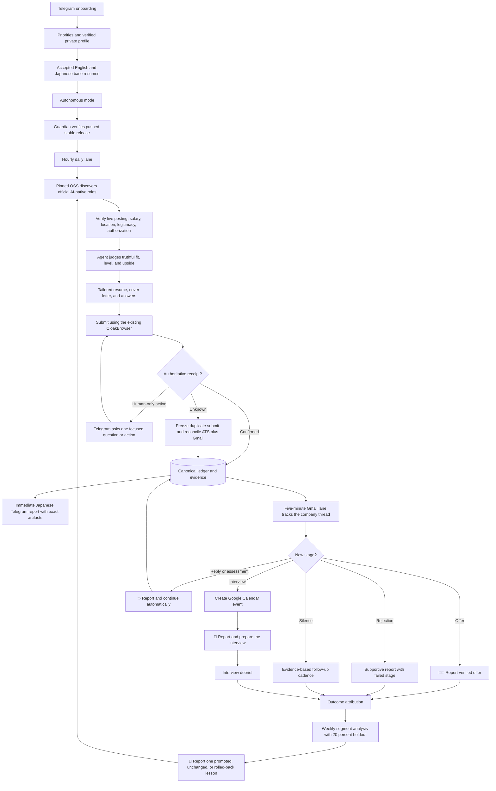

# Job Hunter Local Completion — Progress and Execution Spec

**Branch:** `feat/job-hunter-local-completion-20260802`
**Worktree:** `/Users/anicca/Projects/.worktrees/life-manager/job-hunter-local-completion-20260802`
**Canonical repository:** `https://github.com/Daisuke134/life-manager`  
**Original base:** `origin/main` at `2099a29da61345a120d2f68a819d7b854dcebd83`
**Latest measured origin/main:** `56ebf9c57c51222dd86b548ea2f19a6a78b0f918`
**Scope:** Job Hunter only. Connector, Fundraising, CFO, Crypto, and Gig Work are excluded.  
**Status:** Resume baseline is accepted. Audit is current. Autonomous application,
mail, and learning lanes are stopped and must not be described as healthy or complete.

## 1. Done condition

The Mac mini Job Hunter autonomously discovers high-upside roles, verifies fit,
creates truthful tailored materials, submits eligible applications, captures an
authoritative receipt, follows Gmail replies, updates the company funnel, creates
confirmed interview events in Google Calendar, reports every material change in
natural Japanese on Telegram, and improves its strategy from verified outcomes.

Completion requires all of the following:

- one confirmed real Ashby application and receipt;
- one confirmed real Workday application and receipt;
- official job URL, company, role, compensation, location, and fit thesis;
- exact submitted resume and cover letter for every application;
- every employer question and submitted answer preserved as a private artifact;
- Gmail thread ID bound to the correct application;
- one real interview email converted into a Google Calendar event;
- Telegram message IDs for application, progression, interview, and learning reports;
- daily, inbox, learning, and guardian LaunchAgents healthy on the stable runtime;
- `summary.v2`, Telegram, ledger, and rebuilt event projections agree;
- all Job Hunter tests green; and
- every meaningful change committed and pushed.

## 2. Product outcome

Job Hunter is not a bulk-application counter. It maximizes the probability that the
user reaches a dream job they would gladly accept but may not have discovered or
attempted alone. The initial target is Dais; the local contract must remain
profile-driven so Life Manager can later onboard any person, including users with
limited job-search knowledge or agency.

The objective is an AI-native, AI-maximal, high-growth peer environment where the
user can build and improve advanced AI systems. Foreign-capital companies in Japan,
Tokyo-based global teams, and employers supporting Japan-based remote employment,
EOR, or contracting are preferred. Traditional Japanese employers are not a default
target, but Japanese application documents remain supported when explicitly needed.

For salaried employment, the north-star shorthand `USD 10k/month` means at least
USD 120,000 annualized gross compensation, not monthly recurring revenue. Employer
communication uses annual base and total compensation, never `MRR`. The system
optimizes for a six-figure AI-native offer while preserving the JPY hard floor below.

## 3. Compensation policy — single source of truth

All versioned strategy, private profile validation, ranking, prompts, form answers,
Telegram copy, and learning reports must use one compensation contract:

| Policy | JPY |
|---|---:|
| Hard floor | 7,000,000 |
| Default target | 10,000,000 |
| Priority search range | 10,000,000–30,000,000 |
| Stretch | 30,000,000+ |
| Global north star | USD 120,000+ annualized gross |

Rules:

1. Reject a role only when authoritative compensation proves its maximum is below
   JPY 7,000,000.
2. JPY 7,000,000–9,999,999 is a minimum-acceptable band, not the search target. It
   requires exceptional AI mission, peers, learning value, or strategic upside.
3. Rank JPY 10,000,000+ roles above otherwise equivalent lower-paid roles.
4. Do not anchor a high-paying employer down to JPY 10,000,000. When a role publishes
   a higher range, answer inside that range based on scope and total compensation.
5. The normal answer is: `JPY 10M+ target; flexible based on role scope, total
   compensation, and growth opportunity.`
6. Never infer or disclose current compensation.
7. Unknown compensation is not an automatic rejection; verify it or ask at the
   appropriate hiring stage.
8. Foreign-currency offers are compared in their published currency. Any JPY
   conversion records the rate source and observation time; an unstamped conversion
   cannot reject a role.

## 4. Location, travel, citizenship, clearance, and start date

- Tokyo on-site or hybrid is eligible.
- Japan-remote is eligible.
- Global remote is eligible when Japan-based employment, EOR, or contracting is
  supported.
- Domestic and international travel are positive preferences, including roles with
  frequent client-site travel.
- Verified Japanese citizenship satisfies a Japanese-citizenship requirement.
- Japanese citizenship does not prove possession of a named security clearance.
- A clearance requirement is not an automatic rejection when the user may undergo
  the employer or government clearance process.
- Answer `currently holds clearance` only from a verified private fact. Otherwise
  preserve `unknown` and escalate only if the form cannot be answered truthfully.
- Availability policy must use the private profile. Current owner direction is an
  autumn start, with employer notice lead time handled truthfully; no exact date is
  invented.

## 5. Autonomy contract

### 5.1 Default behavior

The default is autonomous application, not approval-before-submit.

Once base resumes and candidate facts are accepted, Job Hunter:

1. discovers and verifies an official job;
2. evaluates compensation, location, experience level, work authorization, posting
   legitimacy, and expiry;
3. creates a job-specific resume, cover letter, and answer set;
4. validates every claim against private fact IDs;
5. submits through the existing CloakBrowser;
6. records an authoritative receipt or `submit_unknown`;
7. reports the result and exact artifacts on Telegram; and
8. follows all later email and interview stages automatically.

There is no routine `Apply / Skip / Edit` approval gate. The user may have many
applications and offers and choose among verified outcomes later.

Owner-declared application history is authoritative even when an old external
application has no ATS receipt in the local ledger. OpenAI, Anthropic, and Cursor are
currently company-level paused as already applied: Job Hunter must persist those
three owner declarations, suppress every automatic application to those companies
across role aliases and ATS URLs, and report the suppression reason. A later explicit
owner instruction may remove a company pause. URL-only or title-only dedup remains in
force for every other employer.

### 5.2 Minimal human-only boundary

Job Hunter asks the user only when a truthful, authorized completion is impossible
without personal action or missing private context:

- video recording or live interview;
- identity verification, signature, or biometric step;
- CAPTCHA that cannot be completed through the authorized existing session;
- unknown legal, clearance-held, current-compensation, reference, or sensitive
  personal answer;
- proctored/live assessment or assessment with prohibited/unspecified AI policy;
- offer acceptance or binding employment agreement.

The Telegram request must contain one question, enough context to decide, the
official link, and compact buttons where supported. After the answer, Job Hunter
continues and reports the authoritative outcome. It must not make the user repeat
facts already stored in the private profile.

### 5.3 Representation policy

Routine applications and recruiter correspondence use the user's natural first
person. They do not insert unsolicited statements such as `I am an AI` or `an AI
assistant sent this`. They also never fabricate experience, impersonate the user in
identity-bound interviews or videos, violate assessment rules, or give a false answer
when an employer directly requires disclosure.

## 6. Resume and artifact contract

### 6.1 Base resume onboarding

Before autonomous application begins for a profile, Telegram delivers each base
resume for review in the user's preferred languages. The user corrects the base once;
future job-specific variants change emphasis and ordering, never facts.

The accepted Dais baseline is recorded in
`~/.local/share/anicca/job-search/materials/baseline.v1.json`:

| Variant | SHA-256 | Telegram message ID |
|---|---|---:|
| English Applied AI / Agent Engineer | `31d8ca96a396526d23a8a4de4dcffdb8cc773cd7ff43db04e52a0e4c35e2d21e` | 6119 |
| English AI Product / Solutions | `2e3ed9c27c7c4abc6dc6ff478c5718821d3d4ad4a5034c99f808841f41a1cd88` | 6120 |
| Japanese 履歴書, no photograph | `e23efc2c9c09e0780a6dcdcf92c1487e6beafb5880ebc2f5dd77da54c67dd5d4` | 6121 |
| Japanese 職務経歴書 | `13e4e3a78152182a7dad411f00b3846150151721396e16eefaefe7548edd94b9` | 6122 |

The historical 6084–6086 artifacts are superseded and must never be selected for a
new application. The accepted PDFs were also re-sent on request as Telegram messages
8961–8964. Production routing continues to use the stable `master`, `business`, and
`japan` filenames, whose current bytes match the accepted hashes above.

### 6.2 Per-application immutable dossier

Every application stores and links:

- official posting URL and captured posting;
- company, role, compensation, location, work mode, and source;
- fit thesis, verified strengths, honest gaps, and rejection/escalation reasons;
- submitted resume path and SHA-256;
- submitted cover-letter path and SHA-256;
- every application question and exact submitted answer;
- ATS snapshot and submission receipt;
- Gmail thread and message IDs;
- stage timeline, interview Calendar event ID, follow-ups, and outcome;
- strategy generation used for the decision.

No receipt means no `application completed` claim.

### 6.3 Language routing

- English or foreign-capital role: English engineering or business resume plus an
  English job-specific cover letter.
- Japanese role that requests Japanese documents: Ministry of Health, Labour and
  Welfare style `履歴書` plus a separate job-specific `職務経歴書`.
- Employer language and requested document types control routing, not a person's
  name, nationality, or company origin.
- The Dais Japanese 履歴書 does not include a photograph. Document date, motivation,
  and preference fields are included only when required by the selected official
  format or employer.

### 6.4 Dais base-resume correction contract

This gate is complete for Dais. The corrected base resumes were rendered, visually
inspected, delivered to Telegram, and accepted as the content-addressed baseline.
Autonomous submission may use only that baseline plus truthful job-specific changes;
historical 6084–6086 artifacts remain prohibited.

#### Verified timeline and naming

The first occurrence uses the full organization name followed by its abbreviation.
Later occurrences may use the abbreviation. Employment, client/deployment context,
research affiliation, education, internship, and independent work remain separate.

| Period | Resume identity |
|---|---|
| 2020–2024 | Keio University — B.A. in Political Science |
| 2021-01–2022-01 | A10 Lab Inc. — Marketing Intern |
| 2024-04–2026-04 | Nara Institute of Science and Technology (NAIST), with research at Advanced Telecommunications Research Institute International (ATR) |
| 2025-04–Present | Mitsubishi UFJ Information Technology, Ltd. (MUIT) — Applied AI / AI agent work |

The resume must never state or imply that Dais is or was employed by MUFG. MUFG Bank
appears as the owner and operating context of the internal CRM into which Dais
contributed through his employment at MUIT.
Headings such as `MUIT / MUFG` are forbidden.

#### MUIT and ICLR 2026 narrative

MUIT is the primary professional experience. A reader is assumed to know nothing
about MUIT, the internal project, or Agentforce. The resume therefore defines
Agentforce on first use as Salesforce's platform for building and operating AI
agents, explains the enterprise-CRM users and purpose, and avoids unexplained product
jargon.

The CRM deployment, Databricks observability workflow, prompt tuning, context
engineering, and relationship-manager summaries are parts of one approximately
year-long Agentforce deployment project. They must never be presented as unrelated
projects. ICLR 2026 is a separate MUIT achievement.

The base claim set must capture and preserve:

- deployment and prompt tuning of AI agents in MUFG Bank's internal CRM;
- company-information summarization for relationship-manager workflows;
- an observability workflow/tool built in Databricks for a CRM Agentforce agent;
- use of Databricks Genie Code to analyze agent-output logs and improve agent
  effectiveness;
- contribution through MUIT to Japan's first production deployment of Agentforce for
  Financial Services by a financial institution; and
- participation in ICLR 2026 in Rio de Janeiro as a MUIT achievement, synthesis of
  frontier-AI research for an internal executive briefing, and communication of the
  findings through MUIT's official two-part YouTube report.

`executive briefing` or `senior executives` is used unless the verified private fact
records the exact audience as C-suite. Attendance, contribution, and communication
are strong claims; sole ownership, sole deployment leadership, and invented impact
numbers are forbidden.

Approved English content direction, subject to fact-ledger validation:

```text
Mitsubishi UFJ Information Technology, Ltd. (MUIT)
Applied AI / AI Agent Engineering
Tokyo, Japan | Apr 2025–Present

Enterprise CRM AI Agent Deployment

• Contributed to Japan's first production deployment by a financial institution of
  Salesforce Agentforce—a platform for building and operating AI agents—integrating
  agent capabilities into MUFG Bank's internal CRM system used by sales
  professionals, through his role at MUIT.
• Built an observability workflow in Databricks to analyze the agents' inputs,
  outputs, and responses to sales professionals. Used Genie Code to investigate
  behavior, identify response-quality issues, and support improvements in agent
  effectiveness.
• Supported prompt tuning and context engineering for the deployed AI agents,
  including agents that generate company-information summaries for relationship
  managers.

ICLR 2026 Research Communication

• Represented MUIT at ICLR 2026 in Rio de Janeiro; synthesized frontier-AI research
  for an internal executive briefing and presented key findings through MUIT's
  official two-part conference report.

  ICLR 2026 Conference Report
```

The final line is a tappable text link to the user-specified latter-part YouTube URL.
The visible label must not say `Watch`, `YouTube`, `Part 2`, or `latter part`; the
destination alone identifies the linked video.

Approved Japanese content direction, subject to the same validation:

```text
三菱UFJインフォメーションテクノロジー株式会社（MUIT）
応用AI・AIエージェント関連業務
2025年4月〜現在

社内CRMへのAIエージェント導入プロジェクト

・AIエージェントを構築・運用するSalesforceのプラットフォーム
  「Agentforce」を、三菱UFJ銀行の営業担当者が利用する社内CRMへ導入する
  プロジェクトにMUITの担当者として参画。金融機関として国内初となる
  本番導入に貢献。
・AIエージェントへの入力、生成された回答、営業担当者への回答内容を分析する
  オブザーバビリティ基盤をDatabricks上で構築。Genie Codeを活用して挙動や
  回答品質の問題を調査し、エージェントの有効性改善を支援。
・企業情報を営業担当者向けに要約する機能を含むAIエージェントについて、
  プロンプト調整とコンテキストエンジニアリングを支援。

ICLR 2026の調査・社内外発信

・MUITの業務としてブラジル・リオデジャネイロで開催されたICLR 2026に参加。
  最先端AI研究を整理して経営層向けに社内報告し、MUIT公式の前編・後編
  カンファレンスレポートを通じて社外にも発信。

  ICLR 2026参加レポート
```

The Japanese link label follows the same rule: it links to the user-specified
latter-part video but does not display `後編`, `YouTube`, or an imperative CTA.

#### English resume information architecture

The English engineering and business variants are one-page, single-column,
ATS-readable application resumes for an early-career candidate. Age, birth date,
photograph, marital status, and current salary are excluded.

Order:

1. name, role-specific headline, Tokyo/Japan, email, LinkedIn, GitHub profile, and a
   compact `ICLR 2026 Conference Report` link;
2. two-line role-specific summary;
3. professional experience, led by MUIT and followed by the A10 Lab internship;
4. education and research: NAIST/ATR and Keio with explicit dates;
5. selected independent projects;
6. compact skills and languages.

The header does not contain a generic `Portfolio` link, a standalone Life Manager
link, or an Anicca link. Project links live next to their projects. The direct ICLR
report appears once in the compact header and again as `ICLR 2026 Conference Report`
inside the MUIT achievement; both point to the user-specified latter-part video. A
general portfolio may appear only in the independent-projects section as `More
projects` when space and ATS extraction remain clean.

Engineering summary direction:

```text
Applied AI engineer at Mitsubishi UFJ Information Technology with experience
deploying and observing AI agents in a regulated banking environment. Combines
enterprise AI delivery, agentic product development, neuroscience/ML research, and
bilingual Japanese-English communication.
```

Business/solutions summary direction:

```text
AI solutions and product professional at Mitsubishi UFJ Information Technology,
translating frontier AI research into regulated enterprise delivery, customer
workflows, and clear executive communication in Japanese and English.
```

#### Independent projects and links

Independent work comes after professional experience and education/research. It is
not presented as employment. Project names own their links:

```text
Life Manager — Autonomous Personal Operations Agent
Web: https://aniccaai.com/life-manager
Source: https://github.com/Daisuke134/life-manager

Built an open-source, local-first agent system that coordinates calendar, commute,
phone, Telegram, and life workflows, with persistent scheduling and verified
side-effect handling.
```

```text
Anicca — iOS Affirmation App
Product: https://aniccaai.com/affirmation-app
App Store: https://apps.apple.com/jp/app/id6755129214

Built and shipped a mobile affirmation app with 45+ ratings and a 4.5/5 rating.
```

The Anicca rating statement is an owner-verified resume fact. Use `45+ ratings` and
`4.5/5 rating` as provided; do not spend runtime or owner time re-searching it during
base-resume generation. The product link is
`https://aniccaai.com/affirmation-app`; the App Store link remains beside it.

#### Japanese document architecture

Japanese applications that request domestic-format documents receive two separate
artifacts:

1. `履歴書` based on the Ministry of Health, Labour and Welfare A4 example, containing
   chronological education/employment, qualifications, language, motivation, and
   applicant preferences as required; and
2. `職務経歴書`, normally one to two pages, containing professional summary, MUIT
   achievements including ICLR 2026, NAIST/ATR research, verified skills, independent
   projects, A10 Lab internship, and role-specific self-promotion.

The Japanese chronology uses the full legal employer name and never lists MUFG as an
employer. The English resume excludes age; the Japanese 履歴書 handles birth date and
photo only under the selected official/employer document contract.

#### Full base-resume content blueprint

The renderer owns layout, but the following is the complete approved information
architecture. Contact and profile URLs are resolved from the private profile at
render time and are not duplicated in this versioned document.

**English Applied AI / Agent Engineer base (one page)**

1. Header: `Daisuke Narita | Applied AI & Agent Engineer | Tokyo, Japan`, followed by
   private-profile email, LinkedIn, GitHub, and `ICLR 2026 Conference Report`.
2. Summary:

   ```text
   Applied AI engineer at Mitsubishi UFJ Information Technology with experience
   deploying and observing AI agents in a regulated banking environment. Combines
   enterprise AI delivery, agentic product development, neuroscience/ML research,
   and bilingual Japanese-English communication.
   ```

3. Experience:
   - the complete MUIT `Enterprise CRM AI Agent Deployment` and `ICLR 2026 Research
     Communication` content defined above;
   - `A10 Lab Inc. — Marketing Intern | Jan 2021–Jan 2022`: managed a JPY 20M
     campaign budget, reduced CPA by 10%, and achieved record paid acquisition.
4. Education and research:
   - `Nara Institute of Science and Technology (NAIST) | Apr 2024–Apr 2026`:
     master's research using EEG and machine learning to detect mind wandering;
     research conducted and presented at Advanced Telecommunications Research
     Institute International (ATR); founded a weekly community for applying Claude
     Code, Codex, Cursor, and AI-agent workflows to research and daily work;
   - `Keio University | 2020–2024`: B.A. in Political Science.
5. Independent projects:
   - `Life Manager — Autonomous Personal Operations Agent` with
     `https://aniccaai.com/life-manager` and
     `https://github.com/Daisuke134/life-manager`: an open-source, local-first agent
     system coordinating calendar, commute, phone, Telegram, and life workflows with
     persistent scheduling and verified side-effect handling;
   - `Anicca — Mobile Affirmation App` with
     `https://aniccaai.com/affirmation-app` and its App Store link: built and shipped
     a mobile affirmation app with 45+ ratings and a 4.5/5 rating.
6. Skills and languages:
   - skills are generated only from approved facts and include AI agents,
     Agentforce, prompt tuning, context engineering, Databricks, Genie Code,
     Python/ML where supported, Swift/iOS, observability, and CRM workflows;
   - Japanese native; English TOEFL iBT 96 and Duolingo English Test 140; Spanish
     DELE B1.

The business/solutions English variant uses the same chronology, facts, links, and
projects. It changes only the headline, two-line summary, bullet ordering, and
role-relevant emphasis; it may not create a separate factual baseline.

**Japanese 履歴書 (separate official-style artifact)**

1. date, name, contact details, and birth date as required by the selected
   official/employer contract, all sourced from the private profile; no photograph;
2. chronological education and employment:
   - 2020–2024 慶應義塾大学 法学部政治学科;
   - 2021年1月–2022年1月 株式会社A10 Lab マーケティングインターン;
   - 2024年4月–2026年4月 奈良先端科学技術大学院大学, with ATR research
     described as a research affiliation rather than employment;
   - 2025年4月–現在 三菱UFJインフォメーションテクノロジー株式会社;
3. qualifications and languages from approved private facts;
4. role-specific 志望動機 generated only for a selected employer; and
5. 本人希望欄 containing only truthful job-specific constraints, never compensation
   or unsupported preferences by default.

**Japanese 職務経歴書 (one to two pages)**

1. Header: `成田大祐 | 応用AI・AIエージェントエンジニア | 東京`, followed by
   private-profile contact details and `ICLR 2026参加レポート`.
2. 職務要約:

   ```text
   三菱UFJインフォメーションテクノロジーにて、三菱UFJ銀行の社内CRMへ
   AIエージェントを導入するプロジェクトに従事。AIエージェントの導入支援、
   プロンプト・コンテキスト設計、Databricks上のオブザーバビリティ基盤構築に
   加え、AI/機械学習研究、個人プロダクト開発、日英での技術発信経験を持つ。
   ```

3. 職務経歴:
   - the complete MUIT `社内CRMへのAIエージェント導入プロジェクト` and
     `ICLR 2026の調査・社内外発信` content defined above;
   - `株式会社A10 Lab — マーケティングインターン | 2021年1月–2022年1月`:
     2,000万円の
     広告予算を運用し、CPAを10%削減、有料獲得数の過去最高を達成。
4. 研究・学歴:
   - 奈良先端科学技術大学院大学でEEGと機械学習によるマインドワンダリング
     検出を研究し、ATRで研究・発表を実施;
   - Claude Code、Codex、Cursor、AIエージェント活用を扱う週次コミュニティを
     設立;
   - 慶應義塾大学 法学部政治学科卒業。
5. 個人開発:
   - Life Manager with both web and GitHub links and the same approved description;
   - Anicca with product/App Store links and the owner-verified `45件以上、評価4.5/5`.
6. 活かせるスキル・語学 and job-specific 自己PR use only approved facts and the
   same language scores as the English base.

#### Resume acceptance gate

Each corrected artifact must pass all of the following before autonomous submission:

- all claims map to approved private fact IDs and exact source/evidence class;
- organization names, dates, employment/affiliation types, and chronology agree;
- MUIT employment and MUFG deployment context are unambiguous;
- ICLR 2026 is prominent under MUIT and its public URL resolves;
- independent projects appear below professional experience and education/research;
- project links resolve and the generic header portfolio link is absent;
- English output is one page, single-column, and ATS text extraction is complete;
- Japanese 履歴書 and 職務経歴書 are separate and match the official routing policy;
- unsupported superlatives, sole-ownership wording, age emphasis, secrets, and
  private-only links are absent;
- visual inspection confirms hierarchy, line wrapping, whitespace, and link labels;
- the exact PDFs are delivered to Telegram with message IDs; and
- the accepted SHA-256 values become the only base inputs for future tailoring.

## 7. Telegram product UX

Telegram is the proactive command center. Messages are concise, emotional, natural
Japanese for a non-technical user. Normal copy never exposes runner names, exit
codes, bounded/none wording, internal hashes, secrets, or implementation details.

Every link must be tappable Markdown. Private artifacts are sent as Telegram
documents or through an authenticated artifact URL; raw local filesystem paths are
not presented as tappable mobile links.

### 7.1 Reporting cadence

- **First daily wake:** one `🌅 今日の求人活動` digest with current pipeline,
  prioritized roles, salary/location, and the actions Job Hunter will take.
- **Application work begins:** one `🔎 応募準備中` update only after an eligible
  official posting and truthful material route have been selected. It names the
  company, role, compensation evidence, location, fit thesis, resume variant, and
  any questions being prepared. It is a report, not an approval request.
- **Authoritative submission:** immediate confirmed-application report plus the exact
  resume, cover letter or explicit `not requested`, and question/answer artifact.
- **Every actionable mail change:** immediate reply, rejection, assessment,
  interview, offer, or human-only request. Gmail message and thread IDs remain in
  the private ledger, not normal prose unless needed for diagnosis.
- **End of day:** one company-by-company pipeline digest with current stage, where
  progress stopped, next automatic action, and tappable artifacts.
- **Weekly:** funnel conversion, stage failures, source/role/resume/compensation
  segments, follow-ups, and one evidence-backed learning decision.
- **No-change inbox wakes:** record health and checkpoint locally but do not send a
  Telegram message every five minutes. This preserves full observability without
  notification spam.

All reports are event-deduped and store the Telegram message ID in the same durable
outbox/ledger chain as the event being reported.

### 7.2 Confirmed application

```text
💼 Anthropicへの応募が完了しました！

職種: Software Engineer
想定年収: ¥12,000,000〜¥18,000,000
勤務地: 東京 / Hybrid

この求人を選んだ理由:
AI agent開発、TypeScript/Node.js、日英での業務経験が要件に合っています。

[求人ページを開く]
[提出したResume]（Telegram document）
[Cover Letter]（Telegram document、提出欄がなければ「募集側から要求なし」）
[提出した質問と回答]（Telegram document）

応募確認:
企業の応募完了画面で確認しました。これから返信を追跡します。
```

### 7.3 Uncertain submission

```text
⚠️ Sierraへの提出結果を確認しています。

送信操作の後に正式な完了表示が確認できませんでした。
重複応募はせず、企業ページと確認メールを自動で照合します。
```

### 7.4 Selection progression

```text
🎉 OpenAIの一次面接に進みました！

職種: AI Deployment Engineer
面接: 10月14日 14:00
Google Calendar: 登録しました

これは大きな前進です。提出した資料と求人内容を基に、面接準備も始めました。

[提出したResume]
[Cover Letter]
[面接準備を見る]
```

Use emotion appropriate to the event:

- application: `💼` / `✅`;
- recruiter interest: `✨`;
- interview progression: `🎉`;
- offer: `🚀🎊`;
- rejection: supportive and factual, never celebratory or shaming;
- operational delay: calm `⚠️`, with what the system will do next.

The message generator receives structured event facts plus an event-specific tone
contract. A deterministic validator checks that all required facts and links remain
present and that forbidden technical copy and unsupported claims are absent.

### 7.5 Human-only request

```text
🎥 Palantirの応募を続けるため、短い動画が必要です。

質問:
「顧客の難しい課題を技術で解決した経験を教えてください」

あなたの確認済み経験から、90秒の話す内容を用意しました。
[台本を見る] [録画ページを開く]

録画後に「完了」を押してください。残りの応募はJob Hunterが続けます。
```

### 7.6 Weekly pipeline

The weekly report includes a mobile-readable company list with tappable company and
artifact links, role, compensation, location, current stage, elapsed time, next
automatic action, and the stage where an unsuccessful application stopped.
It separately reports discovery, application, confirmed-application, recruiter,
screen, interview, offer, accepted, rejected, withdrawn, and silence stages.

### 7.7 Self-improvement report

Every promoted, rolled-back, or inconclusive strategy decision is reported in plain
language:

```text
🧠 今週の求人活動から学んだこと

英語のAI Solutions求人は、Engineering求人より返信率が高い傾向でした。
次の応募では、金融AIの導入経験と顧客課題の解決をResumeの上部に出します。

まだ応募数が少ないため、給与基準や勤務地条件は変更しません。
```

Learning changes exactly one bounded strategy variable at a time, preserves 20%
holdout, requires authoritative outcome evidence, and rolls back on safety or quality
regression. Telegram reports the evidence class, human-readable conclusion, next
change, and whether the strategy was promoted, unchanged, or rolled back.

## 8. Observable tracker and stage model

The tracker exposes:

- full company list from discovery through final outcome;
- stage conversion and failure reasons;
- immutable application artifacts;
- posting legitimacy and work-authorization findings;
- expired-post verification;
- interview prep and debrief;
- follow-up cadence and silence policy;
- compensation distribution and JPY 10M+ target rate;
- source, role-family, resume variant, and segment Pareto;
- baseline/candidate strategy, 20% holdout, and rollback state;
- last healthy daily/inbox/learning/guardian runs.
- owner-declared company pauses and the evidence/source that created each pause;
- remote-job discovery volume, eligible remote roles, applications, and outcomes.

`summary.v2`, Telegram, and the local Career surface are projections of the same
ledger/event stream and cannot maintain independent truth.

## 9. Stable local runtime — no worktree dependency

LaunchAgents must never point to `.worktrees`, feature branches, or disposable
developer checkouts. They point only to stable launchers under:

```text
~/.local/libexec/anicca/job-search/
```

The stable launcher resolves an atomically switched immutable release:

```text
~/.local/share/anicca/job-search/releases/<git-commit>/
~/.local/share/anicca/job-search/current -> releases/<git-commit>/
```

Deployment sequence:

1. fetch the remote and require the release commit to be reachable from a pushed
   remote ref; an unpushed or unresolvable commit cannot be deployed;
2. build a content-addressed release away from `current` from a clean checkout;
3. verify origin, commit, executable paths, permissions, imports, complete tests,
   private config readability, ledger integrity, Gmail read, and browser ownership;
4. atomically switch `current`;
5. run an isolated non-submitting health pass;
6. retain the last known-good release; and
7. roll back the pointer if activation fails.

This makes worktrees disposable development views rather than runtime dependencies.
Deleting a worktree cannot stop the installed release, and deleting every local
checkout cannot destroy the source because every runnable commit must already exist
on the remote. The release manifest records the life-manager commit, upstream OSS
locks, test evidence, and activation receipt.

The Guardian checks stable launcher existence, release target, expected commit,
LaunchAgent program path, schedule, last success, SQLite integrity, Gmail access,
CloakBrowser owner, Telegram outbox, stale leases, and uncertain side effects. It
repairs only deterministic pre-side-effect failures and sends one low-noise alert
after bounded recovery fails.

## 10. Current verified state

- The required worktree had disappeared again. It has been recreated at the canonical
  path on `feat/job-hunter-local-completion-20260802`; canonical main's unrelated
  Connector edits remain untouched.
- At audit start, the dedicated branch was clean at `c7eb197f0`, 6 commits ahead and
  759 commits behind current `origin/main` (`56ebf9c57`). Its 203-test suite is green.
- The advanced Job Hunter implementation is not on main. Remote branch
  `origin/docs/job-hunter-spec-20260805` contains 364 Job Hunter commits after the
  same `2099a29da` base, includes the accepted resume generation commit, and passes
  564 tests in a clean detached worktree. It is also 759 commits behind current main.
- Stable launchers are installed under `~/.local/libexec/anicca/job-search/`, and
  `current` points to immutable release `f9642b2f...`. Browser and observability
  LaunchAgents are running; daily, inbox, learning, and guardian are not loaded.
- Release `f9642b2f...` claims a commit that is not resolvable in the fetched local
  repository. Its 572-test suite has 6 failures and 3 errors, including application
  reporting, Ashby confirmation semantics, daily canary, and release-context cases.
  It is not a reproducible green release.
- Existing CloakBrowser at `127.0.0.1:9222` is healthy. Thirteen observed tabs belong
  to existing shared work; none is identified as Job Hunter-owned. No tab was closed.
- `gog gmail search` succeeds.
- Production SSOT is `~/.local/state/anicca/job-search/ledger.sqlite3`: 57 applications;
  6 discovered, 8 materials-ready, 1 submit-claimed, 25 submit-unknown, 6 submitted,
  5 email-sent, and 6 rejected.
- There is one authoritative submission confirmation: ElevenLabs, Account Manager —
  Japan, Ashby, Gmail message/thread `19fdb630faed4c2b`. Its submitted resume receipt
  exists and Telegram message 8493 delivered the resume. The receipt has employer
  answers but no cover letter, no evidence bundle, and no complete Japanese dossier
  message, so O2-08 is evidence-incomplete.
- There is no authoritative Workday submission confirmation. Historical Gmail-derived
  funnel rows and `submitted` projections do not substitute for a Workday receipt.
- The ledger has 26 material receipts, 1 Gmail application match, 9 Gmail-derived
  funnel outcomes, 5 application artifacts, 0 evidence bundles, and 0 follow-ups.
- `summary.v2` is stale at 2026-08-08 and cannot be rebuilt: five recorded
  `submitted -> email_sent` events violate the state machine. The last daily and inbox
  logs repeatedly end at this projection failure.
- The current private profile and installed strategy incorrectly enforce JPY 8M as
  the hard floor. This conflicts with the accepted JPY 7M floor / JPY 10M target /
  JPY 30M stretch contract and must be corrected before discovery is evaluated.
- Current confirmed-application Telegram reporting sends only an English resume line.
  It omits compensation, location, fit reason, cover letter, questions/answers, and
  receipt detail required by section 7.
- The four accepted resume PDFs remain content-addressed and available through stable
  production filenames, with original acceptance messages 6119–6122 and latest
  re-send messages 8961–8964.

## 11. Ponytail OSS reuse decision

The recommended architecture keeps the current SQLite ledger, durable Telegram
outbox, stable release launcher, Gmail CLI, and existing CloakBrowser as the control
plane. It does not install another scheduler, browser, tracker database, or web app.

| Source | Verified value | Decision |
|---|---|---|
| [MadsLorentzen/ai-job-search](https://github.com/MadsLorentzen/ai-job-search) | MIT; discovery, fit evaluation, drafter-reviewer CV/cover-letter loop, PDF/ATS inspection, Gmail outcomes, interview prep | Keep the existing pinned fork for LinkedIn/Freehire discovery. Audit the local `82a60300` fork against upstream `45d55a74`; selectively port verified upstream improvements rather than replacing the control plane. |
| [santifer/career-ops](https://github.com/santifer/career-ops) | MIT; official ATS scanning, liveness/repost checks, A–G fit/legitimacy model, reply matching, follow-up cadence, stage analysis, ATS autofill field lessons | Selectively port tests and small modules for liveness, reply/follow-up, stage/Pareto analysis, and Ashby/Workday/Greenhouse form behavior. Preserve license/provenance. Do not adopt its tracker or orchestration wholesale. |
| Other searched n8n/Selenium auto-apply repositories | Duplicate scheduling/browser/tracker stacks with weaker evidence boundaries | Reject. They violate the no-new-browser/no-Docker simplicity target or add a second SSOT without closing a current gap. |

`career-ops` deliberately stops before Submit and requires a human click, so it cannot
provide the autonomous submission contract. Its Markdown/TSV tracker, bundled web UI,
Playwright browser install, cron recipe, and human-in-the-loop default are also not
adopted. Existing Job Hunter already has stronger receipt fencing and durable state.

Agent judgment remains in the model: semantic fit, career upside, truthful emphasis,
and natural-language answers use a right-altitude prompt with grounded examples.
Deterministic code owns user-declared compensation policy, arithmetic, official URL
liveness, receipt evidence, idempotency, page ownership, state transitions, hashes,
and outbox bookkeeping.

## 12. Execution order and remaining TODO

Each item closes RED → GREEN → real verification → this spec update → commit/push
before the next item begins.

- [x] **O2-01** — Recreate and measure the missing dedicated branch/worktree; preserve
  unrelated main changes; measure launchd, browser, Gmail, release, tests, resumes,
  ledger, Telegram, and upstream OSS truth.
- [ ] **O2-02** — Recover the pushed advanced implementation without copying from the
  unresolvable installed release. Rebase the 364 commits from
  `origin/docs/job-hunter-spec-20260805` from base `2099a29da` onto latest
  `origin/main`, replay the dedicated acceptance-spec commit, resolve conflicts, and
  push only the dedicated branch. Verify the accepted resume hashes survive.
- [ ] **O2-03** — Run the complete integrated Job Hunter and agent-runner suites in a
  clean worktree and release-shaped environment. Fix every current installed-release
  failure, including Telegram dossier injection, Ashby authoritative confirmation,
  daily canary artifact creation, and release provenance. No activation until green.
- [x] **O2-04A — first implementation slice: corrected resume baseline** — Build the
  approved one-page English resume and the separate Japanese `履歴書` and
  `職務経歴書`; update the private fact ledger without inventing facts; render PDFs;
  verify ATS extraction, page count, chronology, links, and visual layout; send every
  artifact to Telegram; record message IDs and SHA-256 values here; obtain base
  acceptance before autonomous submission. Owner explicitly waived TDD for resume
  authoring; post-change verification completed with 203 tests green.
- [x] **O2-04B** — Keep reviewable work committed and pushed on the dedicated branch;
  keep this file as progress SSOT and leave the five-phase master spec untouched.
- [ ] **O2-05** — Repair the invalid event history/projection so an email-route event
  can never regress `submitted` to `email_sent`; reconcile all 25 `submit_unknown`
  rows without duplicate applications; persist owner-declared company pauses for
  OpenAI, Anthropic, and Cursor and prove every role/URL alias is suppressed; build
  from the pushed green commit; atomically activate the reproducible stable release;
  load daily/inbox/learning/guardian; then run and observe one real canonical cycle.
- [ ] **O2-06** — TDD the JPY 7M floor / JPY 10M target / JPY 30M stretch policy,
  travel-positive policy, clearance non-rejection contract, and mandatory remote-job
  segment. Reuse pinned OSS/public ATS sources for Japan-remote and globally remote
  roles that can employ or contract a Japan resident; prove discovery and ranking
  with real official-job logs rather than adding a second scheduler or browser.
- [ ] **O2-07** — Complete Guardian, lifecycle closure, event-backed `summary.v2`,
  observable tracker, and section 7 Telegram cadence. Every application report binds
  compensation, location, fit reason, official URL, exact resume, cover letter or
  explicit `not requested`, questions/answers, receipt, and Telegram message IDs.
- [ ] **O2-08** — Close Ashby with one eligible real application whose authoritative
  ATS/Gmail receipt, evidence bundle, exact artifacts, Japanese Telegram dossier, and
  thread/message IDs all satisfy this spec. Existing ElevenLabs evidence is useful
  but insufficient by itself.
- [ ] **O2-09** — Submit one eligible real Workday application and capture the same
  evidence contract.
- [ ] **O2-10** — Prove one real interview email → stage update → Calendar event →
  emotional Telegram progression report → interview prep/debrief flow.
- [ ] **O2-11** — Port only the needed `career-ops` reply/follow-up/liveness/pattern
  lessons and current `ai-job-search` drafting/review improvements; complete trace-linked
  weekly reflection, funnel attribution, segment Pareto, 20% holdout, one-variable
  experiments, promotion, and rollback; deliver the learning report to Telegram.
- [ ] **O2-12** — Keep `ai.anicca.job-search-daily` as the CloakBrowser owner, make
  daily/inbox/learning/guardian healthy, and prove Job Hunter closes only pages it
  created without disturbing shared tabs or contexts.

## 13. Final end-to-end state


