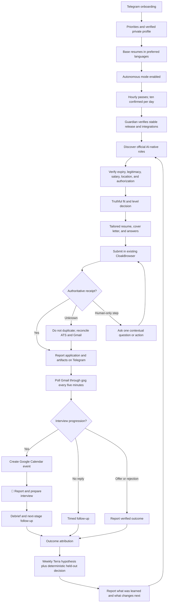

# Job Hunter Local Completion — Progress and Execution Spec

**Branch:** `feat/job-hunter-local-completion-20260802`  
**Worktree:** `/Users/anicca/Projects/.worktrees/life-manager/job-hunter-local-completion-20260802`  
**Canonical repository:** `https://github.com/Daisuke134/life-manager`  
**Base:** `origin/main` at `2099a29da61345a120d2f68a819d7b854dcebd83`  
**Scope:** Job Hunter only. Connector, Fundraising, CFO, Crypto, and Gig Work are excluded.  
**Last updated:** 2026-08-05 JST
**Active atomic task:** `L-13` — stable launcher installation
**Status:** Corrected resume baseline accepted and installed; runtime revival is the
next execution slice. Product contract refreshed for hourly discovery/application
passes, ten confirmed applications per day, JPY 8M–30M compensation, five-minute
Gmail outcome tracking, Luna/Terra routing,
manual/recruiter deduplication, and post-Dais multi-user productization.

## 1. Acceptance criteria — done condition

The Mac mini Job Hunter autonomously wakes every hour, discovers high-upside roles,
verifies fit, creates truthful
tailored materials, submits eligible applications, captures an authoritative
receipt, works toward ten unique confirmed applications per day, polls Gmail through
`gog` every five minutes, updates the company funnel,
creates confirmed interview events in Google Calendar, reports every material
change in natural Japanese on Telegram, and improves its strategy from verified
outcomes.

Completion requires all of the following:

- one confirmed real Ashby application and receipt;
- one confirmed real Workday application and receipt;
- official job URL, company, role, compensation, location, and fit thesis;
- exact submitted resume and cover letter for every application;
- every employer question and submitted answer preserved as a private artifact;
- Gmail thread ID bound to the correct application;
- one real interview email converted into a Google Calendar event;
- Telegram message IDs for application, progression, interview, and learning reports;
- hourly application, five-minute inbox, weekly learning, and guardian
  LaunchAgents healthy on the stable runtime;
- `summary.v2`, Telegram, ledger, and rebuilt event projections agree;
- all Job Hunter tests green; and
- every meaningful change committed and pushed.

## 2. Overview — product outcome

Job Hunter uses high throughput without optimizing vanity volume. It maximizes the probability that the
user reaches a dream job they would gladly accept but may not have discovered or
attempted alone. The initial target is Dais; the local contract must remain
profile-driven so Life Manager can later onboard any person, including users with
limited job-search knowledge or agency.

The objective is an AI-native, AI-maximal, high-growth peer environment where the
user can build and improve advanced AI systems. Foreign-capital companies in Japan,
Tokyo-based global teams, and employers supporting Japan-based remote employment,
EOR, or contracting are preferred. Traditional Japanese employers are not a default
target, but Japanese application documents remain supported when explicitly needed.

## 3. Compensation policy — single source of truth

All versioned strategy, private profile validation, ranking, prompts, form answers,
Telegram copy, and learning reports must use one compensation contract:

| Policy | JPY |
|---|---:|
| Hard floor | 8,000,000 |
| Default target | 10,000,000 |
| Priority search range | 10,000,000–30,000,000 |
| Stretch | 30,000,000+ |

Rules:

1. Reject a role only when authoritative compensation proves its maximum is below
   JPY 8,000,000.
2. JPY 8,000,000–9,999,999 is an acceptable band, not the search target. It requires
   exceptional AI mission, peers, learning value, or strategic upside.
3. Rank JPY 10,000,000+ roles above otherwise equivalent lower-paid roles.
4. Do not anchor a high-paying employer down to JPY 10,000,000. When a role publishes
   a higher range, answer inside that range based on scope and total compensation.
5. The normal answer is: `JPY 10M+ target; flexible based on role scope, total
   compensation, and growth opportunity.`
6. Never infer or disclose current compensation.
7. Unknown compensation is not an automatic rejection; verify it or ask at the
   appropriate hiring stage.
8. Store published base, recruiter-confirmed base, bonus, equity, currency, and
   total compensation separately. Never label a role `six_figure_usd` until the
   verified annual base or explicitly defined total-compensation value is at least
   USD 100,000 using the latest available Bank of Japan 17:00 JST USD/JPY mid rate.
   Persist the BOJ release URL, observation date, rate, source currency, target
   currency, and converted amount with the classification receipt. Source:
   [Bank of Japan — Foreign Exchange Rates (Daily)](https://www.boj.or.jp/en/statistics/market/forex/fxdaily/index.htm).

## 4. Location, travel, citizenship, clearance, and start date

- Tokyo on-site or hybrid is eligible.
- Japan-remote is eligible.
- Global remote is eligible when Japan-based employment, EOR, or contracting is
  supported.
- Domestic and international travel are positive preferences, including roles with
  frequent client-site travel.
- Verified Japanese citizenship satisfies a Japanese-citizenship requirement.
- Japanese citizenship does not prove possession of a named security clearance.
- A clearance requirement is not an automatic rejection when the user may undergo
  the employer or government clearance process.
- Answer `currently holds clearance` only from a verified private fact. Otherwise
  preserve `unknown` and escalate only if the form cannot be answered truthfully.
- Availability policy must use the private profile. Current owner direction is an
  autumn start, with employer notice lead time handled truthfully; no exact date is
  invented.

## 5. Autonomy contract

### 5.1 Default behavior

The default is autonomous application, not approval-before-submit.

Once base resumes and candidate facts are accepted, Job Hunter:

1. discovers and verifies an official job;
2. evaluates compensation, location, experience level, work authorization, posting
   legitimacy, and expiry;
3. creates a job-specific resume, cover letter, and answer set;
4. validates every claim against private fact IDs;
5. submits through the existing CloakBrowser;
6. records an authoritative receipt or `submit_unknown`;
7. reports the result and exact artifacts on Telegram; and
8. follows all later email and interview stages automatically.

There is no routine `Apply / Skip / Edit` approval gate. The user may have many
applications and offers and choose among verified outcomes later.

### 5.2 Minimal human-only boundary

Job Hunter asks the user only when a truthful, authorized completion is impossible
without personal action or missing private context:

- video recording or live interview;
- identity verification, signature, or biometric step;
- CAPTCHA that cannot be completed through the authorized existing session;
- unknown legal, clearance-held, current-compensation, reference, or sensitive
  personal answer;
- proctored/live assessment or assessment with prohibited/unspecified AI policy;
- offer acceptance or binding employment agreement.

The Telegram request must contain one question, enough context to decide, the
official link, and compact buttons where supported. After the answer, Job Hunter
continues and reports the authoritative outcome. It must not make the user repeat
facts already stored in the private profile.

### 5.3 Representation policy

Routine applications and recruiter correspondence use the user's natural first
person. They do not insert unsolicited statements such as `I am an AI` or `an AI
assistant sent this`. They also never fabricate experience, impersonate the user in
identity-bound interviews or videos, violate assessment rules, or give a false answer
when an employer directly requires disclosure.

### 5.4 Three-lane ownership and duplicate prevention

Every application has exactly one durable owner: `agent`, `dais_manual`, or
`recruiter`. Company plus normalized role plus official posting identity is unique
across all owners. A manual or recruiter application is imported before the next
autonomous pass and permanently fences the agent from submitting the same role.

Palantir applications already submitted by Dais are `dais_manual`; Job Hunter tracks
their Gmail outcomes but MUST NOT submit them again. Manual and recruiter lanes do
not need autonomous material generation unless their application record lacks the
exact submitted artifacts.

### 5.5 Relationship and founder-outreach lane

Companies without a verified open role, including the current BlockRun relationship,
do not enter the ATS application lane. They enter a separate `founder_outreach`
pipeline with product research, a truthful working contribution or concrete proposal,
direct outreach, reply tracking, and a verified paid-trial, contract, or employment
outcome. The lane never invents a vacancy and its outcomes are reported separately
from application conversion.

### 5.6 Runtime cadence and model contract

- Application passes run every hour, continuously. Each day targets 100–300 newly
  discovered postings, 30–50 deep evaluations, 15–20 complete application dossiers,
  and exactly ten unique confirmed submissions under the initial hard cap.
- Fewer than ten confirmed submissions is a visible `quota_deficit`, not a successful
  empty pass. The next hourly wake expands sources, queries, and eligible adjacent
  segments while preserving the JPY floor, truth, authorization, expiry, duplicate,
  and human-only boundaries. It never invents a vacancy or submits a bad known fit
  merely to fill quota.
- The daily portfolio is initially two dream/high-touch, five strong-fit, and three
  adjacent-stretch applications. A quota change requires the experiment gate below.
- Gmail polling through `gog` runs every five minutes. A deterministic query and
  immutable-message checkpoint return immediately without a model call when empty.
- `gpt-5.6-luna` handles high-volume, non-side-effect extraction, normalization, and
  preliminary ranking. `gpt-5.6-terra` medium handles deep fit, truthful tailoring,
  employer answers, Gmail interpretation, and any decision leading to an external
  side effect. Terra high handles dream applications and the weekly hypothesis.
- Weekly learning uses Terra to propose exactly one bounded strategy change. Wilson
  interval comparison, minimum sample thresholds, safety rollback, promotion, and
  active-generation switching remain deterministic code; the model never overrides
  those gates.
- A model-route change requires a replay eval on the same immutable snapshots and a
  measured quality, latency, and cost improvement without weakening evidence.

Model-selection source: [OpenAI — Using GPT-5.6](https://developers.openai.com/api/docs/guides/latest-model.md).
The controlling distinction is: `gpt-5.6-terra` balances intelligence and cost,
while `gpt-5.6-luna` serves efficient high-volume workloads. Representative replay
evidence, not the model label, remains the activation gate.

### 5.7 Upstream maximal-reuse contract

Pin [MadsLorentzen/ai-job-search v1.3.0](https://github.com/MadsLorentzen/ai-job-search/releases/tag/v1.3.0)
and record its tag commit, file hashes, and license in
`upstream-adoption.v1.json`. Every upstream component is classified `reuse`, `adapt`,
or `supersede`, with reason, local owner, tests, and last-reviewed upstream commit.

| Upstream capability | Local treatment | Contract |
|---|---|---|
| `/setup` document ingestion and fact grounding | reuse/adapt | Populate the private fact ledger; never copy unverified tailored claims back into profile truth |
| portal discovery, `seen_jobs` dedupe, `/rank` rubric | reuse/adapt | Add Japan/global sources; retain dead-posting, location, language, deadline, and honest-gap gates |
| `/apply` research, drafting, reviewer, ATS checks | reuse/adapt | Keep its grounded artifact chain, then add autonomous CloakBrowser submission and receipts |
| `/outcome`, follow-up, archived posting/CV/letter | reuse/adapt | Project into the event ledger; preserve exact submitted artifacts and authoritative stages |
| `/gmail-sync` message taxonomy | adapt | Replace approval batch with `gog`, immutable IDs, safe automatic transitions, Calendar, and Telegram |
| `/interview` exact-artifact preparation | reuse/adapt | Trigger automatically from verified progression and add Calendar/debrief evidence |
| `/upskill`, `/html-report`, one-way destination sync | reuse/adapt | Feed verified gaps and ledger projections; never make CSV, HTML, or Notion a second SSOT |
| interactive execution and CSV/file state | supersede | Resident launchd loops plus SQLite append-only events, idempotency, leases, and side-effect receipts |

Each upstream release triggers a tag diff, privacy/security review, adoption-manifest
update, ported tests, and same-snapshot regression replay. We reuse upstream workflow
semantics and artifacts maximally, but do not maintain two sources of truth and do
not import interactive assumptions that weaken autonomous evidence fencing.
Primary workflow references: [setup](https://github.com/MadsLorentzen/ai-job-search/blob/v1.3.0/.claude/commands/setup.md),
[rank](https://github.com/MadsLorentzen/ai-job-search/blob/v1.3.0/.claude/commands/rank.md),
[apply](https://github.com/MadsLorentzen/ai-job-search/blob/v1.3.0/.claude/commands/apply.md),
[outcome](https://github.com/MadsLorentzen/ai-job-search/blob/v1.3.0/.claude/commands/outcome.md),
[Gmail sync](https://github.com/MadsLorentzen/ai-job-search/blob/v1.3.0/.claude/commands/gmail-sync.md),
and [interview](https://github.com/MadsLorentzen/ai-job-search/blob/v1.3.0/.claude/commands/interview.md).

### 5.8 Self-improvement contract

The optimization objective is confirmed interview and offer conversion, not raw
submission count. Every application freezes its source, query, role family, fit
score, compensation band, location model, resume variant, message emphasis, model
route, owner, and strategy generation before submission. Only ATS receipts, immutable
Gmail messages, verified manual/recruiter updates, and Calendar/provider receipts may
create outcomes.

The loop is:

1. hourly collection, ranking, dossier generation, and quota execution create
   traceable cohorts;
2. daily monitoring reports throughput, quota deficit, funnel movement, data quality,
   and safety, but cannot promote strategy;
3. weekly Terra analysis cites an immutable cohort and proposes exactly one bounded
   variable change, such as source, role family, resume emphasis, or search query;
4. deterministic code rejects changes that alter truth, compensation floor,
   authorization, duplicate, human-only, or receipt requirements;
5. eligible applications receive a stable randomized 20% baseline holdout and 80%
   candidate assignment recorded before generation;
6. neither arm is judged before at least ten resolved authoritative outcomes; Wilson
   intervals and delayed-outcome windows are calculated by code;
7. promote only when the candidate lower bound exceeds the baseline upper bound;
   otherwise retain the baseline, and roll back immediately on safety regression or
   after three consecutive candidate failures;
8. persist the generation pointer, evidence snapshot, decision receipt, and Telegram
   report so projections can be rebuilt exactly.

The first 50 confirmed applications are calibration, not proof of an offer. At that
checkpoint, interview conversion of at least 10% keeps the mix, at least 20% permits
a bounded experiment up to 15/day, and below 5% forces source/segment/material
diagnosis before any volume increase. Submission-only or unresolved cohorts never
justify a promotion.

## 6. Resume and artifact contract

### 6.1 Base resume onboarding

Before autonomous application begins for a profile, Telegram delivers each base
resume for review in the user's preferred languages. The user corrects the base once;
future job-specific variants change emphasis and ordering, never facts.

Current Dais base artifacts:

| Variant | Private path | Telegram message ID |
|---|---|---:|
| English Applied AI / Agent Engineer | `~/.local/share/anicca/job-search/materials/master/Daisuke_Narita_AI_Resume.pdf` | 6084 |
| English AI Product / Solutions / Business | `~/.local/share/anicca/job-search/materials/business/Daisuke_Narita_AI_Business_Resume.pdf` | 6085 |
| Japanese AI work history | `~/.local/share/anicca/job-search/materials/japan/Daisuke_Narita_Japan_AI_Resume.pdf` | 6086 |

The superseding accepted baseline is recorded in
`~/.local/share/anicca/job-search/materials/baseline.v1.json`:

| Variant | SHA-256 | Telegram message ID |
|---|---|---:|
| English Applied AI / Agent Engineer | `31d8ca96a396526d23a8a4de4dcffdb8cc773cd7ff43db04e52a0e4c35e2d21e` | 6119 |
| English AI Product / Solutions | `2e3ed9c27c7c4abc6dc6ff478c5718821d3d4ad4a5034c99f808841f41a1cd88` | 6120 |
| Japanese 履歴書, no photograph | `e23efc2c9c09e0780a6dcdcf92c1487e6beafb5880ebc2f5dd77da54c67dd5d4` | 6121 |
| Japanese 職務経歴書 | `13e4e3a78152182a7dad411f00b3846150151721396e16eefaefe7548edd94b9` | 6122 |

The historical 6084–6086 artifacts are superseded and must never be selected for a
new application. Production routing continues to use the stable `master`, `business`,
and `japan` filenames, which have been overwritten by the accepted files above.

### 6.2 Per-application immutable dossier

Every application stores and links:

- official posting URL and captured posting;
- company, role, compensation, location, work mode, and source;
- fit thesis, verified strengths, honest gaps, and rejection/escalation reasons;
- submitted resume path and SHA-256;
- submitted cover-letter path and SHA-256;
- every application question and exact submitted answer;
- ATS snapshot and submission receipt;
- Gmail thread and message IDs;
- stage timeline, interview Calendar event ID, follow-ups, and outcome;
- strategy generation used for the decision.

No receipt means no `application completed` claim.

### 6.3 Language routing

- English or foreign-capital role: English engineering or business resume plus an
  English job-specific cover letter.
- Japanese role that requests Japanese documents: Ministry of Health, Labour and
  Welfare style `履歴書` plus a separate job-specific `職務経歴書`.
- Employer language and requested document types control routing, not a person's
  name, nationality, or company origin.
- The Dais Japanese 履歴書 does not include a photograph. Document date, motivation,
  and preference fields are included only when required by the selected official
  format or employer.

### 6.4 Dais base-resume correction contract

Autonomous submission remains disabled until the corrected base resumes are rendered,
visually inspected, delivered to Telegram, and accepted as the new content-addressed
baseline. The current 6084–6086 artifacts are review inputs, not approved submission
defaults.

#### Verified timeline and naming

The first occurrence uses the full organization name followed by its abbreviation.
Later occurrences may use the abbreviation. Employment, client/deployment context,
research affiliation, education, internship, and independent work remain separate.

| Period | Resume identity |
|---|---|
| 2020–2024 | Keio University — B.A. in Political Science |
| 2021-01–2022-01 | A10 Lab Inc. — Marketing Intern |
| 2024-04–2026-04 | Nara Institute of Science and Technology (NAIST), with research at Advanced Telecommunications Research Institute International (ATR) |
| 2025-04–Present | Mitsubishi UFJ Information Technology, Ltd. (MUIT) — Applied AI / AI agent work |

The resume must never state or imply that Dais is or was employed by MUFG. MUFG Bank
appears as the owner and operating context of the internal CRM into which Dais
contributed through his employment at MUIT.
Headings such as `MUIT / MUFG` are forbidden.

#### MUIT and ICLR 2026 narrative

MUIT is the primary professional experience. A reader is assumed to know nothing
about MUIT, the internal project, or Agentforce. The resume therefore defines
Agentforce on first use as Salesforce's platform for building and operating AI
agents, explains the enterprise-CRM users and purpose, and avoids unexplained product
jargon.

The CRM deployment, Databricks observability workflow, prompt tuning, context
engineering, and relationship-manager summaries are parts of one approximately
year-long Agentforce deployment project. They must never be presented as unrelated
projects. ICLR 2026 is a separate MUIT achievement.

The base claim set must capture and preserve:

- deployment and prompt tuning of AI agents in MUFG Bank's internal CRM;
- company-information summarization for relationship-manager workflows;
- an observability workflow/tool built in Databricks for a CRM Agentforce agent;
- use of Databricks Genie Code to analyze agent-output logs and improve agent
  effectiveness;
- contribution through MUIT to Japan's first production deployment of Agentforce for
  Financial Services by a financial institution; and
- participation in ICLR 2026 in Rio de Janeiro as a MUIT achievement, synthesis of
  frontier-AI research for an internal executive briefing, and communication of the
  findings through MUIT's official two-part YouTube report.

`executive briefing` or `senior executives` is used unless the verified private fact
records the exact audience as C-suite. Attendance, contribution, and communication
are strong claims; sole ownership, sole deployment leadership, and invented impact
numbers are forbidden.

Approved English content direction, subject to fact-ledger validation:

```text
Mitsubishi UFJ Information Technology, Ltd. (MUIT)
Applied AI / AI Agent Engineering
Tokyo, Japan | Apr 2025–Present

Enterprise CRM AI Agent Deployment

• Contributed to Japan's first production deployment by a financial institution of
  Salesforce Agentforce—a platform for building and operating AI agents—integrating
  agent capabilities into MUFG Bank's internal CRM system used by sales
  professionals, through his role at MUIT.
• Built an observability workflow in Databricks to analyze the agents' inputs,
  outputs, and responses to sales professionals. Used Genie Code to investigate
  behavior, identify response-quality issues, and support improvements in agent
  effectiveness.
• Supported prompt tuning and context engineering for the deployed AI agents,
  including agents that generate company-information summaries for relationship
  managers.

ICLR 2026 Research Communication

• Represented MUIT at ICLR 2026 in Rio de Janeiro; synthesized frontier-AI research
  for an internal executive briefing and presented key findings through MUIT's
  official two-part conference report.

  ICLR 2026 Conference Report
```

The final line is a tappable text link to the user-specified latter-part YouTube URL.
The visible label must not say `Watch`, `YouTube`, `Part 2`, or `latter part`; the
destination alone identifies the linked video.

Approved Japanese content direction, subject to the same validation:

```text
三菱UFJインフォメーションテクノロジー株式会社（MUIT）
応用AI・AIエージェント関連業務
2025年4月〜現在

社内CRMへのAIエージェント導入プロジェクト

・AIエージェントを構築・運用するSalesforceのプラットフォーム
  「Agentforce」を、三菱UFJ銀行の営業担当者が利用する社内CRMへ導入する
  プロジェクトにMUITの担当者として参画。金融機関として国内初となる
  本番導入に貢献。
・AIエージェントへの入力、生成された回答、営業担当者への回答内容を分析する
  オブザーバビリティ基盤をDatabricks上で構築。Genie Codeを活用して挙動や
  回答品質の問題を調査し、エージェントの有効性改善を支援。
・企業情報を営業担当者向けに要約する機能を含むAIエージェントについて、
  プロンプト調整とコンテキストエンジニアリングを支援。

ICLR 2026の調査・社内外発信

・MUITの業務としてブラジル・リオデジャネイロで開催されたICLR 2026に参加。
  最先端AI研究を整理して経営層向けに社内報告し、MUIT公式の前編・後編
  カンファレンスレポートを通じて社外にも発信。

  ICLR 2026参加レポート
```

The Japanese link label follows the same rule: it links to the user-specified
latter-part video but does not display `後編`, `YouTube`, or an imperative CTA.

#### English resume information architecture

The English engineering and business variants are one-page, single-column,
ATS-readable application resumes for an early-career candidate. Age, birth date,
photograph, marital status, and current salary are excluded.

Order:

1. name, role-specific headline, Tokyo/Japan, email, LinkedIn, GitHub profile, and a
   compact `ICLR 2026 Conference Report` link;
2. two-line role-specific summary;
3. professional experience, led by MUIT and followed by the A10 Lab internship;
4. education and research: NAIST/ATR and Keio with explicit dates;
5. selected independent projects;
6. compact skills and languages.

The header does not contain a generic `Portfolio` link, a standalone Life Manager
link, or an Anicca link. Project links live next to their projects. The direct ICLR
report appears once in the compact header and again as `ICLR 2026 Conference Report`
inside the MUIT achievement; both point to the user-specified latter-part video. A
general portfolio may appear only in the independent-projects section as `More
projects` when space and ATS extraction remain clean.

Engineering summary direction:

```text
Applied AI engineer at Mitsubishi UFJ Information Technology with experience
deploying and observing AI agents in a regulated banking environment. Combines
enterprise AI delivery, agentic product development, neuroscience/ML research, and
bilingual Japanese-English communication.
```

Business/solutions summary direction:

```text
AI solutions and product professional at Mitsubishi UFJ Information Technology,
translating frontier AI research into regulated enterprise delivery, customer
workflows, and clear executive communication in Japanese and English.
```

#### Independent projects and links

Independent work comes after professional experience and education/research. It is
not presented as employment. Project names own their links:

```text
Life Manager — Autonomous Personal Operations Agent
Web: https://aniccaai.com/life-manager
Source: https://github.com/Daisuke134/life-manager

Built an open-source, local-first agent system that coordinates calendar, commute,
phone, Telegram, and life workflows, with persistent scheduling and verified
side-effect handling.
```

```text
Anicca — iOS Affirmation App
Product: https://aniccaai.com/affirmation-app
App Store: https://apps.apple.com/jp/app/id6755129214

Built and shipped a mobile affirmation app with 45+ ratings and a 4.5/5 rating.
```

The Anicca rating statement is an owner-verified resume fact. Use `45+ ratings` and
`4.5/5 rating` as provided; do not spend runtime or owner time re-searching it during
base-resume generation. The product link is
`https://aniccaai.com/affirmation-app`; the App Store link remains beside it.

#### Japanese document architecture

Japanese applications that request domestic-format documents receive two separate
artifacts:

1. `履歴書` based on the Ministry of Health, Labour and Welfare A4 example, containing
   chronological education/employment, qualifications, language, motivation, and
   applicant preferences as required; and
2. `職務経歴書`, normally one to two pages, containing professional summary, MUIT
   achievements including ICLR 2026, NAIST/ATR research, verified skills, independent
   projects, A10 Lab internship, and role-specific self-promotion.

The Japanese chronology uses the full legal employer name and never lists MUFG as an
employer. The English resume excludes age; the Japanese 履歴書 handles birth date and
photo only under the selected official/employer document contract.

#### Full base-resume content blueprint

The renderer owns layout, but the following is the complete approved information
architecture. Contact and profile URLs are resolved from the private profile at
render time and are not duplicated in this versioned document.

**English Applied AI / Agent Engineer base (one page)**

1. Header: `Daisuke Narita | Applied AI & Agent Engineer | Tokyo, Japan`, followed by
   private-profile email, LinkedIn, GitHub, and `ICLR 2026 Conference Report`.
2. Summary:

   ```text
   Applied AI engineer at Mitsubishi UFJ Information Technology with experience
   deploying and observing AI agents in a regulated banking environment. Combines
   enterprise AI delivery, agentic product development, neuroscience/ML research,
   and bilingual Japanese-English communication.
   ```

3. Experience:
   - the complete MUIT `Enterprise CRM AI Agent Deployment` and `ICLR 2026 Research
     Communication` content defined above;
   - `A10 Lab Inc. — Marketing Intern | Jan 2021–Jan 2022`: managed a JPY 20M
     campaign budget, reduced CPA by 10%, and achieved record paid acquisition.
4. Education and research:
   - `Nara Institute of Science and Technology (NAIST) | Apr 2024–Apr 2026`:
     master's research using EEG and machine learning to detect mind wandering;
     research conducted and presented at Advanced Telecommunications Research
     Institute International (ATR); founded a weekly community for applying Claude
     Code, Codex, Cursor, and AI-agent workflows to research and daily work;
   - `Keio University | 2020–2024`: B.A. in Political Science.
5. Independent projects:
   - `Life Manager — Autonomous Personal Operations Agent` with
     `https://aniccaai.com/life-manager` and
     `https://github.com/Daisuke134/life-manager`: an open-source, local-first agent
     system coordinating calendar, commute, phone, Telegram, and life workflows with
     persistent scheduling and verified side-effect handling;
   - `Anicca — Mobile Affirmation App` with
     `https://aniccaai.com/affirmation-app` and its App Store link: built and shipped
     a mobile affirmation app with 45+ ratings and a 4.5/5 rating.
6. Skills and languages:
   - skills are generated only from approved facts and include AI agents,
     Agentforce, prompt tuning, context engineering, Databricks, Genie Code,
     Python/ML where supported, Swift/iOS, observability, and CRM workflows;
   - Japanese native; English TOEFL iBT 96 and Duolingo English Test 140; Spanish
     DELE B1.

The business/solutions English variant uses the same chronology, facts, links, and
projects. It changes only the headline, two-line summary, bullet ordering, and
role-relevant emphasis; it may not create a separate factual baseline.

**Japanese 履歴書 (separate official-style artifact)**

1. date, name, contact details, and birth date as required by the selected
   official/employer contract, all sourced from the private profile; no photograph;
2. chronological education and employment:
   - 2020–2024 慶應義塾大学 法学部政治学科;
   - 2021年1月–2022年1月 株式会社A10 Lab マーケティングインターン;
   - 2024年4月–2026年4月 奈良先端科学技術大学院大学, with ATR research
     described as a research affiliation rather than employment;
   - 2025年4月–現在 三菱UFJインフォメーションテクノロジー株式会社;
3. qualifications and languages from approved private facts;
4. role-specific 志望動機 generated only for a selected employer; and
5. 本人希望欄 containing only truthful job-specific constraints, never compensation
   or unsupported preferences by default.

**Japanese 職務経歴書 (one to two pages)**

1. Header: `成田大祐 | 応用AI・AIエージェントエンジニア | 東京`, followed by
   private-profile contact details and `ICLR 2026参加レポート`.
2. 職務要約:

   ```text
   三菱UFJインフォメーションテクノロジーにて、三菱UFJ銀行の社内CRMへ
   AIエージェントを導入するプロジェクトに従事。AIエージェントの導入支援、
   プロンプト・コンテキスト設計、Databricks上のオブザーバビリティ基盤構築に
   加え、AI/機械学習研究、個人プロダクト開発、日英での技術発信経験を持つ。
   ```

3. 職務経歴:
   - the complete MUIT `社内CRMへのAIエージェント導入プロジェクト` and
     `ICLR 2026の調査・社内外発信` content defined above;
   - `株式会社A10 Lab — マーケティングインターン | 2021年1月–2022年1月`:
     2,000万円の
     広告予算を運用し、CPAを10%削減、有料獲得数の過去最高を達成。
4. 研究・学歴:
   - 奈良先端科学技術大学院大学でEEGと機械学習によるマインドワンダリング
     検出を研究し、ATRで研究・発表を実施;
   - Claude Code、Codex、Cursor、AIエージェント活用を扱う週次コミュニティを
     設立;
   - 慶應義塾大学 法学部政治学科卒業。
5. 個人開発:
   - Life Manager with both web and GitHub links and the same approved description;
   - Anicca with product/App Store links and the owner-verified `45件以上、評価4.5/5`.
6. 活かせるスキル・語学 and job-specific 自己PR use only approved facts and the
   same language scores as the English base.

#### Resume acceptance gate

Each corrected artifact must pass all of the following before autonomous submission:

- all claims map to approved private fact IDs and exact source/evidence class;
- organization names, dates, employment/affiliation types, and chronology agree;
- MUIT employment and MUFG deployment context are unambiguous;
- ICLR 2026 is prominent under MUIT and its public URL resolves;
- independent projects appear below professional experience and education/research;
- project links resolve and the generic header portfolio link is absent;
- English output is one page, single-column, and ATS text extraction is complete;
- Japanese 履歴書 and 職務経歴書 are separate and match the official routing policy;
- unsupported superlatives, sole-ownership wording, age emphasis, secrets, and
  private-only links are absent;
- visual inspection confirms hierarchy, line wrapping, whitespace, and link labels;
- the exact PDFs are delivered to Telegram with message IDs; and
- the accepted SHA-256 values become the only base inputs for future tailoring.

## 7. Telegram product UX

Telegram is the proactive command center. Messages are concise, emotional, natural
Japanese for a non-technical user. Normal copy never exposes runner names, exit
codes, bounded/none wording, internal hashes, secrets, or implementation details.

Every link must be tappable Markdown. Private artifacts are sent as Telegram
documents or through an authenticated artifact URL; raw local filesystem paths are
not presented as tappable mobile links.

### 7.1 Confirmed application

```text
💼 Anthropicへの応募が完了しました！

職種: Software Engineer
想定年収: ¥12,000,000〜¥18,000,000
勤務地: 東京 / Hybrid

この求人を選んだ理由:
AI agent開発、TypeScript/Node.js、日英での業務経験が要件に合っています。

[求人ページを開く]
[提出したResumeを見る]
[Cover Letterを見る]
[提出した質問と回答を見る]

応募確認:
企業の応募完了画面で確認しました。これから返信を追跡します。
```

### 7.2 Uncertain submission

```text
⚠️ Sierraへの提出結果を確認しています。

送信操作の後に正式な完了表示が確認できませんでした。
重複応募はせず、企業ページと確認メールを自動で照合します。
```

### 7.3 Selection progression

```text
🎉 OpenAIの一次面接に進みました！

職種: AI Deployment Engineer
面接: 10月14日 14:00
Google Calendar: 登録しました

これは大きな前進です。提出した資料と求人内容を基に、面接準備も始めました。

[提出したResume]
[Cover Letter]
[面接準備を見る]
```

Use emotion appropriate to the event:

- application: `💼` / `✅`;
- recruiter interest: `✨`;
- interview progression: `🎉`;
- offer: `🚀🎊`;
- rejection: supportive and factual, never celebratory or shaming;
- operational delay: calm `⚠️`, with what the system will do next.

The message generator receives structured event facts plus an event-specific tone
contract. A deterministic validator checks that all required facts and links remain
present and that forbidden technical copy and unsupported claims are absent.

### 7.4 Human-only request

```text
🎥 Palantirの応募を続けるため、短い動画が必要です。

質問:
「顧客の難しい課題を技術で解決した経験を教えてください」

あなたの確認済み経験から、90秒の話す内容を用意しました。
[台本を見る] [録画ページを開く]

録画後に「完了」を押してください。残りの応募はJob Hunterが続けます。
```

### 7.5 Weekly pipeline

The weekly report includes a tappable company table with role, compensation,
location, current stage, elapsed time, next automatic action, and artifact links.
It separately reports discovery, application, confirmed-application, recruiter,
screen, interview, offer, accepted, rejected, withdrawn, and silence stages.

### 7.6 Self-improvement report

Every promoted, rolled-back, or inconclusive strategy decision is reported in plain
language:

```text
🧠 今週の求人活動から学んだこと

英語のAI Solutions求人は、Engineering求人より返信率が高い傾向でした。
次の応募では、金融AIの導入経験と顧客課題の解決をResumeの上部に出します。

まだ応募数が少ないため、給与基準や勤務地条件は変更しません。
```

Learning changes exactly one bounded strategy variable at a time, preserves 20%
holdout, requires authoritative outcome evidence, and rolls back on safety or quality
regression. Telegram reports the evidence class, human-readable conclusion, next
change, and whether the strategy was promoted, unchanged, or rolled back.

## 8. Observable tracker and stage model

The tracker exposes:

- full company list from discovery through final outcome;
- application owner (`agent`, `dais_manual`, or `recruiter`) and duplicate fence;
- stage conversion and failure reasons;
- immutable application artifacts;
- posting legitimacy and work-authorization findings;
- expired-post verification;
- interview prep and debrief;
- follow-up cadence and silence policy;
- compensation distribution and JPY 10M+ target rate;
- source, role-family, resume variant, and segment Pareto;
- baseline/candidate strategy, 20% holdout, and rollback state;
- daily quota target, confirmed count, deficit reason, and last healthy
  application/inbox/learning/guardian runs;
- confirmed-application, recruiter-reply, interview, final-round, offer, and
  acceptance rates with explicit numerators and denominators;
- median time to first reply and interview, verified compensation distribution, and
  the share of offers at or above JPY 8M, JPY 10M, JPY 30M, and verified USD 100K;
- segment breakdown by source, owner, role family, location model, compensation band,
  company stage, resume variant, message emphasis, and strategy generation; and
- founder-outreach activity and paid outcomes in a separate funnel that never
  contaminates ATS application conversion.

`summary.v2`, Telegram, and the local Career surface are projections of the same
ledger/event stream and cannot maintain independent truth.

Gmail is the primary external outcome feed but not the system of record. Every `gog`
message is keyed by immutable Gmail message ID, matched against company, role,
recipient, sender domain, and post-application time, and then appended to the event
ledger. ATS completion evidence, exact submitted artifacts, Calendar IDs, and Gmail
events remain independently auditable.

## 9. Stable local runtime — no worktree dependency

LaunchAgents must never point to `.worktrees`, feature branches, or disposable
developer checkouts. They point only to stable launchers under:

```text
~/.local/libexec/anicca/job-search/
```

The stable launcher resolves an atomically switched immutable release:

```text
~/.local/share/anicca/job-search/releases/<git-commit>/
~/.local/share/anicca/job-search/current -> releases/<git-commit>/
```

Deployment sequence:

1. build a content-addressed release away from `current`;
2. verify origin, commit, executable paths, permissions, imports, private config
   readability, ledger integrity, Gmail read, and browser ownership;
3. atomically switch `current`;
4. run an isolated non-submitting health pass;
5. retain the last known-good release; and
6. roll back the pointer if activation fails.

The Guardian checks stable launcher existence, release target, expected commit,
LaunchAgent program path, schedule, last success, SQLite integrity, Gmail access,
CloakBrowser owner, Telegram outbox, stale leases, and uncertain side effects. It
repairs only deterministic pre-side-effect failures and sends one low-noise alert
after bounded recovery fails.

The stable schedule is an hourly application pass, a five-minute inbox pass, a
weekly learning pass, and a guardian health pass. The ten-confirmed-per-day quota,
portfolio mix, quota deficits, and duplicate fences are ledger-backed across all
wakes. Hourly execution never authorizes duplicate, fabricated, or known-ineligible
submissions.

## 10. As-Is / To-Be

| Concern | As-Is | To-Be |
|---|---|---|
| Runtime | Three installed agents reference a deleted worktree and exit 78 | Stable immutable release and launcher paths |
| Application cadence | One 08:30 daily wake | Hourly continuous pass; ten confirmed/day initial cap |
| Inbox | `gog` works; 15-minute agent exists but runtime path is broken | Healthy five-minute deterministic-first Gmail reconciliation |
| Compensation | Versioned JPY 5.5M floor / JPY 7M target | JPY 8M floor / JPY 10M target / JPY 30M stretch |
| Ownership | Agent applications exist without complete manual/recruiter import | One owner per application and cross-lane duplicate fence |
| Palantir | Dais applied manually; not yet durably fenced | Track outcome only; autonomous resubmission impossible |
| BlockRun | Could be mistaken for an ATS target | Separate founder-outreach funnel; no invented vacancy |
| Models | Daily/inbox use Terra; high-value class routes to Luna | Luna volume prefilter; Terra side-effect quality and weekly hypothesis; deterministic statistics |
| Outcomes | `summary.v1`; zero authoritative funnel outcomes | Event-backed `summary.v2` with reply/interview/final/offer metrics |
| Product | Dais-only local implementation | Dais proof gate, then isolated multi-user Web product |

## 11. Current verified state

- Dedicated worktree and branch created from `origin/main` at `2099a29da`.
- Canonical main working tree contains unrelated Connector edits and remains untouched.
- Fresh baseline: `203 passed, 34 subtests passed`.
- Private profile exists but must be migrated to compensation floor JPY 8M and target
  JPY 10M.
- Versioned strategy still has obsolete JPY 5.5M floor / JPY 7M target.
- Installed daily, inbox, and learning LaunchAgents point to deleted
  `/Users/anicca/anicca-project/.worktrees/job-canonical-merge` paths and exit 78.
- Current `gog gmail search` succeeds.
- Ledger: 5 applications, 2 legacy `submitted`, 3 `submit_unknown`, 0 authoritative
  submission confirmations, 0 funnel outcomes.
- `summary.v1` exists; `summary.v2` is incomplete.
- Ashby confirmed receipt: 0.
- Workday confirmed receipt: 0.
- Palantir was submitted manually by Dais and still needs a durable `dais_manual`
  import and duplicate fence.
- The installed application schedule is still one daily wake; the hourly schedule
  is specified but not implemented.
- The Luna volume/Terra quality route and Terra weekly learning route are specified
  but not implemented in the shared runner.
- Corrected base resumes rendered as four one-page PDFs, visually inspected, selected
  through the production stable filenames, and delivered with Telegram message IDs
  6119–6122. The prior 6084–6086 files are superseded.

## 12. Execution order and remaining TODO

An item is atomic only when it changes one contract and has one independently
observable completion receipt. Every item closes RED → GREEN → real verification →
this spec update → commit/push → Telegram milestone before the next item starts.

### 12.1 Completed foundation

- [x] **F-01** — Create the isolated Job Hunter branch/worktree and record baseline.
- [x] **F-02** — Rebase the isolated branch onto the recorded canonical base.
- [x] **F-03** — Establish the 203-test green baseline.
- [x] **F-04** — Accept the English Applied AI base resume.
- [x] **F-05** — Accept the English AI Product/Solutions base resume.
- [x] **F-06** — Accept the Japanese `履歴書`.
- [x] **F-07** — Accept the Japanese `職務経歴書`.
- [x] **F-08** — Install the four accepted resume hashes as the production baseline.

### 12.2 Local autonomous loop — execute strictly in order

- [x] **L-01** — Pin upstream `ai-job-search` v1.3.0 commit, hashes, and license.
  Receipt: `config/upstream-lock.v1.json`; tag commit `a8a10011126f443e0041bb4924a1106c2f7f7536`;
  tree `dd84a322610becd7c46b74f823d1e4ebc1c8432d`; MIT license content
  SHA-256 `accbf0accb87b7b905dd7ee0c7013075f0453637acf354ddae6fc0e4d8282e8e`;
  `tests.test_upstream_lock` PASS.
- [x] **L-02** — Record every v1.3.0 component as `reuse`, `adapt`, or `supersede` in
  `upstream-adoption.v1.json`. Receipt: 27 explicit decisions (`reuse` 4, `adapt` 14,
  `supersede` 9), each with upstream paths, reason, local contract, and owning atomic
  task; `tests.test_upstream_lock` PASS.
- [x] **L-03** — Diff upstream `master` against v1.3.0 and record candidate changes.
  Receipt: master `fcefb8150fb073ae0d86b5b7a6f09e94aa5976ee` is three commits and
  13 files ahead; language-gate regression tests route to L-06 and robots-aware web
  research routes to L-05–L-10; automatic activation is false;
  `tests.test_upstream_lock` PASS.
- [x] **L-04** — Port the upstream grounded profile-ingestion contract. Receipt:
  document-manifest CLI accepts CV, LinkedIn, diploma, and reference sources; every
  fact preserves source path, SHA-256, and source span; conflicting values fail
  closed; tailored application outputs cannot become profile truth; profile setup
  suite PASS.
- [x] **L-05** — Port the upstream discovery and `seen_jobs` dedupe contract.
  Receipt: default discovery removes Denmark-only and unauthorized LinkedIn
  automation; results persist canonical URL, canonical job ID, and provider;
  cross-provider duplicates collapse to one posting with official-source preference;
  exhausted automation still requests browser fallback; discovery/state suites PASS.
- [x] **L-06** — Port the upstream ranking, veto, deadline, and honest-gap contract.
  Receipt: Job and Evaluation persist language gate/note, deadline, strengths, and
  gaps; language FAIL vetoes, FLAG remains eligible and visible, expired postings
  reject, seven-day deadlines warn, and evidence survives evaluation; ranking suite
  PASS.
- [x] **L-07** — Port the upstream application research and artifact-chain contract.
  Receipt: immutable ledger artifacts bind official posting, company research,
  resume draft, cover-letter draft, and answer draft to one application; each record
  verifies private file permissions and SHA-256, retains approved fact IDs and HTTPS
  source URLs, and rejects update/delete; ledger artifact-chain tests PASS.
- [x] **L-08** — Port the upstream outcome, follow-up, and archive contract. Receipt:
  authoritative outcomes remain immutable; follow-ups become due after ten days,
  stop after two or any outcome, require evidence hashes, and replay idempotently;
  application archive rebuilds artifacts, outcomes, and follow-ups from ledger state;
  ledger suite PASS.
- [x] **L-09** — Port the upstream Gmail classification semantics into `gog` events.
  Receipt: each selected gog message yields one deterministic redacted event keyed by
  immutable message/thread IDs, timestamp, classification, funnel suggestion, and
  evidence SHA-256; English and Japanese confirmation, recruiter, assessment,
  interview, offer, and rejection semantics are covered; raw body is not emitted;
  operations suite PASS.
- [x] **L-10** — Port the upstream interview-preparation contract. Receipt:
  one application ID resolves exactly one archived posting, resume draft, and
  cover-letter draft; current privacy and SHA-256 are reverified, missing,
  ambiguous, unavailable, public, or mutated artifacts fail closed; the resulting
  context exposes provenance rather than artifact contents and has one deterministic
  context SHA-256; interview-prep and full 223-test suites PASS.
- [x] **L-11** — Port the upstream upskill and reporting projections without adding
  a second source of truth. Receipt: ranked score, explicit gaps, and evidence hash
  are fixed once per canonical application in the ledger; the deterministic upskill
  projection deduplicates jobs, weights recorded gaps by fit delta, filters skills
  already present in the supplied profile, counts missing historical gap data without
  inference, and hashes the rebuilt result; source rows are immutable and no CSV,
  Markdown, HTML, or destination becomes authoritative; full 225-test suite PASS.
- [x] **L-12** — Build a content-addressed immutable local release. Receipt:
  commit `fe5f09e069e365e3599a9fae67a0cbf7ed6ecf62` produced 130 normalized
  entries with archive SHA-256
  `0460f170489e79b308e0a31ef8df9d9d031a1e55a77c43eb99e947e4b8dbcc4b`;
  two independent builds are byte-identical, checksum and manifest commit verify,
  private/profile/database files are absent, release imports pass, and the extracted
  release under the stable data root contains zero user-writable paths; `current`
  remains untouched until L-17; release E2E and full 225-test suite PASS.
- [ ] **L-13** — Install the stable launcher under `~/.local/libexec/anicca/job-search/`.
- [ ] **L-14** — Point the application LaunchAgent at the stable launcher.
- [ ] **L-15** — Point the inbox LaunchAgent at the stable launcher.
- [ ] **L-16** — Point the learning LaunchAgent at the stable launcher.
- [ ] **L-17** — Activate the immutable release through the stable pointer.
- [ ] **L-17A** — Prove rollback to the last-known-good release.
- [ ] **L-18** — Migrate the private profile to the JPY 8M hard floor.
- [ ] **L-19** — Migrate the strategy to the JPY 10M target and JPY 30M stretch.
- [ ] **L-20** — Implement timestamped BOJ-rate USD 100K classification.
- [ ] **L-21** — Implement travel-positive ranking.
- [ ] **L-22** — Replace blanket clearance rejection with truthful clearance-state
  handling.
- [ ] **L-23** — Configure the application LaunchAgent for a 3,600-second interval.
- [ ] **L-24** — Configure the inbox LaunchAgent for a 300-second interval.
- [ ] **L-25** — Enforce the initial ten-confirmed-applications daily cap.
- [ ] **L-26** — Enforce the daily 2 dream / 5 strong-fit / 3 adjacent portfolio.
- [ ] **L-27** — Persist a `quota_deficit` event when fewer than ten submissions are
  confirmed.
- [ ] **L-28** — Expand sources and queries after a quota deficit without weakening
  any hard gate.
- [ ] **L-29** — Add `agent`, `dais_manual`, and `recruiter` as exclusive owners.
- [ ] **L-30** — Enforce cross-owner posting duplicate prevention.
- [ ] **L-31** — Import the existing Palantir application as `dais_manual`.
- [ ] **L-32** — Create the independent BlockRun `founder_outreach` funnel.
- [ ] **L-33** — Route extraction, normalization, and prefilter work to Luna.
- [ ] **L-34** — Deny Luna authority for browser submission or outbound messages.
- [ ] **L-35** — Route deep fit, tailoring, and employer answers to Terra medium.
- [ ] **L-36** — Route dream applications and weekly hypotheses to Terra high.
- [ ] **L-37** — Replay Luna/Terra routes on one immutable snapshot.
- [ ] **L-37A** — Activate only the route map that passed the replay gate.
- [ ] **L-38** — Append immutable Gmail message IDs through the deterministic `gog`
  checkpoint.
- [ ] **L-39** — Match Gmail events to applications or fail closed as ambiguous.
- [ ] **L-40** — Persist exact submitted resume, cover letter, and employer answers
  for each application.
- [ ] **L-41** — Rebuild `summary.v2` exclusively from the event ledger.
- [ ] **L-42** — Expose explicit funnel numerators and denominators in the tracker.
- [ ] **L-43** — Render the Telegram daily pipeline projection from `summary.v2`.
- [ ] **L-44** — Validate event-specific Telegram tone without changing event facts.
- [ ] **L-45A** — Implement the Guardian release-health check.
- [ ] **L-45B** — Implement the Guardian schedule-health check.
- [ ] **L-45C** — Implement the Guardian ledger-health check.
- [ ] **L-45D** — Implement the Guardian Gmail-health check.
- [ ] **L-45E** — Implement the Guardian browser-owner health check.
- [ ] **L-45F** — Implement the Guardian Telegram-outbox health check.
- [ ] **L-46** — Bound Guardian auto-recovery to deterministic pre-side-effect faults.
- [ ] **L-47** — Make `ai.anicca.job-search-daily` the sole CloakBrowser owner.
- [ ] **L-48** — Prove Job Hunter closes only browser pages it created.
- [ ] **L-49** — Submit one eligible real Ashby application and store its
  authoritative receipt.
- [ ] **L-50** — Deliver the Ashby application artifacts and receipt to Telegram.
- [ ] **L-51** — Submit one eligible real Workday application and store its
  authoritative receipt.
- [ ] **L-52** — Deliver the Workday application artifacts and receipt to Telegram.
- [ ] **L-53** — Convert one real interview Gmail message into a verified stage event.
- [ ] **L-54** — Create the corresponding Google Calendar event with timezone,
  duration, and meeting link.
- [ ] **L-55** — Send the interview progression and Calendar receipt to Telegram.
- [ ] **L-56** — Generate the interview pack from the exact submitted artifacts.
- [ ] **L-57** — Persist the post-interview debrief and next-stage action.
- [ ] **L-58** — Assign every eligible application to stable 20% baseline or 80%
  candidate cohorts before material generation.
- [ ] **L-59A** — Calculate recruiter-reply conversion from authoritative outcomes.
- [ ] **L-59B** — Calculate interview conversion from authoritative outcomes.
- [ ] **L-59C** — Calculate final-round conversion from authoritative outcomes.
- [ ] **L-59D** — Calculate offer conversion from authoritative outcomes.
- [ ] **L-60** — Generate one trace-linked Terra hypothesis per weekly run.
- [ ] **L-61** — Reject a hypothesis that changes more than one strategy variable.
- [ ] **L-62** — Gate promotion with minimum samples and Wilson interval separation.
- [ ] **L-63** — Roll back immediately on safety regression or three candidate
  failures.
- [ ] **L-64** — Deliver the weekly promote/hold/rollback decision receipt to
  Telegram.
- [ ] **L-65** — Prove application, inbox, learning, and Guardian LaunchAgents are
  healthy simultaneously.
- [ ] **L-66** — Freeze the Dais local product contract after real Ashby, Workday,
  Gmail, Calendar, Telegram, and interview receipts all pass.

### 12.3 Multi-user Web product — begins only after L-66

- [ ] **W-01** — Define a tenant-scoped profile boundary.
- [ ] **W-02** — Define tenant-scoped credential and OAuth boundaries.
- [ ] **W-03** — Define tenant-scoped browser ownership and session boundaries.
- [ ] **W-04A** — Define the tenant-scoped ledger boundary.
- [ ] **W-04B** — Define the tenant-scoped artifact boundary.
- [ ] **W-04C** — Define the tenant-scoped outbox boundary.
- [ ] **W-04D** — Define the tenant-scoped audit boundary.
- [ ] **W-05** — Prove two-tenant isolation across all private resources.
- [ ] **W-06** — Build Web onboarding for verified candidate facts.
- [ ] **W-07** — Build Web onboarding for compensation and location policy.
- [ ] **W-08** — Build Web Gmail OAuth onboarding.
- [ ] **W-09** — Build Web base-resume review and acceptance.
- [ ] **W-10** — Build Web autonomy-boundary acceptance.
- [ ] **W-11** — Build Web manual/recruiter application import.
- [ ] **W-12** — Run one durable scheduler lease per tenant.
- [ ] **W-13** — Run one isolated browser owner per tenant.
- [ ] **W-14** — Enforce global capacity limits without cross-tenant state sharing.
- [ ] **W-15** — Make every tenant side effect idempotent and receipt-backed.
- [ ] **W-16** — Build the Web company and stage pipeline from ledger projections.
- [ ] **W-17** — Add application artifact and Gmail evidence views.
- [ ] **W-18A** — Add the interview view.
- [ ] **W-18B** — Add the offer view.
- [ ] **W-18C** — Add the funnel-metrics view.
- [ ] **W-18D** — Add the system-health view.
- [ ] **W-19** — Run self-improvement independently per tenant.
- [ ] **W-20** — Add privacy-safe minimum-cohort aggregate priors.
- [ ] **W-21** — Implement user data export.
- [ ] **W-22** — Implement user data deletion.
- [ ] **W-23A** — Complete security controls.
- [ ] **W-23B** — Complete abuse controls.
- [ ] **W-24** — Complete billing and entitlement enforcement.
- [ ] **W-25A** — Complete production observability.
- [ ] **W-25B** — Complete incident response.
- [ ] **W-26** — Complete user support and operational runbooks.
- [ ] **W-27** — Onboard the bounded external cohort.
- [ ] **W-28** — Verify one real application receipt for each cohort tenant.
- [ ] **W-29A** — Verify outcome attribution for the cohort.
- [ ] **W-29B** — Verify conversion metrics for the cohort.
- [ ] **W-30** — Approve broader rollout only after privacy, safety, quality, and
  conversion gates pass.

## 13. Final end-to-end state



## 14. Boundaries

- Job Hunter does not accept offers, sign agreements, complete identity-bound video
  or live interviews, answer unknown legal or clearance-held questions, or bypass
  prohibited assessment rules.
- The initial daily confirmed-submission cap is ten. Only an outcome-backed experiment
  may promote it; a quota deficit expands search coverage but never weakens hard gates.
- Gmail is an evidence source, not an independent source of truth; no unmatched or
  ambiguous email changes an application stage.
- Founder outreach is not counted as a job application until a verified role and
  application receipt exist.
- W-series multi-user work does not begin before the L-66 Dais proof gate.
- Cross-user learning never contains raw resumes, application answers, Gmail bodies,
  compensation records, identity facts, credentials, or artifact links.
- The iOS app, Writer, CFO, Crypto, Affiliator, Connector, Fundraising, and Gig Work
  are outside this spec.

## 15. Test matrix

| # | To-Be contract | Required test or evidence | Coverage gate |
|---:|---|---|---|
| 1 | Stable release, no worktree runtime path | `test_installed_job_launchagents_use_stable_release_paths` plus loaded plist inspection | MUST pass |
| 2 | Hourly application pass | `test_daily_plist_uses_3600_second_interval` | MUST pass |
| 3 | `gog` inbox every five minutes | `test_inbox_plist_keeps_300_second_interval` plus one real read receipt | MUST pass |
| 4 | JPY 8M hard floor | `test_known_compensation_below_eight_million_is_rejected` | MUST pass |
| 5 | JPY 10M target and JPY 30M stretch | `test_target_and_stretch_bands_rank_without_down_anchoring` | MUST pass |
| 6 | Timestamped USD 100K classification | `test_six_figure_classification_requires_value_currency_rate_and_timestamp` | MUST pass |
| 7 | Manual/recruiter/agent ownership | `test_application_has_exactly_one_owner` | MUST pass |
| 8 | Cross-lane duplicate fence | `test_manual_application_prevents_agent_submission` | MUST pass |
| 9 | Palantir manual import | Private migration receipt plus `test_import_is_idempotent` | MUST pass |
| 10 | BlockRun founder-outreach separation | `test_founder_outreach_never_counts_as_confirmed_application` | MUST pass |
| 11 | Terra weekly hypothesis route | `test_job_learning_uses_terra_route` plus same-snapshot replay receipt | MUST pass |
| 12 | Deterministic learning decision | Existing Wilson, sample-threshold, safety-rollback, and pointer-fencing suites | MUST pass |
| 13 | Gmail immutable-message processing | Existing message checkpoint and late-receipt reconciliation suites plus one real `gog` message | MUST pass |
| 14 | Event-backed `summary.v2` | `test_summary_v2_rebuilds_from_events_and_matches_telegram_projection` | MUST pass |
| 15 | Funnel metrics | `test_funnel_rates_use_confirmed_application_denominator` | MUST pass |
| 16 | Ashby real submission | ATS or Gmail receipt, exact artifacts, thread ID, and Telegram message IDs | MUST pass |
| 17 | Workday real submission | ATS or Gmail receipt, exact artifacts, thread ID, and Telegram message IDs | MUST pass |
| 18 | Interview progression | Real Gmail message → ledger stage → Calendar ID → Telegram receipt | MUST pass |
| 19 | Browser ownership | Shared-tab preservation E2E with before/after page inventory | MUST pass |
| 20 | Tenant isolation | Two-tenant adversarial access tests across profile, Gmail, browser, ledger, artifacts, and outbox | MUST pass before O3 cohort |
| 21 | Ten/day quota and deficit recovery | `test_daily_quota_caps_at_ten_confirmed` and `test_deficit_expands_search_without_weakening_gates` | MUST pass |
| 22 | Luna/Terra route boundary | `test_luna_has_no_external_side_effect_authority` and same-snapshot route replay | MUST pass |
| 23 | Maximal upstream reuse | Pinned `upstream-adoption.v1.json`, file-hash verification, ported workflow tests, and release-diff receipt | MUST pass |

### E2E judgment

| Item | Value |
|---|---|
| UI change | Local phase: Telegram and Career projection; O3: Web Career surface |
| Conclusion | Maestro: not applicable to the local macOS/browser loop. Real ATS, Gmail, Calendar, Telegram, and browser E2E are mandatory. Web Playwright E2E is mandatory for O3. |

## 16. Execution and verification commands

Run every slice from the dedicated Job Hunter worktree and close RED → GREEN → real
verification → spec update → commit → push before starting the next checkbox.

```bash
cd apps/job-search-loop
python3 -m unittest discover -s tests -v
```

After installing a release, verify the real runtime rather than the source template:

```bash
plutil -p ~/Library/LaunchAgents/ai.anicca.job-search-daily.plist
plutil -p ~/Library/LaunchAgents/ai.anicca.job-search-inbox.plist
launchctl list | rg 'ai\.anicca\.job-search'
gog gmail search 'newer_than:1d' --account "$(jq -r '.candidate.application_email' ~/.config/anicca/job-search/profile.json)"
```

For every real application or outcome, verify the ledger, evidence directory,
Telegram provider receipt, Gmail message ID, and Calendar event ID before reporting
the stage as complete. A dry run, browser click without receipt, model summary, or
unmatched email is not completion evidence.
