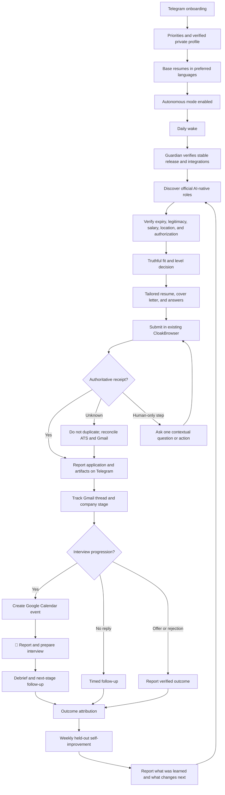

# Job Hunter Local Completion — Progress and Execution Spec

**Branch:** `feat/job-hunter-local-completion-20260802`  
**Worktree:** `/Users/anicca/Projects/.worktrees/life-manager/job-hunter-local-completion-20260802`  
**Canonical repository:** `https://github.com/Daisuke134/life-manager`  
**Base:** `origin/main` at `2099a29da61345a120d2f68a819d7b854dcebd83`  
**Scope:** Job Hunter only. Connector, Fundraising, CFO, Crypto, and Gig Work are excluded.  
**Status:** Design aligned; implementation pending in O2 order.

## 1. Done condition

The Mac mini Job Hunter autonomously discovers high-upside roles, verifies fit,
creates truthful tailored materials, submits eligible applications, captures an
authoritative receipt, follows Gmail replies, updates the company funnel, creates
confirmed interview events in Google Calendar, reports every material change in
natural Japanese on Telegram, and improves its strategy from verified outcomes.

Completion requires all of the following:

- one confirmed real Ashby application and receipt;
- one confirmed real Workday application and receipt;
- official job URL, company, role, compensation, location, and fit thesis;
- exact submitted resume and cover letter for every application;
- every employer question and submitted answer preserved as a private artifact;
- Gmail thread ID bound to the correct application;
- one real interview email converted into a Google Calendar event;
- Telegram message IDs for application, progression, interview, and learning reports;
- daily, inbox, learning, and guardian LaunchAgents healthy on the stable runtime;
- `summary.v2`, Telegram, ledger, and rebuilt event projections agree;
- all Job Hunter tests green; and
- every meaningful change committed and pushed.

## 2. Product outcome

Job Hunter is not a bulk-application counter. It maximizes the probability that the
user reaches a dream job they would gladly accept but may not have discovered or
attempted alone. The initial target is Dais; the local contract must remain
profile-driven so Life Manager can later onboard any person, including users with
limited job-search knowledge or agency.

The objective is an AI-native, AI-maximal, high-growth peer environment where the
user can build and improve advanced AI systems. Foreign-capital companies in Japan,
Tokyo-based global teams, and employers supporting Japan-based remote employment,
EOR, or contracting are preferred. Traditional Japanese employers are not a default
target, but Japanese application documents remain supported when explicitly needed.

## 3. Compensation policy — single source of truth

All versioned strategy, private profile validation, ranking, prompts, form answers,
Telegram copy, and learning reports must use one compensation contract:

| Policy | JPY |
|---|---:|
| Hard floor | 7,000,000 |
| Default target | 10,000,000 |
| Priority search range | 10,000,000–30,000,000 |
| Stretch | 30,000,000+ |

Rules:

1. Reject a role only when authoritative compensation proves its maximum is below
   JPY 7,000,000.
2. JPY 7,000,000–9,999,999 is a minimum-acceptable band, not the search target. It
   requires exceptional AI mission, peers, learning value, or strategic upside.
3. Rank JPY 10,000,000+ roles above otherwise equivalent lower-paid roles.
4. Do not anchor a high-paying employer down to JPY 10,000,000. When a role publishes
   a higher range, answer inside that range based on scope and total compensation.
5. The normal answer is: `JPY 10M+ target; flexible based on role scope, total
   compensation, and growth opportunity.`
6. Never infer or disclose current compensation.
7. Unknown compensation is not an automatic rejection; verify it or ask at the
   appropriate hiring stage.

## 4. Location, travel, citizenship, clearance, and start date

- Tokyo on-site or hybrid is eligible.
- Japan-remote is eligible.
- Global remote is eligible when Japan-based employment, EOR, or contracting is
  supported.
- Domestic and international travel are positive preferences, including roles with
  frequent client-site travel.
- Verified Japanese citizenship satisfies a Japanese-citizenship requirement.
- Japanese citizenship does not prove possession of a named security clearance.
- A clearance requirement is not an automatic rejection when the user may undergo
  the employer or government clearance process.
- Answer `currently holds clearance` only from a verified private fact. Otherwise
  preserve `unknown` and escalate only if the form cannot be answered truthfully.
- Availability policy must use the private profile. Current owner direction is an
  autumn start, with employer notice lead time handled truthfully; no exact date is
  invented.

## 5. Autonomy contract

### 5.1 Default behavior

The default is autonomous application, not approval-before-submit.

Once base resumes and candidate facts are accepted, Job Hunter:

1. discovers and verifies an official job;
2. evaluates compensation, location, experience level, work authorization, posting
   legitimacy, and expiry;
3. creates a job-specific resume, cover letter, and answer set;
4. validates every claim against private fact IDs;
5. submits through the existing CloakBrowser;
6. records an authoritative receipt or `submit_unknown`;
7. reports the result and exact artifacts on Telegram; and
8. follows all later email and interview stages automatically.

There is no routine `Apply / Skip / Edit` approval gate. The user may have many
applications and offers and choose among verified outcomes later.

### 5.2 Minimal human-only boundary

Job Hunter asks the user only when a truthful, authorized completion is impossible
without personal action or missing private context:

- video recording or live interview;
- identity verification, signature, or biometric step;
- CAPTCHA that cannot be completed through the authorized existing session;
- unknown legal, clearance-held, current-compensation, reference, or sensitive
  personal answer;
- proctored/live assessment or assessment with prohibited/unspecified AI policy;
- offer acceptance or binding employment agreement.

The Telegram request must contain one question, enough context to decide, the
official link, and compact buttons where supported. After the answer, Job Hunter
continues and reports the authoritative outcome. It must not make the user repeat
facts already stored in the private profile.

### 5.3 Representation policy

Routine applications and recruiter correspondence use the user's natural first
person. They do not insert unsolicited statements such as `I am an AI` or `an AI
assistant sent this`. They also never fabricate experience, impersonate the user in
identity-bound interviews or videos, violate assessment rules, or give a false answer
when an employer directly requires disclosure.

## 6. Resume and artifact contract

### 6.1 Base resume onboarding

Before autonomous application begins for a profile, Telegram delivers each base
resume for review in the user's preferred languages. The user corrects the base once;
future job-specific variants change emphasis and ordering, never facts.

Current Dais base artifacts:

| Variant | Private path | Telegram message ID |
|---|---|---:|
| English Applied AI / Agent Engineer | `~/.local/share/anicca/job-search/materials/master/Daisuke_Narita_AI_Resume.pdf` | 6084 |
| English AI Product / Solutions / Business | `~/.local/share/anicca/job-search/materials/business/Daisuke_Narita_AI_Business_Resume.pdf` | 6085 |
| Japanese AI work history | `~/.local/share/anicca/job-search/materials/japan/Daisuke_Narita_Japan_AI_Resume.pdf` | 6086 |

### 6.2 Per-application immutable dossier

Every application stores and links:

- official posting URL and captured posting;
- company, role, compensation, location, work mode, and source;
- fit thesis, verified strengths, honest gaps, and rejection/escalation reasons;
- submitted resume path and SHA-256;
- submitted cover-letter path and SHA-256;
- every application question and exact submitted answer;
- ATS snapshot and submission receipt;
- Gmail thread and message IDs;
- stage timeline, interview Calendar event ID, follow-ups, and outcome;
- strategy generation used for the decision.

No receipt means no `application completed` claim.

### 6.3 Language routing

- English or foreign-capital role: English engineering or business resume plus an
  English job-specific cover letter.
- Japanese role that requests Japanese documents: Ministry of Health, Labour and
  Welfare style `履歴書` plus a separate job-specific `職務経歴書`.
- Employer language and requested document types control routing, not a person's
  name, nationality, or company origin.
- A photograph, document date, motivation, and preference field are included only
  in the Japanese 履歴書 contract when required by the selected official format or
  employer.

## 7. Telegram product UX

Telegram is the proactive command center. Messages are concise, emotional, natural
Japanese for a non-technical user. Normal copy never exposes runner names, exit
codes, bounded/none wording, internal hashes, secrets, or implementation details.

Every link must be tappable Markdown. Private artifacts are sent as Telegram
documents or through an authenticated artifact URL; raw local filesystem paths are
not presented as tappable mobile links.

### 7.1 Confirmed application

```text
💼 Anthropicへの応募が完了しました！

職種: Software Engineer
想定年収: ¥12,000,000〜¥18,000,000
勤務地: 東京 / Hybrid

この求人を選んだ理由:
AI agent開発、TypeScript/Node.js、日英での業務経験が要件に合っています。

[求人ページを開く]
[提出したResumeを見る]
[Cover Letterを見る]
[提出した質問と回答を見る]

応募確認:
企業の応募完了画面で確認しました。これから返信を追跡します。
```

### 7.2 Uncertain submission

```text
⚠️ Sierraへの提出結果を確認しています。

送信操作の後に正式な完了表示が確認できませんでした。
重複応募はせず、企業ページと確認メールを自動で照合します。
```

### 7.3 Selection progression

```text
🎉 OpenAIの一次面接に進みました！

職種: AI Deployment Engineer
面接: 10月14日 14:00
Google Calendar: 登録しました

これは大きな前進です。提出した資料と求人内容を基に、面接準備も始めました。

[提出したResume]
[Cover Letter]
[面接準備を見る]
```

Use emotion appropriate to the event:

- application: `💼` / `✅`;
- recruiter interest: `✨`;
- interview progression: `🎉`;
- offer: `🚀🎊`;
- rejection: supportive and factual, never celebratory or shaming;
- operational delay: calm `⚠️`, with what the system will do next.

The message generator receives structured event facts plus an event-specific tone
contract. A deterministic validator checks that all required facts and links remain
present and that forbidden technical copy and unsupported claims are absent.

### 7.4 Human-only request

```text
🎥 Palantirの応募を続けるため、短い動画が必要です。

質問:
「顧客の難しい課題を技術で解決した経験を教えてください」

あなたの確認済み経験から、90秒の話す内容を用意しました。
[台本を見る] [録画ページを開く]

録画後に「完了」を押してください。残りの応募はJob Hunterが続けます。
```

### 7.5 Weekly pipeline

The weekly report includes a tappable company table with role, compensation,
location, current stage, elapsed time, next automatic action, and artifact links.
It separately reports discovery, application, confirmed-application, recruiter,
screen, interview, offer, accepted, rejected, withdrawn, and silence stages.

### 7.6 Self-improvement report

Every promoted, rolled-back, or inconclusive strategy decision is reported in plain
language:

```text
🧠 今週の求人活動から学んだこと

英語のAI Solutions求人は、Engineering求人より返信率が高い傾向でした。
次の応募では、金融AIの導入経験と顧客課題の解決をResumeの上部に出します。

まだ応募数が少ないため、給与基準や勤務地条件は変更しません。
```

Learning changes exactly one bounded strategy variable at a time, preserves 20%
holdout, requires authoritative outcome evidence, and rolls back on safety or quality
regression. Telegram reports the evidence class, human-readable conclusion, next
change, and whether the strategy was promoted, unchanged, or rolled back.

## 8. Observable tracker and stage model

The tracker exposes:

- full company list from discovery through final outcome;
- stage conversion and failure reasons;
- immutable application artifacts;
- posting legitimacy and work-authorization findings;
- expired-post verification;
- interview prep and debrief;
- follow-up cadence and silence policy;
- compensation distribution and JPY 10M+ target rate;
- source, role-family, resume variant, and segment Pareto;
- baseline/candidate strategy, 20% holdout, and rollback state;
- last healthy daily/inbox/learning/guardian runs.

`summary.v2`, Telegram, and the local Career surface are projections of the same
ledger/event stream and cannot maintain independent truth.

## 9. Stable local runtime — no worktree dependency

LaunchAgents must never point to `.worktrees`, feature branches, or disposable
developer checkouts. They point only to stable launchers under:

```text
~/.local/libexec/anicca/job-search/
```

The stable launcher resolves an atomically switched immutable release:

```text
~/.local/share/anicca/job-search/releases/<git-commit>/
~/.local/share/anicca/job-search/current -> releases/<git-commit>/
```

Deployment sequence:

1. build a content-addressed release away from `current`;
2. verify origin, commit, executable paths, permissions, imports, private config
   readability, ledger integrity, Gmail read, and browser ownership;
3. atomically switch `current`;
4. run an isolated non-submitting health pass;
5. retain the last known-good release; and
6. roll back the pointer if activation fails.

The Guardian checks stable launcher existence, release target, expected commit,
LaunchAgent program path, schedule, last success, SQLite integrity, Gmail access,
CloakBrowser owner, Telegram outbox, stale leases, and uncertain side effects. It
repairs only deterministic pre-side-effect failures and sends one low-noise alert
after bounded recovery fails.

## 10. Current verified state

- Dedicated worktree and branch created from `origin/main` at `2099a29da`.
- Canonical main working tree contains unrelated Connector edits and remains untouched.
- Fresh baseline: `203 passed, 34 subtests passed`.
- Private profile exists with compensation floor JPY 7M and target JPY 10M.
- Versioned strategy still has obsolete JPY 5.5M floor / JPY 7M target.
- Installed daily, inbox, and learning LaunchAgents point to deleted
  `/Users/anicca/anicca-project/.worktrees/job-canonical-merge` paths and exit 78.
- Current `gog gmail search` succeeds.
- Ledger: 5 applications, 2 legacy `submitted`, 3 `submit_unknown`, 0 authoritative
  submission confirmations, 0 funnel outcomes.
- `summary.v1` exists; `summary.v2` is incomplete.
- Ashby confirmed receipt: 0.
- Workday confirmed receipt: 0.
- Existing base resumes resent to Telegram with message IDs 6084–6086.

## 11. Execution order and remaining TODO

Each item closes RED → GREEN → real verification → this spec update → commit/push
before the next item begins.

- [x] **O2-01** — Create and measure dedicated branch/worktree; preserve unrelated
  main changes; record baseline and current runtime truth.
- [ ] **O2-02** — Rebase onto the latest `origin/main` immediately before the first
  code slice and record the resulting commit.
- [ ] **O2-03** — Re-run the complete Job Hunter and runner suites from their canonical
  working directories and keep them green.
- [ ] **O2-04** — Commit and push every reviewable slice; keep this dedicated spec as
  the progress SSOT. The five-phase master spec remains untouched.
- [ ] **O2-05** — Replace worktree-bound LaunchAgent programs with stable launchers
  and immutable releases; install the canonical local runtime.
- [ ] **O2-06** — TDD the JPY 7M floor / JPY 10M target / JPY 30M stretch policy,
  travel-positive policy, and clearance non-rejection contract; prove with real
  discovery logs.
- [ ] **O2-07** — Complete Guardian, lifecycle closure, event-backed `summary.v2`,
  observable tracker, emotional Telegram copy validation, and per-application
  resume/cover-letter/question artifacts.
- [ ] **O2-08** — Submit one eligible real Ashby application and capture an
  authoritative ATS or Gmail receipt, exact artifacts, Telegram IDs, and thread ID.
- [ ] **O2-09** — Submit one eligible real Workday application and capture the same
  evidence contract.
- [ ] **O2-10** — Prove one real interview email → stage update → Calendar event →
  emotional Telegram progression report → interview prep/debrief flow.
- [ ] **O2-11** — Complete trace-linked weekly reflection, funnel attribution,
  segment Pareto, 20% holdout, one-variable experiments, promotion, and rollback;
  deliver the self-improvement report to Telegram.
- [ ] **O2-12** — Keep `ai.anicca.job-search-daily` as the CloakBrowser owner, make
  daily/inbox/learning/guardian healthy, and prove Job Hunter closes only pages it
  created without disturbing shared tabs or contexts.

## 12. Final end-to-end state



