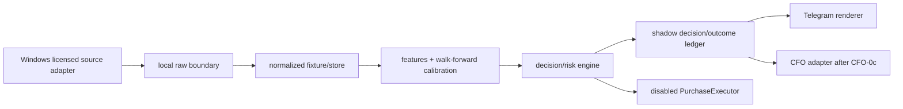

# Life Manager 競馬AI Shadow Foundation 実装計画

> **For agentic workers:** REQUIRED SUB-SKILL: Use superpowers:subagent-driven-development (recommended) or superpowers:executing-plans to implement this plan task-by-task. Steps use checkbox (`- [ ]`) syntax for tracking.

## Goal

licensed JRA+NAR sourceを所有Windows内で扱う境界、deterministic calibrated value selection、全eligible raceのshadow activity、公式outcomeのimmutable ledger、Telegram reporting、CFO projectionを順番に実装する。現在の計画はHRA-1〜HRA-5のShadow Foundationだけを対象にし、実購入・注文credential・非公式注文経路を含めない。

現在のactive itemはHRA-1aだけである。各itemはLunaが実装し、tests-first RED→GREEN、隔離または実境界の検証、commit boundaryまで閉じてから次のitemをactiveにする。Solはmanager、計画、gate、検証だけを担当し、Solがコードを代行しない。

## Architecture

実装rootは `apps/horse-racing-agent/` とする。



- licensed raw payloadはWindows内に留め、repository、cloud、Telegramへ出さない。
- normalized store、feature、decision、receipt summaryはprovider raw rowを再配布しない派生契約にする。
- decisionは署名済みdeterministic JSONを正本にし、Terraはその説明だけを生成する。
- HRA-1aでCFO-0c exact-seven依存を検証し、HRA-1bでdisabled executor境界を固定する。
- HRA-2でsource/store、HRA-3でfeature/model/backtest、HRA-4でshadow/Telegram、HRA-5でCFO/taxを実装する。

## Tech Stack

- Python 3.12
- `apps/horse-racing-agent/pyproject.toml` と標準の `src/horse_racing_agent/` layout
- pytest
- JSON schema相当の純Python契約、SQLiteまたは同等のlocal append-only store
- owned Windows adapterのfixture contract。実credential、licensed raw data、provider注文はテストへ入れない
- 既存Life ManagerのTelegram/CFO境界へ接続するadapter。既存CFO specは変更しない

## Scope and role gates

| 範囲 | このplanの扱い |
|---|---|
| `business_id: horse_racing` | CFO-0c exact-seven完了後のregistry v2入力として契約化する |
| HRA-1〜HRA-5 | 実装対象。すべてLunaが担当する |
| HRA-6 | provider permission / supported ordering API / tax / credential / cap / reconciliationのgate。blocked future gateであり、実装taskにしない |
| HRA-7 | one ¥100 micro-liveの文書契約だけ。実行taskにしない |
| HRA-8 | evidence-driven scaleの文書契約だけ。実行taskにしない |
| Sol | manager、sequence、acceptance、verification、stage gateのみ |
| Luna | contracts、disabled executor、fixtures、store、model、ledger、Telegram、CFO adapter、testsの全実装 |

## Plan size

各sliceは3 files以内、estimated LOCは100以下に収める。100 LOCまたは3 filesを超える変更は、次のitemへ分割してからactiveにする。

| ID | Stage / slice | 変更対象files | estimated LOC |
|---|---|---|---:|
| HRA-1a | CFO dependency / registry v2 contract | `apps/horse-racing-agent/pyproject.toml`; `apps/horse-racing-agent/src/horse_racing_agent/contracts.py`; `apps/horse-racing-agent/tests/test_contracts.py` | 85 |
| HRA-1b | disabled PurchaseExecutor boundary | `apps/horse-racing-agent/src/horse_racing_agent/purchase.py`; `apps/horse-racing-agent/tests/test_purchase_disabled.py` | 70 |
| HRA-2a | licensed Windows source boundary | `apps/horse-racing-agent/src/horse_racing_agent/ingest.py`; `apps/horse-racing-agent/tests/test_ingest_boundary.py` | 80 |
| HRA-2b | normalized fixtures / local store | `apps/horse-racing-agent/tests/fixtures/normalized_races.json`; `apps/horse-racing-agent/src/horse_racing_agent/store.py`; `apps/horse-racing-agent/tests/test_store.py` | 90 |
| HRA-3a | feature / model contract | `apps/horse-racing-agent/src/horse_racing_agent/features.py`; `apps/horse-racing-agent/src/horse_racing_agent/model.py`; `apps/horse-racing-agent/tests/test_model.py` | 95 |
| HRA-3b | walk-forward / calibration / backtest | `apps/horse-racing-agent/src/horse_racing_agent/backtest.py`; `apps/horse-racing-agent/tests/test_backtest.py` | 75 |
| HRA-4a | shadow decision / outcome ledger | `apps/horse-racing-agent/src/horse_racing_agent/decision.py`; `apps/horse-racing-agent/src/horse_racing_agent/ledger.py`; `apps/horse-racing-agent/tests/test_shadow_ledger.py` | 95 |
| HRA-4b | exact Japanese Telegram schemas | `apps/horse-racing-agent/src/horse_racing_agent/telegram.py`; `apps/horse-racing-agent/tests/test_telegram.py` | 75 |
| HRA-5 | CFO adapter / tax evidence / double-count | `apps/horse-racing-agent/src/horse_racing_agent/cfo.py`; `apps/horse-racing-agent/tests/test_cfo.py` | 80 |

estimated LOCはproduction code、test、fixtureの合計目安であり、各sliceのacceptanceを満たすために増える場合は、そのsliceを分割してから実装する。実装開始前にSolがこのtableとactive itemを検証する。

## Execution rules

1. Lunaは一度にactive itemを一つだけ実装する。未完itemを飛ばして後続stageを実装しない。
2. 各itemはREDを先に実測する。REDは「未実装だから失敗した」ことが分かる対象testだけに絞り、network、credential、provider raw dataを呼ばない。
3. GREENでは同じtestを実測し、対象contractがPASSする。fixtureでprovider successや注文成功を偽装してPASSにしない。
4. GREEN後にslice固有のverification commandを実行し、Solがgateを判定する。失敗はspec/planのstateと次の一手に記録する。
5. commitはslice単位にし、同じcommitへ後続stage、既存CFO spec、他agent所有fileを混ぜない。commit/pushはprimaryの検証指示後に行う。
6. 外部副作用を伴う実注文、provider login、決済、raw dataのuploadは、このplanの実行範囲外である。

## Tasks

### HRA-1a — CFO dependency / registry v2 contract

- [ ] **Owner: Luna。** `CFO-0c` exact-sevenを変更せず、registry v2が`horse_racing`を8番目候補として受け入れる依存契約と、HRA-6未完了時のdisabled stateを定義する。

Files:

- `apps/horse-racing-agent/pyproject.toml`
- `apps/horse-racing-agent/src/horse_racing_agent/contracts.py`
- `apps/horse-racing-agent/tests/test_contracts.py`

RED（Lunaが実装前に実行）:

```sh
cd /Users/anicca/anicca-project/.worktrees/horse-racing-agent-spec/apps/horse-racing-agent
rtk python3.12 -m pytest tests/test_contracts.py -q
```

Expected result: `contracts.py`のregistry v2 contractが未実装で、対象testが失敗する。外部networkやCFO stateの書込みは発生しない。

GREEN（Lunaが実装後に実行）:

```sh
cd /Users/anicca/anicca-project/.worktrees/horse-racing-agent-spec/apps/horse-racing-agent
rtk python3.12 -m pytest tests/test_contracts.py -q
```

Expected result: `horse_racing`、candidate ordinal 8、`depends_on=CFO-0c exact-seven`、`live_purchase=disabled`、missing dependencyのfail-closedがすべてPASSする。既存CFO specが変更されていないことを次で確認する。

```sh
cd /Users/anicca/anicca-project/.worktrees/horse-racing-agent-spec
rtk git diff -- docs/superpowers/specs/2026-08-06-life-manager-cfo-design.md docs/superpowers/specs/2026-08-08-life-manager-cfo-m0-business-registry-design.md
```

Expected result: outputが空である。

Commit boundary（primaryのcommit指示後にLunaが実行）:

```sh
cd /Users/anicca/anicca-project/.worktrees/horse-racing-agent-spec
rtk git add apps/horse-racing-agent/pyproject.toml apps/horse-racing-agent/src/horse_racing_agent/contracts.py apps/horse-racing-agent/tests/test_contracts.py
rtk git commit -m "feat(horse-racing): add registry v2 dependency contract"
```

### HRA-1b — disabled PurchaseExecutor boundary

- [ ] **Owner: Luna。** `PurchaseExecutor`の呼び出し境界を作るが、現在は必ずdisabledを返す。credential read、network call、wallet/bank mutation、DOM success判定を実装しない。

Files:

- `apps/horse-racing-agent/src/horse_racing_agent/purchase.py`
- `apps/horse-racing-agent/tests/test_purchase_disabled.py`

RED:

```sh
cd /Users/anicca/anicca-project/.worktrees/horse-racing-agent-spec/apps/horse-racing-agent
rtk python3.12 -m pytest tests/test_purchase_disabled.py -q
```

Expected result: disabled executor contractが未実装で失敗する。testはtransportをspyし、networkが呼ばれていないことも確認できる形にする。

GREEN:

```sh
cd /Users/anicca/anicca-project/.worktrees/horse-racing-agent-spec/apps/horse-racing-agent
rtk python3.12 -m pytest tests/test_purchase_disabled.py -q
```

Expected result: 任意のLIVE requestが`blocked`/`disabled`でfail-closedし、credential reader、transport、DOM adapterが0 callとなる。`PurchaseExecutor`が外部副作用を起こさない。

Commit boundary:

```sh
cd /Users/anicca/anicca-project/.worktrees/horse-racing-agent-spec
rtk git add apps/horse-racing-agent/src/horse_racing_agent/purchase.py apps/horse-racing-agent/tests/test_purchase_disabled.py
rtk git commit -m "feat(horse-racing): keep purchase executor disabled"
```

### HRA-2a — licensed Windows source boundary

- [ ] **Owner: Luna。** JRA-VAN JV-Link + UmaConn/NV-Linkのsource adapter契約を作る。provider raw dataはowned Windowsのlocal boundary外へserializeできず、未登録sourceは拒否する。

Files:

- `apps/horse-racing-agent/src/horse_racing_agent/ingest.py`
- `apps/horse-racing-agent/tests/test_ingest_boundary.py`

RED:

```sh
cd /Users/anicca/anicca-project/.worktrees/horse-racing-agent-spec/apps/horse-racing-agent
rtk python3.12 -m pytest tests/test_ingest_boundary.py -q
```

Expected result: source allowlist、Windows-local boundary、raw export拒否が未実装で失敗する。実providerへ接続してはならない。

GREEN:

```sh
cd /Users/anicca/anicca-project/.worktrees/horse-racing-agent-spec/apps/horse-racing-agent
rtk python3.12 -m pytest tests/test_ingest_boundary.py -q
```

Expected result: official/licensed source markerだけが受理され、NAR/JRAを混同せず、raw payloadのTelegram/cloud/Git serializationが拒否される。fixtureはprovider raw dataではなくsynthetic normalized inputだけを使う。

Commit boundary:

```sh
cd /Users/anicca/anicca-project/.worktrees/horse-racing-agent-spec
rtk git add apps/horse-racing-agent/src/horse_racing_agent/ingest.py apps/horse-racing-agent/tests/test_ingest_boundary.py
rtk git commit -m "feat(horse-racing): enforce licensed ingest boundary"
```

### HRA-2b — normalized fixtures / local store

- [ ] **Owner: Luna。** provider raw rowを再配布しないnormalized fixture schemaとlocal append-only storeを実装する。content hash、snapshot、freshness、schema versionを保存し、後からdecisionを上書きできないようにする。

Files:

- `apps/horse-racing-agent/tests/fixtures/normalized_races.json`
- `apps/horse-racing-agent/src/horse_racing_agent/store.py`
- `apps/horse-racing-agent/tests/test_store.py`

RED:

```sh
cd /Users/anicca/anicca-project/.worktrees/horse-racing-agent-spec/apps/horse-racing-agent
rtk python3.12 -m pytest tests/test_store.py -q
```

Expected result: normalized fixture validation、duplicate append拒否、snapshot/freshness保存が未実装で失敗する。

GREEN:

```sh
cd /Users/anicca/anicca-project/.worktrees/horse-racing-agent-spec/apps/horse-racing-agent
rtk python3.12 -m pytest tests/test_store.py -q
```

Expected result: 同一fixtureのreplayが同一hashを持ち、decision/outcome recordはappend-onlyとなる。fixture内にsecret、licensed raw provider field、購入receiptを置かず、stale snapshotを明示できる。

Commit boundary:

```sh
cd /Users/anicca/anicca-project/.worktrees/horse-racing-agent-spec
rtk git add apps/horse-racing-agent/tests/fixtures/normalized_races.json apps/horse-racing-agent/src/horse_racing_agent/store.py apps/horse-racing-agent/tests/test_store.py
rtk git commit -m "feat(horse-racing): add normalized local race store"
```

### HRA-3a — feature / model contract

- [ ] **Owner: Luna。** decision cutoffより前のfeatureだけを抽出し、market implied baselineとwin/place初期modelのcontractを実装する。cutoff後featureは拒否する。

Files:

- `apps/horse-racing-agent/src/horse_racing_agent/features.py`
- `apps/horse-racing-agent/src/horse_racing_agent/model.py`
- `apps/horse-racing-agent/tests/test_model.py`

RED:

```sh
cd /Users/anicca/anicca-project/.worktrees/horse-racing-agent-spec/apps/horse-racing-agent
rtk python3.12 -m pytest tests/test_model.py -q
```

Expected result: cutoff validation、market implied baseline、win/place model contractが未実装で失敗する。

GREEN:

```sh
cd /Users/anicca/anicca-project/.worktrees/horse-racing-agent-spec/apps/horse-racing-agent
rtk python3.12 -m pytest tests/test_model.py -q
```

Expected result: T-5以前だけでfeature rowを作り、market implied pとwin/place model inputを同一fixtureからreplayできる。cutoff後のfeatureを与えると拒否される。

Commit boundary:

```sh
cd /Users/anicca/anicca-project/.worktrees/horse-racing-agent-spec
rtk git add apps/horse-racing-agent/src/horse_racing_agent/features.py apps/horse-racing-agent/src/horse_racing_agent/model.py apps/horse-racing-agent/tests/test_model.py
rtk git commit -m "feat(horse-racing): add cutoff-safe model contract"
```

### HRA-3b — walk-forward / calibration / backtest

- [ ] **Owner: Luna。** HRA-3aのfeature/model contractを入力に、time-series walk-forward、calibration、odds slippage stress、Brier/logloss/ECE、confidence-adjusted EV lower boundを実装する。

Files:

- `apps/horse-racing-agent/src/horse_racing_agent/backtest.py`
- `apps/horse-racing-agent/tests/test_backtest.py`

RED:

```sh
cd /Users/anicca/anicca-project/.worktrees/horse-racing-agent-spec/apps/horse-racing-agent
rtk python3.12 -m pytest tests/test_backtest.py -q
```

Expected result: walk-forward分割、calibration metrics、slippage lower boundが未実装で失敗する。

GREEN:

```sh
cd /Users/anicca/anicca-project/.worktrees/horse-racing-agent-spec/apps/horse-racing-agent
rtk python3.12 -m pytest tests/test_backtest.py -q
```

Expected result: random splitを使わず、時系列順のwalk-forwardでT-5以前だけを学習に使う。同一fixtureのmarket implied baselineとcalibrated modelについてBrier/logloss/ECE、slippage stress、confidence-adjusted EV lower boundが再現される。

Commit boundary:

```sh
cd /Users/anicca/anicca-project/.worktrees/horse-racing-agent-spec
rtk git add apps/horse-racing-agent/src/horse_racing_agent/backtest.py apps/horse-racing-agent/tests/test_backtest.py
rtk git commit -m "feat(horse-racing): add walk-forward calibrated backtest"
```

### HRA-4a — shadow decision / official outcome ledger

- [ ] **Owner: Luna。** 全eligible raceへdecisionを一つ以上生成し、負EVでもcashを強制せず、SKIP時にbest candidateとthreshold gapを保存する。official placing/payout/refundはdecisionを変更しないimmutable outcome eventとしてappendする。

Files:

- `apps/horse-racing-agent/src/horse_racing_agent/decision.py`
- `apps/horse-racing-agent/src/horse_racing_agent/ledger.py`
- `apps/horse-racing-agent/tests/test_shadow_ledger.py`

RED:

```sh
cd /Users/anicca/anicca-project/.worktrees/horse-racing-agent-spec/apps/horse-racing-agent
rtk python3.12 -m pytest tests/test_shadow_ledger.py -q
```

Expected result: all-race activity、negative-EV SKIP、immutable official outcome、shadow revenue zeroの対象testが失敗する。

GREEN:

```sh
cd /Users/anicca/anicca-project/.worktrees/horse-racing-agent-spec/apps/horse-racing-agent
rtk python3.12 -m pytest tests/test_shadow_ledger.py -q
```

Expected result: positive/negative/staleの全eligible raceにSHADOWまたはSKIPがあり、SKIPにはbest candidate/threshold gap/reasonがある。official outcomeを再appendしてもdecisionが変わらず、shadow/estimated EVはrevenue 0、settled receiptだけがreal P&Lになる。

Commit boundary:

```sh
cd /Users/anicca/anicca-project/.worktrees/horse-racing-agent-spec
rtk git add apps/horse-racing-agent/src/horse_racing_agent/decision.py apps/horse-racing-agent/src/horse_racing_agent/ledger.py apps/horse-racing-agent/tests/test_shadow_ledger.py
rtk git commit -m "feat(horse-racing): add shadow decision ledger"
```

### HRA-4b — exact Japanese Telegram schemas

- [ ] **Owner: Luna。** `Life Manager::: 競馬AI` prefix、事前schema、結果schema、dedupe、delivery failure stateを実装する。raw licensed data、secret、provider payloadを送信しない。

Files:

- `apps/horse-racing-agent/src/horse_racing_agent/telegram.py`
- `apps/horse-racing-agent/tests/test_telegram.py`

RED:

```sh
cd /Users/anicca/anicca-project/.worktrees/horse-racing-agent-spec/apps/horse-racing-agent
rtk python3.12 -m pytest tests/test_telegram.py -q
```

Expected result: exact prefix、pre/result required fields、SHADOW/SKIP representation、dedupeのtestが失敗する。

GREEN:

```sh
cd /Users/anicca/anicca-project/.worktrees/horse-racing-agent-spec/apps/horse-racing-agent
rtk python3.12 -m pytest tests/test_telegram.py -q
```

Expected result: preに日時、venue、race、start、action、bet、horse、stake、p、odds snapshot、implied p、EV lower、top3 factors、cap、decision_id、model、data freshnessが入り、resultにofficial placing、payout、refund、net P&L、cumulative realized P&L、drawdown、official receipt status、model、decision、learning actionが入る。send失敗は同一decision_idをdedupeでき、raw/secretは0件である。

Commit boundary:

```sh
cd /Users/anicca/anicca-project/.worktrees/horse-racing-agent-spec
rtk git add apps/horse-racing-agent/src/horse_racing_agent/telegram.py apps/horse-racing-agent/tests/test_telegram.py
rtk git commit -m "feat(horse-racing): add Japanese shadow reports"
```

### HRA-5 — CFO adapter / tax evidence / double-count

- [ ] **Owner: Luna。** CFO-0c exact-seven完了とregistry v2受入がSolのgateを通過した後だけ、`horse_racing`をCFOへ投影する。`jra_payout`、`nar_payout`、`horse_racing_bet_receipts`、7 event type、bank internal settlement、tax evidenceを実装する。

Files:

- `apps/horse-racing-agent/src/horse_racing_agent/cfo.py`
- `apps/horse-racing-agent/tests/test_cfo.py`

RED:

```sh
cd /Users/anicca/anicca-project/.worktrees/horse-racing-agent-spec/apps/horse-racing-agent
rtk python3.12 -m pytest tests/test_cfo.py -q
```

Expected result: CFO projection、official settled receipt gate、JRA/NAR channel、bank transfer double-count防止、tax evidenceの対象testが失敗する。CFO production stateは変更しない。

GREEN:

```sh
cd /Users/anicca/anicca-project/.worktrees/horse-racing-agent-spec/apps/horse-racing-agent
rtk python3.12 -m pytest tests/test_cfo.py -q
```

Expected result: `bet_intent`、`wager_placed`、`settlement`、`refund`、`data_subscription`、`compute_cost`、`tax_evidence`がschema通りに保存される。shadow/estimated EVはrevenue 0、official settled receiptだけがreal P&Lとなり、bank internal settlementとpayoutの二重計上が0件になる。

Commit boundary:

```sh
cd /Users/anicca/anicca-project/.worktrees/horse-racing-agent-spec
rtk git add apps/horse-racing-agent/src/horse_racing_agent/cfo.py apps/horse-racing-agent/tests/test_cfo.py
rtk git commit -m "feat(horse-racing): add CFO receipt adapter"
```

## Blocked future gate（実行taskではない）

以下は本planに実装taskとして追加しない。

- HRA-6: providerのwritten permission、またはofficial supported ordering APIの一次資料、tax review、credential separation、cap、official receipt/reconciliationの証憑をSolが検証するまでblocked。
- HRA-7: HRA-6後でもone ¥100 max / owner-local-day、positive confidence-adjusted EV、martingale/chasing禁止、stale・Telegram pre-message failure・reconciliation failureのfail-closed、公式投票照会receipt確認が必要。DOM successは不可。
- HRA-8: calibration、ROI、drawdown、receipt、税務、障害復旧のevidenceがlater windowで揃うまでscaleしない。

HRA-6〜HRA-8ではpurchase code、注文credential、Selenium、非公式APIを追加しない。新たな実装が必要になった場合は、このplanを先に改訂し、Solのgateを通過した独立sliceとして扱う。

## Verification matrix and handoff

| Gate | 実施主体 | Evidence |
|---|---|---|
| RED→GREEN対象test | Luna | 各taskのpytest output、失敗原因、修正後PASS |
| secrets/raw scan | Luna実施、Sol検証 | `rg`によるsecret key、provider raw field、private pathの0件結果 |
| replay/time leakage | Luna実施、Sol gate | 同一fixtureのdecision hash一致、cutoff後feature拒否 |
| all-race shadow | Luna実施、Sol gate | eligible race数とSHADOW/SKIP数が一致、SKIP理由が存在 |
| official outcome/CFO | HRA-5でLuna実施、Sol gate | receipt idempotency、refund/void、bank internal settlementのdouble-count 0件 |
| purchase safety | Luna実施、Sol gate | disabled executor network/credential side effect 0件 |
| UI E2E | Sol | UI変更なし。Maestroは実施しない。Telegram/CFO/worker境界の実E2Eまたは隔離boundary testを確認 |

各sliceの完了時に、Solは「変更files」「実行commandの意味」「実測結果」「残る故障」「次のactive item」をstateへ反映する。primaryがcommit/pushを指示するまで、このworktreeではcommit/pushを行わない。
