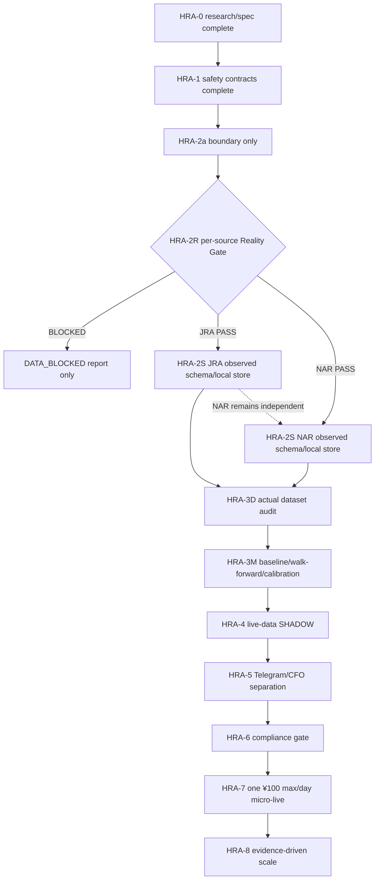
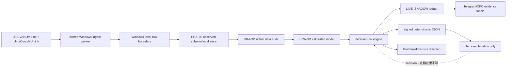

# Life Manager 競馬AI 実装計画

> **For agentic workers:** REQUIRED SUB-SKILL: Use superpowers:subagent-driven-development (recommended) or superpowers:executing-plans to implement this plan task-by-task. Steps use checkbox (`- [ ]`) syntax for tracking.

## Goal

`business_id: horse_racing`をLife Manager financial organの第8候補として、CFO-0c exact-seven完了後のregistry v2依存を壊さずに実装する。Reality Gateを先に通し、owned Windowsでofficial/licensed JRAまたはNARの実recordを観測できたsourceだけを下流へ進める。現時点のStatusは `REALITY GATE REQUIRED — LIVE PURCHASE DISABLED` である。

目標は実購入ではない。最初にsource、時刻、schema、cutoff、decision、outcome、Telegram、CFOの証拠を分離したSHADOW foundationを作る。実注文・決済はこのplanの実装対象に含めない。

## Current truth and evidence classes

### 現在のevidence table

| Evidence | 実測値 |
|---|---:|
| official provider sessions | 0 |
| real JRA records | 0 |
| real NAR records | 0 |
| real historical backtests | 0 |
| live Telegram runs | 0 |
| live orders/payments | 0 |

Evidence classは次の4つに固定する。

- `SYNTHETIC_TEST`: pure mechanicsだけを検証する人工fixture。provider、model、backtest、live Telegram、CFO revenue、completion gateの証拠にはしない。
- `REAL_PROVIDER_RECORD`: owned Windows上のofficial/licensed providerから観測した実recordのredacted manifest。
- `LIVE_SHADOW`: 実provider dataから実時点decisionを作るが、注文・決済をしない記録。推定EV、payout、ROIはreal revenueにしない。
- `LIVE_CASH`: HRA-6のcompliance gate後にofficial settled receiptで確定する記録。real P&Lはこのclassだけで計上する。

現committed codeで証明済みなのはregistry dependency、purchase-disabled safety、source/local boundaryだけである。provider connectivity、data accuracy、model accuracy、ROI、revenue、live Telegram deliveryは未証明である。HRA-2bのsynthetic store、fixture、testはuncommitted quarantineであり、実provider recordのobserved schemaへ派生するまでcompletionとして受け入れない。

下流stageがPASSを名乗るためには、provider/acquisition timestamp、source、jurisdiction、adapter/upstream version、row count、schema field names/types、content hash、redacted evidence manifest、probe command exit evidenceを揃える。欠落、unknown、entitlement不足、probe不能、実record 0件は `BLOCKED` として記録し、synthetic値で補完しない。raw licensed rowsはowned Windows内だけに置き、Git、Telegram、cloud、CFOへ出さない。

## Architecture

### Reality Gateを先に通すstate flow



`HRA-2a`はboundary onlyでありconnectorではない。JRAがPASSしてもNARは自動PASSせず、sourceごとに下流を分離する。Reality Gate前にschema、model、backtest、prediction、CFO revenueを作ってcompletion扱いしない。

### 通過後のデータ経路



## Tech Stack and boundaries

- Python 3.12、pure deterministic contracts、isolated test harness。実装rootは `apps/horse-racing-agent/` とする。
- JRA laneはJRA-VAN Data Lab/JV-Linkとpinned `miyamamoto/jrvltsql`。NAR laneはofficial/licensed UmaConn/NV-Linkの公式sampleまたは限定bridge。JRA/NARを同じadapterやreceiptへ混ぜない。
- HRA-2Rのprobeはowned Windows上だけで実行する。credential値、subscription id、raw licensed row、実馬名、購入receiptをrepoや報告へ書かない。
- HRA-2Sは観測manifestとWindows-local recordからschemaを導出する。SQLite/provider connection/normalizationをReality Gate前へ前倒ししない。
- HRA-3Mはmarket-implied baseline、win/place初期対象、LightGBMまたはXGBoost、fixed T-5等のsnapshot、time-series walk-forward、calibration、odds slippage stress、Brier/logloss/ECE、confidence-adjusted EV lower boundを使う。cutoff後featureとrandom splitは禁止する。
- HRA-4は全eligible raceでSHADOWまたはSKIPを生成する。負EVのcashは強制しないが、SKIPでもbest candidate、threshold gap、reasonを残す。
- Telegramは `Life Manager::: 競馬AI` とtruth labelを先頭に置き、`real P&L`と`shadow P&L`を分ける。CFOはofficial settled receiptだけをrevenueとreal P&Lにする。
- `PurchaseExecutor`は任意の入力でdisabled/blockedを返す。browser、Selenium、DOM、非公式注文API、credential reader、network transport、wallet/bank mutationを作らない。

### HRA-2R1 route decision

実測control planeはmacOS 15.6 / Apple M4 / 16 GiB / 内蔵disk空き32 GiB（35.2 GB）、VM runtimeなし。JRA公式FAQ 436/210とdeveloper topic 49により、Data Lab/JV-LinkはMac直実行せず、ActiveX COMを持つowned remote/native Windows 11 x64 workerへ限定する。MicrosoftのWindows 11要件は64 GB storage、ParallelsのApple silicon guestはArmであるため、Mac内蔵VM、Wine、x64 emulationは採用しない。既存GCP設定はinstance count=0で、Windows workerの証明ではない。Windows 365/ParallelsはJRA実probe PASSまで候補実験扱いとする。

## Scope and roles

| 範囲 | 扱い |
|---|---|
| HRA-0 | research/spec complete。既存CFO specは変更しない |
| HRA-1a/1b、HRA-2a | safety contracts complete。pushed commitを下記に固定 |
| HRA-2R | 現在唯一のactive stage。source別にreal recordとredacted manifestを得る |
| HRA-2S〜HRA-5 | Reality Gate後のSHADOW foundation。sourceごとのPASSまでblocked |
| HRA-6 | written permissionまたはofficial supported ordering API、tax、credential、cap、reconciliationのgate。実装taskにしない |
| HRA-7/HRA-8 | 文書上のblocked future gate。実購入実装・stake escalationをしない |
| Sol | manager、計画、acceptance、gate、verificationだけを担当 |
| Luna | 全implementation/editing slice、Windows probeの実行、tests、evidence manifest作成を担当 |

## Plan size

1 sliceは3 files以内、estimated LOCは100以下とする。3 files超または100 LOC超が必要になった場合は、active itemを完了させてから独立sliceへ分割する。Reality Gateのmanifestはredacted evidenceだけであり、raw provider dataのfileは作らない。

| ID | slice | files | estimated LOC | 状態 |
|---|---|---|---:|---|
| HRA-1a | registry v2 dependency contract | `apps/horse-racing-agent/pyproject.toml`; `apps/horse-racing-agent/src/horse_racing_agent/contracts.py`; `apps/horse-racing-agent/tests/test_contracts.py` | 85 | **complete**, `d743b153` |
| HRA-1b | purchase-disabled boundary | `apps/horse-racing-agent/src/horse_racing_agent/purchase.py`; `apps/horse-racing-agent/tests/test_purchase_disabled.py` | 70 | **complete**, `89d48910` |
| HRA-2a | licensed source/local boundary | `apps/horse-racing-agent/src/horse_racing_agent/ingest.py`; `apps/horse-racing-agent/tests/test_ingest_boundary.py` | 80 | **complete**, `0fe627cd`。boundary only |
| HRA-2R1-P | physical Windows worker procurement evidence | `docs/evidence/horse-racing/windows-worker-procurement.md` | 40 | **complete: purchase not executed; action-time confirmation required** |
| HRA-2R1 | JRA environment + one-real-record probe | `docs/evidence/horse-racing/windows-worker-first-record-runbook.md`; `docs/evidence/horse-racing/jra-probe.md` | 95 | **ACTIVE/BLOCKED — runbook prepared, not executed; session0, record0, probe null** |
| HRA-2R2 | JRA redacted reality manifest | `docs/evidence/horse-racing/jra-reality-gate.md` | 35 | pending HRA-2R1 |
| HRA-2R3 | NAR environment + one-real-record probe | `docs/evidence/horse-racing/nar-probe.md` | 35 | pending HRA-2R1、JRAと独立 |
| HRA-2R4 | NAR redacted reality manifest | `docs/evidence/horse-racing/nar-reality-gate.md` | 35 | pending HRA-2R3 |
| HRA-2R5 | per-source gate index | `docs/evidence/horse-racing/reality-gate-index.md` | 30 | pending HRA-2R4 |
| HRA-2S | observed schema/local append-only store | `apps/horse-racing-agent/tests/fixtures/normalized_races.json`; `apps/horse-racing-agent/src/horse_racing_agent/store.py`; `apps/horse-racing-agent/tests/test_store.py` | 90 | **BLOCKED** by source Reality Gate |
| HRA-3D | actual dataset quality/coverage/cutoff audit | `apps/horse-racing-agent/src/horse_racing_agent/data_audit.py`; `apps/horse-racing-agent/tests/test_data_audit.py` | 75 | **BLOCKED** by HRA-2S |
| HRA-3Ma | cutoff-safe features and model contract | `apps/horse-racing-agent/src/horse_racing_agent/features.py`; `apps/horse-racing-agent/src/horse_racing_agent/model.py`; `apps/horse-racing-agent/tests/test_model.py` | 95 | **BLOCKED** by HRA-3D |
| HRA-3Mb | walk-forward/calibration/backtest | `apps/horse-racing-agent/src/horse_racing_agent/backtest.py`; `apps/horse-racing-agent/tests/test_backtest.py` | 80 | **BLOCKED** by HRA-3Ma |
| HRA-4a | SHADOW decision and immutable outcome ledger | `apps/horse-racing-agent/src/horse_racing_agent/decision.py`; `apps/horse-racing-agent/src/horse_racing_agent/ledger.py`; `apps/horse-racing-agent/tests/test_shadow_ledger.py` | 95 | **BLOCKED** by HRA-3Mb |
| HRA-4b | Japanese Telegram schemas and cadence | `apps/horse-racing-agent/src/horse_racing_agent/telegram.py`; `apps/horse-racing-agent/tests/test_telegram.py` | 75 | **BLOCKED** by HRA-4a |
| HRA-5a | CFO receipt/evidence adapter | `apps/horse-racing-agent/src/horse_racing_agent/cfo.py`; `apps/horse-racing-agent/tests/test_cfo.py` | 85 | **BLOCKED** by HRA-4b and CFO-0c |

HRA-2bとして先に作られた3 filesは、現在のsynthetic-only implementationであり、uncommitted quarantineに置く。HRA-2Sのsource-specific observed manifestからschemaを再導出し、synthetic fixtureを置換して初めて受入判定を行う。現ファイルを「provider success」としてGREEN扱いしない。

## Execution rules

1. One active itemだけを実行する。現在のactive itemはHRA-2R1であり、HRA-2Rのevidenceが揃うまでHRA-2S以降へ進まない。
2. Lunaは全実装・編集・probe実行を担当し、Solはmanager/gate/verificationだけを担当する。SolはLunaのコードを代行せず、Lunaは自分のsource Reality Gateを自己承認しない。
3. code sliceはtest-first RED→GREENとする。REDは外部provider、credential、network、raw licensed dataを呼ばず、未実装contractの失敗だけを検出する。GREENは同じtestとpackage全testを実行する。
4. Reality Gate sliceはcode GREENを捏造しない。環境・entitlement・probeが不足した場合は `BLOCKED` のmanifestとexit evidenceを残し、synthetic recordをPASSへ昇格しない。
5. すべてのPASSはprovider/acquisition timestamp、source、jurisdiction、adapter/upstream version、row count、schema field names/types、content hash、manifest、probe command exit codeを参照できる状態にする。
6. raw licensed rowsはowned Windows-localだけに置く。redacted manifestにはraw value、secret、実馬名、subscription id、購入receiptを入れない。
7. slice commitはprimary/Solのverification後に行い、他agent所有file、既存CFO spec、raw dataを混ぜない。現在の依頼ではcommit/pushを行わない。

## Completed safety slices

### HRA-1a — registry v2 dependency contract `[x]`

**Owner: Luna。** `horse_racing`を`candidate_ordinal=8`、`depends_on=CFO-0c exact-seven`として定義し、dependency未完了をfail-closedにした。HRA-6未完了時の`live_purchase=disabled`もcaller inputで解除できない。

Files: `apps/horse-racing-agent/pyproject.toml`、`apps/horse-racing-agent/src/horse_racing_agent/contracts.py`、`apps/horse-racing-agent/tests/test_contracts.py`。

検証:

```sh
cd /Users/anicca/anicca-project/.worktrees/horse-racing-agent-spec/apps/horse-racing-agent
rtk python3.12 -m pytest tests/test_contracts.py -q
rtk python3.12 -m pytest -q
```

期待結果: registry candidate、exact-seven dependency、fail-closed、disabled purchaseの対象testがPASSし、外部network/CFO state mutationが0件。Solは`rtk git diff -- docs/superpowers/specs/2026-08-06-life-manager-cfo-design.md docs/superpowers/specs/2026-08-08-life-manager-cfo-m0-business-registry-design.md`の空出力を確認する。pushed commit: `d743b153c573e13f7d598290b041639194f7eda6`。

### HRA-1b — purchase-disabled boundary `[x]`

**Owner: Luna。** 任意のLIVE requestを常にblocked/disabledにし、credential reader、transport、DOM adapter、wallet/bank mutationを呼ばない。

Files: `apps/horse-racing-agent/src/horse_racing_agent/purchase.py`、`apps/horse-racing-agent/tests/test_purchase_disabled.py`。

検証:

```sh
cd /Users/anicca/anicca-project/.worktrees/horse-racing-agent-spec/apps/horse-racing-agent
rtk python3.12 -m pytest tests/test_purchase_disabled.py -q
rtk python3.12 -m pytest -q
```

期待結果: caller flag/config/receipt-like inputでenabledにならず、side-effect 0件。pushed commit: `89d489108e0abe0ca24c0bcd442bcaf94bd0b9fb`。

### HRA-2a — licensed source/local boundary `[x]`

**Owner: Luna。** `JRA-VAN JV-Link`と`UmaConn/NV-Link`のofficial/licensed markerだけをjurisdiction別に受け付け、owned Windows/local-only境界とraw export拒否をpureに検証した。これはboundary onlyでありconnectorではない。

Files: `apps/horse-racing-agent/src/horse_racing_agent/ingest.py`、`apps/horse-racing-agent/tests/test_ingest_boundary.py`。

検証:

```sh
cd /Users/anicca/anicca-project/.worktrees/horse-racing-agent-spec/apps/horse-racing-agent
rtk python3.12 -m pytest tests/test_ingest_boundary.py -q
rtk python3.12 -m pytest -q
```

期待結果: synthetic raw inputだけでallowlist、jurisdiction、Windows-local、raw non-return/hash metadataを検証し、provider/COM/network/credentialを呼ばない。pushed commit: `0fe627cd27f66d94e8bdf54624011d5b6e6c8abe`。

## Active Reality Gate

### HRA-2R1-P — Physical Windows worker selection `[x]`

**Owner: Luna。** DosparaのHP Pro Mini 400 G9（商品コード357458、Windows 11 Pro、16GB、512GB）を1台だけ選定した。証拠は `docs/evidence/horse-racing/windows-worker-procurement.md` に固定し、価格上限は送料込み税込¥75,200、購入状態は `NOT_EXECUTED_AWAITING_ACTION_TIME_CONFIRMATION` とする。日本語版・正規認証・現物在庫を確認するまでWindows provision、カート、決済へ進まない。

受入: exact SKU在庫と最終合計¥75,200以下、ユーザー明示後の配送/決済情報使用。購入やprovider recordをこのtaskの完了とみなさず、在庫消失時は代替せず調査を再開する。

### HRA-2R1 — JRA environment + one-real-record probe `[ ] ACTIVE`

**Owner: Luna。** Macをcontrol planeとして維持し、owned remote/native Windows 11 x64 worker上でJRA-VAN Data Lab/JV-Link installed、valid service key、利用条件確認、pinned `miyamamoto/jrvltsql` checkoutを揃え、official/upstream probeで少なくとも1件のreal JRA recordをlocal観測する。Mac内蔵VM、Wine、x64 emulationはprovider supportと見なさない。Solは環境準備やprobeを代行せず、結果のgateだけを検証する。

Runbook: `docs/evidence/horse-racing/windows-worker-first-record-runbook.md`。Stateは `PREPARED_NOT_EXECUTED`、HRA-2R1は `ACTIVE/BLOCKED`、`session0`、`record0`、`probe null`。二時間目標は全precondition成立後に始まり、SLA・成功証拠ではない。runbookは準備済みであり、provider、credential、purchase、probeは未実行。

File: `docs/evidence/horse-racing/jra-probe.md`。このfileにraw row、実馬名、credential、subscription idを記録しない。

事前確認コマンド（owned Windowsのtask-specific checkout pathを`JRA_CHECKOUT`として扱う）:

```sh
rtk git -C "$JRA_CHECKOUT" rev-parse HEAD
rtk git -C "$JRA_CHECKOUT" status --short
rtk git -C "$JRA_CHECKOUT" diff --check
```

probe commandはJRA-VAN/JV-Linkまたはpinned upstreamの公式documentationに記載されたものをそのまま実行し、作業者が新しい未許可commandを発明しない。公式probeの根拠、実行時刻、adapter/upstream version、exit code、row countを`jra-probe.md`へredactして記録する。

期待結果: remote/native Windows 11 x64、installed、valid entitlement、pinned commit、公式probe exit `0`、provider timestamp、row count `>=1`、content hashが全て揃えばHRA-2R1 evidenceは`REAL_PROVIDER_RECORD`候補となる。worker/provider/entitlement/probeのいずれかが欠ける、実recordが0件、exit evidenceが取れない場合は`BLOCKED`を記録して停止する。synthetic fixtureや推定recordによるGREENは禁止する。

### HRA-2R2 — JRA redacted reality manifest `[ ]`

**Owner: Luna。** HRA-2R1のlocal observationからJRA laneだけのmanifestを作り、Solがsource-specific gateを検証できる形にする。

File: `docs/evidence/horse-racing/jra-reality-gate.md`。

必須欄: `evidence_class=REAL_PROVIDER_RECORD`、source、jurisdiction、acquisition/provider timestamp、adapter/upstream version、row count、schema field names/types、content hash、probe commandとexit code、raw values exported=false。値が取得不能なら値を捏造せず`BLOCKED`理由を記録する。

検証:

```sh
cd /Users/anicca/anicca-project/.worktrees/horse-racing-agent-spec
rtk git diff --check -- docs/evidence/horse-racing/jra-reality-gate.md
rtk grep -n "evidence_class\|provider_timestamp\|adapter_version\|row_count\|schema_fields\|content_hash\|probe_command_exit\|raw_values_exported" docs/evidence/horse-racing/jra-reality-gate.md
```

期待結果: required欄がredacted manifestに存在し、raw value/secretが0件。SolがHRA-2R1のprobe evidenceと照合して初めてJRA laneをPASSにする。manifest単独、synthetic fixture、test-only hashではPASSにしない。

### HRA-2R3 — NAR environment + one-real-record probe `[ ]`

**Owner: Luna。** HRA-2R1後にJRA laneと分離したowned Windowsで、official/licensed UmaConn/NV-Link installed、valid entitlement、公式sampleまたは限定licensed bridge、少なくとも1件のreal NAR recordをlocal観測する。JRA manifestのPASSを前提にせず、NARのevidenceだけで判定する。

File: `docs/evidence/horse-racing/nar-probe.md`。JRA-VAN row、非公式注文API、raw row、実馬名、credentialを混ぜない。

事前確認コマンド:

```sh
rtk git -C "$NAR_BRIDGE_CHECKOUT" rev-parse HEAD
rtk git -C "$NAR_BRIDGE_CHECKOUT" status --short
rtk git -C "$NAR_BRIDGE_CHECKOUT" diff --check
```

公式/upstream documentationに記載されたNAR probeだけを実行し、根拠URL、実行時刻、provider timestamp、adapter/upstream version、exit code、row countをredactして記録する。official sample/bridgeまたはentitlementが確認できない場合は、その不足を`BLOCKED`として記録する。

期待結果: NARだけのprovider timestamp、exit `0`、row count `>=1`、content hashが揃った場合に`REAL_PROVIDER_RECORD`候補となる。JRAの証拠をNAR PASSへ流用しない。

### HRA-2R4 — NAR redacted reality manifest `[ ]`

**Owner: Luna。** HRA-2R3からNAR laneだけのmanifestを作る。JRA laneのstateを変更せず、NARがBLOCKEDでもJRA PASSを保持できる構造にする。

File: `docs/evidence/horse-racing/nar-reality-gate.md`。

必須欄はHRA-2R2と同じで、`jurisdiction=NAR`、NAR provider/upstream version、NAR row count、NAR content hash、probe exit evidenceを要求する。

検証:

```sh
cd /Users/anicca/anicca-project/.worktrees/horse-racing-agent-spec
rtk git diff --check -- docs/evidence/horse-racing/nar-reality-gate.md
rtk grep -n "evidence_class\|jurisdiction\|provider_timestamp\|adapter_version\|row_count\|schema_fields\|content_hash\|probe_command_exit\|raw_values_exported" docs/evidence/horse-racing/nar-reality-gate.md
```

期待結果: NAR manifestのrequired欄、raw non-export、probe exit evidenceが揃う。欠けた場合は`BLOCKED`であり、synthetic NAR rowで補完しない。

### HRA-2R5 — per-source gate index `[ ]`

**Owner: Luna。** JRA/NARを独立したsource stateとして一覧化し、manifest、probe evidence、row count、hashをSolが再現検証できるindexを作る。

File: `docs/evidence/horse-racing/reality-gate-index.md`。

検証:

```sh
cd /Users/anicca/anicca-project/.worktrees/horse-racing-agent-spec
rtk git diff --check -- docs/evidence/horse-racing/reality-gate-index.md
rtk grep -n "JRA\|NAR\|PASS\|BLOCKED\|REAL_PROVIDER_RECORD" docs/evidence/horse-racing/reality-gate-index.md
```

期待結果: JRA PASSはJRA manifestとprobe exit evidenceがある場合だけ、NAR PASSはNAR manifestとprobe exit evidenceがある場合だけ付く。片方のPASSで他方をunlockしない。両sourceとも実record 0件のままなら、現在のstageはHRA-2R ACTIVEのままである。

## Reality Gate後のblocked implementation slices

### HRA-2S — observed schema/local append-only store `[ ] BLOCKED`

**Owner: Luna。** HRA-2R5でsource-specific PASSしたlaneだけについて、observed field names/typesとWindows-local recordからschemaを導出する。現在のsynthetic-only 3 filesはuncommitted quarantineのまま保持し、real record由来へ置換するまでcompletionにしない。

Files: `apps/horse-racing-agent/tests/fixtures/normalized_races.json`、`apps/horse-racing-agent/src/horse_racing_agent/store.py`、`apps/horse-racing-agent/tests/test_store.py`。このtaskがactiveになるまでこれらを変更・stage・commitしない。

RED:

```sh
cd /Users/anicca/anicca-project/.worktrees/horse-racing-agent-spec/apps/horse-racing-agent
rtk python3.12 -m pytest tests/test_store.py -q
```

期待結果: observed-schema contractを先にtestへ書き、synthetic-only実装をcompletion根拠にしない。既存suiteがPASSしてもclassは`SYNTHETIC_TEST`であり、HRA-2SのGREENではない。

GREEN:

```sh
cd /Users/anicca/anicca-project/.worktrees/horse-racing-agent-spec/apps/horse-racing-agent
rtk python3.12 -m pytest tests/test_store.py -q
rtk python3.12 -m pytest -q
```

期待結果: schema_version、race/source/jurisdiction、race/snapshot/cutoff timestamp、freshness、observed runner/oddsを検証し、canonical JSON hash、append-only duplicate拒否、caller alias mutation拒否、stale保存をPASSする。provider raw row、実馬名、credential、subscription id、購入receiptをfixtureへ置かない。commit boundaryはSolがmanifestを受理した後にこの3 filesだけとする。

### HRA-3D — actual historical dataset quality/coverage/cutoff audit `[ ] BLOCKED`

**Owner: Luna。** HRA-2Sのsource-specific storeに対して、actual chronological datasetのcoverage、欠損、timestamp order、duplicate、freshness、jurisdiction分離、cutoff leakageを監査する。実historical datasetがない場合はbacktestを作らない。

Files: `apps/horse-racing-agent/src/horse_racing_agent/data_audit.py`、`apps/horse-racing-agent/tests/test_data_audit.py`。

RED→GREEN:

```sh
cd /Users/anicca/anicca-project/.worktrees/horse-racing-agent-spec/apps/horse-racing-agent
rtk python3.12 -m pytest tests/test_data_audit.py -q
rtk python3.12 -m pytest -q
```

期待結果: actual evidence manifestを入力にしたauditだけがPASSし、row coverage、provider timestamp、source、adapter/upstream version、content hash、exit evidenceを出力する。synthetic fixtureだけのauditは`SYNTHETIC_TEST`としてcompletion不可。

### HRA-3Ma — cutoff-safe features and model contract `[ ] BLOCKED`

**Owner: Luna。** HRA-3D PASS後に、decision cutoffより前のfeatureだけでmarket implied baselineとwin/place初期modelのcontractを作る。

Files: `apps/horse-racing-agent/src/horse_racing_agent/features.py`、`apps/horse-racing-agent/src/horse_racing_agent/model.py`、`apps/horse-racing-agent/tests/test_model.py`。

RED→GREEN:

```sh
cd /Users/anicca/anicca-project/.worktrees/horse-racing-agent-spec/apps/horse-racing-agent
rtk python3.12 -m pytest tests/test_model.py -q
rtk python3.12 -m pytest -q
```

期待結果: cutoff後feature拒否、market implied p、win/place input、固定snapshot、time-series入力を実データでreplayする。model evidenceはsource manifestとactual dataset auditへリンクし、synthetic-only metricを実績と表示しない。

### HRA-3Mb — walk-forward/calibration/backtest `[ ] BLOCKED`

**Owner: Luna。** HRA-3Ma PASS後に、actual chronological dataだけでwalk-forward、calibration、odds slippage stress、Brier/logloss/ECE、confidence-adjusted EV lower boundを実装する。

Files: `apps/horse-racing-agent/src/horse_racing_agent/backtest.py`、`apps/horse-racing-agent/tests/test_backtest.py`。

RED→GREEN:

```sh
cd /Users/anicca/anicca-project/.worktrees/horse-racing-agent-spec/apps/horse-racing-agent
rtk python3.12 -m pytest tests/test_backtest.py -q
rtk python3.12 -m pytest -q
```

期待結果: random splitを使わず、T-5等のfixed snapshotとtime-series walk-forwardを再現し、Brier/logloss/ECE、slippage stress、EV lower boundを保存する。実historical backtest 0の間はこのtaskをPASSにしない。

### HRA-4a — SHADOW decision and immutable outcome ledger `[ ] BLOCKED`

**Owner: Luna。** HRA-3Mb PASS後に、全eligible raceへSHADOWまたはSKIPを生成し、official placing/payout/refundをimmutable outcomeとしてappendする。負EV cashは強制しない。

Files: `apps/horse-racing-agent/src/horse_racing_agent/decision.py`、`apps/horse-racing-agent/src/horse_racing_agent/ledger.py`、`apps/horse-racing-agent/tests/test_shadow_ledger.py`。

RED→GREEN:

```sh
cd /Users/anicca/anicca-project/.worktrees/horse-racing-agent-spec/apps/horse-racing-agent
rtk python3.12 -m pytest tests/test_shadow_ledger.py -q
rtk python3.12 -m pytest -q
```

期待結果: every eligible raceにactivityがあり、SKIPにもbest candidate、threshold gap、reason、data freshness、decision_idを持つ。official outcome再入力でdecisionを変更せず、SHADOW/estimated EVのrevenueを0、official settled receiptだけをreal P&Lにする。

### HRA-4b — Japanese Telegram schemas and cadence `[ ] BLOCKED`

**Owner: Luna。** HRA-4a PASS後に、`Life Manager::: 競馬AI`、`[DATA BLOCKED]`、`[REAL DATA · SHADOW]`、`[LIVE · ¥100]`のtruth label、exact pre/result schema、delivery dedupeを実装する。DATA_BLOCKED pathはpredictionを出さない。

Files: `apps/horse-racing-agent/src/horse_racing_agent/telegram.py`、`apps/horse-racing-agent/tests/test_telegram.py`。

RED→GREEN:

```sh
cd /Users/anicca/anicca-project/.worktrees/horse-racing-agent-spec/apps/horse-racing-agent
rtk python3.12 -m pytest tests/test_telegram.py -q
rtk python3.12 -m pytest -q
```

期待結果: source/provider timestamp、odds snapshot、evidence class、model version、decision id、action/reason、real P&L、shadow P&Lを表示する。朝digest、blocked/high-value pre-race、SKIP bundle、acted result、nightly、weekly reportのcadenceを表現し、通常flowはreply不要、buttonsはdrill-downだけにする。

### HRA-5a — CFO receipt/evidence adapter `[ ] BLOCKED`

**Owner: Luna。** CFO-0c exact-sevenとregistry v2受入がSol gateを通過し、HRA-4bのevidence separationがPASSした後にだけCFO adapterを作る。既存CFO spec/stateを変更しない。

Files: `apps/horse-racing-agent/src/horse_racing_agent/cfo.py`、`apps/horse-racing-agent/tests/test_cfo.py`。

RED→GREEN:

```sh
cd /Users/anicca/anicca-project/.worktrees/horse-racing-agent-spec/apps/horse-racing-agent
rtk python3.12 -m pytest tests/test_cfo.py -q
rtk python3.12 -m pytest -q
```

期待結果: channels `jra_payout`/`nar_payout`、ledger `horse_racing_bet_receipts`、events `bet_intent`/`wager_placed`/`settlement`/`refund`/`data_subscription`/`compute_cost`/`tax_evidence`を保持する。shadow/estimated EVはrevenue 0、official settled receiptだけがreal P&L、bank internal settlementはpayoutと二重計上しない。税務証憑は別追跡する。

## Blocked future gate（実行taskではない）

- HRA-6: written provider permissionまたはofficial supported ordering APIの一次証拠、tax review、credential separation、¥100 cap、official vote inquiry receipt、reconciliationをSolが確認するまでblocked。現時点でPurchaseExecutor、注文credential、browser、Selenium、非公式APIを追加しない。
- HRA-7: HRA-6後でもowner-local-day総額¥100以下、positive confidence-adjusted EV、stale/pre-message/reconciliation failureのfail-closed、martingale/chasing禁止、DOM success不可、公式投票照会receipt確認が必須。実行taskとして追加しない。
- HRA-8: official receipts、realized net ROI、confidence interval/later-window、max drawdown、calibration、reconciliation、market capacityが揃うまでscaleしない。fixed automatic stake escalationを使わない。

## Verification and handoff

### Reality Gate evidence

| Gate | 実施主体 | 必須証拠 |
|---|---|---|
| JRA HRA-2R | Luna実行、Sol gate | owned Windows、JV-Link/Data Lab、valid service key確認、pinned upstream commit、official probe、provider/acquisition timestamp、row count `>=1`、schema names/types、content hash、exit code |
| NAR HRA-2R | Luna実行、Sol gate | owned Windows、UmaConn/NV-Link、valid entitlement確認、公式sample/限定bridge、provider/acquisition timestamp、row count `>=1`、schema names/types、content hash、exit code |
| redaction | Luna実施、Sol検証 | raw values、secrets、実馬名、subscription id、購入receiptがmanifest/Git/Telegram/cloud/CFOに0件 |
| source independence | Sol | JRA PASSをNARへ流用せず、NAR BLOCKEDでもJRA laneだけをunlock |
| HRA-2S onward | Luna実装、Sol gate | per-source manifestからderived schema、actual dataset、evidence class、command exit evidence。synthetic-only outputはcompletion不可 |
| purchase safety | Luna実装、Sol gate | PurchaseExecutor disabled、credential/network/DOM/wallet/bank side-effect 0件 |
| CFO | Luna実装、Sol gate | official settled receipt、refund/void、bank internal settlement、double-count 0件 |

### Local verification commands

```sh
cd /Users/anicca/anicca-project/.worktrees/horse-racing-agent-spec
rtk git diff --check
rtk git diff --name-only
rtk grep -n -E "UNFILLED|PLACEHOLDER" docs/superpowers/specs/2026-08-09-life-manager-horse-racing-agent-design.md docs/superpowers/plans/2026-08-09-life-manager-horse-racing-agent.md
rtk grep -n "REALITY GATE REQUIRED — LIVE PURCHASE DISABLED\|official provider sessions\|real JRA records\|real NAR records\|real historical backtests\|live Telegram runs\|live orders/payments" docs/superpowers/specs/2026-08-09-life-manager-horse-racing-agent-design.md docs/superpowers/plans/2026-08-09-life-manager-horse-racing-agent.md
rtk git status --short --untracked-files=all
```

期待結果: diff-checkは空、tracked modified namesはこのplanとdesign specの2 filesだけ、未充足tokenは0件、現evidence tableは全て0、HRA-2bの3 untracked filesは変更・stageされずに残る。現在のdocs-only correctionではcommit/pushを実行しない。

## Economic acceptance

目標は約¥1.5M/月のnet operating profitであり、`official settled payouts - official settled stakes - data subscriptions - compute/provider/transaction costs`と定義する。taxは別追跡する。必要turnoverはnet ROI 3%=¥50M/月、5%=¥30M/月、10%=¥15M/月、20%=¥7.5M/月。¥100/dayを10%で回すと¥300/月、¥500/dayでも¥1,500/月である。これはaspiration/capacity testであってforecastではない。live receipt、slippage/capacity、calibration、drawdown、later-window evidenceが必要turnoverを支えない場合は `¥1.5M target not supported` と結論し、強制scalingしない。

Best caseはsource gate、actual data、calibration、later-window ROI、drawdown、receipt reconciliationが継続PASSする場合であり、source laneごとにSHADOWを進めHRA-6を審査する。Base caseはentitlementまたはcoverage不足で、`DATA BLOCKED`のままsyntheticを実績に混ぜない。Worst caseはlicense、provider stability、timestamp、slippage、Telegram/CFO reconciliationが壊れ、cashを永続disabledにする。最強の棄却案は「provider permissionとofficial supported ordering APIの証拠が取れないなら、競馬AIをfinancial organとして作らず、純粋なresearch reportに限定する」である。自分が間違うとしたら、未発見の公式provider integrationまたは書面許可が実在し、現Reality Gateの取得可能性を過小評価している筋である。

## HRA-2R1 state (Resend truth update)

- **state**: `BLOCKED` / `session0` / `record0` / `probe null`
- **support inquiry**: `office@jra-van.jp`; API state `API_ACCEPTED_DELIVERY_UNVERIFIED`
- **subject**: `JRA-VAN Data Lab / JV-Link 5.0.0 の Windows 365 Cloud PC 対応について`
- **evidence**: `docs/evidence/horse-racing/jra-probe.md`

## Wait contract

- **target**: official written compatibility reply
- **external reason**: Cloud/VM/RDP compatibility is not documented
- **durable owner**: Sol / Life Manager
- **next check**: `2026-08-10 21:30 JST`
- **parallel work**: physical Japanese Windows 11 x64 endpoint procurement research
- **auth blocker**: Gmail/Computer Use authentication remains blocked

## UI/E2E boundary

- **UI**: no; **Maestro**: not needed
