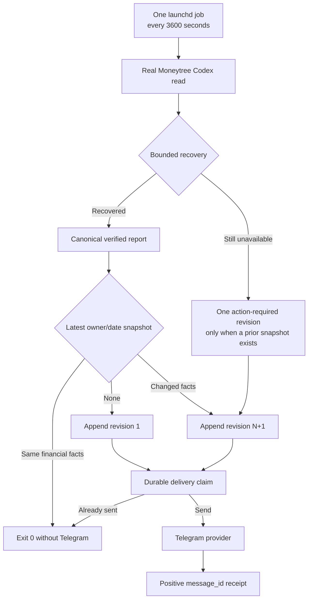

# Life Manager CFO — One Local Hourly Loop Implementation Plan

**Goal:** Install exactly one local `launchd` job that reads real Moneytree data every hour, repairs bounded transient
failures, stores the first daily snapshot or a meaningful same-day correction, and sends at most one Telegram report
per snapshot revision.

**Status:** ACTIVE — this is the only unfinished CFO-1i implementation slice.

**Ponytail decision:** Reuse the existing reader, recovery, report builder, revision RPC, delivery dedupe, renderer,
and Telegram transport. Add no agent, service, queue, database, framework, dependency, or cloud runner. The committed
change is exactly one runner plus one focused test. The local plist is runtime configuration, not repository code.

**Soft target:** 2 files; runner <=100 production LOC; focused tests <=180 LOC. If the runner exceeds 100 production
LOC, remove abstraction or defer nonessential output before implementation continues.

## Operating flow



## Evidence and decisions

- Local `man launchd.plist`: `StartInterval` starts a job every N seconds; an interval is skipped if the job is still
  running. Use one `StartInterval=3600`, one `RunAtLoad`, and no second calendar trigger.
- Apple, “Scheduling Timed Jobs”:
  https://developer.apple.com/library/archive/documentation/MacOSX/Conceptual/BPSystemStartup/Chapters/ScheduledJobs.html
  — “The preferred way to add a timed job is to use launchd.”
- Live audit: `ai.anicca.cfo-daily` is stopped with exit 127; `ai.anicca.life-manager-financial-report` is stopped with
  exit 1 and uses the obsolete five-minute enqueue path. Neither imports the current CFO sender.
- Live read-only audit: the correction RPC, revision-one RPC, and delivery-claim RPC all exist. A fresh real Moneytree
  read matched today's stored asset total; no private amount was printed.

## Task 1 — Luna builds the runner with TDD

**Luna owns only:**

- Create `apps/life-call/scripts/cfo-hourly-local.js`
- Create `apps/life-call/scripts/cfo-hourly-local.test.js`

Luna is not alone in the worktree. Do not revert or modify any other file. Do not edit specs, migrations, launchd
configuration, package metadata, existing CFO modules, or unrelated user changes.

### Required interfaces

- Export `runHourlyCfo(options)` and `main(options)`.
- `options` permits dependency injection for focused tests; production defaults use current modules and `process.env`.
- Required runtime values are `SUPABASE_URL`, `SUPABASE_SERVICE_ROLE_KEY`, `LM_UID_SECRET`,
  `LM_TELEGRAM_BOT_TOKEN`, plus owner UID and Telegram chat ID supplied by the local plist.
- Safe stdout is one JSON line containing only status, reporting date, revision, and booleans. Never print balances,
  account references, UID, chat ID, credentials, provider payloads, URLs, thrown messages, or stack traces.

### RED tests

1. A fresh first daily read performs one revision-1 append and one deduped Telegram delivery.
2. A second same-facts hourly read performs no append and no Telegram send, returns `quiet`, and exits successfully.
3. Changed financial facts append exactly revision `N+1`, then deliver that exact revision once.
4. A transient read failure recovered by the existing bounded recovery path sends only the recovered accurate report;
   it never sends the failed attempt.
5. Provider/config failure returns one fixed redacted failure status and cannot expose sentinel amount/account/secret
   values in stdout or stderr.

Run RED:

```bash
node --test scripts/cfo-hourly-local.test.js
```

Expected: missing-module failure.

### Minimum GREEN behavior

1. Capture one clock value and derive the Tokyo owner date.
2. Call the existing `recoverMoneytreeRead`; its read callback calls `readMoneytreeViaCodex` with that same clock.
   Map the reader's closed unavailable error to a transient kind, use the existing bounded waits, and never log the
   failed payload.
3. Resolve the existing daily run identity.
4. Read only the latest snapshot metadata/report for the same UID and reporting date. Validate the returned report
   with the existing renderer before comparing it. Reject a mismatched run/date/revision.
5. If no snapshot exists and recovery succeeded, use `appendCfoDailySnapshot` for revision 1.
6. If the latest verified financial facts are unchanged, return `quiet`; the hourly refresh is real but Telegram is
   not spammed.
7. If facts changed or an existing healthy snapshot becomes action-required, build canonical revision `N+1` with
   `buildCfoDailyReportFromRecovery`, call the already-live `lm_append_cfo_daily_snapshot_revision` through the shared
   redacted RPC helper, and use the returned public ref. The downstream composite FK and delivery validator must keep
   a mismatched receipt fail-closed.
8. Call `deliverCfoTelegram` only with the exact persisted snapshot/revision. Its existing claim/receipt path prevents
   duplicate/new sends on retries.
9. If the first-ever read remains unavailable, return a safe retry status without inventing or sending a balance.

### Verify before handoff

```bash
node --test scripts/cfo-hourly-local.test.js
npm run test:cfo
npm test
git diff --check
```

Require focused GREEN, CFO suite GREEN, full suite exit 0, two changed files, and runner <=100 production LOC. Luna
reports RED evidence, GREEN counts, LOC, and diff only; Luna does not commit, push, install, or send real Telegram.

## Task 2 — Sol reviews, installs, and verifies

1. Fresh Sol review checks only Critical/Important: wrong owner, wrong revision, stale/fabricated money, duplicate
   Telegram, raw private output, unbounded retry, more than one scheduler, and plan/LOC drift. Any fix returns to the
   same Luna.
2. Sol performs a real no-send run with the current Moneytree connection and proves only safe booleans/counts.
3. Sol creates one local plist at
   `/Users/anicca/Library/LaunchAgents/ai.anicca.life-manager-cfo-hourly.plist` with `RunAtLoad=true`,
   `StartInterval=3600`, `ProcessType=Background`, the fixed worktree, and private owner identifiers only in local
   runtime configuration. No secret enters Git.
4. Before bootstrap, Sol boots out both measured broken legacy CFO jobs so exactly one scheduler remains. Their files
   remain recoverable; do not delete them.
5. Bootstrap the new job without a manual kickstart. Confirm `launchctl print`, safe logs, a real Moneytree read,
   snapshot/delivery state, and a positive Telegram receipt when a report is due.
6. Observe two consecutive autonomous launchd starts without manual repair. Both must read real Moneytree data and
   exit 0; an unchanged second run must be quiet. Only then close CFO-1i and Product Stage 7.

## Completion condition

Exactly one local hourly scheduler is loaded. Two consecutive autonomous scheduled real-data runs exit successfully,
the first due revision is durably sent or already receipted, unchanged data creates no Telegram spam, changed data is
append-only and delivered once, and logs contain no private finance data or credentials.
