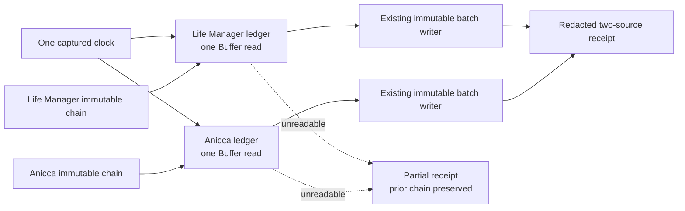

# CFO-2a2a.5b2b — Two-Source Local Usage Runner Plan

**Goal:** Read the two fixed local agent-usage ledgers once each, resume each from its immutable chain, and publish the next content-free batch without deleting prior evidence when one source is unavailable.

**Status:** READY — Sol plan complete; Luna implementation next.

## Ponytail full decision

Reuse `readLocalAgentUsageChain` and `collectAndWriteLocalAgentUsageBatch`. Add no database, daemon, scheduler, queue,
agent, OpenTelemetry span, price calculation, Telegram copy, raw-session scanner, or recovery framework. This slice only
composes existing functions. Hourly invocation belongs to 5b2c.

**Soft target:** create one runner and one focused test, then add the test to `test:cfo`: 3 files, <=100 added LOC total.
If the target is exceeded, cut cases or reuse helpers before writing more code.



## Files and ownership

Luna owns only:

- Create `apps/life-call/lib/cfo-local-agent-usage-runner.js`
- Create `apps/life-call/lib/cfo-local-agent-usage-runner.test.js`
- Modify only the `test:cfo` command in `apps/life-call/package.json`

Luna is not alone in the worktree. Do not edit specs, launchd, hourly Moneytree code, existing collector/chain/store
modules, dependencies, or unrelated changes. Do not commit, push, install, or send Telegram.

## Exact contract

Export `runLocalAgentUsageCollection(options = {})`.

- Capture one valid `collectedAt` from `options.now` or the current clock.
- Use `options.env.LIFE_MANAGER_STATE_HOME`, otherwise `<home>/.local/state/life-manager`, as `stateRoot`.
- Fixed sources and order:
  1. `life_manager_agent_usage` at `<stateRoot>/telemetry/agent-usage.jsonl`
  2. `anicca_agent_usage` at `<home>/.local/state/anicca/telemetry/agent-usage.jsonl`
- `options.home`, `readFile`, `readChain`, and `writeBatch` are the only test seams. Production defaults use
  `os.homedir`, `fs.readFileSync`, `readLocalAgentUsageChain`, and `collectAndWriteLocalAgentUsageBatch`.
- For each source, call the chain reader once, call the ledger reader once, then call the writer once with
  `chain.source_state` or `null` when the chain is empty. Never reread to retry inside this function.
- Process both sources independently. A source read failure publishes nothing for that source, preserves its prior
  immutable chain, and returns the fixed source status `unavailable` with `coverage_exceptions=["source_unreadable"]`.
  The other source still runs. A later hourly invocation is the recovery path.
- A chain or writer failure is not a provider outage. It returns `failed` for that source with the fixed
  `coverage_exceptions=["local_state_failure"]`; it never restarts from null or overwrites evidence.
- The exact deeply frozen top-level receipt is `{status,collected_at,sources,coverage_exceptions}`. `status` is
  `complete` only when both sources published, otherwise `partial`. Every source entry has the same exact keys:
  `{source_id,status,record_id,byte_offset,event_count,mapping_id,coverage_exceptions}`. A published entry copies the
  existing writer receipt, adds `status="published"`, and uses an empty exception array. Unavailable/failed entries
  use null receipt fields and only their fixed exception. Top-level exceptions are the unique sorted union. No raw
  bytes, path, token values, prompt, payload, account, secret, error message, or stack enters the receipt.
- Invalid options, state root, home, or clock throw a fixed redacted `cfo_local_agent_usage_runner_invalid:<reason>`.

## Task 1 — Luna writes RED then minimum GREEN

Write the smallest tests that prove:

1. Both fixed ledgers are each read exactly once, both chains are read once, prior states are passed to the matching
   writer, one clock is shared, ordering is fixed, and the receipt is deeply frozen/content-free.
2. If one source read throws a hostile sentinel, the other source still publishes, the failed source writer is never
   called, the result is partial with only `source_unreadable`, and the sentinel/path/raw bytes never escape.
3. If a chain fails, that source writer is never called with null, the other source still publishes, and the only
   public failure is `local_state_failure`.

Run RED:

```bash
cd apps/life-call
node --test lib/cfo-local-agent-usage-runner.test.js
```

Expected: missing-module failure.

Implement the exact contract with direct composition. Do not add classes, generalized source registries, retries,
logging, filesystem locking, parallelism, or a CLI.

## Task 2 — Verify and hand back to Sol

```bash
cd apps/life-call
node --test lib/cfo-local-agent-usage-runner.test.js
node --test lib/cfo-local-agent-usage-batch-store.test.js lib/cfo-local-agent-usage-chain.test.js lib/cfo-local-agent-usage-runner.test.js
npm run test:cfo
npm test
node --check lib/cfo-local-agent-usage-runner.js
node --check lib/cfo-local-agent-usage-runner.test.js
git diff --check
```

Report RED evidence, GREEN counts, changed files, and added LOC. Sol performs fresh review, real isolated two-ledger
E2E, spec/state update, commit, and push. Completion requires both live source files to be read once without source
mutation, two immutable receipts with verified hashes, and no raw/private output.
