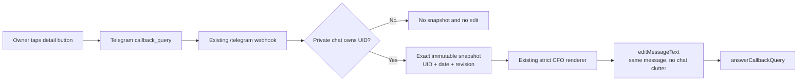

# Life Manager CFO Telegram Drill-down Callback Implementation Plan

> **Execution routing:** Ponytail full and Superpowers TDD/subagent-driven-development are mandatory. Sol owns this
> plan, scope, review, real E2E, state, commit, and push. Only Luna writes production code or tests.

**Goal:** Make the existing `口座を見る`, `正確さを見る`, and `なぜこの金額？` buttons open the exact immutable CFO
snapshot inside the same Telegram message, without adding a bot, poller, database object, service, dependency, or
new message.

**Architecture:** The hourly report remains a local job. A button tap is delivered by Telegram to the already-live
Life Manager `/telegram` webhook. That handler resolves the private chat to its existing owner UID, reads exactly the
requested `(uid, reporting_date, revision)` snapshot, renders the requested view with the existing strict CFO
renderer, and edits the same message. The callback carries identity only; it never carries a financial amount.



**Measured foundations:** The renderer already emits deterministic `cfo:<view>:<YYYYMMDD>:<revision>` callback
data, the production webhook already parses callback queries and resolves Telegram chats to owner rows, and the
latest real Supabase snapshot is readable with the exact closed `report_payload` keys. Telegram's official Bot API
says a callback query represents an inline-keyboard tap, requires `answerCallbackQuery` so the client stops showing
progress, and recommends message editing to reduce chat clutter. Sources:

- Telegram Bot API, CallbackQuery: https://core.telegram.org/bots/api#callbackquery — “incoming callback query from
  a callback button in an inline keyboard.”
- Telegram Bot API, answerCallbackQuery: https://core.telegram.org/bots/api#answercallbackquery — the client shows a
  progress bar until this method is called.
- Telegram Bot API, editMessageText: https://core.telegram.org/bots/api#editmessagetext — editing changes the existing
  message and is useful with inline keyboards to reduce clutter.

## Ponytail size and scope gate

| Element | Files | Production LOC soft target | Why it exists |
|---|---:|---:|---|
| Exact callback loader/editor in existing CFO Telegram module | 1 modify | <=75 | Reuse parser, renderer, Bot API helper |
| Existing webhook wiring | 1 modify | <=15 | Route only the already-defined `cfo:` prefix |
| Focused CFO callback tests | 1 modify | 0 | Prevent wrong-owner or wrong-snapshot finance display |

Exactly three files and <=90 changed production LOC. Explicitly excluded: new callback table/RPC, polling/getUpdates,
new bot token, new service, browser UI, new message sends, scheduler/launchd work, retries/queues, caching, generic
callback frameworks, spending advice, Binance, and combinatorial internal-object edge cases.

---

### Task 1: Open one exact CFO snapshot from an existing Telegram button

**Files:**
- Modify: `apps/life-call/lib/cfo-telegram.test.js`
- Modify: `apps/life-call/lib/cfo-telegram.js`
- Modify: `apps/life-call/server.js`

- [ ] **Step 1: Write the focused failing tests**

Add injected-dependency tests for `handleCfoTelegramCallback(input, options)`:

1. a valid private-chat `cfo:accounts:20260810:1` callback performs one owner-scoped read with filters for the exact
   UID, reporting date, and revision; renders the returned closed snapshot; edits the original chat/message once;
   answers the callback once; performs zero `sendMessage` calls; and returns a frozen safe receipt;
2. actor/chat mismatch, malformed callback data, missing owner, zero/duplicate rows, provider failure, and a returned
   payload whose date/revision differs from the callback never edit a message or reveal another owner's snapshot;
3. failures answer the callback with one fixed non-technical toast and never include provider bodies, amounts,
   credentials, stack traces, or raw errors.

- [ ] **Step 2: Run RED**

```bash
cd apps/life-call
node --test lib/cfo-telegram.test.js
```

Expected: non-zero because `handleCfoTelegramCallback` does not exist.

- [ ] **Step 3: Implement minimum GREEN**

In `cfo-telegram.js`, parse only `cfo:(summary|accounts|accuracy|why):YYYYMMDD:positive-safe-integer`. Require non-empty
UID/token/Supabase settings, a positive Telegram message ID, and a private-chat actor (`actorId === chatId`) before
network I/O. Build the PostgREST URL with `URL`/`searchParams`, select only `report_payload`, and filter by exact
`uid`, `reporting_date`, and `revision` with `limit=1`. Require one row and require the payload's reporting date and
revision to equal the callback before passing it to `renderCfoTelegram`.

Use the existing raw `tgCall` helper to invoke `editMessageText` with the original chat/message, HTML mode, rendered
text, and rendered inline keyboard. Then invoke `answerCallbackQuery`. Never call `sendMessage`. On any invalid or
unavailable path, do no edit, answer once with a fixed short Japanese retry toast, and return a frozen closed failure
receipt; do not log or return raw provider/model/error data.

In `server.js`, detect only the `cfo:` prefix before the existing generic callback acknowledgement, resolve the owner
with the existing `rowByChatId`, and call the CFO handler. All ask/Gmail/discovery behavior remains byte-for-byte in
the existing route.

- [ ] **Step 4: Verify GREEN**

```bash
cd apps/life-call
node --test lib/cfo-telegram.test.js
npm run test:cfo
npm test
git diff --check
```

Expected: all exit `0`; exactly three files changed; changed production LOC <=90.

- [ ] **Step 5: Fresh review and real no-send E2E**

Fresh Sol review checks only Critical/Important: wrong-owner reads, mismatched snapshot rendering, unvalidated money,
duplicate/new Telegram messages, private output, callback acknowledgement, and plan/LOC drift. Sol then uses the real
owner mapping and immutable Supabase snapshot while injecting Telegram edit/answer collectors. Required evidence:
one exact snapshot, the expected requested view, one edit, one answer, zero sends, no private field printed, and no
database mutation. A real provider button tap is verified when the webhook build is deployed; local launchd remains
the report producer and is not installed in this task.

- [ ] **Step 6: Close**

Update this plan and the parent CFO spec with RED/GREEN/review/E2E evidence, commit, and push. Make the single hourly
local launchd loop the only active item.

## Definition of done

An existing CFO report button deterministically opens accounts, accuracy, explanation, or summary for the same owner,
date, and revision in the same Telegram message. No amount comes from callback data or model prose, no new message is
created, and a wrong owner or wrong snapshot can never be displayed.
