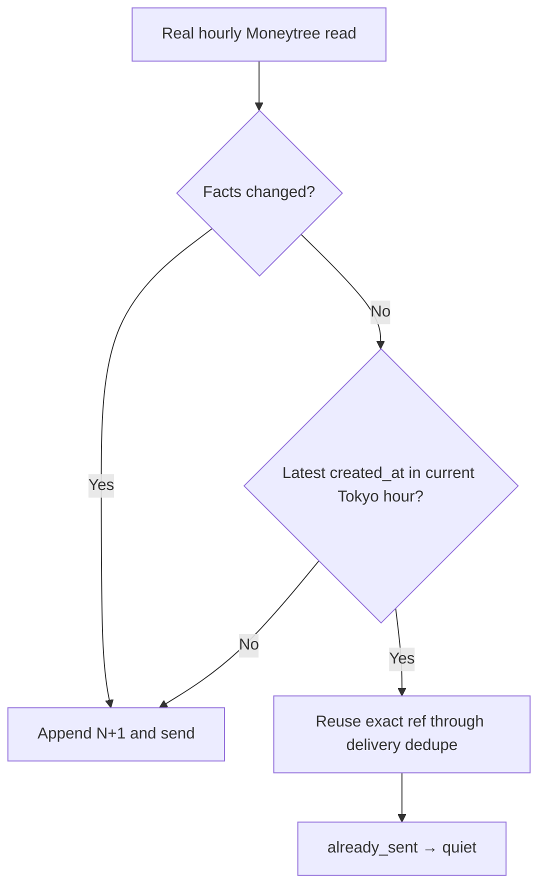

# CFO-OPS2 Hourly Owner-Visible Delivery Implementation Plan

> **For agentic workers:** Sol owns this plan, review, live rollout, verification, state, commit, and push. Luna alone
> edits production/test in the loaded CFO worktree and follows TDD.

**Status:** READY FOR PLAN REVIEW

**Goal:** Send one truthful finance report per Asia/Tokyo owner hour even when balances are unchanged, while keeping
same-hour retries idempotent and preserving immediate sends for meaningful changes.

**Architecture:** Reuse the existing immutable snapshot revision and Telegram claim/receipt path. Add the existing
snapshot `created_at` to the latest-row projection. Same facts within the same owner hour reuse the exact snapshot and
delivery receipt; same facts from a prior owner hour append revision `N+1` and send through the existing dedupe path.
No table, RPC, delivery key, scheduler, or Telegram sender changes.

## Ponytail full gate

- Modify exactly two existing files in the **loaded** worktree
  `/Users/anicca/anicca-project/.worktrees/cfo-4d1-finalize/apps/life-call`:
  - `scripts/cfo-hourly-local.js`
  - `scripts/cfo-hourly-local.test.js`
- Soft target: at most 15 production additions + 30 test additions; hard maximum **50 gross added LOC**.
- No migration, dependency, new file, service, retry loop, alternative sender, direct Telegram call, or new snapshot
  table. Do not change Moneytree values, evidence labels, report copy, launchd interval, or provider-billing behavior.
- One new behavior test only. Existing same-hour/delivery/crash recovery tests remain the regression suite.

## Exact behavior



The prior-hour heartbeat uses a new immutable revision, so the existing unique delivery identity remains sufficient.
If append succeeds and delivery crashes, a same-hour retry reads that revision, reuses its exact ref, and lets the
existing claim/receipt path send once or return `already_sent`.

## Task 1 — TDD the hourly boundary

### Step 1: RED in the existing test file

Change `snapshotRow` to include a sixth exact key, `created_at`, defaulting to `CLOCK.toISOString()`. Add one test:

- current clock is `CLOCK`;
- latest snapshot has identical facts but `created_at` exactly one hour earlier;
- require one `appendCfoDailySnapshotRevision` call with revision `2`, supersedes `1`, and unchanged verified JPY
  amount;
- require one delivery using the new ref/revision and result `{status:"sent", appended:true, delivered:true}`.

Run:

```bash
node --test scripts/cfo-hourly-local.test.js
```

Expected RED: the new test receives existing `quiet`/revision `1`; no unrelated test failure.

### Step 2: Minimal production change

In `scripts/cfo-hourly-local.js` only:

1. Add a deterministic `ownerHour(date)` formatter for `Asia/Tokyo`, returning `YYYY-MM-DDTHH`. Use
   `Intl.DateTimeFormat(..., { hourCycle: "h23" })`; no environment timezone dependency.
2. Make `validateRow` require exactly six keys including `created_at`; require a valid timestamp using the existing
   RPC timestamp validator.
3. Add `created_at` to the PostgREST `select` list in `latestSnapshot`.
4. Narrow the existing same-facts early branch to:

   ```js
   latest && sameFacts(latest.report_payload, currentBundle.report)
     && ownerHour(new Date(latest.created_at)) === ownerHour(clock)
   ```

   Keep the branch's exact persisted snapshot/ref and delivery dedupe behavior unchanged. When the hours differ,
   fall through to the existing revision append/send path.

### Step 3: GREEN and scope gates

Run in the loaded package:

```bash
node --test scripts/cfo-hourly-local.test.js
npm run test:cfo
npm test
node --check scripts/cfo-hourly-local.js
node --check scripts/cfo-hourly-local.test.js
git diff --check
git diff --numstat
```

Require all gates exit `0`, exactly two modified files, and `<=50` gross additions. Luna reports RED/GREEN and does
not stage, commit, push, touch launchd, query live finance, or send Telegram.

## Task 2 — Sol review and live verification

1. Fresh Sol reviews only Critical/Important: wrong owner-hour boundary, same-hour duplicate send, changed-facts
   regression, invalid snapshot timestamp accepted, raw finance/secret leakage, or scope breach.
2. Sol commits/pushes the loaded branch and updates the CFO spec.
3. Sol records plist hash/log offsets/run count, then kickstarts the **existing** label once. This is the first live
   cross-hour heartbeat and may append a real revision and send Telegram.
4. Require terminal exit `0`, one new content-free stdout result, zero new stderr, unchanged plist, and positive
   provider delivery evidence before claiming the owner received the report.

## Out of scope

Minute-level delivery, user-configurable cadence, cloud scheduling, another notification channel, report redesign,
billing allocation, token repair, Binance, tax, trading, or historical snapshot backfill.
