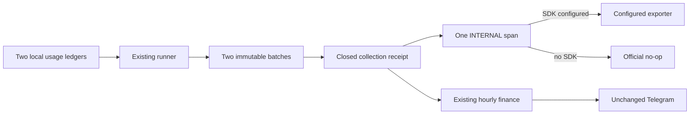

# CFO-2a2a.5c — Content-Free Local Usage Batch Span Plan

> **For agentic workers:** REQUIRED SUB-SKILL: Use superpowers:subagent-driven-development and test-driven-development. Execute checkbox steps in order.

**Status:** READY FOR LUNA — fresh Sol plan review: ship

**Goal:** When a TracerProvider is configured, emit one content-free INTERNAL OpenTelemetry span after each completed
local agent-usage collection so an operator can correlate the two durable checkpoints and event counts without
treating telemetry as token truth. With the current local hourly process, which registers no provider, this path is a
complete no-op and the immutable usage ledger remains the working measurement system.

**Architecture:** Extend only the existing two-source runner and its existing test. The immutable batch files remain
the source of truth and are written before the span. The runner emits one best-effort span from its already validated,
closed receipt. A configured/global tracer records it; the local launchd job remains silent when no SDK provider is
configured. The exact instrumentation scope is `anicca-life-call-cfo`. Telemetry can never change the receipt, retry a
write, alter stdout, or block Moneytree/Telegram.

**Ponytail full decision:** Reuse the existing runner, `@opentelemetry/api`, and test dependency. Add no module,
exporter, collector, DB, queue, scheduler, public receipt field, trace ID persistence, token estimator, or UI change.

**Soft target:** exactly 2 files; <=45 additions and <=15 deletions. Hard stop before a third file or 100 additions.



## Truth and privacy boundary

- The immutable records and source hashes are truth. The span is correlation transport only.
- The span contains no token subtotal, cash/USD/JPY value, prompt, response, raw row, model output, file path, owner,
  chat ID, credential, environment value, exception label, or error text.
- A source checkpoint is only its fixed source ID, publication status, content-addressed `record_id`, committed
  `byte_offset`, and new `event_count`. Failed/unavailable sources omit nullable checkpoint/count attributes.
- Never write a trace/span ID back into the collection receipt or durable batch.
- Strengthen the existing writer receipt boundary so `event_count <= source bytes.length`. Add published event counts
  with normal Number addition and require `Number.isSafeInteger(total)`. If the telemetry projection still cannot
  produce a safe total, emit no span; never clamp, estimate, or alter the collection receipt.
- Start the span only after both source attempts have produced the final frozen receipt. Any tracer/span failure is
  swallowed without reading/logging the error and returns that same receipt object.

## Exact span contract

Instrumentation scope: `anicca-life-call-cfo`; name: `collect local_agent_usage`; kind: `SpanKind.INTERNAL`; zero
events; no status/error mutation.

Always present attributes:

```text
cfo.local_agent_usage.status                       complete|partial
cfo.local_agent_usage.source.count                 2
cfo.local_agent_usage.published_source.count       0..2
cfo.local_agent_usage.event.count                  safe sum of published event_count values
cfo.local_agent_usage.coverage_exception.count     receipt coverage_exceptions length
cfo.local_agent_usage.life_manager.status          published|unavailable|failed
cfo.local_agent_usage.anicca.status                published|unavailable|failed
```

For each published source only:

```text
cfo.local_agent_usage.<life_manager|anicca>.record_id
cfo.local_agent_usage.<life_manager|anicca>.byte_offset
cfo.local_agent_usage.<life_manager|anicca>.event_count
cfo.local_agent_usage.<life_manager|anicca>.mapping_id
```

No attribute outside this closed list is allowed. `event.count` is ingested-row count, not token count. OTel never
repairs, estimates, or promotes missing token values.

## Task 1 — Luna TDD implementation

- [ ] **RED:** Extend `apps/life-call/lib/cfo-local-agent-usage-runner.test.js` using the existing in-memory OTel
  provider. In the complete case, register it globally, do not inject a tracer, and assert exactly one ended INTERNAL
  span with instrumentation scope `anicca-life-call-cfo`, exact name/closed attributes, zero events, identical returned
  receipt, and no content/path/secret sentinel; disable the test global provider afterward. Extend the existing partial
  case with an injected recording tracer to prove unavailable source checkpoint attributes are absent and totals
  include only the published source. Add compact assertions that an oversized writer `event_count` is rejected at the
  writer boundary, a synchronous hostile `startSpan` throw cannot change the durable receipt or log, and the default
  no-provider path emits nothing while returning the identical receipt. Run focused tests and record the RED reason.

- [ ] **GREEN:** Modify only `apps/life-call/lib/cfo-local-agent-usage-runner.js`. Reuse `trace` and `SpanKind` from
  `@opentelemetry/api`; accept an optional exact `tracer` test seam; otherwise call
  `trace.getTracer("anicca-life-call-cfo")` at run time. Enforce `event_count <= bytes.length`, derive the exact
  attributes only from the closed receipt, require a safe aggregate, start/end once after durable source attempts,
  swallow telemetry failure, and return the identical frozen receipt. Do not change source reading/writing or exports.

- [ ] **Gates:** run focused runner, hourly+runner, CFO, full npm, syntax, `git diff --check`, and exact two-file/LOC
  scope. Luna reports RED/GREEN and does not commit or push.

## Task 2 — Sol review, real proof, and close

- [ ] Fresh Sol implementation review returns `ship` against this exact contract.
- [ ] Sol independently reruns all gates and injects an in-memory tracer through the production runner against the
  real local ledgers/state in an isolated temporary state root. Prove one ended content-free span, valid checkpoint
  hashes/counts, unchanged source bytes, and no stdout/stderr/Telegram delivery. Separately prove the actual current
  launchd process has no registered provider, so its default OTel path is no-op while ledger collection remains live.
- [ ] Update this plan and both CFO specs with observed evidence; fetch, commit, push, and send one content-free
  Telegram milestone. Then 2a2a.6 becomes the only active item.

## Primary evidence

- [OpenTelemetry JS manual instrumentation](https://opentelemetry.io/docs/languages/js/instrumentation/) says library
  instrumentation should skip SDK initialization, and without a `TracerProvider` the API uses a no-op implementation.
  Therefore this slice emits through the API but does not create a competing exporter or mutate CFO stdout.
- The same official guide says manual instrumentation acquires a tracer with `getTracer` and recommends configuring
  exporters at the application boundary. This supports runtime tracer acquisition and injected recording proof.
