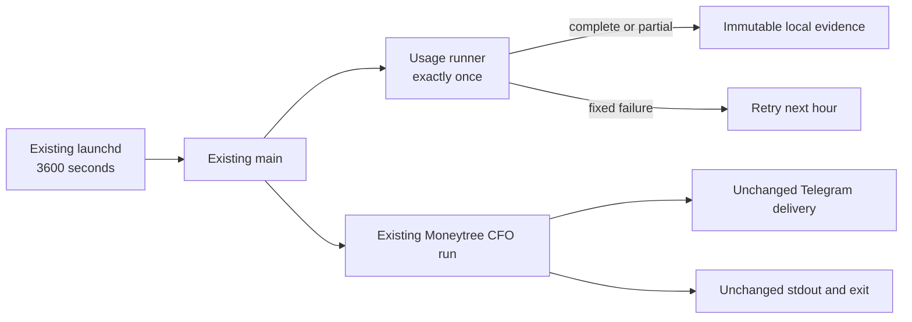

# CFO-2a2a.5b2c — Existing Hourly Loop Wiring

**Status:** READY — Sol plan complete; Luna implementation next.

**Goal:** Invoke the completed two-source usage runner once from the existing local hourly CFO entrypoint without
changing Moneytree decisions, Telegram copy, delivery dedupe, stdout, exit semantics, or scheduler count.

## Ponytail full decision

Modify the existing `main()` boundary. Add no scheduler, service, CLI, retry, queue, database, OTel span, report field,
Telegram message, or recovery system. Usage collection is supporting evidence: its failure must not suppress or alter
the accurate Moneytree report. The next hourly invocation is its self-heal retry.

**Soft target:** 2 files and <=20 added LOC total.



## Luna ownership

- Modify `apps/life-call/scripts/cfo-hourly-local.js`
- Modify `apps/life-call/scripts/cfo-hourly-local.test.js`

Luna is not alone in the worktree. Do not edit package metadata, specs, runner/chain/store modules, launchd, Telegram
renderer, DB/RPC code, dependencies, or unrelated changes. Do not commit, push, install, or send Telegram.

## Exact contract

- Import `runLocalAgentUsageCollection` from the completed runner.
- At the start of `main(options)`, select injected `options.runLocalAgentUsageCollection` or the production runner.
- Invoke it exactly once with only the same environment and, when it is a function, the same clock seam used by the
  hourly invocation. Do not pass Moneytree credentials, owner IDs, chat IDs, financial snapshots, or callbacks.
- Catch every usage-collection failure without reading its message. Do not log or send it. 5c adds content-free OTel
  observability; the next hourly invocation retries from the last durable cursor.
- Always continue to the existing `runHourlyCfo(options)`.
- Preserve the exact one-line stdout JSON, `main()` return shape, exit code rules, Moneytree read/recovery, snapshot
  append, Telegram dedupe/copy/buttons, and every existing `runHourlyCfo()` behavior.

## Task 1 — Luna TDD

Add one compact test that first RED-proves the missing call, then proves:

1. `main()` invokes an injected usage runner once before the financial read, with the exact environment and shared
   function clock seam.
2. Both a partial receipt and a hostile thrown error leave the existing stdout JSON, return shape, exit code, persisted
   snapshot, and Telegram delivery unchanged; no hostile value or usage field escapes.

Implement the minimum import and guarded call in `main()`. Do not restructure `runHourlyCfo()` or add public fields.

## Verification

```bash
cd apps/life-call
node --test scripts/cfo-hourly-local.test.js
node --test lib/cfo-local-agent-usage-runner.test.js scripts/cfo-hourly-local.test.js
npm run test:cfo
npm test
node --check scripts/cfo-hourly-local.js
node --check scripts/cfo-hourly-local.test.js
git diff --check
```

Sol then performs fresh review, repoints the one existing local launchd job to the reviewed worktree, triggers that
real loop once, and proves: exactly one scheduler, one new immutable batch per source, source files unchanged, safe
logs, and unchanged Telegram delivery semantics.

