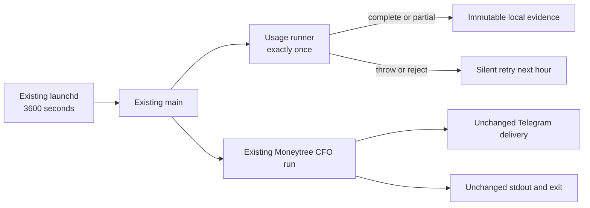

# CFO-2a2a.5b2c — Existing Hourly Loop Wiring Plan

> **For agentic workers:** REQUIRED SUB-SKILL: Use superpowers:subagent-driven-development. Execute checkbox steps in order.

**Status:** READY FOR LUNA — fresh Sol plan review: ship

**Goal:** Invoke the completed two-source usage runner once from the existing local hourly CFO entrypoint without
changing Moneytree decisions, Telegram copy/dedupe/buttons, stdout, exit semantics, or scheduler count.

**Architecture:** Add one guarded call at the start of existing `main()`. The usage lane persists supporting evidence;
the existing financial lane remains the only owner of Telegram and stdout. One existing launchd job already points to
this worktree at a 3600-second interval, so no scheduler/plist change is needed.

**Tech stack:** Existing Node.js CommonJS hourly script and `node:test`; no dependency, DB, OTel, launchd, or Telegram
module changes.

## Global constraints and Ponytail gate

- Sol owns plan, real launchd E2E, spec/state, commit, and push. Luna edits only the two owned files below.
- Modify `apps/life-call/scripts/cfo-hourly-local.js` and its existing `.test.js`; hard stop before a third file or >20
  added lines.
- Import and reuse `runLocalAgentUsageCollection`. Add no scheduler/service/CLI/retry/queue/log/report field.
- Usage failure is supporting-evidence failure: swallow it without reading/logging the error, then always run the
  unchanged `runHourlyCfo(options)`. The next hourly invocation retries from the durable cursor.
- Do not pass Moneytree data, owner/chat IDs, Telegram token, Supabase URL/key, callbacks, or the full environment to
  the usage runner.



## Exact contract

- At the start of `main(options={})`, select injected `options.runLocalAgentUsageCollection` only when it is a
  function; otherwise use the production runner.
- Build a new `usageEnv` containing only the own data-property `LIFE_MANAGER_STATE_HOME` from
  `options.env || process.env`, when present. Never forward the source environment object.
- Call and `await` the usage runner exactly once before `runHourlyCfo`, with exact keys `{env}` only. Do not forward
  `options.now`: the usage timestamp may use its own current clock, while the financial clock seam must retain its
  existing single invocation and reporting-date behavior. Awaiting catches synchronous throws and Promise
  rejections. Ignore complete/partial receipts entirely.
- Catch without reading the error and emit no log/stdout/Telegram. Always continue to exactly one existing
  `runHourlyCfo(options)` call.
- Preserve the exact one-line stdout JSON, `main()` return shape, exit codes, Moneytree recovery, snapshot append,
  Telegram delivery, and all `runHourlyCfo()` behavior.

## Task 1 — Luna TDD

- [ ] **Step 1: Add one compact RED regression**

Extend the existing `main` test seam with this observable sequence:

```js
const calls = [], output = [], delivered = [];
const options = baseOptions({
  env: { ...ENV, LIFE_MANAGER_STATE_HOME: "/tmp/cfo-state", HOSTILE_SECRET: "must-not-pass" },
  runLocalAgentUsageCollection: async input => { calls.push(["usage", input]); return { status: "partial" }; },
  readMoneytreeViaCodex: async () => { calls.push(["moneytree"]); return moneytreeRead(100); },
  deliverCfoTelegram: async input => { delivered.push(input); return { status: "sent" }; },
  stdout: line => output.push(line),
});
```

One table runs `partial`, synchronous hostile throw, and rejected Promise. Assert usage runs once before `moneytree`;
its input is exactly `{env:{LIFE_MANAGER_STATE_HOME:"/tmp/cfo-state"}}`; `options.now` is called exactly once total by
the unchanged financial lane; each case produces the same existing summary/stdout/delivery shape; neither
`HOSTILE_SECRET` nor the thrown sentinel nor usage fields escape.

Run from `apps/life-call`:

```bash
node --test scripts/cfo-hourly-local.test.js
```

Expected RED: the usage call count is zero.

- [ ] **Step 2: Add the minimum guarded call**

Production edit shape:

```js
const { runLocalAgentUsageCollection } = require("../lib/cfo-local-agent-usage-runner.js");
async function main(options = {}) {
  const usage = typeof options.runLocalAgentUsageCollection === "function"
    ? options.runLocalAgentUsageCollection : runLocalAgentUsageCollection;
  try {
    const sourceEnv = options.env || process.env;
    const descriptor = Object.getOwnPropertyDescriptor(sourceEnv, "LIFE_MANAGER_STATE_HOME");
    const env = descriptor && Object.hasOwn(descriptor, "value")
      ? { LIFE_MANAGER_STATE_HOME: descriptor.value } : {};
    await usage({ env });
  } catch {}
  const result = await runHourlyCfo(options);
  // existing stdout and return lines remain byte-for-byte unchanged
}
```

Do not restructure `runHourlyCfo()` or add public fields.

- [ ] **Step 3: Run GREEN and complete gates**

```bash
cd apps/life-call
node --test scripts/cfo-hourly-local.test.js
node --test lib/cfo-local-agent-usage-runner.test.js scripts/cfo-hourly-local.test.js
npm run test:cfo
npm test
node --check scripts/cfo-hourly-local.js
node --check scripts/cfo-hourly-local.test.js
git diff --check
```

Expected: all exit 0; exactly two owned files and <=20 additions. Luna reports RED/GREEN and does not commit/push.

## Task 2 — Sol real loop verification and close

- [ ] Fresh Sol implementation review returns `ship`.
- [ ] Record both source file hashes/sizes and immutable batch counts; verify the single loaded launchd job still has
  `StartInterval=3600` and points to this reviewed worktree.
- [ ] Declare the production trigger, `launchctl kickstart` the existing job once, and wait for completion. Do not
  create/repoint/reload a job.
- [ ] Prove each source gained exactly one valid immutable batch, source files are byte-identical, logs are content
  safe, scheduler count remains one, and existing stdout/Telegram delivery semantics remain unchanged.
- [ ] Update specs, commit, push, and send the content-free milestone. Then 5c becomes the only active item.
