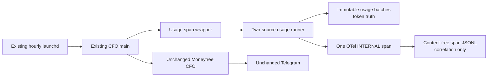

# CFO-2a2a.5c — Content-Free Local Usage OTel Span Plan

> **For agentic workers:** REQUIRED SUB-SKILL: Use superpowers:subagent-driven-development. Execute checkbox steps in order.

**Status:** COMPLETE — fresh Sol implementation review: ship; real launchd E2E passed

**Goal:** Emit exactly one real OpenTelemetry `INTERNAL` span for each hourly local-agent-usage collection and retain
one content-free local record that links the span to the immutable usage batches. The span is correlation evidence,
never token truth or cash spend.

**Architecture:** Wrap the existing two-source runner without changing it. A per-call `NodeTracerProvider` and
`InMemorySpanExporter` create and finish one real SDK span without console output. After `forceFlush`, copy only a
closed allowlist of span identifiers, status, and attributes into one append-only local JSONL line under the existing
Life Manager state root. The immutable batch journal remains the only token-value source of truth.

**Tech stack:** Existing Node.js CommonJS, `node:test`, `@opentelemetry/api`, and
`@opentelemetry/sdk-trace-node`. Add no dependency, service, collector, DB, scheduler, Telegram field, or retry loop.

## Evidence and Ponytail gate

- OpenTelemetry JS manual instrumentation starts a span with `tracer.startSpan(...)` and explicitly calls
  `span.end()`: https://opentelemetry.io/docs/languages/js/instrumentation/
- The official exporter guide presents OTLP for a configured collector/backend and separately identifies
  `ConsoleSpanExporter`: https://opentelemetry.io/docs/languages/js/exporters/
- The trace concepts guide says an internal span represents work that does not cross a process boundary:
  https://opentelemetry.io/ja/docs/concepts/signals/traces/
- This local runtime has no configured OTLP endpoint. The existing provider-usage default uses
  `ConsoleSpanExporter`, which would break the hourly loop's exact one-line stdout contract. A no-op global tracer
  would not prove an emitted production span. Therefore this slice reuses the installed SDK and adds only a
  content-free local sink; cloud OTLP export remains deferred until a real endpoint exists.

## Scope and soft target

- Sol owns this plan, real E2E, spec/state, commit, and push. Luna owns only the three implementation files below.
- Add `apps/life-call/lib/cfo-local-agent-usage-span.js`.
- Modify `apps/life-call/scripts/cfo-hourly-local.js` and its existing `.test.js`.
- Hard stop before a fourth implementation file or more than 100 added lines total. Soft target: production 45,
  test 45, wiring 5 additions.
- Do not modify the usage runner, immutable batch format, Moneytree flow, Telegram copy/buttons/dedupe, launchd plist,
  package files, or provider GenAI span contract.



## Exact contract

### Call and failure semantics

- Export `captureLocalAgentUsageCollection(collect, input)` from the new module. Before any span, collector, clock, or
  filesystem effect, require a non-proxy function plus an exact plain own-data-property `{env}` object. `env` is an
  exact plain own-data-property object with zero keys or the single key `LIFE_MANAGER_STATE_HOME`. Absent,
  `undefined`, and `""` preserve the runner's existing local default; only a non-empty value must be a string and a
  canonical absolute non-root path. Reject arrays, proxies, custom prototypes, accessors, symbols, extra keys, and
  invalid non-empty paths with exactly `cfo_local_agent_usage_span_failed:invalid_input`.
- Resolve the output root from that sanitized `LIFE_MANAGER_STATE_HOME` value or the existing local default. No other
  environment key is read.
- Start exactly one span named `cfo.local_agent_usage.collect` with `SpanKind.INTERNAL`, call and await `collect(input)`
  exactly once, then end and flush exactly once. Never retry.
- A valid `complete` receipt leaves span status `UNSET`. A valid `partial` receipt sets `SpanStatusCode.ERROR` and
  `error.type=collection_partial`. A collector throw becomes `error.type=collection_failed`; never record the thrown
  value or exception event, persist the redacted error span, and throw exactly
  `cfo_local_agent_usage_span_failed:collection`.
- An invalid receipt produces only the fixed `error.type=invalid_receipt`, persists that content-free error span, and
  throws exactly `cfo_local_agent_usage_span_failed:invalid_receipt`. Local sink failure throws exactly
  `cfo_local_agent_usage_span_failed:export`. Any tracer/provider/start/end/forceFlush/finished-span-count/sink or
  shutdown failure also maps to that same fixed `:export` error. Export failure takes precedence over an earlier
  collection or invalid-receipt error; shutdown is attempted exactly once and its raw failure never escapes.
  No path, secret, receipt, SDK detail, or underlying error appears in errors/logs.
- The hourly caller catches all wrapper failures exactly as it currently catches runner failures and always continues
  to the unchanged financial lane. The usage collection remains durable even if span export fails.

### Closed receipt and attributes

Accept only the runner's exact shapes. Every object must be a non-proxy plain object whose complete own-key set is the
listed string keys and whose properties are enumerable data properties; reject arrays, custom prototypes, accessors,
symbols, missing keys, and extras:

```text
receipt = {status, collected_at, sources, coverage_exceptions}
source = {source_id, status, record_id, byte_offset, event_count, mapping_id, coverage_exceptions}
```

`collected_at` must be a canonical valid RFC3339 timestamp. There must be exactly one source for each fixed ID
`life_manager_agent_usage` and `anicca_agent_usage`. Published
sources require a 64-lowercase-hex record ID, non-negative safe integer byte offset/event count,
`mapping_id=local_agent_usage_v1`, and no coverage exception. Failed/unavailable sources require all four evidence
fields null and exactly one fixed `local_state_failure|source_unreadable` exception. Receipt status and the unique
sorted union must agree with its sources.

Every `sources` or `coverage_exceptions` value must itself be a non-proxy ordinary dense array with
`Object.getPrototypeOf(value) === Array.prototype`; its complete own-key set is exactly its dense enumerable data
indices plus the non-enumerable data `length`. Reject sparse arrays, subclasses, accessors, symbols, and extra keys
before reading any element.

Construct attributes field-by-field; never spread caller data:

```text
cfo.operation.name = local_agent_usage.collect
cfo.usage.collection.status = complete|partial
cfo.usage.collection.collected_at = RFC3339
cfo.usage.collection.source_count = 2
cfo.usage.collection.coverage_exception_count = integer
cfo.usage.collection.coverage_exceptions = fixed string array (omit when empty)
cfo.usage.source.<fixed_source_id>.status
cfo.usage.source.<fixed_source_id>.record_id       (published only)
cfo.usage.source.<fixed_source_id>.byte_offset     (published only)
cfo.usage.source.<fixed_source_id>.event_count     (published only)
cfo.usage.source.<fixed_source_id>.mapping_id      (published only)
error.type                                         (partial/error only)
```

Never emit `gen_ai.usage.*`, any token value, prompt, response, raw row, provider payload, filesystem path, owner/chat
identifier, environment value, credential, or exception text.

### Exact local span record

Append one LF-terminated JSON object to
`<state-root>/telemetry/cfo-local-agent-usage-otel-spans.jsonl`, using directory mode `0700` and new-file mode `0600`:

```json
{"schema_version":1,"trace_id":"32 lower hex","span_id":"16 lower hex","name":"cfo.local_agent_usage.collect","kind":0,"status_code":0,"attributes":{}}
```

Copy only the seven top-level keys above and the closed attributes above from the one finished SDK span. Do not
serialize the ReadableSpan, resource, instrumentation scope, events, links, exception, or raw receipt. This file is
diagnostic correlation evidence and may be rebuilt or lost without changing token truth.

## Task 1 — Luna RED

- [x] Extend `scripts/cfo-hourly-local.test.js` with one compact helper test using a private temporary state root and
  the production wrapper. A complete fixed receipt must call the collector once, return the same receipt object, and
  append exactly one parseable line with exact top-level keys, `INTERNAL` kind, `UNSET` status, two source
  checkpoints/counts, and no token/prompt/path/secret/sentinel text.
- [x] In the same test, run a partial receipt and a thrown hostile sentinel. Assert one new line per invocation;
  exact ERROR/error.type values; the throw is replaced by the fixed error; zero console calls; and no extra span,
  event, link, token value, source path, receipt extra key, or hostile text escapes.
- [x] In one compact table, make the target JSONL path an existing directory while the collector (a) throws a hostile
  sentinel and (b) returns an invalid hostile receipt. Both calls must end in the fixed `:export` error, proving export
  precedence; no raw error, path, getter, array extra, or hostile value may appear in output or logs.
- [x] Add a production wrapper seam to the existing hourly ordering test. It must receive the selected usage function
  and exact sanitized `{env}` input once before Moneytree. Make the shared test options use a no-op wrapper seam so
  legacy tests cannot write live state.

Run from `apps/life-call`:

```bash
npm ci
node --test scripts/cfo-hourly-local.test.js
```

Expected RED: the module/export is missing and the hourly wrapper call count is zero.

## Task 2 — Luna GREEN

- [x] Implement the new wrapper with one per-call SDK provider, one `SimpleSpanProcessor`, and one
  `InMemorySpanExporter`. End, `forceFlush`, require exactly one finished span, append the allowlisted record, and
  `shutdown` in `finally`. Keep all helpers private.
- [x] In `main()`, select injected `options.captureLocalAgentUsageCollection` only when it is a function; otherwise use
  the production wrapper. Replace only `await usage({env})` with `await capture(usage, {env})` inside the existing
  silent usage `try/catch`. Do not restructure `runHourlyCfo()`.
- [x] Run the focused test until GREEN, then all gates:

```bash
cd apps/life-call
node --test scripts/cfo-hourly-local.test.js
node --test lib/cfo-local-agent-usage-runner.test.js scripts/cfo-hourly-local.test.js
npm run test:cfo
npm test
node --check lib/cfo-local-agent-usage-span.js
node --check scripts/cfo-hourly-local.js
node --check scripts/cfo-hourly-local.test.js
git diff --check
```

Expected: all exit 0; exactly three owned implementation files and <=100 additions. Luna reports RED/GREEN and does
not commit or push.

## Task 3 — Sol review, real E2E, and close

- [x] Fresh Sol review proves one real SDK span/line per call, exact closed attributes, fixed errors, secret exclusion,
  no console output, and unchanged financial behavior.
- [x] Before touching launchd, verify the one on-disk and loaded `ai.anicca.life-manager-cfo-hourly` job both point to
  this reviewed worktree and are idle. Record current source-ledger hashes/sizes, immutable batch finals, OTel span
  line count, and CFO stdout/Telegram baseline. If either path drifted, stop this trigger and repair the same job under
  the already-approved idle-only rollback procedure; never create a second scheduler.
- [x] Declare and trigger the reviewed existing job once. Prove source ledgers are prefix-preserved, each source gains
  one valid immutable batch, the span file gains exactly one content-free line whose record IDs match that run's two
  batch receipts, stdout remains one financial JSON line, stderr remains empty, and Telegram dedupe/delivery remains
  truthful.
- [x] Update parent/child specs, commit, fetch/merge without overwriting reviewed files, push, send one `Codex:::`
  Telegram milestone with provider `messageId`, then make 2a2a.6 the only active item.

## Completion evidence

- TDD and independent verification passed: focused `11/11`, runner+hourly `15/15`, CFO `290/290`, full `npm test`,
  syntax checks, and `git diff --check`; exact scope was three files and 68 additions.
- Fresh Sol implementation review returned `ship` with Critical/Important 0 after exact descriptor, path, receipt,
  attribute, fixed-error, and no-live-test-write corrections.
- The first launchd attempt exposed a missing worktree `node_modules` and exited before the script with no new stdout,
  Telegram, batch, or span. `npm ci` restored the declared dependencies and an `env -i` probe resolved the same API.
- The reviewed rerun finished exit 0. The content-free sink gained exactly one seven-key INTERNAL span; both span
  record IDs name real immutable batch files. It linked 3 new Life Manager rows and 9 new Anicca rows without copying
  token values, paths, prompts, responses, or credentials.
- Both pre-run source byte ranges retained their exact SHA-256. Immutable chains advanced `2→3` and `6→7`; stdout
  advanced exactly `18→19`, stderr stayed `26→26`, and the existing financial lane delivered real Telegram revision
  4 with `status=sent`, `delivered=true`, and `recovered=true`.
- The owner-facing completion milestone delivered with `dryRun=false`, provider `ok=true`, and Telegram
  `messageId=11104`.
