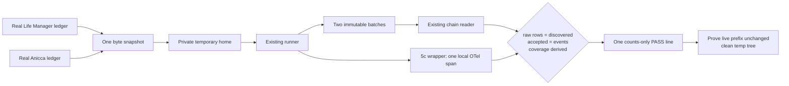

# CFO-2a2a.6 — Real Local Usage Reconciliation E2E Plan

> **For agentic workers:** REQUIRED SUB-SKILL: Use superpowers:subagent-driven-development and verification-before-completion. Execute checkboxes in order.

**Status:** READY FOR LUNA — fresh Sol plan review: ship

**Goal:** Add one reusable content-free E2E script that snapshots both real local usage ledgers read-only and proves
raw complete rows, immutable batches, normalized events, coverage, and the 5c local OTel span reconcile exactly.

**Architecture:** Copy one byte snapshot from each real source into a private temporary home/state tree. Run the
existing production runner exactly once through `captureLocalAgentUsageCollection`, read the two resulting immutable
chains with the production reader, and parse the one temporary content-free span line. Verify every identity/count,
then prove each original snapshot remains an exact prefix of its live source and delete only the validated temp tree.

**Ponytail full decision:** Adapt the already-written 35-line candidate from commit `a79426496`; do not start over.
Replace its obsolete injected-tracer assumption with the shipped 5c wrapper and local span JSONL. Add no production
module, helper, fixture, package command, exporter, service, scheduler, DB, Telegram field, or persistent state.

**Soft target:** exactly one new file,
`apps/life-call/test/cfo-local-agent-usage-real-e2e.js`, <=80 added LOC. Hard stop before a second implementation file
or 100 additions.



## Exact verification contract

- Resolve only the two fixed real source paths from `os.homedir()`. Read each once into a Buffer at start. Never print
  a path, hash, row, token value, model, task label, provider payload, prompt, response, environment, credential,
  owner, or chat ID.
- Require each snapshot to end in LF, contain at least one non-empty complete line, and have every line parse as JSON.
  Retain only bytes and starting offsets; do not retain parsed raw objects.
- Create one `fs.mkdtempSync` tree under `os.tmpdir()`, require/chmod its directories `0700`, and write the two
  snapshots `0600` at the exact temporary paths expected by the existing runner. Before recursive cleanup, require
  the resolved root to be a non-root direct child with the fixed generated prefix.
- Call `captureLocalAgentUsageCollection(collect,{env:{LIFE_MANAGER_STATE_HOME:tempLifeManagerRoot}})` exactly once.
  The closed `collect` function calls `runLocalAgentUsageCollection` exactly once with the temporary home, that same
  sanitized env, and one fixed valid clock. Do not pass a tracer option to the runner.
- Trap `console.log/error/warn/info/debug` and require zero calls. Require the identical frozen complete receipt with
  exactly two published fixed sources and no receipt coverage exception.
- For each source, require exactly one immutable temp batch; its filename and file SHA-256 equal the receipt
  `record_id`; permissions expose no group/other bits. Require chain `ready`, `record_count=1`, final cursor
  byte-offset/observed-size/prefix hash equal the copied snapshot, and receipt event count equal chain event length.
- Independently derive every normalized ID from each LF-start offset as
  `local_agent_usage:sha256("cfo-local-agent-row-v1\\0<source_id>\\0<offset>")`; require exact sorted equality with
  chain events. Require discovered=accepted=raw rows and duplicate=conflicting=0.
- Recompute missing, attributed, unattributed, and runner-collision counts from normalized events and exactly match
  chain counts. Missing usage keeps all six token fields null; covered usage keeps all six non-negative safe
  integers. Do not sum or price token values. Independently derive the exact sorted coverage exception array from
  conflicting/missing/collision/unattributed observations and require no cursor defect.
- Read exactly one LF-terminated temp `cfo-local-agent-usage-otel-spans.jsonl` record. Require the telemetry directory
  has no group/other permission bits and the span file mode is `0600`. Require its seven top-level keys, non-zero
  trace/span IDs, schema 1, exact 5c name, INTERNAL kind, UNSET status, and exact 15 attributes: five
  collection attributes plus status/record ID/byte offset/event count/mapping ID for both published sources. Its two
  record IDs must match the two temp immutable files. Build the complete expected 15-attribute object from the exact
  receipt, fixed clock, and fixed source IDs, then require one deep strict equality; subset assertions are forbidden.
  Reject any extra attribute or key containing
  `token|prompt|response|path|secret|credential|gen_ai`; the span is correlation, not token truth.
- At the end, read only the current prefix of each real source whose length equals its initial snapshot. Require the
  live size is at least that length and the prefix SHA-256 still equals the snapshot. Legitimate concurrent append is
  allowed; truncation/rewrite fails. The script never opens a real source for writing.
- On success print exactly one safe line:

```text
cfo-local-agent-usage-real-e2e: PASS sources=2 discovered=<n> accepted=<n> missing=<n> coverage_exceptions=<n> spans=1
```

`coverage_exceptions` is the sum of both independently verified chain exception-array lengths. Any failure prints
only `cfo-local-agent-usage-real-e2e: FAIL`, exits nonzero, shuts down no global runtime, and still cleans its validated
temporary tree.

## Task 1 — Luna adapts the one verification script

- [ ] Confirm the target file is absent. Use commit `a79426496` only as the starting candidate; remove its OTel SDK
  provider/tracer imports and validate the shipped wrapper's temporary JSONL instead.
- [ ] Implement the exact one-file script. This slice is verification-only, so do not manufacture a production RED.
  First execution is RED until the obsolete tracer path is replaced; the final script itself is the executable
  acceptance proof.
- [ ] Run the script twice. Both runs must exit 0 with the same output schema, create no persistent file, and preserve
  each initial real-source prefix. Counts may legitimately increase between runs if another real loop appends.
- [ ] Run runner+chain+hourly focused tests, CFO, full npm, syntax, `git diff --check`, and exact one-file/LOC scope.
  Luna does not edit docs, commit, push, launchd, or Telegram.

## Task 2 — Sol review and close

- [ ] Fresh Sol review returns `ship` and proves the script cannot write real source/state or emit private values.
- [ ] Sol independently runs it twice, records only the counts-only outputs, confirms no persistent/temp residue, and
  reruns all gates.
- [ ] Update this plan and both CFO specs with exact observed counts; fetch, commit, push, and send one `Codex:::`
  Telegram milestone with provider `messageId`. Then CFO-2a2b becomes the only active item.
