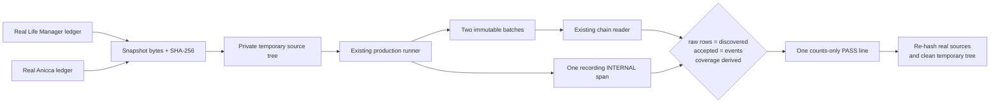

# CFO-2a2a.6 — Real Local Usage Reconciliation E2E Plan

> **For agentic workers:** REQUIRED SUB-SKILL: Use superpowers:subagent-driven-development and verification-before-completion. Execute checkboxes in order.

**Status:** COMPLETE — reusable real-ledger proof, fresh review, independent reruns, and push evidence recorded

**Goal:** Add one reusable, content-free E2E script that reads both real local usage ledgers without mutation and
proves raw complete rows, immutable batches, normalized events, coverage, and the configured OTel correlation span all
reconcile exactly.

**Architecture:** The script snapshots both real source files into a private temporary home/state tree, runs the
existing production two-source runner once with an in-memory recording tracer, reads the resulting immutable chains
through the existing production reader, and compares every count. It then re-hashes the real sources and deletes only
its validated temporary tree. No live CFO state, launchd, Moneytree, Telegram, DB, or production module changes.

**Ponytail full decision:** Reuse the completed runner, chain reader, Node assertions, crypto, filesystem, and installed
OTel SDK. Add exactly one verification script. Add no abstraction, fixture, test helper, package command, exporter,
service, second state format, retry, or report field.

**Soft target:** one new file, `apps/life-call/test/cfo-local-agent-usage-real-e2e.js`, <=70 added LOC. Hard stop before a
second implementation file or 100 additions.



## Exact verification contract

- Resolve only the two fixed source paths from `os.homedir()` and the existing default state locations. Read each real
  file once before the run and once after only for SHA-256 comparison. Never print a path, hash, row, model, token
  value, task label, provider payload, environment, prompt, response, credential, owner, or chat ID.
- Require each real source to be a Buffer, end with LF, contain at least one complete non-empty line, and have every
  complete line parse as JSON. Count raw rows only; do not retain parsed raw objects.
- Create one `fs.mkdtempSync` tree under `os.tmpdir()`, chmod directories `0700`, and write the two source snapshots as
  `0600` files at the exact paths expected by the existing runner. Validate the generated prefix before recursive
  cleanup in `finally`.
- Run `runLocalAgentUsageCollection` exactly once with the temporary home/state, one fixed valid clock, and exactly
  `provider.getTracer("anicca-life-call-cfo")` from one injected `NodeTracerProvider`/`InMemorySpanExporter`. Capture
  console methods and require zero calls.
- Require a frozen `complete` receipt with exactly two published fixed sources, one immutable record per source, and
  one finished `SpanKind.INTERNAL` span named `collect local_agent_usage` with zero events.
- For each source, require the immutable filename/content SHA-256 to equal its receipt `record_id`; chain status
  `ready`; `record_count=1`; final cursor offset/size/prefix hash equal the copied source. From every LF-terminated
  line's starting byte offset, independently derive
  `local_agent_usage:sha256("cfo-local-agent-row-v1\\0<source_id>\\0<offset>")`; require the sorted derived IDs to equal
  normalized event IDs exactly. Because this is one empty-state run over valid unique offsets, require
  `accepted_rows=discovered_rows=raw complete lines` and `duplicate_rows=conflicting_rows=0`, not only an algebraic
  self-check.
- Recompute from normalized events and exactly match `accepted_rows`, `missing_usage_rows`, `attributed_rows`,
  `unattributed_rows`, and runner-collision groups. For each source independently derive the sorted unique array from
  `conflicting_usage|missing_usage|runner_identity_collision|unattributed_usage` plus any cursor defect, and require
  exact equality with that chain's `coverage_exceptions`. Missing-usage events must keep every token field null;
  covered token fields must be non-negative safe integers. Never sum or price token values.
- Require the finished span to be ended with instrumentation scope `anicca-life-call-cfo`, UNSET status, and zero
  events. Construct one expected object and require exact deep equality plus exactly 15 keys: five collection fields
  (`status=complete`, source count 2, published count 2, aggregate event count, receipt coverage-exception count 0),
  two fixed source statuses, and each published source's record ID, byte offset, event count, and mapping ID. This
  forbids every extra attribute. OTel is correlation only; the chain remains truth.
- Re-hash both real sources and require byte-for-byte identity. The only success output is:

```text
cfo-local-agent-usage-real-e2e: PASS sources=2 discovered=<n> accepted=<n> missing=<n> coverage_exceptions=<n> spans=1
```

`coverage_exceptions` is exactly the sum of the two independently verified chain exception-array lengths; receipt/span
collection exceptions remain zero and are not substituted. The fixed failure output is
`cfo-local-agent-usage-real-e2e: FAIL`; exit nonzero. No underlying error is printed.

## Task 1 — Luna builds the verification script

- [x] Confirm the target script is absent and the current real sources satisfy the preconditions without printing
  private data. This slice adds verification code only; production behavior is already complete, so there is no fake
  failing production test to manufacture.
- [x] Implement the exact one-file script within the soft target. All assertions are executable acceptance checks;
  catch only at the outer boundary for the fixed failure line and cleanup.
- [x] Run the script twice. Both runs must exit 0 with the same exact counts-only schema, create no persistent file,
  mutate neither source, and finish one span each. Run runner+chain+hourly focused tests, CFO, full npm, syntax, and
  `git diff --check`. Luna does not edit docs, commit, or push.

## Task 2 — Sol review and close

- [x] Fresh Sol review returns `ship` and confirms the script cannot modify real source/state or emit private values.
- [x] Sol independently runs it twice, independently checks real source hashes around both runs, and reruns all gates.
- [x] Update this plan and both CFO specs with exact observed counts; fetch, commit, push, and send one content-free
  Telegram milestone. Then CFO-2a2b becomes the next Ponytail audit; tax/location remains later in the parent SSOT.

## Completion evidence

- Luna added exactly one 35-line verification script; no production, package, launchd, Telegram, DB, or live-state file
  changed. Fresh Sol implementation review returned `ship — Spec ✅`.
- Luna and Sol each ran the script repeatedly. Every run returned exactly
  `PASS sources=2 discovered=5004 accepted=5004 missing=283 coverage_exceptions=6 spans=1`.
- The proof independently reconstructs all 5,004 domain-separated source IDs from LF byte offsets, requires
  discovered=accepted=raw with duplicate/conflicting zero, derives missing/attribution/collision/coverage per source,
  and exact-matches the one ended UNSET INTERNAL span's 15 closed attributes.
- External SHA-256 comparison proved both real sources byte-identical across Sol's two runs. Temporary-tree residue was
  zero; stdout contained only the fixed counts line; stderr/console and Telegram delivery were zero.
- Focused runner/chain/hourly passed 19/19, CFO 292/292, full npm exited 0, and syntax/diff checks passed. Existing npm
  audit warnings remain 1 moderate/4 high and were not broadened into this slice.
