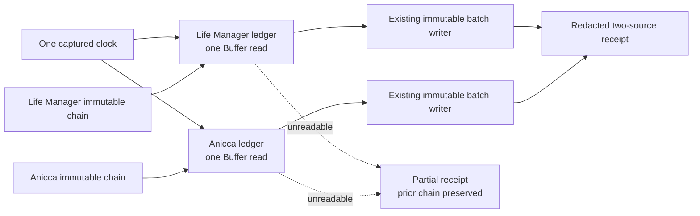

# CFO-2a2a.5b2b — Two-Source Local Usage Runner

**Status:** COMPLETE — Luna implementation, fresh Sol review, and real isolated E2E passed.

**Goal:** Read the two fixed local agent-usage ledgers once each, resume from each immutable chain, and publish the
next content-free batches without deleting prior evidence when one source is unavailable.

## Ponytail full decision

Reuse `readLocalAgentUsageChain` and `collectAndWriteLocalAgentUsageBatch`. Add no database, daemon, scheduler, queue,
agent, retry framework, OTel span, price calculation, Telegram copy, or raw-session scanner. The hourly invocation is
the next slice, 5b2c.

**Delivered size:** one runner, one focused test, and one package test registration; 3 files and 82 added LOC.



## Delivered files

- `apps/life-call/lib/cfo-local-agent-usage-runner.js`
- `apps/life-call/lib/cfo-local-agent-usage-runner.test.js`
- `apps/life-call/package.json` (`test:cfo` registration only)

## Contract

`runLocalAgentUsageCollection(options = {})`:

- captures one valid collection timestamp;
- uses `LIFE_MANAGER_STATE_HOME`, otherwise `<home>/.local/state/life-manager`, as the private state root;
- processes the fixed order `life_manager_agent_usage`, then `anicca_agent_usage`;
- reads the matching immutable chain once, reads its ledger once, then calls the existing writer once with the last
  cursor or null only for an empty chain;
- does not retry or reread inside one invocation;
- continues the other source when one ledger is unreadable, returning only `source_unreadable` for that source;
- never restarts from null after a chain failure and returns only `local_state_failure` for chain/writer failure;
- returns a deeply frozen exact top-level `{status,collected_at,sources,coverage_exceptions}` receipt;
- gives every source the same exact keys
  `{source_id,status,record_id,byte_offset,event_count,mapping_id,coverage_exceptions}`;
- emits no raw bytes, filesystem paths, token values, prompts, payloads, account data, secrets, dynamic error messages,
  or stacks;
- rejects invalid options/home/state root/clock with a fixed redacted runner error. A module-local error identity means
  an external getter or clock cannot spoof the internal prefix and leak its message.

`home`, `env`, `now`, `readFile`, `readChain`, and `writeBatch` are the only test seams. Production defaults use Node
stdlib plus the existing chain reader and immutable batch writer. Dependency results are copied field-by-field into
the closed public receipt; hostile extra properties never escape.

## TDD and review evidence

- RED: the focused test failed because the runner module did not exist.
- Initial GREEN: focused `3/3` and store/chain/runner `13/13` passed.
- Fresh review found one Important issue: external environment/clock errors could spoof the internal message prefix.
- Fix RED reproduced both leaked sentinels; minimum GREEN introduced an unforgeable module-local error marker.
- Final integrated branch: focused `4/4`, store/chain/runner `11/11`, CFO `290/290`, full `npm test` exit `0`, syntax
  and diff checks passed; final fresh review was `ship — Spec ✅`.

## Real isolated E2E

Sol read both actual local source files exactly once through the production runner while writing only to an isolated
temporary state root. The source size and mtime were unchanged.

- Life Manager: 1 immutable record, 1,109 accepted events, record hash verified.
- Anicca: 1 immutable record, 3,883 accepted events, record hash verified in the final integrated run.
- Both derived chains were `ready`.
- Existing `missing_usage`, `runner_identity_collision`, and `unattributed_usage` exceptions remained visible.
- No raw row, token values, path, secret, or private financial value was printed.

## Verification commands

```bash
cd apps/life-call
node --test lib/cfo-local-agent-usage-runner.test.js
node --test lib/cfo-local-agent-usage-batch-store.test.js lib/cfo-local-agent-usage-chain.test.js lib/cfo-local-agent-usage-runner.test.js
npm run test:cfo
npm test
node --check lib/cfo-local-agent-usage-runner.js
node --check lib/cfo-local-agent-usage-runner.test.js
git diff --check
```
