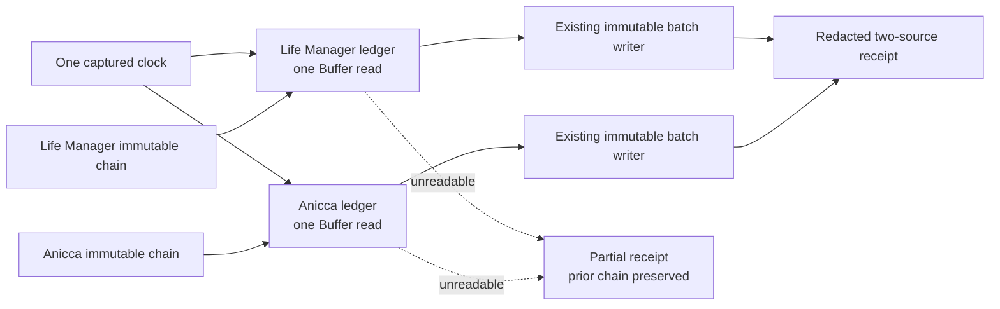

# CFO-2a2a.5b2b — Two-Source Local Usage Runner Plan

> **For agentic workers:** REQUIRED SUB-SKILL: Use superpowers:subagent-driven-development. Execute the checkbox steps in order.

**Status:** READY FOR LUNA — fresh Sol plan review: ship

**Goal:** Read the two fixed local agent-usage ledgers once each, resume each from its immutable chain, and publish the next content-free batch without deleting prior evidence when one source is unavailable.

**Architecture:** A single synchronous composition function validates all arguments once, captures one clock, then
processes two fixed sources independently through the existing chain reader and immutable batch writer. It returns
only a closed content-free receipt; 5b2c owns scheduling.

**Tech stack:** Node.js CommonJS, `node:fs`, `node:os`, `node:path`, `node:test`, existing CFO chain/store modules; no
dependency or lockfile change.

## Global constraints

- Sol owns plan, real E2E, spec/state, commit, and push. Luna owns only the three implementation paths below and does
  not commit/push/send Telegram.
- Test first: missing-module RED, minimum GREEN, focused/full verification.
- Hard stop before a fourth implementation file or >100 cumulative added lines.
- No retry, log, raw content, background process, or live state mutation in tests.

## Ponytail full decision

Reuse `readLocalAgentUsageChain` and `collectAndWriteLocalAgentUsageBatch`. Add no database, daemon, scheduler, queue,
agent, OpenTelemetry span, price calculation, Telegram copy, raw-session scanner, or recovery framework. This slice only
composes existing functions. Hourly invocation belongs to 5b2c.

**Soft target:** create one runner and one focused test, then add the test to `test:cfo`: 3 files, <=100 added LOC total.
If the target is exceeded, cut cases or reuse helpers before writing more code.



## Files and ownership

Luna owns only:

- Create `apps/life-call/lib/cfo-local-agent-usage-runner.js`
- Create `apps/life-call/lib/cfo-local-agent-usage-runner.test.js`
- Modify only the `test:cfo` command in `apps/life-call/package.json`

Luna is not alone in the worktree. Do not edit specs, launchd, hourly Moneytree code, existing collector/chain/store
modules, dependencies, or unrelated changes. Do not commit, push, install, or send Telegram.

## Exact contract

Export `runLocalAgentUsageCollection(options = {})`.

- Capture `collectedAt` by invoking `options.now` (default `() => new Date()`) exactly once. Its result must be a
  valid `Date`; publish `toISOString()` as the canonical RFC3339 value.
- Use canonical absolute non-root `options.env.LIFE_MANAGER_STATE_HOME`, otherwise
  `<home>/.local/state/life-manager`, as `stateRoot`.
- Fixed sources and order:
  1. `life_manager_agent_usage` at `<stateRoot>/telemetry/agent-usage.jsonl`
  2. `anicca_agent_usage` at `<home>/.local/state/anicca/telemetry/agent-usage.jsonl`
- `options.home`, `options.env`, `options.now`, `options.readFile`, `options.readChain`, and `options.writeBatch` are the
  only accepted option keys and test seams. Production defaults use `os.homedir`, `process.env`, `Date`,
  `fs.readFileSync`, `readLocalAgentUsageChain`, and `collectAndWriteLocalAgentUsageBatch`.
- `options` must be a plain exact object. Supplied `env` must be an object; supplied `home` must be a canonical
  absolute non-root path; each supplied seam must be a function. Unknown keys/accessors/custom prototypes fail before
  any clock, chain, read, or write call. Fixed argument errors are only
  `cfo_local_agent_usage_runner_invalid:invalid_options|invalid_home|invalid_state_root|invalid_clock`.
- For each source, call the chain reader once, call the ledger reader once, then call the writer once with
  `chain.source_state` or `null` when the chain is empty. Never reread or retry inside this function.
- Process both sources independently. A source read failure publishes nothing for that source, preserves its prior
  immutable chain, and returns fixed source status `unavailable` with `coverage_exceptions=["source_unreadable"]`.
  The other source still runs. A later hourly invocation is the recovery path.
- A chain or writer failure is not a provider outage. It returns `failed` for that source with fixed
  `coverage_exceptions=["local_state_failure"]`; it never restarts from null or overwrites evidence.
- Treat dependency receipts as untrusted boundaries. A chain result must have the exact six reader keys. Only
  `status="empty"` with `source_state=null` may call the writer with null. `status="ready"` requires an exact five-key
  cursor with schema 1, matching source ID, non-negative safe offsets, and a 64-lowercase-hex prefix. Any other chain
  result is `local_state_failure` and no ledger read/write follows. A writer result must have exactly
  `{record_id,source_id,byte_offset,event_count,mapping_id}`. Require `source_id===sourceId`, canonical record ID,
  safe counts, `mapping_id="local_agent_usage_v1"`, and
  `priorOffset <= receipt.byte_offset <= Math.max(priorOffset, bytes.length)` (use `0` for null prior). This permits
  the existing cursor's truthful truncation receipt to preserve a prior offset beyond the current shorter Buffer. A ready cursor itself requires
  `observed_file_size >= byte_offset`; do not require receipt offset to equal prior offset because a valid append must
  advance it. Any mismatch is `local_state_failure`.
- The exact deeply frozen top-level receipt is `{status,collected_at,sources,coverage_exceptions}`. `status` is
  `complete` only when both sources published, otherwise `partial`. Every source entry has exact keys
  `{source_id,status,record_id,byte_offset,event_count,mapping_id,coverage_exceptions}`. A published entry copies the
  validated writer receipt copied field-by-field, adds `status="published"`, and uses an empty exception array. Never
  spread a dependency receipt. Unavailable/failed entries
  use null receipt fields and only their fixed exception. Top-level exceptions are the unique sorted union. No raw
  bytes, path, token values, prompt, payload, account, secret, error message, or stack enters the receipt.
- These four argument errors occur before any source side effect. Runtime source errors never throw from the runner;
  they become the fixed per-source statuses above, and no dynamic error text escapes.

## Task 1 — Luna writes RED then minimum GREEN

- [ ] **Step 1: Create the focused test and record RED**

Use exact fixed fixtures, not real files. The test setup follows this shape:

```js
const calls = [];
const prior = { schema_version: 1, source_id: "life_manager_agent_usage", byte_offset: 4,
  prefix_sha256: "a".repeat(64), observed_file_size: 4 };
const options = {
  home: "/tmp/cfo-home", env: { LIFE_MANAGER_STATE_HOME: "/tmp/cfo-state" },
  now: () => new Date("2026-08-11T01:02:03.000Z"),
  readChain: (root, id) => id === "life_manager_agent_usage"
    ? { status: "ready", source_state: prior, record_count: 1, events: [], counts: {}, coverage_exceptions: [] }
    : { status: "empty", source_state: null, record_count: 0, events: [], counts: {}, coverage_exceptions: [] },
  readFile: file => { calls.push(["read", file]); return Buffer.from("12345"); },
  writeBatch: (root, at, id, bytes, state) => ({ record_id: "b".repeat(64), source_id: id,
    byte_offset: bytes.length, event_count: 0, mapping_id: "local_agent_usage_v1" }),
};
```

Write three compact tests that prove:

1. Both fixed ledgers are each read exactly once, both chains are read once, prior states are passed to the matching
   writer, one clock is shared, ordering is fixed, and the receipt is deeply frozen/content-free.
2. If one source read throws a hostile sentinel, the other source still publishes, the failed source writer is never
   called, the result is partial with only `source_unreadable`, and the sentinel/path/raw bytes never escape.
3. If a chain or writer throws or returns a malformed/mismatched receipt, that source never restarts from null, extra
   hostile fields never escape, the other source still publishes, and the only public failure is
   `local_state_failure`. A compact table proves empty→null is the only null-writer path and the four fixed argument
   errors occur before all side effects. It also proves a truncated Buffer may publish the writer's preserved prior
   offset without being mislabeled as local-state failure.

Run RED from `apps/life-call`:

```bash
node --test lib/cfo-local-agent-usage-runner.test.js
```

Expected: missing-module failure.

- [ ] **Step 2: Implement the minimum direct composition**

The production control flow is exactly:

```js
validateOptionsBeforeSideEffects(options);
const home = resolveCanonicalHome(options.home ?? os.homedir());
const stateRoot = resolveCanonicalStateRoot(options.env ?? process.env, home);
const collected_at = captureOneDate(options.now ?? (() => new Date())).toISOString();
for (const source of FIXED_SOURCES) {
  try { chain = validateChain(readChain(stateRoot, source.id), source.id); }
  catch { appendFailed(source.id, "local_state_failure"); continue; }
  try { bytes = readFile(source.path(home, stateRoot)); if (!Buffer.isBuffer(bytes)) throw Error(); }
  catch { appendFailed(source.id, "source_unreadable"); continue; }
  const prior = chain.status === "empty" ? null : chain.source_state;
  try { receipt = validateWriter(writeBatch(stateRoot, collected_at, source.id, bytes, prior), source.id, prior, bytes.length); appendPublishedFieldByField(receipt); }
  catch { appendFailed(source.id, "local_state_failure"); }
}
return deepFreezeClosedReceipt();
```

Implement only these validators and direct flow. Do not add classes, generalized source registries, retries, logging,
filesystem locking, parallelism, or a CLI.

- [ ] **Step 3: Run focused GREEN**

```bash
node --test lib/cfo-local-agent-usage-runner.test.js
node --test lib/cfo-local-agent-usage-batch-store.test.js lib/cfo-local-agent-usage-chain.test.js lib/cfo-local-agent-usage-runner.test.js
```

## Task 2 — Verify and hand back to Sol

- [ ] **Step 4: Run complete gates and report evidence**

```bash
cd apps/life-call
node --test lib/cfo-local-agent-usage-runner.test.js
node --test lib/cfo-local-agent-usage-batch-store.test.js lib/cfo-local-agent-usage-chain.test.js lib/cfo-local-agent-usage-runner.test.js
npm run test:cfo
npm test
node --check lib/cfo-local-agent-usage-runner.js
node --check lib/cfo-local-agent-usage-runner.test.js
git diff --check
```

Report RED evidence, GREEN counts, changed files, and added LOC. Sol performs fresh review, real isolated two-ledger
E2E, spec/state update, commit, and push. Completion requires both real source files to be read once into an isolated
state root, two immutable receipts with verified hashes, and no raw/private output.
