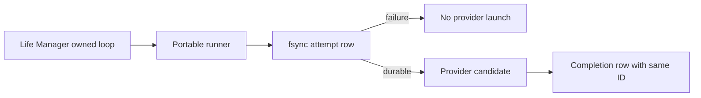

# CFO-2a2b.5c2a — Portable Life Manager Runner Attempt Cutover Plan

> **For Luna:** use Superpowers test-driven-development and verification-before-completion. Sol owns plan, review,
> state, commit, and push. Luna owns only the two listed files in the existing feature worktree.

**Status:** READY FOR SOL REVIEW

**Goal:** Before the portable Life Manager runner launches any provider candidate, fsync one exact attempt row. Reuse
its random 24-hex ID on the existing completion usage row so the CFO can detect a missing completion without inventing
zero usage or cost.

**Measured precondition:** worktree
`/Users/anicca/Projects/life-manager-main/.worktrees/cfo-agent-usage-cutover`, branch
`feature/cfo-life-manager-agent-usage-cutover`, is clean at pushed `61e1727ac`. The portable runner defaults to
`~/.local/state/life-manager/telemetry/agent-usage.jsonl`; numeric/null truth is already reviewed. The same boundary is
proven in profitable-claude commits `ef233a90` + `a0fe0c35` and active commit `52f2baa9`.

## Ponytail full scope

Exactly two existing files, hard maximum **100 gross added LOC**:

- `runtime/agent-runner/agent_runner.py` — target/hard maximum 36 additions
- `runtime/agent-runner/tests/test_prompt_fail_closed.py` — target/hard maximum 64 additions

Reuse `append_usage_event`, the existing provider loop, token budget settlement, config fixtures, evidence summary,
and usage ledger. Add no new file/helper/module/dependency, retry, queue, DB, service, agent, scheduler, launchd, OTel,
pricing, Telegram, Moneytree, cloud, or real provider call. Safe probe and real E2E remain 5c2b/5c2c.

## Exact behavior

1. Before evidence, budget, ledger, provider, or fallback effects, require trimmed nonempty `loop`, `task_label`, and
   each effective candidate `provider`/`model`; resolve usage and adjacent/override attempt paths once and reject equal
   resolved paths.
2. Per candidate, create one new lowercase 24-hex ID and UTC timestamp. Fsync exact eight-key
   `{version,event_id,timestamp,loop,task_label,attempt,provider,model}` before provider resolution/launch. Force both
   new and existing ledger files to `0600`.
3. Attempt append `OSError` launches no provider/fallback. A current budget reservation settles once at zero with
   measurement `unavailable`; summary remains durable; exit is nonzero with exact redacted stderr
   `agent-runner: usage attempt capture failed`.
4. Success and failure completion/evidence rows reuse the attempt ID. Completion append failure keeps the attempt
   durable and records existing nonempty `telemetry_error`; no retry and no zero substitution.
5. Preserve 5c1 numeric truth, portable Codex schema adaptation, routing, fallback, budget, evidence, and result logic.

## TDD / verify / state

1. Record clean full porcelain and owned hashes; require no real process using the exact portable runner path before
   the short edit window. Never stop one.
2. RED: extend only the existing `PromptFailClosedTest` harness and add these compact methods:
   - `test_usage_attempt_is_durable_before_launch_and_completion_reuses_id`
   - `test_completion_write_failure_leaves_unmatched_attempt`
   - `test_attempt_write_failure_blocks_provider_and_settles_zero`
   - `test_invalid_capture_boundaries_fail_before_effects`
   - `test_fallback_attempts_have_unique_matching_completion_ids`
   Each uses local stubs/temp paths only. Require exact schema, random IDs, `0600`, same-ID success/failure, no
   completion after forced write failure, exact fixed error, zero/unavailable settlement, no provider effect on
   invalid/equal paths, and two unique fallback pairs. Run each fully qualified method and retain its expected RED.
3. GREEN: semantically port only the reviewed production boundary. Run the five focused methods, existing
   `test_prompt_fail_closed`, numeric `test_numeric_truth`, then
   `PYTHONPATH=runtime/agent-runner python3 -m unittest discover -s runtime/agent-runner/tests -p 'test_*.py'`.
   Run `python3 -m py_compile` on the two owned files and `git diff --check`.
4. Require full status baseline plus exactly the two owned modifications, runner additions `<=36`, test additions
   `<=64`, total `<=100`. Luna does not stage, commit, push, call a provider, write a live ledger, or edit launchd.
5. Fresh Sol reviews only persistence-before-launch, same-ID completion, data-loss/fail-closed boundaries, numeric
   preservation, fixed-error privacy, and scope. Required fixes return to the same Luna.
6. Sol reruns gates, commits/pushes only the two files, updates state, reports one real `Codex:::` milestone, then
   advances only to 5c2b safe-probe seam.
