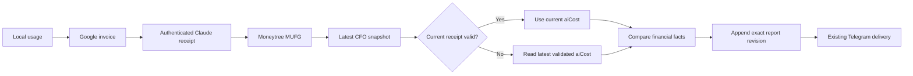

# CFO-2a3c.3b — Subscription Hourly Wiring and Live Delivery Plan

> Execute with Superpowers TDD. Sol owns this plan, verification, live trigger, and closure; Luna owns the two code files.

**Goal:** Feed the authenticated Anthropic receipt into the existing local hourly CFO snapshot so the existing
Telegram delivery sends the real confirmed Claude cost every owner hour.

**Ponytail gate:** Reuse the one launchd job, Gmail transport, immutable receipt capture, JSONB snapshot, snapshot RPCs,
and Telegram delivery. Add no scheduler, table, migration, RPC, reader service, queue, currency conversion, forecast,
OpenAI price, or generic billing framework.

**Soft target:** exactly 2 existing files, at most 100 gross added LOC.

| Element | File | Soft target |
|---|---|---:|
| Exact receipt map, carry-forward, facts, initial append | `apps/life-call/scripts/cfo-hourly-local.js` | <=45 LOC |
| Focused TDD | `apps/life-call/scripts/cfo-hourly-local.test.js` | <=55 LOC |

## Contract

The order remains one synchronous local loop:



`main()` calls the existing `captureLatestAnthropicSubscriptionReceipt` only when `GOG_ACCOUNT` exists. Accept only
an exact capture receipt with status `appended|existing`; an exact 12-key confirmed record; matching
`record_id === source_hash`; fixed provider/plan/subtotal/tax/total/currency/evidence and exact arithmetic; valid dates;
`paid_date === billing_period_start`; and `billing_period_end` equal to the same day in the next calendar month. Copy
only these public facts into the already-reviewed exact `aiCost` shape. Period dates are dynamic, not July/August
constants; this example is the current real receipt:

```js
{
  provider: "anthropic", plan: "max_20x", amount: "220.00", currency: "USD",
  billingPeriodStart: "2026-07-20", billingPeriodEnd: "2026-08-20",
  evidenceStatus: "provider_receipt", unavailableProviders: ["openai"]
}
```

Capture error, missing source, malformed receipt, failed-payment evidence, or a receipt whose owner date is outside
`[billingPeriodStart, billingPeriodEnd)` yields `null`, never zero and never a public price. `main()` passes this private
internal value into `runHourlyCfo` after the existing options spread, so a caller cannot override the authenticated
result. Stdout and returned `providerBilling` remain byte-compatible and do not gain the receipt, amount, hash, Gmail
identity, or error.

After the current-date snapshot is validated, choose current `options.aiCost` first, otherwise its persisted
`report_payload.aiCost`. If neither exists, reuse the same Supabase client for one read-only query for the owner’s newest
snapshot whose JSONB `report_payload.aiCost` is not null, ordered by `created_at desc`, limit 1. Validate the entire
returned snapshot through the existing renderer before copying only `aiCost`; add an injectable `latestAiCost` hook for
tests. A fallback is eligible only while the current owner date remains inside its billing period. This covers the first
hour after a date boundary without a new table/service and prevents an expired receipt from being shown forever.
Failure returns null and omits the optional key. Invalid persisted `aiCost` fails closed; it is never converted to zero.

Attach the selected fact to a fresh report copy before `sameFacts`, render, append, and delivery. Add `aiCost` (or null)
to `facts()` so a newly confirmed or changed receipt creates a new revision even inside the same owner hour; unchanged
facts reuse the exact persisted snapshot and delivery receipt.

The existing revision RPC already accepts the exact report. The initial helper does not: it rebuilds from Moneytree and
would drop `aiCost`. Replace only the default initial call inside this script with a tiny adapter to the already-live
`lm_append_cfo_daily_snapshot` RPC, passing the exact completed report plus the unchanged Moneytree `sourceBundle`.
Accept its existing five-key receipt or the forward-compatible six-key receipt with `supersedes_revision:null`, then
return only the five public receipt keys. Keep the injection name `appendCfoDailySnapshot` for current tests. Never put
receipt hashes, amounts, Gmail fields, or `aiCost` into `sourceBundle`.

## Task 1 — RED

Modify only `scripts/cfo-hourly-local.test.js`:

1. Add one compact exact Anthropic capture fixture using a different valid month from the current receipt and extend
   the existing provider-order test. Assert the full 12-key record, paid=start, exact next-month end, and dynamic period
   copy; assert
   `usage → clock → google billing → anthropic receipt → finance`; exact stateRoot/mail input; initial append and delivered
   snapshot contain the exact eight-key `aiCost`; stdout stays the old exact shape and contains no amount/hash/email.
2. Add one compact current-vs-fallback test:
   - current confirmed `aiCost` against an otherwise identical latest snapshot without it appends revision N+1 and
     delivers that exact report;
   - capture unavailable with a current-date persisted `aiCost` stays same-facts, appends zero rows, and delivers the
     exact persisted snapshot/reference;
   - on the first snapshot of the next owner date, capture unavailable reads the prior-date `aiCost`, carries it only
     while its period is active, and appends it to revision 1. An expired prior period is omitted.
3. Exercise the default initial RPC with `latestSnapshot` and `appendCfoDailySnapshot` unset. Assert exact legacy RPC,
   exact completed `p_report_payload.aiCost`, unchanged `p_source_bundle` with no AI/private key, revision 1 receipt, and
   one delivery of the same report object.
4. In one malformed table cover thrown capture, wrong amount, failed status, record/hash mismatch, extra key, bad
   paid/start/end chronology, and hostile strings. Include hostile `options.aiCost`: valid capture must overwrite it;
   capture failure must use only validated persisted fallback or omit it, never the caller value. Finance still runs and
   stdout/log/delivery contain no hostile value.

Run from `apps/life-call` after `npm ci --no-audit --no-fund`:

```bash
node --test scripts/cfo-hourly-local.test.js
```

Expected RED: order lacks Anthropic, snapshots lack `aiCost`, facts ignore it, and the default initial path rebuilds it
away.

## Task 2 — GREEN

Modify only `scripts/cfo-hourly-local.js`. Import the existing Anthropic capture, add the closed receipt-to-`aiCost`
copy and the one previous-date snapshot query, insert current/current-date/previous-date selection after latest snapshot
validation, include it in `facts`, and use the small initial exact-report RPC adapter. Do not alter Moneytree recovery,
Telegram sender, tables, or other modules.

Run:

```bash
node --test scripts/cfo-hourly-local.test.js
npm run test:cfo
npm test
node --check scripts/cfo-hourly-local.js
node --check scripts/cfo-hourly-local.test.js
git diff --check
test "$(git status --short | awk '{print $2}' | LC_ALL=C sort)" = "$(printf '%s\n' scripts/cfo-hourly-local.js scripts/cfo-hourly-local.test.js)"
test "$(git diff --numstat -- scripts/cfo-hourly-local.js scripts/cfo-hourly-local.test.js | awk '{n += $1} END {print n + 0}')" -le 100
```

## Task 3 — Sol real E2E and closure

Sol independently reruns all gates and a fresh Sol reviewer checks only false spend, loss on first append, carry-forward,
duplicate Telegram delivery, secret leakage, and scope. Then:

1. Run one authenticated no-send E2E through `main()` with the real Gmail receipt and real Moneytree read, but injected
   in-memory latest/append/delivery boundaries. Print only safe booleans; require exact `aiCost`, unchanged sourceBundle,
   one intended delivery, and no private evidence.
2. Commit and push the two files.
3. Verify the loaded `ai.anicca.life-manager-cfo-hourly` ProgramArguments still point to this reviewed worktree and the
   job is idle. Announce the non-destructive live trigger, kickstart the existing job once, and watch it to completion.
4. Read back the latest snapshot and delivery receipt using service-role read-only queries. Require exact persisted
   `aiCost`, revision progression, one successful provider message ID, launchd last exit 0, one-line redacted stdout,
   and no raw receipt/hash/email/card/URL/path/token. Do not claim completion from a dry run.
5. Mark CFO-2a3c.3/3b complete in both SSOTs, commit/push, send one `Codex:::` Telegram milestone, and continue to the
   next ordered TODO.
