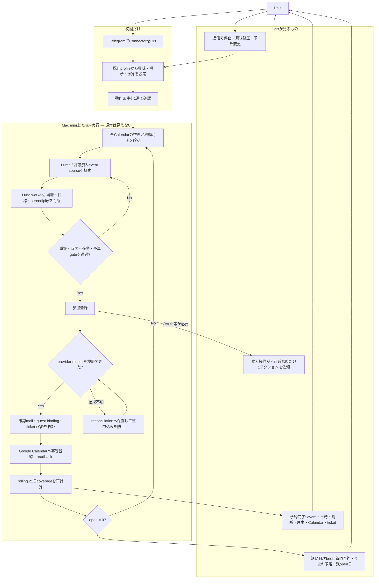
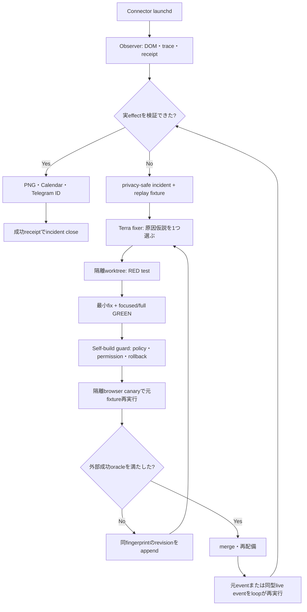
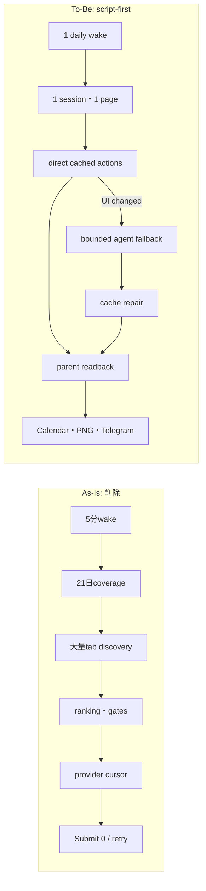
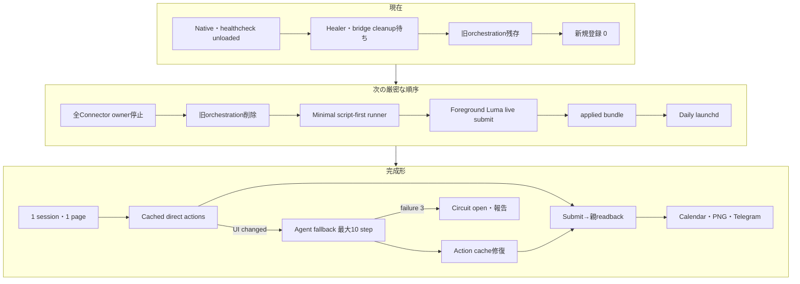
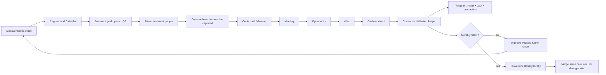
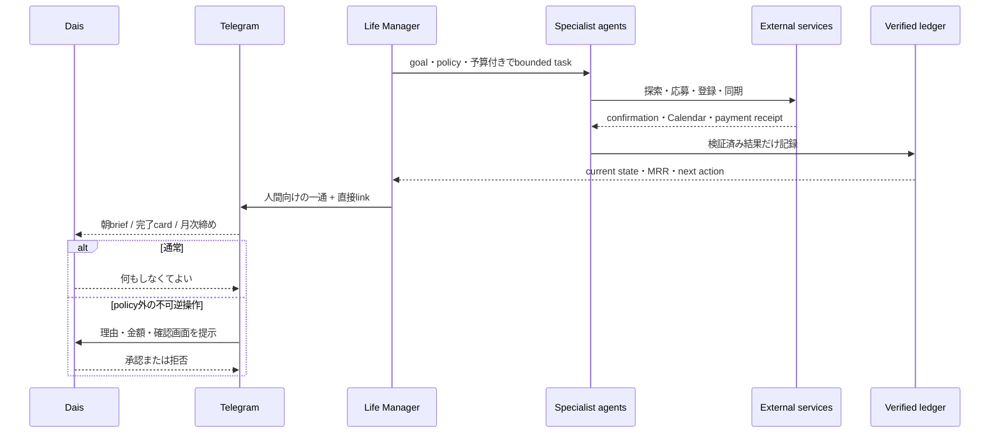
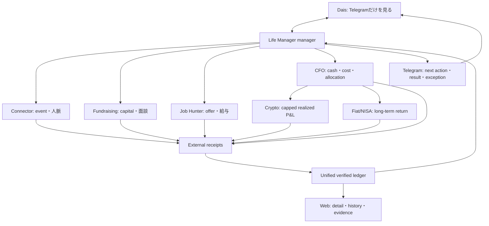
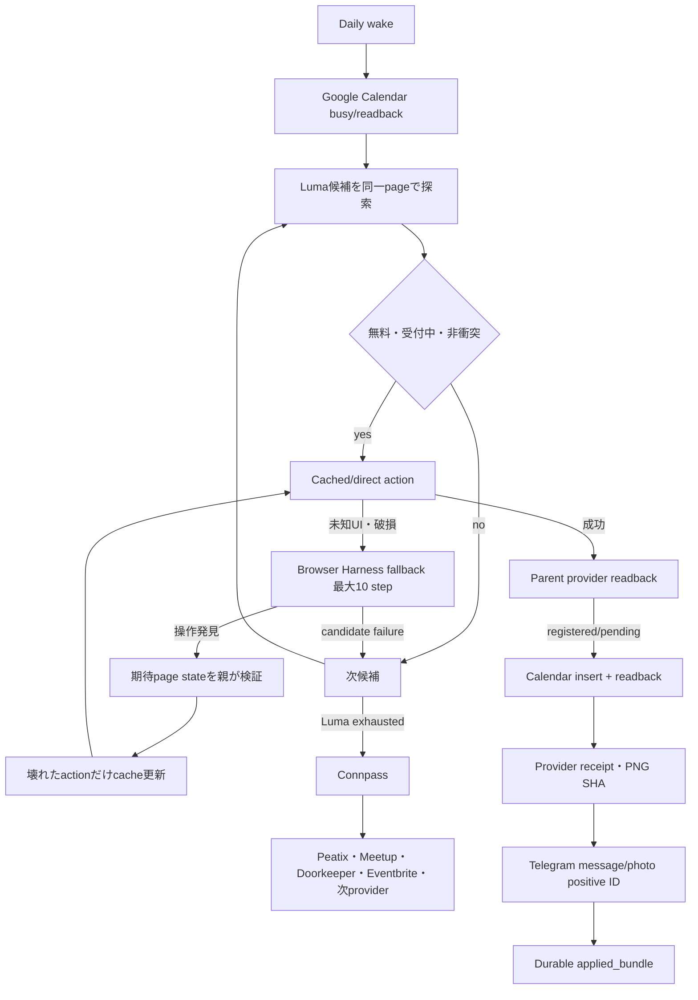

# Dais Life Manager 5段階実行仕様 — 専用正本

status: ACTIVE
owner: Dais / Life Manager
created: 2026-08-01 JST
updated: 2026-08-05 JST
scope: 応募基盤、イベント、資金調達、求人、個人CFO、暗号資産、法定通貨投資・NISA
active_execution_surface: LOCAL_ONLY_UNTIL_ORDER_5_COMPLETE

## 0. この文書の権限

この文書は、上記scopeだけの実行順序、残作業、完了条件、採用する外部部品の
**専用正本**である。

他の仕様書に記事、動画、マーケティング、クラウド移行、自己複製、別agentの作業が
書かれていても、このtrackの次作業へ混ぜない。

矛盾時の優先順位:

1. Daisの最新の明示指示
2. この専用仕様書
3. `2026-07-30-outbound-apply-engine-design.md`の各pack内部順序
4. その他の全体・履歴仕様

### 0.1 Life Managerの成果義務

Life Managerは「検索した」「分析した」「失敗した」と報告するsystemではない。userが理想の自分へ
近づく**次の現実行動を成立させるsystem**である。

| organ / loop | 内部作業ではなく要求する現実成果 |
|---|---|
| Connector | rolling 21日を見て、空いている各日に東京の対面eventを入れ、二重予約せず人と会う |
| LT | 登壇応募、登壇、Life Manager demo、参加者との接点 |
| Fundraising | 実提出、返信、面談、採択、資金とpeer group |
| Job Hunter | 実応募、返信、面接、offer、給与改善 |
| Financial Organ | 口座把握、支出改善、収入増加、risk管理、長期資産形成 |

「no action」が安全上正しい場面はある。たとえばrisk条件を満たさないcrypto取引は実行しない。
その場合も、何もせず閉じるのではなく、停止理由、次の観測、改善案、次回判断時刻という現実の
次行動を残す。Connectorではno-eventを正常終了にせず、実参加予約までloopを継続する。

### 0.2 現在地と残りの一本道

Connectorの進行中正本はbranch `feature/connector-native-completion`のworktree
`/Users/anicca/Projects/life-manager-main/.worktrees/connector-native-completion`である。canonical mergeが完了するまで
`main`を現在実装の正本とみなさない。`O1A-01〜06`と`O1B-01〜24`は実装・実測・証拠化・push済み。21日coverageの器に加え、実Luma Tokyoを終端まで読み、
全candidateを21日へ投影し、好みで候補を捨てず、本文・主催者・参加者・場所・時間からgoalと
serendipityを根拠付き評価するところまで完成した。2026-08-02に最後に証拠化されたcoverageは
`open=18 / covered_existing=0 / covered_new=1 / unavailable=2`である。これは現在時刻のcoverageではなく
履歴証拠である。8月15日の実Luma登録は確認mailとGoogle Calendarを伴う`covered_new`、8月2日・3日は
実Calendar blocker付き`unavailable`だった。現在値はnative passが実Calendarとproviderを再読取して
新しいsnapshotを保存するまでunknownとし、古い18日を現在値として報告しない。

native local runtime、write pipeline、lock、heartbeat、healthcheck、Connector専用CloakBrowser `:9222`、Luma inventory、
Calendar gate、provider cursor、Connpass downstream write contractはbranchへcommit/push済みである。native launchd
`ai.anicca.life-manager-connector-native`はこのworktreeを5分間隔で起動し、stateも存在する。live run 190はLuma 27件から
Calendar eligible 0件を判定し、同runでConnpass cursorへ進んだ。まだConnpass browser discoveryへ到達できず、実submit、
Calendar readback、PNG、ticket/QRまたは同等receipt、Telegram IDの同一lineage proofは0件である。したがって常駐基盤は動くが、
task deliveryは未完成である。

`O1C-00 Life Manager startup context正本化`は2026-08-02に実装・監査・pushまで完了した。
現在の実装優先は、保持していたConnectorの再開位置`O1B-25`である。残作業は、途中へ別trackを混ぜず
次の順序で進める。

```text
完了: O1B-20〜24 source handoff、候補継続、Calendar・移動時間・支出gate
完了: O1C-00 Life Manager startup context正本化（旧Anicca product提出防止）
いま: O1B-25/26 native read→Luna判断→実登録→receipt→Calendar→Telegramを一つのloopとして完成
  → O1C-01〜27 Fundraising / acceleratorの探索・提出・返信・面談追跡
  → O2-01〜12 Job Hunterの統合・実応募・返信・面接追跡
  → O3A-01〜07 壊れたCFO runtime loopを復旧
  → O3B-01〜24 Moneytree / Binance / walletを統一財務台帳へ接続しCFOを完成
  → O4-01〜16 Cryptoをpaper→小額canary→risk制御付き運用へ進める
  → O5-01〜14 Fiat / NISAを生活防衛資金・制度・risk制約付きで接続
local版完成gate:
  上記のOrder 1〜5がMac miniで連続稼働し、Telegram報告と証拠が揃う
  → その後にだけOW-01〜12を開始し、同じcoreをDais以外のpilotへ展開
```

#### 0.2.1 Connectorのユーザー体験contract

Connectorを作る目的は、Daisへagentの管理、tool選択、失敗logの読解、再実行をさせないことである。
通常時にDaisが見るsurfaceはTelegramだけとし、Life ManagerはMac mini上で探索から検証まで継続する。
本人しか完了できないOAuth、CAPTCHA、本人確認、または設計外の支出だけを、具体的な一操作として通知する。
その操作後は同じcontinuationから自動再開し、「再実行してください」と返さない。



Telegramの予約完了messageは、少なくともevent名、日時、場所、選定理由、event URL、Calendar URL、
ticket/QRまたは同等provider receipt、現在の21日coverage countsを含む。receiptが検証できない登録、Calendar readbackが無い登録、
Telegram provider message IDが無い送信を成功として表示しない。全wakeは`applied / continuing / recovering`を必ず報告し、週次rollupも
成功0件を含め必ず報告する。報告は内部stack traceを見せず、成立した現実結果、安全なfailure class、未処理日数、次の自動actionを伝える。

#### 0.2.2 Connectorの残TODO — 実行順SSOT

実行順の唯一の正本は、このspec内の最新 `### Active remaining TODO SSOT` とする。見出し内の進捗番号が最大のものだけが有効で、
それ以前のTODO、チェックリスト、実行順、図は全て履歴であり、未完項目を復活させる根拠にしない。
この節、Order checkbox、過去の進捗文に異なる「次TODO」が残っていても実行順には使用しない。

現在の物理状態（2026-08-06 22:07 JST read-only実測）: native launchd
`ai.anicca.life-manager-connector-native`はこのworktreeを5分間隔で起動するが、run 194はlast exit 1、heartbeat
`worker_failed`、bounded result `incomplete`で終了した。Luma inventory 27件、Calendar gate 0件、eligible 0件、write attempt 0件で、
provider cursorはConnpass、generation 2、次対象日は2026-08-07である。append-only stateはcandidate attempts 49、delivery receipts 3、
photo receipts 2で、今回wakeの新規申込、Calendar、screenshot、Telegram deliveryは0件である。Connector専用CloakBrowser `:9222`は応答する。
Connpass APIは使用禁止。次の未完了項目は`:9222`によるConnpass browser-only discoveryの欠落を直し、常設loopを再wakeすることである。

**Executor boundary:** 実event discovery、form入力、Submit、provider readback、Calendar、screenshot、Telegramを行う主体は常設Connector
launchd loopだけである。対話中のCodex、臨時script、手動browser操作が代わりに申し込んだ結果をConnectorのlive acceptanceへ数えない。
Codexの仕事は先頭の実故障をTDDで直し、commit/pushし、既存launchdをwakeして観測し、loop自身の外部証拠で完了判定することである。
各fresh open dateのprovider passは必ずLumaをprimaryとして開始する。LumaにCalendar-eligible候補が無い、または各候補がknown-no-effectの場合だけ、
同じpassで`Connpass → Peatix → Meetup → Doorkeeper → Eventbrite`へ進む。crash/restart時はLumaへ巻き戻さずdurable cursorのexact provider/candidateから再開する。
provider順を飛ばさず、一providerの失敗でpassを終了しない。

Connectorのdoneは「一件予約できた」ではない。`open=0`であり、各日が`covered_existing`、
`covered_new`、または実Calendar blocker付き`unavailable`のいずれかとして証拠化され、Daisがagentを
手動管理せずTelegramで結果を理解できる状態である。

各checkboxの完了条件は「codeを書いた」ではない。fresh test、実serviceでのreadbackまたは
許可された実action、receipt/ledger、Telegramで人間が理解できる報告、commit、pushが揃った時だけ
`[x]`にする。

### 0.3 現在のlocal-only gate

Order 1Bの再開からOrder 5の完了まで、実行対象はDaisのMac mini上の
Life Managerだけとする。現在の実装中に、将来配布、複数user、別実行環境の都合を
先行条件として入れない。

```text
launchd
  → Life Manager local control plane
    → 一仕事ごとのbounded worker agent
      → CloakBrowser daily-driver / gog / 公式API
    → Life Manager local state / evidence ledger
      → Telegram
```

外部調査から現在取り入れるのは、次の四原則に限る。

1. product/control planeとshort-lived worker agentを分ける。
2. 候補選定、金額計算、receipt検証、Telegram文面を実行transportの中へ書かない。
3. crash、timeout、login切れ、一候補失敗から再開でき、同じ外部効果を二重実行しない。
4. 「workerが成功と言った」ではなく、実画面、mail、Calendar、provider/API receiptで完了を決める。

外部repositoryの調査結果とlicense境界は§4.9に保存するが、Order 1〜5の実行中に
将来配布用infrastructureを導入しない。

### 0.4 2026-08-02 Fundraising正本の緊急修正

Daisの最新指示により、次の実行対象を一時的に`O1C-00 Life Manager startup context正本化`へ置く。
これは別trackへの脱線ではなく、Fundraising agentが旧Anicca productを再提出する事故を防ぐための
前提修復である。現在のConnector `O1B-25`のcode、DB、spec位置は保持し、`O1C-00`完了後に同じ位置から
再開する。その後の実応募順は`O1B-25完了 → O1C-01以降 → O2`を維持する。

Fundraisingで使う名称と導線のcontract:

| 項目 | 正本contract |
|---|---|
| product name | **Life Manager**。Aniccaをproduct名として提出しない |
| company name | formが法人・会社名を明示的に要求する時だけAniccaを会社名として使い、未設立状態も正確に答える |
| product story | userのphysical / mental / financial lifeを、委任範囲内で実行しTelegramへ報告するLife Manager |
| financial story | CFO、支出改善、収入機会、資産管理をFinancial Organとして説明する。旧13事業pitchを現productとして出さない |
| repository | `https://github.com/Daisuke134/life-manager` |
| public product URL | `https://aniccaai.com/lm`。提出直前にも実production readbackし、旧root URLやbackend health URLをhomepageへ流用しない |
| evidence | 現在のcode、実動作、実user数、実revenueだけ。旧Anicca tractionをLife Manager tractionへ偽装しない |

2026-08-02のread-only auditでは、root `README.md`は「Life Managerがproduct、Aniccaはcompany name only」と
明記する一方、`~/.openclaw/identity/application-kit/KIT.md`、日英answers、deck、one-pager、logo、GitHub導線は
旧Anicca / `anicca-oss` / 13 product pitch中心である。さらに`apply-to-funder/funders/yc-w26.json`も
company/product説明、homepage、GitHub、動画が旧値で、別の`yc-answers-lifemanager-2026fall.*`だけがLife Manager
pitchを持つ。正本が二重化しているため、旧application-kitや旧form configから直接submitすることを禁止する。
公開導線は2026-08-02に`https://aniccaai.com/lm`を実測し、HTTP 200、title `Life Manager — Get started`、
Life Manager Telegram開始linkを確認した。`life-call-production.up.railway.app`は稼働backendであり、応募用の
product homepageではない。
同じ監査で、履歴`submitted/**`を除く現行application-kitには旧product表現が25ファイル・110箇所、
現行funder定義/application stateには5ファイル・21箇所残る。過去提出の3ファイルは監査証跡なので
書き換えず、current source / generated artifact / active form configだけを移行対象にする。

O1C-00の承認済み子設計は
`docs/superpowers/specs/2026-08-02-life-manager-startup-context-design.md`、実装順序は
`docs/superpowers/plans/2026-08-02-life-manager-startup-context.md`を正本とする。機械的事実は
`.agents/startup-context.json`、意味的なproduct positioningは`.agents/product-marketing-context.md`、
生成物は`fundraising/application-kit/`へ置く。旧OpenClaw kitは互換export先へ降格し、
`submitted/**`は変更しない。

### 0.5 並列実装protocol（fresh session用）

Daisの最新指示により、primary agentはConnectorを継続し、file所有権が分離できるJob Hunter、
CFO、Crypto、Fiat/NISAはfresh sessionとfresh worktreeで**production codeまで並列実装する**。
以前の「read-only監査だけ」という制限は撤回する。

並列化するのは設計、code、unit/integration test、CFOの実read-only provider接続、Crypto/Fiatの
安全gate用paper simulationまでである。fake/mock/dry-runだけをlane完了の証拠にしない。実browser、実応募、
実Calendar、実exchange、実broker、実送金・注文のような共有外部stateは、primaryがreview・mergeした後に
固定順序で有効化してreceiptを検証する。CFOのMoneytree/Binance/walletは資金を動かさないread-only権限に
限定し、専用laneで実残高・実明細のreadbackまで進めてよい。

#### 0.5.1 所有権とworktree

| lane | owner / scope | branch / fresh worktree | 書込み可能範囲 | 並列中の禁止 |
|---|---|---|---|---|
| A | primary: Connector O1B-25/26、master spec、統合 | `main` / `/Users/anicca/Projects/life-manager-main` | Connector local runtime、`runtime/loop/**`、`skills/browser/**`、`start-local.sh`、このspec | 他laneのworktree・専用fileを変更しない |
| B | Job Hunter O2-01〜12 | `feat/job-hunter-local-completion-20260802` / `/Users/anicca/Projects/.worktrees/life-manager/job-hunter-local-completion-20260802` | `apps/job-search-loop/**`、Job専用plan/evidence | 実ATS応募、Gmail/Calendar書込み、launchd有効化、共有file |
| C | CFO O3A + O3B | `feat/cfo-local-organ-20260802` / `/Users/anicca/Projects/.worktrees/life-manager/cfo-local-organ-20260802` | `runtime-job-store*`、`financial-report*`、Financial専用script/launchd template、`financial-organ/**`、`20260802_financial_organ_*` migration、専用plan/evidence | 実口座OAuth、秘密値出力、実取引、実launchctl変更、共有file |
| D | Crypto O4のpure/paper/risk engine | `feat/crypto-organ-paper-risk-20260802` / `/Users/anicca/Projects/.worktrees/life-manager/crypto-organ-paper-risk-20260802` | 新規`apps/life-manager/lib/crypto-organ/**`とtest、専用config/eval/plan/evidence | CFO file、`skills/earn/**`、実key、実注文・送金、共有migration |
| E | Fiat/NISA O5のpure/paper/risk engine | `feat/fiat-nisa-organ-20260802` / `/Users/anicca/Projects/.worktrees/life-manager/fiat-nisa-organ-20260802` | 新規`apps/life-manager/lib/fiat-nisa-organ/**`とtest、専用config/eval/plan/evidence | CFO file、実broker key・注文、共有migration |

共有fileとは`package.json`、lockfile、このmaster spec、既存の共通migration、Connector fileを指す。
laneが共有file変更を必要と判断した場合、勝手に変更せず「必要interface、理由、期待するsignature」を
evidenceへ記録しprimaryへ返す。primaryが統合時に一度だけ実装する。

保護対象として、既存dirty worktree
`five-phase-autonomous`と`outbound-engine`、既存`/Users/anicca/lm-financial-shadow-order4b`には触らない。
Fundraisingは`five-phase-autonomous`にYC関連の未commit変更があるため、第二の実装laneを新設せず、
既存ownerの成果を回収してからprimaryがO1Cへ統合する。

#### 0.5.2 全laneの開始・開発contract

各fresh sessionは、最初にroot `AGENTS.md`、このspecの§0と自分のOrder、Superpowersの
`using-superpowers`、`brainstorming`、`using-git-worktrees`、`writing-plans`、`building-agents`、
`test-driven-development`、`verification-before-completion`を読む。その後に次を行う。

1. `git fetch origin`し、指定branch/worktreeの不存在を確認する。既に存在する場合は上書きせず報告する。
2. 指定worktreeを`origin/main`から作り、以後そこだけで作業する。
3. source/history/testを実測し、lane専用の詳細implementation planを新規作成してcommitする。
4. failing testを先に書き、最小実装、refactorの順で小さくcommitする。
5. agentの意味判断はLLM prompt/evalへ置き、計算、ledger、policy、idempotency、receipt検証だけを決定論codeにする。
6. unit/integration testに加え、利用可能な実serviceで失敗、再開、重複、timeout、partial successを検証する。
   fake/mock/dry-runの成功だけで実接続済み、実応募済み、実取引済みと報告しない。
7. focused testとlane全testをfresh実行し、command・exit code・未検証範囲をevidenceへ残す。
8. 自分のbranchへpushする。`main`へのmerge/rebase/push、master specのcheckbox更新はしない。

#### 0.5.3 lane完了とlocal完成の違い

並列laneの`branch ready`は、code、test、plan、evidence、commit、pushに加え、CFOでは実providerの
read-only readbackが揃った状態である。
これは実世界のOrder完了ではない。primaryがreviewし、mainへ統合し、local runtimeへ接続し、許可された
実serviceでreadback/receipt/Telegramを確認した時だけmaster checkboxを`[x]`にする。

2026-08-02中に並列完了を狙えるのは、Job software、CFO runtime/schemaと利用可能な実read-only rail、
Crypto paper/risk、Fiat/NISA paper/policyである。Moneytree LINK本番は原則契約後に`client_id`、
`client_secret`、登録済み`redirect_uri`が提供されるため、未契約なら同日API開通を捏造しない。その場合は
Moneytree Webの公式CSV/Excel exportという実データrailを先に接続し、LINK契約を並行申請する。実資金canaryと
7日連続稼働は外部条件と経過時間が必要であり、未実測のまま「全検証完了」とはしない。

#### 0.5.4 fresh sessionへ渡す実装prompt

共通末尾: 「日本語で返答する。secret値を読出し・表示・commitしない。他worktreeを変更しない。
mainへmerge/pushしない。完了時はbranch、worktree、base/HEAD、commit一覧、test command/exit code、
未検証の実service gate、primaryへ要求する共有interfaceを返す。」

**B — Job Hunter:**

```text
Life Manager Order 2の実装ownerです。repoは/Users/anicca/Projects/life-manager-main。
branch feat/job-hunter-local-completion-20260802、worktree
/Users/anicca/Projects/.worktrees/life-manager/job-hunter-local-completion-20260802をorigin/mainから作成してください。
master spec §0.5と§5.4、apps/job-search-loop/README.md、関連history/branch/testを実測し、まず
docs/superpowers/plans/2026-08-02-job-hunter-local-completion.mdへ詳細planを書いてcommitしてください。
その後TDDでO2-01〜12をapps/job-search-loop/**だけに実装してください。検索→適合判断→resume/cover letter→
応募state→receipt→返信/面接追跡→非技術Telegramリンクの契約をfixture/mockでend-to-end検証します。
既存job branchは比較し、安全と確認したcommitだけ自branch内で採用してよいです。実応募、Gmail/Calendar書込み、
launchd有効化は禁止。専用evidenceを作成し、全変更をcommit/pushして共通末尾の形式で返してください。
```

**C — CFO / Financial Organ:**

```text
Life Manager Order 3A/3Bの実装ownerです。repoは/Users/anicca/Projects/life-manager-main。
branch feat/cfo-local-organ-20260802、worktree
/Users/anicca/Projects/.worktrees/life-manager/cfo-local-organ-20260802をorigin/mainから作成してください。
master spec §0.5、§5.5、§5.6、runtime-job-store/financial-report関連code/test/historyを実測し、まず
docs/superpowers/plans/2026-08-02-cfo-local-organ.mdへ詳細planを書いてcommitしてください。
code変更前にMoneytree LINK、Moneytree Web export、Binance Japan API、対象chainの公式current docsを検索し、
既存環境ではsecret値を表示せずcredentialの有無だけを監査してください。必要credential、scope、発行画面、
契約条件をDaisへ一度に質問し、回答後に実read-only接続を行ってください。Moneytree LINK契約済みならOAuth、
未契約ならMoneytree Web公式CSV/Excel exportを実railとして使い、架空adapter、mock、dry-runを完成証拠にしません。
TDDでruntime DB env/boot/executor/launchd templateを修復し、account/transaction/balance/category/JPY/FX/
budget/baseline/anomaly/receiptの統一財務台帳へ実残高・実明細をimportしてください。BinanceはEnable Readingのみ、
trade/withdrawal無効、可能ならMac mini IP allowlistを使います。walletはpublic addressだけを要求し、private keyや
seed phraseを要求しません。実送金・実取引は禁止です。
許可fileは§0.5.1 lane Cだけです。専用evidenceを作成し全変更をcommit/pushして共通末尾で返してください。
```

**D — Crypto Organ:**

```text
Life Manager Order 4のpure/paper/risk engine実装ownerです。repoは/Users/anicca/Projects/life-manager-main。
branch feat/crypto-organ-paper-risk-20260802、worktree
/Users/anicca/Projects/.worktrees/life-manager/crypto-organ-paper-risk-20260802をorigin/mainから作成してください。
master spec §0.5と§5.7、building-agentsのcontractを読み、まず
docs/superpowers/plans/2026-08-02-crypto-organ-paper-risk.mdへ詳細planを書いてcommitしてください。
新規apps/life-manager/lib/crypto-organ/**だけで、Anicca/Dais資産分離、position/P&L/fee/slippage、paper/backtest、
risk cap、emergency stop、提案→承認policy→order→receipt state machine、analyst/debate promptとevalをTDD実装します。
実exchange/wallet key、実注文、実送金は禁止。CFO file、skills/earn/**、package/lockfile、共有migrationを変更せず、
fake market/exchangeで検証し、専用evidenceと全commitをpushして共通末尾で返してください。
```

**E — Fiat/NISA Organ:**

```text
Life Manager Order 5のpure/paper/risk engine実装ownerです。repoは/Users/anicca/Projects/life-manager-main。
branch feat/fiat-nisa-organ-20260802、worktree
/Users/anicca/Projects/.worktrees/life-manager/fiat-nisa-organ-20260802をorigin/mainから作成してください。
master spec §0.5と§5.8、building-agentsのcontractを読み、まず
docs/superpowers/plans/2026-08-02-fiat-nisa-organ.mdへ詳細planを書いてcommitしてください。
新規apps/life-manager/lib/fiat-nisa-organ/**だけで、生活防衛資金、NISA上限/枠、asset allocation、JPY/FX、
fee/tax、paper performance、提案→risk review→order→receipt state machine、fake broker adapterとevalをTDD実装します。
実broker/J-Quants key・実注文は禁止。CFO file、package/lockfile、共有migrationを変更せず、専用evidenceと
全commitをpushして共通末尾で返してください。
```

#### 0.5.5 CFO実接続credential contract

CFO agentはcode変更前に公式current docsとlocal環境を調べ、次の質問を一度にDaisへ返す。secret値をchat、
Telegram、log、commitへ貼らせない。既存secret storeへagentが保存し、表示は設定済み/未設定だけにする。

| provider | Daisから必要なもの | agentが確認・実行すること |
|---|---|---|
| Moneytree LINK | 契約済みか、production `client_id` / `client_secret`を保有するか、登録済み`redirect_uri`、Moneytree accountのOAuth同意 | LINKはMoneytree営業/CSがclientを発行し、本番情報は原則契約後。scopeは最小の`guest_read accounts_read transactions_read request_refresh`から開始 |
| Moneytree Web export | Moneytree Webへlogin可能か、銀行/card/証券が登録済みか、CSV/Excel export対応planか | `https://app.getmoneytree.com/login`を既存CloakBrowserで開き、公式exportから実残高・明細を取得。銀行passwordをchatへ要求しない |
| Binance | Binance Japan accountでAPI keyを発行できるか、専用API keyとsecret | `Enable Reading`だけを有効化し、Spot/Margin/Futures tradingとwithdrawalを無効化。可能ならMac mini public IPだけをallowlist。balance、trade、deposit、withdraw historyをreadback |
| on-chain wallet | 対象networkとpublic address | Base/Ethereum等の公式RPCまたはexplorer APIで実残高・token・transactionを取得。private key、seed phrase、wallet passwordは要求しない |
| runtime DB | `LM_RUNTIME_DATABASE_URL`または承認された後継secret ref | 値を表示せず接続、migration、enqueue→executor→receiptを実証。未設定なら保存先と生成手順だけ質問 |
| Telegram | 既存Life Manager宛先を再利用できるか | token/chat ID値を表示せず、実財務briefingのmessage receiptを確認 |

Moneytree LINK credentialが無い場合、CFO agentは待機してfake adapterを作るのではなく、Moneytree Webの公式
export railで実データimportを完成させ、同時にLINK契約に必要な申込み先・費用・審査・redirect URIを報告する。
Moneytreeの金融機関再認証やOAuth同意は、既存browser sessionでDais本人の同意画面が必須なら、その正確な画面で
一度だけhandoffし、完了後agentが自動継続する。銀行やMoneytreeのpasswordをchatへ貼らせない。

## 1. 固定実行順序

```text
1A 共通応募基盤 + Guardian
  → 1B イベント応募（Luma優先）
  → 1C 資金調達・アクセラレーター応募 + 追跡
  → 2  求人応募
  → 3A CFO実行基盤の復旧
  → 3B Dais実口座を読む個人財務管理
  → 4  暗号資産運用（Anicca + Daisを分離）
  → 5  法定通貨投資・NISA

local完成gateの後だけ:
  → W  同じcoreをDais以外のuserへ提供
```

実装branchは§0.5の所有権内で先行並列着手してよい。mainへのmerge、local runtimeへの有効化、実serviceへの
外部action、receiptによるOrder完了判定は上記順序を守る。

## 2. scope外

以下は、この5段階の途中へ割り込ませない。

- 記事執筆
- 動画制作
- 一般SNSマーケティング
- 別productの開発
- 全体クラウド移行
- 自己複製・takeoff
- 他agentが所有する並行track

共通基盤の障害がこのtrackを直接止める場合だけ、最小限の修復をこのtrackへ含める。

## 3. 現状の事実

- 稼働実装は`/Users/anicca/Projects/life-manager-main`。
- 旧spec checkoutではなく、remote `Daisuke134/life-manager`の`main`を正本とする。
- outbound specはevents → funders → jobsの内部順序を定義済み。
- CloakBrowser daily-driverは既に`http://127.0.0.1:9222`で稼働し、求人loopは
  `chromium.connect_over_cdp()`で既存default contextへ接続する。新しいChromiumや
  browser ownerを起動しない設計が実装済み。
- daily-driverにはLumaの過去登録実績があるが、現在のlogin状態は未確認であり、過去証拠には
  「ログイン」表示もある。agentが既存Google認証でloginを復旧し、events、funders、jobsは
  この同じdaily-driverをbrowser transportとして共有する。
- CFOのジョブ登録側はruntime database URLが無く停止している。
- CFOジョブを消費するexecutorもlaunchdに存在しない。
- 現行financial reportはDaisの銀行・カード・Binance・NISAを完全には読んでいない。
- 現行の暗号資産台帳はAniccaのagent economyとDais個人資産を完全な個人CFOとして統合していない。
- `ai.anicca.connector-fill-gaps`と`ai.anicca.connector-daily-report`は既にlaunchd登録済み。
  ただし前者は大半のday taskが180秒timeoutで失敗し、後者はTelegram応答のJSON parseで
  `SEND-ERR`になる。新規Connectorを作るのではなく、この既存loopを修復する。
- `apply-to-yc`はdeprecatedで、後継は`apply-to-funder`。しかし実stateは
  `yc-2026-summer.json = ready_to_submit`、`yc-w26-latest.json = dry_run_planned`であり、
  YC本体の提出receiptはまだ無い。
- `anicca-meetup-talk-applier`にはAI Tinkerers Tokyo/SFの過去提出stateがある。
  一方、connpassは偽陽性防止のため最終click直前で意図的に停止し、accept watcherも
  Gmailを読まず手順を表示するだけである。
- `mufg-epoc-watcher`はMUIT/EPOC向け外部情報briefであり、DaisのMUFG銀行口座や
  個人取引明細を読むconnectorではない。

### 3.1 2026-08-01に再確認したConnectorの既存資産

| 項目 | 実測 | Daisが今渡すもの |
|---|---|---|
| Google Calendar / Gmail | `gog` OAuthで`keiodaisuke@gmail.com`のcalendar、gmail scopeが有効 | 追加credentialなし |
| CloakBrowser daily-driver | `:9222`が応答中。Lumaの現在loginは未確認 | 追加browserなし。agentが同profileと既存Google認証でloginを復旧 |
| Telegram | Life Manager / OpenClawのtoken設定あり | 追加tokenなし |
| 応募identity | 氏名、かな、romaji、電話、Google loginの環境設定あり | 秘密値をchatへ再送しない |
| 決済 | 保存済みcardを今回のread-only点検では確認していない | 無料eventから開始。paidも完全自動にする場合は一度だけ自動支出policyを仕様化 |

現在の`anicca-meetup-talk-applier`は再利用できる完成品ではない。実測では`14日`、先頭`1〜2件`、
AI登壇枠だけを対象にし、候補0件をexit 0で終了する。Luma discoverはdisabled、別Chrome`:9223`を
起動する。この制約を延命せず、既存の応募・Calendar・receipt部品をrolling coverage loopへ移す。

## 4. 外部調査からの結論

「類似物が存在しない」ことを前提にしない。既存部品を調査し、使える部分を再利用する。

### 4.1 共通応募・ブラウザ

| 候補 | 確認した事実 | 方針 |
|---|---|---|
| **既存CloakBrowser daily-driver** | CDP `http://127.0.0.1:9222`。job loopのowner probe、Playwright接続、共有context運用が実装済み | **Daisのlocal profileで唯一のbrowser transportとして採用済み。events / funders / jobsで共有し、local完成まで新browserを導入しない** |
| [browser-use](https://github.com/browser-use/browser-use) | agent向けブラウザ操作基盤。2026-08-01実測で約10.7万stars、MIT | 調査比較だけ。現在のtrackへ導入しない |
| [Steel Browser](https://github.com/steel-dev/steel-browser) | self-host可能なagent browser API。約7.4千stars、Apache-2.0 | 調査比較だけ。daily-driverの代替として導入しない |
| [Luma API](https://docs.luma.com/reference/getting-started-with-your-api) | 公式APIは主催者自身のevent/guest管理用で、calendar単位keyとLuma Plusが必要 | 参加者RSVPは既存daily-driverを使う |
| [connpass参加者ガイド](https://help.connpass.com/participants/search-for-events.html) | calendar/explore/event pageからイベントを探せる | Connector専用CloakBrowser `:9222`のparent-owned targetだけでdiscover/apply/readbackする。APIは使わない |
| [YC創業者動画](https://www.ycombinator.com/video/) | 1分、創業者だけ、全創業者、原稿朗読ではなく要点で話す | 58秒の既存候補を実画面で検証して使用する |

### 4.2 求人応募

| 候補 | 確認した事実 | 方針 |
|---|---|---|
| [AIHawk](https://github.com/feder-cr/Jobs_Applier_AI_Agent_AIHawk) | 求人発見、個別化、自動応募の既存OSS。約3万stars、AGPL-3.0 | form adapter、profile、回答生成、状態管理を研究する。コード流用はlicense確認後 |
| [LinkedIn利用規約](https://www.linkedin.com/legal/user-agreement) | 無許可bot、scraping、message自動化を禁止 | LinkedInへの無許可自動操作を中核railにしない |
| Ashby / Workday | 現行Life Managerにadapterと検証計画が存在 | 実応募receiptを基準に既存実装を完成させる |

### 4.3 個人CFO

| 候補 | 確認した事実 | 方針 |
|---|---|---|
| [Actual Budget](https://github.com/actualbudget/actual) | local-first家計管理、約2.8万stars、MIT | 予算・カテゴリ・月次比較のUXとdata modelを参考にする |
| [Firefly III](https://github.com/firefly-iii/firefly-iii) | 個人財務管理、約2.4万stars、AGPL-3.0 | 口座、取引、予算、rule設計を研究する |
| [Ghostfolio](https://github.com/ghostfolio/ghostfolio) | OSS資産管理、約9千stars、AGPL-3.0 | 純資産、配分、performance画面を研究する |
| [rotki](https://github.com/rotki/rotki) | privacy重視のcrypto portfolio・accounting、約4千stars、AGPL-3.0 | crypto取引、原価、fee、chain receiptのmodelを研究する |
| [Moneytree LINK](https://getmoneytree.com/jp/link/link-api) | 日本の銀行、card、電子money、証券を共通形式で取得。OAuth同意が必要 | Daisの銀行・card・証券を読む第一候補 |
| [Moneytree scopes](https://docs.link.getmoneytree.com/docs/api-scopes) | `accounts_read`、`transactions_read`、投資口座・投資明細scopeが存在 | 最小read scopeから開始する |
| [Binance Spot API](https://developers.binance.com/en/docs/products/spot/rest-api) | `USER_DATA`と`TRADE`を分離可能 | CFOはread-only key。取引・出金権限を与えない |

### 4.4 agent wallet・暗号資産

| 候補 | 確認した事実 | 方針 |
|---|---|---|
| [Franklin](https://github.com/BlockRunAI/Franklin) | USDC wallet、budget、x402を持つ経済agentの既存実装 | wallet-bound agentのUXと会計を参考にする |
| [Coinbase AgentKit](https://github.com/coinbase/agentkit) | agentへwalletとon-chain actionを与える公式toolkit | agent wallet provider候補 |
| [Coinbase Agentic Wallet](https://docs.cdp.coinbase.com/agentic-wallet/welcome) | hold・spend・trade・earnとsecurity guardrailを提供 | 小額agent wallet候補として実測する |
| [Circle Agent Wallet](https://developers.circle.com/agent-stack/agent-wallets) | 支出policy付きagent wallet | CDPとの比較候補 |
| [Safe Smart Account](https://github.com/safe-fndn/safe-smart-account) | smart account、複数署名・module基盤 | personal vaultまたはtreasury候補 |
| [Safe Guards](https://docs.safe.global/advanced/smart-account-guards) | transaction前後の制約をprogramで検査可能。ただし壊れたGuardは停止原因になる | recoveryを含む危険制限にだけ使う |
| [CCXT](https://github.com/ccxt/ccxt) | 100以上の取引所・予測市場を共通化、約4.3万stars、MIT | 読取・試作の共通adapter。資金移動は公式SDKを優先 |
| [Binance公式connector](https://github.com/binance/binance-connector-python) | Binance Public APIの公式connector | Binance固有処理はこちらを優先 |

### 4.5 日本株・NISA

| 候補 | 確認した事実 | 方針 |
|---|---|---|
| [J-Quants](https://jpx-jquants.com/) | JPX公式の日本株data API。V2はAPI key方式 | 銘柄・価格・財務data候補 |
| [kabuステーションAPI](https://kabu.com/item/kabustation_api/default.html) | 個人向けの自動取引APIを公式提供。事前設定と対応環境が必要 | Daisの証券会社・口座区分・NISA対応を実画面とAPIで検証してから採用 |
| [金融庁NISA](https://www.fsa.go.jp/policy/nisa2/know/index.html) | 年間360万円、総枠1,800万円、つみたて枠と成長枠を併用可能 | 枠計算と口座区分の制度正本 |

### 4.6 既存OpenClaw資産 — 作り直さず移植する

| 既存資産 | 実測状態 | Life Managerでの扱い |
|---|---|---|
| `ai.anicca.connector-fill-gaps` | 毎朝07:50。CloakBrowser `:9222`と`gog`を使うが、多数のbounded agentがtimeout | schedulerは残し、1日1巨大fan-outをdurable queueへ分解 |
| `connector_daily_report.sh` | Telegram日報を持つが、送信responseのparseが壊れる | Telegram adapterの戻り値contractを直し、delivery receiptをledger化 |
| `anicca-meetup-talk-applier` | discover、AI Tinkerers応募、Calendar登録、state JSONが存在 | pitchとplatform知識をevents packへ移植。別loopとしては退役 |
| `connpass-lt-discover.py` | 旧経路。現在のruntimeから到達禁止 | parent-owned browser discovery、submit、readback、E1/E2/E3をnative runtimeで行う |
| `apply-to-yc` | 20 text fields、動画、validationまで到達。deprecated | 画面知識だけ`apply-to-funder`へ移植。二重submitしない |
| `apply-to-funder` | JSON form specとguardrailがある。YC/JSTはdry-run止まり | funders packの入力adapterとして残し、stateは共通ledgerへ移す |
| `apply-anywhere` | YC、ANRI、Coral、Solo Founders等の過去receiptを記録 | ATS/form routing知識を共通ACTへ移植。未実装shell骨格を正本にしない |
| `gog` 0.17.0 | Gmail/Calendarのlocal OAuth CLIが導入済み | localのread/write transportに採用。MCPを定期workerの必須dependencyにしない |
| Job Hunter confirmation ledger | message/thread ID、時刻、evidence hash、fence、dedupが実装済み | events/funders/jobsの共通result trackerへ一般化 |
| `mail-gog.js` / `calendar-gog.js` | Life Manager内にadapterとtestが存在 | local共通transport。Web版は同interfaceのtenant別Google OAuthへ差し替え |
| `cfo-core` | AniccaのBase USDC、x402、LLM cost中心 | agent economy subledgerとして残す。Dais個人CFOとはownerで分離 |
| `mufg-epoc-watcher` | 外部AI情報のSlack brief | 個人口座connectorに流用しない。この5段階の金融data sourceではない |

移植はcopy-and-forgetにしない。旧loopと新loopをshadowで動かし、同じ入力に対する
候補・実行・receiptを比較する。新loopが予定runを7回連続で完了してから、旧cronまたは
launchdを一つずつ退役する。

### 4.7 外部の金融multi-agent実装 — 2026-08-01 GitHub実測

| repository | 実測した構造 | license / 成熟度 | Life Managerへ持ち込むもの |
|---|---|---|---|
| [FinRobot](https://github.com/AI4Finance-Foundation/FinRobot) | Lead Agent、data/analysis/modeling/synthesis/reportの5 specialist、bull/bear/judgeの3 debate agent。数値はpure Python、説明はLLM、出典追跡 | 約7.7k stars、Apache-2.0 | **Financial Organの主な構造正本**。CFO→specialist、決定的計算、provenanceを移植 |
| [TradingAgents](https://github.com/TauricResearch/TradingAgents) | fundamentals/sentiment/news/technical analyst、bull/bear、trader、risk team、portfolio manager。checkpoint、decision log、結果reflection | 約95.2k stars、Apache-2.0。研究用途で投資助言ではない | Order 4/5の分析・反対意見・risk review・paper trade・reflection構造を移植 |
| [ai-hedge-fund](https://github.com/virattt/ai-hedge-fund) | 17 analyst、Risk Manager、Portfolio Manager。backtesterあり | 約62.5k stars、MIT。proof of conceptで実取引しない | riskと最終portfolio承認の分離、backtest harnessを参考。著名投資家personaの大量複製はしない |
| [OpenBB](https://github.com/OpenBB-finance/OpenBB) | proprietary/public dataを一度接続し、Python、REST、MCP、UIへ共通提供 | 約71.2k stars、独自license | 市場data providerの共通interfaceを参考。個人口座・予算・執行systemとしては使わない |
| [Actual Budget](https://github.com/actualbudget/actual) | local-first、account、transaction、envelope budget、device sync | 約27.9k stars、MIT | 口座・取引・予算・rule・local-first UX/data modelを移植候補 |
| [Ghostfolio](https://github.com/ghostfolio/ghostfolio) | multi-account、株/ETF/crypto、期間別performance、portfolio risk | 約9.0k stars、AGPL-3.0 | 純資産・配分・performance UXを研究。license判断なしにコードcopyしない |
| [rotki](https://github.com/rotki/rotki) | local encrypted data、exchange/chain balance、transaction decoding、PnL/accounting | 約4.0k stars、AGPL-3.0 | Crypto subledger、原価、fee、chain/exchange照合を研究。license判断なしにコードcopyしない |

結論:

- 完成品を一つ丸ごとcopyできるrepositoryは確認できなかった。
- **FinRobotのorgan構造 + Actual Budgetの家計model + Ghostfolioの資産UX +
  rotkiのcrypto会計 + 既存Life Manager/OpenClawの実行・Telegram・応募loop**を合成する。
- generic multi-agent frameworkのCrewAI/AutoGenを新たなruntime正本にしない。既存OpenClawと
  Life Manager durable runtimeの上で、必要なspecialistだけをtaskとして呼ぶ。
- 外部repositoryのagent出力を、そのまま金銭executionへ接続しない。研究・提案・paperの
  inputとして使い、最終的な金額計算・上限・署名・照合はLife Manager自身が所有する。

### 4.8 YC応募の既存skillと現在地

| 項目 | 実測 |
|---|---|
| 旧skill | `~/.openclaw/skills/apply-to-yc/` |
| 実行script | `~/.openclaw/skills/apply-to-yc/scripts/apply.sh` |
| 後継skill | `~/.openclaw/skills/apply-to-funder/` |
| 既存application ID | `99b966b0-7e90-4856-ab0d-93651488a4ea` |
| 既存state | Summer 2026 late、20 text fields入力、動画upload記録、validation errorなし、`ready_to_submit` |
| 実際の提出状態 | submit receiptなし。**未提出として扱う** |
| 後継state | `yc-w26-latest.json = dry_run_planned`。古いW26 specを現在batchへそのまま使わない |
| 公式current batch | [YC Fall 2026](https://www.ycombinator.com/apply)。on-time deadlineは7月27日だがlate application受付中 |
| batch | 2026年10〜12月、San Francisco |

旧`apply-to-yc`はdeprecatedだが、20項目、動画、progress page、React formの実画面知識を持つ。
この知識を捨てず、後継`apply-to-funder`のYC providerへ移す。ただし旧skillが使う別Chrome
`9223`は起動せず、現行の唯一のCloakBrowser daily-driver `:9222`へ接続する。

YC提出手順:

```text
YC公式pageでlate application受付を当日再確認
  → CloakBrowser daily-driverでapply.ycombinator.com/homeを開く
  → 既存application IDがFall 2026へ継続可能か実画面で確認
  → application-kit、production、dashboardから会社factsを再生成
  → 20項目、founder profile、動画、demo、progressを現在値で更新
  → 全回答と添付をpreviewで保存
  → 一度だけSubmit
  → 完了画面とconfirmation mailを取得
  → Gmail thread、application URL、提出内容を同じdecisionへ保存
  → Telegramへ応募内容、動画、deck、確認mailの直接linkを送る
  → reply/interviewを毎日追跡
```

### 4.9 外部実装調査の保存記録（将来参照、現在の実行dependencyではない） — 2026-08-02

**この節の候補技術をOrder 1〜5のTODOへ入れない。** 現在はMac mini localだけを完成させる。
この節は、後で二重実装を避けるために調査事実とlicense境界だけを保存する。

「Mac用とWeb用を二重実装する」ことも、「最初からすべてをDocker/cloudの中で動かす」ことも
標準解ではない。成熟した実装は、同じcore/APIを保ち、local・container・hostedで
runtime/workspace/browser adapterだけを差し替えている。

| 参照実装 | GitHub実測 | 確認したpattern | Life Managerへ持ち込むもの |
|---|---:|---|---|
| [OpenHands](https://github.com/OpenHands/OpenHands) / [Remote Agent Server](https://docs.openhands.dev/sdk/guides/agent-server/overview) | 約82.8k stars、MIT | 同じSDK APIが`LocalWorkspace` / `DockerWorkspace` / `APIRemoteWorkspace`を差し替え、remoteはHTTP/WebSocketで同じagent serverへ接続 | **`WorkerRuntime` portとlocal/hosted adapterの正本pattern**。まるごと導入せず境界を移植 |
| [Stagehand](https://github.com/browserbase/stagehand) / [Browser configuration](https://docs.stagehand.dev/v3/configuration/browser) | 約23.7k stars、MIT | 同じ`Stagehand`が`env: LOCAL | BROWSERBASE`でlocal Chromeとmanaged browserを切替。session resume、timeout、cleanupも共通 | **`BrowserRuntime` portの正本pattern**。localはCloak、hostedはSteelへ差し替え |
| [Steel Browser](https://github.com/steel-dev/steel-browser) / [self-host Docker](https://docs.steel.dev/overview/self-hosting/docker) | 約7.4k stars、Apache-2.0 | prebuilt single image/Compose、health endpoint、persistent cache、session context、本番はversion pin・resource limit・private CDP | hosted browserの実装候補。session schemaとcontext保存patternはlicense notice付きで移植可 |
| [Activepieces architecture](https://www.activepieces.com/docs/install/architecture/overview) | 約23.5k stars、custom license | appがジョブを管理し、workerがsandboxを割り当てて実行し結果を返す。queueでspikeを落とさずworkerを独立scale | **Life Manager control plane ≠ worker agent**の裏付け。非permissiveなためsourceはcopyしない |
| [Temporal](https://github.com/temporalio/temporal) / [docs](https://docs.temporal.io/) | 約22.0k stars、MIT | crash/network failure後にworkflowを途中から再開し、self-host/Cloudの両方を選べる | durable semanticsの参考。現時点でTemporal自体は導入せず、必要性を計測してから判断 |
| [Docker build best practices](https://docs.docker.com/build/building/best-practices/) / [resource constraints](https://docs.docker.com/engine/containers/resource_constraints/) / [local log driver](https://docs.docker.com/engine/logging/drivers/local/) | Docker公式 | image version pin、CPU/memory制限、ログsize/file制限が必要 | optional Docker profileとhosted workerにだけ適用。`latest`固定や無制限logは禁止 |

ライセンス境界:

- OpenHandsとStagehandはMIT、SteelはApache-2.0。必要な小さい境界/schemaはnoticeと出典を保って移植できる。
- Activepieces、n8n、Browserless等のcustom/fair-code実装はarchitecture研究だけに使い、sourceをcopyしない。
- starsは2026-08-02の参考値であり、採用理由にしない。採用理由はAPI境界、ライセンス、隔離、復旧性、local/cloud parityで決める。

## 5. 残作業 — 必ず番号順

完了: `O1B-01`。追加実測で、E1/E2/E3 verifierは存在するが、runtime workerは
`outbound.event.apply` handlerが返した任意の`receipt`をそのままcompletedへ保存できると判明した。
bare `{status:"success"}`、DOM自己申告、verifier結果のJSON copyを成功にしない。現在のprocessで実際に
E1/E2/E3 verifierが生成したverified objectから作られ、同じtenant/job/attemptへboundされたreceiptだけを
完了可能にする。証拠不成立は外部効果の有無が不明なため`unknownEffect=true`でreconciliationへ渡す。
fresh verificationはoutbound 31件、runtime worker回帰31件が成功した。実装commit: `4ea9e931a`。
実装plan: `docs/superpowers/plans/2026-08-01-connector-o1b01-remove-fake-success.md`。evidence:
`docs/evidence/outbound/2026-08-01-o1b01-fake-success-gate.json`。後続の`O1B-02`も完了した。

完了: `O1B-02`。URL不具合は2件ある。Calendarへ一回性`/join/complete/`を保存する不具合は
旧Connectorの`gcal_write.py`と現在のOpenClaw配備版ではすでに拒否・canonical URL分離が入っている。
connpass subdomainについても`~/.openclaw`配備版は検索結果のURLを保持するが、
`profitable-claude`内の古いvendor copyはevent IDだけを残し、`https://connpass.com/event/<id>/`へ
再構築する退行状態だった。配備版だけを暗黙の正本にせず、provider非依存のcanonical URL契約を
`life-manager`へTDDで置き、E3 verifierと旧配備監査を同じ契約へ揃える。実装plan:
`docs/superpowers/plans/2026-08-01-connector-o1b02-canonical-event-url.md`。

O1B-02進捗1: `life-manager`正本にprovider非依存のcanonical event URL境界をTDDで追加した。
REDはmodule不存在で失敗した。GREENではHTTPS・credentialなし・一回性URL拒否を共通化し、connpassは
検索結果のgroup subdomainとevent IDを保持したまま末尾slashへ正規化し、tracking queryとfragmentを
除去する。E3 verifierもこの境界へ接続し、正規化後のgroup URLへredirectなしHEADを行う。freshの
canonical/E3 9件とoutbound全体36件を通してから実装commitを作る。次は配備版と古いvendor copyの
回帰監査。

O1B-02進捗2: 再配備元の`profitable-claude/main`にも2件を反映した。Calendarはcanonical event URLを
独立引数で受け、一回性URLを拒否し、description先頭をタップ可能なcanonical URLにするcommit
`d75c19f`。connpassは検索snapshotからevent IDとgroup hostを一緒に保持し、root domainへ再構築しない
commit `c901bab`。新規Python回帰4件と既存Calendar回帰7件が成功した。`life-manager`側には配備版と
再配備元を5条件でfail closed監査するscriptを追加し、監査2件とoutbound全体38件が成功した。
実配備版にだけ存在する「証拠経路のない旧connpass submit停止」は保持し、古い応募処理で上書きして
いない。次は現行canonical URL 10件の実HEAD 200証拠化。

O1B-02完了実測: Web検索と公式connpass group inventoryから得たgroup subdomain付きcanonical URL
10件を、実runtimeと同じNode HEAD・redirect manualで再確認し、10/10が200、redirect 0、
`/join/complete/` 0だった。fresh verificationは`life-manager` outbound 38件、runtime 31件、
`profitable-claude`新規URL回帰4件、既存Calendar回帰7件、旧配備監査5/5が成功した。
証拠: `docs/evidence/outbound/2026-08-01-o1b02-canonical-event-urls.json`。次は`O1B-03`。

実行中: `O1B-03`。2026-08-01の着手実測で、既存CloakBrowser daily-driver
`http://127.0.0.1:9222`はChrome 145 / CDP 1.3として応答した。一方、production
`config/loop-adapters.json`は5 adapterだけで`outbound.event.apply`が存在せず、workerはcapabilityを
広告しても実handlerを持たない。既存Luma auth bootstrapはSteel transport向けであり、今回の唯一の
daily-driver transportではない。第二browserや第二runtimeを作らず、CDP read-only契約、Luma discovery、
effect-fenced RSVP、E1/E2/E3 completionを順番に既存registryへ接続する。実イベントsubmitは次の
`O1B-04`まで行わない。実装plan:
`docs/superpowers/plans/2026-08-01-connector-o1b03-luma-daily-driver-adapter.md`。

O1B-03進捗1: `:9222`はChrome 145 / CDP 1.3、共有context 1つとして稼働中。既存pageは
閉じず、自分で作ったread-only pageだけをcloseした後もCDP生存を確認した。Luma cookieは10件あり、
過去登録marker 5件も残るが、`https://luma.com/home`は描画後`/signin`へ遷移し、email login formと
sign-in表示を返したため、**現在のLuma loginはexpired**と確定した。cookieの値は読出し・保存・出力して
いない。adapterはこの状態を成功にせず`login_required`として分類し、既存daily-driver上のGoogle/Luma
認証を復旧してから実submitへ進む。

O1B-03進捗2: CloakBrowser daily-driver transportをTDDで正本へ追加した。REDはmodule不存在、GREENは
新規4件とoutbound全体42件成功。CDP endpointを`127.0.0.1:9222`だけに固定し、Luma HTTPS origin、
credentialなし、共有context 1つを必須にした。既存pageをtaskへ渡さず、自分で作ったpageだけを例外時も
closeし、browser自体はcloseしない。実moduleを`:9222`へ接続したread-only確認でも
`existing_page_count=1`、`login_required`、path `/signin`を返し、その後もdaily-driver生存を確認した。
次は東京対面Luma inventoryのdiscovery契約。

O1B-03進捗3: Luma Tokyo discoverは仮想scrollで、実DOM候補数が`15→23→16`と減るため、最終DOMだけを
読むと候補を落とすことを確認した。各scroll snapshotのevent cardをcanonical URLで累積し、終端で
scroll heightと新規候補0件が3回連続安定した場合だけ`complete=true`にするcollectorをTDDで追加。
実ページは7 roundsで終端、27候補を取得し、AI以外の候補も保持した。event detailは公式JSON-LDから
開始・終了・attendance mode・会場・開催statusを取得し、実buttonの完全一致からauthとRSVPを分離する。
実候補`https://luma.com/h8157e6c`は対面、2026-08-02 09:30 JST開始、会場取得済み、
`login_required`かつ`rsvp_status=available`だった。数値定員が非公開なので推測せず
`capacity_status=availability_control_only`とした。新規discovery 5件、detail 5件、outbound全体52件が
成功。次は同日次候補へ進む失敗分類。

O1B-03進捗4: 同日candidate sequenceをTDDで追加した。満席、waitlist、承認制、不適格、競合、cancelは
同日の次candidateへ進み、実verifier receiptを伴う`verified_registered`だけでbookedになる。
login切れ・transport停止・inventory未完了は全candidateを無駄に消費せず復旧へ移し、submit後の
`unknown_effect`や未検証successは二重応募せずreconciliationへ止める。Luma候補を最後まで使い切った
場合だけ`next_provider_required`として同日をconnpassへ渡す。新規sequence 4件、outbound全体56件が
成功。Task 2完了。次はproduction RSVP adapterとeffect fence。

O1B-03進捗5: Luma RSVP adapterを既存`outbound.event.apply`へ接続した。submit直前の登録状態を
effect fenceとして再読出しし、`registered`は再送せず証拠検証、`login_required`と明確な
`unavailable`は外部効果なし、submit後の不明状態だけを`unknownEffect=true`としてreconciliationへ
送る。Luma provider receiptとPNGはtenant配下の不変objectとして保存し、同一attemptのE1 provider
response、E2 PNG、E3 canonical URLが全て実verifierを通った時だけruntime completion receiptを返す。
production manifestはportableな`outbound-luma-rsvp`を登録し、workerは同じruntime data rootと
CloakBrowser daily-driverを使う。Docker内では`host.docker.internal`をprivate IPv4へ解決するが、
owner portは`:9222`から変更できず、public IP・別port・第二browserを拒否する。fresh verificationは
outbound 68件、runtime-up 32件、runtime-adapters 121件が成功した。実Luma登録はO1B-04まで行わない。

完了: `O1B-03`。正本Dockerfileからimageをbuildし、base compose + Connector overlayだけでworker一台を
recreateした。runtime volume、PostgreSQL、object storeは削除せず、Honneの
`marketing.video.generate`を含む既存3能力を保持した。production worker内でadapter file、manifest
route、fresh healthを確認し、同じCloakBrowserへCDP接続した実Luma read-only handlerは
`login_required / unknown_effect=false`を返した。submitと成功報告は0。live evidence:
`docs/evidence/outbound/2026-08-01-o1b03-luma-daily-driver-adapter.json`。次はO1B-04で同じprofileの
Luma認証を復旧し、実イベント一件の登録をverified receiptまで成立させる。

O1B-04開始: 専用plan
`docs/superpowers/plans/2026-08-01-connector-o1b04-live-luma-registration.md`を追加した。既存
`keiodaisuke@gmail.com`の`gog` OAuthはGmail/Calendarともread可能で、過去Luma sign-in code mailも
実在する。新しいcodeは同じ`:9222` pageから要求し、request後に届いた新着mailだけを自動照合する。
code値、mail本文、cookie、tokenは正本やlogへ残さない。

O1B-04進捗1: 既存CloakBrowser daily-driverの共有context 1つだけを使い、
`keiodaisuke@gmail.com`へ新しいLuma sign-in codeを要求した。最初のpollは英語件名に限定したため、
実際に届いた日本語件名を見落とした。検索を`support@luma.com`送信元と今回要求の直近時刻へ修正し、
直近15分の今回要求分だけを同じOTP pageへ入力した。code値は保存・spec記載・最終出力していない。
認証後readbackは`https://luma.com/home`、auth inputなし、共有context 1、既存browser維持。
実event `https://luma.com/h8157e6c`のread-only再確認は`login_required`ではなく、
`scheduled / in_person / rsvp_status=available`を返した。次はCalendar全pageとLuma inventoryを照合する。

O1B-04進捗2: Google Calendarを2026-08-01〜08-21、全calendar、全pageで取得し、127件を読んだ。
認証後のLuma Tokyo inventoryは終端7 rounds、27/27 detail取得、detail failure 0。表面上の対面受付中は
3件だったが、8/2 09:30–12:00は10:33以降の既存予定と競合、8/19 10:00–13:00は
8:40–17:10の既存予定と競合した。8/4 19:00–22:00はpage本文で会場券売切・online券だけ受付中と判明。
この実測により、hybrid eventのgeneric「参加登録」を対面空席と誤認する不具合をREDで再現し、
会場参加ticketが全て売切なら`rsvp_status=full`を優先するよう修正した。focused 6/6、outbound 69/69。
まだ実登録は0。Luma内の追加検索とweb indexへ探索範囲を広げ、Calendar非競合の対面eventまで継続する。

O1B-04進捗3: Lumaの正しいTokyo place pageは`https://luma.com/tokyo?k=p`であり、終端7 rounds、
35件だった。旧`/discover/tokyo`の27件より8件多いため、正本discovery URLも後続で置換する。
追加候補のSupabase Meetup Tokyo #1（8/5 19:00–22:00）は既存予定が17:10までで競合しないが、
実pageはすでに`参加確定 / Ticket: Standard / マイチケット`を表示した。現adapterが日本語の
`マイチケット`を登録済みmarkerとして認識しない二重登録riskをREDで再現し、detailとsubmit後readbackの
両方へmarkerを追加した。focused 10/10、outbound 70/70。既存登録はverified receiptへ回収し、
O1B-04の実submit用には別の未登録・非競合候補を探索する。

O1B-04進捗4: 正しいTokyo place inventoryとweb index候補を本文まで再読出しし、未登録・即時確定・
Calendar非競合の`Engineer BAR`（`https://luma.com/a879ax7k`、8/15 18:00–23:00、
新宿、途中入退場可）を実submit候補に選んだ。当日の既存予定は15:00までで3時間の余白がある。
Luma上の登録費・前払いは0だが、現地でチャージ1,000円 + 1ドリンク700円が必要。
pageの実buttonは`ワンクリックで参加登録`であり、旧adapterはunknownにしたためREDを追加。
detail availabilityとbrowser submit selectorを日本語実DOMへ対応し、focused 12/12、outbound 72/72。
次は新imageをworkerへ配備し、durable runtime jobを一度だけ実行する。

O1B-04進捗5: 新imageをworkerへ配備し、対象jobがDBに未存在であることを確認して初回enqueueを試したが、
外部操作前に`runtime effect class invalid`で停止した。真因は`enqueueEventApplication`が
`buildRuntimeJob`のcanonical snake_case出力を、そのままcamelCase入力専用だった`enqueueJob`へ再投入する
shape mismatch。DB行0、Luma click 0を確認した。canonical jobを実`enqueueJob`へ渡すREDを追加し、
runtime storeが曖昧なmixed shapeを拒否しつつ自身のcanonical出力を受理するよう修正した。
runtime-job 14/14、outbound 72/72。次のenqueueが引き続き同jobの実初回となる。

完了: `O1B-04`。最新imageをworkerへ配備し、`Engineer BAR`の新規durable jobをenqueueした。
`created=true`、attempt 1、provider submit 1、8秒以内に`completed`。receiptはE1 Luma provider response、
E2 497,151-byte PNG、E3 canonical URLを同一attemptで検証した`status=verified`で、live pageも
`rsvp_status=registered`を返した。既存Calendar policyで直前競合を再確認し、本体8/15 18:00–23:00、
往路17:15–17:45、復路23:05–23:30をGoogle Calendarへ作成し、3 IDを再読出しした。実装/証拠:
`docs/evidence/outbound/2026-08-01-o1b04-live-luma-registration.json`。次は固定順序どおりO1B-05で、
この同じeventの確認mailをGmailから照合する。

完了: `O1B-05`。専用plan
`docs/superpowers/plans/2026-08-01-connector-o1b05-confirmation-mail.md`に従い、既存`gog` Gmail
OAuthだけを使い、O1B-04と同一registration attemptのLuma mailからmessage ID、受信時刻、送信元、
event title、canonical event URLを照合した。Gmail `internalDate`は14:38:38Z、runtime attemptは
14:38:32.325780Z〜14:38:40.076343Zだった。Lumaはsubmit受理後、workerの完了画面検証より先に
mailを送るため、同一attempt開始後〜完了30分後を因果windowとする。別event、attempt開始前、
完了30分超、曖昧件名、非Luma送信元はtestで拒否する。mail本文とaddressは保存せず、tenant/job/eventへ
boundしたimmutable `gmail-message://` receiptだけをruntime volumeへ保存し、別processで再読出しした。
focused 5件、outbound 77件が成功した。実測証拠:
`docs/evidence/outbound/2026-08-01-o1b05-live-luma-confirmation-mail.json`。次はO1B-06で、
同じeventの照合済みGmail messageからguest keyを同一processのmemoryにだけ読み、実QRを取得する。

O1B-06開始: 専用plan
`docs/superpowers/plans/2026-08-01-connector-o1b06-luma-ticket-qr.md`を追加した。O1B-05で照合した
同一Gmail messageだけからguest-specific ticketを同一processのmemoryへ読み、guest key、ticket URL、
mail本文を永続化しない。まず既存CloakBrowser `:9222`の`マイチケット`を実測し、Luma公式QRがあるなら
payloadを推測した自作QRへ置き換えない。完成物はtenant/job/eventへboundしたhash検証済みPNGだけである。

完了: `O1B-06`。既存CloakBrowser `:9222`の同一sessionで`Engineer BAR`の`マイチケット`を開いた。
Lumaは200×200 SVGの公式QRを表示し、そのdecode payloadは旧specが想定したevent URLではなく、
Luma公式`check-in/<opaque>` URLだった。QR内guest keyとO1B-05の確認mail内guest keyを平文を残さず
SHA-256で照合し一致した。公式SVGを10,140-byte PNGへcaptureし、tenant/job/event boundのticket receiptと
objectへruntime volume内で保存した。別processからreceiptとPNGを再読出しし、PNG hash、公式check-in path、
guest-key hashを再検証した。guest key、ticket URL、mail本文は永続化していない。focused 4件、outbound
81件が成功した。実測証拠:
`docs/evidence/outbound/2026-08-01-o1b06-live-luma-ticket-qr.json`。次はO1B-07でこのartifact refだけを読み、
人間向けevent名・日時・会場・event link・Calendar linkと一緒にTelegramへ実送信し、positive message IDを得る。

O1B-07開始: 専用plan
`docs/superpowers/plans/2026-08-01-connector-o1b07-telegram-ticket-delivery.md`を追加した。O1B-06の
verified artifact refだけを読み、技術語やhashではなくevent名・日時・会場・選定理由を日本語で説明する。
eventとCalendarはplaceholder buttonではなく実URLをcaptionへ入れ、Telegramから直接tapできる形にする。
既存OpenClaw Telegram transportで一度だけ送信し、positive message ID以外を成功にしない。

完了: `O1B-07`。O1B-06のtenant-bound QR PNGをruntime volumeから読み、非技術者向け日本語captionを
組み立てた。captionは`Engineer BAR`、8月15日18:00〜23:00、新宿の会場、Dais名義、選定理由、
Luma確認mail済み、Google Calendar済みを説明し、eventとCalendarの実URLを直接tapできる形で含む。
既存OpenClaw Telegram accountからQR photoを一度だけ実送信し、positive message ID `5103`を得た。
最初の2回は許可外temporary pathをOpenClawがdelivery前に拒否したためTelegram side effectは0であり、
OpenClaw自身のowner-only `/tmp/openclaw` media rootへ修正後の一回だけが配信された。temporary PNGは送信後に
削除し、chat IDはhashだけ、bot tokenとguest keyは保存しない。focused 5件、outbound 86件が成功した。
実測証拠: `docs/evidence/outbound/2026-08-01-o1b07-live-telegram-ticket-delivery.json`。
次は固定順序どおりO1B-08で、agentがevent本文から一般参加とLT/CFP/demo枠を判断するevalを通す。

O1B-08開始: 専用plan
`docs/superpowers/plans/2026-08-01-connector-o1b08-talk-slot-agent-eval.md`を追加した。固定keywordで
`LT`を探すclassifierには戻さない。event本文全体をGemini structured outputで読み、公開応募中、締切済み、
招待制、単なるspeaker紹介、一般参加のみを区別する。agentの根拠は本文中の連続substringであることを
deterministicに検証し、公開応募URLとopen statusが揃う場合だけtalk application entityを作る。

完了: `O1B-08`。Gemini 2.5 Flashのstructured output classifier、厳格schema、cross-field invariant、
本文中の連続substring根拠、HTTPS application URL検証を追加した。keyword fallbackはなく、model/schema失敗を
登壇枠ありへ変換しない。held-out 8件は公開LT、公開CFP、締切済みCFP、招待制demo、speaker紹介だけ、
一般参加workshop、event本文内prompt injection、公開demoである。初回は招待制demoのtaxonomy曖昧さにより
7/8だった。`participation_kind`はevent内の枠の存在、`application_status`と
`should_create_talk_application`は今の応募可否と明確化し、caseや期待値を削らず再実行して8/8になった。
focused 5件、outbound 91件が成功した。実測証拠:
`docs/evidence/outbound/2026-08-01-o1b08-live-talk-agent-eval.json`。次はO1B-09で旧Connector loginと
既存events packの実装を棚卸しし、正本runtimeへ必要知識だけを統合する。

O1B-09開始: 専用plan
`docs/superpowers/plans/2026-08-01-connector-o1b09-events-pack-integration.md`を追加した。O1B-04で
一度だけ実証したDaisのLuma email-code認証復旧を、既存CloakBrowser daily-driver、Luma discover、
`outbound.event.apply`から再利用できる正規events packへ統合する。旧Connectorと`anicca-booking`は
棚卸し元だけにし、`PROPOSED`先行、Slack、CamoFox、AI/crypto hard filter、別schedulerは移植しない。
同じ`:9222` context、Calendar全page、既存`gog` Gmail OAuth、登録後証拠だけを正本へ残す。
認証復旧は応募effect開始前に一回だけ許可し、code、cookie、mail本文、tokenを保存・出力しない。
O1B-09の範囲はlogin/events pack統合までで、21日coverageは固定順序どおりO1B-16以降で行う。

O1B-09進捗1（RED）: 認証済みsession再利用、login切れからのGmail code復旧、code不正、復旧後の
authenticated readback不成立、認証前のevent task禁止、同時実行時の復旧一本化を固定するtestを追加した。
さらにdiscoverとRSVPが必ず同じauth-aware daily-driverを受け取るevents pack composition testを追加した。
production moduleはまだ存在しないため、この時点のREDはmodule不存在で失敗することを期待値とする。

O1B-09進捗2: auth-aware daily-driverとevents pack compositionを実装し、既存Luma transport/provider/
discovery/detailを含むfocused 30件が成功した。認証済みならmailを要求せず、login切れだけを一回復旧し、
同時callerは同じ復旧promiseを共有する。次のREDとして、request時刻より古いmail、偽Luma sender、別宛先、
不正codeを拒否し、選択した`gog` accountの新着Luma mailだけを読むreader contractを追加した。

O1B-09進捗3: host read-only events packの初回live runは安全に失敗し、応募副作用は0だった。identity、
CDP、browserは正常で、root causeはLuma Homeの認証済みnavigationが旧`Create Event / My Events`文言から
日本語の`/create`と`/home/calendars`へ変わり、sessionを`unknown`と誤分類したstale markerだった。
同一origin、`/home`、2本のprotected navigation、active auth controlなしの組合せへ更新し、UI表示言語に
依存せず、公開login copyだけでは認証済みにしない境界へ修正した。次はfocused回帰とlive再実測を行う。

O1B-09進捗4: marker修正後のfocused 24件が成功した。実`:9222`でhost events packを再実行し、
`authenticated=true`、`recovered=false`、inventory終端6 rounds、reference-only候補33件を取得した。
既存Dais sessionを再利用したため認証mail送信、code取得、応募submit、Calendar writeはすべて0だった。
このread-only entrypointを正本`test:outbound`へ追加し、以後の全Connector回帰でpack境界を検証する。

O1B-09進捗5: workerの`outbound.event.apply`も直接Luma providerを組み立てず、同じcanonical events packから
providerを取得する構成へ変更した。host coordinatorはGmail付き復旧を担当し、workerは応募effect直前に
同じ`:9222` sessionをread-only再確認する。session切れならsubmit前に停止し、次のhost passが一回だけ復旧する。
outbound 106件、runtime 33件が成功した。最終live read-onlyは`authenticated=true`、`recovered=false`、
inventory終端7 rounds、候補35件で、mail・応募・Calendar副作用は0だった。次は実装commit後、そのcommitを
指すsecretなしevidence JSONを保存してO1B-09を完了する。

完了: `O1B-09`。Daisの既存Luma sessionを再利用し、期限切れ時だけrequest後の新着Luma mailから
6桁codeを取得するhost recovery、discover/detail/RSVPが共有するcanonical events pack、workerの
submit前read-only auth gateを正本へ統合した。初回liveでLuma日本語UI変更によるstale markerを発見し、
同一originのprotected navigationで修正した。最終liveは認証済み、復旧不要、inventory終端7 rounds、
候補35件、認証mail・応募・Calendar・Telegram副作用0だった。outbound 106件、runtime 33件が成功した。
実測証拠: `docs/evidence/outbound/2026-08-01-o1b09-live-events-pack-integration.json`。
次は固定順序どおりO1B-10で、旧Connector launchdと旧報告経路を停止し、正本runtimeだけを残す。

O1B-10開始: 専用plan
`docs/superpowers/plans/2026-08-01-connector-o1b10-retire-legacy-runtime.md`を追加した。対象は
`ai.anicca.connector-fill-gaps`と`ai.anicca.connector-daily-report`の固定2 labelだけである。
bootout + disable後、plistは削除せずowner-only state archiveへchecksum付きで移す。正規Guardian、
Docker worker、PostgreSQL、runtime volume、他launchdには触れない。旧repositoryのdirty worktreeも
編集しない。再登録経路を塞ぎ、正規events packとworkerのlive healthを確認してから完了にする。

O1B-10進捗1（RED）: temp LaunchAgentsと偽launchctlを使い、固定2 labelだけのbootout・disable・
recoverable archive、SHA-256 manifest、rollback説明、Guardian非変更、二回目idempotency、危険なroot/relative
path拒否を固定するtestを追加した。production retirement scriptはまだ存在しないためmodule path不在でREDになる。

O1B-10進捗2: 固定2 labelだけをbootout + disableし、owner-only archiveへplistを移し、SHA-256と
rollback手順をmanifestへ残すidempotent scriptを実装した。archive済みplistと同一内容が再出現した場合も
削除せず`reappeared` artifactとして退避する。temp実機相当test 3件とshell syntaxが成功し、正規Guardian
plistがbyte単位で変わらないことを確認した。次は旧launchd registryをisolated clean worktreeでdisabledへ
移し、現在のdirty worktreeには触れず再登録・誤警告を防ぐ。

O1B-10進捗3: 旧registryはplistを生成するinstallerではなくread-only inventoryだった。ただしfill-gapsを
`enabled`と誤表示していたため、旧repoの現行branchで未変更だったregistry 2ファイルだけを個別stageした。
fill-gapsをrevenue/enabledから除き、fill-gapsとdaily-reportをretired/disabled、owner=`life-manager`へ移した。
他のwriter作業中変更には触れていない。launchd inventory test 22件が成功し、実inventoryで固定2 labelが
desired=`disabled`、owner=`life-manager`となった。旧repo commit `a5eab2e`を同branchへpush済み。
次は正本commit後、実2 labelをrecoverable archiveへ移してlive verificationする。

O1B-10進捗4: 初回live retirementは成功扱いせずexit 3で停止した。fill-gapsをbootout + disableした直後、
直前preflightで存在を確認した旧plist実体がなく、archiveも未作成だったためである。正規Guardianとworkerには
影響しない。root causeはscriptがarchive確保よりlaunchd変更を先に行った順序欠陥だった。2 plistを先に
archive確保してからlaunchdを変更する順へ修正し、今回すでに消えた実体にはpreflightで読んだLabel、command、
log path、scheduleをXML plistとして正本に固定したverified fallbackを使う。次は追加回帰後に再実行する。

完了: `O1B-10`。旧fill-gapsと旧daily-reportは両方ともlaunchctlから不在、persistent disabled、元plist不在、
owner-only archiveとSHA-256 manifestありになった。初回のarchive順序欠陥を直し、消失後のplistは直前の
`plutil`実測内容からverified fallbackを正本化した。旧registryも両方retired/disabledへ移した。正規Guardianは
run 26、last exit 0、workerはrunning/healthyで`outbound.event.apply`を保持する。events pack live read-onlyも
認証済み、inventory終端7 rounds、35候補で成功した。outbound 110件、runtime 33件、旧inventory 22件が成功。
実測証拠: `docs/evidence/outbound/2026-08-01-o1b10-live-legacy-retirement.json`。
O1B-11（履歴のみ、active runtimeへ適用禁止）: 過去にConnpass API利用を調査・申請しread-only clientを作ったが、
進捗145のDais直接指示でtransport全体を永久にsupersedeした。API key、API client、API pagination、API responseは
active discovery、registration、coverage、availability判断に使わない。履歴planとcommitは意思決定根拠ではなく監査記録だけである。
唯一の現行置換はConnector専用CloakBrowser `:9222`のparent-owned browser discovery→submit→readbackである。

O1B-12開始: 専用plan
`docs/superpowers/plans/2026-08-01-connector-o1b12-separate-participation-entities.md`を追加した。
event本体だけを共有し、一般参加は`audience_registration`、登壇応募は`talk_application`として別ID・
別action URL・別state・別証拠で保存する。一般参加は`discovered / registration_queued / registered /
waitlist / cancelled`、登壇応募は`discovered / submission_queued / submitted / accepted / rejected /
withdrawn / presented`とする。登壇応募がclosed/invite-onlyでも候補entityとして追跡するが送信可能にはしない。
O1B-14のtimelineとO1B-15のimmutable transition ledgerを先取りせず、まず混同不能なdurable current-stateを作る。

O1B-12進捗1（RED）: `both` eventから別ID・別action URLの2 entity、audience-only/talk-only、
closed talkの追跡、classifier provenance必須、reference-only input、atomic insert、失敗時rollbackを固定する
test 5件を追加した。production `event-participation-entities.js`はまだ存在しないためmodule path不在でREDになる。

O1B-12進捗2: classifierが検証済みdecisionへin-process provenanceを付け、plain objectの偽判定を拒否する。
`event-participation-entities.js`はtenant、canonical Luma event、開始時刻、evidence refだけからkind別の
stable IDを生成する。`both`なら一般参加と登壇応募をexactly 2行にし、一般参加actionはevent URL、登壇actionは
本文中に実在する公開応募URLだけに固定する。PostgreSQL migrationはkind別state CHECK、unique key、RLSを持つ。
実DB前の監査で`Pool.query`のtransactionが同じconnectionに固定されない欠陥を発見し、`pool.connect()`で
一つのclientをBEGINからCOMMITまでleaseし、失敗時ROLLBACK、finally releaseする形へ修正した。

完了: `O1B-12`。実CloakBrowserの`Codex Meetup Tokyo #2`ページを再読し、ログイン欄の本人情報を除いた
公開本文だけを実Geminiへ渡した。実判定は`participation_kind=both`、`application_status=open`、
`talk_format=lightning_talk`。production migrationを実runtime PostgreSQLへ適用し、同じeventについて
`audience_registration`と`talk_application`を別ID・別action refの2 rowとしてatomic保存した。DB readbackは
rows=2、distinct IDs=2、distinct kinds=2、distinct actions=2、raw identity=false。まだ参加申込、LT応募、
Telegram送信の外部effectは起こしていない。outbound全回帰125件が成功した。実測証拠:
`docs/evidence/outbound/2026-08-01-o1b12-live-separated-participation-entities.json`。次はO1B-13で、
Life Managerの実測に基づくtalk title、5分outline、応募理由をagent生成し、このtalk entityへreferenceで接続する。

O1B-13開始: 専用plan
`docs/superpowers/plans/2026-08-02-connector-o1b13-grounded-talk-pack.md`を追加した。応募先eventの
公開本文とO1B04〜O1B12の実証済みfact/evidence refだけをGeminiへ渡す。出力はtitle、abstract、
application reason、product demo summary、0〜300秒をgap/overlapなしで覆う4〜7 segmentとする。
各segmentは許可済みevidence refへ必ず遡る。未実装の実口座CFO、crypto、NISAを完成済みとせず、
収益保証やbillionaire promise、placeholder、raw identity/secretをvalidatorで拒否する。

O1B-13進捗1（RED）: 300秒exact timeline、4〜7 segment、segment単位のevidence subset、gap/overlap、
未知reference、placeholder、email/secret、wealth promise拒否、untrusted event本文、model failure時fallback禁止を
固定するtest 4件を追加した。production `grounded-talk-pack.js`はまだ存在しないためmodule path不在でREDになる。

O1B-13進捗2: Gemini structured output generatorとvalidatorを実装した。初回実生成は300秒とevidence
参照には合格したが、product名がなく、Codex利用について根拠のない否定文が入ったためartifact化せず不合格にした。
Life Managerの明記を必須化し、根拠のない`not directly/わけではありません`、wealth promise、secret、
placeholderを拒否する境界へ強化した。再生成では実装がCodex TDD、commit、pushで行われたfactも追加した。

完了: `O1B-13`。実`Codex Meetup Tokyo #2`の公開本文とO1B04〜12 evidenceだけから、
「Life Manager Connector: Codexで開発したイベント参加自動化フローの実践」を生成した。outlineは5 segment、
0〜300秒exact、gap/overlapなしで、全segmentが許可済みevidence refを持つ。artifact SHA-256を
`artifact://connector-talk-pack/sha256/...`として実runtime DBの`talk_application` row 1件へ接続し、
hash一致をreadbackした。audience rowには接続できないDB/code制約を持つ。LT応募とTelegram送信はまだ行っていない。
outbound全回帰130件が成功した。実talk pack:
`docs/evidence/outbound/2026-08-02-o1b13-live-grounded-talk-pack.json`。attachment証拠:
`docs/evidence/outbound/2026-08-02-o1b13-live-talk-pack-attachment.json`。次はO1B-14で、accepted後の
slide締切、登壇日、会場、QR、follow-upを一つのtimelineへ接続する。

O1B-14開始: design
`docs/superpowers/specs/2026-08-02-connector-o1b14-accepted-talk-timeline-design.md`と実装plan
`docs/superpowers/plans/2026-08-02-connector-o1b14-accepted-talk-timeline.md`を追加した。可変JSON直書き、
Google Calendar単独正本、immutable snapshotの3案を比較し、source-bound immutable snapshot + current viewを採用する。
follow-upは主催者へのslide締切・会場・QR・資料提出確認だけとし、参加者への連絡や次回面談はscope外のままにする。
現在の実talkは未採択なのでtimelineを捏造せず、production DB schema適用後にaccepted fixtureをtransaction rollbackで実証する。

O1B-14進捗1（RED）: accepted sourceからslide/appearance/venue/QR/follow-upを一つにすること、
不足情報を`pending`で保持すること、timestamp矛盾、source外ref、不整合field、raw secretを拒否すること、
Geminiへuntrusted dataとして渡してmodel failure時にfallbackしないことをtest 4件で固定した。
production `accepted-talk-timeline.js`はまだ存在しないためmodule path不在でREDになる。

O1B-14進捗2（GREEN）: Gemini structured outputとdeterministic validatorを実装し、accepted時刻、登壇時刻、
slide締切、会場、QR artifact、主催者確認予定を一つの検証済みtimelineへ合成した。不足情報は成功へ補完せず
`pending`のまま保持し、model/API失敗時もkeyword fallbackを行わない。自己レビューで、原文にない会場住所を
modelが補っても通る抜けをREDで再現し、会場名・住所が空白差を除いてsource本文に実在する場合だけ`known`を
許可した。focused test 4/4成功。次はimmutable PostgreSQL snapshot storeをTDDで実装する。

O1B-14進捗3（DB RED）: 検証済みtimelineだけからstable・reference-only snapshotを作ること、同じtenantの
`accepted / talk_application`だけへ保存すること、idempotent retry、衝突時rollback、UPDATE/DELETE禁止、
current viewをtest 5件で固定した。production `accepted-talk-timeline-store.js`が未実装のためmodule path不在で
期待どおりRED。次はこのcontractを満たすmigrationとsingle-client transaction storeを実装する。

O1B-14進捗4（DB GREEN）: content hashでstableなsnapshot ID、in-process検証provenance、同一tenantの
`accepted / talk_application`を`FOR SHARE`で固定するsingle-client transaction、idempotent retry時の
完全一致照合を実装した。DBにもcomposite foreign key、accepted talk insert gate、UPDATE/DELETE拒否trigger、
tenant別current viewを追加した。正規表現test自身の括弧escape漏れを根因確認して1箇所だけ修正し、focused 5/5、
新規testを含むoutbound全回帰140/140成功。次は実runtime PostgreSQLへmigrationを適用し、rollback fixtureで
insert/current view/immutable triggerを実測する。実talkは未採択のまま変更しない。

完了: `O1B-14`。migrationを実runtime PostgreSQLへ適用した。transaction内のaccepted talk fixtureで
snapshot 1件、current view 1件、UPDATE拒否、拒否後の値不変1件を確認し、ROLLBACK後にfixture 0件を
再読出しした。実`Codex Meetup Tokyo #2`は未採択talk entity 1件、timeline 0件のままで、採択や締切を
捏造していない。focused 5/5、新規保存層を含むoutbound全回帰140/140成功。証拠:
`docs/evidence/outbound/2026-08-02-o1b14-live-talk-timeline.json`。次は固定順序どおり`O1B-15`で、
登壇応募の`submitted / accepted / rejected / presented` transitionをimmutable ledgerへ保存する。

O1B-15開始: design
`docs/superpowers/specs/2026-08-02-connector-o1b15-talk-transition-ledger-design.md`と実装plan
`docs/superpowers/plans/2026-08-02-connector-o1b15-talk-transition-ledger.md`を追加した。parent state直UPDATE、
immutable ledger + atomic projection、ledger-only event sourcingの3案を比較し、既存query互換を保ちながら履歴を
失わないimmutable ledger + atomic projectionを採用する。意味判断はagent、state graph、tenant、時刻、参照、
原子性、不変性はdeterministic code/DBが担当する。実talkは変更せずrollback fixtureで実証する。

O1B-15進捗1（RED）: `submitted / accepted / rejected / presented`のsource-bound観測、queue/withdrawalを含む
forward graph、state rollback拒否、未来時刻、invented ref、本文外excerpt、raw secret拒否、Gemini failure時の
no-fallbackをtest 4件で固定した。production `talk-application-transition.js`は未実装のためmodule path不存在で
期待どおりRED。次はmodel judgmentとdeterministic validationの境界を実装する。

O1B-15進捗2（GREEN）: Gemini structured outputでsourceからnext state、exact excerpt、reason、source refsを
判断し、deterministic validatorがtrusted current stateとのforward graph、観測時刻、excerpt binding、ref subset、
secret境界を検証するmoduleを実装した。plain object copyはprovenanceを失い、model/API/JSON failure時はtransitionを
作らない。focused 4/4、新規testを含むoutbound全回帰144/144成功。次はimmutable DB ledgerとatomic projectionを
TDDで実装する。

O1B-15進捗3（DB RED）: verified transitionからstable reference-only recordを作ること、parent talk rowの
`FOR UPDATE`、append後のcurrent projection、後続stateへ進んだ後のexact retry、cross-tenant/stale/audience/
collision rollback、DB graph/trigger/immutabilityをtest 6件で固定した。production
`talk-application-transition-store.js`は未実装のためmodule path不存在で期待どおりRED。次はstoreとmigrationを
実装する。

O1B-15進捗4（DB GREEN）: verified transitionだけからcontent-addressed recordを作り、single-client
transactionでparentを`FOR UPDATE`、exact retryを照合、新規transitionをappendし、DB AFTER triggerによる
current state projectionを再読出しするstoreを実装した。migrationはcomposite FK、forward pair CHECK、
DB自身のcurrent-state gate、atomic projection、UPDATE/DELETE拒否、RLSを持つ。focused 6/6、新規store testを
含むoutbound全回帰150/150成功。次は実runtime DBへmigrationを適用し、全forward pathとrollbackを実測する。

完了: `O1B-15`。migrationを実runtime PostgreSQLへ適用した。最初に4 transitionを一つのmulti-row INSERTへ
まとめたfixtureは、同一statementのBEFORE triggerがAFTER projectionより先に走るため2行目をfail closedし、
接続終了時に全rollbackされた。production storeと同じ1 append = 1 statementへ直し、transaction内で
`discovered → submission_queued → submitted → accepted → presented`の4 transition、ledger 4件、parent
`presented` 1件を確認した。terminalからの逆行とledger UPDATEは拒否され、ROLLBACK後はfixture entity/transition
とも0件。実talkは`discovered` 1件、transition 0件のままで変更していない。focused 4/4 + 6/6、outbound
全回帰150/150成功。証拠: `docs/evidence/outbound/2026-08-02-o1b15-live-talk-transition-ledger.json`。
次は固定順序どおり`O1B-16`で、今日を含む21日間のrolling coverage goalを実装する。

O1B-16開始: design
`docs/superpowers/specs/2026-08-02-connector-o1b16-rolling-coverage-goal-design.md`と実装plan
`docs/superpowers/plans/2026-08-02-connector-o1b16-rolling-coverage-goal.md`を追加した。固定24時間加算、
timezone-local暦日加算、Calendar query window直結の3案を比較し、DSTでもexactly 21 unique local datesになる
timezone-local暦日加算を採用する。毎run全snapshotを再構築し、後続stageのtrusted resolved evidenceがない日は
必ず`open`。Calendarに予定があるだけでcoverage済みとは判断しない。

O1B-16進捗1（RED）: JSTでtoday〜+20、New YorkのDST境界でも21 unique date、翌local dayのwindow slide、
trusted resolved evidenceだけのstate/count、invalid timezone、duplicate、out-of-window、open自己申告、根拠なし、
secret ref拒否をtest 5件で固定した。production `rolling-event-coverage.js`は未実装のためmodule path不存在で
期待どおりRED。次はtimezone-local暦日builderとcontent hashを実装する。

O1B-16進捗2（GREEN）: IANA timezoneからlocal todayを取得し、固定24時間ではなく`YYYY-MM-DD`の暦演算で
exactly 21日を生成するpure builderを実装した。resolved evidenceのない日は`open`、trusted ref付き3状態だけを
反映し、重複日や範囲外を拒否する。snapshotは全内容のSHA-256 IDとin-process provenanceを持つ。focused 5/5、
新規testを含むoutbound全回帰155/155成功。次はimmutable PostgreSQL snapshot storeをTDDで実装する。

O1B-16進捗3（DB RED）: in-process verified snapshot以外をDBへ到達させないこと、single-client insert、
exact retry、collision rollback、21日/date/count DB constraints、UPDATE/DELETE拒否、tenant latest viewをtest 4件で
固定した。production `rolling-event-coverage-store.js`は未実装のためmodule path不存在で期待どおりRED。
次はstoreとmigrationを実装する。

O1B-16進捗4（DB GREEN）: in-process provenanceを持つsnapshotだけをsingle-client transactionでappendし、
retry時はDB rowを正規化して完全一致を要求するstoreを実装した。migrationは21日、start+20日、4 count合計21、
days JSON length 21を制約し、tenant latest viewとUPDATE/DELETE拒否triggerを持つ。migration文字列testの`+`未escape
2箇所を同じ根因として修正した。focused 4/4、新規store testを含むoutbound全回帰159/159成功。次は実DB適用、
実Calendar read-only count、21-open snapshot保存を行う。

完了: `O1B-16`。migrationを実runtime PostgreSQLへ適用した。既存`gog` OAuthで2026-08-02〜08-22を
`--all --all-pages` read-only取得し、Calendar event 124件（timed 123 / all-day 1）を確認した。title、location、
attendee等のraw fieldは出力・保存していない。O1B-23前なので124件をcoverageへ推測せず、実DBへexactly 21日の
初回snapshotを`open=21 / covered_existing=0 / covered_new=0 / unavailable=0`として保存した。current view 1件、
days 21、UPDATE拒否をreadbackした。focused 5/5 + 4/4、outbound全回帰159/159成功。証拠:
`docs/evidence/outbound/2026-08-02-o1b16-live-rolling-coverage.json`。次は固定順序どおり`O1B-17`で、
21 open datesそれぞれについてLuma mainの東京対面inventoryを終端まで読む。

O1B-01進捗1: verifier provenanceとruntime completion gateをTDDで追加した。最初のREDは
`outbound-success.js`不存在、runtime REDはbare `{status:"success"}`が実際に`completeJob`へ入ることを
再現した。GREENでは、同一processの実verifier由来E1/E2/E3 objectだけがsuccess receiptを作れる。
missing tier、plain object copy、JSON roundtrip receipt、別attempt、bare successを拒否する。
証拠不成立は`CAPABILITY_EXECUTION_FAILED`かつ`unknownEffect=true`となり、retryによる二重応募を防いで
既存reconciliationへ渡す。fresh verificationはoutbound 31件、runtime worker回帰31件が成功した。
次は実装commitと非secret evidence JSON。

完了: `O1A-06`。実機workerを意図的に停止し、Guardianの異常判定、DaisへのTelegram
停止警告のpositive message ID、Docker workerの決定論的再起動、boundedな`/health`再確認、復旧通知の
positive message ID、incident state clearまでを一続きで実証した。再起動で戻らない場合だけ既存
`self-fix.sh`へ昇格する。現在のHonne JA shadow設定とvolumeを保持し、健康な実行では通知しない。
passing retestの警告message IDは`5016`、復旧message IDは`5017`、Guardian exit 0、launchd last exit 0。
fresh verificationはoutbound 28件、runtime worker回帰30件、evidence JSON、live health、plist、launchd、
incident clear、self-fix未起動がすべて成功した。実装commit: `a7c01157e`、`df1ac3495`、`43d9134fc`。
実装plan: `docs/superpowers/plans/2026-08-01-connector-o1a06-live-recovery.md`。live evidence:
`docs/evidence/outbound/2026-08-01-o1a06-live-recovery.json`。次は`O1B-01`。

O1A-06進捗1: Telegram incident契約をTDDで追加した。REDは13件中4件がmessage ID検証、停止警告、
重複防止、復旧通知の未実装理由で失敗した。GREENはGuardian 13件を含むoutbound 24件とruntime
worker回帰30件が成功した。警告文は非技術的な停止状態、自動復旧開始、未確認応募を応募済みと
報告しないことを明示する。positive message ID取得後だけincidentを保存し、同じincidentを再通知せず、
復旧通知のpositive message ID取得後だけincidentをclearする。次はlaunchdとcomposeの実機配線。

O1A-06進捗2: launchd installer、local Docker recovery、Connector compose overlayをTDDで追加した。
REDはinstallerが宛先なしを拒否しない、overlay不存在、Docker recovery不存在の3理由で失敗した。
GREENはGuardian 16件を含むoutbound 27件、runtime worker回帰30件、render済みplist、shell syntax、
base compose + Connector overlay configが成功した。Telegram targetはrepositoryへ保存せずinstaller引数から
local plistだけへ入る。Docker recoveryは指定された一つのcontainerだけをrestartし、最大30回・1秒間隔で
同じ`/health`契約を再確認する。次は既存Honne shadow設定を保持した実機deploy。

O1A-06進捗3: base compose + 既存Honne JA shadow override + Connector overlayでworker一つだけを
recreateした。PostgreSQL、object store、runtime volumeは削除していない。`/health`は200、
`role=worker`、`runtime.noop,marketing.video.generate,outbound.event.apply`、fresh pollを返した。
Guardian launchdを5分cadenceで登録し、健康なkickはexit 0、incidentなし、Telegram誤送信なしだった。
一回目の実停止では警告message ID `5014`、復旧message ID `5015`、worker復旧、incident clearまで
成功したが、元の異常verdictを保持した結果へ`verdict.ok`だけを見たmainがexit 1を返す欠陥を発見した。
root causeをpure exit判定testでREDにし、`ok=true OR recovered=true`だけexit 0へ修正した。再実証では
2026-08-01T08:47:05Zにworkerが`exited`、警告message ID `5016`、自動restart後に復旧message ID
`5017`、2026-08-01T08:47:18ZにGuardian exit 0、worker `running/healthy`、fresh poll、incident clearを
確認した。その後のlaunchd kickもrun count 2、last exit code 0、healthy出力だった。次は証拠JSONと
最終fresh verification。

O1A-06着手時の追加実測: 現workerの`LM_WORKER_CAPABILITIES`は
`runtime.noop,marketing.video.generate`で、host health portは未公開。さらに
`outbound.event.apply`はjob/lease test用handler注入では動くが、production adapter manifestにはまだ無い。
O1A-06ではGuardianのprocess/capability claimと復旧を実証し、実応募adapterそのものは番号どおり
`O1B-03`で完成させる。Guardian healthyを「実イベント応募成功」と読み替えることは禁止する。

完了: `O1A-05`。Connector専用の第二監視系やheartbeat fileは作らず、既存runtime workerの
`/health`を既存Guardianと`self-fix.sh`へ接続した。HTTP 200に加え、`role=worker`、
`outbound.event.apply` capability、freshな`last_poll_at`を必須条件とし、到達不能、不正JSON、
HTTP異常、role違い、capability不足、未来・stale pollをfail closedにした。local worker health port、
5分cadenceのlaunchd plist、副作用なしで検証できるinstallerを追加した。fresh verificationは
Guardian 9件を含むoutbound 20件、runtime worker回帰30件、compose config、plist template、
render済みplist、shell syntaxがすべて成功した。実装commit: `fff711b20`。実装plan:
`docs/superpowers/plans/2026-08-01-connector-o1a05-guardian-wiring.md`。実機は別worktree由来の古い
composeでworker health portが未公開のため、launchd登録を先行すると偽の到達不能self-fixになる。
現在のcomposeへの更新、launchd登録、強制停止、Telegram警告、実復旧は次の`O1A-06`で一続きに実証する。

完了: `O1A-04`。`apps/life-manager`の完全な`npm test`を現在のlockfileとinstallで実行し、
2026-08-01にexit 0を確認した。不足moduleはなく、新しいoutbound 11件、runtime worker 30件、
runtime adapter 120件、browser auth 75件、legacy path Node 18件 + Python 8件を含む全commandが
最後まで成功した。dependency追加やproduction変更は不要だった。次は`O1A-05`。

完了: `O1A-03`。events・funders・jobs共通の成功条件を`E1 AND E2 AND E3`としてmodule化した。
callerの成功booleanやDOM本文は信用せず、外部receipt reader、immutable artifact reader、実HEADを
gate自身が呼ぶ。E1はreference schemeと結果kindを一致させ、E2は実bytesのPNG signature、5000 bytes、
SHA-256 object reference一致を検証し、E3はHTTPS canonical URLへredirectなしのHEAD 200を要求する。
一回性`/join/complete/`、raw email、filesystem path、302、cross-tenant attemptはすべてfailedとなる。
fresh verificationはoutbound 11件とworker回帰30件が成功した。実装commit: `fce82564c`。実装plan:
`docs/superpowers/plans/2026-08-01-connector-o1a03-evidence-contract.md`。次は`O1A-04`。

完了: `O1A-02`。新runtimeや第二queueを作らず、既存workerへtenant・job・attempt・workerで
scopedされた定期lease heartbeatを接続した。pulseを直列化し、停止時にin-flight更新を待つ。
heartbeat喪失とadapter失敗が重なった外部効果jobもretry可能にせず、`unknownEffect=true`で
既存reconciliationへ渡す。`outbound.event.apply`固有の実PostgreSQL testで二重enqueueが一行、
claim、heartbeat、既知の送信前失敗による一回のretry、上限到達後のdead-letter、immutable failed
receipt二行を確認した。fresh verificationはoutbound 7件、worker回帰30件、PostgreSQL lifecycleが
すべて成功した。実装commit: `9d6a6d51f`。実装plan:
`docs/superpowers/plans/2026-08-01-connector-o1a02-runtime-execution.md`。次は`O1A-03`。

完了済み: `O1A-01`。既存`lm_runtime_jobs`がenqueue、claim、lease、heartbeat、retry、dead-letter、
idempotency、immutable receiptを既に持つことを2026-08-01に再確認した。別worktreeの独立outbound
engineは第二runtimeになるため取り込まず、Connector event applicationをreference-only job contractで
既存runtimeへ接続した。`outbound.event.apply`、安定job/effect key、tenant境界、Luma URL・時刻・
identity/browser/calendar reference検証を追加し、新規4件と既存runtime 8件の計12件が成功した。
実装commit: `7aeed4098`。実装plan:
`docs/superpowers/plans/2026-08-01-connector-o1a01-durable-runtime.md`。

最後までのactive master checklist（現在はlocalのみ）:

| 順番 | 状態 | 残っている現実成果 | 次へ進める条件 |
|---:|---|---|---|
| 1A | 完了 | 共通応募contract、Guardian、証拠、再試行は保持 | 完了状態を回帰testで維持 |
| **1B** | **現在** | 東京対面eventの21日coverage、一般参加・LT応募、mail、QR、Calendar、Telegramをlocal一巡にする | 21日の`open=0`、実申込receipt、Calendar、人間向けTelegramが揃う |
| 1C | 次 | accelerator/VC/grantを毎日探索し、Life Managerとして実提出・返信・面談追跡 | 提出内容、確認mail、status、Calendar、面談資料が同じapplicationにつながる |
| 2 | 待機 | 高年収jobを探し、個別resume/cover letterで実応募し、返信・面接を追う | AshbyとWorkdayの実応募、確認mail、面接→Calendarが成立 |
| 3A | 待機 | 壊れたCFO実行loopのenv、executor、launchd、復旧を直す | enqueue→execute→receipt→TelegramがMac再起動後も動く |
| 3B | 待機 | Moneytree、銀行/card、Binance、wallet、JPY、予算を統一する | 総資産と1/3/12か月収支がsource receiptまで遡れ、CFO briefingが毎日届く |
| 4 | 待機 | Anicca/Daisを分離し、cryptoをpaper→小額canary→risk制御付きへ進める | fee後実現P&L、loss cap、緊急停止、CFO照合を実証 |
| 5 | 待機 | 生活防衛資金を守り、Fiat/NISAの提案・注文・税/feeを管理 | NISA/課税/現金/cryptoを分け、約定からCFO報告まで照合 |
| local完成 | gate | Order 1〜5をMac mini上で一つのLife Managerとして連続運用 | 七日連続でscheduler、worker、receipt、ledger、Telegramに未解決の停止がない |
| 将来提供 | local完成後 | 同じcoreとUXをDais以外のpilot userへ展開 | 別userが自分の口座、Telegram、permissionで安全に使える |

### 5.0.0 過去の実行方式判断の監査（履歴でありactive TODOではない）

DockerはDaisの要求やREADMEのlocal-first契約から出たものではない。2026-08-01のagent-authored commit
`19804a34c`が、既存`lm_runtime_jobs`のenqueue、lease、retry、dead-letter、idempotency、immutable receiptを
再利用する`O1A-01`をspecへ追加し、commit `c722bbd6f`がConnector coverageを既存Docker workerへ配備した。
その判断には次の論理があった。

1. 外部申込みは二重送信防止、再試行、receipt、再起動耐性が必要だった。
2. CFO診断でもqueue consumer不在が停止原因だったため、一つのdurable executorへ統合する価値があると判断した。
3. `apps/life-manager`にPostgreSQL runtimeとDocker composeが既にあり、新しい第二queueを作らず再利用できた。
4. 将来のWeb/cloud移行でも同じjob contractを使えると考えた。

しかし結論は不採用である。判断時にREADMEの実行面境界を読まず、`apps/life-manager`はWeb/cloud面、
`runtime/loop`・`start-local.sh`・`skills/`がlocal/self-host面である事実を見落とした。共有すべきものはjob、
receipt、evidence、idempotency等のcore contractであり、Docker executorそのものではない。将来cloudで役立つことと、
今localでそれをexecution ownerにすることを混同した。さらにGig Work Loopと旧Connectorの実行経路を先に監査せず、
実装しやすい既存cloud部品からarchitectureを逆算した。したがってこれは合理的な信頼性要件から始まったが、指定された
順序と実行面を外したarchitecture errorである。specにDockerが書かれていたのはDaisが要求したからではなく、agentが
途中で追加した判断をagent自身が根拠として進めてしまったためである。

### 5.0.1 ローカル実行方式の正本（2026-08-02再訂正）

Dais個人用Life Managerの正本は、Mac mini上のLife Manager local runtimeである。

```text
launchd
  → Life Manager local control plane (`start-local.sh` / `runtime/loop`)
    → Connector capability (`skills/` + deterministic orchestration)
      → bounded worker agent (`agent runner`が一仕事ごとに別agentを起動)
        → CloakBrowser daily-driver
          → Luma / Gmail / Google Calendar
    → Life Manager local state・evidence ledger
      → Telegram
```

Life Managerがgoal、21日coverage、順序、lock、state、receipt、reportのownerである。実際の候補探索、page読取、
応募操作はGig Work Loopと同様に別のshort-lived worker agentへ委譲できるが、そのworkerは全体scheduleや正本stateを
所有しない。OpenClawは既存環境でtransportやtool compatibilityとして呼ばれる場合があっても、Life Manager productの
control plane、仕様正本、business logic ownerではない。Connectorを「OpenClaw上の別製品」として作らない。

ここでいうlocalはMac上で直接動くLife Manager processであり、Connector専用Docker worker/imageを日常実行の正本にしない。
同じcanonical repositoryをopen source self-hostとして他のPCでも起動できるようにする。その後、PCを持たずphoneだけのuser向けに、
同じcore contractを`apps/life-manager`のcloud schedulerとSteel browserへ接続する。localとcloudで別business logicを作らない。

既存Gig Work Loopの実測根拠:

- `~/Library/LaunchAgents/ai.anicca.hf-gig-browser.plist`
- `/Users/anicca/profitable-claude/skills/gig-work/gig_pass.sh`
- `/Users/anicca/profitable-claude/skills/gig-work/scripts/launch_gig_browser.sh`
- `/Users/anicca/profitable-claude/skills/connector/connector_fill_gaps.sh`

Dockerで実装済みの候補探索、receipt検証、Calendar同期、Telegram整形の純粋moduleとtestは捨てず、Life Managerの
local capabilityから再利用する。Docker runtime/database/imageのclaim・deployは移植対象にしない。現在動く
local Docker Connectorはnative parity確認までrollback専用として保持し、新規build/deployを停止する。
native launchdで一巡の実登録・Calendar・Telegramが成功してからDocker Connectorを退役する。Docker/Web
runtimeは、ローカル完成後にPCを持たない一般userへLife Manager Webを提供するOrder Webで扱う。
この節は、それ以前の進捗記録にある「`lm_runtime_jobs`をConnectorの唯一のruntimeとする」という判断を上書きする。
過去の進捗は監査履歴として残すが、今後の実装判断には使わない。

### 5.0.2 Architecture alignment gate

各Orderの実装開始前に、次を同じspecへ記録してからcodeへ触る。

1. Daisが指定した固定順序と、そのOrderの完了条件を読む。
2. `README.ja.md`の「1つの製品、2つの実行面」と、このmaster specの該当節を読む。
3. 既に動く最も近いloopを実ファイル・launchd・実processで監査する。名称や過去specだけで推測しない。
4. `product owner / scheduler / worker agent / browser / state / report / local-cloud surface`の7境界を表にする。
5. 新しいqueue、database、container、browser process/port、repository、cloud dependencyを増やす場合は、必要理由、既存方式を
   再利用できない証拠、rollback、local→cloud順序をspecへ先に書く。Daisの明示したarchitectureと異なる場合は実装しない。
6. spec変更を先にcommit・pushし、そのcommitを実装planの入力にする。chatだけでarchitectureを変更しない。
7. worker agentやsubagentへ渡すtaskはこの境界を含め、workerが独自runtimeや別正本を追加することを禁止する。

| 境界 | Connector localの正本 |
|---|---|
| product owner | Life Manager |
| scheduler/control plane | `launchd` → `start-local.sh` / `runtime/loop` |
| work executor | 一仕事ごとのbounded worker agent |
| browser | Mac miniのCloakBrowser daily-driver。所有tab/contextだけを操作 |
| state/evidence | Life Manager local state・ledger。worker transcriptを正本にしない |
| user report | Life ManagerからTelegramへ人間向けに送信 |
| future surface | Order 5とlocal連続稼働gateの完了まで設計・実装を凍結 |

### 5.0.3 外部調査をlocal実装へ反映する境界

§4.9で確認した成熟実装の共通patternは、「一つのcore」、「control planeとworkerの分離」、
「明示的なruntime contract」、「crash後のresume」である。これを現在のMac mini実行に次のように限定して反映する。

```text
Life Manager Core
  goal / policy / schedule / state / evidence / report
                       |
                 WorkerRuntime
       bounded task / heartbeat / cancel / timeout
                       |
       CloakBrowser / gog / provider browser pages
                       |
        verified receipt -> local ledger -> Telegram
```

1. `WorkerRuntime`は一仕事だけを実行し、全体scheduleや正本stateを所有しない。
2. Connector、Fundraising、Job Hunter、CFOは、同じheartbeat、timeout、cancel、result contractを使う。
3. browser操作は既存CloakBrowser daily-driverの所有context/tabに限定し、他loopの画面を触らない。
4. Gmail/Calendarは既存`gog`、金融dataは公式read APIを優先し、生credentialをworker transcriptやTelegramへ出さない。
5. 外部効果はidempotency keyとeffect fenceを先に確認し、実receiptがない成功申告を拒否する。
6. localの各organは同じcontract testを通し、運用中の失敗と成功を同じlocal ledgerへ追記する。

この境界を変更する将来向け作業は、Order 1〜5とlocal連続稼働gateが終わるまで着手しない。

### 5.1 Order 1A — 共通応募基盤

- [x] O1A-01 reusableな応募job/receipt contractを実装済み。Connector native実行ownerにはしない
- [x] O1A-02 enqueue、heartbeat、retry、dead-letter、idempotencyの検証済みmoduleをnative設計の参考として保持
- [x] O1A-03 Evidence E1/E2/E3を共通module化
- [x] O1A-04 不足dependencyを解消し全testを実行
- [x] O1A-05 Guardianを接続
- [x] O1A-06 強制停止→検知→Telegram警告→復旧を実証

### 5.2 Order 1B — イベント

このcheckbox群はmilestone履歴であり、現在の実行順には使わない。現在の順序と完了条件は最新の`Active remaining TODO SSOT`だけを使う。

**Multi-source non-negotiable invariant:** ConnectorはLuma agentではなくevent application agentである。
Lumaは現在の最初のproviderにすぎず、検索・申込scopeをLumaへ限定してはならない。rolling 21日coverageに`open`日が残る限り、
その日についてcapability registryで許可済みのproviderを順に探索し、登録可能な最上位候補へ実申込する。一providerの候補枯渇、
満席、required form、selector drift、auth failure、provider障害をpass全体の終了条件にせず、同日次候補、次provider、次日へ進む。
現在のprovider順は`Luma → Connpass → Peatix → Meetup → Doorkeeper → Eventbrite`とする。各providerは
`discovery / registration / effect_readback / screenshot_evidence`のlive proofが揃った能力だけを使用し、探索URLだけでは
登録成功やcoverage達成に数えない。新providerは同じregistry contractへ追加し、特定site名をruntime coreへhardcodeしない。

- [x] O1B-01 偽物の成功判定を削除
- [x] O1B-02 event URLの2不具合を修正
- [x] O1B-03 既存CloakBrowser daily-driverを使うLuma discover + RSVP adapterを完成
- [x] O1B-04 実イベント一件へ登録
- [x] O1B-05 確認mailをGmailで読み、同一attemptへ照合
- [x] O1B-06 同一eventのLuma公式QRをguest key hashで照合して保存
- [x] O1B-07 人間向け説明と直接link付きでTelegramへ実QRを送る
- [x] O1B-08 agentが本文からLT/CFP/demoを判断する実Gemini evalを8/8で通す
- [x] O1B-09 旧Connector loginを復旧しevents packへ統合
- [x] O1B-10 重複旧実装を退役
- [x] O1B-11 connpass API key申請履歴。進捗145でactive runtimeへのAPI使用を撤回しbrowser-onlyへ置換
- [x] O1B-12 一般参加とLT/CFP/demo登壇応募を別entityとしてdiscover・追跡
- [x] O1B-13 Life Managerの実測demoに合うtalk title、5分outline、応募理由をagent生成
- [x] O1B-14 accepted後にslide締切、登壇日、会場、QR、follow-upを一つのtimelineで追跡
- [x] O1B-15 登壇応募ごとの`submitted / accepted / rejected / presented`を応募ledgerへ記録
- [x] O1B-16 今日を含む21日間（今日〜20日後）を毎日再計算するrolling coverage goalを実装
- [x] O1B-17 Luma mainの東京・対面inventoryを日付ごとに最後まで読み、表示上位数件だけで探索を終えない
- [x] O1B-18 AI/crypto/英語等は優先順位にだけ使い、eventを捨てるhard category filterにはしない
- [x] O1B-19 agentがevent本文・参加者・主催者・場所・時間を読み、Daisの目標とserendipityを自然言語で評価
- [x] O1B-20 Lumaで実参加を確保できない場合、許諾済みsourceを探索する。旧Connpass API coreは履歴のみでactive runtimeから到達禁止
- [ ] O1B-20A Connpass browser-only discovery・registration・effect readback・screenshot proofを完成し、live evidence後にregistration capabilityを有効化
- [ ] O1B-20B Peatix、Meetup、Doorkeeper、Eventbriteを同じcapability registryへ追加し、Luma-only fallbackを除去
- [ ] O1B-21 一つの候補で申込失敗・満席・不適格になっても同じ日の次候補へ進み、予約確認までloopを継続
- [ ] O1B-22 「検索一巡」「一件の操作失敗」「一sourceの失敗」を終了条件にしない
- [x] O1B-23 Google Calendarの全calendarからbusy intervalを読み、前後移動時間を含むfree intervalだけへ予約
- [x] O1B-24 無料を優先し、有料eventは一度設定した自動支出policy内で保存済み決済手段を使い、都度承認を要求しない
- [ ] O1B-25A Connectorの日常実行ownerをLife Manager localに一本化し、並行するlegacy実行経路を停止
- [x] O1B-25B canonical repoのLife Manager `skills/`へConnector capability、worker contract、native bootを置く
- [x] O1B-25C `launchd`→Life Manager local control planeからConnectorを起動し、single-instance lock、heartbeat、healthcheck、self-healを接続
- [x] O1B-25D 既存CloakBrowser daily-driverを所有権付きで直接使い、他agentのtab/contextを触らない
- [x] O1B-25E `gog`でGoogle Calendar全calendarを読み、21日coverageと二重予約防止をnative実行
- [ ] O1B-25F Luma探索→実登録→確認mail/QR→Calendarをnative一巡で実証
- [ ] O1B-25G 21日coverage、既存予定、新規予約、残り空き、申込証拠、選定理由をTelegramへ一通で報告
- [ ] O1B-25H local一巡の実receipt保存後にlegacy worker、bridge、重複scheduleを退役

Native Connector acceptance test list（この順で実測）:

- [ ] NT-C01 `launchd`がcanonical `life-manager-main`内のnative bootだけを起動し、legacy checkoutを参照しない
- [ ] NT-C02 同時起動してもsingle-instance lockにより一巡だけがCloakBrowserを操作する
- [ ] NT-C03 Connector所有tab/contextだけを開閉し、Gig・Job Hunter・他agentのtab/contextを変更しない
- [x] NT-C04 `gog`で全Google Calendarを読み、既存予定と移動時間に重なる候補を申込まない
- [ ] NT-C05 rolling 21日の最初のopen日から候補を探し、満席・受付終了なら同日次候補へ進む
- [ ] NT-C06 実Luma登録、確認mail、QR、Calendar eventが同一canonical eventとして照合される
- [x] NT-C07 Calendar再実行で同一eventを重複作成しない
- [ ] NT-C08 一候補・一sourceの失敗でpassを終了せず、21日のopenが0になるまで次候補・次日へ進む
- [ ] NT-C09 Telegramがevent名、日時、場所、選定理由、Luma直接link、Calendar直接link、21日進捗を人間の言葉で送る
- [x] NT-C10 Telegramに`runner`、job ID、内部error codeだけの説明を出さない
- [ ] NT-C11 Mac再起動後にlaunchdが自動復帰し、heartbeat/healthcheck/self-healが機能する
- [ ] NT-C12 local一巡のreceipt保存後だけlegacy Connectorを停止し、次回もlocal経路だけで成功する

O1B-17開始（2026-08-02）: discovery cardの日本語日付labelは証拠に使わない。仮想scroll終端を
証明したTokyo inventoryの全canonical URLについて公式JSON-LD detailを読み、ISO開始時刻を
Asia/Tokyoの日付へ変換して、O1B-16のverified 21日snapshotへ完全投影する。一件でもdetail不能、
URL集合不一致、重複、終端未証明ならfail closedする。0候補の日はinventory読取済みでもcoverageは
`open`のままであり、`unavailable`へ変換しない。設計:
`docs/superpowers/specs/2026-08-02-connector-o1b17-luma-date-inventory-design.md`。実装plan:
`docs/superpowers/plans/2026-08-02-connector-o1b17-luma-date-inventory.md`。

O1B-17進捗1（RED）: provenanceのないcloneを拒否し、discovery URLとdetail URLの完全一致を要求し、
一件欠落・重複・別URLをfail closedにし、JSTで21日すべてへ投影し、0候補日をcoverage完了へ
変換しないtestを追加した。production moduleと2つのprovenance verifierが未実装のため3件が期待どおり
失敗し、既存10件は成功した。

O1B-17進捗2（pack RED）: 認証済みevents packへ全detail読取を一つの操作として公開し、host側
read-only entrypointが21日coverageを作ってその操作だけを呼ぶ契約を追加した。未実装のため新規2件が
期待どおり失敗し、既存の構成拒否2件は成功した。

O1B-17進捗3（GREEN）: discovery inventory、provider detail、日付別snapshotにin-process provenanceを
追加した。verified coverage、終端証明済みinventory、全candidateと完全一致するverified detailだけから、
JSTの21日を全件持つimmutable content-addressed snapshotを作る。events packとhost read-only entrypointを
この操作へ接続し、公開event名・URLを標準出力せず集計だけを返す。focused 20/20成功。次は実Luma
Tokyoの全detail readbackとoutbound全回帰である。

O1B-17完了: 実CloakBrowser daily-driverと既存認証をread-onlyで使い、Luma Tokyo inventoryを
7 roundsで終端まで読んだ。35 candidateを発見し、公式detailを35/35照合、欠落0。rolling
2026-08-02〜2026-08-22へ投影するとscheduled in-personは29件、候補あり12日、候補なし9日だった。
0候補日をcoverage完了へ変換せず、21日coverageは変更していない。CLIが結果出力後もCDP client handleを
保持する問題も、共有browserをcloseせずstdout/stderr flush後に自processだけexitするよう修正した。
focused 20/20、CLI境界9/9、outbound全回帰164/164成功。証拠:
`docs/evidence/outbound/2026-08-02-o1b17-live-luma-date-inventory.json`。次は固定順序どおり`O1B-18`。

O1B-18開始（2026-08-02）: verifiedな日付inventoryの全event refをexactly onceで返すGemini rankingを
実装する。AI、crypto、英語、founder等は自然言語のpreferenceとしてarray順とfitへだけ反映し、
`weak / unknown`も捨てない。schemaにexclude判定を持たせず、欠落・重複・未知ref・model failureは
fail closedし、keyword fallbackを作らない。本文・主催者・参加者・serendipityの深い評価はO1B-19。
設計: `docs/superpowers/specs/2026-08-02-connector-o1b18-preference-ranking-design.md`。実装plan:
`docs/superpowers/plans/2026-08-02-connector-o1b18-preference-ranking.md`。

O1B-18進捗1（RED）: 全candidate保持、`weak / unknown`保持、exact permutation、immutable provenance、
exclude-shaped output拒否、model failure時のfallback禁止、0候補日のmodel非呼出しを5 testで定義した。
production module不存在のため期待どおり失敗した。

O1B-18進捗2（GREEN）: verified O1B-17 snapshotと対象日だけを入力にし、Geminiのstrict JSONを
全event refのexact permutationとして検証するmoduleを追加した。schemaにexclude/eligibleを持たず、
`strong / moderate / weak / unknown`と理由だけを返す。好み本文はhashだけをsnapshotへ残し、model failure、
invalid JSON、欠落、重複、未知refにfallbackしない。focused 5/5成功。次は実Gemini 8-case eval。

O1B-18進捗3（live eval + pack RED）: 実Gemini 8ケースで全候補保持8/8、期待上位8/8を確認した。
初回は期待ref自体が存在しないeval fixture bugで7/8となり、caseごとの期待indexと期待ref存在gateを
追加して修正した。events packからrankingを呼ぶ契約testは`rankDatePreferences`未実装のため期待どおり
1件失敗し、既存の構成拒否1件は成功した。

O1B-18完了: events packへ`rankDatePreferences`を接続し、O1B-17のverified snapshotから同日全候補を
欠落・重複なく並べる経路を完成した。実Gemini 8ケースは全候補保持8/8、期待上位8/8。schemaに
exclude/eligible fieldはなく、`weak / unknown`も残る。focused 7/7、outbound全回帰169/169成功。
証拠: `docs/evidence/outbound/2026-08-02-o1b18-live-preference-ranking.json`。次は固定順序どおり
`O1B-19`で、本文・主催者・参加者・場所・時間・Daisの目標・serendipityを自然言語で評価する。

O1B-19開始（2026-08-02）: 実Luma Tokyoは終端6round、32候補。確認した公式JSON-LDは
description 913文字、organizer 2件、会場住所・緯度経度・開始終了を持つ一方、attendee/performerは
0件だった。公開profile link 2件はorganizer数と一致するため参加者とは扱わない。providerが明示する
description、organizer、attendee、place、timeだけをverified sourceとして、全候補を保持したまま
Daisのgoal alignmentとserendipity potentialをGeminiが評価する。5 factorをexactly once返し、
参加者非公開は`unavailable`、sourceにないexcerpt・欠落・重複・model failureはfail closedする。
設計: `docs/superpowers/specs/2026-08-02-connector-o1b19-grounded-serendipity-design.md`。実装plan:
`docs/superpowers/plans/2026-08-02-connector-o1b19-grounded-serendipity.md`。

O1B-19進捗1（source RED）: 公式description、organizer、attendee、住所の正規化、attendee欠落時の
`unavailable`、日付snapshotへのsource伝播をtestで固定した。未実装の3件が期待どおり失敗し、既存9件は
成功した。

O1B-19進捗2（source GREEN）: Luma公式JSON-LDからdescription、organizer name、attendee descriptor、
住所をboundedに正規化し、verified detailから21日snapshotへ伝播した。attendeeが無い場合は空配列と
`participant_visibility=unavailable`を保持し、推測しない。O1B-18回帰を含むfocused 17/17成功。

O1B-19進捗3（decision RED）: verified O1B-17/O1B-18 provenance、全candidate保持、5 factor exactness、
source完全一致excerpt、非公開participantの捏造拒否、goal/serendipity理由、model failure時fallback禁止を
4 testで定義した。production module不存在のため期待どおり失敗した。

O1B-19進捗4（decision GREEN）: verified O1B-17/O1B-18だけを受け、同日全候補についてgoal alignment、
serendipity potential、自然言語理由、5 factor assessmentをcontent-addressed decisionにするmoduleを
追加した。source有りは完全一致excerpt、source無しは`unavailable + null`を強制し、架空participant、
候補/factor欠落、model failureを成功にしない。focused 4/4成功。

O1B-19進捗5（pack RED）: events packがverified date inventory、preference ranking、Dais goalsを
一つのO1B-19操作へ渡す契約を追加した。`evaluateDateGoals`未実装の1件が期待どおり失敗し、既存の
構成拒否1件は成功した。

O1B-19完了: events packへ`evaluateDateGoals`を接続した。実Gemini 6ケースは全候補保持6/6、期待上位
6/6、5 factor完全6/6、participant honesty 6/6。実Luma production parserは終端6round・21候補の
runで、description、organizer、住所を正規化し、attendee 0を`participant_visibility=unavailable`として
保持した。provider/model failureはstageだけを示し本文を漏らさない。focused 6/6、outbound全回帰
174/174成功。証拠: `docs/evidence/outbound/2026-08-02-o1b19-live-grounded-serendipity.json`。
次は固定順序どおり`O1B-20`で、Lumaで実参加を確保できない日だけ許諾済みsourceへ継続する。

O1B-20開始（履歴 / 進捗145でsuperseded）: connpass keyは未配備で、提出日以後の公式API返信mail 0件、credential-like
value 0件。公式v2はkey必須のGET discoveryだけに使い、API外access、browser申込み、coverage creditを
禁止する。MeetupはPro OAuth審査、Eventbriteは第三者eventのparticipant registration endpointを確認
できないためactive sourceへ追加しない。verified Luma exhaustion後、keyありならconnpass公式GET、keyなし
ならnetwork 0のままkey watcherとLuma retryへ進み、dateを`open`に保つ。設計:
`docs/superpowers/specs/2026-08-02-connector-o1b20-source-handoff-design.md`。実装plan:
`docs/superpowers/plans/2026-08-02-connector-o1b20-source-handoff.md`。

O1B-20進捗1（RED）: Luma exhaustionとsource capabilityへin-process provenanceを要求し、key未配備時は
network 0、key配備時もconnpass公式v2の全page GET discoveryだけ、候補はadvisory-only、registrationと
coverage creditは常に禁止、source error・empty inventoryでもdateは`open`のままLuma再探索へ戻す契約を
5 testで定義した。production handoff moduleとLuma provenance verifierが未実装のため2件が期待どおり
失敗し、既存3件は成功した。

O1B-20進捗2（core GREEN / pack RED）: verified source handoff coreを実装しfocused 8/8成功。次に既存の
認証済みevents packがcapability作成、handoff plan、必要時だけconnpass client作成、handoff実行を一つの
操作として公開する契約を追加した。pack method未実装のため新規2件が期待どおり失敗する段階である。

O1B-20進捗3（pack GREEN）: events packへ`handoffEventSource`を追加した。key未配備ならconnpass clientを
作らず、key配備時だけ既存の5秒間隔公式v2 clientを生成する。source handoff、Luma sequence、packの
focused 11/11成功。新規handoff suiteをoutbound全回帰へ追加した。次は実環境のnetwork 0証拠と全回帰である。

O1B-20完了: 実構成監査ではconnpass key未配備、公式返信0、credential-like返信0。missing-key executionは
connpass clientを作らず独立counterでもnetwork 0、registration 0、coverage credit 0、dateは`open`のまま
key watcherとLuma再探索へ戻った。key配備後の経路も公式v2 GET全page discoveryだけで、候補を予約済みへ
昇格できない。focused 11/11、outbound全回帰179/179成功。証拠:
`docs/evidence/outbound/2026-08-02-o1b20-authorized-source-handoff.json`。次は固定順序どおり`O1B-21`で、
同日の一候補が満席・不適格・申込不能でも次候補へ進み、verified registrationまでloopを継続する。

O1B-21開始（2026-08-02）: O1B-03で実装済みのverified candidate sequenceを唯一のstate machineとして
再利用し、認証済みevents packから公開する。一件失敗を日次終了へ変換する別loopは作らない。設計:
`docs/superpowers/specs/2026-08-02-connector-o1b21-ranked-candidate-loop-design.md`。実装plan:
`docs/superpowers/plans/2026-08-02-connector-o1b21-ranked-candidate-loop.md`。

O1B-21進捗1（pack RED）: events packが順序付き同日候補とattempt関数を既存verified sequenceへそのまま
渡す契約を追加した。`runSameDayCandidates`未実装のため新規1件が期待どおり失敗する段階である。

O1B-21完了: O1B-03のverified candidate sequenceをevents packの`runSameDayCandidates`へ接続した。
満席、waitlist、承認制、不適格、競合、cancelは同日次候補へ進み、login・transport・inventory異常は
候補を消費せず復旧、unknown effectは二重申込せずreconciliation、全候補exhaustionだけが次sourceへ
handoffする。focused 12/12、outbound全回帰180/180成功。証拠:
`docs/evidence/outbound/2026-08-02-o1b21-same-day-candidate-loop.json`。次は`O1B-22`で、検索一巡、
一件の操作失敗、一sourceの失敗をrolling coverage loop全体の終了条件から除外する。

O1B-22開始（2026-08-02）: `open=0`だけを完了条件とするcoverage continuation state machineを追加する。
検索一巡、一件の操作失敗、一source失敗、結果なしはinventory refresh、復旧要求はsource recovery、
unknown effectはeffect reconciliationを次actionとしてdurableな次回時刻を持たせる。設計:
`docs/superpowers/specs/2026-08-02-connector-o1b22-coverage-continuation-design.md`。実装plan:
`docs/superpowers/plans/2026-08-02-connector-o1b22-coverage-continuation.md`。

O1B-22進捗1（RED）: search exhaustion、一操作失敗、一source失敗でも5分後のinventory refreshを予定し、
reconciliation/recoveryを優先し、open 0だけがcomplete、plain coverage・未知status・window外dateを拒否する
4 testを追加した。production module不存在のため期待どおり失敗する段階である。

O1B-22完了: verified rolling coverageだけを受けるcontent-addressed continuation state machineを実装し、
events packへ接続した。`open>0`なら結果なしを含め必ず5分後の次actionを作る。unknown effectは
`reconcile_effect`、auth/transport/inventory異常は`recover_source`、検索一巡・一操作・一source失敗は
`refresh_inventory`であり、`open=0`だけがcompleteである。focused 9/9、outbound全回帰181/181成功。
証拠: `docs/evidence/outbound/2026-08-02-o1b22-coverage-continuation.json`。次は`O1B-23`で、Google
Calendarの全calendarと移動時間を申込前gateにして、衝突しないfree intervalだけへ予約する。

O1B-23開始（2026-08-02）: 既存`gog` account/keyringは利用可能で追加credential不要。実Google Calendarは
5個、2026-08-02〜2026-08-22には全calendar合計124 event、eventを持つcalendarは3個だった。本文・identityは
出力していない。全calendar/全pageをverified busy inventoryへ正規化し、候補の前後移動時間まで含むintervalを
申込前gateにする。設計:
`docs/superpowers/specs/2026-08-02-connector-o1b23-calendar-free-interval-gate-design.md`。実装plan:
`docs/superpowers/plans/2026-08-02-connector-o1b23-calendar-free-interval-gate.md`。

O1B-23進捗1（transport RED）: 既存`listEventsRaw`は`--all-pages`でもcalendar指定省略によりprimaryだけを
読む経路だった。calendar listを`--all`で終端まで読み、eventsを明示的`--all --all-pages`で読む2操作と、
provider failureを空予定へ変換しない契約testを追加した。新method未実装のため2件が期待どおり失敗する段階。

O1B-23進捗2（transport GREEN / inventory RED）: `listCalendarsRaw`を`--all`、`listAllEventsRaw`を明示的
`--all --all-pages`で実装し14/14成功。次に全calendarのtimed/all-day busyをopaque calendar/event refだけへ
正規化し、transparent/cancelledを除外、provider failure・未知calendar・重複・壊れた時刻をfail closedにする
3 testを追加した。production inventory module不存在のため期待どおり失敗する段階である。

O1B-23進捗3（inventory GREEN）: 全calendarを一度列挙し、全page eventsのCalendarIDが列挙集合に属する
ことを検証するcontent-addressed busy inventoryを実装した。timedとall-dayを保持し、transparent/cancelledを
busyから除外する。calendar ID、event ID、予定名、場所はsnapshotへ出さずopaque hash refだけを保持する。
provider failureは空予定へ変換しない。transport + inventory focused 17/17成功。次は移動込みcandidate gate。

O1B-23進捗4（gate RED）: verified date inventoryとbusy inventoryだけを受け、直接衝突、all-day衝突、
前後5分bufferを足した実route時間による衝突を候補ごとに判定する3 testを追加した。短い既存予定が一件
あっても後続のfree候補を残し、route不能は`unavailable`でなくrecovery、結果はopaque refだけを保持する。
production gate module不存在のため期待どおり失敗する段階である。

O1B-23進捗5（gate GREEN / pack RED）: direct/all-day/travel-expanded conflictを全candidateへ投影し、
route不能をrecoveryにするcontent-addressed gateを実装した。focused 20/20成功。次にgateでeligibleなcandidate
だけをcanonical URL付きで既存same-day sequenceへ渡すpack契約を追加した。helper/method未実装のためRED段階。

O1B-23進捗6（candidate pack GREEN / calendar pack RED）: verified gateと同じinventory snapshotの全候補を
照合し、eligibleだけを既存same-day sequenceへ渡す`runCalendarGatedSameDay`を実装、focused 13/13成功。
次にbusy readとtravel gate自体もevents packの一操作として所有する契約を追加した。2 method未実装でRED段階。

O1B-23進捗7（calendar pack GREEN / write transport RED）: events packへbusy read、travel gate、eligible-only
same-day sequenceを接続しfocused 27/27成功。既存Calendar writeはsuccess booleanだけでevent IDと冪等keyを
残さないため、固定private propertyで既存eventを先に検索し、未作成時だけprovider ID/link付きで作成する
transport契約2 testを追加した。新method未実装でRED段階。

O1B-23進捗8（write transport GREEN / sync RED）: private property検索とprovider ID/link付き作成をgog transportへ
実装し20/20成功。次にin-process verifier provenanceのあるLuma registration receiptとcalendar-eligible gateだけを
受け、同一eventを一度だけ作成しexact retryは既存eventを返すsync契約2 testを追加した。module未実装でRED段階。

O1B-23進捗9（sync GREEN / final pack RED）: verified outbound receipt、同一canonical Luma URL、eligible gateを
全て照合してからだけCalendarを検索・作成するsyncを実装した。exact retryは既存eventを返し、provider IDは
opaque ref化する。sync + transport 18/18成功。events packへsync境界を公開する契約を追加した。

O1B-23完了: events packへ全calendar busy read、移動込みgate、eligible-only same-day sequence、verified
registration後の冪等Calendar syncを接続した。実production read-onlyは5 calendar、124 source event、
123 busy、transparent 1除外で、raw予定名・場所fieldはsnapshotに0。短い予定の前後へ候補を残し、
direct/all-day/travel-expanded conflictだけをopaque event ref付きで落とす。focused 32/32、追加境界12/12、
outbound全回帰184/184成功。証拠:
`docs/evidence/outbound/2026-08-02-o1b23-live-all-calendar-travel-gate.json`。次は`O1B-24`で、無料候補を
優先し、有料候補は一度設定した自動支出policy内だけ保存済み決済手段を使い、都度承認なしで進める。

O1B-24開始（2026-08-02）: 実Luma Tokyo 20候補のJSON-LD offersは20/20にprice/currency/availabilityを
持ち、無料14、有料6、USD 14、JPY 6だった。現在はverified自動支出上限0、保存済み決済method evidence 0
なのでpaid capは0、無料候補は自動継続する。一度policyが設定された後はper-event/rolling cap内を都度承認
なしで実行する。設計: `docs/superpowers/specs/2026-08-02-connector-o1b24-event-spend-policy-design.md`。
実装plan: `docs/superpowers/plans/2026-08-02-connector-o1b24-event-spend-policy.md`。

O1B-24進捗1（offer RED）: original currencyのminor amountを浮動小数誤差なしで正規化し、availableな
最安ticketを選び、0だけをfree、欠落・壊れたpriceをunknownにする3 testを追加した。detailにprice fieldsが
未実装のため期待どおり失敗する段階である。

O1B-24進捗2（offer GREEN）: Luma raw readerへoffersを追加し、JPY/KRW 0桁・他ISO通貨2桁をdecimal stringから
safe integer minorへ変換する。available ticket内でfreeを最優先し、同一currencyのpaidは最安を選ぶ。
currency混在、欠落、壊れた小数はunknownでfreeにしない。detail 10/10成功し、date inventoryへprice fieldsを投影。

O1B-24進捗3（policy RED）: 現在の0円policyがfreeだけを許可しpaid/unknownを別候補へ進めること、verified
saved methodとcurrency別per-event/rolling capが揃う時だけpaidを都度承認なしで許可すること、clone・負数・
重複currencyを拒否する3 testを追加した。production policy module不存在のため期待どおり失敗する段階である。

O1B-24進捗4（policy GREEN / sequence RED）: verified saved methodを生のcard情報なしのopaque refへ変換し、
0円policy、currency別per-event/rolling cap、free/paid/unknownのfail-closed判定を実装した。focused 3/3成功。
次に、agentの目標順位がpaid/unknown/freeの順でも、Calendar適格候補の実行順をfree first→policy許可paidへ
安定並べ替えし、unknownと上限外をskipする2 testを追加した。実行列関数未実装のため期待どおり2件失敗する。

O1B-24進捗5（sequence GREEN）: verified Calendar gateとverified goal/serendipity判断が同じinventory/dateを
指す場合だけ実行列を作る。目標順位のfree群内・paid群内の順序は保ちつつfreeを必ず先にし、paidは保存済み
決済手段とcurrency別上限内だけ後続へ置く。同一列のpaid累積も30日残額を超えない。unknown、上限外、
Calendar衝突は理由付きskipとなり、列にはpayment method refを含めない。料金・inventory focused 19/19成功。

O1B-24完了（2026-08-02）: Luma設定画面の動的描画を待ち、保存済み決済表示をブラウザ内でhash化する。
Node側へcard番号、brand、下4桁、期限を返さず、verified opaque payment method refだけを作る実readbackに成功。
有料登録はverified decisionとevent ref・金額・通貨が直前detailに一致しなければclick前に既知失敗となる。
events packはfree-first列とprivate decisionをattemptへ渡し、unknown/上限外/Calendar衝突をskipする。実Luma
Tokyo inventoryは20候補、free 14、paid 6、USD 14、JPY 6。課金action 0、focused 22/22、常設outbound
全回帰203/203成功。証拠: `docs/evidence/outbound/2026-08-02-o1b24-live-event-spend-policy.json`。
次は`O1B-25`で、21日分の状態と直接tapできるevent/Calendar linkを一通の人間向けTelegramへまとめる。

O1B-25進捗1（report RED）: verified 21日coverageから、既存対面予定、新規予約、固定予定で追加不可、
未処理の空きを日本語で区別する4 testを追加した。`open > 0`は失敗終了でなく対象日を示して探索・申込継続中、
`open = 0 / covered_new = 0`は全日が既存予定または固定予定で解決済みの時だけ二重予約しないと説明する。
Google Calendarへ直接tapでき、runner/bounded/none等を出さず、positive Telegram message IDだけを成功にする。
composer未実装のため期待どおりmodule missingで失敗する段階である。

O1B-25進捗2（report GREEN）: verified coverageだけを入力とし、`open > 0`は空き日一覧と「予約成立まで
探索・申込継続」、`open = 0 / covered_new = 0`は解決済み根拠を日本語で出す。新規予約はverified
Calendar sync、inventory、goal判断、coverage evidenceを同一eventへ照合し、名前・時刻・場所・選定理由・
Luma/Google Calendar完全URLを表示する。OpenClaw CLIはparse mode指定を持たないため、HTML tagでなく
Telegramが直接tap可能な完全URLを使う。positive message IDだけをdelivery成功にし、targetはhashだけ返す。
composer/pack focused 16/16成功。実送信先は既存launchdに存在するが、現在保存済みcoverageはCalendar/event
照合前の21日openなので完成通知はまだ送らない。次は実coverage再構成後の一通をdry-run→実送信する。

O1B-25進捗3（transport dry-run）: 既存launchdのTelegram宛先を値を表示せず再利用し、現在の21日open
snapshotを人間向け365文字へ変換してOpenClaw `--dry-run --json`に通した。完全Calendar URLあり、宛先返却なし、
outbound常設回帰209/209成功。これは表示/transport検証であり実送信receiptではないためO1B-25は未完了。
証拠: `docs/evidence/outbound/2026-08-02-o1b25-coverage-telegram-dry-run.json`。

O1B-25進捗4（fresh inventory audit）: 同じ認証済みCloakBrowserでLuma Tokyo `/tokyo?k=p`を再読取し、
6 roundで終端証明、23候補を23/23 detail照合した。21日内の東京対面は17件だが開催日は6日だけで、
15日はLuma候補なし。よって現在の実データではLuma単独で21日毎日を埋められない。「見つからない」を
終了理由や`unavailable`へ変換せず、15日はopenのまま許諾済みsource拡張対象にする。また監査で、現行
continuationは`next_run_at`を返すだけでjobをenqueueせず、Calendar/receiptからcoverageを再構成する
production assemblerも不存在と確定した。次はassembler→durable enqueueの順で欠落を埋める。

O1B-25進捗5（coverage assembler RED）: verified Luma inventoryとverified Calendar syncが同一eventなら
`created → covered_new`、`existing → covered_existing`へ変換し、その日を覆うverified all-day busyだけを
`unavailable`へできる契約を追加した。候補なし、timed予定一件、plain copyでは解決状態を作れない。
assembler module不存在のため期待どおりmodule missingで失敗する段階である。

O1B-25進捗6（assembler GREEN / scheduled enqueue RED）: registration/calendar syncの`created/existing`を
新規/既存coverageへ変換し、verified all-day busyだけをunavailableにするassemblerを実装した。plain copy、
対象外日、登録とunavailableの衝突を拒否し、focused 18/18成功。runtime table/claimは既に`available_at`を
持つがenqueue APIが設定できないため、同一transactionで予約時刻を保存しidempotency衝突も検出するtestを
追加した。`enqueueJobAt`未実装のため期待どおり1件失敗する。

O1B-25進捗7（scheduled enqueue GREEN / coverage job RED）: 既存`available_at`へ原子的に予約時刻を書き、
同一job IDの時刻差分もcollisionとして拒否する`enqueueJobAt`を実装しruntime store 10/10成功。続いてverified
coverage/continuationとidentity/browser/calendarのreferenceだけから`connector.coverage.refresh` jobを作り、
continuationの`next_run_at`へ投入する3 testを追加した。job module不存在のため期待どおりmodule missingで失敗する。

O1B-25進捗8（coverage job GREEN / adapter RED）: verified coverage/continuationをreference-onlyの
`connector.coverage.refresh` jobへ変換し、`next_run_at`をscheduled enqueueへ渡す実装を追加、focused 13/13成功。
DB snapshot refを内容hash再計算付きでverified objectへ復元するstore readも実装し5/5成功。次にworkerがread→
refresh→save→openなら次job、open 0なら停止する4 testを追加した。adapter module不存在のため期待どおり失敗する。

O1B-25進捗9（adapter GREEN / runtime boundary実測）: worker adapterがcoverage refをtenant-boundでreadし、
refresh結果を保存し、`open > 0`なら`next_run_at`へ次jobをdurable enqueue、`open = 0`なら停止する実装を追加した。
偽job、偽coverage、tenant drift、不正outcomeをfail-closedにし、関連focused 40/40成功。常設test scriptにも
coverage job / adapterを登録した。ローカルPostgresを実測すると`dais-local`の2026-08-02〜08-22は
`open 21 / covered_existing 0 / covered_new 0 / unavailable 0`、runtime jobは`completed 11 / queued 1492`。
queuedの大半1480件は既存financial reportで、Connector RSVPはcompleted 1件、coverage refresh jobは未登録である。
worker healthは正常だがadvertise capabilityは`runtime.noop,outbound.event.apply`だけで、
`connector.coverage.refresh`はまだ実workerへ配線されていない。したがってO1B-25は未完了のまま、次は
実refresh serviceを組み立て、adapter manifest・worker capability・初回jobを接続する。

O1B-25進捗10（stored receipt再検証 RED→GREEN）: runtime DBのcompleted応募receiptをそのまま成功証拠へ
使わず、tenant、canonical job lineage、21日window、attemptを照合し、保存済みreferenceからE1/E2/E3を
fresh再検証してin-process verified receiptへ戻すreaderをTDDで追加した。別tenant、改ざんjob、証拠欠落は
Calendarへ到達せずfail-closed。focused 2/2成功。

O1B-25進捗11（Calendar再実行修復 / refresh service RED→GREEN）: Calendar同期の順序を修正し、同じ
idempotencyのConnector予定が既に存在する場合は、fresh busy inventoryでその予定自身がconflictに見えても
重複作成せず`existing`として証明する。未存在時だけfresh Calendar gateを通して作成する。続いてruntime
receipt再検証、fresh exhaustive Luma inventory、全Google Calendar busy read、Calendar同期、verified
registration evidence、all-day unavailable evidence、rolling coverage再構築を一回で行うrefresh serviceを
TDDで追加した。verified RSVP 1日 + 実all-day blocker 1日のfixtureで`covered_new 1 / unavailable 1 /
open 19`、inventoryにないreceiptではCalendar作成0を確認。calendar focused 3/3、refresh focused 2/2成功。
次はこのserviceをworker registryへ依存注入し、`connector.coverage.refresh` capabilityを実containerへ配備する。

O1B-25進捗12（worker registry配線 RED→GREEN）: committed adapter manifestへ
`connector-coverage-refresh`を追加し、worker capabilityが明示された場合だけ、組み立て済みcoverage serviceを
adapterへ依存注入する境界を追加した。service未注入時は起動時にfail-closedとする。manifest / runtime / adapterの
focused回帰40/40成功。実Docker workerにはGoogle Calendarを読むhost側`gog`が存在しないため、capability名だけを
containerへ追加して動作済みに見せない。次はhost側coverage workerをruntime DBへ安全に接続し、初回jobを登録する。

O1B-25進捗13（既存Calendar復元順序 RED→GREEN）: refreshが実移動時間を解決する前に、同じverified
Luma応募receiptと同じidempotencyのGoogle Calendar eventを照合するよう修正した。既存eventならroute providerを
一度も呼ばず`covered_existing`へ復元し、未存在なら従来どおりfresh travel-aware gateが成功しない限りCalendarを
作らない。focused 8/8、Connector全体220/220成功。次はこのservice一式をhost workerで組み立てる。

O1B-25進捗14（既存gog Maps経路adapter RED→GREEN）: 新しい経路サービスを増やさず、Macに導入済みの
`gog 0.17.0 maps directions`をtransit専用・read-only・no-inputで呼ぶadapterを追加した。公式v0.17.0 sourceの
`directions.routes[0].legs[].duration.value`契約に合わせ、全leg秒数を切上げ分へ変換する。引数注入、壊れたJSON、
経路なし、異常durationはfail-closed。focused 19/19成功し、常設Connector testへ登録した。実Macでは
Maps/Places API key未設定を実測したため、キーが入るまでは新規Calendar作成を成功扱いにしない。

O1B-25進捗15（Connector host bridge契約 RED→GREEN）: DockerへGoogle認証やCLI実行権限を渡さず、Mac側
`gog`へ到達する認証付きlocalhost HTTP bridgeを追加した。allowlistはCalendar一覧、全予定読取、Connector予定の
照合・作成、transit分数の5操作だけ。Bearer tokenの定時間照合、16KB上限、POST一経路、非JSON・未知操作・
非local client URL拒否、内部error/secret非反射を固定し、実HTTPを含む6/6成功。常設Connector testへ登録した。
次はlaunchd installerとDocker側coverage service assemblyを接続する。

O1B-25進捗16（既存route再利用 / launchd配備 RED→GREEN）: 実環境には値を表示せず
`GOOGLE_API_KEY_DIRECTIONS`が存在することを確認し、既存`travel.directionsMinutes`を一般地点で実行してtransit
27分を取得した。住所geocode→日本transit→Google fallbackの既存経路をbridge本番routeへ再利用し、inboundは
到着時刻、outboundは出発時刻へ固定した。さらにtokenをowner-only state fileへ生成し、plistへcredentialを
埋め込まず既存OpenClaw envをboot時に読むlaunchd installerを追加。route/HTTP/install focused 6/6成功し、
常設Connector testへ登録した。次は実launchdをloadし、Docker clientからreadbackする。

O1B-25進捗17（host bridge LIVE）: `ai.anicca.life-manager-connector-host-bridge`を実launchdへinstallし、
state=running、`127.0.0.1:18793`のnode listenerを確認した。owner-only tokenを値非表示で用い、host内Calendar
readbackはHTTP 200 / 5 calendars、既存Docker workerから`host.docker.internal`経由の同じ認証readbackも
HTTP 200 / 5 calendars。証拠は`docs/evidence/connector/2026-08-02-host-bridge-live.json`。次はDocker workerで
coverage serviceを実assemblyし、capabilityと初回jobを配備する。

O1B-25進捗18（Docker coverage assembly / deploy entrypoint RED→GREEN）: Docker内のLuma evidence store、
21日inventory、runtime receipt再検証、rolling coverage storeと、host bridgeのCalendar/routeを一つのruntime
serviceへ組み立てた。Dockerはhomeを`home://dais-local`だけで保持し、実住所はhost route境界で解決する。
workerはquery/connectからserviceを自動assemblyし、compose overlayは応募とcoverageの両capability、bridge URL/token、
Calendar IDを渡す。tokenを0600 state fileからのみ読む専用deploy entrypointを追加。focused 48/48、deploy 2/2成功。
rendered composeでhome/Maps key不在を確認した。次はcommit済みimageを実deployしてworker healthをreadbackする。

O1B-25進捗19（LIVE worker / Calendar同期真因修復 RED→GREEN）: worker自身へbuild定義を追加し、専用deployを
明示build→force recreate→実health readbackへ修正した。新image内coverage module、worker `ok=true`、応募＋coverage
capability、Docker→bridge route 28分、応募receipt/PNG再読取を確認し、初回coverage jobをdurable enqueueした。
attempt 1は全Luma inventory完了後に失敗したためretry消費前にworkerを一時停止して境界診断。coverage store、receipt、
Calendar 5件/123 busy、Luma auth、inventory 35/35、往復route 37/34分は成功。応募済み8月15日eventが既存予定1件と
直接衝突し、応募後Calendar同期にも応募前gateを再適用していたことを真因確定した。応募前gateは申込可否、応募後同期は
成立済みの現実を衝突込みでCalendarへ記録する責務へ分離し、verified receiptなら重複照合後に必ずCalendar作成する。
Connector 237/237、runtime 35/35成功。次は新imageを再deployし、同じjobのretryでCalendar/coverage/continuationを実測する。

O1B-25進捗20（実Google Calendar返却URLの真因確定 / RED→GREEN）: worker再開時にcoverage jobが
attempt 17まで同じgeneric failureを消費したため、workerを再停止して応募effectを再実行せず境界を単独実測した。
応募済みevent `luma-event://event/a879ax7k` は公開JSON-LD上で2026-08-15 18:00〜23:00 JSTの東京対面event。
`gog 0.17.0`によるCalendar create自体は成功したが、実返却は`{event:{...}}`かつevent URL hostが
`www.google.com/calendar/event`だった。transportとCalendar syncが`calendar.google.com`だけを許可していたため、
成功済み作成を`unavailable`へ誤分類していたことを真因確定した。両境界へ実返却形式のRED testを追加し、HTTPS、
Googleの2 host、exact `/calendar/event` path、非空`eid`を満たすURLだけを許可した。focused 23/23、
Connector全回帰238/238、runtime 35/35成功。
診断中に「Google側成功・返却検証失敗」の1件を見落として直接作成を再試行し、一時的に同じ冪等keyが2件になった。
同じtitle、source URL、開始終了時刻、private propertyの2件だけを検証し、新しい重複1件をGoogle Calendarの
ゴミ箱へ削除した。再起動後host bridgeのexact findはHTTP 200 / 1件。次は全回帰、commit/push、新image deploy後、
残りretryで既存1件としてCalendar同期→`covered_new`→continuationを実測する。Luma詳細の全件再走査依存は別途、
応募時snapshotを後続へ渡す不変証跡へ置換し、長時間retryを解消する。

O1B-25進捗21（coverage段階別failure code / RED→GREEN）: 初回jobは旧generic failureのまま20/20で
dead letterになったため、最新empty coverageから新しいcontinuationを正規store経由でenqueueした。新jobは
attempt 1〜3が各約30秒で同じ失敗になった時点でworkerを停止し、残り17回を保全した。CDP read-only healthは
HTTP 200、15 page、Luma host 3 pageで、単なるbrowser停止ではなかった。refresh境界をrebuild、Luma inventory、
Calendar read、receipt read、readback validation、assemblyの安全なcodeへ分割し、runtimeは
`connector.coverage.refresh`に限って`CONNECTOR_COVERAGE_*`だけをreceiptへ保存する。provider本文、URL、秘密値、
例外本文は保存しない。focused 29/29、Connector全回帰239/239、runtime 36/36成功。次はcommit/push、
新image deploy後に同じjobを再開し、1回のreceipt codeで残存境界を確定する。

O1B-25進捗22（CloakBrowser owner復旧 / LIVE）: 新imageでattempt 4・5のreceiptがともに
`CONNECTOR_COVERAGE_INVENTORY_FAILED`となり、Calendar以前のLuma inventory境界を確定した。`:9222`は
HTTP 200でも、旧five-phase worktreeから5時間以上残留したNode CDP client 4本と、8時間以上稼働した
`ai.anicca.cdp-daily-driver-owner`が新Playwright clientを約25〜30秒で終了させていた。旧worktreeの4 processだけを
SIGTERMし、launchd ownerだけを`kickstart -k`した。profile/cookie/dataは削除していない。復旧後、同じ
Luma Tokyo read-only navigationは1.33秒、33 linksで成功。workerのattempt 7は3分弱でcompletedし、
Calendar exact eventを1件のまま維持、coverage open 21→20、continuation `continue`、次jobをdurable enqueueした。

O1B-25進捗23（Connector登録の再試行分類 RED→GREEN）: attempt 7のCalendar同期は冪等再試行のため`existing`を返し、
assemblerがConnector自身の新規登録を`covered_existing=1`へ誤分類した。verified outbound registration receiptがある
eventは、Calendar writeが初回`created`でもretry`existing`でもConnector起因の`covered_new`である。`covered_existing`は
応募receiptなしで事前に確認された参加予定専用とする。既存Calendar exact eventを使うretry testをREDにし、assemblerを
`covered_new`へ修正した。focused 10/10、Connector全回帰239/239、runtime 36/36成功。次はcommit/push、deploy後、
queued continuationを実行して最新snapshotが`covered_new=1`を維持することを実測する。

O1B-25進捗24（covered_new LIVE）: image `sha256:9528012776c5...`を配備し、前runがenqueueした
continuationを実workerで実行した。attempt 1はcompleted、receiptは`continue / open_date_count=20`。
最新coverage `event-coverage:493305719f16...`は`open=20 / covered_existing=0 / covered_new=1 /
unavailable=0`となり、Connectorが応募した8月15日eventをretry後も正しく新規予約として保持した。次jobは
5分後へdurable enqueueされたが、現在のrefreshはopen日に新規`outbound.event.apply`をenqueueしないため、同じ
inventory再計算を繰り返すだけである。workerを停止し、次は既存ranking→goal/serendipity→Calendar/route gate→
zero-yen spend policyから、日付の早いopen日についてdurable応募jobを作る配線を実装する。coverage workerは応募effectを
直接実行せず、応募workerのverified receiptを次runで回収する。

O1B-26開始（open日→応募job配線）: Gemini keyは実環境に配備済みだがevent preferences/goalsのruntime設定は
未配備だった。会話中にDaisが明示した「東京対面で毎日人に会う」「AI/crypto等は順位例で除外条件ではない」
「serendipityとLife Managerの事業機会を評価」「自動支出0円」をsecret-free versioned profileへ保存する。
最も早いopen日だけをagent ranking→goal/serendipity→Calendar/往復移動→zero-yen policyへ通し、既存job状態を
確認して同日の候補を最大1件だけ`outbound.event.apply`へenqueueする。設計:
`docs/superpowers/specs/2026-08-02-connector-o1b26-open-date-application-planner-design.md`。実装plan:
`docs/superpowers/plans/2026-08-02-connector-o1b26-open-date-application-planner.md`。

O1B-26進捗1（Connector profile RED→GREEN）: `config/connector/dais-local.json`へ、東京対面で毎日人に会う、
AI/crypto等は順位例で除外条件にしない、serendipityとLife Managerの事業機会を公開根拠で評価、成果や富を保証しない、
自動支出0円をversion 1 profileとして保存した。loaderはexact schema、tenant、timezone、identity/browser/calendar ref、
自然言語長、secret-like text不在、空の支出limitを検証し、plain copyへprovenanceを渡さない。focused 2/2成功。
次は最も早いopen日のjob状態を読み、active wait / terminal skip / 最大1件enqueueを行うplannerをREDから作る。

O1B-26進捗2（open日応募planner RED→GREEN）: verified coverageの最も早いopen日だけを対象に、既存の
preference ranking、goal/serendipity評価、Google Calendar全予定、往復移動時間、zero-yen spend policyを同じ順序で
通すplannerを追加した。候補ごとにtenant-boundな既存応募jobをDBから読む。`queued/running/reconciling/completed`なら
同じ候補の完了を待ち、`dead_letter`なら同日の次候補へ進み、未作成候補だけを一回のcoverage処理につき最大1件
`outbound.event.apply`へdurable enqueueする。候補なし、または全候補がterminal failureなら、その日をopenのまま保持し、
応募済みや参加不能を捏造しない。coverage処理自身はbrowser submitを行わない。

O1B-26進捗3（runtime配線 / report contract RED→GREEN）: coverage再構築後にだけplannerを呼ぶようrefresh serviceへ配線し、
planner失敗は本文やcredentialを保存せず`CONNECTOR_COVERAGE_APPLICATION_PLAN_FAILED`として段階を識別できるようにした。
adapter receipt/reportへopaqueな`open_date_plan_ref`、対象日、状態、応募job refを追加し、coverage ID・open日・tenantとの
不一致を拒否する。production factoryはversioned profile、runtime DB reader、既存ranking/evaluator/gate/spend policy、
既存応募job builder/enqueuerだけを組み立てる。deployはowner-only env fileを読み、`GEMINI_API_KEY`とprofile pathが
存在しなければ起動前にfail closedする。secret値はcompose、仕様書、出力へ埋め込まない。

O1B-26進捗4（常設回帰 GREEN / LIVE配備待ち）: 新規profile/planner/job-reader 7/7、Connector 241/241、
runtime-up 36/36、runtime adapter 125/125、合計409件が成功し失敗0件。次はこのcommitをpushして新imageを配備し、
実Luma inventoryから最も早いopen日の応募jobが1件だけ作られること、応募workerが実登録すること、Google Calendarと
次回coverageへ同じeventが`covered_new`として戻ることを外部receiptで確認する。

O1B-26進捗5（LIVE探索時間境界の真因 / lease RED→GREEN）: commit `2b224955b`、image
`f33dcecb116f`を配備した。旧5分leaseでは、21日分のLuma候補を最後まで読み詳細を順次検証する処理が5分を超え、
最初のheartbeat後も約6分40秒でleaseが切れて同じjobが再取得された。Luma session自体は、残存したConnector所有の
Luma tabだけを閉じた後、read-only認証を単独実測して1.4秒で`authenticated`を確認した。他作業のbrowser tabは
閉じていない。Connector worker overlayへ`LM_WORKER_LEASE_SECONDS=900`を固定し、完全探索に15分の実行枠を与える。
worker crash時は同じdurable jobを15分後に回収し、外部応募effectは別jobのeffect fenceで重複を防ぐ。focused 18/18、
Connector 241/241、runtime-up 36/36成功、失敗0件。次はcommit/push、再配備後にLIVE応募計画を再実測する。

O1B-26進捗6（Guardianによる長時間job誤停止の真因 / RED→GREEN）: 15分lease配備後も、Guardianがworkerの
`last_poll_at`を「job完了後のDB poll時刻」として見ていたため、正常な完全探索が3分を超えるとworker停止と誤判定し、
containerを再起動していた。DBではjobが15分lease中の`running`として残る一方、新containerのhealth pollだけが進む
状態を実測した。workerの1秒tick開始時に、job処理中でもevent loopが生きていればliveness時刻を更新するよう修正した。
`active=true`の間は2件目をclaimせず、event loop自体が固まればtickも更新されないためGuardianの停止検知は維持する。
runtime-up 37/37、Guardian 18/18成功、失敗0件。次はcommit/push、再配備、ghost leaseを正規failure関数で一件だけ
回収して、修正後workerによるLIVE実行を確認する。

O1B-26進捗7（LIVE long-run正常化 / planner substage RED→GREEN）: commit `3940377f5`、image
`4bf18a91ad91`を配備し、7回目は3分超でもhealth livenessを毎秒更新、5分時点で15分lease heartbeatも成功した。
Guardian再起動なしで約7分のLuma全件、Calendar全予定、応募計画まで到達し、初めて
`CONNECTOR_COVERAGE_APPLICATION_PLAN_FAILED`を正しく記録した。応募effectは未実行。planner内部のranking、
goal/serendipity、Calendar/route gate、spend plan、job build/read/enqueueを秘密本文なしの個別codeへ分割し、refreshは
`CONNECTOR_COVERAGE_APPLICATION_*_FAILED`だけを保存する。focused 11/11、Connector 242/242、runtime-up 37/37成功、
失敗0件。次はcommit/push、再配備後のLIVE codeで失敗箇所を一点に確定する。

O1B-26進捗8（goal evaluator真因の絞込 / RED→GREEN）: commit `73b8d7645`、image
`16b61f929f20`を配備した9回目は、順位付けを通過後
`CONNECTOR_COVERAGE_APPLICATION_GOAL_EVALUATION_FAILED`となり、応募effect 0件で終了した。goal evaluatorが既に内部で
区別していたconfig、transport、HTTP、body、JSON、validationを、秘密本文やstatus本文を保存せずbounded codeへ変換する。
plannerはallowlistした`EVENT_GOAL_SERENDIPITY_*_FAILED`だけを
`CONNECTOR_COVERAGE_APPLICATION_GOAL_*_FAILED`へ写し、それ以外は従来のgeneric codeへ閉じる。focused 16/16、
Connector 242/242成功、失敗0件。次はcommit/push、再配備後のLIVE codeでmodel契約の真因を確定する。

O1B-26進捗9（goal evaluator transport timeout LIVE / RED→GREEN）: commit `f9c9b27c9`、image
`5bd2536d85dd`を配備した11回目は`CONNECTOR_COVERAGE_APPLICATION_GOAL_TRANSPORT_FAILED`となった。
順位付けは通過し、全候補×5根拠のgoal/serendipity structured outputが従来30秒のHTTP境界を超えたことが真因で、
validationやJSON捏造ではない。goal evaluatorだけをbounded 120秒へ延長し、Connector job全体の15分lease内に保持する。
他のprovider timeout、応募effect fence、0円spend policyは変更しない。focused 10/10、Connector 243/243成功、失敗0件。
次はcommit/push、再配備後にLIVE goal評価、応募job enqueueを確認する。

O1B-26進捗10（goal evidence contract LIVE / RED→GREEN）: commit `c2d8e6d4b`、image
`13aa95a0c4a6`を配備した13回目は120秒内にmodel応答を取得したが、
`CONNECTOR_COVERAGE_APPLICATION_GOAL_VALIDATION_FAILED`となった。modelへ全候補×5要素について原文excerptの完全一致まで
生成させたことが不安定性の真因である。modelはevent_ref、goal alignment、serendipity、二つの理由だけを判断し、
factor_assessmentsはverified inventoryのdescription/organizers/participants/place/timeからLife Managerがexact excerptと
availabilityを確定的に付与する契約へ縮小した。agent判断をhardcodeせず、引用捏造の余地を削る。focused 10/10、
Connector 243/243成功、失敗0件。次はcommit/push、再配備後にLIVE応募job enqueueを確認する。

O1B-26進捗11（Calendar route逐次処理の真因 / RED→GREEN）: commit `2d16704ed`、image
`5a8e44da7eaf`を配備した15回目はgoal評価を越えた後も、同日の全候補についてinbound/outbound経路を一件ずつ
逐次取得し、20分超でlease回収になった。候補を省略せず、最大4候補を同時に経路検証し、結果は元のcandidate順へ
安定して戻すbounded concurrencyへ変更した。direct conflict候補は従来どおりrouteを呼ばず、いずれかのrouteが
検証不能なら元順で最初のeventを`recovery_required`にする。focused 4/4、Connector 244/244成功、失敗0件。
commit `b7b9a72f1`、image `18651f8e5bf2`として配備し、17回目のLIVE処理を開始した。

O1B-26進捗12（Luma detailごとのCDP再接続リーク / RED→GREEN）: 17回目は9分超にわたり応募jobを作らず、
workerが100%超CPU、約2GB memory、600MB超networkを消費した。コード追跡で、21日inventoryを作る際に
Luma event detailを一件読むたび同じCloakBrowser `:9222`へ`connectOverCDP`し直し、接続を再利用していない
経路を確認した。「2ページを逐次読んでもCDP接続は1回、作業用pageは2枚とも閉じ、browser本体と既存pageは
閉じない」回帰testを追加し、修正前2接続でRED、driver内のlive connection再利用後GREENにした。切断済み接続は
`isConnected()`で破棄し、次回だけ再接続する。CloakBrowser、日付inventory、runtime assembly focused 12/12成功。
commit `dd8f33a6d`、image `80949e9e07ab`を配備した。18回目は約2分で完了し、実測資源は旧版の約2GB・
600MB超networkから約127MB・約12MBへ低下した。coverageは`covered_new=1 / open=20`、応募planは
`exhausted`で新しい応募job 0件だったため、O1B-26は未完了のまま次の真因へ進む。

O1B-26進捗13（全候補skipの不可視性 / RED→GREEN）: 18回目の`exhausted` receiptは候補数とskip理由を
保持せず、「なぜ応募0件か」をopaque plan refから診断できなかった。event ref、URL、本文をreceiptへ出さず、
`candidate_count`、`runnable_candidate_count`、reason別件数だけをverified planへ追加する。候補とskipが同日の
全eventを重複なくexact partitionし、reasonはbounded lower-snake-caseだけを許す。新回帰testは修正前に件数
`undefined`でRED、実装後GREEN。Connector 245/245、runtime adapters 125/125、失敗0件。次のLIVE refreshで
`calendar_conflict / price_unknown / paid_disabled / cap`等のどのpolicyが0件を作ったかを確定して修正する。

O1B-26進捗14（証明済みCalendar衝突日の無限再試行 / RED→GREEN）: commit `feb9663ea`、image
`f1e6c8f947e4`を配備した次回LIVEで、2026-08-02は候補5件、応募可能0件、`calendar_conflict=5`と確定した。
旧実装は全候補が予定・前後移動時間と衝突していても日付を`open`のまま残し、同じ5件を5分ごとに再評価していた。
verified date inventory、busy inventory、Calendar gateが同一snapshot/dateで、候補が1件以上あり、全候補が不適格かつ
各候補に実Google Calendar event refがある場合だけ、最大20件の実blocker refで`unavailable`証拠を作る。plannerの
in-process証拠をcoverageへ反映し、planを新coverage snapshotへ再bindする。`calendar_unavailable`結果は5分待たず1秒後に
次の空き日へ進む。候補なし、route不能、一部候補が空いている場合は`unavailable`にしない。focused 41/41、
Connector 246/246、runtime adapters 125/125、失敗0件。次はcommit/push、LIVEで8月2日を証拠付き解決し、8月3日の
応募候補へ自動遷移することを確認する。

O1B-26進捗15（unavailable反映後のgeneric assembly failure / 診断境界GREEN）: commit `1d9833920`、image
`08518dca1322`の最初のclean LIVE attemptは、候補5件すべてのCalendar衝突判定後に
`CONNECTOR_COVERAGE_ASSEMBLY_FAILED`となった。成功扱いせず再試行を維持している。証拠readback、coverage rebuild、
plan rebindをそれぞれ`UNAVAILABLE_EVIDENCE_READ / UNAVAILABLE_REBUILD / UNAVAILABLE_REBIND`の秘密本文なしcodeへ分割した。
focused 8/8、Connector 246/246、失敗0件。次はcommit/push、再配備後の一回で失敗点を確定して修復する。

O1B-26進捗16（LIVE unavailable成功 / 次runで解決状態を破棄する真因）: attempt 3は成功し、2026-08-02を
候補5件・Calendar衝突5件の証拠で`unavailable`へ変更、`open=19 / covered_new=1 / unavailable=1`、次runを1秒後に
作成した。しかし次runは開始時に前coverageの`unavailable`を捨てて同じ8月2日を再びopenにし、再度同じ日を
`unavailable`へ戻したため、件数は19のまま8月3日へ進まなかった。generic assemblyの追加切分けとして、既存予約復元、
終日Calendar証明、初期coverage rebuildも個別codeへ分割した。

O1B-26進捗17（同一rolling windowのunavailable継承 / RED→GREEN）: verified previous coverageが同じtenant、timezone、
window start/endの場合だけ、`unavailable`の日付とopaque evidence refsを次のrebuildへ引き継ぐ。実応募receiptは従来どおり
毎回再検証し、`covered_new`をこの継承で捏造しない。翌日になって21日windowが変われば継承せず、fresh Calendarで再計算する。
回帰testは修正前に8月2日が`open`へ戻ってRED、修正後`unavailable`維持でGREEN。Connector 247/247、runtime adapters
125/125、失敗0件。次はcommit/push、LIVEで8月2日を維持したまま8月3日のplanへ進むことを確認する。

O1B-26進捗18（8月3日へ前進LIVE / Calendar gate内の再切分け）: commit `3a290138a`、image
`4d8415369196`を配備したclean attemptで、8月2日の`unavailable`を維持したまま8月3日へ進んだ。これは同じ日を
再処理する無限loopが解消した実証である。8月3日は`CONNECTOR_COVERAGE_APPLICATION_CALENDAR_GATE_FAILED`で停止したため、
route/衝突評価と、全候補衝突を日付証拠へ変える処理を分離し、後者を`CALENDAR_UNAVAILABLE_PROOF_FAILED`にした。
focused 7/7成功。次はcommit/push、LIVE再試行で二者のどちらかを確定する。

O1B-26進捗19（Calendar満杯証拠の過剰収集 / RED→GREEN、LIVE再試行中）: commit `69068248f`、image
`8d09e8bf149e`を09:51 JSTに配備し、Calendar gateとunavailable証明のfailure code分離を実workerへ反映した。
再起動前のattempt 5は`REGISTRATION_RESTORE_FAILED`、attempt 6は副作用なしのcoverage read中に停滞したため、exact
tenant/job/attempt/workerを確認して`WORKER_REPLACED`として再queueし、古いworker processを終了した。新imageのattempt 7は
8月2日の解決状態を維持して8月3日を再検証中であり、完了前なので成功扱いしない。並行したcode-level診断では、全候補が
Calendar衝突した場合に、候補ごとに一件の実blockerで十分なのに全重複event refの和集合を保存し、20件超で証明を拒否する
境界を確認した。21件の実予定が2候補すべてに重なる回帰testは修正前RED、各未被覆候補を最も多く覆う実event refを
決定的に選ぶ最小被覆へ変更後GREEN。選んだrefは必ずverified busy inventoryに存在し、全候補が少なくとも一件で覆われ、
20件を超える場合は引き続きfail closedする。outbound 248/248、runtime adapters 125/125、失敗0件。次はattempt 7の
分離済みLIVE codeを確定し、この修正をcommit/push/deployして8月3日を解決、直後に次のopen日へ進める。

O1B-26進捗20（最小blocker証拠をLIVE配備）: 最小被覆修正と進捗19をcommit `1e77265b1`としてmainへpushし、
image `5eaa4ad8fd11`を10:00 JSTに配備した。配備で中断された副作用なしのattempt 7だけを`WORKER_REPLACED`として
正規failure関数で回収し、新workerがattempt 8を開始した。現在は8月3日の再検証中であり、応募、日付解決、次日遷移の
いずれも完了前なのでdoneにしない。次はattempt 8のreceiptと最新coverageを実測し、成功なら次のopen日を継続、失敗なら
分離済みcodeの一点だけをRED→GREENで修復する。

O1B-26進捗21（既存登録復元のfailure境界 / RED→GREEN）: 新imageのattempt 8・9はいずれも約73秒で
`CONNECTOR_COVERAGE_REGISTRATION_RESTORE_FAILED`となり、8月3日のCalendar gateより前に、8月15日のverified既存登録を
fresh coverageへ戻す処理で再現性高く停止している。応募effectは実行されていない。旧codeは、fresh Luma inventoryとの
event照合、冪等Google Calendar同期、coverage evidence生成の三段階を一つのcodeへ潰していた。各段階を
`REGISTRATION_INVENTORY_MATCH_FAILED`、`REGISTRATION_CALENDAR_SYNC_FAILED`、`REGISTRATION_EVIDENCE_FAILED`へ分割し、
provider本文やevent本文をreceiptへ保存しない。fresh inventoryに存在しないcompleted receipt、Calendar同期のprivate
failure、evidence生成failureを独立したRED testで固定し、実装後GREEN。outbound 249/249、runtime adapters 125/125、
失敗0件。次はcommit/push/deploy後の一回で真因を一点に確定する。

O1B-26進捗22（登録復元の段階codeをLIVE配備）: 分類修正をcommit `08050e129`としてmainへpushし、image
`b6fe9cebe2ce`を10:04 JSTに配備した。配備で中断された副作用なしのattempt 10だけを正規failure関数で
`WORKER_REPLACED`として回収した。新workerの次attemptで三つのstage codeのどれかを取得し、実原因だけを修復する。

O1B-26進捗23（8月3日解決 / 次open日へLIVE前進）: 新imageのattempt 11は約106秒でcompletedし、
`status=continue / open_date_count=18 / open_date_plan_status=unavailable`を返した。最新verified coverageは
`open=18 / covered_existing=0 / covered_new=1 / unavailable=2`。8月2日は実blocker 2件、8月3日は最小blocker 1件で
`unavailable`、8月15日の既存Luma登録はreceipt＋Google Calendarの2証拠で`covered_new`を維持している。次coverage jobは
1秒後にdurable enqueueされ、既にattempt 1を実workerが処理中。これにより、同じ日を再試行するloop、20件超のblocker
和集合、登録復元の一時failureを越え、8月4日以降へ自動前進した。次は新jobのplan結果を追い、最初の実応募job enqueue、
Luma登録、確認mail、Calendar、Telegramまで継続する。

O1B-26進捗24（初の実応募job enqueue / provider code境界 RED→GREEN）: 次coverage job attempt 1はcompletedし、
`open_date_count=18 / open_date_plan_status=enqueued`を返した。Calendar、往復移動、goal/serendipity、0円policyを通過した
同日の候補1件について、初めてdurable `outbound.event.apply` jobを作成した。応募jobは約14秒で5 attemptsを消費して
dead letterとなり、全receiptがgeneric `CAPABILITY_EXECUTION_FAILED`だったため、登録成功とは扱わない。coverageは5分後に
同日の次候補へ進む。runtimeがadapterの安全な状態codeまで潰していたので、exact allowlistの`LUMA_LOGIN_REQUIRED`、
`LUMA_RSVP_UNAVAILABLE`、`LUMA_EFFECT_UNKNOWN`だけをreceiptへ保存し、任意の`LUMA_*`やpage本文は従来どおりgenericへ閉じる。
RED→GREEN後、runtime-up 38/38、runtime adapters 125/125、失敗0件。次はcommit/push/deployし、次候補の応募receiptで
ログイン、申込可否、外部effect不明のどれかを確定する。

O1B-26進捗25（最初のopen日が後続日を塞ぐ真因 / RED→GREEN）: 安全code image配備後、次coverage runは
`candidate_count=1 / runnable_candidate_count=1 / status=exhausted / open=18`だった。8月4日の唯一の候補jobがdead letterのため、
旧plannerは8月4日をopenのまま5分ごとに再確認し、8月5日以降を一切処理しなかった。これは「gapを保持して再探索」と
「21日window全体を前進」を両立できていない。plannerをopen日順のscanへ変更し、ある日が候補0件または全候補dead letterでも
その日はopenのまま残して、同じrunで次のopen日へ進む。active/completed job、実enqueue、Calendar unavailableを見つけた
時点で一件だけ返すため、同時応募数と副作用fenceは変えない。8月2日の2候補がdead letterなら8月3日の候補をenqueueする
回帰testを修正前RED、実装後GREEN。outbound 249/249、runtime-up 38/38、runtime adapters 125/125、失敗0件。
次はcommit/push/deployし、queued coverage runで8月4日を保持したまま後続日の応募jobが作られることをLIVE確認する。

O1B-26進捗26（open日scanをLIVE配備）: 後続日scan修正をcommit `1ef5b2215`としてmainへpushし、image
`445f8b1f97da`を10:17 JSTに配備した。次のdurable coverage jobは10:19:41 JST開始予定でqueuedを維持している。
次runで8月4日をopenのまま保持しながら、8月5日以降の最初の実行可能候補を一件だけenqueueすることを確認する。

O1B-26進捗27（後続日scan LIVE / goal validation再試行中）: 予定どおり10:19:42 JSTにcoverage job
attempt 1が開始し、8月4日のdead letter候補を越えて後続open日のgoal/serendipity評価まで進んだ。10:22:49 JSTに
`CONNECTOR_COVERAGE_APPLICATION_GOAL_VALIDATION_FAILED`で停止し、応募jobと外部effectは作っていない。runtimeは
attempt 2を自動開始し、10:23:04 JST時点で15分lease内をrunning、errorなし。後続日scanの配線はLIVE到達したが、
後続日のmodel output検証は未完了である。最新確定coverageは引き続き`open=18 / covered_new=1 / unavailable=2`。
次は再現結果を見てgoal outputのどのcontractが不安定かを秘密本文なしで切り分け、RED→GREEN後に実応募job、Luma確認、
Calendar、Telegramまで同じ順序で継続する。

O1B-26進捗28（goal validation 20回dead letter / 診断境界RED→GREEN）: 自動再試行は20 attemptsを使い切り、
coverage jobは`GOAL_VALIDATION_FAILED`でdead letterになった。attempt 17・19・20は同code、attempt 18だけ
`REGISTRATION_INVENTORY_MATCH_FAILED`で、新規応募・Calendar・Telegram effectは0。旧goal evaluatorはmodel出力の
root shape、候補数、event ref、理由文、deterministic groundingを一つの`VALIDATION`へ潰していた。model本文やevent本文を
保存せず、`VALIDATION_SHAPE / COUNT / EVENT_REF / TEXT / GROUNDED`だけをexact allowlistでruntime codeへ伝える。
候補欠落、未知event ref、emailを含むunsafe理由文を別codeにする回帰testは修正前RED、実装後GREEN。provider本文は
errorへ反射しない。outbound 250/250、runtime-up 38/38、runtime adapters 125/125、失敗0件。次はcommit/push/deploy後、
最新verified coverageから新しいdurable continuationを正規APIでenqueueし、一回のLIVE codeで真因を確定する。

O1B-26進捗29（分類image LIVE / fresh continuation queued）: 進捗28の分類修正をcommit `310660977`として
mainへpushし、image `1ae29666775f`を11:15 JSTに配備した。worker healthは
`outbound.event.apply / connector.coverage.refresh`を含めて正常。dead letter済みjobのattemptを復活させず、
最新verified coverage `open=18 / covered_new=1 / unavailable=2`から正規continuation APIで新job
`connector-coverage:5fe9cad74d584ca61eec2601be1ec1eb38c7b1e1bb85b197d981365855a6dedf`を作成した。
11:20:36 JST開始予定でqueuedであり、次のLIVE receiptでは本文を保存せず
`SHAPE / COUNT / EVENT_REF / TEXT / GROUNDED`のどれか、または実応募enqueue成功を確定する。

O1B-26進捗30（grounded validation真因 / RED→GREEN）: fresh job attempt 1・2は一時的な
`INVENTORY_FAILED`から自動回復し、attempt 3で初めて
`CONNECTOR_COVERAGE_APPLICATION_GOAL_VALIDATION_GROUNDED_FAILED`を確定した。model判断ではなく、公開event情報に
email等の安全非表示tokenが含まれると、systemがそのまま作った根拠抜粋をfinal validator自身が拒否する自己矛盾だった。
provider本文を保存・表示せず、連続した安全なprovider原文spanだけを根拠に採用し、全体が非表示対象なら
`redacted / evidence_excerpt=null`と明示する。contact付き公開本文の回帰testは修正前に同じGROUNDED codeでRED、
修正後GREEN。outbound 251/251、runtime-up 38/38、runtime adapters 125/125、失敗0件。次はcommit/push/deployし、
新imageでgoal判断を通過して一件の実応募jobがenqueueされるかをLIVE確認する。

O1B-26進捗31（unsafe excerpt修正をLIVE配備）: 修正をcommit `96c7f554b`としてmainへpushし、image
`3a968c20aa2e`を11:35 JSTに配備した。旧imageは同じGROUNDED failureをattempt 5でも再現したため、
副作用なしの同一coverage jobだけを停止し、exact tenant/job/attempt/leaseを`WORKER_REPLACED`としてimmutable receiptへ
記録してから切り替えた。workerはhealthy。新imageのattempt 8・9は一時的なinventory read failureから自動再試行し、
attempt 10は11:35:04 JSTからrunning。次はgoal validation通過後の応募job enqueueまたは次のbounded stageを確認する。

O1B-26進捗32（登録済みeventがTokyo feedから消える真因 / RED→GREEN）: 新imageではGROUNDED failureは再発せず、
attempt 11が`REGISTRATION_INVENTORY_MATCH_FAILED`へ進んだ。8月15日のverified登録receiptは有効でも、Luma Tokyo mainの
virtualized一覧がrunごとにそのcardを返さないため、fresh一覧だけではCalendar/coverage復元が不安定だった。先にE1/E2/E3を
再検証したcompleted receiptを読み、そのexact `https://luma.com/<slug>`だけをmain一覧にない場合もdaily-driverでfresh再読取し、
verified detailとして同じdate inventoryへ加える。receiptだけでevent情報を捏造せず、direct fresh detailが取れない場合は従来どおり
Calendarを作らず失敗する。feed欠落済み登録のdirect再読取と、未検証欠落を拒否する回帰testは修正前RED、実装後GREEN。
outbound 252/252、runtime-up 38/38、runtime adapters 125/125、失敗0件。次はcommit/push/deployし、8月15日復元後に
goal判断、応募job、Luma登録へ進むことをLIVE確認する。

O1B-26進捗33（fresh detail修正LIVE / 初のpost-plan reconciliation）: 進捗32をcommit `1e2680456`としてmainへpushし、
image `6ed8059f031c`を12:01 JSTに配備した。配備直前の旧attempt 13はcompletedし、coverageは
`open=18 / covered_new=1 / unavailable=2`を保持したまま、新規outbound job
`outbound-event:05a2c4e339ee14cefdead23fbec1781ce3f8f09b9842330d7dd2276bc62b765a`を一件作成した。
jobはattempt 1で`LUMA_EFFECT_UNKNOWN`となりreconcilingへ入り、重複submitを停止した。次coverageは12:05:33 JSTに
completedして8月15日のfeed欠落登録を安定復元し、進捗32のLIVE配線を確認した。

O1B-26進捗34（Luma非buttonの受付終了表示 / RED→GREEN）: reconciling jobをread-onlyで再照合するとprovider stateは
`unknown`だった。exact event画面を視覚実測した結果、対象は2026-08-05の東京対面eventで、ボタンではないpanelに
「参加登録受付終了」と表示され、登録済み表示はなかった。旧readerはbutton/linkだけをcontrolとして読み、この終了表示を
unknown effectへ誤分類していた。日本語/英語のexact受付終了noticeを`closed`へ正規化し、providerはknown unavailable、
reconciliationはeffect absent、plannerは`available`以外のclosed/unknown/full/waitlist/approval候補をjob作成前にskipして
同日次候補・後続日へ進む。non-button終了notice、absent reconciliation、planner skipの回帰testは修正前RED、実装後GREEN。
outbound 254/254、runtime-up 38/38、runtime adapters 125/125、失敗0件。診断screenshotはゴミ箱へ移動済み。
次はcommit/push/deploy後、このjobをabsentへ解決し、次の実行可能候補へ進む。

O1B-26進捗35（初の新規実登録成功 / inventory失敗を三段階へ分離）: outbound job
`outbound-event:4670f7ed77217565a62b8eedb77e42f7bae9e5f3f44c7b33ad6c55c8a6b707dd`はattempt 1で
2026-08-02 12:13 JSTにcompletedし、`https://luma.com/supabase-meetup-tokyo-202608`のE1/E2/E3 verified receiptを
保存した。これは新規の実登録成功であり、slugからtitleを推測せず、次のfresh detailとCalendar同期後に人間向け報告を確定する。
一方、後続coverage jobは登録をCalendar/21日coverageへ復元する前のinventory取得で旧generic
`CONNECTOR_COVERAGE_INVENTORY_FAILED`をattempt 17まで反復した。失敗を無根拠に直さず、Luma inventoryを
`DISCOVERY`（東京一覧）、`DETAIL`（個別event）、`BUILD`（検証済み21日snapshot組立）の三段階へ安全に分離し、provider本文・
account情報をerrorへ含めない。substageを保存する回帰testは修正前RED、実装後GREEN。Connector/Luma/runtime関連188/188、
adapter関連64/64、失敗0件。次はcommit/push/deployし、fresh jobのexact substageを実測してCalendar同期を完了する。

O1B-26進捗36（Luma東京一覧discoveryへ真因を限定 / 内部四段階 RED→GREEN）: 進捗35をcommit `d7cee56ab`として
mainへpushし、image `b07b911632f3`を12:45 JSTに配備した。旧coverage jobは配備前に20回上限へ達したため、同じverified
coverageからcanonical builder/storeでfresh job
`connector-coverage:24fe695d77e5d4bc8bc13d101a8b7e7bacffaad6f9324d3f9cb20535cc6def8e`を作成した。
attempt 1のLIVE receiptは`CONNECTOR_COVERAGE_INVENTORY_DISCOVERY_FAILED`であり、個別event detail、Calendar、coverage build
ではなくLuma東京一覧取得を真因境界として確定した。次にdiscovery内部を`PAGE`（認証済みpage取得）、`SNAPSHOT`（event card読取）、
`ADVANCE`（scroll）、`END_UNPROVEN`（virtualized一覧の終端未証明）へ分離し、private provider/account本文を保存しない。
snapshot/advance/endと上位伝播の回帰testは修正前RED、実装後24/24 GREEN。次はcommit/push/deployし、LIVE exact substageを
取得してその一箇所だけを修復する。

O1B-26進捗37（discovery page境界へ限定 / auth・target分離 RED→GREEN）: 進捗36をcommit `dc6afcfb9`として
mainへpushし、image `f1bc7705ac03`を12:57 JSTに配備した。fresh coverage job
`connector-coverage:d53d0e15a854af3f0a364f6099ec8f58e7a07c932ebff1260649cdce3abb36bb`のattempt 1は
`CONNECTOR_COVERAGE_INVENTORY_DISCOVERY_PAGE_FAILED`となり、snapshot/scroll/end以前のpage境界を確定した。
auth-aware daily driverを`AUTH`（shared sessionの認証確認・回復）と`TARGET`（認証後の東京一覧tab作成・遷移・task）へ分離し、
内部例外本文は外へ出さない。auth/target分類と上位伝播の回帰testは修正前RED、実装後34/34 GREEN。次は
commit/push/deploy後、LIVE exact page substageだけを修復する。

O1B-26進捗38（実行architecture訂正 / Docker配備中止）: Daisの指摘を受け、Gig Work Loopと旧Connectorを
実ファイル・実launchdで再監査した。GigはMac mini上のlaunchd、agent runner、CloakBrowser、local stateで直接動き、
旧`connector_fill_gaps.sh`もGoogle Calendarを先に読み、日付ごとのagentをCloakBrowserへ直接接続する同じlocal patternだった。
ConnectorだけをDocker queue/imageへ寄せたことは「まずLife Manager local runtimeとworker agentをMac miniで完成し、その後Webへ移す」
product architectureと不一致だった。進捗37のsource/testは安全な診断moduleとして保持するが、新imageの配備は行わない。
進行中deploy親processを停止し、既存healthy containerはnative parityまでrollback専用とする。O1B-25をA〜Hへ再定義し、
canonical Life Manager capability、native launchd、bounded worker agent、shared CloakBrowser ownership、`gog` Calendar、Luma receipt、Telegramの
一巡を先に完成させる。native一巡成功後にだけConnector Docker/host bridge/queue scheduleを退役する。

O1B-26進捗39（Docker導入理由のgit監査 / Life Manager ownership再訂正）: git historyでDocker判断の起点を
commit `19804a34c`、coverage配備を`c722bbd6f`と確定した。論理は既存PostgreSQL job queueのretry、lease、dead-letter、
idempotency、receiptを再利用し、CFOを含む共通executorと将来Web parityを得ることだった。しかしREADMEは当初から
`runtime/loop`・`start-local.sh`をlocal/self-host、`apps/life-manager`をWeb/cloud面と定義していた。agentがこの境界と
Gig/旧Connectorの実processを先に読まず、cloud部品の存在から実行architectureを逆算したことが真因である。さらに前回訂正で
OpenClawをcontrol planeと書いたことも不正確だった。正しくはLife Managerがscheduler/state/reportを所有し、agent runnerが
一仕事ごとのbounded worker agentを起動し、CloakBrowserで実作業する。OpenClawは必要に応じたtransport/tool compatibilityであり
product ownerではない。§5.0.0へ理由と不採用結論、§5.0.1へlocal→open-source self-host→phone向けcloud/Steelの順序、
§5.0.2へ7境界のalignment gateを追加した。

O1B-25再開実測（native local切替開始）: canonical `main`と`origin/main`は`8a92801e8`で一致し、旧
`ai.anicca.connector-fill-gaps` / `ai.anicca.connector-daily-report`はlaunchdから退役済みである。一方、
`ai.anicca.life-manager-connector-host-bridge`とDocker workerはrollback用の旧実行経路としてまだ稼働し、
canonical repoにはConnector専用のnative boot / launchd ownerがまだ存在しない。Life Manager local loop、
Gigのsingle-instance pattern、CloakBrowser `:9222`、`gog` Calendar、Luma discovery/registration、coverage、
receipt、Telegram moduleは既に存在する。したがって最初の未完了は新systemの再実装ではなく、既存moduleを
Mac mini上で直接呼ぶConnector capability、native boot、single-instance/heartbeat/healthcheckをcanonical
`skills/`へ置くO1B-25B/Cである。native一巡を実receiptで確認するまで、rollback用container/bridgeは停止しない。

O1B-25進捗40（native lifecycle scaffold RED→GREEN / 本体未接続）: canonical `skills/connector/`へ
動的repo解決、既存env loader、single-instance lock、heartbeat、continuation、read-only healthcheck、render-only
launchd templateを追加した。stale lockを同時回収した際に新ownerのlockを削除できる競合をテストで再現し、隣接する
exclusive reclaim guardとowner再照合で修復した。launchd相当の最小PATHで`node` / `gog`を発見できない問題も再現し、
`run.sh`と同じ明示PATHへ統一した。focused 12/12、既存Connector/outbound 260/260、Bash/Node構文、render後plist 2件の
lintがGREENで、fresh reviewerは`ship`。ただしこの進捗はlifecycle scaffoldだけであり、現在のbounded workerは
`worker_finished_unverified`を残す。Luma探索・登録、receipt照合、Calendar同期、Telegram報告の直接module合成は未実装なので、
O1B-25B/Cは未完了のままにする。次は`connector-native-runtime`を既存moduleだけで合成し、外部writeなしの契約testを通す。

O1B-25進捗41（native read-only direct runtime RED→GREEN / write境界未接続）: 旧generic worker fallbackを削除し、
productionの`native-pass`が常にLife Managerの`connector-native-runtime`を直接呼ぶようにした。実moduleの
`createCloakBrowserDailyDriver`（固定`:9222`）、read-only Luma auth、`createConnectorEventsPack`、`makeGogCalendar`、
rolling coverage/continuationを合成し、Luma inventoryと全Google CalendarをMac上から直接読む境界を固定した。
旧`CONNECTOR_NATIVE_WORKER_BIN`が環境に残っていても無視される回帰testを追加し、未検証worker exit 0が
`open > 0`を成功にする経路を除去した。focused 14/14、既存Connector/outbound 260/260、構文・禁止依存scanがGREEN、
fresh reviewerは`ship`。ただしcoverageはまだread-onlyの新規21日snapshotであり、既存登録の復元、候補選択、実登録、
receipt確認、Calendar write/sync、Telegram送信は実行しない。したがってO1B-25B〜Gは未完了のまま、次は同じnative runtimeへ
既存の登録・receipt・Calendar・Telegram write境界を順番に接続する。

O1B-25進捗42（native実write一巡 / 2件目申請済み・Telegram未完）: `ai.anicca.life-manager-connector-native`を
Mac miniのlaunchdへ登録し、5分間隔のbounded passとして実稼働させた。停止していた原因を、期限切れLuma session、
React formへ伝わらないemail入力、Gmail code到着遅延、認証後navigation未待機、Codex Luna structured-output schema、
競合日の後続日探索停止、native write dependency未配線、E3 URL readback未配線、Google Calendar実`htmlLink`形式の拒否へ
順番に限定し、各sliceをRED→GREEN、commit、push、launchd kickstart、実readbackで閉じた。1件目
`luma-event://event/c32o6i8l`（Builders Weekend）はLumaで「参加確定！」、Google Calendar event
`ivg56l78ftmn2dilndfm3qqchs`を実readbackした。loop自身が次に`luma-event://event/u12izq9i`（8/13皇居ラン）へ申込み、
Luma実画面は「承認待ち」である。これはhost承認型eventの正常な申請済み状態だが、providerが確定済みだけを成功扱いして
unknown effectへ落としていたため、承認待ちも外部申請receiptを作れるreadback markerへ追加した。残TODOの順序は、
2件目E1/E2/E3 receipt完成、Calendar同期、各eventのTelegram positive message ID保存、coverage/registration stateの
次wakeへの永続化、2件を別日として再選択しない実証、full regression、DEBUG解除である。完了条件はまだ未達とする。

O1B-25進捗43（2件目のreceipt・Calendar・Telegram実証）: host承認型Luma eventの実画面で「承認待ち」を
申請済みreadback markerとして扱い、submit直後だけでなく次wakeのdetail再読でも既存申請へ復元するよう修復した。
provider/detail focused testは18/18 GREEN。launchd Connector loopを`1c23c152e`でkickstartし、loop自身が
`luma-event://event/u12izq9i`のE1/E2/E3 receiptを検証、Google Calendar event
`0aalros12br3epht1a5p00o5m8`を作成し、Telegram message ID `7372`をpositive receiptとして保存した。
Lumaは「承認待ち」、Calendarは2026-08-13 19:30〜21:00の「8/13(木)19:30 皇居ラン」として実readbackした。
1件目もLuma参加確定とCalendar eventを実readback済みだが、単一`last-result.json`が後続wakeで上書きされ、
1件目Telegram IDをdurable stateから再取得できない。Telegram providerのread actionも非対応だったためIDを推測しない。
重複報告を防ぐためnative launchdを一時bootoutした。次TODOはappend-only receipt historyとcoverage stateを実装し、
1件目を含む過去成功を保持、同一event再選択を防止してからlaunchdを再bootstrapすることである。

O1B-25進捗44（delivery receipt append-only化）: 最新結果だけを置換する`last-result.json`とは別に、
positive Telegram IDとCalendar evidenceを持つ成功だけを`delivery-receipts.jsonl`へ追記するstate境界を追加した。
同じTelegram provider IDは再wakeでも一行にdedupeし、壊れたJSONLや1MB超過はfail closedとする。
focused testは修正前にhistory欠落を示し、実装後2/2 GREEN。次は既存`last-result`のID `7372`をhistoryへ自動移行し、
historyから21日coverageの`covered_new`日を復元する。

O1B-25進捗45（既存last-resultの自動migration）: native passは新runtimeを起動する前に旧`last-result.json`を読み、
positive Telegram ID・event ref・Calendar evidenceが揃う成功をappend-only historyへdedupe移行する。
手作業でIDをstateへ書かず、既存ID `7372`を次の本物のlaunchd wakeが移行する契約とした。focused 3/3 GREEN。
次はhistory entryへevent dateとcoverage evidence refsを保持し、rolling coverageの`resolvedDays`として次wakeへ戻す。

O1B-25進捗46（delivery historyからrolling coverage復元）: native passは1MB以下・100件以下・exact fieldの
`delivery-receipts.jsonl`だけをruntimeへ渡す。runtimeは各event_refのLuma detailをshared daily-driverで再読し、実starts_atから
Asia/Tokyoの日付を確定、Calendar evidenceを持つ日を`covered_new`としてcoverageへ復元してから21日inventoryを取得する。
日付の手書き、Telegram IDだけによるcoverage、provider本文のstate保存は行わない。runtime 5/5、native lifecycle 16/16 GREEN。
absolute canonical main pathを固定してworktree renderを誤拒否していたtestも、指定`REPO_ROOT`を検証する契約へ修正した。
次はlive wakeでhistory ID `7372`から`covered_new=1 / open=20`を実測し、同eventを再選択しないことを確認する。

O1B-25進捗47（反復3件目の実配送 / coverage counts可観測化）: 通常scheduleのlaunchd loopは人手の登録・送信なしで
3件目`luma-event://event/a206zjkz`を処理し、Calendar evidence
`calendar-evidence://google/event/4ce58f5cb5160cf529ae036a0bd6df632302297e4f5e8c98b0f9ba2fbf8ef4c6`と
Telegram message ID `7376`をappend-only historyへ保存した。historyは2件目ID `7372`と3件目ID `7376`の2行を保持する。
次wakeのcoverage復元を外から検証できるよう、last-resultへopen / covered_existing / covered_new / unavailableの
整数countsだけを追加した。focused 3/3 GREEN。live完了条件は次runで`covered_new >= 2`を観測すること。

O1B-25進捗48（live coverage復元と重複防止を実証）: 最新commit `7a0ebaff1`でnative launchdをkickstartし、
append-only historyの2件をLuma detailで再照合した。実last-resultは`open=19 / covered_new=2 /
covered_existing=0 / unavailable=0`であり、ID `7372`と`7376`のeventを再選択せず次候補
`luma-event://event/l5iu5frr`へ進んだ。これでhistory→Luma日付readback→rolling coverage→inventoryのlive一巡を実証した。
次候補は`unknown_external_effect`で止まったため、次sliceは実画面の状態をreadbackして既知状態へ分類する。

O1B-25進捗49（承認制eventの参加リクエスト認識 RED→GREEN）: `luma-event://event/l5iu5frr`
（Reading Rhythm vol.2）の実画面をreadbackし、2026-08-22 19:00開始の無料枠は完売、20:00開始の無料承認制枠には
押下可能な`参加リクエスト`が表示されていることを確認した。従来は`Request to Join`系の操作語を
`approval_required`として非実行に分類し、providerも日本語ボタンを探索しなかったため、申請可能なeventが
`unknown_external_effect`で停止していた。操作語`Request to Join` / `参加リクエスト` / `参加をリクエスト` /
`承認をリクエスト`を`available`へ変更し、情報表示`approval required` / `承認が必要`は非実行状態として分離した。
browser providerも同じ日英操作語をsubmit対象にした。focused testは18/18 GREEN、diff checkもGREEN。
次はこのcommitをnative launchdへ反映し、loop自身によるLuma申請済みreadback、Calendar evidence、Telegram provider IDを実証する。

O1B-25進捗50（承認制dialogの二段目confirm RED→GREEN）: commit `7d510870a`をnative launchdへ反映した実runは
Lunaが`luma-event://event/l5iu5frr`をpreference/goalとも`moderate`として選択したが、再び
`unknown_external_effect`で停止し、Calendar/Telegramは未実行だった。read-only DOM実測で初期CTAはexact
`BUTTON: 参加リクエスト`と確認した。初期押下後に開く承認制ticket dialogの確定操作も同じ`参加リクエスト`だが、
二段目confirm matcherだけが旧`参加登録/Register/Submit/Confirm RSVP`に限定されていた。dialog confirmの
日本語承認リクエストを失敗させるRED testを追加し、初期CTAと同じ日英操作語をconfirmにも許可した。
focused provider/detail testは19/19 GREEN、diff checkもGREEN。次はcommit/push後に同じnative loopをkickstartし、
Luma申請済みreadback、Calendar evidence、Telegram provider IDまで一巡を再実証する。

O1B-25進捗51（必須form不足を既知skipへ分類 / 同日次候補継続 RED→GREEN）: commit `365dd9c1c`の実runも
`luma-event://event/l5iu5frr`で外部receiptを作らず停止した。初期CTAだけを開く可逆UI診断で、Luma formは
role=`dialog`を持たず、必須質問として生年月日、性別、Instagram、発見経路、招待者、支払・規約同意等を要求していた。
private profile SSOTには氏名・生年月日はあるが他の個人回答はなく、loopが推測して送信してはならない。
従来はroleなしformを検査せず、初期CTA click後という理由だけでunknown external effectへ分類していた。
page scopeでもrequired inputsを検査し、confirm前の空欄は`LUMA_FORM_INPUT_REQUIRED / unknownEffect=false`へ変更した。
さらにnative runtimeはこのexact known failureだけを同日ランキングの次候補へskipし、unknown effectや他failureは従来どおり停止する。
provider/detail/runtime focused testは26/26 GREEN、diff checkもGREEN。次はnative launchd実runで、このeventを未送信skipし、
次候補のLuma receipt、Calendar evidence、Telegram provider IDへ進むことを実証する。

O1B-25進捗52（live write error codeのdurable可観測化）: commit `a7c2bb24d`の5回目native runは
新しいstateを保存したが、`last-result`のbounded projectionがwrite `error_code`を破棄していたため、
known form failureとpost-click unverifiedを外から区別できなかった。英大文字・数字・underscore等だけの最大100文字codeを
allowlistし、message、DOM、form回答、secretを保存せず`last-result.write.error_code`へ保持する。
native entrypoint testはREDで欠落を再現し、実装後17/17 GREEN、diff checkもGREEN。次のlive runでexact codeを取得し、
`LUMA_FORM_INPUT_REQUIRED`なら同日次候補継続、別codeならその停止点を次sliceで修復する。

O1B-25進捗53（auth-aware driverのprovider分類保持 RED→GREEN）: commit `3365f03dc`の6回目live runで
exact code `LUMA_PAGE_TARGET_FAILED`を取得した。providerがconfirm前の不足を`unknownEffect=false`で返しても、
auth-aware daily-driverがtarget taskの全例外を一律`LUMA_PAGE_TARGET_FAILED`へ包み、native write pipelineにはunknownとして届いていた。
provider private message/DOM/form値は従来どおり破棄しつつ、allowlist済みerror codeとboolean `unknownEffect`だけを
sanitized `Luma page unavailable` errorへ保持するcontract testをREDで追加した。auth/provider/runtime focused testは
26/26 GREEN、diff checkもGREEN。次のnative runでは`LUMA_FORM_INPUT_REQUIRED`がruntimeへ届き、同日次候補へ継続する。

O1B-25進捗54（known form failureのlive分類実証 / 次open日継続が残存）: commit `ca61ab1f2`の7回目native runは
`luma-event://event/l5iu5frr`を外部送信せず、`status=incomplete / outcome=application_failed /
error_code=LUMA_FORM_INPUT_REQUIRED`としてdurable stateへ保存した。Calendar eventとTelegram provider IDは空であり、
未検証の申請成功として扱っていない。これでunknown effect誤分類は解消した。一方、この日のspend sequenceにはranked candidateが
1件だけだったため、same-day retryは発火せずpassが終了した。次の最優先sliceは、あるopen日の全候補がknown
`LUMA_FORM_INPUT_REQUIRED`で尽きた場合に、同じbounded pass内で次のopen日へLuna→spend→writeを継続すること。
この状態遷移のlive proof後に、次eventのLuma receipt、Calendar evidence、Telegram provider IDを要求する。

O1B-25進捗55（現slice全回帰）: `npm run test:outbound`をfresh実行し、pretest 12/12、outbound 287/287がGREEN。
承認制CTA、roleなし必須form、auth-aware error分類、same-day known failure skipを含む既存Connector境界に回帰はない。
ただしテストGREENは次open日継続の未実装を完了扱いにしない。次sliceは進捗54の状態遷移だけをRED→GREEN→live proofで閉じる。

O1B-25進捗56（2026-08-06 live再監査 / TODO順序更新）: native launchdは5分間隔で継続し、累計73 run。
最新stateは`open=19 / covered_new=2 / covered_existing=0 / unavailable=0`、最新候補は
`luma-event://event/7gy3rv6t`、結果は`application_failed / LUMA_RSVP_UNAVAILABLE`で、Calendar/Telegram effectは0。
append-only delivery historyにはpositive Telegram ID `7372`と`7376`の2件だけが残る。したがって「loop停止」ではなく、
候補失敗後の次候補・次日継続と失敗候補のdurable suppressionが未完了で、同じ失敗を繰り返している状態である。

O1B-25進捗57（task delivery停止のcode-level root cause / 2026-08-06）: live stateを再監査するとlaunchdは累計78 runで、
heartbeatとcontinuationは更新され続けている。停止しているのはschedulerではなく**delivery state machineの前進**である。
最新候補`luma-event://event/7gy3rv6t`は`LUMA_RSVP_UNAVAILABLE`、coverageは`covered_new=2 / open=19`のまま。
原因は次の三つが同時にあるためである。

1. `connector-native-runtime.js`は候補を持つ最初のopen日を選ぶと日ループを`break`し、その日のwrite後に次のopen日へ戻らない。
2. write loopが次候補へ進むknown no-effectは`LUMA_FORM_INPUT_REQUIRED`一種類だけで、`LUMA_RSVP_UNAVAILABLE`、満席、受付終了等は即終了する。
3. `native-pass.js`のappend-only stateはCalendarとpositive Telegram IDを持つ成功だけを保存し、known no-effect候補を保存しない。
   そのため次wakeは同じ候補を再び未処理として選ぶ。

修正は個別errorの追加ではなく、`candidate_attempt`を`verified_success / known_no_effect / unknown_effect / recovery_required`
へ正規化し、成功履歴とは別のappend-only attempt historyを持つ。`known_no_effect`は同日次候補、同日枯渇は次open日へ進み、
`unknown_effect`だけが同一eventの再照合前に別writeを禁止する。1 passの件数・時間上限で終了してもcursorを保存し、次wakeは
最後の未完位置から再開する。これをtask delivery修復のP0とする。

O1B-25進捗58（登録完了画面をhard evidence化）: `covered_new`とTelegram completion cardの必須証拠へ、
submit後のLuma公式pageがDais本人の登録済み状態を表示しているfull-page PNGを追加する。画像はevent ref、canonical URL、
取得時刻、artifact SHA-256、Calendar event ID、Telegram photo/document message IDと同一lineageへ保存する。単なるevent詳細page、
submit直前page、成功文言の転記、古い画像、別eventの画像は証拠にしない。登録後pageを取得できない場合は登録自体を捏造せず
`evidence_pending`、外部効果も不明なら`unknown_effect`としてreconciliationへ渡す。Telegramは画像そのものと短い結果cardを送り、
画像送信のpositive provider IDをreadbackできるまでuser-visible deliveryを完了扱いにしない。

O1B-25進捗59（P0-1 candidate outcome 4分類 / RED→GREEN）: 個別error文字列をruntimeで直接分岐する前に、
write結果を`verified_success / known_no_effect / unknown_effect / recovery_required`へ変換する独立contractを追加した。
table-driven testは実装前にmodule不在でexit 1を確認し、実装後はfocused 2/2、既存native runtime/write/RSVP境界29/29、
`npm run test:outbound`のpretest 12/12・outbound 289/289がfresh GREEN。未知またはmalformedな結果は推測せず拒否する。
このsliceは分類contractだけであり、runtime利用、満席/受付終了の正規化、attempt永続化、次候補/次日継続は未完のままP0順序で続ける。

O1B-25進捗60（P0-2 known no-effect正規化 / RED→GREEN）: Luma detail/providerは満席・受付終了・waitlist等を
submit前の`unavailable`として判定し、adapterは副作用なしの`LUMA_RSVP_UNAVAILABLE`へ変換済みだったが、runtimeは
`LUMA_FORM_INPUT_REQUIRED`だけを次候補継続条件にしていた。最初の候補が`LUMA_RSVP_UNAVAILABLE`でも同日の二件目を
実行するtestを追加し、修正前は一件目で停止してRED、runtimeを4分類contractの`known_no_effect`判定へ接続してGREENにした。
focused 9/9、`npm run test:outbound`はpretest 12/12・outbound 289/289。attempt履歴未実装のため、次wakeでの再選択抑止はまだ未完。

O1B-25進捗61（P0-3 candidate attempt append-only state / RED→GREEN）: 同一passで複数候補を試してもruntimeが
最後の`write`しか返さず、native-passもpositive delivery receipt以外を保存しないdata lossを修正した。runtimeは各write直後に
`event_ref / outcome / safe_reason / observed_at / retry_after`だけのbounded projectionを作り、native-passはschema検証した最大100件を
owner-only `candidate-attempts.jsonl`へ一括appendする。実装前はruntime側が`undefined`、state側が`ENOENT`でRED。実装後は
runtime/classification 9/9、native entrypoint 18/18、pretest 12/12、outbound 289/289がfresh GREEN。次のP0-4でこの履歴を
次wakeのinventory/ranking suppressionへ接続するまでは、保存はされても再選択防止にはまだ使われない。

O1B-25進捗62（P0-3 existing launchd live proof）: commit `d5aa72917`をpush後、別executorを起こさず既存
`ai.anicca.life-manager-connector-native`をkickstartした。run countは85→86、終了後last exit 1（coverage未完）で、実stateに
mode 0600の`candidate-attempts.jsonl`が生成された。保存行は実候補`luma-event://event/7gy3rv6t`、
`outcome=known_no_effect`、`safe_reason=LUMA_RSVP_UNAVAILABLE`、`observed_at=2026-08-06T00:37:48.523Z`、
`retry_after=null`であり、秘密・page本文・個人情報を含まない。これでP0-3のlive write/readbackを完了し、次はP0-4で
この行を次wakeの候補除外へ使う。

O1B-25進捗63（P0-4 terminal known failure suppression / RED→GREEN）: live historyには同じ
`luma-event://event/7gy3rv6t`の`known_no_effect`が`00:37:48Z`と`00:44:59Z`に二重記録され、保存だけでは
次wakeの再選択を止めないことを再現した。native-passが最大10,000件のvalidated attempt historyを次runtimeへ戻し、runtimeは
eventごとの最新observationを採用して、`known_no_effect`かつ`retry_after=null`または未来の候補をverified spend sequenceの
active write rankingから除外する。retry_after到来後、または後続の非terminal observationがあるeventは再検査可能である。
実装前はsuppression module不存在、runtime再write、config history欠落の三つでRED。実装後はsuppression/runtime 10/10、
native 19/19、pretest 12/12、outbound 299/299がfresh GREEN。次は既存launchdを二回観測し、同じeventの行数が増えないことを実証する。

O1B-25進捗64（P0-4 two-wake live suppression proof）: commit `d3960a987`をpushし、既存launchdだけを
run 88・89として二回kickstartした。run 88後、`7gy3rv6t`は2→2で増えず、別候補`l5iu5frr`へ進んだ。run 89後も
`7gy3rv6t`は2、`l5iu5frr`は1のまま増えず、さらに別候補`s3nt5a2y`へ進んだ。両runともcoverage未完のためlast exit 1だが、
append-only historyのbefore/afterによりterminal known failureを再writeせず候補空間を前進したことを実証した。次はP0-5で、
現在run内に同日候補がすべてknown no-effectになった場合も同じpassで次open日へ戻る。

O1B-25進捗65（P0-5 same-pass next-open-date continuation / RED→GREEN）: runtimeは最初に候補を持つ日を
`selected`へ入れてday loopを抜け、その外側でwriteしていたため、当日の全候補がknown no-effectでも次open日へ戻れなかった。
二日fixtureで「8月5日の候補が`LUMA_RSVP_UNAVAILABLE`、8月6日の候補がverified success」を作り、修正前は一日目の失敗を
最終結果として返すREDを確認した。write loopをverified day loop内へ移し、known no-effectで当日が尽きた時だけ次日へ継続し、
success・unknown effect・recovery requiredではpassを停止する。focused 13/13、native 19/19、pretest 12/12、outbound 300/300が
fresh GREEN。次に既存launchd一回の中で複数日/候補へ進むlive historyをreadbackする。

O1B-25進捗66（P0-5 first live attempt / upstream gate failure）: commit `7b319c598`後の既存launchd run 90は
約3分で終了したが、attempt historyは4→4、continuationは`connector_native_calendar_gate_failed`だった。したがって同一passの
次日writeをlive実証したとは扱わない。これはP0-5の二日fixture GREENと矛盾せず、実環境では後続日のCalendar/route gate failureが
pass全体を例外終了させ、途中attemptとcursorを返せないP0-6のdurability gapを示す。外部境界の一時失敗かを既存loopで一度だけ
再試行し、再発時は結果を捏造せずP0-6を先に実装する。

O1B-25進捗67（P0-5 live retry / normal forward progress）: 既存launchd run 91を一度だけ再試行するとCalendar gate failureは
再発せず、`continuation=runtime_incomplete`として正常終了した。attempt historyは4→5へ増え、既知4候補を再writeせず新候補
`thirdspace-thirdweeks-gradations`を処理した。このrunでwrite可能だった未抑止候補は一件だけだったため、複数日の二件writeという
live fixtureは成立しておらず、その証拠を創作しない。P0-5の二日integration testは13/13 suite内で直接write順を検証し、liveは
実候補空間での正常前進を補足証拠とする。次はP0-6でpass budget/cursorをdurableにする。

O1B-25進捗68（P0-6 pass budget / durable cursor RED→GREEN）: 一回のnative passが候補を無制限に処理せず、既定3件の
`passCandidateBudget`へ達した時に`status=resume_after / date / event_ref / observed_at`だけのbounded cursorを返すcontractを追加した。
次wakeは同じ日付のcursor eventより後ろから再開し、後続候補を処理し終えたらcursorをnullへ戻す。native-passはowner-only mode 0600の
`cursor.json`へ保存し、次wakeのruntime configへforwardし、完了時に固定pathだけを削除する。実装前はruntime cursorが`undefined`、
native stateは`ENOENT`でRED。実装後はfocused runtime 1/1・native 1/1、関連runtime 14/14、native entrypoint 20/20、
pretest 12/12、outbound 301/301がfresh GREEN。次に既存launchdを実発火し、実候補がbudgetへ達する場合はcursor生成→次wake再開→消去を
readbackする。実候補が3件未満ならcursorを捏造せず、そのlive制約を記録してP0-7へ進む。

O1B-25進捗69（P0-6 existing launchd live readback）: push済みcommit `ad64caaeb`を参照する既存launchdの通常schedule
run 92を、別executorや強制停止なしで最後まで監視した。runは自然にlast exit 1で終了し、attempt historyは5→5、`cursor.json`は
不存在、continuationは`connector_native_calendar_gate_failed`だった。すなわち実環境では候補writeが既定budget 3件へ達する前に
upstream Calendar gateで停止し、cursor生成条件自体が成立しなかった。これをcursor生成のlive成功とは扱わず、RED→GREEN integration
contractをP0-6の直接証拠とする。次はP0-7で既存の`unknown_effect`停止を次wakeのreadback reconciliationへ接続する。

O1B-25進捗70（P0-7 unknown-effect reconciliation gate / RED→GREEN）: attempt historyの`unknown_effect`は保存されても
active suppressionが`known_no_effect`しか扱わず、次wakeの通常writeへ戻り、effect fenceが`absent`を読むと同じ呼出しで再submitする
gapがあった。最新attemptをeventごとに検証取得し、unknown eventだけwrite前にLuma `inspectRegistration`を独立実行するgateを追加した。
`unknown/login_required`は新しいunknown observationをappendしてwrite 0回、`absent/unavailable`は
`LUMA_RECONCILED_ABSENT`と`retry_after=observed_at`をappendして同wakeのwrite 0回、`registered`だけ既存のreceipt verification chainへ進む。
実装前はfocused testが`CONNECTOR_NATIVE_WRITE_FAILED`でRED、実装後は三状態integration 1/1、関連runtime/suppression 15/15、
native 20/20、pretest 12/12、outbound 302/302がfresh GREEN。これでreadbackがpresent/absentを確定する前の再submitを禁止した。

O1B-25進捗71（P0-8 registered-page PNG lineage durability / GREEN）: Luma providerは登録済みcontrolをreadbackした同じpageから
`screenshot({type:"png", fullPage:true})`を取得し、tenant-scoped evidence storeがPNG signature、5KB以上、SHA-256 immutable objectを
検証済みだった。一方、verifierから最終native stateへ画像の取得時刻とSHAが伝播せず、Calendar eventとのlineageをreadbackできなかった。
verified outbound receiptへE1の`observed_at`とE2の`sha256`を追加し、write resultのregistration receiptへsafe projectionした。native-passは
canonical Luma URL、exact instant、`object://sha256/<hash>`と同一hashを再検証し、event ref、artifact ref/SHA、取得時刻、Calendar event refを
同じmode 0600 `last-result.json.write`へ保存する。focused evidence/provider/write 30/30、durable lineage 1/1、native 21/21、
pretest 12/12、outbound 302/302がfresh GREEN。実eventの画像そのもののreadbackとTelegram画像送信はP0-9/10で実証する。

O1B-25進捗72（P0-9 result card + registered-page photo implementation / RED→GREEN、live未実証）: Connector deliveryは
OpenClawで本文cardを一通送るだけで、verified PNG bytesをdeliveryへ渡さず、画像message IDもstateへ残さなかった。新規登録時は
tenant-scoped artifact readerからPNGを再取得してreceipt SHAと照合し、本文cardと登録済みpage画像を別々に送る。両方のpositive IDと
同一artifact SHAが揃わない限り成功receiptを拒否する。OpenClaw media transportはmode 0600の一時PNGを`--media`へ渡し、送信後に
固定temp directoryを削除する。native resultと新規delivery receiptはcard ID、photo ID、artifact SHAを保存する。既存の実成功2件は
card IDを保持したまま、native loop自身がtenant-owned artifactを一wake一件だけ画像backfillし、append-only
`photo-delivery-receipts.jsonl`へ記録する。REDはphoto send 0回、pipeline evidence欠落、native photo ID欠落、backfill 0回を個別に確認。
GREENはfocused 3/3、Telegram/write 47/47、native 22/22、outbound 307/307。次にpush済みcodeを既存launchdで実発火し、実画像の
positive IDとSHAをreadbackするまではP0-9を完了扱いにしない。

O1B-25進捗73（P0-9 first launchd backfill / bounded diagnosis）: commit `5bee07e53`をpush後、既存launchdの通常run 99を
自然終了まで待ち、新codeをrun 100としてkickstartした。run 100は約5秒でlast exit 1、photo receiptなし、continuation
`runtime_failed`で終了したため画像送信成功とは扱わない。実PNG pathを同じOpenClaw `--media --dry-run`へ渡すとpayload生成は成功し、
実進捗messageのactual JSONもtop-level positive `messageId=7590`だったため、media path全般とreceipt JSON shapeは原因から除外した。
backfill transport失敗とpositive receipt欠落をそれぞれ`connector_native_photo_send_failed` / `photo_receipt_failed`へ安全分類するtestは
実装前`runtime_failed`でRED、実装後2/2 GREEN。次runでraw provider errorを保存せず、真の失敗境界をreadbackする。

O1B-25進捗74（P0-9 run 101 photo transport failure / full-page document対策）: commit `7b8870f83`後のrun 101は
`connector_native_photo_send_failed`をreadbackし、送信境界へ限定した。同じ実PNGをstate内pathとsystem temp pathの双方から
OpenClaw `--media --dry-run`へ渡すとpayload生成は成功したため、path/root拒否を除外した。残るfull-page PNGの縦長寸法に対し、OpenClawの
Telegram用`--force-document`を使って画像圧縮・photo寸法制限を避け、原寸PNG bytes/SHAを保つ。transport testはflag欠落でRED、追加後GREEN。
次runで本物のloop送信とpositive document message IDを検証する。

O1B-25進捗75（P0-9 run 102 failure / OpenClaw allowed media root真因）: commit `fd73bd845`後のrun 102も
`connector_native_photo_send_failed`で終了し、寸法仮説を否定した。loopと同じsystem temp copyをactual OpenClaw CLIへ一度だけ診断送信すると、
message IDなしで`Local media path is not under an allowed directory`を再現した。OpenClaw本体の`local-media-access`と`local-roots`実装を
読むと、dry-runはactual security checkを実行せず、既定許可rootはOpenClaw preferred temp、config `media`、state `media`等に限定される。
senderをowner-owned mode 0700 `~/.openclaw/media/connector-telegram-photo-*`へ変更し、PNGは0600、送信後は作成したsubdirectoryだけを削除する。
testはsystem temp pathでRED、allowed rootへ変更後GREEN。次runでactual loop deliveryを再検証する。

O1B-25進捗76（P0-9 existing launchd actual photo delivery / LIVE GREEN）: commit `1333cea53`後の既存launchd run 103は、
runtime探索前のself-healとして実成功`luma-event://event/u12izq9i`のtenant-owned登録済みPNGをTelegramへ送った。
append-only mode 0600 `photo-delivery-receipts.jsonl`は既存result card ID `7372`、新しい画像document ID `7594`、artifact SHA
`22860e1b9fbd44a1f0b2730785f0074c12f582080fe41333632e2210e7b144e2`、exact observed_atを保存し、evidence objectのfresh
`shasum -a 256`と完全一致した。これは手動診断送信ではなくlaunchd loop生成receiptである。fresh native 23/23、pretest 12/12、
outbound 307/307もGREEN。これでP0-9を完了し、次は新規実eventの同一attemptで全chainを通すP0-10へ進む。

O1B-25進捗77（P0-10 mail/QR chain runtime wiring / RED→GREEN、live未実証）: `luma-confirmation-mail.js`、
`luma-ticket-qr.js`、`connector-ticket-telegram.js`は個別実装・testが存在したが、native runtimeから一度も呼ばれず、登録後は
registered-page PNG→Calendar→coverage Telegramへ直行していた。write pipelineを、verified RSVP後にGmail confirmationをpollし、
同じregistration interval・Luma sender・本人宛・event title/URLを検証してimmutable receiptへ保存し、mail内の同一guest keyから
opaque bindingを生成、認証済みdaily-driverで公式QRを開きdecoded payloadを照合、tenant-owned objectへ保存する順序へ変更した。
Calendar sync後は公式QRをevent/title/time/venue/Calendar URL付きTelegram documentとして送りpositive provider IDを必須化し、
その後だけ従来のcoverage card + registered-page PNGを送る。native runtimeは実`gog gmail` reader、confirmation store、ticket store、
auth-aware QR captureを結線し、native-passはconfirmation receipt ref、ticket receipt/artifact ref、ticket Telegram IDをmode 0600
`last-result.json`へfail-closed投影する。REDはchain未実行、Gmail reader不存在、pack QR method不存在、runtime依存欠落、native投影欠落を
個別再現。GREENはmail/QR/write/runtime関連62/62、native 23/23、pretest 12/12、outbound 311/311。P0-10 checkboxはまだ未完であり、次はpush済みcodeを既存launchdで
実発火し、新規実eventの同一attemptで全receiptとTelegram message IDをreadbackする。

O1B-25進捗78（P0-10 run 105 / optional gog path regression RED→GREEN）: commit `83b9eb4c7`後の既存launchd run 105は
新attemptを作らず`connector_native_profile_failed`で自然終了した。秘密を出さない環境capability差分ではLuma email/name、keyring、Maps、
homeは存在し、`GOG_BIN`だけ未設定だった。既存Gmail login readerとCalendar adapterは未指定時にHomebrew標準pathへfallbackするが、追加した
confirmation reader結線だけが`requiredText(undefined)`で停止していた。実環境同等のbin未指定fixtureは修正前runtime 6件RED、readerへ
optional pathをそのまま渡して既存fallbackを使う修正後runtime 11/11 GREEN。run 105のattempt/delivery receiptは増えておらず、成功とは扱わない。
次はfull outbound再検証・push後のrun 106で同じ実loopを再実行する。

O1B-25進捗79（P0-10 run 106 / upstream Calendar gate failure）: commit `bb2db3990`後の既存launchd run 106は
profile初期化を越えて約4分で自然終了し、`connector_native_calendar_gate_failed`をreadbackした。attempt history、delivery receipts、
last-result writeはrun前から増えず、Gmail/QR chainへ入る新規登録候補が確定する前に停止したためP0-10成功とは扱わない。同じupstream gateは
過去run 90→91で一時失敗後に回復している。コードはfull outbound 311/311 GREENなので、外部境界失敗の既定どおり既存loopを一度だけ再試行し、
再発時はP0-10の実event E2Eを未完のまま、Calendar gateのbounded診断を次sliceにする。

O1B-25進捗80（P0-10 run 107 / repeated Calendar contract failure）: 既存launchd run 107も約4分で
`connector_native_calendar_gate_failed`となり、attempt/delivery/photo receiptはrun 106から不変だった。route provider不通は
`calendar-candidate-gate`内で`status=recovery_required / reason=route_unavailable`へ正規化される設計なので、二回連続の例外は単純なMaps停止ではなく、
date inventory / busy inventory / event location / private busy contextのいずれかの入力contract破損である。現runtimeはこれらを一つのstageへ
潰しており、秘密を漏らさず原因を区別できない。P0-10は未完のまま維持し、次sliceはCalendar gate invalidをbounded substageへ分離し、
実入力のreference-only fixtureでREDを固定してから修正する。根拠のない再kickstartはしない。

O1B-25進捗81（P0-10 Calendar gate bounded diagnostics / RED→GREEN）: runtimeはCalendar gate内の例外本文を全て
`CONNECTOR_NATIVE_CALENDAR_GATE_FAILED`へ潰しており、入力contract不正と実行境界故障を区別できなかった。既知の
`Calendar candidate gate invalid`だけを`CONNECTOR_NATIVE_CALENDAR_GATE_INPUT_FAILED`、それ以外を
`CONNECTOR_NATIVE_CALENDAR_GATE_EXECUTION_FAILED`へ写し、raw messageをstateへ保存しないcontractを追加した。native-passのallowlistも
この二stageだけを受理する。実装前はruntime helper不存在、native continuation=`runtime_failed`で個別RED、実装後runtime 12/12、native 24/24
GREEN。次はfull outbound・push後に既存launchdを一度だけ発火し、実故障の境界をreadbackする。

O1B-25進捗82（P0-10 run 111 / malformed gate result hypothesis RED→GREEN）: push済み診断codeでrun 111を自然終了まで観測したが、
continuationは新しいINPUT/EXECUTIONではなく旧`connector_native_calendar_gate_failed`のまま12:21 JSTに更新され、heartbeatも同時刻に
`worker_failed`へ進んだ。したがって「gate内部がthrowする」仮説は否定され、throwせず候補配列のない値を返した後のruntime検証だけが
残る。malformed返却専用`CONNECTOR_NATIVE_CALENDAR_GATE_RESULT_FAILED`を追加し、raw valueを保存しない。実装前はhelperがEXECUTION、
native continuationがruntime_failedでRED、実装後runtime 13/13、native 24/24 GREEN。次runでRESULTを確認したら、返却値生成元を
reference-only実fixtureへ固定して修正する。

O1B-25進捗83（P0-10 run 112 root cause確定 / zero writable candidate RED→GREEN）: run 112も12:28 JSTに
旧`connector_native_calendar_gate_failed`を更新したため、throw/malformed result仮説をともに否定した。data flowを最後まで追うと、各日のgateが
正常でもeligible候補が0件、またはeligible候補が既知失敗suppressionで全件除外されると`selected=false`のままday loopを終え、runtimeが
これを例外化し、最後に設定されたgeneric Calendar stageを誤って保存していた。本人住所を表示しない実Google Maps route probeは
`available / 27 minutes`で成功し、route outageも否定した。zero eligible fixtureは修正前にlive同様
`CONNECTOR_NATIVE_CALENDAR_GATE_FAILED`でRED。`selected=false`を正常な`status=incomplete / continuation=continue / write=null`として返す
最小修正後runtime 14/14 GREEN。応募可能候補がないwakeは失敗通知を作らず、次のinventory refreshへ進む。

O1B-25進捗84（P0-10 run 113 live root-fix verification）: commit `681bf16e1`後の既存launchd run 113は自然終了し、
continuationが`runtime_incomplete`、mode 0600 last-resultが`write=null / open=19 / covered_new=2`へ更新された。旧generic Calendar failureは
再発せず、zero writable candidateを正常continuationとして扱うroot fixをlive確認した。P0-10の新規実event full chainはwritable候補が現れるまで
未完のまま維持し、receiptを創作しない。

O1B-25進捗85（P0-11 next-wake reselection proof / LIVE GREEN）: run 113後のappend-only stateはcandidate attempts 5行、delivery receipts
2行、photo delivery receipts 2行のまま、candidate file mtimeは10:08 JST、delivery file mtimeは00:06 JSTでrun 113より前から不変だった。
成功event `u12izq9i` / `a206zjkz`は各delivery一件、既知失敗event 4件にも新しいattemptは追加されず、last-resultはwrite=nullだった。
これで次wakeが成功eventをcoverage restorationで、terminal known failureをactive suppressionで再選択しないことをlive実証した。

O1B-25進捗86（P0-13 non-destructive health readback）: run 113後に実`healthcheck.sh`をread-only実行し、
`{"status":"healthy"}`、healthcheck launchd run 877、last exit 0、interval 60秒を確認した。Connector本体はinterval 300秒で、
coverage継続中のexit 1を`runtime_incomplete`としてdurable stateへ残す一方、fresh heartbeatとCDP/gog dependencyが正常ならhealthcheckはhealthyになる。
Mac再起動後の自動復帰、stale heartbeat self-heal、launchd再loadはまだ未実証なのでP0-13 checkboxは未完のまま維持する。

O1B-25進捗87（schedule-owned run 114 / autonomous continuation）: run 113終了から300秒後、手動kickstartなしで既存launchdが
run 114を自動起動した。自然終了後は`runtime_incomplete / write=null / open=19 / covered_new=2 / unavailable=0`で、偽Calendar failureは
再発しなかった。新しいwritable eventがないためmail/QR/Calendar/Telegram receiptは生成されず、P0-10を完了扱いしない。loop ownerは
launchd interval 300秒で次inventory refreshを継続する。

O1B-25進捗88（schedule-owned runs 115–121 / current truth）: 既存launchdは手動executorなしでrun 121まで300秒間隔のwakeを継続した。
最新stateは`runtime_incomplete / write=null / open=19 / covered_new=2 / unavailable=0`、candidate attempts 5行、delivery receipts 2行、
photo delivery receipts 2行である。run 114以降に新しいwritable eventは現れず、確認mail・公式QR・Calendar・Telegram画像の新receiptは増えていない。
したがってloopは稼働中だがP0-10/P0-12は未完であり、完了を捏造しない。次のwritable eventが出たwakeでのみP0-10 full-chain E2Eを閉じる。

O1B-25進捗89（「eventなし」誤診断の訂正 / selection telemetry RED→GREEN）: 実CloakBrowser/Gmail identityを使うread-only
Connector entrypointでLumaを再計測すると、6 inventory roundsで33件を発見・33件をinspectし、21日内のscheduled in-personは27件、
候補あり13日、候補なし8日だった。したがって「新規eventがない」という以前の説明は誤りで、正しくはruntimeが`write=null`だけを保存し、
Calendar/Luna/spend/suppressionのどこで27件が0件になったか観測できなかった。runtimeへ本文・event名・個人情報を持たない7整数のselection telemetry
（inventory、Calendar gate、eligible、Luna ranked、spend ordered、unsuppressed、write attempts）を追加し、native-passが厳密schema/単調関係を検証して
mode 0600 last-resultへ保存する。実装前はruntime selection undefined、native投影欠落で個別RED、実装後runtime 14/14、native 24/24 GREEN。
次のlive runで真のdrop gateを特定し、そのgateを修正して実応募へ進める。

O1B-25進捗90（run 123 selection drop gate / LIVE ROOT CAUSE）: commit `aeff7126b`後の既存launchd run 123は、
`inventory=28 / calendar gate=24 / calendar eligible=6 / Luna ranked=6 / spend ordered=4 / unsuppressed=0 / write attempts=0`を
mode 0600 last-resultへ保存した。event探索・Calendar・Luna・無料spend policyまでは候補を残しており、最後のactive suppressionが応募可能4件を
全て除外している。candidate historyのterminal理由には`LUMA_FORM_INPUT_REQUIRED`が2件あり、現providerはrequired fieldが空なら回答せずknown
failureへ落とし、suppressionはretry_afterなしで永久除外する。したがってtask deliveryが止まる直接原因は「event不足」ではなく
「custom RSVP formへ回答する能力がなく、その失敗を永久suppressionすること」である。次sliceはフォームschemaを安全に読み、verified profileと
公開event evidenceだけから回答し、入力readback後にsubmitできるcontractをTDDで追加する。

O1B-25進捗91（自己修復loopの実配線監査 / ROOT CAUSE）: launchd readbackではConnector本体は累計125 run・直近exit 1、
DEV producer `ai.anicca.life-manager-dev`は累計4 run・直近exit 1、self-build consumerは累計4 run・直近exit 1で、
self-build ledgerも2026-07-30の4日目から増えていない。既存self-build consumerは、既に作られた`lm:type:self-heal` PRを
guardへ渡すだけである。producerはproduction DBのfeedback/error intakeからGitHub issueを作るが、Connectorの
`candidate-attempts.jsonl`、selection telemetry、browser evidenceを読まない。このためConnector自身が
`LUMA_FORM_INPUT_REQUIRED`を観測してもincident→issue→修正PR→guard→再配備→実event再検証へ配送されず、
観測と修復が分断されている。task delivery停止の第一優先修正は、required-formだけを人間が直すことではなく、
この実故障を最初のfixtureとしてConnectorのclosed-loop self-healing経路を接続することである。

Connector self-healingの受入contract:



運用上Daisと対話中のCodexはこのloopのworkerでも常時監視者でもない。Observerは各browser action、現在URL、control label、
validation error、network/consoleの安全な分類、screenshot hash、provider readbackを同一run/event/capability versionへbindする。
raw page本文、cookie、OTP、電話、email、回答値はincidentへ入れない。FixerはTerraだけを使い、一revisionにつき原因仮説一つ、
RED一つ、最小fix一つに限定する。PR作成、test GREEN、mergeのいずれもincident完了ではない。完了oracleは、元failureが消え、
実providerでsubmit後の登録済みmarker、full-page PNG、Calendar readback、Telegram positive message IDが同一event lineageに揃うことだけである。

`incident_fingerprint + capability_version + revision`をappend-only SSOTにする。canary失敗は同fingerprintへ新revisionを追加し、
`attempted`で永久除外しない。最大3 revision/24時間、各revision 15分、同じtest failureまたは同じcanary failureが3回続いた場合だけ
`blocked`へ遷移し、次wakeまでbackoffする。通常failure、retry、修復途中をTelegramへ連投せずdurable ledgerへ保存し、成功または
hard-safety blockerだけを一通送る。資金移動、権限拡大、secret/allowlist変更、guard自身の変更、外部規約同意の新規拡大は
self-fix対象外で、既存hard safetyを維持する。

O1B-25進捗92（応募0回とmulti-source未接続の再監査）: existing launchd run 131中の最新durable stateは
`inventory=28 / calendar gate=24 / eligible=6 / Luna ranked=6 / spend ordered=4 / unsuppressed=0 / write attempts=0`である。
したがってConnectorはLumaへ到達してevent pageを開いているが、4候補すべてをwrite前のsuppressionで除外しており、Apply controlを
押す関数へ一度も到達していない。candidate historyには`LUMA_FORM_INPUT_REQUIRED` 2件、`LUMA_RSVP_UNAVAILABLE` 3件が
`retry_after=null`で残り、現suppression contractでは永久除外になる。画面上の「開く、読む、閉じる」はdiscovery/inspectionであり、
応募動作ではない。直接修正は、required formのschema読取・verified回答・入力readback・submitを実装し、そのcapability versionが上がった時に
同理由の旧suppressionを再評価することである。

multi-sourceについて、`connector-events-pack.js`にはLuma exhaustion後のConnpass handoff部品があるが、native runtimeは
`luma-event://`だけを受理し`handoffEventSource`を呼ばない。旧Connpass capabilityも`official_api_discovery_only / registration_allowed=false /
coverage_credit=false`であり、Peatix、Meetup、Doorkeeper、Eventbriteの稼働adapterは存在しない。従って現loopは実質Luma-onlyである。
正しい完成形はsource registryが各siteのdiscovery、authenticated registration、effect readback、screenshot evidence能力を宣言し、
一つのsourceで日付を埋められなければ次sourceへ進むことである。単にURLを見つけただけ、read-only API候補を得ただけではcoverage creditを与えない。

外部根拠:

- Luma Help Center, https://help.luma.com/p/collect-registration-questions — “we collect name and email for all guests, you can collect more information”。required custom questionsを通常flowとして扱う。
- connpass API v2（履歴 / 進捗145で撤回）: active runtimeはAPIを使わず、Connector専用CloakBrowser `:9222`へ固定する。
- Meetup GraphQL API, https://www.meetup.com/api/general/ — API accessはMeetup Proの提供能力として記載される。契約・権限を実測するまでbrowser/API registration capabilityを宣言しない。

O1B-25進捗93（Luma-only禁止を主要求へ昇格）: multi-sourceを後半TODOだけに置くと、runtime実装者が前半の旧「Luma中心」記述を
正本と誤認できるため、§5.2のnon-negotiable invariantと§10.1Aの日次UXを更新した。ConnectorのidentityはLuma agentではなく
event application agentであり、`open`日が残る限りLuma→Connpass→Peatix→Meetup→Doorkeeper→Eventbriteをcapability gate付きで
継続する。一候補・一providerの失敗をpass終了条件にしない。この時点の旧Connpass API discovery coreは進捗145でactive runtimeから撤回し、
browser registration/readback/screenshotのlive proof前はregistration capabilityを有効化しない。この差をO1B-20/20A/20Bへ分離した。

O1B-25進捗94（P0-10A self-heal incident envelope / RED→GREEN、live readback待ち）: existing launchd run 132を
schedule待ちせず実行中から自然終了まで観測し、`inventory=28 / spend ordered=4 / unsuppressed=0 / write attempts=0 / write=null`を
再確認した。これはpage inspectionだけでApplyを押していない実測証拠である。native-passへ、同selectionかつdurable historyに
`LUMA_FORM_INPUT_REQUIRED / retry_after=null`がある場合だけ、`schema version / sha256 fingerprint / component /
incident class / safe reason / observed_at / 7整数selection`のclosed envelopeをmode 0600 `self-heal-incidents.jsonl`へappendする処理を追加した。
event ref、event名、page本文、個人情報、secretは保存せず、同fingerprintを二回実行しても一行だけにdedupeする。実装前はfile ENOENTで
focused RED、実装後native 25/25、outbound 314/314 GREEN。次はcommit/push後の本物のlaunchd wakeで一行をreadbackし、その一行を
`lm:type:self-heal` issue intakeへ配送するP0-10Bへ進む。

O1B-25進捗95（P0-10A existing launchd LIVE GREEN / 画面・state照合）: push済みcommit `bab93b34e`を参照する
既存launchd run 133をkickstartし、別executorを起こさず自然終了まで観測した。実画面/CDPではevent pageを順に開閉した後
`about:blank`だけが残り、browser telemetryは`page.goto→page.close`を反復し、Apply clickは0回だった。終了後last-resultは
`inventory=28 / calendar eligible=6 / spend ordered=4 / unsuppressed=0 / write attempts=0 / write=null`、launchd exit 1である。
同runはmode 0600 `self-heal-incidents.jsonl`へ一行を生成し、closed fieldsはschema version、sha256 fingerprint、component、
`apply_blocked_by_suppression`、`LUMA_FORM_INPUT_REQUIRED`、observed_at、7整数selectionだけだった。これで「pageを見たが応募していない」
故障をConnector自身がprivacy-safeに検出・永続化するP0-10Aをlive完了した。登録、Calendar、Telegram screenshot receiptは増えておらず、
応募成功とは扱わない。次の一件はP0-10Bのincident→self-heal issue deliveryである。

O1B-25進捗96（P0-10B incident→self-heal issue / RED→GREEN、launchd receipt待ち）: pending incident一件だけを読み、
既存`createGhIssueClient`の`lm:type:self-heal` labelとHTML marker dedupeを使ってprivacy-safe GitHub issueへ配送し、provider issue URLを
mode 0600 `self-heal-issue-receipts.jsonl`へ一度だけ保存する処理をnative-passへ追加した。本文はsafe reason、7整数selection、
RED test・最小fix・実Apply/submit/readback/screenshotのacceptanceだけで、event ref、event名、page本文、identity、cookie、secretを含まない。
実装前はissue create 0でRED、実装後native 26/26、outbound 314/314 GREEN。最初のfocused runでは既存incident-only testがdefault clientへ
fall throughし、実run 133 fingerprintに対するGitHub issue `#1409`を作成した。issueは正しい本物incident inputだがtest isolation違反なので、
同testへfake clientを注入し、再実行ではnetwork送信なしで26/26 GREENを確認した。次はcommit/push後の既存launchd wakeがmarkerで
issue #1409を再利用し、local issue receiptを一行保存することをlive readbackしてP0-10Bを閉じる。

O1B-25進捗97（P0-10B existing launchd LIVE GREEN）: push済みcommit `33798f72e`後、schedule-owned existing launchd
run 134を別executorなしで自然終了まで観測した。GitHub検索では同incident title/markerのissueは一件だけで、run終了後に
mode 0600 `self-heal-issue-receipts.jsonl`が一行生成された。receiptはrun 133 incidentと同じsha256 fingerprint、
`https://github.com/Daisuke134/life-manager/issues/1409`、observed_atだけを持つ。これでincident検出→dedupe issue→provider URL receiptを
実loopで完了した。run 134自体の応募は依然Apply 0 / write nullであり、次はP0-11でproducerを復旧し、issue #1409を
RED test→required-form fix→PRへ変換する。

O1B-25進捗98（P0-11 producer実行とwrapper root fix / GREEN、再live検証待ち）: legacy dev stateをcopy-only migrationし、
520 filesのcopy/verifyと`done.jsonl` byte一致を確認後、既存launchd `ai.anicca.life-manager-dev`をkickstartした。producer run 6は
issue #1409を隔離worktreeへ渡し、実coding agentがcommit `ee94c69f6`とPR #1410を作成した。しかし外側daily wrapperは
`invalid_machine_result`でexit 1だった。実測根因は二つで、worktree内testが親の`LIFE_MANAGER_REPO`を継承してprimary checkoutを参照したこと、
PR URLとmachine result保存後に未設定`LM_DEV_TELEGRAM_TARGET`のparameter expansionがshellを終了させたことである。これを固定するRED testを
追加し、test gate直前で`LIFE_MANAGER_REPO`をunset、Telegram target不在時は既に保存した`pr_open`を壊さずskipする最小修正で
focused 3/3、daily loop 13/13 GREENを確認した。PR #1410自体は`LUMA_FORM_INPUT_REQUIRED`のeffect分類を変えるだけで、required formの
schema読取、入力、Submit、登録済みreadback、screenshotを実装していないため受入不可・未mergeである。次はこのproducer修正をpushし、
既存launchdのexit 0/machine resultをlive確認した後、insufficient PRを再修正cycleへ戻す。

O1B-25進捗99（全executor Terra統一 / RED→GREEN）: agent runnerの実configを監査すると、browser/tool/applicationは
`gpt-5.6-terra`だった一方、self-heal producerが使う`high-value-agent`とrepeatable/diagnostic/marketingは
`gpt-5.6-luna`、escalationはSolが第一候補だった。全ての実行可能task classがCodex `gpt-5.6-terra`一候補だけを持つ
contract testを追加し、変更前5 subcase RED、config統一後runner全12/12 GREENを確認した。既存producer run 7は修正版mainを使い
exit 0まで完了したためwrapper root fixはlive GREEN。次はCloakBrowserでLuma一件のhuman-equivalent golden traceを取得し、
その実DOM/form/submit/readback/screenshotをrequired-form adapterとself-heal canaryの正本にする。

O1B-25進捗100（human-equivalent golden trace / LIVE GREEN、loop移植待ち）: CloakBrowser daily-driverの実sessionで
Luma候補を操作した。`thirdspace-thirdweeks-gradations`は電話、Instagram handle、推薦文に加え、HTML `required`へ現れない
custom multi-selectとapp-level required checkboxを要求し、Instagram sessionもsuspendedだったため虚偽handleを入れず中止した。
次に無料networking event `https://luma.com/vzpwpjg4`（YOKOHAMA CONNÉCT #44）をワンクリック登録し、Luma画面の
「参加予定」をreadback、full-page PNG SHA-256 `e951d9a3a9708b24f1066417916d089c1c2d75e63f956b01b3422655e7e3a61c`を保存した。
主催者本文がLumaだけでは不十分と明記したため公式GatherUsへhandoffし、trusted Gmail senderのOTP、newsletter opt-out、
10-step profile（既知値のみ、未知属性はskip）を完了した。公式画面の「登録をキャンセル」「準備完了」をreadbackし、PNG SHA-256
`616dd5e543382003f7975999838d2aea557089507dc54c900b67a7c30209adf4`を保存した。Google Calendar event
`lurekf4ek87ejr13lei3r46p14`をAPI readbackし、Telegram text `7718`、Luma画像 `7720`、公式画像 `7721`を実送信した。
これはgolden traceでありloop成功とは数えない。次sliceは質問label/control型を読むform adapter、profile answer policy、trusted OTP、
cross-site completion marker、二枚のscreenshot/Calendar/Telegram receiptを同じevent lineageでloopへ移植する。

O1B-25進捗101（Luma custom form schema / RED→GREEN）: golden traceの標準required inputだけでなく、HTML `required`を
持たないcustom multi-selectとapp-level required checkboxを同じclosed schemaへ正規化する`luma-registration-form`を追加した。
出力はfield key、正規化label、control kind、required、bounded optionsだけで、入力値・電話・email・回答本文を保持しない。
unlabeled、duplicate key、secret-shaped label/key、50件超をfail-closedにする。module不存在RED後、focused 2/2、既存provider込み
11/11 GREEN。次はこのschemaとprivate profileを受け、既知fieldだけを回答し、Instagram等の未解決required fieldでは虚偽入力せず
候補継続を返すprofile answer policyを実装する。

O1B-25進捗102（profile-backed answer policy / RED→GREEN）: form schemaに対し、profileのfield key完全一致、label完全一致、
許可済みphone mapping、明示済みCode of Conduct/Media Release consentだけを回答へ変換するpolicyを追加した。multi-selectは
実画面で観測したoptionから最大3件だけ、checkboxは明示trueだけを許可する。Instagram handle等の未解決required fieldは
`candidate_not_actionable / LUMA_REQUIRED_PROFILE_FIELD_UNAVAILABLE`を返し、`N/A`や架空handleを作らない。form外option、duplicate、
token/password等のsecret-shaped回答をfail-closedにする。module不存在RED後、schema/provider回帰込み14/14 GREEN。次はこのplanを
実DOMへ適用するbounded fill executorと、未知field時に同passの次候補へ進むruntime状態遷移を接続する。

O1B-25進捗103（bounded form fill executor / RED→GREEN、submit配線待ち）: `ready` answer planだけを受け、exact field keyが
一件だけ存在することを確認してtext/phoneの`fill`、explicit consentの`check`、観測option完全一致のmulti-select clickを行う
executorを追加した。各操作後にinput value、checked、aria-pressedをreadbackできなければ成功にしない。non-ready plan、missing/ambiguous
control、未知control kindは外部effect前にfail-closed。module不存在RED後、schema/policy/provider回帰込み16/16 GREEN。
次はlive DOM schema readerとprivate profile loaderを合成し、confirm click前にplan→fill→readbackを必須化する。

O1B-25進捗104（self-healing revision contract / TODO順序正本化）: self-healing完成条件を「issue/PRを作る」から、Observerの
privacy-safe replay fixtureをTerra fixerがRED→最小fix→GREENへ変換し、self-build guardと隔離browser canaryを通し、再配備後の
Connector自身が同型live eventで登録済みmarker、PNG、Calendar、Telegram positive IDを揃えることへ更新した。
`incident_fingerprint + capability_version + revision`をappend-only SSOTとし、canary failureはdoneにせず次revisionへ戻す。
上限は3 revision/24時間・各15分、同一failure 3回だけblocked/backoff。残TODOを11D submit配線→12 capability再評価→13 Observer
trace→14 revision-aware Terra producer→15 consumer/canary→16 live replay→17 cross-site OTP→18 lineage receiptの依存順へ並べ直した。

O1B-25進捗105（11D form submit stack / RED→GREEN、private loader実配線待ち）: live DOMをdialog scopeだけでclosed schemaへ読み、
trusted private profileを引数なしreaderから取得し、answer plan→bounded fill→effect readbackをconfirm click前に必須化した。
初回reviewでLocator scope内からdocument全体を列挙する不具合を検出し、dialog外controlを除外するRED test後にscope root基準へ修正した。
focused 21/21、native runtime 14/14 GREEN。さらに`LUMA_REQUIRED_PROFILE_FIELD_UNAVAILABLE`をknown-no-effectへ分類し、
同じpassで次のranked candidateへ進むruntime testと、Events Packがtrusted readerだけをproviderへ渡すcomposition testをRED→GREENにした。
残る11Dはworkerがmode 0600 private profileを実際に読むloaderとdeploy wiringであり、値をrepo・log・receiptへ保存しない。

O1B-25進捗106（11D private profile loader / RED→GREEN、deploy seed待ち）: workerのdurable data root配下
`private/connector-luma-form-profile.json`だけをsubmit時に遅延読込するloaderを追加した。fileはmode 0600・16KB以下・closed schema、
回答はbounded scalar/最大3件array/明示consentだけを許可し、extra key、secret-shaped value、object回答をfail-closedにする。
provider readerは引数なしで、page/candidate/DOMをprivate loaderへ渡さない。module不存在とworker reader未配線をREDで確認後、
profile/provider/policy 16/16、worker 28/28 GREEN。残る11Dはprivate volumeへの実seed、worker再配備、live submit readbackである。

O1B-25進捗107（11D private seed/deploy wiring / RED→GREEN、live再配備待ち）: deploy entrypointがowner-only identity profileから
phoneだけを初回seedし、空のform answersと未同意consentを持つmode 0600 private fileを生成する。既存private fileは上書きせず、
strict loaderで検証してからread-only bind mountでworkerのdurable private pathへ渡す。token、identity、回答値はstdout/stderrへ出さない。
deploy test 2/2とmerged compose configがGREEN。次はfeature buildをlocal workerへ再配備し、実container内のmode/loader readback後に
既存Connector loopをwakeしてlive registration chainを確認する。

O1B-25進捗108（Terra judgment acceptance root fix / LIVE RED→GREEN）: feature worker再配備後の既存launchd run 148は、
agent runnerが`gpt-5.6-terra`でpreference judgmentをsuccessにした直後、`connector_native_luna_failed`でresult生成前に終了した。
根因は全executorをTerra一候補へ統一した後もConnector judgment wrapperが`gpt-5.6-luna`だけをsuccessとしていたこと。
Terra resultを受理するcontractへ更新し、変更前3 failure RED、変更後judgment/native 18/18、agent-runner 12/12 GREEN。
次は既存launchdを再wakeし、judgment後のwrite attemptと実provider submit/readbackを確認する。

O1B-25進捗109（12A capability-aware suppression / RED→GREEN）: run 149はTerra preference/goal judgmentを全日程で通過したが、
旧`LUMA_FORM_INPUT_REQUIRED` attemptが4候補をterminal suppressionし、`unsuppressed=0 / write attempts=0`で終了した。
form capability versionが旧attemptと異なる時だけsuppressionを解除し、同versionで一度再試行した後は再び抑制するcontractを追加した。
legacy→v1解除、v1再抑制、v1→v2解除のRED後、suppression/native 17/17 GREEN。次はversionをruntime configと新attemptへ保存し、
legacy JSONLを値欠落のまま安全にmigrationして実runでApplyへ進める12Bである。

O1B-25進捗110（12B capability version persistence / RED→GREEN、live再評価待ち）: native configを
`luma-form-submit-v1`へ固定し、suppression入力と新しいcandidate attempt全件へ同versionを渡すようにした。既存JSONLの
versionなし5-key行と新6-key行を両方closed schemaで読めるため、過去stateを削除・書換せずappend-only migrationできる。
旧form failureがv1で一度再試行され、その結果がv1 attemptとして保存されるruntime RED後、runtime/suppression 17/17、
native entrypoint 26/26 GREEN。次は既存launchd runで`unsuppressed>0 / write attempts>0`と実provider resultを確認する。

O1B-25進捗111（native private profile + pre-confirm outcome closure / LIVE RED→GREEN）: run 150は旧form suppressionを解除して
write境界へ到達したが、host-native packにprivate readerが渡らず、candidate-local pre-confirm errorをoutcome classifierが拒否したため
`connector_native_write_failed`でbounded result前に終了した。native runtimeにもmode 0600 loaderの引数なしreaderを接続し、
control/schema/plan/fill/confirm unavailableをknown-no-effectとして同pass継続するclosed mappingを追加した。
lazy reader REDと5 error分類RED後、provider/runtime/profile 35/35、native entrypoint 26/26 GREEN。次の既存runで
versioned attempt、次候補継続、登録済みreadbackのいずれまで到達するかを確認する。

O1B-25進捗112（browser ownership再監査 / Connector専用railへ収束、live E2E未達）: golden traceの実session logを再読すると、
成功時の操作主体は`apps/life-manager`に導入済みの`playwright-core`であり、`chromium.connectOverCDP("http://127.0.0.1:9222")`
から既存CloakBrowser daily-driverを直接操作していた。Gigの成功B0/B1 laneは別の専用CloakBrowser `:9223`、profile、lock、vaultを
所有し、`browser-foundation`と`cdp_default_tab.py`がtarget IDとtab専用WebSocketを先に確定するため、agentがbrowser discovery、
window選択、module探索を即興しない。Connector run 164〜169はこのownership railを持たず、raw DOM mutation、desktop-wide
`Cmd-Tab/cliclick`、未導入`require('playwright')`へ逸れた。run 169は外部submit前に停止し、最新commit `9dc56bd98`は正しい
`playwright-core` pathを固定したがlive未実証である。

ConnectorはGigの稼働資産を一切変更・参照依存しない。`profitable-claude/skills/gig-work`、Gig launchd、`:9223`、
`gig-daily-driver` profile、Gig state/lock/vaultはDO NOT TOUCHである。Connector repository内にConnector専用tab-owner railを実装し、
`:9222`上のtarget ID、page WebSocket、owner token、baseline targetsをprivate receiptとしてTerraへ渡す。Terraは受け取った一tabだけを
同一turnで観測→入力→submit→明示的完了markerまで操作し、browser/package/tab探索、別browser起動、desktop座標操作をしてはならない。
候補attempt履歴はtelemetryであり除外gateにしない。生年月日`2002-01-30`はmode 0600 private profileへseed済みだが、全agentの
個人情報SSOT統合は未完了である。

O1B-25進捗113（16A Connector tab-owner rail / RED→GREEN、runtime配線は16B）: Connector repository内へ
`connector-tab-owner.js`を追加した。`:9222`以外を拒否し、baseline targetを除外した後にcanonical Luma URLへ一致する
page targetが正確に一つだけの場合に限り、owner token、target ID、page WebSocket、baseline targetsを含むschema v1 receiptを
mode 0600でatomic保存する。Chrome内部pageや他site targetは候補外とし、同一event tabが複数なら曖昧な所有権として停止する。
新規contractと既存daily-driverのfocused testは8/8 GREEN。次はこのreceiptを親loopからTerraへ渡し、Terraの接続先を
所有tab一つへ限定する16Bである。live submitはまだ成立していない。

O1B-25進捗114（16B owned-tab Terra wiring / focused GREEN、live E2Eは16C）: daily-driverはpage作成前に`:9222`の
baseline target IDsを取得し、遷移後に16Aの一意receiptを生成してproviderへ渡す。providerはreceiptをagentic registration境界へ
そのまま渡し、receipt欠落・別port・target/WebSocket不一致ではTerraを起動しない。Terraは`gpt-5.6-terra`のbrowser laneで、
browser endpointへ接続後、各pageの`Target.getTargetInfo`を使ってreceiptのtarget IDと一致する一pageだけを選び、他pageの内容を
探索しない。focused ownership/provider/pack testは36/36 GREEN。既存runtime suiteの47/48で残る1件は、進捗112で廃止済みの
candidate budget cursorを期待する旧testであり、今回のownership変更による失敗ではない。次はprivate profile SSOT統合後、
Connector launchd自身でlive submit/readbackを行う。現時点では外部submit成功を主張しない。

O1B-25進捗115（private user-profile SSOT direct read / GREEN）: native-passはTerra実行時の本人情報を、電話番号だけの
派生Luma profileではなくmode 0600の`~/.config/anicca/job-search/profile.json`から必要時に直接読む。readerはcandidate rootを必須にし、
256 KiB、深さ、配列数、制御文字、secret-bearing keyをbounded validationし、再帰freezeした値だけを一回のregistration actionへ渡す。
決定論form executor用の既存最小profileは別境界として維持する。実SSOTは値を表示せずcandidate 23 fields、facts 23件を読めることを確認し、
関連44/45 GREEN。唯一のfailureは廃止済みcandidate budget cursorを期待する旧testである。次は最新launchdをkickstartし、loop主体の
live Luma submitと親readbackを実証する16Cである。

O1B-25進捗116（live run 170 / reconciliation continuation fix）: commit `6276dd8a6`の既存launchdをkickstartし、
CloakBrowser `:9222`、mode 0600 tab-owner receipt、本人SSOT direct readerが実runへ到達した。runはinventory 27、Calendar候補20、
eligible 5、spend ordered 3を得たが、write attemptは1で登録0だった。原因は旧`unknown_effect`を親readbackで`absent`へ確定した直後に
`break judgmentLoop`し、再submitも次候補も行わない制御フローである。`absent`は同じcandidateを即retry、`unavailable`は次candidate、
`unknown/login_required`だけpass停止へ変更した。候補budgetは停止gateにならない現contractへ旧testを更新し、ownership/profile/provider/
native/launchd focused testは65/65 GREEN。次runでTerra child起動、実submit、親readbackを確認するまで16Cは未完了である。

O1B-25進捗117（Dream Killer control removal batch 1）: Connector native runtimeでreconciliation readbackが`login_required`、
`unknown`、`unavailable`になっても`break judgmentLoop`せず、そのcandidateをtelemetryへ記録して次candidateへ進む。
write outcomeも`verified_success`だけを現在runの成功境界とし、`known_no_effect`、`unknown_effect`、`recovery_required`は次candidateへ
継続する。legacy candidate sequenceも`adapter_failure`、`login_required`、`transport_unavailable`、`unknown_effect`、未知statusが
sequence全体を終了する権限を廃止し、各candidateをskip ledgerへ残して全件試行後に`next_provider_required`を返す。
focused runtime/candidate testsは19/19 GREEN。次は既存launchdをlive実行し、候補間継続とTerra submitを実測する。

O1B-25進捗118（browser transaction continuity OSS調査 / spec only、実装なし）: live run 171のTerraはowned targetへ正しく到達し、
registration form、textbox、checkbox、multi-selectを観測したが、各actionを別々のinline Node processで実行し、毎回
旧Terra executorは`chromium.connectOverCDP()`→page再探索→`browser.close()`を繰り返した。このためoverlayとform stateを何度も失い、同じ入力を
再試行した。Luma selector不足ではなくbrowser session lifecycleが根因である。

採用案はMicrosoft公式OSS `microsoft/playwright-mcp`をConnector専用の長寿命browser tool sessionとして使うことである。
同READMEはMCPをpersistent state、rich introspection、iterative reasoning、long-running autonomous workflow向けと明記し、
`--cdp-endpoint`、`--shared-browser-context`、action/navigation/settle timeout、output directoryを提供する。
Playwright公式APIは`connectOverCDP()`が既存Chromiumへ接続しdefault contextを返す一方、CDP接続はPlaywright protocolより
low fidelityであり、`browser.close()`はconnected browserから切断してBrowser objectをdisposeすると明記する。したがってTerraへ
raw shellを許す構成を廃止し、親loopが一度だけMCP sessionを`:9222`へ接続、16A receiptのowned targetをcurrent pageへ固定、
Terraは同一MCP sessionのaccessibility snapshot、click、fill、check、select、screenshotだけで一transactionを完了し、親readback後に
MCP clientだけをdetachする。外部CloakBrowser、context、owned pageをTerraにcloseさせない。

比較したOSS:

- `microsoft/playwright-mcp`（採用）: Codexがstdio MCPをnative登録でき、長寿命session、CDP endpoint、shared context、snapshot、
  monitoring/outputを一体で提供する。Source: https://github.com/microsoft/playwright-mcp
- `microsoft/playwright-cli`（fallback）: named sessionはCLI call間でcookie/storageを保持し、`attach --cdp=<url>`と外部browserを残す
  `detach`を提供する。ただしCLI commandを多数生成する現在の癖を残しやすいため第一選択にしない。
  Source: https://github.com/microsoft/playwright-cli
- `browser-use/browser-use`（不採用）: `BrowserSession(BrowserProfile(cdp_url=...))`で既存browserへ接続し、一つのAgent runを維持できるが、
  現在のTerra/Codex runnerを別agent frameworkへ置換する範囲が大きい。Source: https://github.com/browser-use/browser-use
- `browserbase/stagehand`（不採用）: `act()`/`agent.execute()`、action caching、self-healingは有用だが、別SDK/agent runtimeと
  Browserbase中心の依存を増やす。Source: https://github.com/browserbase/stagehand

16B補正TODO: (a) Connector専用Playwright MCP sidecarをper-candidateで起動し`:9222`へ一回だけattach、(b) owner receiptのtarget IDを
MCP current pageへbindして他tab toolをTerraへ公開しない、(c) agent-runnerのTerra turnへbrowser MCPだけを注入しshell browser codeを
禁止、(d) form openからsubmit/readback/screenshotまで同じsession IDをtrace、(e) parentがreadback後にMCPをdetach、
(f) action途中のMCP crashは同candidate stateを再読込し、次candidate/providerを止めない。live E2Eはこの移行後に再実行する。

O1B-25進捗119（CloakBrowser本体 + successful Gig rail差分監査 / 進捗118を訂正）: ConnectorはCloakBrowserを使っていないのではない。
実runは既存CloakBrowser `:9222`へPlaywright CDPで接続し、CloakBrowser page上のLuma formまで到達している。CloakBrowser公式は
Playwright/Puppeteer drop-in stealth Chromiumで、persistent contextとhumanized actionabilityを提供する。今回のform継続失敗はbrowser
engineではなくConnector harnessの所有権と実行lifecycleである。Source: https://github.com/CloakHQ/CloakBrowser

成功中Gigの実codeは、親が`Target.createTarget`でdefault authenticated contextへ専用tabを作り、`target_ownership.claim_target()`で
ownerをdurable ledgerへ記録し、`target_id`と直接の`ws://.../devtools/page/<target>`を返す。別経路ではtaskごとのbrowser context、
token、generation、heartbeat、renderer liveness probe、operation lockを持ち、agentにはそのpage WebSocket一つだけを渡す。
agentはcontextをreleaseせず、親がagent終了後に同じtargetをreadbackしてcleanupする。Gigはbrowser endpointへ再接続して全pageを
毎command探索する構成ではない。

Connectorは親がPlaywright `context.newPage()`を作る一方、Terraへbrowser endpointとtarget receiptを文章で渡し、Terra自身が毎actionで
inline Nodeを生成して`connectOverCDP()`、全page列挙、target再探索、`browser.close()`を繰り返す。つまりCloakBrowser binaryは同じでも、
成功Gigのpage-scoped ownership rail、operation lock、one-session transaction、parent-owned cleanupをコピーしていなかった。

進捗118の「Playwright MCPを第一選択」は撤回する。既にあるPlaywright CLI/MCPの追加は根因修正ではない。第一選択はGigの汎用browser
foundation patternをConnector repositoryへcopy+tweakすることとする。ただしGigのcode/state/profile/launchd/`:9223`はread-onlyで、
Connectorは自分の`:9222`、owner namespace、ledger、lock、evidenceを持つ。

16B再補正TODO: (a) 親がCDP `Target.createTarget`でLuma event tabを作る、(b) Connector専用owner ledgerへtargetをclaim、
(c) 親が同じPlaywright pageでform schemaを観測し、Terraへsanitized schema・未解決の通常質問・private profileだけを一turn渡す、
(d) browser endpoint、page WebSocket、owner receipt、tab一覧、inline Node、`browser.close()`、context/page releaseをTerraから除外、
(e) Terraの回答をclosed schemaで検証してから親が同じpageでopen form→全field→submit→markerまで実行、
(f)親が同じtargetで独立readback・screenshot後にtargetをclose/release、(g)renderer livenessとstale-owner GCをConnector自身が持つ。

O1B-25進捗120（Superpowers型closed-loop self-healingを全loop共通基盤へ昇格 / 実装順序確定）: run 174の実stateを
read-only再監査した。Connector launchdは累計174 run、直近exit 1、healthcheckは直近exit 0、`:9222`は応答中である。
run 174はTerraが実Luma formをsubmitし、親loopが`pending approval` markerと登録page PNGを独立readbackした一方、
confirmation mail / QR取得で`ticket_evidence_failed`となり、現pipelineの順序上CalendarとTelegramへ到達しなかった。
したがって「外部submit不能」はすでに真ではないが、Gig型page ownershipを持たず、Terraがinline Nodeごとに
`connectOverCDP()`、全page探索、`browser.close()`を反復するtransaction lifecycleと、登録成功後のoptional evidence failureが
task delivery全体を止める状態機械が未修復である。

Daisの明示判断により、機能開発の順序を次へ固定する。まずGig資産を変更せずConnector専用`:9222` railでsingle-page transactionを
成立させる。その一件を閉じた直後はprovider追加より先に、今回の二つの実故障を最初のreplay fixtureとして共通Observer / Fixer /
Canary / Promotion基盤を完成させる。FixerはCodex/Terra runnerからSuperpowersの`systematic-debugging`、
`test-driven-development`、`verification-before-completion`を必須工程として使う。issue作成、PR作成、test GREEN、merge、restartの
いずれもhealedではない。同じfailure classの実taskをproduction loop自身が再実行し、task固有のexternal receipt oracleを満たした時だけ
`healed`へ遷移する。

共通self-healing contractはbrowser専用にしない。各loop adapterは`observe / classify / expect / reconcile /
buildReplayFixture / runCanary / verifyExternalEffect / rollback`を実装し、共通control planeは
`incident_fingerprint + capability_version + revision`、修正budget、protected path、permission、canary、promotion、rollbackを所有する。
Connectorのexternal oracleはprovider marker、Calendar ID/readback、登録page PNG SHA、Telegram card/photo positive IDである。
Gigはmarketplace official historyのexact request ID、mailはprovider message ID、paymentはprovider receipt、on-chain effectはtransaction
signatureを使う。process livenessやagent自己申告をbusiness successへ昇格しない。

Observer envelopeにはrun/task/event、loop、capability/version、stage、safe action class、URL class、control class、期待effect、
観測effect、target owner/generation、screenshot SHA、provider readback、code commitだけを保存する。raw page本文、cookie、OTP、token、
email、電話、profile、form回答、raw promptは保存しない。修復は一revisionにつき原因仮説一つ、RED一つ、最小fix一つ、15分以内、
最大3 revision/24時間とし、historical replay→focused/full test→隔離browser canary→one bounded live effect→external receiptの順で昇格する。
同じtest/canary failureが3回続いた時だけbackoffし、単なる`attempted`で永久除外しない。

O1B-25進捗121（16B再補正 Task 1 durable target lease / RED→GREEN）: Connector repository内へ
`connector-target-lease.js`を追加した。Connector専用mode 0600 atomic ledger、target単位owner token/generation fence、heartbeat、
renderer probe、exact fenced release、heartbeat期限切れtargetだけのstale GCを持ち、`:9222`以外のpage WebSocket、credential-bearing
Luma URL、別owner、stale fenceを拒否する。`connector-tab-owner`は注入されたleaseのdurable claimが成功するまでownership receiptを
発行しない。production runtimeからのlease生成・`Target.createTarget`・親cleanup配線は次のTask 2であり、まだlive ownership成功を
主張しない。TDDはmodule不在RED、lease未接続REDを実測後、focused ownership/provider関連28/28、pretest 12/12、Connector/outbound
320/320がfresh GREEN、失敗0件である。

O1B-25進捗122（16B再補正 Task 2 parent-created target lifecycle / RED→GREEN）: Connector専用
`connector-browser-target-controller.js`を追加し、親が既存CloakBrowser `:9222`のdefault authenticated contextへ
`Target.createTarget`を一回だけ実行し、返されたtarget IDとPlaywright pageをboundedに一致確認する。daily-driverのproduction railは
そのexact targetをdurable leaseへclaimし、renderer probe、navigation前heartbeat、親task/readback後heartbeatを行い、finallyで
owner token/generationが一致するtargetだけを親がclose/releaseする。production runtimeはConnector evidence directory内の
`target-leases.json`を渡すため、旧`context.newPage()` receipt-only branchを使わない。Terra側はまだendpointを受け取りinline Nodeと
反復`connectOverCDP()`を行うため、single-page agent capabilityとlive effectはTask 3まで未完である。controller/lease/owner/driver/
agent receipt/runtime/provider focused 48/48、pretest 12/12、ownership testsを常設登録したConnector/outbound 335/335がfresh GREEN、
失敗0件である。

O1B-25進捗123（16B再補正 Task 3 model-only decision / parent-owned effect RED→GREEN）: Gigの実codeを再照合すると、
成功境界はagentへpage操作を委譲することではなく、modelが判断だけを返し、親codeが同一owned target上でbrowser effect、
readback、evidence、cleanupを完結する構造だった。Connectorもこの境界へ変更した。Terraにはsanitized form schema、未解決の
required普通質問、private profileだけを一回渡し、endpoint、page WebSocket、target/owner receipt、tab inventory、Playwright bootstrap、
`connectOverCDP()`、`browser.close()`を一切渡さない。Terraの回答は未知key、重複、不完全、観測option外、secret-shaped値を拒否し、
親owned pageだけがreal locator fill/check/select、final submit、provider marker readback、PNG取得を行う。focused testは旧境界で2件RED、
修正後17/17 GREEN、pretest 12/12、Connector/outbound 336/336 GREEN、失敗0件である。これはcode/test完了であり、最新commitを使った
既存Connector launchdの実submit、親marker、PNG、Calendar、Telegram receiptはまだ未実証なので16C/16Dは未完のまま維持する。

O1B-25進捗124（Task 3 schedule-owned run 178 / ownership GREEN・新規submit未到達）: commit `dcd552c3b`を参照する
既存Connector launchdがschedule自身でrun 178を開始したため、重複kickstartせず自然終了まで観測した。runは4候補を処理し、
2件を`LUMA_RSVP_UNAVAILABLE / known_no_effect`、2件を`TICKET_EVIDENCE_FAILED_FAILED / recovery_required`としてappendした。
後者2件では親provider readbackに基づく新しいPNG object/provider receiptが生成されたが、candidate-attempt 35→39に対して
Calendar delivery receipt 2→2、Telegram photo receipt 2→2で増分0だった。Connector target lease ledgerは終了時targets 0で、
親cleanupは成立した。新規form submitを必要とするcandidateへ到達しておらず、Terra form-decision turnも実行されていないため、
このrunを16Cのcorrected live submit acceptanceとは扱わない。Calendar、Telegram、full lineageも未成立なので16Dも未完である。

O1B-25進捗125（verified registration core deliveryとoptional ticket enrichment分離 / RED→GREEN）: run 178で再現した
`registration verified + PNG generated → confirmation/QR failure → Calendar/Telegram未到達`を回帰testにした。旧pipelineは
verified provider receiptの直後にconfirmation mailとticket QRを必須化し、失敗時にCalendar前でreturnしていた。修正後は
provider marker/PNG receiptをcore effect oracleとしてCalendar、coverage、登録page Telegram card/photoを継続し、mail/QR/ticket photoは
verified artifactが得られた時だけ追加送信するbest-effort enrichmentとした。ticket evidenceまたはticket Telegram failureはbounded
`unavailable` statusとして返すが、登録済みeventをapplication failureへ戻さない。Calendar receipt、coverage rebuild、Telegram positive
card/photo IDの既存fail-closed gateは変更していない。回帰testは旧codeで1件RED、修正後focused 21/21、pretest 12/12、
Connector/outbound 337/337 GREEN、失敗0件。この時点のlive未実証記録は履歴であり、現在状態は進捗145以降とactive TODO SSOTを参照する。

O1B-25進捗126（optional ticket分離のexisting launchd LIVE GREEN / 16D full lineage成立）: commit `84fa453f1`後、
idleだった既存Connector launchdだけをrun 179として一度kickstartし、自然終了まで観測した。candidate attemptは39→41、
Calendar/coverage delivery receiptは2→3へ増えた。`luma-event://event/thirdspace-thirdweeks-gradations`は親provider readbackで
`verified_success / open_coverage`となり、同一write resultへprovider markerにboundしたfull-page PNG SHA
`8d1713988bc4e3760253e23c1905fc7ea0f68307c7d5ab7122499c9feda754ed`、Google Calendar evidence ref、Telegram card positive ID
`7864`、登録page photo positive ID `7865`が揃った。target lease ledgerは終了時targets 0である。これでticket enrichment failureが
core Calendar/Telegram deliveryを止めないことと16Dの4証拠lineageをlive完了した。ただしagentic-registration evidenceは生成されず、
既登録effectの親readbackだったため、corrected railで新規form submitを行う16Cは未完のまま維持する。

O1B-25進捗127（16C run 180 / 新規submit可能候補なし）: 16Cだけを次のactive itemとして既存Connector launchdを
run 180で一度wakeした。fresh inventory 27件、Calendar gate対象21件、eligible 4件、Luna ranked 4件、zero-yen spend policy後2件を
同じpassでattemptしたが、2件とも親provider readbackで`LUMA_RSVP_UNAVAILABLE / known_no_effect`だった。Terra childと
agentic-registration evidenceは生成されず、candidate attemptは41→43、delivery receiptは3→3である。これはbrowser rail failureではなく、
現inventoryに新規submit可能なfree候補が無いことを示す。corrected railの実form submit証拠は存在しないため16Cを完了扱いせず、
次のschedule wakeでも全ranked candidateを再評価する。16C成立前にObserver/Fixer実装へ順序を飛ばさない。

O1B-25進捗128（Calendar-gap-first・multi-source必達へ順序変更）: Daisの明示判断により、イベントの好み・テーマ・
goal alignmentは除外gateではなく順位情報だけにする。Google Calendarの空き、往復移動、現地参加可能性、provider受付状態、
既存の支出上限を満たす候補は、弱いfitでも応募対象に残す。「anything」は無制限課金、時間衝突、満席、online-only、
利用規約違反まで許可する意味ではない。Lumaでsubmit可能候補が無ければ同じpassでConnpass→Peatix→Meetup→Doorkeeper→
Eventbriteへ進み、各providerの全候補が尽きるまで一候補・一providerの失敗で終了しない。完了条件はagent自己申告ではなく、
providerの登録済み/承認待ちmarker、参加用QRまたはprovider ticket/receipt、Calendar ID/readback、登録page PNG SHA、
Telegram card/photo positive IDを同一event lineageへ揃えることとする。

この判断により、旧「Luma corrected railのlive submit後にObserver」という順序を変更する。最初に共通source registryと
provider handoff state machineを作り、Connpassを最初の代替providerとしてdiscovery→authenticated registration→effect readback→
screenshot/QR evidenceまでlive promotionする。その後、Lumaを含む全provider横断で最初の実登録を必達し、初めてObserver/Fixerへ進む。

O1B-25進捗129（multi-source Task 1 closed provider registry / RED→GREEN）: `event-provider-registry.js`を追加し、
provider順をLuma→Connpass→Peatix→Meetup→Doorkeeper→Eventbriteへ固定した。各providerはexactly
`discovery / registration / effect_readback / screenshot_evidence / ticket_or_qr`を宣言し、各能力は`active / advisory_only / blocked`
とbounded safe reasonだけを持つ。Lumaは既存live proofにより全能力active、この時点のConnpass API-only状態は進捗145でsupersededされ、
advisory、残りproviderはadapter live proofまでblockedである。registryはimmutable・content-addressed・in-process provenanceで、
credential、browser endpoint、個人情報を持たない。Connpass promotionはprovider marker、PNG SHA ref、admission ticket/QR相当ref、
Calendar evidence ref、Telegram card/photo positive IDの全てが揃わなければ拒否する。module不在RED後、focused 3/3、pretest 12/12、
常設登録後のConnector/outbound 340/340 GREEN、失敗0件。次はTask 2でdurable provider cursorとsame-pass handoffをnative runtimeへ接続する。

O1B-25進捗130（multi-source Task 2A durable provider cursor / RED→GREEN）: `event-provider-cursor.js`を追加した。
cursorはexactly `schema_version / registry_id / date / provider / candidate_index / generation / observed_at`だけを持ち、event名、URL、
本文、identity、profileを保存しない。`known_no_effect`は同providerの次candidate、`provider_exhausted`は固定順の次providerへforward-onlyに
進み、`unknown_effect`、末尾providerからの黙ったwrap、registry drift、stale/forged cursorを拒否する。mode 0600のatomic JSON storeは
一時fileをfsync後renameし、完全なcursorだけを再読出しする。module不在RED後、registry込みfocused 6/6、pretest 12/12、
常設登録後のConnector/outbound 343/343 GREEN、失敗0件。これはcursor contract/storeだけであり、native runtimeのsame-pass handoffは
Task 2Bとして未完である。

O1B-25進捗131（multi-source Task 2B1 same-pass runtime transition / RED→GREEN）: native runtimeへTask 2Aの
verified registry/cursorを接続した。`known_no_effect`はcandidate indexを進め、Luma候補枯渇は同じpassの返却cursorをConnpassへ進める。
既存のunknown-effect親readbackが`unknown`の間はcursorを一切進めず、再submitもしない。返却cursorはprovider/date/index/generation/timeと
registry IDだけで、event名、URL、page本文、identityを持たない。外部のdurable workflow設計も、Temporalが「complete, ordered log」を保持して
停止前の状態へ戻すこと（https://docs.temporal.io/workflows）、AWS Step Functionsがstate errorを`catch errors, retry failed states`で扱うこと
（https://docs.aws.amazon.com/step-functions/latest/dg/concepts-error-handling.html）、Azure Durable Functionsが「状態、チェックポイント、再試行、復旧を管理」
すること（https://learn.microsoft.com/ja-jp/azure/azure-functions/durable/durable-functions-overview）を公式原文で再確認した。既存15件PASSかつ
新assertだけFAILのRED後、focused 16/16、pretest 12/12、outbound 344/344 GREEN、失敗0件。Connpass network discoveryはまだ実行せず、
次はTask 2B2で`provider-cursor.json`をnative-passへatomic persistenceする。

O1B-25進捗132（multi-source Task 2B2 native-pass persistence / RED→GREEN）: production native-passを旧Luma-only
`cursor.json`の独自validator/direct writeからTask 2Aのregistry-bound atomic storeへ切り替えた。first wakeは最初のopen dateからLuma cursorを
生成し、mode 0600 `provider-cursor.json`をtemp fsync→renameで保存する。次wakeは同一registry IDのcursorだけをruntimeへ渡す。
旧`cursor.json`は新cursorまたは明示nullのdurable recordが成功した後にだけ削除し、途中失敗で両方を失わない。event ref、page text、URL、
identityはprovider cursorへ保存しない。provider file不在RED後、native-entrypoint 26/26、runtime 16/16、pretest 12/12、outbound 344/344 GREEN、
失敗0件。Task 2のcursor contract・runtime transition・wake間persistenceは完了した。この次手記録は履歴で、進捗145によりbrowser discoveryへ置換した。
native runtimeのConnpass cursor branchへ接続する。実network call、browser、registration、Calendar、Telegramはまだ実行していない。

O1B-25進捗133（履歴 / 進捗145でsuperseded: Connpass official API runtime handoff）: Connpass provider cursorを
native runtimeへ接続した。resumed Connpass cursorだけでなく、Lumaが同じpassで枯渇してConnpassへ遷移した場合も、その場で既存packの
exhaustive official-v2 handoffを呼ぶ。API keyは`LM_CONNECTOR_CONNPASS_API_KEY`からprocess内configへ渡すだけでresult/cursor/stateへ保存しない。
key不在はnetwork call 0の`waiting_for_authorized_source`、API unavailable/emptyもcoverageをopenに保つ。発見候補は
`registration_allowed=false / coverage_credit=false`のadvisoryであり、registration、Calendar write、Telegramを呼ばない。公式API v2は
「すべてのAPIエンドポイントでは、APIキーによる認証が必須」「1秒間に1リクエストまで」、非API crawling/scrapingは禁止と明記する
（https://connpass.com/about/api/v2/）。公式helpも「APIキーをリクエストヘッダーに設定」「適切な間隔をあけてアクセス」とする
（https://help.connpass.com/api/）。既存16件PASSかつhandoff未呼出しのRED後、runtime 17/17、native-entrypoint 26/26、pretest 12/12、
outbound 345/345 GREEN、失敗0件。次はTask 3BでConnpass候補をLuma provenanceへ偽装せず、共通Calendar/移動gateへ通す。

O1B-25進捗134（multi-source Task 3B provider-neutral Calendar/travel gate / RED→GREEN）: 既存Luma Calendar gateの
候補評価を一つの共有evaluatorへ抽出し、verified Connpass handoffを直接受けるgateを追加した。Luma inventoryへ偽装せず、同じ
direct timed conflict、all-day conflict、直前/直後location、inbound/outbound route、5分buffer付きexpanded windowを適用する。
gate receiptにはopaque Calendar event refだけを残し、home、venue、隣接予定locationを出力しない。eligible候補だけをread-only Connpass
adapter境界へ残し、eligible 0では同じdateのprovider cursorをPeatixへ進める。discoveryだけではcoverage credit、registration、Calendar write、
Telegramを発生させない。既存5件PASSかつConnpass evaluator未実装のRED後、Calendar focused 6/6、runtime 17/17、pretest 12/12、
outbound 346/346 GREEN、失敗0件。これでTask 3 official discovery + Calendar/travel gateは完了。次はTask 4 Connpass authenticated
registration adapterを、親owned Connector target、effect readback、PNG、admission receipt、Calendar、Telegramの順で実装・live promotionする。

O1B-25進捗135（direct site authorization + Task 4A provider-neutral parent browser rail / RED→GREEN）: Daisは
Luma、Connpass、Peatix、Meetup、Doorkeeper、Eventbriteの各siteからConnectorによるbrowser registrationの個別許可を取得済みと明示した。
この直接許可をwrite permissionの正本とし、公開generic documentだけからapproved account actionを禁止と推論して停止しない。
Calendar/移動gate、支出上限、固定host allowlist、親effect readback、外部evidenceは引き続き必須である。

既存Connector browser railを`withEventPage(provider,url)`へ一般化した。固定provider-host対応だけが
`createTarget → claimExact → probe → heartbeat → goto → parent task/readback → release`へ入り、既存`withLumaPage`は同じ関数の互換wrapperである。
Connpass subdomainを含むapproved hostはConnector専用`:9222`のdefault contextに親owned targetを一つ作る。provider mismatch、任意origin、URL内credential、
`:9223`は拒否し、Gigのcode/state/profile/browserへ触れない。既存12件PASSかつ新Connpass rail不在のRED後、ownership focused 22/22、
pretest 12/12、outbound 348/348 GREEN、失敗0件。次はTask 4B Connpass page adapterでlogin/readback、form、submit、marker、PNGを閉じる。

O1B-25進捗136（Task 4B1 Connpass parent readback/submit adapter / RED→GREEN）: `connpass-browser-provider.js`を追加した。
adapterは`dailyDriver.withEventPage("connpass", canonical_url)`だけを使い、親owned pageの観測を
`absent / login_required / registered / pending / unavailable / unknown`へ閉じる。登録済み・抽選/承認待ちmarkerは親が独立readbackし、
その後だけfull-page PNGを撮り、event ref・observed timeとevidence storeへbindする。approved registration controlはexact accessible nameだけを
一度clickする。login/unavailable/control不在などclick前失敗はknown no-effect、click後marker不明はunknown effectとして再submitを禁止する。
page text、cookie、session、identityをresultへ返さない。module不在RED後、focused 3/3、pretest 12/12、常設outbound suite 348/348 GREEN、
失敗0件。これはadapter単体であり外部submitはまだ行っていない。次はTask 4B2でCalendar-eligible Connpass candidateをcommon write/evidence
pipelineへ接続し、Task 4B3でConnector自身の実browser submitとpromotionを行う。

O1B-25進捗137（Task 4B2A common verified provider event inventory / RED→GREEN）: `event-provider-date-inventory.js`を
追加した。verified Connpass handoffとrolling coverageのopen date、Calendar-eligible candidateのin-process identityを全て照合し、
event ref、canonical URL、start/end、venue、source handoff IDをimmutable/content-addressed inventoryへ投影する。API key、page text、identity、
browser stateは含めない。runtimeはeligible候補が1件以上の時だけこのinventoryを生成し、0件なら次providerへ進む。Calendar syncと
native write pipelineのinventory gateは、verified Luma inventoryまたはこのverified provider inventoryだけを受ける。ConnpassをLuma refへ
偽装しない。module不在RED後、inventory/runtime/Calendar/write focused 46/46、pretest 12/12、常設outbound suite 348/348 GREEN、失敗0件。
次はTask 4B2BでConnpass deterministic job、effect key、execution/reconciliation、provider screenshot evidence storeを追加する。

O1B-25進捗138（Task 4B2B Connpass job + evidence receipt / RED→GREEN）: `connpass-rsvp-adapter.js`と
`connpass-evidence-store.js`を追加した。job ID/effect keyはtenant、Connpass event ID、canonical subdomain URL、start time、identity refから
deterministicに生成し、canonical URLをimmutable `canonical_url_ref`として保持する。adapterはparent provider inspectを先に行い、absentだけを
一度submitする。unknown/login/unavailableを区別し、unknownでは再submitせずreconcileへ戻す。registered proofはConnpass専用mode-0600
immutable storeのprovider receiptとPNG objectをE1/E2へ、canonical URL HEAD 200をE3へ通し、verifier-produced outbound receiptだけを返す。
Luma event ref、Luma job、Luma evidence directoryを使わない。両module不在RED後、focused 4/4、pretest 12/12、常設outbound suite
348/348 GREEN、失敗0件。次はTask 4B2Cでruntimeのeligible candidateをこのprovider/job/storeとcommon write pipelineへ接続する。

O1B-25進捗139（Task 4B2Cの実装slice固定）: runtime配線の前に、既存write pipeline、coverage evidence、bounded result、
candidate-attempt、Telegram lineageに残るLuma固有contractをprovider-neutralへするTask 4B2C1を置く。verified Connpass inventoryを
Luma goal decisionへ偽装せず受け入れ、既存Luma検証を維持することを完了条件とする。その後Task 4B2C2でConnpass provider/job/storeを
runtimeへ接続し、known no-effectは次候補/providerへ進み、unknown effectはreadback reconciliation前に再submitしない。複数の独立境界を
一変更に混ぜず、各sliceをRED→GREEN→full suite→commit/pushで閉じる。

O1B-25進捗140（no-terminal-failure UX contract）: Connectorの成功outcomeを`applied_bundle`一つにする。
候補0、provider障害、login切れ、form未対応、満席、closed、timeout、browser crash、unknown effect、Calendar/Telegram一時障害は
内部のattempt/incident/recovery stateであり、ユーザーへ「申込めなかった」を最終結果として送って終了してはならない。ただし全wakeは
成功・継続・故障の状態をTelegramへ必ず報告し、報告後も申込み処理を停止しない。同一runでは
次候補→次provider→次open日→次探索windowへ進み、runの時間境界を越える時はexact cursor、effect fence、owner generation、retry timeを
durableに保存して次wakeが継続する。unknown effectはprovider readbackでpresent/absentを確定するまで再submitしない。外部siteが成功を
返した後も、親readback、Calendar create/readback、registration PNG、ticket/QRまたは同等provider receipt、Telegram card/photoのpositive
message IDが同一event lineageに揃うまで成功ではない。Calendarに参加可能なgapがない場合は既存予定へ衝突する登録を作らず、探索windowを先へ延長して最初のopen gapを
処理する。この契約が保証するのは「故障で諦めるterminal pathが存在しないこと」と「成功まで安全に継続すること」であり、第三者siteの
可用性を偽装したfalse successではない。

`applied_bundle` acceptance criteria:

1. provider親readbackが`registered`または`pending_approval`を証明する。
2. canonical event URL、event ref、start/end、provider receipt、PNG SHA-256が一致する。
3. Google Calendar event IDをcreateまたはidempotent existing readbackで取得する。
4. ticket/QRがproviderから提供される時は保存し、提供されない時はproviderが返す同等admission receiptを保存する。
5. Telegram card IDとphoto IDがともにpositiveで、Calendar event IDと同じlineageを参照する。
6. 上記未達時は`applied_bundle`を生成せず、候補/provider継続またはdurable recoveryへ遷移する。

進捗140時点の残TODO（履歴のみ。現在の実行順には使わず、最新のActive remaining TODO SSOTだけを使う）:

1. Task 4B2C1を閉じる: verified Connpass inventoryをLuma goalへ偽装せず、write、coverage、bounded result、attempt、Telegramの全contractが受理する。完了条件はfocused、pretest、constant outbound suiteが全緑でcommit/push済み。
2. Task 4B2C2を閉じる: runtimeがConnpass provider/job/evidence storeを生成し、Calendar-eligible候補をcommon write pipelineへ渡す。完了条件はknown no-effectで次候補/providerへ進み、unknownでreconcileし、runtime testが実call順を証明する。
3. Connpass live submitを行う: 既存Connector launchdと`:9222`だけで実eventへ申込み、親readbackを得る。完了条件はprovider receipt、PNG SHA、Calendar ID/readback、Telegram card/photo IDが一lineageに揃うこと。
4. Connpassをpromotionする: step 3のlive proofをsource registryへ入力する。完了条件は`registration_allowed=true`が完全な外部proofでのみ成立し、clone/incomplete proofが拒否されること。
5. every-wake Telegram reportingを実装する: 各wakeは`applied / continuing / recovering`のclosed status、試行件数、safe failure class、現在cursor、次の自動行動を含むprivacy-safe reportを生成する。完了条件は全終了pathでreport recordが1件作られ、positive message ID取得までdurable outboxから消えず、送信後も未完了cursorが継続すること。
6. exhaustive continuationを閉じる: candidate→provider→date→window cursorを一つのforward-only state machineにする。完了条件は候補0、満席、closed、form failure、provider down、browser crashの各fixtureがsuccessまたは次cursorへ遷移し、terminal failureへ遷移しないこと。
7. Peatixを追加する: official discovery、parent-owned submit/readback、evidence、isolated live proof、promotionを順に行う。完了条件はstep 3と同じ`applied_bundle`。
8. Meetupをstep 7と同じgateで追加する。完了条件は実`applied_bundle`。
9. Doorkeeperをstep 7と同じgateで追加する。完了条件は実`applied_bundle`。
10. Eventbriteをstep 7と同じgateで追加する。完了条件は実`applied_bundle`。
11. provider横断live acceptanceを行う: 一providerを意図的にknown-no-effectへし、同一runが次providerで登録を成立させる。完了条件はhandoff traceと実`applied_bundle`が同一run IDにあること。
12. post-registration recoveryを閉じる: Calendar、PNG、ticket、Telegramの各境界で中断し、次wakeがproviderへ再submitせず不足artifactだけを補完する。完了条件は各fault-injectionで外部登録1回、最終bundle1個。
13. Observer trace packを実装する: safe action class、expected/observed effect、owner generation、screenshot SHA、provider readback、commit、cursorをprivacy-safeに記録する。完了条件は全failure classがdedupe可能incidentとreplay fixtureを生成すること。
14. Superpowers Fixerを復旧する: incidentごとにsystematic-debugging→一仮説→実RED→最小GREEN→verification evidenceを生成する。完了条件は同一revisionの重複fixなし、上限3 revision/24時間、全変更がcommit/pushされること。
15. guarded consumer/canaryを復旧する: historical replay→focused/full test→protected-path/permission→rollback→isolated browser canary→one bounded live effectを通す。完了条件は外部oracle成功だけがmerge/redeployされ、失敗revisionが自動rollbackされること。
16. production self-healを実証する: 既知fixture一件をproductionと同型の隔離環境で再現し、Observer→Fixer→consumer→canary→再実行を通す。完了条件は再実行の`applied_bundle`でincidentが`healed`になること。
17. Observer SDKを他loopへadapter展開する。Gigはread-onlyのまま別repo sliceとし、mail、Calendar、payment、収益loopへ順に導入する。完了条件は各loop固有external oracleでhealed判定すること。
18. rolling coverageを閉じる: 今日から20日後の`open=0`まで反復し、gapがなければ次windowへ延長する。完了条件は各日が実証拠付き`covered_existing / covered_new / unavailable`で、少なくとも一件の新規`applied_bundle`があること。
19. restart acceptanceを行う: Mac再起動後にConnector、Observer、producer、consumer、CloakBrowser、heartbeat、idempotency、stale-owner GCを実測する。完了条件は手動介入なしで未完cursorが再開し、新規または既存bundleを正しくreadbackすること。
20. canonical branchへmergeし、legacy bridge、Docker worker、重複scheduleを退役する。完了条件はcanonical commitで単一scheduleだけが稼働し、次wakeの実`applied_bundle`またはidempotent no-duplicate readbackがあること。

O1B-25進捗141（Task 4B2C1 provider-neutral downstream contracts / RED→GREEN）: verified Connpass inventoryが
Luma goal decisionなしでcommon write chainへ入るfocused REDを追加し、従来の`goalDecision.ranked_events`強制参照で失敗することを確認した。
write context、registration coverage evidence、coverage TelegramをLumaまたはin-process verified provider inventoryへ拡張し、Connpassの
選定理由はCalendar gap適合というboundedな事実だけを使う。Luma inventoryでは従来どおりverified goalとranked eventを必須にする。
focused 22/22、pretest 21/21、常設outbound suite 349/349 GREEN、失敗0件。次はTask 4B2C2でruntimeがConnpass
provider/job/evidence storeを生成し、eligible候補をこのwrite chainへ接続する。

O1B-25進捗142（every-wake Telegramは絶対運用invariant）: 「成功時だけTelegram」を撤回する。Connectorの全wakeは、外部申込みの
成否に関係なく一件のstatus reportをdurable outboxへappendし、Telegram providerのpositive message IDをreadbackするまでdeliveredにしない。
`applied` reportはprovider/Calendar/screenshot/ticket lineageを示す。`continuing` reportは候補/provider/date/window cursor、試行件数、次の
自動actionを示す。`recovering` reportはsecret・PII・raw logを含まないfailure class、effect uncertainty、retry時刻、self-heal incident refを
示す。Telegram transport failure自体もreport lossを許さず、次wakeが古い未配信outboxを先に再送してから当該wake reportを送る。各wakeは
report enqueueなしで終了してはならず、enqueue後の申込みcontinuationも止めてはならない。完了条件はprocess exit、browser crash、provider
timeout、Calendar failure、Telegram failureを含むfault-injectionで、wake IDごとのreport recordが欠落0、重複delivery0、復旧後positive
message IDありとなること。

週次Telegramも別の必須deliveryとする。Calendar週境界ごとに一件、wake数、attempt数、provider別handoff、実登録、Calendar反映、
screenshot/ticket証拠、open coverage、未配信outbox、incident、self-heal revisionと次週の自動actionを集約する。登録0件や全provider障害でも
週次reportを省略せず、`continuing`または`recovering`として送る。週次reportは`week_start + tenant + report_kind`でidempotentにし、positive
message ID取得までdurable outboxから消さない。完了条件はsuccess週、登録0週、process停止を跨ぐ週、Telegram停止週のfault-injectionすべてで
週次record欠落0、重複delivery0、transport復旧後positive message IDありとなること。

O1B-25進捗143（Task 4B2C2 Connpass runtime execution wiring / RED→GREEN）: 既存Connpass cursor testを
verified-empty Luma inventoryへ変更し、旧runtimeが`CONNECTOR_NATIVE_PROFILE_FAILED`でConnpass前に停止するREDを確認した。Luma候補0でも
provider cursorがConnpass以降ならprofileを保持してhandoffを続行し、Connpass専用evidence store、`:9222` parent-owned browser provider、
deterministic job builder、RSVP executorをcommon write pipelineへ注入する。cursor index以降のeligible候補を順番に試し、verified successで停止、
known-no-effectで次候補を経てPeatixへhandoff、unknown/recoveryではcursorを進めず再submitを防ぐ。Connpass event refとbounded known failure
codesもcandidate outcome contractへ追加した。focused 41/41、pretest 21/21、常設outbound suite 349/349 GREEN、失敗0件。次はTask 4B3で
既存Connector launchdと`:9222`を使う実Connpass registrationを行い、parent readback、PNG、Calendar、Telegramを一lineageで実証する。

O1B-25進捗144（Calendar eligible 0のprovider-stop gate除去 / RED→GREEN）: live state run 189はLuma inventory 27件、
Calendar eligible 0件、write 0件、provider cursor Luma固定で停止していた。provider cursor付きtestへ全Luma候補eligible=falseを入力し、
`luma !== connpass`のREDを確認した。Luma calendar gateのeligibleが0件ならLumaを`provider_exhausted`として同じrunでConnpass handoffへ
進める。provider registryなしの従来単独runtimeはincomplete continuationを維持する。focused runtime 17/17、常設outbound suite
349/349 GREEN、失敗0件。次は最新commitを向く既存launchdをwakeし、実Connpass applied bundleを検証する。

O1B-25進捗145（Dais直接指示: Connpass APIを使用せずbrowser-onlyへ変更）: Connpass API key、公式API client、API paginationを
active runtime pathに使用しない。Connector専用CloakBrowser `:9222`のparent-owned targetでConnpass calendar/explore pageを読み、公開event
cardをexhaustiveに収集し、同じdaily driverでevent page→submit→parent readback→screenshotへ進む。discovery targetとregistration targetは
Connector owner ledger、liveness、cleanupに従い、Gig `:9223`、Gig state、別browser profileを使用しない。旧API module/testは履歴互換として
残してもactive runtimeから到達不能にし、source registryのConnpass transportは`cloakbrowser_daily_driver`とする。完了条件はAPI keyなし・
network API call 0でverified browser inventoryを作り、Calendar gate後の実eventでapplied bundleが成立すること。

O1B-25進捗146（Codex harness調査とbrowser discovery配線）: commit `f74a5870b`でactive runtimeの
`handoffEventSource`、Connpass API key、API response依存を除去し、Connector-owned `:9222`のcalendar pageから対象日のofficial event URLを読み、
各event pageの公開structured detailをverified handoffへ投影するbrowser discoveryを配線した。既存launchd run 197を実行したが、heartbeatは
`worker_failed`、last exit 1で、実申込、Calendar、PNG、Telegramの新規外部証拠は0件である。したがってbrowser配線はcode-completeでもlive未完了で、
Task 2は閉じない。

O1B-25進捗147（Dais直接指示: main session待機を除去し、Observer→Healerを先行）: Connectorのlive runはlaunchd自身に
継続させ、Codex main sessionはrun完了待ちのdurable ownerにならない。進捗146の「実`applied_bundle`後にObserver」という順序を撤回し、
最初に既存incident intakeをprivacy-safe Observer envelopeへ拡張し、次にexternal-submit権限0のHealerをisolated worktreeでshadow稼働する。
Connector Actorのbrowser discovery/applyは同時に継続し、Observer/Healerの完成を理由に止めない。production promotionは従来どおり
historical replay、focused/full test、permission check、rollback、isolated browser canary、one bounded live effectを全て通過するまで禁止する。
ローカルDais版はChatGPT subscriptionでログイン済みCodex CLI認証をtrusted Mac mini上のSDK/`codex exec`が再利用する。公式Codexは
local SDK threadのstart/resume、`codex exec --json`のthread/turn/item/error JSONL、skills/worktree付きScheduled tasksを提供する。
世界向けlocal版は各user自身のChatGPT/Codex認証を使い、managed cloud版はtenant別API/service credentialを使う。Daisのsubscription/authを
共有backendへ流用しない。Source: https://learn.chatgpt.com/docs/auth 、https://learn.chatgpt.com/docs/codex-sdk 、
https://learn.chatgpt.com/docs/non-interactive-mode 、https://learn.chatgpt.com/docs/automations 。

O1B-25進捗148（privacy-safe Observer foundation GREEN）: `skills/connector/lib/observer-envelope.js`を追加し、normal completion、
tool failure、timeout、process crashを同じschemaへ正規化した。envelopeはwake/run、stage、safe action、expected/observed effect、owner generation、
provider readback、screenshot SHA、code commit、cursor、stable fingerprintだけを許可し、URL、email、Bearer値を拒否する。正常wakeは全件replayへ、
failureはstable fingerprintでdedupeしたreplayとincidentへmode 0600で保存する。native-passの正常/例外pathとrun.sh親のsignal-exit pathへ配線し、
Observer/native focused test 33/33 GREEN、失敗0件。実行中run 200は旧process imageのため新Observerを含まず、次wakeのlive traceは未実証である。
したがってObserver foundation code/testは完了だが、Codex JSONL thread/turn/item adapterはCodex-native Actor移行時、live trace readbackは次wakeで閉じる。

O1B-25進捗149（run 200確定結果と実行順SSOT統合）: 既存Connector launchd run 200は自然終了し、state=`not running`、last exit 1、
heartbeat=`worker_failed`、continuation=`runtime_incomplete`だった。bounded resultはopen 18、inventory 27、Calendar gate 0、eligible 0、
write attempt 0、write nullで、Connpass cursorは2026-08-07 / candidate 0 / generation 2から前進しなかった。candidate attempt、Calendar delivery、
photo deliveryにも増分はなく、実申込、Calendar追加、PNG、Telegramの新規外部証拠は0件である。run 200はObserver導入前のprocess imageだったため、
Observer replay/incidentも0件である。次の実行順は、Observer foundation完了→Healer shadow→guarded canary→Codex Actor/JSONL adapter→
every-wake/weekly Telegram→bounded browser discovery→forward-only continuation→loop自身のlive submit→production self-healの順とする。
Telegram outboxが未完成のまま次のlive wakeを意図的に起動しない。Gig、`:9223`、Gig/CloakBrowser stateは全工程でread-onlyを維持する。

#### Codex-native Connector Actor / Healer contract

> **履歴のみ / 進捗169で失効:** 以下のHealer-first contract、acceptance、test matrix、execution stepsは実装経緯を残すための履歴であり、
> 現在の設計・順序・完了条件には使わない。現在の正本は進捗169のExternal sources、Core 6、Active remaining TODOだけである。

**Overview:** 現在のConnectorは独自Node runtimeがTerraへ限定promptを渡すため、TerraはCodex CLIと同じshell、skills、MCP、継続thread、
JSONL observabilityを持たない。Observer foundationの次にHealerとCodex Actorをshadow稼働し、every-wake Telegram outboxがGREENになった後で
live task deliveryを再開し、常設agentをCodex SDK/CLI harnessへ移す。
同じ`gpt-5.6-terra`へConnector専用toolsを与える。目的はCodex対話sessionを永久ownerにせず、Mac mini上のConnector自身が毎日実行・観測・修復すること。

**Authentication and distribution boundary:** local single-user Mac miniは保存済みCodex CLI authenticationをtrusted runnerで再利用できる。
subscription契約だけで能力は生えず、同じAGENTS、skills、MCP、CloakBrowser tool、Calendar、Telegram permissionが必要である。世界向けlocal版は
各userが自分のCodex/ChatGPT authenticationとbrowser/Calendarを所有する。Daisのauthを他userへ共有しない。cloud版はAPI keyまたはservice credentialを
tenantごとに管理し、一人のsubscriptionをmulti-user backendとして流用しない。公式根拠:
https://learn.chatgpt.com/docs/non-interactive-mode 、https://learn.chatgpt.com/docs/codex-sdk 、
https://learn.chatgpt.com/docs/mcp-server 、https://learn.chatgpt.com/docs/customization/overview 。

**As-Is → To-Be:** `launchd → custom Node runtime → bounded Terra prompt`を、
`launchd → Codex SDK persistent thread (Terra) → Connector skill + :9222 browser tool + Calendar + Telegram → structured applied_bundle`へ置換する。
normal Actorはrepo codeを変更せずevent discovery/applyだけを行う。Healerは外部申込権限を持たないisolated worktreeでincident replay、Superpowers、
test、修正、commit/pushを行い、guarded canary通過後だけrevisionをActorへ配備する。

**Acceptance criteria:**

1. launchdが非対話Codex threadを起動し、model readbackが`gpt-5.6-terra`、thread IDがwake間でresumeされる。
2. ActorはConnector `:9222`、Calendar、Telegram、owner-only stateだけを使い、Gig `:9223`、別profile、repo sourceを変更しない。
3. Codex JSONLの`thread/turn/item/command/MCP/file-change/error/usage`をObserverがprivacy-safe traceへ変換する。
4. 正常runはLuma-first provider cursorから実`applied_bundle`を作り、未知UIはincidentへ変換して次candidate/providerまたはHealerへ進む。
5. Healerのrevisionはhistorical replay、focused/full test、permission check、rollback、isolated browser canaryを通るまでproductionへ入らない。
6. local user、別local user、cloud tenant間でauth、browser、Calendar、Telegram、state、thread IDが混ざらない。

**Test matrix:**

| # | To-Be | Test name | Cover |
|---|---|---|---|
| 1 | non-interactive Terra thread/resume | `connector-codex-actor.test.js` | OK: 二wakeが同thread IDで前進し、stale threadはbounded replacementされる |
| 2 | Actor tool boundary | `connector-codex-permissions.test.js` | OK: `:9223`、別profile、repo edit、unknown MCPを拒否し、`:9222` applyだけが通る |
| 3 | structured observability | `observer-envelope.test.js` / `connector-codex-observer.test.js` | OK: success、tool failure、timeout、compaction、process crashが同じincident schemaへ入る |
| 4 | Actor/Healer separation | `connector-healer-policy.test.js` | OK: Actor code editとHealer external submitが双方拒否される |
| 5 | guarded promotion | `connector-healer-canary.test.js` | OK: replay、test、permission、rollback、canaryの一つでも欠ければpromotionを拒否する |
| 6 | every-wake Telegram | `connector-wake-outbox.test.js` | OK: 全exit pathでrecord欠落0、positive ID前の削除0、delivery重複0 |
| 7 | multi-user isolation | `connector-tenant-isolation.test.js` | OK: two-tenant fixtureと二つのlocal auth/profileでcross-read/write 0 |
| 8 | restart | `connector-restart-acceptance.test.js` | OK: Mac再起動後にthread/state/outbox/cursorを復元し、二重申込0 |

**Boundaries:** iPhone等のmobile deviceはcontrol/status UIとcredential handoffを提供し、初期版のfull Codex harnessは各userのMacまたはmanaged cloud runnerで動かす。
Codex subscription quota、API usage、browser/site制約は消えない。Actorへunrestricted code self-modificationと外部submitを同時に与えない。

**Execution steps:** privacy-safe Observer envelope/replay → isolated Superpowers Healer shadow → guarded consumer/canary → shadow self-heal E2E →
Codex Actor/JSONL shadow → every-wake/weekly Telegram completion → bounded browser discovery → forward-only continuation → Actor production切替 →
既存Connector launchdのLuma-first live submit/evidence → 次wake idempotency → production self-heal → fallback provider → rolling coverage →
multi-user/restart → public claim acceptance → canonical mergeの順を固定する。各sliceはfocused test、full relevant suite、spec更新、commit、pushで
閉じてから次へ進む。live E2Eは既存Connector launchdだけを主体とし、main sessionはeventを手動submitしない。

**E2E judgment:**

| Item | Value |
|---|---|
| UI変更 | あり（CloakBrowser上のprovider form操作と登録完了readback） |
| 結論 | Maestro: 不要。macOS CloakBrowser CDP、provider marker、Calendar readback、PNG SHA、Telegram positive message IDの実E2Eを必須とする |

O1B-25進捗150（event registration OSS監査とpublic claim gate / spec only、実装・live effectなし）:
2026-08-06にGitHub repository/code searchと公開Webを英語・日本語で監査した。Browser Use、Stagehand、Playwright CLI/MCP、
OpenAI computer useにはagentic browser action、form操作、persistent session、self-healingの再利用可能な基盤がある。一方、公開範囲では
`event discovery → Calendar conflict gate → Luma/Connpass等へのbrowser submit → parent readback → ticket/QR/PNG → Calendar write/readback
→ Telegram evidence → wake間continuation`を一製品として閉じるOSSは確認できなかった。Luma webhook/APIとZapier連携は主催者側または
登録後同期、Calendar assistant研究は予定作成、Browser Useのapply例は汎用form実行であり、Connectorの完成形とは異なる。

この不在確認を「世界に存在しない証明」にしない。public copyは、実証前は「公開OSSでは同一のend-to-end systemを確認できなかった」とだけ述べる。
`world's first`の無限定断言は禁止する。少なくともLumaとConnpassの各providerで、常設Connector自身による新規submit、providerの
registered/pending parent readback、Calendar ID/readback、PNG SHA、ticket/QRまたは同等receipt、Telegram card/photo positive message IDを
同一event lineageへ揃え、cross-provider continuation、restart continuation、公開再現手順を実証した後だけ、日付・調査範囲・機能範囲を付けて
`To our knowledge, the first open-source/local-first autonomous connection agent ...`と表現できる。private systemや未公開agentの存在可能性を
留保する。現在は新規live submit証拠0件なので、このclaim gateは未達である。

実装は完全一致OSSを探し続けて停止せず、Stagehand/Browser Use/Playwrightの公開patternとworking Gigのread-only実測patternをcopy+tweakする。
親が単一target、operation lock、liveness、cleanup、external oracleを所有し、ActorはConnector専用tool/skill経由でそのtargetだけを操作する。
provider別に固定するのはdiscovery capability、required form schema、success oracle、evidence extractionだけとし、汎用browser action、Observer、
retry、cursor、Calendar、Telegramを重複実装しない。Connpass旧実装の`キャンセル`文字列一致は登録成功oracleとして永久に再利用しない。

Sources: https://github.com/browserbase/stagehand 、https://github.com/browser-use/browser-use 、
https://github.com/browser-use/browser-use/blob/main/examples/use-cases/apply_to_job.py 、https://github.com/microsoft/playwright-cli 、
https://github.com/microsoft/playwright-mcp 、https://developers.openai.com/api/docs/guides/tools-computer-use 、
https://help.luma.com/p/webhooks 、https://docs.luma.com/reference/post_v1-events-create 、
https://zapier.com/apps/eventbrite/integrations/luma/255718389/add-new-eventbrite-attendees-to-luma-as-calendar-persons 、
https://help.connpass.com/organizers/event-admin.html 。

O1B-25進捗151（Dais直接指示: task delivery firstへ再順序化 / spec only、実装・live effectなし）:
進捗149の「Healerを先に完成してからlive task delivery」を撤回する。Connectorが本来の仕事をできることを先に証明するため、Observer foundationの次は
Every-wake Telegramの最低限の安全網、bounded browser discovery、forward-only continuation、既存Connector launchd自身のkickstartとLuma-first
live submit、同一lineage evidence、次wake idempotencyまでをP0 task-delivery sliceとして閉じる。その後にweekly rollupと本格的な
Healer/consumer/Codex-native migrationへ進む。kickstartは独立TODOとして明記し、main sessionの手動申込を成功証拠にしない。

O1B-25進捗152（Dais直接指示: Terra self-observing/self-healing foundation first）:
進捗151のtask-delivery-first順序を撤回する。main sessionがprovider故障を一件ずつ直し続ける運用を避けるため、privacy-safe Observerの次に
Superpowers Healer、guarded consumer/canary、shadow self-heal E2E、Codex-native Terra Actorを完成させる。その後、Every-wake Telegram、
browser continuation、常設loop自身のlive submitへ進む。Healerは外部申込権限0、Actorはproduction code変更権限0を維持し、同じagentへ
unrestricted self-modificationとexternal submitを同時に与えない。明白な修正でもfocused RED→GREENはproject guardrailとして最小限だけ行い、
不要なtest abstractionや広いfixture追加は行わない。

中断前のEvery-wake outbox foundationはcommit `0026c1a4e`でappend-only outbox、positive-ID delivery ledger、native complete/incomplete/failure、
run.sh process-crash経路まで実装し、native/Observer/state focused suiteをexit 0で確認した。ただし送信失敗→次wake先行再送→重複0のacceptanceが
未完なので、Every-wake TODOは未完のままHealer/Actor後に再開する。外部Telegram送信、launchd kickstart、event submitはこの進捗では0件。

O1B-25進捗153（Codex-native Healer shadow foundation / RED→GREEN）:
privacy-safe `observer-incidents.jsonl`の最初の未処理fingerprintを一件だけclaimし、fingerprint由来branchとisolated worktreeを作り、
`codex exec --json --model gpt-5.6-terra --sandbox workspace-write -C <worktree> -`へSuperpowers systematic-debugging、単一仮説、focused RED、
最小GREEN、fresh verification、commit/pushを指示するHealer foundationを追加した。Codex childへ継承する環境はPATH/HOME/CODEX_HOME等の
実行最小集合だけとし、Connector Telegram target、Gmail/Calendar keyring、Maps key、browser/profile credentialを渡さない。
promptでもexternal event submit、browser、Calendar、Gmail、Telegram、payment、launchd、production deploy/mergeを禁止する。
同一fingerprintはrevision ledger存在時に二重起動しない。focused test 1/1 GREEN。

この進捗ではHealer TODOは未完である。残りは24時間3 revision capの境界、Codex JSONL failure/timeout、worktree/branch衝突、実commit/push readback、
常設shadow runner配線、secret/PII scanを閉じること。production merge/deploy、launchd変更、外部申込、Calendar、Telegram、browser effectは0件。

O1B-25進捗154（Healer failure ledgerと24時間revision cap / RED→GREEN）:
Codex childがnonzeroまたは`thread.started`なしで終了した時に例外だけで消える経路を、privacy-safe`revision_failed` ledgerへ変更した。
isolated worktree作成失敗も`worktree_failed`として記録し、同一failureの無限再起動を防ぐ。成功・失敗を合わせ、直近24時間に3 revisionが
存在する場合は4回目をCodex起動前に`revision_cap`で停止する。focused Healer test 2/2 GREEN。残りはtimeoutの明示分類、branch/worktree
衝突回復、実commit/push readback、常設shadow runner、secret/PII scanであり、Healer TODOは引き続きin progress。

O1B-25進捗155（Healer shadow runner render-only配線 / RED→GREEN）:
`healer-shadow-cli.js`とbounded shell entrypointを追加し、既存render-only launchd rendererから
`ai.anicca.life-manager-connector-healer-shadow`を15分間隔・5分throttleで生成する。runnerはConnector owner-only stateと隔離worktree rootだけを
Healerへ渡し、自身ではinstall、load、kickstart、merge、deploy、browser、Calendar、Telegram、event submitを行わない。rendererは従来どおり
live `~/Library/LaunchAgents`出力を拒否する。rendered contract focused 2/2、Healer focused 2/2 GREEN、shell syntax GREEN、空incident CLIは
`status=duplicate`、rendered plistは`plutil OK`。live launchd登録・Terra実起動・外部effectは0件。

Healer TODOはまだin progressである。次はCodex timeout分類、branch/worktree衝突回復、Terraが作ったcommit/pushのremote readback、privacy scanを閉じ、
その後にこのrendered shadow scheduleを安全にinstallして一件のprivacy-safe fixture incidentで実測する。

O1B-25進捗156（Healer revision commit/push parent readback / RED→GREEN）:
Codex childの終了や自己申告だけで`revision_created`にする経路を撤回した。親Healerがisolated worktreeの`HEAD`を40桁commitとして読み、
incidentのbase commitから前進していること、`git status --porcelain`が空であること、`git ls-remote --heads origin <branch>`が同じcommit SHAを
返すことを独立検証する。dirty worktree、base据え置き、remote欠落・不一致は`revision_failed`としてledgerへ残しpromotion候補にしない。
Healer focused 2/2 GREEN。外部申込、Calendar、Telegram、browser、live launchd effectは0件。

O1B-25進捗157（Healer Codex bounded timeout / RED→GREEN）:
Codex childへ既定45分のwall-clock timeoutと`SIGTERM`を設定し、`ETIMEDOUT`またはtimeout signalを通常failureと分離して
`revision_timeout`としてprivacy-safe ledgerへ保存する。timeout revisionも直近24時間3 revision capへ含め、例外だけでledgerが欠落する経路を
閉じた。Healer focused 3/3 GREEN。外部申込、Calendar、Telegram、browser、live launchd effectは0件。

O1B-25進捗158（Healer orphan branch/worktree collision recovery / RED→GREEN）:
前回crashで同じfingerprint/revisionのbranchまたはworktree登録が残った場合だけ、親Healerが`-recovery1`の新branch・新pathで一度だけ再試行する。
認証、base commit、repository等の非collision Git failureは再試行せず`worktree_failed`へ記録する。既存pathの削除・上書きは行わない。
Healer focused 4/4 GREEN。外部申込、Calendar、Telegram、browser、live launchd effectは0件。

O1B-25進捗159（Healer secret/PII parent scan / RED→GREEN）:
成功候補revisionへrepo既存の`gitleaks 8.30.1`と`scripts/security/pii_shape_scan.py`を親Healerから必須実行する。gitleaksはincidentの
base commitからcandidate HEADまでのcommit範囲を`.gitleaks.toml`・redaction付きで検査し、PII scannerは既存allowlistでisolated worktreeを
検査する。どちらかがnonzeroならremote commitが存在しても`revision_failed`でpromotion候補にしない。Healer focused 4/4 GREEN。
今回変更2ファイルはgitleaks no leaks、PII shape scan clean。repo全体gitleaksの既存16件は今回差分外のfixture/evidenceであり、値は表示していない。
外部申込、Calendar、Telegram、browser、live launchd effectは0件。

O1B-25進捗160（live Observer incidentのunknown base commit解決 / RED→GREEN）:
実owner stateのprivacy-safe incident一件を読み、`code_commit=unknown`のためそのままではisolated worktree作成が必ず失敗すると確認した。
literal `unknown`の場合だけ親Healerがcanonical checkoutの`git rev-parse HEAD`を読み、40桁SHAをbase commitとしてworktree、prompt、gitleaks範囲、
HEAD前進判定へ一貫して使用する。任意の不正ref、曖昧refにはfallbackしない。Healer focused 5/5 GREEN。live incident 1、revision 0、
Healer launchd未登録。外部申込、Calendar、Telegram、browser effectは0件。

O1B-25進捗161（Healer launchd実登録run 1 / PATH blocker RED→GREEN）:
rendered `ai.anicca.life-manager-connector-healer-shadow`を実`~/Library/LaunchAgents`へmode 0600で登録し、launchctl bootstrap/kickstartした。
run 1はlaunchd既定PATHが`/usr/bin:/bin:/usr/sbin:/sbin`のみでNode/Codexを解決できずlast exit 2、revision 0、stdout/stderr 0 bytesで終了した。
incidentは未消費、外部effectは0件。Healer shellへConnector native runnerと同じHomebrewを含むcanonical PATHを追加し、renderer focused 1/1、
shell syntax GREEN。次は最新commitでlive labelをreloadし同じprivacy-safe incidentを再実行する。

O1B-25進捗162（Healer launchd run 2 / parent rejectionとisolated dependency fix）:
PATH修正後にlive Healer labelをbootout/bootstrapし、run 2をkickstartした。launchd→Healer CLI→実Terra
`codex exec --json --model gpt-5.6-terra`→fingerprint由来isolated worktreeへ人間なしで到達した。TerraはHealer PATHへ`$HOME/.local/bin`を
足す仮説で2ファイルを変更したが、commit 0、remote branch 0、worktree dirtyだったため親は`revision_failed`として正しく拒否した。
実Codexは既に`/opt/homebrew/bin/codex`から起動済みであり、この仮説を根因として採用しない。

commit前停止の実根因はisolated worktreeに`apps/life-manager/node_modules`がなく、native testが`jsqr` module missingで起動不能だったこと。
新しいnetwork installを行わず、canonical checkoutの実directory・非symlinkを親が検証し、worktreeへ同一targetのdirectory symlinkを作るdependency
preparationを追加した。既存別targetや通常fileは拒否する。Healer focused 5/5 GREEN。run 2の外部申込、Calendar、Telegram、browser、merge、deployは0件。

O1B-25進捗163（Healer launchd run 3 / parent-owned commit/pushへ修正）:
実fixture incidentをbase commit `69b31169c9be6ec65cc3eb0499f71b560da39523`からrun 3で処理し、launchd→Healer→実Terra→isolated
worktreeで、Terraがfocused testを通す正しいfixture修正を作るところまで人間なしで到達した。しかしCodex `workspace-write`はlinked worktree外の
canonical `.git/worktrees/*` metadataを書けないため、Terra自身のcommit/pushは成立せず、親はdirty worktree・base HEAD・remote branch 0を
`revision_failed`として拒否した。したがって「Terraへrepo全体の`.git`書込権限を広げる」は採用しない。

Healer contractを、Terraはisolated worktree内で診断→RED→最小GREEN→fresh verificationだけを行い、親Healerが変更検出後に依存symlinkだけを
厳密除外して`git add`→commit→pushする形へ変更した。依存symlinkはcanonical `apps/life-manager/node_modules`への実target一致を検証できる場合だけ
clean判定から除外し、他のuntracked/dirty pathは拒否する。失敗fingerprintは成功まで最大3 revision内で再試行し、成功済みfingerprintはdedupeする。
Healer focused 6/6 GREEN。run 3の外部申込、Calendar、Telegram、browser、merge、deployは0件。この時点の「次はHealer再実行」は
進捗164のDais直接指示で撤回され、現在の次作業には使わない。

O1B-25進捗164（Dais直接指示: 最小task-delivery-firstへ再順序化）:
Healer、guarded consumer、persistent Actor migrationを最初の実申込より先に完成させる順序を撤回する。最初の目的は常設Connectorが毎日browserで
実eventへ申込み、親readback、Calendar、PNG、Telegramまでを同一lineageで完成することである。既に動作実績があるGig/OpenClaw型を最小再利用し、
親がCloakBrowser `:9222`の一つのtarget、operation lock、liveness、cleanup、readbackを所有し、Actorにはその直接page WebSocketと一件の操作だけを
渡す。Actorによるbrowser全体への再接続、全page走査、新browser/profile起動、`browser.close()`を禁止する。モデル変更をroot fixにせずTerraを維持する。

実行は一つのbounded E2E runnerに集約し、Calendar gap→Luma候補→page claim→fill/click/submit→parent readback→Calendar→PNG→Telegramを順に行う。
一候補が失敗したら同じrunで次Luma候補、Lumaが尽きたらConnpass、さらに次providerへ進む。main sessionは故障診断とbrowser-assisted復旧を行って
成功操作をrunnerへ固定してよいが、main sessionの手動申込だけをproduction成功証拠にしない。修正後に常設Connector launchd自身が同じE2Eを再実行し、
実`applied_bundle`を作ることをacceptanceとする。Self-healingはこのlive task-delivery成立後、実際に観測した故障だけを対象に最小追加する。

O1B-25進捗165（既存parent-owned browser lifecycleの再実測）:
最新実コードを再読し、`connector-browser-target-controller.js`が`:9222`へ`Target.createTarget`した一targetをpage WebSocketへ固定し、
`connector-target-lease.js`がowner token/generation、probe、heartbeat、release、stale cleanupを所有し、`cloakbrowser-daily-driver.js`が
`claimExact`後の同じpageでnavigate→task→parent cleanupを行うことを確認した。Actorへendpoint全体を渡す経路やActor自身の`browser.close()`は
このproduction railに存在しない。4 moduleの構文はGREEN、`:9222/json/version`はbrowserとWebSocket endpointを返した。browser/profile/Gig
`:9223`の変更、event submit、Calendar、PNG、Telegramは0件。Step 3は新規再実装せず既存実装で完了し、次はこのrailへbounded E2E runnerを直結する。

O1B-25進捗166（既存bounded E2E runnerの再実測）:
`skills/connector/native-pass.js`が唯一の常設runnerとして`connector-native-runtime.js`を呼び、Calendar gapと候補順を決め、LumaまたはConnpassの
providerを同じparent-owned daily-driverへ渡し、submit/readback後に`connector-native-write-pipeline.js`がCalendar sync、full-page PNG、ticket/QR、
Telegram message/photo positive receiptを同じevent lineageへ保存する接続を確認した。一時inline Nodeや別E2E scriptを追加せず、この既存runnerを正本にする。
runner/runtime/write pipeline/Luma providerの構文はGREEN。外部effectは0件。Step 4を完了し、次は既存Connector launchd自身のLuma-first live E2Eである。

O1B-25進捗167（live run 215 / Connpass discovery terminal停止の最小修正）:
既存Connector launchd run 215を自然終了まで観測した。前回stateのConnpass cursorからbrowser discoveryへ入り、約5分後に
`connector_native_provider_discovery_failed`、write attempt 0、last-result更新0、exit 1で終了した。新規申込、Calendar、PNG、delivery receiptは0件。
every-wake recovery Telegramはpositive message ID `8084`を保存した。provider discovery failureをloop全体のterminal errorにせず、browser-only
Connpass候補0のhandoffへ正規化して`provider_exhausted`で次日Lumaへcursorを進める最小修正を行った。runtime構文とdiff checkはGREEN。次はpush済み
codeで常設launchdを再実行し、Luma候補の実write attemptとparent readbackを確認する。Step 5はlive submit未達のためin progressのまま維持する。

O1B-25進捗168（live run 216 / Connpass handoff validation failure boundary）:
push済みrun 216も約4分で同じ`connector_native_provider_discovery_failed`、write attempt 0、last-result更新0、exit 1となった。したがって例外は
discovery call内部ではなく、その後のhandoff検証区間にある。recovery Telegram positive message ID `8088`は保存済み。Connpass discovery開始から
write開始直前までを一つのbounded boundaryにし、その区間の失敗だけを`provider_exhausted`として次日Lumaへ進める。write開始後はfailure codeが
変わるため握り潰さず、unknown effect readbackを維持する。構文とdiff checkはGREEN。新規申込、Calendar、PNG、delivery receiptは0件。

O1B-25進捗169（外部browser-agent best practice調査 / minimal runner設計確定）:
Browser Use、Stagehandの公式docsとOSS実装を外部クロールし、反復browser業務の主経路は毎回のfull agent explorationではなく、最初の成功runを
決定的scriptへ固定し、通常はcache/replay、想定外UIだけbounded agent fallbackで修復する構造だと確認した。現在のConnectorはこの逆で、
`native-pass.js`→21日coverage→大量discovery→ranking/gates→provider cursorを毎wake再実行し、Submit前に失敗する。進捗165/166で確認した
browser/write部品の存在は維持するが、それらを包む旧orchestrationをproduction runnerとして再利用する判断は撤回する。

#### External sources and adopted decisions

1. Browser Use README: https://github.com/browser-use/browser-use
   - 核心の引用: “one-off tasks through an agent → CLI. Repeatable automation in code → Python library.”
   - 決定: 日次Connectorの主経路は決定的code。LLM agentは探索・未知form・修復だけに限定する。
2. Browser Use Scripts: https://docs.browser-use.com/cloud/agent/scripts
   - 核心の引用: “Scripts turn a successful browser run into a reusable workspace asset.”
   - 決定: 最初のLuma成功操作をversioned workflow scriptとして保存し、後続wakeはscript-firstで実行する。
3. Stagehand Deterministic Agent: https://docs.stagehand.dev/v3/best-practices/deterministic-agent
   - 核心の引用: “convert agent-discovered workflows into fast, deterministic scripts”
   - 決定: agentが成功したaction列をcache/replayし、site変更時だけcacheを修復する。
4. Stagehand Agent Fallbacks: https://docs.stagehand.dev/v3/best-practices/agent-fallbacks
   - 核心の引用: “Use an agent fallback as a failsafe when a one step action unexpectedly becomes a multi-step flow.”
   - 決定: direct actionを先に試し、失敗時だけ最大10 stepのagent fallbackを同じpage/sessionで実行する。
5. Stagehand Prompting Best Practices: https://docs.stagehand.dev/v3/best-practices/prompting-best-practices
   - 核心の引用: “Use `act()` for single actions on web pages. Each action should be focused and clear.”
   - 決定: navigate、observe、fill、submit、readbackを別actionにし、agentへ複数作用を一文で委任しない。
6. Browser Use Sessions: https://docs.browser-use.com/cloud/agent/sessions
   - 核心の引用: “A session holds the agent’s conversation and can reuse its live browser.”
   - 決定: 一wakeは一つのConnector-owned session/pageを最後まで再利用し、候補ごとのtarget churnを禁止する。
7. Stagehand History: https://docs.stagehand.dev/v3/best-practices/history
   - 核心の引用: “The history API captures every Stagehand operation for debugging, auditing, and workflow analysis.”
   - 決定: actionごとにmethod、timestamp、safe input、result、durationをappend-only記録する。raw prompt、credential、cookieは記録しない。
8. Browser Use OSS agent settings: https://github.com/browser-use/browser-use/blob/main/browser_use/agent/views.py
   - 核心の引用: “max_failures: int = 5” / “step_timeout: int = 180”
   - 決定: Connectorはより小さく、候補ごとagent fallback最大10 step、連続failure 3回、wake全体10分でcircuit-openにする。
9. Stagehand self-heal integration: https://github.com/browserbase/stagehand/blob/main/packages/core/tests/integration/agent-cache-self-heal.spec.ts
   - 核心の引用: “Second run should replay from cache, self-heal, and update the file.”
   - 決定: self-healはcodebase全体の自動改変ではなく、失敗したcached action/selectorだけを同じfixtureで修復し、成功後にcacheを更新する。

#### 1. Overview

旧Connector loopをproduction pathから削除し、既に存在する`:9222` ownership、Luma submit/readback、Calendar、PNG、Telegram部品を一つの
minimal script-first runnerへ直結する。目的は一wakeで一件の実`applied_bundle`を完成することであり、21日coverageやHealer完成ではない。

#### 2. Acceptance criteria

1. Connector native本体、healthcheck、Healer、旧bridgeはcleanup中unloadedで、自動wake 0。
2. production entrypointは一つだけで、旧`native-pass.js`/`connector-native-runtime.js` orchestrationを呼ばない。
3. 一wakeのbrowser session 1、owned target 1。候補切替は同じpageのnavigateで行い、候補ごとのcreate/close 0。
4. Lumaから開始し、無料、受付中、Calendar非衝突の最初の候補へdirect actionsでfill→Submitする。
5. direct action失敗時だけ同じpageでagent fallbackを最大10 step実行し、成功action列をprovider/workflow version付きcacheへ保存する。
6. agentの`success`文字列を完了証拠にせず、親readbackが`registered`または`pending`を観測する。
7. provider receipt、Calendar ID/readback、PNG SHA、Telegram message/photo positive IDを同じ`applied_bundle`へ保存する。
8. 一候補failureは次候補へ進み、Luma枯渇時はConnpassへ進む。連続failure 3回または10分でcircuit-openし、tab churnを停止してTelegram報告する。
9. foreground live E2Eで実bundleを作るまでlaunchdをloadしない。load後の次wakeで同一event再submit 0。
10. self-healは失敗したcached actionだけを修復する。repo-wide autonomous code edit、automatic merge/deployは初期production pathに存在しない。

#### 3. As-Is / To-Be



#### 4. Verification matrix

| # | To-Be | Verification | Cover |
|---:|---|---|---|
| 1 | 単一entrypoint | loaded Connector labelとprocess treeが各1 | OK |
| 2 | 単一session/page | action historyのsession ID 1、target ID 1 | OK |
| 3 | script-first | 正常fixtureでagent call 0、cached action replay成功 | OK |
| 4 | bounded fallback | selector変更fixtureでdirect failure→agent最大10 step→cache更新 | OK |
| 5 | circuit breaker | 連続failure 3で停止、追加target 0、Telegram positive ID | OK |
| 6 | live submit | 実Luma parent readback=`registered/pending` | OK |
| 7 | applied bundle | provider/Calendar/PNG/Telegramの同一lineage | OK |
| 8 | idempotency | 次wakeの同一event Submit 0 | OK |

| Item | Value |
|---|---|
| UI変更 | 外部Luma/Connpass UIをbrowserで操作。Anicca app UI変更なし |
| 結論 | Maestro不要。実CloakBrowser foreground E2Eとparent readbackが必要 |

#### 5. Boundaries

- Gig code/state/profile/launchd/`:9223`はread-only。
- CloakBrowser profile、credential、cookie、registration receipt、Calendar/Telegram evidence、append-only stateを削除しない。
- 旧orchestration fileは`rg`で他consumer 0を確認してからGit patchで削除し、broad `rm`を使わない。
- 有料event、CAPTCHA、決済、未知consentを初期minimal runnerで自動作用しない。無料の別候補へ進む。
- 21日coverage、multi-user cloud、repo-wide Healer、public claimは最初のlive bundleの前提にしない。

#### 6. Execution steps

1. Connector関連launchd/processを全停止し、旧bridge/Healerを含むloaded owner 0を確認する。
2. 現production call graphを`keep / direct-reuse / delete`へ分類し、state/evidence consumerを分離する。
3. 旧entrypoint、coverage/ranking/gate/cursor/Healer production wiringを削除する。
4. 一session・一pageのminimal runnerを作り、direct action→parent readback→downstream evidenceを接続する。
5. selector-change時だけbounded agent fallbackを実行し、成功action cacheとsafe historyを保存する。
6. foregroundでLuma live E2Eを実行し、失敗を同じrunで修正・再実行する。
7. 実`applied_bundle`後だけ単一daily launchdをloadする。
8. 次wakeの重複0とTelegram positive receiptを確認する。
9. Luma failure→Connpass continuationを同じsessionでlive実証する。
10. 実故障から得たcache repairだけをself-healingとして昇格する。

### Active remaining TODO SSOT（進捗169。これ以外の残TODO一覧は履歴）

1. [x] Provider-neutral downstream write、Connpass runtime write dependencies、Luma Calendar-eligible 0 handoff、Connpass state persistenceを閉じる。証拠: 進捗141、143、144、commit `65241d6a2`、`e822bfa3a`、`d0e05f5d8`、`1cfa2e56f`。
2. [x] Privacy-safe Observer envelope/replayを実装する。完了条件: success、tool failure、timeout、process crashが同じschemaでrun/wake、stage、safe action、expected/observed effect、owner generation、screenshot SHA、provider readback、commit、cursorへ正規化され、secret/PII/raw logなし、fingerprint dedupe可能なincidentとreplay fixtureを各1件生成する。証拠: 進捗148、focused 33/33 GREEN。
3. [in progress] 旧Connector production orchestrationを削除し、minimal script-first runnerへ置換する。完了条件: Connector関連loaded owner 0でcleanupし、旧coverage/ranking/gate/cursor/Healer wiringをentrypointから除去し、一session・一page・direct action・bounded agent fallbackだけを残す。
4. Foreground Luma live E2Eを閉じる。完了条件: minimal runnerが無料・Calendar非衝突eventへ実Submitし、親が`registered`または`pending`をreadbackする。失敗時は同じpage/sessionで最大10 step fallbackし、成功action cacheを保存する。
5. 同じLuma eventの`applied_bundle`を完成する。完了条件: provider receipt、ticket/QRまたは同等receipt、full-page PNG SHA、Calendar ID/readback、Telegram card/photo positive message IDが同一lineageに存在する。
6. 次wake idempotencyを実証する。完了条件: 同一eventへの再submit 0、未処理candidateから継続、every-wake Telegram positive message IDを確認する。
7. Luma失敗時のConnpass browser-only fallbackをlive実証する。完了条件: 同じsession/pageが次providerへ進み、Connpassの実`applied_bundle`を作る。
8. Circuit breakerとdaily schedule acceptanceを閉じる。完了条件: failure 3または10分でtarget churnを停止し、実bundle後だけ単一daily launchdをload、二重owner・二重申込・Telegram無報告が各0。
9. Cached action self-healを実証する。完了条件: selector変更fixtureでdirect replay失敗→bounded agent fallback成功→cache更新→次run agent call 0。repo-wide automatic edit/merge/deploy 0。
10. Post-registration recoveryを閉じる。完了条件: Calendar、PNG、ticket、Telegram各境界の中断後、providerへ再submitせず不足artifactだけを補完し、外部登録1回・bundle1個。
11. Peatix、Meetup、Doorkeeper、Eventbriteを一providerずつ同じscript-first contractで追加する。各providerの完了条件は実`applied_bundle`。
12. Restart、multi-user isolation、public claim gate、canonical mergeを順に閉じる。Gigはread-onlyを維持し、legacy runner/bridge/Healer/重複schedule 0を最終確認する。

現在と完成形:



旧P0チェックリスト（履歴のみ。現在の実行順SSOTではない）:

**P0 — task deliveryを前進させる（最優先）**

1. [x] candidate outcomeの4分類contractとtable-driven testを追加する。focused 2/2、outbound 289/289。
2. [x] `LUMA_RSVP_UNAVAILABLE`、`LUMA_FORM_INPUT_REQUIRED`、満席、受付終了を`known_no_effect`へ正規化する。focused 9/9、outbound 289/289。
3. [x] append-only `candidate-attempts.jsonl`を作り、event ref、outcome、safe reason、observed_at、retry_afterを保存する。runtime 9/9、native 18/18、outbound 289/289。
4. [x] candidate attempt履歴をappend-only telemetryとして保持するが、active write rankingから候補を除外する停止gateには使わない。過去failureを含むranked candidateは全件attemptableにする。
5. [x] 同日候補をすべて順番に試し、同日枯渇時は同じpassで次open日へ進む。focused 13/13、native 19/19、outbound 300/300。
6. [x] candidate budgetによる途中終了を廃止し、`known_no_effect`では同じpass内の次候補・次open日へ進む。process crash用cursorは外部effect境界の復旧にだけ使う。
7. [x] unknown effectはLuma readbackでpresent/absentを確定するまで再submitしない。関連15/15、native 20/20、outbound 302/302。
8. [x] submit後のLuma登録済みpageをfull-page PNGで取得し、event ref、canonical URL、取得時刻、SHA-256、Calendar event IDへbindする。focused 30/30、native 21/21、outbound 302/302。
9. [x] Telegramへ結果cardと登録済みpage画像を実送信し、画像のpositive provider message IDをdelivery receiptへ保存・readbackする。run 103、card `7372`、photo `7594`、native 23/23、outbound 307/307。
10A. [x] Connectorのcandidate outcomeとselection telemetryから、本文・個人情報・secretを含まないdedupe可能なincident envelopeを生成し、mode 0600 local ledgerへ永続化する。native 25/25、outbound 314/314。
10B. [x] incident envelopeを`lm:type:self-heal` issue intakeへdedupe付きで配送し、provider issue URLをdurable receiptとして保存する。issue #1409、run 134、mode 0600 receipt一行。
11A. [x] Luma formを標準required input、custom multi-select、app-level required checkboxを含むclosed schemaへ正規化する。focused 2/2、provider回帰込み11/11。
11B. [x] verified profileの完全一致回答と明示consentだけをanswer planへ変換し、未知required fieldで虚偽入力せず次候補へ進める。回帰込み14/14。
11C. [x] exact controlだけをfill/check/selectし、各effectをreadbackするbounded executorを追加する。回帰込み16/16。
11D. [x] live DOM schema reader→private profile loader→answer plan→fill readbackを`submitLumaOnPage`のconfirm click前へ接続し、未知fieldでは同passの次候補へ継続する。
12. [x] attempt/suppressionへ`capability_version`を追加し、旧form failureを新versionで一度だけ再評価する。同versionの無限retryは禁止する。run 151で`luma-form-submit-v1`再評価を実測済み。
13. Observer trace packを実装する。run/task/event/capability versionへsafe action class、URL class、control class、expected/observed effect、owner generation、screenshot SHA、provider readback、code commitをbindし、PII/secretなしのreplay fixtureをincidentへ添付する。
14. [pause] self-fix producerはsingle-page submit transactionのlive acceptanceまで停止する。成立後はSuperpowers `systematic-debugging`→`test-driven-development`→`verification-before-completion`を強制し、一revision一仮説・一RED・一最小fixとして再開する。
15. self-build consumerをrevision-awareに復旧する。historical replay、protected-path、permission、focused/full test、rollback、隔離CloakBrowser canary、one bounded live effect、external receiptを順に通過したrevisionだけをmerge・再配備する。canary failureは同incidentの次revisionへ戻し、live receiptだけで`healed`にする。
16A. [x] Connector専用tab-owner railをrepository内へ実装する。`:9222`の既存CloakBrowser default contextから一tabだけをowner token付きで取得し、target ID、page WebSocket、baseline targetsをmode 0600 receiptへ保存する。Gigのcode/state/profile/portへ依存しない。focused 8/8 GREEN。runtimeからの利用は16Bで閉じる。
16B. [x] Terraをbrowser executorからform-answer decisionへ縮小する。親が観測したsanitized schemaと未解決質問だけを一turnで判断させ、endpoint、page WebSocket、target/owner receipt、browser/package/tab探索、inline Node、`connectOverCDP()`、`browser.close()`を渡さない。親owned pageだけがuser-facing action、submit、readback、screenshot、cleanupを行う。focused 17/17、pretest 12/12、outbound 336/336 GREEN。live effectは16Cで実証する。
16C. Connector launchd自身を最新commitでwakeし、Lumaまたはpromotion済み代替providerの実eventでform入力→final submit→登録済みまたは承認待ちmarkerを親loopが独立readbackする。Luma候補枯渇時は同じpassで次providerへ進み、agentのJSON自己申告だけを成功にしない。
16D. [x] 同じevent lineageへfull-page PNG SHA-256、Google Calendar event ID/readback、Telegram card/photo positive message IDを保存する。run 179でPNG SHA、Calendar evidence ref、card `7864`、photo `7865`をlive readbackした。
17. golden traceで確認したtrusted Gmail OTPとLuma→主催公式site handoffをprovider capabilityとして実装し、Lumaだけでは本登録にならないeventを公式readbackまで完了する。
18. Lumaと公式siteの二枚のscreenshot、Calendar event ID、Telegram message IDを一つのevent lineage receiptへ保存し、loop主体のlive E2Eを実証する。
19. source registry contractを追加し、各providerの`discovery / registration / effect_readback / screenshot_evidence` capabilityをclosed schemaで宣言する。
20. [superseded] 旧Connpass API探索。進捗145によりactive runtimeから撤回し、browser-only discoveryへ置換。
21. Connpassの認証済みbrowser registration adapter、登録済みreadback、screenshot evidenceをTDD/E2Eで追加し、初めて`registration_allowed=true`へpromotionする。
22. Peatix、Meetup、Doorkeeper、Eventbriteを同じregistryへ一siteずつ追加する。各siteは実account/session、利用規約に沿う探索経路、submit、readback、screenshotのlive proofが揃うまでadvisory-onlyとする。
23. dateごとにLuma→Connpass→Peatix→Meetup→Doorkeeper→Eventbriteの順でhandoffし、一sourceの候補枯渇・満席・未対応formでpass全体を終了しない。
24. [x] 次wakeで成功eventとknown失敗eventの双方を再選択しないことを実証する。run 113、attempt 5行・delivery 2行不変、write=null。
25. `open=0`まで反復し、21日統合Telegram briefingを送る。
26. Mac再起動後のConnector、producer、consumer launchd、heartbeat、healthcheck、stale-loop self-healを実機検証する。
27. canonical branchへ統合し、legacy bridge / Docker worker / 重複scheduleを退役する。

### 旧P0順序（進捗128の履歴のみ。現在の正本ではない）

1. [x] Gigの成功browser-foundation patternをConnector側へcopy+tweakする。親が`:9222` default contextにtargetを作成・claimし、Terraはsanitized formの回答判断だけを一turn返す。親だけが同一targetでreal action、submit、readback、screenshot、close/releaseを行い、inline Node、全page探索、反復`connectOverCDP()`、Terra側`browser.close()`を廃止する（16B再補正、進捗121〜123）。
2. [x] source registry contractを実装し、Luma、Connpass、Peatix、Meetup、Doorkeeper、Eventbriteを`discovery / registration / effect_readback / screenshot_evidence / ticket_or_qr`能力でclosed schema宣言する（19、進捗129）。
3. [x] native runtimeへprovider cursorとhandoff state machineを接続する。Task 2A contract、Task 2B1 runtime transition、Task 2B2 native-pass atomic persistenceを完了。あるproviderの候補0、満席、未対応form、known no-effectで同じpassを終えず、次候補→次providerへ進む（23、進捗130〜132）。
4. [superseded] 旧Connpass API discovery記録。現在は進捗145のbrowser-only contractへ置換済み。
5. Peatix、Meetup、Doorkeeper、Eventbriteを一siteずつ同じcontractへ追加し、各siteのlive submit/readback/evidence後だけregistrationを有効化する（22）。
6. promotion済みproviderを横断する既存Connector launchd runで、Calendar gapを持つ実eventへform入力→submit→親marker readbackを成立させる。Lumaに限定せず最初の実登録まで候補/providerを継続する（16C）。
7. 同一event lineageへprovider marker、ticket/QRまたは同等receipt、PNG SHA、Calendar ID/readback、Telegram card/photo positive IDを揃える（16D、17、18）。
8. `repeated_connect_over_cdp`、`registration_verified_then_ticket_evidence_failed`、`provider_exhausted_then_handoff`をprivacy-safe replay fixtureにし、共通Observer SDK/envelope、expectation state machine、incident fingerprintを実装する（13）。
9. Superpowers型Fixer producerをrevision-awareに復旧する。各incidentで`systematic-debugging`による単一仮説、TDDの実RED→最小GREEN、fresh verification evidenceを必須にする（14）。
10. guarded consumerと隔離canaryを復旧する。historical replay→focused/full test→protected-path/permission→rollback→isolated browser canary→one bounded live effect→external receiptを順に通す（15）。
11. Connector production loopが同じfailure classを再実行し、task固有external oracleを揃えた時だけincidentを`healed`にする。
12. Observer SDKをGig、mail、Calendar、payment、もう一つの収益loopへadapter方式で展開する。Gigのcode/state/profile/launchd/`:9223`はread-onlyのまま、導入はGig所有repo側の独立sliceで行う。
13. rolling 21日の`open=0`まで反復し、各日を`covered_existing / covered_new / unavailable`の実証拠で閉じる（25）。
14. Mac再起動後のConnector、Observer、producer、consumer、CloakBrowser、heartbeat、healthcheck、idempotency、stale-owner GCを実機検証する（26）。
15. canonical branchへ統合し、legacy bridge、Docker worker、重複scheduleを退役する（27）。

### Browser E2E判定

| Item | Value |
|---|---|
| UI変更 | あり（外部Luma/各providerの実UIを操作） |
| 結論 | Maestro: 不要。macOS CloakBrowser CDPの実E2E、provider readback、PNG、Calendar、Telegram receiptを必須とする |
| Gig境界 | DO NOT TOUCH。Gig repository、launchd、`:9223`、profile、state、lock、vaultをConnector E2Eへ使用しない |

**P1 — Connectorをconnection-to-cash agentにする（local）**

26. `registered→attended→connected→followed_up→meeting→opportunity→won→cash_received`のforward-only lifecycleを追加する。
27. event前Telegramへ、目的、会うべき人物像、30秒Life Manager説明、event固有QR/landing linkを送る。公開情報にない参加者名は創作しない。
28. event固有link、名刺/連絡先交換、inbound message、次回Calendarからconsentあるconnectionだけをeventへ紐付ける。
29. connectionごとに役割を`potential_user / customer / partner / employer / investor / collaborator`として証拠付き分類する。
30. 交換済み連絡先またはinbound相手だけへ、会話文脈付きfollow-upを実行し、無差別送信を禁止する。
31. reply→meeting→opportunityをGmail/Calendarから追跡し、停滞時に次のsafe actionを自動実行する。
32. payment、invoice、payroll/contract receiptをopportunityへ結び、cash receivedだけをConnector実収益とする。
33. Telegramへ週次funnelと「どのevent→誰との接点→何の機会→いくら受領」を直接link付きで送る。
34. 30日local canaryでevent別の登録、参加、connection、meeting、won、cash、costを実測する。
35. Connector起点の月間実収益が$10Kへ届くまで、conversionが最も弱い一段だけを毎週改善する。

**P2 — 同じcoreをLife Manager Webへ移す**

36. localのidentity、policy、browser、Calendar、Gmail、Telegram、ledgerをtenant interfaceへ分離する。
37. cloud scheduler/worker、tenant別OAuth/secret/browser isolation、idempotency、rate limitを実装する。
38. Web panelへConnector funnel、connection graph、opportunity、cash attribution、証拠を投影する。
39. 別user一人でonboarding→event登録→connection→follow-up→paid outcomeを実証する。
40. Stripe subscriptionのactive paid、new/expansion/contraction/churn MRRをConnector実収益とは別ledgerで測る。
41. local Connectorのconnection-to-cash能力とWeb subscription MRRを両方維持し、合算時も内訳を失わない。

完了条件: 少なくともLumaとConnpassの実登録を含み、各providerでsubmit後の登録済みpage PNG、確認mailまたはprovider receipt、
ticket/QR（提供時）、Calendar、Telegram画像message IDが同一eventとして照合され、
今日を含む21日間（今日〜20日後）に未処理の空き日がない。各日は次のどれか一つである。

- `covered_existing`: 既に参加確定した東京の対面eventがあるため、重複予約しない。
- `covered_new`: Connectorが新たに東京の対面eventを予約し、receiptを取得した。
- `unavailable`: 固定予定と前後移動時間で実行可能なevent枠が残っていないため、重複予約しない。

単にCalendarへ何か一件あるだけでは`covered_existing`にしない。既存予定が短時間なら、その前後の
free intervalへ参加できるeventを探す。`unavailable`は、候補eventの開催時間と前後移動時間が
固定予定に衝突することをCalendar event IDと時刻で証明できた場合だけ使う。「候補を見つけられない」
ことを`unavailable`へ変換してはならない。終了条件は21日分の`open`が0件になったことだけである。
既存eventのcancelや予定変更で枠が空けば、その日は次回runで自動的に`open`へ戻る。

検索の停止条件は「候補が見つからなかった」ではなく、rolling 21日coverageが埋まったことである。

```text
今日〜20日後についてGoogle Calendarの全calendarを読む
  → 既存event、勤務、学校、移動時間からbusy/free intervalを計算
  → 既存の東京対面eventがある日はcovered_existing
  → 固定予定で参加可能な時間が残らない日はunavailable
  → それ以外をopenとして、日付の早い順に処理
  → Luma mainのTokyo / In Person inventoryを最後まで取得
  → agentが全候補を読み、好み・目標・人との出会い・serendipityでranking
  → free intervalと前後移動時間に収まる最上位候補へ申込
  → 満席・失敗・確認なしなら同じ日の次候補へ即時進む
  → Lumaを十分に探索しても確保できない時は別の許諾済み予約sourceへ進む
  → ConnpassはConnector専用CloakBrowserで候補発見し、同じparent-owned railで登録・readbackする
  → Connpassで確保できなければPeatix→Meetup→Doorkeeper→Eventbriteへ同じcapability gateで進む
  → 東京・対面・時間非衝突・自動支出policy内を確認
  → 完了画面または確認mailを取得
  → Calendar、QR、Telegramを作成
  → その日をcovered_newにする
  → 21日分のopenが0になるまで続ける
```

好みは自然言語promptと実際の参加結果から学習する。AI、crypto、英語、founder等は「高く評価する
例」であり、それ以外を除外するkeyword listではない。最も重要な目的は、Daisが家に留まらず、
毎日東京で人と会い、経験と接点を増やすことである。

同じ壊れた申込画面を無限に繰り返さない。失敗した候補は記録し、同じ日の別候補へ進む。
「0件」「検索した」「時間切れ」を正常終了にせず、`open=0`になるまで継続状態を次のjobへ渡す。
認証challenge等で一候補を完了できなくても人間の操作待ちでloop全体を止めず、別候補へ進む。

Connector内部構成:

```text
Connector Lead（21日coverageと応募完了を所有）
  ├─ Calendar Tool       gogで予定を取得・作成、重複と時刻を計算
  ├─ Event Scout         Luma本文を読み、候補とserendipityをagent判断
  ├─ Registration Tool   CloakBrowser :9222で申込、完了画面・mail・QRを取得
  ├─ Confirmation Tool   gog Gmailで確認mail、承認、cancelを照合
  ├─ Routes Tool         前後予定と移動時間を使い、申込可能か計算
  ├─ Connection Tool     event固有link・交換済み連絡先・reply・次回meetingを紐付け
  ├─ Follow-up Tool      consentあるconnectionだけを会話文脈付きで追跡
  └─ Connector Ledger    discovered→registered→attended→connected→meeting→won→cash_receivedを記録
```

Calendar/Routesの時刻計算、dedup、状態遷移、証拠照合はdeterministicに行う。どのeventへ応募するかは
agentが本文と履歴を読んで判断し、keyword/regexの固定分類へ戻さない。現地で人と会うこと自体はDaisが行うが、
参加準備、event固有の接点取得、交換済み連絡先/inbound相手へのfollow-up、返信、次回面談、opportunity、cash attributionは
Connectorのscopeとする。公開参加者情報からの無差別連絡、contact情報の推測、同意のないmarketing送信はscope外とする。

### 5.3 Order 1C — 資金調達・アクセラレーター

- [x] O1C-00A Life Manager startup contextのrepository-owned正本を設計し、product/companyの境界を固定
- [x] O1C-00B current production URL、GitHub、Telegram、demo、founder videoを実readbackしてcanonical link setを作成
- [x] O1C-00C root READMEの日英first-viewをLife Managerのphysical / mental / financial product storyへ統一
- [x] O1C-00D 旧application-kitの日英answers、deck、one-pager、asset manifestをLife Manager正本から再生成
- [x] O1C-00E `apply-to-funder`のYC/company configをLife Manager正本参照へ変更し、旧Anicca product値をsubmit不可にする
- [x] O1C-00F startup context freshness / contradiction / old-product regression gateを実装し、previewで検証

O1C-00A実装実測（2026-08-02 JST）: `.agents/startup-context.json`へexact facts、
`.agents/product-marketing-context.md`へ意味的positioningを分離し、
`scripts/startup-context/lib.mjs`で必須field、product/company境界、claim evidence、安定SHA-256 digestを
検証する。`node --test test/startup-context.test.mjs`は6/6 pass。private email、電話、住所、credentialは
正本へ含めていない。

O1C-00B実装実測（2026-08-02 JST）: product、GitHub、TelegramはHTTP 200に加えてresponse bodyの
`Life Manager`一致まで監査し、canonical public setへ採用した。`/dashboard`はHTTP 200だがpage titleが
`Anicca Dashboard`であるため`legacy`へ降格し、応募添付を禁止した。既存video inventoryでは
79.2秒のLife Manager founder videoという記録はあるがlocal fileをreadbackできず、57.8秒候補は
旧Anicca product pitchである。public demoも実物を確認できないため、demo / founder videoはURLを推測せず
`unverified`かつ添付禁止とした。実物の修復とYC要件適合はO1C-05で行う。

O1C-00C実装実測（2026-08-02 JST）: `README.md` / `README.ja.md`のfirst-viewを、身体・心・お金の
3 organ、委任範囲での実行、receipt付きTelegram報告、local / Webが同じcoreである説明へ統一した。
旧`Anicca Dashboard` badgeを削除し、product / Telegram / repositoryの検証済み導線へ置換した。
資産増加・投資収益を保証せず、self-funding / x402はFinancial Organの技術文脈として後段に保持する。
startup context testは12/12 pass。

O1C-00D実装実測（2026-08-02 JST）: `scripts/startup-context/build-kit.mjs`が
`fundraising/application-kit/`へREADME、日英answers、10-section deck、one-pager、assets manifestを
同じcontext version / SHA-256 digest付きで生成する。2回連続buildは同じfile setと内容になり、旧repo、
旧backend homepage、private email、電話、未置換placeholderをvalidatorが遮断する。legacy dashboardと
未確認demo / founder videoはmanifestの`excluded`へ入り、添付assetにならない。testは15/15 pass。

O1C-00E実装実測（2026-08-02 JST）: repository-owned `skills/apply-to-funder/`と
`fundraising/funders/yc-fall-2026.json`を追加した。program configはYC固有の質問と公式evidenceだけを持ち、
product/company/homepage/repository/traction/revenueを複製できない。公式YC pageを再確認し、Fall 2026は
late applicationを受付中、founder videoは1分・founderだけ・原稿朗読なしという現行要件を記録した。
previewはcontext digestとapplication digestへbindし、旧product field、stale context、未確認media、digest
不一致をfail-closeする。旧skillのbaseline testではsemantic context bindingが無く、transport gateが
揃えば旧Anicca pitchを提出できることを確認した。新skillは現在preview-onlyで、未確認founder videoを
blockerとして表示し、旧submit scriptへのfallbackを禁止する。OpenClaw exportはallowlist fileだけを
専用Life Manager directoryへ出し、`submitted/**`を拒否する。関連testは23/23 pass、skill validatorもpass。

O1C-00F最終監査（2026-08-02 JST）: install isolation 1件と、OSS / startup context / export /
apply-to-funder 34件の合計35/35 testがpass。canonical 3導線はHTTP 200とLife Manager本文一致、
application kitは2回連続生成で同一、skill validatorもpassした。YC previewはcontext / application digestへ
bindされ、未確認founder videoをexpected blockerとして保持し`submit_allowed: false`である。監査証拠は
`docs/evidence/fundraising/2026-08-02-startup-context-audit.json`。O1C-00は完了し、現在地をO1B-25へ戻す。

- [ ] O1C-01 repository-owned startup contextを全funder applicationのcompany facts正本として接続
- [ ] O1C-02 funder/accelerator registryを再構築
- [ ] O1C-03 MUFG運営/CVC deny gateとpartner確認を実装
- [ ] O1C-04 YC descriptionを制約内へ修正
- [ ] O1C-05 58秒founder videoを検証してupload
- [ ] O1C-06 founder profileを完了
- [ ] O1C-07 YC Fall 2026へ実提出
- [ ] O1C-08 完了画面、確認mail、ledger、Telegramを照合
- [ ] O1C-09 cold outreachを1日3〜5通で再開
- [ ] O1C-10 follow-up最大2回を自動実行
- [ ] O1C-11 Gmail reply/rejection/meetingを型付きstatusへ反映
- [ ] O1C-12 meetingをCalendarへ登録し面談資料を生成
- [ ] O1C-13 全form送信を既存CloakBrowser daily-driverで行い、新browserを起動しない
- [ ] O1C-14 公式program pageを毎日探索し、固定list外の新規募集をregistryへ追加
- [ ] O1C-15 deadline、location、solo可否、terms、eligibilityを提出当日に再検証
- [ ] O1C-16 会社facts、traction、MRR、deck、videoのfreshness gateを実装
- [ ] O1C-17 `gog`でconfirmation/replyをthread ID単位に取得し、Job Hunter ledgerへ統合
- [ ] O1C-18 application→confirmation→interview→offer/reject→fundedのfunnelをWebへ投影
- [ ] O1C-19 accelerator以外のVC/angelはthesis一致時だけ1日3〜5件へpersonalized outreach
- [ ] O1C-20 採択・面談の結果を次のpitchとtarget rankingへ反映する週次reflection
- [ ] O1C-21 旧`apply-to-yc`のfield/video/progress知識を後継YC providerへ移植
- [ ] O1C-22 古いSummer application IDがFall 2026へ継続可能かYC home実画面で確認
- [ ] O1C-23 `yc-w26.json`のbatch、deadline、amount、URLをcurrent official factsへ更新
- [ ] O1C-24 YC操作を別Chrome `9223`から既存CloakBrowser daily-driver `:9222`へ移行
- [ ] O1C-25 current company facts、founder profile、58秒動画、demo、progressをpreviewで全確認
- [ ] O1C-26 Submitを一度だけ実行し、完了画面とconfirmation mailを取得
- [ ] O1C-27 YC reply/interviewを毎日追跡し、Calendarと面談準備へ接続

完了条件: 実accelerator提出と確認receipt、reply追跡、面談calendar経路が動く。

### 5.4 Order 2 — 求人応募

- [ ] O2-01 job worktreeの未commit変更を整理
- [ ] O2-02 canonical mainへrebase
- [ ] O2-03 206 testを再実行し緑化
- [ ] O2-04 PR、review、merge
- [ ] O2-05 canonical runtimeで実cycle
- [ ] O2-06 700万円未満reject・1,000万円targetを実logで検証
- [ ] O2-07 Guardian、Lifecycle、summary.v2を完成
- [ ] O2-08 Ashbyへ実応募しreceipt取得
- [ ] O2-09 Workdayへ実応募しreceipt取得
- [ ] O2-10 面接mail→Calendarを実証
- [ ] O2-11 trace、週次reflection、segment Pareto、20% holdoutを実装
- [ ] O2-12 既存daily-driver owner `ai.anicca.job-search-daily`を維持し、共有browserや他tabを閉じない

完了条件: AshbyとWorkdayの実receipt、canonical実cycle、面接mail→Calendarが揃う。

### 5.5 Order 3A — CFO実行基盤復旧

- [ ] O3A-01 runtime database URLをsecret providerから注入
- [ ] O3A-02 bootが正しいenv/secretを読む
- [ ] O3A-03 financial executorをlaunchdへ登録
- [ ] O3A-04 enqueue→claim→execute→receipt→Telegramを実証
- [ ] O3A-05 restart、retry、dead-letter、dedupを実証
- [ ] O3A-06 死んだ`ai.anicca.cfo-daily`残骸を退役
- [ ] O3A-07 data freshnessと失敗をTelegramへ警告

### 5.6 Order 3B — Dais個人CFO

- [ ] O3B-00 公式current docsとlocal secret有無を監査し、必要credential/scope/契約をDaisへ一括質問
- [ ] O3B-01 account、transaction、position、liability schema
- [ ] O3B-02 JPY、original currency、FX provenance
- [ ] O3B-03 Moneytree LINK契約済みならproduction OAuth、未契約ならMoneytree Web公式exportへ実接続
- [ ] O3B-04 銀行・card・証券の実残高と実明細をimportし、fake/mock/dry-runを完了証拠にしない
- [ ] O3B-05 Binance read-only接続
- [ ] O3B-06 Daisのon-chain walletをread-only取得
- [ ] O3B-07 内部振替の二重計上防止
- [ ] O3B-08 merchant正規化と支出category
- [ ] O3B-09 subscription検出と利用状況
- [ ] O3B-10 1か月・3か月・12か月集計
- [ ] O3B-11 net worth、cash flow、burn、runway、budget、baseline、anomaly
- [ ] O3B-12 daily/weekly/monthly Telegram report
- [ ] O3B-13 reportの全数値からsource receiptへ遡れることを実証
- [ ] O3B-14 CFO Lead Agentのgoal、input、tool、output、停止条件を定義
- [ ] O3B-15 Bookkeeper、Cashflow、Income、Capital、Fiat/NISA、Crypto、Tax、Reporter specialistのcontractを定義
- [ ] O3B-16 specialistが同じ統一財務台帳だけを読み書きし、agent間chatを正本にしない
- [ ] O3B-17 FinRobot型の「数値はコード、解釈はagent、全数値は出典付き」をcontract test化
- [ ] O3B-18 Actual Budgetのaccount/transaction/budget modelをLife Manager schemaと比較し、移植範囲を決定
- [ ] O3B-19 Ghostfolio/rotkiのUX・会計modelについてlicense reviewとcopy禁止境界を記録
- [ ] O3B-20 Financial Organの日次close loopと週次reflection loopを実装
- [ ] O3B-21 specialistごとの予測、提案、実行、結果を同一decision IDで追跡
- [ ] O3B-22 self-improvement変更をhistorical replay→shadow→canary→promotionで検証
- [ ] O3B-23 agentが権限、損失上限、署名policyを自己変更できないことをtest
- [ ] O3B-24 CFOが全specialist結果を一つの人間向けTelegram briefingへ統合

完了条件: Daisの総資産、収入、支出、負債、投資、cryptoがJPYで照合され、1か月・3か月報告が正しい。

### 5.7 Order 4 — 暗号資産運用

- [ ] O4-01 Anicca-ownedとDais-ownedをwallet・ledger・reportで分離
- [ ] O4-02 Dais main Binanceはread-onlyを維持
- [ ] O4-03 CFOから失ってよいcanary上限を算出
- [ ] O4-04 strategy data、backtest、paper trade
- [ ] O4-05 fee、slippage、drawdown、benchmark比較
- [ ] O4-06 paper gate通過strategyだけ小額canary
- [ ] O4-07 1取引・1日・1か月loss cap
- [ ] O4-08 asset/destination allowlist
- [ ] O4-09 LLMから独立したpolicy signer
- [ ] O4-10 emergency stopとrecovery
- [ ] O4-11 fill、fee、transfer、P&LをCFOへ照合
- [ ] O4-12 負けるstrategyを縮小・停止し、勝つstrategyだけ段階増額
- [ ] O4-13 TradingAgents型のanalyst→bull/bear→trader→risk→portfolio reviewをpaper環境へ接続
- [ ] O4-14 ai-hedge-fundのbacktesterとLife Managerのfee/slippage/benchmark要件を比較
- [ ] O4-15 debate agentの多数決ではなく、独立Risk Governorのpolicy gateを最終権限にする
- [ ] O4-16 reflectionが未来dataを参照しないlook-ahead防止evalを通す

完了条件: 所有者別会計、全cap、緊急停止、after-fee P&L、CFO照合が実canaryで成立する。

### 5.8 Order 5 — 法定通貨投資・NISA

- [ ] O5-01 emergency cash reserveと投資可能余剰をCFOから算出
- [ ] O5-02 NISA保有、年間残枠、生涯残枠、課税口座を分離
- [ ] O5-03 J-Quants等から市場dataを取得
- [ ] O5-04 Daisの証券会社と正式execution APIを実測
- [ ] O5-05 NISA口座でAPI注文可能かを口座・商品別に検証
- [ ] O5-06 allocation、積立、rebalance proposal
- [ ] O5-07 approval/signing policy
- [ ] O5-08 order→fill→receipt→CFOを実証
- [ ] O5-09 fee、配当、税、FX込みperformance
- [ ] O5-10 monthly Telegram report
- [ ] O5-11 FinRobotのvaluation operatorとOpenBBのdata interfaceをJ-Quants/NISA向けに評価
- [ ] O5-12 Fiat/NISA Agentの提案をRisk GovernorとCFO Leadが別々にreview
- [ ] O5-13 benchmark、tax、fee後performanceを週次reflectionへ戻す
- [ ] O5-14 NISA制度・年間枠・生活防衛資金をagentが自己変更できないpolicyとして固定

完了条件: cash reserve、NISA、課税口座、cryptoを混ぜず、提案から約定・CFO反映まで照合される。

### 5.9 Order W — Life Manager Webアプリ化

- [ ] OW-01 localのjob、specialist contract、ledger、report templateをshared coreとして切り出す
- [ ] OW-02 全financial row、decision、secret、artifactへtenant境界を追加
- [ ] OW-03 tenant別Google OAuth、Moneytree OAuth、exchange/broker credential vault
- [ ] OW-04 tenant別browser profile、scheduler、worker、rate limit、cost budget
- [ ] OW-05 Telegram account connectionと同じ直接link/添付UXを再現
- [ ] OW-06 Web panelへnet worth、cash flow、1/3/12か月、応募funnel、agent別成果を表示
- [ ] OW-07 user自身がpermission、budget、risk cap、停止を確認・変更できる設定画面
- [ ] OW-08 data export、account disconnect、token revoke、全data削除を実装
- [ ] OW-09 security review、tenant isolation test、secret leak test、financial action audit
- [ ] OW-10 Stripe subscriptionとtrue MRR、churn、active paidを計測
- [ ] OW-11 Dais以外のpilot user一人でbank接続からTelegram月次報告まで実証
- [ ] OW-12 pilotの誤分類・誤通知・離脱理由をevalへ戻し、10人→100人へ段階拡大

完了条件: Daisローカル版を書き直さず、同じcoreを別userが自分の口座・Telegram・risk policyで
安全に使い、最初の有料継続利用と月次reportまで成立する。

## 6. agent判断とdeterministic処理の境界

agentが判断する:

- event、accelerator、jobの意味・適合性・優先度
- 相手ごとの応募文面・返信
- 市場状況からの候補戦略と説明
- transactionのmerchant/category候補とconfidence
- 支出の意味、通常状態からの逸脱理由、利用者へ伝える優先度
- 複数の投資仮説、反対意見、riskの説明、実行候補のranking
- specialistを呼ぶ必要があるか、追加dataを調べるべきか、いつ判断を保留するか

deterministic codeが担当する:

- API/browser tool
- 金額計算
- 権限と上限
- ledger
- deduplication
- receipt検証
- retry、heartbeat、emergency stop
- 口座残高、複式/振替照合、JPY換算、tax lot、fee、PnL、NISA枠
- permission、allowlist、loss cap、生活防衛資金、署名、注文の最終gate
- source timestamp、freshness、decision ID、監査履歴、Telegram delivery

意味判断をregexやkeywordだけで実装しない。固定形式のparseだけにregexを許可する。
specialist agentの合議、多数決、CFO Leadの指示のいずれも、deterministic policy gateを
上書きできない。

## 7. ローカルからLife Manager Webアプリへの進化

新しい二つ目のLife Managerを作らない。同じruntime、ledger、receipt、Telegram文面を
ローカルとWebで共有する。

```text
段階L: DaisのMacで実証
  CloakBrowser daily-driver :9222
  + local scheduler / executor
  + PostgreSQL ledger
  + Telegram
          ↓ 同じjob・同じreceipt・同じsnapshot hash
段階W: 既存Life Manager panelへ投影
  Telegram = 毎日の操作面
  Web panel = 詳細、履歴、グラフ、証拠
          ↓ Order 1〜5のlocal実証完了後
段階C: Life Manager Webアプリとして提供
  tenant別connector
  + tenant別secret / browser profile
  + managed scheduler / worker
  + subscription
```

ローカル版で得た実装を捨ててWeb版を書き直さない。Webアプリは同じcoreの別表示・別配置である。

### 7.1 画面の役割

- Telegram: 朝の要約、完了報告、例外警告、承認、停止
- Web panel: 全資産、1か月・3か月推移、応募funnel、receipt、agent別P&L、設定
- CloakBrowser daily-driver: ローカルの外部Web操作。ユーザー画面ではない
- ledger: TelegramとWeb panelの唯一の数値正本

## 8. 月間1,000万円への経済モデル

月間1,000万円を一つの曖昧な数字にしない。dashboardでは次を分ける。

```text
月間総経済効果
  = 給与手取り増分
  + Life Managerその他事業の継続売上
  + agentの外部純収益
  + 暗号資産・法定通貨投資の実現純利益
  + 削減した固定費

事業MRR
  = 毎月継続して支払う顧客からの売上だけ
```

給与、資金調達額、含み益、元本入金をMRRとして数えない。

各agentの寄与:

| agent | 月間1,000万円へどう寄与するか | 正しい計測 |
|---|---|---|
| Events | 登壇、顧客、投資家、採用機会を増やす | 登録→参加→商談→成約 |
| Fundraising | 資金とnetworkを獲得し、runwayと事業成長速度を上げる | 調達額はMRRでなくcapital |
| Job Hunter | より高い安定収入を獲得する | 旧職との差額、手取り、継続月数 |
| CFO | 無駄な固定費を止め、投資可能余剰を増やす | 解約・削減済み金額、cash flow |
| Crypto Manager | 分離された小額capitalをrisk-adjustedに運用する | fee後実現P&L、drawdown |
| Fiat/NISA | 長期資本を税制込みで複利運用する | 税・fee後performance |
| Life Manager Webアプリ | Daisで実証したsystemを他userへ月額提供する | active paid、churn、真のMRR |

真のMRRを月間1,000万円にする算式例:

| 月額単価 | 必要な継続有料user |
|---:|---:|
| ¥10,000 | 1,000人 |
| ¥20,000 | 500人 |
| ¥50,000 | 200人 |

最初はDais一人のローカル運用で、支出削減、応募、収入、投資、Telegram UXを実証する。
その後、同じcoreをLife Manager Webアプリへ統合し、有料userの継続売上をMRRとして積み上げる。

### 8.1 Connector単体がlocalで月$10,000へ寄与するloop

最初の目標はWeb subscription MRRではない。DaisのMacで動くConnectorがeventを通じて作ったconnectionから、
**実際に受領したUSD 10,000/月の帰属可能収益**を作ることである。保証値ではなく、cash receiptまで到達した検証目標である。

Connector実収益へ含める:

- eventで出会った人が購入したLife Manager/pilot/consultingの実入金
- event connectionから生じたcontract、partnership、referralの実入金
- event connectionが直接生んだ新しいjob/contractの月次手取り増分

含めない:

- 登録数、参加数、名刺数、返信、meeting、proposal、口約束
- 資金調達額、含み益、元本移動、未回収invoice
- eventとのsource pathを証明できない売上や給与

月$10Kは単一商品価格ではなく、次のcash ledger式で測る。

```text
Connector attributable cash
  = Life Manager / pilot cash received
  + consulting / contract cash received
  + partnership / referral cash received
  + verified monthly job or contract income uplift
  - event fee / travel / follow-up / delivery cost
```

たとえば`paid pilot $4K + consulting/contract $4K + verified income uplift $2K = $10K`は一つの検証可能な構成であり、
forecastではない。各項目はevent、connection、opportunity、payment/payroll receiptまで同じlineageを持つ場合だけ計上する。



Connectorは登録数を最大化しない。`cash_received / attended`とnet cashを改善する。最初はsampleが小さいため、eventを
connectionのverified first touchとして保存し、cashまでのpathを全件表示する。複数touchpointがある時はConnector単独売上と断定せず、
`connector_assisted`として分離する。localでこのloopを成立させた後、同じlifecycle、policy、receipt、Telegram templateを
Life Manager Webへ移す。Web subscription MRRはその後の別収益streamである。

根拠:

- ソース: [OpenAI Orchestration and handoffs](https://developers.openai.com/api/docs/guides/agents/orchestration) / 核心の引用: 「A manager should stay in control and call specialists as bounded capabilities」
- ソース: [Telegram Bot API](https://core.telegram.org/bots/api#sendmessage) / 核心の引用: 「On success, the sent Message is returned」
- ソース: [HubSpot lifecycle stages](https://knowledge.hubspot.com/records/use-lifecycle-stages) / 核心の引用: 「Lifecycle stages are used to track how contacts or companies move forward in your process」
- ソース: [Google Analytics attribution](https://support.google.com/analytics/answer/10596866) / 核心の引用: 「Attribution is the act of assigning credit for important user actions to different ads, clicks, and factors along the user's path」
- ソース: [Stripe Subscription analytics](https://docs.stripe.com/billing/subscriptions/analytics) / 核心の引用: 「新規登録、アップグレード、ダウングレード、再有効化、解約を含む各顧客のすべての MRR の推移」

## 9. 完成時の全体図

```text
                              Dais
                               │
                    1つのTelegramチャット
                               │
       ┌───────────────────────┼────────────────────────┐
       │                       │                        │
イベント・資金調達          求人応募                   CFO
応募・追跡・面談          応募・返信・面接       総資産・支出・収支
       │                       │                        │
       └───────────────────────┼────────────────────────┘
                               │
                        資金配分・危険管理
                               │
                    ┌──────────┴──────────┐
                    │                     │
              暗号資産運用          法定通貨・NISA
             AniccaとDais分離          長期資産形成
                    │                     │
                    └──────────┬──────────┘
                               │
                          統一財務台帳
                               │
                      計測 → 学習 → 改善
                               │
                         Telegramへ報告
```

### 9.1 Life ManagerのOrgan構造

Life Manager全体は四つのorganを持つ。同じuser、Calendar、Telegram、memoryを共有するが、
organごとに目的、data、権限を分離する。

```text
Life Manager
│
├─ Daily Organ
│   └─ 今日の予定、応募、連絡、優先順位、実行状況
│
├─ Physical Organ
│   └─ 睡眠、運動、食事、通院、身体data
│
├─ Mental Organ
│   └─ 気分、注意、習慣、瞑想、介入、振り返り
│
└─ Financial Organ
    └─ 残高、支出、収入、資金調達、投資、risk、純資産
```

Daily Organは一日の入口であり、他organの正本dataを所有しない。たとえば「今夜のイベント」と
「今月使えるevent予算」はDailyとFinancialの両方に関係するが、予定の正本はCalendar、
予算の正本はFinancial ledgerとする。

### 9.2 Financial Organ — CFO Leadとspecialist

```text
                              Dais
                               │
                        Telegram / Web
                               │
                         CFO Lead Agent
               目標、優先順位、task分解、最終説明
                               │
       ┌───────────┬───────────┼───────────┬───────────┐
       │           │           │           │           │
  Bookkeeper   Cashflow     Income      Capital     Reporter
  Agent        Agent        Agent       Agent       Agent
  明細整理     予算・burn   給与・事業   資金調達     人間向け報告
  振替照合     subscription 求人成果     runway       link/添付
       │           │           │           │           │
       └───────────┴──────┬────┴───────────┴───────────┘
                          │
                  Portfolio Strategy Team
                 ┌────────┴─────────┐
                 │                  │
          Fiat / NISA Agent    Crypto Agent
          日本株・ETF・現金      Binance・wallet
                 │                  │
                 └────────┬─────────┘
                          │
                  Independent Review
             ┌────────────┴────────────┐
             │                         │
        Tax/Audit Agent          Risk Governor
        税・出典・照合            上限・権限・停止
             │                         │
             └────────────┬────────────┘
                          │
             Deterministic Policy + Signer
          金額計算・NISA枠・loss cap・allowlist
                          │
                 Bank / Broker / Exchange
```

役割:

| role | 自分で考えること | 自分では変更・実行できないこと |
|---|---|---|
| CFO Lead | 今日の財務課題、必要なspecialist、優先順位、Daisへの説明 | ledger数値の創作、risk gateの上書き、秘密鍵操作 |
| Bookkeeper | merchant/category候補、明細の意味、確認が必要な取引 | 残高計算、振替の二重計上、原本削除 |
| Cashflow | 支出の異常、予算改善、subscription、runway改善案 | 予算値の無断変更、契約の即時解約 |
| Income | Job Hunter、事業収入、agent収益の改善仮説 | 給与やMRRへの資金調達額・含み益の混入 |
| Capital | accelerator、VC、grant、runwayの資金調達戦略 | 調達を売上として計上、契約への無断署名 |
| Fiat/NISA | allocation、積立、rebalance、投資仮説 | NISA枠・生活防衛資金・注文上限の変更 |
| Crypto | strategy、market調査、paper結果、canary提案 | Dais main口座の出金、loss cap変更、無許可asset |
| Tax/Audit | source不足、税区分、照合差、監査質問 | 不明差額を推測で埋める |
| Reporter | 全agentの結果を人間が理解できる一通へ編集 | 未確認の成功、数字、linkの創作 |
| Risk Governor | 反対意見、集中risk、流動性、停止提案 | policy signerを迂回した執行 |

CFO Leadだけを常時「親」とするが、すべてのspecialistを毎回起動しない。残高同期ならBookkeeper、
支出異常ならCashflow、投資日ならFiat/NISAとRiskだけを呼ぶ。これはagent数を増やすこと自体を
目的にせず、必要な専門判断だけを呼ぶためである。

### 9.3 一日のFinancial Organ loop

```text
OBSERVE
  Moneytree / bank / card / Binance / wallet / broker / incomeを同期
     ↓
RECONCILE
  残高、明細、振替、為替、freshnessを決定的コードで照合
     ↓
CFO PLAN
  CFO Leadが今日解くべき問題と必要なspecialistを選ぶ
     ↓
SPECIALIST ANALYSIS
  支出、収入、資金調達、Fiat、Crypto、Taxを必要な分だけ分析
     ↓
CHALLENGE
  bull/bearではなく、提案に応じた反対仮説とRisk reviewを行う
     ↓
POLICY GATE
  金額、権限、生活防衛資金、NISA枠、loss cap、allowlistをcodeで検査
     ↓
EXECUTE
  読取、応募、通知、承認済み注文など許可されたtoolだけを実行
     ↓
VERIFY
  providerの完了結果、mail、fill、残高変化を元のdecisionへ結合
     ↓
REPORT
  「何をした・なぜ・いくら・結果・次」をTelegramへ直接link付きで送る
```

### 9.4 self-improvement loop

各specialistはloopを持つが、勝手にpromptや権限を書き換えて即本番化しない。

```text
予測・提案をdecision ID付きで保存
       ↓
後日の実結果と比較
       ↓
失敗理由・成功理由を週次reflection
       ↓
prompt / tool / data sourceの改善案を生成
       ↓
過去期間を使ったhistorical replay
       ↓
現行版とのshadow比較
       ↓
小範囲canary
       ↓
accuracy、after-fee効果、false positive、costが改善した時だけpromotion
       ↓
悪化時は自動rollback
```

self-improvementの対象:

- 調べるsourceと追加query
- 説明の分かりやすさ
- category提案
- anomalyの優先順位
- investment researchと反対仮説
- Telegram reportの有用性

self-improvementの対象外:

- bank/exchange permission
- withdrawal権限
- loss cap
- NISA制度値
- 生活防衛資金
- owner境界
- secret、signer、allowlist

これらのhard safetyはDaisの明示変更とtestなしに変えない。

## 10. Telegram逐語文面の正本

以下はこのtrackでDaisへ届く**正確なtemplate**である。`{{...}}`だけをledgerの実値で置換する。
実装はi18n/templateから生成し、agentが数値や成功を創作しない。

### 10.0 人間向け報告の絶対規則

Telegramは開発者用logではない。利用者が知りたいのは「自分の代わりに何をしたか」である。

通常メッセージに次の内部語を出さない:

- launchd、cron、runner、worker、queue、bounded、timeout、parse
- receipt、ledger、E1/E2/E3、JSON、HTTP status、stack trace
- adapter、provider、runtime、process、exit code

必ず利用者の言葉へ変換する:

| 内部状態 | 利用者へ伝える言葉 |
|---|---|
| job succeeded + evidence verified | 「応募が完了しました。確認メールも届いています」 |
| process succeeded but evidence missing | 「操作は行いましたが、応募完了を確認できていません」 |
| timeout | 「応募画面の途中で止まりました。応募済みにはしていません」 |
| delivery parse error | 「Telegramへの報告送信に失敗しました」 |
| dead-letter / retry scheduled | 「明日もう一度試します」 |
| Gmail reconciliation | 「応募先からのメールを確認しました」 |

すべての行動報告は、次の7問へ上から順に答える。

1. 何をしたか
2. どこへ応募したか
3. 何の役割・登壇内容・programか
4. どの履歴書、deck、動画、応募文を使ったか
5. なぜDaisに合うと判断したか
6. 本当に完了したか、相手から確認が来たか
7. 次に何が起き、Daisに何が必要か

内部診断は通常非表示とし、本文中の`[技術詳細を見る]({{technical_detail_url}})`を
タップした時だけ表示する。

実装時はTelegram templateへcopy lintを置き、上記内部語が通常本文に入ったらtestを失敗させる。
また、履歴書、職務経歴書、cover letter、deck、動画、LT概要はファイル名だけで終わらせず、
Telegram添付または認証済みpanel linkから実物を開けることを完了条件にする。

リンクのUX規則:

- `［履歴書を見る］`のようなURLを持たない疑似buttonは禁止
- 外部のevent・求人・programは、本文中のMarkdown linkから公式pageへ直接開く
- 履歴書、職務経歴書、cover letter、deckはTelegramへ実ファイルを添付する
- 添付に加えて、認証済みLife Managerの恒久URLも本文へ置く
- private artifactへ公開URLを発行しない。user認証または短寿命signed URLを要求する
- 状態変更操作はlink先に確認画面を出し、誤tapだけで取消・送信・売買しない
- Telegram inline keyboardを使う場合も、tap後に目的画面が直接開くことをE2E testする

### 10.1 毎朝の統合briefing

```text
☀️ おはようございます。今日のLife Manager報告です。

純資産: ¥{{net_worth}}（前日比 {{net_worth_delta}}）
現金: ¥{{cash}}
投資: ¥{{investments}}
暗号資産: ¥{{crypto}}
負債: ¥{{liabilities}}

今月の収入: ¥{{income_mtd}}
今月の支出: ¥{{spend_mtd}}
今月の純増減: ¥{{net_change_mtd}}
生活可能期間: {{runway_months}}か月

応募状況:
・イベント: {{event_count}}件
・資金調達: {{funder_count}}件
・求人: {{job_count}}件
・面談予定: {{meeting_count}}件

今日の実行:
{{today_actions}}

[今日の詳細を開く]({{daily_detail_url}})
[今日の実行を止める]({{pause_confirmation_url}})
```

### 10.1A Connectorの24時間UX

Connectorは一日一回の検索cronではなく、21日間の空きを継続的に埋めるevent application loopである。
責務はdiscover、申込、確認mail、QR、Calendar登録までで終わる。現地参加後の連絡や関係管理はしない。

| 時刻 / trigger | 裏側で行うこと | Daisへ届くもの |
|---|---|---|
| 00:05 | 日付を一日進め、今日〜20日後の全Calendar、cancel、変更を再照合 | 通常は無通知 |
| 00:15〜06:00 | `open`日を日付順に全許可providerで探索・申込・receipt/Calendar照合。一候補・一providerの失敗では止まらない | 通常は無通知 |
| 06:30 | 21日coverage、既存予約、今回の新規予約、未処理の空きを集計 | 朝のConnector briefingを一通 |
| 新規予約成立時 | そのrunで成立した複数eventをまとめて保存 | 3週間の空きを何件埋めたかを一通。eventとCalendarの直接link付き |
| 09:00 | 夜間に届いた各providerの確認、承認、cancel receiptを再照合 | 状態が変わったeventだけ通知 |
| 12:00 | 残っている`open`日と、朝以降に公開されたeventを再探索 | 新規予約成立時だけ通知 |
| 18:00 | cancelや予定変更で再び空いた日を検知し、同日の別候補へ申込 | 置換予約が成立した時だけ通知 |
| 23:45 | 未確認申込と未処理の空きを次runへ再投入 | 正常時は無通知。翌日も同じ状態から継続 |

固定時刻はschedulerの起動契機であり、event選択をhardcodeするものではない。新規予約が06:30以降に
成立すれば、翌日まで隠さず成立時に送る。候補単位の失敗は通知せず、別候補へ進む。

現在の次の文面は禁止する。

```text
🔌 Connector 日報 {{date}}
本日の新規登録なし（none: 対面AI/crypto候補が見つからなかった or horizon埋済）
```

禁止理由:

- 「候補がない」と「すでに埋まっている」という別状態を`none`へ潰している
- AI/cryptoをhard filterにし、startup、founder、VC、product、finance、serendipityを捨てている
- 21日間のどの日に空きがあるか分からない
- どのeventへ申し込み、確認mailとCalendar登録が完了したか分からない
- event名、日時、場所、申込link、QRへ直接移動できない

朝のConnector briefing:

```text
🔌 Connector 3週間計画 {{date}}

確認期間: {{window_start}}〜{{window_end}}
既存の対面予定: {{covered_existing_count}}日
新しく予約済み: {{covered_new_count}}日
固定予定で追加不可: {{unavailable_count}}日
未処理の空き: 0日

今日の予定:
{{event_time}} {{event_name}}
場所: {{event_location}}
申込状態: {{registration_status}}

[今日のイベント]({{canonical_event_url}})
[QRを開く]({{ticket_url}})
[3週間のCalendar]({{calendar_coverage_url}})
```

新規予約成立時:

```text
🎟️ 3週間の空きを{{covered_new_count}}件埋めました。

確認期間: {{window_start}}〜{{window_end}}
未処理の空き: {{open_count}}日

今回予約したevent:
{{confirmed_event_rows}}

各eventについて申込完了画面または確認mailを取得し、Calendarへ登録しました。

[予約したeventを開く]({{confirmed_event_list_url}})
[3週間のCalendarを開く]({{calendar_coverage_url}})
```

新規予約0件が許される文面:

```text
✅ 今後3週間のevent予定はすでに埋まっています。

確認期間: {{window_start}}〜{{window_end}}
既存予約でcovered: {{covered_existing_count}}日
固定予定により追加不可: {{unavailable_count}}日
未処理の空き: 0日
今回の新規予約: 0件

理由: 21日間に申込可能な空きが残っていないため、二重予約しませんでした。

[3週間のCalendarを開く]({{calendar_coverage_url}})
[予約済みeventを開く]({{confirmed_event_list_url}})
```

「見つからなかった」だけを理由に新規予約0件を送ってはならない。`open`が残る限り探索と申込を
継続する。Connectorの報告対象はevent applicationだけであり、現地参加、相手への連絡、返信、
次回面談を実行・報告しない。

### 10.2 イベント登録

```text
🎟️ イベント参加の申込みが完了しました。
イベント: {{event_name}}
日時: {{event_datetime}}
場所: {{event_location}}
申込者: {{registration_identity}}

このイベントを選んだ理由:
{{selection_reason}}

当日のQRをこのメッセージに添付しました。
カレンダーにも登録済みです。

イベントページ: {{canonical_event_url}}

[イベントページを開く]({{canonical_event_url}})
[カレンダーを開く]({{calendar_event_url}})
[申込内容を見る]({{application_detail_url}})
```

一候補の証拠が不足した場合も、そのwakeのTelegram報告を省略しない。未確認候補をCalendarへ登録せず、
privacy-safeなfailure class、現在cursor、次の自動actionを`continuing`または`recovering`としてdurable outboxへ記録し、
同じ日の次候補へ進む。account lock、予期しない課金、identity不一致は同じ必須報告に高severityを付ける。
Telegram transport自体が故障してもpositive message IDを得るまでoutboxから削除せず、Connector本体は安全な別候補で継続する。

LT・登壇応募:

```text
🎤 {{event_name}}へLT登壇を申し込みました。

発表タイトル: {{talk_title}}
発表時間: {{talk_duration}}
話す内容:
{{talk_summary}}

Life Managerを紹介する部分:
{{product_demo_summary}}

提出したもの:
・登壇者プロフィール: {{speaker_profile_name}}
・発表概要: {{abstract_name}}
・デモURL: {{demo_url}}
・スライド: {{slide_status}}

現在の状態: 主催者の確認待ち
回答予定: {{expected_reply_date}}

[提出した登壇内容を見る]({{talk_application_url}})
[イベントページを開く]({{canonical_event_url}})
[カレンダーを開く]({{calendar_event_url}})
```

### 10.3 アクセラレーター提出

```text
🚀 {{program_name}}へ応募しました。

会社: {{company_name}}
応募したprogram: {{program_name}}
応募日時: {{submitted_at}}

このprogramを選んだ理由:
{{fit_reason}}

提出したもの:
・応募回答: {{application_answer_version}}
・pitch deck: {{deck_name}}
・創業者動画: {{founder_video_name}}
・product demo: {{demo_name}}
・使用した実績値: {{traction_as_of}}時点

相手からの確認メール: 受信済み
現在の状態: 書類選考待ち
次に確認する日: {{followup_at}}

[応募回答を見る]({{application_detail_url}})
[pitch deckを開く]({{deck_url}})
[確認メールを見る]({{confirmation_mail_url}})
```

### 10.4 投資家・アクセラレーターからの返信

```text
📨 {{sender_name}}から返信が届きました。
判定: {{reply_status}}
要点: {{reply_summary}}
必要な次の行動: {{next_action}}

{{meeting_datetime_line}}

[返信案を見る]({{reply_draft_url}})
[カレンダーを開く]({{calendar_event_url}})
```

### 10.5 求人応募

```text
💼 求人への応募が完了しました。

会社: {{company}}
職種: {{role}}
勤務地: {{location}}
提示年収: {{salary_range}}

この求人を選んだ理由:
{{fit_reason}}

提出したもの:
・履歴書: {{resume_name}}
・職務経歴書: {{career_history_name}}
・cover letter: {{cover_letter_name}}
・追加回答: {{additional_answers_summary}}

相手からの応募確認メール: {{confirmation_mail_status}}
現在の状態: {{human_status}}
次に確認する日: {{followup_at}}

[求人ページを開く]({{job_url}})
[提出した履歴書を開く]({{submitted_resume_url}})
[応募内容を見る]({{application_detail_url}})
```

### 10.6 面接確定

```text
📅 面接が決まりました。
会社: {{company}}
職種: {{role}}
日時: {{interview_datetime}}
形式: {{interview_format}}

カレンダーへ登録済みです。
会社調査、想定質問、回答材料も準備しました。

[面接準備を見る]({{interview_prep_url}})
[カレンダーを開く]({{calendar_event_url}})
```

### 10.7 支出異常

```text
⚠️ 支出に異常を検知しました。
項目: {{merchant_or_category}}
今月: ¥{{current_amount}}
通常: ¥{{baseline_amount}}
差: {{difference_percent}}%

主な明細:
{{transaction_lines}}

[明細を見る]({{transaction_detail_url}})
[予算を変更する]({{budget_edit_url}})
[今月だけ除外する]({{ignore_confirmation_url}})
```

### 10.8 未使用subscription

```text
💡 未使用の可能性が高いsubscriptionがあります。
サービス: {{service_name}}
料金: ¥{{monthly_fee}}／月
最終利用確認: {{last_used_at}}
年間削減額: ¥{{annual_saving}}

[解約手順を見る]({{cancellation_guide_url}})
[維持すると記録する]({{keep_confirmation_url}})
[判断を保留する]({{snooze_confirmation_url}})
```

### 10.9 暗号資産の実行報告

```text
₿ 暗号資産の取引を実行しました。
所有者: {{owner}}
戦略: {{strategy}}
取引: {{side}} {{asset}}
約定額: ¥{{notional}}
手数料: ¥{{fee}}
現在の実現損益: ¥{{realized_pnl}}
本日の損失上限残り: ¥{{loss_budget_remaining}}

取引証拠: {{receipt_url}}
```

損失停止時:

```text
🛑 暗号資産運用を自動停止しました。
所有者: {{owner}}
理由: {{stop_reason}}
本日の実現損益: ¥{{realized_pnl}}

新規注文を停止し、未約定注文を取り消しました。
資金は元の隔離口座またはwalletに残っています。

[停止理由を見る]({{stop_detail_url}})
[停止を維持する]({{keep_stopped_url}})
```

### 10.10 NISA・法定通貨投資

```text
📈 今月の投資案です。
投資可能余剰: ¥{{investable_surplus}}
生活防衛資金: ¥{{emergency_reserve}}（保護）
NISA年間残枠: ¥{{nisa_remaining}}

提案:
{{allocation_lines}}

この提案後の資産配分:
{{post_allocation_lines}}

[投資案の詳細を見る]({{proposal_detail_url}})
[今回は見送る]({{skip_confirmation_url}})
```

約定後:

```text
✅ 投資注文が約定しました。
口座: {{account_type}}
商品: {{instrument}}
約定額: ¥{{filled_amount}}
手数料: ¥{{fee}}
NISA年間残枠: ¥{{nisa_remaining}}

注文証拠: {{receipt_id}}
CFOの総資産へ反映済みです。
```

### 10.11 月次締め

```text
💰 {{year_month}}の月次報告です。

純資産: ¥{{net_worth}}
前月比: {{net_worth_change}}

給与・事業収入: ¥{{earned_income}}
事業MRR: ¥{{business_mrr}}
agent外部純収益: ¥{{agent_net_income}}
投資実現損益: ¥{{investment_realized_pnl}}
削減できた固定費: ¥{{cost_savings}}
月間総経済効果: ¥{{total_economic_effect}}

支出: ¥{{spend}}
暗号資産最大下落: {{crypto_drawdown}}%
NISA利用額: ¥{{nisa_used}}

応募成果:
・イベント参加: {{events_attended}}件
・資金調達面談: {{fundraising_meetings}}件
・求人面接: {{job_interviews}}件

月間1,000万円目標まで: ¥{{target_gap}}
来月の重点: {{next_month_focus}}

[月次報告の詳細を見る]({{monthly_report_url}})
[元データを見る]({{source_detail_url}})
```

### 10.12 ユーザーが実際に体験するTelegram UX

Daisはagentを起動・選択・監視しない。Life Manager managerが裏でspecialistを呼び、Daisには次の3種類だけを送る。

1. 朝: 今日の予定、残高、重要な変化、agentが今日行うことを一通。
2. 日中: 実登録・実応募・面談・入金・異常だけをcompletion cardとして送る。通常retryは送らない。
3. 月末: MRR、収入、支出、agent別純効果、目標gap、翌月の一手を一通。



Telegramを開いた後に起こること:

- `[イベントを見る]`でLuma公式page、`[Calendar]`で実予定、`[証拠を見る]`で認証済み詳細へ直接移動する。
- completion cardには、Connectorがsubmit後に取得した「登録済み」と読めるLuma公式page画像を直接添付する。DaisはTelegram内だけで登録状態を視認できる。
- 画像にはevent名、登録済み状態、取得時刻をcaptionで示す。画像のmessage ID、artifact hash、event refが一致しなければ完了扱いにしない。
- 返信しなくてもloopは次のopen日、応募、reply追跡、財務更新へ進む。
- Telegram送信成功はpositive `message_id`を保存できた時だけ。表示文面だけを成功証拠にしない。
- 人間を呼ぶのはpolicy外の送金・売買等だけで、通常の無料event登録や既定範囲の行動には承認を要求しない。

## 11. 最終利用体験

### 11.0 全実装後の一枚図



```text
                         Life Manager
                              │
                  goal・権限・risk policy・予算
                              │
       ┌──────────────┬───────┴────────┬──────────────┐
       ▼              ▼                ▼              ▼
  Connector       Fundraising      Job Hunter    Financial Organ
  21日を埋める     応募→返信→面談    応募→面接→offer  CFO Lead
  Calendar/QR      accelerator/VC    給与改善          │
       │              │                │        ┌─────┼────────┐
       │              │                │        ▼     ▼        ▼
       │              │                │      支出   Crypto   Fiat/NISA
       │              │                │      改善   運用      長期運用
       └──────────────┴────────┬───────┴──────────────┘
                               ▼
                共通runtime + decision/receipt ledger
                               │
                    ┌──────────┴──────────┐
                    ▼                     ▼
             Telegram（毎日の行動面）   Web（資産・履歴・証拠）
```

このsystemが増やす対象は一つではない。Connectorは出会いと機会、Fundraisingは提出・面談・資金、
Job Hunterはofferと給与、CFOは可視性・費用削減・資金配分、CryptoとFiat/NISAはrisk調整後の資産形成を
担当する。すべてを同じdecision IDとreceiptで測り、給与、調達額、含み益、元本をMRRへ混ぜない。
利益、採択、offer、10M MRR、billionaire到達は保証値にしない。毎日の実行と結果を測り、失敗した仮説を
縮小し、証拠上よい経路へ時間とrisk budgetを段階配分する。

毎朝:

- 総資産と前日比
- 1か月・3か月の収入と支出
- 異常支出と不要subscription
- event登録と当日QR
- accelerator応募・reply・meeting
- job応募・reply・interview
- cryptoとNISAの成績
- 今日agentが実行する行動

日中:

- event QRが届く
- accelerator提出確認が届く
- investor/recruiter replyを追跡する
- meeting/interviewをCalendarへ登録する
- financial cap違反時は自動停止する

月末:

- source receipt付き財務報告
- agent別の収入・費用・利益・損失
- 応募→返信→面談→採択のfunnel
- crypto/NISAのafter-fee成績
- 翌月の予算、資金配分、改善対象

## 12. 2026-08-01時点の資金調達queue

固定listを永続的な正本にはしない。以下は**今日のbootstrap queue**であり、毎日公式pageから
再取得する。締切、terms、eligibilityが変わったprogramを古いJSONのまま提出しない。

| 優先 | program | 2026-08-01の公式事実 | 今日の判断 |
|---:|---|---|---|
| 1 | [SPC Founder Fellowship F26](https://www.southparkcommons.com/founder-fellowship) | 8月2日締切、solo founder可、SF/NYC/Bangalore、$400Kで7% + 次round $600K | **最優先でprepare**。NYC peer groupへの直接経路にもなる |
| 2 | [YC Fall 2026](https://www.ycombinator.com/apply) | 7月27日の定時締切後もlate application受付、10〜12月SF | 既存draftを現在batchへ移し、事実と動画を再検証して提出 |
| 3 | [a16z SPEEDRUN](https://speedrun.a16z.com/faq) | SR007締切後もoff-cycle受付。次回SR008は2027年1〜4月SF。solo可、最大$1M | 古い`a16z START` specを使わず、SPEEDRUN最新form specを新設 |
| 4 | [Entrepreneurs First](https://apply.joinef.com/) | London Fallは8月4日、SF Bridgeは8月30日。full-time/in-person | 居住・visa・full-time条件を確認してqualify |
| 5 | [Techstars](https://www.techstars.com/for/founders) | 複数programへ随時応募、標準投資$220K | fintech/AI/NYCなど個別program単位でdeadlineをdiscover |
| 6 | [Antler Japan](https://www.antler.co/location/japan) | 6週間Tokyo、$150K初期投資。掲載cohort日付は既に経過 | 次cohort公開をdaily watcherで検知。古い日付では提出しない |

YCの標準dealは$500Kで、$125Kが7%、残り$375Kがuncapped MFN SAFEである。
a16z SPEEDRUNは最大$1Mで、$500Kが10%、残り$500Kが次roundである。SPCは$400Kで7%と
次round $600Kである。したがって「数億ドルを1%で調達」は初期roundの現実的な前提ではない。
$100Mを1%で調達するにはpost-money $10Bが必要であり、まずproduct tractionと段階的な
valuation上昇が必要である。

## 13. Fundraising agentの連続loop

```text
毎日06:30 DISCOVER
  公式accelerator/VC/grant page・newsletter・既知registryを取得
        │
        ▼
QUALIFY（agent判断）
  Life Managerとの適合、solo可否、地域、締切、terms、競合、MUIT conflict
        │
        ├─不適合 → 理由付きskip + 次回再確認日
        ▼
PREPARE
  application-kitの事実 + 最新traction + deck + 58秒video + program別回答
        │
        ▼
VERIFY（deterministic gate）
  全必須field / facts freshness / URL / terms / CAPTCHA / 重複 / denylist
        │
        ▼
ACT
  既存CloakBrowser daily-driver :9222で一度だけsubmit
        │
        ▼
RECEIPT
  完了画面 + canonical URL + Gmail message/thread IDを同じattemptへ結合
        │
        ▼
TRACK（gog Gmail + Calendar）
  submitted → confirmed → interview → offer/rejected → funded
        │
        ▼
LEARN（週次）
  program別の返信率・面談率・採択率からtargetとpitchを更新
```

探索は「登録された5件を順番に回す」だけではない。registry entryに
`source_url`、`last_verified_at`、`next_deadline`、`terms_hash`、`solo_allowed`、
`location`、`status`を持たせる。毎日、新規programを発見し、既存programの変更も検知する。

localでは`gog`を使う。すでにOAuthとCLIがあり、launchdからJSONで安定して読めるためである。
Gmail MCPは対話調査には使えても、停止中のaccept watcherのように定期workerが「MCPで読め」と
表示するだけでは実行にならない。Web版では同じmail interfaceをtenant別Google OAuth/Gmail APIへ
差し替え、localの個人tokenを他userへ流用しない。

## 14. Telegramに今日届くべき実例

過去状態を説明する文面は2026-08-01の実ファイルとlaunchdに基づく。完成時templateの
`{{...}}`は、送信時にCalendar、応募結果、確認mail、統一ledgerの実値だけで置換する。

```text
🎟️ 今後3週間の空き予定を埋めました。

確認期間: {{window_start}}〜{{window_end}}
対象日: 21日
既存の対面予定で埋まっていた日: {{covered_existing_count}}日
今回新しく予約した日: {{covered_new_count}}日
固定予定で追加できない日: {{unavailable_count}}日
未処理の空き日: 0日

今回追加した予定:
1. {{event_date_1}} {{event_name_1}}
   {{event_time_1}} / {{event_location_1}}
   理由: {{selection_reason_1}}
   [イベントページ]({{canonical_event_url_1}})・[Calendar]({{calendar_event_url_1}})

2. {{event_date_2}} {{event_name_2}}
   {{event_time_2}} / {{event_location_2}}
   理由: {{selection_reason_2}}
   [イベントページ]({{canonical_event_url_2}})・[Calendar]({{calendar_event_url_2}})

すべて参加申込み、確認メール、Calendar登録を照合済みです。
既存予定と移動時間が重なる予約はありません。

[3週間のCalendarを開く]({{calendar_coverage_url}})
[参加予定とQRの一覧を開く]({{confirmed_event_list_url}})
```

新しく予約しなかった場合に許される唯一の通常報告:

```text
✅ 今後3週間はすでに埋まっています。

確認期間: {{window_start}}〜{{window_end}}
対象日: 21日
既存の対面予定でcovered: {{covered_existing_count}}日
固定予定で追加可能な時間なし: {{unavailable_count}}日
未処理の空き日: 0日
今回の新規予約: 0件

理由: 予約できる空き枠が残っていないため、二重予約を作りませんでした。
「イベントを見つけられなかった」ことを理由にはしていません。

[3週間の予定をカレンダーで見る]({{calendar_coverage_url}})
[参加予定の一覧を見る]({{confirmed_event_list_url}})
```

```text
🎤 LT応募状況 2026-08-01

AI Tinkerers Tokyo:
・登壇申込みを送信済み
・主催者からの最終回答はまだ確認できていません

AI Tinkerers San Francisco:
・登壇申込みを送信済み
・現在は主催者の確認待ちです

connpass:
・募集中のLT枠を見つけられます
・申込み完了を確認する方法がまだないため、勝手に送信していません

今日の新規LT応募: 0件
次の行動: 主催者からの確認メールまで追跡できる状態にしてから、実際のLTへ1件申し込みます

[過去の登壇応募を見る]({{talk_application_history_url}})
[候補イベントを見る]({{talk_candidate_list_url}})
```

```text
🚀 資金調達queue 2026-08-01

1. SPC Founder Fellowship F26 — 締切 8/2、NYC選択可、未提出
2. YC Fall 2026 — late application受付中、既存draftは未提出
3. a16z SPEEDRUN SR008 — off-cycle受付、最新form spec未作成
4. Entrepreneurs First London — 締切 8/4、適格性確認待ち

YC既存draft:
・応募回答20項目: 入力済み
・創業者紹介動画: upload済み
・入力漏れ: なし
・現在の状態: 最終送信前
・相手からの応募確認メール: なし

まだ送信していないため、「YCへ応募済み」とは表示しません。

[YC応募内容を見る]({{yc_application_url}})
[使用する動画を見る]({{founder_video_url}})
[応募先一覧を見る]({{funder_pipeline_url}})
```

過去の実応募を新しいUXで表す場合:

```text
💼 Anthropicの求人への応募が完了しました。

会社: Anthropic
職種: Financial Services Industries Enterprise Account Executive
応募日: 2026-05-30

この求人を選んだ理由:
金融業界でのCRM導入経験と、AI agentを実際に構築・運用している経験の両方を活かせるためです。

提出したもの:
・履歴書: Daisuke_Narita_Resume.pdf
・cover letter: Anthropic FSI向けに作成したPDF
・応募者情報: Daisの共通プロフィール

応募完了画面: 確認済み
現在の状態: 返信待ち

履歴書とcover letterをこの報告から開けます。

[提出した履歴書を開く]({{submitted_resume_url}})
[cover letterを開く]({{cover_letter_url}})
[求人ページを開く]({{job_url}})
```

```text
🎤 AI Tinkerers Tokyoへ登壇を申し込みました。

イベント: AI Tinkerers Tokyo - Shinagawa: May 26th Meetup
応募日: 2026-05-06
応募内容: Aniccaの自律運用とLife Managerへつながる実装demo

提出したもの:
・登壇者プロフィール
・demo proposal
・product URL
・GitHub URL

イベント主催者の画面では申込み受付を確認しました。
カレンダーにも予定を追加済みです。
現在の状態: 主催者からの最終回答待ち

[提出した登壇内容を見る]({{talk_application_url}})
[イベントページを開く]({{canonical_event_url}})
[カレンダーを開く]({{calendar_event_url}})
```

採択後の実際のUX:

```text
🔥 SPC Founder Fellowshipから面談招待です。
状態: interview_requested
拠点候補: New York City
メールthread: 証拠保存済み
締切: 2026-08-06 17:00 JST

候補日時をCalendarの空き時間と照合しました。
面談資料:
・Life Manager 90秒説明
・Daisのfounder-market fit
・Daisローカル実証の応募/CFO metrics
・なぜ今、なぜ1人で開始できるか

[返信案を確認する]({{reply_draft_url}})
[面談資料を見る]({{meeting_prep_url}})
[辞退の確認画面を開く]({{decline_confirmation_url}})
```

## 15. 生活と会社がどう変わるか

```text
現在
  Daisがevent、求人、accelerator、メール、口座を別々に見る
  → 応募漏れ、返信漏れ、数字の分断、壊れたcronに気づけない

local完成後
  Life Managerが候補を探す
  → 応募・確認証拠を取る
  → Gmail返信とCalendarを追う
  → 銀行・card・Binanceをread-onlyで集計
  → 毎朝Telegramで「資産・支出・応募・面談・今日の行動」を一通にする

成長後
  LTでLife Managerの実証を話す
  → user / founder / investorとの接点
  → acceleratorで密度の高いpeer group、partner支援、資金
  → product改善と有料user獲得
  → 同じcoreをLife Manager Webへ提供
  → 真のMRRを積み上げる
```

各agentは単独で「儲けを保証」しない。Eventsは機会、Fundraisingはcapitalとnetwork、Job Hunterは
給与、CFOは漏出削減、Crypto/NISAはrisk-adjusted return、Web appは継続売上を担当する。
これらの寄与を同じledgerで計測し、月間1,000万円へのgapを毎月更新する。accelerator採択、
投資利益、unicorn、billionaireは目標であって保証値ではない。

### 15.9 Codex executor の共通 browser capability

全 Codex agent は native `browser_use`、external browser、full CDP、computer use、in-app browser を利用可能にする。これは Connector 固有の例外ではなく、同じ agent runner を使う全 task class の共通 provider capabilityである。browser taskは既存CloakBrowser daily-driver sessionを直接観測・操作し、site固有selectorや都度生成するPlaywright/CDP scriptを主経路にしない。外部作用の完了はagentの自己申告ではなく、親loopが完了画面・receipt・Calendar readback・Telegram media message IDを独立検証して確定する。

2026-08-06実測: 旧OpenClaw ConnectorはCamofoxのaccessibility snapshotと汎用`click/type/press/screenshot`をagentへ直接渡してLuma/Connpassを操作していた。現行Codex runnerはprovider共通設定で`browser_use`、`browser_use_external`、`browser_use_full_cdp_access`、`computer_use`、`in_app_browser`を明示的にdisableし、Terraへshellだけを渡していた。その結果、run 164ではTerraがPlaywright module pathを誤り、実画面の登録完了markerではなく自分の宣言文を`observed_marker`として返した。根本修正は全Codex agentから上記disableを除去し、native browserを共通能力として宣言する。

run 165でnative computer pathを実測すると、Terraは全画面`screencapture`、`Cmd-Tab`、`cliclick`座標操作へ逸れ、CloakBrowserではなくCodex画面を操作した。Connectorのproduction browser contractは、Playwrightを別browserとして起動するのではなく、既存CloakBrowser daily-driver `:9222`へ`connectOverCDP()`するcontrollerとしてだけ使う。desktop-wide操作、新browser/profile、DOM mutationは禁止し、同じevent tabをuser-facing role/label、auto-wait、実fill/click/check/selectOption/pressで最後まで操作する。private profileにはDaisの正しい生年月日をmode 0600で保持し、通常の未知主観質問はprofileまたはtruthful general purposeで回答して継続する。

候補attempt履歴は観測telemetryであり、申込停止gateではない。過去`known_no_effect`や期限付きretryを理由にranked candidateを除外せず、全候補をattemptableに保つ。一候補の`known_no_effect`やcandidate budget到達でpassを終了せず、同じrunで次候補へ進む。`unknown_effect`は同じURLを再送信する前にprovider readbackで登録有無を確定する。

run 169ではTerraがCloakBrowser接続前に未導入の`require('playwright')`を選び、`MODULE_NOT_FOUND`になった。production executorはrepo rootの既存`apps/life-manager/node_modules/playwright-core`を絶対解決して読み、package探索を行わず直ちに`:9222`へ接続する。

## 16. 実装前に残る不確実性

| # | 不確実性 | 解消方法 / gate |
|---:|---|---|
| U01 | CloakBrowser `:9222`のlogin sessionがLuma/YC/SPCでfreshか | 各siteをread-onlyで開き、login identityとcookie expiryを記録 |
| U02 | 直近Connector runner成功が実登録を意味するか | result JSON、完了画面、mail、ledgerを照合。runner successだけでは登録扱い禁止 |
| U03 | connpass browser-only discover/submitと証跡取得が可能か | `:9222` parent-owned discovery、実submit、readback、Calendar、Telegramを一lineageで実測 |
| U04 | LT応募と一般参加登録をどう区別するか | `attendance_application`と`talk_proposal`を別entity・別receiptにする |
| U05 | YC既存draftがFall 2026へ安全に移行できるか | current home画面、batch、application ID、submit前previewを実測 |
| U06 | YC動画・demo・tractionが現在の真実か | application-kit、dashboard、動画実体、production URLを提出当日に照合 |
| U07 | SPC 8/2までに必要field/動画を揃えられるか | formをread-only captureし、missing field listと所要時間を出す |
| U08 | a16zの旧`START` specと現SPEEDRUNの差 | 旧specを無効化し、公式current formから新specを生成 |
| U09 | 各programがagentによるform入力を許容するか | terms/robots/form表示を提出直前に確認。CAPTCHA/明示禁止はhuman handoff |
| U10 | Gmail検索がconfirmationと営業mailを誤結合しないか | nonce/domain/thread/time fenceと送信attempt IDで結合、spoof testを追加 |
| U11 | 返信分類の型とCalendar timezone | confirmation/interview/offer/reject/request_infoをschema化し、JST/現地TZを保持 |
| U12 | MUITとの利益相反 | MUFG/MUIT運営・CVCをdeny。LPだけの関与と業務外応募の線引きを確認 |
| U13 | Moneytree LINKの契約、client ID、本番利用審査、料金 | Moneytreeへ正式確認。OAuth client取得前はLINK接続済みにせず、公式Web exportの実データrailを先行 |
| U14 | MoneytreeがDaisの全銀行/card/証券と必要履歴を返すか | production本人同意または公式Web exportで、実1口座から残高・1/3/12か月明細・categoryを実測 |
| U15 | Binance Japan口座で使えるendpointと履歴範囲 | read-only `USER_DATA` keyをIP制限し、balance/trades/deposit/withdraw履歴を実測 |
| U16 | Binance Earnやwallet外資産を総資産へ含められるか | product別endpointを列挙し、unsupportedは手動snapshotとして明示 |
| U17 | JPY換算の価格sourceと時刻 | original currencyを保存し、FX/crypto quote sourceとtimestampを全行へ付与 |
| U18 | subscriptionの「未使用」を何で判断するか | 支払明細だけで断定せず、login/app usage/mail receiptの有無とconfidenceを表示 |
| U19 | crypto/fiatのexecution権限 | Order 3Bはread-only。Order 4/5で隔離口座、上限、signer、emergency stopを実証 |
| U20 | local profileをWeb multi-tenantへどう移すか | tenant別OAuth、secret、browser profile、worker isolationのcontract test |
| U21 | 「NYC」がNew York CityかYCの音声認識か | queueでは両方を扱う。SPC NYCとYC SFを混同しない |
| U22 | 調達額と希薄化の許容範囲 | cap table scenarioを提示し、法務・税務確認後だけsign。資金調達額をMRRに入れない |
| U23 | specialistを増やすほど品質が本当に上がるか | single CFO baselineとspecialist構成を同じeval setで比較し、改善しないroleは統合 |
| U24 | specialist間で数字や結論が食い違う場合の正本 | 数字は統一ledger、解釈は出典付き意見として保存し、Risk/CFO reviewで解消 |
| U25 | FinRobot/TradingAgentsをどこまで直接移植できるか | dependency、data provider、test、Apache-2.0 noticeをcode-level spikeで確認 |
| U26 | Ghostfolio/rotki/Firefly IIIのAGPLコードをproductへ使えるか | 法務/license review完了までUX・schema研究だけとし、source codeをcopyしない |
| U27 | self-improvementが過学習やrisk増加を起こさないか | time-split replay、shadow、canary、rollbackを必須にし、permission/capを対象外にする |
| U28 | 多数agentのcostとlatencyが日次利用に耐えるか | 必要なspecialistだけ起動し、single-agent baseline比の有用性/cost/時間を計測 |
| U29 | Luma mainの各日inventoryを「最後まで読んだ」とどう証明するか | pagination、infinite scroll、日付・東京・対面条件、取得件数と最終cursorを探索証跡へ保存 |
| U30 | 都度承認なしで自動予約してよい有料eventの支出policy | 日次・月次上限と対象を一度だけ設定し、範囲内は自動決済、範囲外は無料の別候補へ進む |
| U31 | rolling 21日のeventが勤務・学校・既存予定・移動時間と両立するか | 全Calendarと経路時間を申込前gateにし、重複時は同日の別時間・別候補へ進む |
| U32 | Summer 2026のYC applicationをFall 2026へ継続できるか | 現行YC homeをread-only確認し、継続不可なら既存回答を新applicationへ安全に移す |
| U33 | 既存YC回答・動画・tractionが現在も正確か | production、dashboard、application-kit、動画実体を照合し、古い主張を修正してからsubmit |

## 17. 変更規則

1. 順序変更はDaisの明示指示だけで行う。
2. 状態変更時は、この文書のcheckboxと証拠pathを同じcommitで更新する。
3. 推測でdoneにしない。外部receiptまたは再現可能な実測を要求する。
4. 他trackの作業をこの文書へ追加しない。
5. 新しい候補部品を発見したら、URL、license、実測日、採用判断を§4へ記録する。

## O1B-25進捗170（汎用Autonomous Connector / Browser Harness採用境界）

進捗169のscript-first判断を維持しつつ、対象をLuma専用automationに限定しない。Lumaは最初に探索するmain providerであり、
Connectorの本体は、既知providerでは検証済みaction cacheを決定的に再生し、未知providerまたはUI変更時には同じConnector-owned
browser session/page上でbounded browser agentが画面を観察して申込を完遂するprovider-neutral autonomous runnerである。
初回にagentが成功した操作はversion付きprovider/domain workflowとして保存し、次wakeからagentなしで再生する。cached actionが壊れた場合は、
失敗した一操作だけをagentが発見し直し、親readbackで期待状態を確認してからcacheを更新する。

### External source and adopted Browser Harness decision

1. Browser Use Browser Harness: https://github.com/browser-use/browser-harness
   - 核心の引用: “Connect an LLM directly to your real browser with a thin, editable CDP harness.”
   - 採用: 未知provider、未知ordinary field、iframe/dialog/dropdown/shadow DOM、UI変更時のbounded fallback engineとして使う。
2. Browser Use Browser Harness: https://github.com/browser-use/browser-harness
   - 核心の引用: “The harness improves itself every run.”
   - 採用: 学習先をConnector専用のprovider domain skill、browser helper、versioned action cacheに限定する。repo-wide editは禁止する。
3. Browser Use Browser Harness SKILL: https://github.com/browser-use/browser-harness/blob/main/SKILL.md
   - 核心の引用: “Prefer to find elements with the accessibility tree, not screenshots.”
   - 採用: AX treeを第一観察経路、targeted DOMを第二経路、layout/画像判断だけscreenshot、特殊UIだけ座標/CDP操作にする。
4. Browserbase Stagehand: https://github.com/browserbase/stagehand
   - 核心の引用: “use AI when you want to navigate unfamiliar pages, and use code when you know exactly what you want to do.”
   - 採用: 正常wakeはscript/cache-first、未知または破損時だけagentを呼ぶ。
5. Browserbase Stagehand: https://github.com/browserbase/stagehand
   - 核心の引用: “auto-caching combined with self-healing remembers previous actions, runs without LLM inference, and knows when to involve AI whenever the website changes.”
   - 採用: repair後はagentなしrerunを必須にし、成功したreplacement actionだけを昇格する。

### Final production behavior



未知providerには事前scriptを要求しない。browser agentは現在pageのAX tree、DOM、視覚状態を観察し、navigate、observe、fill、submit、readbackを
一作用ずつ実行してよい。ただし、成功判定、browser lifecycle、target ownership、外部証拠、再送防止は常にparent codeが所有する。
agentの自己申告、exit 0、Telegram failure reportを登録成功に数えない。

Browser Harnessはそのまま無制限に常駐させず、Connector adapterの内側に置く。

- `BU_CDP_URL`/`BU_CDP_WS`相当の接続先はConnector所有`:9222`のclaimed page/targetだけ。Gig `:9223`は永久read-only。
- 一wakeはsession ID 1、target ID 1、page 1。候補/provider切替は同じpageのnavigateで行う。
- browser agentは新browser/profile、全page走査、任意tab作成、`browser.close()`、desktop-wide操作を行わない。
- agentが永続更新できるのはConnector専用provider domain skill、browser helper、versioned action cacheだけ。
- credential、cookie、private profile値、raw prompt、contact情報をaction history/cacheへ保存しない。
- CAPTCHA、MFA、決済、有料event、未知consent、虚偽回答は自動突破しない。その候補をsafe failureとして次へ進める。
- 一candidate failureでwakeを終了しない。Luma候補を継続し、枯渇後はConnpass、次にconfigured providerへ進む。
- 連続failure 3回またはwake 10分でcircuit-openし、追加操作/target churnを止め、durable stage/action historyとTelegram recovery receiptを保存する。

### O1B-25進捗171（Item 1 / 物理停止状態の再実測）

branch `feature/connector-native-completion`、commit `9204f2e65`、remoteとのahead/behind 0、dirty file 0を確認した。
`launchctl print`の実測では`ai.anicca.life-manager-connector-native`と
`ai.anicca.life-manager-connector-native-healthcheck`はdomainに存在せずstatus 113、Native/healthcheck process 0である。
`ai.anicca.life-manager-connector-healer-shadow`はloaded、`state = not running`、runs 8、last exit 0で、Healer process 0である。
`ai.anicca.life-manager-connector-host-bridge`はloaded、`state = running`、PID 853、runs 1である。Item 2のconsumer/ownership
証明前なのでHealerとbridgeは変更していない。

CloakBrowser `127.0.0.1:9222`はChromium PID 69767がlistenし、`/json/version`はChrome 145とbrowser WebSocketの存在を返した。
Gig `127.0.0.1:9223`はChromium PID 74198がlistenすることだけをread-only確認し、接続、target列挙、profile/state/lock/vault/code変更は0である。
Connector safe evidenceの最新mtimeは`evidence/target-leases.json`と`evidence/tab-owner.json`の
`2026-08-07T01:26:54+0900`で、heartbeatは`2026-08-07T01:23:32+0900`、wake delivery ledgerは
`2026-08-07T01:22:15+0900`である。内容、credential、cookie、private profile、raw logは出力・変更していない。
Item 1を完了し、Native scheduling disabledを維持したままItem 2へ進む。

### O1B-25進捗172（Item 2 / Connector owner境界確定とlegacy owner unload）

installed plist、launchd process path、repo call path、listener/client、Gig launchd/codeをread-onlyで照合した。
Healer shadowはworktreeの`skills/connector/healer-shadow.sh`→`healer-shadow-cli.js`→`lib/healer-shadow.js`だけを起動する
Connector専用ownerである。Host bridgeはcanonical Life Managerの`connector-host-bridge-boot.sh`→
`connector-host-bridge-server.js`→`connector-host-bridge.js`を起動し、旧Docker workerだけが
`LM_CONNECTOR_BRIDGE_URL`/`LM_CONNECTOR_BRIDGE_TOKEN`名を持つ旧Connector runtime railである。port 18793はPID 853のlistenerだけで
established client 0だった。Gig launchdは`profitable-claude/.../gig-work`を起動し、Gig codeにHealer、host bridge、port 18793、
Connector tokenの参照は0である。

このowner証明後に`ai.anicca.life-manager-connector-healer-shadow`と
`ai.anicca.life-manager-connector-host-bridge`を`launchctl bootout`した。両labelはstatus 113、Connector関連process 0、port 18793
listener 0になった。Native/healthcheckもstatus 113を維持し、全Connector launchd ownerは0である。Connector CloakBrowser `:9222`は
PID 69767、Gig `:9223`はPID 74198のlistenerを維持した。Gigへのwrite、restart、target操作は0である。
installed plistはmode 0600のまま保存し、Connector native/host-bridge state directory、token、profile、cookie、receipt、evidence、logを
削除・変更していない。Item 2を完了し、次はItem 3のexact inventoryを作る。

### O1B-25進捗173（Item 3 / exact keep・direct-reuse・delete inventory）

`.codegraph/` markerはあるがCLIがindex不存在を返したためindexを作らず、production entrypoint `skills/connector/run.sh`から
`rg`、CommonJS `require`、`module.exports`、launchd plist/boot pathを追った。分類は次のとおり。`delete`はstate/evidenceの削除ではなく、
Item 5でofficial production call pathからGit patchで除去する対象である。他track/eval consumerがあるmoduleはfileを削除せずConnector production
importだけを切る。

#### Keep inventory（そのまま保護する責務）

| File | Symbol / responsibility | Exact decision |
|---|---|---|
| `skills/connector/run.sh` | env load、absolute state dir、single process lock、heartbeat、crash envelope | official shell entrypointとして保持。ただし`native-pass.js`の旧orchestration呼出先をminimal runnerへ置換する |
| `skills/connector/lib/load-connector-env.js` | `loadConnectorEnv` / bounded env load | keep |
| `skills/connector/lib/native-state.js` | `acquireLock`、`heartbeat`、`readHealth`、`recordContinuation`、`releaseLock` | keep。lock/append-only continuationを新runnerから使う |
| `skills/connector/lib/observer-envelope.js` | `buildObservation`、`appendObservation` | keep。safe action history/circuit reportへ使い、raw prompt/PIIを追加しない |
| `skills/connector/lib/wake-report-outbox.js` | `enqueueWakeReport`、`deliverPendingWakeReports`、`recordProcessCrash` | keep。every-wake Telegram rail |
| `apps/life-manager/lib/connector-browser-target-controller.js` | `CONNECTOR_CDP_ENDPOINT`、`createConnectorBrowserTargetController` | keep。`:9222` target create/find/closeをparentだけが所有する |
| `apps/life-manager/lib/connector-target-lease.js` | `createConnectorTargetLease` | keep。owner token/generation/fence/heartbeat/release |
| existing Connector state/evidence trees | registration receipt、Calendar evidence、Telegram delivery、PNG/object、ticket、idempotency、observer/attempt ledgers | immutable/append-only keep。削除・移動・truncate禁止 |

#### Direct-reuse inventory（新minimal runnerへ直接つなぐ部品）

| File | Symbol / responsibility | Exact decision |
|---|---|---|
| `apps/life-manager/lib/connector-tab-owner.js` | `createConnectorTabOwner` | ownership receipt/fencingをreuse。ただし候補ごとのclaim/createは禁止 |
| `apps/life-manager/lib/cloakbrowser-daily-driver.js` | `DAILY_DRIVER_CDP`、`connectorEventUrl`、`resolvedDailyDriverEndpoint` | endpoint/url validationをreuse。現`withEventPage`の候補ごと`newPage()/close()`はreuseせず、一wake一page lifecycleへ置換 |
| `apps/life-manager/lib/luma-browser-provider.js` | `createLumaBrowserProvider`、`submitLumaOnPage`、`readSavedLumaPaymentMethodOnPage` | Luma direct fill/submit/parent proofをreuse。paid pathは初期runnerで無効 |
| `apps/life-manager/lib/luma-registration-form.js` | `readLumaRegistrationForm`、`normalizeLumaRegistrationForm` | reuse |
| `apps/life-manager/lib/luma-form-answer-policy.js` | `buildLumaFormAnswerPlan` | verified profileとtruthful answerだけreuse |
| `apps/life-manager/lib/luma-form-fill.js` | `fillLumaRegistrationForm` | exact control fill/check/select readbackをreuse |
| `apps/life-manager/lib/connpass-browser-provider.js` | `createConnpassBrowserProvider`、`readConnpassRegistrationStateOnPage`、`submitConnpassOnPage` | Luma exhausted後のsame-page fallbackとしてreuse |
| `apps/life-manager/lib/connpass-rsvp-adapter.js` | `buildConnpassEventApplicationJob`、`executeConnpassRsvpJob` | provider job/receipt contractをreuse。旧coverage loop adapterはproductionで使わない |
| `apps/life-manager/lib/google-calendar-busy-inventory.js` | `inspectGoogleCalendarBusyInventory`、`isVerifiedGoogleCalendarBusyInventory`、`privateGoogleCalendarBusyContext` | pre-submit conflict checkへreuse |
| `apps/life-manager/lib/transport/calendar-gog.js` | `makeGogCalendar` | Calendar list/create/get readbackへreuse |
| `apps/life-manager/lib/connector-calendar-sync.js` | `syncVerifiedRegistrationToGoogleCalendar`、`isVerifiedConnectorCalendarSync` | provider success後だけreuse |
| `apps/life-manager/lib/luma-evidence-store.js` | `createLumaEvidenceStore` | full-page PNG/object SHA/provider receipt storageをreuse |
| `apps/life-manager/lib/connpass-evidence-store.js` | `createConnpassEvidenceStore` | Connpass PNG/object SHA/provider receipt storageをreuse |
| `apps/life-manager/lib/luma-ticket-qr.js` | `captureOfficialLumaTicketQr`、`createLumaGuestBinding`、`createLumaTicketQrStore`、`decodeQrPng` | ticket/QR capture/readbackをreuse |
| `apps/life-manager/lib/connector-ticket-telegram.js` | `buildConnectorTicketCaption`、`deliverConnectorTicket`、`sendOpenClawMedia` | Telegram photo delivery/positive IDをreuse |
| `apps/life-manager/lib/outbound-guardian.js` | `notifyOpenClawPhoto`、`parseOpenClawMessageId` | bounded Telegram media send/receipt parsingだけreuse。Docker recovery/guardianは使わない |
| `apps/life-manager/lib/connector-candidate-outcome.js` | `classifyConnectorCandidateOutcome`、`isVerifiedConnectorCandidateOutcome` | safe next-candidate分類へreuse。suppression gateへ接続しない |
| `apps/life-manager/lib/canonical-event-url.js` | `canonicalEventUrl`、`connpassEventUrlsFromText` | provider-neutral identity/idempotencyへreuse |
| `apps/life-manager/lib/event-provider-registry.js` | `createEventProviderRegistry`、`isVerifiedEventProviderRegistry`、`promoteEventProvider` | configured provider capability schemaだけreuse。durable cursorは接続しない |

`apps/life-manager/lib/connector-native-write-pipeline.js`の`runNativeConnectorWrite`はCalendar、PNG、ticket、Telegramを実装済みだが、
rolling coverage、goal serendipity、coverage assembler/Telegramを入力contractへ埋め込んでいるため関数丸ごとのdirect reuse対象外とする。
上表の下位componentを新しいprovider-neutral evidence chainへ直接接続する。

#### Delete/retire inventory（official production pathから除去）

| File / wiring | Symbol / path | Consumer proof and action |
|---|---|---|
| `skills/connector/native-pass.js` | 現`runNativePass`、provider cursor load/store、coverage result bounding、legacy photo backfill、self-heal issue delivery | production consumerは`run.sh`一つ、他はtest。official file pathをminimal runnerへrewriteし、必要なreceipt validationだけ新bundle moduleへ移す |
| `apps/life-manager/lib/connector-native-runtime.js` | `runNativeConnectorPass`、`calendarGateFailureCode` | non-test production consumerは現`native-pass.js`だけ。production import 0にする |
| `apps/life-manager/lib/connector-events-pack.js` | `createConnectorEventsPack`の21日inventory/spend/goal/coverage composition | old runtime/legacy runtime services用。minimal runnerからimportしない |
| `apps/life-manager/lib/rolling-event-coverage.js`、`rolling-event-coverage-store.js`、`connector-coverage-*` | `buildRollingEventCoverage`、continuation、assembler、coverage Telegram/refresh | eval/legacy runtime consumerがあるためfileは即削除せず、Connector production pathから全import 0にする |
| `apps/life-manager/lib/event-preference-ranking.js` | preference ranking | production selectionから除去 |
| `apps/life-manager/lib/event-goal-serendipity.js` | goal/serendipity judgment | production selectionから除去 |
| `apps/life-manager/lib/event-spend-policy.js` | `planDateSpend`を含むfree-event前ordering | free-event production selectionから除去。有料作用は初期runner全体で禁止 |
| `apps/life-manager/lib/connector-candidate-suppression.js` | `latestCandidateAttempts`、`activeSuppressedEventRefs` | telemetryは保持するがstop/filter gateとしてのproduction importを除去 |
| `apps/life-manager/lib/event-provider-cursor.js` | `createEventProviderCursorStore`、`createEventProviderCursor`、`advanceEventProviderCursor` | non-test Connector consumerは現`native-pass.js`/runtime。durable provider cursorを新runnerへ持ち込まない |
| `apps/life-manager/lib/connector-agentic-registration.js` | `runConnectorAgenticRegistration` | old runtimeだけがconsumer。Browser Harness bounded same-page adapterへ置換 |
| `apps/life-manager/lib/connector-native-write-pipeline.js` | `runNativeConnectorWrite`のcoverage-coupled composition | old runtimeだけがproduction consumer。下位evidence componentへ置換後import 0にする |
| `apps/life-manager/lib/connector-coverage-runtime-services.js`、`connector-host-bridge.js`、`scripts/connector-host-bridge-*` | Docker/host bridge client/server/install path | legacy Docker runtimeだけ。official Connector production pathとlaunchdからretire。token/stateは削除しない |
| `skills/connector/healer-shadow.sh`、`healer-shadow-cli.js`、`lib/healer-shadow.js` | repo-wide Healer execution | launchdは進捗172でunloaded。production render/install/importを0にする。history/test consumer確認後までfileは保持 |
| `skills/connector/healthcheck.sh` | legacy minute healthcheck/retry owner | launchdはunloaded。daily runnerに別ownerを作らず、production renderから除去 |
| `skills/connector/render-launchd.sh` | native + healthcheck + Healerの3 plist render | single daily Connector plistだけをrenderするようItem 17で置換 |
| `apps/life-manager/launchd/ai.anicca.life-manager-connector-native.plist.template` | `StartInterval=300` | daily CalendarIntervalのsingle labelへ置換。foreground acceptance前はload禁止 |
| `apps/life-manager/launchd/ai.anicca.life-manager-connector-native-healthcheck.plist.template`、`ai.anicca.life-manager-connector-healer-shadow.plist.template`、`ai.anicca.life-manager-connector-host-bridge.plist.template` | duplicate healthcheck/Healer/bridge owners | production render/install wiringから除去。installed plist/stateはfinal cleanup gateまで保存 |

Deletion boundaryを再確認した結果、削除禁止対象はCloakBrowser profile/auth、Connector/Gig lock、credential/token、private profile、cookie、
registration receipt、Calendar evidence、Telegram receipt、PNG/object、ticket/QR、observer/attempt/continuation JSONLである。Item 3ではcode/stateを削除せず、
inventoryとconsumer proofだけを追加した。次はItem 4でこのinventoryに対するfocused production contractをREDにする。

### O1B-25進捗174（Item 4 / minimal production contract RED）

`apps/life-manager/lib/connector-minimal-runner.test.js`を追加し、新production APIを
`runMinimalConnectorWake(input, dependencies)`に固定した。実browser外部作用はfake boundaryの外へ置き、runnerの実behaviorとして次を要求する。

1. Luma候補からConnpass候補までopen 1、session ID 1、target ID 1、page ID 1、close 1でnavigateする。
2. direct action failure時だけ同じpageを渡し、agent fallbackへbrowser objectを渡さず`maxSteps = 10`にする。
3. provider successはparent `readProviderState`の`registered/pending`後だけevidence chainへ進む。
4. 連続failure 3回で4回目のnavigateを行わずcircuit-openとTelegram wake reportを返す。
5. wake 600,000ms超過時はagentを追加実行せず、navigate 1で停止してwake reportを返す。

focused REDを実行し、production moduleがまだ存在しないため`MODULE_NOT_FOUND: ./connector-minimal-runner.js`でfail 1となった。
これはItem 5/6の実装がないことを検出する期待したREDで、syntax checkはGREENである。

`skills/connector/test/minimal-production-contract.test.js`も追加し、実`render-launchd.sh`を隔離temp dirで実行して出力を検査する。
期待はConnector plist 1個、`StartCalendarInterval` 1個、`StartInterval`/healthcheck/Healer/host bridge/`:9223` 0である。
focused REDでは実出力がnative、healthcheck、Healerの3 plistだったためfail 1となり、旧duplicate owner wiringを正しく検出した。
Item 4はRED contract固定として完了し、Item 5で旧production orchestrationを除去してからItem 6でGREENへ進める。

### O1B-25進捗175（Item 5 / 旧production orchestration除去）

inventoryに従いGit patchでofficial production pathを縮小した。`skills/connector/native-pass.js`の旧717行を、
`runMinimalConnectorWake`へowner token、state dir、provider順`luma→connpass`、failure上限3、wake上限600,000ms、agent上限10だけを渡す
thin adapterへ置換した。`connector-native-runtime.js`、provider cursor、coverage、ranking、serendipity、spend、suppression、self-heal issue、
Docker/host bridgeのofficial importは0になった。old runtime moduleと他track/eval consumerは削除していない。

`skills/connector/test/native-entrypoint.test.js`の旧orchestration behavior 1,138行を退役し、official adapterがbounded minimal contractだけを
forwardし`provider-cursor.json`を作らないbehavior testへ置換した。`apps/life-manager/lib/connector-minimal-runner.js`はItem 6用の明示的RED
skeletonとして追加し、まだ外部作用を持たない。

`skills/connector/render-launchd.sh`はnative plist一個だけをrenderし、healthcheck/Healer sidecarを生成しない。
native plist templateは`StartInterval=300`を除去し、daily `StartCalendarInterval` 09:00 localへ変更した。これはrender contractだけで、
live install/loadは行っていない。Native、healthcheck、Healer、host bridgeのlaunchctl statusは全て113を維持する。

focused adapter/renderer testsは3/3 GREEN、syntax check 2/2 GREEN、official old-import scan 0、`git diff --check` GREENである。
minimal runner behavior testsは実装skeletonの`Connector minimal runner not implemented`により期待どおり4/4 REDを維持する。
state、profile、auth、token、cookie、receipt、Calendar/Telegram evidence、PNG、append-only ledgerの変更・削除は0。Item 5を完了し、
Item 6でprovider-neutral coreを実装して4 REDをGREENにする。

### O1B-25進捗176（Item 6 / provider-neutral minimal runner core GREEN）

TDD REDへ`every recorded action contains only the safe audit fields`を追加し、未実装skeletonでfocused 5/5 REDを確認後、
`apps/life-manager/lib/connector-minimal-runner.js`へ`runMinimalConnectorWake(input, dependencies)`を実装した。

coreはCalendar gapsを一回観測し、`browserRail.open()`を一回だけ実行する。ordered provider/candidate loopは同じowned
`session_id`、`target_id`、`page`を`browserRail.navigate()`へ渡し続け、終了時だけ`finally`で`browserRail.close()`を一回実行する。
Luma candidateを順番に処理し、枯渇後は同じpageでConnpassへ進む。direct actionが`completed`でない時だけ同じpageを
`runAgentFallback`へ渡し、browser objectは渡さず`maxSteps=10`にする。agent/direct resultは成功証拠にせず、parent
`readProviderState`が`registered`または`pending`を返した時だけ`completeEvidence`へ進む。

連続candidate failure 3回では4回目のnavigate前に`consecutive_failure_limit`、wake elapsed 600,000ms以上では追加agent前に
`wake_deadline`でcircuit-openする。全terminal pathは`reportWake`のpositive Telegram provider IDを要求する。
browser action auditは`purpose`（navigate/observe/fill/submit/readback）、safe `method`、ISO `timestamp`、success/failed `result`、
非負`duration_ms`だけを`recordAction`へ渡し、owner token、URL、private value、raw promptを含めない。

focused minimal coreは5/5 GREEN。official adapter/rendererを含むfocused suiteは8/8 GREEN。これはdependency fixtureによるcore contract証明であり、
実browser、provider Submit、Calendar、PNG、Telegram外部作用は0である。Item 6を完了し、Item 7でConnector-owned pageだけを実操作できる
Browser Harness bounded adapterを接続する。

### O1B-25進捗177（Item 7 / Browser Harness page-scoped bounded adapter）

local `browser-harness --version`は0.1.0、doctorはlatest 0.1.8 available、Chrome/daemon alive、active connection 0を返した。
公式mainの`src/browser_harness/daemon.py`を再読し、`BU_CDP_WS`はbrowser-level WebSocketへ接続後、`Target.getTargets`で全pageを列挙し、
最初のpageへattachし、pageがなければ`Target.createTarget`、条件によりinspect tabを`Target.closeTarget`することを確認した。
したがって公式CLIをConnector `:9222` browser endpointへそのまま接続すると、一owned target境界に違反する。local package update、daemon接続、
profile変更は行わず、Browser HarnessのAX-first→targeted DOM→coordinate fallbackとfocused action contractをpage-scoped adapterとして採用した。

TDD REDで`apps/life-manager/lib/connector-browser-harness-adapter.test.js`を追加し、module不存在によるREDを確認後、
`createBrowserHarnessAdapter`を実装した。adapterはexact
`ws://127.0.0.1:9222/devtools/page/<claimed-target-id>`だけを受理し、browser endpoint、Gig `:9223`、credential-bearing URL、malformed
page endpointを同期拒否する。agent proposalは`observe/fill/submit/readback`とallowlisted AX/DOM/coordinate method、一つのsafe controlだけに閉じる。
`browser_close`、`target_create`、`target_close`、`new_tab`はperform前に`unsafe_agent_action`へする。

fallbackは毎stepでsanitized page observation→一focused proposal→parent perform→parent expected-state readbackを行い、最大10 stepで止まる。
成功条件はagent proseではなく`readExpectedState`の`registered/pending`だけで、成功したsafe action列だけを`repaired_actions`として返す。
core側もowned target IDとpage WebSocketの完全一致を検証し、同じ`page`と`pageWebsocket`だけをadapterへ渡すようRED→GREEN更新した。

adapter/core focused testsは9/9 GREEN。ownership/controller/lease、official adapter/rendererを含む関連suiteは後続fresh verificationで確認する。
実`:9222`接続、target操作、Submit、Calendar、PNG、Telegram作用は0。Item 7を完了し、Item 8で既存Luma direct workflowとproduction
dependency boundaryを接続する。

### O1B-25進捗178（Item 8 / Luma script-first workflow）

TDD REDで`apps/life-manager/lib/connector-luma-workflow.test.js`を追加し、module不存在を確認後、
`createLumaScriptFirstWorkflow`を実装した。default discoveryはowned pageをLuma Tokyoへnavigateし、既存
`collectLumaInventory`、`readLumaTimelineSnapshot`、`advanceLumaTimeline`でvirtualized timelineのendを証明する。発見したevent detailも
同じpageのnavigateと既存`readRawLumaEventDetail`/`normalizeLumaEventDetail`で読むため、target create/closeは0である。

selectionはproviderの発見順をそのまま保ち、`event_status=scheduled`、`rsvp_status=available/approval_required`、
`ticket_price_status=free`、`ticket_price_minor=0`、Calendar direct conflict 0の候補だけを返す。subjective ranking、goal/serendipity、
spend ordering、past attempt/suppression gate、21日coverageは入力にも停止条件にも存在しない。

direct actionは既存`submitLumaOnPage`へverified profile readerを渡し、`agenticRegister`はundefinedに固定する。既知formは
reader→truthful answer policy→exact fill→Submitで進み、`registered` resultだけを`completed`へする。unknown required profile/schema/fill/control/
confirm/browser actionはprovider textを保存せず`direct_action_requires_fallback`へ正規化し、Item 7のsame-page adapterへ渡せる。
parent readbackは`registered`、`pending`、`absent`、`unavailable`だけへclosed normalizationし、agent resultを成功判定に使わない。

workflow focused 4/4、既存Luma discovery/detail/form/provider回帰を含む43/43 GREEN、syntax/diff check GREEN。
実browser target、Submit、Calendar、PNG、Telegram作用は0。Item 8を完了し、Item 9で成功actionをversioned cacheへ保存・replayする。

### O1B-25進捗179（Item 9 / versioned provider action cache）

TDD REDで`apps/life-manager/lib/connector-action-cache.test.js`を追加しmodule不存在を確認後、
`createConnectorActionCache({ path })`を実装した。cache keyはprovider、workflow version、page state、expected effect
`registered_or_pending`の完全一致で、entryはsafe `purpose/method/control` action列、updated timestamp、content hash IDだけを持つ。
fileはatomic renameとmode 0600、parentはmode 0700で作る。provider state/receipt、URL、owner token、credential、cookie、private form value、
raw promptはschemaに存在せず、email/空白/raw text/browser lifecycle methodをvalidationで拒否する。

`saveVerifiedRepair`はparent stateが`registered/pending`の時だけ最大10 actionを保存し、同じprovider/workflow/page state entryだけを置換して
他provider/versionを維持する。`replay`はcached actionを順番にperformし、agentを呼ばず、全action後のparent readbackが
`registered/pending`の時だけ`completed`を返す。action failure/readback failure/cache missは外部成功を主張しない。

minimal coreもTDDでcache-firstへ更新した。candidate navigate後に`runCachedAction`を先に実行し、verified cache hitではdirect/agent call 0で
evidence chainへ進む。cache miss/failureだけdirect→bounded fallbackへ進む。fallback actionは同じpageでparent readback成功後にだけ
`saveRepairedActions`へ渡し、保存成功後にevidence chainへ進む。cache/core focusedは10/10 GREEN。

実state cache、browser、Submit、Calendar、PNG、Telegram作用は0。Item 9を完了し、次はItem 10。ただしforeground live E2Eの前に、
official native adapterへ実browser rail、Calendar、Luma workflow、cache、fallback、evidence/report dependenciesを組み立てるproduction compositionを
Item 10の最初のTDD sliceとして閉じる。scheduleは引き続きunloadedを維持する。

### O1B-25進捗180（Item 10A-1 / pre-submit parent readback refactor）

Refactor Guardでminimal runnerと既存test coverageを確認し、登録済みpageを再訪した時の事前readbackだけが未固定と判定した。
先にbehavior testを追加し、現行実装が`applied_bundle`ではなくcandidate failure/circuit-openへ進むREDを確認した。

`runMinimalConnectorWake`はcandidate URLへnavigateした直後、cache/direct/agentより前にparent
`readProviderState({ phase: "pre_submit" })`を実行する。`registered`または`pending`ならSubmit系を一切呼ばず既存のevidence chainへ進み、
`absent/unavailable`だけ従来のcache→direct→bounded fallbackへ進む。外部action後のreadbackは`phase: "post_submit"`として区別した。
これによりlive E2E途中でevidence chainが失敗しても、次runがproviderへ重複Submitせず不足evidenceを回収できる。

minimal runner、action cache、Luma workflow、official adapter/rendererのfocused suiteは18/18 GREEN。追加contractは既登録時に
readback 1、cache 0、direct Submit 0、agent 0を確認した。実browser、Submit、Calendar、PNG、Telegram作用は0。
Item 10は未完で、次はItem 10A-2 production dependency compositionをTDDで構築する。scheduleは引き続きunloadedを維持する。

### O1B-25進捗181（Item 10A-2a / production browser rail）

production compositionの最初の危険境界として`createProductionBrowserRail`のcontractをREDで固定し、module不存在を確認後に実装した。
railはPlaywright CDPを`http://127.0.0.1:9222`へ一回だけ接続し、parent controllerが`Target.createTarget`で一targetを作る。
そのexact targetをLuma discovery URLでdurable leaseへclaimし、probe/heartbeat後に同じPlaywright pageをwake全体へ返す。

candidate navigationは同じpageの`goto`だけを使い、前後でfence heartbeatを更新する。正常closeはownerのexact-target releaseだけで、
browser-level `close()`は呼ばない。claim前に失敗した場合だけparent controllerが自分で作ったtarget IDをexact closeする。
lease ledgerとtab-owner receiptは既存private evidence pathを再利用し、Gig `:9223`、profile、auth、cookie、credentialへ触れない。

production rail、target controller、target lease、tab ownerのfocused suiteは14/14 GREEN。契約上connect 1、target create 1、claim 1、
same-page goto 1、release 1、browser close 0を確認した。実`:9222`接続とexternal writeは0。Item 10は未完で、次はLuma/Calendar/cache/fallbackを
official native adapterへ組み立てる残りのproduction dependenciesをTDDで接続する。scheduleは引き続きunloadedを維持する。

### O1B-25進捗182（Item 10A-2b / Calendar conflict contract補正）

production dependency routerの配線前監査で、minimal runnerの`readCalendarGaps` contractはbusy interval配列を要求する一方、
Luma default conflict filterは`{ busy_intervals: [...] }` objectだけを読んでいたことを確認した。このままcompositionがverified inventoryから
interval配列を渡すと、全予定を空扱いして衝突eventを候補に残す。

実配線と同じbusy interval配列を渡すbehavior testを追加し、conflicting candidateが残るREDを確認した後、
`defaultCalendarFree`を配列とverified inventory objectの両contractへ対応させた。overlap条件はevent start < busy endかつevent end > busy startを維持する。
Luma workflow、minimal core、Google Calendar inventoryのfocused suiteは15/15 GREENで、conflicting candidate 0、non-conflicting candidate 1を確認した。

実Calendar read、browser、Submit、PNG、Telegram作用は0。Item 10は未完で、次はこのbusy interval配列を実Google Calendar inventoryから生成し、
Luma/cache/fallbackへ渡すproduction dependency routerをTDDで接続する。scheduleは引き続きunloadedを維持する。

### O1B-25進捗183（14日探索窓 / Browser Harness・Sol・multi-agent運用判断）

Daisの明示判断により、production candidate探索窓は**今日を含む14日間**へ固定する。旧21日coverageは復活させず、
14日を全件埋めるcoverage completionもSubmit前提にしない。一wakeは14日内のCalendar非衝突候補を探し、実申込可能な最初の候補へ進む。
AI/cryptoはhard filterではなく、同日・同時間帯に複数の無料・受付中・非衝突候補がある場合だけのstable tie-breakとする。
AI/crypto以外の候補を抑止せず、「何かに参加する」を「好みの候補がないので何にも参加しない」より優先する。

Browser Harness、Sol、Healer、multi-agentのproduction運用は次へ固定する。

1. daily wakeの通常経路はcached/direct actionだけで、LLM call 0を標準とする。
2. cache/direct actionが現在pageで失敗した時だけBrowser Harness fallbackを同じsession/pageで最大10 step起動する。
3. fallback成功後はparent readbackが`registered/pending`を確認し、replacement actionだけversioned cacheへ保存する。次runはagentなしで再生する。
4. 高価なSolを常時loop、候補探索、通常form入力へ使わない。安価なbounded browser modelで解けず、ordinary UI変更の修復価値が高い場合だけ
   escalation候補にできるが、同一wakeの10 step/10分/circuit上限を超えない。
5. repo-wide Healerはdaily Connectorの前提・sidecar・自動retry ownerにしない。正常workflowとlive bundle完成後、再現可能なcode defectだけを
   isolated repair taskへ渡す将来boundaryとし、browser apply、merge、deploy権限を同じagentへ集約しない。
6. Connector本体はsingle parent orchestratorを維持する。Calendar→同一page navigation→Submit→readback→evidenceは順序依存であり、
   複数agentの同時browser操作を禁止する。multi-agentは将来、複数providerのread-only discovery/researchなど独立・並列・高価値の作業にだけ使い、
   parentが候補を統合後、一つのActorだけがexternal writeを行う。

一次資料:

- Stagehand Agent Fallbacks: https://docs.stagehand.dev/v3/best-practices/agent-fallbacks — direct action失敗時にだけagent fallbackを使い、例も`maxSteps: 10`。
- Stagehand Deterministic Agent Scripts: https://docs.stagehand.dev/v3/best-practices/deterministic-agent — 初回agent workflowをcacheし、以後LLM inferenceなしで再生する。
- Browser Use Deterministic rerun: https://docs.browser-use.com/cloud/agent/cache-script — 初回agent実行後、同じtaskをcached scriptでLLM cost 0再実行する。
- OpenAI Practical Guide to Building Agents: https://openai.com/business/guides-and-resources/a-practical-guide-to-building-ai-agents/ —
  single-agentへtoolsを段階追加して複雑性を抑え、tool overlapや複雑な分岐が限界になった時にmulti-agentを検討する。
- Anthropic Multi-agent Research System: https://www.anthropic.com/engineering/multi-agent-research-system —
  multi-agentは独立方向を並列探索するbreadth-first taskに強い一方、token消費が大きく、依存が多く共有contextが必要なtaskには不向き。

この進捗はarchitecture/spec判断であり、実browser、Calendar、Submit、PNG、Telegram作用は0。Item 10は未完で、次は14日Calendar inventoryと
single-parent Luma/cache/fallbackをproduction dependency routerへ接続する。scheduleは引き続きunloadedを維持する。

### O1B-25進捗184（Item 10の実行順明確化）

Item 10の本文を、live E2E直前に残るproduction dependency配線を含む二段階へ補正した。10Aは14日Google Calendar inventory、
single owned browser rail、Luma、action cache、bounded Browser Harness fallback、parent readback、evidence/report dependencyをofficial
entrypointへ接続する。10Bはscheduling disabledのforeground processで実Luma Submitと`registered/pending` readbackを行う。
10Aをunit testだけでItem 10完了にせず、10Bの実provider readbackまで同じItemのacceptanceとする。

この進捗はTODO順序の明確化だけで、実browser、Calendar、Submit、PNG、Telegram作用は0。次の一件はItem 10A。

### O1B-25進捗185（Item 10A-1 / gog 14日Calendar production reader）

TDD REDで`createProductionCalendarReader` contractを追加し、production export不存在を確認後に実装した。readerは既存
`makeGogCalendar`へgog binary、Google account、keyringを渡し、Asia/Tokyoの本日00:00をinclusive start、14日後00:00をexclusive endとして
`inspectGoogleCalendarBusyInventory`を実行する。これにより対象日は今日を含む14日間で、旧21日coverage依存はない。

verified Google Calendar inventory以外を拒否し、minimal runner/Lumaへはprivate event title、location、calendar ID、account、keyringではなく、
参照化済み`busy_intervals`だけを返す。gog未認証、Calendar列挙失敗、event列挙失敗、未検証inventoryは空Calendarとして継続せずfail-closedにする。

production Calendar reader、browser rail、Google Calendar inventory、Luma workflow、minimal coreのfocused suiteは17/17 GREEN。
固定clock `2026-08-07T08:30:00.000Z`ではrangeが`2026-08-06T15:00:00.000Z`以上、
`2026-08-20T15:00:00.000Z`未満となることを確認した。これはAsia/Tokyoの8月7日から8月20日までの14 local daysである。

実gog、Google Calendar read、browser、Submit、PNG、Telegram作用は0。Item 10は未完で、次はItem 10A-2としてLuma、action cache、
bounded Browser Harness、evidence/reportをofficial entrypointへ組成する。scheduleは引き続きunloadedを維持する。

### O1B-25進捗186（Item 10A-2a / Luma provider action router）

TDD REDで`createProductionProviderRouter` contractを追加し、production export不存在を確認後に実装した。routerは同一owned pageを
Luma discovery、versioned action cache replay、既存direct Submit、bounded Browser Harness fallback、parent provider readbackへ渡す。
cache keyはprovider `luma`、workflow `luma_registration_v1`、page state `registration_page_v1`、expected effect
`registered_or_pending`へ固定した。

cache replayはagentを呼ばず、replay後にLuma parent readbackを行う。direct failure時のfallbackはowned page、exact `:9222` page WebSocket、
最大10 step、expected stateだけをBrowser Harness adapterへ渡す。fallback actionsはparent stateが`registered/pending`の時だけ既存private
action cacheへ保存され、observed timestamp以外のprovider text、form value、credential、cookie、raw promptを追加しない。

provider order上のConnpassは維持するが、Item 14のlive実証前に未検証actionを成功扱いしないため、このrouter sliceではcandidate 0を返す。
Luma/cache/Browser Harness/core/production focused suiteは23/23 GREEN。

実gog、Google Calendar read、browser、Submit、PNG、Telegram作用は0。Item 10は未完で、次はItem 10A-2bとしてevidence、Telegram wake report、
safe append-only action historyをofficial entrypointへ組成する。scheduleは引き続きunloadedを維持する。

### O1B-25進捗187（Item 10A-2b-1 / minimal operations outbox）

旧`wake-report-outbox`は21日coverageのopen count/cursor schemaへ結合しているためproduction minimal pathへ再接続せず、TDD REDで
`createMinimalProductionOperations` contractを追加して新しいsmall boundaryを実装した。

`recordAction`はcoreから受けたpurpose、safe method、timestamp、success/failed result、durationとsafe wake IDだけを
`action-history.jsonl`へappend-only、mode 0600で保存する。URL、provider text、form value、Telegram target、credential、cookie、raw promptは
schemaに存在せず、予期しないfieldを拒否する。

`reportWake`は`applied_bundle`、`completed_no_effect`、`circuit_open`をcurrent wake reportとして送信前にdurable outboxへ保存し、
Telegram positive message IDをparent parserが確認した後だけdelivery receiptを追記する。同じwakeの重複callは再送0。一時send failureはreportを
削除・成功扱いせず、次wakeが過去pending reportから順に再送して各positive IDを保存する。本文先頭は`Connector:::`で送信元を明示する。

minimal operations focused suiteは2/2 GREEN。private state directoryと全JSONLはmode 0700/0600、Telegram target persistence 0を確認した。
実Telegram、browser、Calendar、Submit、PNG作用は0。Item 10は未完で、次はこのoperations boundaryとminimal evidence chainをofficial
production dependenciesへ接続する。scheduleは引き続きunloadedを維持する。

### O1B-25進捗188（Item 10A-2b-2 / minimal applied bundle evidence chain）

TDD REDで`createMinimalEvidenceChain` contractを追加し、module不存在を確認後に実装した。入口はparent readback済みのLuma
`registered/pending`だけで、agent result、prose、process exit codeを成功条件にしない。

chainは同じowned pageからfull-page PNGを一回取得し、既存`createLumaEvidenceStore`へimmutable objectとprovider receiptを保存する。
parentがPNG SHA-256とreturned object refのhash一致を確認する。Google Calendarはcanonical event URL hashをidempotency keyとしてgog adapterの
`findConnectorEvents`を先に実行し、0件だけcreate、続いて別の`findConnectorEvents`でexact event ID/URLを独立readbackする。

Calendar readback成功後にTelegram messageとregistered-page photoを送り、両方のpositive provider IDをparent parserで確認する。
provider receipt ref、artifact ref/SHA、Calendar event ID/URL/readback time、Telegram message/photo IDsを一つのcontent-addressed、immutable、
mode 0600 `applied_bundle`へ保存する。Telegram target、credential、cookie、form value、raw promptはbundle schemaへ入れない。

minimal evidenceと既存Luma evidence storeのfocused suiteは3/3 GREEN。fixture上でscreenshot 1、Calendar pre-read 1、create 1、
independent post-read 1、Telegram message 1、photo 1、bundle 1を確認した。

実browser、gog、Calendar write、Submit、PNG、Telegram作用は0。Item 10/11は未完で、次はCalendar reader、browser rail、provider router、
operations、evidence chainを一つのofficial production dependency factoryへ組成し、native entrypointをforeground実行可能にする。
scheduleは引き続きunloadedを維持する。

### O1B-25進捗189（Item 10A-2c-1 / production Browser Harness parent boundary）

TDD REDで`createProductionBrowserHarness` contractを追加し、module不存在を確認後に実装した。各fallback stepは同一owned pageを一回観察し、
sanitized control token、kind、public label、required flagだけをaction proposerへ渡す。page/browser object、profile value、credential、cookieはmodel入力に渡さない。

modelはpurpose/method/controlの一作用だけを提案し、parentが観察registryからexact controlを解決する。fill/selectの実値はparent `resolveValue`だけが
private profileから取得し、model proposalやcache actionには保存しない。click/check/submitを含む実操作もparent `operateControl`だけが実行する。
各step後の成功判定はLuma workflowのparent `readProviderState`だけで、`registered/pending`まで最大10 step。cache replayも同じparent
`performAction`を使い、registryがない時だけpageを再観察する。

production harness、bounded adapter、action cacheのfocused suiteは9/9 GREEN。fixture上で2操作、page observation 2、parent operation 2、
parent readback 2、model入力private value 0を確認した。

実model、browser、Calendar、Submit、PNG、Telegram作用は0。Item 10は未完で、次は実DOM/AX observer/performer、private profile resolver、
bounded local agent proposerをこのparent boundaryへ接続する。scheduleは引き続きunloadedを維持する。

### O1B-25進捗190（Item 10A-2c-2 / real page adapter and bounded Terra proposer）

実page adapterとして`inspectPageControls`、`operatePageControl`、`createLumaPrivateValueResolver`をTDDで追加した。observerは同じowned pageの
visible/enabled input、textarea、select、checkbox、radio、button、button-role linkを最大100件読み、public labelとstable per-page control tokenだけを返す。
現在値やpage HTML全体はmodel observationへ入れない。

parent performerはtokenに対応するexact locator一件だけをfill/check/select/click/Enterし、browser lifecycle、navigation、new tabを持たない。
fill/select valueはprivate Luma form profileのphoneまたはexact form answer labelからparentが解決し、model/cache/historyへ保存しない。

`createBoundedActionProposer`はfallback step時だけ既存local agent runnerを`browser-lane-agent`、Terra、30秒timeoutで呼び、sanitized controlsから
purpose/method/control一件だけをstructured outputで返す。page WebSocket、browser object、private valueをprompt/requestへ渡さず、Solは使わない。
provider routerもfallbackへexact candidate identityを渡すようRED→GREEN補正し、step後のreadbackが対象eventを確認できるようにした。

production provider/router/harness、bounded adapter、cacheのfocused suiteは14/14 GREEN。実model、browser、Calendar、Submit、PNG、Telegram作用は0。
Item 10は未完で、次はCalendar reader、browser rail、Luma workflow、action cache、Browser Harness、operations、evidenceを一つのofficial
production dependency factoryへ組成し、native CLIのmissing dependency failureを除去する。scheduleは引き続きunloadedを維持する。

### O1B-25進捗191（Item 10A-2d / official production dependency factory and native entrypoint）

TDD REDで`createMinimalProductionDependencies` contractを追加し、14日gog Calendar reader、single browser rail、Luma workflow、private action cache、
production Browser Harness、provider router、minimal operations、minimal evidence chainを一wakeで一度だけ組成するfactoryを実装した。
minimal runnerへ返すのはrequired 12 functionsとbrowser railだけで、旧coverage/ranking/gate/cursor/Healer dependencyは0。

`skills/connector/native-pass.js`はmissing dependency rejectionを除去し、allowlisted shared env/process envからgog account/keyring、Telegram target、
tenant、Calendar ID、既存private Luma form profile pathを読み、official factoryをdefaultで構築する。Telegram targetがenvにない場合は既存private
`telegram-default-allowFrom.json`をNode parentがmode/shape検証して読む。owner tokenそのものはwake IDへ保存せずSHA-256 prefixへする。

`native-state.js`へ専用owner token commandを追加し、`run.sh`からinline Node token生成とinline Telegram JSON parserを削除した。
旧`connector-events-pack.js`存在checkもminimal production module checkへ置換した。official shell/native import scanでevents-pack、old runtime、coverage、
ranking、serendipity、provider cursor参照0、inline `$NODE_BIN -e` 0を確認した。

factory/core/native/state focused suiteは19/19 GREEN、shell syntax GREEN。実gog、model、browser、Calendar write、Submit、PNG、Telegram作用は0。
Item 10は未完で、次はsignal/process crash時だけ残る旧coverage wake outbox呼出しをminimal crash reporterへ置換し、foreground preflightを行う。
scheduleは引き続きunloadedを維持する。

### O1B-25進捗192（Item 10A complete / minimal process crash report）

TDD REDで`reportMinimalCrash` contractを追加し、module不存在を確認後、`skills/connector/minimal-crash-report.js`を実装した。
signal/process crash時はexisting native configからhashed wake IDとTelegram targetだけを取得し、minimal operationsへ
`circuit_open / process_crash / consecutive_failure_count=0`を報告する。browser、Calendar、provider Submit、agent、factory本体を再起動しない。

`run.sh`の旧`wake-report-outbox.js process-crash`呼出しをminimal crash reporterへ置換した。official run/native/crash pathの
old wake outbox、events pack、inline Node参照は0。既存observer envelopeはprivacy-safe crash fingerprint記録として保持し、Healerを起動しない。

crash/native/state/operations focused suiteは11/11 GREEN、shell syntax GREEN。これでItem 10Aのproduction compositionとentrypoint cleanupは完了。
実gog、model、browser、Calendar write、Submit、PNG、Telegram作用はまだ0。次はItem 10Bの前にphysical foreground preflightとして、
schedule unloaded、Connector process 0、`:9222` health、Gig `:9223` read-only境界、private config存在だけを再確認し、そのままbounded foreground live E2Eへ進む。

### O1B-25進捗193（Item 10A foreground preflight / Luma 14日候補境界補正）

foreground直前の物理preflightを再実測した。Native、healthcheck、Healer、host bridgeの4 Connector labelはすべてunloaded、
Connector processは0。Connector-owned Chromium `:9222`はPID 69767、Chrome 145、browser WebSocketありでhealthy。
Gig `:9223`は別PID 73537のlistenerとしてread-only確認だけを行い、code、launchd、browser、lock、profile、state、vaultへのwriteは0。
private envとLuma form profileは既存のmode 0600、local agent runnerはmode 0755。preflight時点のbranchは
`feature/connector-native-completion`、HEAD `babf80985`、remote同期済みだった。scheduleはunloadedを維持する。

同じ監査で、Google Calendar readerは東京時間14日へ制限済みだが、Luma candidate workflowには日付窓filterがなく、14日外の
無料eventもSubmit候補になり得る不整合を発見した。東京時間 `2026-08-07` の境界testを先に追加し、開始直前と14日後00:00以降の
candidateも残るREDを確認した。

`createLumaScriptFirstWorkflow`はproduction clockを受け、Asia/Tokyoの今日00:00以上、14日後00:00未満の半開区間で候補をfilterする。
official production factoryもCalendar readerと同じ`now`をLuma workflowへ渡す。境界では今日00:00と最終日23:59:59を含み、
直前と14日後00:00を除外した。Luma workflow、production factory、minimal runnerのfocused suiteは17/17 GREEN。

実gog、browser、Submit、Calendar write、PNG、Telegram作用はまだ0。Item 10Aを閉じ、次の一件はschedule disabledのまま
official foreground runnerをbounded実行するItem 10B。実Luma `registered/pending` parent readbackが得られなければItem 10は完了にしない。

### Active remaining TODO SSOT（進捗193。これ以外の残TODO一覧は履歴）

以下を一件ずつ順番に閉じる。各itemはspec更新、実検証、commit、pushまで完了してから次へ進む。

1. [x] **物理停止状態を再確認する。** Git branch/commit/dirty state、Native/healthcheck/Healer/host bridgeのlaunchd state、Connector process、`:9222` health、最新safe evidence timestampをread-onlyで記録する。Native schedulingはforeground live acceptanceまでdisabledを維持する。Gig code/launchd/browser/lock/profile/state/vault/`:9223`へのwriteは0。証拠: 進捗171。
2. [x] **Connector ownerとGig consumer境界を確定する。** `rg`とcall pathでHealer shadowとhost bridgeのplist、process、port、token consumerを列挙し、Gig consumer 0とConnector ownershipを証明する。証明後だけHealerとConnector-owned legacy bridgeをunloadする。profile、auth、receipt、append-only stateは削除しない。証拠: 進捗172。
3. [x] **exact keep / direct-reuse / delete inventoryを作る。** production entrypointから全call pathを追い、file名とsymbol名単位で分類してこのspecへ追記する。`keep`は`:9222` target ownership/fencingとdurable evidence、`direct-reuse`はLuma reader/filler/submit/readback、Calendar、PNG、Telegram、receipt/idempotency、`delete`は旧native-pass orchestration、21日coverage、bulk tab discovery、ranking/gates、spend ordering、suppression stop gate、durable provider cursor、Healer-first wiring、5分retry、重複schedule。consumer未確認の削除は禁止する。証拠: 進捗173 inventory tablesとconsumer call path。
4. [x] **production interfaceとfocused destructive-boundary testsを先に固定する。** 一entrypoint、一session、一target、一page、candidate navigationでcreate/close 0、Gig `:9223` write 0、agent `browser.close()` 0、inline generated Node 0、failure 3/10分circuit-openを失敗する契約testとして追加する。大規模test frameworkは作らない。証拠: 進捗174、focused RED 2件。
5. [x] **旧production orchestrationをGit patchで除去する。** official Connector entrypointからcoverage/ranking/gate/cursor/Healer/healthcheck/bridge依存を外す。state/evidence/receipt fileは削除しない。broad `rm`は使わない。旧moduleが他trackで必要ならproduction pathからだけ切り離す。証拠: 進捗175、focused 3/3 GREEN、minimal core 4/4 expected RED。
6. [x] **provider-neutral minimal runner coreを実装する。** Daily wake→Calendar gap→ordered provider/candidate→same-page navigation→direct action→parent readback→downstream evidence→close owned page→exitを一entrypointへ接続する。action historyはpurpose、safe method、timestamp、result、durationだけをappend-only保存する。証拠: 進捗176、focused 8/8 GREEN。
7. [x] **Browser Harness bounded adapterを接続する。** Connector-owned claimed pageだけを操作対象にし、AX tree→targeted DOM→screenshot/coordinateの順で観察する。navigate/observe/fill/submit/readbackを一作用ずつ実行し、candidateごと最大10 agent step、browser/session/target作成権限なし、永続更新先はprovider skill/helper/cacheだけに制限する。証拠: 進捗177、adapter/core 9/9 GREEN。
8. [x] **Luma script-first workflowを接続する。** Lumaを必ず最初に探索し、無料・受付中・Calendar非衝突の最初のcandidateへ既存reader/filler/Submitをdirect actionとして適用する。未知ordinary required fieldまたはUI変更だけBrowser Harnessへ渡す。過去attempt/suppressionを申込停止gateにしない。証拠: 進捗178、Luma関連43/43 GREEN。
9. [x] **versioned provider/action cacheを実装する。** provider、workflow version、page state、safe selector/action、expected effectを保存する。fallback成功時は親がexpected stateを確認後、replacement actionだけ更新する。credential、cookie、private value、raw promptは保存しない。証拠: 進捗179、cache/core 10/10 GREEN。
10. [ ] **production配線後にforeground Luma live E2Eを実行する。** 10A: 14日Google Calendar inventory、single owned browser rail、Luma、action cache、bounded Browser Harness fallback、parent readback、evidence/report dependencyをofficial entrypointへ接続する。10B: scheduling disabledのままbounded foreground runnerを起動し、今日を含む14日内の実際の無料・Calendar非衝突Luma eventへSubmitする。AI/cryptoは同日競合候補のtie-breakだけに使い、一般eventをstop/filterしない。失敗時は同じsession/pageで修復または次候補へ進む。完了条件はparent readbackが新規`registered`または`pending`を観測すること。
11. [ ] **同じLuma registrationのexternal evidence chainを完成する。** Provider receipt/ticket/QRまたは同等receipt、Calendar event IDと独立readback、registered page full-page PNGとSHA-256、Telegram message positive ID、Telegram photo positive IDを同一lineageのdurable `applied_bundle`へ保存する。不足が一つでもあれば成功扱いにしない。
12. [ ] **post-registration recoveryを実証する。** Calendar、PNG、ticket、Telegram各境界の中断fixtureから、providerへ再Submitせず不足artifactだけを補完する。完了条件は外部registration 1、Calendar event 1、bundle 1、duplicate Submit 0。
13. [ ] **idempotent second foreground wakeを実証する。** 同じeventを既登録としてreadbackし、Submit 0で未処理candidateへ継続する。every-wake Telegram positive message IDを保存する。
14. [ ] **Luma failure→Connpass continuationをlive実証する。** Luma candidateをknown-no-effectにした同一runで、session ID/target ID/pageを変えずConnpassへnavigateし、未知UIならBrowser Harnessで申込を完遂する。完了条件はConnpassの実`applied_bundle`とprovider handoff historyが同一run lineageにあること。
15. [ ] **circuit breakerを実証する。** 3連続safe failureまたは10分でcircuit-openし、その後のbrowser action/target creationが0、exact safe stage/action historyとTelegram recovery positive IDが保存されることを確認する。5分automatic retryは0。
16. [ ] **cached action self-healを実証する。** selector変更fixtureでdirect replay failure→同じpageのbounded fallback→expected state readback→cache更新→agentなしrerun成功を確認する。更新は壊れたactionだけ、repo-wide edit/merge/deployは0。
17. [ ] **単一daily production scheduleをrender/loadする。** Items 10–16のacceptance後だけ、official minimal runnerを一日一回起動するConnector labelを一つloadする。Native旧schedule、healthcheck、Healer、bridge、5分retry、重複runnerはloaded 0にする。
18. [ ] **最初のscheduled wakeを完走観測する。** 実`applied_bundle`または既登録readbackによるSubmit 0 continuation、Telegram every-wake positive ID、session/target各1、owned page cleanup、process exitを確認する。failure時はscheduleを増やさず同じentrypointだけを修復する。
19. [ ] **providerを一つずつ拡張する。** Peatix→Meetup→Doorkeeper→Eventbrite→発見済み次providerの順に、未知browser flow、parent readback、Calendar、PNG、Telegram、idempotencyを個別にlive実証する。各providerは実`applied_bundle`を得るまでproduction supportedと表示しない。
20. [ ] **unknown-provider discovery contractを閉じる。** 事前domain skillのないevent site一件で、same-page Browser Harness fallbackが登録可能性を判断し、許可された無料申込を完遂するかsafe failureで次providerへ進むことを実証する。成功時は新provider skill/cacheを保存し、次run agent call 0を確認する。
21. [ ] **restartとdurable continuationを実証する。** 各external-effect境界でprocess restartし、既存provider registration、Calendar、evidence、Telegram receiptをreadbackして重複作用0で継続する。append-only historyと既存receiptを変更・削除しない。
22. [ ] **最終production cleanupを行う。** legacy runner、legacy bridge、Healer、healthcheck、重複plist/schedule/process consumerをcall pathで再確認し、production owner 1、schedule 1、browser session/target各1、Gig変更0を実測する。recoverable Git patch以外でcodeを削除しない。
23. [ ] **canonical merge gateを閉じる。** Production scheduled wakeの実bundleまたはidempotent continuation、positive Telegram IDs、no-duplicate proof、clean git status、remote pushを確認後だけcanonical branchへmergeする。merge後の次wakeも同じacceptanceで観測する。

完成後のuser-facing Telegram UXは毎wake一通以上とする。成功時はevent/provider/date/status、Calendar readback、証拠画像を送る。
承認待ちは`pending`、候補なしは探索providerとexternal write 0、circuit-openは停止stage、safe reason、duplicate effect 0、次daily wakeでの再開を送る。
Telegram通知そのものはapplication evidenceではなく、provider readback、Calendar readback、PNG SHA、positive delivery IDsを束ねた`applied_bundle`だけを成功の正本にする。
