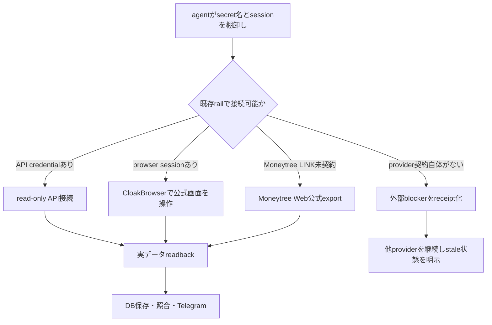
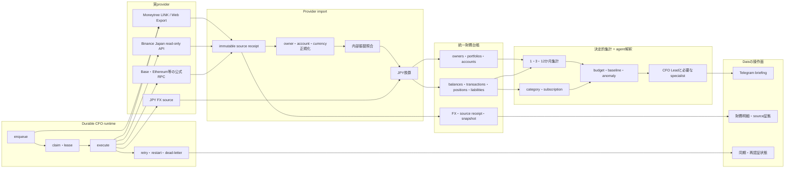
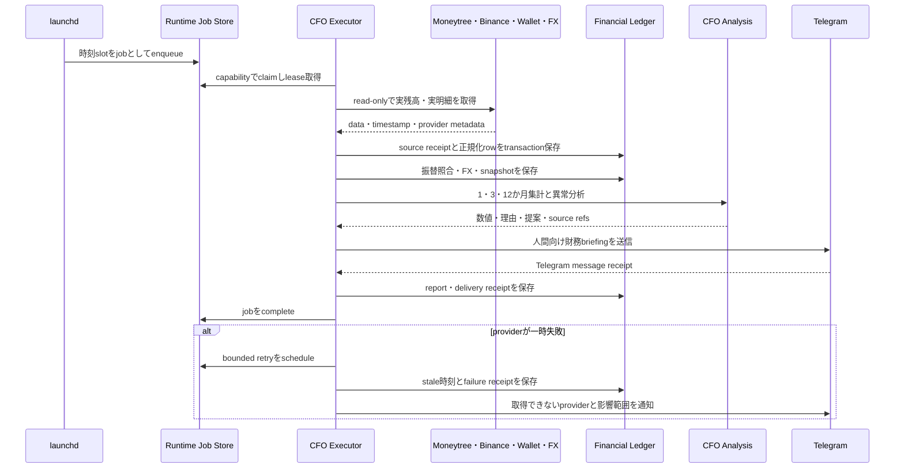
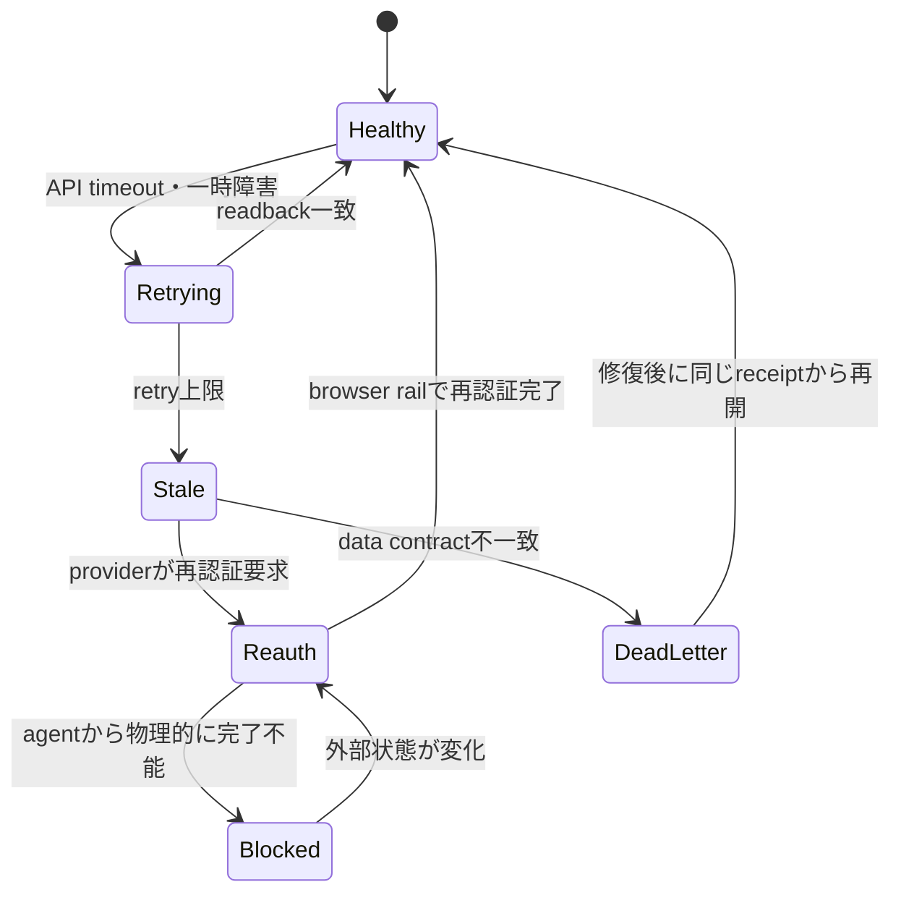
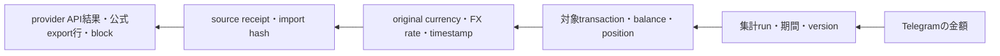

# CFO / Financial Organ ローカル完成設計

status: APPROVED
owner: Dais / Life Manager
parent: `docs/superpowers/specs/2026-08-01-dais-life-manager-five-phase-execution-spec.md`
branch: `feat/cfo-local-organ-20260802`
worktree: `/Users/anicca/Projects/.worktrees/life-manager/cfo-local-organ-20260802`

## 1. 目的

Order 3A / 3Bを、Dais本人の実金融データを読むローカルFinancial Organとして完成させる。
銀行、カード、証券、Binance、公開walletをowner別の統一台帳へ保存し、JPY換算した純資産、収支、
負債、投資、crypto、budget、異常支出をTelegramへ証拠付きで報告する。

CFOはread-onlyである。送金、withdrawal、株式・crypto注文、署名、private key、seed phrase、
wallet passwordの取得は行わない。分析や提案はできるが、資金移動はOrder 4 / 5の独立policy gateより
先に実行しない。

## 2. 実測した開始状態

### 2.1 証拠

- baseは`origin/main`の`2099a29da61345a120d2f68a819d7b854dcebd83`。
- master specのO3A-01〜07とO3B-00〜24はすべて未完了である。
- `runtime-job-store.js`にはenqueue、scheduled enqueue、claim、lease heartbeat、complete、fail、
  reconciliation、dedup、immutable receiptの基礎がある。
- 既存financial reportにはsnapshot、Supabase読取、Telegram送信receipt、daily/weekly cadence、
  runtime capability adapter、launchd templateがある。
- `ai.anicca.life-manager-financial-report`はlaunchdへ登録済みだが、実測時は`not running`、
  `runs = 233`、`last exit code = 1`だった。
- 旧`ai.anicca.cfo-daily`も登録が残り、`not running`、`runs = 1`、`last exit code = 127`だった。
- `apps/life-manager/lib/financial-organ/`と`20260802_financial_organ_*` migrationは存在しない。
- 現在のfinancial reportは主にLife Manager API costとagent walletを扱い、Dais個人の銀行、カード、
  証券、Binance、walletを統合する台帳ではない。
- baseline focused testはruntime job storeの10件がpassした一方、worktreeに依存packageが未展開のため
  `canonicalize`と`@noble/hashes/sha3.js`をresolveできず3 test fileが起動前にfailedした。これは
  source failureとはまだ判定せず、実装前setupで再実測する。

### 2.2 推論

停止原因を「DB URL不足だけ」とは確定しない。現時点で確認できるのは、専用launchdが繰り返しexit 1、
旧labelがexit 127、個人CFO providerと統一台帳が未実装という三つの独立した欠損である。実装開始時に
launchdの実env、boot script、log、DB接続、runtime worker capabilityを同じ時刻窓で測り、原因を確定する。

## 3. 自律実行contract

Daisへの質問や手作業依頼を通常フローへ置かない。agentはMac mini上の既存credential store、
CloakBrowser daily-driverの既存tab/session、CDP `:9222`、公式API、公式exportを使って最後まで進める。



agentが行うこと:

- 既存sessionでlogin、OAuth、export、API key設定画面を操作する。
- secret値をchat、terminal、log、commitへ出さず、承認されたlocal secret storeへ直接保存する。
- Binance keyはReadingだけを有効にし、trading、futures、withdrawal、transferを無効にする。
- 可能ならMac mini public IPだけをallowlistする。
- CAPTCHA、OAuth、email codeなどagentが利用可能な既存browser/mail railで完結する認証を自分で処理する。
- 一つのproviderが外部契約やprovider障害で利用不能でも、他providerの同期と実装を継続する。

agentが行わないこと:

- Daisへpassword、API secret、private key、seed phraseをchatで要求する。
- providerが返していない値を推測で補う。
- external blockerをfake adapter、mock、dry-runで成功扱いする。
- Moneytree LINK未契約をMoneytree LINK接続済みとして報告する。

OSのbiometric prompt、物理security key、金融機関が別端末だけへ送るchallengeなど、agentのMac/browserから
物理的に完了不能な状態は、質問を連打せず`BLOCKED_EXTERNAL_AUTH`として正確な画面、対象provider、
最終成功時刻、未取得期間を保存する。他providerは止めない。

## 4. 採用architecture

Moneytreeだけに全providerを依存させないハイブリッド方式を採用する。Moneytree LINK productionが使える場合は
OAuth API、未契約時はMoneytree Web公式CSV/Excel export、Binanceはread-only API、walletは公開addressと
公式RPC、FXは出典とtimestampを保存できるdata sourceを使う。provider adapterの出力を同じimport contractへ
正規化するため、LINK承認後も台帳と分析を作り直さない。



## 5. 残TODO

master specのcheckboxはprimary agentだけがmain統合・実service検証後に更新する。このlaneでは以下の
実行TODOを正本とし、証拠が揃うまで完了へ変更しない。

### 5.1 調査・credential・接続rail

- [x] O3B-00a Moneytree LINK、Moneytree Web export、Binance Japan、対象wallet network、FXの公式仕様を調査
  evidence: `docs/superpowers/evidence/2026-08-02-cfo-official-provider-research.md`。Moneytree証券scope、
  Binance Japan固有可用性、実wallet network、実account planなど、公式資料だけで確定できない項目は
  次のinventoryへUNKNOWNとして引き継ぐ。
- [ ] O3B-00b credential名、scope、rate limit、history期間、refresh、re-auth、IP allowlist、契約条件を記録
- [ ] O3B-00c local secretを値非表示で棚卸しし、保存先、permission、expiration、接続可否をevidence化
- [ ] O3B-00d CloakBrowserのMoneytree/Binance session、公式export、既存OpenClaw skill、公開wallet情報を棚卸し
- [ ] O3B-00e 利用可能railを自動選択し、不足する外部契約はblocker receiptとして分離

### 5.2 Order 3A — runtime復旧

- [ ] O3A-01 DB secret injection元とboot env loaderを確定
- [ ] O3A-02 current source、history、plist、launchctl state、log、DBを同一時刻窓で診断
- [ ] O3A-03 financial capabilityを消費するexecutorをCFO専用launchdへ配線
- [ ] O3A-04 enqueue→claim→lease→execute→receipt→Telegramを実serviceで通す
- [ ] O3A-05 retry、timeout、dead-letter、dedup、partial failure、restart recoveryを実証
- [ ] O3A-06 旧`ai.anicca.cfo-daily`をreadback後にCFO専用手順で退役
- [ ] O3A-07 freshness、失敗、stale provider、次回retryを人間向けTelegramで通知

### 5.3 Order 3B — providerと統一台帳

- [ ] O3B-01 owner、portfolio、provider、account、liability、balance、snapshot、transaction、position、
  merchant、category、subscription、budget、baseline、anomaly、recommendation、decision、action、receipt schema
- [ ] O3B-02 original currency、JPY換算額、FX source、FX timestampを保存
- [ ] O3B-03 Moneytree LINKまたは公式Web exportの実接続railを完成
- [ ] O3B-04 Moneytreeから実銀行・card・証券の残高・明細・category・sync stateをimport
- [ ] O3B-05 Binance Japanから実balance、trade、deposit、withdraw、保有商品、permissionを取得
- [ ] O3B-06 対象walletのnative/token balance、transaction、block、timestampを取得
- [ ] O3B-07 内部振替を照合し、収入・支出の二重計上を防止
- [ ] O3B-08 merchantを正規化し、支出categoryをconfidenceと根拠付きで分類
- [ ] O3B-09 recurring subscriptionと利用状況を検出
- [ ] O3B-10 1か月・3か月・12か月の収入、支出、cash flowを決定的に集計
- [ ] O3B-11 総資産、純資産、現金、預金、負債、証券、crypto、burn、runway、budget、baseline、anomalyを計算
- [ ] O3B-12 daily、weekly、monthly Telegram reportを生成・実送信
- [ ] O3B-13 全数値から集計run→transaction→FX→source receipt→provider原本を逆引き可能にする

### 5.4 分析・agent contract・UX

- [ ] O3B-14 CFO Leadのgoal、input、tool、output、停止条件を定義
- [ ] O3B-15 Bookkeeper、Cashflow、Income、Capital、Fiat/NISA、Crypto、Tax、Reporterのcontractを定義
- [ ] O3B-16 全specialistを同じ統一財務台帳へ接続し、agent間chatを正本にしない
- [ ] O3B-17 数値は決定的code、意味解釈はagent、全数値は出典付きという境界をcontract test化
- [ ] O3B-18 Actual Budgetのaccount、transaction、budget modelを比較し、移植範囲を決定
- [ ] O3B-19 Ghostfolio / rotkiのUX・会計modelを比較し、licenseとcopy禁止境界を記録
- [ ] O3B-20 daily close、weekly reflection、monthly closeを実装
- [ ] O3B-21 specialistの予測、提案、実行、結果を同じdecision IDで追跡
- [ ] O3B-22 self-improvement変更をhistorical replay→shadow→canary→promotionで検証
- [ ] O3B-23 agentがread-only権限、損失上限、署名policyを自己変更できないことをtest
- [ ] O3B-24 全specialist結果を非技術者向けTelegram briefing、明細link、同期状態linkへ統合し、
  message IDとprovider/database/report readback一致をevidence化

### 5.5 検証・統合

- [ ] V-01 dependency setup後にbaseline focused testを再実行
- [ ] V-02 failing test→最小実装→refactorのTDD cycleを各境界へ適用
- [ ] V-03 focused test、CFO全test、migration apply/rollback testをfresh実行
- [ ] V-04 provider原本、DB row、集計、Telegram数値の四方向照合
- [ ] V-05 duplicate、restart、provider timeout、stale FX、partial successを実serviceで検証
- [ ] V-06 secret leak scanとread-only permission readback
- [ ] V-07 fresh code reviewでship判定を得る
- [ ] V-08 専用evidence、commit一覧、rollback、primary integration手順を作成
- [ ] V-09 branchを`origin/feat/cfo-local-organ-20260802`へpush

## 6. 一回の同期



## 7. 実装後のDaisの体験

### 7.1 通常日

DaisはCFOを起動したりCSVを手で加工したりしない。Mac mini起動後にlaunchdとdurable executorが再開し、
Moneytree、Binance、wallet、FXを同期する。同じ取引を再取得しても重複せず、前回失敗したproviderだけを
再試行する。同期後、Telegramへ次が一通で届く。

```text
💰 今日の財務レポート

現在の純資産: ¥{{net_worth_jpy}}
前月比: {{month_change_jpy}}

内訳:
・銀行・現金: ¥{{cash_jpy}}
・証券: ¥{{securities_jpy}}
・Crypto: ¥{{crypto_jpy}}
・カード等の負債: ¥{{liabilities_jpy}}

今月の収入: ¥{{income_month_jpy}}
今月の支出: ¥{{spend_month_jpy}}

通常と違う動き:
{{anomaly_lines}}

データ状態:
{{provider_freshness_lines}}

今日の提案:
{{recommendation_lines}}

[財務明細を見る]({{detail_url}})
[同期状態を見る]({{sync_url}})
```

### 7.2 週次・月次

- 週次はcategory、merchant、subscription、budget、3か月baselineとの差を説明する。
- 月次は純資産、1/3/12か月収支、cash flow、burn、runway、投資・crypto構成、前月差を締める。
- 「なぜ増減したか」を、実明細の寄与度順に説明する。
- 未同期providerがあれば総資産を断定せず、最終同期時刻と未反映範囲を同じ画面に出す。

### 7.3 異常時



失敗しても古い値を最新値として見せない。Telegramには「何が読めないか」「最後に読めた時刻」「どの集計へ
影響するか」「いつ再試行するか」を出し、正常providerの結果は届ける。

### 7.4 数字の証拠



財務明細では、たとえば「外食費 ¥48,320」から、その金額を構成するtransaction、category判断、FX、
Moneytreeの元行まで逆引きできる。agentの説明だけを証拠にしない。

## 8. Best / Base / Worst

| case | 実装後の状態 |
|---|---|
| best | Moneytree LINK production、Binance、全walletが自動同期し、1/3/12か月を毎日更新する |
| base | Moneytreeは公式Web export、BinanceとwalletはAPI/RPCで同期し、同じ台帳とTelegram UXを提供する |
| worst | Moneytree契約または一部再認証が外部blockerでも、Binance/walletと取得済みexportは稼働し、stale範囲を明示する |

棄却案は「Moneytree LINK契約が揃うまで全CFOを待つ」である。最強の論拠は単一APIで運用を簡素化できる点だが、
契約審査が銀行以外の実接続まで止めるため採用しない。公式Web exportを同じimport contractへ通す方が、fake dataを
使わずに実台帳を先に成立させられる。

自分が間違うとしたら最有力の筋は、Moneytree Webの現行planまたは画面が期待するexport粒度を提供せず、
12か月の証券・カード履歴を一回で取得できない場合である。公式仕様と実画面を実装前に両方測り、取得可能期間を
provider別に見える穴として残す。

## 9. 完了条件

次が同じverification windowで揃った時だけlaneを完了とする。

- 実providerからread-onlyでDais本人の残高・明細・positionを取得している。
- provider原本、source receipt、DB row、JPY集計、Telegram表示が一致する。
- 1か月・3か月・12か月、category、subscription、budget、baseline、anomalyが実明細から計算される。
- Dais-ownedとAnicca-ownedが混ざらず、内部振替が二重計上されない。
- restart、retry、dead-letter、dedup、stale、partial successを実証している。
- Telegram実送信のmessage IDがreceiptとして保存される。
- focused test、CFO全test、review、evidence、commit、pushが揃う。
- Moneytree LINK未契約などの外部blockerを成功扱いせず、代替railと不足契約を明示する。

master specのO3A/O3B checkboxは、このbranchのreview・main統合・canonical runtime readback後にprimary agentが
更新する。
