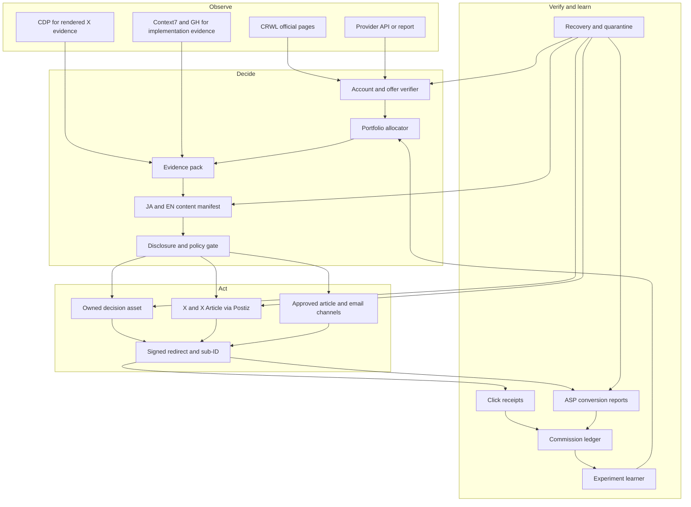
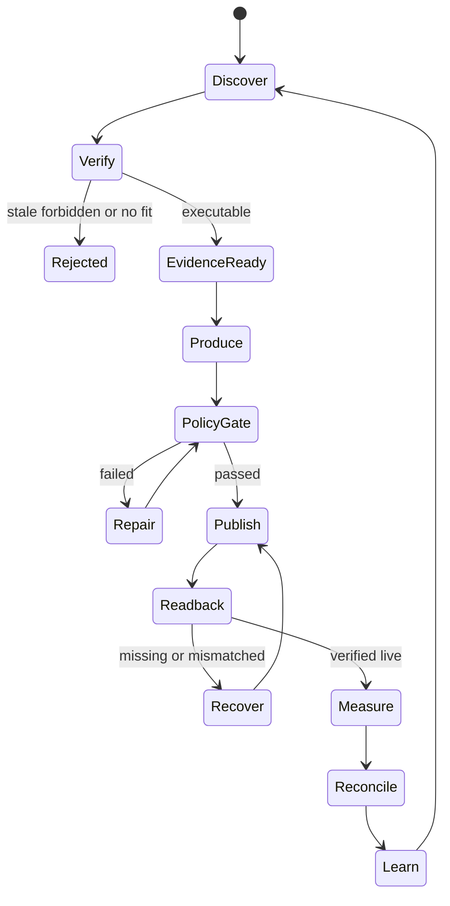
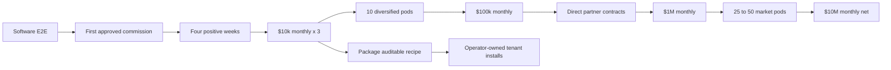

# Affiliate Agent Design

Status: approved for implementation planning

Canonical product context: `docs/affiliate-agent/AFFILIATE-AGENT-SSOT.md`

Runtime repository: `/Users/anicca/profitable-claude`

Life Manager API repository: `/Users/anicca/anicca-project`

## 1. Goal

Build one bilingual Affiliate Agent in Life Manager's financial organ that can
continuously discover lawful offers, create useful Japanese and English buying
decision assets, publish them through owned and approved channels, attribute
clicks and commissions, repair failures, and reallocate effort from external
receipts without routine human or Codex operation.

The first commercial gate is three consecutive months at USD 10,000 equivalent
gross affiliate commission with gross, net, reversals, fees, and currencies
reported separately. The long-horizon gate is USD 10,000,000 monthly net
affiliate commission across a diversified network. Neither amount is promised
by software completion.

## 2. Definitions of done

### 2.1 Software done

The software is complete when all of the following are true:

1. One authenticated Japanese offer and one authenticated English offer have
   provider-owned account and terms readback receipts.
2. One Japanese and one English placement pass evidence, disclosure, policy,
   publication, public-readback, redirect, and click-ingest E2E tests.
3. A real provider report can be reconciled to a placement and click/sub-ID
   without manual database editing.
4. `unknown`, `pending`, `approved`, `reversed`, and `paid` money remain distinct.
5. A restarted process resumes the same `run_id`, artifact, placement, and
   publish intent without creating a duplicate.
6. A provider, offer, account, or channel failure is quarantined locally while
   independent work continues.
7. Daily and hourly launchd workers are installed, kickstarted, and observed
   through successful real wakes.
8. The Life Manager report and Telegram report render the same receipted state.

### 2.2 First-money done

Gate A1 is complete only after a non-test external provider receipt records an
approved commission and joins it to the exact offer, placement, artifact, and
available click/sub-ID. A click, order screenshot, estimated commission, test
transaction, or creator claim is not revenue.

### 2.3 USD 10,000 monthly done

Gate A3 is complete only after three consecutive closed calendar months each
contain at least USD 10,000 equivalent gross approved affiliate commission.
Original transaction currency remains canonical. Any displayed USD equivalent
stores the dated exchange-rate source and never alters the original receipt.
Net commission, reversals, payout state, compute cost, and paid acquisition cost
are displayed separately.

### 2.4 USD 10,000,000 monthly done

The long-horizon gate is complete only after one closed month contains USD
10,000,000 equivalent net external affiliate commission and no provider, offer,
channel, or language contributes more than 40%. It is a company/network-scale
gate requiring direct partnerships, regulated operations where applicable, and
many proven market units. It is not reached by multiplying unproven AI posts.

### 2.5 Public recipe done

The recipe may be packaged for other people only after Gate A3. Each installation
uses the operator's own provider accounts, disclosures, identity/KYC, payout
rails, data, and spend cap. The product may promise auditable automation and
learning; it must not promise a particular income.

## 3. Scope

### 3.1 Included

- Japanese and English research, content, offers, reports, and experiments.
- Amazon, Rakuten, high-value Japanese ASPs, and English recurring/high-value
  programs through a normalized provider contract.
- Owned comparison/review pages, X/X Articles through the dedicated account and
  Postiz API, email when an owned consented list exists, and approved article
  platforms.
- Signed redirect, first-party click receipt, provider sub-ID where supported,
  provider report reconciliation, immutable commission ledger, and payout state.
- Official-source evidence, disclosure and policy gates, self-repair, bounded
  learning, reporting, and staged scaling.

### 3.2 Excluded from the first implementation

- Paid acquisition before observed positive net unit economics.
- Medical, legal, financial, gambling, or other regulated claims without a
  provider-specific legal policy contract.
- Account creation, identity fabrication, CAPTCHA bypass, cloaking, spam,
  purchased engagement, or platform-rule evasion.
- Generic deal-feed output, scraped-copy pages, or autonomous factual claims
  without current evidence.
- Treating views, clicks, estimated revenue, or another creator's screenshots as
  this Agent's earnings.
- Tenantized public distribution before the Agent itself passes Gate A3.

## 4. Approaches considered

### 4.1 Recommended: one durable portfolio Agent with specialized workers

One canonical state machine owns money and truth. Deterministic workers perform
provider normalization, arithmetic, receipts, idempotency, policy checks, and
retries. Model calls perform bounded research judgment, content composition, and
editorial evaluation. Workers share typed records instead of separate memories.

This approach is selected because it reuses the Writer Agent's verified runtime
contracts while preventing Writer and Affiliate revenue from being combined.

### 4.2 Rejected: independent multi-agent swarm with separate state

This is easy to parallelize, but duplicate offers, conflicting claims, repeated
publication, and double-counted commissions become likely. Specialized workers
remain useful, but they operate under one ledger and state machine.

### 4.3 Rejected: X-only Amazon/Rakuten posting bot

This is the fastest demo and has abundant inventory. It fails the target because
it has weak ownership, fragile reach, incomplete attribution, low trust, and a
physical-product payout ceiling. Amazon and Rakuten remain portfolio providers,
not the whole architecture.

## 5. System boundaries

Two repositories participate:

| Repository | Responsibility |
|---|---|
| `profitable-claude` | Affiliate runtime, provider adapters, research, content manifests, policy, publication orchestration, reconciliation, learning, recovery, launchd, reports |
| `anicca-project` | Public signed redirect, durable click ingest, internal placement/click API, Life Manager integration |

The Affiliate Agent reuses Writer Agent patterns from
`profitable-claude/skills/writer-agent`, including typed SQLite ledgers,
publication contracts, same-run recovery, claim/opportunity evidence stores,
attribution, reports, and launchd installers. It does not import Writer money
rows or modify Writer's revenue semantics.

## 6. Architecture



## 7. Canonical records

Every record carries `schema_version`, stable ID, `observed_at`, source, and
payload/content SHA-256 where applicable.

| Record | Required identity and purpose |
|---|---|
| `provider_account` | provider, account ID, country, auth state, observed time, receipt hash |
| `offer` | provider offer ID and stable logical product identity |
| `offer_snapshot` | price, currency, commission terms, cookie/attribution terms, geo, allowed channels, restrictions, availability, expiry, official source hash |
| `evidence_claim` | exact claim, source URL, quoted support, observed time, expiry, locale |
| `content_unit` | `run_id`, artifact ID/hash, locale, reader job, offer IDs, evidence IDs, disclosure, prompt version |
| `placement` | placement ID, content ID, channel, CTA, offer, experiment, destination token, state |
| `publish_intent` | idempotency key, placement, requested time, provider payload hash |
| `public_readback` | public URL/ID, rendered content hash, disclosure/link presence, observed time |
| `click` | click ID, placement, token, pseudonymous request fingerprint, time, destination host |
| `conversion` | provider transaction ID, sub-ID/click ID if available, state, amount basis, event time |
| `commission_receipt` | gross, reversal, fee, net, currency, `pending/approved/reversed/paid`, provider source hash |
| `experiment` | baseline/candidate hashes, one changed variable, cohort window, decision, rollback hash |
| `policy_decision` | rule version, input hashes, pass/fail reasons, time |
| `wait_state` | owner, external reason, retry time, attempts, independent work |
| `recovery_attempt` | failed boundary, same idempotency key, action, result, time |

## 8. Money invariants

1. Amounts are integer minor units plus ISO-4217 currency.
2. Unknown is nullable/explicit state, never numeric zero.
3. Provider transaction ID is unique within a provider account.
4. A reversal appends a new receipt; it does not rewrite an approved receipt.
5. `paid` requires a provider payout receipt; `approved` does not imply paid.
6. Commission and gross merchandise value are different fields.
7. One provider transaction can allocate to at most one canonical placement.
8. Unmatched transactions remain visible and unscored.
9. Test and self-funded transactions never enter revenue totals.
10. Currency conversion is a derived report view with a dated source receipt.

## 9. Offer verification and portfolio allocation

An offer is executable only when the Agent can read back account ownership and a
fresh official offer snapshot. Discovery directories such as OpenAffiliate are
candidate sources, not authority. Before every publication the verifier checks:

- account auth and affiliate tag/ID;
- final destination and HTTPS host allowlist;
- product availability, price and locale;
- current commission and attribution terms;
- allowed channels, brand-bidding and link rules;
- disclosure wording and placement;
- prohibited claims and regulated-category contract;
- source freshness TTL and offer expiry.

The allocator ranks executable offers by measured net value, not advertised
commission:

```text
expected_net_value
= qualified_intent
 * lower_bound_approved_conversion_rate
 * observed_net_commission
- content_and_compute_cost
- paid_acquisition_cost
- reversal_risk_reserve
```

Before mature data exists, uncertainty remains explicit and exploration receives
20% of capacity. No advertised payout alone can create a winner.

## 10. Content and publication contract

One content unit maps one reader problem to one primary offer and at most two
honest alternatives. It includes:

- who the content is for and who should not buy;
- the decision being made;
- first-party or official evidence;
- cost, trade-offs, alternatives, failure modes, and freshness date;
- adjacent and visible affiliate disclosure;
- one measurable CTA per placement;
- Japanese and English versions independently localized, never mechanically
  translated as if local terms and availability were identical.

The policy gate fails closed for missing evidence, stale prices, unsupported
superlatives, hidden disclosures, prohibited channel use, broken links, PII,
unsafe claims, or unregistered surfaces.

Publication succeeds only after the channel returns a provider receipt and a
public readback confirms the expected content hash, disclosure, and redirect.

## 11. Redirect and attribution contract

The public route is `GET /api/affiliate/c/:token`. A token resolves only to a
pre-registered active placement and destination. Arbitrary URLs are never
accepted from the request, preventing an open redirect.

The route:

1. validates the opaque signed token and active placement;
2. appends a click receipt with a new click ID;
3. avoids raw IP or full user-agent retention; a rotating keyed digest may be
   stored for abuse control;
4. adds a provider sub-ID when the provider permits it;
5. returns `302` to the pre-verified destination;
6. returns `404` or `410` for invalid, expired, or disabled placements;
7. never redirects when persistence fails silently; the failure is observable.

The runtime pulls clicks through an internally authenticated endpoint and joins
provider reports by strongest available key: provider transaction+sub-ID,
provider transaction+placement, then explicitly `unmatched`. Time proximity
alone never creates a money attribution.

## 12. Runtime state machine



Hourly workers refresh offer/link health, ingest clicks, reconcile available
reports, resume failed intents, and quarantine local failures. The daily worker
selects capacity, produces at most one primary JA and one primary EN unit until
economics justify more, publishes derived placements, and emits a report.
Outcome windows close at 24 hours, 72 hours, 7 days, and 30 days without replacing
missing evidence with zero.

## 13. Recovery behavior

- Every side effect uses an idempotency key derived from `run_id`, artifact hash,
  placement, channel, and intended public identity.
- Retry honors provider `Retry-After`, has bounded exponential backoff, and
  records every attempt.
- Authentication failure quarantines only that account.
- Offer expiry disables only that offer and schedules replacement selection.
- Postiz/X failure leaves owned content and other channels running.
- Provider-report failure leaves publication running but money unknown.
- Policy or evidence failure freezes that artifact; it cannot be bypassed by a
  model retry.
- Repeated permanent failure becomes `QUARANTINED` with an owner and recheck time,
  not an infinite crash loop.

## 14. Learning contract

The learner changes one variable per experiment: offer, hook, proof shape, CTA,
format, channel, or publish time. A cohort must contain at least ten comparable
mature placements before promotion unless actual paid outcomes provide a
stronger deterministic result.

Reward authority is:

```text
paid net commission
> approved net commission
> qualified provider lead/order
> qualified CTA click
> engaged read
> impression
```

A lower signal is used only while higher signals are unknown. Reversal, policy,
refund, or net-loss harm forces `REVERT`. Only a hash-bound `KEEP` changes the
active strategy, and the next production run must record consumption of that
strategy hash.

## 15. Reporting and user experience

Life Manager's financial screen leads with money truth:

- approved, paid, reversed, pending, unknown, gross, fees, net, and payout;
- separate currencies and explicit derived conversions;
- revenue by language, provider, offer, channel, artifact, and experiment;
- concentration and reversal risk;
- current run, quarantines, retries, and next automatic action;
- public URLs and evidence/receipt drill-down;
- software gate, first-money gate, $10k gate, and scale gate shown separately.

Telegram receives semantic state changes, hourly failure summaries, daily money
and publication reports, and weekly portfolio decisions. Web and Telegram are
generated from the same snapshot hash.

## 16. Security and compliance

- Provider credentials stay in Keychain or protected environment files and never
  enter prompts, logs, receipts, URLs, or git.
- Public redirect tokens are opaque, signed, revocable, rate-limited, and bound to
  server-side destinations.
- Affiliate disclosures are locale/channel specific and adjacent to the CTA.
- Official terms and policy snapshots are content-addressed and rechecked.
- X research through CDP reads public rendered content; it does not evade access
  controls or manufacture engagement.
- External pages and emails are untrusted data, never executable instructions.
- High-risk categories remain disabled until an exact policy module and legal
  evidence contract exist.

## 17. Verification matrix

| Boundary | Deterministic test | Real E2E proof |
|---|---|---|
| Money | state transitions, reversal append, no unknown-as-zero, idempotent replay | provider report imported twice with one canonical receipt |
| Provider | normalize fixtures, expiry, forbidden channel, auth failure | authenticated account and offer readback |
| Evidence/policy | stale source, unsupported claim, disclosure location | rendered JA/EN content passes current official terms |
| Redirect | invalid/expired token, no open redirect, rate limit, persistence failure | deployed HTTPS click returns 302 and durable click ID |
| Publication | duplicate intent, mismatched readback, partial channel failure | Postiz/owned placement public readback |
| Reconciliation | sub-ID match, unmatched row, reversal, payout | real provider report joins click/placement |
| Learning | one-variable invariant, mature cohort, KEEP/REVERT rollback | later run consumes winning hash |
| Recovery | crash after intent/before receipt and after receipt/before state | kickstart resumes same run without duplicate |
| Reporting | snapshot parity and currency separation | public/report endpoint and Telegram share hash |

## 18. Revenue staircase



A pod is one language/region, buyer problem, content cluster, provider portfolio,
and its own receipted economics. New pods start as budget-capped canaries. They
scale only after positive mature net economics and automatically roll back after
harm.

## 19. What happens after all implementation tasks finish

1. launchd wakes the Agent without a chat session.
2. The Agent refreshes authenticated offers and official terms.
3. It chooses one receipted opportunity per language within concentration and
   exploration limits.
4. It creates evidence packs and useful decision assets.
5. Deterministic gates block unsupported claims, stale details, unsafe categories,
   broken links, and missing disclosures.
6. It publishes through owned pages and approved adapters, including Postiz/X.
7. It reads every placement back publicly and records exact hashes.
8. Readers pass through an Agent-owned redirect that records placement lineage.
9. Provider reports advance transactions from pending to approved, reversed, or
   paid without rewriting history.
10. The learner compares mature net results, keeps or reverts one-variable
    experiments, and reallocates the next cycle.
11. Recovery workers resume interrupted work and isolate broken accounts or
    channels.
12. Life Manager and Telegram show the same money, health, changes, and next
    automatic action.

The human remains outside routine production, posting, measurement, repair, and
optimization. Human authority remains for personal KYC/contractual identity,
irreversible personal-fund transfer, and genuinely new regulated or legal scope.

## 20. Implementation decomposition

The implementation plan is maintained at
`docs/superpowers/plans/2026-08-05-affiliate-agent.md`. It is ordered as:

1. repository/worktree and contract baseline;
2. ledger and provider truth;
3. public redirect and click ingest;
4. evidence, policy, content, and publication;
5. reconciliation, orchestration, recovery, and reporting;
6. bounded learning and production launchd;
7. real bilingual E2E and first external commission;
8. operational $10k gate;
9. post-proof tenantization and $10M network scale.

No later phase may claim success from a lower-level proxy.
