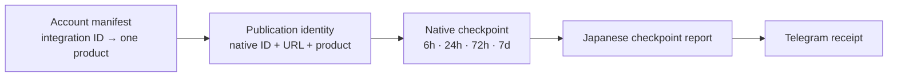

# Native Product Checkpoint Binding Design

Date: 2026-08-05

## Goal

Create the first truthful product-bound native social checkpoint and deliver its
Japanese Telegram report without rewriting historical metrics or inferring a
product from captions, display names, or handles.

This slice closes the missing checkpoint report type in Gate 15. It does not
close Gate 14 or claim that social measurement has reached the required 95%
in-window completeness.

## Verified Current State

- `state/publication-identity.jsonl` contains 92 publication identities. The
  inspected rows have no `product_id`.
- `state/post-metrics.jsonl` contains 110 checkpoints and all 110 have
  `product_id=null`.
- `measure/native_metrics.py` already copies `product_id` from a publication
  identity into every new checkpoint. The missing value originates upstream.
- The Gate 12 TikTok publication
  `cmsaselv6070sqn0yp7oix7yd` has an exact native video ID and URL, integration
  ID `cmo5s4edx00vgn10ygnu34a0n`, and experiment identity, but no product ID.
- Account manifest `registry/accounts/tiktok.obou_anicca.json` maps that exact
  integration ID to the single product `ebook-ja`.
- Gate 15 already delivers action, product-daily, incident, experiment, and
  portfolio-weekly reports. Checkpoint is the only report kind without a real
  receipt.

## Decision

Bind publication identities to products using only the exact
`publisher_integration_id` declared by an account manifest.

The binding is upstream of metric collection:



### Binding contract

For every account manifest with a non-null `publisher_integration_id`, the
binder creates this exact mapping:

```text
publisher_integration_id -> account_id, product_id
```

For a publication identity whose `integration_id` matches exactly, it writes:

- `account_id`
- `product_id`
- `product_id_null_reason=null`
- `product_binding_source="account_manifest.publisher_integration_id"`

It does not compare or normalize captions, account display names, or handles.

### Fail-closed rules

- Two manifests mapping one integration ID to different products abort the
  entire operation before any state write.
- A publication row already bound to a different product aborts before write.
- A manifest with no integration ID creates no mapping.
- An unmatched publication stays unbound and carries
  `product_id_null_reason="account_manifest_integration_unmapped"`.
- Invalid manifests, missing required IDs, or unknown product IDs abort before
  write.

## Components

### `identity/product_binding.py`

A pure, testable module loads `registry/products/*.json` and
`registry/accounts/*.json`, verifies every account product against the product
registry, builds the unique integration index, binds rows, and returns a
deterministic summary. It performs no network calls and no state writes.

### `identity/publication_ledger.py`

The existing reconciliation CLI loads account manifests, merges existing and
current Postiz rows, applies product binding to the complete merged ledger,
validates it, and then performs its existing atomic write. This backfills
eligible historical identity rows while ensuring every future reconciliation
uses the same rule.

The CLI gains account- and product-registry arguments whose defaults are
`registry/accounts` and `registry/products`. Fixture tests can pass temporary
registries.

### `measure/native_metrics.py`

No product inference is added here. Its existing propagation contract remains:
new checkpoint rows copy `product_id` and its null reason from the publication
identity row.

### `report/owner_report.py`

No inference is added here. It continues to accept only rows whose exact
`product_id` matches the requested product and includes the exact native URL.

## State and Migration

`publication-identity.jsonl` is a generated current-state ledger and is already
written atomically. The production apply procedure first records its row count
and SHA-256, writes a timestamped backup outside the repository, runs the
reconciliation/binding operation, then validates and reads back the target Gate
12 row.

Historical `post-metrics.jsonl` rows are append-only evidence and are never
rewritten. After identity binding, the native collector creates only checkpoint
keys not already present for the Gate 12 publication. Because that publication
currently has no checkpoint rows, it can produce new product-bound evidence
without mutating the 110 legacy rows.

If the elapsed checkpoint windows are already late, the collector records
truthful `missed` rows with null metrics and reasons. A missed checkpoint is a
valid proof that the checkpoint report type works, but it is not a measured
performance result and does not improve Gate 14 completeness.

## End-to-End Verification

The slice is complete only when all of these pass:

1. TDD proves exact integration binding, unknown integration preservation,
   conflicting manifest rejection, conflicting existing binding rejection,
   and idempotent rerun.
2. The publication ledger fixture suite proves binding occurs before atomic
   output and the complete ledger is backfilled.
3. The native metric suite proves a bound identity produces a checkpoint with
   the same `product_id`, native ID, native URL, and null reasons.
4. The owner report suite proves the product-bound checkpoint renders the exact
   metrics or truthful missed/unavailable reason and native URL.
5. Production read-back proves the Gate 12 identity is bound to `ebook-ja` by
   the expected integration ID.
6. A real native-metric collection appends only new checkpoint keys and leaves
   the 110 historical rows byte-for-byte unchanged as a prefix.
7. A real owner-report run reaches Telegram and records a non-null message ID.
8. An identical replay adds zero metric rows, zero report rows, and zero
   Telegram sends.
9. LaunchAgent read-back remains on canonical `/Users/anicca/anicca` paths and
   exits zero.

## Alternatives Considered

### Bind inside the metric collector

Rejected because the publication identity SSOT would remain unbound, forcing
reporting and attribution to repeat the same join independently.

### Bind a single Gate 12 row through experiment attribution

Rejected because it would close one receipt while leaving future publications
and the remaining accounts on the broken path.

### Infer from handle, display name, caption, or language

Rejected because those values are mutable and non-unique. A wrong join would
teach one product from another product's performance, which violates the
one-product-per-account and no-cross-product-attribution invariants.

## Primary-Source Alignment

- Postiz post analytics requires a concrete Postiz post ID and returns metric
  series for that post: <https://docs.postiz.com/public-api/analytics/post>.
- TikTok video query exposes the exact video ID plus view, like, comment, share,
  and favorite counts: <https://developers.tiktok.com/doc/research-api-specs-query-videos>.
- The inspected Postiz OSS route implements `/analytics/post/:postId` in
  `gitroomhq/postiz-app`, confirming that the post identity is the analytics
  boundary rather than caption text.

## Scope Boundary

This slice binds product identity and proves one real checkpoint-report path.
It does not repair every August 2–11 native identity, introduce paid spend,
rewrite old checkpoints, claim a winner or loser, or close the 95% completeness
gate. Those remain the next Gate 14/native-measurement tasks in Spec 27.
