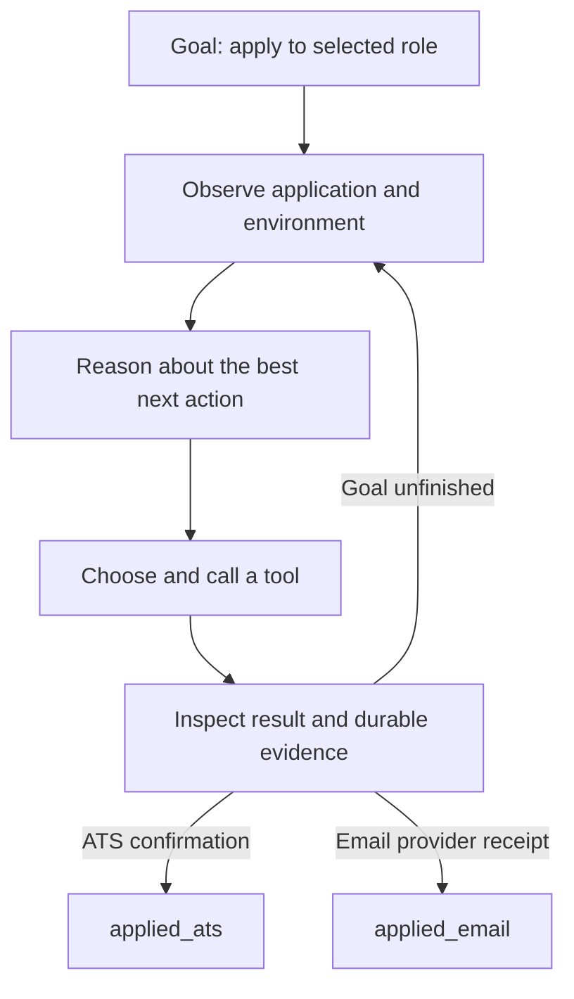
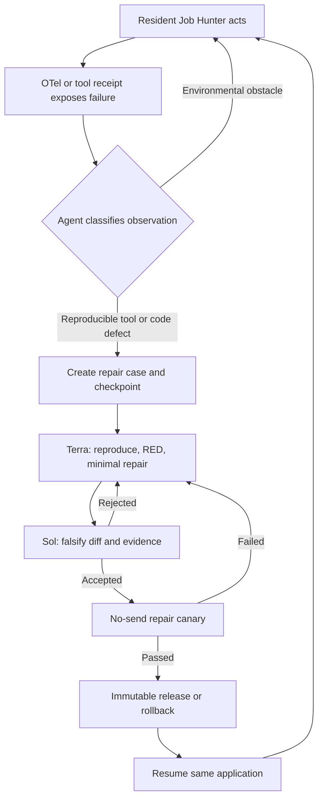

# Job Hunter Agent Architecture

## Purpose

Job Hunter is a goal-directed AI agent whose job is to obtain a better job for Dais
by applying to every selected eligible role. It is not a predefined application
workflow. The model observes the current application and environment, chooses tools
and tactics, evaluates their results, adapts, and continues until the role has one
durable application outcome.

The execution-order SSOT remains
`docs/superpowers/plans/2026-08-02-job-hunter-local-completion.md`. This document is
the architecture boundary that the SSOT and implementation reference.

## Researched basis

- Anthropic distinguishes workflows, whose LLM/tool calls follow predefined code
  paths, from agents, where the LLM dynamically directs its process and tool usage.
  It recommends simple composable patterns over complex frameworks:
  <https://www.anthropic.com/engineering/building-effective-agents>
- Anthropic reports that effective agent prompts encode heuristics rather than rigid
  paths, evaluate end states rather than one prescribed sequence, expose tool
  failures to the model so it can adapt, and combine that adaptability with durable
  checkpoints and deterministic safeguards:
  <https://www.anthropic.com/engineering/multi-agent-research-system>
- OpenAI describes the foundations as model, tools, and instructions, recommends
  maximizing a single agent before adding multi-agent complexity, and treats
  guardrails as layered protections rather than the agent's decision-maker:
  <https://openai.com/business/guides-and-resources/a-practical-guide-to-building-ai-agents/>

## Non-negotiable outcome contract

For every selected role, the agent keeps acting until exactly one durable outcome:

1. `applied_ats`: authoritative formal ATS confirmation exists; or
2. `applied_email`: Gmail returned an authoritative provider message ID for a
   resume-bearing application sent to a verified recruiting contact.

ATS is the default first application channel. If ATS does not produce authoritative
confirmation, the agent changes tactics and applies by email. Diagnostics such as
CAPTCHA, missing fact, unknown control, timeout, telemetry failure, or repair failure
describe observations; they never end the application.

The agent never fabricates identity, employment, education, or legal eligibility and
never duplicates an existing application. Uncertainty changes wording or channel; it
does not create a no-application outcome.

## Responsibility boundary

### The agent owns judgment

The LLM decides which role to handle next; how to research the role and company; how
to navigate and answer the live ATS; when a tactic has failed; how to find a verified
recruiting contact; how to compose a truthful application; which available tool to
use next; and how to recover while preserving the same application goal.

Prompts state the goal, truthful boundaries, available evidence, tool contracts, and
observable terminal outcomes. They provide heuristics, not an exhaustive branch tree
or a script of browser steps. A new site state should normally be information for the
agent, not a new hard-coded workflow branch.

### Deterministic code supplies capabilities and invariants

Code provides small, explicit tools for discovery, browser inspection and action,
resume selection, Gmail, Ledger, Telegram, Calendar, evidence capture, telemetry,
release, and rollback. Code also guarantees per-channel idempotency, secret handling,
durable checkpoints, evidence hashes, and truthful terminal receipts.

These safeguards constrain side effects and claims. They do not rank a role out,
grant permission to apply, select the agent's tactic, or convert a diagnostic into a
terminal result.

### Single agent by default

One resident Job Hunter owns an application from selection through terminal receipt.
Specialized repair models may be tools invoked for an isolated code repair, but they
do not take ownership of the application or operate ATS, Gmail, Telegram, or Calendar
side effects. Multi-agent orchestration is not added to normal job hunting unless a
measured limitation of the single agent requires it.

## Self-healing contract

Self-healing is a core pre-production capability, not a post-campaign enhancement.
OpenTelemetry and authoritative tool receipts expose failures. The resident agent
first adapts around ordinary environmental obstacles. A reproducible tool or code
defect creates a content-addressed repair case holding the same application identity
and durable pre-side-effect checkpoint.

The repair lane reproduces the defect in isolation, produces a RED test and minimal
patch, runs focused and complete suites, and independently tries to falsify the fix.
A no-send repair canary validates the repaired tool without creating an external
application/email side effect. Immutable release promotion or atomic rollback follows.
The resident Job Hunter then resumes the same application and continues until
`applied_ats` or `applied_email`.

`no-send` exists only inside the isolated repair canary. The production application
loop has no `no-submit`, skip, blocked, or abandon mode.

## Acceptance tests

- A prompt review finds no production `no-submit` instruction or terminal diagnostic.
- An unseen ATS obstacle can be returned to the agent as an observation without code
  deciding that the application ends.
- Every selected-role E2E ends with exactly one ATS or Gmail authoritative receipt.
- A duplicate wake cannot repeat either ATS or email side effects.
- A forced tool defect produces a repair case, passes a no-send repair canary, releases
  or rolls back, and resumes the same application to a terminal receipt.
- Telegram reports each application and repair with durable evidence identifiers.
