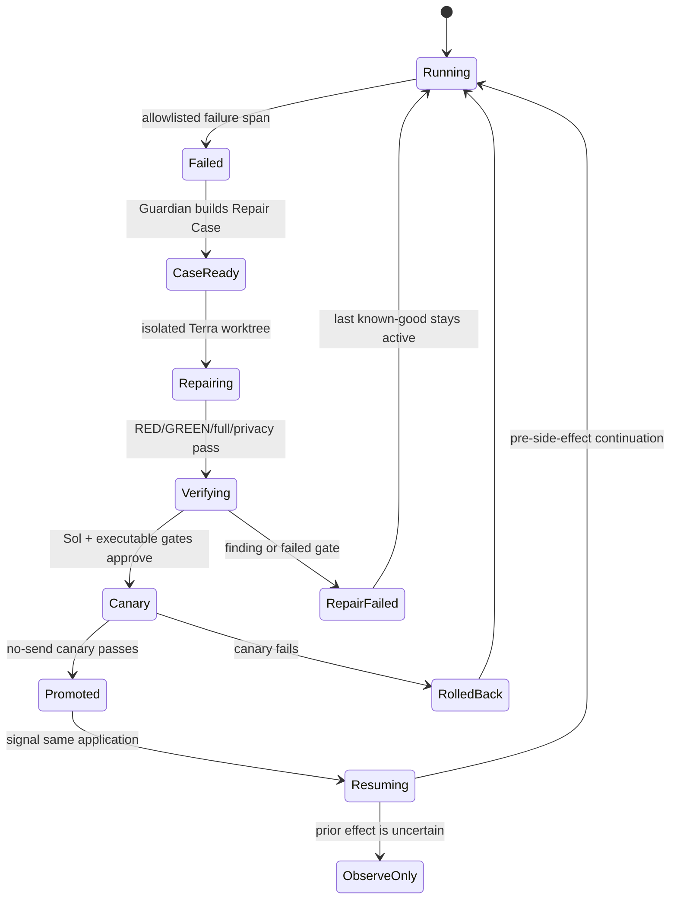

# Job Hunter Self-Healing Harness Design

**Goal:** Remove the development/main session from normal Job Hunter repair by making
the resident system detect a failed application, create a reproducible repair case,
repair and verify itself without live side effects, release the fix, and resume the
same application exactly once.

## Decision

Use a hybrid harness. OpenTelemetry supplies sanitized failure observations; the
Ledger remains business truth; Guardian owns bounded repair policy; a Codex repair
agent diagnoses and edits an isolated worktree; an independent verifier attempts to
falsify the repair; the immutable release system promotes or rolls back; durable
application state resumes the same application.

The resident and self-healing model is Terra. It owns routine diagnosis, RED/GREEN
repair, and bounded retry using the ChatGPT-authenticated Codex runtime. Sol is a
scarce release verifier, not a loop worker: it runs at most once, read-only, only after
the candidate passes every executable gate. Agents SDK is optional future
orchestration and does not replace launchd, Ledger, Guardian, or the Codex runtime.

Do not replace the resident Job Hunter with a deterministic workflow. Deterministic
components fence and verify side effects; the agent observes unfamiliar pages,
chooses tools, diagnoses faults, and writes repairs in natural language.

## Considered approaches

1. **Hybrid OpenTelemetry + Guardian + Codex repair agent — selected.** Reuses the
   existing Ledger, launchd, browser fence, immutable releases, and traces. It adds
   agent judgment only where diagnosis and code repair require it.
2. **Agents SDK as the entire runtime — rejected for this slice.** It provides useful
   handoffs and traces but would duplicate working application ownership, Ledger, and
   launchd contracts before producing a repair.
3. **Shell-script auto-repair — rejected.** It is suitable for known permission or
   stale-lock faults, which Guardian already repairs, but cannot generalize to new ATS
   DOMs, changed APIs, or previously unseen code failures.

## Components

### Failure detector

The private trace index consumes only allowlisted OpenTelemetry attributes. A failure
is repairable only when it identifies a failed component and joins to a resident run,
release SHA, application/route ID, actor PID, browser fence, and immutable evidence
hash. ATS or Gmail success still comes only from the Ledger receipt.

### Repair case builder

Guardian converts a repairable failure into a content-addressed, mode-0600 Repair
Case. The case contains sanitized fault class, trace/span IDs, release SHA, run and
application identifiers, evidence hashes, exact reproduction command, allowed edit
roots, and the last safe side-effect boundary. It contains no form answers, profile
values, raw HTML, cookies, tokens, email body, or screenshot bytes.

An exact replay returns the existing case. An uncertain post-send effect never opens
an automatic repair/resume path.

### Repair executor

The executor creates one isolated worktree from the failing release. Terra receives
the Repair Case and repository instructions and must perform:

1. reproduce the recorded fault without external sends;
2. write a RED regression test;
3. implement the smallest repair;
4. run the focused test and complete Job Hunter suite;
5. run the privacy scan and build an immutable candidate release.

The repair process cannot access application, Gmail-send, Telegram-send, Calendar,
or production browser-submit capabilities. It may read the private hashed evidence
named by the case but may not copy private content into the repository or model
output.

### Independent verifier

A fresh Sol context receives the Repair Case, candidate diff, and executable evidence.
It is read-only and attempts to falsify root-cause coverage, at-most-once behavior,
privacy, and regression claims. Model prose cannot approve a release. Approval
requires all executable gates plus a structured verifier receipt with no unresolved
finding. No Sol call is made while Terra is diagnosing, editing, or retrying, and no
Sol call is made for a candidate that has not already passed RED/GREEN, focused,
full-suite, privacy, and immutable-release checks. One candidate release admits at
most one fresh Sol verification call.

### No-send canary and release controller

The candidate release runs the exact reproduction in an isolated no-send canary.
No-send is a repair environment, never a production application outcome. The canary
must prove the original fault is absent, all external transports stayed unused, and
the authoritative confirmation classifiers were not weakened.

On success, the controller atomically promotes the immutable release and retains the
previous release for rollback. On any failure it keeps or restores the last known-good
release and records the failed candidate.

### Same-application resume

The resume controller signals the durable application execution after promotion.
Until Temporal migration is complete, it uses the existing Ledger application/route
state and a persisted Codex thread ID. After Temporal migration, the same contract is
implemented by Workflow/Activity IDs and a signal. Resume starts only from the last
pre-side-effect boundary. A clicked or request-started unknown action is observed and
reconciled, never replayed.

### Owner reporting

Telegram receives one deduplicated natural-language repair receipt containing the
fault, diagnosis, changed contract, RED/GREEN/full-suite evidence, old/new release
SHAs, canary result, promotion or rollback, resumed run, and resulting authoritative
application status. It contains trace identifiers and hashes, not private payloads.

## State flow

## Safety invariants

- Only the installed resident application lane performs real ATS or Gmail actions.
- The repair and verifier processes have zero external-send authority.
- A Repair Case never changes an application state.
- OpenTelemetry never proves an application outcome.
- Every ATS/email route remains independently at most once.
- Unknown post-send state is never automatically replayed.
- A promoted repair always has a content-addressed case, tests, verifier receipt,
  canary receipt, release SHA, and rollback target.
- The main development session is not part of normal detection, repair, release, or
  resume after the harness E2E gate passes.

## Verification

The first end-to-end proof injects a real previously observed pre-submit failure into
the installed resident path without sending. It must create one Repair Case, produce
one minimal patch, pass RED/GREEN/focused/full/privacy gates, pass the no-send canary,
promote one immutable release, resume the same application once, and Telegram-deliver
the complete repair receipt. A second identical observation must deduplicate.
