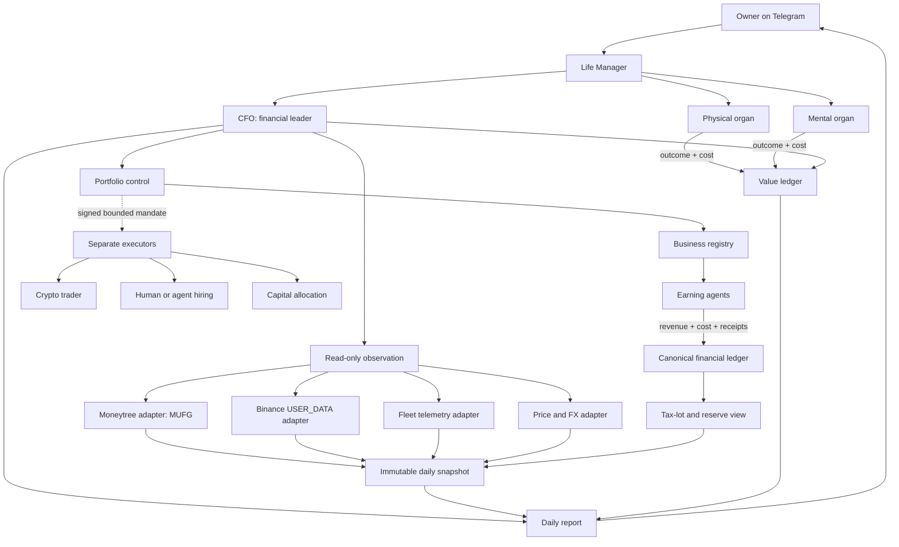
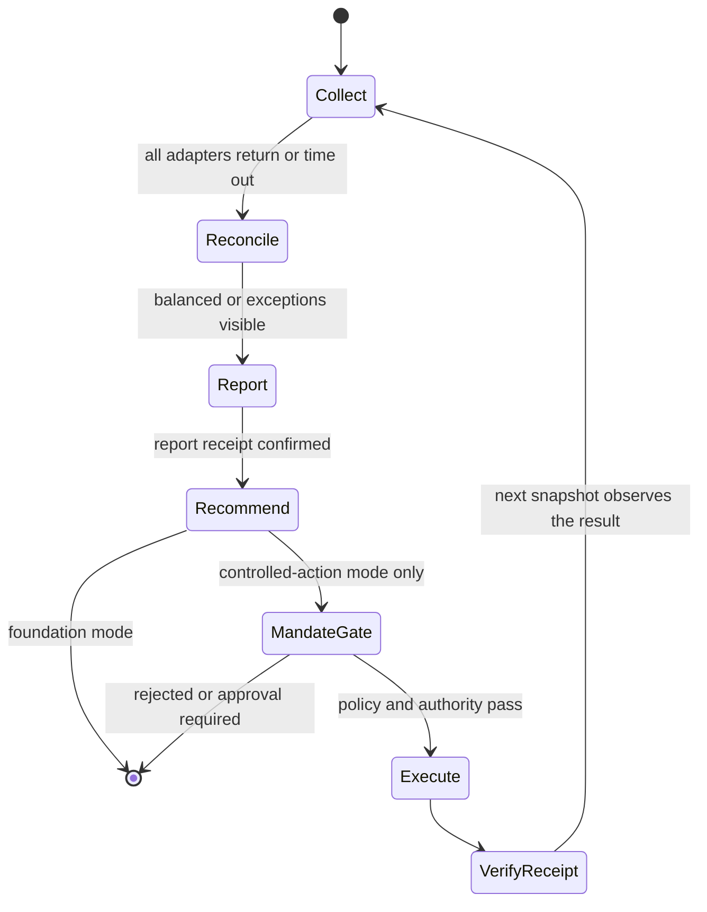

# Life Manager CFO — Personal Finance and Agent-Economy Control Plane

| Field | Value |
|---|---|
| Status | PLAN — implementation has not started |
| Owner | Life Manager financial organ |
| Product scope | Dais first, multi-tenant after local E2E |
| Runtime order | local first, Steel cloud second |
| Existing foundations | `apps/life-call`, Moneytree connector, Fleet telemetry, `lm_api_cost`, `lm_financial_ledger` |
| First unfinished item | **CFO-0c: inventory every live earning loop; then CFO-1 builds one read-only snapshot** |

## 1. Overview — What and Why

Life Manager needs one financial leader that answers four questions with evidence:

1. What does the owner have now?
2. What did each business or agent earn and spend?
3. What tax liability and cash reserve are attributable to realized activity?
4. Which business receives more capital, receives a repair order, or is stopped?

The current repository already has useful fragments, but no canonical personal-CFO loop. `apps/life-call`
records estimated API costs in `lm_api_cost` and exposes a read-only ledger endpoint. The landing/Fleet system
already aggregates chain-verified wallet net worth, earnings, and burn. Moneytree is connected and can read the
owner's MUFG account. These MUST be composed before another earning agent is created.

The enduring rule is **one closed slice at a time**:

> Observe → reconcile → report → verify → only then decide or act.

The CFO MUST NOT trade, transfer, hire, fund, or stop a live business during the foundation milestone. Read and
write authority remain different capabilities permanently. No balance, transaction, revenue, or tax estimate is
invented; unavailable data remains visibly `unknown`.

### Evidence behind the architecture decisions

- **Binance Developer Docs** — https://developers.binance.com/en/docs/products/spot/rest-api  
  Core quote: “API keys can be configured to allow access only to certain types of secure endpoints.”  
  Decision: CFO-1 uses a dedicated `USER_DATA` key with trading and withdrawals disabled. Later trading uses a
  different key, service, policy, and audit trail.
- **Moneytree LINK API** — https://docs.link.getmoneytree.com/docs/getting-started  
  Core quote: “Moneytree LINK APIは実際の利用者のデータを取り扱う本番環境以外…検証環境もあります。”  
  Decision: the installed Moneytree connector is the first MUFG adapter; direct MUFG browser automation is only
  a degraded fallback.
- **Steel Sessions API** — https://docs.steel.dev/overview/sessions-api/overview  
  Core quote: “Each session maintains its own state, cookies, and storage.”  
  Decision: browser fallback implements the same adapter contract locally and on Steel; it never becomes domain
  logic.
- **Steel Profiles API** — https://docs.steel.dev/overview/profiles-api/overview  
  Core quote: “reuse browser context, auth, cookies, extensions, credentials, and browser settings across sessions.”  
  Decision: cloud browser authentication is isolated per tenant in a persistent profile and is never shared.
- **Japan National Tax Agency, crypto-assets** — https://www.nta.go.jp/publication/pamph/shotoku/kakuteishinkokukankei/kasoutuka/  
  Core quote: “暗号資産を売却又は使用することにより生ずる利益については…原則として、雑所得に区分され”  
  Decision: the CFO tracks acquisition lots and realized taxable events separately from mark-to-market net worth.
  It reports a tax estimate and evidence completeness, not tax advice or a fabricated final liability.

## 2. Acceptance Criteria

### Foundation milestone — read-only personal CFO

- [ ] A single scheduled run creates exactly one immutable snapshot per owner-local `reporting_date`; retries use
      the same `run_id`, report sends use one dedupe key, and a correction supersedes rather than overwrites it.
- [ ] The snapshot reads MUFG balances through Moneytree and Binance balances through the official API.
- [ ] The snapshot imports existing Fleet wallet net worth, verified earnings, and compute/API burn without
      duplicating their ledgers.
- [ ] Every amount carries `owner_id`, `source`, `account_ref`, `asset`, `quantity`, `currency`, `as_of`,
      `evidence_ref`, `verification_status`, and freshness.
- [ ] JPY is the owner's base currency. Source quantities are preserved; valuation records the price source and
      timestamp. Stale or unavailable prices produce `unknown`, never zero.
- [ ] The CFO-1 Telegram report states gross net worth, liabilities, liquid JPY, crypto market value, verified
      revenue, operating cost, data freshness, and reconciliation exceptions. Until M3 closes, realized taxable
      gain, estimated tax reserve, and after-reserve net worth MUST display `unknown — tax ledger incomplete`.
- [ ] Account numbers, API secrets, cookies, raw Moneytree payloads, and browser profiles never enter Telegram,
      logs, specs, Git, model prompts, or Fleet telemetry.
- [ ] Re-running the same snapshot is idempotent and cannot duplicate transactions, costs, or earnings.
- [ ] No component used by CFO-1 can trade, withdraw, transfer, hire, publish, or terminate a business.
- [ ] Moneytree records consent status, last successful aggregation time, partial-source status, and re-consent
      requirement. Expired or partial data cannot be labeled current.

### Portfolio-control milestone

- [ ] Each earning loop has one stable `business_id` and reports verified revenue, direct non-LLM cost, token/API
      cost, human cost, capital employed, cash landed, and evidence references.
- [ ] CFO computes contribution profit, burn, runway, ROI, and evidence completeness per business.
- [ ] A capital recommendation is reproducible from ledger inputs and includes `increase`, `hold`, `repair`, or
      `stop-review`; it never silently performs the action.
- [ ] Physical and mental organs report outcomes and costs to Life Manager's value ledger, but do not report fake
      revenue. Avoided cost is labeled `estimated_avoided_cost` and excluded from earnings and net worth.

### Controlled-action milestone

- [ ] Trade and spend executors are separate from the CFO reader and accept only signed, bounded mandates.
- [ ] Every mandate has owner, maximum amount, maximum loss, expiry, allowed venue/assets, rollback or exit rule,
      tax-lot effect, and immutable result receipt.
- [ ] Personal-wallet transfers, unplanned broadcasts, and actions outside the mandate stop at the approval gate.

## 3. As-Is / To-Be

### As-Is

| Capability | Current evidence | Gap |
|---|---|---|
| MUFG | Installed Moneytree connector; live read found one MUFG deposit account | Not persisted in a CFO snapshot |
| Binance | No canonical adapter found | Balance, history, Earn, and tax lots absent |
| API cost | `apps/life-call/lib/ledger.js` → `lm_api_cost` | Not attributed consistently to a business |
| Financial ledger | Panel reads `lm_financial_ledger` | Producer/schema ownership is incomplete |
| Fleet economics | Chain-verified net worth/revenue/burn aggregation exists | Not joined to personal bank/exchange assets |
| Private CFO | `apps/landing/app/private/page.tsx` exists | Separate dashboard artifact, not the controller |
| Tax | NTA treatment is documented externally | No lot ledger, realized-event ledger, or reserve |

### To-Be — Life Manager structure



The CFO is the financial organ, not the CEO of all life decisions. Life Manager owns cross-organ priorities.
CFO may veto unaffordable actions and report financial value, but physical and mental policy remains with their
organs. This prevents money from becoming the only definition of human value.

### One simple daily loop



### Canonical records

| Record | Purpose | Identity / dedupe key |
|---|---|---|
| `financial_accounts` | Provider-neutral account registry | `(owner_id, provider, provider_account_ref)` |
| `asset_positions` | Quantity observed at a moment | `(snapshot_id, account_id, asset)` |
| `liability_accounts` | Loans, cards, taxes due, and other obligations | `(owner_id, provider, provider_account_ref)` |
| `liability_positions` | Amount due observed at a moment | `(snapshot_id, liability_account_id, currency)` |
| `financial_transactions` | Bank/exchange/business cash flows | `(provider, provider_transaction_ref)` |
| `market_valuations` | Reproducible JPY conversions | `(asset, quote_currency, priced_at, source)` |
| `businesses` | Stable registry of earning loops | `business_id` |
| `business_ledger_entries` | Revenue/cost/capital with receipts | `(business_id, source_event_id)` |
| `tax_lots` | Acquisition basis and remaining quantity | `(owner_id, asset, lot_id)` |
| `taxable_events` | Disposal/use realization evidence | `(owner_id, source_event_id)` |
| `daily_financial_snapshots` | Immutable owner report input | `(owner_id, reporting_date, revision)` |
| `capital_mandates` | Bounded permission for a separate executor | `mandate_id` |

Existing `lm_api_cost` and Fleet telemetry remain source ledgers. Migration MUST be additive: adapters normalize
them into the CFO read model rather than replacing working producers.

`owner_equity_jpy = verified_assets_jpy - verified_liabilities_jpy`. Reconciliation stores assets,
liabilities, owner equity, and `reconciliation_difference_jpy` explicitly. Moneytree supplies connected bank,
card, and loan accounts where available; missing liability providers are declared incomplete and prevent a
“complete net worth” label.

### Adapter precedence

1. Official or installed API/connector.
2. Export file with integrity metadata.
3. Browser automation through a provider-neutral `FinancialSourceAdapter` contract.
4. Visible `unavailable`; never guessed data.

Local and cloud use the same contract. Only infrastructure changes:

| Concern | Local | Cloud |
|---|---|---|
| MUFG | Moneytree connector | Moneytree LINK/connector tenant credential |
| Binance | Official signed REST API | Same API through tenant secret + fixed egress IP |
| Browser fallback | Existing local browser profile | Isolated Steel profile per tenant |
| Scheduler | Local controlled trigger | Durable per-owner scheduler with concurrency 1 |
| Secrets | Local secret store | Managed secret store; no DB plaintext |

## 4. Test Matrix

| # | To-Be | Test / evidence | Cover |
|---|---|---|---|
| 1 | Moneytree MUFG adapter | Connected account read; identifiers redacted | Planned |
| 2 | Binance read-only adapter | Signed account request; trade/withdraw attempt impossible | Planned |
| 3 | Fleet adapter | Known signed telemetry fixture equals normalized positions/P&L | Planned |
| 4 | Immutable idempotent snapshot | Same `owner_id + reporting_date + run_id` retries one revision; correction appends and supersedes | Planned |
| 5 | Reconciliation | Assets = liabilities + owner equity within explicit tolerance; missing liabilities incomplete | Planned |
| 6 | Unknown handling | Provider/price failure produces `unknown`, not zero | Planned |
| 7 | Cross-currency valuation | Quantity preserved; JPY value reproducible from timestamped quote | Planned |
| 8 | Token/API attribution | Each model call maps to one `business_id`; totals equal `lm_api_cost` | Planned |
| 9 | Realized tax event | Buy/sell/crypto-use fixtures update lots and realized gain | Planned |
| 10 | Telegram report | One owner-local date, deduped send/receipt, superseding correction; secrets absent | Planned |
| 11 | Tenant isolation | Owner A cannot query Owner B accounts, ledgers, profiles, or reports | Planned |
| 12 | Browser parity | Same adapter contract passes locally and on one Steel session | Planned |
| 13 | Capital recommendation | Fixed ledger produces deterministic classification and explanation | Planned |
| 14 | Executor separation | Reader runtime lacks trade, withdrawal, transfer, and hiring credentials | Planned |
| 15 | Controlled mandate | Over-cap, expired, wrong-asset, and missing-receipt actions fail closed | Planned |

All rows MUST be `PASS` before the related milestone closes. `Planned` is not completion.

### E2E judgment

| Item | Value |
|---|---|
| UI change | None in CFO-1; Telegram report only |
| Maestro | Not required — no iOS UI change |
| Real E2E | Required — live Moneytree read, live Binance read-only request, live Fleet import, real Telegram receipt |

## 5. Boundaries

### In scope

- Dais's MUFG, Binance, and already-registered Fleet/agent economy.
- Moneytree-connected liabilities plus an explicit incomplete flag for liabilities outside connected sources.
- JPY base-currency net worth; gross and after-tax-reserve views.
- Revenue, landed cash, direct costs, API/token costs, human costs, and capital per business.
- Daily Telegram report and exception alert.
- Local-first implementation with a verified Steel cloud parity path.

### Out of scope until foundation E2E is green

- Autonomous trading, leverage, derivatives, withdrawals, bank transfers, paid hiring, and business shutdown.
- Claims that the system will guarantee or predict billionaire outcomes.
- Treating unrealized appreciation, test payments, dry runs, self-funding transfers, views, or likes as revenue.
- Exact final tax advice. The CFO maintains evidence and estimates; filing classification requires the applicable
  law and professional review when material.
- New earning agents. Existing agents first adopt the business ledger contract and prove positive contribution.

## 6. Execution Steps — Full Ordered TODO

Only the first unchecked **CFO item** is active. A later financial, earning-agent, trading, hiring, or capital
allocation item MUST NOT begin until the current item has test evidence, state update, commit, and push. Physical
and mental Life Manager work may proceed independently, but it cannot create or fund a money loop outside this
order.

### M0 — Freeze vocabulary and ownership

- [x] **CFO-0** Create this canonical design and name the first slice.
- [x] **CFO-0b** Add this document to the Life Manager SSOT index and mark older CFO fragments as inputs, not
      competing specs.
- [ ] **CFO-0c** Inventory every live earning loop and assign a stable `business_id`, owner, ledger source,
      runtime, and current status. Do not change their execution.

### M1 — One truthful read-only snapshot

- [ ] **CFO-1a** Specify provider-neutral adapter contracts and redacted fixtures.
- [ ] **CFO-1b** Implement Moneytree MUFG balance/transaction adapter; verify against the live connected account.
- [ ] **CFO-1b2** Ingest Moneytree-connected liabilities and record consent, aggregation freshness, partial-source,
      expiry, and re-consent states.
- [ ] **CFO-1c** Create a dedicated Binance read-only API key with `USER_DATA`, trading/withdrawal disabled, and
      the minimum supported IP restriction; implement Spot balance and trade-history ingestion.
- [ ] **CFO-1d** Add Binance Earn/funding sources only after the Spot snapshot reconciles; unsupported products
      remain explicitly unavailable.
- [ ] **CFO-1e** Normalize Fleet wallet positions, verified earnings, and burn from existing telemetry.
- [ ] **CFO-1f** Add timestamped JPY valuation and staleness rules.
- [ ] **CFO-1g** Persist one immutable, idempotent snapshot and reconciliation exceptions.
- [ ] **CFO-1g2** Enforce owner-timezone `reporting_date`, stable retry `run_id`, Telegram dedupe, and append-only
      superseding corrections.
- [ ] **CFO-1h** Send the first real daily Telegram net-worth report and confirm its provider message receipt.
- [ ] **CFO-1i** Run the same snapshot on the next day without manual repair; two consecutive correct runs close M1.

### M2 — Business P&L and resource accounting

- [ ] **CFO-2a** Define the canonical business ledger event contract and map `lm_api_cost` without rewriting it.
- [ ] **CFO-2b** Instrument each existing earning loop in registry order: revenue receipt, landed cash, direct
      cost, tokens, API USD, human USD, capital employed, and evidence.
- [ ] **CFO-2c** Reconcile per-business totals to provider statements and Fleet totals.
- [ ] **CFO-2d** Report contribution profit, runway, ROI, and evidence completeness; unknown is distinct from zero.
- [ ] **CFO-2e** Add deterministic `increase / hold / repair / stop-review` recommendations. No execution.

### M3 — Japan tax evidence and reserve

- [ ] **CFO-3a** Import Binance annual reports and full transaction history needed for opening lots.
- [ ] **CFO-3b** Implement quantity-preserving tax lots and realized events for sale, exchange, purchase/use, fee,
      reward, and transfer; internal transfers are not revenue.
- [ ] **CFO-3c** Reconcile the annual calculation to the NTA worksheet method selected for the owner.
- [ ] **CFO-3d** Add `estimated_tax_reserve_jpy` with assumptions and evidence completeness to the daily report.
- [ ] **CFO-3e** Obtain professional review before the CFO labels any amount filing-ready.

### M4 — Cloud parity and multi-tenancy

- [ ] **CFO-4a** Move provider credentials behind tenant-scoped secret references; rotate leaked/test credentials.
- [ ] **CFO-4b** Add durable per-owner scheduling with concurrency 1, retry, timeout, and immutable run receipts.
- [ ] **CFO-4c** Verify Binance from fixed cloud egress and preserve its IP allowlist.
- [ ] **CFO-4d** Implement browser fallback against Steel profiles, one profile per tenant/provider; prove local and
      cloud contract parity without placing browser state in prompts or DB rows.
- [ ] **CFO-4e** Run tenant-isolation adversarial tests and a 100-user load/cost simulation from recorded adapter
      envelopes before onboarding user 2.

### M5 — Controlled capital allocation

- [ ] **CFO-5a** Define mandate policy, spend/loss caps, expiry, allowed venues/assets, tax effect, and receipt.
- [ ] **CFO-5a2** Enforce non-investable reserves before every mandate: estimated tax reserve, owner-configured
      emergency cash floor, minimum operating runway, liquidity floor, and per-business/per-asset concentration
      caps. Unknown reserve data fails closed.
- [ ] **CFO-5b** Attach one sandboxed executor to one existing profitable business; keep reader credentials separate.
- [ ] **CFO-5c** Execute one bounded real cycle, reconcile the external receipt back into the next CFO snapshot,
      and report realized P&L and cost.
- [ ] **CFO-5d** Add repair and stop-review workflows. Live shutdown remains gated when another session or human may
      own the same state.
- [ ] **CFO-5e** Add human/agent hiring only after expense authorization, deliverable acceptance, and payment receipt
      are represented in the same ledger.

### Verification commands for the planning slice

```bash
rg -n "CFO-[0-5]|Acceptance Criteria|Test Matrix|Boundaries|E2E judgment" \
  docs/superpowers/specs/2026-08-06-life-manager-cfo-design.md
git diff --check
git status --short
```

Implementation commands and exact tests MUST be added to the implementation plan for CFO-1a after inspecting
the selected provider SDKs and current `apps/life-call` migration/test conventions. This document defines what
must become true; it does not pretend implementation has started.
