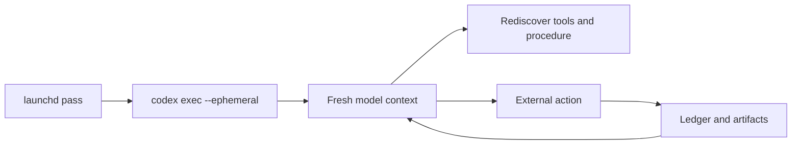
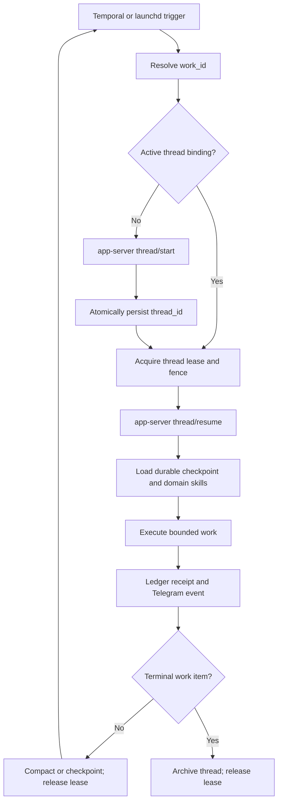

# Life Manager Persistent Agent Runtime — Fleet SSOT

**Status:** Accepted; implementation TODO is sequential and atomic.

**Supersedes:** The blanket fresh/ephemeral-agent rule in
`2026-07-19-anicca-one-repo-consolidation-spec.md` for judgment-bearing work that
continues across runs. Deterministic probes, extraction, validation, and isolated
repair evaluation remain ephemeral.

**Primary off-the-shelf runtime:** `codex app-server`. Do not build a custom
conversation server. Temporal owns durable workflow timing and retries; domain
Ledgers own business truth; Browser Harness owns learned browser procedures;
Keychain owns credentials; Symphony owns isolated repair orchestration.

## 1. Overview — What and Why

Life Manager currently launches several judgment-bearing loops through
`codex exec --ephemeral`. Job Hunter, Gig Work, and Writer therefore preserve
business artifacts but discard the model thread that explains the current goal,
prior tool results, successful procedures, and unfinished reasoning. Each pass can
re-read durable state, but repeatedly rediscovers commands and may contradict the
previous pass.

The fleet MUST persist one agent thread per continuing work item and resume that
thread after schedule boundaries, crashes, missing-information waits, and repair.
This is working memory, not business truth. Side-effect authority remains in the
existing Ledger, intent, idempotency key, browser fence, and provider receipt.

The runtime MUST reuse existing products instead of recreating them:

| Concern | Owner |
|---|---|
| Agent thread lifecycle, compaction, streamed events, MCP startup | Codex app-server |
| Durable timers, retries, signals, and workflow resumption | Temporal |
| Application/order/article/connector truth and idempotency | Domain Ledger |
| Browser connection and learned site procedures | Browser Harness domain skills |
| Passwords, tokens, and account credentials | macOS Keychain; tenant vault in cloud |
| Isolated diagnosis, patch, and canary repair | OpenAI Symphony + Terra |
| Phone-visible progress and results | Telegram outbox |

Official references:

- Codex app-server: https://github.com/openai/codex/blob/main/codex-rs/app-server/README.md
- Codex SDK thread persistence: https://github.com/openai/codex/tree/main/sdk/typescript
- Browser Harness: https://github.com/browser-use/browser-harness
- Temporal: https://docs.temporal.io/
- OpenAI Agents SDK sessions for the multi-tenant web runtime:
  https://openai.github.io/openai-agents-python/sessions/
- OpenAI Symphony repair plane: https://github.com/openai/symphony
- Hermes comparison pilot: https://github.com/NousResearch/hermes-agent

## 2. Acceptance Criteria

1. Every continuing work item has exactly one active `thread_id` for its current
   generation, stored beside its domain ID and never inferred from model prose.
2. A scheduled pass resumes the stored thread through `thread/resume`; it does not
   call `codex exec --ephemeral` for continuing judgment-bearing work.
3. A genuinely new work item starts one thread and atomically records the returned
   ID before the first external side effect.
4. Job application, gig order, article/publication, adaptive connector incident,
   interview, and repair case use distinct work-scoped threads.
5. Concurrent owners cannot resume the same active thread. A lease and monotonic
   fence identify the sole holder.
6. Thread loss or app-server restart does not lose business truth. The runtime can
   create a successor thread from a sanitized durable checkpoint and records the
   predecessor/successor relation.
7. Context pressure invokes app-server compaction and stores a checkpoint receipt;
   it does not discard the work item or silently start an unrelated thread.
8. Successful non-obvious browser procedures become content-addressed Browser
   Harness domain skills and are loaded before the next matching browser action.
9. Secrets never enter thread history, prompts, shell arguments, Telegram, traces,
   or committed files. Threads contain credential references only.
10. Every start, resume, compact, fork, archive, failure, and successor event joins
    `work_id`, `thread_id`, workflow/run ID, actor PID, release SHA, and fence.
11. Telegram reports meaningful start, wait, resume, repair, and terminal events and
    deduplicates identical state.
12. An executable fleet proof demonstrates Job Hunter and Gig Work each resuming the
    same thread after process exit without repeating a known question or procedure.

## 3. As-Is / To-Be

### As-Is

### To-Be

### Work identity contract

| Work type | Stable work ID | Thread terminal condition |
|---|---|---|
| Job application | `application_id` | confirmed submission, durable no-retry ambiguity, withdrawal, rejection, or role closure |
| Gig work | `order_id` or buyer conversation ID | paid/closed/cancelled dispute-terminal order |
| Writer | `article_id` plus publication ID | published/accepted/rejected/withdrawn terminal artifact |
| Adaptive connector | `connector_incident_id` | verified recovery or terminal credential revocation |
| Interview | `interview_id` | completed plus debrief, cancelled, or hiring process terminal |
| Repair | `repair_case_id` | promoted, rejected, rolled back, or duplicate case |

### Thread binding

Each binding MUST contain:

- `work_type`, `work_id`, `generation`
- `thread_id`, `status`, `predecessor_thread_id`
- `created_at`, `last_resumed_at`, `compacted_at`, `archived_at`
- `holder_id`, `lease_id`, `fence`, `lease_expires_at`
- `checkpoint_uri`, `checkpoint_sha256`
- `runtime_release_sha`, `last_run_id`, `last_workflow_id`

The unique active key is `(work_type, work_id, generation, status=active)`.

## 4. Test Matrix

| # | To-Be | Test / proof | Cover |
|---|---|---|---|
| 1 | Start and persist one thread | `test_thread_start_binding_atomic` | OK |
| 2 | Resume after process exit | `test_thread_resume_after_runner_exit` | OK |
| 3 | Sole-owner lease and fence | `test_thread_concurrent_resume_fenced` | OK |
| 4 | Business truth independent of thread | `test_missing_thread_preserves_domain_ledger` | OK |
| 5 | Successor from checkpoint | `test_thread_successor_records_lineage` | OK |
| 6 | Compaction receipt | `test_thread_compaction_checkpoint` | OK |
| 7 | Domain skill loaded before browser | `test_domain_skill_precedes_browser_action` | OK |
| 8 | Secret-reference-only boundary | `test_thread_artifacts_contain_no_secret_values` | OK |
| 9 | Joined observability | `test_thread_event_join_keys_complete` | OK |
| 10 | Telegram event dedupe | `test_thread_telegram_event_dedupe` | OK |
| 11 | Job Hunter live resume | real no-duplicate application resume receipt | OK |
| 12 | Gig Work live resume | real no-repeat order/conversation resume receipt | OK |

| Item | Value |
|---|---|
| UI変更 | なし。Telegram event wordingのみ変化 |
| 結論 | Maestro: 不要（macOS resident runtime、Ledger、browser、TelegramのE2Eで判定） |

## 5. Boundaries

- Thread history MUST NOT replace a domain Ledger or authorize side effects.
- This spec MUST NOT migrate the fleet to LangGraph, Mastra, OpenClaw, or Hermes.
- Hermes is an isolated comparison after the app-server baseline works; it cannot
  own production scheduling, Ledger truth, or Submit/payment/publish authority.
- Connector polling and deterministic transforms remain stateless when no continuing
  judgment exists.
- Raw browser cookies and passwords are not agent memory.
- Vector retrieval is not a substitute for a resumable work thread.
- One global user thread is forbidden; memory is scoped by work item and tenant.

## 6. Atomic Execution Steps — Todo SSOT

Only the first unchecked item is active.

1. [ ] **PERSIST-01 — App-server spike.** Start one local app-server, initialize,
   start a thread, record its ID, stop the client, resume it, run a second turn, and
   capture structured events. No external side effect.
2. [ ] **PERSIST-02 — Binding store.** Add the common thread-binding schema, atomic
   start/resume/archive operations, active uniqueness, lease, and fence.
3. [ ] **PERSIST-03 — Thin runtime adapter.** Expose start, resume, compact, fork,
   read, archive, and event streaming without recreating app-server behavior.
4. [ ] **PERSIST-04 — Secret boundary.** Connect credential references to macOS
   Keychain and prove no secret appears in prompts, argv, artifacts, or traces.
5. [ ] **PERSIST-05 — Job Hunter canary.** Replace only the Job Hunter application
   lane's `codex exec --ephemeral`; preserve Ledger, browser fence, exact Submit
   authority, Gmail, Telegram, and immutable release contracts. Before any resident
   kickstart, deterministically filter terminal/canonical-alias duplicates, generate
   the private Ashby answers artifact from stored profile facts, and connect the
   selected application through material, intent, and fence to the existing Ashby
   CLI. The canary MUST reach `pre_submit_ready` with Submit disabled.
6. [ ] **PERSIST-06 — Job Hunter restart proof.** Exit between two non-side-effect
   form steps, resume the same thread/application, and prove no repeated question,
   command rediscovery, page-owner collision, or duplicate Submit.
7. [ ] **PERSIST-07 — Compaction and successor.** Prove compact/resume, then simulate
   missing thread storage and create one checkpoint-derived successor with lineage.
8. [ ] **PERSIST-08 — Gig Work canary.** Bind one real continuing order/conversation
   to a persistent thread and prove process-exit resume without repeated buyer work.
9. [ ] **PERSIST-09 — Writer canary.** Bind one article/publication and preserve
   research, editorial decisions, platform state, and terminal receipt across runs.
10. [ ] **PERSIST-10 — Adaptive Connector canary.** Persist only incident diagnosis;
    keep ordinary polling and synchronization deterministic and stateless.
11. [ ] **PERSIST-11 — Temporal ownership.** Move persistent work triggers and waits
    to restart-safe workflows while app-server remains the reasoning runtime.
12. [ ] **PERSIST-12 — Repair integration.** Bind each Symphony repair case to its
    own thread; Terra diagnoses and patches, deterministic gates verify, then the
    original work thread resumes.
13. [ ] **PERSIST-13 — Fleet migration.** Remove `codex exec --ephemeral` from every
    continuing judgment-bearing production lane; retain it only on an explicit
    allowlist of isolated probes and evaluations.
14. [ ] **PERSIST-14 — Hermes comparison.** Replay the same sanitized fixtures on
    Hermes and app-server; adopt only measured improvements in skill learning,
    memory retrieval, cost, or recovery. No production cutover without parity.
15. [ ] **PERSIST-15 — Freeze.** Publish the runtime contract, supported work types,
    observability query, rollback path, and executable fleet receipts.

### Execution and verification commands

Implementation tasks MUST use the repository's focused test for the touched adapter,
then the common runtime suite, then one isolated no-side-effect E2E before a live
canary. Exact commands are recorded by each task because the app-server adapter does
not exist before `PERSIST-03`.

Release order is Job Hunter → Gig Work → Writer → adaptive Connector. Each canary
MUST be independently reversible and MUST NOT change the domain side-effect fence.

### No broken-run gate

Do not activate or kickstart another Job Hunter resident release until
`PERSIST-01` through `PERSIST-05` pass. Re-running the known disposable resident to
reconfirm missing answers, missing intent/material/fence, or Workday account handling
is forbidden. The next live resident run occurs only after the subscription-authenticated
app-server thread resumes successfully and the installed no-submit Ashby canary is
`pre_submit_ready`.
