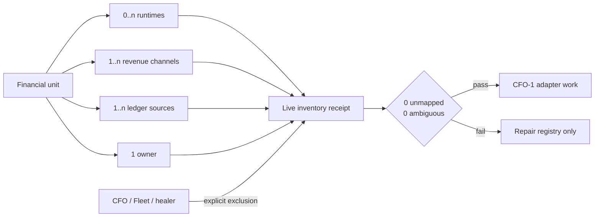

# Life Manager CFO M0 — Financial Unit Registry

| Field | Value |
|---|---|
| Status | APPROVED FOR IMPLEMENTATION |
| Parent SSOT | `docs/superpowers/specs/2026-08-06-life-manager-cfo-design.md` |
| Active item | `CFO-0c` |
| Done | A versioned registry and a live inventory receipt classify every relevant earning runtime exactly once, with zero unexplained financial units or runtime labels |
| Authority | Read-only inventory; no loop, ledger, credential, payment, or scheduler mutation |

## 1. Overview — What and Why

The CFO cannot report business profit until it knows which economic unit owns each revenue, cost, runtime, and
receipt. The Mac currently exposes many launchd jobs, but a job is not a business. Multiple Writer or x402 jobs
belong to one economic unit, while Stripe, Apple, marketplaces, and on-chain settlement are revenue channels.
Franklin instances are agent owners/cost centres. CFO and Fleet are controllers. Treating any of those as separate
businesses would duplicate revenue or cost.

M0 creates two truths:

1. A versioned, non-secret registry in Git defines stable financial units and matching rules.
2. An immutable local inventory receipt records what launchd and canonical ledgers actually exposed during a run.

The registry contains identity and ownership only. It MUST NOT contain balances, revenue totals, secrets, account
numbers, PIDs, last-run timestamps, or copied private ledger payloads. Those belong to later snapshots.

### Evidence behind the boundary

- **OpenTelemetry resource semantic conventions** — https://opentelemetry.io/docs/specs/semconv/resource/
  Core quote: “Service — Logical grouping of components.”
  Decision: many runtime components may map to one stable financial unit; runtime identity is not economic identity.
- **FinOps Foundation, Managing Shared Cloud Costs** — https://www.finops.org/wg/identifying-shared-costs/
  Core quote: “links common infrastructure spend to specific business value.”
  Decision: shared CFO, Fleet, and model-subscription costs remain shared until a versioned allocation rule maps them.
- **FinOps Foundation, Managing Shared Cloud Costs** — same source.
  Core quote: “combining multiple types of shared cost strategies with multiple approaches to splitting shared
  costs can quickly become complicated.”
  Decision: M0 records attribution targets only; cost allocation is deferred to CFO-2 and uses one explicit method.
- **Writer Agent SSOT** — `docs/writer-agent/WRITER-AGENT-SSOT.md`.
  Core rule: only external publisher/payment receipts are revenue; views, publication, and test payments are not.
- **Affiliate Agent SSOT** — `docs/affiliate-agent/AFFILIATE-AGENT-SSOT.md`.
  Core rule: Affiliate commission remains separate from Writer revenue even when both observe the same market.

## 2. Acceptance Criteria

- [ ] One registry version contains exactly seven initial financial units in stable display order.
- [ ] Each unit has `financial_unit_id`, `unit_kind`, localized names, one economic `owner_ref`, zero or more
      `cost_center_refs`, runtime matchers, revenue channels, ledger sources, lifecycle state, and evidence references.
- [ ] `financial_unit_id` is lowercase snake case, immutable after first receipt, and unique.
- [ ] `unit_kind` is exactly `business` or `personal_income`. `job_income` is `personal_income`; all other initial
      units are `business`.
- [ ] `lifecycle` is exactly `active`, `building`, `planned`, or `retired`. It describes product lifecycle, never
      runtime health or revenue evidence.
- [ ] Every revenue channel belongs to exactly one financial unit. A channel is not rendered as another business.
- [ ] Every relevant live launchd label matches exactly one financial unit or one explicit non-economic exclusion.
- [ ] A label matching zero or multiple targets makes inventory exit non-zero and prevents `CFO-0c` completion.
- [ ] `cfo`, `fleet`, and connector-healing runtimes are explicit shared/controller exclusions, not businesses.
- [ ] `franklin1` and `franklin2` are owners/cost centres under `x402_services`, not duplicate financial units.
- [ ] Registry validation rejects unknown keys, duplicate IDs, duplicate channel IDs, empty evidence, unsafe absolute
      home paths, account numbers, wallet secrets, and mutable financial amounts.
- [ ] The live inventory writes one append-only JSON receipt below the Life Manager state root using an atomic,
      no-overwrite publish operation.
- [ ] Re-running with identical registry and observations produces the same `observation_hash`; it may create a new
      receipt envelope but cannot change an older receipt.
- [ ] The receipt records registry SHA-256, observed label, matched target, observed launchd state, last exit code
      when supplied, source evidence availability, generated time, and unresolved findings.
- [ ] Current lifecycle is evidence-based: no receipt means `unverified`, not zero revenue and not healthy.
- [ ] Inventory performs no launchctl kickstart/stop, network request, database write, ledger write, or Telegram send.
- [ ] A redacted live Mac E2E ends with seven units, zero ambiguous labels, zero unmapped relevant labels, and an
      immutable receipt whose hash verifies after re-read.

## 3. As-Is / To-Be

### As-Is evidence

- launchd exposes multiple `ai.anicca.life-manager-*`, `writer-*`, `hf-gig-*`, and `x402-*` labels.
- `ai.anicca.franklin-loop` and `ai.anicca.franklin2-loop` identify agent runtimes, not independent products.
- Writer and Affiliate already define separate revenue truth in their SSOTs.
- `lm_financial_ledger` is read by the Life Manager panel but producer/schema ownership is incomplete.
- No canonical machine-readable registry currently proves that one runtime/channel maps to one financial unit.

### To-Be model



### Initial canonical registry

| Order | `financial_unit_id` | Kind | User-facing name | Runtime namespace | Revenue truth |
|---:|---|---|---|---|---|
| 1 | `life_manager_saas` | `business` | Life Manager | `ai.anicca.life-manager-*` | Stripe and receipted marketplace/customer payments |
| 2 | `anicca_ios` | `business` | Anicca iOS | iOS/API release services; no launchd requirement | Apple/RevenueCat receipts |
| 3 | `writer_agent` | `business` | Writer Agent | `ai.anicca.writer-*` | Publisher/payment processor receipts |
| 4 | `affiliate_agent` | `business` | Affiliate Agent | Affiliate runtime when installed; absence allowed only as `unverified` | ASP/network commission receipts |
| 5 | `gig_work` | `business` | Gig Work | `ai.anicca.hf-gig-*`, `ai.anicca.gig-outcome-watch` | Marketplace/client payment receipts |
| 6 | `x402_services` | `business` | x402 Services | `ai.anicca.x402-*`, with Franklin runtime ownership | Facilitator/on-chain customer settlement receipts |
| 7 | `job_income` | `personal_income` | Employment Income | `ai.anicca.job-search-*` | Payroll/bank receipts; excluded from business revenue |

### Explicit exclusions

| Matcher | Classification | Cost treatment |
|---|---|---|
| `ai.anicca.cfo-*` | Financial controller | Shared overhead; allocation unavailable until CFO-2 |
| `ai.anicca.fleet-*` | Portfolio observer | Shared overhead; allocation unavailable until CFO-2 |
| `ai.anicca.self-fix-*`, `ai.anicca.connector-healer-*` | Repair infrastructure | Attribute to repaired unit only from a later usage receipt; otherwise shared |
| `ai.anicca.franklin-loop`, `ai.anicca.franklin2-loop` | Agent owner/cost centre | `x402_services`; never separate revenue |

### Registry contract

```json
{
  "schema_version": 1,
  "registry_id": "life_manager_cfo_financial_units",
  "financial_units": [
    {
      "financial_unit_id": "life_manager_saas",
      "unit_kind": "business",
      "display_order": 1,
      "display_name": { "en": "Life Manager", "ja": "Life Manager" },
      "owner_ref": "human:dais",
      "cost_center_refs": [],
      "lifecycle": "active",
      "runtime_matchers": ["ai.anicca.life-manager-*"],
      "revenue_channel_ids": ["stripe_life_manager"],
      "ledger_source_ids": ["lm_financial_ledger"],
      "evidence_refs": ["docs/superpowers/specs/2026-06-21-life-manager-LAUNCH-ORDER.md"]
    }
  ],
  "runtime_exclusions": []
}
```

The implementation contains all seven full rows. The shortened JSON above defines exact field names and types; it
is not permission to omit rows. Globs support only a terminal `*`. Matchers are evaluated by descending literal
prefix length. Multiple matches remain an error even when one prefix is longer.

### Inventory receipt contract

```json
{
  "receipt_version": 1,
  "inventory_id": "<UUIDv4>",
  "generated_at": "<RFC3339 UTC>",
  "registry_sha256": "<64 lowercase hex>",
  "observation_hash": "<64 lowercase hex>",
  "financial_units": [],
  "runtime_observations": [],
  "source_observations": [],
  "unmapped_relevant_labels": [],
  "ambiguous_labels": [],
  "result": "pass"
}
```

Angle-bracket values denote runtime-generated typed values, not product placeholders. `result` is `pass` only when
both finding arrays are empty and every registry row validates. Receipt files live under
`$LIFE_MANAGER_STATE_HOME/cfo/business-inventory/`; the registry never embeds that expanded absolute path.

## 4. Test Matrix

| # | To-Be | Test evidence | Required |
|---:|---|---|---|
| 1 | Seven stable units | Registry fixture returns exact ordered IDs and kinds | PASS |
| 2 | Unique identities | Duplicate unit/channel ID fails validation | PASS |
| 3 | Strict schema | Unknown key, amount field, secret-like field, and unsafe path fail | PASS |
| 4 | Runtime mapping | Representative Life Manager, Writer, Gig, x402, and Job labels map once | PASS |
| 5 | Exclusions | CFO, Fleet, and Franklin labels never create extra businesses | PASS |
| 6 | Ambiguity | Overlapping runtime matchers fail inventory | PASS |
| 7 | Missing mapping | Relevant `ai.anicca.*` earning label fails inventory | PASS |
| 8 | Absent runtime | Anicca iOS and planned Affiliate remain `unverified`, not failed or zero | PASS |
| 9 | Determinism | Same normalized observation produces the same observation SHA-256 | PASS |
| 10 | Immutability | Existing receipt is never overwritten | PASS |
| 11 | Read-only | Test harness observes no process mutation, network, DB, Telegram, or ledger write | PASS |
| 12 | Live Mac E2E | launchctl inventory yields seven units and zero unresolved mappings | PASS |

### E2E judgment

| Item | Value |
|---|---|
| UI change | None |
| Maestro | Not required; no iOS UI changes |
| Real E2E | Required against read-only `launchctl` and canonical source-path existence |
| External side effect | One local append-only inventory receipt only |

## 5. Boundaries

### In scope

- Stable financial-unit identity, revenue-channel ownership, runtime mapping, source references, validation, and a
  read-only live inventory receipt.
- A `personal_income` classification so employment income cannot inflate business revenue.
- Explicit shared/controller and agent-owner exclusions.

### Out of scope

- Reading balances or transaction payloads, calculating P&L, allocating shared costs, OpenTelemetry ingestion,
  Telegram rendering, self-healing, trading, payments, hiring, or stopping any loop.
- Declaring revenue zero from missing receipts or declaring a runtime healthy from launchd registration alone.
- Adding another financial unit without a separate verified economic product or income source.

## 6. Execution Steps

Only these tasks implement CFO-0c. Each task uses RED → GREEN → fresh verification → commit → push before the next.

1. Define the strict registry and validator with seven canonical units and explicit exclusions.
2. Add deterministic runtime/source observation and immutable receipt generation.
3. Run the read-only live Mac inventory; repair registry mappings until unresolved arrays are empty.
4. Record the receipt hash and test evidence, mark CFO-0c complete in the parent SSOT, and leave CFO-0d as the
   only active financial item.

The implementation plan supplies exact files, function signatures, test code, commands, and per-task estimated LOC.
