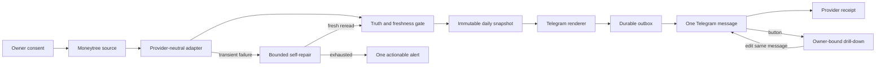
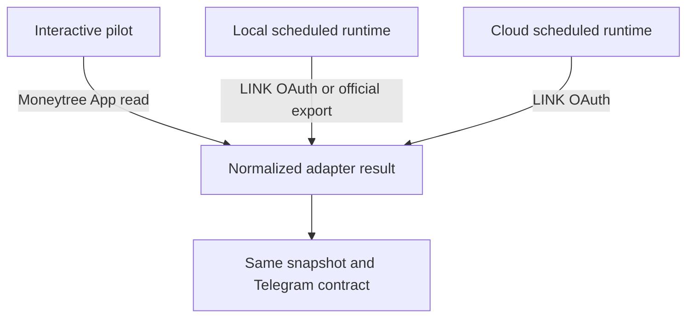
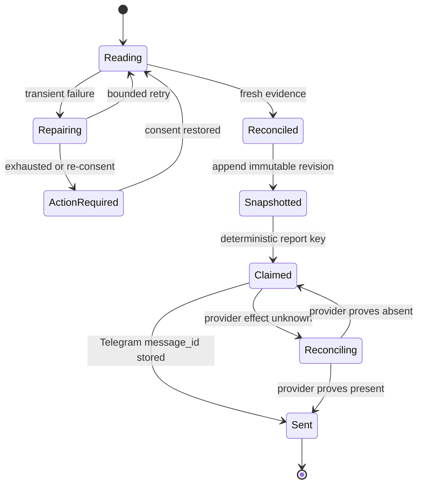

# Life Manager CFO — Moneytree-First Daily Finance Report

| Field | Value |
|---|---|
| Status | APPROVED FOR IMPLEMENTATION |
| Parent SSOT | `docs/superpowers/specs/2026-08-06-life-manager-cfo-design.md` |
| Active item | CFO-0d — Telegram information contract |
| First real source | Moneytree-connected MUFG accounts |
| Deferred | Binance and every write-capable financial action |

## 1. Goal

Ship the smallest truthful CFO loop for one owner first:

> Read Moneytree → reconcile evidence → freeze an immutable daily snapshot → send one readable Telegram report → store the provider receipt.

The report answers, in this order:

1. How much is confirmed now?
2. What changed since the last confirmed snapshot?
3. Is any material source missing or stale?
4. Does the owner need to do one concrete thing?

It does not promise returns, guess missing balances, or mix later business, token-cost, tax, and trading work into the first report.

## 2. Observed Reality

- The installed Moneytree App can read the owner's connected MUFG account during the current interactive Codex session.
- The App connection is not an extractable credential and is not callable from the existing Life Manager Node, OpenClaw, or Railway scheduler.
- The canonical Life Manager runtime already has owner-local scheduling, a durable job/outbox, Telegram send receipts, and duplicate prevention. Those mechanisms are reused rather than copied.
- The existing financial renderer reads wallet/earnings/API-cost sources, not Moneytree. It must not be described as a Moneytree report.
- A failed legacy report receipt is terminal. The CFO runtime therefore needs an explicit retry/correction state rather than inheriting that behavior unchanged.

Official production authorization follows Moneytree LINK OAuth 2.0 Authorization Code with PKCE, tenant-scoped token storage, and least-privilege read scopes. If LINK credentials are unavailable, the only accepted interim ingestion is a deterministic import of an official Moneytree CSV/Excel export. The interactive App is a pilot read path, not the cloud production credential.

Sources:

- Moneytree LINK Getting Started — https://docs.link.getmoneytree.com/docs/getting-started
- Moneytree LINK access token — https://docs.link.getmoneytree.com/docs/obtaining-an-access-token
- Moneytree LINK API scopes — https://docs.link.getmoneytree.com/docs/api-scopes

## 3. Scope

### This slice

- Japanese and English Telegram summary and drill-down contract.
- Moneytree/MUFG assets and connected liabilities only.
- Explicit consent, aggregation freshness, partial-source, stale, unavailable, and re-consent states.
- Immutable owner-local daily snapshot, deterministic retry, superseding correction, and provider message receipt.
- Bounded self-repair followed by a fresh provider read and reconciliation.
- One actionable alert when repair is exhausted.

### Deferred

- Binance, crypto exchange balances, trading, Earn, funding, and tax lots.
- Business P&L, model token/cost truth, spending Nudge, tax reserve, and capital allocation.
- Bank transfer, trade, withdrawal, paid hiring, business shutdown, or any other write capability.
- Browser automation unless official API and official export paths are both unavailable.

## 4. Architecture



The runtime boundary stays simple:



## 5. Provider-Neutral Boundary

The adapter returns normalized evidence, never raw provider payloads:

```js
readFinancialSource({ ownerId, reportingDate, now }) => {
  sourceId,
  consent: "valid" | "expired" | "revoked" | "unknown",
  freshness: "fresh" | "stale" | "unavailable",
  asOf,
  accounts: [{ accountRef, label, kind, currency, balanceMinor, verificationStatus }],
  liabilities: [{ accountRef, label, currency, balanceMinor, verificationStatus }],
  evidenceRef,
  partial,
  actionRequired
}
```

Invariants:

- `accountRef` is an internal opaque identifier; account numbers never enter the result.
- Amounts use integer minor units plus currency.
- `unknown` is distinct from zero.
- `asOf`, consent, freshness, partial status, and evidence reference are mandatory.
- Only a fresh reread after repair may produce `recovered`.
- Read and write credentials are permanently separate. M1 has no write credential.

## 6. Telegram Information Contract

### Views

One message is edited between four owner-bound views:

| View | Answers | Button label |
|---|---|---|
| `summary` | confirmed total, change, freshness, next action | `口座を見る` |
| `accounts` | each connected account/liability with masked label | `正確さを見る` |
| `accuracy` | source time, evidence label, omissions | `なぜこの金額？` |
| `why` | plain-language calculation and exclusions | `概要に戻る` |

`callback_data` is `cfo:<view>:<YYYYMMDD>:<revision>`, contains no owner or account identifier, and remains under Telegram's 64-byte limit. The server authorizes the callback from the Telegram user/chat binding before reading any snapshot.

### User-visible states

| State | Meaning | Telegram behavior |
|---|---|---|
| `complete` | all required M1 sources are fresh and reconciled | one green summary |
| `partial` | a non-required connected source is missing; shown total includes only named confirmed sources | one amber summary; no complete-net-worth claim |
| `recovered` | a transient failure was repaired and a fresh reread reconciled | correct report plus one short repair note |
| `action_required` | bounded repair is exhausted and owner/provider action is necessary | one deduplicated instruction; durable retry continues |

### Evidence labels

- `確定 / Confirmed`: statement, provider billing export, or reconciled receipt.
- `実測 / Measured`: provider response metadata with evidence reference.
- `推定 / Estimated`: documented local calculation.
- `不明 / Unknown`: missing, stale, partial, or contradictory evidence.

OpenTelemetry transports these labels and references; it never promotes an estimate to a measurement.

### Japanese summary examples

Normal:

```text
💰 今日のお金

確認できた資産　¥{confirmed_assets}
確認できた負債　¥{confirmed_liabilities}
差し引き　　　　¥{confirmed_net_worth}
前回から　　　　{change}

✅ Moneytree（三菱UFJ銀行） {as_of}更新
今すること：ありません

[口座を見る] [正確さを見る]
```

Recovered:

```text
💰 今日のお金

差し引き　¥{confirmed_net_worth}
✅ 更新の問題を自動修復し、最新データを再確認しました。
今すること：ありません

[口座を見る] [何を直した？]
```

Action required:

```text
🔐 Moneytreeの接続を1回だけ更新してください

最新の金額を確認できないため、古い残高は合計に入れていません。
接続後は自動で再確認し、今日のレポートを送ります。

[接続を更新] [理由を見る]
```

No message may say “accurate,” “latest,” or “fixed” without a fresh provider read and reconciliation receipt. An unresolved failure never produces an estimated net-worth total from stale data.

## 7. Snapshot and Delivery State



Keys:

- snapshot identity: `(owner_id, reporting_date, revision)`
- stable retry identity: `(owner_id, reporting_date, run_id)`
- report dedupe: `(owner_id, report_kind, reporting_date, revision)`
- correction: append a new revision with `supersedes_revision`; never overwrite an old report
- Telegram receipt: `chat_ref`, `message_id`, `sent_at`, snapshot hash; no text payload or account identifiers

## 8. Self-Heal and User Experience

1. Read the source.
2. On an allowed transient class, repair only the known safe condition.
3. Reread the source from the provider.
4. Reconcile the fresh result.
5. Send the accurate report with a short `自動修復済み` note.
6. If repair is exhausted or consent is required, emit one actionable alert, persist it, and keep bounded durable retries.
7. After recovery, send one corrected report and re-arm the alert state.

The user sees success and truth. Internal stack traces, repeated health noise, guessed totals, and repair attempts remain in owner-observable diagnostics rather than the daily finance message.

## 9. Privacy and Safety

- Never persist or emit raw Moneytree payloads, full account numbers, credentials, cookies, OAuth codes, refresh tokens, browser profiles, or transaction descriptions in logs, Git, specs, OTel spans, prompts, or Telegram receipts.
- Store tenant secrets only in a managed secret store; database rows contain opaque secret references.
- Redacted test fixtures are synthetic and cannot reproduce the owner's real balances or merchant history.
- Every Telegram drill-down is authorized against the owner binding before snapshot lookup.
- M1 code has no transfer, withdrawal, trade, or payment method.

## 10. Acceptance

### CFO-0d — UI contract

- [ ] Pure renderer supports Japanese and English without network or database access.
- [ ] `complete`, `partial`, `recovered`, and `action_required` fixtures render deterministically.
- [ ] `summary`, `accounts`, `accuracy`, and `why` use one fixed callback contract under 64 bytes.
- [ ] Unknown or stale amounts never render as zero or enter a complete-net-worth total.
- [ ] No fixture/output contains full account IDs, credentials, raw payloads, or real owner data.
- [ ] Copy is readable without finance or engineering vocabulary.
- [ ] Existing CFO tests and the normal package test path include the renderer tests.

### M1 — real Moneytree report

- [ ] A fresh Moneytree/MUFG read becomes a redacted normalized source result.
- [ ] Consent, freshness, partial status, connected liabilities, and re-consent are persisted.
- [ ] One immutable owner-local snapshot reconciles the named confirmed sources.
- [ ] One real Telegram message is sent and its provider `message_id` is stored.
- [ ] Re-running the same revision cannot send a duplicate.
- [ ] A transient failure can recover only through fresh reread plus reconciliation.
- [ ] An exhausted failure sends one actionable alert, not repeated daily spam.
- [ ] A second owner-local day completes without manual repair.

## 11. Ordered Implementation

```mermaid
flowchart LR
    A[CFO-0d Telegram contract] --> B[CFO-1a adapter contract]
    B --> C[CFO-1b Moneytree source]
    C --> D[CFO-1b2 consent and liabilities]
    D --> E[CFO-1e Fleet read]
    E --> F[CFO-1f JPY valuation]
    F --> G[CFO-1g immutable snapshot]
    G --> H[CFO-1g2 dedupe and correction]
    H --> I[CFO-1g3 self-heal]
    I --> J[CFO-1h2 truthful renderer gate]
    J --> K[CFO-1h real Telegram receipt]
    K --> L[CFO-1i second-day proof]
```



Each box closes with RED, GREEN, real verification, state update, commit, and push before the next box begins. Binance does not block any M1 box.
