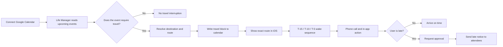
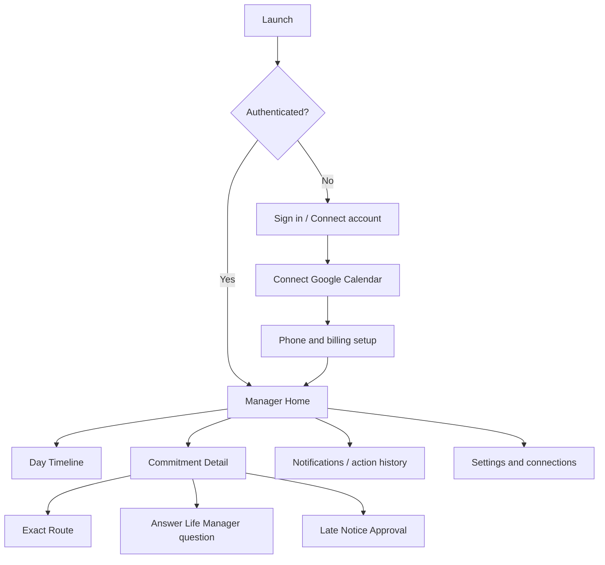

# Life Manager iOS — Mobile App Specification

Status: Ready for implementation in a separate session

## Source of truth

- Current product behavior: `docs/superpowers/specs/2026-06-21-life-manager-CANONICAL.md`
- Current cloud runtime: `apps/life-call/`
- Current web onboarding and account connection: `apps/landing/app/life-manager/`
- Current product name: **Life Manager**

This specification defines the iOS client. It does not replace the existing Life Manager backend or Telegram product.

## 1. Overview — What and why

Life Manager is a life manager, not a chat assistant or a calendar viewer.

People currently have to repeatedly:

1. open Google Calendar to find the event;
2. copy the destination or search it in Google Maps;
3. calculate when to leave;
4. work out the exact route, station, gate, train, transfer, and arrival time;
5. remember to leave and react when the schedule changes.

This creates avoidable mental load and causes late arrivals. The iOS app makes the existing Life Manager experience available on the phone: connect Google Calendar once, then let Life Manager continuously manage the user’s schedule and travel obligations.

The iOS app MUST use the existing Life Manager backend as the decision and execution authority. The app MUST NOT become a second calendar-management engine.

### Product promise

> Life Manager turns your calendar into an operated day. It tells you what matters, when to leave, exactly how to get there, and takes the next action when information is missing or you are late.

### Primary user journey



## 2. Acceptance criteria

### A. Onboarding and account connection

1. The user MUST be able to sign in with Google from the iOS app.
2. The user MUST be able to connect the Google Calendar used by the existing Life Manager account.
3. The app MUST display the connection state as `Connected`, `Action required`, `Error`, or `Disconnected`.
4. The app MUST NOT show the manager dashboard as operational until the calendar connection is confirmed active by the backend.
5. The user MUST be able to add and update the phone number used for Life Manager wake calls.
6. The user MUST see the current subscription state and MUST be directed to the existing Stripe billing flow when payment is required.

### B. Manager home

7. The home screen MUST show the next actionable commitment, not merely a chronological list of every calendar event.
8. Each commitment MUST show event title, local start time, destination, leave time, route status, and the next Life Manager action.
9. Events that do not require travel MUST NOT generate a travel card or wake call.
10. The user MUST be able to open a day timeline showing calendar events and Life Manager-created travel blocks together.
11. The home screen MUST visibly distinguish:
    - `Ready` — route and leave time are known;
    - `Needs information` — Life Manager needs the user to answer a location or duration question;
    - `Leave now` — the departure threshold has been reached;
    - `At risk` — the user may be late;
    - `Completed` — the commitment is no longer actionable.

### C. Exact travel route

12. For a travel event, the app MUST show the actual route returned by the Life Manager route engine, including, where applicable:
    - origin and destination;
    - departure time;
    - walking instructions;
    - station and gate information;
    - exact train or transit service when available;
    - transfer station and transfer action;
    - arrival time;
    - the reason for the calculated leave time.
13. The UI MUST use language such as “Take the 10:12 train from Shibuya Station, Gate B5” when that information is available. It MUST NOT reduce the result to “Recommended train” when the backend has an exact itinerary.
14. If the route engine cannot produce an exact route, the app MUST clearly show `Route unavailable` and the missing reason. It MUST NOT invent a train, gate, platform, or duration.
15. The app MUST show when the route was last refreshed and MUST expose a refresh action.
16. When the destination is missing or ambiguous, the app MUST show the question generated by Life Manager and provide a reply field. The reply MUST be sent to the backend; the iOS client MUST NOT parse the user’s answer into calendar fields locally.

### D. Proactive management

17. The backend MUST remain responsible for the T-15, T-10, and T-5 wake schedule and urgency levels.
18. The iOS app MUST receive a push notification for a Life Manager action and MUST deep-link to the relevant commitment.
19. When the user has a configured phone number, the existing Life Manager phone-call flow MUST remain available. The iOS app MUST NOT replace the phone-call scheduler with local timers.
20. When the user indicates that they are late, the app MUST show the detected event and the proposed attendee message before sending.
21. The attendee message MUST NOT be sent without explicit user approval.
22. After approval, the backend MUST send the message through the existing mail provider and the iOS app MUST display the resulting status.

### E. Reliability, privacy, and tenant isolation

23. Every request MUST be scoped to the authenticated Life Manager user.
24. The app MUST never expose another user’s calendar event, route, phone number, email address, or billing state.
25. A stale or failed backend response MUST be shown as a visible state; the app MUST NOT present stale data as current.
26. Destructive account actions MUST require a confirmation step.
27. The app MUST work read-only when the network is unavailable by showing the last known data and its timestamp. It MUST NOT claim that a route, wake, or message was executed while offline.

## 3. As-is / To-be

| Area | As-is | To-be |
|---|---|---|
| Entry point | Web onboarding and Telegram bot | Native iOS onboarding plus existing web/Telegram parity |
| Calendar | Google Calendar connected through the existing web/backend flow | Same account and backend connection displayed and controlled from iOS |
| Decision engine | `apps/life-call` scheduler, travel, ask, notify, and call loops | Same backend loops; iOS is a client and control surface |
| Schedule view | Calendar data and travel blocks are mainly consumed through Telegram, calls, or web panel | Action-oriented manager home and day timeline |
| Travel | Backend creates `[Travel]` blocks and computes traffic-aware routes | iOS renders the exact backend itinerary: walk, gate, train, transfer, and arrival |
| Missing information | Life Manager asks through Telegram or email and writes the answer back | iOS displays the same question and sends the reply to the backend |
| Wake-up | Backend schedules escalating T-15/T-10/T-5 calls | Existing call schedule remains authoritative; iOS receives deep-linked notifications |
| Late notice | Backend drafts and sends after approval | iOS displays the proposed message, requires approval, and shows delivery status |
| Billing | Existing Stripe flow | iOS opens the existing billing flow and reads server-side entitlement state |
| Local computation | Some historical local logic exists | iOS MUST NOT duplicate travel, ask, notify, wake, or calendar mutation logic |

### Required screen map



### Screen requirements

#### 1. Sign-in and connection

- Google sign-in.
- Google Calendar connection status.
- Phone number setup.
- Subscription/entitlement status.
- Clear blocking state for each incomplete connection.

#### 2. Manager Home

- “Next action” card at the top.
- Today’s actionable commitments below it.
- Leave time and route status on every travel commitment.
- No generic AI chat screen as the primary surface.

#### 3. Commitment Detail

- Event facts from Google Calendar.
- Life Manager state and next action.
- Exact route card.
- Refresh route action.
- Answer-question action when state is `Needs information`.
- Late-notice action when state is `At risk`.

#### 4. Exact Route

- A vertical step list, not a vague map recommendation.
- Every step has a time and place when known.
- Example:

```text
Leave: 08:42
Walk to Shibuya Station — 6 min
Enter through Gate B5
Take the 08:51 Ginza Line train
Transfer at Omote-sando
Exit at Gate A2
Arrive at the event: 09:27
```

- The example above is a UI shape only. The app MUST render actual backend route data and MUST NOT hard-code these values.

#### 5. Late Notice Approval

- Detected commitment.
- Estimated lateness.
- Recipient list.
- Draft message.
- `Approve and send` and `Cancel` actions.
- Sent, failed, and pending states.

#### 6. Settings

- Google Calendar connection.
- Phone number.
- Subscription status.
- Notification and phone-call status.
- Account deletion.

## Data and API contract

The iOS client MUST consume a versioned authenticated mobile API. The implementation session MUST add the API only where the existing `apps/life-call` panel or onboarding contracts do not already provide the required data.

### Required read models

```json
{
  "user": { "id": "string", "name": "string", "timezone": "string" },
  "connections": {
    "calendar": { "status": "connected|action_required|error|disconnected", "provider": "google_calendar" },
    "phone": { "status": "connected|missing", "masked": "string" },
    "billing": { "status": "active|payment_required|past_due" }
  },
  "nextAction": {
    "commitmentId": "string",
    "kind": "leave|answer_question|approve_late_notice|none"
  },
  "commitments": []
}
```

### Commitment shape

```json
{
  "id": "string",
  "calendarEventId": "string",
  "title": "string",
  "start": "ISO-8601",
  "end": "ISO-8601",
  "location": "string|null",
  "state": "ready|needs_information|leave_now|at_risk|completed",
  "leaveAt": "ISO-8601|null",
  "route": {
    "status": "exact|unavailable|refreshing",
    "refreshedAt": "ISO-8601|null",
    "steps": [
      {
        "sequence": 1,
        "mode": "walk|train|subway|bus|transfer|other",
        "instruction": "string",
        "departAt": "ISO-8601|null",
        "arriveAt": "ISO-8601|null",
        "station": "string|null",
        "gate": "string|null",
        "service": "string|null"
      }
    ]
  },
  "pendingQuestion": { "id": "string", "prompt": "string" },
  "lateNotice": { "status": "none|draft|approved|sent|failed" }
}
```

The backend MUST be the source of truth for `state`, `leaveAt`, `route`, `pendingQuestion`, and `lateNotice`.

### Required actions

| Action | Client behavior | Server behavior |
|---|---|---|
| Refresh route | Show loading and retain last known route | Recompute through the existing route engine and return a new timestamp |
| Answer question | Send free-text answer | Resolve location/duration and patch the real calendar event |
| Approve late notice | Require confirmation | Send the approved message to attendees |
| Cancel late notice | Remove pending approval UI | Keep the draft unsent and record cancellation |
| Disconnect calendar | Require confirmation | Disconnect only the authenticated user’s provider connection |

## 4. Test matrix

Every To-be item has an OK path.

| # | To-be behavior | Test name | OK coverage |
|---:|---|---|---|
| 1 | Google sign-in and calendar connection | `test_onboarding_connects_google_calendar` | Connected state appears only after active backend confirmation |
| 2 | Connection failure is visible | `test_calendar_error_is_actionable` | Error state contains reconnect action |
| 3 | Phone and billing state | `test_setup_blocks_operational_dashboard_until_ready` | Missing required setup is shown before manager is active |
| 4 | Action-oriented home | `test_home_shows_next_actionable_commitment` | Next action is first and actionable |
| 5 | Travel filtering | `test_non_travel_event_has_no_travel_card_or_wake` | At-home/routine event produces no travel action |
| 6 | Day timeline | `test_timeline_merges_calendar_and_travel_blocks` | Real event and Life Manager travel block are ordered correctly |
| 7 | Exact route rendering | `test_route_renders_walk_gate_train_transfer_and_arrival` | Every returned route step is rendered with its fields |
| 8 | Route honesty | `test_unavailable_route_is_not_invented` | Missing route data produces unavailable state, not fabricated instructions |
| 9 | Route refresh | `test_route_refresh_updates_timestamp` | Refresh returns and displays new backend timestamp |
| 10 | Missing information | `test_question_reply_is_sent_to_backend` | Client sends answer; backend owns calendar mutation |
| 11 | Wake notification deep link | `test_wake_notification_opens_commitment` | Notification opens the matching detail screen |
| 12 | Late approval | `test_late_notice_requires_explicit_approval` | No send occurs before approval |
| 13 | Late delivery result | `test_late_notice_status_is_displayed` | Sent/failed status is visible after backend result |
| 14 | Tenant isolation | `test_user_cannot_read_other_user_commitment` | Cross-user request is rejected |
| 15 | Offline behavior | `test_offline_state_is_timestamped_and_read_only` | Cached data is labeled; mutation is not falsely reported successful |
| 16 | Account deletion | `test_account_deletion_requires_confirmation` | No deletion on a single accidental tap |

### iOS UI / E2E judgment

| Item | Value |
|---|---|
| UI変更 | あり |
| 結論 | Maestro: 必要。オンボーディング、deep link、route detail、late approvalは実機に近いUI遷移とバックエンド状態を確認する必要がある。 |
| Required E2E | `onboarding → calendar connected → home → commitment detail → exact route → late approval` |
| Native test | XCTest/Swift Testing for view models, decoding, state transitions, and offline behavior |

## 5. Boundaries

### In scope

- Native iOS client for the existing Life Manager product.
- Google sign-in and Google Calendar connection state.
- Manager Home, Day Timeline, Commitment Detail, Exact Route, Late Notice Approval, and Settings.
- Push notification deep links.
- Existing backend scheduler, travel, ask, notify, call, billing, and tenant isolation.
- Exact route rendering from real backend route data.

### Out of scope

- Replacing Google Calendar.
- Implementing a new route planner inside Swift.
- Implementing a second wake scheduler on the device.
- Replacing Telnyx/Gemini phone calls with local iOS timers.
- A general-purpose conversational assistant screen.
- Job Hunter.
- Telegram bot redesign.
- New billing provider.
- Fabricated demo route data in production.
- Offline calendar mutation or offline message sending.

## 6. Execution steps

The implementation session MUST follow this order:

1. Inspect the current `apps/life-call` routes, panel API, auth, and existing iOS project conventions.
2. Create the mobile API contract and server-side tenant/auth tests before building screens.
3. Build the iOS onboarding and connection-state flow.
4. Build the Manager Home and Day Timeline from the server read model.
5. Build Commitment Detail and Exact Route rendering.
6. Add question replies and late-notice approval actions.
7. Add push notification registration and commitment deep links.
8. Add XCTest/Swift Testing coverage for decoding and state transitions.
9. Add Maestro coverage for the complete user journey.
10. Run real backend E2E with a controlled Google Calendar event and a real route response.
11. Verify that no fake, mock, or simulated success appears in production paths.
12. Update the canonical Life Manager specification and commit/push the implementation.

### Verification commands

The implementation session MUST record the actual commands used. At minimum:

```bash
cd apps/life-call && npm test
xcodebuild test -scheme LifeManager -destination 'platform=iOS Simulator,name=iPhone 16'
maestro test maestro/life-manager-ios.yaml
```

If the existing iOS project uses a different scheme or test path, the implementation session MUST use the actual scheme and record the replacement in the implementation notes.

## Definition of done

The iOS version is complete only when a real user can connect Google Calendar, see an actionable upcoming commitment, open an exact route containing the actual transit steps, receive a deep-linked Life Manager action, answer a missing-information question, and approve a late notice without opening Telegram or Google Maps.

The backend remains the manager. The iPhone is the manager’s native operating surface.
