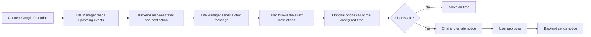
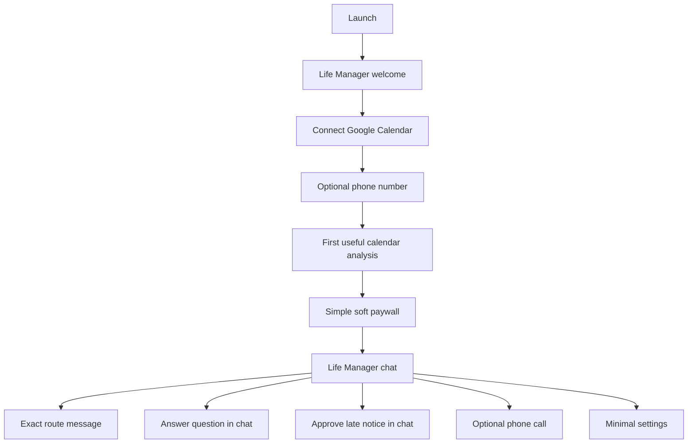

# Life Manager iOS — Mobile App Specification

Status: Ready for implementation in a separate session

## Source of truth

- Current product behavior: `docs/superpowers/specs/2026-06-21-life-manager-CANONICAL.md`
- Current cloud runtime: `apps/life-call/`
- Current web onboarding and account connection: `apps/landing/app/life-manager/`
- Current product name: **Life Manager**

This specification defines the iOS client. It does not replace the existing Life Manager backend or Telegram product.

## 1. Overview — What and why

Life Manager is a life manager delivered through a simple chat interface. It is not a calendar viewer, route-planning dashboard, or general-purpose chat assistant.

People currently have to repeatedly:

1. open Google Calendar to find the event;
2. copy the destination or search it in Google Maps;
3. calculate when to leave;
4. work out the exact route, station, gate, train, transfer, and arrival time;
5. remember to leave and react when the schedule changes.

This creates avoidable mental load and causes late arrivals. The iOS app makes the existing Life Manager experience available on the phone: connect Google Calendar once, then receive only the information and actions needed at the right time.

The iOS app MUST use the existing Life Manager backend as the decision and execution authority. The app MUST NOT become a second calendar-management engine.

### Product promise

> Life Manager turns your calendar into a managed day. It tells you what matters, when to leave, exactly how to get there, and takes the next action when information is missing or you are late.

### Primary user journey



## 2. Acceptance criteria

### A. Minimal onboarding

1. The app MUST open with a simple Life Manager welcome screen and MUST NOT show a separate Google login screen.
2. The app MUST provide one primary action: `Connect Google Calendar`.
3. The Google Calendar OAuth flow MAY use Google authentication internally, but the product experience MUST be described as connecting a calendar, not creating a separate Life Manager login.
4. The app MUST display the connection state as `Connected`, `Action required`, `Error`, or `Disconnected`.
5. The phone number MUST be optional. The user MUST be able to continue without configuring a phone number.
6. The app MUST show a simple subscription offer after the first useful calendar analysis. Free use MUST remain possible in this version; the exact feature split between free and paid MUST NOT be defined in this spec.

### B. Chat-first experience

7. After onboarding, the primary screen MUST be a single Life Manager chat thread.
8. The app MUST NOT require the user to inspect a calendar, timeline, map, route detail screen, or tab navigation to understand the next action.
9. The backend MUST send the next relevant information as a chat message containing the event, leave time, route, and required action.
10. The app MUST display only the information needed for the current action and MUST keep the interface visually close to Telegram.
11. The app MUST support text replies and compact action buttons only when an action is required, such as `Reply`, `Approve`, or `Cancel`.

### C. Exact travel instructions in chat

12. For a travel event, the chat message MUST show the actual route returned by the Life Manager route engine, including, where applicable:
    - origin and destination;
    - departure time;
    - walking instructions;
    - station and gate information;
    - exact train or transit service when available;
    - transfer station and transfer action;
    - arrival time;
    - the reason for the calculated leave time.
13. The UI MUST use language such as “Take the 10:12 train from Shibuya Station, Gate B5” when that information is available. It MUST NOT reduce the result to “Recommended train” when the backend has an exact itinerary.
14. If the route engine cannot produce an exact route, the app MUST clearly show `Route unavailable` and the missing reason. It MUST NOT invent a train, gate, platform, or duration.
15. If the route engine cannot produce an exact route, the chat MUST clearly show `Route unavailable` and the missing reason. It MUST NOT invent a train, gate, platform, or duration.
16. When the destination is missing or ambiguous, the chat MUST show the question generated by Life Manager and provide a reply field. The reply MUST be sent to the backend; the iOS client MUST NOT parse the user’s answer into calendar fields locally.

### D. Backend-managed actions

17. The backend MUST remain responsible for calendar reading, travel calculation, calendar mutation, message timing, and all business decisions.
18. The iOS app MUST receive push notifications that open the Life Manager chat, not a separate calendar or route flow.
19. When a phone number is configured, the existing Life Manager phone-call flow MUST remain available. The call is an optional delivery channel, not a local iOS wake timer.
20. When the user is late, the chat MUST show the detected event and proposed attendee message before sending.
21. The attendee message MUST NOT be sent without explicit user approval.
22. After approval, the backend MUST send the message through the existing mail provider and the chat MUST display the resulting status.

### E. Reliability, privacy, and tenant isolation

23. Every request MUST be scoped to the authenticated Life Manager user.
24. The app MUST never expose another user’s calendar event, route, phone number, email address, or billing state.
25. A stale or failed backend response MUST be shown as a visible chat state; the app MUST NOT present stale data as current.
26. The app MUST work read-only when the network is unavailable by showing the last known messages and timestamp. It MUST NOT claim that a route, call, or message was executed while offline.

## 3. As-is / To-be

| Area | As-is | To-be |
|---|---|---|
| Entry point | Web onboarding and Telegram bot | Native iOS onboarding with one `Connect Google Calendar` action |
| Identity | Existing web and Telegram identity flows | Calendar connection identifies the user; no separate Google login screen |
| Decision engine | `apps/life-call` scheduler, travel, ask, notify, and call loops | Same backend loops; iOS is a client and control surface |
| Schedule view | Calendar data and travel blocks are mainly consumed through Telegram, calls, or web panel | One chronological Life Manager chat thread |
| Travel | Backend creates `[Travel]` blocks and computes traffic-aware routes | Backend sends the exact itinerary as a chat message |
| Missing information | Life Manager asks through Telegram or email and writes the answer back | iOS displays the same question in chat and sends the reply to the backend |
| Calls | Backend schedules calls | Existing call schedule remains authoritative; phone number is optional |
| Late notice | Backend drafts and sends after approval | Chat displays the proposed message and approval action |
| Billing | Existing Stripe flow | Simple soft paywall; free use remains possible and entitlements are intentionally undefined |
| Local computation | Some historical local logic exists | iOS MUST NOT duplicate travel, ask, notify, wake, or calendar mutation logic |

### Required experience map



### Screen requirements

#### 1. Welcome and calendar connection

- One product explanation.
- One primary action: `Connect Google Calendar`.
- No separate Google login page in Life Manager UI.
- Connection failure and reconnect state.

#### 2. Optional phone setup

- Phone number field with `Skip for now`.
- Explanation: phone calls make Life Manager more forceful, but the chat experience works without them.

#### 3. Soft paywall

- Shown after the first useful analysis, not before the user sees value.
- `Continue with free` MUST remain available.
- `Upgrade` MUST open the existing billing flow.
- This spec MUST NOT decide which individual features are free or paid.

#### 4. Life Manager chat

- One full-screen conversation.
- No bottom tab navigation.
- No calendar grid.
- No separate route screen.
- No map screen as a required path.
- Messages arrive from the backend and remain in chronological order.
- Action buttons appear inside the relevant message only.

#### 5. Exact route message

- The route is a rich chat message, not a separate page.
- Every step has a time and place when known.
- Example:

```text
Leave: 08:42
Walk to Shibuya Station — 6 min
Enter through Gate B5
Take the 08:51 Ginza Line train
Transfer at Omote-sando
Exit at Gate A2
Arrive at the event: 09:27
```

- The example above is a UI shape only. The app MUST render actual backend route data and MUST NOT hard-code these values.

#### 6. Late notice message

- Detected commitment.
- Estimated lateness.
- Recipient list.
- Draft message.
- `Approve and send` and `Cancel` actions inside the chat.
- Sent, failed, and pending states.

#### 7. Minimal settings

- Calendar connection status.
- Optional phone number.
- Subscription status.
- Account deletion.

## Data and API contract

The iOS client MUST consume a versioned authenticated mobile API. The implementation session MUST add the API only where the existing `apps/life-call` panel or onboarding contracts do not already provide the required data.

### Required read models

```json
{
  "user": { "id": "string", "name": "string", "timezone": "string" },
  "connections": {
    "calendar": { "status": "connected|action_required|error|disconnected", "provider": "google_calendar" },
    "phone": { "status": "connected|missing", "masked": "string" },
    "billing": { "status": "active|payment_required|past_due" }
  },
  "subscriptionOffer": { "status": "available|not_available|unknown" }
}
```

### Chat message shape

```json
{
  "id": "string",
  "createdAt": "ISO-8601",
  "kind": "welcome|status|route|question|call|late_notice|error|system",
  "text": "string",
  "commitmentId": "string|null",
  "route": {},
  "actions": [
    { "id": "approve|cancel|reply|refresh|upgrade", "label": "string" }
  ],
  "status": "sent|pending|failed|completed"
}
```

The backend MUST provide the chronological chat stream. The iOS client MUST render it and send user actions back to the backend. The client MUST NOT decide which event is next.

### Commitment shape

```json
{
  "id": "string",
  "calendarEventId": "string",
  "title": "string",
  "start": "ISO-8601",
  "end": "ISO-8601",
  "location": "string|null",
  "state": "ready|needs_information|leave_now|at_risk|completed",
  "leaveAt": "ISO-8601|null",
  "route": {
    "status": "exact|unavailable|refreshing",
    "refreshedAt": "ISO-8601|null",
    "steps": [
      {
        "sequence": 1,
        "mode": "walk|train|subway|bus|transfer|other",
        "instruction": "string",
        "departAt": "ISO-8601|null",
        "arriveAt": "ISO-8601|null",
        "station": "string|null",
        "gate": "string|null",
        "service": "string|null"
      }
    ]
  },
  "pendingQuestion": { "id": "string", "prompt": "string" },
  "lateNotice": { "status": "none|draft|approved|sent|failed" }
}
```

The backend MUST be the source of truth for `state`, `leaveAt`, `route`, `pendingQuestion`, and `lateNotice`.

### Required actions

| Action | Client behavior | Server behavior |
|---|---|---|
| Reply to chat question | Send free-text answer | Resolve location/duration and patch the real calendar event |
| Refresh route | Send `refresh` action from the route message | Recompute through the existing route engine and append an updated route message |
| Approve late notice | Send `approve` action from the chat message | Send the approved message to attendees |
| Cancel late notice | Send `cancel` action from the chat message | Keep the draft unsent and record cancellation |
| Upgrade | Open existing billing flow | Update server-side entitlement after billing result |
| Disconnect calendar | Require confirmation in settings | Disconnect only the authenticated user’s provider connection |

## 4. Test matrix

Every To-be item has an OK path.

| # | To-be behavior | Test name | OK coverage |
|---:|---|---|---|
| 1 | Calendar connection without a separate login screen | `test_onboarding_connects_google_calendar` | Calendar consent completes and active state appears |
| 2 | Connection failure is visible | `test_calendar_error_is_actionable` | Error state contains reconnect action |
| 3 | Optional phone setup | `test_phone_setup_can_be_skipped` | User reaches chat without a phone number |
| 4 | Simple soft paywall | `test_paywall_keeps_free_path_available` | User can continue free or open upgrade |
| 5 | Chat is the primary surface | `test_chat_is_the_only_primary_navigation` | No calendar grid, tabs, or required route screen appears |
| 6 | Backend message stream | `test_chat_renders_backend_messages_in_order` | Messages appear chronologically with server IDs |
| 7 | Exact route rendering | `test_route_message_renders_walk_gate_train_transfer_and_arrival` | Every returned route step appears in chat |
| 8 | Route honesty | `test_unavailable_route_is_not_invented` | Missing route data produces an error message, not fabricated instructions |
| 9 | Route refresh in chat | `test_route_refresh_appends_updated_message` | Refresh action produces a new backend message |
| 10 | Missing information | `test_question_reply_is_sent_to_backend` | Client sends answer; backend owns calendar mutation |
| 11 | Call is optional | `test_chat_works_without_phone_number` | User receives chat actions without a phone call |
| 12 | Late approval | `test_late_notice_requires_explicit_approval` | No send occurs before approval |
| 13 | Late delivery result | `test_late_notice_status_is_displayed_in_chat` | Sent/failed status is visible in the thread |
| 14 | Tenant isolation | `test_user_cannot_read_other_user_messages` | Cross-user request is rejected |
| 15 | Offline behavior | `test_offline_chat_is_timestamped_and_read_only` | Cached messages are labeled; mutation is not falsely reported successful |
| 16 | Account deletion | `test_account_deletion_requires_confirmation` | No deletion on a single accidental tap |

### iOS UI / E2E judgment

| Item | Value |
|---|---|
| UI変更 | あり |
| 結論 | Maestro: 必要。オンボーディング、deep link、route detail、late approvalは実機に近いUI遷移とバックエンド状態を確認する必要がある。 |
| Required E2E | `onboarding → calendar connected → optional phone → soft paywall → chat route message → late approval` |
| Native test | XCTest/Swift Testing for view models, decoding, state transitions, and offline behavior |

## 5. Boundaries

### In scope

- Native iOS client for the existing Life Manager product.
- Google Calendar connection state without a separate Google login experience.
- One Telegram-like Life Manager chat thread.
- Exact route, missing-information, call, and late-notice messages.
- Optional phone number setup.
- Simple soft paywall with a free path and existing upgrade path.
- Push notification opening the Life Manager chat.
- Existing backend scheduler, travel, ask, notify, call, billing, and tenant isolation.
- Exact route rendering inside the chat from real backend route data.

### Out of scope

- Replacing Google Calendar.
- Implementing a new route planner inside Swift.
- Implementing a second wake scheduler on the device.
- Replacing Telnyx/Gemini phone calls with local iOS timers.
- A general-purpose AI assistant.
- Calendar grid, day timeline, bottom tabs, or a route detail screen.
- Job Hunter.
- Telegram bot redesign.
- New billing provider.
- Fabricated demo route data in production.
- Offline calendar mutation or offline message sending.

## 6. Execution steps

The implementation session MUST follow this order:

1. Inspect the current `apps/life-call` routes, Telegram message contracts, auth, and existing iOS project conventions.
2. Create the versioned chat API contract and server-side tenant/auth tests before building screens.
3. Build the minimal onboarding: welcome, calendar connection, optional phone, and soft paywall.
4. Build one Telegram-like chat thread from the server message stream.
5. Render exact route messages, question messages, call messages, and late-notice messages.
6. Add action buttons only inside the relevant chat message.
7. Add push notification registration that opens the chat thread.
8. Add XCTest/Swift Testing coverage for message decoding, action dispatch, and offline states.
9. Add Maestro coverage for the complete chat-first user journey.
10. Run real backend E2E with a controlled Google Calendar event and a real route response.
11. Verify that no fake, mock, or simulated success appears in production paths.
12. Update the canonical Life Manager specification and commit/push the implementation.

### Verification commands

The implementation session MUST record the actual commands used. At minimum:

```bash
cd apps/life-call && npm test
xcodebuild test -scheme LifeManager -destination 'platform=iOS Simulator,name=iPhone 16'
maestro test maestro/life-manager-ios.yaml
```

If the existing iOS project uses a different scheme or test path, the implementation session MUST use the actual scheme and record the replacement in the implementation notes.

## Definition of done

The iOS version is complete only when a real user can connect Google Calendar, continue through the free path, receive an actionable chat message containing the exact transit steps, answer a missing-information question, receive an optional phone call when configured, and approve a late notice without opening Google Calendar, Telegram, or Google Maps.

The backend remains the manager. The iPhone is a minimal, Telegram-like operating surface.
